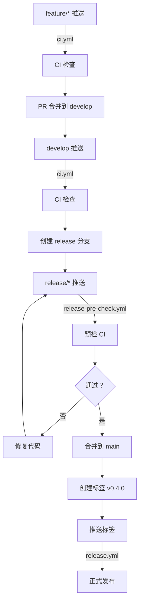

## 📊 修正后的完整触发矩阵

| 操作 | 触发的 Workflow | 执行任务 | 状态 |
|------|----------------|---------|------|
| `git push origin feature/*` | **`ci.yml`** ✅ | code-quality, test, build | **现在会触发** |
| `git push origin develop` | **`ci.yml`** ✅ | code-quality, test, build | 会触发 |
| `git push origin main` | **`ci.yml`** ✅ | code-quality, test, build | 会触发 |
| `git push origin release/*` | **`release-pre-check.yml`** ✅ | code-quality, test, build | 会触发 |
| `git push origin v*` (tags) | **`release.yml`** ✅ | build, publish-github | 会触发 |
| `git push origin main --tags` | **`ci.yml`** + **`release.yml`** | 完整 CI + 发布 | ⚠️ 不推荐（会推送所有标签） |

---

## 🎯 修正后的发布 v0.4.0 流程

### 阶段一：功能开发（已修正）

#### 步骤 1：创建功能分支
```bash
git checkout develop
git pull
git checkout -b feature/v0.4.0-analytics
```

#### 步骤 2：开发功能并推送
```bash
# 进行功能开发
# ... 编写代码 ...

# 提交功能
git add .
git commit -m "feat(analytics): 添加新的数据分析功能"

# 推送到远程 ✅ 现在会触发 ci.yml
git push -u origin feature/v0.4.0-analytics
```

**触发 Workflow**：`ci.yml` ✅  
**执行内容**：
- Code Quality Checks (black, isort, mypy, bandit)
- Tests (Python 3.11, 3.12)
- Build Package

**验证**：
访问 https://github.com/yecllsl/nanobot-runner/actions 查看 CI 状态

---

### 阶段二：功能集成

#### 步骤 3：合并到 develop 分支

**方式 A：使用 Pull Request（推荐）**
```bash
# 在 GitHub 上创建 PR
# base: develop ← compare: feature/v0.4.0-analytics

# CI 会自动运行，通过后合并
```

**方式 B：直接合并（适合个人项目）**
```bash
git checkout develop
git pull
git merge feature/v0.4.0-analytics
git push origin develop
```

---

### 阶段三：发布预检

#### 步骤 4：创建 release 分支
```bash
git checkout develop
git checkout -b release/v0.4.0
```

#### 步骤 5：更新版本号
```bash
# 更新 pyproject.toml, AGENTS.md, README.md
git add pyproject.toml AGENTS.md README.md
git commit -m "chore(version): bump version to 0.4.0"
```

#### 步骤 6：推送 release 分支触发预检
```bash
git push -u origin release/v0.4.0
```

**触发 Workflow**：`release-pre-check.yml`  
**执行内容**：完整 CI 预检（不发布）

---

### 阶段四：正式发布

#### 步骤 7：合并到 main 并打标签
```bash
# 预检通过后
git checkout main
git pull
git merge release/v0.4.0
git tag -a v0.4.0 -m "版本 0.4.0 发布"
git push origin main
git push origin v0.4.0  # ✅ 触发正式发布
```

**触发 Workflow**：`release.yml`  
**执行内容**：
1. Build Package
2. Create GitHub Release
3. Release Summary

---

### 阶段五：发布后处理

#### 步骤 8：合并回 develop 并清理
```bash
git checkout develop
git merge main
git push origin develop

git branch -d release/v0.4.0
git push origin --delete release/v0.4.0
```

---

## 📋 完整的 Workflow 覆盖



---

## ✨ 修改带来的改进

### 修改前的问题
- ❌ 推送 feature 分支不触发 CI
- ❌ 功能开发问题要等到 PR 或合并才被发现
- ❌ 不符合持续集成理念

### 修改后的优势
- ✅ 每次推送 feature 分支都触发 CI
- ✅ 及早发现功能开发中的问题
- ✅ 与 `release-pre-check.yml` 形成完整的分支覆盖
- ✅ 符合"快速反馈"的 CI/CD 最佳实践

---

## 📝 Git 提交状态

**提交信息**：
```
ci(ci.yml): 添加 feature/* 分支到触发条件

- 推送 feature 分支时自动触发 CI Pipeline
- 支持持续集成，及早发现功能开发中的问题
- 与 release-pre-check.yml 形成完整的分支覆盖
```

**推送状态**：
- ✅ 已推送到 `origin/develop`
- Commit ID: `0957dfc`

---

## 🎯 总结

**你的质疑是正确的！** 

原来的配置确实不会触发 `ci.yml`。现在已经修正：
- ✅ `ci.yml` 支持 `feature/*`, `develop`, `main` 分支
- ✅ `release-pre-check.yml` 支持 `release/*` 分支
- ✅ `release.yml` 支持 `tags/v*`

**现在推送 `feature/v0.4.0-analytics` 会触发 CI 检查！** 🎉