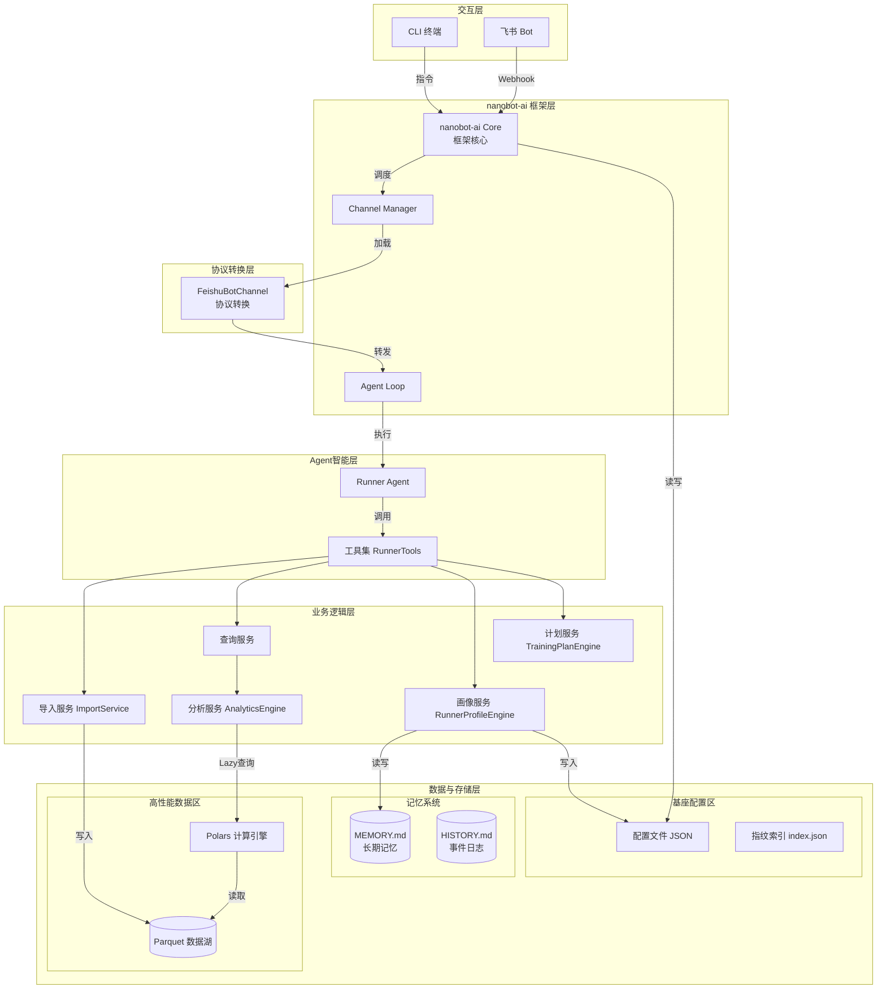
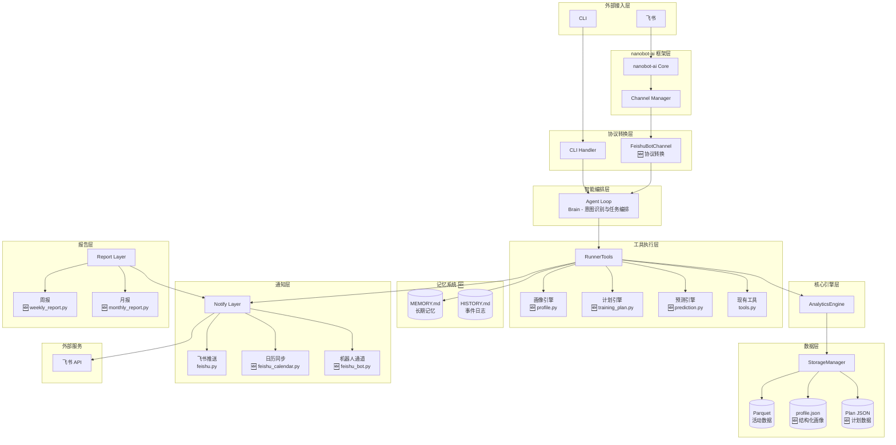
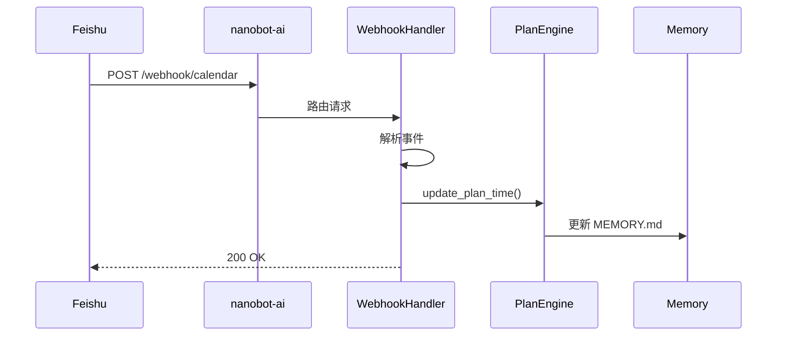
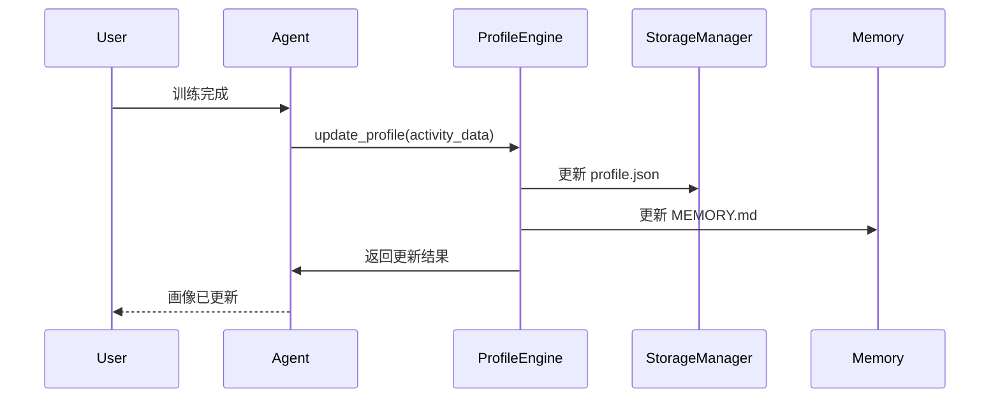

# 架构文档修订计划 v0.4.0

## 📋 文档信息

| 项目 | 内容 |
|------|------|
| **版本号** | v1.0 |
| **创建日期** | 2026-03-19 |
| **修订范围** | 迭代架构设计说明书.md + ARC_架构设计.md |
| **依据文档** | ARC_v0.4.0架构评审意见.md, nanobot的workspace目录说明.md, 可行且优雅的设计方案.md |

---

## 1. 修订背景

根据 `docs/architecture/review/` 目录下的评审意见，当前架构文档存在以下核心问题：

1. **飞书机器人交互架构不一致**：架构图未明确 Channel 与 nanobot-ai 框架的集成机制
2. **用户画像存储策略不统一**：未体现 MEMORY.md + profile.json 双存储机制
3. **缺少 nanobot workspace 标准目录结构**：未遵循 nanobot-ai 框架规范
4. **数据流设计不完整**：缺少记忆更新流程
5. **工具与记忆系统交互边界不明确**：工具职责定义模糊
6. **配置管理体系不统一**：框架配置与应用配置未分离

---

## 2. 修订目标

### 2.1 核心目标

1. **架构一致性**：确保两份架构文档描述一致，符合 nanobot-ai 框架规范
2. **存储规范化**：建立符合 nanobot workspace 标准的目录结构
3. **交互清晰化**：明确 Channel、Agent、Tools 三层交互边界
4. **配置分层化**：区分框架配置与应用配置

### 2.2 修订优先级

| 优先级 | 修订项 | 影响文档 | 影响范围 |
|--------|-------|---------|---------|
| **P0** | 明确飞书Channel与nanobot框架的集成机制 | 两份文档 | 核心架构 |
| **P0** | 统一用户画像存储策略（MEMORY.md + profile.json） | 迭代架构 | 数据存储 |
| **P0** | 补充nanobot workspace标准目录结构 | 系统架构 | 部署架构 |
| **P1** | 完善数据流设计，包含记忆更新流程 | 迭代架构 | 业务逻辑 |
| **P1** | 明确工具与记忆系统的交互边界 | 迭代架构 | 工具设计 |
| **P1** | 补充飞书Webhook集成设计 | 迭代架构 | 外部集成 |
| **P2** | 统一配置管理体系 | 系统架构 | 配置管理 |
| **P2** | 补充Agent监控指标 | 系统架构 | 运维监控 |
| **P2** | 建立文档版本同步机制 | 两份文档 | 文档管理 |

---

## 3. 详细修订内容

### 3.1 《系统架构设计说明书》(ARC_架构设计.md) 修订清单

#### 3.1.1 新增章节：nanobot Workspace 目录结构

**位置**：第4章 核心模块详细设计 → 4.1 数据存储架构设计

**新增内容**：
```markdown
### 4.1.3 nanobot Workspace 目录结构

系统将 `~/.nanobot-runner` 作为 nanobot workspace，遵循 nanobot-ai 标准结构：

```
~/.nanobot-runner/
├── data/                    # 业务数据存储（本项目扩展）
│   ├── activities_*.parquet # 运动数据（按年分片）
│   ├── profile.json         # 结构化画像数据（计算用）
│   └── plans/               # 训练计划存储
│       └── {plan_id}.json
├── memory/                  # 记忆系统（nanobot标准）
│   ├── MEMORY.md            # 长期记忆/用户画像（Agent上下文）
│   └── HISTORY.md           # 事件日志（可搜索历史）
├── sessions/                # 会话历史（nanobot标准）
│   └── feishu_{chat_id}.jsonl
├── skills/                  # 技能扩展（nanobot标准）
│   ├── training_plan/
│   │   └── SKILL.md         # 训练计划生成技能
│   ├── injury_prediction/
│   │   └── SKILL.md         # 伤病风险预警技能
│   └── vdot_prediction/
│       └── SKILL.md         # VDOT预测技能
├── AGENTS.md                # Agent行为准则
├── USER.md                  # 用户画像（辅助）
├── HEARTBEAT.md             # 定时任务
└── config.json              # 应用配置
```

**设计依据**：
- `data/`：本项目特有，存储 Parquet 业务数据
- `memory/`：nanobot 标准记忆系统，MEMORY.md 作为 Agent 长期上下文
- `sessions/`：原始对话历史，支持会话恢复
- `skills/`：可复用的任务流程模块
- 其他文件：遵循 nanobot-ai 框架规范
```

#### 3.1.2 新增章节：配置管理架构

**位置**：第4章 核心模块详细设计 → 4.1 数据存储架构设计

**新增内容**：
```markdown
### 4.1.4 配置管理架构

**三级配置体系**：

| 配置层级 | 路径 | 职责 | 内容示例 |
|---------|------|------|---------|
| 框架配置 | `~/.nanobot/config.json` | nanobot-ai 框架配置 | LLM Provider、全局设置、通用工具链 |
| 应用配置 | `~/.nanobot-runner/config.json` | 业务应用配置 | 飞书应用、数据路径、业务参数 |
| 运行时配置 | 环境变量 | 敏感信息覆盖 | API密钥、临时配置 |

**配置加载顺序**：
```
框架配置 → 应用配置 → 环境变量覆盖
```

**配置文件示例**：

`~/.nanobot/config.json`（框架配置）：
```json
{
  "providers": {
    "default": "local-llm",
    "local-llm": {
      "type": "ollama",
      "base_url": "http://localhost:11434"
    }
  },
  "agents": {
    "defaults": {
      "model": "llama3",
      "max_tool_iterations": 10,
      "memory_window": 10
    }
  },
  "channels": {
    "feishu": {
      "enabled": true,
      "app_id": "${FEISHU_APP_ID}",
      "app_secret": "${FEISHU_APP_SECRET}"
    }
  }
}
```

`~/.nanobot-runner/config.json`（应用配置）：
```json
{
  "version": "0.4.0",
  "data_dir": "~/.nanobot-runner/data",
  "feishu_webhook": "https://open.feishu.cn/...",
  "auto_push_feishu": false,
  "vdot_params": {
    "min_distance": 1500
  }
}
```
```

#### 3.1.3 修订：系统整体架构图

**位置**：第3章 系统整体架构图

**修订内容**：更新架构图，明确 Channel 与 nanobot-ai 框架的集成机制



#### 3.1.4 新增章节：Agent监控指标

**位置**：第7章 非功能性设计 → 7.1 性能指标

**新增内容**：
```markdown
### 7.1.2 Agent监控指标

| 指标类别 | 指标名称 | 阈值 | 说明 |
|---------|---------|------|------|
| 记忆管理 | MEMORY.md大小 | < 50KB | 避免上下文过长 |
| 会话管理 | sessions文件数量 | < 100 | 定期清理旧会话 |
| Agent性能 | 平均响应时间 | < 3s | 复杂查询 |
| 工具调用 | 工具成功率 | > 95% | 核心工具 |
| 记忆更新 | MEMORY.md更新频率 | 每周至少1次 | 保持画像新鲜度 |
| 日历同步 | 同步延迟 | < 5s | 飞书日历 |
```

#### 3.1.5 更新变更历史

**新增变更记录**：
```markdown
| 0.4.0 | 2026-03-19 | 架构评审修订：新增workspace结构、配置管理、Channel集成机制 | 架构师 | R-010 |
```

---

### 3.2 《迭代架构设计说明书》(迭代架构设计说明书.md) 修订清单

#### 3.2.1 修订：整体架构图

**位置**：第3章 系统架构调整 → 3.1 整体架构图

**修订内容**：更新架构图，明确 nanobot-ai 框架层与 Channel 的关系



#### 3.2.2 新增章节：画像存储策略

**位置**：第4章 核心模块详细设计 → 4.1 用户画像引擎

**新增内容**：
```markdown
### 4.1.5 画像存储策略

**双存储机制**：

| 存储文件 | 格式 | 用途 | 更新机制 |
|---------|------|------|---------|
| `MEMORY.md` | Markdown | Agent长期记忆/用户画像 | 关键事件后更新 |
| `profile.json` | JSON | 结构化画像数据 | 每次训练后自动更新 |

**MEMORY.md 结构**：
```markdown
# 用户画像
> 📅 最后更新时间: 2026-03-19 14:30 (系统自动更新)

## 1. 核心体能数据
<!-- 此部分由 RunnerProfileEngine 计算后自动覆盖写入 -->
- **当前 VDOT**: 45.2 (趋势: 📈 上升)
- **体能评分**: 68/100
- **周跑量**: 35 km

## 2. 训练偏好与习惯
- **偏好时段**: 早晨 06:00
- **一致性评分**: 85/100
- **常用装备**: Nike Vaporfly Next%

## 3. 伤病与恢复记录
- **伤病风险等级**: 低
- **历史伤病**: 右脚踝曾扭伤 (2025年)
- **恢复能力**: 平均恢复时间 24 小时

## 4. Agent 观察笔记
<!-- 此部分允许 Agent 在交互中追加或修改 -->
- **2026-03-17**: 用户提到最近工作压力大，建议降低本周训练强度。
- **2026-03-18**: 用户反馈新跑鞋鞋带系法不舒服，下次提醒注意。
```

**profile.json 结构**：
```json
{
  "user_id": "default",
  "profile_version": "1.0",
  "last_updated": "2026-03-19T14:30:00Z",
  "fitness_level": {
    "current_vdot": 45.2,
    "vdot_trend": "rising",
    "fitness_score": 68
  },
  "training_pattern": {
    "weekly_distance_km": 35,
    "preferred_time": "morning",
    "consistency_score": 85
  },
  "injury_risk": {
    "level": "low",
    "history": ["right_ankle_sprain_2025"]
  }
}
```

**数据流**：
```
用户训练数据 
  → AnalyticsEngine计算指标 
  → RunnerProfileEngine更新两个存储 
  → Agent从MEMORY.md获取上下文
```
```

#### 3.2.3 新增章节：工具与记忆系统交互规范

**位置**：第4章 核心模块详细设计 → 4.5 新增工具集

**新增内容**：
```markdown
### 4.5.3 工具与记忆系统交互规范

**原则**：工具不直接操作 MEMORY.md，由 Agent 负责记忆管理

**工具职责边界**：

| 工具 | 读取 | 写入 | 说明 |
|------|------|------|------|
| GetProfileTool | profile.json, MEMORY.md | 无 | 返回整合画像 |
| CreateTrainingPlanTool | profile.json | plan.json, profile.json | 生成计划并更新画像 |
| AdjustTrainingPlanTool | plan.json | plan.json | 调整计划，返回摘要给Agent |
| UpdateMemoryTool | MEMORY.md | MEMORY.md | Agent专用记忆更新工具 |

**GetProfileTool 示例实现**：
```python
class GetProfileTool(BaseTool):
    name = "get_profile"
    description = "获取用户跑步画像"
    
    def execute(self, dimension: str = "all"):
        # 读取结构化数据
        json_profile = self.storage.read_json("data/profile.json")
        # 读取记忆文件
        memory_profile = self.storage.read_file("memory/MEMORY.md")
        
        # 返回整合结果
        return {
            "quantitative": json_profile,
            "qualitative": memory_profile,
            "dimension": dimension
        }
```
```

#### 3.2.4 新增章节：飞书Webhook集成设计

**位置**：第4章 核心模块详细设计 → 4.3 飞书日历同步

**新增内容**：
```markdown
### 4.3.3 飞书Webhook集成

**架构设计**：



**配置示例**：
```json
{
  "channels": {
    "feishu": {
      "webhooks": {
        "calendar": {
          "path": "/webhook/calendar",
          "handler": "FeishuCalendarWebhookHandler"
        }
      }
    }
  }
}
```

**WebhookHandler 实现**：
```python
class FeishuCalendarWebhookHandler:
    """飞书日历事件变更处理器"""
    
    def __init__(
        self,
        plan_engine: TrainingPlanEngine,
        calendar_sync: FeishuCalendarSync
    ):
        self.plan_engine = plan_engine
        self.calendar_sync = calendar_sync
    
    async def handle_calendar_event_update(
        self,
        event: Dict[str, Any]
    ) -> None:
        """处理飞书日历事件变更"""
        # 1. 解析事件
        event_id = event.get("event_id")
        new_time = event.get("start_time")
        
        # 2. 更新本地计划
        plan = self.plan_engine.get_current_plan()
        self.plan_engine.update_plan_time(plan, event_id, new_time)
        
        # 3. 通知 Agent 更新记忆
        # (通过 MessageBus 发送事件)
```
```

#### 3.2.5 修订：数据流设计

**位置**：第6章 数据流设计

**新增内容**：画像更新数据流

```markdown
### 6.5 画像更新数据流


```

#### 3.2.6 修订：数据存储路径

**位置**：第7章 部署架构 → 7.2 数据存储路径

**修订内容**：

```markdown
### 7.2 数据存储路径

| 数据类型 | 存储路径 | 格式 | 说明 |
|---------|---------|------|------|
| 活动数据 | `~/.nanobot-runner/data/activities_{year}.parquet` | Parquet | 按年分片 |
| 结构化画像 | `~/.nanobot-runner/data/profile.json` | JSON | 程序计算用 |
| 长期记忆 | `~/.nanobot-runner/memory/MEMORY.md` | Markdown | Agent上下文 |
| 事件日志 | `~/.nanobot-runner/memory/HISTORY.md` | Markdown | 可搜索历史 |
| 训练计划 | `~/.nanobot-runner/data/plans/{plan_id}.json` | JSON | 计划数据 |
| 会话历史 | `~/.nanobot-runner/sessions/feishu_{chat_id}.jsonl` | JSONL | 对话记录 |
| 技能定义 | `~/.nanobot-runner/skills/{skill_name}/SKILL.md` | Markdown | 技能模块 |
| 应用配置 | `~/.nanobot-runner/config.json` | JSON | 业务配置 |
| 框架配置 | `~/.nanobot/config.json` | JSON | nanobot配置 |
```

#### 3.2.7 更新变更历史

**新增变更记录**：
```markdown
| v1.1 | 2026-03-19 | 架构评审修订：新增双存储机制、记忆系统、Webhook集成 | 架构师 |
```

---

## 4. 修订执行计划

### 4.1 执行顺序

| 步骤 | 文档 | 修订内容 | 预估时间 |
|------|------|---------|---------|
| 1 | ARC_架构设计.md | 新增 4.1.3 nanobot Workspace 目录结构 | 10分钟 |
| 2 | ARC_架构设计.md | 新增 4.1.4 配置管理架构 | 10分钟 |
| 3 | ARC_架构设计.md | 修订第3章系统整体架构图 | 15分钟 |
| 4 | ARC_架构设计.md | 新增 7.1.2 Agent监控指标 | 5分钟 |
| 5 | ARC_架构设计.md | 更新变更历史 | 2分钟 |
| 6 | 迭代架构设计说明书.md | 修订 3.1 整体架构图 | 15分钟 |
| 7 | 迭代架构设计说明书.md | 新增 4.1.5 画像存储策略 | 10分钟 |
| 8 | 迭代架构设计说明书.md | 新增 4.5.3 工具与记忆系统交互规范 | 10分钟 |
| 9 | 迭代架构设计说明书.md | 新增 4.3.3 飞书Webhook集成 | 10分钟 |
| 10 | 迭代架构设计说明书.md | 新增 6.5 画像更新数据流 | 5分钟 |
| 11 | 迭代架构设计说明书.md | 修订 7.2 数据存储路径 | 5分钟 |
| 12 | 迭代架构设计说明书.md | 更新变更历史 | 2分钟 |

### 4.2 验收标准

- [ ] 两份文档的架构图描述一致
- [ ] 存储路径描述统一
- [ ] Channel 与 nanobot-ai 框架集成机制清晰
- [ ] 双存储机制（MEMORY.md + profile.json）说明完整
- [ ] 工具与记忆系统交互边界明确
- [ ] 配置管理体系分层清晰

---

## 5. 风险识别

| 风险项 | 可能性 | 影响 | 应对策略 |
|--------|--------|------|---------|
| 修订后与现有代码不一致 | 中 | 高 | 修订完成后进行代码一致性检查 |
| Mermaid图表语法错误 | 低 | 中 | 使用在线工具验证 |
| 文档版本号混乱 | 低 | 中 | 统一版本号规则 |

---

**文档状态**: 已完成
**完成日期**: 2026-03-19

---

## 验收结果

- [x] 两份文档的架构图描述一致
- [x] 存储路径描述统一
- [x] Channel 与 nanobot-ai 框架集成机制清晰
- [x] 双存储机制（MEMORY.md + profile.json）说明完整
- [x] 工具与记忆系统交互边界明确
- [x] 配置管理体系分层清晰
