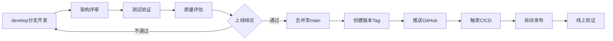

# 版本迭代开发最佳实践协作链路 v1.2.0

本协作链路基于智能体标准化执行指令手册，覆盖**迭代需求分析→架构适配→开发实现→测试验证→自动化发布→运维复盘**全流程，明确各阶段核心角色、执行指令、输入输出及关键规则，保障迭代开发标准化、可落地。

---

## 一、整体协作链路总览

```
架构师智能体（迭代需求分析→架构适配→迭代任务拆解）→ 
开发工程师智能体（迭代功能开发→单元测试补充→本地调试）→ 
架构师智能体（迭代方案评审）→ 
测试工程师智能体（迭代测试策略→用例设计→全量测试→安全测试→Bug反馈）→ 
开发工程师智能体（Bug修复）→ 
测试工程师智能体（回归测试→质量评估）→ 
发布运维工程师智能体（CICD验证→自动化发布→监控配置→运维文档更新）→ 
全角色（迭代风险复盘）
```

---

## 二、分阶段详细协作规范

### 阶段1：迭代准备（架构师智能体主导）

| 核心角色 | 执行指令 | 输入规范 | 输出规范 | 关键规则 |
|---------|---------|---------|---------|---------|
| 架构师智能体 | ARC-01（迭代版）需求分析 | 迭代需求诉求、项目当前版本基线、原有需求规格说明书 | 迭代需求规格说明书（/docs/requirement/{迭代版本号}/），标注MVP迭代核心需求 | 1. 迭代需求无歧义；2. 覆盖本次迭代核心业务场景；3. 验收标准可量化 |
| 架构师智能体 | ARC-02（迭代版）架构设计 | 迭代需求规格说明书、原有架构设计方案、技术约束 | 迭代架构适配方案（/docs/architecture/{迭代版本号}/），明确模块/接口调整 | 1. 适配原有架构无重大重构；2. 接口调整覆盖迭代交互；3. 部署架构无额外成本 |
| 架构师智能体 | ARC-03（迭代版）任务拆解 | 迭代架构适配方案、原有模块边界 | 迭代开发任务清单（/docs/planning/task_list_{迭代版本号}.md） | 1. 任务粒度适配迭代周期（通常1-2周）；2. 依赖无闭环；3. 工时误差≤20% |

---

### 阶段2：迭代开发（开发工程师智能体主导）

| 核心角色 | 执行指令 | 输入规范 | 输出规范 | 关键规则 |
|---------|---------|---------|---------|---------|
| 开发工程师智能体 | DEV-05 功能迭代 | 迭代开发任务清单、迭代架构适配方案、原有代码仓库 | 1. 迭代功能代码（提交至Git迭代分支）；2. 迭代开发交付报告 | 1. 按P0/P1/P2优先级开发；2. 迭代需求100%实现；3. 核心场景本地验证通过 |
| 开发工程师智能体 | DEV-02 单元测试补充 | 迭代功能代码、核心代码目录（/src/core/）、测试框架要求 | 1. 补充单元测试用例；2. 单元测试报告（覆盖率≥80%） | 1. 核心代码覆盖率≥80%；2. 测试用例通过率100%；3. 覆盖边界场景 |
| 开发工程师智能体 | DEV-04 本地调试 | 迭代代码仓库、启动失败日志（如有）、Trae IDE环境信息 | 1. 可正常启动的代码/配置；2. 本地调试报告 | 1. Trae IDE一键构建成功；2. 核心接口可正常调用；3. 调试失败需同步架构师 |

---

### 阶段3：迭代架构评审（架构师智能体主导）

| 核心角色 | 执行指令 | 输入规范 | 输出规范 | 关键规则 |
|---------|---------|---------|---------|---------|
| 架构师智能体 | ARC-04 方案评审 | 迭代开发交付报告、代码仓库地址、迭代架构适配方案 | 迭代架构评审报告（/docs/architecture/review/{迭代版本号}.md） | 1. 核心代码无架构偏离；2. 优化方案可在迭代周期内落地；3. 未通过需整改重提 |

---

### 阶段4：迭代测试验证（测试工程师智能体主导）

| 核心角色 | 执行指令 | 输入规范 | 输出规范 | 关键规则 |
|---------|---------|---------|---------|---------|
| 测试工程师智能体 | TST-01（迭代版）测试策略制定 | 迭代需求规格说明书、迭代架构适配方案、迭代排期 | 迭代测试策略（/docs/test/strategy_{迭代版本号}.md） | 1. 测试范围覆盖所有迭代MVP需求；2. 准入/准出标准可量化 |
| 测试工程师智能体 | TST-02（迭代版）测试用例设计 | 迭代模块功能清单、接口文档、迭代需求规格说明书 | 迭代测试用例（/docs/test/cases/{迭代模块名}.md） | 1. 用例覆盖100%迭代核心功能；2. 包含边界/异常/权限场景 |
| 测试工程师智能体 | TST-03（迭代版）自动化测试开发 | 迭代测试用例、核心业务流程、Trae IDE环境约束 | E2E自动化脚本（/tests/e2e/{迭代版本号}/）+ 执行说明 | 1. 脚本可在Trae IDE一键执行；2. 覆盖≥80%迭代核心流程 |
| 测试工程师智能体 | TST-04 全量测试执行 | 迭代代码仓库、测试用例、自动化脚本 | 全量测试报告 + Bug清单（标注优先级/复现步骤） | 1. 用例执行率100%；2. 核心流程用例通过率≥95%；3. Bug信息完整 |
| 测试工程师智能体 | TST-07 安全测试 | ARC-06安全合规审查报告、可运行代码 | 安全测试报告（/docs/test/security/），包含漏洞清单、风险等级 | 1. 无高危安全漏洞；2. 中危漏洞≤3个；3. 修复建议可落地执行 |
| 测试工程师智能体 | TST-05 回归测试 | Bug修复报告、修复后代码、原Bug清单 | 回归测试报告 + 更新后Bug清单 + 上线结论 | 1. P0/P1级Bug 100%修复验证；2. 上线结论明确（符合/不符合） |
| 测试工程师智能体 | TST-06 质量评估 | 全量测试报告、回归测试报告、迭代需求规格说明书 | 迭代质量评估报告（含上线风险/建议） | 1. 质量指标完整；2. 高/中风险全覆盖且闭环；3. 上线建议可落地 |

---

### 阶段5：迭代Bug修复（开发工程师智能体主导）

| 核心角色 | 执行指令 | 输入规范 | 输出规范 | 关键规则 |
|---------|---------|---------|---------|---------|
| 开发工程师智能体 | DEV-03 Bug修复 | Bug清单（含优先级、复现步骤）、代码仓库地址 | 1. 修复后的代码（提交至指定分支）；2. 更新后的单元测试用例；3. Bug修复报告（/docs/development/bug_fix/） | 1. 按Bug优先级（P0/P1/P2）修复；2. 所有Bug复现验证通过；3. 无新Bug引入 |

---

### 阶段6：迭代自动化发布（发布运维工程师智能体主导）

| 核心角色 | 执行指令 | 输入规范 | 输出规范 | 关键规则 |
|---------|---------|---------|---------|---------|
| 发布运维工程师智能体 | OPS-02 CICD流水线验证 | Git迭代分支地址、项目构建/测试命令、部署环境信息 | 流水线执行报告 + 修复后的ci.yml（如有问题） | 1. 流水线自动触发；2. 测试/构建步骤无报错；3. 失败1个工时内排查 |
| 发布运维工程师智能体 | OPS-04 自动化发布 | 测试"上线通过"结论、迭代版本号、Git分支信息 | 版本发布报告 + GitHub语义化Tag + 线上服务验证结果 | 1. 发布前必须确认上线结论；2. Tag创建成功；3. 线上服务为新版本且正常 |
| 发布运维工程师智能体 | OPS-07 监控配置 | 部署环境、监控工具（如Prometheus/Grafana） | 监控配置文件 + 监控配置报告（/docs/devops/monitoring/） | 1. 核心指标监控覆盖率100%；2. 告警及时准确；3. 监控数据可视化 |

---

### 阶段7：迭代运维与复盘（全角色协作）

| 核心角色 | 执行指令 | 输入规范 | 输出规范 | 关键规则 |
|---------|---------|---------|---------|---------|
| 发布运维工程师智能体 | OPS-06 运维文档更新 | 迭代发布报告、流水线日志、迭代部署信息 | 更新后的运维文档（含迭代部署/故障预案） | 1. 文档覆盖迭代新增场景；2. 步骤可直接落地执行 |
| 架构师智能体 | ARC-05（迭代版）风险复盘 | 迭代全流程问题记录、风险案例、质量评估报告 | 迭代风险复盘报告（含下一轮迭代优化建议） | 1. 复盘迭代全流程问题；2. 优化建议适配下一轮迭代 |

---

## 三、核心协作规则（跨阶段）

### 1. 交付物存储规范

所有迭代交付物需按 `角色缩写_指令名称_迭代版本号.md` 命名（如ARC-01_需求分析_v0.2.0.md），存储至手册指定目录：

```
docs/
├── requirement/{版本号}/          # 需求文档
├── architecture/{版本号}/         # 架构设计
├── architecture/review/           # 架构评审
├── planning/                      # 任务清单
├── development/                   # 开发报告
│   ├── bug_fix/                   # Bug修复
│   └── debug/                     # 调试报告
├── test/                          # 测试文档
│   ├── cases/                     # 测试用例
│   ├── reports/                   # 测试报告
│   └── regression/                # 回归测试
└── devops/                        # 运维文档
    ├── troubleshoot/              # 故障排查
    └── release_notes/             # 发布说明
```

### 2. 时效规则

| 场景 | 响应时效 | 处理时效 |
|------|---------|---------|
| 测试反馈P0/P1级Bug | 2工时内响应 | 4工时内修复 |
| CICD流水线失败 | 1工时内排查 | 2工时内修复 |
| 安全测试高危漏洞 | 立即暂停发布 | 4工时内修复 |
| 生产环境故障 | 15分钟内启动应急 | 根据故障等级 |

### 3. 准入准出规则

#### 3.1 开发准入

- ✅ 迭代需求规格说明书已评审通过
- ✅ 迭代架构适配方案已确认
- ✅ 迭代开发任务清单已拆解

#### 3.2 测试准入

- ✅ 开发交付报告已提交
- ✅ 单元测试覆盖率≥80%
- ✅ 本地核心场景验证通过
- ✅ 架构评审通过（如适用）

#### 3.3 发布准入

- ✅ 测试上线结论为"建议上线"
- ✅ P0/P1级Bug 100%修复验证
- ✅ CICD流水线验证通过
- ✅ 版本号已更新

#### 3.4 发布准出

- ✅ 版本Tag创建成功
- ✅ GitHub Release发布成功
- ✅ 线上服务验证通过

### 4. 异常处理

#### 4.1 本地调试多次失败

- 开发工程师输出调试报告，同步架构师排查是否为架构问题
- 环境问题需运维工程师协助解决
- 调试报告存储至 `/docs/development/debug/`

#### 4.2 CICD流水线连续2次失败

- 运维工程师同步架构师、测试工程师共同分析根因
- 输出故障排查报告存储至 `/docs/devops/troubleshoot/`
- 修复后需验证流水线通过

#### 4.3 架构评审不通过

- 开发工程师按评审报告整改
- 核心架构偏离未整改前，测试不执行全量测试
- 整改后重新提交评审

#### 4.4 测试用例通过率<95%

- 开发工程师优先修复失败用例
- 通过率达标后方可进入发布阶段
- 发布运维工程师拒绝执行自动化发布

---

## 四、版本发布流程规范

### 1. Git分支策略

```
main        # 生产分支，仅接受合并请求
develop     # 开发分支，日常开发在此进行
feature/*   # 功能分支，从develop创建
hotfix/*    # 热修复分支，从main创建
```

### 2. 版本号规范

采用语义化版本号：`主版本号.次版本号.修订号`

- **主版本号**：不兼容的API变更
- **次版本号**：向后兼容的功能新增
- **修订号**：向后兼容的问题修复

示例：
- `v0.1.0` → `v0.2.0`：新增Agent交互功能
- `v0.2.0` → `v0.2.1`：修复Bug

### 3. 发布流程



### 4. 发布检查清单

#### 4.1 发布前检查

- [ ] 版本号已更新（pyproject.toml）
- [ ] 测试上线结论为"建议上线"
- [ ] CICD流水线验证通过
- [ ] 发布说明已准备

#### 4.2 发布执行

- [ ] 切换到main分支
- [ ] 合并develop分支（--no-ff）
- [ ] 创建版本Tag（带注释）
- [ ] 推送main分支和Tag到GitHub

#### 4.3 发布后验证

- [ ] GitHub Actions流水线执行成功
- [ ] GitHub Release创建成功
- [ ] 线上服务版本正确
- [ ] 核心功能验证通过

---

## 五、技术栈与工具规范

### 1. 包管理器

本项目使用 **uv** 作为包管理器：

```bash
# 创建虚拟环境
uv venv

# 激活虚拟环境（Windows PowerShell）
.venv\Scripts\Activate.ps1

# 同步依赖
uv sync --all-extras

# 清理缓存
uv cache clean
```

### 2. 测试框架

使用 **pytest** 作为测试框架：

```bash
# 运行所有测试
uv run pytest

# 带覆盖率报告
uv run pytest --cov=src --cov-report=term-missing --cov-report=html

# 运行特定测试
uv run pytest tests/unit/test_storage.py -v
```

### 3. 代码质量工具

```bash
# 格式化
uv run black src tests

# 导入排序
uv run isort src tests

# 类型检查
uv run mypy src

# 安全扫描
uv run bandit -r src
```

### 4. CI/CD工具

使用 **GitHub Actions** 作为CI/CD工具：

- 配置文件：`.github/workflows/ci.yml`
- 触发条件：push到main/develop分支，PR到main分支
- 流水线阶段：code-quality → test → build → release

---

## 六、文档模板规范

### 1. 迭代需求规格说明书模板

```markdown
# 迭代需求规格说明书 v{版本号}

## 文档信息
| 项目 | 内容 |
|------|------|
| 版本号 | v{版本号} |
| 迭代主题 | {主题} |
| 优先级 | P0/P1/P2 |
| 创建日期 | {日期} |

## 1. 迭代概述
## 2. 功能性需求规格
## 3. 非功能性需求
## 4. 验收标准汇总
```

### 2. 迭代架构设计说明书模板

```markdown
# 迭代架构设计说明书 v{版本号}

## 文档信息
| 项目 | 内容 |
|------|------|
| 版本号 | v{版本号} |
| 迭代主题 | {主题} |
| 架构类型 | 迭代适配方案 |
| 创建日期 | {日期} |

## 1. 架构设计概述
## 2. 技术栈适配方案
## 3. 系统架构调整
## 4. 核心模块详细设计
## 5. 接口规范调整
```

### 3. 迭代开发任务清单模板

```markdown
# 迭代开发任务清单 v{版本号}

## 文档信息
| 项目 | 内容 |
|------|------|
| 版本号 | v{版本号} |
| 迭代周期 | {周期} |
| 总预估工时 | {工时} |
| 任务总数 | {数量} |

## 1. 任务分解总览
## 2. 详细任务清单
## 3. 任务依赖关系
## 4. 验收标准汇总
```

---

## 七、质量门禁规范

### 1. 代码质量门禁

| 指标 | 要求 | 测量工具 |
|------|------|---------|
| 单元测试覆盖率 | ≥80% | pytest-cov |
| 类型检查通过率 | 100% | mypy |
| 代码格式化 | 100% | black, isort |
| 安全扫描 | 无高危漏洞 | bandit |

### 2. 测试质量门禁

| 指标 | 要求 |
|------|------|
| 测试用例执行率 | 100% |
| 核心流程用例通过率 | ≥95% |
| P0/P1级Bug修复率 | 100% |
| 回归测试通过率 | 100% |

### 3. 发布质量门禁

| 指标 | 要求 |
|------|------|
| 测试上线结论 | "建议上线" |
| CICD流水线状态 | 通过 |
| 版本Tag创建 | 成功 |
| 线上服务验证 | 通过 |

---

## 八、风险管控规范

### 1. 风险识别

| 风险类型 | 风险项 | 可能性 | 影响 |
|---------|--------|--------|------|
| 技术风险 | 依赖库兼容性 | 中 | 高 |
| 技术风险 | 性能不达标 | 中 | 高 |
| 项目风险 | 开发周期延期 | 中 | 中 |
| 项目风险 | 测试覆盖不足 | 高 | 中 |

### 2. 风险应对

| 风险项 | 应对策略 | 责任人 |
|--------|---------|--------|
| 依赖库兼容性 | 提前验证，准备备选方案 | 开发工程师 |
| 性能不达标 | 性能优化，添加缓存 | 开发工程师 |
| 开发周期延期 | 优先保证MVP，扩展功能延后 | 架构师 |
| 测试覆盖不足 | 制定详细测试计划，自动化测试 | 测试工程师 |

### 3. 风险复盘

每次迭代结束后，架构师智能体需输出《迭代风险复盘报告》，包含：
- 迭代过程中遇到的问题
- 风险应对效果评估
- 下一轮迭代优化建议

---

## 九、附录

### A. 常用命令速查

```bash
# 依赖管理
uv venv                          # 创建虚拟环境
uv sync --all-extras            # 同步所有依赖
uv cache clean                  # 清理缓存

# 测试执行
uv run pytest                   # 运行所有测试
uv run pytest --cov=src         # 带覆盖率报告
uv run pytest tests/unit/       # 运行单元测试

# 代码质量
uv run black src tests          # 格式化代码
uv run isort src tests          # 导入排序
uv run mypy src                 # 类型检查
uv run bandit -r src            # 安全扫描

# Git操作
git checkout develop            # 切换到开发分支
git checkout -b feature/xxx     # 创建功能分支
git merge develop --no-ff       # 合并开发分支
git tag -a v0.2.0 -m "release"  # 创建版本Tag
git push origin main --tags     # 推送代码和Tag
```

### B. 文档存储路径

| 文档类型 | 存储路径 |
|---------|---------|
| 需求文档 | /docs/requirement/{版本号}/ |
| 架构设计 | /docs/architecture/{版本号}/ |
| 架构评审 | /docs/architecture/review/ |
| 任务清单 | /docs/planning/ |
| 开发报告 | /docs/development/ |
| 测试文档 | /docs/test/ |
| 运维文档 | /docs/devops/ |

### C. 联系与支持

- 项目仓库：https://github.com/yecllsl/nanobot-runner
- CI/CD：GitHub Actions
- 开发环境：Trae IDE

---

**文档状态**: 已发布  
**发布版本**: v1.2.0  
**更新日期**: 2026-03-06
