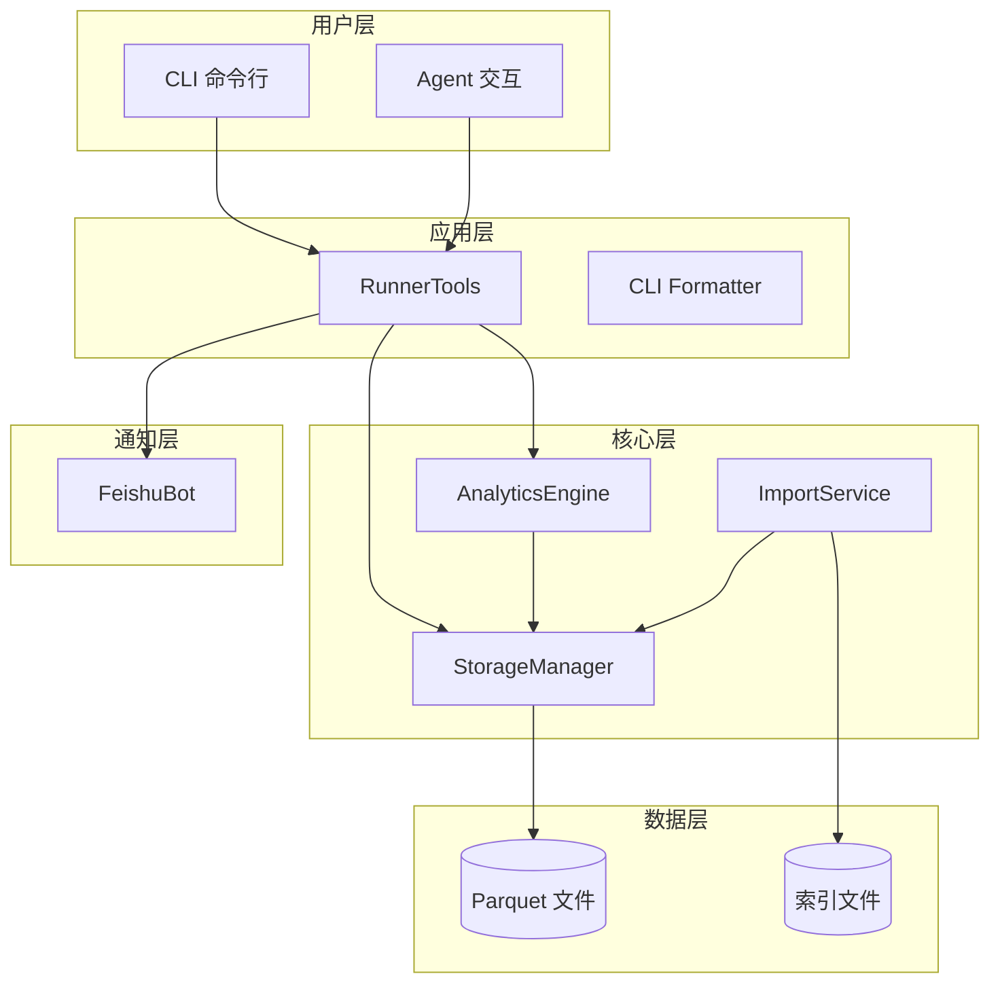

# 迭代架构设计说明书 v0.3.0

## 文档信息

| 项目 | 内容 |
|------|------|
| 版本号 | v0.3.0 |
| 迭代主题 | 训练负荷完整实现与智能晨报生成 |
| 架构类型 | 迭代适配方案 |
| 创建日期 | 2026-03-06 |
| 基线版本 | v0.2.0 |

---

## 1. 架构设计概述

### 1.1 迭代目标

本迭代聚焦于**训练负荷体系完整实现**与**每日晨报智能生成**，在 v0.2.0 架构基础上进行功能扩展，不涉及核心架构重构。

### 1.2 架构原则

- **最小改动原则**: 复用现有架构组件，避免大规模重构
- **单一职责原则**: 新增功能模块保持职责单一
- **性能优先原则**: 使用 Polars Lazy API 优化查询性能
- **可测试原则**: 新增代码需保证测试覆盖率 ≥ 80%

---

## 2. 技术栈适配方案

### 2.1 现有技术栈

| 技术组件 | 版本 | 用途 |
|---------|------|------|
| Python | >= 3.11 | 核心开发语言 |
| nanobot-ai | >= 0.1.4 | Agent 底座框架 |
| Typer + Rich | >= 0.12.0 | CLI 框架 |
| Polars | >= 0.20.0 | 数据计算引擎 |
| PyArrow | >= 14.0.0 | Parquet 存储支持 |
| fitparse | >= 1.1.0 | FIT 文件解析 |

### 2.2 新增依赖

无需新增核心依赖，现有技术栈完全满足需求。

---

## 3. 系统架构调整

### 3.1 架构总览



### 3.2 模块变更清单

| 模块 | 变更类型 | 变更内容 |
|------|---------|---------|
| `src/core/analytics.py` | 扩展 | 新增训练负荷计算、晨报生成、分析指标扩展方法 |
| `src/agents/tools.py` | 扩展 | 新增训练负荷趋势、晨报推送工具方法 |
| `src/notify/feishu.py` | 扩展 | 新增晨报卡片消息格式 |
| `src/cli.py` | 扩展 | 新增晨报推送命令 |
| `src/cli_formatter.py` | 扩展 | 新增训练负荷格式化输出 |

---

## 4. 核心模块详细设计

### 4.1 AnalyticsEngine 扩展设计

#### 4.1.1 新增方法

```python
class AnalyticsEngine:
    # 现有方法...
    
    # 新增: TSS 计算
    def calculate_tss_for_run(
        self,
        distance_m: float,
        duration_s: float,
        avg_heart_rate: float,
        age: int = 30,
        threshold_pace: float = None
    ) -> float:
        """计算单次跑步的 TSS 值"""
        pass
    
    # 新增: 训练负荷计算
    def get_training_load(
        self,
        days: int = 42,
        atl_decay: float = 7.0,
        ctl_decay: float = 42.0
    ) -> Dict[str, Any]:
        """获取训练负荷 (ATL/CTL/TSB)"""
        pass
    
    # 新增: 训练负荷趋势
    def get_training_load_trend(
        self,
        days: int = 90
    ) -> List[Dict[str, Any]]:
        """获取训练负荷趋势数据"""
        pass
    
    # 新增: 晨报生成
    def generate_daily_report(
        self,
        date: str = None
    ) -> Dict[str, Any]:
        """生成每日晨报内容"""
        pass
    
    # 新增: 配速分布分析
    def get_pace_distribution(
        self,
        days: int = 30
    ) -> Dict[str, Any]:
        """获取配速分布分析"""
        pass
    
    # 新增: 心率区间分析
    def get_heart_rate_zones(
        self,
        days: int = 30,
        age: int = 30
    ) -> Dict[str, Any]:
        """获取心率区间分析"""
        pass
    
    # 新增: 训练效果评估
    def get_training_effect(
        self,
        days: int = 30
    ) -> Dict[str, Any]:
        """获取训练效果评估"""
        pass
```

#### 4.1.2 TSS 计算算法

```
TSS 计算公式:
1. 基于心率的 TSS:
   - IF (强度因子) = (avg_hr - rest_hr) / (max_hr - rest_hr)
   - TSS = (duration_s * IF²) / 3600 * 100

2. 参数说明:
   - rest_hr: 静息心率 (默认 60)
   - max_hr: 最大心率 (220 - age)
   - duration_s: 运动时长 (秒)
```

#### 4.1.3 EWMA 算法

```
ATL/CTL 计算公式:
1. EWMA (指数加权移动平均):
   - ATL = EWMA(TSS, 时间窗口=7天)
   - CTL = EWMA(TSS, 时间窗口=42天)

2. EWMA 计算方式:
   - EWMA_t = α * TSS_t + (1-α) * EWMA_{t-1}
   - α = 1 - exp(-1/decay_days)

3. TSB 计算:
   - TSB = CTL - ATL
```

### 4.2 RunnerTools 扩展设计

#### 4.2.1 新增工具方法

```python
class RunnerTools:
    # 现有方法...
    
    # 新增: 训练负荷趋势工具
    @handle_tool_errors
    def get_training_load_trend(self, days: int = 90) -> Dict[str, Any]:
        """获取训练负荷趋势"""
        pass
    
    # 新增: 晨报生成工具
    @handle_tool_errors
    def generate_daily_report(self, date: str = None) -> Dict[str, Any]:
        """生成每日晨报"""
        pass
    
    # 新增: 配速分布分析工具
    @handle_tool_errors
    def get_pace_distribution(self, days: int = 30) -> Dict[str, Any]:
        """获取配速分布分析"""
        pass
    
    # 新增: 心率区间分析工具
    @handle_tool_errors
    def get_heart_rate_zones(self, days: int = 30, age: int = 30) -> Dict[str, Any]:
        """获取心率区间分析"""
        pass
```

#### 4.2.2 工具描述更新

```python
TOOL_DESCRIPTIONS = {
    # 现有工具...
    
    "get_training_load_trend": {
        "description": "获取训练负荷趋势数据，返回每日 ATL/CTL/TSB 数据",
        "parameters": {
            "days": "分析天数，默认 90 天"
        }
    },
    "generate_daily_report": {
        "description": "生成每日晨报内容，包含训练负荷、昨日活动、今日建议等",
        "parameters": {
            "date": "日期，格式 YYYY-MM-DD，默认今天"
        }
    },
    "get_pace_distribution": {
        "description": "获取配速分布分析，返回各配速区间的统计",
        "parameters": {
            "days": "分析天数，默认 30 天"
        }
    },
    "get_heart_rate_zones": {
        "description": "获取心率区间分析，返回各心率区间的训练时间",
        "parameters": {
            "days": "分析天数，默认 30 天",
            "age": "年龄，用于计算最大心率"
        }
    }
}
```

### 4.3 FeishuBot 扩展设计

#### 4.3.1 晨报卡片消息格式

```python
def send_daily_report(self, report: Dict[str, Any]) -> bool:
    """
    发送每日晨报到飞书
    
    卡片消息结构:
    {
        "msg_type": "interactive",
        "card": {
            "header": {
                "title": "🌅 每日晨报 - {date}",
                "template": "blue"
            },
            "elements": [
                {
                    "tag": "div",
                    "text": "📊 训练负荷\nATL: {atl} | CTL: {ctl} | TSB: {tsb}"
                },
                {
                    "tag": "div",
                    "text": "🏃 昨日训练\n距离: {distance}km | 时长: {duration}"
                },
                {
                    "tag": "div",
                    "text": "💡 今日建议\n{recommendation}"
                }
            ]
        }
    }
    """
    pass
```

---

## 5. 接口规范调整

### 5.1 新增 CLI 命令

```bash
# 查看训练负荷
uv run nanobotrun training-load [--days 42]

# 查看训练负荷趋势
uv run nanobotrun training-trend [--days 90]

# 生成晨报
uv run nanobotrun daily-report [--date YYYY-MM-DD]

# 配置晨报推送
uv run nanobotrun config-report --time 07:00 --enable
```

### 5.2 Agent 工具接口

| 工具名称 | 输入参数 | 输出格式 |
|---------|---------|---------|
| `get_training_load_trend` | days: int | `{"success": bool, "data": [...], "message": str}` |
| `generate_daily_report` | date: str | `{"success": bool, "data": {...}, "message": str}` |
| `get_pace_distribution` | days: int | `{"success": bool, "data": {...}, "message": str}` |
| `get_heart_rate_zones` | days: int, age: int | `{"success": bool, "data": {...}, "message": str}` |

---

## 6. 性能优化方案

### 6.1 Polars 查询优化

```python
# 使用 LazyFrame 延迟加载
def get_training_load(self, days: int = 42) -> Dict[str, Any]:
    # 谓词下推优化
    lf = self.storage.scan_activities()
        .filter(pl.col("timestamp") >= start_date)
        .select(["timestamp", "total_distance", "total_timer_time", "avg_heart_rate"])
    
    # 延迟计算
    df = lf.collect()
    
    # 批量计算 TSS
    tss_series = self._calculate_tss_batch(df)
    
    # EWMA 计算
    atl = self._ewma(tss_series, decay=7)
    ctl = self._ewma(tss_series, decay=42)
    
    return {"atl": atl, "ctl": ctl, "tsb": ctl - atl}
```

### 6.2 缓存策略

```python
from functools import lru_cache

@lru_cache(maxsize=128)
def _calculate_tss_cached(
    self,
    distance_m: float,
    duration_s: float,
    avg_heart_rate: float,
    age: int
) -> float:
    """缓存 TSS 计算结果"""
    pass
```

---

## 7. 测试策略

### 7.1 单元测试

| 测试模块 | 测试重点 | 覆盖率要求 |
|---------|---------|-----------|
| `test_analytics.py` | TSS/ATL/CTL 计算、晨报生成 | ≥ 85% |
| `test_tools.py` | 工具方法调用、参数验证 | ≥ 85% |
| `test_feishu.py` | 晨报推送、消息格式 | ≥ 80% |

### 7.2 性能测试

| 测试场景 | 数据规模 | 响应时间要求 |
|---------|---------|-------------|
| TSS 计算 | 单条记录 | < 0.1 秒 |
| 训练负荷计算 | 1000 条记录 | < 2 秒 |
| 晨报生成 | - | < 1 秒 |
| 日期范围查询 | 10000 条记录 | < 3 秒 |

---

## 8. 部署架构

### 8.1 部署方式

- **本地部署**: 无需额外部署，保持现有架构
- **晨报推送**: 使用系统定时任务 (Windows Task Scheduler / cron)

### 8.2 配置更新

```json
// ~/.nanobot-runner/config.json
{
    "version": "0.3.0",
    "daily_report": {
        "enabled": true,
        "time": "07:00",
        "feishu_webhook": "https://open.feishu.cn/..."
    }
}
```

---

## 9. 风险评估

| 风险项 | 可能性 | 影响程度 | 应对策略 |
|--------|--------|---------|---------|
| TSS 计算准确率不达标 | 中 | 高 | 参考 TrainingPeaks 标准，进行对比测试 |
| 性能不达标 | 中 | 高 | 使用 Polars Lazy API 优化，添加缓存 |
| 飞书推送失败 | 低 | 中 | 实现重试机制，记录详细日志 |

---

## 10. 验收标准

### 10.1 架构验收

- [ ] 模块变更符合设计规范
- [ ] 接口设计符合 RESTful 风格
- [ ] 性能优化方案有效

### 10.2 功能验收

- [ ] 所有 P0 任务完成
- [ ] 所有单元测试通过
- [ ] 所有性能测试通过

### 10.3 质量验收

- [ ] 总体测试覆盖率 ≥ 80%
- [ ] 类型检查通过 (mypy)
- [ ] 代码格式化通过 (black, isort)

---

## 11. 变更历史

| 版本 | 日期 | 变更内容 | 作者 |
|------|------|---------|------|
| v0.1 | 2026-03-06 | 初始版本 | 架构师智能体 |

---

**文档状态**: 待评审
**下次更新**: 开发启动后更新
**发布版本**: v0.3.0
