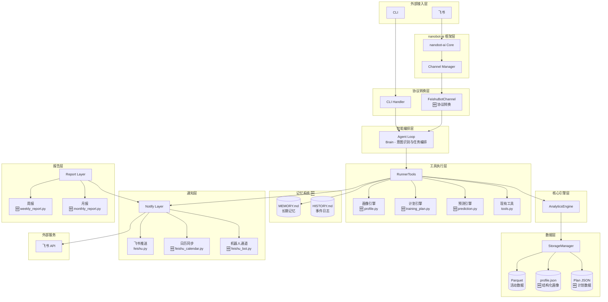
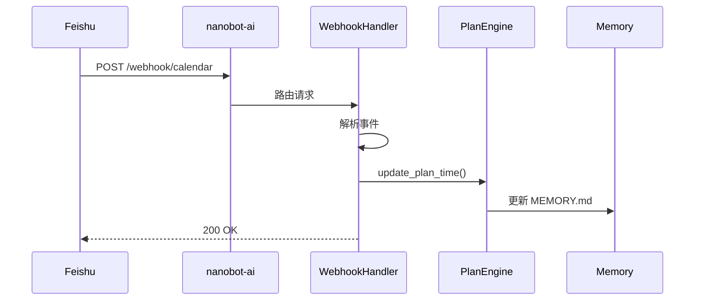
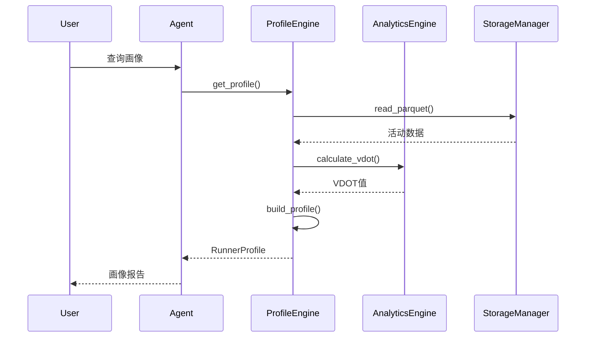
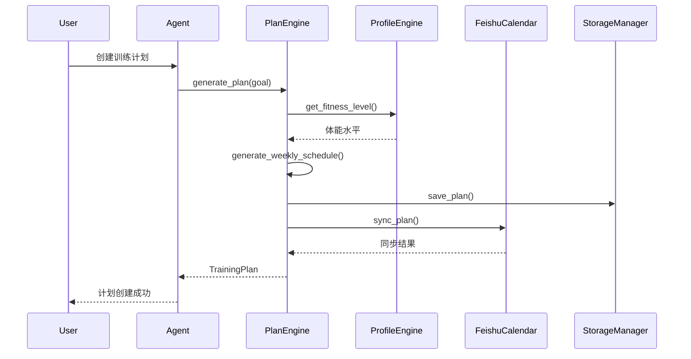
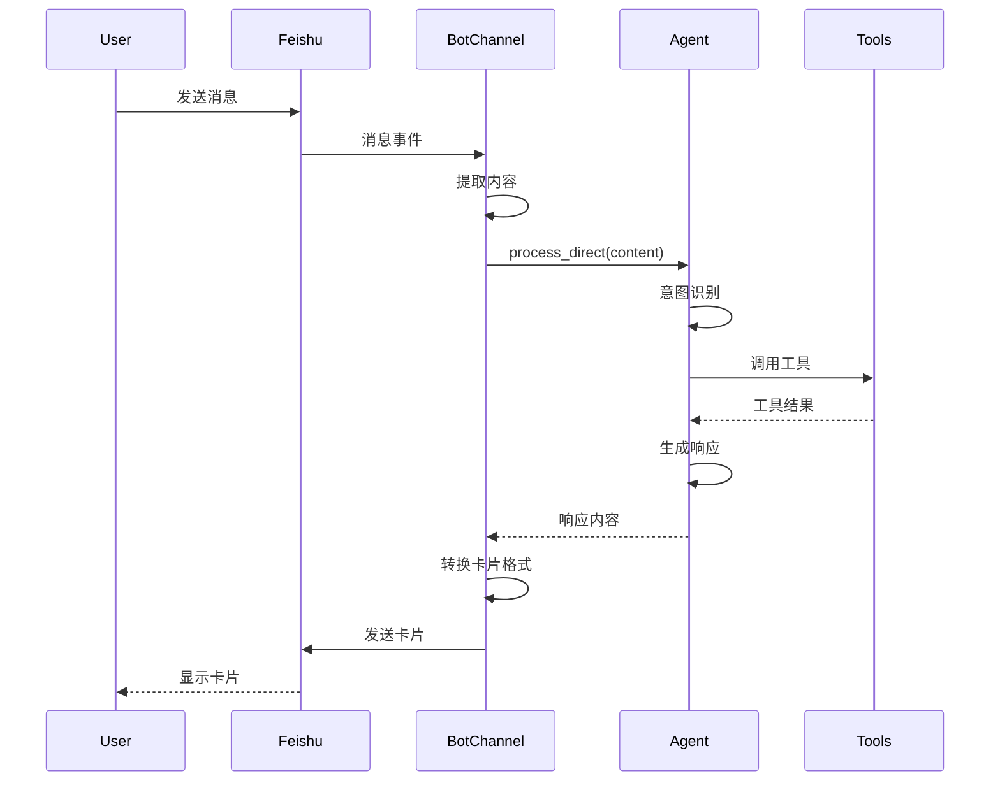
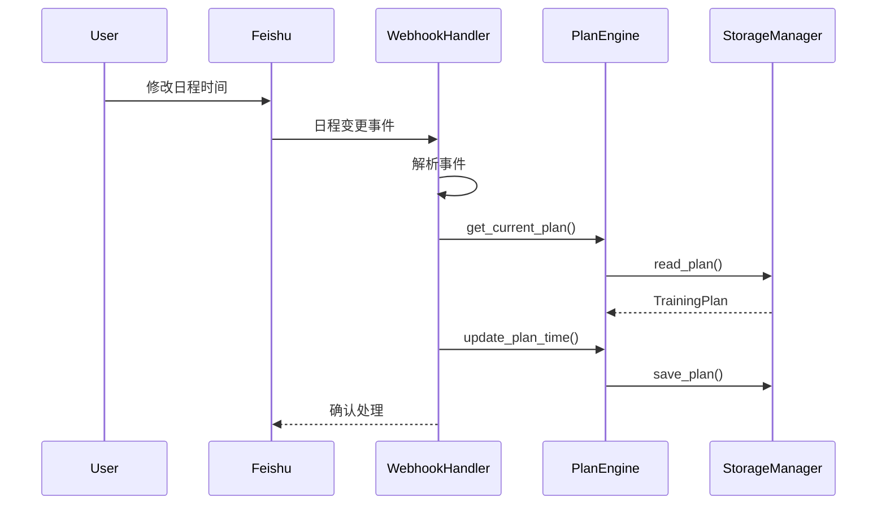
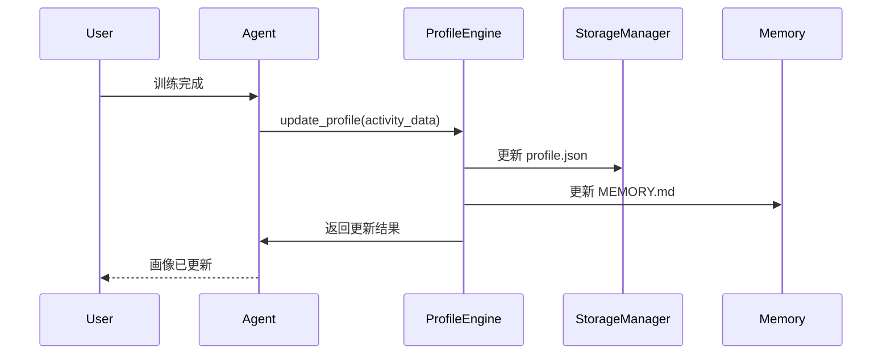

# 迭代架构设计说明书 v0.4.0

## 📋 文档信息

| 项目 | 内容 |
|------|------|
| **版本号** | v0.4.0-arch-v1.0 |
| **迭代主题** | 智能个性化 + 飞书深度集成 |
| **基线版本** | v0.3.1 |
| **创建日期** | 2026-03-18 |
| **文档状态** | 已发布 |
| **关联文档** | [迭代需求规格说明书](../requirement/0.4.0/迭代需求规格说明书.md) |

---

## 1. 架构设计概述

### 1.1 设计目标

v0.4.0 迭代架构设计遵循**增量式适配**原则，在现有架构基础上进行模块扩展，确保：

1. **向后兼容**：不破坏现有功能模块
2. **增量扩展**：新增模块独立于现有模块
3. **架构一致性**：遵循现有分层架构模式
4. **可测试性**：新增模块支持独立测试

### 1.2 现有架构分析

**v0.3.1 架构分层**：

```
src/
├── cli.py              # CLI入口层
├── cli_formatter.py    # 输出格式化层
├── core/               # 核心业务层
│   ├── analytics.py    # 数据分析引擎
│   ├── storage.py      # 存储管理
│   ├── parser.py       # FIT解析
│   ├── importer.py     # 导入服务
│   ├── indexer.py      # 索引管理
│   ├── config.py       # 配置管理
│   ├── schema.py       # 数据结构定义
│   ├── decorators.py   # 通用装饰器
│   ├── exceptions.py   # 异常定义
│   ├── logger.py       # 日志工具
│   └── report_service.py # 报告服务
├── agents/             # Agent工具层
│   └── tools.py        # RunnerTools工具集
└── notify/             # 通知层
    └── feishu.py       # 飞书推送
```

**现有架构模式**：

| 模式 | 实现位置 | 说明 |
|------|---------|------|
| 分层架构 | 整体结构 | CLI → Agent → Core → Storage |
| 工具模式 | agents/tools.py | BaseTool抽象类 + 具体工具实现 |
| 装饰器模式 | core/decorators.py | 错误处理、存储初始化装饰器 |
| 策略模式 | core/analytics.py | 不同分析算法策略 |

### 1.3 迭代架构变更概览

| 变更类型 | 模块 | 说明 |
|---------|------|------|
| 新增 | core/profile.py | 用户画像引擎 |
| 新增 | core/training_plan.py | 训练计划引擎 |
| 新增 | core/prediction.py | 比赛预测引擎 |
| 新增 | notify/feishu_calendar.py | 飞书日历同步 |
| 新增 | notify/feishu_bot.py | 飞书机器人通道 |
| 新增 | agents/tools_v2.py | 新增工具集 |
| 新增 | report/weekly_report.py | 周报生成 |
| 新增 | report/monthly_report.py | 月报生成 |
| 扩展 | agents/tools.py | 增加工具注册 |
| 扩展 | notify/feishu.py | 增加反向同步支持 |

---

## 2. 技术栈适配方案

### 2.1 技术栈清单

| 技术组件 | 版本要求 | 用途 | 变更 |
|---------|---------|------|------|
| Python | >= 3.11 | 核心开发语言 | 无变更 |
| nanobot-ai | >= 0.1.4 | Agent底座框架 | 无变更 |
| Polars | >= 0.20.0 | 数据计算引擎 | 无变更 |
| PyArrow | >= 14.0.0 | Parquet存储支持 | 无变更 |
| Typer + Rich | >= 0.12.0 | CLI框架 | 无变更 |
| pytest | >= 7.0.0 | 测试框架 | 无变更 |

### 2.2 nanobot-ai 能力利用矩阵

| nanobot-ai 能力 | v0.3.1 使用 | v0.4.0 增强 | 利用方式 |
|-----------------|------------|-------------|---------|
| AgentLoop | 基础对话 | 画像感知对话 | System Prompt 注入画像上下文 |
| ToolRegistry | 8 个工具 | 15+ 个工具 | 新增 tools_v2.py 注册新工具 |
| FeishuChannel | 单向推送 | 双向交互 | 新增 feishu_bot.py 作为 Channel |
| CronService | 晨报推送 | 计划提醒 + 周报 | 扩展 report_service.py |
| memory_window | 10 轮 | 可配置 + 画像持久化 | 配置化 + profile.json 持久化 |
| workspace | 数据存储 | 画像 + 计划存储 | 扩展存储路径 |

### 2.3 飞书 API 使用规划

| API 类别 | API 名称 | 用途 | 使用场景 |
|---------|---------|------|---------|
| 日历 API | calendar.v4.calendarEvent.create | 创建训练日程 | 训练计划同步 |
| 日历 API | calendar.v4.calendarEvent.update | 更新训练日程 | 计划变更同步 |
| 日历 API | calendar.v4.calendarEvent.delete | 删除训练日程 | 计划取消同步 |
| 日历 API | calendar.v4.calendarEvent.subscribe | 日程变更订阅 | 反向同步 |
| 消息 API | im.v1.message.create | 发送消息 | 机器人回复 |
| 消息 API | im.v1.message.receive | 接收消息 | 机器人接收（事件订阅） |
| 卡片 API | card.v1.card.create | 创建卡片消息 | 报告展示 |

---

## 3. 系统架构调整

### 3.1 整体架构图



### 3.2 架构分层说明

| 层级 | 组件 | 职责 | 变更 |
|------|------|------|------|
| 外部接入层 | CLI/飞书 | 用户交互入口 | 无变更 |
| 协议转换层 | Handler/Channel | 协议转换，不承担业务逻辑 | 新增 feishu_bot.py |
| 智能编排层 | Agent Loop | 意图识别、上下文记忆、任务编排 | 扩展 System Prompt |
| 工具执行层 | RunnerTools | 业务逻辑执行 | 新增 tools_v2.py |
| 核心引擎层 | AnalyticsEngine | 数据分析计算 | 无变更 |
| 数据层 | StorageManager | 数据持久化 | 扩展存储路径 |
| 通知层 | Notify Layer | 消息推送与同步 | 新增 feishu_calendar.py |
| 报告层 | Report Layer | 报告生成 | 新增 weekly_report.py, monthly_report.py |

### 3.3 核心设计原则

**原则 1: Agent 作为唯一决策中心**

```
所有用户输入（包括快捷指令）统一由 Agent 处理
├── 自然语言查询 → Agent 意图识别 → 工具调用
├── 快捷指令 → Agent 指令映射 → 工具调用
└── 训练记录 → Agent 上下文理解 → 数据更新
```

**原则 2: Channel 仅做协议转换**

```
FeishuBotChannel 职责边界：
├── 接收飞书事件 → 提取消息内容 → 转发 Agent
├── 接收 Agent 响应 → 转换飞书卡片格式 → 发送飞书
└── 不承担：业务逻辑、工具调用、数据存储
```

**原则 3: 工具层无状态**

```
RunnerTools 设计：
├── 无内部状态存储
├── 所有状态由 Agent 的 memory_window 管理
├── 画像/计划数据由 StorageManager 持久化
└── 每次调用独立，支持并发
```

---

## 4. 核心模块详细设计

### 4.1 用户画像引擎 (core/profile.py)

#### 4.1.1 模块职责

| 职责 | 说明 |
|------|------|
| 画像构建 | 基于历史数据构建多维度画像 |
| 画像更新 | 增量更新画像数据 |
| 保鲜期管理 | 检测画像数据新鲜度 |
| 异常过滤 | 过滤异常训练数据 |

#### 4.1.2 类设计

```python
class RunnerProfileEngine:
    """用户画像引擎"""
    
    def __init__(
        self,
        storage: StorageManager,
        analytics: AnalyticsEngine
    ):
        self.storage = storage
        self.analytics = analytics
        self.profile_path = storage.config.base_dir / "profile.json"
    
    def build_profile(self) -> RunnerProfile:
        """构建用户画像"""
        pass
    
    def update_profile(self, activity_data: Dict) -> None:
        """增量更新画像"""
        pass
    
    def check_freshness(self) -> ProfileStaleStatus:
        """检查画像新鲜度"""
        pass
    
    def get_fitness_level(self) -> FitnessLevel:
        """获取跑力水平维度"""
        pass
    
    def get_training_pattern(self) -> TrainingPattern:
        """获取训练习惯维度"""
        pass
    
    def calculate_injury_risk(self) -> InjuryRisk:
        """计算伤病风险"""
        pass
```

#### 4.1.3 数据结构

```python
@dataclass
class RunnerProfile:
    user_id: str
    profile_version: str
    last_updated: datetime
    
    fitness_level: FitnessLevel
    training_pattern: TrainingPattern
    recovery_capacity: RecoveryCapacity
    goal_preference: GoalPreference
    injury_risk: InjuryRisk
    summary: ProfileSummary
    
    stale_status: ProfileStaleStatus
    confidence_level: float
```

#### 4.1.4 与现有模块交互

```
RunnerProfileEngine
    ├── 依赖: StorageManager (读取活动数据)
    ├── 依赖: AnalyticsEngine (计算VDOT/TSS)
    └── 输出: profile.json (持久化)
```

#### 4.1.5 画像存储策略

**双存储机制**：

| 存储文件 | 格式 | 用途 | 更新机制 |
|---------|------|------|---------|
| `MEMORY.md` | Markdown | Agent长期记忆/用户画像 | 关键事件后更新 |
| `profile.json` | JSON | 结构化画像数据 | 每次训练后自动更新 |

**MEMORY.md 结构**：
```markdown
# 用户画像
> 📅 最后更新时间: 2026-03-19 14:30 (系统自动更新)

## 1. 核心体能数据
<!-- 此部分由 RunnerProfileEngine 计算后自动覆盖写入 -->
- **当前 VDOT**: 45.2 (趋势: 📈 上升)
- **体能评分**: 68/100
- **周跑量**: 35 km

## 2. 训练偏好与习惯
- **偏好时段**: 早晨 06:00
- **一致性评分**: 85/100
- **常用装备**: Nike Vaporfly Next%

## 3. 伤病与恢复记录
- **伤病风险等级**: 低
- **历史伤病**: 右脚踝曾扭伤 (2025年)
- **恢复能力**: 平均恢复时间 24 小时

## 4. Agent 观察笔记
<!-- 此部分允许 Agent 在交互中追加或修改 -->
- **2026-03-17**: 用户提到最近工作压力大，建议降低本周训练强度。
- **2026-03-18**: 用户反馈新跑鞋鞋带系法不舒服，下次提醒注意。
```

**profile.json 结构**：
```json
{
  "user_id": "default",
  "profile_version": "1.0",
  "last_updated": "2026-03-19T14:30:00Z",
  "fitness_level": {
    "current_vdot": 45.2,
    "vdot_trend": "rising",
    "fitness_score": 68
  },
  "training_pattern": {
    "weekly_distance_km": 35,
    "preferred_time": "morning",
    "consistency_score": 85
  },
  "injury_risk": {
    "level": "low",
    "history": ["right_ankle_sprain_2025"]
  }
}
```

**数据流**：
```
用户训练数据 
  → AnalyticsEngine计算指标 
  → RunnerProfileEngine更新两个存储 
  → Agent从MEMORY.md获取上下文
```

**维护策略**：
1. **应用主导更新**：`RunnerProfileEngine` 在每日晨报生成或新数据导入后，覆写 `MEMORY.md` 中的"核心体能数据"部分
2. **Agent 辅助更新**：Agent 发现新信息时，通过 `UpdateMemoryTool` 在"Agent 观察笔记"中追加条目
3. **格式保护**：统计数据放在 HTML 注释块 `<!-- ... -->` 中，避免 Agent 误删

### 4.2 训练计划引擎 (core/training_plan.py)

#### 4.2.1 模块职责

| 职责 | 说明 |
|------|------|
| 计划生成 | 根据画像和目标生成周期化训练计划 |
| 动态调整 | 根据训练完成情况调整计划 |
| 阶段管理 | 管理训练阶段划分 |

#### 4.2.2 类设计

```python
class TrainingPlanEngine:
    """训练计划生成引擎"""
    
    def __init__(
        self,
        profile_engine: RunnerProfileEngine,
        analytics: AnalyticsEngine
    ):
        self.profile = profile_engine
        self.analytics = analytics
    
    def generate_plan(
        self,
        goal: str,
        race_date: Optional[date] = None,
        duration_weeks: Optional[int] = None
    ) -> TrainingPlan:
        """生成训练计划"""
        pass
    
    def adjust_plan(
        self,
        plan: TrainingPlan,
        context: AdjustmentContext
    ) -> TrainingPlan:
        """动态调整训练计划"""
        pass
    
    def get_daily_workout(
        self,
        plan: TrainingPlan,
        date: date
    ) -> DailyPlan:
        """获取指定日期的训练计划"""
        pass
    
    def get_current_plan(self) -> Optional[TrainingPlan]:
        """获取当前训练计划"""
        pass
```

#### 4.2.3 与现有模块交互

```
TrainingPlanEngine
    ├── 依赖: RunnerProfileEngine (获取用户画像)
    ├── 依赖: AnalyticsEngine (计算训练负荷)
    └── 输出: plan.json (持久化)
```

### 4.3 飞书日历同步 (notify/feishu_calendar.py)

#### 4.3.1 模块职责

| 职责 | 说明 |
|------|------|
| 计划同步 | 将训练计划同步到飞书日历 |
| 反向同步 | 处理飞书日历变更通知 |
| 冲突处理 | 处理日程冲突 |

#### 4.3.2 类设计

```python
class FeishuCalendarSync:
    """飞书日历同步服务"""
    
    def __init__(self, config: CalendarSyncConfig):
        self.config = config
        self.access_token = None
    
    async def sync_plan(self, plan: TrainingPlan) -> SyncResult:
        """同步训练计划到飞书日历"""
        pass
    
    async def sync_daily_workout(
        self,
        daily_plan: DailyPlan,
        date: date
    ) -> SyncResult:
        """同步单日训练到日历"""
        pass
    
    async def handle_calendar_update(
        self,
        event: Dict
    ) -> None:
        """处理飞书日历事件变更"""
        pass
    
    async def check_conflicts(
        self,
        date: date,
        time_range: Tuple[time, time]
    ) -> List[CalendarEvent]:
        """检测日程冲突"""
        pass

class FeishuCalendarWebhookHandler:
    """飞书日历事件变更处理器"""
    
    def __init__(
        self,
        plan_engine: TrainingPlanEngine,
        calendar_sync: FeishuCalendarSync
    ):
        self.plan_engine = plan_engine
        self.calendar_sync = calendar_sync
    
    async def handle_calendar_event_update(
        self,
        event: Dict[str, Any]
    ) -> None:
        """处理飞书日历事件变更"""
        pass
```

### 4.3.3 飞书Webhook集成

**架构设计**：



**配置示例**：
```json
{
  "channels": {
    "feishu": {
      "webhooks": {
        "calendar": {
          "path": "/webhook/calendar",
          "handler": "FeishuCalendarWebhookHandler"
        }
      }
    }
  }
}
```

**WebhookHandler 实现**：
```python
class FeishuCalendarWebhookHandler:
    """飞书日历事件变更处理器"""
    
    def __init__(
        self,
        plan_engine: TrainingPlanEngine,
        calendar_sync: FeishuCalendarSync
    ):
        self.plan_engine = plan_engine
        self.calendar_sync = calendar_sync
    
    async def handle_calendar_event_update(
        self,
        event: Dict[str, Any]
    ) -> None:
        """处理飞书日历事件变更"""
        # 1. 解析事件
        event_id = event.get("event_id")
        new_time = event.get("start_time")
        
        # 2. 更新本地计划
        plan = self.plan_engine.get_current_plan()
        self.plan_engine.update_plan_time(plan, event_id, new_time)
        
        # 3. 通知 Agent 更新记忆
        # (通过 MessageBus 发送事件)
```

### 4.4 飞书机器人通道 (notify/feishu_bot.py)

#### 4.4.1 模块职责

| 职责 | 说明 |
|------|------|
| 消息接收 | 接收飞书消息事件 |
| 协议转换 | 飞书事件 ↔ Agent 输入格式 |
| 响应转换 | Agent 响应 ↔ 飞书卡片格式 |

#### 4.4.2 类设计

```python
class FeishuBotChannel:
    """飞书机器人通道（仅做协议转换）"""
    
    def __init__(self, agent_loop: AgentLoop):
        self.agent = agent_loop
    
    async def handle_message(
        self,
        event: Dict[str, Any]
    ) -> BotResponse:
        """处理接收到的消息（统一转发 Agent）"""
        pass
    
    def _extract_content(self, event: Dict) -> str:
        """提取消息内容"""
        pass
    
    def _convert_to_feishu_response(
        self,
        agent_response: str
    ) -> BotResponse:
        """将 Agent 响应转换为飞书消息格式"""
        pass
```

### 4.5 新增工具集 (agents/tools_v2.py)

#### 4.5.1 工具清单

| 工具名称 | 功能 | 对应需求 |
|---------|------|---------|
| GetProfileTool | 获取用户画像 | FR-001 |
| GetTrainingPlanTool | 获取训练计划 | FR-002 |
| CreateTrainingPlanTool | 创建训练计划 | FR-002 |
| AdjustTrainingPlanTool | 调整训练计划 | FR-002 |
| PredictRaceTimeTool | 比赛成绩预测 | FR-005 |
| GetWeeklyReportTool | 获取周报 | FR-006 |
| GetMonthlyReportTool | 获取月报 | FR-006 |
| CheckInjuryRiskTool | 伤病风险检查 | FR-008 |

#### 4.5.2 工具注册

```python
def create_tools_v2(
    profile_engine: RunnerProfileEngine,
    plan_engine: TrainingPlanEngine,
    prediction_engine: PredictionEngine,
    report_generator: ReportGenerator
) -> List[BaseTool]:
    """创建 v0.4.0 新增工具"""
    return [
        GetProfileTool(profile_engine),
        GetTrainingPlanTool(plan_engine),
        CreateTrainingPlanTool(plan_engine),
        AdjustTrainingPlanTool(plan_engine),
        PredictRaceTimeTool(prediction_engine),
        GetWeeklyReportTool(report_generator),
        GetMonthlyReportTool(report_generator),
        CheckInjuryRiskTool(profile_engine),
    ]
```

#### 4.5.3 工具与记忆系统交互规范

**原则**：工具不直接操作 MEMORY.md，由 Agent 负责记忆管理

**工具职责边界**：

| 工具 | 读取 | 写入 | 说明 |
|------|------|------|------|
| GetProfileTool | profile.json, MEMORY.md | 无 | 返回整合画像 |
| CreateTrainingPlanTool | profile.json | plan.json, profile.json | 生成计划并更新画像 |
| AdjustTrainingPlanTool | plan.json | plan.json | 调整计划，返回摘要给Agent |
| UpdateMemoryTool | MEMORY.md | MEMORY.md | Agent专用记忆更新工具 |

**GetProfileTool 示例实现**：
```python
class GetProfileTool(BaseTool):
    name = "get_profile"
    description = "获取用户跑步画像"
    
    def execute(self, dimension: str = "all"):
        # 读取结构化数据
        json_profile = self.storage.read_json("data/profile.json")
        # 读取记忆文件
        memory_profile = self.storage.read_file("memory/MEMORY.md")
        
        # 返回整合结果
        return {
            "quantitative": json_profile,
            "qualitative": memory_profile,
            "dimension": dimension
        }
```

**UpdateMemoryTool 设计**：
```python
class UpdateMemoryTool(BaseTool):
    """Agent专用记忆更新工具"""
    name = "update_memory"
    description = "更新用户画像记忆（仅允许追加观察笔记）"
    
    def execute(self, observation: str, category: str = "observation"):
        # 读取现有记忆
        memory_content = self.storage.read_file("memory/MEMORY.md")
        
        # 追加观察笔记（不修改统计数据区）
        timestamp = datetime.now().strftime("%Y-%m-%d")
        new_entry = f"- **{timestamp}**: {observation}\n"
        
        # 在"Agent 观察笔记"区域追加
        updated_content = self._append_observation(memory_content, new_entry)
        
        self.storage.write_file("memory/MEMORY.md", updated_content)
        
        return {"success": True, "message": "记忆已更新"}
```

---

## 5. 接口规范调整

### 5.1 新增工具接口

#### 5.1.1 GetProfileTool

```json
{
  "name": "get_profile",
  "description": "获取用户跑步画像，包括跑力水平、训练习惯、恢复能力、伤病风险等维度",
  "parameters": {
    "type": "object",
    "properties": {
      "dimension": {
        "type": "string",
        "description": "画像维度（可选）：fitness_level, training_pattern, recovery_capacity, injury_risk, all",
        "enum": ["fitness_level", "training_pattern", "recovery_capacity", "injury_risk", "all"]
      }
    }
  }
}
```

#### 5.1.2 CreateTrainingPlanTool

```json
{
  "name": "create_training_plan",
  "description": "创建个性化训练计划",
  "parameters": {
    "type": "object",
    "properties": {
      "goal": {
        "type": "string",
        "description": "训练目标，如：全马400、半马150"
      },
      "race_date": {
        "type": "string",
        "description": "比赛日期（可选，格式：YYYY-MM-DD）"
      },
      "duration_weeks": {
        "type": "integer",
        "description": "训练周期（周，可选）"
      }
    },
    "required": ["goal"]
  }
}
```

#### 5.1.3 PredictRaceTimeTool

```json
{
  "name": "predict_race_time",
  "description": "预测比赛成绩",
  "parameters": {
    "type": "object",
    "properties": {
      "distance_km": {
        "type": "number",
        "description": "目标距离（公里）"
      },
      "weeks_to_race": {
        "type": "integer",
        "description": "距离比赛周数（可选）"
      }
    },
    "required": ["distance_km"]
  }
}
```

### 5.2 飞书 API 接口封装

#### 5.2.1 日历事件创建

```python
@dataclass
class CalendarEventCreateRequest:
    summary: str
    start_time: datetime
    end_time: datetime
    description: Optional[str] = None
    reminders: List[Reminder] = field(default_factory=list)

@dataclass
class CalendarEventCreateResponse:
    event_id: str
    status: str
    html_link: str
```

#### 5.2.2 消息发送

```python
@dataclass
class MessageSendRequest:
    receive_id: str
    receive_id_type: str
    msg_type: str
    content: Union[str, Dict]

@dataclass
class MessageSendResponse:
    message_id: str
    create_time: int
```

---

## 6. 数据流设计

### 6.1 用户画像数据流



### 6.2 训练计划数据流



### 6.3 飞书机器人交互数据流



### 6.4 飞书日历反向同步数据流



### 6.5 画像更新数据流



**更新流程说明**：

1. **触发条件**：新训练数据导入、每日晨报生成、用户主动请求
2. **更新内容**：
   - `profile.json`：量化指标（VDOT、TSS、跑量等）
   - `MEMORY.md`：自然语言描述（体能状态、训练趋势、Agent观察）
3. **更新策略**：
   - 全量更新：每周或用户请求时
   - 增量更新：每次训练导入后
   - 观察追加：Agent交互中实时追加

---

## 7. 部署架构

### 7.1 本地部署架构

```
┌─────────────────────────────────────────────────────────────┐
│                     本地运行环境                              │
├─────────────────────────────────────────────────────────────┤
│  ┌─────────────┐  ┌─────────────┐  ┌─────────────────────┐  │
│  │   CLI App   │  │  Chat Mode  │  │   Report Service    │  │
│  └──────┬──────┘  └──────┬──────┘  └──────────┬──────────┘  │
└─────────┼────────────────┼───────────────────┼──────────────┘
          │                │                   │
┌─────────┴────────────────┴───────────────────┴──────────────┐
│                     nanobot-ai Framework                      │
│  ┌─────────────┐  ┌─────────────┐  ┌─────────────────────┐  │
│  │ AgentLoop   │  │ MessageBus  │  │    CronService      │  │
│  └──────┬──────┘  └──────┬──────┘  └──────────┬──────────┘  │
│         │                │                    │              │
│  ┌──────┴──────┐  ┌──────┴──────┐  ┌─────────┴──────────┐  │
│  │  Provider   │  │  Channels   │  │    Config Loader    │  │
│  └─────────────┘  └─────────────┘  └─────────────────────┘  │
└─────────────────────────────────────────────────────────────┘
          │
┌─────────┴───────────────────────────────────────────────────┐
│                     数据存储层                               │
│  ┌─────────────┐  ┌─────────────┐  ┌─────────────────────┐  │
│  │ Parquet     │  │ Profile     │  │     Plan            │  │
│  │ (活动数据)   │  │ (画像数据)   │  │   (计划数据)        │  │
│  └─────────────┘  └─────────────┘  └─────────────────────┘  │
│                                                              │
│  路径: ~/.nanobot-runner/data/                              │
└─────────────────────────────────────────────────────────────┘
          │
┌─────────┴───────────────────────────────────────────────────┐
│                     外部服务                                 │
│  ┌─────────────┐  ┌─────────────┐  ┌─────────────────────┐  │
│  │ 飞书日历    │  │ 飞书消息    │  │     LLM API         │  │
│  └─────────────┘  └─────────────┘  └─────────────────────┘  │
└─────────────────────────────────────────────────────────────┘
```

### 7.2 数据存储路径

| 数据类型 | 存储路径 | 格式 | 说明 |
|---------|---------|------|------|
| 活动数据 | `~/.nanobot-runner/data/activities_{year}.parquet` | Parquet | 按年分片 |
| 结构化画像 | `~/.nanobot-runner/data/profile.json` | JSON | 程序计算用 |
| 长期记忆 | `~/.nanobot-runner/memory/MEMORY.md` | Markdown | Agent上下文 |
| 事件日志 | `~/.nanobot-runner/memory/HISTORY.md` | Markdown | 可搜索历史 |
| 训练计划 | `~/.nanobot-runner/data/plans/{plan_id}.json` | JSON | 计划数据 |
| 会话历史 | `~/.nanobot-runner/sessions/feishu_{chat_id}.jsonl` | JSONL | 对话记录 |
| 技能定义 | `~/.nanobot-runner/skills/{skill_name}/SKILL.md` | Markdown | 技能模块 |
| 应用配置 | `~/.nanobot-runner/config.json` | JSON | 业务配置 |
| 框架配置 | `~/.nanobot/config.json` | JSON | nanobot配置 |
| 日志文件 | `~/.nanobot-runner/logs/` | Log | 运行日志 |

### 7.2.1 Workspace 初始化机制

> ⚠️ **重要**：workspace 目录结构由 nanobot-ai 框架自动初始化，无需自定义实现。

当启动 nanobot-runner 应用时，nanobot-ai 框架会检测 `workspace=~/.nanobot-runner` 是否存在或为空，自动创建缺失的标准结构：

| 自动创建的文件/目录 | 说明 |
|-------------------|------|
| `AGENTS.md` | Agent 行为准则模板 |
| `SOUL.md` | 人格、价值观、语气风格 |
| `USER.md` | 用户画像模板 |
| `memory/MEMORY.md` | 长期记忆初始文件 |
| `memory/HISTORY.md` | 事件日志初始文件 |
| `skills/` | 技能目录（如版本默认带） |

**应用需自行创建的目录**：
- `data/`：业务数据存储目录
- `data/plans/`：训练计划存储目录
- `logs/`：日志文件目录

**设计原则**：完全复用 nanobot 的初始化逻辑，避免重复实现。

### 7.3 飞书集成配置

```json
{
  "channels": {
    "feishu": {
      "enabled": true,
      "app_id": "${FEISHU_APP_ID}",
      "app_secret": "${FEISHU_APP_SECRET}",
      "calendar_id": "${FEISHU_CALENDAR_ID}"
    }
  }
}
```

---

## 8. 架构风险评估

### 8.1 技术风险

| 风险项 | 可能性 | 影响程度 | 应对策略 |
|--------|--------|---------|---------|
| 飞书 API 权限限制 | 中 | 高 | 使用企业自建应用，提前申请权限 |
| nanobot-ai 版本兼容 | 低 | 中 | 锁定版本依赖，充分测试 |
| 画像准确性不足 | 中 | 高 | 多维度验证，引入用户反馈机制 |
| 训练计划科学性存疑 | 中 | 高 | 引入专业教练审核，参考权威文献 |

### 8.2 架构债务

| 债务项 | 影响 | 偿还计划 |
|--------|------|---------|
| 现有工具未统一类型注解 | 低 | v0.4.0 开发过程中统一补充 |
| 飞书推送缺少重试机制 | 中 | v0.4.0 增加重试装饰器 |

---

## 9. 验收标准

### 9.1 架构设计验收

- [x] 符合事件驱动设计
- [x] 技术栈适配项目场景
- [x] 接口规范覆盖核心交互
- [x] 部署架构可落地
- [x] 适配原有架构无重大重构

### 9.2 模块设计验收

- [x] 新增模块职责清晰
- [x] 模块间依赖关系明确
- [x] 数据流设计完整
- [x] 接口规范定义完整

---

## 10. 变更历史

| 版本 | 日期 | 变更内容 | 作者 |
|------|------|---------|------|
| v1.0 | 2026-03-18 | 初始版本 | 架构师智能体 |
| v1.1 | 2026-03-19 | 架构评审修订：新增双存储机制、记忆系统、Webhook集成 | 架构师智能体 |

---

**文档状态**: 已发布  
**发布版本**: v0.4.0-arch-v1.1  
**关联文档**: [迭代需求规格说明书](../requirement/0.4.0/迭代需求规格说明书.md) | [迭代开发任务清单](../planning/task_list_v0.4.0.md)
