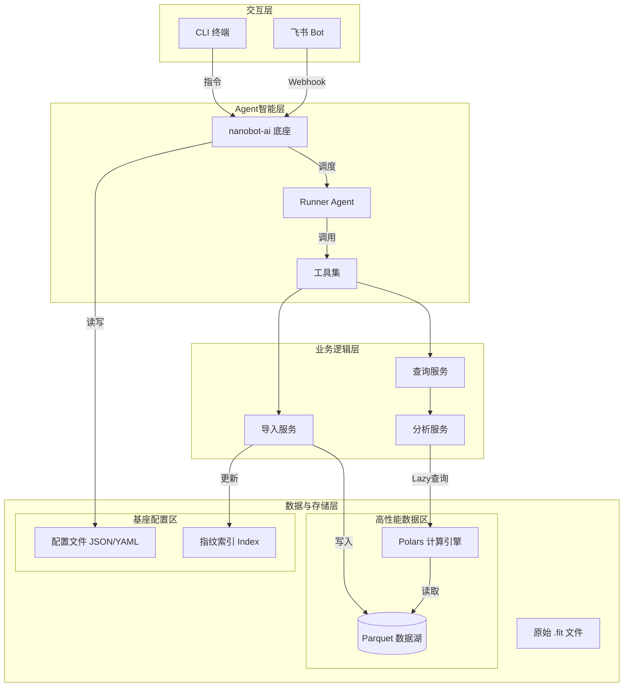
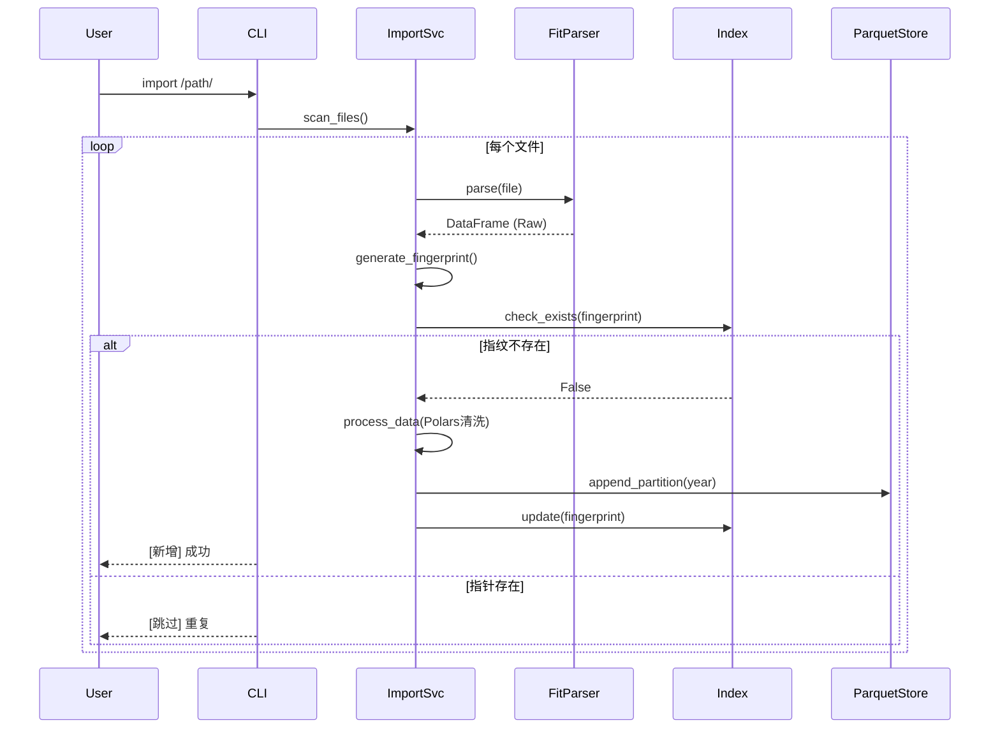

# 系统架构设计说明书
## 1. 架构概述
本项目基于 **nanobot-ai** 底座构建，采用 **分层插件化架构**。系统设计遵循“本地优先、隐私至上、高性能计算”原则。核心亮点在于引入 **Parquet+Polars** 构建高性能数据分析子系统集成，解决传统本地应用在处理大量运动数据时的性能瓶颈。
## 2. 技术栈选型
| 层级 | 技术组件 | 选型依据 | 版本要求 |
| :--- | :--- | :--- | :--- |
| **核心底座** | **nanobot-ai** | 提供Agent运行时、基础工具链、配置管理规范 | Latest |
| **开发语言** | Python | 生态丰富，AI领域标准语言 | 3.10+ |
| **CLI框架** | Typer + Rich | 构建现代化、带富文本提示的命令行工具 | Latest |
| **数据存储 (业务)** | **Apache Parquet** | 列式存储，极高压缩比，适配OLAP分析场景 | via `pyarrow` |
| **计算引擎 (业务)** | **Polars** | Rust实现的多线程DataFrame库，性能远超Pandas，内存占用低 | 0.20+ |
| **数据解析** | fitparse | 专门解析 .fit 文件的成熟库 | Latest |
| **配置/状态** | JSON/YAML | 遵循 nanobot-ai 基座规范，轻量级配置管理 | Built-in |
## 3. 系统整体架构图

## 4. 核心模块详细设计
### 4.1 数据存储架构设计
系统数据分为两类，分别采用最优存储策略：
#### 4.1.1 历史跑步数据
用于存储解析后的活动明细与汇总指标，数据量大、分析查询频繁。
*   **存储格式**：`.parquet`
*   **目录结构**：按年份分区，减少单文件体积，提升查询效率。
    ```text
    ~/.nanobot-runner/data/
    ├── activities_2023.parquet  # 2023年活动数据
    ├── activities_2024.parquet  # 2024年活动数据
    └── ...
    ```
*   **Schema设计 (Polars Schema)**：
    *   `activity_id` (String): 唯一标识
    *   `timestamp` (Datetime): 活动开始时间
    *   `summary` (Struct): 汇总数据（总距离、时长、TSS等）
    *   `records` (List[Struct]): 秒级明细数据（心率、配速、步频轨迹）
#### 4.1.2 系统管理与索引数据
用于存储配置、去重指纹，数据量小、随机读写频繁。
*   **遵循策略**：遵循 `nanobot-ai` 基座规范。
*   **去重索引**：采用独立的 `index.json` 或 `index.pkl` 文件，存储 `fingerprint` 集合。
    *   *设计理由*：导入时只需Load全量指纹到内存比对，避免扫描庞大的 Parquet 文件，实现毫秒级去重校验。
### 4.2 数据导入流程设计
导入模块采用“解析-校验-落盘”三步流水线。

### 4.3 数据分析引擎设计
核心利用 **Polars Lazy API**，实现高性能查询。
*   **查询优化机制**：
    *   **谓词下推**：查询时仅读取符合筛选条件的行（如 `filter(timestamp > '2024-01-01')`），不加载全量数据。
    *   **列剪枝**：仅读取需要的列（如仅读心率列），极大降低内存占用。
*   **Agent 工具封装**：
    *   Agent 不直接操作 Polars，而是调用预定义的 `Tool`。
    *   示例 Tool：`query_activities(start_date, end_date, metrics)`，内部转换为 Polars 查询代码。
### 4.4 Agent 与 CLI 交互设计
*   **CLI 入口**：`cli.py` 作为统一入口。
*   **模式切换**：
    1.  **命令模式**：直接执行 `nanobotrun import`，不启动 LLM，速度快，零Token消耗。
    2.  **对话模式**：执行 `nanobotrun chat`，初始化 nanobot-ai Agent，进入自然语言交互。
## 5. 接口规范设计
### 5.1 CLI 指令规范
*   `nanobotrun import <path>`：导入数据。
*   `nanobotrun stats`：展示本地数据概览（调用 Polars 聚合）。
*   `nanobotrun chat`：启动交互式 Agent。
*   `nanobotrun report --type <pdf/html>`：生成报告。
### 5.2 数据接口
系统内部模块间通过 Polars DataFrame 传递数据，减少序列化开销。
## 6. 部署架构
适配 Trae IDE 与个人开发者场景，采用 **本地单机部署**。
**项目目录结构规范**：
```text
nanobot-runner/
├── src/
│   ├── core/              # 核心业务逻辑
│   │   ├── parser.py      # FIT解析封装
│   │   ├── engine.py      # Polars计算引擎封装
│   │   └── storage.py     # Parquet读写管理
│   ├── agents/            # Agent 定义
│   │   ├── runner_agent.py
│   │   └── tools.py       # Agent 可调用的工具集
│   ├── cli.py             # CLI 入口
│   └── config.py          # 配置管理
├── data/                  # 本地数据目录
├── tests/                 # 单元测试
├── docs/                  # 架构文档
├── pyproject.toml         # 项目依赖
└── README.md
```
## 7. 非功能性设计
### 7.1 性能指标
*   **导入性能**：单文件解析 + 写入 < 100ms。
*   **查询性能**：百万级数据行聚合查询 < 1s (Polars 多线程加速)。
*   **内存控制**：常规分析操作内存占用 < 500MB (利用 Lazy Loading)。
### 7.2 安全合规
*   **数据沙箱**：所有 Parquet、Index、Config 文件默认存储在 `~/.nanobot-runner/`，不越权访问其他目录。
*   **网络隔离**：仅在配置飞书推送时发起出站请求，且仅发送摘要文本，不发送原始数据。

