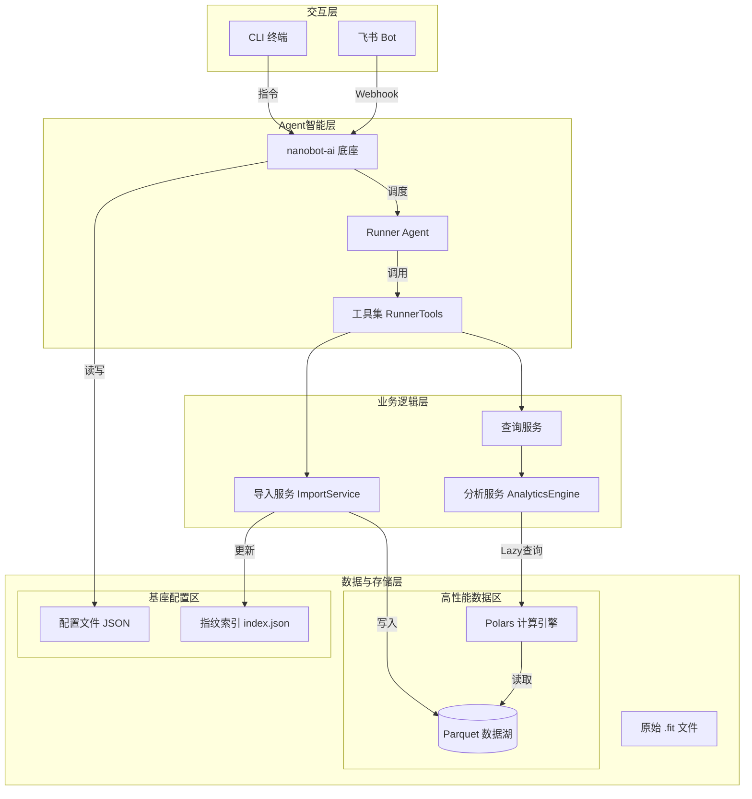
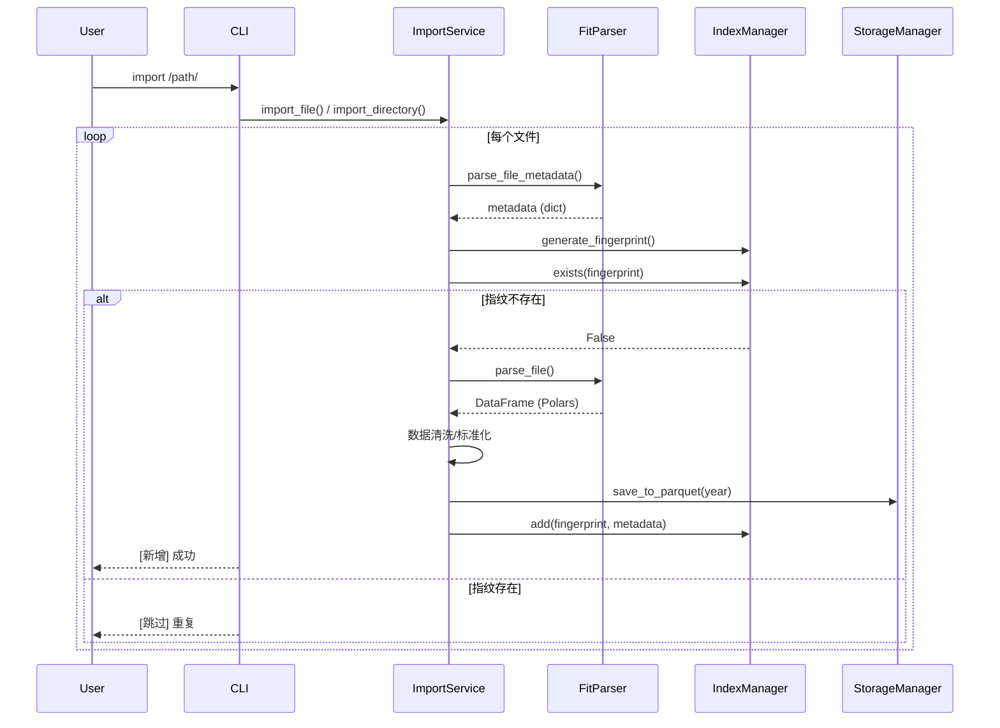

# 系统架构设计说明书

## 1. 架构概述
本项目基于 **nanobot-ai** 底座构建，采用 **分层插件化架构**。系统设计遵循"本地优先、隐私至上、高性能计算"原则。核心亮点在于引入 **Parquet+Polars** 构建高性能数据分析子系统集成，解决传统本地应用在处理大量运动数据时的性能瓶颈。

## 2. 技术栈选型
| 层级 | 技术组件 | 选型依据 | 版本要求 |
| :--- | :--- | :--- | :--- |
| **核心底座** | **nanobot-ai** | 提供Agent运行时、基础工具链、配置管理规范 | Latest |
| **开发语言** | Python | 生态丰富，AI领域标准语言 | 3.11+ |
| **CLI框架** | Typer + Rich | 构建现代化、带富文本提示的命令行工具 | Latest |
| **数据存储 (业务)** | **Apache Parquet** | 列式存储，极高压缩比，适配OLAP分析场景 | via `pyarrow` |
| **计算引擎 (业务)** | **Polars** | Rust实现的多线程DataFrame库，性能远超Pandas，内存占用低 | 0.20+ |
| **数据解析** | fitparse | 专门解析 .fit 文件的成熟库 | Latest |
| **配置/状态** | JSON | 轻量级配置管理，索引使用JSON格式 | Built-in |

## 3. 系统整体架构图


## 4. 核心模块详细设计

### 4.1 数据存储架构设计
系统数据分为两类，分别采用最优存储策略：

#### 4.1.1 历史跑步数据
用于存储解析后的活动明细与汇总指标，数据量大、分析查询频繁。
*   **存储格式**：`.parquet`
*   **目录结构**：按年份分区，减少单文件体积，提升查询效率。
    ```text
    ~/.nanobot-runner/data/
    ├── activities_2023.parquet  # 2023年活动数据
    ├── activities_2024.parquet  # 2024年活动数据
    └── ...
    ```
*   **Schema设计 (ParquetSchema)**：
    *   **必填字段**: `activity_id`, `timestamp`, `source_file`, `filename`, `total_distance`, `total_timer_time`
    *   **活动元数据字段**: `serial_number`, `time_created`, `total_calories`, `avg_heart_rate`, `max_heart_rate`, `record_count`
    *   **秒级记录字段**: `position_lat`, `position_long`, `distance`, `duration`, `heart_rate`, `cadence`, `speed`, `power`, `altitude`, `temperature`

#### 4.1.2 系统管理与索引数据
用于存储配置、去重指纹，数据量小、随机读写频繁。
*   **存储位置**: `~/.nanobot-runner/`
*   **配置文件**: `config.json`
*   **去重索引**: `index.json`，存储 `fingerprint` 集合
    *   *设计理由*：导入时只需Load全量指纹到内存比对，避免扫描庞大的 Parquet 文件，实现毫秒级去重校验。
    *   *指纹生成*: 基于文件元数据（serial_number + time_created + 文件大小）计算SHA256

### 4.2 数据导入流程设计
导入模块采用"解析-校验-落盘"三步流水线。


### 4.3 数据分析引擎设计
核心利用 **Polars Lazy API**，实现高性能查询。
*   **查询优化机制**：
    *   **谓词下推**：查询时仅读取符合筛选条件的行（如 `filter(timestamp > '2024-01-01')`），不加载全量数据。
    *   **列剪枝**：仅读取需要的列（如仅读心率列），极大降低内存占用。
    *   **分区裁剪**：按年份查询时只读取对应年份的Parquet文件。
*   **核心分析功能**：
    *   **VDOT计算**: 基于Powers公式计算跑力值（距离>=1500m时有效）
    *   **TSS计算**: 训练压力分数，基于心率强度因子
    *   **ATL/CTL计算**: 急性/慢性训练负荷（7天/42天EWMA指数移动平均）
    *   **心率漂移分析**: 基于心率和配速的相关性分析
    *   **心率区间分析**: 基于最大心率百分比划分5个区间
    *   **配速分布统计**: 按配速区间聚合分析
    *   **每日晨报生成**: 综合体能状态评估和训练建议

### 4.4 Agent 与 CLI 交互设计
*   **CLI 入口**：`cli.py` 作为统一入口，基于Typer框架。
*   **可用命令**：
    *   `nanobotrun import <path> [--force]`：导入FIT文件/目录
    *   `nanobotrun stats [--year YYYY | --start DATE --end DATE]`：查看统计信息
    *   `nanobotrun chat`：启动交互式Agent对话模式
    *   `nanobotrun report [--push] [--schedule HH:MM]`：生成/推送每日晨报
    *   `nanobotrun version`：显示版本信息
*   **模式切换**：
    1.  **命令模式**：直接执行CLI命令，不启动LLM，速度快，零Token消耗。
    2.  **对话模式**：执行 `nanobotrun chat`，初始化nanobot-ai Agent，进入自然语言交互。

### 4.5 Agent工具集设计
`RunnerTools` 类封装所有业务逻辑，通过 `BaseTool` 子类暴露给Agent：
*   `get_running_stats`：获取跑步统计数据
*   `get_recent_runs`：获取最近跑步记录
*   `calculate_vdot_for_run`：计算单次跑步VDOT值
*   `get_vdot_trend`：获取VDOT趋势
*   `get_hr_drift_analysis`：分析心率漂移
*   `get_training_load`：获取训练负荷（ATL/CTL/TSB）
*   `query_by_date_range`：按日期范围查询
*   `query_by_distance`：按距离范围查询

## 5. 接口规范设计

### 5.1 CLI 指令规范
| 命令 | 参数 | 说明 |
|------|------|------|
| `import` | `<path>` `[--force]` | 导入FIT文件或目录 |
| `stats` | `[--year]` `[--start]` `[--end]` | 查看跑步统计 |
| `chat` | - | 启动Agent对话模式 |
| `report` | `[--push]` `[--schedule]` `[--enable/--disable]` `[--status]` `[--age]` | 生成/推送晨报 |
| `version` | - | 显示版本 |

### 5.2 内部数据接口
系统内部模块间通过 Polars DataFrame/LazyFrame 传递数据，减少序列化开销。
*   `StorageManager.read_parquet(years)` -> `pl.LazyFrame`
*   `StorageManager.read_activities(year)` -> `pl.DataFrame`
*   `AnalyticsEngine.get_running_summary()` -> `pl.DataFrame`

### 5.3 工具接口规范
Agent工具遵循OpenAI Function Calling规范：
*   每个工具继承 `BaseTool` 基类
*   必须实现 `name`, `description`, `parameters`, `execute()`
*   返回JSON格式字符串

## 6. 部署架构
适配 Trae IDE 与个人开发者场景，采用 **本地单机部署**。

**项目目录结构规范**：
```text
nanobot-runner/
├── src/
│   ├── core/              # 核心业务逻辑
│   │   ├── parser.py      # FIT解析封装 (FitParser)
│   │   ├── storage.py     # Parquet读写管理 (StorageManager)
│   │   ├── indexer.py     # 去重索引管理 (IndexManager)
│   │   ├── importer.py    # 导入服务 (ImportService)
│   │   ├── analytics.py   # 分析引擎 (AnalyticsEngine)
│   │   ├── schema.py      # Schema定义 (ParquetSchema)
│   │   ├── config.py      # 配置管理 (ConfigManager)
│   │   ├── decorators.py  # 通用装饰器
│   │   ├── logger.py      # 日志管理
│   │   ├── exceptions.py  # 异常定义
│   │   └── report_service.py  # 晨报服务
│   ├── agents/            # Agent 定义
│   │   ├── tools.py       # Agent 工具集 (RunnerTools)
│   │   └── __init__.py
│   ├── notify/            # 通知模块
│   │   └── feishu.py      # 飞书推送 (FeishuBot)
│   ├── cli.py             # CLI 入口
│   ├── cli_formatter.py   # CLI格式化输出
│   └── __init__.py
├── tests/                 # 测试目录
│   ├── unit/              # 单元测试
│   ├── integration/       # 集成测试
│   ├── e2e/               # 端到端测试
│   └── performance/       # 性能测试
├── docs/                  # 项目文档
├── pyproject.toml         # 项目依赖
└── README.md
```

## 7. 非功能性设计

### 7.1 性能指标
*   **导入性能**：单文件解析 + 写入 < 100ms（典型FIT文件）。
*   **查询性能**：百万级数据行聚合查询 < 1s (Polars 多线程加速)。
*   **内存控制**：常规分析操作内存占用 < 500MB (利用 Lazy Loading)。
*   **存储效率**：Parquet列式存储，压缩比通常可达 5:1 至 10:1。

### 7.2 安全合规
*   **数据沙箱**：所有 Parquet、Index、Config 文件默认存储在 `~/.nanobot-runner/`，不越权访问其他目录。
*   **网络隔离**：仅在配置飞书推送时发起出站请求，且仅发送摘要文本，不发送原始数据。
*   **去重安全**：使用SHA256指纹，确保相同数据不会被重复导入。

## 8. 已知架构风险

### 8.1 风险识别清单

| 风险ID | 风险名称 | 风险等级 | 影响范围 | 当前状态 |
|--------|----------|----------|----------|----------|
| R-007 | 数据量增长导致性能下降 | 高 | 存储层、查询层 | 监控中 |
| R-010 | 文档与代码不同步 | 中 | 维护性 | 已识别 |

### 8.2 R-007: 数据量增长性能风险

#### 风险描述
当前架构按年份分区存储Parquet文件，但在以下场景可能出现性能瓶颈：
1. **单文件过大**：当某一年数据量超过1000万条记录时，单个Parquet文件可能达到GB级别
2. **查询性能下降**：跨多年份查询时需要加载多个大文件
3. **内存压力**：当前`read_activities()`方法使用`pl.read_parquet()`会加载完整数据到内存
4. **追加写入瓶颈**：频繁追加到同一Parquet文件可能导致文件碎片化

#### 影响分析
- **触发条件**: 用户持续使用3年以上，每年跑步记录超过500次
- **性能影响**: 查询响应时间从<1s增加到>5s
- **内存影响**: 峰值内存占用可能超过2GB

#### 应对策略
1. **短期缓解（当前版本）**:
   - 已使用`scan_parquet()`替代`read_parquet()`在分析场景
   - 利用Polars LazyFrame实现谓词下推和列剪枝
   - 按年份分区减少单次读取数据量

2. **中期优化（V1.0版本）**:
   - **按月分区**: 将分区粒度从年细化到月，`activities_2024_01.parquet`
   - **文件大小限制**: 单Parquet文件超过500MB时自动拆分
   - **元数据缓存**: 缓存各文件的统计元数据（记录数、时间范围）避免读取完整文件

3. **长期架构演进（V2.0版本）**:
   - **多级分区**: 年/月/周三级分区策略
   - **增量索引**: 建立活动ID到文件位置的索引，实现O(1)定位
   - **数据归档**: 自动归档3年以上历史数据到压缩存档

#### 监控指标
```python
# 需要监控的关键指标
{
    "max_file_size_mb": "单文件大小阈值",
    "total_records": "总记录数",
    "query_response_time_p95": "P95查询响应时间",
    "memory_peak_mb": "峰值内存占用"
}
```

### 8.3 R-010: 文档与代码不同步风险

#### 风险描述
架构文档可能滞后于代码实现，导致：
1. 新开发人员参考过时文档产生误解
2. 架构决策记录不完整，历史原因丢失
3. 接口变更未及时同步到文档

#### 应对措施
1. **文档即代码**: 架构文档纳入版本控制，与代码同库管理
2. **变更驱动**: 任何架构变更必须同步更新本文档
3. **定期审查**: 每个迭代周期结束前进行文档一致性检查
4. **自动化检查**: 通过CI检查Schema定义与文档的一致性

## 9. 扩展性设计建议

### 9.1 数据分区扩展
当前按年分区是合理的初始设计，建议按数据量动态调整：

```python
# 分区策略决策逻辑
def get_partition_strategy(year_record_count: int) -> str:
    if year_record_count < 100_000:
        return "year"      # 按年分区
    elif year_record_count < 1_000_000:
        return "quarter"   # 按季度分区
    else:
        return "month"     # 按月分区
```

### 9.2 缓存机制设计
为提升高频查询性能，建议引入多级缓存：

1. **元数据缓存**: 缓存各Parquet文件的统计信息
2. **查询结果缓存**: 缓存常用统计查询结果（如本月总距离）
3. **VDOT缓存**: 缓存已计算的VDOT值避免重复计算

```python
# 建议的缓存接口设计
class QueryCache:
    def get(self, key: str) -> Optional[Any]: ...
    def set(self, key: str, value: Any, ttl: int): ...
    def invalidate(self, pattern: str): ...
```

### 9.3 数据压缩优化
当前使用Snappy压缩，建议根据场景选择：
- **Snappy**: 默认选择，读写速度快
- **Zstd**: 更高压缩比，适合归档数据
- **Gzip**: 最大压缩比，适合长期备份

## 10. 变更历史

| 版本 | 日期 | 变更内容 | 变更人 | 相关风险 |
|------|------|----------|--------|----------|
| 0.1.0 | 2024-01 | 初始架构设计，基础导入查询功能 | 架构师 | - |
| 0.2.0 | 2024-02 | 新增AnalyticsEngine，支持VDOT/TSS计算 | 架构师 | - |
| 0.3.0 | 2024-03 | 新增Agent工具集、飞书推送、每日晨报 | 架构师 | - |
| 0.3.1 | 2026-03-17 | **风险复盘架构调整** | 架构师 | R-007, R-010 |

### 0.3.1 版本变更详情

#### 新增内容
1. **第8章 已知架构风险**
   - 新增风险识别清单
   - 详细分析R-007数据量增长性能风险
   - 详细分析R-010文档与代码不同步风险
   - 制定短中长期应对策略

2. **第9章 扩展性设计建议**
   - 数据分区扩展策略
   - 缓存机制设计建议
   - 数据压缩优化建议

#### 修正内容
1. **技术栈版本**: Python 3.10+ 修正为 3.11+（nanobot-ai要求）
2. **Schema描述**: 补充完整字段列表，区分必填/可选字段
3. **模块结构**: 更新目录结构，补充新增模块（report_service, exceptions等）
4. **CLI命令**: 补充完整的命令参数说明
5. **架构图**: 更新组件名称与实际代码一致

#### 架构决策记录
- **决策**: 保持按年分区策略，但增加文件大小监控
- **理由**: 当前数据量下按年分区足够，过早优化会增加复杂度
- **触发条件**: 单文件超过500MB或查询响应时间超过2秒时启动分区粒度调整

---
*文档版本: 0.3.1*
*最后更新: 2026-03-17*
*审核状态: 已同步代码状态*
