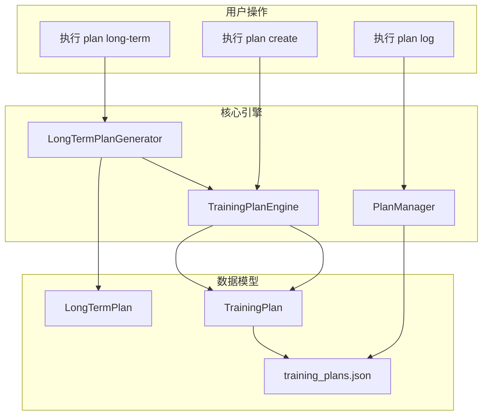
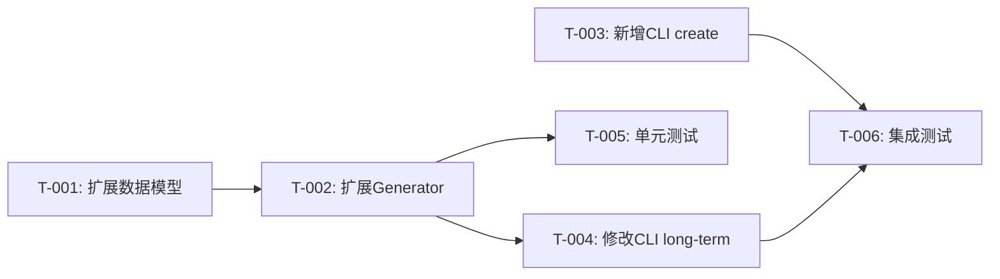

# BUG-001 修复技术设计方案

> **文档版本**: v1.0  
> **创建日期**: 2026-04-27  
> **维护者**: 架构师智能体  
> **关联Bug**: BUG-001 - CLI缺少创建TrainingPlan的命令  

---

## 一、问题背景

### 1.1 Bug描述

在 v0.12.0 UAT测试中，发现以下问题：

- **UAT-013**: 记录训练计划反馈 - ⏭️ 跳过
- **UAT-014**: 查看训练计划统计 - ⏭️ 跳过

**根因**: CLI缺少创建 `TrainingPlan` 的命令，导致 `plan log` 和 `plan stats` 无法执行。

### 1.2 影响范围

| 影响项 | 影响程度 |
|--------|---------|
| 核心业务流程 | 中等（非核心功能异常，不影响主流程） |
| 用户体验 | 高（训练计划反馈功能不可用） |
| 数据完整性 | 低（无数据丢失风险） |

---

## 二、根因分析

### 2.1 数据模型差异

项目中存在两种训练计划数据模型：

#### TrainingPlan（训练计划）

**定义位置**: [src/core/models.py:329-478](file:///d:\yecll\Documents\LocalCode\RunFlowAgent.worktrees\Release-0.12\src\core\models.py#L329-L478)

**用途**: 详细的训练执行计划，包含每日训练安排

**核心字段**:
```python
@dataclass
class TrainingPlan:
    plan_id: str                    # 计划ID（唯一标识）
    user_id: str                    # 用户ID
    plan_type: PlanType             # 计划类型
    fitness_level: FitnessLevel     # 体能水平
    start_date: str                 # 开始日期
    end_date: str                   # 结束日期
    goal_distance_km: float         # 目标距离
    goal_date: str                  # 目标日期
    weeks: list[WeeklySchedule]     # 每周训练安排（包含每日计划）
    status: PlanStatus              # 计划状态
    metadata: dict[str, Any] | None # 元数据（可扩展）
```

**支持操作**:
- 执行反馈记录（`plan log`）
- 统计查询（`plan stats`）
- 计划调整（`plan adjust`）
- 调整建议（`plan suggest`）

#### LongTermPlan（长期训练规划）

**定义位置**: [src/core/models.py:1012-1050](file:///d:\yecll\Documents\LocalCode\RunFlowAgent.worktrees\Release-0.12\src\core\models.py#L1012-L1050)

**用途**: 宏观训练周期规划，不包含具体每日安排

**核心字段**:
```python
@dataclass
class LongTermPlan:
    plan_name: str                          # 计划名称
    target_race: str | None                 # 目标赛事
    target_date: str | None                 # 目标日期
    current_vdot: float | None              # 当前VDOT
    target_vdot: float | None               # 目标VDOT
    total_weeks: int                        # 总周数
    cycles: list[TrainingCycle]             # 训练周期列表
    weekly_volume_range_km: tuple[float, float]  # 周跑量范围
    key_milestones: list[str]               # 关键里程碑
```

**缺失字段**: 无 `plan_id`，无法被 `plan log` 命令引用

### 2.2 命令现状分析

| 命令 | 创建的数据模型 | 是否生成 plan_id | 能否被 plan log 引用 | 实现位置 |
|------|---------------|-----------------|-------------------|---------|
| `plan long-term` | LongTermPlan | ❌ 否 | ❌ 否 | [plan.py:277-349](file:///d:\yecll\Documents\LocalCode\RunFlowAgent.worktrees\Release-0.12\src\cli\commands\plan.py#L277-L349) |
| `plan log` | 需要 TrainingPlan.plan_id | - | ✅ 是 | [plan.py:12-71](file:///d:\yecll\Documents\LocalCode\RunFlowAgent.worktrees\Release-0.12\src\cli\commands\plan.py#L12-L71) |
| `plan stats` | 需要 TrainingPlan.plan_id | - | ✅ 是 | [plan.py:74-103](file:///d:\yecll\Documents\LocalCode\RunFlowAgent.worktrees\Release-0.12\src\cli\commands\plan.py#L74-L103) |

**核心矛盾**: `plan long-term` 创建的 `LongTermPlan` 无法被 `plan log` 命令使用，两者是独立的数据模型，没有关联关系。

---

## 三、解决方案对比分析

### 3.1 方案A：新增 `plan create` 命令

#### 实现方式

新增 CLI 命令 `plan create`，调用 `TrainingPlanEngine.generate_plan()` 创建 `TrainingPlan`。

**命令示例**:
```bash
nanobotrun plan create 42.195 2026-06-15 --vdot 42.0 --volume 35
```

#### 优点

- ✅ 职责清晰，符合现有架构分层
- ✅ 实现简单，复用现有 `TrainingPlanEngine`
- ✅ 用户可灵活创建独立训练计划
- ✅ 实现成本低（约 4-6 小时）

#### 缺点

- ❌ 操作步骤多，用户体验不佳（需先创建计划，再记录反馈）
- ❌ 与 `plan long-term` 功能重叠，用户可能困惑
- ❌ 无法自动关联长期规划与具体训练计划

---

### 3.2 方案B：修改 `plan log` 命令，支持无计划记录

#### 实现方式

修改 `plan log` 命令，移除 `plan_id` 必填参数，支持直接使用日期记录训练反馈。

**命令示例**:
```bash
nanobotrun plan log 2026-04-27 --completion 0.8 --effort 6
```

#### 优点

- ✅ 操作简单，用户友好
- ✅ 无需预先创建计划
- ✅ 实现成本中等（约 8-10 小时）

#### 缺点

- ❌ 破坏计划管理完整性，失去计划约束和指导
- ❌ 无法使用 `plan stats` 统计功能
- ❌ 违背"计划驱动训练"的产品理念
- ❌ 需要新增数据存储模型，增加维护成本

---

### 3.3 方案C：`plan long-term` 自动创建关联的 TrainingPlan

#### 实现方式

在 `LongTermPlanGenerator.generate_plan()` 中，为每个 `TrainingCycle` 自动生成对应的 `TrainingPlan`。

**命令示例**:
```bash
nanobotrun plan long-term "2026春季马拉松备赛" --vdot 42.0 --target 45.0 --weeks 16
# 输出：
#   📝 关联训练计划：
#     [base] plan_20260427_base_001
#     [build] plan_20260427_build_002
#     [peak] plan_20260427_peak_003
#     [taper] plan_20260427_taper_004
```

#### 优点

- ✅ 自动化，用户体验最佳（一次创建，多计划可用）
- ✅ 保持数据完整性，长期规划与具体计划关联
- ✅ 符合"宏观规划→具体执行"的训练逻辑
- ✅ 复用现有 `TrainingPlanEngine`，实现成本可控

#### 缺点

- ❌ 实现复杂度较高，需要协调两个生成器
- ❌ 自动生成的计划可能需要用户调整
- ❌ 实现成本中高（约 10-12 小时）

---

### 3.4 方案对比总结

| 维度 | 方案A | 方案B | 方案C |
|------|-------|-------|-------|
| 用户体验 | ⭐⭐ | ⭐⭐⭐ | ⭐⭐⭐⭐⭐ |
| 数据完整性 | ⭐⭐⭐ | ⭐ | ⭐⭐⭐⭐⭐ |
| 架构一致性 | ⭐⭐⭐⭐⭐ | ⭐⭐ | ⭐⭐⭐⭐ |
| 实现成本 | ⭐⭐⭐⭐⭐ | ⭐⭐⭐ | ⭐⭐⭐ |
| 可维护性 | ⭐⭐⭐⭐ | ⭐⭐ | ⭐⭐⭐⭐ |

---

## 四、推荐方案：方案C + 方案A 组合

### 4.1 设计理念

采用**自动化为主，手动为辅**的策略：

1. **主流程**（覆盖 80% 场景）：`plan long-term` 自动创建关联的 `TrainingPlan`
2. **补充流程**（覆盖 20% 场景）：新增 `plan create` 命令，支持用户手动创建独立计划

### 4.2 架构设计



### 4.3 数据模型关联设计

#### TrainingPlan 扩展字段

在 `metadata` 中存储关联信息：

```python
{
    "long_term_plan_name": "2026春季马拉松备赛",  # 关联的长期规划名称
    "cycle_type": "base",                         # 所属周期类型
    "cycle_index": 0                              # 周期索引
}
```

#### LongTermPlan 扩展字段

新增关联字段：

```python
@dataclass
class LongTermPlan:
    # ... 现有字段
    training_plan_ids: list[str] = field(default_factory=list)  # 关联的 TrainingPlan ID 列表
```

### 4.4 核心实现要点

#### 要点1：LongTermPlan 数据模型扩展

**文件**: [src/core/models.py](file:///d:\yecll\Documents\LocalCode\RunFlowAgent.worktrees\Release-0.12\src\core\models.py)

**修改内容**:
```python
@dataclass
class LongTermPlan:
    """长期训练规划 - v0.12.0新增"""
    
    plan_name: str
    target_race: str | None
    target_date: str | None
    current_vdot: float | None
    target_vdot: float | None
    total_weeks: int
    cycles: list[TrainingCycle]
    weekly_volume_range_km: tuple[float, float]
    key_milestones: list[str]
    training_plan_ids: list[str] = field(default_factory=list)  # 新增字段
    
    def to_dict(self) -> dict[str, Any]:
        return {
            # ... 现有字段
            "training_plan_ids": self.training_plan_ids,  # 新增
        }
```

#### 要点2：LongTermPlanGenerator 扩展

**文件**: [src/core/plan/long_term_plan_generator.py](file:///d:\yecll\Documents\LocalCode\RunFlowAgent.worktrees\Release-0.12\src\core\plan\long_term_plan_generator.py)

**新增方法**:
```python
def _create_training_plans_for_cycles(
    self,
    plan_name: str,
    cycles: list[TrainingCycle],
    current_vdot: float,
    fitness_level: str,
) -> list[str]:
    """为每个训练周期创建对应的 TrainingPlan
    
    Args:
        plan_name: 长期规划名称
        cycles: 训练周期列表
        current_vdot: 当前VDOT
        fitness_level: 体能水平
    
    Returns:
        list[str]: 创建的 TrainingPlan ID 列表
    """
    from src.core.training_plan import TrainingPlanEngine
    from src.core.context import get_context
    
    context = get_context()
    engine = TrainingPlanEngine()
    plan_ids = []
    
    for i, cycle in enumerate(cycles):
        # 计算周期目标
        cycle_start = datetime.strptime(cycle.start_date, "%Y-%m-%d")
        cycle_end = datetime.strptime(cycle.end_date, "%Y-%m-%d")
        cycle_weeks = (cycle_end - cycle_start).days // 7
        
        # 生成 TrainingPlan
        plan = engine.generate_plan(
            user_id=context.config.user_id or "default",
            goal_distance_km=42.195,  # 默认马拉松距离
            goal_date=cycle.end_date,
            current_vdot=current_vdot,
            current_weekly_distance_km=cycle.weekly_volume_km,
        )
        
        # 设置元数据
        plan.metadata = {
            "long_term_plan_name": plan_name,
            "cycle_type": cycle.cycle_type,
            "cycle_index": i,
        }
        
        # 保存计划
        plan_id = context.plan_manager.create_plan(plan)
        plan_ids.append(plan_id)
    
    return plan_ids
```

**修改 generate_plan 方法**:
```python
def generate_plan(
    self,
    plan_name: str,
    current_vdot: float,
    target_vdot: float | None = None,
    target_race: str | None = None,
    target_date: str | None = None,
    total_weeks: int = 16,
    fitness_level: str = "intermediate",
    auto_create_training_plans: bool = True,  # 新增参数
) -> LongTermPlan:
    """生成长期训练规划
    
    Args:
        auto_create_training_plans: 是否自动创建关联的 TrainingPlan
    """
    cycles = self._generate_cycles(...)
    
    training_plan_ids = []
    if auto_create_training_plans:
        training_plan_ids = self._create_training_plans_for_cycles(
            plan_name=plan_name,
            cycles=cycles,
            current_vdot=current_vdot,
            fitness_level=fitness_level,
        )
    
    return LongTermPlan(
        plan_name=plan_name,
        target_race=target_race,
        target_date=target_date,
        current_vdot=current_vdot,
        target_vdot=target_vdot,
        total_weeks=total_weeks,
        cycles=cycles,
        weekly_volume_range_km=volume_range,
        key_milestones=milestones,
        training_plan_ids=training_plan_ids,  # 新增字段
    )
```

#### 要点3：新增 CLI 命令 `plan create`

**文件**: [src/cli/commands/plan.py](file:///d:\yecll\Documents\LocalCode\RunFlowAgent.worktrees\Release-0.12\src\cli\commands\plan.py)

**新增命令**:
```python
@app.command(name="create")
def create_plan(
    goal_distance_km: float = typer.Argument(..., help="目标距离（公里）"),
    goal_date: str = typer.Argument(..., help="目标日期（YYYY-MM-DD）"),
    current_vdot: float = typer.Option(..., "--vdot", "-v", help="当前VDOT值"),
    current_weekly_distance_km: float = typer.Option(
        30.0, "--volume", help="当前周跑量（公里）"
    ),
    age: int = typer.Option(30, "--age", "-a", help="年龄"),
    resting_hr: int = typer.Option(60, "--rhr", help="静息心率"),
) -> None:
    """创建训练计划
    
    示例：
        nanobotrun plan create 42.195 2026-06-15 --vdot 42.0 --volume 35
        nanobotrun plan create 21.1 2026-05-01 -v 40.0 --volume 30
    """
    from src.core.context import get_context
    from src.core.training_plan import TrainingPlanEngine
    
    try:
        context = get_context()
        engine = TrainingPlanEngine()
        
        plan = engine.generate_plan(
            user_id=context.config.user_id or "default",
            goal_distance_km=goal_distance_km,
            goal_date=goal_date,
            current_vdot=current_vdot,
            current_weekly_distance_km=current_weekly_distance_km,
            age=age,
            resting_hr=resting_hr,
        )
        
        plan_id = context.plan_manager.create_plan(plan)
        
        print_status("[OK] 训练计划创建成功", "success")
        console.print(f"  计划ID: {plan_id}")
        console.print(f"  目标: {goal_distance_km}km @ {goal_date}")
        console.print(f"  总周数: {len(plan.weeks)}")
        console.print(f"  计划类型: {plan.plan_type.label}")
        console.print(f"  体能水平: {plan.fitness_level.label}")
        
        console.print("\n  💡 使用以下命令记录训练反馈：")
        console.print(f"    nanobotrun plan log {plan_id} <日期> --completion 0.8 --effort 6")
        
    except Exception as e:
        print_error(CLIError.execution_record_failed(f"创建失败：{e}"))
        raise typer.Exit(1)
```

#### 要点4：修改 CLI 命令 `plan long-term` 输出

**文件**: [src/cli/commands/plan.py](file:///d:\yecll\Documents\LocalCode\RunFlowAgent.worktrees\Release-0.12\src\cli\commands\plan.py)

**修改位置**: [plan.py:277-349](file:///d:\yecll\Documents\LocalCode\RunFlowAgent.worktrees\Release-0.12\src\cli\commands\plan.py#L277-L349)

**修改内容**:
```python
@app.command(name="long-term")
def create_long_term_plan(
    plan_name: str = typer.Argument(..., help="计划名称"),
    current_vdot: float = typer.Option(..., "--vdot", "-v", help="当前VDOT值"),
    target_vdot: float | None = typer.Option(None, "--target", "-t", help="目标VDOT值"),
    target_race: str | None = typer.Option(None, "--race", "-r", help="目标赛事"),
    target_date: str | None = typer.Option(
        None, "--date", "-d", help="目标日期(YYYY-MM-DD)"
    ),
    total_weeks: int = typer.Option(16, "--weeks", "-w", help="总训练周数"),
    fitness_level: str = typer.Option(
        "intermediate",
        "--level",
        "-l",
        help="体能水平(beginner/intermediate/advanced/elite)",
    ),
    skip_training_plans: bool = typer.Option(
        False, "--skip-plans", help="跳过自动创建训练计划"
    ),
) -> None:
    """创建长期训练规划（v0.12.0新增）"""
    from src.core.context import get_context

    try:
        context = get_context()
        generator = context.long_term_plan_generator
        plan = generator.generate_plan(
            plan_name=plan_name,
            current_vdot=current_vdot,
            target_vdot=target_vdot,
            target_race=target_race,
            target_date=target_date,
            total_weeks=total_weeks,
            fitness_level=fitness_level,
            auto_create_training_plans=not skip_training_plans,  # 新增参数
        )

        print_status(f"📋 长期训练规划：{plan.plan_name}")
        console.print(f"  当前VDOT：{plan.current_vdot}")
        if plan.target_vdot:
            console.print(f"  目标VDOT：{plan.target_vdot}")
        if plan.has_target_race:
            console.print(f"  目标赛事：{plan.target_race} ({plan.target_date})")
        console.print(f"  总周数：{plan.total_weeks}")
        console.print(
            f"  周跑量范围：{plan.weekly_volume_range_km[0]:.0f}-{plan.weekly_volume_range_km[1]:.0f}km"
        )

        if plan.cycles:
            console.print("\n  📅 训练周期：")
            for cycle in plan.cycles:
                console.print(
                    f"    {cycle.cycle_type}: {cycle.start_date} ~ {cycle.end_date} "
                    f"({cycle.weekly_volume_km:.0f}km/周) - {cycle.goal}"
                )

        if plan.key_milestones:
            console.print("\n  🏆 关键里程碑：")
            for milestone in plan.key_milestones:
                console.print(f"    - {milestone}")

        # 新增：输出关联的训练计划
        if plan.training_plan_ids:
            console.print("\n  📝 关联训练计划：")
            for i, plan_id in enumerate(plan.training_plan_ids):
                cycle = plan.cycles[i] if i < len(plan.cycles) else None
                cycle_type = cycle.cycle_type if cycle else "unknown"
                console.print(f"    [{cycle_type}] {plan_id}")
            
            console.print("\n  💡 使用以下命令记录训练反馈：")
            console.print(f"    nanobotrun plan log <plan_id> <日期> --completion 0.8 --effort 6")

    except typer.Exit:
        raise
    except Exception as e:
        print_error(CLIError.execution_record_failed(f"创建长期规划失败：{e}"))
        raise typer.Exit(1)
```

---

## 五、实现任务拆解

### 5.1 任务清单

| 任务ID | 任务名称 | 任务描述 | 预估工时 | 优先级 | 前置依赖 | 交付物 |
|--------|---------|---------|---------|--------|---------|--------|
| T-001 | 扩展 LongTermPlan 数据模型 | 新增 `training_plan_ids` 字段，更新 `to_dict` 方法 | 1h | P0 | - | models.py 修改 |
| T-002 | 扩展 LongTermPlanGenerator | 新增 `_create_training_plans_for_cycles` 方法，修改 `generate_plan` 方法 | 4h | P0 | T-001 | long_term_plan_generator.py 修改 |
| T-003 | 新增 CLI 命令 `plan create` | 新增 `create_plan` 命令函数 | 2h | P1 | - | plan.py 修改 |
| T-004 | 修改 CLI 命令 `plan long-term` | 新增 `skip_training_plans` 参数，输出关联 plan_id | 1h | P0 | T-002 | plan.py 修改 |
| T-005 | 编写单元测试 | 测试 LongTermPlanGenerator 扩展功能 | 2h | P0 | T-002 | test_long_term_plan_generator.py |
| T-006 | 编写集成测试 | 测试 CLI 命令完整流程 | 2h | P0 | T-003, T-004 | test_plan_cli_integration.py |
| **合计** | - | - | **12h** | - | - | - |

### 5.2 任务依赖关系



---

## 六、风险评估与规避方案

### 6.1 风险清单

| 风险ID | 风险描述 | 风险等级 | 影响范围 | 规避方案 |
|--------|---------|---------|---------|---------|
| R-001 | 自动生成的 TrainingPlan 不符合用户预期 | 中 | 用户体验 | 提供清晰的周期目标说明，支持 `plan adjust` 调整 |
| R-002 | LongTermPlan 与 TrainingPlan 数据不一致 | 低 | 数据完整性 | 在 metadata 中建立双向关联，定期校验 |
| R-003 | 现有用户数据迁移 | 低 | 兼容性 | 兼容处理，旧数据不报错，提示用户重新生成 |
| R-004 | TrainingPlanEngine 生成失败 | 中 | 功能可用性 | 捕获异常，降级为仅创建 LongTermPlan，提示用户手动创建 |
| R-005 | plan_id 冲突 | 低 | 数据完整性 | 使用时间戳+随机数生成唯一ID |

### 6.2 异常处理策略

```python
# 在 LongTermPlanGenerator._create_training_plans_for_cycles 中
try:
    plan = engine.generate_plan(...)
    plan_id = context.plan_manager.create_plan(plan)
    plan_ids.append(plan_id)
except Exception as e:
    logger.warning(f"创建 TrainingPlan 失败：{e}，跳过该周期")
    # 继续处理下一个周期，不中断整个流程
    continue
```

---

## 七、验收标准

### 7.1 功能验收标准

| 验收ID | 验收项 | 验收标准 | 测试方法 |
|--------|--------|---------|---------|
| AC-001 | 自动创建 TrainingPlan | 执行 `plan long-term` 后，自动生成对应的 TrainingPlan，返回 plan_id 列表 | 手动测试 |
| AC-002 | 记录训练反馈 | 执行 `plan log <plan_id>` 可成功记录训练反馈 | 手动测试 + 集成测试 |
| AC-003 | 查看训练统计 | 执行 `plan stats <plan_id>` 可查看训练统计 | 手动测试 + 集成测试 |
| AC-004 | 手动创建计划 | 执行 `plan create` 可手动创建独立训练计划 | 手动测试 |
| AC-005 | 数据关联 | LongTermPlan 与 TrainingPlan 建立关联关系，可追溯 | 单元测试 |
| AC-006 | 跳过自动创建 | 使用 `--skip-plans` 参数可跳过自动创建 TrainingPlan | 手动测试 |

### 7.2 质量验收标准

| 验收ID | 验收项 | 验收标准 | 验证工具 |
|--------|--------|---------|---------|
| QC-001 | 单元测试覆盖率 | 新增代码覆盖率 ≥ 80% | pytest-cov |
| QC-002 | 集成测试通过率 | 集成测试通过率 100% | pytest |
| QC-003 | 类型检查 | 无新增类型检查错误 | mypy |
| QC-004 | 代码规范 | 无新增代码规范问题 | ruff |

### 7.3 回归测试范围

| 测试场景 | 测试内容 | 优先级 |
|---------|---------|--------|
| UAT-013 | 记录训练计划反馈 | P0 |
| UAT-014 | 查看训练计划统计 | P0 |
| UAT-016 | 创建长期训练规划 | P0 |
| 现有功能 | 数据导入、查询、分析、报告生成 | P1 |

---

## 八、技术决策记录（ADR）

```markdown
# ADR-001: 采用方案C+方案A组合修复BUG-001

## 背景
UAT测试发现 CLI 缺少创建 TrainingPlan 的命令，导致 `plan log` 和 `plan stats` 无法使用。

## 决定
采用"自动化为主，手动为辅"策略：
1. `plan long-term` 自动创建关联的 TrainingPlan（方案C）
2. 新增 `plan create` 命令支持手动创建（方案A）

## 影响

### 积极影响
- 用户体验最佳，一次操作即可获得可用计划
- 保持数据完整性，长期规划与具体计划关联
- 符合"宏观规划→具体执行"的训练逻辑
- 复用现有架构，实现成本可控

### 消极影响
- 实现复杂度较高（12小时）
- 自动生成的计划可能需要用户调整
- 需要扩展数据模型，增加维护成本

### 考虑过的替代方案
- **方案A**：实现简单，但用户体验差，功能重叠
- **方案B**：破坏计划管理完整性，违背产品理念

## 状态
已接受

## 日期
2026-04-27

## 决策者
架构师智能体

## 审批者
用户
```

---

## 九、附录

### 9.1 相关文件清单

| 文件路径 | 修改类型 | 说明 |
|---------|---------|------|
| [src/core/models.py](file:///d:\yecll\Documents\LocalCode\RunFlowAgent.worktrees\Release-0.12\src\core\models.py) | 修改 | 扩展 LongTermPlan 数据模型 |
| [src/core/plan/long_term_plan_generator.py](file:///d:\yecll\Documents\LocalCode\RunFlowAgent.worktrees\Release-0.12\src\core\plan\long_term_plan_generator.py) | 修改 | 扩展生成器，新增自动创建逻辑 |
| [src/cli/commands/plan.py](file:///d:\yecll\Documents\LocalCode\RunFlowAgent.worktrees\Release-0.12\src\cli\commands\plan.py) | 修改 | 新增 `plan create` 命令，修改 `plan long-term` 输出 |
| tests/unit/core/plan/test_long_term_plan_generator.py | 新增 | 单元测试 |
| tests/integration/module/test_plan_cli_integration.py | 修改 | 集成测试 |

### 9.2 参考资料

- [需求规格说明书](file:///d:\yecll\Documents\LocalCode\RunFlowAgent.worktrees\Release-0.12\docs\requirements\REQ_需求规格说明书.md)
- [架构设计说明书](file:///d:\yecll\Documents\LocalCode\RunFlowAgent.worktrees\Release-0.12\docs\architecture\架构设计说明书.md)
- [UAT测试报告](file:///d:\yecll\Documents\LocalCode\RunFlowAgent.worktrees\Release-0.12\docs\test\UAT测试报告_v0.12.0.md)

---

**文档生成时间**: 2026-04-27  
**架构师**: Trae IDE 架构师智能体  
**文档版本**: v1.0
