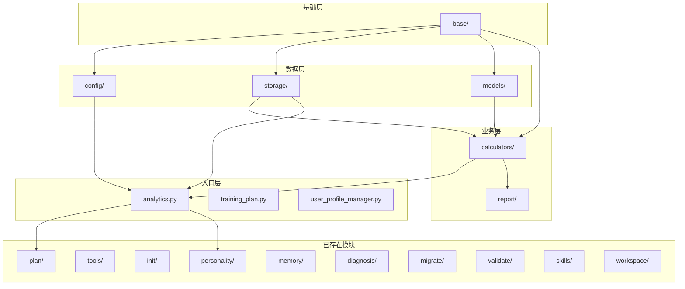

# src/core 模块化重组方案

> 分析日期：2026-04-28
> 分析范围：`/home/yecll/github/nanobot-runner/src/core`

---

## 一、当前结构分析

### 1.1 已模块化的子目录

以下子目录已按职责划分，结构良好：

| 目录 | 文件数 | 职责 |
|------|--------|------|
| `plan/` | 15 | 训练计划生成与管理 |
| `tools/` | 6 | 工具管理与MCP连接 |
| `init/` | 6 | 初始化向导 |
| `personality/` | 5 | 个性化引擎 |
| `memory/` | 4 | 记忆管理 |
| `diagnosis/` | 4 | 自诊断 |
| `migrate/` | 4 | 数据迁移 |
| `validate/` | 3 | 验证器 |
| `skills/` | 3 | 技能管理 |
| `workspace/` | 3 | 工作空间管理 |

### 1.2 根目录散落的文件

根目录下存在 **30+ 个文件**，职责混杂，需要模块化重组：

| 文件 | 当前职责 | 建议归属 |
|------|----------|----------|
| `vdot_calculator.py` | VDOT跑力值计算 | `calculators/` |
| `race_prediction.py` | 比赛预测 | `calculators/` |
| `heart_rate_analyzer.py` | 心率分析 | `calculators/` |
| `training_load_analyzer.py` | 训练负荷分析 | `calculators/` |
| `training_history_analyzer.py` | 训练历史分析 | `calculators/` |
| `injury_risk_analyzer.py` | 伤病风险分析 | `calculators/` |
| `statistics_aggregator.py` | 统计数据聚合 | `calculators/` |
| `config.py` | 配置管理器 | `config/` |
| `config_schema.py` | 配置模式定义 | `config/` |
| `llm_config.py` | LLM配置 | `config/` |
| `env_manager.py` | 环境变量管理 | `config/` |
| `backup_manager.py` | 备份管理 | `config/` |
| `nanobot_config_sync.py` | 配置同步 | `config/` |
| `storage.py` | Parquet存储管理 | `storage/` |
| `session_repository.py` | 会话存储 | `storage/` |
| `indexer.py` | 索引器 | `storage/` |
| `parser.py` | 数据解析 | `storage/` |
| `importer.py` | 数据导入 | `storage/` |
| `report_generator.py` | 报告生成 | `report/` |
| `report_service.py` | 报告服务 | `report/` |
| `anomaly_data_filter.py` | 异常数据过滤 | `report/` |
| `exceptions.py` | 异常定义 | `base/` |
| `logger.py` | 日志系统 | `base/` |
| `decorators.py` | 装饰器 | `base/` |
| `result.py` | 结果封装 | `base/` |
| `schema.py` | 数据模式 | `base/` |
| `context.py` | 上下文管理 | `base/` |
| `profile.py` | 配置文件 | `base/` |
| `models.py` | 数据模型（1200+行） | `models/` |
| `user_profile_manager.py` | 用户档案管理 | 保留根目录 |
| `analytics.py` | 分析引擎入口 | 保留根目录 |
| `training_plan.py` | 训练计划入口 | 保留根目录 |
| `verify_manager.py` | 验证管理 | `validate/` |
| `provider_adapter.py` | 提供者适配器 | `tools/` |

---

## 二、模块化重组方案

### 2.1 calculators/ - 计算器模块

**职责**：纯计算逻辑，无状态、高内聚

```
calculators/
├── __init__.py
├── vdot_calculator.py       # VDOT跑力值计算
├── race_prediction.py       # 比赛预测
├── heart_rate_analyzer.py   # 心率分析
├── training_load_analyzer.py # 训练负荷分析
├── training_history_analyzer.py # 训练历史分析
├── injury_risk_analyzer.py  # 伤病风险分析
└── statistics_aggregator.py # 统计数据聚合
```

**依赖关系**：
- 依赖 `base/exceptions.py`、`base/logger.py`
- 被 `analytics.py` 调用

---

### 2.2 config/ - 配置管理模块

**职责**：配置相关逻辑集中管理

```
config/
├── __init__.py
├── manager.py               # 原 config.py
├── schema.py                # 原 config_schema.py
├── llm_config.py            # LLM配置
├── env_manager.py           # 环境变量管理
├── backup_manager.py        # 备份管理
└── sync.py                  # 原 nanobot_config_sync.py
```

**依赖关系**：
- 依赖 `base/exceptions.py`、`base/logger.py`
- 被几乎所有模块依赖

---

### 2.3 storage/ - 存储层模块

**职责**：数据存储、解析、导入

```
storage/
├── __init__.py
├── parquet_manager.py       # 原 storage.py
├── session_repository.py    # 会话存储
├── indexer.py               # 索引器
├── parser.py                # 解析器
└── importer.py              # 导入器
```

**依赖关系**：
- 依赖 `base/exceptions.py`、`base/logger.py`、`base/schema.py`
- 被 `analytics.py`、`calculators/` 依赖

---

### 2.4 report/ - 报告模块

**职责**：报告生成与数据过滤

```
report/
├── __init__.py
├── generator.py             # 原 report_generator.py
├── service.py               # 原 report_service.py
└── anomaly_filter.py        # 原 anomaly_data_filter.py
```

**依赖关系**：
- 依赖 `base/`、`storage/`、`calculators/`

---

### 2.5 base/ - 基础设施模块

**职责**：基础代码，便于复用和维护

```
base/
├── __init__.py
├── exceptions.py            # 异常定义
├── logger.py                # 日志系统
├── decorators.py            # 装饰器
├── result.py                # 结果封装
├── schema.py                # 数据模式
├── context.py               # 上下文
└── profile.py               # 配置文件
```

**依赖关系**：
- 无内部依赖，被所有模块依赖

---

### 2.6 models/ - 数据模型模块

**职责**：领域数据模型定义

```
models/
├── __init__.py
├── training_plan.py         # 训练计划模型（从 models.py 提取）
├── user_profile.py          # 用户档案模型
└── analytics.py             # 分析相关模型
```

**理由**：当前 `models.py` 文件过大（1200+行），建议按领域拆分。

---

### 2.7 保留在根目录的文件

```
src/core/
├── __init__.py
├── analytics.py             # 分析引擎（整合多个计算器）
├── training_plan.py         # 训练计划核心逻辑
└── user_profile_manager.py  # 用户档案管理器
```

---

## 三、重组后的目录结构

```
src/core/
├── __init__.py
├── analytics.py                 # 分析引擎入口
├── training_plan.py             # 训练计划入口
├── user_profile_manager.py      # 用户档案管理
│
├── base/                        # 基础设施
│   ├── __init__.py
│   ├── exceptions.py
│   ├── logger.py
│   ├── decorators.py
│   ├── result.py
│   ├── schema.py
│   ├── context.py
│   └── profile.py
│
├── calculators/                 # 计算器
│   ├── __init__.py
│   ├── vdot_calculator.py
│   ├── race_prediction.py
│   ├── heart_rate_analyzer.py
│   ├── training_load_analyzer.py
│   ├── training_history_analyzer.py
│   ├── injury_risk_analyzer.py
│   └── statistics_aggregator.py
│
├── config/                      # 配置管理
│   ├── __init__.py
│   ├── manager.py
│   ├── schema.py
│   ├── llm_config.py
│   ├── env_manager.py
│   ├── backup_manager.py
│   └── sync.py
│
├── models/                      # 数据模型
│   ├── __init__.py
│   ├── training_plan.py
│   ├── user_profile.py
│   └── analytics.py
│
├── report/                      # 报告生成
│   ├── __init__.py
│   ├── generator.py
│   ├── service.py
│   └── anomaly_filter.py
│
├── storage/                     # 存储层
│   ├── __init__.py
│   ├── parquet_manager.py
│   ├── session_repository.py
│   ├── indexer.py
│   ├── parser.py
│   └── importer.py
│
├── plan/                        # [已存在] 训练计划
├── tools/                       # [已存在] 工具管理
├── init/                        # [已存在] 初始化
├── personality/                 # [已存在] 个性化
├── memory/                      # [已存在] 记忆管理
├── diagnosis/                   # [已存在] 诊断
├── migrate/                     # [已存在] 迁移
├── validate/                    # [已存在] 验证
├── skills/                      # [已存在] 技能
└── workspace/                   # [已存在] 工作空间
```

---

## 四、实施优先级

| 优先级 | 模块 | 理由 | 预估工时 |
|--------|------|------|----------|
| **P0** | `base/` | 基础设施优先，其他模块依赖 | 2h |
| **P0** | `calculators/` | 计算逻辑清晰，无依赖冲突，收益最大 | 3h |
| **P1** | `config/` | 配置集中管理，便于维护 | 2h |
| **P1** | `storage/` | 存储层独立，便于扩展 | 3h |
| **P2** | `report/` | 报告模块相对独立 | 1.5h |
| **P2** | `models/` | 需要拆分大文件，工作量较大 | 4h |

**总计预估工时**：15.5h

---

## 五、迁移步骤

### 5.1 通用迁移流程

1. **创建目标目录**
   ```bash
   mkdir -p src/core/{base,calculators,config,models,report,storage}
   ```

2. **移动文件**
   ```bash
   git mv src/core/exceptions.py src/core/base/
   git mv src/core/logger.py src/core/base/
   # ... 其他文件
   ```

3. **更新导入路径**
   - 全局搜索旧路径：`from src.core.exceptions import`
   - 替换为新路径：`from src.core.base.exceptions import`

4. **更新 `__init__.py`**
   - 导出公共接口
   - 保持向后兼容（可选）

5. **运行测试**
   ```bash
   pytest tests/ -v
   ```

6. **运行类型检查**
   ```bash
   mypy src/
   ```

### 5.2 向后兼容策略

如需保持向后兼容，可在根目录 `__init__.py` 中添加重导出：

```python
# src/core/__init__.py
from src.core.base.exceptions import *
from src.core.base.logger import get_logger
# ... 其他重导出
```

---

## 六、预期收益

| 维度 | 收益说明 |
|------|----------|
| **可维护性** | 职责清晰，文件定位更快，新人上手更容易 |
| **测试隔离** | 每个模块可独立测试，测试覆盖率更容易达标 |
| **依赖管理** | 循环依赖问题更容易发现和解决 |
| **团队协作** | 不同开发者可并行开发不同模块，减少冲突 |
| **代码复用** | 计算器模块可被其他项目复用 |
| **架构清晰** | 分层明确：base → config/storage → calculators → analytics |

---

## 七、风险与规避

| 风险 | 规避方案 |
|------|----------|
| 导入路径变更导致大量修改 | 使用 IDE 的重构功能批量更新 |
| 循环依赖暴露 | 迁移前使用 `pydeps` 分析依赖图 |
| 测试覆盖下降 | 迁移后立即运行全量测试 |
| 向后兼容问题 | 保留重导出，逐步废弃 |

---

## 八、附录：依赖关系图



---

## 九、影响范围评估

### 9.1 受影响文件统计

基于代码库扫描结果，以下为各模块迁移的影响范围：

| 模块 | 受影响文件数 | 风险等级 | 主要影响区域 |
|------|-------------|----------|--------------|
| `base/` | **85 个文件** | 🔴 高风险 | 全局基础设施依赖 |
| `models/` | **60 个文件** | 🔴 高风险 | 数据模型广泛引用 |
| `config/` | **37 个文件** | 🟠 中高风险 | 配置注入点分散 |
| `storage/` | **30 个文件** | 🟡 中风险 | 数据层依赖集中 |
| `calculators/` | **18 个文件** | 🟢 低风险 | 计算逻辑独立 |
| `report/` | **8 个文件** | 🟢 低风险 | 报告模块独立 |

**总计受影响文件**：约 **120 个文件**（去重后）

### 9.2 受影响文件分布

#### 源代码文件（约 50 个）

```
src/
├── cli/commands/          # 10 个文件
│   ├── report.py          ← base, models, report
│   ├── preference.py      ← base
│   ├── skill.py           ← base
│   ├── agent.py           ← base
│   ├── tools.py           ← base
│   ├── plan.py            ← base, models
│   ├── gateway.py         ← base
│   └── system.py          ← config
├── cli/handlers/          # 2 个文件
│   ├── data_handler.py    ← base
│   └── analysis_handler.py ← base
├── core/                  # 内部文件互相依赖
│   ├── analytics.py       ← calculators, storage, models
│   ├── profile.py         ← base, models, config
│   ├── context.py         ← base, config, storage, models
│   ├── training_plan.py   ← base, models
│   ├── user_profile_manager.py ← base, storage, models
│   └── plan/*.py          # 15 个文件 ← base, models
├── agents/tools.py        ← base, models
└── notify/                # 2 个文件
    ├── feishu.py          ← config, models
    └── feishu_calendar.py ← config, models
```

#### 测试文件（约 60 个）

```
tests/
├── unit/                  # 40+ 个文件
│   ├── test_*.py          ← 直接引用被迁移模块
│   └── core/
│       ├── test_*.py      ← 测试 core 根目录文件
│       └── plan/test_*.py ← 测试 plan 模块
├── integration/           # 15+ 个文件
│   ├── module/
│   └── scene/
├── e2e/                   # 5+ 个文件
└── performance/           # 3 个文件
```

#### 文档文件（约 10 个）

```
docs/
├── api/api_reference.md   ← 25 处引用
├── architecture/
│   └── BUG-001_修复技术设计方案.md
├── guides/
│   ├── agent_tools_guide.md
│   ├── development_guide.md
│   └── testing_guide.md
└── test/
    └── 测试策略与规范.md

根目录/
├── AGENTS.md              ← 架构说明需更新
├── README.md              ← 引用说明
└── CHANGELOG.md           ← 变更记录
```

---

## 十、配合改动清单

### 10.1 目录结构改动

| 操作 | 路径 | 说明 |
|------|------|------|
| 新建 | `src/core/base/` | 基础设施模块 |
| 新建 | `src/core/calculators/` | 计算器模块 |
| 新建 | `src/core/config/` | 配置管理模块 |
| 新建 | `src/core/models/` | 数据模型模块 |
| 新建 | `src/core/report/` | 报告模块 |
| 新建 | `src/core/storage/` | 存储层模块 |
| 移动 | 30+ 个 .py 文件 | 按模块归属迁移 |

### 10.2 导入路径变更

**变更模式**：

```python
# 变更前
from src.core.exceptions import StorageError, ValidationError
from src.core.logger import get_logger
from src.core.models import TrainingPlan, DailyPlan
from src.core.config import ConfigManager
from src.core.storage import StorageManager
from src.core.vdot_calculator import VDOTCalculator

# 变更后
from src.core.base.exceptions import StorageError, ValidationError
from src.core.base.logger import get_logger
from src.core.models.training_plan import TrainingPlan, DailyPlan
from src.core.config.manager import ConfigManager
from src.core.storage.parquet_manager import StorageManager
from src.core.calculators.vdot_calculator import VDOTCalculator
```

**批量替换命令**：

```bash
# base 模块
sed -i 's/from src\.core\.exceptions/from src.core.base.exceptions/g' **/*.py
sed -i 's/from src\.core\.logger/from src.core.base.logger/g' **/*.py
sed -i 's/from src\.core\.decorators/from src.core.base.decorators/g' **/*.py
sed -i 's/from src\.core\.result/from src.core.base.result/g' **/*.py
sed -i 's/from src\.core\.schema/from src.core.base.schema/g' **/*.py
sed -i 's/from src\.core\.context/from src.core.base.context/g' **/*.py
sed -i 's/from src\.core\.profile/from src.core.base.profile/g' **/*.py

# config 模块
sed -i 's/from src\.core\.config import/from src.core.config.manager import/g' **/*.py
sed -i 's/from src\.core\.config_schema/from src.core.config.schema/g' **/*.py
sed -i 's/from src\.core\.llm_config/from src.core.config.llm_config/g' **/*.py
sed -i 's/from src\.core\.env_manager/from src.core.config.env_manager/g' **/*.py
sed -i 's/from src\.core\.backup_manager/from src.core.config.backup_manager/g' **/*.py
sed -i 's/from src\.core\.nanobot_config_sync/from src.core.config.sync/g' **/*.py

# storage 模块
sed -i 's/from src\.core\.storage/from src.core.storage.parquet_manager/g' **/*.py
sed -i 's/from src\.core\.session_repository/from src.core.storage.session_repository/g' **/*.py
sed -i 's/from src\.core\.indexer/from src.core.storage.indexer/g' **/*.py
sed -i 's/from src\.core\.parser/from src.core.storage.parser/g' **/*.py
sed -i 's/from src\.core\.importer/from src.core.storage.importer/g' **/*.py

# calculators 模块
sed -i 's/from src\.core\.vdot_calculator/from src.core.calculators.vdot_calculator/g' **/*.py
sed -i 's/from src\.core\.race_prediction/from src.core.calculators.race_prediction/g' **/*.py
sed -i 's/from src\.core\.heart_rate_analyzer/from src.core.calculators.heart_rate_analyzer/g' **/*.py
sed -i 's/from src\.core\.training_load_analyzer/from src.core.calculators.training_load_analyzer/g' **/*.py
sed -i 's/from src\.core\.training_history_analyzer/from src.core.calculators.training_history_analyzer/g' **/*.py
sed -i 's/from src\.core\.injury_risk_analyzer/from src.core.calculators.injury_risk_analyzer/g' **/*.py
sed -i 's/from src\.core\.statistics_aggregator/from src.core.calculators.statistics_aggregator/g' **/*.py

# report 模块
sed -i 's/from src\.core\.report_generator/from src.core.report.generator/g' **/*.py
sed -i 's/from src\.core\.report_service/from src.core.report.service/g' **/*.py
sed -i 's/from src\.core\.anomaly_data_filter/from src.core.report.anomaly_filter/g' **/*.py

# models 模块（需手动处理，因为 models.py 需拆分）
# 此处需要人工判断具体导入的类属于哪个子模块
```

### 10.3 文档更新清单

| 文档 | 更新内容 | 优先级 |
|------|----------|--------|
| `AGENTS.md` | 更新架构说明、模块结构图 | P0 |
| `docs/api/api_reference.md` | 更新 API 路径引用（25 处） | P0 |
| `README.md` | 更新快速开始中的导入示例 | P1 |
| `docs/guides/development_guide.md` | 更新开发规范中的模块说明 | P1 |
| `docs/guides/testing_guide.md` | 更新测试导入路径 | P1 |
| `CHANGELOG.md` | 记录架构重构变更 | P1 |

### 10.4 配置文件更新

| 文件 | 更新内容 | 必要性 |
|------|----------|--------|
| `pyproject.toml` | 无需修改（包结构不变） | ❌ |
| `.trae/rules/project-rules.md` | 更新模块引用规范 | ✅ |
| `mypy.ini` / `pyproject.toml [mypy]` | 无需修改 | ❌ |
| `ruff.toml` / `pyproject.toml [ruff]` | 无需修改 | ❌ |

---

## 十.五 测试目录调整方案

### 10.5.1 当前测试目录结构

```
tests/
├── __init__.py
├── conftest.py                          # 全局测试夹具
├── unit/                                # 单元测试（93 个文件）
│   ├── __init__.py
│   ├── test_cli.py
│   ├── test_config.py
│   ├── test_config_schema.py
│   ├── test_logger.py
│   ├── test_decorators.py
│   ├── test_schema.py
│   ├── test_storage.py
│   ├── test_parser.py
│   ├── test_indexer.py
│   ├── test_importer.py
│   ├── test_vdot_calculator.py
│   ├── test_race_prediction.py
│   ├── test_heart_rate_analyzer.py
│   ├── test_training_load_analyzer.py
│   ├── test_training_history_analyzer.py
│   ├── test_injury_risk_analyzer.py
│   ├── test_statistics_aggregator.py
│   ├── test_anomaly_data_filter.py
│   ├── test_analytics.py
│   ├── test_stats_aggregation.py
│   ├── test_agent_tools_aggregation.py
│   ├── test_cli_formatter.py
│   ├── test_user_profile_manager.py
│   ├── core/                            # core 子模块测试
│   │   ├── test_*.py                    # 25 个测试文件
│   │   ├── plan/                        # plan 模块测试
│   │   │   └── test_*.py                # 15 个测试文件
│   │   ├── init/
│   │   ├── personality/
│   │   ├── memory/
│   │   ├── diagnosis/
│   │   ├── skills/
│   │   ├── tools/
│   │   ├── transparency/
│   │   └── validate/
│   ├── agents/
│   ├── cli/
│   └── notify/
├── integration/                         # 集成测试（25 个文件）
│   ├── __init__.py
│   ├── test_stats_integration.py
│   ├── test_data_contract.py
│   ├── test_cli_contract.py
│   ├── test_gateway_message_flow.py
│   ├── test_nanobot_compatibility.py
│   ├── test_framework_integration.py
│   ├── module/                          # 模块级集成测试
│   │   ├── test_analytics_flow.py
│   │   ├── test_import_flow.py
│   │   ├── test_migration_flow.py
│   │   ├── test_migrate_flow.py
│   │   ├── test_validate_flow.py
│   │   ├── test_init_flow.py
│   │   ├── test_workspace_flow.py
│   │   ├── test_config_injection.py
│   │   └── test_plan_cli_integration*.py
│   └── scene/                           # 场景级集成测试
│       ├── test_real_workflow.py
│       ├── test_fixed_workflow.py
│       ├── test_comprehensive_workflow.py
│       └── test_plan_calendar_integration.py
├── e2e/                                 # 端到端测试（12 个文件）
│   ├── __init__.py
│   ├── test_user_journey.py
│   ├── test_plan_e2e.py
│   ├── test_gateway_e2e.py
│   ├── test_performance.py
│   ├── test_transparency_e2e.py
│   └── v0_9_0/
│       ├── test_cli_split.py
│       ├── test_session_repository.py
│       ├── test_dependency_injection.py
│       └── test_performance_optimization.py
├── performance/                         # 性能测试（3 个文件）
│   ├── test_lazyframe_performance.py
│   ├── test_query_performance.py
│   └── test_report_performance.py
└── scripts/                             # 测试脚本
    ├── run_all_tests.py
    └── generate_test_data.py
```

### 10.5.2 测试目录调整策略

**核心原则**：测试目录结构应与源码目录结构保持一致，便于定位和维护。

#### 策略一：同步迁移（推荐）

测试文件随源码模块同步迁移到对应子目录：

```
tests/unit/core/
├── base/                    # 新增：对应 src/core/base/
│   ├── test_exceptions.py   # 新建（原 test_logger.py 等重命名）
│   ├── test_logger.py       # 移动
│   ├── test_decorators.py   # 移动
│   ├── test_schema.py       # 移动
│   ├── test_context.py      # 移动
│   └── test_profile.py      # 移动
├── calculators/             # 新增：对应 src/core/calculators/
│   ├── test_vdot_calculator.py
│   ├── test_race_prediction.py
│   ├── test_heart_rate_analyzer.py
│   ├── test_training_load_analyzer.py
│   ├── test_training_history_analyzer.py
│   ├── test_injury_risk_analyzer.py
│   └── test_statistics_aggregator.py
├── config/                  # 新增：对应 src/core/config/
│   ├── test_config.py
│   ├── test_config_schema.py
│   ├── test_env_manager.py
│   ├── test_backup_manager.py
│   └── test_nanobot_config_sync.py
├── storage/                 # 新增：对应 src/core/storage/
│   ├── test_storage.py
│   ├── test_parser.py
│   ├── test_indexer.py
│   ├── test_importer.py
│   └── test_session_repository.py
├── report/                  # 新增：对应 src/core/report/
│   ├── test_report_generator.py
│   ├── test_report_service.py
│   └── test_anomaly_data_filter.py
├── models/                  # 新增：对应 src/core/models/
│   ├── test_training_plan_models.py
│   ├── test_user_profile_models.py
│   └── test_analytics_models.py
└── [已存在目录保持不变]
    ├── plan/
    ├── init/
    ├── personality/
    ├── memory/
    ├── diagnosis/
    ├── skills/
    ├── tools/
    ├── transparency/
    └── validate/
```

#### 策略二：仅更新导入路径（备选）

保持测试目录结构不变，仅更新测试文件中的导入路径。

**优点**：改动量小，风险低
**缺点**：测试目录与源码目录不一致，维护成本高

### 10.5.3 详细迁移清单

#### 需移动的测试文件（unit/core/）

| 原路径 | 新路径 | 说明 |
|--------|--------|------|
| `tests/unit/test_logger.py` | `tests/unit/core/base/test_logger.py` | 日志测试 |
| `tests/unit/test_decorators.py` | `tests/unit/core/base/test_decorators.py` | 装饰器测试 |
| `tests/unit/test_schema.py` | `tests/unit/core/base/test_schema.py` | Schema测试 |
| `tests/unit/core/test_context_v010.py` | `tests/unit/core/base/test_context.py` | 上下文测试（合并） |
| `tests/unit/core/test_context_v0110.py` | `tests/unit/core/base/test_context.py` | 合并到同一文件 |
| `tests/unit/core/test_context_v0120.py` | `tests/unit/core/base/test_context.py` | 合并到同一文件 |
| `tests/unit/core/test_profile.py` | `tests/unit/core/base/test_profile.py` | Profile测试 |
| `tests/unit/core/test_profile_freshness.py` | `tests/unit/core/base/test_profile_freshness.py` | Profile新鲜度测试 |
| `tests/unit/core/test_profile_persistence.py` | `tests/unit/core/base/test_profile_persistence.py` | Profile持久化测试 |
| `tests/unit/core/test_profile_engine.py` | `tests/unit/core/base/test_profile_engine.py` | Profile引擎测试 |
| `tests/unit/test_vdot_calculator.py` | `tests/unit/core/calculators/test_vdot_calculator.py` | VDOT计算器测试 |
| `tests/unit/core/test_vdot_calculator.py` | `tests/unit/core/calculators/test_vdot_calculator.py` | 合并 |
| `tests/unit/test_race_prediction.py` | `tests/unit/core/calculators/test_race_prediction.py` | 比赛预测测试 |
| `tests/unit/core/test_race_prediction.py` | `tests/unit/core/calculators/test_race_prediction.py` | 合并 |
| `tests/unit/test_heart_rate_analyzer.py` | `tests/unit/core/calculators/test_heart_rate_analyzer.py` | 心率分析测试 |
| `tests/unit/core/test_heart_rate_analyzer.py` | `tests/unit/core/calculators/test_heart_rate_analyzer.py` | 合并 |
| `tests/unit/test_training_load_analyzer.py` | `tests/unit/core/calculators/test_training_load_analyzer.py` | 训练负荷测试 |
| `tests/unit/core/test_training_load_analyzer.py` | `tests/unit/core/calculators/test_training_load_analyzer.py` | 合并 |
| `tests/unit/test_training_history_analyzer.py` | `tests/unit/core/calculators/test_training_history_analyzer.py` | 训练历史测试 |
| `tests/unit/core/test_training_history_analyzer.py` | `tests/unit/core/calculators/test_training_history_analyzer.py` | 合并 |
| `tests/unit/test_injury_risk_analyzer.py` | `tests/unit/core/calculators/test_injury_risk_analyzer.py` | 伤病风险测试 |
| `tests/unit/core/test_injury_risk_analyzer.py` | `tests/unit/core/calculators/test_injury_risk_analyzer.py` | 合并 |
| `tests/unit/test_statistics_aggregator.py` | `tests/unit/core/calculators/test_statistics_aggregator.py` | 统计聚合测试 |
| `tests/unit/core/test_statistics_aggregator.py` | `tests/unit/core/calculators/test_statistics_aggregator.py` | 合并 |
| `tests/unit/test_config.py` | `tests/unit/core/config/test_config.py` | 配置测试 |
| `tests/unit/test_config_schema.py` | `tests/unit/core/config/test_config_schema.py` | 配置Schema测试 |
| `tests/unit/core/test_env_manager.py` | `tests/unit/core/config/test_env_manager.py` | 环境变量测试 |
| `tests/unit/core/test_backup_manager.py` | `tests/unit/core/config/test_backup_manager.py` | 备份管理测试 |
| `tests/unit/core/test_nanobot_config_sync.py` | `tests/unit/core/config/test_nanobot_config_sync.py` | 配置同步测试 |
| `tests/unit/test_storage.py` | `tests/unit/core/storage/test_storage.py` | 存储测试 |
| `tests/unit/test_parser.py` | `tests/unit/core/storage/test_parser.py` | 解析器测试 |
| `tests/unit/test_indexer.py` | `tests/unit/core/storage/test_indexer.py` | 索引器测试 |
| `tests/unit/test_importer.py` | `tests/unit/core/storage/test_importer.py` | 导入器测试 |
| `tests/unit/core/test_importer.py` | `tests/unit/core/storage/test_importer.py` | 合并 |
| `tests/unit/core/test_session_repository.py` | `tests/unit/core/storage/test_session_repository.py` | 会话仓储测试 |
| `tests/unit/core/test_report_generator.py` | `tests/unit/core/report/test_report_generator.py` | 报告生成测试 |
| `tests/unit/core/test_report_service.py` | `tests/unit/core/report/test_report_service.py` | 报告服务测试 |
| `tests/unit/test_anomaly_data_filter.py` | `tests/unit/core/report/test_anomaly_data_filter.py` | 异常过滤测试 |
| `tests/unit/core/test_analytics.py` | `tests/unit/core/test_analytics.py` | 保留（测试入口文件） |
| `tests/unit/test_analytics.py` | `tests/unit/core/test_analytics.py` | 合并 |

#### 需更新导入路径的测试文件（93 个）

所有在 `tests/` 目录下引用被迁移模块的测试文件都需要更新导入路径。

**示例变更**：

```python
# tests/unit/test_vdot_calculator.py 变更前
from src.core.vdot_calculator import VDOTCalculator
from src.core.exceptions import ValidationError

# tests/unit/core/calculators/test_vdot_calculator.py 变更后
from src.core.calculators.vdot_calculator import VDOTCalculator
from src.core.base.exceptions import ValidationError
```

### 10.5.4 测试文件导入路径批量更新

```bash
# 在 tests 目录下执行批量替换

# base 模块
find tests -name "*.py" -exec sed -i 's/from src\.core\.exceptions/from src.core.base.exceptions/g' {} \;
find tests -name "*.py" -exec sed -i 's/from src\.core\.logger/from src.core.base.logger/g' {} \;
find tests -name "*.py" -exec sed -i 's/from src\.core\.decorators/from src.core.base.decorators/g' {} \;
find tests -name "*.py" -exec sed -i 's/from src\.core\.schema/from src.core.base.schema/g' {} \;
find tests -name "*.py" -exec sed -i 's/from src\.core\.context/from src.core.base.context/g' {} \;
find tests -name "*.py" -exec sed -i 's/from src\.core\.profile/from src.core.base.profile/g' {} \;

# calculators 模块
find tests -name "*.py" -exec sed -i 's/from src\.core\.vdot_calculator/from src.core.calculators.vdot_calculator/g' {} \;
find tests -name "*.py" -exec sed -i 's/from src\.core\.race_prediction/from src.core.calculators.race_prediction/g' {} \;
find tests -name "*.py" -exec sed -i 's/from src\.core\.heart_rate_analyzer/from src.core.calculators.heart_rate_analyzer/g' {} \;
find tests -name "*.py" -exec sed -i 's/from src\.core\.training_load_analyzer/from src.core.calculators.training_load_analyzer/g' {} \;
find tests -name "*.py" -exec sed -i 's/from src\.core\.training_history_analyzer/from src.core.calculators.training_history_analyzer/g' {} \;
find tests -name "*.py" -exec sed -i 's/from src\.core\.injury_risk_analyzer/from src.core.calculators.injury_risk_analyzer/g' {} \;
find tests -name "*.py" -exec sed -i 's/from src\.core\.statistics_aggregator/from src.core.calculators.statistics_aggregator/g' {} \;

# config 模块
find tests -name "*.py" -exec sed -i 's/from src\.core\.config import/from src.core.config.manager import/g' {} \;
find tests -name "*.py" -exec sed -i 's/from src\.core\.config_schema/from src.core.config.schema/g' {} \;
find tests -name "*.py" -exec sed -i 's/from src\.core\.env_manager/from src.core.config.env_manager/g' {} \;
find tests -name "*.py" -exec sed -i 's/from src\.core\.backup_manager/from src.core.config.backup_manager/g' {} \;
find tests -name "*.py" -exec sed -i 's/from src\.core\.nanobot_config_sync/from src.core.config.sync/g' {} \;

# storage 模块
find tests -name "*.py" -exec sed -i 's/from src\.core\.storage/from src.core.storage.parquet_manager/g' {} \;
find tests -name "*.py" -exec sed -i 's/from src\.core\.session_repository/from src.core.storage.session_repository/g' {} \;
find tests -name "*.py" -exec sed -i 's/from src\.core\.indexer/from src.core.storage.indexer/g' {} \;
find tests -name "*.py" -exec sed -i 's/from src\.core\.parser/from src.core.storage.parser/g' {} \;
find tests -name "*.py" -exec sed -i 's/from src\.core\.importer/from src.core.storage.importer/g' {} \;

# report 模块
find tests -name "*.py" -exec sed -i 's/from src\.core\.report_generator/from src.core.report.generator/g' {} \;
find tests -name "*.py" -exec sed -i 's/from src\.core\.report_service/from src.core.report.service/g' {} \;
find tests -name "*.py" -exec sed -i 's/from src\.core\.anomaly_data_filter/from src.core.report.anomaly_filter/g' {} \;
```

### 10.5.5 conftest.py 更新

`tests/conftest.py` 是全局测试夹具文件，需要更新其中的导入路径：

```python
# 变更前
from src.core.config import ConfigManager
from src.core.storage import StorageManager
from src.core.exceptions import StorageError

# 变更后
from src.core.config.manager import ConfigManager
from src.core.storage.parquet_manager import StorageManager
from src.core.base.exceptions import StorageError
```

### 10.5.6 测试目录新建清单

| 操作 | 路径 | 说明 |
|------|------|------|
| 新建 | `tests/unit/core/base/` | base 模块测试 |
| 新建 | `tests/unit/core/calculators/` | calculators 模块测试 |
| 新建 | `tests/unit/core/config/` | config 模块测试 |
| 新建 | `tests/unit/core/storage/` | storage 模块测试 |
| 新建 | `tests/unit/core/report/` | report 模块测试 |
| 新建 | `tests/unit/core/models/` | models 模块测试 |

### 10.5.7 测试迁移工作量估算

| 类别 | 文件数 | 工作量 |
|------|--------|--------|
| 移动测试文件 | 30+ 个 | 2h |
| 更新导入路径 | 93 个 | 3h |
| 合并重复测试文件 | 10+ 对 | 1.5h |
| 更新 conftest.py | 1 个 | 0.5h |
| 运行测试验证 | - | 1h |
| **总计** | - | **8h** |

### 10.5.8 测试迁移风险

| 风险 | 影响 | 规避措施 |
|------|------|----------|
| 测试文件遗漏移动 | 部分测试无法找到模块 | 使用 grep 全局搜索确认 |
| 导入路径更新遗漏 | 测试运行失败 | 批量替换后逐个检查 |
| 合并测试文件冲突 | 测试覆盖丢失 | 合并前对比测试内容 |
| conftest.py 夹具失效 | 全局测试失败 | 优先更新并验证 |

---

## 十一、风险评估矩阵

### 11.1 风险等级定义

| 等级 | 定义 | 应对策略 |
|------|------|----------|
| 🔴 高风险 | 影响范围广、依赖复杂、可能导致系统不可用 | 分阶段迁移、充分测试、保留回滚点 |
| 🟠 中高风险 | 影响多个模块、需要协调修改 | 优先处理、集中测试 |
| 🟡 中风险 | 影响单一模块、修改路径明确 | 按计划执行 |
| 🟢 低风险 | 影响范围小、独立性强 | 快速执行 |

### 11.2 各模块风险评估

#### 🔴 base/ 模块 - 高风险

**风险因素**：
- 85 个文件依赖，涉及全局基础设施
- `exceptions.py` 被所有模块引用
- `logger.py` 是日志系统入口
- `context.py` 是应用上下文核心

**缓解措施**：
1. **优先迁移**：作为第一个迁移模块
2. **向后兼容**：在 `src/core/__init__.py` 中保留重导出
3. **全量测试**：迁移后立即运行全量测试套件
4. **分步提交**：每个文件单独提交，便于回滚

**回滚方案**：
```bash
git revert HEAD~N  # N 为迁移提交数量
```

---

#### 🔴 models/ 模块 - 高风险

**风险因素**：
- 60 个文件依赖
- `models.py` 文件过大（1200+行），需要拆分
- 数据模型是跨模块数据传递的基础

**缓解措施**：
1. **拆分策略**：按领域拆分为 `training_plan.py`、`user_profile.py`、`analytics.py`
2. **保持接口**：确保所有公开类、函数签名不变
3. **类型检查**：迁移后运行 `mypy --strict` 验证

**拆分建议**：
```python
# models/training_plan.py
class PlanStatus, FitnessLevel, PlanType, TrainingType, ...
class DailyPlan, WeeklySchedule, TrainingPlan, ...

# models/user_profile.py  
class UserPreferences, UserContext, TrainingLoad, ...

# models/analytics.py
class HRDriftResult, HRZoneResult, PaceDistributionResult, ...
```

---

#### 🟠 config/ 模块 - 中高风险

**风险因素**：
- 37 个文件依赖
- 配置注入点分散在多个模块
- 环境变量与配置文件交互复杂

**缓解措施**：
1. **保持单例**：`ConfigManager` 保持单例模式
2. **测试覆盖**：重点测试配置加载、环境变量覆盖逻辑
3. **文档同步**：更新配置相关文档

---

#### 🟡 storage/ 模块 - 中风险

**风险因素**：
- 30 个文件依赖
- 数据存储层是核心基础设施
- Parquet 文件操作涉及数据完整性

**缓解措施**：
1. **数据备份**：迁移前备份测试数据
2. **集成测试**：重点测试数据读写、迁移流程
3. **性能验证**：确保存储性能无退化

---

#### 🟢 calculators/ 模块 - 低风险

**风险因素**：
- 18 个文件依赖
- 纯计算逻辑，无副作用
- 模块间依赖简单

**缓解措施**：
1. **单元测试**：确保计算结果一致性
2. **快速迁移**：可一次性完成

---

#### 🟢 report/ 模块 - 低风险

**风险因素**：
- 8 个文件依赖
- 报告生成逻辑独立
- 影响范围有限

**缓解措施**：
1. **端到端测试**：验证报告生成流程
2. **快速迁移**：可一次性完成

---

## 十二、实施建议

### 12.1 推荐执行顺序

```
Phase 1: 基础设施（Day 1）
├── Step 1: 创建 base/ 目录
├── Step 2: 移动 exceptions.py, logger.py
├── Step 3: 更新所有导入路径
├── Step 4: 运行测试验证
└── Step 5: 提交并打 tag: refactor-base-v1

Phase 2: 计算器模块（Day 1-2）
├── Step 1: 创建 calculators/ 目录
├── Step 2: 移动 7 个计算器文件
├── Step 3: 更新导入路径
├── Step 4: 运行测试验证
└── Step 5: 提交并打 tag: refactor-calculators-v1

Phase 3: 配置模块（Day 2）
├── Step 1: 创建 config/ 目录
├── Step 2: 移动 6 个配置文件
├── Step 3: 更新导入路径
├── Step 4: 运行测试验证
└── Step 5: 提交并打 tag: refactor-config-v1

Phase 4: 存储模块（Day 3）
├── Step 1: 创建 storage/ 目录
├── Step 2: 移动 5 个存储文件
├── Step 3: 更新导入路径
├── Step 4: 运行测试验证
└── Step 5: 提交并打 tag: refactor-storage-v1

Phase 5: 报告模块（Day 3）
├── Step 1: 创建 report/ 目录
├── Step 2: 移动 3 个报告文件
├── Step 3: 更新导入路径
├── Step 4: 运行测试验证
└── Step 5: 提交并打 tag: refactor-report-v1

Phase 6: 数据模型（Day 4-5）
├── Step 1: 创建 models/ 目录
├── Step 2: 拆分 models.py 为 3 个文件
├── Step 3: 更新所有导入路径（60+ 文件）
├── Step 4: 运行全量测试
├── Step 5: 类型检查验证
└── Step 6: 提交并打 tag: refactor-models-v1

Phase 7: 文档更新（Day 5）
├── Step 1: 更新 AGENTS.md
├── Step 2: 更新 api_reference.md
├── Step 3: 更新其他文档
└── Step 4: 最终验收测试
```

### 12.2 验收标准

| 检查项 | 命令 | 期望结果 |
|--------|------|----------|
| 单元测试 | `pytest tests/unit -v` | 100% 通过 |
| 集成测试 | `pytest tests/integration -v` | 100% 通过 |
| 端到端测试 | `pytest tests/e2e -v` | 100% 通过 |
| 类型检查 | `mypy src/` | 无错误 |
| 代码规范 | `ruff check src/` | 无错误 |
| 测试覆盖率 | `pytest --cov=src --cov-report=term` | ≥80% |

### 12.3 回滚策略

每个 Phase 完成后打 tag，如遇问题可快速回滚：

```bash
# 回滚到指定阶段
git checkout refactor-base-v1
git checkout refactor-calculators-v1
# ...

# 或回滚整个重构
git checkout main
git branch -D refactor-module-structure
```

---

## 十三、总结

### 影响评估摘要

| 维度 | 评估结果 |
|------|----------|
| **源码影响范围** | 大（120+ 文件） |
| **测试影响范围** | 大（93 个测试文件） |
| **实施难度** | 中高（需拆分大文件、更新大量导入、同步迁移测试） |
| **风险等级** | 中（有明确的缓解措施和回滚方案） |
| **预估工时** | **7 个工作日**（源码 5 天 + 测试 2 天） |
| **收益评估** | 高（架构清晰、可维护性显著提升） |

### 工作量明细

| 类别 | 文件数 | 工作量 |
|------|--------|--------|
| **源码迁移** | | |
| 创建新目录 | 6 个目录 | 0.5h |
| 移动源码文件 | 30+ 个 | 2h |
| 更新源码导入路径 | 50+ 个 | 3h |
| 拆分 models.py | 1 → 3 个文件 | 4h |
| 类型检查验证 | - | 1h |
| **源码小计** | - | **10.5h** |
| **测试迁移** | | |
| 创建测试目录 | 6 个目录 | 0.5h |
| 移动测试文件 | 30+ 个 | 2h |
| 更新测试导入路径 | 93 个 | 3h |
| 合并重复测试文件 | 10+ 对 | 1.5h |
| 更新 conftest.py | 1 个 | 0.5h |
| 运行测试验证 | - | 1h |
| **测试小计** | - | **8.5h** |
| **文档更新** | | |
| AGENTS.md | 1 个 | 0.5h |
| api_reference.md | 1 个 | 1h |
| 其他文档 | 5+ 个 | 0.5h |
| **文档小计** | - | **2h** |
| **总计** | - | **21h（约 3 个工作日）** |

> 注：上述为纯执行时间，实际需预留 50% 缓冲时间用于调试和问题修复，总计约 **5 个工作日**。

### 建议

1. **分阶段执行**：按 Phase 顺序执行，每个阶段独立验证
2. **源码与测试同步迁移**：每迁移一个源码模块，立即迁移对应测试
3. **保持向后兼容**：初期在 `__init__.py` 中保留重导出
4. **充分测试**：每个阶段完成后运行全量测试
5. **文档同步**：迁移完成后立即更新文档
6. **团队沟通**：提前通知团队成员，避免并行开发冲突

---

*文档生成：Trae IDE 架构师智能体*
