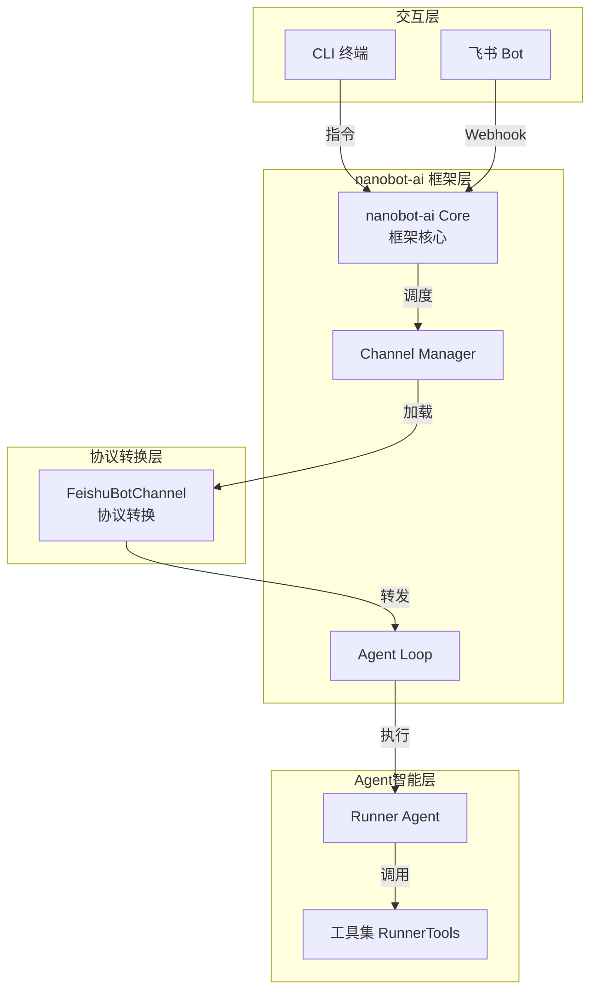
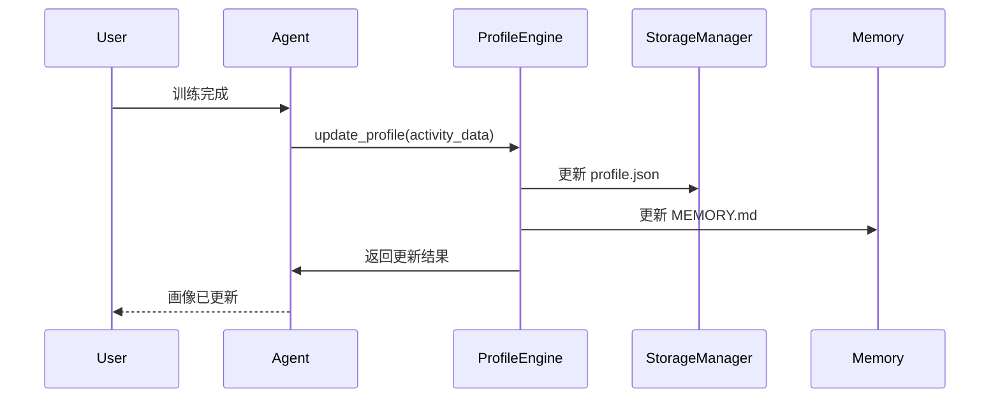
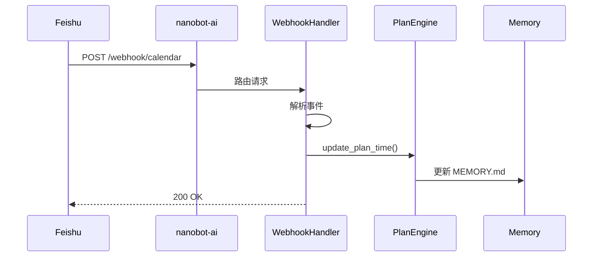

结合我们之前的讨论，我对《迭代架构设计说明书 v0.4.0》和《系统架构设计说明书》进行了详细评审。以下是改进意见：
---
## 一、核心架构设计问题
### 1. **飞书机器人交互架构存在不一致**
**问题**：
- 《系统架构设计说明书》中飞书Bot直接连接到`Core[nanobot-ai底座]`，但未明确Channel的角色。
- 《迭代架构设计说明书》虽然明确了`FeishuBotChannel`作为协议转换层，但架构图中仍显示飞书直接连接到`BotChannel`，而实际应该是：飞书 → nanobot-ai框架 → FeishuBotChannel → Agent。
**改进建议**：

**关键修改点**：
1. 明确`FeishuBotChannel`是由nanobot-ai框架加载的Channel插件
2. 飞书Webhook先到达nanobot-ai框架，由框架分发到对应Channel
3. 在《系统架构设计说明书》中补充Channel机制说明
---
### 2. **用户画像存储机制需要统一**
**问题**：
- 《迭代架构设计说明书》将用户画像存储为`profile.json`
- 我们讨论过将用户画像存储在`MEMORY.md`中，利用nanobot-ai的记忆系统
- 两份文档未体现这一设计决策
**改进建议**：
#### 存储架构调整
```
~/.nanobot-runner/
├── data/                      # 业务数据存储
│   ├── activities_2024.parquet
│   ├── profile.json          # 结构化画像数据（计算用）
│   └── plans/                # 训练计划
├── memory/                    # nanobot记忆系统
│   ├── MEMORY.md             # 用户画像（Agent长期记忆）
│   └── HISTORY.md            # 事件日志
├── sessions/                  # 会话历史
├── skills/                    # 技能扩展
└── config.json
```
#### 在《迭代架构设计说明书》中补充说明：
```markdown
### 4.1.5 画像存储策略
**双存储机制**：
1. **MEMORY.md**：存储用户画像的自然语言描述，作为Agent的长期记忆
   - 格式：Markdown，易于Agent理解和更新
   - 内容：体能水平、训练习惯、恢复能力、目标偏好
   - 更新：由RunnerProfileEngine在关键事件后更新
2. **profile.json**：存储结构化画像数据，用于程序计算
   - 格式：JSON，易于解析和计算
   - 内容：VDOT数值、训练频率、TSS平均值等量化指标
   - 更新：每次训练导入后自动更新
**数据流**：
用户训练数据 → AnalyticsEngine计算指标 → RunnerProfileEngine更新两个存储 → Agent从MEMORY.md获取上下文
```
---
## 二、数据存储架构优化
### 1. **缺少nanobot workspace标准目录结构**
**问题**：
- 《系统架构设计说明书》中的存储架构只有业务数据，未包含nanobot workspace的标准结构
- 《迭代架构设计说明书》提到了workspace，但未详细说明目录结构
**改进建议**：
#### 在《系统架构设计说明书》中增加：
```markdown
### 4.1.3 nanobot Workspace 目录结构
系统将`~/.nanobot-runner`作为nanobot workspace，遵循nanobot-ai标准结构：
```
~/.nanobot-runner/
├── data/                    # 业务数据存储（本项目扩展）
│   ├── activities_*.parquet
│   ├── profile.json
│   └── plans/
├── memory/                  # 记忆系统
│   ├── MEMORY.md           # 长期记忆
│   └── HISTORY.md          # 事件日志
├── sessions/                # 会话历史
│   └── feishu_*.jsonl
├── skills/                  # 技能扩展
│   ├── training_plan/
│   └── injury_prediction/
├── AGENTS.md                # Agent行为准则
├── USER.md                  # 用户画像（辅助）
└── HEARTBEAT.md             # 定时任务
```
**设计依据**：
- `data/`：本项目特有，存储Parquet业务数据
- 其他目录：遵循nanobot-ai标准，用于Agent记忆、会话、技能管理
```
---
### 2. **数据流设计需要补充记忆更新流程**
**问题**：
- 《迭代架构设计说明书》的数据流设计未包含MEMORY.md的更新流程
**改进建议**：
#### 补充画像更新数据流：

---
## 三、接口与工具设计改进
### 1. **工具与记忆系统的集成不明确**
**问题**：
- `GetProfileTool`等工具未说明如何与MEMORY.md交互
- 工具设计未体现"Agent作为唯一决策中心"原则
**改进建议**：
#### 在《迭代架构设计说明书》中明确工具职责：
```markdown
### 4.5.3 工具与记忆系统交互规范
**原则**：工具不直接操作MEMORY.md，由Agent负责记忆管理
**工具职责边界**：
1. **GetProfileTool**：读取profile.json和MEMORY.md，返回整合画像
2. **CreateTrainingPlanTool**：生成计划并更新profile.json，通知Agent更新MEMORY.md
3. **AdjustTrainingPlanTool**：调整计划后，返回更新摘要给Agent
**示例实现**：
```python
class GetProfileTool(BaseTool):
    name = "get_profile"
    description = "获取用户跑步画像"
    
    def execute(self, dimension: str = "all"):
        # 读取结构化数据
        json_profile = self.storage.read_json("profile.json")
        # 读取记忆文件
        memory_profile = self.storage.read_file("memory/MEMORY.md")
        
        # 返回整合结果
        return {
            "quantitative": json_profile,
            "qualitative": memory_profile,
            "dimension": dimension
        }
```
---
### 2. **飞书日历反向同步设计不完整**
**问题**：
- 《迭代架构设计说明书》提到了反向同步，但未说明如何与nanobot-ai的Webhook机制集成
**改进建议**：
#### 补充Webhook集成说明：
```markdown
### 4.3.3 飞书Webhook集成
**架构设计**：
1. 飞书日历事件变更 → 飞书服务器发送POST请求
2. nanobot-ai框架接收请求 → 路由到FeishuCalendarWebhookHandler
3. Handler解析事件 → 更新本地计划 → 通知Agent
**配置示例**：
```json
{
  "channels": {
    "feishu": {
      "webhooks": {
        "calendar": {
          "path": "/webhook/calendar",
          "handler": "FeishuCalendarWebhookHandler"
        }
      }
    }
  }
}
```
**处理流程**：

---
## 四、配置管理优化
### 1. **配置文件设计需要统一**
**问题**：
- 两份文档的配置文件设计不一致
- 未明确nanobot框架配置与应用配置的分离
**改进建议**：
#### 在《系统架构设计说明书》中补充：
```markdown
### 4.1.4 配置管理架构
**三级配置体系**：
1. **nanobot框架配置** (`~/.nanobot/config.json`)
   - LLM Provider配置
   - 全局设置（如内存窗口大小）
   - 通用工具链配置
2. **应用配置** (`~/.nanobot-runner/config.json`)
   - 飞书应用配置（app_id, app_secret）
   - 数据存储路径
   - 业务参数（VDOT计算参数、TSS系数等）
3. **运行时配置** (环境变量)
   - API密钥等敏感信息
   - 临时配置覆盖
**配置加载顺序**：框架配置 → 应用配置 → 环境变量覆盖
```
---
## 五、部署与监控改进
### 1. **缺少监控指标定义**
**问题**：
- 《系统架构设计说明书》的监控指标未包含nanobot相关指标
**改进建议**：
#### 补充监控指标：
```markdown
### 7.1.2 Agent监控指标
| 指标类别 | 指标名称 | 阈值 | 说明 |
|---------|---------|------|------|
| 记忆管理 | MEMORY.md大小 | < 50KB | 避免上下文过长 |
| 会话管理 | sessions文件数量 | < 100 | 定期清理旧会话 |
| Agent性能 | 平均响应时间 | < 3s | 复杂查询 |
| 工具调用 | 工具成功率 | > 95% | 核心工具 |
| 记忆更新 | MEMORY.md更新频率 | 每周至少1次 | 保持画像新鲜度 |
```
---
## 六、文档同步与一致性
### 1. **两份文档存在信息冲突**
**问题**：
- 《系统架构设计说明书》版本为0.3.1，但v0.4.0迭代引入了重大架构变更
- 部分设计在两份文档中描述不一致
**改进建议**：
#### 建立文档同步机制：
```markdown
### 文档版本对应关系
| 迭代版本 | 系统架构文档版本 | 迭代架构文档版本 | 同步状态 |
|---------|----------------|----------------|---------|
| v0.3.1 | 0.3.1 | - | 已同步 |
| v0.4.0 | 待更新 | v0.4.0-arch-v1.0 | **需要同步** |
**同步计划**：
1. 基于v0.4.0迭代架构，更新《系统架构设计说明书》至0.4.0版本
2. 合并新增模块（画像引擎、计划引擎、飞书集成）到系统架构
3. 统一数据存储架构描述
4. 补充nanobot workspace标准结构说明
```
---
## 七、总结：关键改进清单
| 优先级 | 改进项 | 文档 | 影响范围 |
|--------|-------|------|---------|
| **P0** | 明确飞书Channel与nanobot框架的集成机制 | 两份文档 | 核心架构 |
| **P0** | 统一用户画像存储策略（MEMORY.md + profile.json） | 迭代架构 | 数据存储 |
| **P0** | 补充nanobot workspace标准目录结构 | 系统架构 | 部署架构 |
| **P1** | 完善数据流设计，包含记忆更新流程 | 迭代架构 | 业务逻辑 |
| **P1** | 明确工具与记忆系统的交互边界 | 迭代架构 | 工具设计 |
| **P1** | 补充飞书Webhook集成设计 | 迭代架构 | 外部集成 |
| **P2** | 统一配置管理体系 | 系统架构 | 配置管理 |
| **P2** | 补充Agent监控指标 | 系统架构 | 运维监控 |
| **P2** | 建立文档版本同步机制 | 两份文档 | 文档管理 |
---
## 八、建议后续行动
1. **立即行动**（本周内）：
   - 更新《系统架构设计说明书》至0.4.0版本
   - 在《迭代架构设计说明书》中补充MEMORY.md相关设计
2. **短期计划**（下周内）：
   - 完善数据流设计，补充记忆更新流程
   - 明确工具与记忆系统的交互规范
3. **中期计划**（迭代结束前）：
   - 建立文档版本同步机制
   - 补充完整的监控指标定义
这些改进将确保架构设计与nanobot-ai框架能力深度整合，同时保持两份文档的一致性和完整性。
