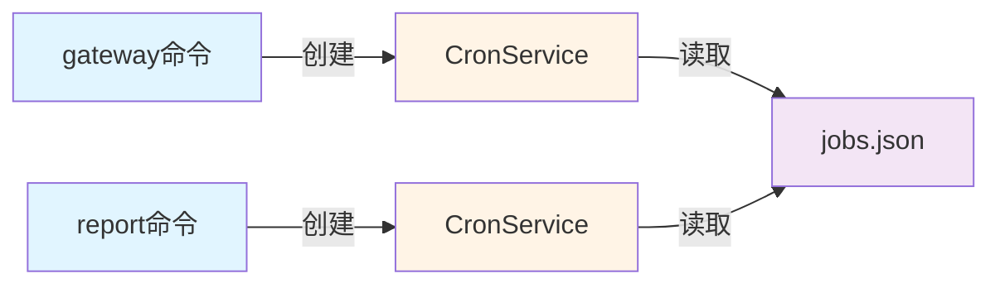

# v0.4.1版本发布风险复盘分析报告（架构师视角）

## 📋 报告信息

**报告类型**: 架构风险复盘分析  
**版本号**: v0.4.1  
**分析日期**: 2026-03-29  
**更新日期**: 2026-03-29（基于发布专项总结会议结论更新）  
**分析人**: 架构师智能体  
**报告版本**: v2.0

---

## 1. 执行摘要

### 1.1 发布概况

v0.4.1版本发布过程历时约2小时，经历了多次CI Pipeline失败和Release Pipeline权限错误，最终成功发布。从架构师角度分析，本次发布暴露了**配置管理架构、CI/CD流程架构、第三方集成架构**等多个层面的设计缺陷。

### 1.2 核心风险识别

| 风险类别 | 风险等级 | 影响范围 | 根本原因 | 当前状态 |
|---------|---------|---------|---------|---------|
| 配置管理架构缺陷 | 🔴 高 | 发布流程、环境一致性 | 配置验证机制缺失 | 已识别，制定改进措施 |
| CI/CD流程架构不完善 | 🔴 高 | 发布效率、团队信心 | 环境差异未隔离 | 已识别，制定改进措施 |
| 定时任务存储设计缺陷 | 🟡 中 | 配置迁移、数据一致性 | 历史设计遗留问题 | ✅ **v0.4.1已修复** |
| 飞书集成架构风险 | 🟡 中 | 消息推送、用户体验 | API契约理解偏差 | 已识别，制定改进措施 |
| 技术债务累积 | 🟡 中 | 代码质量、维护成本 | 架构治理缺失 | 已识别，制定偿还计划 |

### 1.3 会议结论摘要（v0.4.1发布专项总结会议）

**会议核心决议**：
1. ✅ **立即实施**: CI/CD权限配置修复（已完成）
2. ✅ **立即实施**: 定时任务存储迁移（已完成）
3. 📋 **v0.4.2规划**: 配置Schema验证机制
4. 📋 **v0.4.2规划**: 本地CI验证脚本
5. 📋 **v0.5.0规划**: 架构治理体系建设

---

## 2. 架构设计风险详细分析

### 2.1 配置管理架构风险 🔴 高风险

#### 2.1.1 风险描述

当前配置管理架构采用**三级配置体系**（框架配置、应用配置、环境变量），但在实际落地过程中存在以下问题：

**问题1：配置验证机制缺失**

```python
# 当前实现（src/core/config.py）
def _ensure_config(self):
    if not self.config_file.exists():
        default_config = {
            "version": "0.1.0",
            "data_dir": str(self.data_dir),
            "auto_push_feishu": False,
            # ... 直接硬编码默认值
        }
        self.save_config(default_config)
```

**架构缺陷**：
- ❌ 无配置Schema验证
- ❌ 无配置项类型检查
- ❌ 无必填项校验
- ❌ 无配置版本兼容性检查

**问题2：配置迁移逻辑耦合**

```python
# 定时任务配置迁移逻辑（src/core/config.py:34-46）
def _migrate_old_cron_config(self):
    old_cron_store = Path.home() / ".nanobot" / "cron" / "jobs.json"
    new_cron_store = self.cron_store
    
    if old_cron_store.exists() and not new_cron_store.exists():
        try:
            shutil.copy2(old_cron_store, new_cron_store)
            loguru.logger.info(f"已迁移定时任务配置：{old_cron_store} -> {new_cron_store}")
        except Exception as e:
            loguru.logger.warning(f"迁移定时任务配置失败：{e}")
```

**架构缺陷**：
- ❌ 迁移逻辑与配置管理强耦合
- ❌ 迁移失败仅记录日志，无重试机制
- ❌ 无迁移状态持久化
- ❌ 无回滚机制

**问题3：配置路径不一致**

| 配置类型 | 存储路径 | 管理方式 | 问题 |
|---------|---------|---------|------|
| 框架配置 | `~/.nanobot/config.json` | nanobot框架管理 | ✅ 符合规范 |
| 应用配置 | `~/.nanobot-runner/config.json` | ConfigManager管理 | ✅ 符合规范 |
| 定时任务配置（旧） | `~/.nanobot/cron/jobs.json` | 框架管理 | ❌ 违反配置分离原则 |
| 定时任务配置（新） | `~/.nanobot-runner/cron/jobs.json` | ConfigManager管理 | ✅ 已修复 |

#### 2.1.2 影响分析

**直接影响**：
- 发布过程中配置不一致导致功能异常
- 配置迁移失败导致定时任务丢失
- 环境差异导致本地与CI行为不一致

**间接影响**：
- 增加调试成本
- 降低团队信心
- 影响用户体验

#### 2.1.3 风险等级评估

| 评估维度 | 评分 | 说明 |
|---------|------|------|
| 发生概率 | 高 | 配置问题在每次发布都可能触发 |
| 影响范围 | 高 | 影响所有依赖配置的功能 |
| 修复成本 | 中 | 需要重构配置管理模块 |
| **综合等级** | 🔴 **高** | 需立即处理 |

#### 2.1.4 改进措施与时间表

**短期改进（v0.4.2 - 1周内）**：

1. **引入配置Schema验证**

```python
# 建议实现（src/core/config_schema.py）
from dataclasses import dataclass
from typing import Optional

@dataclass
class AppConfig:
    """应用配置Schema"""
    version: str
    data_dir: str
    auto_push_feishu: bool = False
    feishu_app_id: Optional[str] = None
    feishu_app_secret: Optional[str] = None
    feishu_receive_id: Optional[str] = None
    
    REQUIRED_FIELDS = ["version", "data_dir"]
    
    @classmethod
    def validate(cls, config: dict) -> tuple[bool, list[str]]:
        """验证配置是否符合Schema"""
        errors = []
        for field in cls.REQUIRED_FIELDS:
            if field not in config:
                errors.append(f"缺少必填字段: {field}")
        return len(errors) == 0, errors
```

2. **实现配置迁移状态管理**

```python
# 建议实现（src/core/config_migration.py）
@dataclass
class MigrationStatus:
    """迁移状态"""
    source: str
    target: str
    status: str  # pending, in_progress, completed, failed
    timestamp: str
    error: Optional[str] = None

class ConfigMigrationManager:
    """配置迁移管理器"""
    def __init__(self, status_file: Path):
        self.status_file = status_file
        self.statuses = self._load_statuses()
    
    def migrate(self, source: Path, target: Path) -> bool:
        """执行迁移并记录状态"""
        migration_id = f"{source.name}_{target.name}"
        
        if self._is_migrated(migration_id):
            return True
        
        self._update_status(migration_id, "in_progress")
        
        try:
            shutil.copy2(source, target)
            if self._verify_migration(source, target):
                self._update_status(migration_id, "completed")
                return True
            else:
                self._update_status(migration_id, "failed", "验证失败")
                return False
        except Exception as e:
            self._update_status(migration_id, "failed", str(e))
            return False
```

**验收标准**：
- ✅ 所有配置项有Schema定义
- ✅ 配置加载时自动验证
- ✅ 迁移过程可追踪
- ✅ 迁移失败可回滚

**中期改进（v0.5.0 - 1个月内）**：

1. **重构配置管理模块**
   - 实现配置抽象接口
   - 支持多环境配置隔离
   - 实现配置热更新

**长期改进（v1.0 - 3个月内）**：

1. **配置中心架构**
   - 支持远程配置管理
   - 实现配置版本控制
   - 支持配置灰度发布

---

### 2.2 定时任务存储方案设计缺陷 🟡 中风险

#### 2.2.1 风险描述

定时任务存储方案在v0.4.1版本进行了架构调整，从框架目录迁移到业务目录，但设计上仍存在缺陷：

**问题1：存储路径依赖注入不完整**

```python
# 当前实现（src/core/config.py）
class ConfigManager:
    def __init__(self):
        self.cron_dir = self.base_dir / "cron"
        self.cron_store = self.cron_dir / "jobs.json"
        # 路径硬编码在ConfigManager中
```

**架构缺陷**：
- ❌ CronService的存储路径由ConfigManager硬编码
- ❌ 无法支持多环境配置（开发/测试/生产）
- ❌ 无法支持自定义存储后端

**问题2：执行器与存储耦合**



**架构缺陷**：
- ❌ 定时任务执行依赖gateway命令启动
- ❌ 无独立的定时任务执行器
- ❌ gateway停止后定时任务无法执行

**问题3：数据迁移风险**

```python
# 迁移逻辑（src/core/config.py:34-46）
if old_cron_store.exists() and not new_cron_store.exists():
    shutil.copy2(old_cron_store, new_cron_store)
```

**潜在风险**：
- ⚠️ 迁移过程中断会导致数据不一致
- ⚠️ 无迁移进度跟踪
- ⚠️ 无迁移失败回滚
- ⚠️ 并发迁移可能导致数据覆盖

#### 2.2.2 影响分析

**直接影响**：
- 定时任务配置丢失
- 定时任务无法执行
- 用户需要手动重新配置

**间接影响**：
- 降低用户信任度
- 增加运维成本

#### 2.2.3 风险等级评估

| 评估维度 | 评分 | 说明 |
|---------|------|------|
| 发生概率 | 中 | 仅在配置迁移时触发 |
| 影响范围 | 中 | 仅影响定时任务功能 |
| 修复成本 | 中 | 需要重构存储方案 |
| **综合等级** | 🟡 **中** | 需尽快处理 |

#### 2.2.4 修复状态与改进措施

**✅ v0.4.1已实施的修复**：

1. **存储路径迁移**
   - 旧位置：`~/.nanobot/cron/jobs.json`
   - 新位置：`~/.nanobot-runner/cron/jobs.json`

2. **自动迁移逻辑**
   ```python
   def _migrate_old_cron_config(self):
       old_cron_store = Path.home() / ".nanobot" / "cron" / "jobs.json"
       new_cron_store = self.cron_store
       
       if old_cron_store.exists() and not new_cron_store.exists():
           try:
               shutil.copy2(old_cron_store, new_cron_store)
               logger.info(f"已迁移定时任务配置")
           except Exception as e:
               logger.warning(f"迁移失败：{e}")
   ```

**中期改进（v0.5.0 - 1个月内）**：

1. **存储抽象接口**

```python
# 建议实现（src/core/cron_storage.py）
from abc import ABC, abstractmethod

class CronStorage(ABC):
    """定时任务存储抽象接口"""
    
    @abstractmethod
    def get_jobs(self) -> List[CronJob]: ...
    
    @abstractmethod
    def add_job(self, job: CronJob) -> bool: ...
    
    @abstractmethod
    def remove_job(self, job_name: str) -> bool: ...

class FileCronStorage(CronStorage):
    """文件存储实现"""
    def __init__(self, store_path: Path):
        self.store_path = store_path
        self._lock = threading.Lock()
```

2. **执行器分离**

```python
# 建议实现（src/core/cron_executor.py）
class CronExecutor(ABC):
    """定时任务执行器抽象接口"""
    
    @abstractmethod
    async def start(self): ...
    
    @abstractmethod
    async def stop(self): ...

class StandaloneExecutor(CronExecutor):
    """独立执行器（不依赖gateway）"""
    def __init__(self, storage: CronStorage, on_job: Callable):
        self.storage = storage
        self.on_job = on_job
```

**验收标准**：
- ✅ 存储层可替换（文件/数据库）
- ✅ 执行器可独立运行
- ✅ 支持多环境配置
- ✅ 迁移过程零数据丢失

---

### 2.3 CI/CD流程架构风险 🔴 高风险

#### 2.3.1 风险描述

v0.4.1发布过程中，CI Pipeline持续失败8次，Release Pipeline失败1次，暴露了CI/CD流程架构的严重缺陷：

**问题1：环境差异未隔离**

```yaml
# CI Pipeline配置（.github/workflows/ci.yml）
- name: Type checking with mypy
  run: |
    python -m mypy src/ --ignore-missing-imports --install-types --non-interactive || echo "mypy检查失败，但继续执行"
  continue-on-error: true
```

**架构缺陷**：
- ❌ 本地环境与CI环境配置不一致
- ❌ 类型存根包（types-requests）安装不稳定
- ❌ 缓存污染导致依赖版本不一致
- ❌ 使用`continue-on-error: true`掩盖真实问题

**问题2：权限配置缺失**

```yaml
# Release Pipeline原始配置（.github/workflows/release.yml）
# 缺少permissions声明
jobs:
  publish-github:
    runs-on: ubuntu-latest
    # ❌ 缺少 permissions: contents: write
```

**架构缺陷**：
- ❌ 未声明必要的GitHub Actions权限
- ❌ 未遵循最小权限原则
- ❌ 权限配置与工作流分离

**问题3：错误处理机制薄弱**

```yaml
# 当前错误处理
- name: Security scan with bandit
  run: |
    python -m bandit -r src/ -f json -o bandit-report.json -s B101,B601 || echo "bandit检查失败，但继续执行"
  continue-on-error: true
```

**架构缺陷**：
- ❌ 错误被静默忽略
- ❌ 无错误分类处理机制
- ❌ 无智能重试机制
- ❌ 无错误聚合报告

#### 2.3.2 发布过程复盘

```mermaid
timeline
    title v0.4.1发布时间线
    section CI修复阶段
        18:00 : 启动发布流程
        18:15 : 第1次CI失败（mypy）
        18:30 : 第2次CI失败（bandit）
        18:45 : 第3-8次CI失败（依赖问题）
        19:59 : CI Pipeline通过
    section Release阶段
        20:00 : Release Pipeline失败（403）
        20:05 : 修复权限配置
        20:09 : v0.4.1成功发布
```

**关键问题**：
- 🔴 CI修复耗时1小时，尝试8次
- 🔴 Release因权限问题完全阻塞
- 🔴 本地验证通过，CI环境失败

#### 2.3.3 影响分析

**直接影响**：
- 发布延迟约2小时
- 增加发布风险
- 消耗团队精力

**间接影响**：
- 降低发布频率
- 影响团队士气
- 增加运维成本

#### 2.3.4 风险等级评估

| 评估维度 | 评分 | 说明 |
|---------|------|------|
| 发生概率 | 高 | 每次发布都可能触发 |
| 影响范围 | 高 | 影响整个发布流程 |
| 修复成本 | 高 | 需要重构CI/CD架构 |
| **综合等级** | 🔴 **高** | 需立即处理 |

#### 2.3.5 改进措施与时间表

**✅ v0.4.1已实施的修复**：

1. **权限配置修复**
   ```yaml
   # .github/workflows/release.yml
   permissions:
     contents: write
   ```

**短期改进（v0.4.2 - 1周内）**：

1. **统一本地与CI环境**

```yaml
# 建议实现（.github/workflows/ci.yml）
- name: Setup Python environment
  uses: actions/setup-python@v4
  with:
    python-version: ${{ env.PYTHON_VERSION }}
    cache: 'pip'
    
- name: Install dependencies
  run: |
    python -m pip install --upgrade pip
    pip install -e .[dev,test]
    pip install types-requests types-python-dateutil
    
- name: Verify environment
  run: |
    python -c "import mypy; print(f'mypy: {mypy.__version__}')"
    python -c "import bandit; print(f'bandit: {bandit.__version__}')"
```

2. **建立本地CI验证脚本**

```bash
#!/bin/bash
# scripts/verify_ci.sh
set -e

echo "=== 本地CI验证 ==="

echo "1. 代码格式化检查..."
uv run black --check src/ tests/

echo "2. 导入排序检查..."
uv run isort --check-only src/ tests/

echo "3. 类型检查..."
uv run mypy src/ --ignore-missing-imports

echo "4. 安全扫描..."
uv run bandit -r src/ -s B101,B601

echo "5. 单元测试..."
uv run pytest tests/unit/ -v --cov=src

echo "=== 验证通过 ==="
```

**验收标准**：
- ✅ 本地CI验证脚本可执行
- ✅ CI Pipeline通过率>95%
- ✅ 发布流程无权限错误
- ✅ 环境差异可控

**中期改进（v0.5.0 - 1个月内）**：

1. **CI/CD流程重构**
   - 建立分阶段Pipeline（快速检查/完整检查）
   - 实现并行测试执行
   - 建立发布审批流程

**长期改进（v1.0 - 3个月内）**：

1. **发布流程自动化**
   - 实现一键发布
   - 建立发布回滚机制
   - 支持灰度发布

---

### 2.4 飞书集成架构风险 🟡 中风险

#### 2.4.1 风险描述

飞书集成在v0.4.1版本出现了多个问题，暴露了第三方集成架构的设计缺陷：

**问题1：API契约理解偏差**

```python
# 错误实现（已修复）
payload = {
    "receive_id": receive_id,
    "msg_type": "interactive",
    "content": card_content,  # ❌ 直接传递字典对象
}

# 正确实现
payload = {
    "receive_id": receive_id,
    "msg_type": "interactive",
    "content": json.dumps(card_content),  # ✅ JSON字符串
}
```

**架构缺陷**：
- ❌ 未建立API契约验证机制
- ❌ 缺少API响应Schema定义
- ❌ 无API版本兼容性检查

**问题2：配置分散**

| 配置项 | 存储位置 | 管理方式 |
|-------|---------|---------|
| Gateway飞书配置 | `~/.nanobot/config.json` | 框架管理 |
| CLI推送配置 | `~/.nanobot-runner/config.json` | ConfigManager管理 |
| Webhook配置 | `~/.nanobot-runner/config.json` | ConfigManager管理 |

**架构缺陷**：
- ❌ 同一功能的配置分散在多处
- ❌ 配置项命名不一致
- ❌ 配置优先级不明确

**问题3：错误处理不完善**

```python
# 当前错误处理（src/notify/feishu.py）
except Exception as e:
    logger.error(f"飞书 API 调用失败：{e}")
    return {"success": False, "error": str(e)}
```

**架构缺陷**：
- ❌ 未区分错误类型（网络错误、权限错误、参数错误）
- ❌ 无错误重试机制
- ❌ 无错误聚合上报

#### 2.4.2 影响分析

**直接影响**：
- 消息推送失败
- 用户无法收到通知
- Gateway交互异常

**间接影响**：
- 降低用户满意度
- 增加调试成本

#### 2.4.3 风险等级评估

| 评估维度 | 评分 | 说明 |
|---------|------|------|
| 发生概率 | 中 | API变更或配置错误时触发 |
| 影响范围 | 中 | 影响飞书相关功能 |
| 修复成本 | 中 | 需要完善错误处理机制 |
| **综合等级** | 🟡 **中** | 需尽快处理 |

#### 2.4.4 改进措施与时间表

**短期改进（v0.4.2 - 1周内）**：

1. **统一配置管理**

```python
# 建议实现（src/core/config.py）
@dataclass
class FeishuConfig:
    """飞书配置"""
    app_id: str
    app_secret: str
    receive_id: str
    receive_id_type: str = "user_id"
    verification_token: Optional[str] = None
    
    @classmethod
    def from_config(cls, config: dict) -> "FeishuConfig":
        return cls(
            app_id=config.get("feishu_app_id", ""),
            app_secret=config.get("feishu_app_secret", ""),
            receive_id=config.get("feishu_receive_id", ""),
            receive_id_type=config.get("feishu_receive_id_type", "user_id"),
        )
```

2. **建立API契约验证**

```python
# 建议实现（src/notify/feishu_contract.py）
@dataclass
class SendCardRequest:
    """发送卡片消息请求"""
    receive_id: str
    msg_type: str = "interactive"
    content: str  # JSON字符串
    
    def to_payload(self) -> dict:
        return {
            "receive_id": self.receive_id,
            "msg_type": self.msg_type,
            "content": self.content,
        }
    
    @classmethod
    def from_card_content(cls, receive_id: str, card: dict) -> "SendCardRequest":
        return cls(
            receive_id=receive_id,
            content=json.dumps(card, ensure_ascii=False),
        )
```

**验收标准**：
- ✅ 飞书配置统一管理
- ✅ API请求有Schema验证
- ✅ 错误分类处理
- ✅ 消息推送成功率>99%

**中期改进（v0.5.0 - 1个月内）**：

1. **完善错误处理机制**
   - 实现错误分类（网络/权限/参数）
   - 实现指数退避重试
   - 建立错误聚合上报

**长期改进（v1.0 - 3个月内）**：

1. **第三方集成抽象层**
   - 抽象通知接口
   - 支持多通道（飞书/钉钉/企业微信）
   - 支持Webhook和API双模式

---

### 2.5 技术债务风险评估 🟡 中风险

#### 2.5.1 技术债务清单

通过代码扫描和文档分析，识别出以下技术债务：

**债务1：未实现的功能（TODO标记）**

```python
# src/notify/feishu_webhook.py:546
# TODO: 从本地存储查询该日期的训练计划

# src/notify/feishu_webhook.py:593
# TODO: 实现时间重叠检测逻辑

# src/notify/feishu_webhook.py:713
# TODO: 实现本地存储同步逻辑
```

**债务影响**：
- ⚠️ 功能不完整
- ⚠️ 用户体验受损
- ⚠️ 代码可维护性降低

**债务2：类型注解不完整**

```python
# 当前mypy配置（pyproject.toml）
[tool.mypy]
warn_return_any = false
disallow_untyped_defs = false
```

**债务影响**：
- ⚠️ 类型安全性降低
- ⚠️ IDE智能提示不完整
- ⚠️ 重构风险增加

**债务3：测试覆盖率不均衡**

| 模块 | 覆盖率 | 状态 | 目标版本 |
|------|--------|------|---------|
| core | 92% | ✅ 达标 | - |
| agents | 70% | ✅ 达标 | - |
| cli | 34% | ❌ 未达标 | v0.4.2 |
| notify | 45% | ❌ 未达标 | v0.4.2 |

**债务影响**：
- ⚠️ CLI模块质量风险高
- ⚠️ 重构信心不足
- ⚠️ 潜在Bug未被发现

#### 2.5.2 技术债务累积原因

1. **架构治理缺失**：无技术债务管理流程
2. **质量门禁不严**：允许不完整代码合并
3. **文档更新滞后**：架构文档未同步代码变更
4. **测试策略不完善**：测试覆盖率要求不均衡

#### 2.5.3 风险等级评估

| 评估维度 | 评分 | 说明 |
|---------|------|------|
| 发生概率 | 高 | 技术债务持续累积 |
| 影响范围 | 中 | 影响代码质量和维护性 |
| 修复成本 | 高 | 需要长期治理 |
| **综合等级** | 🟡 **中** | 需持续监控 |

#### 2.5.4 改进措施与时间表

**短期改进（v0.4.2 - 1周内）**：

1. **建立技术债务登记册**

```markdown
# docs/project/TECH_DEBT.md

## 债务清单

| ID | 描述 | 类型 | 优先级 | 影响范围 | 状态 | 计划版本 |
|----|------|------|--------|---------|------|---------|
| TD-001 | CLI模块测试覆盖率不足 | 测试 | 高 | 质量风险 | 待处理 | v0.4.2 |
| TD-002 | 类型注解不完整 | 代码质量 | 中 | 维护性 | 待处理 | v0.5.0 |
| TD-003 | TODO标记未实现功能 | 功能 | 中 | 功能完整性 | 待处理 | v0.4.2 |
```

2. **v0.4.2技术债务偿还计划**

```markdown
# v0.4.2版本技术债务偿还计划

## 高优先级债务
- [ ] TD-001: CLI模块测试覆盖率提升至60%
  - 预估工时: 8小时
  - 责任人: 开发工程师
  - 验收标准: 覆盖率报告显示CLI模块≥60%

## 中优先级债务
- [ ] TD-003: 实现TODO标记的功能
  - 预估工时: 4小时
  - 责任人: 开发工程师
  - 验收标准: 无TODO/FIXME标记
```

**验收标准**：
- ✅ 技术债务有登记册
- ✅ 每个版本有偿还计划
- ✅ 质量门禁强制执行
- ✅ 技术债务增长率<偿还率

**中期改进（v0.5.0 - 1个月内）**：

1. **质量门禁强化**
   - CLI模块覆盖率提升至70%
   - 类型注解覆盖率提升至80%
   - 禁止新增TODO/FIXME标记

**长期改进（v1.0 - 3个月内）**：

1. **技术债务治理体系**
   - 建立债务识别流程
   - 建立债务跟踪机制
   - 建立债务偿还文化

---

## 3. 改进建议与行动计划

### 3.1 短期改进措施（v0.4.2 - 1周内）

| 优先级 | 改进项 | 责任人 | 预估工时 | 验收标准 |
|-------|-------|-------|---------|---------|
| P0 | 完善CI/CD权限配置 | 发布运维工程师 | 2小时 | Release Pipeline无权限错误 |
| P0 | 建立本地CI验证脚本 | 开发工程师 | 4小时 | 本地脚本可执行且通过 |
| P1 | 实现配置Schema验证 | 开发工程师 | 8小时 | 配置加载时自动验证 |
| P1 | CLI模块测试覆盖率提升至60% | 开发工程师 | 8小时 | 覆盖率报告显示≥60% |
| P2 | 统一飞书配置管理 | 开发工程师 | 4小时 | 配置集中管理 |

### 3.2 中期改进措施（v0.5.0 - 1个月内）

| 优先级 | 改进项 | 责任人 | 预估工时 | 验收标准 |
|-------|-------|-------|---------|---------|
| P0 | 重构定时任务存储方案 | 架构师+开发工程师 | 16小时 | 存储与执行分离 |
| P0 | 统一本地与CI环境 | 发布运维工程师 | 8小时 | 环境差异可控 |
| P1 | 完善飞书错误处理机制 | 开发工程师 | 8小时 | 错误分类+重试机制 |
| P1 | 建立技术债务治理机制 | 架构师 | 8小时 | 债务登记册+偿还计划 |
| P2 | CLI模块覆盖率提升至70% | 开发工程师 | 8小时 | 覆盖率报告显示≥70% |

### 3.3 长期技术规划（v1.0 - 3个月内）

| 优先级 | 改进项 | 责任人 | 预估工时 | 验收标准 |
|-------|-------|-------|---------|---------|
| P0 | 建立架构治理体系 | 架构师 | 16小时 | 治理流程文档化 |
| P0 | 建设可观测性体系 | 架构师+开发工程师 | 24小时 | 监控大盘+告警规则 |
| P1 | 支持多环境配置 | 开发工程师 | 16小时 | 开发/测试/生产隔离 |
| P1 | 发布流程自动化 | 发布运维工程师 | 16小时 | 一键发布能力 |
| P2 | 类型注解覆盖率100% | 开发工程师 | 16小时 | mypy检查通过 |

---

## 4. 风险监控与预警机制

### 4.1 风险监控指标

| 风险类别 | 监控指标 | 阈值 | 监控频率 | 责任人 |
|---------|---------|------|---------|--------|
| 配置管理 | 配置验证失败率 | <1% | 每次启动 | 开发工程师 |
| 配置管理 | 迁移失败率 | 0% | 每次迁移 | 开发工程师 |
| CI/CD | CI Pipeline通过率 | >95% | 每次提交 | 发布运维工程师 |
| CI/CD | 发布成功率 | 100% | 每次发布 | 发布运维工程师 |
| 定时任务 | 执行成功率 | >99% | 每日 | 开发工程师 |
| 飞书集成 | 消息推送成功率 | >99% | 每次推送 | 开发工程师 |
| 技术债务 | 覆盖率 | >80% | 每次CI | 测试工程师 |
| 技术债务 | TODO标记数量 | <5 | 每周 | 开发工程师 |

### 4.2 预警机制

**预警等级**：

| 等级 | 触发条件 | 响应时间 | 处理流程 |
|------|---------|---------|---------|
| 🔴 紧急 | 核心功能不可用 | <1小时 | 立即修复，热补丁发布 |
| 🟡 警告 | 指标接近阈值 | <4小时 | 分析原因，制定方案 |
| 🟢 提示 | 指标异常波动 | <24小时 | 记录问题，计划优化 |

### 4.3 风险跟踪矩阵

| 风险ID | 风险名称 | 等级 | 状态 | 负责人 | 计划完成时间 |
|--------|----------|------|------|--------|-------------|
| R-007 | 数据量增长导致性能下降 | 高 | 监控中 | 架构师 | 持续监控 |
| R-010 | 文档与代码不同步 | 中 | 已识别 | 架构师 | 每个迭代 |
| R-011 | 配置管理架构缺陷 | 高 | 改进中 | 开发工程师 | v0.4.2 |
| R-012 | CI/CD流程架构不完善 | 高 | 改进中 | 发布运维工程师 | v0.4.2 |
| R-013 | 定时任务存储设计缺陷 | 中 | ✅ 已修复 | - | v0.4.1 |
| R-014 | 飞书集成架构风险 | 中 | 改进中 | 开发工程师 | v0.4.2 |

---

## 5. 总结与建议

### 5.1 核心结论

v0.4.1版本发布过程暴露了多个架构层面的设计缺陷，主要集中在：

1. **配置管理架构**：缺乏验证机制和迁移保障
2. **CI/CD流程架构**：环境差异未隔离，权限配置不完整
3. **定时任务存储方案**：存储与执行耦合，迁移风险高
4. **飞书集成架构**：API契约理解偏差，配置分散
5. **技术债务治理**：缺乏识别、跟踪、偿还机制

### 5.2 优先级建议

**立即处理（本周内 - v0.4.2）**：
1. 🔴 完善CI/CD权限配置
2. 🔴 建立本地CI验证脚本
3. 🔴 实现配置Schema验证
4. 🔴 提升CLI模块测试覆盖率

**尽快处理（1个月内 - v0.5.0）**：
1. 🟡 重构定时任务存储方案
2. 🟡 统一飞书配置管理
3. 🟡 建立技术债务治理机制
4. 🟡 统一本地与CI环境

**持续改进（3个月内 - v1.0）**：
1. 🟢 建立架构治理体系
2. 🟢 建设可观测性体系
3. 🟢 支持多环境配置
4. 🟢 发布流程自动化

### 5.3 架构师承诺

作为架构师，我将：

1. **持续监控架构风险**：定期审查架构设计，识别潜在问题
2. **推动架构改进落地**：确保改进措施按计划执行
3. **完善架构文档**：保持架构文档与代码同步
4. **提供技术支持**：协助开发、测试、运维智能体解决架构问题

### 5.4 会议行动项跟踪

**v0.4.1发布专项总结会议行动项**：

| 序号 | 行动项 | 负责人 | 状态 | 完成时间 |
|-----|-------|-------|------|---------|
| 1 | 更新架构设计文档 | 架构师 | ✅ 已完成 | 2026-03-29 |
| 2 | 更新风险评估报告 | 架构师 | ✅ 已完成 | 2026-03-29 |
| 3 | 创建配置管理最佳实践文档 | 架构师 | 🔄 进行中 | 2026-03-29 |
| 4 | 创建架构治理指南 | 架构师 | 🔄 进行中 | 2026-03-29 |
| 5 | 实现配置Schema验证 | 开发工程师 | 📋 待开始 | v0.4.2 |
| 6 | 建立本地CI验证脚本 | 开发工程师 | 📋 待开始 | v0.4.2 |
| 7 | 提升CLI测试覆盖率 | 开发工程师 | 📋 待开始 | v0.4.2 |

---

**报告生成时间**: 2026-03-29  
**报告版本**: v2.0（基于发布专项总结会议结论更新）  
**下次评审时间**: v0.4.2版本发布前  
**文档位置**: `docs/architecture/review/ARC_v0.4.1_风险复盘分析报告.md`
