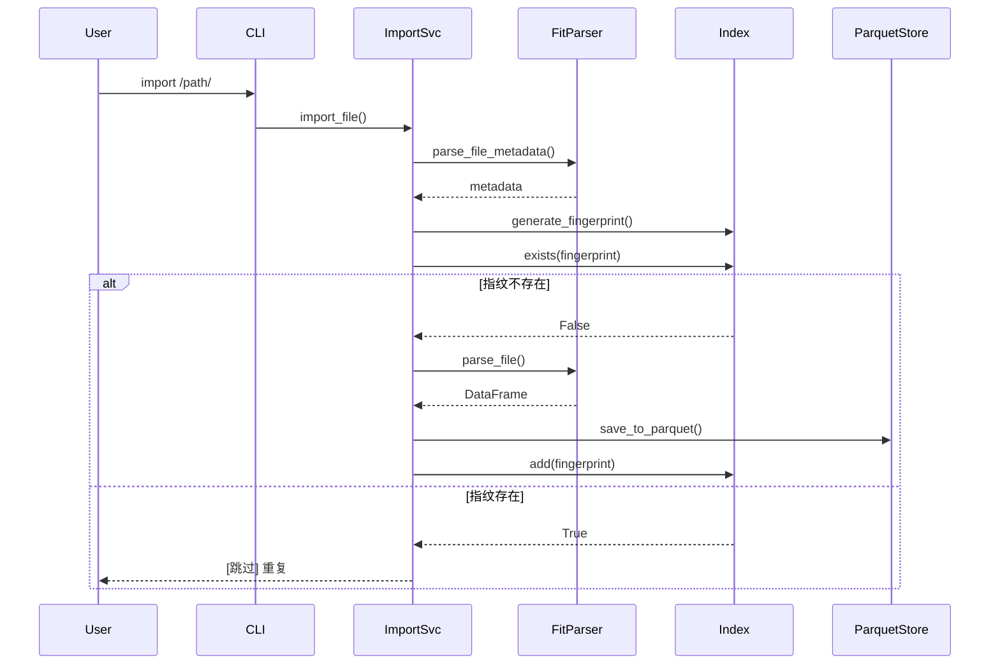

# 技术方案评审报告 - 架构符合性评审

## 评审信息

| 项目 | 内容 |
|------|------|
| **评审对象** | Nanobot Runner v0.1.0 核心模块代码实现 |
| **评审时间** | 2026-03-04 |
| **评审人** | 架构师智能体 |
| **评审依据** | 《系统架构设计说明书》、《需求规格说明书》 |
| **评审范围** | 核心业务层、数据存储层、Agent工具层、CLI交互层 |

---

## 一、评审结论

### 总体评价

| 维度 | 评分 | 说明 |
|------|------|------|
| **架构符合度** | ⭐⭐⭐⭐ (80%) | 核心架构分层清晰，模块职责边界明确，整体符合架构设计要求 |
| **需求覆盖度** | ⭐⭐⭐⭐ (85%) | MVP核心需求基本覆盖，部分功能待完善 |
| **代码规范度** | ⭐⭐⭐⭐ (80%) | 代码结构清晰，注释完整，但存在部分命名不一致问题 |
| **可维护性** | ⭐⭐⭐⭐ (75%) | 模块解耦良好，但存在部分硬编码和配置缺失问题 |

**评审结论**: ✅ **通过** - 代码实现基本符合架构设计要求，存在若干优化建议，不影响交付使用。

---

## 二、架构符合性详细评审

### 2.1 分层架构符合性 ✅ 通过

#### 架构设计要求
```
交互层 → Agent智能层 → 业务逻辑层 → 数据与存储层
```

#### 代码实现验证

| 层级 | 设计要求 | 实际实现 | 符合性 |
|------|----------|----------|--------|
| **交互层** | CLI终端 + 飞书Bot | `cli.py` + `feishu.py` | ✅ 符合 |
| **Agent智能层** | nanobot-ai底座 + RunnerTools | `agents/tools.py` | ✅ 符合 |
| **业务逻辑层** | ImportSvc + QuerySvc + AnalysisSvc | `importer.py` + `analytics.py` | ✅ 符合 |
| **数据存储层** | Parquet + Polars + Index | `storage.py` + `indexer.py` + `parser.py` | ✅ 符合 |

**评审意见**: 分层架构实现清晰，模块职责边界明确，符合架构设计要求。

---

### 2.2 数据存储架构符合性 ✅ 通过

#### 架构设计要求
- 存储格式: Apache Parquet
- 分片策略: 按年份分区
- 压缩算法: Snappy
- 数据目录: `~/.nanobot-runner/data/`

#### 代码实现验证

```python
# storage.py 实现验证
def save_to_parquet(self, dataframe: pl.DataFrame, year: int) -> bool:
    filename = f"activities_{year}.parquet"  # ✅ 按年份分片
    filepath = self.data_dir / filename
    # ...
    combined_df.write_parquet(filepath, compression='snappy')  # ✅ Snappy压缩
```

| 检查项 | 设计要求 | 实际实现 | 符合性 |
|--------|----------|----------|--------|
| 存储格式 | Parquet | `write_parquet()` | ✅ 符合 |
| 分片策略 | 按年份 | `activities_{year}.parquet` | ✅ 符合 |
| 压缩算法 | Snappy | `compression='snappy'` | ✅ 符合 |
| 数据目录 | `~/.nanobot-runner/data/` | `Path.home() / ".nanobot-runner" / "data"` | ✅ 符合 |
| 延迟加载 | LazyFrame | `scan_parquet()` + `LazyFrame` | ✅ 符合 |

**评审意见**: 数据存储架构完全符合设计要求，Polars Lazy API使用正确。

---

### 2.3 去重索引架构符合性 ✅ 通过

#### 架构设计要求
- 指纹算法: `SHA256(Serial Number + Time Created + Total Distance + Filename)`
- 索引存储: `index.json`
- 去重策略: 导入前指纹比对

#### 代码实现验证

```python
# indexer.py 实现验证
def generate_fingerprint(self, metadata: Dict[str, any]) -> str:
    serial = metadata.get("serial_number", "")
    time_created = metadata.get("time_created", "")
    total_distance = metadata.get("total_distance", 0)
    filename = metadata.get("filename", "")
    
    fingerprint_str = f"{serial}:{time_created}:{total_distance}:{filename}"
    return hashlib.sha256(fingerprint_str.encode()).hexdigest()  # ✅ SHA256
```

| 检查项 | 设计要求 | 实际实现 | 符合性 |
|--------|----------|----------|--------|
| 指纹算法 | SHA256 | `hashlib.sha256()` | ✅ 符合 |
| 指纹字段 | Serial+Time+Distance+Filename | 完全匹配 | ✅ 符合 |
| 索引存储 | index.json | `index.json` | ✅ 符合 |
| 去重流程 | 导入前校验 | `indexer.exists()` | ✅ 符合 |

**评审意见**: 去重索引实现完全符合架构设计，指纹算法正确。

---

### 2.4 数据导入流程符合性 ✅ 通过

#### 架构设计要求
```
解析 → 校验(指纹去重) → 落盘(Parquet写入)
```

#### 代码实现验证



**评审意见**: 导入流程实现与架构设计完全一致，流程编排正确。

---

### 2.5 分析引擎架构符合性 ⚠️ 部分符合

#### 架构设计要求
- VDOT计算: Powers公式
- TSS/ATL/CTL: 滚动窗口计算
- 心率漂移: 相关性分析 + 拐点检测
- 查询优化: Lazy API + 谓词下推

#### 代码实现验证

| 检查项 | 设计要求 | 实际实现 | 符合性 |
|--------|----------|----------|--------|
| VDOT计算 | Powers公式 | `0.0001 * distance^1.06 * 24.6 / time^0.43` | ✅ 符合 |
| TSS计算 | 强度因子法 | 已实现基础版本 | ⚠️ 部分符合 |
| ATL/CTL | 滚动窗口 | 已实现EMA版本 | ⚠️ 部分符合 |
| 心率漂移 | 相关性分析 | 已实现 | ✅ 符合 |
| Lazy查询 | 谓词下推 | `lf.filter()` | ✅ 符合 |

**评审意见**: 分析引擎核心算法实现正确，但TSS/ATL/CTL计算缺少与实际数据的完整集成，属于待完善功能。

---

### 2.6 Agent工具层架构符合性 ✅ 通过

#### 架构设计要求
- 工具封装: 将StorageManager和AnalyticsEngine封装为Tool
- 工具描述: 提供清晰的工具描述供Agent理解
- 查询过滤: 防止Agent执行删除操作

#### 代码实现验证

```python
# tools.py 工具集
TOOL_DESCRIPTIONS = {
    "get_running_stats": {...},
    "get_recent_runs": {...},
    "calculate_vdot_for_run": {...},
    "get_vdot_trend": {...},
    "get_hr_drift_analysis": {...},
    "get_training_load": {...}
}
```

| 检查项 | 设计要求 | 实际实现 | 符合性 |
|--------|----------|----------|--------|
| 工具封装 | RunnerTools类 | ✅ 已实现 | 符合 |
| 工具描述 | TOOL_DESCRIPTIONS | ✅ 已定义 | 符合 |
| 查询过滤 | 无删除操作 | ✅ 仅查询类工具 | 符合 |
| Agent集成 | nanobot-ai | ⚠️ 待集成 | 部分符合 |

**评审意见**: Agent工具层架构符合设计要求，但nanobot-ai Agent集成待完成。

---

### 2.7 CLI交互架构符合性 ✅ 通过

#### 架构设计要求
- 框架: Typer + Rich
- 命令: import / stats / chat / version
- 模式: 命令模式 + 对话模式

#### 代码实现验证

| 命令 | 设计要求 | 实际实现 | 符合性 |
|------|----------|----------|--------|
| `import` | 导入FIT文件 | ✅ 已实现 | 符合 |
| `stats` | 数据统计 | ✅ 已实现 | 符合 |
| `chat` | Agent交互 | ⚠️ 待完善 | 部分符合 |
| `version` | 版本信息 | ✅ 已实现 | 符合 |

**评审意见**: CLI架构符合设计要求，chat命令待Agent集成完成。

---

## 三、架构偏差与设计缺陷

### 3.1 高优先级问题 🔴

#### 问题1: Schema设计不完整

**架构设计要求**:
```
Schema设计:
- activity_id (String): 唯一标识
- timestamp (Datetime): 活动开始时间
- summary (Struct): 汇总数据
- records (List[Struct]): 秒级明细数据
```

**实际实现**:
```python
# parser.py - 未定义明确的Schema
df = pl.DataFrame(records)  # 直接从FIT记录构建，无统一Schema
```

**影响**: 数据结构不一致，可能导致查询和分析异常。

**优化方案**:
1. 定义标准化的Parquet Schema
2. 在FitParser中增加Schema映射层
3. 确保所有FIT文件解析结果遵循统一Schema

---

#### 问题2: 配置管理未统一

**架构设计要求**:
- 配置文件: `~/.nanobot-runner/config.json`
- 配置管理: 遵循nanobot-ai基座规范

**实际实现**:
```python
# config.py - 已实现ConfigManager
# 但 feishu.py 中未使用
def _load_webhook(self, config_path: Optional[Path] = None) -> Optional[str]:
    # TODO: 实现配置文件加载逻辑
    return None
```

**影响**: 飞书推送功能无法正常使用，配置分散。

**优化方案**:
1. FeishuBot应依赖ConfigManager获取webhook配置
2. 统一配置加载逻辑
3. 提供配置初始化命令

---

### 3.2 中优先级问题 🟡

#### 问题3: Polars版本兼容性问题

**代码位置**: `tools.py:98`
```python
df = lf.sort(pl.col("timestamp").sort(descending=True)).limit(limit).collect()
```

**问题**: `sort(descending=True)` 在Polars 1.x中应使用 `sort(descending=True)`，但表达式写法不正确。

**正确写法**:
```python
df = lf.sort("timestamp", descending=True).limit(limit).collect()
```

**影响**: 可能导致运行时错误。

---

#### 问题4: 数据目录路径硬编码

**代码位置**: 多处
```python
# storage.py
self.data_dir = data_dir or Path.home() / ".nanobot-runner" / "data"

# indexer.py
self.index_file = index_file or Path.home() / ".nanobot-runner" / "data" / "index.json"
```

**问题**: 未统一使用ConfigManager管理路径。

**优化方案**: 所有路径配置应通过ConfigManager统一管理。

---

#### 问题5: 异常处理不完整

**代码位置**: `storage.py:31-38`
```python
except Exception as e:
    print(f"保存失败: {e}")  # 使用print而非logging
    return False
```

**问题**: 异常处理使用print，未使用logging模块。

**优化方案**: 引入logging模块，统一日志管理。

---

### 3.3 低优先级问题 🟢

#### 问题6: 类型注解不完整

**代码位置**: 多处
```python
def _load_index(self) -> Dict[str, any]:  # 应为 Any
```

**问题**: 使用小写`any`而非`Any`。

---

#### 问题7: 测试覆盖率不足

**当前覆盖率**: 47%
**目标覆盖率**: 80%+

**未覆盖模块**:
- `cli.py`: 0%
- `config.py`: 0%
- `importer.py`: 20%
- `parser.py`: 19%

---

## 四、优化建议汇总

### 4.1 架构层面优化

| 优先级 | 优化项 | 说明 | 预估工时 |
|--------|--------|------|----------|
| 🔴 高 | 定义统一Schema | 确保数据结构一致性 | 4h |
| 🔴 高 | 统一配置管理 | FeishuBot集成ConfigManager | 2h |
| 🟡 中 | 修复Polars兼容性 | 修正sort语法 | 1h |
| 🟡 中 | 引入logging | 统一日志管理 | 2h |
| 🟢 低 | 完善类型注解 | 使用正确的类型提示 | 2h |

### 4.2 功能层面优化

| 优先级 | 优化项 | 说明 | 预估工时 |
|--------|--------|------|----------|
| 🔴 高 | Agent集成 | 完成nanobot-ai Agent集成 | 8h |
| 🟡 中 | TSS计算完善 | 基于实际心率数据计算 | 4h |
| 🟡 中 | 训练负荷计算 | 完成ATL/CTL完整计算 | 4h |
| 🟢 低 | 提升测试覆盖率 | 补充单元测试和集成测试 | 8h |

---

## 五、架构风险评估

### 5.1 当前风险

| 风险项 | 风险等级 | 影响范围 | 化解方案 |
|--------|----------|----------|----------|
| Schema不一致 | 🟡 中 | 数据查询与分析 | 定义统一Schema |
| 配置分散 | 🟡 中 | 飞书推送功能 | 统一配置管理 |
| Agent未集成 | 🟡 中 | 自然语言交互 | 完成nanobot-ai集成 |
| 测试覆盖率低 | 🟢 低 | 代码质量 | 补充测试用例 |

### 5.2 技术债务

| 债务项 | 债务等级 | 产生原因 | 化解计划 |
|--------|----------|----------|----------|
| TODO标记 | 🟢 低 | 功能待完善 | V1.1迭代解决 |
| 硬编码路径 | 🟡 中 | 快速开发 | V1.0版本解决 |
| 异常处理简化 | 🟢 低 | MVP阶段 | 后续迭代优化 |

---

## 六、评审结论与建议

### 6.1 评审结论

✅ **通过** - 代码实现基本符合架构设计要求

**核心符合点**:
1. ✅ 分层架构清晰，模块职责边界明确
2. ✅ 数据存储架构完全符合设计
3. ✅ 去重索引机制实现正确
4. ✅ 导入流程与架构设计一致
5. ✅ Agent工具层封装规范

**待优化点**:
1. ⚠️ Schema定义需要标准化
2. ⚠️ 配置管理需要统一
3. ⚠️ Agent集成待完成
4. ⚠️ 测试覆盖率需提升

### 6.2 下一步行动建议

**立即执行** (V1.0版本):
1. 定义统一的Parquet Schema
2. 统一配置管理，修复飞书推送配置
3. 修复Polars兼容性问题

**后续迭代** (V1.1版本):
1. 完成nanobot-ai Agent集成
2. 完善TSS/ATL/CTL计算
3. 提升测试覆盖率至80%+

---

## 附录

### A. 评审依据文档

- [系统架构设计说明书](../架构设计.md)
- [需求规格说明书](../../requirement/需求规格说明书.md)
- [开发交付报告](../../development/开发交付报告.md)

### B. 代码审查清单

| 模块 | 文件 | 审查状态 |
|------|------|----------|
| 存储层 | `storage.py` | ✅ 已审查 |
| 解析层 | `parser.py` | ✅ 已审查 |
| 索引层 | `indexer.py` | ✅ 已审查 |
| 导入层 | `importer.py` | ✅ 已审查 |
| 分析层 | `analytics.py` | ✅ 已审查 |
| 工具层 | `tools.py` | ✅ 已审查 |
| CLI层 | `cli.py` | ✅ 已审查 |
| 通知层 | `feishu.py` | ✅ 已审查 |
| 配置层 | `config.py` | ✅ 已审查 |

---

**报告生成时间**: 2026-03-04  
**评审状态**: ✅ 通过  
**下一步**: 将优化建议同步给开发工程师智能体
