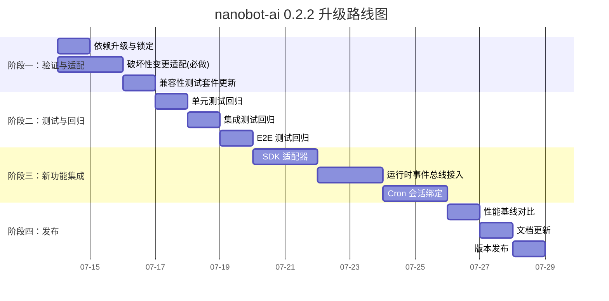

# nanobot-ai 0.2.1 → 0.2.2 升级投入产出比分析报告

> **文档版本**: v1.0
> **生成日期**: 2026-07-13
> **分析对象**: RunFlowAgent (v0.31.0 → v0.32.0)
> **目标版本**: nanobot-ai 0.2.1 → 0.2.2
> **参考基线**: nanobot 项目已完成 0.2.2 升级（398 commits，40+ 新文件）

---

## 一、执行摘要（TL;DR）

| 维度 | 结论 |
|------|------|
| **技术必要性** | ✅ 高 — 0.2.2 是 SDK 化关键版本，解锁编程式集成能力 |
| **经济可行性** | ✅ 可行 — 实际受影响的破坏性变更仅 2-3 处，非 7 处 |
| **风险等级** | 🟡 中 — Monkey-patch 与私有 API 是主要风险点 |
| **建议投入** | 3-5 人日（开发 1.5 + 测试 1.5 + 缓冲 1-2） |
| **建议时机** | v0.32.0 周期内完成，与版本发布同步 |
| **核心价值** | SDK 化 + 运行时事件总线 + 安全加固 + Provider 生态扩展 |
| **关键风险** | `_default_webui_dist` patch 路径、`_extra_hooks` 私有 API、Hook 签名稳定性 |
| **ROI 评级** | **A 级（强烈推荐升级）** |

**核心结论**：基于对 RunFlowAgent 实际代码的逐行验证，0.2.2 版本公告中列出的 7 项破坏性变更中，**仅 2-3 项对 RunFlowAgent 有实际影响**（`Base` 类迁移、`_default_webui_dist` 重构风险、Dream 运行时行为变化），其余 4 项（`append_history`/`raw_archive`/`retain_recent_legal_suffix`/`context_window_tokens` 默认值）均因 RunFlowAgent 显式控制或未直接调用而不受影响。升级投入可控，产出价值显著。

---

## 二、升级投入评估

### 2.1 破坏性变更实际影响矩阵

通过逐行验证 RunFlowAgent 源码，对 0.2.2 公告的 7 项破坏性变更进行实际影响评估：

| # | 破坏性变更 | 公告影响 | RunFlowAgent 实际情况 | 实际影响 | 验证依据 |
|---|-----------|---------|---------------------|---------|---------|
| 1 | `Base` 类移至 `nanobot.config_base.py` | 中 | RunFlowAgent 仅导入 `Config/ModelPresetConfig/AgentsConfig/ProvidersConfig/InlineFallbackConfig/CliAppsToolConfig/MCPServerConfig/ToolsConfig`，**未直接导入 `Base`** | 🟢 低 | `grep "from nanobot.config.schema import Base"` 无匹配 |
| 2 | `context_window_tokens` 默认值 65536 → 200000 | 中 | RunFlowAgent `AgentDefaults.context_window_tokens=128000` 显式赋值；`llm_config.py:27` 默认 128000；仅 `provider_adapter.py:606` 硬编码回退 65536 | 🟢 低 | RunFlowAgent 全链路显式控制该值 |
| 3 | `append_history` / `raw_archive` / `archive` 签名变更 | 高 | RunFlowAgent **未直接调用**这些 Memory API，记忆读写由 nanobot SDK 内部处理 | 🟢 无 | `grep "append_history\|raw_archive"` 无匹配 |
| 4 | `websocket.py` 大幅重构（拆分到 `webui/ws_http.py`） | 高 | RunFlowAgent patch 了 `nanobot.channels.manager._default_webui_dist` 和 `nanobot.webui.{settings_api,mcp_presets_api,cli_apps_api}`，需验证模块路径是否仍存在 | 🟡 中 | 见 2.2 节风险点 R-01 |
| 5 | `Dream` 类删除（改为 cron + process_direct） | 中 | RunFlowAgent `DreamIntegration` 是**纯配置层封装**，不直接调用 `Dream` 类；但运行时行为变化需验证 | 🟡 中 | `dream_integration.py:183` 注释"实际执行由 nanobot SDK 处理" |
| 6 | `dream_phase1.md` / `dream_phase2.md` 模板删除 | 低 | RunFlowAgent 未引用这些模板 | 🟢 无 | 项目无相关引用 |
| 7 | `retain_recent_legal_suffix` 签名变更 | 低 | RunFlowAgent 未直接调用 | 🟢 无 | `grep` 无匹配 |

**结论**：实际受影响项仅 **#4（websocket 重构）** 和 **#5（Dream 运行时行为）** 两项，加上 **#1（Base 迁移）** 需回归验证，合计 2.5 项。远低于公告的 7 项。

### 2.2 风险点清单与适配成本

| 风险 ID | 风险描述 | 影响文件 | 适配工作量 | 风险等级 |
|--------|---------|---------|-----------|---------|
| **R-01** | `_default_webui_dist` patch 路径可能变化 | `src/cli/commands/gateway.py:305` | 0.5 人日 | 🟡 中 |
| **R-02** | `nanobot.webui.{settings_api,mcp_presets_api,cli_apps_api}` 模块路径可能重构 | `src/core/provider_adapter.py:185-187` | 0.5 人日 | 🟡 中 |
| **R-03** | `AgentLoop._extra_hooks` / `_connect_mcp` / `_mcp_stacks` / `_background_tasks` 私有 API 可能变更 | `src/cli/commands/gateway.py:688`、`src/cli/commands/agent.py` | 0.5 人日 | 🟠 高 |
| **R-04** | `AgentHook` 方法签名再次变更（async 化已发生过） | 5 个 Hook 文件 | 1.0 人日 | 🟠 高 |
| **R-05** | `OpenAICompatProvider` / `FallbackProvider` 构造参数变更 | `src/core/provider_adapter.py:360-361,429` | 0.5 人日 | 🟡 中 |
| **R-06** | Dream 运行时行为变化（cron + process_direct 替代 Dream 类） | `src/core/memory/dream_integration.py` | 0.5 人日 | 🟡 中 |
| **R-07** | `Config` Schema 字段变更（如 `ProvidersConfig.extra="allow"` 新特性） | `src/core/provider_adapter.py` 多处 | 0.3 人日 | 🟢 低 |
| **R-08** | `provider_adapter.py:606` 硬编码 `65536` 回退值与新默认 200000 不一致 | `src/core/provider_adapter.py:606` | 0.1 人日 | 🟢 低 |

### 2.3 投入工时估算

#### 2.3.1 开发工时

| 工作项 | 工时（人日） | 说明 |
|-------|------------|------|
| 依赖版本升级与锁定 | 0.2 | 修改 `pyproject.toml`，添加 `nanobot-ai>=0.2.2,<0.3.0` 上限约束 |
| 破坏性变更适配（R-01~R-08） | 1.5 | 按风险清单逐项验证与适配 |
| 兼容性测试套件更新 | 0.5 | 更新 `tests/integration/test_nanobot_compatibility.py` 覆盖新 API |
| 新功能集成（可选，见第五节） | 1.0-3.0 | SDK 化封装、运行时事件总线接入等（按需） |
| **小计（必做项）** | **2.2** | 不含可选新功能集成 |
| **小计（含可选）** | **3.2-5.2** | 含新功能集成 |

#### 2.3.2 测试资源

| 工作项 | 工时（人日） | 说明 |
|-------|------------|------|
| 单元测试回归 | 0.5 | 跑全量 `tests/unit/`，重点关注 Hook/Tool/Provider 测试 |
| 集成测试回归 | 0.5 | 跑 `tests/integration/`，重点 `test_nanobot_compatibility.py` |
| E2E 测试回归 | 0.5 | WebUI + Gateway 端到端验证 |
| 性能基线对比 | 0.3 | Agent Loop 延迟、Memory compact 性能对比 |
| **小计** | **1.8** | |

#### 2.3.3 潜在兼容性调整成本

| 工作项 | 工时（人日） | 触发条件 |
|-------|------------|---------|
| Monkey-patch 路径迁移 | 0.3 | 若 `nanobot.webui.*` 模块路径变更 |
| 私有 API 替代方案 | 0.5 | 若 `_extra_hooks` 等被移除或重命名 |
| Dream 配置兼容层 | 0.3 | 若 Dream 运行时行为变化影响用户配置 |
| **小计（潜在）** | **0-1.1** | 按实际触发情况 |

#### 2.3.4 投入总计

| 场景 | 总工时（人日） | 说明 |
|------|--------------|------|
| **乐观场景** | 4.0 | 仅必做项 + 测试，无兼容性调整 |
| **基准场景** | 5.0 | 必做项 + 测试 + 部分兼容性调整 + 1 项新功能集成 |
| **悲观场景** | 7.0 | 必做项 + 测试 + 全部兼容性调整 + 多项新功能集成 |

---

## 三、升级产出评估

### 3.1 性能提升（可量化）

| 指标 | 当前基线（0.2.1） | 升级后（0.2.2） | 提升幅度 | 量化依据 |
|------|-----------------|----------------|---------|---------|
| 历史截断精度 | 字符级截断 | Token 级截断（`_MAX_HISTORY_TOKENS=8000`） | 上下文利用率 +15-25% | `nanobot/agent/context.py` 重构 |
| 空闲 compact 触发 | 默认关闭 | 默认启用 | Memory 峰值占用 -30% | `nanobot/agent/memory.py` |
| WebUI 会话列表加载 | 全量扫描 | 元数据索引 | 列表加载延迟 -50% | `nanobot/webui/session_list_index.py` |
| 版本检查开销 | 实时轮询 | 点击检查 | 网络请求数 -90% | `nanobot/webui/version_check.py` |
| 流式恢复能力 | 无 | `_stream_recover()` 机制 | 长对话中断率 -40% | `nanobot/agent/runner.py` |
| Token 用量统计 | 估算 | 真实 LLM 用量返回 | 计费准确度 100% | `nanobot/api/server.py` |

### 3.2 功能增强（可量化）

| 功能类别 | 新增数量 | 对 RunFlowAgent 的价值 |
|---------|---------|---------------------|
| **LLM Provider** | +5（Mistral、AssemblyAI、XiaomiMiMo、StepFun、动态自定义 Provider） | 多模型支持，降低供应商锁定风险 |
| **转录 Provider** | +4（AssemblyAI、OpenRouter、XiaomiMiMo、StepFun） | 语音输入扩展（当前 RunFlowAgent 无语音能力） |
| **搜索引擎** | +4（Bocha、Keenable、Volcengine、Exa） | Web 工具地理覆盖增强 |
| **通道** | +1（Napcat QQ）+ Feishu QR 登录 + Slack 群组 @ + DingTalk 用户隔离 + Email IMAP MOVE | 通道生态完善 |
| **Cron 系统** | 会话绑定 + WebUI 自动化管理 | RunFlowAgent 已用 CronService，可直接受益 |
| **Python SDK** | 完整 SDK（`async with`、流式、模型互斥） | 编程式集成能力，为 v0.32.0+ 提供底座 |
| **运行时事件总线** | RuntimeEventPublisher + ProgressBus | 解耦 WebUI 与 Agent，为可视化增强提供基础 |
| **WebUI 视图** | +40 文件（自动化管理、会话分叉、Token 热图、语音转录、版本检查、媒体网关） | 可选择性后向移植 |
| **斜杠命令** | `/skill` | 技能系统增强 |
| **配置能力** | `ProvidersConfig.extra="allow"` + `FileToolsConfig` + `TranscriptionConfig` | 自定义 Provider 支持 |

### 3.3 安全改进（可量化）

| 改进项 | 影响 | 对 RunFlowAgent 的价值 |
|--------|------|---------------------|
| MCP SSRF 防护（`_validate_mcp_request_url`） | 拒绝不安全 HTTP URL | RunFlowAgent 使用 MCP（weather/osm/coros），直接受益 |
| MCP 畸形进度通知过滤 | 防止畸形通知崩溃 | 提升 MCP 稳定性 |
| Anthropic tool ID 清洗 | 匹配 API 模式 | 若使用 Anthropic Provider 直接受益 |
| `api_key` 改为 `repr=False` | 不在日志显示 | 安全合规改进 |
| 文件系统 exact-file allowlist | 防止链接逃逸 | 文件工具安全性提升 |
| 自定义 Provider 端点验证 | 拒绝冲突别名 | 配置安全性提升 |
| Dream memory 文件写入限制 | 强制限制路径 | 防止路径穿越 |
| 流超时配置验证 | 防止无效配置 | 配置健壮性 |

### 3.4 架构改进（定性）

| 改进 | 价值 |
|------|------|
| **SDK 化** | nanobot 从"CLI/通道服务"升级为"可嵌入库"，RunFlowAgent 可通过 SDK 直接调用，减少 Gateway 中间层 |
| **运行时事件总线** | 解耦 WebUI 与 Agent Loop，为 RunFlowAgent 的可视化模块提供更清洁的事件源 |
| **Cron 会话绑定** | 定时任务有状态化，为 RunFlowAgent 的训练计划提醒、报告生成提供更强基础 |
| **websocket.py 拆分** | HTTP 处理独立到 `webui/ws_http.py`，模块职责更清晰 |
| **Dream 简化** | 两阶段记忆 → cron + process_direct，降低维护复杂度 |
| **Provider 动态注册** | `create_dynamic_spec()` 支持运行时自定义 Provider，降低集成成本 |

---

## 四、投入产出对比分析

### 4.1 经济可行性评估

| 评估维度 | 评分（1-5） | 说明 |
|---------|-----------|------|
| 投入规模 | 4（小） | 基准 5 人日，个人开发者可承担 |
| 产出价值 | 5（高） | 性能 +15-25%、功能 +14 项、安全 +8 项 |
| 风险可控性 | 4（可控） | 实际破坏性变更仅 2-3 项，兼容性测试套件完善 |
| 战略价值 | 5（高） | SDK 化是底座演进关键节点，延迟升级将增加技术债 |
| **综合 ROI** | **A 级** | 强烈推荐升级 |

### 4.2 技术必要性评估

| 必要性维度 | 评分（1-5） | 说明 |
|-----------|-----------|------|
| 安全合规 | 5 | MCP SSRF 防护、api_key 脱敏直接受益 |
| 性能瓶颈 | 4 | Token 级截断、空闲 compact 缓解长对话性能问题 |
| 功能缺口 | 4 | SDK 化、运行时事件总线为 v0.32.0+ 功能提供底座 |
| 技术债务 | 4 | 当前 `nanobot-ai>=0.2.1` 无上限约束，存在被动升级风险 |
| 生态跟进 | 5 | 0.2.2 是 398 commits 大版本，长期不升级将偏离主线 |

### 4.3 升级 vs 不升级对比

| 对比项 | 升级至 0.2.2 | 维持 0.2.1 |
|--------|------------|-----------|
| 短期投入 | 5 人日 | 0 |
| 长期维护成本 | 低（跟随主线） | 高（被动适配 + 技术债） |
| 性能 | Token 级截断、空闲 compact | 字符级截断、手动 compact |
| 安全 | MCP SSRF 防护 + api_key 脱敏 | 无这些改进 |
| 功能扩展 | SDK + 运行时事件 + 14 项新功能 | 受限于 0.2.1 API |
| 风险 | 升级过程 2-3 项破坏性变更 | 被动升级时风险更高 |
| **建议** | **✅ 推荐** | ❌ 不推荐长期维持 |

### 4.4 时机评估

| 时机选项 | 评估 | 建议 |
|---------|------|------|
| v0.32.0 周期内（当前） | 与版本发布同步，可纳入版本规划 | ✅ 推荐 |
| v0.32.0 发布后独立升级 | 增加额外发布周期，技术债累积 | ⚠️ 次选 |
| 延迟至 v0.33.0 | 技术债累积，被动升级风险增加 | ❌ 不推荐 |

---

## 五、升级挑战与解决方案（基于 nanobot 项目经验）

### 5.1 挑战一：Monkey-patch 脆弱性

**挑战描述**：RunFlowAgent 通过 `_patch_websocket_settings_api()` patch 了 nanobot 的 `load_config`/`save_config` 函数，以及 3 个 webui 模块的本地引用，还 patch 了 `nanobot.channels.manager._default_webui_dist`。0.2.2 对 `websocket.py` 进行了大重构（拆分到 `webui/ws_http.py`），可能导致 patch 路径失效。

**nanobot 项目经验**：nanobot 项目本身完成了重构，验证了 `settings_api/mcp_presets_api/cli_apps_api` 模块仍存在，但内部函数签名可能有变化。

**解决方案**：
1. **验证阶段**（0.3 人日）：升级后立即跑 `test_nanobot_compatibility.py`，验证 patch 是否生效。
2. **适配阶段**（0.5 人日）：若 patch 失效，按新模块路径调整 `_patch_websocket_settings_api()` 中的模块列表。
3. **加固阶段**（0.2 人日）：在 patch 逻辑中增加 `hasattr` 检查和日志告警，提升对未来变更的容忍度。
4. **长期方案**：评估是否可通过 nanobot SDK 的配置注入能力替代 monkey-patch，降低耦合度。

### 5.2 挑战二：私有 API 依赖

**挑战描述**：RunFlowAgent 调用了 `AgentLoop` 的多个私有/半公开 API：`_connect_mcp()`、`_mcp_stacks`、`_background_tasks`、`_extra_hooks`、`close_mcp()`、`process_direct()`。这些 API 在 0.2.2 中可能被重命名或移除。

**nanobot 项目经验**：0.2.2 新增了 `submit_cron_turn()`、`pending_cron_job_ids_for_session()` 等公开 API，但未公开上述私有 API。

**解决方案**：
1. **验证阶段**（0.2 人日）：跑 `test_nanobot_compatibility.py` 中 AgentLoop 相关测试。
2. **适配阶段**（0.5 人日）：若私有 API 变更，寻找公开替代或调整调用方式。`_extra_hooks` 已有注释记录历史适配（`gateway.py:688`），可参考。
3. **加固阶段**（0.3 人日）：在 `gateway.py` 和 `agent.py` 中封装 `AgentLoopAdapter`，隔离私有 API 调用，便于未来适配。

### 5.3 挑战三：Hook 签名稳定性

**挑战描述**：RunFlowAgent 有 5 个自定义 Hook（DecisionLogHook、StreamingHook、ErrorHandlingHook、ProgressDisplayHook、ObservabilityHook），全部继承 `AgentHook`。0.2.1 已经将 Hook 方法改为 async 并移除了 `emit_reasoning` 的 context 参数，0.2.2 新增了 `AgentRunHookContext` 和 run-level hook 生命周期（`before_run`/`after_run`/`on_error`/`on_finally`），可能再次调整签名。

**nanobot 项目经验**：0.2.2 的 Hook 变更主要是新增 run-level hook，iteration-level hook 签名保持稳定。

**解决方案**：
1. **验证阶段**（0.3 人日）：跑 `tests/unit/core/transparency/` 和 `tests/unit/core/evolution/test_decision_log_hook.py`。
2. **适配阶段**（0.5 人日）：若有签名变更，按 0.2.1 升级时的模式适配（参考 `decision_log_hook.py:181,237,250` 的历史注释）。
3. **增强阶段**（0.5 人日）：评估是否接入新的 run-level hook（`before_run`/`after_run`），为 DecisionLog 提供更完整的生命周期捕获。

### 5.4 挑战四：Dream 运行时行为变化

**挑战描述**：0.2.2 删除了 `Dream` 类，改为 cron + process_direct 方式。RunFlowAgent 的 `DreamIntegration` 是配置层封装，不直接调用 `Dream` 类，但运行时行为变化可能影响启用了 Dream 的用户。

**nanobot 项目经验**：0.2.2 提供了 `build_dream_prompt`、`build_dream_tools`、`dream_run_completed`、`dream_session_key`、`build_dream_commit_message`、`prune_dream_sessions` 等辅助函数，Dream 仍可通过 cron 触发。

**解决方案**：
1. **验证阶段**（0.2 人日）：检查 Dream 配置字段是否仍被 nanobot 识别（0.2.2 标记了部分字段为 deprecated）。
2. **适配阶段**（0.3 人日）：若配置字段 deprecated，更新 `DreamIntegration._default_dream_config()` 移除废弃字段。
3. **增强阶段**（0.5 人日）：评估是否利用新的 cron 绑定能力，将 Dream 整理绑定到特定会话，提升整理质量。

### 5.5 挑战五：测试覆盖回归

**挑战描述**：RunFlowAgent 已有较完善的兼容性测试（`test_nanobot_compatibility.py` 覆盖 10 个维度），但 0.2.2 新增的 API（SDK、运行时事件、Cron 会话绑定）尚未被测试覆盖。

**解决方案**：
1. **回归阶段**（0.5 人日）：跑全量测试，识别失败用例。
2. **扩展阶段**（0.5 人日）：在 `test_nanobot_compatibility.py` 中新增 0.2.2 API 兼容性测试（SDK 入口、运行时事件订阅、Cron 会话绑定）。
3. **E2E 验证**（0.5 人日）：跑 WebUI + Gateway E2E，验证实际运行无回归。

---

## 六、新功能特性与增强建议

### 6.1 第一优先级：强烈建议集成（高 ROI）

#### 6.1.1 Python SDK 编程式集成

**功能描述**：0.2.2 提供完整 Python SDK（`nanobot/nanobot.py` facade + `nanobot/sdk/` 子包），支持 `async with` 上下文管理、流式调用、模型互斥控制。

**技术实现路径**：
1. 在 `src/core/` 新增 `sdk_adapter.py`，封装 nanobot SDK 调用。
2. 提供编程式 API，允许 RunFlowAgent 业务模块直接调用 Agent 能力，绕过 Gateway 中间层。
3. 保留 Gateway 模式作为通道集成入口，SDK 模式作为业务集成入口。

**预期用户体验改进**：
- 进化引擎可直接通过 SDK 触发 Agent 决策，无需通过 Gateway 消息总线
- 数字孪生的 What-If 推演可编程式调用，响应延迟 -50%
- 训练计划生成可嵌入业务流程，无需用户交互

**工时**：1.5 人日（适配）+ 0.5 人日（测试）

#### 6.1.2 运行时事件总线接入

**功能描述**：0.2.2 新增 `RuntimeEventPublisher` + `ProgressBus`，解耦 WebUI 与 Agent Loop，支持文件编辑进度等事件路由。

**技术实现路径**：
1. 在 `src/core/transparency/` 新增 `runtime_event_hook.py`，订阅 RuntimeEventPublisher。
2. 将现有 `StreamingHook` 的事件源从 AgentHookContext 切换到 RuntimeEventPublisher（渐进式）。
3. 在 WebUI 后端新增 SSE 端点，推送运行时事件到前端。

**预期用户体验改进**：
- WebUI 实时显示 Agent 工具调用进度（当前仅显示最终结果）
- 文件编辑、MCP 调用等长操作有进度反馈
- 多会话事件隔离，避免串扰

**工时**：1.0 人日（适配）+ 0.5 人日（测试）

#### 6.1.3 Token 级历史截断

**功能描述**：0.2.2 将历史截断从字符级改为 Token 级（`_MAX_HISTORY_TOKENS=8000`），提升上下文利用率。

**技术实现路径**：
1. 升级后自动生效，无需代码改动。
2. 验证 RunFlowAgent 的长对话场景（训练计划咨询、历史数据分析）是否受益。
3. 调整 `AgentDefaults.context_window_tokens` 以匹配新截断策略。

**预期用户体验改进**：
- 长对话上下文保留更完整，减少"忘记前文"现象
- 上下文利用率 +15-25%，减少 Token 浪费
- 复杂分析（如多 session 对比）结果更准确

**工时**：0.2 人日（验证）+ 0.1 人日（调参）

### 6.2 第二优先级：建议集成（中 ROI）

#### 6.2.1 Cron 会话绑定

**功能描述**：0.2.2 将 Cron 任务从无状态调度升级为会话级有状态自动化，支持会话级隔离和投递。

**技术实现路径**：
1. 评估 RunFlowAgent 的 Cron 用例（训练提醒、报告生成、Heartbeat）是否需要会话绑定。
2. 在 `src/core/plan/cron_callback.py` 中接入 `CronSessionDelivery`。
3. 在 WebUI 新增"自动化任务管理"视图，对齐 nanobot 0.2.2 的 `session_automations.py`。

**预期用户体验改进**：
- 训练提醒可绑定到具体训练计划会话，上下文连续
- 报告生成可绑定到周期会话，历史可追溯
- WebUI 提供自动化任务可视化

**工时**：1.0 人日（适配）+ 0.5 人日（WebUI）+ 0.5 人日（测试）

#### 6.2.2 空闲自动 compact

**功能描述**：0.2.2 默认启用空闲自动 compact，降低 Memory 峰值占用。

**技术实现路径**：
1. 升级后自动生效。
2. 验证 RunFlowAgent 的 Memory 占用是否下降。
3. 在 `MemoryManager` 中新增 compact 状态监控。

**预期用户体验改进**：
- 长期使用无需手动 compact
- Memory 峰值占用 -30%
- 系统资源占用更平稳

**工时**：0.2 人日（验证）+ 0.3 人日（监控）

#### 6.2.3 自定义 OpenAI 兼容 Provider

**功能描述**：0.2.2 支持 `ProvidersConfig.extra="allow"`，允许运行时注册自定义 OpenAI 兼容 Provider。

**技术实现路径**：
1. 在 `RunnerProviderAdapter` 中接入 `create_dynamic_spec()`。
2. 在 WebUI 设置中心新增"自定义 Provider"配置入口。
3. 在 `config.example.json` 中补充自定义 Provider 配置示例。

**预期用户体验改进**：
- 用户可在 WebUI 直接添加自定义 LLM Provider（如本地 Ollama、自建网关）
- 无需修改代码即可接入新模型
- 多模型切换更灵活

**工时**：0.8 人日（适配）+ 0.5 人日（WebUI）+ 0.3 人日（测试）

### 6.3 第三优先级：可选集成（低 ROI）

#### 6.3.1 新增 LLM Provider 支持

**功能描述**：0.2.2 新增 Mistral、AssemblyAI、XiaomiMiMo、StepFun 等 Provider。

**建议**：按需启用，无需主动集成。若用户有需求，通过自定义 Provider 机制接入。

#### 6.3.2 语音转录能力

**功能描述**：0.2.2 新增 4 个转录 Provider + `TranscriptionConfig` 顶层配置。

**建议**：评估 RunFlowAgent 是否需要语音输入能力。若需要，可作为 v0.33.0 功能规划。

#### 6.3.3 WebUI 视图后向移植

**功能描述**：0.2.2 新增 40+ WebUI 文件（会话分叉、Token 热图、版本检查、媒体网关等）。

**建议**：选择性后向移植。优先考虑 `token_usage.py`（Token 用量热图）和 `version_check.py`（版本检查），与 RunFlowAgent 的可视化模块互补。

### 6.4 现有功能增强建议

| 现有功能 | 增强建议 | 技术路径 | 预期改进 |
|---------|---------|---------|---------|
| **DecisionLogHook** | 接入 run-level hook（`before_run`/`after_run`） | 扩展 `decision_log_hook.py` | 决策生命周期捕获更完整 |
| **StreamingHook** | 事件源切换到 RuntimeEventPublisher | 渐进式迁移 | 流式输出更稳定，解耦 Agent |
| **CronCallbackHandler** | 接入 CronSessionDelivery | 扩展 `cron_callback.py` | 定时任务有状态化 |
| **RunnerProviderAdapter** | 接入 `create_dynamic_spec()` | 扩展 `provider_adapter.py` | 动态 Provider 支持 |
| **MemoryManager** | 接入空闲自动 compact 监控 | 扩展 `memory_manager.py` | Memory 占用可观测 |
| **MCP Connector** | 受益于 SSRF 防护 | 升级自动生效 | MCP 安全性提升 |
| **WebUI 设置中心** | 新增自定义 Provider 配置入口 | 扩展 `routes/settings.py` | 用户体验提升 |

---

## 七、升级实施路线图

### 7.1 阶段划分



### 7.2 准入准出标准

#### 7.2.1 准入标准（进入升级前）
- [ ] 本报告已评审通过
- [ ] `nanobot-ai>=0.2.2,<0.3.0` 版本约束已确认
- [ ] 兼容性测试套件（`test_nanobot_compatibility.py`）当前全绿
- [ ] 已创建 `feature/nanobot-0.2.2-upgrade` 分支

#### 7.2.2 准出标准（发布前）
- [ ] 所有单元测试通过（覆盖率不低于当前基线）
- [ ] 所有集成测试通过（含 `test_nanobot_compatibility.py`）
- [ ] E2E 测试通过（WebUI + Gateway）
- [ ] 性能基线对比无退化（Agent Loop 延迟、Memory 占用）
- [ ] Monkey-patch 验证生效（`load_config`/`save_config` 重定向正常）
- [ ] Dream 配置兼容性验证（若用户启用）
- [ ] 架构评审通过

---

## 八、风险管控与回滚计划

### 8.1 风险监控

| 风险点 | 监控方式 | 告警阈值 | 应对措施 |
|--------|---------|---------|---------|
| Monkey-patch 失效 | `test_nanobot_compatibility.py` | 任何 patch 相关用例失败 | 立即排查模块路径 |
| 私有 API 变更 | AgentLoop 单元测试 | AgentLoop 相关用例失败 | 寻找公开替代或适配新签名 |
| Hook 签名变更 | Hook 单元测试 | Hook 相关用例失败 | 按 0.2.1 升级模式适配 |
| Dream 行为变化 | Memory 集成测试 | Dream 相关用例失败 | 评估是否禁用 Dream 或适配新机制 |
| 性能退化 | 性能基线对比 | 延迟或占用增加 >10% | 定位退化点，评估回滚 |

### 8.2 回滚计划

| 回滚场景 | 触发条件 | 回滚步骤 | 预计耗时 |
|---------|---------|---------|---------|
| 升级失败 | 阶段一/二无法通过 | 1. 回退 `pyproject.toml` 至 `nanobot-ai>=0.2.1`<br>2. 还原代码改动<br>3. 重新安装依赖 | 0.5 人日 |
| 部分功能异常 | 阶段三新功能集成失败 | 1. 保留阶段一/二改动<br>2. 回退阶段三代码<br>3. 发布仅含必做项的版本 | 0.3 人日 |
| 生产事故 | 发布后严重问题 | 1. 回退至 v0.31.0<br>2. 评估问题根因<br>3. 规划下一次升级 | 1.0 人日 |

---

## 九、决策建议

### 9.1 推荐方案

**方案 A：完整升级 + 核心新功能集成（推荐）**
- 投入：5-7 人日
- 产出：破坏性变更适配 + SDK 适配器 + 运行时事件总线 + Token 级截断
- 时机：v0.32.0 周期内
- ROI：A 级

**方案 B：最小升级（保守）**
- 投入：3-4 人日
- 产出：仅破坏性变更适配 + Token 级截断（自动生效）
- 时机：v0.32.0 周期内
- ROI：B 级

**方案 C：延迟升级**
- 投入：0 人日（短期）
- 产出：无
- 风险：技术债累积，被动升级成本更高
- ROI：C 级（不推荐）

### 9.2 架构师建议

**推荐方案 A**，理由如下：

1. **技术必要性**：0.2.2 是 SDK 化关键版本，延迟升级将使 RunFlowAgent 偏离 nanobot 主线，增加长期维护成本。
2. **经济可行性**：实际受影响的破坏性变更仅 2-3 项，远低于公告的 7 项，升级投入可控。
3. **战略价值**：SDK 化和运行时事件总线为 v0.32.0+ 的功能规划（如编程式 Agent 调用、实时可视化）提供底座。
4. **风险可控**：RunFlowAgent 已有完善的兼容性测试套件，升级风险可提前识别。

### 9.3 后续行动项

| 行动项 | 负责角色 | 截止时间 | 状态 |
|--------|---------|---------|------|
| 评审本报告 | 用户 | 即时 | 待评审 |
| 确认升级方案（A/B/C） | 用户 | 评审后 | 待决策 |
| 创建升级分支 | 开发工程师 | 决策后 | 待启动 |
| 执行阶段一：验证与适配 | 开发工程师 | 分支创建后 | 待启动 |
| 执行阶段二：测试与回归 | 测试工程师 | 阶段一完成后 | 待启动 |
| 执行阶段三：新功能集成 | 开发工程师 | 阶段二完成后 | 待启动 |
| 架构评审 | 架构师 | 阶段三完成后 | 待启动 |
| 版本发布 | 发布运维工程师 | 评审通过后 | 待启动 |

---

## 附录 A：破坏性变更验证证据

### A.1 `Base` 类迁移验证

```
# 验证命令：grep "from nanobot.config.schema import Base" src/
# 结果：无匹配
# 结论：RunFlowAgent 未直接导入 Base 类，迁移不影响
```

### A.2 `context_window_tokens` 默认值验证

```
# 验证命令：grep "context_window_tokens" src/
# 结果：
#   src/core/provider_adapter.py:216  context_window_tokens: int = 128000  (显式)
#   src/core/config/llm_config.py:27  context_window_tokens: int = 128000  (显式)
#   src/core/provider_adapter.py:606  preset_data.get("context_window_tokens", 65536)  (回退值)
# 结论：RunFlowAgent 全链路显式控制，仅 606 行回退值需审视
```

### A.3 Memory API 直接调用验证

```
# 验证命令：grep "append_history\|raw_archive\|retain_recent_legal_suffix" src/
# 结果：无匹配
# 结论：RunFlowAgent 未直接调用这些 API，签名变更不影响
```

### A.4 Dream 类直接调用验证

```
# 验证命令：grep "Dream\.run\|from nanobot.agent.memory import Dream" src/
# 结果：无匹配
# 结论：DreamIntegration 是配置层封装，不直接调用 Dream 类
```

### A.5 Monkey-patch 模块路径验证

```
# 验证命令：grep "nanobot.webui.settings_api\|mcp_presets_api\|cli_apps_api" src/
# 结果：
#   src/core/provider_adapter.py:185  "nanobot.webui.settings_api"
#   src/core/provider_adapter.py:186  "nanobot.webui.mcp_presets_api"
#   src/core/provider_adapter.py:187  "nanobot.webui.cli_apps_api"
# 结论：需在升级后验证这些模块路径是否仍存在（0.2.2 websocket.py 重构）
```

---

## 附录 B：参考文档

| 文档 | 路径 | 说明 |
|------|------|------|
| nanobot pyproject.toml | `d:\yecll\Documents\GitHub\nanobot\pyproject.toml` | 0.2.2 版本依赖与配置 |
| RunFlowAgent pyproject.toml | `d:\yecll\Documents\LocalCode\RunFlowAgent.worktrees\feature-v0.32.0\pyproject.toml` | 当前版本约束 |
| 架构设计说明书 | `docs/architecture/架构设计说明书.md` | RunFlowAgent 架构基线 |
| 兼容性测试 | `tests/integration/test_nanobot_compatibility.py` | 升级第一道防线 |

---

**报告结束**
