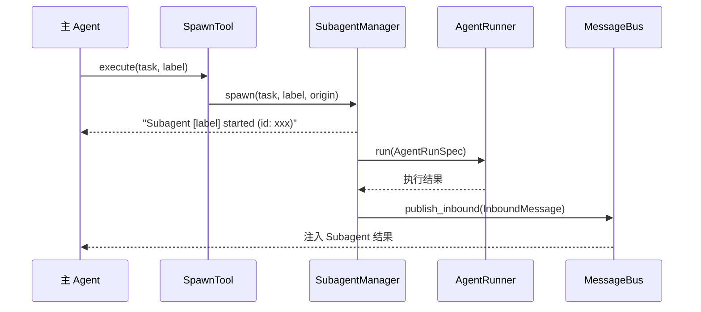
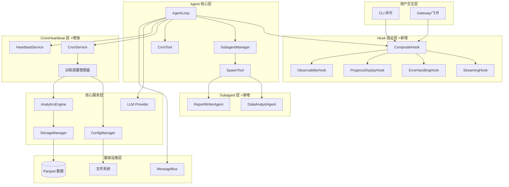
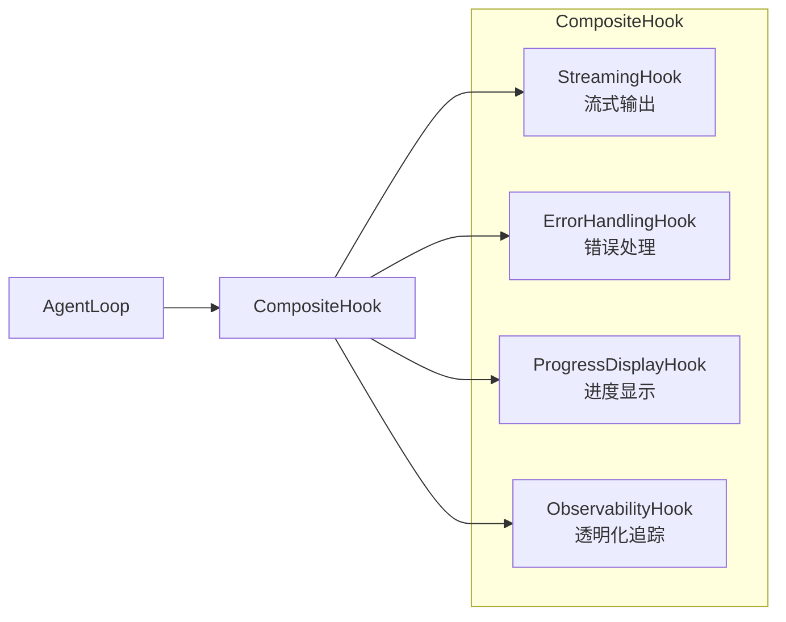
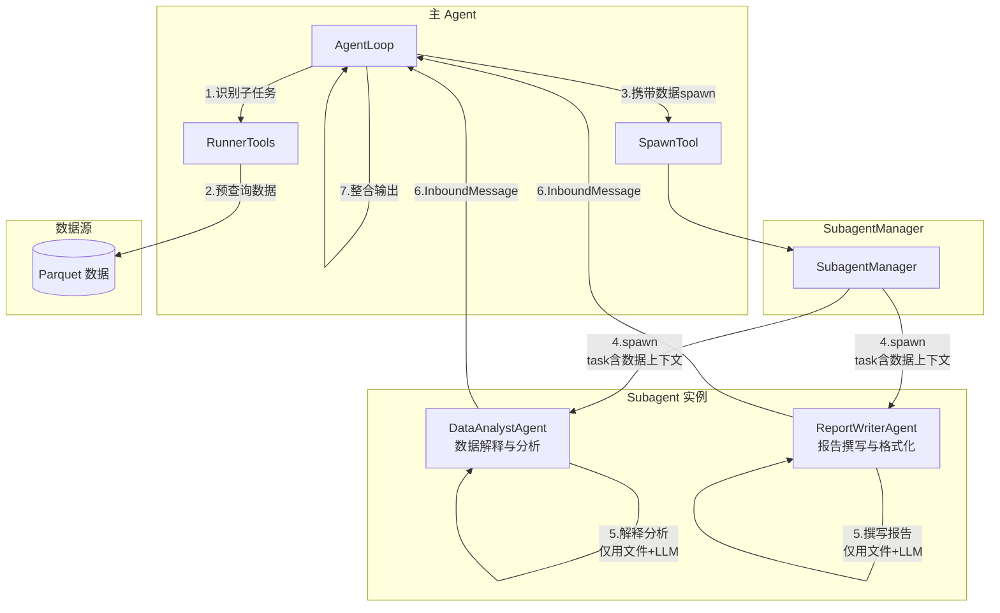
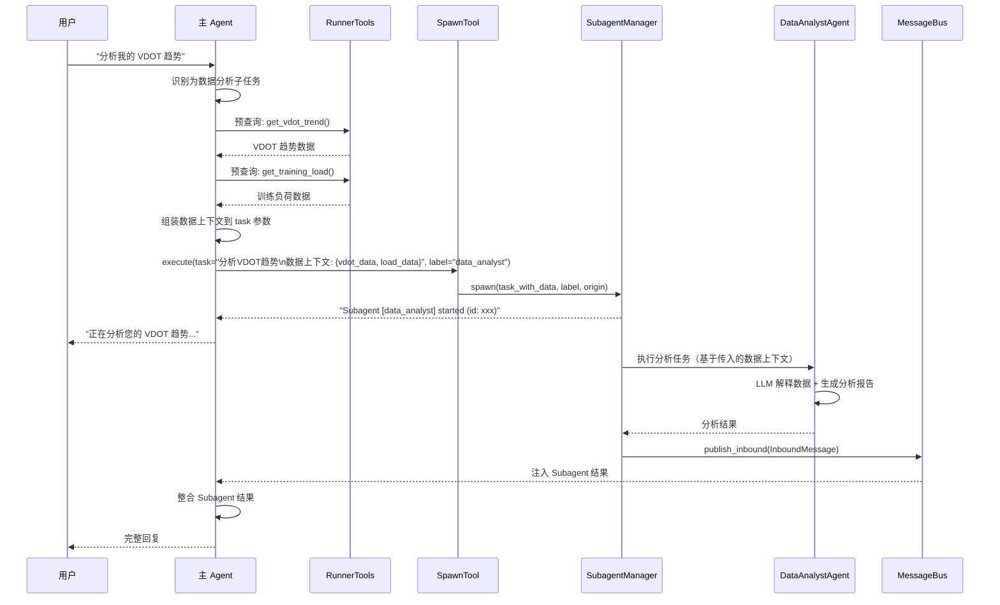
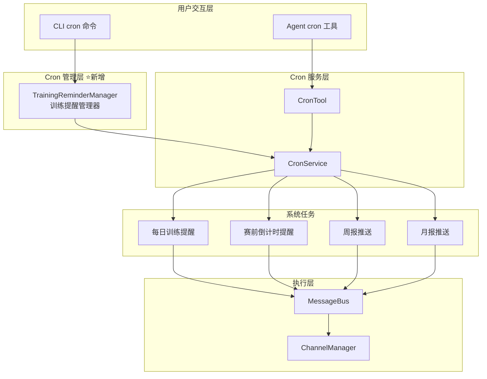
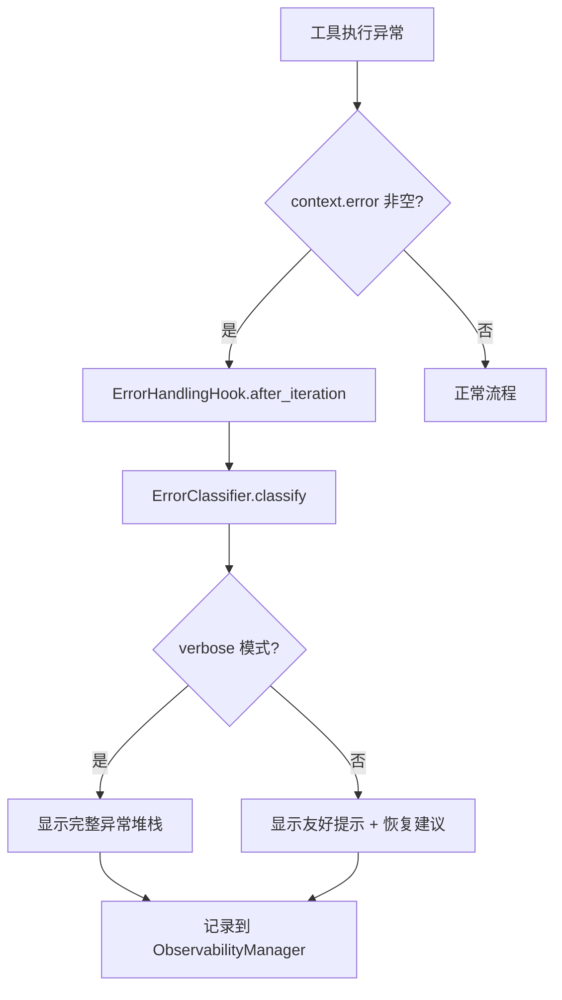
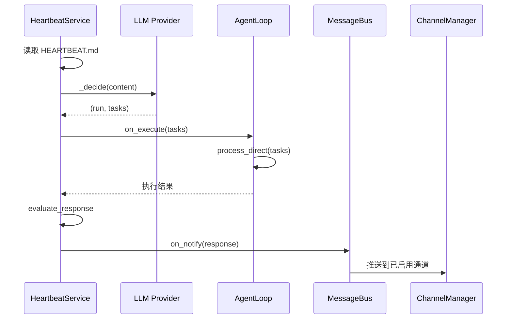
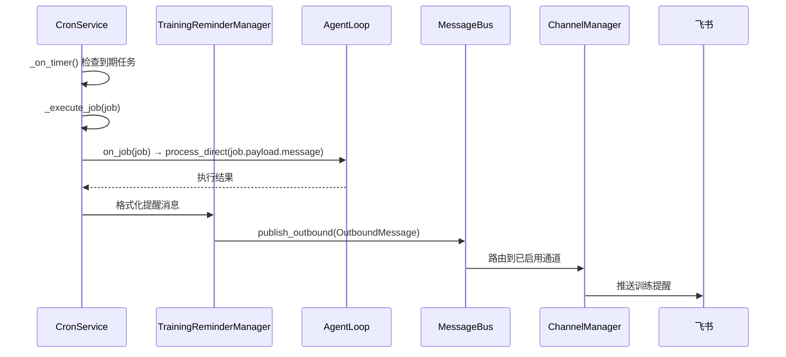
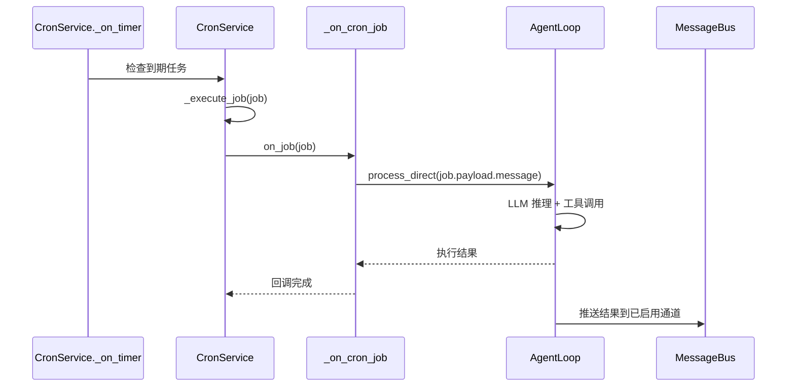

# v0.17.0 架构设计说明书 — 底座能力全面激活

> **文档版本**: v1.1（评审整改版）
> **设计日期**: 2026-05-02
> **整改日期**: 2026-05-02
> **版本目标**: v0.17.0 底座能力全面激活
> **需求来源**: [PRD_v0.17.0_底座能力全面激活](../requirements/PRD_v0.17.0_底座能力全面激活.md)
> **基线文档**: [架构设计说明书 v4.1.0](架构设计说明书.md)
> **评审报告**: [架构评审报告_v0.17.0](架构评审报告_v0.17.0.md)
> **底座版本**: nanobot-ai >=0.1.5.post3

---

## 1. 执行摘要

### 1.1 设计目标

v0.17.0 的核心主题是**底座能力全面激活**，将 nanobot-ai 底座中已注册但未实现的 Hook、未激活的 Subagent 能力、部分激活的 Cron/Heartbeat 服务全面激活，让用户感知到 AI 响应更快、交互更智能、提醒更及时。

### 1.2 设计范围

| 优先级 | 需求ID | 需求名称 | 架构影响范围 |
|--------|--------|---------|-------------|
| P0 | REQ-0.17-01 | CLI 流式输出 | Hook 系统、CLI 层、Gateway 层 |
| P0 | REQ-0.17-02 | Subagent 基础验证 | Agent 层、工具注册、配置管理 |
| P0 | REQ-0.17-03 | Cron 训练提醒 | Cron 集成、CLI 层、ReportService |
| P0 | REQ-0.17-04 | CLI 错误处理增强 | Hook 系统、异常体系 |
| P1 | REQ-0.17-05 | 工具执行进度显示 | Hook 系统、CLI 层 |
| P1 | REQ-0.17-06 | Heartbeat 任务扩展 | Heartbeat 集成、配置管理 |
| P1 | REQ-0.17-07 | ask_user 训练确认 | Agent 工具、CLI 层 |
| P1 | REQ-0.17-08 | LLM 超时控制 | 配置管理、Provider 层 |
| P1 | REQ-0.17-09 | 多通道配置优化 | 配置管理、CLI 层 |

### 1.3 关键架构决策

| 决策项 | 选择方案 | 理由 |
|--------|---------|------|
| Hook 组合模式 | `CompositeHook` 多 Hook 组合 | nanobot-ai 原生支持，错误隔离，互不干扰 |
| Subagent 调用 | 底座 `SpawnTool` + `SubagentManager` | 底座已内置完整实现，无需自建 |
| Cron 深度集成 | `CronService` + `CronTool` + 系统任务注册 | 底座 CronService 功能完备，支持持久化 |
| 错误分类体系 | 自定义 `ErrorClassifier` + 底座 Hook | 统一错误处理入口，友好提示 |
| 流式输出通道 | CLI: Rich Console / Gateway: MessageBus | 双通道适配，保持架构一致性 |

---

## 2. 技术栈选型与适配性分析

### 2.1 底座 API 能力矩阵

基于对 nanobot-ai >=0.1.5.post3 源码的深度分析，确认以下底座 API 可用性：

| 底座组件 | 模块路径 | API 状态 | v0.17.0 用途 |
|---------|---------|---------|-------------|
| `AgentHook` | `nanobot.agent.hook` | ✅ 完整可用 | 生命周期 Hook 基类 |
| `CompositeHook` | `nanobot.agent.hook` | ✅ 完整可用 | 多 Hook 组合，错误隔离 |
| `AgentHookContext` | `nanobot.agent.hook` | ✅ 完整可用 | Hook 上下文数据 |
| `AgentLoop` | `nanobot.agent.loop` | ✅ 完整可用 | Agent 核心循环 |
| `SubagentManager` | `nanobot.agent.subagent` | ✅ 完整可用 | Subagent 管理与执行 |
| `SpawnTool` | `nanobot.agent.tools.spawn` | ✅ 完整可用 | Subagent 调用工具 |
| `CronService` | `nanobot.cron.service` | ✅ 完整可用 | 定时任务管理 |
| `CronTool` | `nanobot.agent.tools.cron` | ✅ 完整可用 | Agent 内 Cron 操作工具 |
| `CronSchedule` | `nanobot.cron.types` | ✅ 完整可用 | Cron 调度配置 |
| `HeartbeatService` | `nanobot.heartbeat.service` | ✅ 完整可用 | 心跳检测服务 |
| `ChannelManager` | `nanobot.channels.manager` | ✅ 完整可用 | 多通道管理 |
| `MessageBus` | `nanobot.bus.queue` | ✅ 完整可用 | 消息总线 |
| `ToolRegistry` | `nanobot.agent.tools.registry` | ✅ 完整可用 | 工具注册表 |

### 2.2 关键底座 API 详解

#### 2.2.1 AgentHook 生命周期

```mermaid
sequenceDiagram
    participant Loop as AgentLoop
    participant Hook as AgentHook
    participant Runner as AgentRunner

    Loop->>Hook: before_iteration(context)
    Loop->>Runner: LLM 调用（流式）
    Runner-->>Hook: on_stream(context, delta) [多次]
    Hook-->>Hook: on_stream_end(context, resuming)
    Loop->>Hook: before_execute_tools(context)
    Note over Hook: context.tool_calls 可用
    Loop->>Runner: 工具执行
    Loop->>Hook: after_iteration(context)
    Note over Hook: context.tool_results 可用
    Loop->>Hook: finalize_content(context, content)
```

**关键发现**:
- `on_stream` 在 LLM 流式响应期间**多次触发**，每次传递一个 `delta` 片段
- `wants_streaming()` 返回 `True` 时，AgentLoop 才会启用流式模式
- `CompositeHook` 对每个 Hook 方法做**错误隔离**，单个 Hook 异常不影响其他 Hook
- `finalize_content` 是管道模式（无错误隔离），用于最终内容处理
- **⚠️ AgentHook 不提供 `on_tool_error` 回调方法**。工具执行错误通过 `after_iteration(context)` + `context.error` 捕获。PRD 中的 `on_tool_error` 是需求层面的术语，底座实际 API 为 `after_iteration` + `context.error`，两者功能等价

#### 2.2.2 AgentLoop.process_direct() 签名

```python
async def process_direct(
    self,
    user_input: str,
    *,
    on_progress: Callable[..., Awaitable[None]] | None = None,
    on_stream: Callable[[str], Awaitable[None]] | None = None,
    on_stream_end: Callable[..., Awaitable[None]] | None = None,
    channel: str = "cli",
    chat_id: str = "direct",
    message_id: str | None = None,
) -> str | None
```

**关键发现**:
- `process_direct` 已原生支持 `on_stream` 和 `on_stream_end` 回调
- 当前 CLI 模式调用 `process_direct(user_input)` 时**未传递** `on_stream` 回调
- 只需在调用时传入 `on_stream` 回调即可实现 CLI 流式输出

#### 2.2.3 SubagentManager 调用链



**关键发现**:
- SubagentManager 已内置在 AgentLoop 中，通过 `agent.subagents` 访问
- SpawnTool 已在 AgentLoop `_register_default_tools` 中自动注册
- Subagent 执行完成后通过 MessageBus 注入结果到主 Agent 的会话
- Subagent 使用独立的工具集（文件操作 + 可选的 Exec/Web 工具）

#### 2.2.4 CronService 核心接口

| 方法 | 说明 | v0.17.0 用途 |
|------|------|-------------|
| `add_job(name, schedule, message, ...)` | 添加定时任务 | 训练提醒、报告推送 |
| `register_system_job(job)` | 注册系统任务（幂等） | 系统级训练提醒 |
| `remove_job(job_id)` | 删除任务 | 用户管理任务 |
| `list_jobs()` | 列出任务 | CLI 查看任务 |
| `enable_job(job_id, enabled)` | 启用/禁用任务 | 任务管理 |
| `start()` / `stop()` | 启动/停止服务 | Gateway 生命周期 |

**关键发现**:
- CronService 支持三种调度模式：`at`（一次性）、`every`（间隔）、`cron`（cron 表达式）
- `register_system_job` 是幂等的，适合注册系统级训练提醒
- CronTool 已内置，Agent 可通过 `cron` 工具管理定时任务
- 任务持久化在 `workspace/cron.json`，重启后自动恢复

### 2.3 新增依赖分析

| 依赖 | 用途 | 是否需要新增 |
|------|------|-------------|
| `croniter` | Cron 表达式解析 | 已作为 nanobot-ai 依赖存在 |
| `filelock` | Cron 文件锁 | 已作为 nanobot-ai 依赖存在 |
| `zoneinfo` | 时区支持 | Python 3.9+ 标准库 |

**结论**: v0.17.0 **无需新增任何第三方依赖**，所有功能基于现有技术栈和 nanobot-ai 底座实现。

---

## 3. 系统架构设计

### 3.1 v0.17.0 整体架构图



### 3.2 架构变更对比

| 架构层 | v0.16.0 | v0.17.0 | 变更说明 |
|--------|---------|---------|---------|
| Hook 层 | 单一 ObservabilityHook | CompositeHook + 4 个专用 Hook | 从单 Hook 扩展为多 Hook 组合 |
| Agent 层 | 主 Agent 单体 | 主 Agent + 2 个 Subagent | 新增 Subagent 调用能力 |
| Cron 层 | 基础报告推送 | 训练提醒 + 系统任务 + CLI 管理 | 深度激活 CronService |
| 错误处理 | 分散在各模块 | 统一 ErrorHandlingHook | 集中式错误分类与友好提示 |
| CLI 层 | 阻塞式等待 | 流式输出 + 进度显示 | 交互体验质变 |

---

## 4. 核心模块架构

### 4.1 Hook 组合系统（REQ-0.17-01/04/05）⭐

#### 4.1.1 设计思路

nanobot-ai 的 `CompositeHook` 支持将多个 `AgentHook` 组合使用，每个 Hook 的异步方法独立执行且错误隔离。v0.17.0 将现有的单一 `ObservabilityHook` 拆分为 4 个职责清晰的 Hook，通过 `CompositeHook` 组合注册到 `AgentLoop`。

#### 4.1.2 Hook 组合架构图



#### 4.1.3 StreamingHook — 流式输出 Hook

**职责**: 实现 `on_stream` 方法，将 LLM 流式片段实时输出到用户界面

**文件位置**: `src/core/transparency/streaming_hook.py`

**核心接口**:

```python
class StreamingHook(AgentHook):
    def __init__(
        self,
        console: Console | None = None,
        bus: MessageBus | None = None,
        channel: str = "cli",
        chat_id: str = "direct",
    ) -> None: ...

    def wants_streaming(self) -> bool:
        return True

    async def on_stream(self, context: AgentHookContext, delta: str) -> None: ...
    async def on_stream_end(self, context: AgentHookContext, *, resuming: bool) -> None: ...
```

**双通道输出策略**:

| 通道 | 输出方式 | 说明 |
|------|---------|------|
| CLI | `Rich Console.print()` 逐片段输出 | 首字延迟 < 3s，流畅无闪烁 |
| Gateway | `MessageBus.publish_outbound()` | 流式片段推送到飞书等通道 |

**关键设计决策**:

| 决策 | 方案 | 理由 |
|------|------|------|
| CLI 流式渲染方式 | `Console.print()` 逐片段追加 | 简单可靠，无需 Live/Status 组件协调 |
| 流式缓冲策略 | 无缓冲，直接输出 | 最低延迟，用户即时感知 |
| think 标签过滤 | 不在 Hook 层过滤，由 `_LoopHook` 处理 | 底座 `_LoopHook.on_stream` 已实现 `strip_think` |
| 中断处理 | `KeyboardInterrupt` 时 `on_stream_end` 被调用 | 底座保证生命周期完整性 |

**数据流**:

```mermaid
sequenceDiagram
    participant LLM as LLM Provider
    participant Loop as AgentLoop
    participant LHook as _LoopHook
    participant SH as StreamingHook
    participant OH as ObservabilityHook
    participant Con as Rich Console

    LLM-->>Loop: 流式 delta
    Loop->>LHook: on_stream(context, delta)
    LHook->>LHook: strip_think + 增量计算
    LHook-->>SH: on_stream(context, incremental)
    SH->>Con: print(incremental, end="")
    Loop->>OH: on_stream(context, delta)
    Note over OH: 记录流式事件到追踪日志
```

#### 4.1.4 ErrorHandlingHook — 错误处理 Hook

**职责**: 捕获工具执行错误，分类并生成友好提示

**文件位置**: `src/core/transparency/error_handling_hook.py`

> **⚠️ 术语澄清**: PRD REQ-0.17-04 使用 `on_tool_error` 描述错误捕获需求，但底座 AgentHook **不提供**
> `on_tool_error` 回调方法。经源码验证，AgentHook 的完整方法列表为：
> `before_iteration`、`on_stream`、`on_stream_end`、`before_execute_tools`、`after_iteration`、`finalize_content`。
> 工具执行错误通过 `after_iteration(context)` + 检查 `context.error` 捕获，功能与 `on_tool_error` 等价。

**核心接口**:

```python
class ErrorHandlingHook(AgentHook):
    def __init__(
        self,
        classifier: ErrorClassifier,
        console: Console | None = None,
        verbose: bool = False,
    ) -> None: ...

    async def after_iteration(self, context: AgentHookContext) -> None: ...
```

**错误分类体系**:

```python
class ErrorCategory(Enum):
    NETWORK = "network"
    DATA = "data"
    CONFIG = "config"
    PERMISSION = "permission"
    TIMEOUT = "timeout"
    TOOL = "tool"
    UNKNOWN = "unknown"

@dataclass
class FriendlyError:
    category: ErrorCategory
    original_error: str
    friendly_message: str
    recovery_suggestion: str
    context_data: dict[str, Any]
```

**错误分类规则**:

| 错误类型 | 识别规则 | 友好提示 | 恢复建议 |
|---------|---------|---------|---------|
| 网络错误 | `ConnectionError`, `TimeoutError`, 含 "connection"/"timeout" | "网络连接异常" | "请检查网络连接后重试" |
| 数据错误 | `ValueError`, `KeyError`, 含 "no data"/"empty" | "数据查询异常" | "请确认已导入跑步数据" |
| 配置错误 | `ConfigError`, 含 "config"/"not found" | "配置异常" | "请运行 nanobotrun system init" |
| 权限错误 | `PermissionError`, 含 "permission"/"access" | "权限不足" | "请检查文件访问权限" |
| 超时错误 | 含 "timeout"/"timed out" | "AI 响应超时" | "请稍后重试或检查网络" |
| 工具错误 | `context.error` 非空 | "工具执行异常" | "请尝试重新描述您的需求" |

**数据流**:

```mermaid
sequenceDiagram
    participant Loop as AgentLoop
    participant EHH as ErrorHandlingHook
    participant EC as ErrorClassifier
    participant Con as Rich Console
    participant OM as ObservabilityManager

    Loop->>EHH: after_iteration(context)
    alt context.error 非空
        EHH->>EC: classify(context.error)
        EC-->>EHH: FriendlyError
        EHH->>Con: print(friendly_message + recovery_suggestion)
        EHH->>OM: record_event("error", error_data)
    end
```

#### 4.1.5 ProgressDisplayHook — 进度显示 Hook

**职责**: 在工具调用前后显示进度指示器和耗时统计

**文件位置**: `src/core/transparency/progress_hook.py`

**核心接口**:

```python
class ProgressDisplayHook(AgentHook):
    def __init__(
        self,
        console: Console | None = None,
    ) -> None:
        super().__init__()
        self.console = console or Console()
        self._tool_start_times: dict[str, float] = {}

    async def before_execute_tools(self, context: AgentHookContext) -> None: ...
    async def after_iteration(self, context: AgentHookContext) -> None: ...
```

**计时数据传递机制**: `ProgressDisplayHook` 通过实例变量 `_tool_start_times: dict[str, float]` 在两次回调之间传递计时数据：
- `before_execute_tools`: 遍历 `context.tool_calls`，以工具名为 key 记录 `time.monotonic()` 到 `_tool_start_times`
- `after_iteration`: 遍历 `context.tool_results`，从 `_tool_start_times` 取出开始时间，计算耗时后清除对应条目

**进度显示格式**:

```
🔧 正在调用: get_running_stats ...
✅ 查询完成，耗时 0.3s
🔧 正在调用: get_vdot_trend ...
✅ 分析完成，耗时 1.2s
```

#### 4.1.6 ObservabilityHook — 透明化追踪 Hook（增强）

**变更说明**: `on_stream` 方法增加流式事件记录，不改变现有 `before_iteration`/`after_iteration`/`finalize_content` 逻辑。

**增强点**:

| 方法 | v0.16.0 | v0.17.0 |
|------|---------|---------|
| `on_stream` | 空实现 | 记录流式事件到追踪日志 |
| 其他方法 | 不变 | 不变 |

### 4.2 Subagent 架构（REQ-0.17-02）⭐

#### 4.2.1 设计思路

nanobot-ai 的 `SubagentManager` 已内置在 `AgentLoop` 中，`SpawnTool` 已自动注册。v0.17.0 无需自建 Subagent 框架，只需：
1. 在 workspace 中创建 Subagent 配置文件
2. 确保 Agent 能通过 `spawn` 工具调用 Subagent
3. 验证调用链完整性

#### 4.2.2 Subagent 架构图

> **⚠️ 架构约束**: SubagentManager 不支持自定义工具注入。`_run_subagent` 内部自建 `ToolRegistry`，
> 工具集固定为文件操作（Read/Write/Edit/List/Glob/Grep）+ 可选的 Exec/Web 工具。
> 因此 Subagent **无法直接调用 RunnerTools**，需采用"主 Agent 预查询 + 数据上下文传入"模式。



**数据上下文传递模式**: 主 Agent 在 spawn Subagent 前，先通过 RunnerTools 查询所需数据，
将序列化结果作为 task 参数的一部分传入 Subagent。Subagent 仅做 LLM 层面的数据解释与分析。

#### 4.2.3 Subagent 配置设计

**配置文件位置**: `workspace/agents/`

**DataAnalystAgent 配置** (`workspace/agents/data_analyst.md`):

```markdown
# DataAnalystAgent

你是一个专业的跑步数据分析专家。你的职责是：
- 基于传入的数据上下文，解释 VDOT 趋势和跑力值变化
- 基于传入的训练负荷数据，分析 ATL/CTL/TSB 变化趋势
- 基于传入的心率数据，检测心率漂移并评估训练效果
- 给出专业的训练建议

⚠️ 注意：你无法直接查询数据库，所有数据由主 Agent 预查询后传入。
请基于传入的数据进行分析，如数据不足请在回复中说明。

输出要求：
- 数据准确，引用具体数值
- 趋势分析有据可依
- 使用中文输出
```

**ReportWriterAgent 配置** (`workspace/agents/report_writer.md`):

```markdown
# ReportWriterAgent

你是一个专业的跑步报告撰写专家。你的职责是：
- 基于传入的训练数据，生成周报/月报
- 基于传入的分析结果，撰写训练总结
- 格式化数据展示，使报告结构清晰
- 基于数据提供训练建议

⚠️ 注意：你无法直接查询数据库，所有数据由主 Agent 预查询后传入。
请基于传入的数据撰写报告，如数据不足请在回复中说明。

输出要求：
- 结构清晰，层次分明
- 数据可视化描述
- 使用中文输出
```

#### 4.2.4 Subagent 调用流程

> **核心变更**: Subagent 无法直接调用 RunnerTools，采用"主 Agent 预查询 + 数据上下文传入"模式。
> 主 Agent 在识别子任务后，先通过自身 RunnerTools 查询所需数据，再将序列化数据作为 task 的一部分传入 Subagent。



#### 4.2.5 数据上下文传递规范

主 Agent 在 spawn Subagent 时，需将预查询的数据序列化后嵌入 task 参数。数据上下文格式如下：

```python
task_template = """{user_request}

---数据上下文---
{serialized_data}
---数据上下文结束---

请基于以上数据进行分析。"""
```

**数据上下文大小控制**:

| 策略 | 说明 |
|------|------|
| 字段裁剪 | 仅保留分析所需字段，去除冗余元数据 |
| 行数限制 | 时间序列数据最多保留最近 90 天 |
| 序列化格式 | JSON，确保 LLM 可读 |
| 总大小上限 | task 参数总长度建议 ≤ 8000 字符（超出时截断旧数据并标注） |

**Subagent 可用工具**:

| 工具 | 用途 | Subagent 可用 |
|------|------|-------------|
| ReadFileTool | 读取文件 | ✅ |
| WriteFileTool | 写入文件 | ✅ |
| EditFileTool | 编辑文件 | ✅ |
| ListDirTool | 列出目录 | ✅ |
| GlobTool | 文件搜索 | ✅ |
| GrepTool | 内容搜索 | ✅ |
| ExecTool | 执行命令 | ✅（需启用） |
| WebSearchTool | 网络搜索 | ✅（需启用） |
| WebFetchTool | 网页获取 | ✅（需启用） |
| RunnerTools | 跑步数据查询 | ❌ 不可用 |

#### 4.2.6 降级策略

| 场景 | 降级方案 |
|------|---------|
| Subagent 调用超时 | 主 Agent 直接使用自身工具完成 |
| Subagent 执行失败 | 主 Agent 捕获错误，提示用户并尝试自身完成 |
| Subagent 结果不满足 | 主 Agent 补充分析后整合输出 |

### 4.3 Cron 训练提醒深度集成（REQ-0.17-03）⭐

#### 4.3.1 设计思路

v0.16.0 中 CronService 仅用于基础报告推送。v0.17.0 将深度激活 CronService，实现训练提醒、赛前倒计时、周期性报告、用户自定义任务管理。

#### 4.3.2 Cron 系统架构图



#### 4.3.3 TrainingReminderManager — 训练提醒管理器

**职责**: 管理训练相关的 Cron 任务，提供高层 API

**文件位置**: `src/core/cron/training_reminder.py`

**核心接口**:

```python
class TrainingReminderManager:
    def __init__(
        self,
        cron_service: CronService,
        config: ConfigManager,
    ) -> None: ...

    def register_daily_reminder(
        self,
        time_str: str,
        timezone: str = "Asia/Shanghai",
    ) -> CronJob: ...

    def register_race_countdown(
        self,
        race_date: str,
        race_name: str,
        timezone: str = "Asia/Shanghai",
    ) -> list[CronJob]: ...

    def register_weekly_report(
        self,
        day_of_week: str = "monday",
        time_str: str = "08:00",
        timezone: str = "Asia/Shanghai",
    ) -> CronJob: ...

    def register_monthly_report(
        self,
        day_of_month: int = 1,
        time_str: str = "08:00",
        timezone: str = "Asia/Shanghai",
    ) -> CronJob: ...

    def list_reminders(self) -> list[CronJob]: ...

    def remove_reminder(self, job_id: str) -> str: ...
```

#### 4.3.4 Cron 任务类型设计

| 任务类型 | 调度模式 | Cron 表达式示例 | 消息模板 |
|---------|---------|----------------|---------|
| 每日训练提醒 | `cron` | `0 7 * * *` (每天7点) | "🏃 训练提醒：今天是训练日，计划跑 {distance}km" |
| 赛前7天提醒 | `at` | 一次性 | "🏁 赛前7天提醒：{race_name} 将在7天后开赛" |
| 赛前3天提醒 | `at` | 一次性 | "🏁 赛前3天提醒：{race_name} 将在3天后开赛，注意减量" |
| 赛前1天提醒 | `at` | 一次性 | "🏁 明天就是 {race_name}！注意休息和饮食" |
| 周报推送 | `cron` | `0 8 * * 1` (每周一8点) | "📊 本周训练总结：..." |
| 月报推送 | `cron` | `0 8 1 * *` (每月1号8点) | "📊 本月训练总结：..." |

#### 4.3.5 CLI cron 命令设计

**文件位置**: `src/cli/commands/cron.py`

| 命令 | 功能 | 参数 |
|------|------|------|
| `nanobotrun cron list` | 查看所有定时任务 | `--all`（含禁用） |
| `nanobotrun cron add` | 添加定时任务 | `--name`, `--message`, `--every`, `--cron`, `--at` |
| `nanobotrun cron remove <job_id>` | 删除定时任务 | `job_id` |
| `nanobotrun cron enable <job_id>` | 启用任务 | `job_id` |
| `nanobotrun cron disable <job_id>` | 禁用任务 | `job_id` |
| `nanobotrun cron reminder add` | 添加训练提醒 | `--time`, `--timezone` |
| `nanobotrun cron reminder race` | 添加赛前倒计时 | `--date`, `--name` |

#### 4.3.6 Cron 与 AgentLoop 集成

**关键变更**: 在 `gateway.py` 中将 `CronService` 实例传入 `AgentLoop`，使 `CronTool` 自动注册。

```python
agent = AgentLoop(
    bus=bus,
    provider=provider,
    workspace=workspace,
    cron_service=cron,  # ⭐ 传入 CronService，自动注册 CronTool
    ...
)
```

**当前状态**: `gateway.py` 中已创建 `CronService` 但**未传入** `AgentLoop`，导致 `CronTool` 未注册。

### 4.4 错误处理增强（REQ-0.17-04）⭐

#### 4.4.1 ErrorClassifier — 错误分类器

**职责**: 将原始异常分类为标准错误类型，生成友好提示

**文件位置**: `src/core/transparency/error_classifier.py`

**核心接口**:

```python
class ErrorClassifier:
    ERROR_PATTERNS: ClassVar[dict[ErrorCategory, list[str]]] = {
        ErrorCategory.NETWORK: ["connection", "timeout", "refused", "unreachable"],
        ErrorCategory.DATA: ["no data", "empty", "not found", "no records"],
        ErrorCategory.CONFIG: ["config", "not configured", "missing key"],
        ErrorCategory.PERMISSION: ["permission", "access denied", "forbidden"],
        ErrorCategory.TIMEOUT: ["timed out", "deadline", "timeout"],
        ErrorCategory.TOOL: ["tool error", "execution failed"],
    }

    FRIENDLY_MESSAGES: ClassVar[dict[ErrorCategory, str]] = { ... }
    RECOVERY_SUGGESTIONS: ClassVar[dict[ErrorCategory, str]] = { ... }

    def classify(self, error: str | Exception) -> FriendlyError: ...
```

#### 4.4.2 错误处理流程



### 4.5 Heartbeat 任务扩展（REQ-0.17-06）

#### 4.5.1 设计思路

HeartbeatService 已在 `gateway.py` 中使用，但 `on_execute` 回调未与 AgentLoop 联动。v0.17.0 将 Heartbeat 的 `on_execute` 回调连接到 AgentLoop，使心跳检测能触发 Agent 执行任务。

#### 4.5.2 Heartbeat 集成架构



#### 4.5.3 HEARTBEAT.md 任务模板

**文件位置**: `workspace/HEARTBEAT.md`

```markdown
# Heartbeat Tasks

## 每日检查
- [ ] 检查今日是否有训练计划
- [ ] 检查是否有即将到来的比赛
- [ ] 检查训练数据是否有异常

## 周期检查
- [ ] 每周一：生成本周训练计划概览
- [ ] 每月1日：生成上月训练总结
```

### 4.6 ask_user 训练确认（REQ-0.17-07）

#### 4.6.1 设计思路

nanobot-ai 的 `MessageTool` 已注册在 AgentLoop 中，Agent 可通过 `send_message` 向用户发送消息。但 `ask_user` 需要等待用户回复，当前底座不直接支持同步等待用户输入。

v0.17.0 的策略是：在 CLI 模式下，利用现有的 `Prompt.ask` 交互循环实现确认；在 Gateway 模式下，利用飞书交互卡片实现。

> **⚠️ 架构约束**: 当前底座 AgentLoop 不支持"暂停-等待-恢复"的同步交互模式。
> Agent 调用 `ask_user` 工具时，无法真正暂停 Agent 执行等待用户输入。
> 因此 v0.17.0 的 ask_user 实现为**实验性功能**，采用"Agent 输出建议 + 用户下一轮对话确认"的异步模式。

#### 4.6.2 ask_user 实现方案

**方案选择**: 异步确认模式（非同步阻塞）

| 模式 | 实现方式 | 可行性 |
|------|---------|--------|
| ❌ 同步阻塞 | Agent 暂停执行，等待用户输入后恢复 | 底座不支持 |
| ✅ 异步确认 | Agent 输出建议 + 明确确认提示，用户在下一轮对话中确认 | 可行，体验略差 |
| 🔮 未来增强 | 底座支持 `ask_user` 原生工具后升级 | 依赖底座更新 |

**异步确认模式流程**:

1. Agent 识别需要用户确认的场景（训练计划确认、RPE 反馈等）
2. Agent 通过 `send_message` 工具输出确认提示，格式化为结构化选项
3. Agent 在消息中明确说明"请回复确认/修改"
4. 用户在下一轮对话中输入确认或修改意见
5. Agent 根据用户回复继续执行

#### 4.6.3 ask_user CLI 交互时序图

```mermaid
sequenceDiagram
    participant User as 用户
    participant CLI as CLI 交互循环
    participant Loop as AgentLoop
    participant Agent as Agent(LLM)
    participant Msg as MessageTool

    User->>CLI: "帮我制定训练计划"
    CLI->>Loop: process_direct("帮我制定训练计划")
    Loop->>Agent: LLM 推理
    Agent->>Agent: 识别需要用户确认
    Agent->>Msg: send_message("建议训练计划：...\\n请确认是否接受此计划？")
    Msg-->>Loop: 消息输出
    Loop-->>CLI: 流式输出建议计划
    CLI->>User: 显示建议计划 + 确认提示

    Note over User,CLI: 用户在下一轮对话中确认

    User->>CLI: "确认" / "第3天太累了，调整一下"
    CLI->>Loop: process_direct("确认")
    Loop->>Agent: LLM 推理（含上下文）
    Agent->>Agent: 根据确认继续执行
    Agent-->>Loop: 最终结果
    Loop-->>CLI: 输出结果
```

#### 4.6.4 ask_user 场景设计

| 场景 | Agent 输出格式 | 用户确认方式 |
|------|--------------|-------------|
| 训练计划确认 | 结构化计划 + "请确认是否接受此计划（回复'确认'或提出修改意见）" | 下一轮对话回复 |
| RPE 反馈选择 | "请回复 1-10 评分" | 下一轮对话回复数字 |
| 伤病风险调整 | "检测到训练负荷偏高，建议减量。是否调整？（回复'调整'或'继续'）" | 下一轮对话回复 |

#### 4.6.5 未来增强路径

当 nanobot-ai 底座支持原生 `ask_user` 工具时，可升级为同步阻塞模式：
- 底座提供 `ask_user` 工具 → Agent 调用时自动暂停 → CLI 用 `Prompt.ask` 获取输入 → 输入传回 Agent → Agent 恢复执行
- 当前架构已预留升级空间，仅需替换 `send_message` 为 `ask_user` 工具调用

### 4.7 LLM 超时控制（REQ-0.17-08）

#### 4.7.1 设计思路

nanobot-ai 的 Provider 层支持 `NANOBOT_LLM_TIMEOUT_S` 环境变量。v0.17.0 需要在项目配置中暴露此配置，并在 `RunnerProviderAdapter` 中设置默认值。

#### 4.7.2 配置设计

| 配置项 | 环境变量 | 默认值 | 说明 |
|--------|---------|--------|------|
| LLM 超时 | `NANOBOT_LLM_TIMEOUT_S` | 60 | 单次 LLM 请求超时（秒） |
| 超时重试 | `NANOBOT_LLM_RETRY_COUNT` | 2 | 超时后重试次数 |

---

## 5. 数据流设计

### 5.1 CLI 流式输出完整数据流

```mermaid
sequenceDiagram
    participant User as 用户
    participant CLI as CLI agent chat
    participant Loop as AgentLoop
    participant Comp as CompositeHook
    participant Stream as StreamingHook
    participant Obs as ObservabilityHook
    participant Err as ErrorHandlingHook
    participant Prog as ProgressDisplayHook
    participant Con as Rich Console

    User->>CLI: 输入消息
    CLI->>Loop: process_direct(input, on_stream=callback)
    Loop->>Comp: before_iteration(context)
    Comp->>Obs: before_iteration(context)

    Loop->>Comp: on_stream(context, delta) [多次]
    Comp->>Stream: on_stream(context, delta)
    Stream->>Con: print(delta, end="")
    Comp->>Obs: on_stream(context, delta)
    Note over Obs: 记录流式事件

    Loop->>Comp: on_stream_end(context, resuming=False)
    Comp->>Stream: on_stream_end(context, resuming=False)

    Loop->>Comp: before_execute_tools(context)
    Comp->>Prog: before_execute_tools(context)
    Prog->>Con: print("🔧 正在调用: tool_name ...")
    Comp->>Obs: before_execute_tools(context)

    Loop->>Comp: after_iteration(context)
    Comp->>Err: after_iteration(context)
    Note over Err: 检查 context.error
    Comp->>Prog: after_iteration(context)
    Prog->>Con: print("✅ 完成，耗时 Xs")
    Comp->>Obs: after_iteration(context)

    Loop->>Comp: finalize_content(context, content)
    Comp->>Obs: finalize_content(context, content)
    Loop-->>CLI: 最终响应
    CLI->>Con: print(格式化响应)
```

### 5.2 Gateway 流式输出数据流

```mermaid
sequenceDiagram
    participant Feishu as 飞书
    participant GW as Gateway
    participant Loop as AgentLoop
    participant Comp as CompositeHook
    participant Stream as StreamingHook
    participant Bus as MessageBus
    participant Channel as ChannelManager

    Feishu->>GW: Webhook 消息
    GW->>Loop: process_direct(input, on_stream=callback)
    Loop->>Comp: on_stream(context, delta)
    Comp->>Stream: on_stream(context, delta)
    Stream->>Bus: publish_outbound(OutboundMessage)
    Bus->>Channel: 路由到飞书通道
    Channel->>Feishu: 推送流式片段
```

### 5.3 Cron 训练提醒数据流



---

## 6. 模块变更清单

### 6.1 新增文件

| 文件路径 | 职责 | 优先级 |
|---------|------|--------|
| `src/core/transparency/streaming_hook.py` | StreamingHook 流式输出 | P0 |
| `src/core/transparency/error_handling_hook.py` | ErrorHandlingHook 错误处理 | P0 |
| `src/core/transparency/error_classifier.py` | ErrorClassifier 错误分类 | P0 |
| `src/core/transparency/progress_hook.py` | ProgressDisplayHook 进度显示 | P1 |
| `src/core/cron/training_reminder.py` | TrainingReminderManager 训练提醒 | P0 |
| `src/cli/commands/cron.py` | CLI cron 命令 | P0 |
| `workspace/agents/data_analyst.md` | DataAnalystAgent 配置 | P0 |
| `workspace/agents/report_writer.md` | ReportWriterAgent 配置 | P0 |

### 6.2 修改文件

| 文件路径 | 变更内容 | 优先级 |
|---------|---------|--------|
| `src/core/transparency/hook_integration.py` | ObservabilityHook.on_stream 增加流式事件记录 | P0 |
| `src/core/transparency/__init__.py` | 导出新 Hook 类 | P0 |
| `src/cli/commands/agent.py` | 传入 on_stream 回调，替换 console.status | P0 |
| `src/cli/commands/gateway.py` | 传入 CronService 到 AgentLoop，集成 Hook 组合 | P0 |
| `src/core/report/service.py` | 集成 TrainingReminderManager | P0 |
| `src/cli/app.py` | 注册 cron 命令组 | P0 |
| `src/core/base/context.py` | AppContext 增加 TrainingReminderManager | P0 |

### 6.3 不变文件

| 文件路径 | 说明 |
|---------|------|
| `src/agents/tools.py` | 工具集不变，Subagent 使用底座 SpawnTool |
| `src/core/storage/` | 存储层不变 |
| `src/core/calculators/` | 计算器层不变 |
| `src/core/models/` | 数据模型不变 |

---

## 7. 接口规范

### 7.1 Hook 注册接口

**注册位置**: `src/cli/commands/agent.py` 和 `src/cli/commands/gateway.py`

```python
from nanobot.agent.hook import CompositeHook
from src.core.transparency.streaming_hook import StreamingHook
from src.core.transparency.error_handling_hook import ErrorHandlingHook
from src.core.transparency.progress_hook import ProgressDisplayHook
from src.core.transparency.hook_integration import ObservabilityHook

composite = CompositeHook([
    StreamingHook(console=console, bus=bus),
    ErrorHandlingHook(classifier=ErrorClassifier(), console=console),
    ProgressDisplayHook(console=console),
    ObservabilityHook(manager=observability_manager, engine=transparency_engine),
])

agent = AgentLoop(
    bus=bus,
    provider=provider,
    workspace=workspace,
    hooks=[composite],
    ...
)
```

### 7.2 CLI 流式输出接口

**调用方式变更**:

```python
# v0.16.0: 阻塞式等待
with console.status("[bold green]思考中...", spinner="dots"):
    response = await agent.process_direct(user_input)

# v0.17.0: 流式输出
async def on_stream_callback(delta: str) -> None:
    console.print(delta, end="")

response = await agent.process_direct(
    user_input,
    on_stream=on_stream_callback,
)
```

### 7.3 Cron 任务注册接口

```python
from src.core.cron.training_reminder import TrainingReminderManager

trm = TrainingReminderManager(cron_service=cron, config=config)

trm.register_daily_reminder(time_str="07:00", timezone="Asia/Shanghai")
trm.register_race_countdown(race_date="2026-06-15", race_name="城市马拉松")
trm.register_weekly_report(day_of_week="monday", time_str="08:00")
```

### 7.4 CronService.on_job 回调注册接口

> **关键集成点**: CronService 触发任务后需通过 `on_job` 回调连接到 AgentLoop，使 Cron 消息能被 Agent 处理。
> 此回调必须在 Gateway 启动时设置，否则 Cron 任务触发后无响应。

**注册位置**: `src/cli/commands/gateway.py`

```python
async def _on_cron_job(job) -> None:
    """CronService 任务触发回调

    当 CronService 检测到到期任务时，调用此回调将消息转发给 AgentLoop 处理。
    Agent 通过 process_direct 执行任务，可利用全部能力（工具、记忆、LLM）。

    Args:
        job: CronJob 实例，包含 payload.message 等属性
    """
    message = job.payload.message
    await agent.process_direct(message)

# Gateway 启动时注册回调
cron.on_job = _on_cron_job
```

**回调时序**:



**注意事项**:
- `on_job` 回调为异步方法，CronService 会 await 等待完成
- 并发 Cron 任务可能争抢 LLM 资源，建议限制并发任务数 ≤ 5
- 回调中异常由 CronService 内部捕获并记录日志，不会中断其他任务

---

## 8. 风险与缓解措施

| 风险 | 等级 | 影响 | 缓解措施 |
|------|------|------|----------|
| CompositeHook 多 Hook 执行顺序不确定 | 低 | Hook 间依赖导致异常 | CompositeHook 按注册顺序执行，确保 StreamingHook 在 ObservabilityHook 之前 |
| 流式输出与 Rich Console Status 冲突 | 中 | CLI 显示异常 | 移除 `console.status`，改用纯 `console.print` 流式输出 |
| Subagent 调用超时 | 中 | 用户等待过长 | SubagentManager 内置 15 次迭代限制，主 Agent 有降级方案 |
| CronService on_job 回调未设置 | 中 | Cron 任务触发但无执行 | Gateway 启动时设置 `cron.on_job` 回调连接到 AgentLoop |
| HEARTBEAT.md 不存在导致心跳跳过 | 低 | 心跳功能无效 | 首次启动时自动创建默认 HEARTBEAT.md |
| 流式输出中 think 标签泄露 | 低 | 用户看到 AI 内部思考 | 底座 `_LoopHook` 已实现 `strip_think`，StreamingHook 接收的是过滤后内容 |

---

## 9. 架构决策记录（ADR）

### ADR-001: 使用 CompositeHook 组合模式替代单一 Hook 继承

**背景**: v0.16.0 使用单一 ObservabilityHook 继承 AgentHook，所有功能耦合在一个类中。

**决定**: 使用 CompositeHook 组合 4 个专用 Hook。

**影响**:
- ✅ 职责分离，每个 Hook 独立测试
- ✅ 错误隔离，单个 Hook 异常不影响其他 Hook
- ✅ 可独立启用/禁用 Hook
- ❌ 需要管理 Hook 注册顺序
- ❌ finalize_content 管道模式无错误隔离

**替代方案**:
- 继续使用单一 Hook 类：耦合度高，难以独立测试
- 使用 Mixin 模式：Python 多继承复杂，不如组合清晰

### ADR-002: 使用底座 SpawnTool 而非自建 Subagent 框架

**背景**: 需要实现主 Agent 调用 Subagent 的能力。

**决定**: 使用 nanobot-ai 内置的 SubagentManager + SpawnTool，采用"主 Agent 预查询 + 数据上下文传入"模式解决 RunnerTools 访问限制。

**影响**:
- ✅ 零开发成本，底座已完整实现
- ✅ 自动处理结果注入、错误处理、状态管理
- ✅ 与 MessageBus 无缝集成
- ❌ Subagent 工具集固定（文件操作 + Exec + Web），无法直接使用 RunnerTools
- ❌ Subagent 配置灵活性有限
- ❌ 数据需经主 Agent 预查询后序列化传入，增加 task 参数大小

**Subagent 无法访问 RunnerTools 的解决方案**:

经源码验证，`SubagentManager._run_subagent` 内部自建 `ToolRegistry`，不支持自定义工具注入。
因此采用**数据上下文传递模式**：主 Agent 在 spawn 前通过自身 RunnerTools 预查询数据，
将序列化结果嵌入 task 参数传入 Subagent，Subagent 仅做 LLM 层面的数据解释与分析。

此方案的优势：
- 无需修改底座源码，完全兼容 nanobot-ai
- Subagent 职责更清晰：专注数据解释而非数据查询
- 数据上下文可审计：task 参数中明确记录了传入的数据

此方案的劣势：
- task 参数大小受限（建议 ≤ 8000 字符），大数据集需裁剪
- 主 Agent 需预判 Subagent 所需数据，增加编排复杂度
- 数据非实时：Subagent 分析的是 spawn 时刻的快照

**替代方案**:
- 自建 Subagent 框架：开发成本高，与底座重复
- 使用 AgentLoop 嵌套：复杂度高，资源消耗大
- Fork 底座修改 SubagentManager：维护成本高，升级困难

### ADR-003: CronService.on_job 回调连接 AgentLoop

**背景**: CronService 触发任务后需要 Agent 执行并返回结果。

**决定**: 将 `on_job` 回调设置为 `AgentLoop.process_direct` 的封装。

**影响**:
- ✅ Cron 任务可利用 Agent 的全部能力（工具、记忆、LLM）
- ✅ 结果自动通过 MessageBus 推送到已启用通道
- ❌ Cron 任务执行时间不可控（依赖 LLM 响应速度）
- ❌ 并发 Cron 任务可能争抢 LLM 资源

**替代方案**:
- 直接调用工具函数：无法处理自然语言消息
- 使用独立 AgentLoop 实例：资源消耗大

---

## 10. 版本演进与兼容性

### 10.1 向后兼容性

| 维度 | 兼容性 | 说明 |
|------|--------|------|
| CLI 命令 | ✅ 完全兼容 | 现有命令不变，新增 cron 命令组 |
| Agent 工具 | ✅ 完全兼容 | RunnerTools 不变，新增 SpawnTool/CronTool |
| 配置文件 | ✅ 完全兼容 | config.json 无需修改 |
| 数据存储 | ✅ 完全兼容 | Parquet 数据格式不变 |
| Hook 系统 | ⚠️ 行为变更 | CLI 从阻塞等待变为流式输出，用户体验变化 |

### 10.2 升级路径

1. 安装 v0.17.0 版本
2. 运行 `nanobotrun system init` 更新配置（可选，新增 cron 配置项）
3. 运行 `nanobotrun agent chat` 体验流式输出
4. 运行 `nanobotrun gateway start` 体验完整底座能力

---

## 11. 测试策略

### 11.1 测试覆盖目标

| 模块 | 覆盖率目标 | 说明 |
|------|-----------|------|
| Hook 系统（4 个 Hook + ErrorClassifier） | ≥ 80% | P0 核心模块 |
| Cron 集成（TrainingReminderManager） | ≥ 80% | P0 核心模块 |
| Subagent 配置与调用 | ≥ 70% | P0 核心模块，集成测试为主 |
| CLI 层变更 | ≥ 60% | P0 功能验证 |

### 11.2 Hook 单元测试策略

**Mock 策略**: 使用 `unittest.mock.AsyncMock` 模拟 `AgentHookContext`

```python
from unittest.mock import AsyncMock, MagicMock

def make_mock_context(
    error: str | None = None,
    tool_calls: list | None = None,
    tool_results: list | None = None,
) -> MagicMock:
    context = MagicMock(spec=AgentHookContext)
    context.error = error
    context.tool_calls = tool_calls or []
    context.tool_results = tool_results or []
    return context
```

**各 Hook 测试要点**:

| Hook | 测试场景 | Mock 对象 |
|------|---------|----------|
| StreamingHook | CLI 通道流式输出、Gateway 通道消息推送、空 delta 过滤 | `Console`、`MessageBus` |
| ErrorHandlingHook | 各类错误分类、verbose 模式堆栈输出、友好提示生成 | `AgentHookContext.error`、`Console` |
| ProgressDisplayHook | 计时准确性、多工具调用进度显示 | `AgentHookContext.tool_calls`、`time.monotonic` |
| ObservabilityHook | 流式事件记录、迭代追踪完整性 | `ObservabilityManager` |

### 11.3 Subagent 集成测试方案

**测试策略**: 不 Mock SubagentManager，使用真实底座组件验证调用链

| 测试场景 | 验证点 | 方法 |
|---------|--------|------|
| 基础调用链 | 主 Agent → SpawnTool → SubagentManager → 结果注入 | 使用 `AgentLoop` 真实实例，Mock LLM Provider |
| 数据上下文传递 | task 参数中包含预查询数据 | 检查 SpawnTool.execute 的 task 参数内容 |
| 降级策略 | Subagent 超时后主 Agent 降级 | Mock SubagentManager.spawn 抛出超时异常 |
| 配置文件加载 | workspace/agents/*.md 正确加载 | 验证 SubagentManager 读取配置 |

### 11.4 Cron 任务测试方法

**测试策略**: 使用 `croniter` 模拟定时触发，不依赖真实时间等待

| 测试场景 | 验证点 | 方法 |
|---------|--------|------|
| 任务注册 | `register_system_job` 幂等性 | 重复注册同一任务，验证不重复 |
| 回调触发 | `on_job` 回调正确连接 AgentLoop | Mock `AgentLoop.process_direct`，验证调用参数 |
| 任务持久化 | 重启后任务恢复 | 写入 `cron.json` 后重新加载验证 |
| CLI 命令 | add/remove/list/enable/disable | 使用 `typer.testing.CliRunner` |

### 11.5 端到端测试场景

| 场景 | 输入 | 期望输出 |
|------|------|---------|
| CLI 流式输出 | `nanobotrun agent chat` + 用户消息 | 实时流式显示 AI 响应 |
| 错误友好提示 | 触发网络错误 | 显示"网络连接异常"而非堆栈 |
| Cron 训练提醒 | 定时任务到期 | Agent 处理提醒消息并推送 |
| Subagent 数据分析 | "分析我的 VDOT 趋势" | 主 Agent 预查询 → Subagent 分析 → 整合输出 |

---

## 12. 术语对照

### 12.1 PRD 术语与底座 API 映射

| PRD 术语 | 底座实际 API | 说明 |
|---------|-------------|------|
| `on_tool_error` Hook | `after_iteration(context)` + `context.error` | 底座 AgentHook 不提供 `on_tool_error` 方法，通过 `after_iteration` 检查 `context.error` 实现等价功能 |
| `call_subagent` | `SpawnTool.execute(task, label)` | 底座通过 SpawnTool 调用 Subagent，非直接方法调用 |
| `ask_user` 工具 | `MessageTool.send_message` + 异步确认 | 底座不提供同步 `ask_user`，v0.17.0 采用异步确认模式 |
| 错误分类 Hook | `ErrorHandlingHook.after_iteration` | 自定义 Hook，非底座内置 |
| 流式输出 Hook | `StreamingHook.on_stream` | 自定义 Hook，实现底座 `AgentHook.on_stream` 接口 |

### 12.2 底座 AgentHook 完整方法列表

| 方法 | 签名 | 触发时机 | v0.17.0 使用方 |
|------|------|---------|---------------|
| `wants_streaming()` | `def wants_streaming() -> bool` | AgentLoop 初始化时 | StreamingHook 返回 `True` |
| `before_iteration` | `async def before_iteration(context)` | 每次 LLM 调用前 | ObservabilityHook |
| `on_stream` | `async def on_stream(context, delta)` | LLM 流式响应期间（多次） | StreamingHook、ObservabilityHook |
| `on_stream_end` | `async def on_stream_end(context, *, resuming)` | 流式响应结束 | StreamingHook |
| `before_execute_tools` | `async def before_execute_tools(context)` | 工具执行前 | ProgressDisplayHook、ObservabilityHook |
| `after_iteration` | `async def after_iteration(context)` | 迭代结束后 | ErrorHandlingHook、ProgressDisplayHook、ObservabilityHook |
| `finalize_content` | `def finalize_content(context, content) -> str \| None` | 最终内容处理 | ObservabilityHook |

> **注意**: `on_tool_error` **不在** AgentHook 方法列表中。PRD 中的 `on_tool_error` 是需求描述术语，
> 对应底座实现为 `after_iteration` + `context.error` 检查。

---

*本文档遵循架构设计规范，确保架构设计与 PRD_v0.17.0 需求完全一致*
