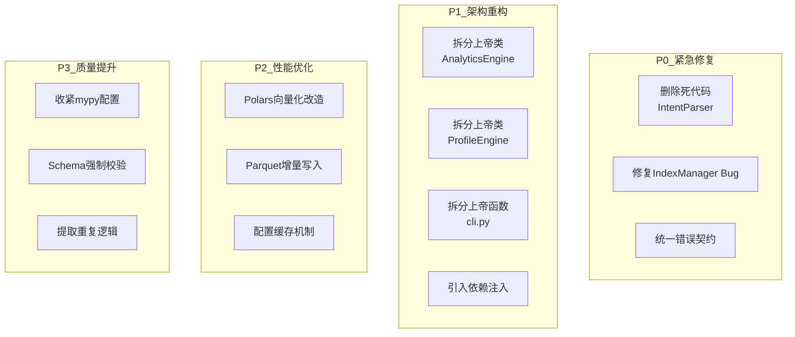
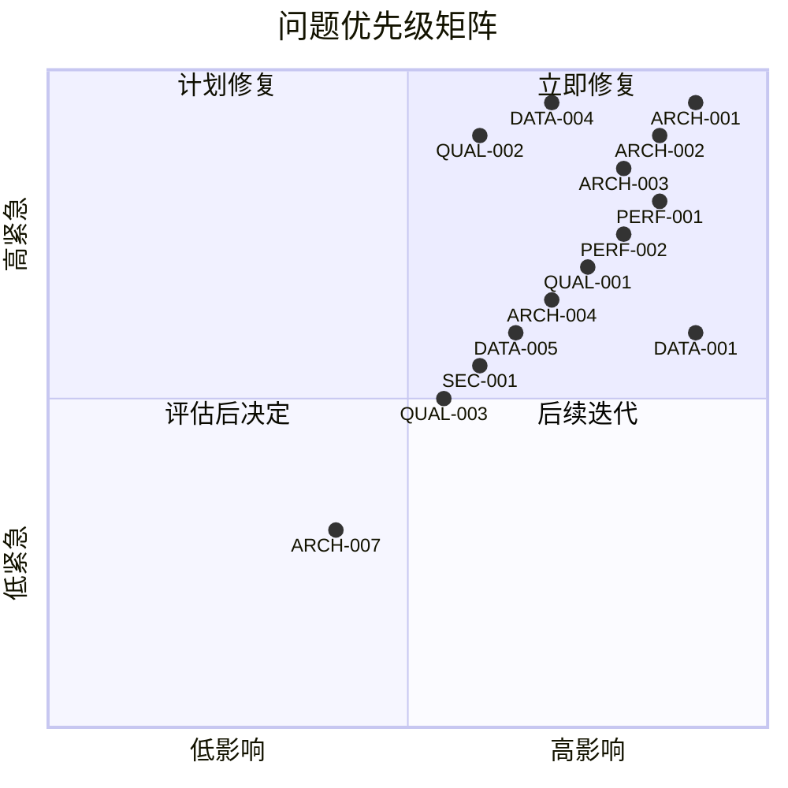
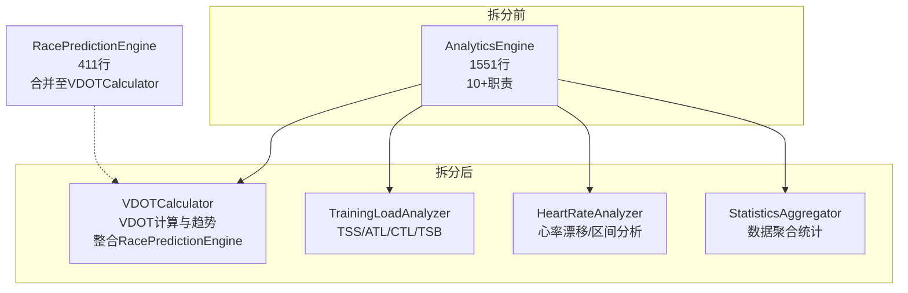
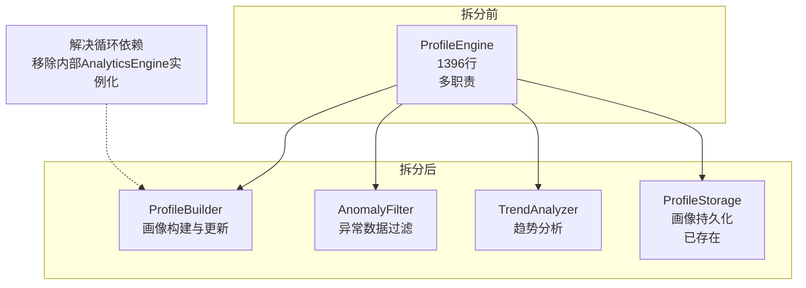
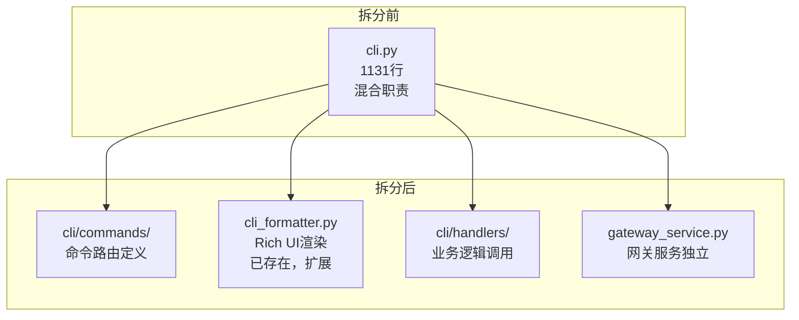
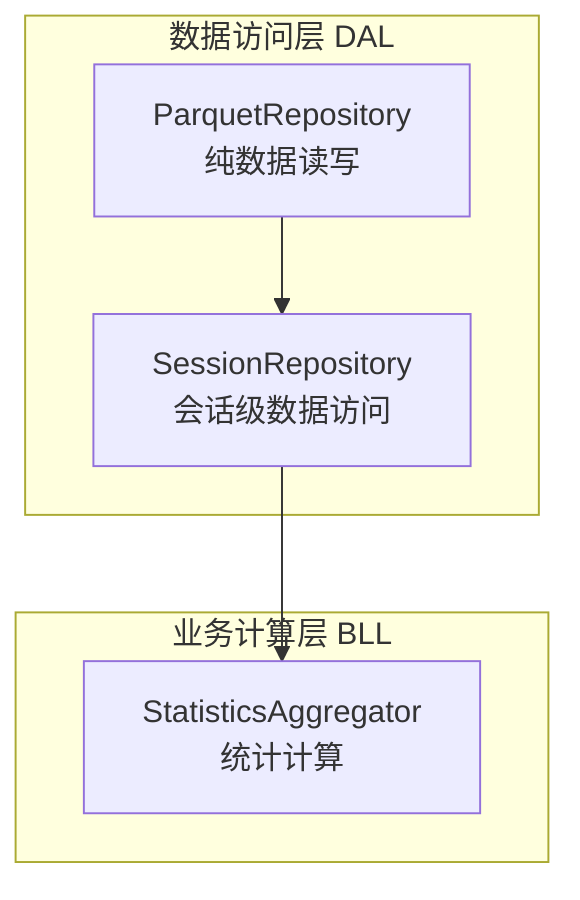
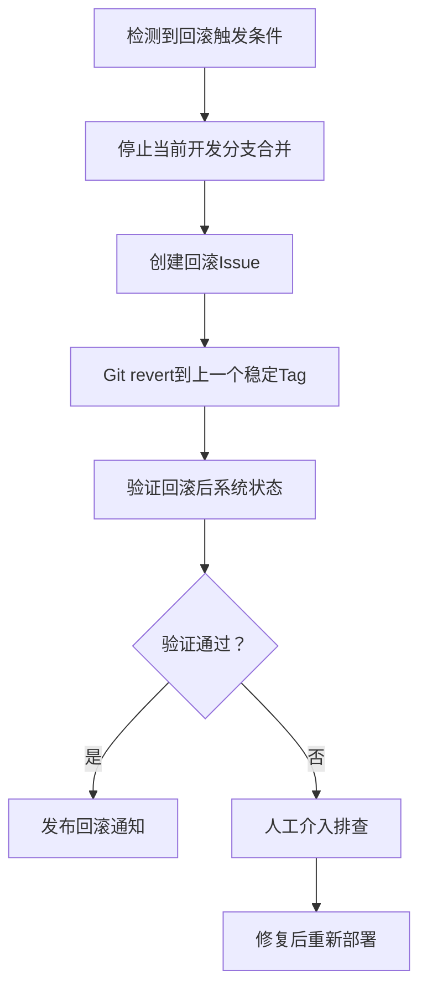
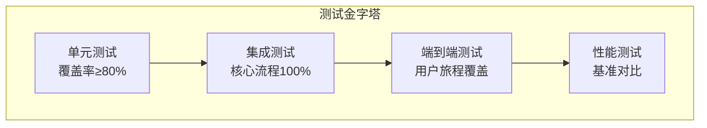

# Nanobot Runner v0.9.0 重构规划方案

> **文档版本**: v1.1.0（评审修订版）  
> **制定日期**: 2026-04-08  
> **修订日期**: 2026-04-08  
> **制定角色**: 架构师智能体  
> **参考文档**: 项目深度设计分析报告(Glm-5.0-Turbo/Qwen3.6-plus)、意图解析器功能分析

---

## 修订说明

本文档基于《v0.9.0 重构规划方案 评审报告》进行了全面修订，主要修正内容：

| 修订项 | 原内容 | 修订后内容 |
|--------|--------|-----------|
| 行数数据 | 与实际代码偏差 | 以当前代码实际行数为准 |
| plan/子模块分析 | 仅提及IntentParser | 补充完整7个模块分析+死代码详细证据 |
| IntentResult | 未提及 | 确认为关联死代码，需一并删除 |
| 遗漏模块 | 未提及 | 补充race_prediction/report_service/ImportService |
| 依赖注入迁移路径 | 缺失 | 补充6处实例化的具体改造方案 |
| 版本号目标 | 同步到0.8.0 | 同步到0.9.0 |
| 职责边界 | SessionRepository与StatisticsAggregator重叠 | 明确分层边界 |
| SEC-001严重程度 | 🟡中 | 🔴高 |
| 回滚方案 | 缺失 | 补充完整回滚策略 |
| CI/CD改造 | 缺失 | 补充基于现有CI的增强计划 |

---

## 一、重构目标与范围界定

### 1.1 重构目标

基于三份架构分析报告的深度诊断，v0.9.0版本的核心目标是**消除架构债务、提升可维护性、增强扩展能力**，具体包括：

| 目标维度 | 当前状态 | 目标状态 | 量化指标 |
|---------|---------|---------|---------|
| **模块内聚性** | 上帝类严重（analytics 1551行、profile 1396行、cli 1131行） | 单一职责，领域清晰 | 单文件≤500行 |
| **类型安全** | mypy配置极度宽松，形同虚设 | 严格类型检查 | 核心模块覆盖率≥80% |
| **性能优化** | Polars误用（collect后Python循环）、写入路径O(N) | 向量化计算、增量写入 | 查询性能提升≥30% |
| **代码质量** | 重复代码10+处、死代码存在 | DRY原则、零死代码 | 重复率<5% |
| **安全合规** | 敏感信息明文、monkey-patch风险 | 加密存储、解耦第三方库 | 高危漏洞=0 |

### 1.2 重构范围界定

#### 1.2.1 纳入范围（In Scope）



#### 1.2.2 排除范围（Out of Scope）

| 排除项 | 排除理由 | 后续版本规划 |
|--------|---------|-------------|
| 多用户支持 | 架构设计为单用户本地，需大规模重构 | v1.0.0评估 |
| Web UI | 业务边界明确为CLI工具 | 不纳入路线图 |
| 云端存储 | 隐私优先原则，本地优先架构 | 不纳入路线图 |
| 实时流处理 | 当前数据规模无需 | v1.1.0评估 |
| GPX/TCX支持 | 需Strategy模式抽象，依赖P1完成 | v0.9.1 |
| 双层存储重构 | 影响面大，需充分测试 | v0.9.2 |

### 1.3 重构原则

1. **渐进式重构**：每个迭代保持系统可运行，避免大爆炸式重写
2. **测试先行**：重构前补充测试，重构后验证通过率100%
3. **向后兼容**：数据格式、配置文件、CLI接口保持兼容
4. **文档同步**：代码变更同步更新架构文档、API文档

---

## 二、问题诊断与优先级矩阵

### 2.1 问题汇总（整合三份报告 + 实际代码验证）

#### 2.1.1 架构层面问题

| 问题ID | 问题描述 | 严重程度 | 影响范围 | 来源报告 |
|--------|---------|---------|---------|---------|
| ARCH-001 | `AnalyticsEngine`承担VDOT、TSS、心率漂移、训练负荷、报告生成等10+职责 | 🔴 高 | core/analytics.py (1551行) | Glm/Qwen |
| ARCH-002 | `ProfileEngine`承担画像构建、异常过滤、趋势分析等多职责 | 🔴 高 | core/profile.py (1396行) | Glm/Qwen |
| ARCH-003 | `cli.py`混合路由定义、业务调用、Rich UI渲染 | 🔴 高 | src/cli.py (1131行) | Glm/Qwen |
| ARCH-004 | 缺少依赖注入机制，模块间隐式紧耦合 | 🟡 中 | 全局 | Glm/Qwen |
| ARCH-005 | 缺少Repository模式，StorageManager职责过多 | 🟡 中 | core/storage.py (516行) | Glm |
| ARCH-006 | 缺少Strategy模式，只支持FIT格式 | 🟡 中 | core/parser.py (294行) | Glm |
| ARCH-007 | 缺少Observer/Event模式，数据导入无事件通知 | 🟢 低 | core/importer.py (155行) | Glm/Qwen |
| ARCH-008 | `gateway()`函数204行，内嵌异步回调与依赖初始化 | 🟡 中 | cli.py:773-976 | Qwen |
| ARCH-009 | `tools.py`混合工具定义、业务逻辑、工厂函数 | 🟡 中 | agents/tools.py (708行) | Qwen |

#### 2.1.2 数据层面问题

| 问题ID | 问题描述 | 严重程度 | 影响范围 | 来源报告 |
|--------|---------|---------|---------|---------|
| DATA-001 | 原始采样数据与会话数据混合存储，巨大冗余 | 🔴 高 | core/parser.py, storage.py | Glm |
| DATA-002 | `ParquetSchema`定义但未强制执行 | 🟡 中 | core/schema.py (220行) | Glm |
| DATA-003 | `IndexManager`指纹用list存储，O(n)查找 | 🟡 中 | core/indexer.py (118行) | Glm |
| DATA-004 | `IndexManager._save_index`的`updated`字段bug（写入用户主目录路径而非时间戳） | 🔴 高 | core/indexer.py:38 | Glm |
| DATA-005 | `save_to_parquet`全量读-合并-写，O(N)复杂度 | 🟡 中 | core/storage.py:285-294 | Glm/Qwen |
| DATA-006 | `_align_dataframes`列级遍历效率低 | 🟢 低 | core/storage.py:62-101 | Glm |

#### 2.1.3 性能层面问题

| 问题ID | 问题描述 | 严重程度 | 影响范围 | 来源报告 |
|--------|---------|---------|---------|---------|
| PERF-001 | `get_training_load`等collect后Python循环 | 🔴 高 | analytics.py多处 | Glm |
| PERF-002 | `get_hr_drift_analysis`全量加载数据到内存 | 🔴 高 | tools.py:543-563 | Glm |
| PERF-003 | EWMA计算O(n²)复杂度，每天从头计算 | 🟡 中 | analytics.py:1669-1696 | Glm |
| PERF-004 | `ConfigManager.get()`每次调用都读盘 | 🟡 中 | config.py (129行) | Qwen |
| PERF-005 | `filter_anomaly_data`过早collect两次 | 🟡 中 | profile.py | Qwen |

#### 2.1.4 安全层面问题

| 问题ID | 问题描述 | 严重程度 | 影响范围 | 来源报告 |
|--------|---------|---------|---------|---------|
| SEC-001 | Monkey-patching `fitparse`，升级风险高（静默失败风险） | 🔴 高 | parser.py:16-86 | Glm/Qwen（修订） |
| SEC-002 | 飞书App Secret明文存储于`~/.nanobot-runner/config.json` | 🟡 中 | config.py:79 | Glm |
| SEC-003 | `nanobot-ai>=0.1.4`无版本上限 | 🟡 中 | pyproject.toml | Qwen |
| SEC-004 | CLI中裸`Exception`捕获 | 🟢 低 | cli.py:196 | Glm |

#### 2.1.5 代码质量问题

| 问题ID | 问题描述 | 严重程度 | 影响范围 | 来源报告 |
|--------|---------|---------|---------|---------|
| QUAL-001 | mypy配置关闭所有严格检查 | 🔴 高 | pyproject.toml:95-104 | Glm/Qwen |
| QUAL-002 | `IntentParser`是死代码，从未被调用 | 🔴 高 | core/plan/intent_parser.py (276行) | 意图分析 |
| QUAL-003 | 会话聚合逻辑`group_by("session_start_time")`重复10+次 | 🟡 中 | analytics/tools/cli | Glm/Qwen |
| QUAL-004 | 错误处理不一致（字典/异常/友好消息三种契约） | 🟡 中 | 全局 | Qwen |
| QUAL-005 | 版本号不一致（pyproject.toml 0.8.0 vs __init__.py 0.4.0） | 🟢 低 | pyproject.toml, src/__init__.py | Qwen |
| QUAL-006 | 飞书Token管理在两个文件中重复 | 🟢 低 | feishu.py (728行), feishu_calendar.py (580行) | Qwen |

### 2.2 补充：plan/子模块完整分析

经实际代码验证，`src/core/plan/`包含7个模块，使用情况如下：

| 模块 | 行数 | 类 | 外部使用情况 | 状态 |
|------|------|-----|-------------|------|
| `intent_parser.py` | 276 | `IntentParser` | 仅在`__init__.py`和测试中导入 | ❌ **死代码** |
| `plan_manager.py` | 324 | `PlanManager`, `PlanStatus`, `PlanManagerError` | 测试中大量使用 | ✅ 活跃 |
| `calendar_tool.py` | 494 | `CalendarTool` | 测试中大量使用 | ✅ 活跃 |
| `notify_tool.py` | 353 | `WeatherService` | 测试中大量使用 | ✅ 活跃 |
| `plan_generator.py` | 299 | `PlanGenerator` | 仅在`__init__.py`导出 | ⚠️ **潜在死代码** |
| `plan_analyzer.py` | 410 | `PlanAnalyzer` | 仅在`__init__.py`导出 | ⚠️ **潜在死代码** |
| `hard_validator.py` | 340 | `HardValidator` | 仅在`__init__.py`导出 | ⚠️ **潜在死代码** |

#### 2.2.1 IntentParser 死代码详细分析

**确认死代码的证据**：

1. **无业务代码调用**：`IntentParser` 仅在 `__init__.py` 中导出，无任何业务代码（CLI、Agent、飞书通道）实际调用
2. **功能已被替代**：Chat 模式使用 `nanobot-ai` 框架的 `AgentLoop`，通过自然语言处理直接调用 `RunnerTools.generate_training_plan`
3. **关联数据类也是死代码**：`IntentResult`（models.py:71）仅被 `IntentParser` 使用，删除 `IntentParser` 后也应一并删除

**Chat 斜杠命令的实际处理方式**：

`IntentParser` 中定义的斜杠命令（`/create`, `/modify`, `/query`, `/cancel`, `/sync`, `/progress`）从未被实际使用。实际的处理流程是：

```
用户输入 → AgentLoop → RunnerTools.generate_training_plan → TrainingPlanEngine
```

**删除范围**：
- `src/core/plan/intent_parser.py`（276行）
- `src/core/models.py` 中的 `IntentResult` 类（约20行）
- `tests/unit/core/plan/test_intent_parser.py`（测试文件）
- `src/core/plan/__init__.py` 中的相关导出

**结论**：
- `IntentParser`：确认死代码，应删除
- `IntentResult`：关联死代码，应删除
- `PlanGenerator`/`PlanAnalyzer`/`HardValidator`：仅在`__init__.py`导出，无外部调用，需进一步确认是否为预留接口或死代码
- `WeatherService`：测试中大量使用，活跃模块

### 2.3 补充：遗漏模块分析

#### 2.3.1 `race_prediction.py` (411行)

| 类 | 职责 | 使用情况 |
|-----|------|---------|
| `RacePrediction` | 比赛预测结果数据类 | 内部使用 |
| `RacePredictionEngine` | 基于VDOT的比赛成绩预测引擎 | 需确认外部调用 |

**架构定位**：与`AnalyticsEngine`中的VDOT计算存在功能关联，拆分方案中应考虑整合或明确边界。

#### 2.3.2 `report_service.py` (625行)

| 类 | 职责 | 使用情况 |
|-----|------|---------|
| `ReportService` | 报告生成、推送、定时调度 | cli.py:1000-1003实例化 |

**架构定位**：与`ReportGenerator`（833行）职责不同：
- `ReportGenerator`：报告内容生成
- `ReportService`：报告调度、推送、生命周期管理

**依赖关系**：`ReportService`内部实例化`AnalyticsEngine`（report_service.py:45）

#### 2.3.3 `ImportService` (155行)

| 类 | 职责 | 使用情况 |
|-----|------|---------|
| `ImportService` | FIT文件导入编排服务 | cli.py:138实例化 |

**架构定位**：正确的服务编排层，将`FitParser`、`IndexManager`、`StorageManager`组合起来。

### 2.4 优先级矩阵



---

## 三、核心模块架构调整方案

### 3.1 AnalyticsEngine 拆分方案

#### 3.1.1 当前问题

`AnalyticsEngine`（1551行）承担以下职责，严重违反单一职责原则：

- VDOT计算与趋势分析
- TSS/ATL/CTL/TSB训练负荷计算
- 心率漂移分析
- 心率区间分析
- 配速分布分析
- 晨报生成
- 周计划生成
- 数据聚合统计

#### 3.1.2 拆分方案



**修订说明**：
- 移除原方案中的`PaceAnalyzer`（经确认当前代码中不存在独立配速分析方法）
- `RacePredictionEngine`（411行）合并至`VDOTCalculator`，统一VDOT相关计算
- `ReportGenerator`（833行）保持独立，不纳入本次拆分范围

#### 3.1.3 模块职责定义

| 新模块 | 职责 | 核心方法 | 预估行数 |
|--------|------|---------|---------|
| `VDOTCalculator` | VDOT计算、趋势分析、比赛预测（整合RacePredictionEngine） | `calculate_vdot()`, `get_vdot_trend()`, `predict_race_time()` | ~300 |
| `TrainingLoadAnalyzer` | TSS计算、ATL/CTL/TSB、训练负荷趋势 | `calculate_tss()`, `calculate_atl()`, `calculate_ctl()`, `get_training_load_trend()` | ~250 |
| `HeartRateAnalyzer` | 心率漂移检测、心率区间分析、最大心率估算 | `analyze_hr_drift()`, `get_hr_zones()`, `estimate_max_hr()` | ~200 |
| `StatisticsAggregator` | 数据聚合、统计摘要、会话聚合 | `aggregate_sessions()`, `get_summary_stats()`, `get_session_count()` | ~200 |

#### 3.1.4 接口设计

```python
class VDOTCalculator:
    def __init__(self, storage: StorageManager):
        self.storage = storage
    
    def calculate_vdot(self, distance_m: float, time_s: float) -> float:
        pass
    
    def get_vdot_trend(self, limit: int = 30) -> pl.DataFrame:
        pass
    
    def predict_race_time(self, vdot: float, distance_km: float) -> Dict[str, Any]:
        pass

class TrainingLoadAnalyzer:
    def __init__(self, storage: StorageManager):
        self.storage = storage
    
    def calculate_tss(self, distance_m: float, duration_s: float, 
                      avg_hr: Optional[float] = None) -> float:
        pass
    
    def get_training_load(self, days: int = 90) -> Dict[str, Any]:
        pass

class HeartRateAnalyzer:
    def __init__(self, storage: StorageManager):
        self.storage = storage
    
    def analyze_hr_drift(self, run_id: Optional[str] = None) -> Dict[str, Any]:
        pass

class StatisticsAggregator:
    def __init__(self, storage: StorageManager):
        self.storage = storage
    
    def aggregate_sessions(self, lf: pl.LazyFrame, 
                          filters: Optional[Dict] = None) -> pl.DataFrame:
        pass
```

### 3.2 ProfileEngine 拆分方案

#### 3.2.1 当前问题

`ProfileEngine`（1396行）承担以下职责：

- 用户画像构建
- 异常数据过滤
- 趋势分析
- 能力评估
- 画像持久化

**额外问题**：内部存在对`AnalyticsEngine`的延迟导入（profile.py:1176, 1290），形成循环依赖隐患。

#### 3.2.2 拆分方案



### 3.3 CLI 拆分方案

#### 3.3.1 当前问题

`cli.py`（1131行）混合了：

- Typer命令路由定义
- Rich UI渲染逻辑
- 业务逻辑调用
- 异步网关管理

#### 3.3.2 拆分方案



#### 3.3.3 目录结构

```
src/
├── cli/
│   ├── __init__.py
│   ├── app.py              # Typer app入口
│   ├── commands/
│   │   ├── __init__.py
│   │   ├── data.py         # import-data, stats
│   │   ├── analysis.py     # vdot, load, hr-drift
│   │   ├── agent.py        # chat, memory
│   │   ├── report.py       # report, profile
│   │   └── gateway.py      # gateway命令
│   └── handlers/
│       ├── __init__.py
│       ├── data_handler.py
│       └── analysis_handler.py
├── cli_formatter.py        # 保持，扩展
└── gateway_service.py      # 新增，独立网关服务
```

### 3.4 依赖注入方案（含迁移路径）

#### 3.4.1 当前问题

`AnalyticsEngine`在**6处**被独立实例化：

| 位置 | 文件:行号 | 实例化方式 |
|------|----------|-----------|
| 1 | agents/tools.py:439 | `AnalyticsEngine(self.storage)` |
| 2 | cli.py:508 | `AnalyticsEngine(storage)` |
| 3 | report_generator.py:272 | `AnalyticsEngine(self.storage)` |
| 4 | report_service.py:45 | `AnalyticsEngine(self.storage)` |
| 5 | profile.py:1176 | `AnalyticsEngine(self.storage)` |
| 6 | profile.py:1290 | `AnalyticsEngine(self.storage)` |

#### 3.4.2 解决方案：工厂模式 + 上下文管理

```python
from dataclasses import dataclass
from typing import Optional

@dataclass
class AppContext:
    storage: StorageManager
    config: ConfigManager
    vdot_calculator: VDOTCalculator
    training_load_analyzer: TrainingLoadAnalyzer
    heart_rate_analyzer: HeartRateAnalyzer
    statistics_aggregator: StatisticsAggregator

class AppContextFactory:
    @staticmethod
    def create(config_path: Optional[str] = None) -> AppContext:
        config = ConfigManager(config_path)
        storage = StorageManager(config.data_dir)
        
        return AppContext(
            storage=storage,
            config=config,
            vdot_calculator=VDOTCalculator(storage),
            training_load_analyzer=TrainingLoadAnalyzer(storage),
            heart_rate_analyzer=HeartRateAnalyzer(storage),
            statistics_aggregator=StatisticsAggregator(storage),
        )
```

#### 3.4.3 迁移路径（分阶段）

**阶段1：CLI层改造**

```python
# cli/app.py
from src.core.context import AppContext, AppContextFactory

app = typer.Typer()

@app.callback()
def main(ctx: typer.Context):
    ctx.obj = AppContextFactory.create()

# cli/commands/analysis.py
@app.command()
def stats(ctx: typer.Context, year: Optional[int] = None):
    app_ctx: AppContext = ctx.obj
    aggregator = app_ctx.statistics_aggregator
    # ...
```

**阶段2：RunnerTools改造**

```python
# agents/tools.py
class RunnerTools:
    def __init__(self, app_context: AppContext):
        self.storage = app_context.storage
        self.vdot_calculator = app_context.vdot_calculator
        self.training_load_analyzer = app_ctx.training_load_analyzer
        # 不再独立创建AnalyticsEngine
```

**阶段3：ReportGenerator/ReportService改造**

```python
# report_generator.py
class ReportGenerator:
    def __init__(self, app_context: AppContext):
        self.storage = app_context.storage
        self.vdot_calculator = app_context.vdot_calculator
        # 通过AppContext获取依赖

# report_service.py
class ReportService:
    def __init__(self, app_context: Optional[AppContext] = None):
        self.app_context = app_context or AppContextFactory.create()
        # 不再独立创建AnalyticsEngine
```

**阶段4：ProfileEngine改造（解决循环依赖）**

```python
# profile.py
class ProfileEngine:
    def __init__(self, app_context: AppContext):
        self.storage = app_context.storage
        self.vdot_calculator = app_context.vdot_calculator
        # 移除内部的AnalyticsEngine延迟导入
        # 需要的分析能力通过AppContext获取
```

### 3.5 Repository模式引入（明确分层边界）

#### 3.5.1 当前问题

`StorageManager`（516行）既负责存储又负责查询，包含`save_to_parquet`、`read_parquet`、`query_activities`、`query_by_date_range`、`get_stats`等多种职责。

#### 3.5.2 拆分方案（明确分层）



**分层边界说明**：

| 层级 | 模块 | 职责 | 依赖方向 |
|------|------|------|---------|
| 数据访问层 | `ParquetRepository` | 纯Parquet文件读写（read/append/save） | 无依赖 |
| 数据访问层 | `SessionRepository` | 会话级数据访问（封装基础聚合查询） | 依赖ParquetRepository |
| 业务计算层 | `StatisticsAggregator` | 统计计算（基于SessionRepository返回的数据） | 依赖SessionRepository |

```python
class ParquetRepository:
    def __init__(self, data_dir: Path):
        self.data_dir = data_dir
    
    def read(self, years: Optional[List[int]] = None) -> pl.LazyFrame:
        pass
    
    def append(self, df: pl.DataFrame, year: int) -> None:
        pass

class SessionRepository:
    def __init__(self, repository: ParquetRepository):
        self.repository = repository
    
    def get_sessions(self, filters: Optional[Dict] = None) -> pl.DataFrame:
        lf = self.repository.read()
        return lf.group_by("session_start_time").agg([...])

class StatisticsAggregator:
    def __init__(self, session_repo: SessionRepository):
        self.session_repo = session_repo
    
    def get_summary_stats(self, filters: Optional[Dict] = None) -> Dict[str, Any]:
        sessions = self.session_repo.get_sessions(filters)
        # 基于sessions做进一步统计计算
```

---

## 四、关键技术选型与实施路径

### 4.1 技术选型决策

#### 4.1.1 依赖注入框架

| 方案 | 优点 | 缺点 | 决策 |
|------|------|------|------|
| **工厂模式（推荐）** | 简单、无额外依赖、易测试 | 需手动管理 | ✅ 采用 |
| python-inject | 功能完整 | 引入新依赖、过度设计 | ❌ 不采用 |
| dependency-injector | 企业级功能 | 学习成本高、过重 | ❌ 不采用 |

**决策依据**：项目规模为个人开发者场景，工厂模式足够，避免引入额外复杂度。

#### 4.1.2 配置加密方案

| 方案 | 优点 | 缺点 | 决策 |
|------|------|------|------|
| **keyring库** | 跨平台、系统密钥链 | 需额外依赖 | ✅ 采用 |
| cryptography | 功能强大 | 需管理密钥 | ❌ 不采用 |
| 环境变量 | 简单 | 不适合持久化配置 | ❌ 不采用 |

**决策依据**：`keyring`库可无缝集成操作系统密钥链（Windows Credential Manager / macOS Keychain），安全性高且使用便捷。

#### 4.1.3 fitparse Monkey-patch 替代方案

| 方案 | 优点 | 缺点 | 决策 |
|------|------|------|------|
| **继承+重写** | 解耦、可维护 | 需维护子类 | ✅ 采用 |
| Fork维护补丁版本 | 完全控制 | 维护成本高 | ❌ 不采用 |
| 保持现状 | 无改动 | 升级风险（🔴高） | ❌ 不接受 |

**决策依据**：继承重写符合开闭原则，且不污染第三方库的全局行为。当前monkey-patch风险已评估为🔴高（静默失败风险）。

### 4.2 实施路径

```mermaid
graph LR
    subgraph Phase1_基础修复[P1: 基础修复<br/>1-2周]
        A1[删除死代码]
        A2[修复IndexManager Bug]
        A3[统一错误契约]
        A4[版本号同步至0.9.0]
    end
    
    subgraph Phase2_架构重构[P2: 架构重构<br/>3-4周]
        B1[AnalyticsEngine拆分]
        B2[ProfileEngine拆分]
        B3[CLI拆分]
        B4[引入依赖注入]
    end
    
    subgraph Phase3_性能优化[P3: 性能优化<br/>2周]
        C1[Polars向量化]
        C2[增量写入]
        C3[配置缓存]
    end
    
    subgraph Phase4_质量提升[P4: 质量提升<br/>1周]
        D1[收紧mypy]
        D2[Schema强制校验]
        D3[提取重复逻辑]
    end
    
    Phase1_基础修复 --> Phase2_架构重构
    Phase2_架构重构 --> Phase3_性能优化
    Phase3_性能优化 --> Phase4_质量提升
```



---

## 五、实施步骤与时间节点

### 5.1 Phase 1: 基础修复（第1-2周）

#### Sprint 1.1: 死代码清理（2天）

| 任务 | 具体内容 | 交付物 | 验收标准 |
|------|---------|--------|---------|
| 删除IntentParser | 删除`core/plan/intent_parser.py`及相关测试 | 删除文件列表 | 无引用报错 |
| 删除IntentResult | 删除`models.py`中的`IntentResult`类 | 修改后的models.py | 无引用报错 |
| 更新__init__.py | 删除`plan/__init__.py`中的相关导出 | 修改后的__init__.py | 导入检查通过 |
| 评估plan/潜在死代码 | 确认PlanGenerator/PlanAnalyzer/HardValidator是否为预留接口 | 评估报告 | 明确处置方案 |
| 删除FeishuBot空壳处理器 | 删除`_handle_stats`等空实现方法 | 修改后的feishu.py | 飞书命令走AgentLoop |
| 更新文档 | 删除相关文档引用 | 更新后的AGENTS.md | 文档一致性检查 |

#### Sprint 1.2: Bug修复（2天）

| 任务 | 具体内容 | 交付物 | 验收标准 |
|------|---------|--------|---------|
| 修复IndexManager.updated | 改为当前时间戳 | 修复代码 | 单元测试通过 |
| IndexManager.fingerprints改set | list→set，O(1)查找 | 修改代码 | 性能测试通过 |
| 版本号同步至0.9.0 | `__init__.py`改为0.9.0 | 同步代码 | CI检查通过 |

#### Sprint 1.3: 错误契约统一（3天）

| 任务 | 具体内容 | 交付物 | 验收标准 |
|------|---------|--------|---------|
| 定义统一错误契约 | 核心层全部使用自定义异常 | exceptions.py扩展 | 异常继承体系完整 |
| 工具层统一转换 | `@handle_tool_errors`统一转JSON | decorators.py更新 | 所有工具返回一致格式 |
| CLI层统一处理 | Typer异常处理统一 | cli.py修改 | 用户友好错误提示 |

### 5.2 Phase 2: 架构重构（第3-6周）

#### Sprint 2.1: AnalyticsEngine拆分（5天）

| 任务 | 具体内容 | 交付物 | 验收标准 |
|------|---------|--------|---------|
| 创建VDOTCalculator | 迁移VDOT相关方法，整合RacePredictionEngine | vdot_calculator.py | 单元测试覆盖率≥80% |
| 创建TrainingLoadAnalyzer | 迁移TSS/ATL/CTL方法 | training_load_analyzer.py | 单元测试覆盖率≥80% |
| 创建HeartRateAnalyzer | 迁移心率分析方法 | heart_rate_analyzer.py | 单元测试覆盖率≥80% |
| 创建StatisticsAggregator | 迁移聚合统计方法 | statistics_aggregator.py | 单元测试覆盖率≥80% |
| 更新调用方 | RunnerTools、CLI、ReportGenerator、ReportService、ProfileEngine | 修改后的调用代码 | 集成测试通过 |

#### Sprint 2.2: ProfileEngine拆分（4天）

| 任务 | 具体内容 | 交付物 | 验收标准 |
|------|---------|--------|---------|
| 创建ProfileBuilder | 迁移画像构建逻辑 | profile_builder.py | 单元测试覆盖率≥80% |
| 创建AnomalyFilter | 迁移异常过滤逻辑 | anomaly_filter.py | 单元测试覆盖率≥80% |
| 创建TrendAnalyzer | 迁移趋势分析逻辑 | trend_analyzer.py | 单元测试覆盖率≥80% |
| 解决循环依赖 | 移除内部AnalyticsEngine实例化 | 修改后的profile.py | 无循环导入警告 |

#### Sprint 2.3: CLI拆分（5天）

| 任务 | 具体内容 | 交付物 | 验收标准 |
|------|---------|--------|---------|
| 创建cli/commands/ | 按领域拆分命令定义 | commands/*.py | 命令功能不变 |
| 创建cli/handlers/ | 业务逻辑调用层 | handlers/*.py | 业务逻辑不变 |
| 创建gateway_service.py | 独立网关服务 | gateway_service.py | 网关功能不变 |
| 扩展cli_formatter.py | UI渲染逻辑集中 | cli_formatter.py | UI效果不变 |

#### Sprint 2.4: 依赖注入引入（3天）

| 任务 | 具体内容 | 交付物 | 验收标准 |
|------|---------|--------|---------|
| 创建AppContext | 定义应用上下文 | context.py | 类型完整 |
| 创建AppContextFactory | 工厂方法 | context.py | 可测试 |
| 改造6处实例化 | CLI、RunnerTools、ReportGenerator、ReportService、ProfileEngine | 全局修改 | 集成测试通过 |

### 5.3 Phase 3: 性能优化（第7-8周）

#### Sprint 3.1: Polars向量化（4天）

| 任务 | 具体内容 | 交付物 | 验收标准 |
|------|---------|--------|---------|
| TSS向量化 | 替代Python循环 | training_load_analyzer.py | 性能提升≥30% |
| VDOT向量化 | 批量计算 | vdot_calculator.py | 性能提升≥30% |
| EWMA增量计算 | O(n²)→O(n) | training_load_analyzer.py | 性能提升≥50% |
| 心率漂移向量化 | 替代iter_rows | heart_rate_analyzer.py | 性能提升≥30% |

#### Sprint 3.2: 存储优化（3天）

| 任务 | 具体内容 | 交付物 | 验收标准 |
|------|---------|--------|---------|
| 增量写入实现 | ParquetWriter追加模式 | storage.py修改 | 导入性能提升≥50% |
| Schema对齐优化 | 批量表达式构建 | storage.py修改 | 对齐性能提升≥30% |

#### Sprint 3.3: 配置缓存（2天）

| 任务 | 具体内容 | 交付物 | 验收标准 |
|------|---------|--------|---------|
| ConfigManager缓存 | 内存缓存+LRU | config.py修改 | 配置读取性能提升≥80% |

### 5.4 Phase 4: 质量提升（第9周）

#### Sprint 4.1: 类型安全（3天）

| 任务 | 具体内容 | 交付物 | 验收标准 |
|------|---------|--------|---------|
| 收紧mypy配置 | 逐步开启严格检查 | pyproject.toml | 核心模块零警告 |
| 补充类型注解 | 核心模块覆盖率≥80% | 全局修改 | mypy通过 |

#### Sprint 4.2: Schema强制校验（2天）

| 任务 | 具体内容 | 交付物 | 验收标准 |
|------|---------|--------|---------|
| FitParser集成校验 | parse后调用validate | parser.py修改 | 无效数据拒绝 |
| StorageManager集成校验 | save前调用normalize | storage.py修改 | Schema一致性 |

#### Sprint 4.3: 重复逻辑提取（2天）

| 任务 | 具体内容 | 交付物 | 验收标准 |
|------|---------|--------|---------|
| 提取SessionRepository | 统一会话聚合 | session_repository.py | 重复代码消除 |
| 提取FeishuAuth | 统一Token管理 | feishu_auth.py | 重复代码消除 |

---

## 六、风险评估与应对策略

### 6.1 风险清单

| 风险ID | 风险描述 | 概率 | 影响 | 风险等级 |
|--------|---------|------|------|---------|
| R001 | 拆分后接口变更导致调用方大量修改 | 高 | 高 | 🔴 高 |
| R002 | 重构过程中引入新Bug | 中 | 高 | 🔴 高 |
| R003 | 测试覆盖不足，重构后功能回归 | 中 | 高 | 🔴 高 |
| R004 | 时间估算偏差，延期交付 | 中 | 中 | 🟡 中 |
| R005 | 依赖注入改造影响启动性能 | 低 | 低 | 🟢 低 |
| R006 | Polars向量化改造引入数值精度问题 | 低 | 中 | 🟡 中 |
| R007 | nanobot-ai框架API变更影响Agent工具 | 中 | 高 | 🔴 高 |

### 6.2 应对策略

#### R001: 接口变更风险

**应对策略**：
1. **适配器模式**：保留原`AnalyticsEngine`作为门面，内部委托给新模块
2. **渐进式迁移**：先新增模块，再逐步迁移调用方，最后删除旧代码
3. **接口兼容层**：提供兼容性方法，标记为`@deprecated`

```python
class AnalyticsEngine:
    def __init__(self, storage: StorageManager):
        self._vdot = VDOTCalculator(storage)
        self._training_load = TrainingLoadAnalyzer(storage)
    
    @deprecated("Use VDOTCalculator.calculate_vdot instead")
    def calculate_vdot(self, distance_m: float, time_s: float) -> float:
        return self._vdot.calculate_vdot(distance_m, time_s)
```

#### R002: 新Bug引入风险

**应对策略**：
1. **测试先行**：重构前补充测试，覆盖率≥80%
2. **小步提交**：每个模块拆分独立PR，便于回滚
3. **代码评审**：所有重构代码必须经过评审

#### R003: 功能回归风险

**应对策略**：
1. **基准测试**：重构前建立性能基准，重构后对比验证
2. **集成测试**：核心流程端到端测试覆盖
3. **回归测试**：v0.9.0发布前执行全量回归

#### R004: 时间延期风险

**应对策略**：
1. **缓冲时间**：每个Sprint预留20%缓冲
2. **优先级调整**：P3任务可延后到v0.9.1
3. **并行开发**：Phase 2的多个拆分任务可并行

#### R006: 数值精度风险

**应对策略**：
1. **基准对比**：向量化前后结果对比测试
2. **精度容差**：浮点数比较使用`math.isclose`

#### R007: nanobot-ai框架耦合风险

**应对策略**：
1. **版本锁定**：`pyproject.toml`中锁定nanobot-ai版本范围
2. **接口隔离**：定义`AgentFramework`抽象层，隔离框架变更

### 6.3 回滚方案

#### 回滚触发条件

| 触发条件 | 阈值 | 监控方式 |
|---------|------|---------|
| 测试通过率 | < 95% | CI Pipeline |
| 性能下降 | > 20% | 性能基准测试 |
| 关键功能失效 | 任何一项 | 集成测试 |
| 类型检查错误 | 核心模块>10个 | mypy报告 |

#### 回滚操作步骤



**具体步骤**：

1. **停止合并**：立即冻结目标分支，禁止新代码合并
2. **创建Tag**：为当前状态创建`v0.9.0-rollback-N`标签
3. **Git Revert**：`git revert --no-commit <commit-range>`
4. **验证测试**：`uv run pytest tests/` 确保通过率100%
5. **性能验证**：运行性能基准测试
6. **发布通知**：更新CHANGELOG，通知相关智能体

---

## 七、质量保障措施

### 7.1 测试策略



#### 7.1.1 单元测试要求

| 模块 | 覆盖率要求 | 重点测试项 |
|------|-----------|-----------|
| `VDOTCalculator` | ≥85% | VDOT计算精度、边界值 |
| `TrainingLoadAnalyzer` | ≥85% | TSS/ATL/CTL计算、EWMA增量 |
| `HeartRateAnalyzer` | ≥80% | 心率漂移检测、区间划分 |
| `StatisticsAggregator` | ≥80% | 会话聚合、统计计算 |
| `SessionRepository` | ≥80% | 查询过滤、聚合逻辑 |

#### 7.1.2 集成测试要求

| 场景 | 测试内容 |
|------|---------|
| 数据导入流程 | FIT解析→去重→存储→查询 |
| Agent工具调用 | RunnerTools→新模块→返回结果 |
| CLI命令执行 | 命令解析→业务调用→输出渲染 |

#### 7.1.3 性能测试基准

| 指标 | 基准值（v0.8.0） | 目标值（v0.9.0） | 提升比例 |
|------|-----------------|-----------------|---------|
| TSS计算（100次跑步） | 500ms | ≤350ms | ≥30% |
| VDOT趋势查询（30天） | 200ms | ≤140ms | ≥30% |
| 数据导入（100个文件） | 10s | ≤5s | ≥50% |
| 会话聚合（1000次跑步） | 300ms | ≤200ms | ≥33% |
| 配置读取（1000次） | 1000ms | ≤200ms | ≥80% |

### 7.2 CI/CD改造计划

#### 7.2.1 当前CI状态

项目已有完整的CI管道（`.github/workflows/ci.yml`），包含：
- 代码质量检查（black、isort、mypy、bandit）
- 测试执行（unit、integration、e2e）
- 构建打包

#### 7.2.2 改造计划

```yaml
# 增强的质量门禁配置
quality_gates:
  - name: "代码格式化"
    command: "uv run black --check src/ tests/"
    threshold: "零警告"
  
  - name: "导入排序"
    command: "uv run isort --check-only src/ tests/"
    threshold: "零警告"
  
  - name: "类型检查（增强）"
    command: "uv run mypy src/ --strict"
    threshold: "核心模块零错误"
  
  - name: "单元测试"
    command: "uv run pytest tests/unit/ --cov=src --cov-fail-under=80"
    threshold: "通过率100%，覆盖率≥80%"
  
  - name: "集成测试"
    command: "uv run pytest tests/integration/"
    threshold: "通过率100%"
  
  - name: "安全扫描"
    command: "uv run bandit -r src/"
    threshold: "高危漏洞=0"
  
  - name: "版本号一致性检查（新增）"
    command: "python scripts/check_version_consistency.py"
    threshold: "pyproject.toml与__init__.py一致"
  
  - name: "性能基准测试（新增）"
    command: "uv run pytest tests/performance/ --benchmark-only"
    threshold: "无性能下降>20%"
```

#### 7.2.3 新增脚本

```python
# scripts/check_version_consistency.py
import tomllib
from pathlib import Path

def check_version_consistency():
    pyproject_path = Path("pyproject.toml")
    init_path = Path("src/__init__.py")
    
    with open(pyproject_path, "rb") as f:
        pyproject = tomllib.load(f)
        pyproject_version = pyproject["project"]["version"]
    
    init_content = init_path.read_text()
    for line in init_content.splitlines():
        if line.startswith("__version__"):
            init_version = line.split('"')[1]
            break
    
    if pyproject_version != init_version:
        print(f"版本号不一致: pyproject.toml={pyproject_version}, __init__.py={init_version}")
        exit(1)
    
    print(f"版本号一致: {pyproject_version}")
    exit(0)
```

### 7.3 文档同步要求

| 文档类型 | 更新时机 | 负责人 |
|---------|---------|--------|
| 架构设计说明书 | Phase 2完成后 | 架构师 |
| API参考文档 | 每个模块拆分后 | 开发工程师 |
| AGENTS.md | 接口变更后 | 架构师 |
| CLI使用指南 | 命令变更后 | 开发工程师 |

### 7.4 发布前检查清单

- [ ] 所有单元测试通过率100%
- [ ] 核心模块测试覆盖率≥80%
- [ ] 集成测试通过率100%
- [ ] 性能测试达到目标值
- [ ] mypy类型检查核心模块零错误
- [ ] 文档同步更新完成
- [ ] CHANGELOG更新
- [ ] 版本号同步（pyproject.toml、__init__.py均为0.9.0）

---

## 八、交付物清单

### 8.1 代码交付物

| 交付物 | 路径 | 说明 |
|--------|------|------|
| VDOT计算器 | `src/core/analytics/vdot_calculator.py` | 新增，整合RacePredictionEngine |
| 训练负荷分析器 | `src/core/analytics/training_load_analyzer.py` | 新增 |
| 心率分析器 | `src/core/analytics/heart_rate_analyzer.py` | 新增 |
| 统计聚合器 | `src/core/analytics/statistics_aggregator.py` | 新增 |
| 会话仓库 | `src/core/storage/session_repository.py` | 新增 |
| Parquet仓库 | `src/core/storage/parquet_repository.py` | 新增 |
| 应用上下文 | `src/core/context.py` | 新增 |
| CLI命令模块 | `src/cli/commands/*.py` | 新增 |
| 网关服务 | `src/gateway_service.py` | 新增 |
| 删除文件 | `src/core/plan/intent_parser.py` | 删除 |
| 删除数据类 | `src/core/models.py` (IntentResult) | 删除 |
| 删除测试 | `tests/unit/core/plan/test_intent_parser.py` | 删除 |
| 版本号更新 | `src/__init__.py` | 修改为0.9.0 |

### 8.2 文档交付物

| 交付物 | 路径 | 说明 |
|--------|------|------|
| 重构方案 | `docs/architecture/v0.9.0重构规划方案.md` | 本文档 |
| 架构设计更新 | `docs/architecture/架构设计说明书.md` | 更新 |
| API参考更新 | `docs/api/api_reference.md` | 更新 |
| CHANGELOG | `docs/history/VERSION_HISTORY.md` | 更新 |

### 8.3 测试交付物

| 交付物 | 路径 | 说明 |
|--------|------|------|
| 单元测试 | `tests/unit/core/analytics/*.py` | 新增（拆分后独立文件） |
| 集成测试 | `tests/integration/test_refactored_flow.py` | 新增 |
| 性能基准 | `tests/performance/benchmark_v0.9.0.json` | 新增 |

---

## 九、验收标准

### 9.1 功能验收

| 验收项 | 验收标准 |
|--------|---------|
| 数据导入 | FIT文件导入功能正常，去重机制有效 |
| 数据分析 | VDOT、TSS、心率漂移等计算结果正确 |
| Agent工具 | 所有Agent工具功能正常，返回格式一致 |
| CLI命令 | 所有CLI命令功能正常，输出格式正确 |
| 飞书集成 | Gateway服务正常，消息收发正常 |

### 9.2 质量验收

| 验收项 | 验收标准 |
|--------|---------|
| 代码规范 | black、isort检查零警告 |
| 类型安全 | mypy核心模块零错误 |
| 测试覆盖 | 核心模块覆盖率≥80% |
| 安全合规 | bandit高危漏洞=0 |
| 文档完整 | 架构文档、API文档同步更新 |

### 9.3 性能验收

| 验收项 | 验收标准 |
|--------|---------|
| 查询性能 | 相比v0.8.0提升≥30% |
| 导入性能 | 相比v0.8.0提升≥50% |
| 内存占用 | 无明显增长 |

---

## 十、后续版本规划

### v0.9.1（预计2周后）

- 支持GPX/TCX数据源（依赖Strategy模式）
- 双层存储设计评估
- plan/潜在死代码处置
- ReportGenerator拆分评估（833行，当前保持独立）

### v0.9.2（预计4周后）

- 双层存储重构（activities.parquet + records.parquet）
- 事件总线引入
- ReportGenerator拆分实施（如评估通过）

### v1.0.0（预计8周后）

- 多用户支持评估
- 云端同步评估
- Web UI评估

---

**方案修订完成，待审核通过后启动实施。**

---

*文档版本: v1.1.0（评审修订版）*  
*制定日期: 2026-04-08*  
*修订日期: 2026-04-08*  
*架构师: Kimi-K2.5*
