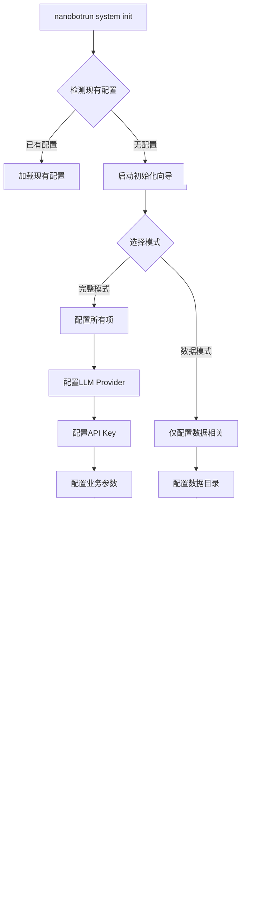
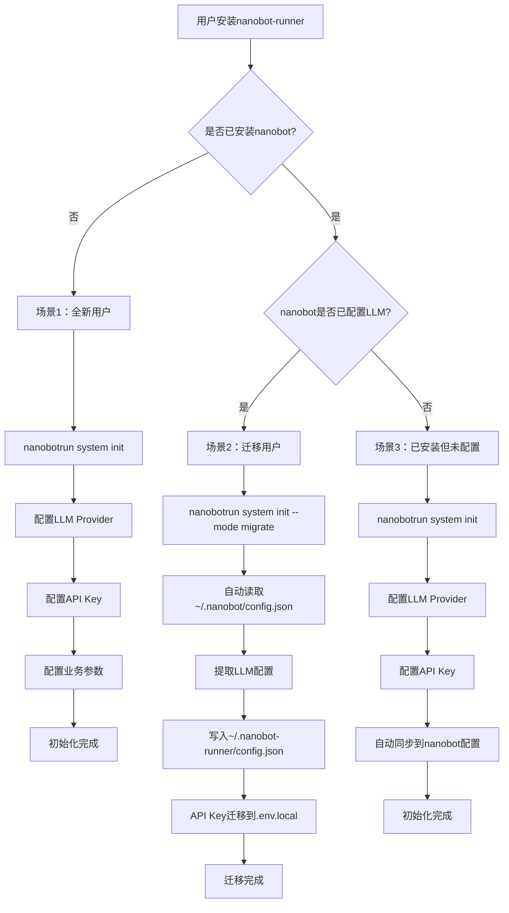
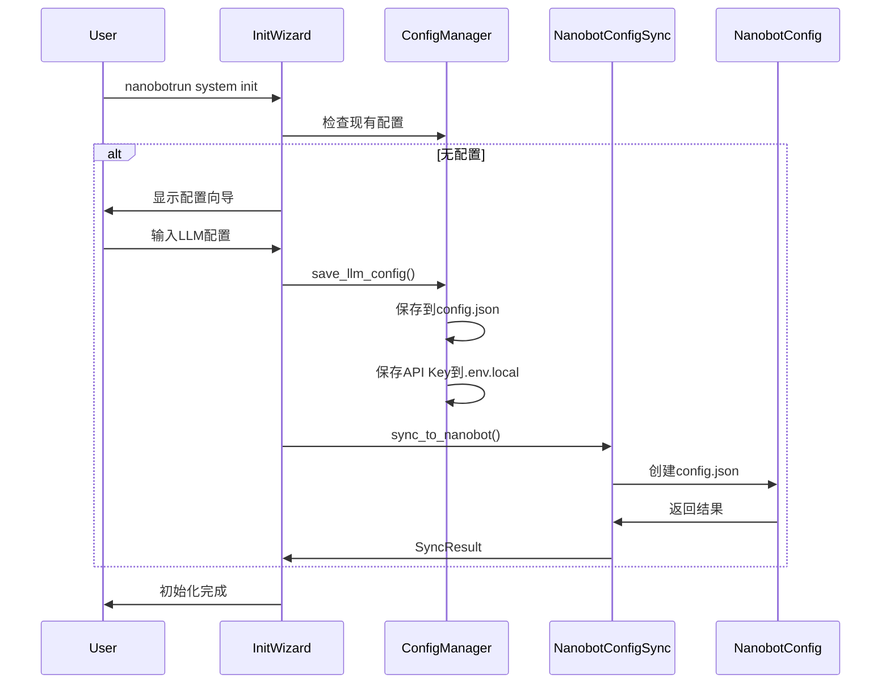
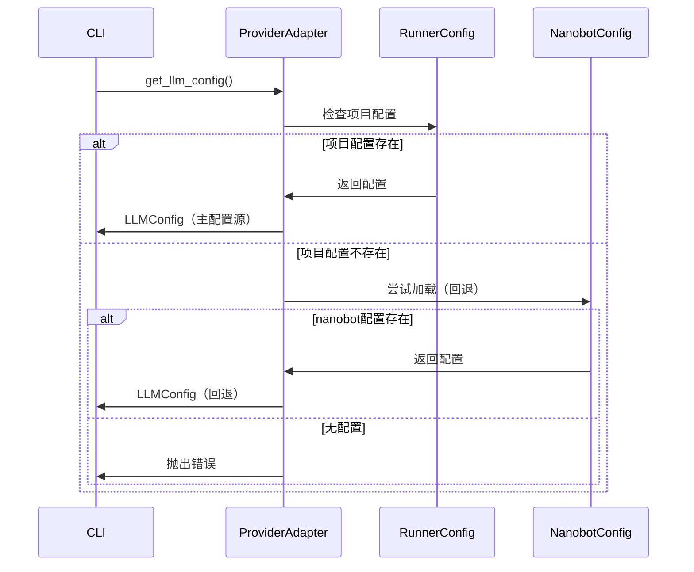

# v0.9.5 架构改进设计说明书

> **文档版本**: v1.0.0  
> **设计日期**: 2026-04-18  
> **版本目标**: 架构解耦与初始化流程整合  
> **需求来源**: 架构优化需求  
> **前置版本**: v0.9.4

---

## 1. 执行摘要

### 1.1 改进目标

| 目标 | 描述 | 优先级 |
|------|------|--------|
| **架构解耦** | 消除对nanobot框架级配置的强依赖，核心业务逻辑仅依赖项目自身配置 | P0 |
| **初始化整合** | system init时触发nanobot完整初始化，整合配置数据到项目系统 | P0 |
| **用户体验优化** | 减少用户配置困惑，提供清晰的配置路径和使用指引 | P1 |

### 1.2 核心设计原则

| 设计原则 | 说明 | 实施策略 |
|---------|------|---------|
| **配置适配层** | 引入适配层隔离nanobot配置依赖 | 通过ProviderAdapter统一配置访问 |
| **渐进式初始化** | 分阶段初始化，按需加载nanobot配置 | 初始化向导支持模式选择 |
| **配置统一视图** | 提供统一的配置查看和管理入口 | 整合两套配置到统一视图 |
| **向后兼容** | 保持现有功能不受影响 | 适配层兼容现有调用方式 |

### 1.3 nanobot-ai模块使用策略

#### 1.3.1 核心策略

**全面使用nanobot-ai提供的所有模块能力，不重复造轮子，仅替换配置管理层。**

用户只需安装`nanobot-runner`，`nanobot-ai`作为`dependencies`自动安装，用户无感知。项目通过ProviderAdapter将配置注入到nanobot模块，替代其默认的`~/.nanobot/config.json`加载机制。

#### 1.3.2 模块使用清单

**✅ 适用模块（全面使用）**

| 模块 | 核心作用 | 使用方式 |
|------|---------|---------|
| **agent** | 核心智能体逻辑，包含Agent循环（LLM ↔ 工具执行）、上下文构建、记忆管理、技能加载、子代理（后台任务）、**内置工具**等 | 直接导入使用，配置通过ProviderAdapter注入 |
| **skills** | 内置技能库（如GitHub、天气、tmux等），可扩展自定义技能 | 直接使用，支持MCP协议 |
| **channels** | 聊天渠道集成（支持插件），如Telegram、Discord、WeChat、Feishu等 | 直接使用，配置通过ProviderAdapter注入 |
| **bus** | 消息路由，处理模块间通信 | 直接使用 |
| **cron** | 定时任务调度，支持周期性任务执行 | 直接使用，配置通过ProviderAdapter注入 |
| **heartbeat** | 主动唤醒机制，定期检查并执行HEARTBEAT.md中的任务 | 直接使用 |
| **providers** | LLM提供商集成（如OpenRouter、Anthropic、OpenAI、MiniMax等） | 直接使用，配置通过ProviderAdapter注入 |
| **session** | 会话管理，维护对话上下文 | 直接使用 |

**❌ 不适用模块（替换实现）**

| 模块 | 原作用 | 替代方案 |
|------|--------|---------|
| **config** | 配置管理，加载和验证`~/.nanobot/config.json` | 使用项目`ConfigManager`，通过`ProviderAdapter`注入配置 |
| **cli** | 命令行工具，提供`onboard`、`agent`、`gateway`等命令 | 使用项目自定义CLI（`nanobotrun`命令） |

#### 1.3.3 关键能力保留

**内置工具能力**：nanobot-ai的内置工具（如文件操作、代码执行、网络请求等）全部保留，通过`agent.tools.register()`注册项目自定义工具。

**MCP协议支持**：nanobot-ai支持MCP（Model Context Protocol）协议，项目可直接使用MCP工具，无需重复实现。

```python
# 示例：使用nanobot-ai的内置工具和MCP能力
from nanobot.agent import AgentLoop

agent = AgentLoop(
    provider=provider,
    workspace=workspace,
    # 内置工具自动加载
    # MCP工具通过配置自动连接
)

# 注册项目自定义工具
from src.agents.tools import create_tools
for tool in create_tools(runner_tools):
    agent.tools.register(tool)
```

---

## 2. 当前架构分析

### 2.1 现有配置架构

```
┌─────────────────────────────────────────────────────────────┐
│                    nanobotrun CLI                           │
└────────────────────────┬────────────────────────────────────┘
                         │
          ┌──────────────┴──────────────┐
          ▼                             ▼
┌─────────────────────┐      ┌──────────────────────┐
│   nanobot-ai 配置   │      │  nanobot-runner 配置  │
│  ~/.nanobot/        │      │  ~/.nanobot-runner/   │
│  config.json        │      │  config.json          │
├─────────────────────┤      ├──────────────────────┤
│ • LLM Provider      │      │ • data_dir           │
│ • 模型参数          │      │ • timezone           │
│ • Agent参数         │      │ • feishu_xxx         │
│ • context_window    │      │ • user_profile       │
└─────────────────────┘      └──────────────────────┘
          │                             │
          ▼                             ▼
┌─────────────────────┐      ┌──────────────────────┐
│ agent chat          │      │ data import          │
│ gateway             │      │ analysis vdot        │
│ (强依赖)            │      │ report generate      │
│                     │      │ (不依赖)             │
└─────────────────────┘      └──────────────────────┘
```

### 2.2 依赖关系分析

#### 2.2.1 强依赖nanobot-ai的功能

| 模块 | 依赖项 | 用途 | 影响范围 |
|------|--------|------|---------|
| `agent.py` | `nanobot.config.loader.load_config` | 加载LLM配置 | Agent chat |
| `agent.py` | `nanobot.cli.commands._make_provider` | 创建Provider | Agent chat |
| `gateway.py` | `nanobot.config.loader.load_config` | 加载LLM配置 | Gateway服务 |
| `gateway.py` | `nanobot.cli.commands._make_provider` | 创建Provider | Gateway服务 |

#### 2.2.2 不依赖nanobot-ai的功能

| 模块 | 配置来源 | 功能 |
|------|---------|------|
| `data.py` | ConfigManager | 数据导入、统计 |
| `analysis.py` | ConfigManager | VDOT、训练负荷、心率漂移 |
| `report.py` | ConfigManager | 周报、月报生成 |
| `system.py` | ConfigManager | 初始化、验证、迁移、备份 |

### 2.3 问题识别

| 问题ID | 问题描述 | 严重等级 | 影响 |
|--------|---------|---------|------|
| P001 | 核心业务逻辑与nanobot配置强耦合 | 高 | 用户困惑、配置复杂 |
| P002 | 两套配置系统独立，缺乏统一管理 | 中 | 维护成本高 |
| P003 | 初始化流程不完整，nanobot配置需单独处理 | 高 | 用户体验差 |
| P004 | 配置项重复定义，缺乏一致性校验 | 中 | 潜在冲突风险 |

---

## 3. 架构改进方案

### 3.1 整体架构设计

#### 3.1.1 配置注入架构

```
┌─────────────────────────────────────────────────────────────────────┐
│                        nanobotrun CLI                               │
└────────────────────────────────┬────────────────────────────────────┘
                                 │
                                 ▼
┌─────────────────────────────────────────────────────────────────────┐
│                    ProviderAdapter (配置注入层)                      │
│                                                                     │
│  职责：将项目配置注入到nanobot-ai模块，替代其默认配置加载机制        │
│                                                                     │
│  ┌──────────────────────────────────────────────────────────────┐  │
│  │  get_llm_config()      → LLMConfig (provider, model, api_key) │  │
│  │  get_provider_instance() → Provider实例                        │  │
│  │  get_agent_defaults()  → AgentDefaults (max_iterations, etc)  │  │
│  └──────────────────────────────────────────────────────────────┘  │
└────────────────────────────────┬────────────────────────────────────┘
                                 │ 配置注入
                                 ▼
┌─────────────────────────────────────────────────────────────────────┐
│                    nanobot-ai 模块（全面使用）                       │
│                                                                     │
│  ┌──────────┐  ┌──────────┐  ┌──────────┐  ┌──────────┐           │
│  │  agent   │  │ channels │  │   cron   │  │providers │           │
│  │(核心逻辑)│  │(渠道集成)│  │(定时任务)│  │(LLM集成) │           │
│  └──────────┘  └──────────┘  └──────────┘  └──────────┘           │
│  ┌──────────┐  ┌──────────┐  ┌──────────┐  ┌──────────┐           │
│  │   bus    │  │ heartbeat│  │ session  │  │  skills  │           │
│  │(消息路由)│  │(主动唤醒)│  │(会话管理)│  │(技能库)  │           │
│  └──────────┘  └──────────┘  └──────────┘  └──────────┘           │
│                                                                     │
│  ✅ 内置工具：文件操作、代码执行、网络请求等                         │
│  ✅ MCP协议：支持Model Context Protocol                             │
└─────────────────────────────────────────────────────────────────────┘
                                 ▲
                                 │ 配置来源
                                 │
┌─────────────────────────────────────────────────────────────────────┐
│                    项目配置层（唯一配置源）                          │
│                                                                     │
│  ~/.nanobot-runner/config.json                                      │
│  ├─ llm_provider: "openai"                                          │
│  ├─ llm_model: "gpt-4o-mini"                                        │
│  ├─ llm_api_key: (存储在.env.local)                                 │
│  ├─ data_dir: "~/.nanobot-runner/data"                              │
│  └─ feishu_xxx: (可选)                                              │
└─────────────────────────────────────────────────────────────────────┘
```

#### 3.1.2 配置同步策略（单向同步）

**主从关系**：以`~/.nanobot-runner/config.json`为主配置源

**同步方向**：单向同步到`~/.nanobot/config.json`（仅用于兼容已安装nanobot的用户）

**同步时机**：
- `nanobotrun system init`完成后触发
- `nanobotrun system config set`修改LLM配置后触发

**冲突处理**：项目配置优先，nanobot配置作为只读回退

```
┌─────────────────────┐                    ┌──────────────────────┐
│  nanobot-runner 配置 │ ──── 单向同步 ────► │   nanobot-ai 配置    │
│  ~/.nanobot-runner/  │                    │  ~/.nanobot/         │
│  config.json         │                    │  config.json         │
├─────────────────────┤                    ├──────────────────────┤
│ • llm_provider      │                    │ • LLM Provider       │
│ • llm_model         │                    │ • 模型参数           │
│ • llm_api_key       │                    │ • Agent参数          │
│ • data_dir          │                    │                      │
│ • timezone          │                    │                      │
│ • feishu_xxx        │                    │                      │
└─────────────────────┘                    └──────────────────────┘
        ▲                                           │
        │                                           │
        └─────────── 仅读取回退 ───────────────────┘
```

### 3.2 模块划分

#### 3.2.1 新增模块

| 模块 | 路径 | 职责 |
|------|------|------|
| **ProviderAdapter** | `src/core/provider_adapter.py` | 配置适配层，统一配置访问 |
| **NanobotConfigSync** | `src/core/nanobot_config_sync.py` | nanobot配置同步器 |
| **UnifiedConfigView** | `src/core/unified_config.py` | 统一配置视图 |

#### 3.2.2 模块调整

| 模块 | 调整内容 |
|------|---------|
| `agent.py` | 通过ProviderAdapter获取配置，消除直接依赖 |
| `gateway.py` | 通过ProviderAdapter获取配置，消除直接依赖 |
| `init/wizard.py` | 集成nanobot初始化流程 |
| `config.py` | 扩展配置项，支持LLM相关配置 |

---

## 4. 详细设计

### 4.1 ProviderAdapter 配置注入层

#### 4.1.1 核心职责

**将项目配置注入到nanobot-ai模块，替代其默认的`~/.nanobot/config.json`加载机制。**

ProviderAdapter不是简单的适配器，而是配置注入层，负责：
1. 从项目配置读取LLM配置
2. 构建nanobot-ai模块所需的配置对象
3. 创建Provider实例供AgentLoop使用
4. 提供AgentDefaults配置供AgentLoop使用

#### 4.1.2 接口定义

```python
# src/core/provider_adapter.py

from dataclasses import dataclass
from typing import Protocol, Any

@dataclass
class LLMConfig:
    """LLM配置数据类"""
    provider: str
    model: str
    api_key: str | None = None
    base_url: str | None = None
    max_iterations: int = 10
    context_window_tokens: int = 128000
    context_block_limit: int = 10
    max_tool_result_chars: int = 32000


class ProviderAdapter(Protocol):
    """配置注入层协议
    
    负责将项目配置注入到nanobot-ai模块。
    """
    
    def get_llm_config(self) -> LLMConfig:
        """获取LLM配置（从项目配置）"""
        ...
    
    def get_provider_instance(self) -> Any:
        """获取Provider实例（用于AgentLoop）"""
        ...
    
    def get_agent_defaults(self) -> "AgentDefaults":
        """获取Agent默认配置（用于AgentLoop）"""
        ...
    
    def is_available(self) -> bool:
        """检查配置是否可用"""
        ...
    
    def close(self) -> None:
        """关闭Provider连接，释放资源"""
        ...


class RunnerProviderAdapter:
    """项目配置注入器
    
    从项目配置读取LLM配置，注入到nanobot-ai模块。
    支持回退到nanobot配置（仅用于兼容已安装nanobot的用户）。
    """
    
    def __init__(self, runner_config: "ConfigManager") -> None:
        self._runner_config = runner_config
        self._nanobot_config: Any | None = None
    
    def get_llm_config(self) -> LLMConfig:
        """获取LLM配置
        
        优先级：
        1. 项目配置（主配置源）
        2. nanobot配置（回退，仅用于兼容）
        """
        if self._has_runner_llm_config():
            return self._from_runner_config()
        if self._try_load_nanobot_config():
            return self._from_nanobot_config()
        raise ValueError("未配置LLM，请运行 'nanobotrun system init'")
    
    def get_provider_instance(self) -> Any:
        """获取Provider实例"""
        llm_config = self.get_llm_config()
        
        # 直接使用nanobot-ai的Provider创建逻辑
        from nanobot.providers.factory import create_provider
        return create_provider(
            provider=llm_config.provider,
            model=llm_config.model,
            api_key=llm_config.api_key,
            base_url=llm_config.base_url,
        )
    
    def get_agent_defaults(self) -> "AgentDefaults":
        """获取Agent默认配置"""
        llm_config = self.get_llm_config()
        
        from nanobot.config.schema import AgentDefaults
        return AgentDefaults(
            model=llm_config.model,
            max_tool_iterations=llm_config.max_iterations,
            context_window_tokens=llm_config.context_window_tokens,
            context_block_limit=llm_config.context_block_limit,
            max_tool_result_chars=llm_config.max_tool_result_chars,
        )
    
    def is_available(self) -> bool:
        """检查配置是否可用"""
        return self._has_runner_llm_config() or self._try_load_nanobot_config()
    
    def close(self) -> None:
        """关闭Provider连接，释放资源"""
        # Provider实例的生命周期由调用方管理
        pass
    
    def _has_runner_llm_config(self) -> bool:
        """检查项目配置中是否有LLM配置"""
        config = self._runner_config.load_config()
        return bool(config.get("llm_provider") and config.get("llm_model"))
    
    def _try_load_nanobot_config(self) -> bool:
        """尝试加载nanobot配置（回退）"""
        if self._nanobot_config is not None:
            return True
        try:
            from nanobot.config.loader import load_config
            self._nanobot_config = load_config()
            return True
        except (ImportError, FileNotFoundError, ValueError) as e:
            logger.debug(f"nanobot配置加载失败: {e}")
            return False
    
    def _from_runner_config(self) -> LLMConfig:
        """从项目配置提取LLM配置"""
        config = self._runner_config.load_config()
        return LLMConfig(
            provider=config.get("llm_provider", "openai"),
            model=config.get("llm_model", "gpt-4o-mini"),
            api_key=os.getenv("NANOBOT_LLM_API_KEY"),
            base_url=config.get("llm_base_url"),
        )
    
    def _from_nanobot_config(self) -> LLMConfig:
        """从nanobot配置提取LLM配置（回退）"""
        defaults = self._nanobot_config.agents.defaults
        return LLMConfig(
            provider=self._nanobot_config.providers.default,
            model=defaults.model,
            max_iterations=defaults.max_tool_iterations,
            context_window_tokens=defaults.context_window_tokens,
            context_block_limit=defaults.context_block_limit,
            max_tool_result_chars=defaults.max_tool_result_chars,
        )
```

#### 4.1.3 使用示例

```python
# src/cli/commands/agent.py (重构后)

async def _run_chat() -> None:
    from src.core.context import AppContextFactory
    from src.core.provider_adapter import ProviderAdapter, RunnerProviderAdapter
    from nanobot.agent import AgentLoop
    from nanobot.bus import MessageBus
    
    context = AppContextFactory.create()
    
    # 使用配置注入器获取配置
    adapter: ProviderAdapter = RunnerProviderAdapter(context.config)
    
    if not adapter.is_available():
        console.print("[red]错误: Agent功能需要配置LLM[/red]")
        console.print("请运行: nanobotrun system init")
        return
    
    llm_config = adapter.get_llm_config()
    provider = adapter.get_provider_instance()
    agent_defaults = adapter.get_agent_defaults()
    
    # 使用nanobot-ai的AgentLoop（全面使用，不重复造轮子）
    agent = AgentLoop(
        bus=MessageBus(),
        provider=provider,
        workspace=context.config.base_dir,
        model=llm_config.model,
        max_iterations=agent_defaults.max_tool_iterations,
        context_window_tokens=agent_defaults.context_window_tokens,
        # 内置工具自动加载
        # MCP工具通过配置自动连接
    )
    
    # 注册项目自定义工具
    from src.agents.tools import create_tools
    for tool in create_tools(context):
        agent.tools.register(tool)
    
    await agent.run()
```

### 4.2 NanobotConfigSync 配置同步器

#### 4.2.1 核心职责

**单向同步项目配置到nanobot配置，仅用于兼容已安装nanobot的用户。**

配置同步器不是核心功能，而是辅助功能。主要目的是让已经安装了nanobot的用户，在配置nanobot-runner后，能够自动同步配置到nanobot，避免重复配置。

#### 4.2.2 同步策略

| 项目 | 说明 |
|------|------|
| **主配置源** | `~/.nanobot-runner/config.json` |
| **同步方向** | 单向同步到`~/.nanobot/config.json` |
| **同步时机** | `system init`完成后、`config set`修改LLM配置后 |
| **冲突处理** | 项目配置优先，覆盖nanobot配置 |
| **回退机制** | 仅读取nanobot配置，不修改项目配置 |

#### 4.2.3 接口定义

```python
# src/core/nanobot_config_sync.py

from dataclasses import dataclass
from pathlib import Path
from typing import Any
import logging

logger = logging.getLogger(__name__)

@dataclass
class SyncResult:
    """同步结果"""
    success: bool
    nanobot_config_path: Path | None = None
    synced_fields: list[str] | None = None
    errors: list[str] | None = None
    warnings: list[str] | None = None


class NanobotConfigSync:
    """nanobot配置同步器（单向同步）
    
    将项目配置单向同步到nanobot配置，仅用于兼容已安装nanobot的用户。
    """
    
    NANOBOT_CONFIG_DIR = Path.home() / ".nanobot"
    NANOBOT_CONFIG_FILE = NANOBOT_CONFIG_DIR / "config.json"
    
    def __init__(self, runner_config: "ConfigManager") -> None:
        self._runner_config = runner_config
    
    def sync_to_nanobot(self) -> SyncResult:
        """将项目配置同步到nanobot配置
        
        单向同步，仅用于兼容已安装nanobot的用户。
        """
        if not self._has_runner_llm_config():
            return SyncResult(
                success=False,
                errors=["项目配置中未找到LLM配置"],
            )
        
        try:
            llm_config = self._runner_config.get_llm_config()
            nanobot_config = self._build_nanobot_config(llm_config)
            self._write_nanobot_config(nanobot_config)
            
            return SyncResult(
                success=True,
                nanobot_config_path=self.NANOBOT_CONFIG_FILE,
                synced_fields=["provider", "model", "api_key"],
            )
        except (IOError, ValueError) as e:
            logger.error(f"配置同步失败: {e}")
            return SyncResult(
                success=False,
                errors=[str(e)],
            )
    
    def is_nanobot_installed(self) -> bool:
        """检查nanobot是否已安装（配置文件是否存在）"""
        return self.NANOBOT_CONFIG_FILE.exists()
    
    def _has_runner_llm_config(self) -> bool:
        """检查项目配置中是否有LLM配置"""
        config = self._runner_config.load_config()
        return bool(config.get("llm_provider") and config.get("llm_model"))
    
    def _build_nanobot_config(self, llm_config: dict) -> dict:
        """构建nanobot配置结构"""
        return {
            "providers": {
                "default": llm_config.get("provider", "openai"),
            },
            "agents": {
                "defaults": {
                    "model": llm_config.get("model", "gpt-4o-mini"),
                },
            },
        }
    
    def _write_nanobot_config(self, config: dict) -> None:
        """写入nanobot配置文件"""
        import yaml
        
        self.NANOBOT_CONFIG_DIR.mkdir(parents=True, exist_ok=True)
        with open(self.NANOBOT_CONFIG_FILE, "w", encoding="utf-8") as f:
            yaml.dump(config, f, default_flow_style=False)
```

### 4.3 初始化流程整合

#### 4.3.1 流程图



#### 4.3.2 InitWizard 扩展

```python
# src/core/init/wizard.py (扩展)

class InitWizard:
    """初始化向导（扩展版）"""
    
    def run(
        self,
        mode: InitMode = InitMode.FRESH,
        force: bool = False,
        skip_optional: bool = False,
        workspace_dir: Path | None = None,
        agent_mode: bool = True,  # 新增：是否启用Agent模式
    ) -> InitResult:
        """运行初始化向导
        
        Args:
            mode: 初始化模式
            force: 是否强制覆盖
            skip_optional: 是否跳过可选配置
            workspace_dir: 指定workspace目录
            agent_mode: 是否启用Agent模式（配置LLM）
        """
        # ... 现有逻辑 ...
        
        # 新增：Agent模式配置
        if agent_mode:
            llm_result = self._configure_llm()
            if llm_result.success:
                # 同步到nanobot配置
                sync_result = self._sync_to_nanobot(llm_result.config)
                if not sync_result.success:
                    result.warnings.extend(sync_result.errors or [])
        
        return result
    
    def _configure_llm(self) -> "LLMConfigResult":
        """配置LLM"""
        from src.core.init.prompts import InitPrompts
        
        return InitPrompts.run_llm_provider_wizard()
    
    def _sync_to_nanobot(self, llm_config: dict) -> SyncResult:
        """同步LLM配置到nanobot"""
        from src.core.nanobot_config_sync import NanobotConfigSync
        
        syncer = NanobotConfigSync(self.config)
        return syncer.sync_to_nanobot()
```

### 4.4 配置项扩展

#### 4.4.1 ConfigManager 扩展

```python
# src/core/config.py (扩展)

class ConfigManager:
    """配置管理器（扩展版）"""
    
    # 新增LLM相关配置项
    LLM_CONFIG_FIELDS = {
        "llm_provider": str,
        "llm_model": str,
        "llm_api_key": str,  # 实际存储在.env.local
        "llm_base_url": str,
    }
    
    def get_llm_config(self) -> dict[str, Any]:
        """获取LLM配置（从配置文件和环境变量合并）"""
        config = self.load_config()
        return {
            "provider": config.get("llm_provider") or os.getenv("NANOBOT_LLM_PROVIDER"),
            "model": config.get("llm_model") or os.getenv("NANOBOT_LLM_MODEL"),
            "api_key": os.getenv("NANOBOT_LLM_API_KEY"),
            "base_url": config.get("llm_base_url") or os.getenv("NANOBOT_LLM_BASE_URL"),
        }
    
    def save_llm_config(self, llm_config: dict, save_api_key_to_env: bool = True) -> None:
        """保存LLM配置
        
        Args:
            llm_config: LLM配置字典
            save_api_key_to_env: 是否将API Key保存到.env.local
        """
        config = self.load_config()
        
        # 保存非敏感配置到config.json
        for key in ["llm_provider", "llm_model", "llm_base_url"]:
            if key in llm_config and llm_config[key]:
                config[key] = llm_config[key]
        
        self.save_config(config)
        
        # 保存API Key到.env.local
        if save_api_key_to_env and llm_config.get("api_key"):
            self._save_to_env_file("NANOBOT_LLM_API_KEY", llm_config["api_key"])
```

### 4.5 用户迁移路径

#### 4.5.1 迁移场景

| 场景 | 用户类型 | 迁移策略 |
|------|---------|---------|
| **场景1** | 全新用户，未安装nanobot | 直接运行`nanobotrun system init`，配置项目配置即可 |
| **场景2** | 已安装nanobot，已配置LLM | 运行`nanobotrun system init --mode migrate`，自动读取nanobot配置并迁移 |
| **场景3** | 已安装nanobot，未配置LLM | 运行`nanobotrun system init`，配置LLM后自动同步到nanobot |

#### 4.5.2 迁移流程图



#### 4.5.3 迁移命令

```bash
# 场景1：全新用户
nanobotrun system init

# 场景2：迁移用户（自动读取nanobot配置）
nanobotrun system init --mode migrate

# 场景3：已安装但未配置
nanobotrun system init
```

#### 4.5.4 迁移验证

迁移完成后，系统自动验证：

1. **配置完整性**：检查`~/.nanobot-runner/config.json`是否包含必要字段
2. **API Key有效性**：验证`NANOBOT_LLM_API_KEY`环境变量是否设置
3. **Provider连接**：测试LLM Provider是否可用
4. **功能测试**：运行`nanobotrun agent chat`验证Agent功能

#### 4.5.5 回滚方案

如果迁移失败，用户可以：

1. **手动回滚**：删除`~/.nanobot-runner/config.json`，重新运行`nanobotrun system init`
2. **保留nanobot配置**：迁移不会删除`~/.nanobot/config.json`，用户可继续使用nanobot CLI
3. **配置恢复**：`~/.nanobot-runner/config.json`有备份，可通过`nanobotrun system restore`恢复

---

## 5. 接口规范

### 5.1 ProviderAdapter 接口

| 方法 | 参数 | 返回值 | 说明 |
|------|------|--------|------|
| `get_llm_config()` | 无 | `LLMConfig` | 获取LLM配置（从项目配置） |
| `get_provider_instance()` | 无 | `Any` | 获取Provider实例 |
| `get_agent_defaults()` | 无 | `AgentDefaults` | 获取Agent默认配置 |
| `is_available()` | 无 | `bool` | 检查配置是否可用 |
| `close()` | 无 | `None` | 关闭Provider连接，释放资源 |

### 5.2 NanobotConfigSync 接口

| 方法 | 参数 | 返回值 | 说明 |
|------|------|--------|------|
| `sync_to_nanobot()` | 无 | `SyncResult` | 单向同步到nanobot配置 |
| `is_nanobot_installed()` | 无 | `bool` | 检查nanobot是否已安装 |

### 5.3 ConfigManager 扩展接口

| 方法 | 参数 | 返回值 | 说明 |
|------|------|--------|------|
| `get_llm_config()` | 无 | `dict` | 获取LLM配置 |
| `save_llm_config(config, save_to_env)` | `dict, bool` | `None` | 保存LLM配置 |

---

## 6. 数据传递机制

### 6.1 配置同步流程



### 6.2 配置读取流程



---

## 7. 实现步骤

### 7.1 阶段一：配置注入层（P0）

| 步骤 | 任务 | 预估工时 | 交付物 |
|------|------|---------|--------|
| 1.1 | 创建 `ProviderAdapter` 协议和数据类 | 2h | `src/core/provider_adapter.py` |
| 1.2 | 实现 `RunnerProviderAdapter` | 4h | 完整配置注入器实现 |
| 1.3 | 重构 `agent.py` 使用配置注入器 | 2h | 重构后的agent.py |
| 1.4 | 重构 `gateway.py` 使用配置注入器 | 2h | 重构后的gateway.py |
| 1.5 | 编写单元测试 | 3h | `tests/unit/core/test_provider_adapter.py` |

### 7.2 阶段二：配置同步器（P1）

| 步骤 | 任务 | 预估工时 | 交付物 |
|------|------|---------|--------|
| 2.1 | 创建 `NanobotConfigSync` 类 | 2h | `src/core/nanobot_config_sync.py` |
| 2.2 | 实现 `sync_to_nanobot()` | 2h | 单向同步功能 |
| 2.3 | 编写单元测试 | 2h | `tests/unit/core/test_nanobot_config_sync.py` |

### 7.3 阶段三：初始化流程整合（P0）

| 步骤 | 任务 | 预估工时 | 交付物 |
|------|------|---------|--------|
| 3.1 | 扩展 `ConfigManager` 支持LLM配置 | 2h | 扩展后的config.py |
| 3.2 | 扩展 `InitWizard` 集成nanobot初始化 | 4h | 扩展后的wizard.py |
| 3.3 | 更新 `InitPrompts` 支持模式选择 | 2h | 更新后的prompts.py |
| 3.4 | 更新CLI命令支持 `--mode migrate` 参数 | 1h | 更新后的system.py |
| 3.5 | 编写集成测试 | 3h | `tests/integration/test_init_nanobot.py` |

### 7.4 阶段四：文档和验证（P1）

| 步骤 | 任务 | 预估工时 | 交付物 |
|------|------|---------|--------|
| 4.1 | 更新架构设计说明书 | 2h | 更新后的架构文档 |
| 4.2 | 更新用户指南 | 2h | 更新后的cli_usage.md |
| 4.3 | 更新UAT测试指南 | 2h | 更新后的uat_guide.md |
| 4.4 | 执行回归测试 | 3h | 测试报告 |

---

## 8. 兼容性处理

### 8.1 向后兼容

| 场景 | 兼容策略 |
|------|---------|
| 现有用户已配置nanobot | 自动检测并读取nanobot配置（回退） |
| 现有用户仅使用数据功能 | 无影响，继续正常使用 |
| 现有配置文件格式 | 保持兼容，新增字段使用默认值 |

### 8.2 迁移策略

```python
# 迁移检测逻辑
def detect_and_migrate() -> None:
    """检测并迁移旧配置"""
    from src.core.nanobot_config_sync import NanobotConfigSync
    
    syncer = NanobotConfigSync(config)
    
    # 检查项目配置中是否有LLM配置
    if config.get("llm_provider"):
        # 项目配置有LLM，同步到nanobot（单向同步）
        result = syncer.sync_to_nanobot()
        if result.success:
            logger.info("已同步LLM配置到nanobot")
```

---

## 9. 验证测试方法

### 9.1 单元测试

| 测试模块 | 测试内容 | 覆盖率目标 |
|---------|---------|-----------|
| `test_provider_adapter.py` | 配置注入器功能 | ≥90% |
| `test_nanobot_config_sync.py` | 单向配置同步功能 | ≥90% |
| `test_config.py` | ConfigManager扩展 | ≥85% |

### 9.2 集成测试

| 测试场景 | 验证点 |
|---------|--------|
| 全新初始化 | 项目配置正确创建，可选同步到nanobot |
| 仅数据模式初始化 | 不创建LLM配置 |
| Agent chat功能 | 正确加载配置（项目配置优先） |
| Gateway服务 | 正确加载配置（项目配置优先） |
| 配置同步 | 单向同步正确 |
| 用户迁移 | 从nanobot配置迁移到项目配置 |

### 9.3 验收测试用例

| 用例ID | 测试场景 | 预期结果 |
|--------|---------|---------|
| UAT-001 | 全新初始化（完整模式） | 项目配置创建，LLM配置正确 |
| UAT-002 | 全新初始化（数据模式） | 仅项目配置创建，无LLM配置 |
| UAT-003 | Agent chat（有项目LLM配置） | 使用项目配置 |
| UAT-004 | Agent chat（无项目配置，有nanobot配置） | 使用nanobot配置（回退） |
| UAT-005 | Agent chat（无任何LLM配置） | 提示初始化 |
| UAT-006 | 用户迁移（--mode migrate） | 从nanobot配置迁移成功 |

---

## 10. 风险评估

### 10.1 技术风险

| 风险ID | 风险描述 | 可能性 | 影响 | 缓解措施 |
|--------|---------|--------|------|---------|
| R001 | nanobot-ai配置格式变更 | 低 | 高 | 版本锁定，配置注入层隔离 |
| R002 | 配置注入失败 | 中 | 高 | 增加配置注入验证，失败时明确提示 |
| R003 | nanobot内部配置缓存未失效 | 中 | 中 | 确保配置注入时清除nanobot内部缓存 |
| R004 | 向后兼容问题 | 低 | 高 | 充分测试，渐进式迁移 |
| R005 | SDK版本更新导致API变更 | 中 | 高 | 锁定版本范围，增加集成测试 |

### 10.2 用户风险

| 风险ID | 风险描述 | 可能性 | 影响 | 缓解措施 |
|--------|---------|--------|------|---------|
| R006 | 用户困惑于配置位置 | 低 | 中 | 统一配置视图，清晰文档 |
| R007 | 迁移流程不清晰 | 中 | 中 | 提供迁移指南，自动检测迁移 |

---

## 11. 总结

### 11.1 改进收益

| 收益项 | 描述 |
|--------|------|
| **架构解耦** | 核心业务逻辑不再强依赖nanobot配置 |
| **全模块使用** | 充分利用nanobot-ai所有模块能力，不重复造轮子 |
| **用户体验** | 初始化流程更清晰，配置更简单 |
| **可维护性** | 配置管理集中化，易于维护 |
| **可扩展性** | 配置注入层设计便于未来扩展 |

### 11.2 后续规划

| 版本 | 规划内容 |
|------|---------|
| v0.9.5 | 实现本方案 |
| v0.9.6 | 统一配置视图，提供 `nanobotrun config` 命令 |
| v1.0.0 | 完整的配置管理UI（可选） |

---

**文档版本**: v1.1.0  
**创建日期**: 2026-04-18  
**更新日期**: 2026-04-19  
**文档维护**: 架构师智能体
