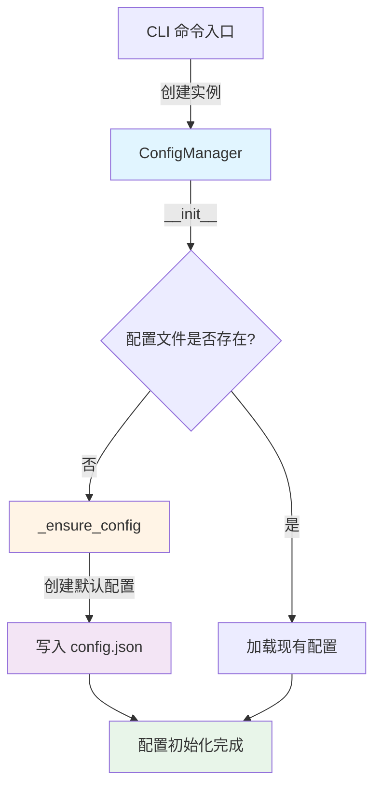
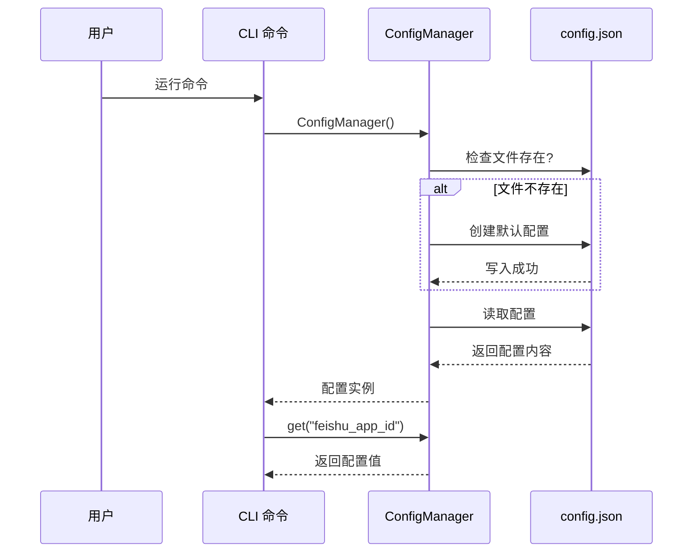

# 业务配置初始化环节分析

## 📋 分析目标

分析项目中业务配置（`~/.nanobot-runner/config.json`）在哪个环节被初始化。

## 🔍 核心发现

### 业务配置初始化流程



---

## 📂 配置文件位置

**业务配置文件**: `~/.nanobot-runner/config.json`

**框架配置文件**: `~/.nanobot/config.json`

**重要**: 两者是独立的，业务配置在 `~/.nanobot-runner/` 目录下。

---

## 🔧 初始化环节详解

### 1. ConfigManager 类初始化

**位置**: [src/core/config.py](file://d:\yecll\Documents\LocalCode\RunFlowAgent\src\core\config.py#L10-L66)

```python
class ConfigManager:
    """配置管理器，管理项目配置和本地数据目录"""

    def __init__(self):
        """初始化配置管理器"""
        # 1. 设置目录路径
        self.base_dir = Path.home() / ".nanobot-runner"
        self.data_dir = self.base_dir / "data"
        self.config_file = self.base_dir / "config.json"
        self.index_file = self.data_dir / "index.json"

        # 2. 确保目录存在
        self._ensure_dirs()

        # 3. 确保配置文件存在（关键环节）
        self._ensure_config()
```

### 2. 配置文件初始化逻辑

**位置**: [src/core/config.py:36-50](file://d:\yecll\Documents\LocalCode\RunFlowAgent\src\core\config.py#L36-L50)

```python
def _ensure_config(self):
    """确保配置文件存在"""
    if not self.config_file.exists():
        # 创建默认配置
        default_config = {
            "version": "0.1.0",
            "data_dir": str(self.data_dir),
            "auto_push_feishu": False,
            # 飞书应用机器人配置（推荐）
            "feishu_app_id": "",
            "feishu_app_secret": "",
            "feishu_receive_id": "",
            "feishu_receive_id_type": "user_id",
            # 兼容旧配置（已废弃）
            "feishu_webhook": "",
        }
        # 写入配置文件
        self.save_config(default_config)
```

**关键点**:
- ✅ 只在配置文件不存在时创建
- ✅ 创建包含所有默认值的配置文件
- ✅ 飞书配置默认为空字符串，需要用户手动配置

---

## 🎯 配置初始化触发时机

### 场景 1: CLI 命令直接创建

**示例**: `nanobotrun stats`

```python
# src/cli.py:209
def stats(...):
    config = ConfigManager()  # 触发配置初始化
    storage = StorageManager(config.data_dir)
    ...
```

**触发条件**:
- 用户首次运行任何 CLI 命令
- 配置文件不存在时自动创建

### 场景 2: ReportService 初始化

**示例**: `nanobotrun report --push`

```python
# src/core/report_service.py:36-46
def __init__(self, config: Optional[ConfigManager] = None, ...):
    self.config = config or ConfigManager()  # 触发配置初始化
    self.storage = storage or StorageManager(self.config.data_dir)
    ...
```

**触发条件**:
- 运行 report 命令
- 未传入 config 参数时自动创建

### 场景 3: FeishuBot 初始化

**示例**: `nanobotrun report --push`

```python
# src/notify/feishu.py:43-51
class FeishuAuth:
    def __init__(self, app_id: Optional[str] = None, ...):
        self.config = ConfigManager()  # 触发配置初始化
        self.app_id = app_id or self.config.get("feishu_app_id")
        self.app_secret = app_secret or self.config.get("feishu_app_secret")
        ...
```

```python
# src/notify/feishu.py:318-328
class FeishuBot:
    def __init__(self, ...):
        self.config = ConfigManager()  # 触发配置初始化
        self.auth = FeishuAuth(app_id=app_id, app_secret=app_secret)
        self.receive_id = receive_id or self.config.get("feishu_receive_id")
        ...
```

**触发条件**:
- 创建 FeishuAuth 实例时
- 创建 FeishuBot 实例时

### 场景 4: RunnerTools 初始化

**示例**: `nanobotrun chat` 或 `nanobotrun gateway`

```python
# src/agents/tools.py:435-438
def __init__(self, storage: Optional[StorageManager] = None):
    self.storage = storage or StorageManager()  # StorageManager 内部会触发
    self.analytics = AnalyticsEngine(self.storage)
    ...
```

**注意**: RunnerTools 本身不直接创建 ConfigManager，但 StorageManager 可能会间接触发。

### 场景 5: StorageManager 初始化

**示例**: 任何需要存储数据的操作

```python
# src/core/storage.py:19-29
def __init__(self, data_dir: Optional[Path] = None):
    self.data_dir = data_dir or Path.home() / ".nanobot-runner" / "data"
    # 注意: StorageManager 不创建 ConfigManager
    # 它直接使用默认路径或传入的路径
    ...
```

**注意**: StorageManager 不触发配置初始化，它直接使用默认路径。

---

## 📊 配置初始化调用链

### 典型调用链 1: CLI 命令

```
CLI 命令 (stats/report/import)
  ↓
ConfigManager()              # 首次触发配置初始化
  ↓
_ensure_config()             # 创建默认配置文件
  ↓
save_config(default_config)  # 写入 config.json
```

### 典型调用链 2: 飞书推送

```
nanobotrun report --push
  ↓
ReportService()
  ↓
ConfigManager()              # 首次触发配置初始化
  ↓
FeishuBot()
  ↓
FeishuAuth()
  ↓
ConfigManager()              # 再次创建实例（单例模式未实现）
  ↓
config.get("feishu_app_id")  # 读取配置
```

### 典型调用链 3: Gateway 启动

```
nanobotrun gateway
  ↓
StorageManager()             # 不触发配置初始化
  ↓
RunnerTools(storage)
  ↓
AgentLoop()
  ↓
ChannelManager(config)       # 使用框架配置，非业务配置
```

**注意**: Gateway 主要使用框架配置（`~/.nanobot/config.json`），而非业务配置。

---

## 🔄 配置读取流程

### 读取配置值

```python
# 方式 1: 通过 ConfigManager 实例
config = ConfigManager()
app_id = config.get("feishu_app_id")

# 方式 2: 通过模块级单例（如果存在）
from src.core.config import config
app_id = config.get("feishu_app_id")
```

**注意**: 当前实现中，每次 `ConfigManager()` 都会创建新实例，不是单例模式。

---

## ⚠️ 潜在问题

### 问题 1: 多次实例化

**现象**: 每次调用 `ConfigManager()` 都会创建新实例

**影响**:
- 重复检查配置文件是否存在
- 重复读取配置文件
- 性能开销（虽然很小）

**示例**:
```python
# 在 ReportService 中
config = ConfigManager()  # 第 1 次实例化

# 在 FeishuBot 中
self.config = ConfigManager()  # 第 2 次实例化

# 在 FeishuAuth 中
self.config = ConfigManager()  # 第 3 次实例化
```

### 问题 2: 配置文件路径硬编码

**现象**: 配置文件路径在 `ConfigManager.__init__` 中硬编码

**影响**:
- 无法灵活切换配置文件位置
- 测试时难以 mock

### 问题 3: 无配置验证

**现象**: 只检查配置文件是否存在，不验证配置内容

**影响**:
- 配置项缺失时不会提示
- 配置值格式错误时不会提示

---

## 💡 优化建议

### 建议 1: 实现单例模式

```python
# src/core/config.py
class ConfigManager:
    _instance: Optional["ConfigManager"] = None

    def __new__(cls):
        if cls._instance is None:
            cls._instance = super().__new__(cls)
            cls._instance._initialize()
        return cls._instance

    def _initialize(self):
        """初始化配置管理器"""
        self.base_dir = Path.home() / ".nanobot-runner"
        self.data_dir = self.base_dir / "data"
        self.config_file = self.base_dir / "config.json"
        self._ensure_dirs()
        self._ensure_config()
```

**优点**:
- ✅ 避免重复实例化
- ✅ 全局共享配置状态
- ✅ 提高性能

### 建议 2: 添加配置验证

```python
def _validate_config(self, config: dict) -> bool:
    """验证配置项"""
    required_fields = ["version", "data_dir"]

    for field in required_fields:
        if field not in config:
            logger.warning(f"配置项缺失: {field}")
            return False

    return True
```

### 建议 3: 支持配置文件路径参数

```python
def __init__(self, config_path: Optional[Path] = None):
    """初始化配置管理器"""
    self.config_file = config_path or Path.home() / ".nanobot-runner" / "config.json"
    ...
```

**优点**:
- ✅ 灵活切换配置文件
- ✅ 便于测试

---

## 📝 总结

### 配置初始化环节

**核心环节**: `ConfigManager.__init__` → `_ensure_config()`

**触发时机**:
1. ✅ CLI 命令首次运行（stats/report/import 等）
2. ✅ ReportService 初始化
3. ✅ FeishuBot 初始化
4. ✅ FeishuAuth 初始化

**初始化逻辑**:
1. 检查配置文件是否存在
2. 不存在则创建默认配置
3. 写入 `~/.nanobot-runner/config.json`

**配置内容**:
```json
{
  "version": "0.1.0",
  "data_dir": "~/.nanobot-runner/data",
  "auto_push_feishu": false,
  "feishu_app_id": "",
  "feishu_app_secret": "",
  "feishu_receive_id": "",
  "feishu_receive_id_type": "user_id",
  "feishu_webhook": ""
}
```

### 关键要点

1. **懒加载**: 配置在首次需要时才初始化
2. **幂等性**: 多次调用不会覆盖已有配置
3. **默认值**: 所有配置项都有默认值
4. **独立管理**: 业务配置与框架配置分离

### 配置使用流程



---

## 🎓 最佳实践

### 1. 配置管理

```python
# 推荐: 使用模块级单例
from src.core.config import config

app_id = config.get("feishu_app_id")

# 不推荐: 每次创建新实例
config = ConfigManager()
app_id = config.get("feishu_app_id")
```

### 2. 配置更新

```python
# 更新配置
config = ConfigManager()
config.set("feishu_app_id", "cli_xxx")

# 批量更新
config_data = config.load_config()
config_data["feishu_app_id"] = "cli_xxx"
config_data["feishu_app_secret"] = "xxx"
config.save_config(config_data)
```

### 3. 配置检查

```python
# 检查配置是否完整
config = ConfigManager()

if not config.get("feishu_app_id"):
    print("请先配置飞书应用 ID")

if not config.get("feishu_app_secret"):
    print("请先配置飞书应用密钥")
```

---

## 📚 相关文件

- [src/core/config.py](file://d:\yecll\Documents\LocalCode\RunFlowAgent\src\core\config.py) - 配置管理器实现
- [src/core/report_service.py](file://d:\yecll\Documents\LocalCode\RunFlowAgent\src\core\report_service.py) - 报告服务
- [src/notify/feishu.py](file://d:\yecll\Documents\LocalCode\RunFlowAgent\src\notify\feishu.py) - 飞书机器人
- [src/cli.py](file://d:\yecll\Documents\LocalCode\RunFlowAgent\src\cli.py) - CLI 命令入口
