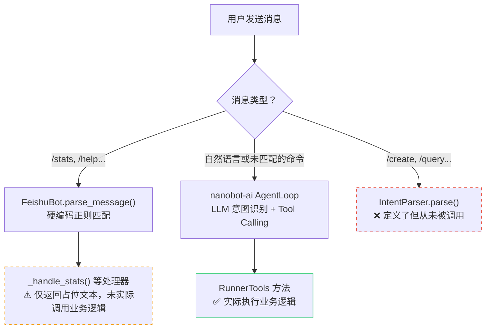
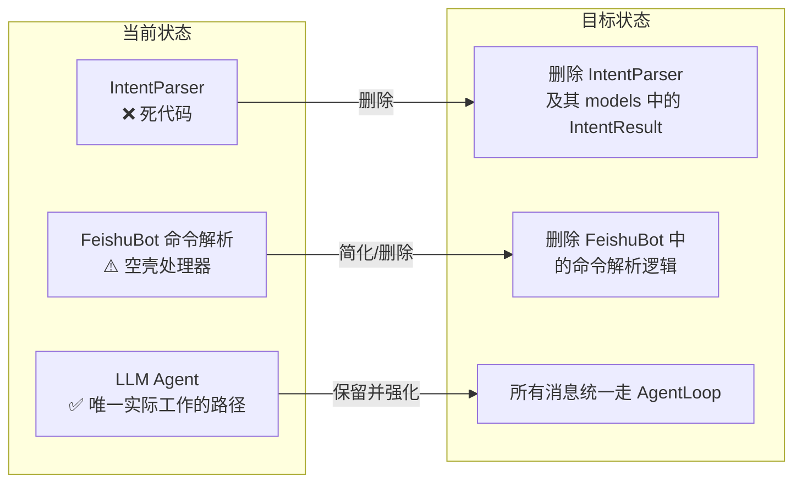

The user is asking about the "intent parser module" (意图解析器模块) in the project, specifically whether some tools use it and some slash commands don't, and whether they should. Let me first understand the intent parser module and how it's used across the project.
让我先全面了解意图解析器模块的实现以及它在项目中的使用情况。
现在让我看看 `IntentParser` 实际在哪里被使用，以及其他斜杠命令是如何处理的。
让我再看看飞书通知中的斜杠命令处理逻辑和 Agent 工具中的命令处理方式。
让我进一步看飞书侧的命令解析机制（`CommandParser`）以及它和 `IntentParser` 的关系。
现在让我看看 gateway 中消息是如何路由的——哪些走了 Agent（LLM），哪些走了斜杠命令解析。
现在让我看看 gateway 是如何调度消息的——是走 Agent 还是走命令解析。
让我再看看 gateway 中 Agent loop 是如何处理消息的——斜杠命令是否由 nanobot-ai 框架直接路由。
现在让我看看 Agent 的工具列表和 LLM 如何处理消息路由。
现在让我看看 nanobot-ai 框架如何处理消息——特别是 Agent 是否已经内置了斜杠命令路由。
现在让我看 `GenerateTrainingPlanTool` 的实现，了解训练计划工具如何与 IntentParser 交互。
现在我已经全面了解了项目的意图解析机制。让我梳理清楚整个命令路由体系，然后给出分析建议。

---

# 意图解析器（IntentParser）使用分析与建议

## 一、现状梳理：两套并行的命令路由体系

经过代码调查，项目中存在**两套完全独立且互不关联**的命令处理机制：

### 体系 A：`IntentParser`（位于 `src/core/plan/intent_parser.py`）

覆盖的命令：
| 斜杠命令 | 对应意图 |
|---------|---------|
| `/create` | `create_plan` — 创建训练计划 |
| `/modify` | `modify_plan` — 修改训练计划 |
| `/query` | `query_plan` — 查询训练计划 |
| `/cancel` | `cancel_plan` — 取消训练计划 |
| `/sync` | `sync_calendar` — 同步日历 |
| `/progress` | `query_progress` — 查询进度 |

**关键发现**：`IntentParser` **从未被任何业务代码调用**。搜索结果显示它只出现在：
- 自身的定义文件 `intent_parser.py`
- 包导出 `__init__.py`
- 测试文件 `test_intent_parser.py`

### 体系 B：`FeishuBot.parse_message()`（位于 `src/notify/feishu.py`）

覆盖的命令：
| 斜杠命令 | 对应 `CommandType` |
|---------|---------|
| `/stats` `/统计` | `STATS` |
| `/import` `/导入` | `IMPORT` |
| `/help` `/帮助` | `HELP` |
| `/recent` `/最近` | `RECENT` |
| `/vd` `/vdot` | `VD` |
| `/hr_drift` `/心率漂移` | `HR_DRIFT` |
| `/load` `/负荷` | `LOAD` |

### 体系 C：LLM Agent Tool Calling（nanobot-ai + `RunnerTools`）

这是**真正的运行时路由机制**。用户在飞书发送的**自然语言消息和斜杠命令**，都会进入 nanobot-ai 的 `AgentLoop`，由 LLM 根据已注册的工具描述（`create_tools()` 返回的 10 个 `BaseTool`）决定调用哪个工具。

工具列表：`get_running_stats`、`get_recent_runs`、`calculate_vdot_for_run`、`get_vdot_trend`、`get_hr_drift_analysis`、`get_training_load`、`query_by_date_range`、`query_by_distance`、`update_memory`、`generate_training_plan`。

### 关系图



---

## 二、核心问题诊断

### 问题 1：`IntentParser` 是死代码

这是最关键的问题。`IntentParser` 虽然写完整了（334 行代码 + 完整的测试），但**没有任何代码路径导入并调用它**。它的职责（意图识别 + 参数提取）实际上由 LLM Agent 自己完成了：

- 用户说「帮我制定一个半马训练计划」 → LLM 识别出意图 → 调用 `generate_training_plan` 工具（参数 `goal_distance_km=21.0975`）
- `IntentParser` 做的事情（关键词匹配提取意图、正则提取距离参数）与 LLM 的能力**完全重复**

### 问题 2：`FeishuBot` 的命令处理器是空壳

`feishu.py` 中的命令处理器（`_handle_stats`、`_handle_vd`、`_handle_load` 等）只返回**占位文本**，没有实际调用 `RunnerTools` 或 `AnalyticsEngine`：

```startLine:552:558:d:\yecll\Documents\LocalCode\RunFlowAgent\src\notify\feishu.py
    def _handle_vd(self, cmd: ParsedCommand) -> Dict[str, Any]:
        """处理 VDOT 趋势命令"""
        return {
            "success": True,
            "message": "查询 VDOT 趋势分析",
            "msg_type": "text",
        }
```

这意味着 `/vd`、`/hr_drift`、`/load` 等命令在飞书渠道中**无法返回真实数据**。

### 问题 3：两套命令集互不兼容

| 命令 | `IntentParser` | `FeishuBot` | LLM Agent |
|------|:---:|:---:|:---:|
| 查看统计 | - | `/stats` | ✅ 自然语言 |
| VDOT 趋势 | - | `/vd` | ✅ 自然语言 |
| 创建计划 | `/create` | - | ✅ 自然语言 |
| 修改计划 | `/modify` | - | - |
| 同步日历 | `/sync` | - | - |
| 查询进度 | `/progress` | - | - |
| 导入数据 | - | `/import` | - |

---

## 三、我的建议

### 核心结论：**不需要使用 IntentParser，应该将其删除**

原因如下：

### 3.1 LLM 已经是更好的意图解析器

在 Agent 架构下，LLM + Tool Calling 就是天然的意图解析器。它具备：

- **远超正则/关键词匹配的语义理解能力**——能理解「最近一个月跑了多少」和「上个月跑量」是同一个意思
- **参数提取能力**——从自然语言中提取结构化参数（距离、日期、时间）
- **上下文理解**——结合对话历史判断意图（「帮我调整一下」→ 根据上文知道是调整什么）

`IntentParser` 的关键词匹配方案（`sum(1 for keyword in keywords if keyword in text)`）本质上是一个**简陋的 LLM 替代品**，在 Agent 架构中完全多余。

### 3.2 `FeishuBot` 的命令解析应该与 Agent 集成

当前 `FeishuBot` 的硬编码命令解析是一个历史遗留问题。正确的做法是：

**方案：斜杠命令统一走 AgentLoop**

```
用户消息 → nanobot-ai 框架的 ChannelManager
  → 斜杠命令（如 /stats）直接透传给 AgentLoop
  → AgentLoop 的 LLM 将斜杠命令映射为工具调用
  → 返回结果
```

nanobot-ai 框架本身已经处理了消息的接收和分发，斜杠命令不需要单独解析。LLM 完全能理解 `/stats --year 2025` 这样的命令并调用 `get_running_stats` 工具。

如果一定要保留**快速响应**的斜杠命令（跳过 LLM，直接返回），那么 `FeishuBot` 的处理器应该**实际调用 `RunnerTools`** 而不是返回占位文本。

### 3.3 推荐的具体行动



| 优先级 | 行动 | 理由 |
|:---:|------|------|
| **P0** | 删除 `IntentParser`、`IntentResult`、`IntentType`、`InputType` 相关代码 | 死代码，增加维护负担 |
| **P0** | 删除 `FeishuBot` 中的 `_extract_command_type`、`_extract_command_args`、`parse_message` 及所有空壳 `_handle_*` 方法 | 功能不存在，误导开发者 |
| **P1** | 如果飞书渠道需要命令帮助，在 Agent 的 system prompt 中描述支持的斜杠命令即可 | LLM 能处理，无需硬编码解析 |
| **P2** | 考虑将 `/import` 保留为非 LLM 路径（涉及文件系统操作，LLM 调用可能不够直接） | 安全性考量 |

### 3.4 唯一的例外场景

如果未来项目计划支持**无 LLM 的离线 CLI 模式**（比如 `nanobotrun plan create --goal half-marathon`），此时需要一个非 LLM 的意图解析层。在这种情况下：

- 不应复用当前的 `IntentParser`（正则方案太脆弱）
- 应该使用**Typer 的命令行参数解析**（项目已经用了 Typer），即定义 `@app.command()` 子命令
- 参数提取由 Typer 的类型系统自动完成，远比正则可靠

---

## 四、总结

| 问题 | 现状 | 建议 |
|------|------|------|
| `IntentParser` 是否应被使用？ | 已定义但从未被调用，与 LLM 能力完全重复 | **不应使用，应删除** |
| 飞书斜杠命令是否需要 `IntentParser`？ | 不需要，两套系统互不兼容 | 统一走 AgentLoop |
| 训练计划相关命令如何路由？ | `IntentParser` 定义了 `/create` `/modify` 等，但未接入 | 由 LLM Agent 的 `generate_training_plan` 工具处理即可 |

一句话概括：**在有 LLM Agent 的架构中，手写意图解析器是架构上的冗余层，不仅没有价值，反而增加不一致的风险。**