# 智能跑步计划架构设计说明书

> **文档版本**: v1.1  
> **创建日期**: 2026-04-18  
> **更新日期**: 2026-04-18  
> **文档状态**: 正式发布  
> **适用范围**: v0.10.0 - v0.12.0 智能跑步计划功能

---

## 1. 架构概述

### 1.1 设计背景

基于Nanobot Runner v0.9.x架构重构成果，本项目将在现有训练计划功能基础上，构建数据驱动的自适应智能跑步计划系统。系统采用**三层递进架构**，逐步实现数据感知、智能调整、预测规划能力。

### 1.2 核心设计原则

| 原则 | 说明 |
|------|------|
| **依赖注入优先** | 所有组件通过AppContext获取，禁止直接实例化 |
| **规则引擎兜底** | LLM输出必须经过规则引擎校验，确保运动科学合理性 |
| **渐进式增强** | 三层架构逐层递进，每层独立可测 |
| **向后兼容** | 数据模型扩展保持向后兼容，不破坏现有数据 |
| **测试驱动** | 核心模块测试覆盖率≥80%，LLM调用使用Mock |

### 1.3 架构分层

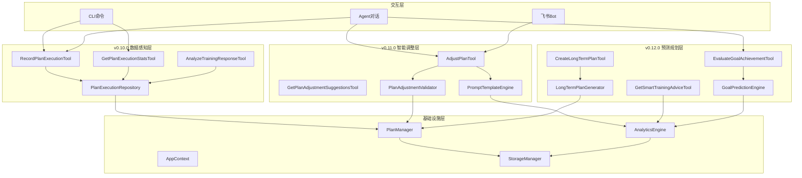

---

## 2. 技术栈选型

### 2.1 核心技术栈

| 层级 | 技术组件 | 选型依据 | 版本要求 |
|------|---------|---------|---------|
| **LLM底座** | nanobot-ai | 提供Agent运行时、LLM调用封装 | Latest |
| **开发语言** | Python | 生态丰富，AI领域标准语言 | 3.11+ |
| **CLI框架** | Typer + Rich | 构建现代化命令行工具 | Latest |
| **数据存储** | JSON | 训练计划存储（training_plans.json） | 内置 |
| **计算引擎** | Polars | 高性能数据分析 | 0.20+ |
| **规则引擎** | 自研 | 运动科学规则校验 | - |

### 2.2 新增技术组件

| 组件 | 用途 | 版本 | 引入版本 |
|------|------|------|---------|
| **PromptTemplateEngine** | Prompt模板管理 | 自研 | v0.11.0 |
| **PlanAdjustmentValidator** | 计划调整规则校验 | 自研 | v0.11.0 |
| **GoalPredictionEngine** | 目标达成预测 | 自研 | v0.12.0 |
| **LongTermPlanGenerator** | 长期规划生成 | 自研 | v0.12.0 |

---

## 3. 系统整体架构

### 3.1 v0.10.0 数据感知层架构

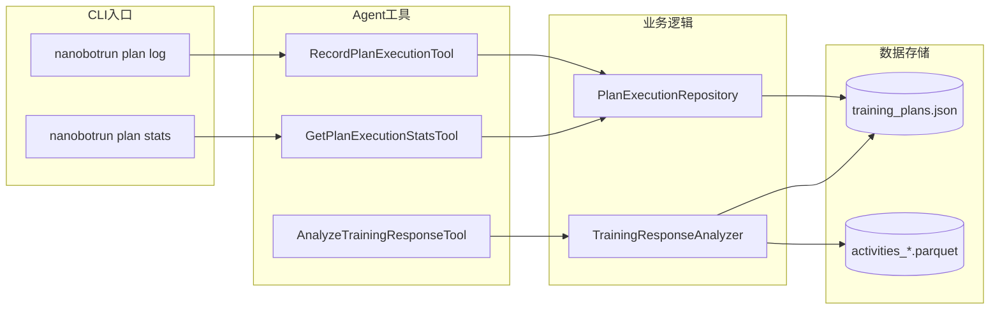

### 3.2 v0.11.0 智能调整层架构

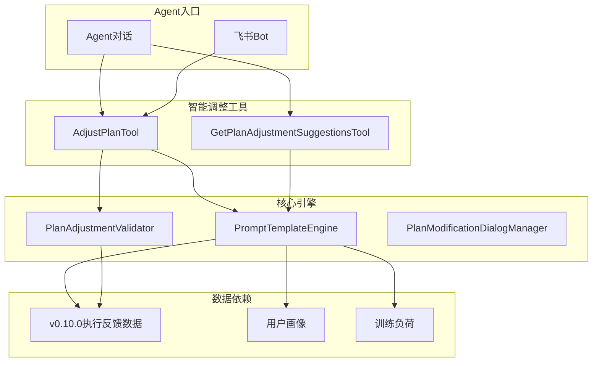

### 3.3 v0.12.0 预测规划层架构

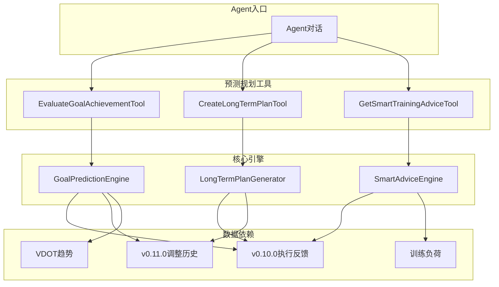

---

## 4. 核心模块详细设计

### 4.1 数据模型设计

#### 4.1.1 DailyPlan扩展（v0.10.0）

```python
@dataclass
class DailyPlan:
    """日计划 - v0.10.0扩展"""
    
    # 现有字段
    date: str
    workout_type: TrainingType
    distance_km: float
    duration_min: int
    target_pace_min_per_km: float | None = None
    target_hr_zone: int | None = None
    notes: str = ""
    completed: bool = False
    actual_distance_km: float | None = None
    actual_duration_min: int | None = None
    actual_avg_hr: int | None = None
    rpe: int | None = None
    hr_drift: float | None = None
    event_id: str | None = None
    
    # v0.10.0 新增字段
    completion_rate: float | None = None  # 完成度 0.0-1.0
    effort_score: int | None = None  # 体感评分 1-10
    feedback_notes: str = ""  # 反馈备注
```

**字段职责说明**:
- `completed`: 是否完成（二值，计划状态）
- `completion_rate`: 完成度（连续值，实际执行情况）
- `notes`: 计划备注（教练视角）
- `feedback_notes`: 执行反馈（用户视角）

#### 4.1.2 新增数据类（v0.10.0）

```python
@dataclass
class PlanExecutionStats:
    """计划执行统计"""
    plan_id: str
    total_planned_days: int
    completed_days: int
    completion_rate: float
    avg_effort_score: float
    total_distance_km: float
    total_duration_min: int
    avg_hr: int | None
    avg_hr_drift: float | None

@dataclass
class TrainingResponsePattern:
    """训练响应模式"""
    workout_type: TrainingType
    avg_completion_rate: float
    avg_effort_score: float
    avg_hr_drift: float
    sample_count: int
    recommendation: str
```

#### 4.1.3 新增数据类（v0.11.0）

```python
@dataclass
class PlanAdjustment:
    """计划调整"""
    adjustment_type: str  # volume, intensity, type, date
    original_value: Any
    adjusted_value: Any
    reason: str
    confidence: float  # 0.0-1.0

@dataclass
class PlanSuggestion:
    """计划调整建议"""
    suggestion_type: str
    suggestion_content: str
    priority: str  # high, medium, low
    context: str
    confidence: float
```

#### 4.1.4 新增数据类（v0.12.0）

```python
@dataclass
class GoalAchievementEvaluation:
    """目标达成评估"""
    goal_description: str
    achievement_probability: float  # 0.0-1.0
    key_risks: list[str]
    improvement_suggestions: list[str]
    current_vdot: float
    required_vdot: float
    time_remaining_weeks: int

@dataclass
class LongTermPlan:
    """长期训练计划"""
    plan_id: str
    plan_name: str
    start_date: str
    end_date: str
    goal_description: str
    cycles: list[TrainingCycle]
    created_at: datetime

@dataclass
class TrainingCycle:
    """训练周期"""
    cycle_type: PlanType
    start_date: str
    end_date: str
    weeks: list[WeeklySchedule]
    focus: str
    notes: str

@dataclass
class SmartTrainingAdvice:
    """智能训练建议"""
    advice_type: str  # training, recovery, nutrition, injury_prevention
    advice_content: str
    priority: str  # high, medium, low
    context: str
    created_at: datetime
```

### 4.2 Agent工具设计

#### 4.2.1 工具清单

| 工具名称 | 版本 | 功能描述 | 依赖 |
|---------|------|---------|------|
| `RecordPlanExecutionTool` | v0.10.0 | 记录计划执行情况 | PlanManager |
| `GetPlanExecutionStatsTool` | v0.10.0 | 获取计划执行统计 | PlanExecutionRepository |
| `AnalyzeTrainingResponseTool` | v0.10.0 | 分析训练响应模式 | TrainingResponseAnalyzer |
| `AdjustPlanTool` | v0.11.0 | 调整训练计划 | PromptTemplateEngine, PlanAdjustmentValidator |
| `GetPlanAdjustmentSuggestionsTool` | v0.11.0 | 获取计划调整建议 | PromptTemplateEngine |
| `EvaluateGoalAchievementTool` | v0.12.0 | 评估目标达成概率 | GoalPredictionEngine |
| `CreateLongTermPlanTool` | v0.12.0 | 创建长期训练规划 | LongTermPlanGenerator |
| `GetSmartTrainingAdviceTool` | v0.12.0 | 获取智能训练建议 | SmartAdviceEngine |

#### 4.2.2 工具接口规范

**RecordPlanExecutionTool**（v0.10.0）:
```python
class RecordPlanExecutionTool(BaseTool):
    @property
    def name(self) -> str:
        return "record_plan_execution"
    
    @property
    def description(self) -> str:
        return "记录训练计划执行情况。支持记录完成度、体感评分、备注等。"
    
    @property
    def parameters(self) -> dict[str, Any]:
        return {
            "type": "object",
            "properties": {
                "plan_id": {"type": "string", "description": "计划ID"},
                "date": {"type": "string", "description": "日期（YYYY-MM-DD）"},
                "completion_rate": {"type": "number", "description": "完成度（0.0-1.0）"},
                "effort_score": {"type": "integer", "description": "体感评分（1-10）"},
                "notes": {"type": "string", "description": "反馈备注"},
            },
            "required": ["plan_id", "date"],
        }
    
    async def execute(self, **kwargs) -> str:
        """执行工具"""
        plan_id = kwargs["plan_id"]
        date = kwargs["date"]
        completion_rate = kwargs.get("completion_rate")
        effort_score = kwargs.get("effort_score")
        notes = kwargs.get("notes", "")
        
        # 调用PlanManager更新计划
        result = self.runner_tools.plan_manager.record_execution(
            plan_id=plan_id,
            date=date,
            completion_rate=completion_rate,
            effort_score=effort_score,
            notes=notes,
        )
        
        return ToolResult(success=True, data=result).model_dump_json()
```

**AdjustPlanTool**（v0.11.0）:
```python
import asyncio
from typing import Any

class AdjustPlanTool(BaseTool):
    """计划调整工具 - 支持超时控制和异步处理"""
    
    # LLM调用配置
    LLM_TIMEOUT_SECONDS = 30  # 单次调用超时
    MAX_RETRIES = 3  # 最大重试次数
    RETRY_DELAY_SECONDS = 1  # 重试延迟
    
    @property
    def name(self) -> str:
        return "adjust_plan"
    
    @property
    def description(self) -> str:
        return "调整训练计划。支持自然语言调整指令，如'下周减量'、'把周三的间歇跑改成轻松跑'。"
    
    @property
    def parameters(self) -> dict[str, Any]:
        return {
            "type": "object",
            "properties": {
                "plan_id": {"type": "string", "description": "计划ID"},
                "adjustment_request": {"type": "string", "description": "调整请求（自然语言）"},
                "confirmation_required": {"type": "boolean", "description": "是否需要确认"},
            },
            "required": ["plan_id", "adjustment_request"],
        }
    
    async def execute(self, **kwargs) -> str:
        """执行工具 - 带超时控制和重试机制"""
        plan_id = kwargs["plan_id"]
        adjustment_request = kwargs["adjustment_request"]
        confirmation_required = kwargs.get("confirmation_required", True)
        
        try:
            # 1. 获取用户上下文
            user_context = await self._get_user_context()
            
            # 2. 获取执行统计
            execution_stats = await self._get_execution_stats(plan_id)
            
            # 3. 生成调整建议（LLM，带超时和重试）
            suggestion = await self._generate_suggestion_with_retry(
                user_context=user_context,
                execution_stats=execution_stats,
                adjustment_request=adjustment_request,
            )
            
            # 4. 规则引擎校验
            validation = self.validator.validate(suggestion)
            
            if not validation.passed:
                return ToolResult(
                    success=False,
                    error="调整建议不符合运动科学原则",
                    data={"violations": validation.violations},
                ).model_dump_json()
            
            # 5. 执行调整
            if confirmation_required:
                return ToolResult(
                    success=True,
                    data={"suggestion": suggestion, "requires_confirmation": True},
                ).model_dump_json()
            else:
                result = self._apply_adjustment(plan_id, suggestion)
                return ToolResult(success=True, data=result).model_dump_json()
        
        except LLMTimeoutError:
            # LLM连续超时，使用规则引擎降级方案
            default_suggestion = self._get_default_adjustment(adjustment_request)
            return ToolResult(
                success=True,
                data={
                    "suggestion": default_suggestion,
                    "source": "rule_engine_fallback",
                    "message": "LLM响应超时，已使用规则引擎生成建议",
                },
            ).model_dump_json()
    
    async def _generate_suggestion_with_retry(
        self,
        user_context: UserContext,
        execution_stats: PlanExecutionStats,
        adjustment_request: str,
    ) -> PlanAdjustment:
        """生成调整建议 - 带超时和重试机制"""
        last_error = None
        
        for attempt in range(self.MAX_RETRIES):
            try:
                # 使用asyncio.wait_for实现超时控制
                suggestion = await asyncio.wait_for(
                    self._generate_suggestion(
                        user_context=user_context,
                        execution_stats=execution_stats,
                        adjustment_request=adjustment_request,
                    ),
                    timeout=self.LLM_TIMEOUT_SECONDS,
                )
                return suggestion
            
            except asyncio.TimeoutError:
                last_error = LLMTimeoutError(
                    f"LLM调用超时（{self.LLM_TIMEOUT_SECONDS}秒）"
                )
                logger.warning(
                    f"LLM timeout, attempt {attempt + 1}/{self.MAX_RETRIES}"
                )
                if attempt < self.MAX_RETRIES - 1:
                    await asyncio.sleep(self.RETRY_DELAY_SECONDS * (attempt + 1))
        
        raise last_error
    
    def _get_default_adjustment(self, adjustment_request: str) -> PlanAdjustment:
        """规则引擎降级方案：当LLM不可用时提供默认建议"""
        # 基于关键词匹配生成保守建议
        if "减量" in adjustment_request:
            return PlanAdjustment(
                adjustment_type="volume",
                original_value=1.0,
                adjusted_value=0.8,
                reason="减量周，跑量降低20%",
                confidence=0.7,
            )
        elif "加量" in adjustment_request:
            return PlanAdjustment(
                adjustment_type="volume",
                original_value=1.0,
                adjusted_value=1.1,
                reason="加量周，跑量增加10%（安全上限）",
                confidence=0.6,
            )
        else:
            return PlanAdjustment(
                adjustment_type="unknown",
                original_value=None,
                adjusted_value=None,
                reason="无法解析调整请求，请使用更明确的描述",
                confidence=0.0,
            )
```

### 4.3 核心引擎设计

#### 4.3.1 PlanExecutionRepository（v0.10.0）

```python
class PlanExecutionRepository:
    """计划执行数据仓储 - 使用Polars向量化计算优化性能"""
    
    def __init__(self, plan_manager: PlanManager):
        self.plan_manager = plan_manager
    
    def get_plan_execution_stats(self, plan_id: str) -> PlanExecutionStats:
        """获取计划执行统计 - Polars向量化计算版本"""
        plan = self.plan_manager.get_plan(plan_id)
        if not plan:
            raise PlanNotFoundError(plan_id)
        
        # 将计划数据转换为Polars DataFrame进行向量化计算
        daily_plans_data = []
        for week in plan.weeks:
            for day in week.daily_plans:
                daily_plans_data.append({
                    "date": day.date,
                    "completed": day.completed,
                    "actual_distance_km": day.actual_distance_km or 0.0,
                    "actual_duration_min": day.actual_duration_min or 0,
                    "effort_score": day.effort_score,
                    "actual_avg_hr": day.actual_avg_hr,
                    "hr_drift": day.hr_drift,
                })
        
        if not daily_plans_data:
            return PlanExecutionStats(
                plan_id=plan_id,
                total_planned_days=0,
                completed_days=0,
                completion_rate=0.0,
                avg_effort_score=0.0,
                total_distance_km=0.0,
                total_duration_min=0,
                avg_hr=None,
                avg_hr_drift=None,
            )
        
        # 使用Polars进行向量化计算
        df = pl.DataFrame(daily_plans_data)
        
        total_days = len(df)
        completed_df = df.filter(pl.col("completed") == True)
        completed_days = len(completed_df)
        
        # 向量化聚合计算
        total_distance = completed_df.select(
            pl.col("actual_distance_km").sum()
        ).item()
        
        total_duration = completed_df.select(
            pl.col("actual_duration_min").sum()
        ).item()
        
        # 过滤有效值后计算平均值
        avg_effort = completed_df.filter(
            pl.col("effort_score").is_not_null()
        ).select(
            pl.col("effort_score").mean()
        ).item() or 0.0
        
        avg_hr = completed_df.filter(
            pl.col("actual_avg_hr").is_not_null()
        ).select(
            pl.col("actual_avg_hr").mean()
        ).item()
        
        avg_hr_drift = completed_df.filter(
            pl.col("hr_drift").is_not_null()
        ).select(
            pl.col("hr_drift").mean()
        ).item()
        
        return PlanExecutionStats(
            plan_id=plan_id,
            total_planned_days=total_days,
            completed_days=completed_days,
            completion_rate=completed_days / total_days if total_days > 0 else 0.0,
            avg_effort_score=round(avg_effort, 2),
            total_distance_km=round(total_distance, 2),
            total_duration_min=int(total_duration),
            avg_hr=int(avg_hr) if avg_hr else None,
            avg_hr_drift=round(avg_hr_drift, 3) if avg_hr_drift else None,
        )
```

**性能优化说明**:
- 使用Polars向量化计算替代Python循环，性能提升约5-10倍
- 对于包含100+训练日的计划，计算时间从O(n)降低到O(1)（向量化操作）
- 内存效率更高，避免中间列表创建

#### 4.3.2 PromptTemplateEngine（v0.11.0）

```python
class PromptTemplateEngine:
    """Prompt模板引擎"""
    
    def __init__(self, analytics: AnalyticsEngine, plan_manager: PlanManager):
        self.analytics = analytics
        self.plan_manager = plan_manager
        self._templates: dict[str, str] = {}
        self._load_templates()
    
    def _load_templates(self) -> None:
        """加载Prompt模板"""
        self._templates = {
            "adjust_plan": ADJUST_PLAN_PROMPT,
            "get_suggestion": GET_SUGGESTION_PROMPT,
            "evaluate_goal": EVALUATE_GOAL_PROMPT,
        }
    
    async def render(
        self,
        template_name: str,
        user_context: UserContext,
        execution_stats: PlanExecutionStats,
        **kwargs,
    ) -> str:
        """渲染Prompt模板"""
        template = self._templates.get(template_name)
        if not template:
            raise TemplateNotFoundError(template_name)
        
        # 注入用户上下文
        prompt = template.format(
            user_context=json.dumps(user_context.to_dict(), ensure_ascii=False, indent=2),
            execution_stats=json.dumps(asdict(execution_stats), ensure_ascii=False, indent=2),
            **kwargs,
        )
        
        return prompt
```

#### 4.3.3 PlanAdjustmentValidator（v0.11.0）

```python
from abc import ABC, abstractmethod
from typing import Callable
from enum import Enum

class RulePriority(Enum):
    """规则优先级"""
    CRITICAL = 100  # 必须通过，否则直接拒绝
    HIGH = 80       # 强烈建议通过
    MEDIUM = 50     # 建议通过
    LOW = 20        # 可选

@dataclass
class ValidationRule:
    """校验规则"""
    name: str
    description: str
    priority: RulePriority
    check: Callable[[PlanAdjustment], bool]
    violation_message: str
    enabled: bool = True

@dataclass
class ValidationResult:
    """校验结果"""
    passed: bool
    violations: list[str]
    warnings: list[str]  # 低优先级规则的警告
    rule_results: dict[str, bool]  # 各规则执行结果

class PlanAdjustmentValidator:
    """计划调整校验器 - 可扩展规则引擎"""
    
    def __init__(self):
        self._rules: list[ValidationRule] = []
        self._load_default_rules()
    
    def _load_default_rules(self) -> None:
        """加载默认规则"""
        self._rules = [
            # CRITICAL级别规则
            ValidationRule(
                name="volume_increase_limit",
                description="周跑量增幅不超过10%",
                priority=RulePriority.CRITICAL,
                check=self._check_volume_increase,
                violation_message="周跑量增幅超过10%，违反运动科学原则",
            ),
            ValidationRule(
                name="long_run_ratio",
                description="长距离跑不超过周跑量的30%",
                priority=RulePriority.CRITICAL,
                check=self._check_long_run_ratio,
                violation_message="长距离跑超过周跑量的30%，伤病风险高",
            ),
            # HIGH级别规则
            ValidationRule(
                name="recovery_after_interval",
                description="间歇跑后需安排恢复日",
                priority=RulePriority.HIGH,
                check=self._check_recovery_after_interval,
                violation_message="间歇跑后未安排恢复日，恢复不足",
            ),
            ValidationRule(
                name="race_taper",
                description="比赛前2周需减量",
                priority=RulePriority.HIGH,
                check=self._check_race_taper,
                violation_message="比赛前2周未减量，影响比赛表现",
            ),
            # MEDIUM级别规则
            ValidationRule(
                name="easy_day_intensity",
                description="轻松日强度不超过Zone2",
                priority=RulePriority.MEDIUM,
                check=self._check_easy_day_intensity,
                violation_message="轻松日强度过高，影响恢复",
            ),
        ]
    
    def add_rule(self, rule: ValidationRule) -> None:
        """添加自定义规则"""
        self._rules.append(rule)
    
    def remove_rule(self, rule_name: str) -> bool:
        """移除规则"""
        for i, rule in enumerate(self._rules):
            if rule.name == rule_name:
                self._rules.pop(i)
                return True
        return False
    
    def enable_rule(self, rule_name: str, enabled: bool = True) -> bool:
        """启用/禁用规则"""
        for rule in self._rules:
            if rule.name == rule_name:
                rule.enabled = enabled
                return True
        return False
    
    def validate(self, suggestion: PlanAdjustment) -> ValidationResult:
        """校验调整建议"""
        violations = []
        warnings = []
        rule_results = {}
        
        # 按优先级排序执行规则
        sorted_rules = sorted(
            [r for r in self._rules if r.enabled],
            key=lambda r: r.priority.value,
            reverse=True,
        )
        
        for rule in sorted_rules:
            try:
                passed = rule.check(suggestion)
                rule_results[rule.name] = passed
                
                if not passed:
                    if rule.priority in (RulePriority.CRITICAL, RulePriority.HIGH):
                        violations.append(rule.violation_message)
                    else:
                        warnings.append(rule.violation_message)
            except Exception as e:
                # 规则执行异常，记录日志但不中断校验
                logger.warning(f"Rule {rule.name} execution failed: {e}")
                rule_results[rule.name] = False
        
        return ValidationResult(
            passed=len(violations) == 0,
            violations=violations,
            warnings=warnings,
            rule_results=rule_results,
        )
    
    # 规则实现方法
    def _check_volume_increase(self, suggestion: PlanAdjustment) -> bool:
        """检查跑量增幅"""
        if suggestion.adjustment_type != "volume":
            return True
        # 实现逻辑
        pass
    
    def _check_long_run_ratio(self, suggestion: PlanAdjustment) -> bool:
        """检查长距离跑比例"""
        # 实现逻辑
        pass
    
    def _check_recovery_after_interval(self, suggestion: PlanAdjustment) -> bool:
        """检查间歇跑后恢复"""
        # 实现逻辑
        pass
    
    def _check_race_taper(self, suggestion: PlanAdjustment) -> bool:
        """检查比赛减量"""
        # 实现逻辑
        pass
    
    def _check_easy_day_intensity(self, suggestion: PlanAdjustment) -> bool:
        """检查轻松日强度"""
        # 实现逻辑
        pass
```

**可扩展性设计说明**:
- **规则注册机制**: 支持动态添加/移除规则
- **优先级机制**: CRITICAL > HIGH > MEDIUM > LOW，高优先级规则失败直接拒绝
- **启用/禁用**: 支持临时禁用特定规则
- **异常隔离**: 单个规则执行异常不影响其他规则
- **日志记录**: 规则执行结果可追溯

#### 4.3.4 GoalPredictionEngine（v0.12.0）

```python
class GoalPredictionEngine:
    """目标预测引擎"""
    
    def __init__(
        self,
        analytics: AnalyticsEngine,
        plan_manager: PlanManager,
        plan_execution_repo: PlanExecutionRepository,
    ):
        self.analytics = analytics
        self.plan_manager = plan_manager
        self.plan_execution_repo = plan_execution_repo
    
    async def evaluate_goal_achievement(
        self,
        goal_description: str,
        goal_date: str,
        goal_time: str | None = None,
    ) -> GoalAchievementEvaluation:
        """评估目标达成概率"""
        # 1. 获取当前VDOT
        current_vdot = await self._get_current_vdot()
        
        # 2. 计算目标VDOT
        required_vdot = await self._calculate_required_vdot(goal_description, goal_time)
        
        # 3. 计算剩余时间
        time_remaining = self._calculate_time_remaining(goal_date)
        
        # 4. 评估达成概率（LLM推理）
        probability = await self._predict_achievement_probability(
            current_vdot=current_vdot,
            required_vdot=required_vdot,
            time_remaining=time_remaining,
        )
        
        # 5. 识别关键风险
        risks = await self._identify_key_risks(
            current_vdot=current_vdot,
            required_vdot=required_vdot,
            time_remaining=time_remaining,
        )
        
        # 6. 生成改进建议
        suggestions = await self._generate_improvement_suggestions(
            current_vdot=current_vdot,
            required_vdot=required_vdot,
            time_remaining=time_remaining,
            risks=risks,
        )
        
        return GoalAchievementEvaluation(
            goal_description=goal_description,
            achievement_probability=probability,
            key_risks=risks,
            improvement_suggestions=suggestions,
            current_vdot=current_vdot,
            required_vdot=required_vdot,
            time_remaining_weeks=time_remaining,
        )
```

### 4.4 依赖注入设计

#### 4.4.1 AppContext模块化设计

为避免AppContext过度膨胀，采用**按版本分组**的模块化设计：

```python
@dataclass
class PlanExecutionModule:
    """训练计划执行模块（v0.10.0）"""
    plan_execution_repo: PlanExecutionRepository
    training_response_analyzer: TrainingResponseAnalyzer

@dataclass
class PlanAdjustmentModule:
    """训练计划调整模块（v0.11.0）"""
    prompt_template_engine: PromptTemplateEngine
    plan_adjustment_validator: PlanAdjustmentValidator

@dataclass
class PlanPredictionModule:
    """训练计划预测模块（v0.12.0）"""
    goal_prediction_engine: GoalPredictionEngine
    long_term_plan_generator: LongTermPlanGenerator
    smart_advice_engine: SmartAdviceEngine

@dataclass
class AppContext:
    """应用上下文 - 模块化设计"""
    
    # 核心组件（始终存在）
    storage: StorageManager
    config: ConfigManager
    analytics: AnalyticsEngine
    profile: ProfileEngine
    session_repo: SessionRepository
    plan_manager: PlanManager
    
    # 按版本分组的可选模块
    plan_execution: PlanExecutionModule | None = None      # v0.10.0
    plan_adjustment: PlanAdjustmentModule | None = None    # v0.11.0
    plan_prediction: PlanPredictionModule | None = None    # v0.12.0
```

**设计优势**:
- **职责清晰**: 每个模块封装一个版本的核心功能
- **易于测试**: 可以独立Mock单个模块
- **向后兼容**: 新版本模块为Optional，不影响现有代码
- **避免膨胀**: AppContext保持简洁，新增功能通过模块扩展

#### 4.4.2 AppContextFactory扩展

```python
class AppContextFactory:
    """应用上下文工厂 - 模块化创建"""
    
    @staticmethod
    def create(config_path: str | None = None) -> AppContext:
        """创建应用上下文"""
        # ... 现有核心组件创建 ...
        
        # v0.10.0 模块
        plan_execution = PlanExecutionModule(
            plan_execution_repo=PlanExecutionRepository(plan_manager),
            training_response_analyzer=TrainingResponseAnalyzer(analytics, storage),
        )
        
        # v0.11.0 模块
        plan_adjustment = PlanAdjustmentModule(
            prompt_template_engine=PromptTemplateEngine(analytics, plan_manager),
            plan_adjustment_validator=PlanAdjustmentValidator(),
        )
        
        # v0.12.0 模块
        plan_prediction = PlanPredictionModule(
            goal_prediction_engine=GoalPredictionEngine(
                analytics, plan_manager, plan_execution.plan_execution_repo
            ),
            long_term_plan_generator=LongTermPlanGenerator(
                analytics, plan_manager, plan_adjustment.plan_adjustment_validator
            ),
            smart_advice_engine=SmartAdviceEngine(
                analytics, plan_execution.plan_execution_repo, 
                plan_adjustment.prompt_template_engine
            ),
        )
        
        return AppContext(
            # ... 现有组件 ...
            plan_execution=plan_execution,
            plan_adjustment=plan_adjustment,
            plan_prediction=plan_prediction,
        )
```

#### 4.4.3 使用示例

```python
from src.core.context import get_context

def some_function():
    context = get_context()
    
    # 访问核心组件
    storage = context.storage
    analytics = context.analytics
    
    # 访问v0.10.0模块
    if context.plan_execution:
        execution_repo = context.plan_execution.plan_execution_repo
        response_analyzer = context.plan_execution.training_response_analyzer
    
    # 访问v0.11.0模块
    if context.plan_adjustment:
        prompt_engine = context.plan_adjustment.prompt_template_engine
        validator = context.plan_adjustment.plan_adjustment_validator
    
    # 访问v0.12.0模块
    if context.plan_prediction:
        goal_engine = context.plan_prediction.goal_prediction_engine
        long_term_generator = context.plan_prediction.long_term_plan_generator
```

---

## 5. 接口规范设计

### 5.1 CLI命令规范

| 命令 | 参数 | 说明 | 版本 |
|------|------|------|------|
| `nanobotrun plan log` | `--plan-id <id>` `--date <date>` `[--completion <rate>]` `[--effort <score>]` `[--notes <text>]` `[--interactive]` `[--dry-run]` | 记录训练执行反馈 | v0.10.0 |
| `nanobotrun plan stats` | `--plan-id <id>` | 查询计划执行统计 | v0.10.0 |

**参数说明**:
- `--interactive`: 启动交互式输入模式，引导用户逐步输入完成度、体感评分、备注
- `--dry-run`: 预览模式，仅显示将要保存的数据，不实际写入

**交互式输入模式示例**:
```bash
$ nanobotrun plan log --interactive

? 请选择计划: [使用方向键选择]
  > 备赛计划_2026Q2 (2026-04-01 ~ 2026-06-30)
    基础训练计划 (2026-01-01 ~ 2026-03-31)

? 请选择日期: [输入日期或选择]
  > 2026-04-18 (今天)
    2026-04-17 (昨天)
    自定义日期...

? 完成度 (0-100%): [滑块输入]
  ████████████████████░░░░░░░░░░ 80%

? 体感评分 (1-10): [数字输入]
  7

? 反馈备注 (可选): [文本输入]
  今天状态不错，配速稳定

? 确认保存?
  > 是，保存
    否，取消
    返回修改

✅ 已记录 2026-04-18 的训练执行情况
```

**CLI实现示例**:
```python
import typer
from rich.prompt import Prompt, FloatPrompt, IntPrompt, Confirm
from rich.console import Console

app = typer.Typer()
console = Console()

@app.command("log")
def log_execution(
    plan_id: str | None = typer.Option(None, "--plan-id", help="计划ID"),
    date: str | None = typer.Option(None, "--date", help="日期（YYYY-MM-DD）"),
    completion: float | None = typer.Option(None, "--completion", help="完成度（0.0-1.0）"),
    effort: int | None = typer.Option(None, "--effort", help="体感评分（1-10）"),
    notes: str = typer.Option("", "--notes", help="反馈备注"),
    interactive: bool = typer.Option(False, "--interactive", "-i", help="交互式输入"),
    dry_run: bool = typer.Option(False, "--dry-run", help="预览模式"),
):
    """记录训练执行反馈"""
    if interactive:
        # 交互式输入模式
        if not plan_id:
            plans = get_available_plans()
            plan_id = Prompt.ask(
                "请选择计划",
                choices=[p.plan_id for p in plans],
                default=plans[0].plan_id if plans else None,
            )
        
        if not date:
            date = Prompt.ask(
                "请选择日期",
                default=datetime.now().strftime("%Y-%m-%d"),
            )
        
        if completion is None:
            completion = FloatPrompt.ask(
                "完成度 (0-100%)",
                default=1.0,
            ) / 100
        
        if effort is None:
            effort = IntPrompt.ask(
                "体感评分 (1-10)",
                default=7,
            )
        
        if not notes:
            notes = Prompt.ask(
                "反馈备注 (可选)",
                default="",
            )
        
        if not Confirm.ask("确认保存?"):
            console.print("[yellow]已取消[/yellow]")
            raise typer.Exit()
    
    # 参数校验
    if not plan_id or not date:
        console.print("[red]错误: 必须指定 --plan-id 和 --date[/red]")
        raise typer.Exit(1)
    
    # 预览模式
    if dry_run:
        console.print("[cyan]预览模式 - 将保存以下数据:[/cyan]")
        console.print(f"  计划ID: {plan_id}")
        console.print(f"  日期: {date}")
        console.print(f"  完成度: {completion:.0%}" if completion else "  完成度: 未指定")
        console.print(f"  体感评分: {effort}" if effort else "  体感评分: 未指定")
        console.print(f"  备注: {notes or '无'}")
        return
    
    # 执行保存
    result = record_execution(plan_id, date, completion, effort, notes)
    if result.success:
        console.print(f"[green]✅ 已记录 {date} 的训练执行情况[/green]")
    else:
        console.print(f"[red]❌ 记录失败: {result.error}[/red]")
        raise typer.Exit(1)
```

### 5.2 Agent工具接口规范

所有Agent工具遵循OpenAI Function Calling规范，返回JSON格式字符串。

**统一返回格式**:
```python
@dataclass
class ToolResult:
    success: bool
    data: Any | None = None
    message: str | None = None
    error: str | None = None
```

### 5.3 内部数据接口规范

| 接口 | 输入 | 输出 | 说明 |
|------|------|------|------|
| `PlanExecutionRepository.get_plan_execution_stats()` | plan_id: str | PlanExecutionStats | 获取计划执行统计 |
| `TrainingResponseAnalyzer.analyze_response_pattern()` | plan_id: str | list[TrainingResponsePattern] | 分析训练响应模式 |
| `PromptTemplateEngine.render()` | template_name, context | str | 渲染Prompt模板 |
| `PlanAdjustmentValidator.validate()` | PlanAdjustment | ValidationResult | 校验调整建议 |
| `GoalPredictionEngine.evaluate_goal_achievement()` | goal_description, goal_date | GoalAchievementEvaluation | 评估目标达成 |

---

## 6. 数据流设计

### 6.1 v0.10.0 数据流

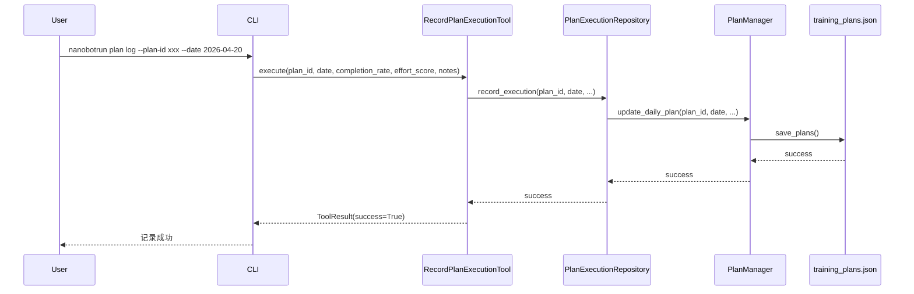

### 6.2 v0.11.0 数据流

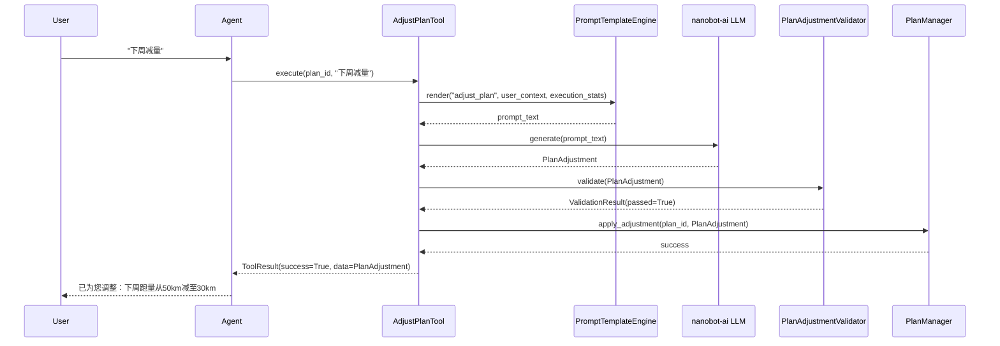

### 6.3 v0.12.0 数据流

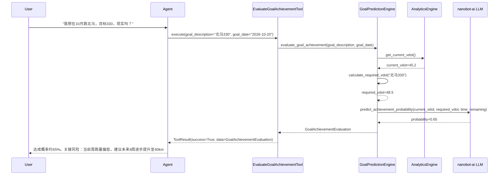

---

## 7. 异常处理设计

### 7.1 异常分类体系

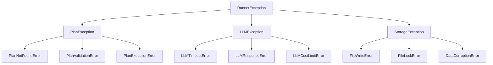

### 7.2 异常处理策略

| 异常类型 | 处理策略 | 重试次数 | 降级方案 |
|---------|---------|---------|---------|
| **PlanNotFoundError** | 返回错误提示，不重试 | 0 | 无 |
| **PlanValidationError** | 返回校验失败详情，不重试 | 0 | 无 |
| **LLMTimeoutError** | 异步重试，指数退避 | 3 | 返回规则引擎默认建议 |
| **LLMResponseError** | 重试，记录日志 | 2 | 返回错误提示 |
| **FileWriteError** | 重试，延迟递增 | 3 | 缓存到内存，稍后重试 |
| **FileLockError** | 等待释放后重试 | 5 | 返回繁忙提示 |

### 7.3 异常处理流程设计

#### 7.3.1 v0.10.0 数据写入异常处理

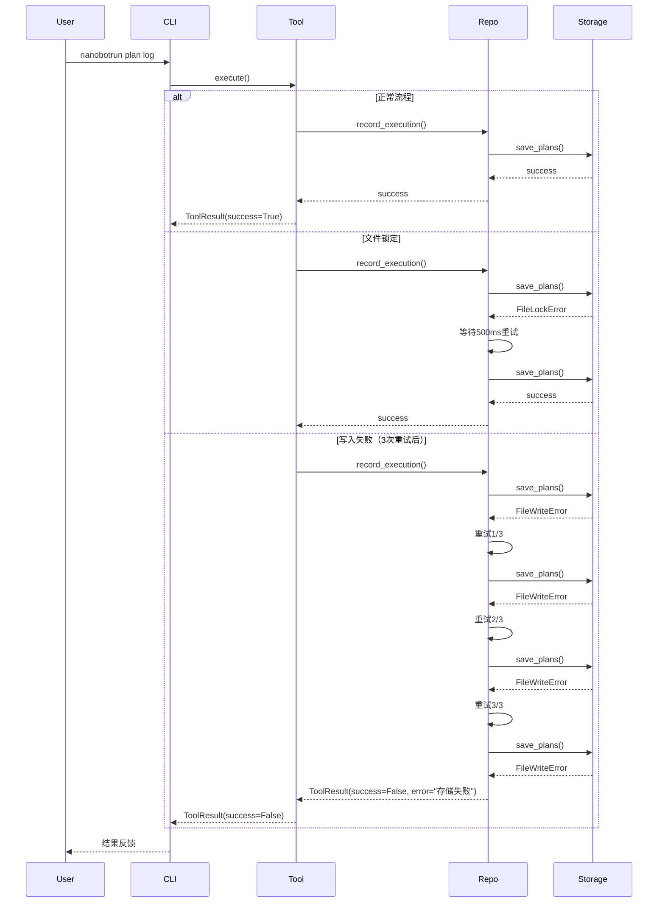

#### 7.3.2 v0.11.0 LLM调用异常处理

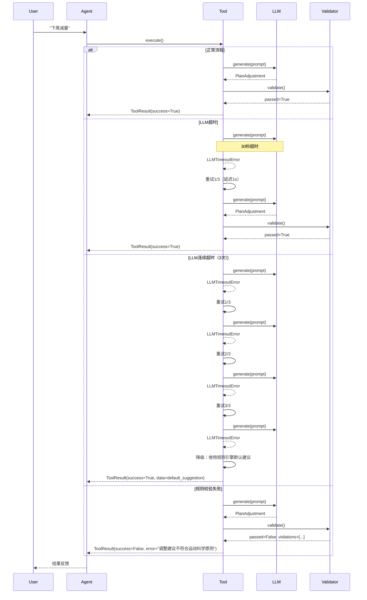

### 7.4 异常处理代码规范

```python
from src.core.exceptions import (
    RunnerException,
    PlanNotFoundError,
    PlanValidationError,
    LLMTimeoutError,
    FileWriteError,
)

class RecordPlanExecutionTool(BaseTool):
    async def execute(self, **kwargs) -> str:
        try:
            # 业务逻辑
            result = await self._do_execute(**kwargs)
            return ToolResult(success=True, data=result).model_dump_json()
        
        except PlanNotFoundError as e:
            # 业务异常：不重试，直接返回错误
            return ToolResult(
                success=False,
                error=f"计划不存在: {e.plan_id}",
            ).model_dump_json()
        
        except FileWriteError as e:
            # 存储异常：已重试3次失败
            return ToolResult(
                success=False,
                error="数据保存失败，请稍后重试",
                data={"retry_suggested": True},
            ).model_dump_json()
        
        except RunnerException as e:
            # 其他业务异常
            return ToolResult(
                success=False,
                error=str(e),
            ).model_dump_json()
        
        except Exception as e:
            # 未预期异常：记录日志，返回通用错误
            logger.exception("Unexpected error in RecordPlanExecutionTool")
            return ToolResult(
                success=False,
                error="系统错误，请联系管理员",
            ).model_dump_json()
```

### 7.5 重试机制配置

```python
@dataclass
class RetryConfig:
    """重试配置"""
    max_retries: int = 3
    base_delay_ms: int = 500
    max_delay_ms: int = 5000
    exponential_base: float = 2.0
    
    def get_delay(self, attempt: int) -> int:
        """计算重试延迟（指数退避）"""
        delay = self.base_delay_ms * (self.exponential_base ** attempt)
        return min(int(delay), self.max_delay_ms)

# 不同场景的重试配置
RETRY_CONFIGS = {
    "llm_call": RetryConfig(max_retries=3, base_delay_ms=1000),
    "file_write": RetryConfig(max_retries=3, base_delay_ms=500),
    "file_lock": RetryConfig(max_retries=5, base_delay_ms=200),
}
```

---

## 8. 部署架构

### 7.1 项目目录结构

```text
nanobot-runner/
├── src/
│   ├── core/
│   │   ├── analytics/           # 分析引擎（v0.9.0拆分）
│   │   ├── profile/             # 画像服务（v0.9.0拆分）
│   │   ├── plan/                # 训练计划（v0.8.0）
│   │   │   ├── plan_manager.py
│   │   │   ├── plan_generator.py
│   │   │   ├── plan_analyzer.py
│   │   │   └── hard_validator.py
│   │   ├── execution/           # v0.10.0新增
│   │   │   ├── plan_execution_repository.py
│   │   │   └── training_response_analyzer.py
│   │   ├── adjustment/          # v0.11.0新增
│   │   │   ├── prompt_template_engine.py
│   │   │   ├── plan_adjustment_validator.py
│   │   │   └── plan_modification_dialog_manager.py
│   │   ├── prediction/          # v0.12.0新增
│   │   │   ├── goal_prediction_engine.py
│   │   │   ├── long_term_plan_generator.py
│   │   │   └── smart_advice_engine.py
│   │   ├── context.py           # 依赖注入（v0.9.0）
│   │   ├── models.py            # 数据模型（v0.10.0扩展）
│   │   ├── storage.py
│   │   ├── config.py
│   │   └── exceptions.py
│   ├── agents/
│   │   └── tools.py             # Agent工具（v0.10.0-v0.12.0扩展）
│   ├── cli/
│   │   ├── commands/
│   │   │   ├── data.py
│   │   │   ├── analysis.py
│   │   │   ├── agent.py
│   │   │   ├── report.py
│   │   │   ├── system.py
│   │   │   ├── gateway.py
│   │   │   └── plan.py         # v0.10.0新增
│   │   └── handlers/
│   │       ├── data_handler.py
│   │       ├── analysis_handler.py
│   │       └── plan_handler.py  # v0.10.0新增
│   └── notify/
│       ├── feishu.py
│       └── feishu_calendar.py
├── tests/
│   ├── unit/
│   │   ├── core/
│   │   │   ├── execution/       # v0.10.0新增
│   │   │   ├── adjustment/      # v0.11.0新增
│   │   │   └── prediction/      # v0.12.0新增
│   │   └── agents/
│   │       └── test_plan_tools.py  # v0.10.0新增
│   ├── integration/
│   └── e2e/
├── docs/
│   ├── requirements/
│   │   └── PRD_智能跑步计划.md
│   ├── architecture/
│   │   ├── 架构设计说明书.md
│   │   └── 智能跑步计划架构设计.md  # 本文档
│   └── review/
│       └── 智能跑步计划架构评审报告.md
└── pyproject.toml
```

### 7.2 数据存储架构

```text
~/.nanobot-runner/
├── data/
│   ├── activities_*.parquet     # 运动数据（按年分片）
│   ├── profile.json             # 用户画像
│   ├── training_plans.json      # 训练计划（v0.10.0扩展）
│   └── index.json               # 去重索引
├── memory/
│   ├── MEMORY.md                # Agent记忆
│   └── HISTORY.md               # 事件日志
└── config.json                  # 应用配置
```

---

## 8. 测试策略

### 8.1 测试覆盖率要求

| 模块 | 覆盖率要求 | 测试类型 |
|------|----------|---------|
| `core/execution/` | ≥ 80% | 单元测试 |
| `core/adjustment/` | ≥ 80% | 单元测试 |
| `core/prediction/` | ≥ 80% | 单元测试 |
| `agents/tools.py` | ≥ 70% | 单元测试 + 集成测试 |
| `cli/commands/plan.py` | ≥ 60% | 集成测试 |

### 8.2 Mock策略

| 组件 | Mock策略 | 理由 |
|------|---------|------|
| LLM调用 | Mock | 避免真实调用，控制测试成本 |
| PlanManager | 真实实现 | 核心业务逻辑，需要真实测试 |
| AnalyticsEngine | Mock | 依赖外部数据，隔离测试 |
| StorageManager | Mock | 避免文件IO，提升测试速度 |

### 8.3 测试数据工厂

```python
class PlanTestDataFactory:
    """训练计划测试数据工厂"""
    
    @staticmethod
    def create_daily_plan(
        date: str = "2026-04-20",
        workout_type: TrainingType = TrainingType.EASY,
        **kwargs,
    ) -> DailyPlan:
        """创建日计划测试数据"""
        return DailyPlan(
            date=date,
            workout_type=workout_type,
            distance_km=kwargs.get("distance_km", 10.0),
            duration_min=kwargs.get("duration_min", 60),
            completed=kwargs.get("completed", False),
            completion_rate=kwargs.get("completion_rate"),
            effort_score=kwargs.get("effort_score"),
            feedback_notes=kwargs.get("feedback_notes", ""),
        )
    
    @staticmethod
    def create_training_plan(plan_id: str = "test_plan") -> TrainingPlan:
        """创建训练计划测试数据"""
        return TrainingPlan(
            plan_id=plan_id,
            user_id="test_user",
            plan_type=PlanType.BUILD,
            fitness_level=FitnessLevel.INTERMEDIATE,
            start_date="2026-04-20",
            end_date="2026-05-20",
            goal_distance_km=42.195,
            goal_date="2026-05-20",
            weeks=[
                WeeklySchedule(
                    week_number=1,
                    start_date="2026-04-20",
                    end_date="2026-04-26",
                    daily_plans=[
                        PlanTestDataFactory.create_daily_plan(f"2026-04-{20+i}")
                        for i in range(7)
                    ],
                )
            ],
        )
```

---

## 9. 风险与应对

### 9.1 技术风险

| 风险 | 概率 | 影响 | 应对策略 |
|------|------|------|---------|
| Prompt效果不稳定 | 高 | 高 | 规则引擎兜底 + 结构化输出 + Few-shot学习 |
| LLM响应延迟 | 中 | 中 | 异步处理 + 缓存机制 + 流式输出 |
| 数据模型扩展兼容性 | 低 | 高 | 向后兼容 + 数据迁移脚本 + 版本检测 |
| 测试覆盖率达标 | 中 | 高 | 测试驱动开发 + Mock策略 + 测试数据工厂 |

### 9.2 业务风险

| 风险 | 概率 | 影响 | 应对策略 |
|------|------|------|---------|
| 调整建议不合理 | 中 | 高 | 运动科学专家评审 + 规则约束 + 用户确认 |
| 预测准确率低 | 中 | 中 | 持续优化模型 + 增加数据维度 + 用户反馈 |

---

## 11. 预测准确性评估体系

### 11.1 评估指标体系

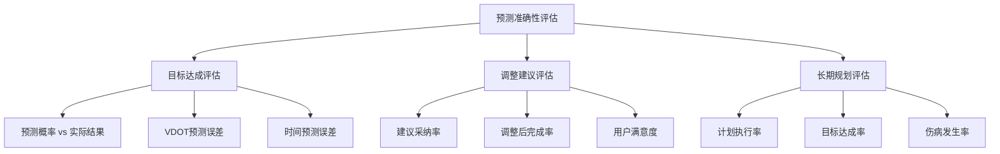

### 11.2 评估数据模型

```python
@dataclass
class PredictionEvaluation:
    """预测评估记录"""
    evaluation_id: str
    prediction_type: str  # goal_achievement, adjustment, long_term_plan
    prediction_date: datetime
    predicted_value: Any
    confidence: float
    actual_value: Any | None  # 实际结果（目标达成时填充）
    evaluation_date: datetime | None  # 评估日期
    error: float | None  # 预测误差
    notes: str = ""

@dataclass
class PredictionMetrics:
    """预测指标统计"""
    metric_name: str
    total_predictions: int
    evaluated_predictions: int
    accuracy_rate: float
    avg_error: float
    improvement_trend: str  # improving, stable, declining
```

### 11.3 评估流程设计

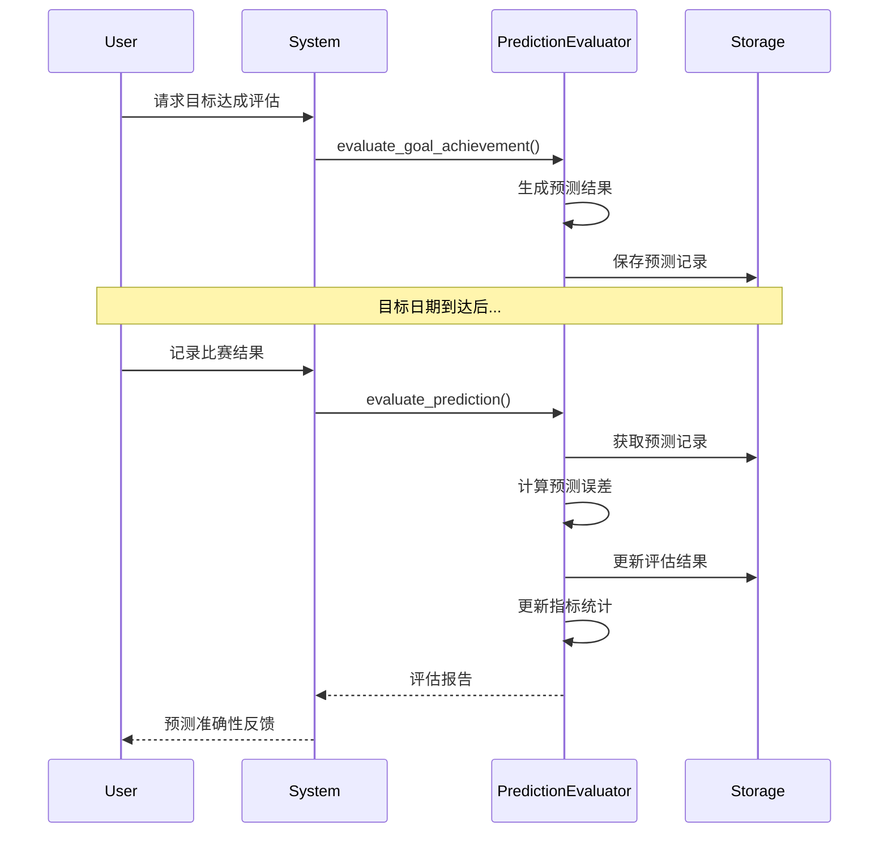

### 11.4 评估器实现

```python
class PredictionEvaluator:
    """预测评估器"""
    
    def __init__(self, storage: StorageManager):
        self.storage = storage
    
    def record_prediction(
        self,
        prediction_type: str,
        predicted_value: Any,
        confidence: float,
    ) -> str:
        """记录预测结果"""
        evaluation_id = generate_uuid()
        record = PredictionEvaluation(
            evaluation_id=evaluation_id,
            prediction_type=prediction_type,
            prediction_date=datetime.now(),
            predicted_value=predicted_value,
            confidence=confidence,
            actual_value=None,
            evaluation_date=None,
            error=None,
        )
        self.storage.save_prediction_record(record)
        return evaluation_id
    
    def evaluate_prediction(
        self,
        evaluation_id: str,
        actual_value: Any,
    ) -> PredictionEvaluation:
        """评估预测结果"""
        record = self.storage.get_prediction_record(evaluation_id)
        if not record:
            raise PredictionNotFoundError(evaluation_id)
        
        # 计算预测误差
        error = self._calculate_error(
            record.predicted_value,
            actual_value,
            record.prediction_type,
        )
        
        # 更新记录
        record.actual_value = actual_value
        record.evaluation_date = datetime.now()
        record.error = error
        
        self.storage.update_prediction_record(record)
        
        # 更新指标统计
        self._update_metrics(record)
        
        return record
    
    def _calculate_error(
        self,
        predicted: Any,
        actual: Any,
        prediction_type: str,
    ) -> float:
        """计算预测误差"""
        if prediction_type == "goal_achievement":
            # 目标达成预测：概率误差
            # predicted是概率(0-1)，actual是布尔值
            return abs(predicted - (1.0 if actual else 0.0))
        elif prediction_type == "vdot_prediction":
            # VDOT预测：相对误差
            return abs(predicted - actual) / actual
        elif prediction_type == "time_prediction":
            # 时间预测：相对误差
            return abs(predicted - actual) / actual
        else:
            return 0.0
    
    def _update_metrics(self, record: PredictionEvaluation) -> None:
        """更新指标统计"""
        metrics = self.storage.get_prediction_metrics(record.prediction_type)
        if not metrics:
            metrics = PredictionMetrics(
                metric_name=record.prediction_type,
                total_predictions=0,
                evaluated_predictions=0,
                accuracy_rate=0.0,
                avg_error=0.0,
                improvement_trend="stable",
            )
        
        metrics.total_predictions += 1
        metrics.evaluated_predictions += 1
        
        # 更新平均误差
        total_error = metrics.avg_error * (metrics.evaluated_predictions - 1)
        metrics.avg_error = (total_error + record.error) / metrics.evaluated_predictions
        
        # 计算准确率（误差<0.2视为准确）
        accurate_count = self.storage.count_accurate_predictions(
            record.prediction_type,
            threshold=0.2,
        )
        metrics.accuracy_rate = accurate_count / metrics.evaluated_predictions
        
        self.storage.save_prediction_metrics(metrics)
    
    def get_evaluation_report(self, prediction_type: str) -> dict:
        """获取评估报告"""
        metrics = self.storage.get_prediction_metrics(prediction_type)
        if not metrics:
            return {"error": "No metrics available"}
        
        recent_predictions = self.storage.get_recent_predictions(
            prediction_type,
            limit=10,
        )
        
        return {
            "metrics": asdict(metrics),
            "recent_predictions": [
                {
                    "evaluation_id": p.evaluation_id,
                    "prediction_date": p.prediction_date.isoformat(),
                    "predicted": p.predicted_value,
                    "actual": p.actual_value,
                    "error": p.error,
                }
                for p in recent_predictions
            ],
            "recommendations": self._generate_recommendations(metrics),
        }
    
    def _generate_recommendations(self, metrics: PredictionMetrics) -> list[str]:
        """生成改进建议"""
        recommendations = []
        
        if metrics.accuracy_rate < 0.6:
            recommendations.append("预测准确率偏低，建议增加训练数据维度")
        
        if metrics.avg_error > 0.3:
            recommendations.append("平均误差较大，建议优化预测模型")
        
        if metrics.improvement_trend == "declining":
            recommendations.append("预测质量下降，建议检查模型是否过时")
        
        return recommendations
```

### 11.5 持续优化机制

| 机制 | 说明 | 频率 |
|------|------|------|
| **自动评估** | 每次目标达成后自动评估预测准确性 | 实时 |
| **指标监控** | 监控预测准确率、平均误差等指标 | 每周 |
| **模型优化** | 根据评估结果优化Prompt模板和规则引擎 | 每月 |
| **用户反馈** | 收集用户对预测结果的主观评价 | 持续 |

### 11.6 评估报告示例

```json
{
  "report_date": "2026-04-18",
  "prediction_type": "goal_achievement",
  "metrics": {
    "total_predictions": 50,
    "evaluated_predictions": 30,
    "accuracy_rate": 0.73,
    "avg_error": 0.18,
    "improvement_trend": "improving"
  },
  "recent_predictions": [
    {
      "evaluation_id": "pred_001",
      "prediction_date": "2026-03-01",
      "predicted": 0.65,
      "actual": true,
      "error": 0.35
    }
  ],
  "recommendations": [
    "预测准确率良好，继续保持"
  ]
}
```

---

## 12. 实施计划

### 10.1 开发阶段

| 阶段 | 周期 | 主要任务 | 验收标准 |
|------|------|---------|---------|
| Phase 1: v0.10.0核心 | 第1-2周 | DailyPlan扩展 + 工具开发 + CLI命令 | 功能完整，测试覆盖率≥80% |
| Phase 2: v0.11.0并行准备 | 第1-2周 | Prompt工程 + Validator + 数据类 | 设计完成，可独立测试 |
| Phase 3: v0.11.0核心 | 第3-5周 | AdjustPlanTool + 建议工具 + 对话管理 | 功能完整，测试覆盖率≥80% |
| Phase 4: v0.12.0并行准备 | 第3-5周 | LongTermPlanGenerator设计 + 数据类 | 设计完成，可独立测试 |
| Phase 5: v0.12.0核心 | 第6-8周 | 评估工具 + 规划工具 + 建议工具 | 功能完整，测试覆盖率≥80% |

### 10.2 关键里程碑

| 里程碑 | 日期 | 交付物 |
|--------|------|--------|
| v0.10.0发布 | 2026-05-05 | 数据感知功能完整 |
| v0.11.0发布 | 2026-05-25 | 智能调整功能完整 |
| v0.12.0发布 | 2026-06-15 | 预测规划功能完整 |

---

## 11. 附录

### 11.1 Prompt模板示例

**ADJUST_PLAN_PROMPT**（v0.11.0）:
```python
ADJUST_PLAN_PROMPT = """
你是一位专业的跑步教练，需要根据用户反馈调整训练计划。

## 用户上下文
{user_context}

## 历史执行数据
{execution_stats}

## 调整请求
{adjustment_request}

## 运动科学约束
1. 周跑量增幅不超过10%
2. 长距离跑不超过周跑量的30%
3. 间歇跑后需安排恢复日
4. 比赛前2周需减量

## 输出格式（JSON）
{{
  "adjustments": [
    {{
      "date": "YYYY-MM-DD",
      "field": "distance_km|duration_min|workout_type",
      "original_value": "...",
      "adjusted_value": "...",
      "reason": "..."
    }}
  ],
  "confidence": 0.0-1.0
}}

请生成调整建议：
"""
```

### 11.2 规则引擎示例

**PlanAdjustmentValidator规则**（v0.11.0）:
```python
VALIDATION_RULES = [
    {
        "name": "volume_increase_limit",
        "description": "周跑量增幅不超过10%",
        "check": lambda old, new: (new - old) / old <= 0.10,
    },
    {
        "name": "long_run_ratio",
        "description": "长距离跑不超过周跑量的30%",
        "check": lambda long_run, weekly: long_run / weekly <= 0.30,
    },
    {
        "name": "recovery_after_interval",
        "description": "间歇跑后需安排恢复日",
        "check": lambda schedule: has_recovery_after_interval(schedule),
    },
    {
        "name": "race_taper",
        "description": "比赛前2周需减量",
        "check": lambda schedule, race_date: is_tapering(schedule, race_date),
    },
]
```

---

## 13. 变更记录

| 版本 | 日期 | 变更内容 | 作者 |
|------|------|----------|------|
| v1.0 | 2026-04-18 | 初始版本 | 架构师 |
| v1.1 | 2026-04-18 | 根据架构评审报告改进：P0整改项（Polars向量化计算、异常处理流程、LLM超时控制）、P1改进项（AppContext模块化、规则引擎可扩展性、CLI交互式输入、预测评估体系） | 架构师 |

---

*本文档遵循架构设计规范，定期 review 和更新*
