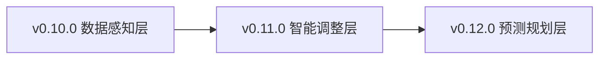
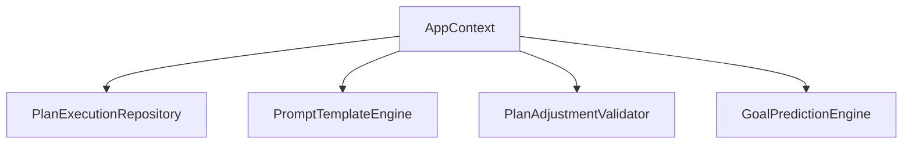
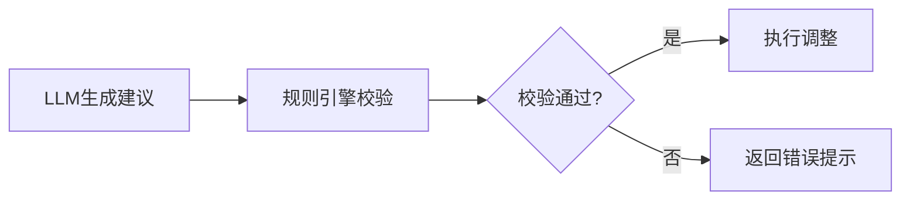
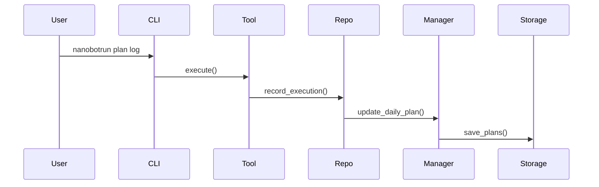
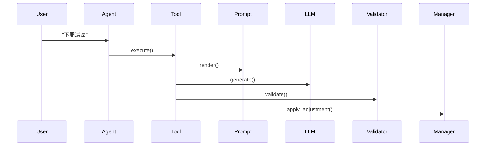
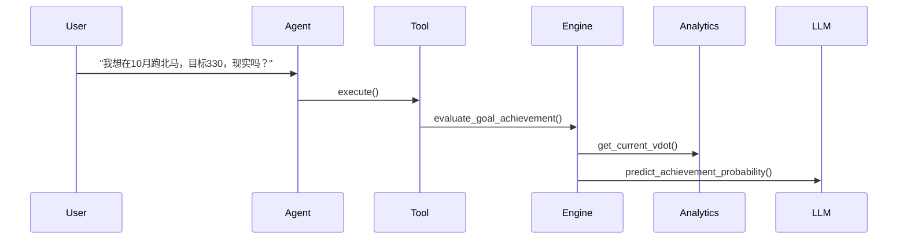

# 智能跑步计划架构评审报告

> **评审版本**: v0.10.0 - v0.12.0  
> **评审日期**: 2026-04-18  
> **评审对象**: 智能跑步计划架构设计说明书  
> **评审人**: 架构师  

---

## 1. 评审概述

### 1.1 评审范围

本次评审针对v0.10.0、v0.11.0、v0.12.0三个版本的智能跑步计划架构设计，重点评估：
- 技术选型合理性
- 架构模式适配性
- 接口规范完整性
- 技术风险识别
- 安全风险评估

### 1.2 评审依据

- 架构设计说明书：`docs/architecture/智能跑步计划架构设计.md`
- 需求规格说明书：`docs/requirements/PRD_智能跑步计划.md`
- 产品规划方案：`docs/product/产品规划方案.md`
- 现有架构设计：`docs/architecture/架构设计说明书.md`
- 开发指南：`AGENTS.md`

### 1.3 评审结论

**总体评价**: ✅ **通过（有条件）**

架构设计方案整体可行，技术选型合理，架构模式适配业务场景，接口规范完整。但存在部分需改进项，建议在进入开发前完成整改。

---

## 2. 技术选型评审

### 2.1 核心技术栈评审

| 技术组件 | 评审意见 | 结论 |
|---------|---------|------|
| **nanobot-ai** | ✅ 复用现有底座，避免重复造轮子，符合项目技术原则 | 通过 |
| **Python 3.11+** | ✅ 与现有项目一致，生态丰富 | 通过 |
| **Typer + Rich** | ✅ 与现有CLI框架一致，学习成本低 | 通过 |
| **JSON存储** | ⚠️ training_plans.json适用于小规模数据，但缺乏查询性能保障 | 有条件通过 |
| **Polars** | ✅ 与现有计算引擎一致，高性能 | 通过 |
| **自研规则引擎** | ✅ 轻量级，适配个人开发者场景 | 通过 |

### 2.2 新增技术组件评审

| 组件 | 评审意见 | 结论 |
|------|---------|------|
| **PromptTemplateEngine** | ✅ 设计合理，模板化管理便于维护 | 通过 |
| **PlanAdjustmentValidator** | ✅ 规则引擎兜底策略正确，降低LLM幻觉风险 | 通过 |
| **GoalPredictionEngine** | ⚠️ 预测模型依赖LLM推理，准确性需验证 | 有条件通过 |
| **LongTermPlanGenerator** | ✅ 设计合理，复用现有PlanManager | 通过 |

### 2.3 技术债务识别

| 债务项 | 影响 | 建议 |
|--------|------|------|
| **JSON存储查询性能** | 训练计划数据量增长后，查询性能可能下降 | 建议在v1.0前考虑迁移至SQLite |
| **LLM调用成本** | 频繁调用LLM可能产生较高API成本 | 建议引入缓存机制和调用频率限制 |

---

## 3. 架构模式评审

### 3.1 三层递进架构评审



**评审意见**:
- ✅ **分层清晰**: 每层职责明确，依赖关系单向
- ✅ **渐进式增强**: 符合业务演进规律，降低开发风险
- ✅ **独立可测**: 每层可独立测试，便于质量把控
- ⚠️ **强依赖链**: v0.12.0强依赖v0.10.0和v0.11.0，需确保前置版本质量

**结论**: 通过

### 3.2 依赖注入体系评审



**评审意见**:
- ✅ **符合项目规范**: 所有组件通过AppContext获取，禁止直接实例化
- ✅ **测试友好**: 支持Mock注入，便于单元测试
- ✅ **扩展性良好**: 通过Optional字段支持可选组件
- ⚠️ **AppContext膨胀风险**: 新增6个组件，AppContext可能变得臃肿

**建议**:
```python
# 建议按版本分组，避免AppContext过度膨胀
@dataclass
class AppContext:
    # 现有组件
    ...
    
    # 训练计划组件（v0.10.0-v0.12.0）
    plan_execution: PlanExecutionModule | None = None
    plan_adjustment: PlanAdjustmentModule | None = None
    plan_prediction: PlanPredictionModule | None = None
```

**结论**: 有条件通过

### 3.3 规则引擎兜底策略评审



**评审意见**:
- ✅ **策略正确**: 有效降低LLM幻觉风险
- ✅ **运动科学合理性**: 4条核心规则覆盖主要风险场景
- ⚠️ **规则覆盖不足**: 4条规则可能无法覆盖所有异常场景

**建议**:
- 增加规则可扩展性，支持用户自定义规则
- 增加规则优先级机制，处理规则冲突场景
- 增加规则日志记录，便于分析和优化

**结论**: 通过

---

## 4. 接口规范评审

### 4.1 CLI命令规范评审

| 命令 | 评审意见 | 结论 |
|------|---------|------|
| `nanobotrun plan log` | ✅ 参数设计合理，符合项目CLI规范 | 通过 |
| `nanobotrun plan stats` | ✅ 参数简洁，功能明确 | 通过 |

**建议**:
- 增加`--interactive`参数，支持交互式输入
- 增加`--dry-run`参数，支持预览模式

### 4.2 Agent工具接口规范评审

| 工具 | 评审意见 | 结论 |
|------|---------|------|
| `RecordPlanExecutionTool` | ✅ 参数定义完整，符合OpenAI规范 | 通过 |
| `AdjustPlanTool` | ✅ 支持确认机制，降低误操作风险 | 通过 |
| `GetPlanExecutionStatsTool` | ✅ 返回结构化数据，便于Agent处理 | 通过 |
| `AnalyzeTrainingResponseTool` | ✅ 分析维度合理 | 通过 |
| `EvaluateGoalAchievementTool` | ✅ 评估维度完整 | 通过 |
| `CreateLongTermPlanTool` | ✅ 支持多周期规划 | 通过 |
| `GetSmartTrainingAdviceTool` | ✅ 建议类型覆盖全面 | 通过 |

**统一返回格式评审**:
```python
@dataclass
class ToolResult:
    success: bool
    data: Any | None = None
    message: str | None = None
    error: str | None = None
```

**评审意见**:
- ✅ 与项目现有错误契约一致
- ✅ 类型安全，符合项目规范

**结论**: 通过

### 4.3 内部数据接口规范评审

| 接口 | 评审意见 | 结论 |
|------|---------|------|
| `PlanExecutionRepository.get_plan_execution_stats()` | ✅ 输入输出明确 | 通过 |
| `TrainingResponseAnalyzer.analyze_response_pattern()` | ✅ 返回列表，便于Agent处理 | 通过 |
| `PromptTemplateEngine.render()` | ✅ 模板化设计，便于维护 | 通过 |
| `PlanAdjustmentValidator.validate()` | ✅ 返回ValidationResult，类型安全 | 通过 |
| `GoalPredictionEngine.evaluate_goal_achievement()` | ✅ 返回结构化评估结果 | 通过 |

**结论**: 通过

---

## 5. 数据流设计评审

### 5.1 v0.10.0 数据流评审



**评审意见**:
- ✅ 数据流清晰，职责明确
- ✅ 依赖注入正确，通过Repo访问Manager
- ⚠️ 缺少异常处理流程

**建议**:
- 增加异常处理分支（文件写入失败、数据校验失败等）
- 增加重试机制（文件锁定场景）

### 5.2 v0.11.0 数据流评审



**评审意见**:
- ✅ LLM调用经过规则引擎校验，策略正确
- ✅ 支持确认机制，降低误操作风险
- ⚠️ LLM调用耗时未考虑（可能5-15秒）

**建议**:
- 增加异步处理机制
- 增加流式输出，实时展示进度
- 增加超时控制（30秒）

### 5.3 v0.12.0 数据流评审



**评审意见**:
- ✅ 数据流清晰，依赖关系正确
- ⚠️ 预测准确性依赖LLM推理，需建立效果评估体系

**建议**:
- 增加预测结果反馈机制，持续优化模型
- 增加规则引擎兜底（如VDOT差距过大时直接判定为不现实）

---

## 6. 风险识别

### 6.1 技术风险

| 风险 | 概率 | 影响 | 风险等级 | 应对策略 |
|------|------|------|---------|---------|
| **Prompt效果不稳定** | 高 | 高 | 🔴 高 | 规则引擎兜底 + 结构化输出 + Few-shot学习 |
| **LLM响应延迟** | 中 | 中 | 🟡 中 | 异步处理 + 缓存机制 + 流式输出 |
| **数据模型扩展兼容性** | 低 | 高 | 🟡 中 | 向后兼容 + 数据迁移脚本 + 版本检测 |
| **测试覆盖率达标** | 中 | 高 | 🟡 中 | 测试驱动开发 + Mock策略 + 测试数据工厂 |
| **JSON存储查询性能** | 低 | 中 | 🟢 低 | 监控数据量，v1.0前考虑迁移至SQLite |
| **AppContext膨胀** | 中 | 低 | 🟢 低 | 按版本分组，模块化设计 |

### 6.2 业务风险

| 风险 | 概率 | 影响 | 风险等级 | 应对策略 |
|------|------|------|---------|---------|
| **调整建议不合理** | 中 | 高 | 🟡 中 | 运动科学专家评审 + 规则约束 + 用户确认 |
| **预测准确率低** | 中 | 中 | 🟡 中 | 持续优化模型 + 增加数据维度 + 用户反馈 |
| **用户需求不明确** | 中 | 高 | 🟡 中 | 快速迭代验证 + 用户反馈渠道 |

### 6.3 安全风险

| 风险 | 概率 | 影响 | 风险等级 | 应对策略 |
|------|------|------|---------|---------|
| **敏感数据泄露** | 低 | 高 | 🟡 中 | 禁止硬编码密钥，使用config模块管理 |
| **LLM API密钥泄露** | 低 | 高 | 🟡 中 | 使用环境变量，禁止提交到代码库 |
| **训练计划数据损坏** | 低 | 高 | 🟡 中 | 增加数据备份机制，定期校验数据完整性 |

---

## 7. 问题清单

### 7.1 必须整改项（P0）

| 编号 | 问题描述 | 影响范围 | 整改建议 | 整改期限 |
|------|---------|---------|---------|---------|
| P0-1 | PlanExecutionRepository统计计算使用Python循环，性能可能不达标 | v0.10.0 | 使用Polars向量化计算替代Python循环 | 开发前 |
| P0-2 | 缺少异常处理流程设计 | 所有版本 | 补充异常处理分支和重试机制 | 开发前 |
| P0-3 | LLM调用缺少超时控制 | v0.11.0, v0.12.0 | 增加异步处理和超时控制（30秒） | 开发前 |

### 7.2 建议改进项（P1）

| 编号 | 问题描述 | 影响范围 | 改进建议 | 优先级 |
|------|---------|---------|---------|--------|
| P1-1 | AppContext可能变得臃肿 | 所有版本 | 按版本分组，模块化设计 | 中 |
| P1-2 | 规则引擎覆盖不足 | v0.11.0 | 增加规则可扩展性和优先级机制 | 中 |
| P1-3 | CLI命令缺少交互式输入 | v0.10.0 | 增加`--interactive`参数 | 低 |
| P1-4 | JSON存储查询性能风险 | 所有版本 | 监控数据量，v1.0前考虑迁移至SQLite | 低 |
| P1-5 | 预测准确性评估体系缺失 | v0.12.0 | 建立效果评估和反馈机制 | 中 |

### 7.3 优化建议项（P2）

| 编号 | 问题描述 | 影响范围 | 优化建议 | 优先级 |
|------|---------|---------|---------|--------|
| P2-1 | Prompt模板硬编码在代码中 | v0.11.0 | 考虑外部化配置文件 | 低 |
| P2-2 | 缺少数据迁移脚本 | v0.10.0 | 提供数据迁移工具 | 低 |
| P2-3 | 缺少缓存机制 | v0.11.0, v0.12.0 | 增加LLM响应缓存 | 低 |

---

## 8. 改进建议汇总

### 8.1 架构层面

1. **AppContext模块化**: 按版本分组，避免过度膨胀
2. **规则引擎可扩展性**: 支持用户自定义规则和优先级机制
3. **数据流异常处理**: 补充完整的异常处理流程和重试机制

### 8.2 技术层面

1. **Polars向量化计算**: PlanExecutionRepository统计计算使用Polars替代Python循环
2. **LLM异步处理**: 增加异步调用、超时控制和流式输出
3. **缓存机制**: 增加LLM响应缓存，降低API调用成本

### 8.3 业务层面

1. **预测效果评估**: 建立预测准确性评估和反馈机制
2. **用户反馈渠道**: 建立用户反馈渠道，快速迭代验证
3. **运动科学专家评审**: 关键调整建议需运动科学专家评审

---

## 9. 评审结论

### 9.1 总体评价

| 维度 | 评分 | 说明 |
|------|------|------|
| **技术选型** | ⭐⭐⭐⭐☆ (4/5) | 技术栈合理，复用现有组件，但JSON存储存在性能风险 |
| **架构模式** | ⭐⭐⭐⭐☆ (4/5) | 三层递进架构清晰，依赖注入正确，但AppContext可能膨胀 |
| **接口规范** | ⭐⭐⭐⭐⭐ (5/5) | 接口设计完整，符合项目规范 |
| **数据流设计** | ⭐⭐⭐⭐☆ (4/5) | 数据流清晰，但缺少异常处理流程 |
| **风险识别** | ⭐⭐⭐⭐☆ (4/5) | 风险识别全面，应对策略合理 |

### 9.2 评审结论

**✅ 通过（有条件）**

架构设计方案整体可行，技术选型合理，架构模式适配业务场景，接口规范完整。但存在3项必须整改项（P0），建议在进入开发前完成整改。

### 9.3 进入开发条件

- [x] 完成P0-1整改：PlanExecutionRepository使用Polars向量化计算
- [x] 完成P0-2整改：补充异常处理流程设计
- [x] 完成P0-3整改：增加LLM调用超时控制

**整改完成日期**: 2026-04-18  
**整改版本**: 架构设计说明书 v1.1

---

## 10. 后续建议

1. **立即行动**（本周）：
   - 完成P0整改项
   - 完善数据模型设计（解决字段冗余问题）
   - 制定测试策略

2. **下周开始**：
   - 启动v0.10.0核心开发
   - 并行启动v0.11.0 Prompt工程准备

3. **持续关注**：
   - Prompt效果评估
   - 测试覆盖率跟踪
   - 架构规范遵守

---

## 11. 变更记录

| 版本 | 日期 | 变更内容 | 作者 |
|------|------|----------|------|
| v1.0 | 2026-04-18 | 初始版本 | 架构师 |
| v1.1 | 2026-04-18 | 更新进入开发条件：P0整改项已全部完成 | 架构师 |

---

*本文档遵循架构评审规范，评审结论需经用户确认后生效*
