# Nanobot Runner 架构图表集

> **文档版本**: v6.0  
> **更新日期**: 2026-04-26  
> **对应架构**: 架构设计说明书_v0.13-0.15.md

---

## 1. 系统整体架构图

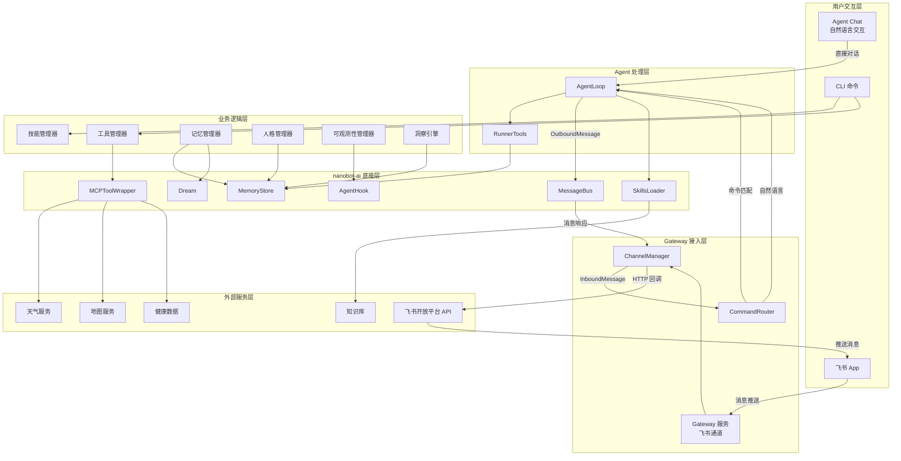

**架构图说明**：

| 组件 | 职责 | 技术实现 |
|------|------|---------|
| **CLI 命令** | 命令行交互入口，技能管理、工具配置 | `nanobotrun skill`、`nanobotrun tool` |
| **Agent Chat** | 自然语言交互模式，AI 教练对话 | `nanobotrun agent chat` |
| **Gateway 服务** | 飞书通道入口，接收用户消息，返回 AI 响应 | `nanobotrun gateway start` |
| **ChannelManager** | 多通道管理，支持飞书、钉钉等 | `nanobot.channels.manager` |
| **CommandRouter** | 命令路由，区分命令和自然语言 | `nanobot.command.router` |
| **AgentLoop** | AI Agent 主循环，处理消息和工具调用 | `nanobot.agent.AgentLoop` |
| **RunnerTools** | 跑步业务工具集，提供训练数据查询 | `src.agents.tools` |
| **MessageBus** | 消息总线，管理消息流转 | `nanobot.bus.MessageBus` |

---

## 2. 三种用户交互方式对比图

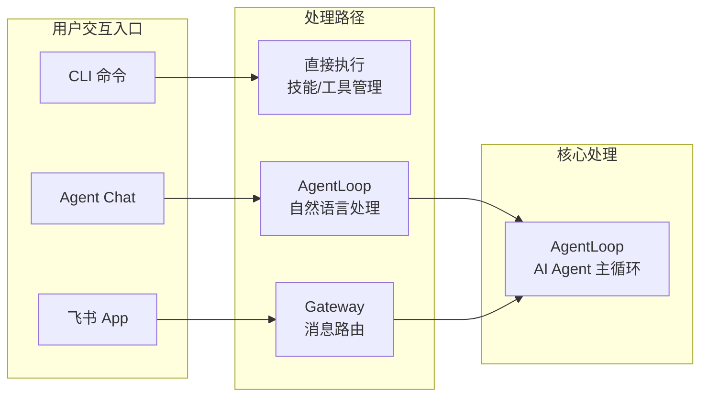

**三种交互方式对比**：

| 对比维度 | CLI 命令 | Agent Chat | 飞书 App |
|---------|---------|-----------|---------|
| **交互方式** | 命令行参数 | 自然语言对话 | 自然语言对话 |
| **使用场景** | 配置管理、数据操作 | 本地开发调试 | 移动办公、日常使用 |
| **响应速度** | 快（直接执行） | 中（LLM 处理） | 中（网络 + LLM） |
| **功能范围** | 全部管理功能 | AI 对话功能 | AI 对话 + 推送通知 |
| **依赖条件** | 本地安装 | 本地安装 + LLM 配置 | Gateway 服务 + 飞书配置 |
| **启动命令** | `nanobotrun <cmd>` | `nanobotrun agent chat` | `nanobotrun gateway start` |

---

## 3. Gateway 消息流数据流图

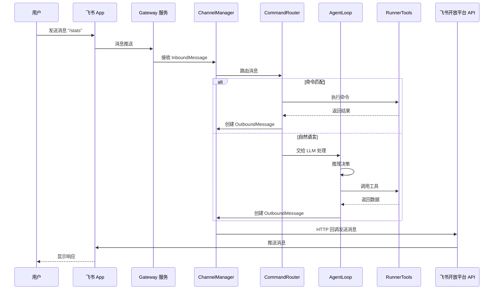

**消息流说明**：

| 步骤 | 说明 | 数据类型 |
|------|------|---------|
| 1 | 用户通过飞书 App 发送消息 | 文本消息 |
| 2 | Gateway 服务接收消息推送 | HTTP POST |
| 3 | ChannelManager 解析为 InboundMessage | `InboundMessage` |
| 4 | CommandRouter 路由消息 | 命令匹配或自然语言 |
| 5 | 执行命令或 LLM 处理 | 业务逻辑 |
| 6 | 创建 OutboundMessage | `OutboundMessage` |
| 7 | 通过飞书 API 发送响应 | HTTP POST |
| 8 | 飞书 App 显示响应 | 文本消息 |

---

## 4. 技能调用数据流图

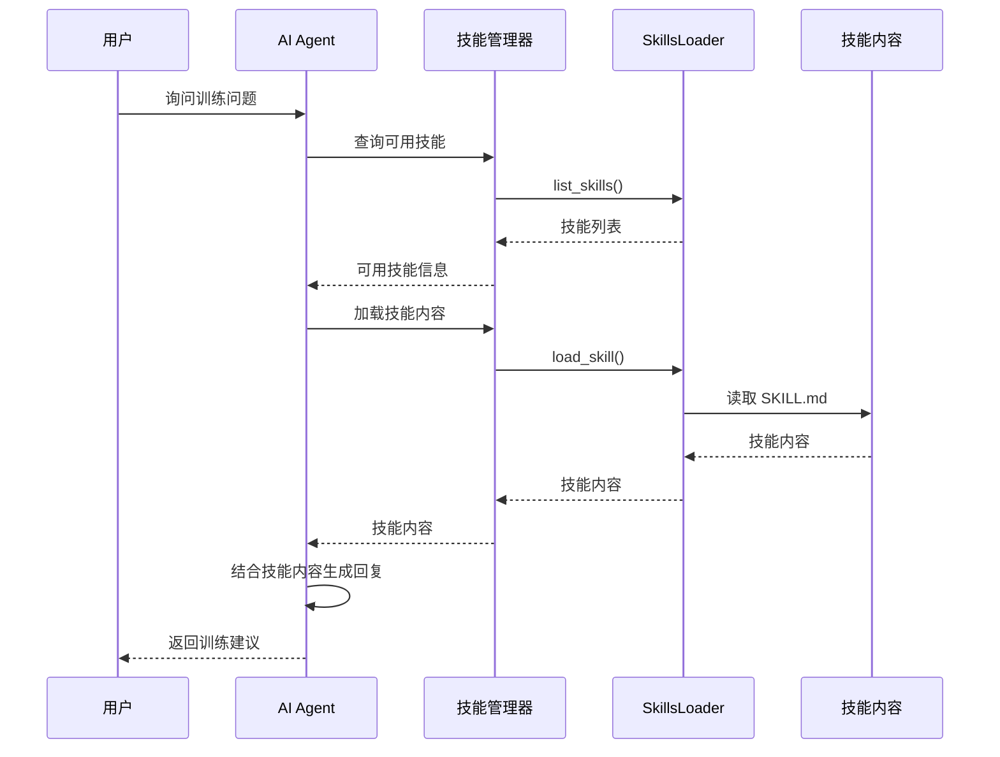

---

## 5. 工具调用数据流图

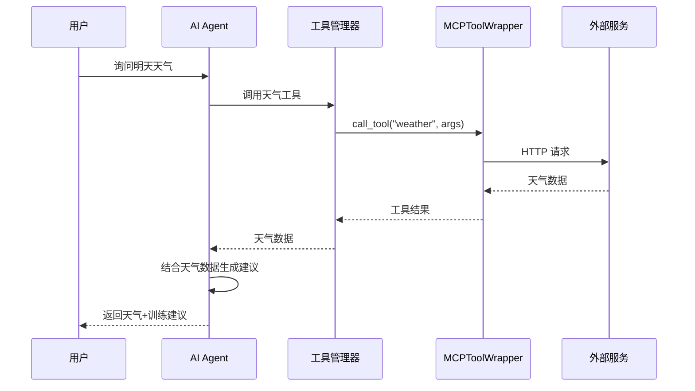

---

## 6. 记忆管理数据流图

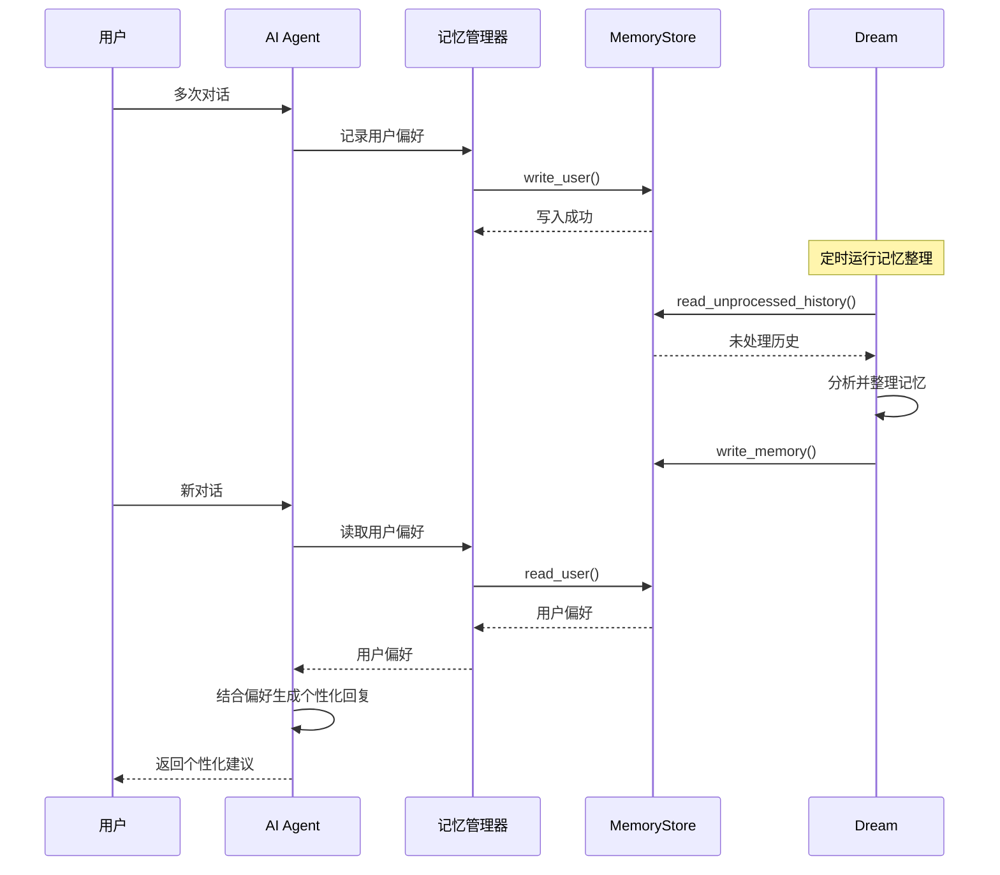

---

## 7. 可观测性数据流图

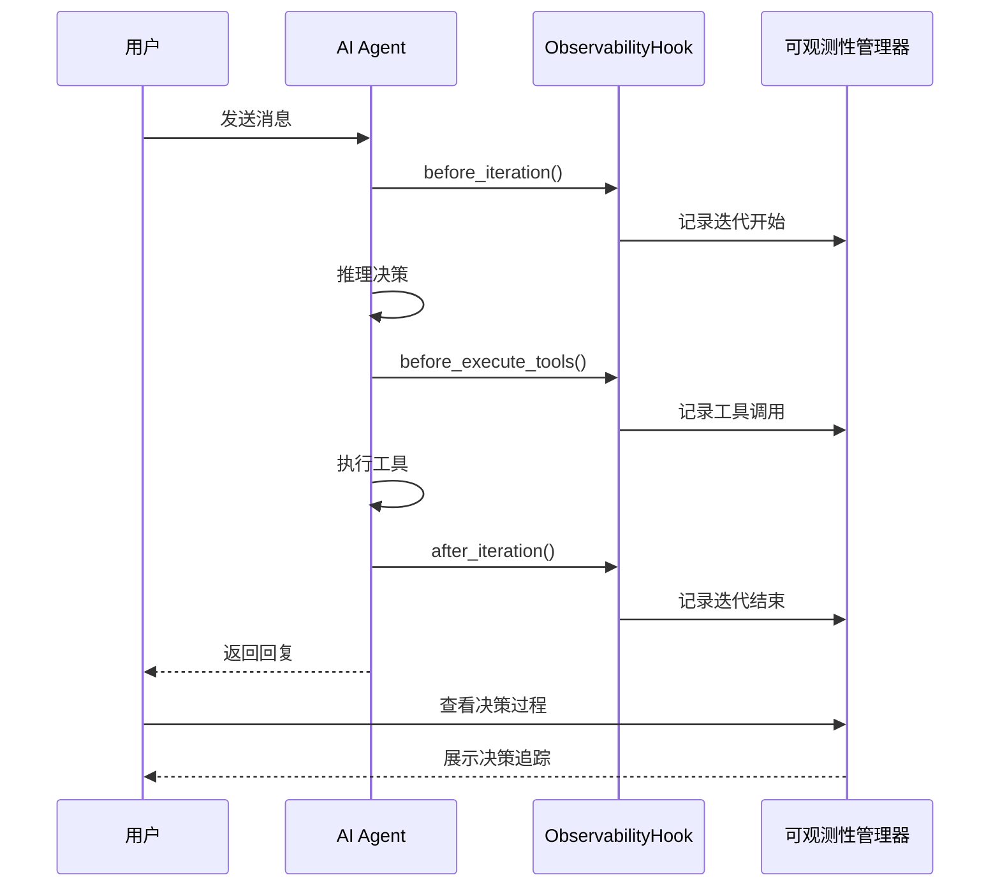

---

## 8. 本地部署架构图

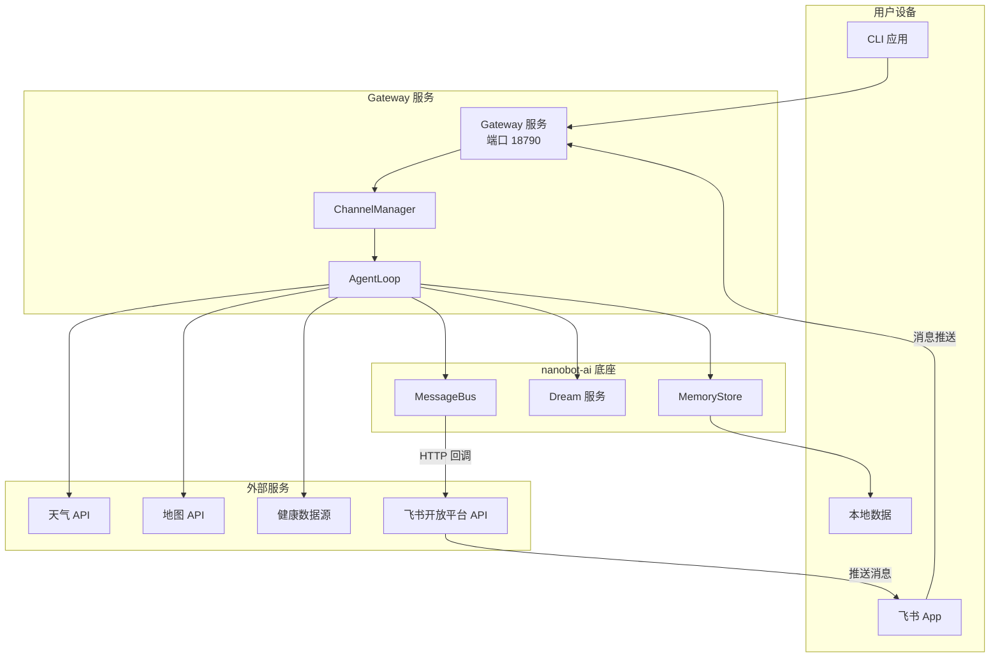

---

## 9. 模块依赖关系图

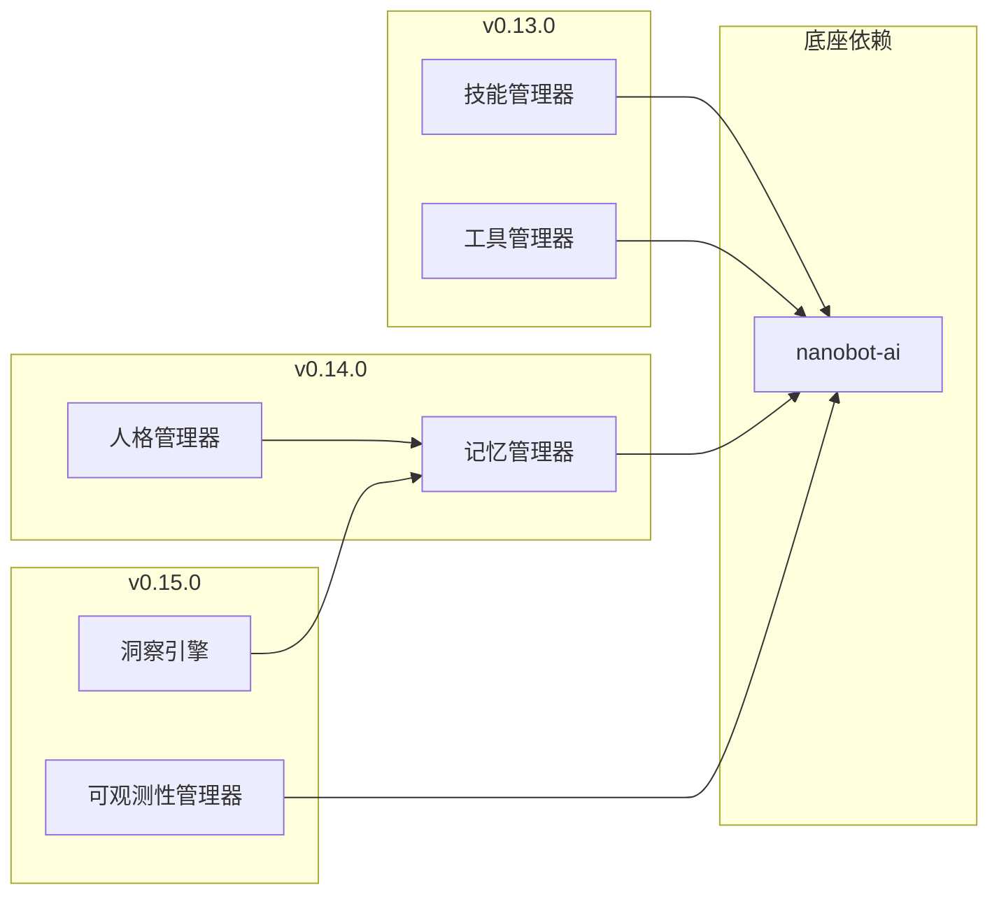

---

## 10. 数据存储结构图

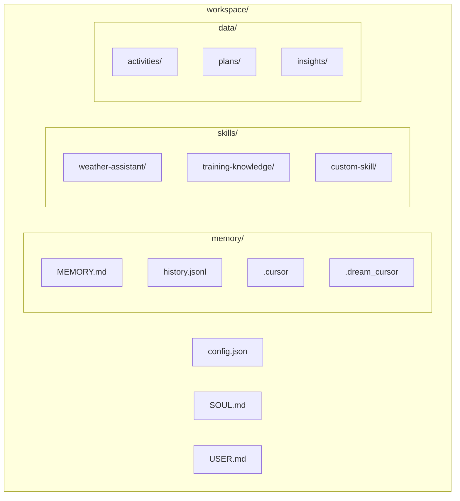

---

## 11. 版本迭代路线图

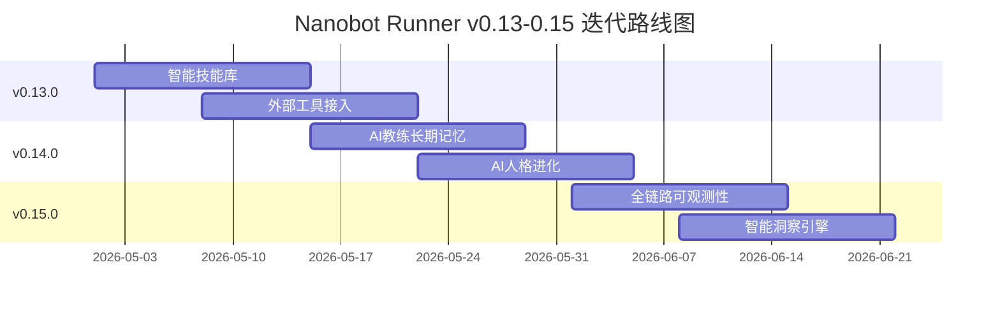

---

## 12. 技术栈架构图

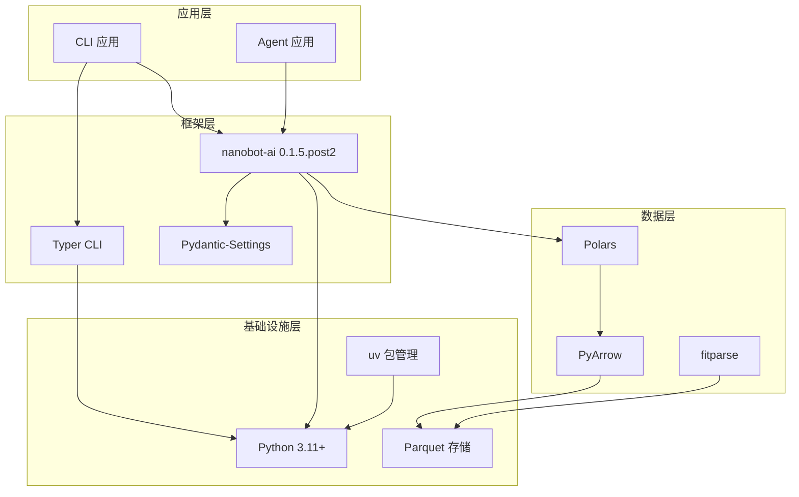

---

## 13. 接口关系图

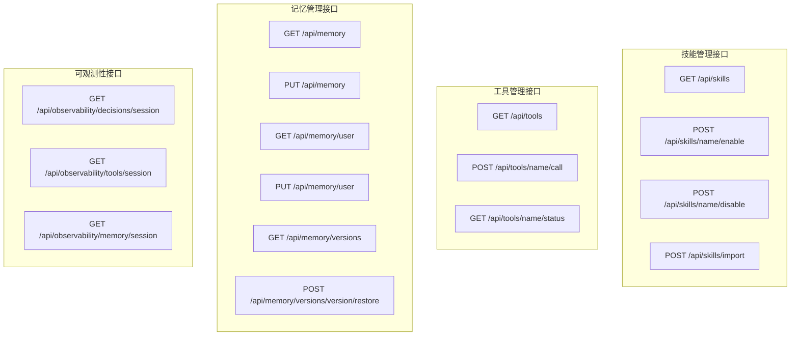

---

## 14. 风险矩阵图

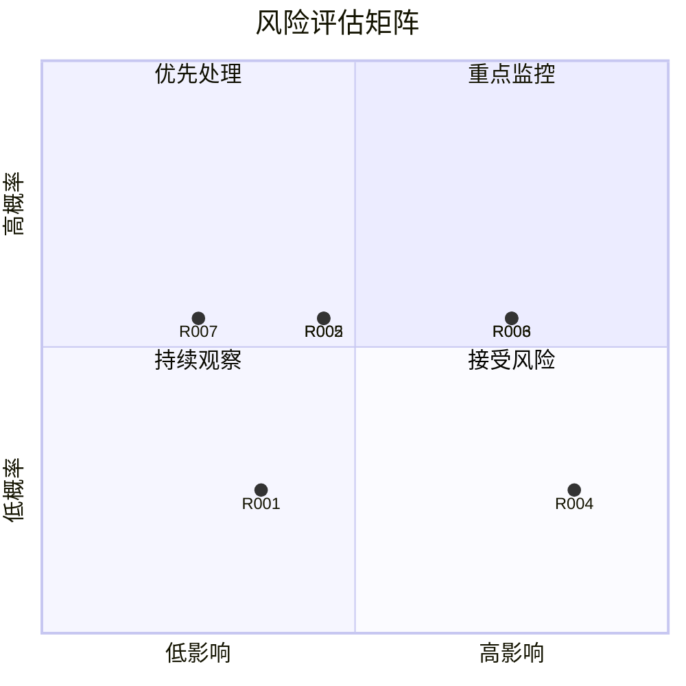

---

*本图表集由架构师基于架构设计说明书自动生成，所有图表均可在 Trae IDE 内直接渲染*

**版本历史**：
- v1.0 (2026-04-17): 初始版本
- v2.0 (2026-04-22): 新增智能跑步计划架构图
- v3.0 (2026-04-26): 全面对齐产品规划 v3.0
- v4.0 (2026-04-26): 基于 nanobot-ai 0.1.5.post2 底座能力全面修订版
- v5.0 (2026-04-26): 新增 Gateway（飞书通道）组件架构图
- v6.0 (2026-04-26): 新增三种用户交互方式对比图，完整体现 CLI、Agent Chat、飞书 App 三种交互入口
