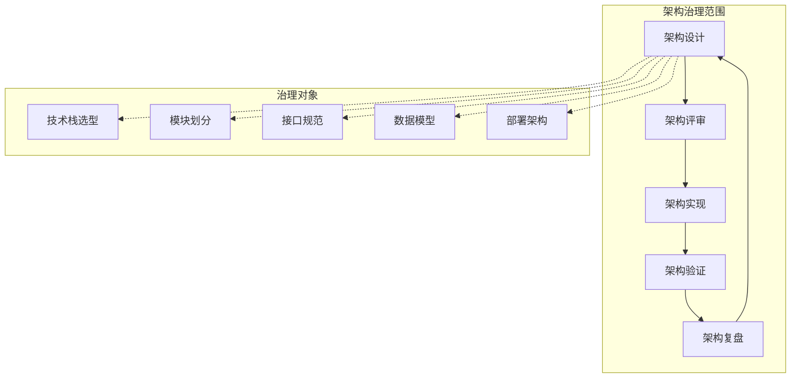
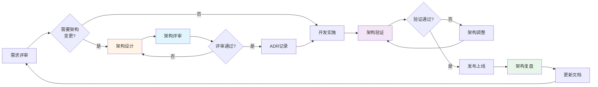
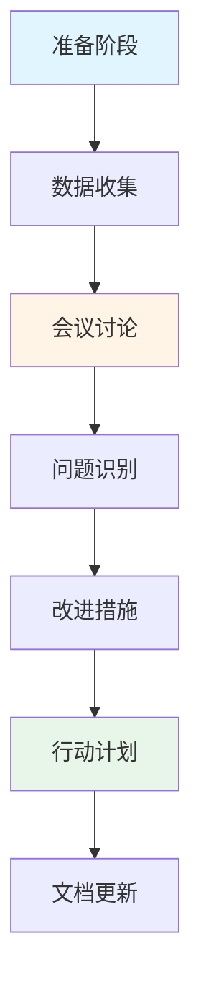

# 架构治理指南

## 1. 概述

本文档定义了 Nanobot Runner 项目的架构治理流程和规范，旨在建立完整的架构治理体系，确保架构设计质量，降低技术债务，提升系统可维护性。

## 2. 架构治理目标

### 2.1 核心目标

1. **架构一致性**: 确保架构设计与实现保持一致
2. **技术债务控制**: 建立技术债务识别、跟踪、偿还机制
3. **质量门禁**: 建立架构层面的质量检查点
4. **决策可追溯**: 架构决策有记录、可追溯
5. **持续改进**: 定期评审和优化架构

### 2.2 治理范围



## 3. 架构治理流程

### 3.1 完整治理流程



### 3.2 各阶段职责

| 阶段 | 负责人 | 关键活动 | 交付物 |
|------|--------|---------|--------|
| 需求评审 | 架构师+产品经理 | 分析架构影响 | 架构影响评估 |
| 架构设计 | 架构师 | 设计架构方案 | 架构设计文档 |
| 架构评审 | 架构评审委员会 | 评审架构方案 | 评审意见 |
| ADR记录 | 架构师 | 记录架构决策 | ADR文档 |
| 开发实施 | 开发工程师 | 按架构实现 | 代码 |
| 架构验证 | 架构师+测试工程师 | 验证架构落地 | 验证报告 |
| 架构复盘 | 架构师+团队 | 总结经验教训 | 复盘报告 |

## 4. 架构评审机制

### 4.1 评审触发条件

以下情况必须触发架构评审：

1. **新增核心模块**: 新增业务模块或基础设施模块
2. **技术栈变更**: 引入新的技术组件或框架
3. **接口变更**: 修改公共API或模块间接口
4. **数据模型变更**: 修改核心数据模型或存储方案
5. **性能优化**: 涉及架构层面的性能优化
6. **安全加固**: 涉及安全架构的变更

### 4.2 评审委员会组成

| 角色 | 人数 | 职责 |
|------|------|------|
| 架构师 | 1 | 主持评审，技术把关 |
| 开发工程师 | 1-2 | 评估实现可行性 |
| 测试工程师 | 1 | 评估可测试性 |
| 运维工程师 | 1 | 评估部署运维影响 |

### 4.3 评审检查清单

#### 功能性检查

- [ ] 架构是否满足所有功能需求
- [ ] 模块职责是否清晰
- [ ] 接口定义是否完整
- [ ] 数据流是否清晰

#### 非功能性检查

- [ ] 性能目标是否可达
- [ ] 可扩展性是否满足要求
- [ ] 可用性设计是否合理
- [ ] 安全性是否充分考虑

#### 可维护性检查

- [ ] 代码复杂度是否可控
- [ ] 测试策略是否完善
- [ ] 文档是否同步更新
- [ ] 技术债务是否可控

#### 实施风险检查

- [ ] 实施工作量评估是否合理
- [ ] 依赖项是否已识别
- [ ] 回滚方案是否可行
- [ ] 兼容性是否考虑

### 4.4 评审结论

评审结论分为三种：

1. **通过**: 架构设计合理，可以实施
2. **有条件通过**: 需修改特定问题后实施
3. **不通过**: 架构设计存在重大问题，需重新设计

## 5. 架构决策记录（ADR）

### 5.1 ADR模板

```markdown
# ADR-XXX: [决策标题]

## 状态
- 提议 / 已接受 / 已弃用 / 已替代

## 背景
[描述需要做出决策的问题背景]

## 决策
[明确描述决策内容]

## 影响

### 积极影响
- [影响1]
- [影响2]

### 消极影响
- [影响1]
- [影响2]

## 替代方案

### 方案A: [方案名称]
- 优点: [优点]
- 缺点: [缺点]

### 方案B: [方案名称]
- 优点: [优点]
- 缺点: [缺点]

## 决策理由
[说明为什么选择当前方案]

## 实施计划
- [ ] 任务1
- [ ] 任务2

## 相关文档
- [链接1]
- [链接2]

## 决策人
[姓名] @ [日期]

## 更新历史
| 日期 | 更新人 | 更新内容 |
|------|--------|---------|
| YYYY-MM-DD | [姓名] | [内容] |
```

### 5.2 ADR存储规范

```
docs/
└── architecture/
    └── decisions/           # ADR目录
        ├── 001-parquet-storage.md
        ├── 002-polars-engine.md
        ├── 003-nanobot-integration.md
        ├── 004-cron-storage-migration.md
        └── README.md        # ADR索引
```

### 5.3 ADR编号规则

- 格式: `ADR-XXX-[简短描述]`
- 编号: 三位数字，顺序递增
- 示例: `ADR-001-parquet-storage.md`

## 6. 技术债务管理

### 6.1 技术债务登记册

```markdown
# docs/project/TECH_DEBT.md

## 债务清单

| ID | 描述 | 类型 | 优先级 | 影响范围 | 状态 | 计划版本 | 责任人 |
|----|------|------|--------|---------|------|---------|--------|
| TD-001 | CLI模块测试覆盖率不足 | 测试 | 高 | 质量风险 | 待处理 | v0.4.2 | 开发工程师 |
| TD-002 | 类型注解不完整 | 代码质量 | 中 | 维护性 | 待处理 | v0.5.0 | 开发工程师 |
| TD-003 | TODO标记未实现功能 | 功能 | 中 | 功能完整性 | 待处理 | v0.4.2 | 开发工程师 |
| TD-004 | 配置管理无Schema验证 | 架构 | 高 | 稳定性 | 处理中 | v0.4.2 | 开发工程师 |

## 债务类型定义

- **架构**: 架构层面的债务
- **代码质量**: 代码风格和规范债务
- **测试**: 测试覆盖率和质量债务
- **文档**: 文档不完整或过时的债务
- **功能**: 功能未完整实现的债务

## 优先级定义

- **高**: 必须在下个版本解决
- **中**: 计划在两个版本内解决
- **低**: 可以延后处理
```

### 6.2 债务偿还计划

每个版本必须制定技术债务偿还计划：

```markdown
# v0.4.2版本技术债务偿还计划

## 目标
- 偿还高优先级债务
- 控制债务增长率

## 计划偿还债务

### TD-001: CLI模块测试覆盖率提升至60%
- **预估工时**: 8小时
- **责任人**: 开发工程师
- **验收标准**: 覆盖率报告显示CLI模块≥60%
- **截止日期**: 2026-04-05

### TD-003: 实现TODO标记的功能
- **预估工时**: 4小时
- **责任人**: 开发工程师
- **验收标准**: 代码中无TODO/FIXME标记
- **截止日期**: 2026-04-05

## 新增债务控制
- 禁止新增高优先级债务
- 新增债务必须记录到TECH_DEBT.md
- 代码审查时检查债务新增
```

### 6.3 债务监控指标

| 指标 | 目标值 | 监控频率 |
|------|--------|---------|
| 高优先级债务数量 | 0 | 每周 |
| 债务偿还率 | >50% | 每个版本 |
| 新增债务数量 | <5 | 每个版本 |
| 债务平均存在时间 | <3个月 | 每月 |

## 7. 架构质量门禁

### 7.1 CI集成检查

```yaml
# .github/workflows/architecture-check.yml
name: Architecture Check

on: [push, pull_request]

jobs:
  architecture-check:
    runs-on: ubuntu-latest
    steps:
      - uses: actions/checkout@v4
      
      - name: Check ADR completeness
        run: |
          # 检查架构变更是否有对应的ADR
          python scripts/check_adr.py
      
      - name: Check tech debt tracking
        run: |
          # 检查TODO/FIXME是否已记录到TECH_DEBT.md
          python scripts/check_tech_debt.py
      
      - name: Check architecture compliance
        run: |
          # 检查代码是否符合架构规范
          python scripts/check_architecture.py
      
      - name: Check documentation sync
        run: |
          # 检查架构文档是否与代码同步
          python scripts/check_doc_sync.py
```

### 7.2 质量门禁规则

| 检查项 | 门禁规则 | 失败处理 |
|--------|---------|---------|
| ADR完整性 | 架构变更必须有ADR | 阻断合并 |
| 技术债务登记 | 新增TODO必须登记 | 警告，不阻断 |
| 架构符合性 | 代码必须符合架构设计 | 阻断合并 |
| 文档同步 | 架构文档必须更新 | 阻断合并 |
| 测试覆盖率 | 核心模块≥80% | 阻断合并 |

## 8. 架构复盘机制

### 8.1 复盘触发条件

1. **版本发布**: 每个版本发布后必须复盘
2. **重大故障**: 生产环境重大故障后必须复盘
3. **架构变更**: 重大架构变更实施后复盘

### 8.2 复盘会议流程



### 8.3 复盘报告模板

```markdown
# 架构复盘报告 - v0.4.1

## 基本信息
- **复盘版本**: v0.4.1
- **复盘日期**: 2026-03-29
- **参与人员**: 架构师、开发工程师、测试工程师
- **报告人**: 架构师

## 目标达成情况

| 目标 | 达成情况 | 说明 |
|------|---------|------|
| 定时任务存储迁移 | ✅ 达成 | 已迁移到业务目录 |
| CI/CD流程优化 | ⚠️ 部分达成 | 权限已修复，环境差异待解决 |
| 配置管理改进 | ❌ 未达成 | 推迟到v0.4.2 |

## 问题识别

### 问题1: CI/CD流程不稳定
- **影响**: 发布延迟2小时
- **根因**: 环境差异未隔离，权限配置缺失
- **改进措施**: 建立本地CI验证脚本，完善权限配置

### 问题2: 配置管理架构缺陷
- **影响**: 配置验证缺失，迁移风险高
- **根因**: 早期设计未考虑Schema验证
- **改进措施**: 引入配置Schema验证机制

## 经验总结

### 成功经验
1. 定时任务存储迁移方案设计合理，迁移过程顺利
2. 风险识别机制有效，提前发现了配置管理问题

### 教训
1. CI/CD流程需要定期演练，不能等到发布时才发现问题
2. 架构设计时需要考虑配置验证机制

## 改进措施

| 优先级 | 改进项 | 责任人 | 计划完成时间 |
|-------|-------|-------|-------------|
| P0 | 建立本地CI验证脚本 | 开发工程师 | v0.4.2 |
| P0 | 实现配置Schema验证 | 开发工程师 | v0.4.2 |
| P1 | 完善CI/CD权限配置 | 发布运维工程师 | v0.4.2 |

## 下次复盘时间
v0.4.2版本发布后一周内
```

## 9. 架构文档管理

### 9.1 文档更新规范

任何架构变更必须同步更新以下文档：

1. **系统架构设计说明书**: 更新架构图和模块设计
2. **接口规范文档**: 更新接口定义
3. **ADR文档**: 新增或更新架构决策记录
4. **风险评估报告**: 更新风险识别和应对措施

### 9.2 文档版本控制

```
docs/architecture/
├── ARC_架构设计.md              # 主架构文档
├── 配置管理最佳实践.md
├── 架构治理指南.md
├── review/                      # 评审报告
│   ├── ARC_v0.4.1_风险复盘分析报告.md
│   └── ...
├── decisions/                   # ADR文档
│   ├── 001-parquet-storage.md
│   └── ...
└── diagrams/                    # 架构图源码
    ├── system-architecture.mmd
    └── ...
```

### 9.3 文档更新检查清单

- [ ] 架构图是否更新
- [ ] 模块职责是否更新
- [ ] 接口定义是否更新
- [ ] 数据模型是否更新
- [ ] 部署架构是否更新
- [ ] 风险清单是否更新
- [ ] ADR是否新增或更新
- [ ] 变更历史是否更新

## 10. 治理指标与度量

### 10.1 关键指标

| 指标类别 | 指标名称 | 目标值 | 测量方式 |
|---------|---------|--------|---------|
| 架构质量 | 架构评审通过率 | >90% | 统计 |
| 架构质量 | ADR完整率 | 100% | 检查 |
| 技术债务 | 高优先级债务数量 | 0 | 统计 |
| 技术债务 | 债务偿还率 | >50% | 统计 |
| 文档质量 | 文档同步率 | 100% | 检查 |
| 流程效率 | 架构评审周期 | <3天 | 统计 |

### 10.2 度量报告

每月生成架构治理度量报告：

```markdown
# 架构治理度量报告 - 2026年3月

## 概览
- 架构评审次数: 5
- 评审通过率: 80%
- 新增ADR: 2
- 偿还技术债务: 3
- 新增技术债务: 2

## 趋势分析
[图表展示]

## 问题与建议
...
```

## 11. 参考文档

- [系统架构设计说明书](./ARC_架构设计.md)
- [v0.4.1风险复盘分析报告](./review/ARC_v0.4.1_风险复盘分析报告.md)
- [配置管理最佳实践](./配置管理最佳实践.md)

---

*文档版本: 1.0*  
*最后更新: 2026-03-29*  
*下次评审: 2026-04-29*
