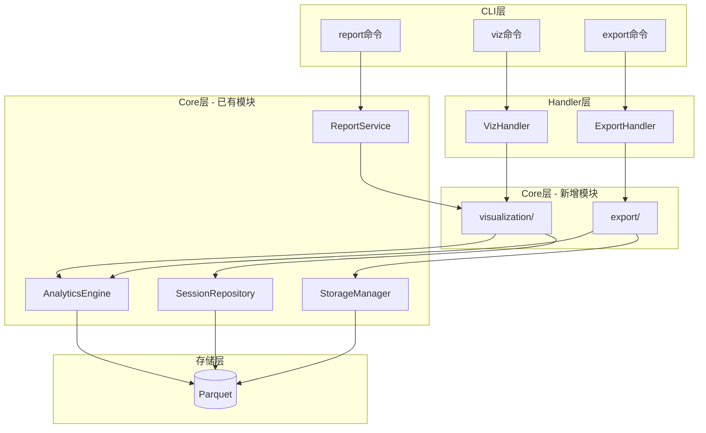
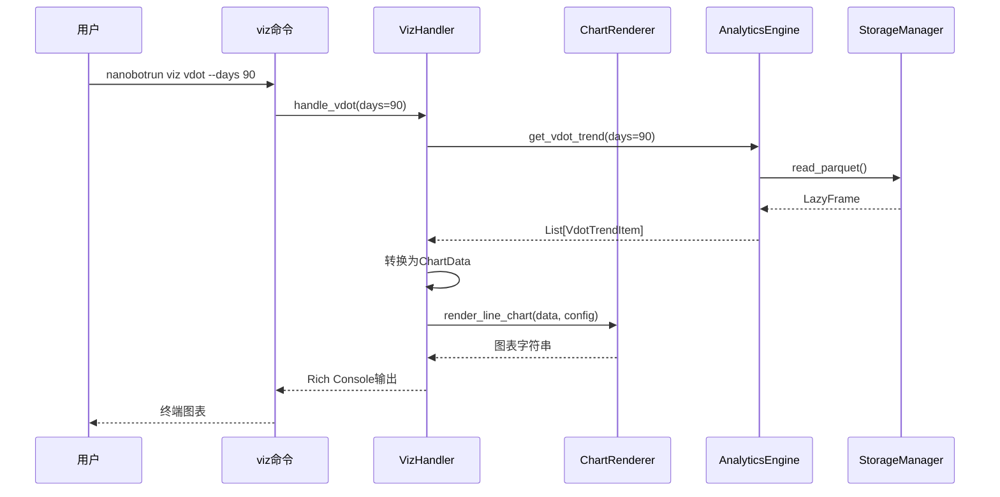
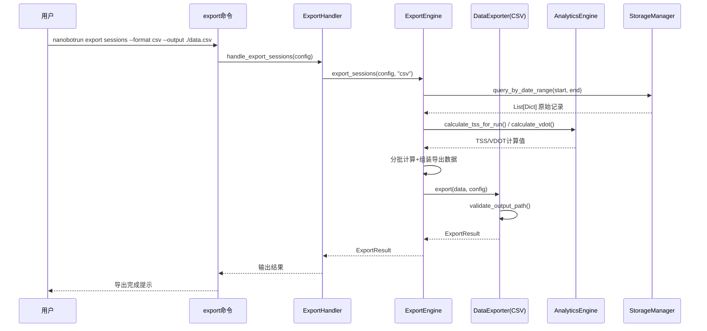
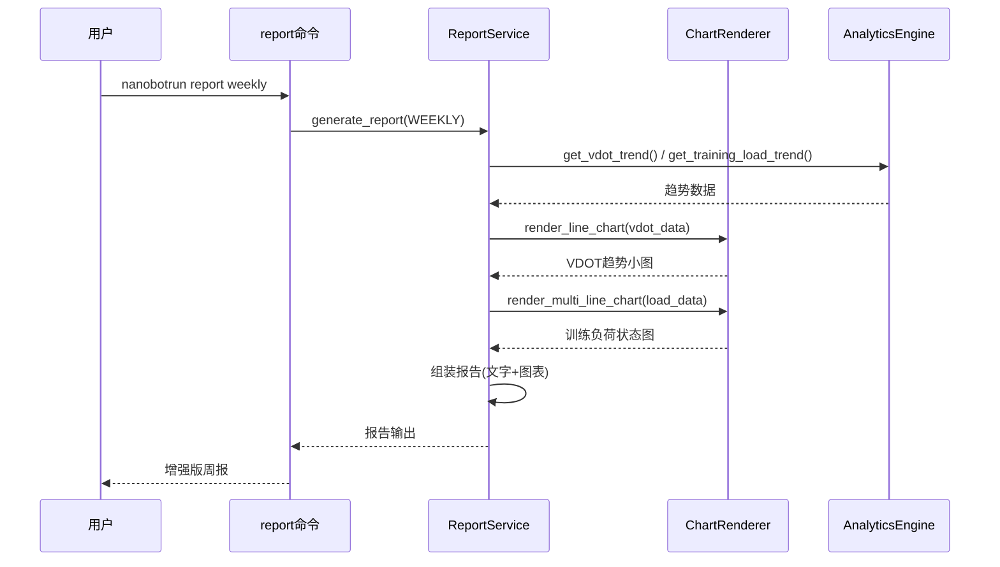

# v0.18.0 架构设计：数据可视化与导出

> **文档版本**: v1.1
> **设计日期**: 2026-05-03
> **版本基线**: v0.17.0
> **需求来源**: [PRD_v0.18.0_数据可视化与导出](../requirements/PRD_v0.18.0_数据可视化与导出.md) v1.1
> **对齐文档**: [架构设计说明书](架构设计说明书.md) v4.2.0
> **评审基线**: [架构评审报告_v0.18.0](review/架构评审报告_v0.18.0.md) v1.0

---

## 1. 设计概述

### 1.1 设计目标

基于 PRD v1.1 中定义的 6 个 P0 需求 + 6 个 P1 需求，设计**终端图表渲染**和**数据导出**两大核心模块的架构方案。

**核心设计约束**:
- 遵循现有 CLI 分层架构（commands → handlers → core）
- 通过 AppContext 依赖注入，不直接实例化核心组件
- 保持 LazyFrame 延迟求值，仅在最终输出时 collect()
- 新增依赖仅 `plotext`（P0），`openpyxl`（P1可选）

### 1.2 设计原则

| 原则 | 说明 | 实施策略 |
|------|------|---------|
| **渲染器可替换** | 图表渲染后端可切换 | `ChartRenderer` Protocol 抽象 |
| **导出器可扩展** | 新增导出格式只需实现接口 | `DataExporter` Protocol 抽象 |
| **数据源复用** | 图表/报告/导出共用同一数据查询路径 | 可视化通过 AnalyticsEngine/SessionRepository 获取数据；导出通过 StorageManager 获取原始记录 |
| **降级容错** | 图表渲染失败不阻塞核心功能 | try/except 降级为纯文字 |
| **终端自适应** | 图表宽度适配终端宽度 | 检测 `shutil.get_terminal_size()` |

---

## 2. 技术栈选型

### 2.1 新增依赖

| 依赖 | 版本 | 用途 | 优先级 | 选型理由 |
|------|------|------|--------|---------|
| `plotext` | >=5.0 | 终端内图表渲染 | P0 | 纯Python，无系统依赖，支持折线图/柱状图/散点图 |
| `openpyxl` | >=3.1 | Excel导出 | P1可选 | Python生态标准Excel库，成熟稳定 |

### 2.2 已有依赖复用

| 依赖 | 用途 |
|------|------|
| `rich` | 表格/布局/Console输出（已集成） |
| `polars` | 数据查询/CSV/JSON/Parquet导出（已集成） |
| `typer` | CLI命令定义（已集成） |

### 2.3 plotext 能力验证

| 图表类型 | plotext API | 支持状态 | 对应需求 |
|----------|------------|---------|---------|
| 折线图 | `plt.plot()` | ✅ 完整支持 | REQ-0.18-01, REQ-0.18-02 |
| 多线折线图 | `plt.plot()` 多次调用 | ✅ 完整支持 | REQ-0.18-02 |
| 堆叠柱状图 | `plt.bar()` + 手动堆叠 | ⚠️ 需验证 | REQ-0.18-03 |
| 柱状图 | `plt.bar()` | ✅ 完整支持 | REQ-0.18-07 |
| 热力图 | 无原生支持 | ❌ 需备选 | REQ-0.18-08 |

**备选方案**: 堆叠柱状图若 plotext 不支持，降级为 Rich Table 百分比展示；热力图使用 Rich Table + 颜色编码模拟。

---

## 3. 模块架构

### 3.1 整体架构图



### 3.2 新增文件结构

```
src/
├── cli/
│   ├── commands/
│   │   ├── viz.py              # 新增：可视化命令（viz vdot/load/hr-zones/...）
│   │   └── export.py           # 新增：导出命令（export sessions/summary/...）
│   └── handlers/
│       ├── viz_handler.py      # 新增：可视化业务逻辑调用层
│       └── export_handler.py   # 新增：导出业务逻辑调用层
├── core/
│   ├── visualization/          # 新增：可视化核心模块
│   │   ├── __init__.py
│   │   ├── renderer.py         # ChartRenderer Protocol 定义
│   │   ├── plotext_renderer.py # plotext 渲染实现
│   │   └── models.py           # 图表数据模型
│   └── export/                 # 新增：导出核心模块
│       ├── __init__.py
│       ├── engine.py           # ExportEngine + DataExporter Protocol 定义
│       ├── csv_exporter.py     # CSV 导出实现
│       ├── json_exporter.py    # JSON 导出实现
│       ├── parquet_exporter.py # Parquet 导出实现
│       └── models.py           # 导出数据模型
```

### 3.3 AppContext 扩展

新增组件通过 `@property` 懒加载模式注册到 AppContext（与现有 `training_reminder_manager` 等扩展组件一致）：

```python
# context.py 新增属性

@property
def chart_renderer(self) -> Any:
    """获取图表渲染器（v0.18.0新增）"""
    from src.core.visualization.renderer import ChartRenderer
    from src.core.visualization.plotext_renderer import PlotextRenderer

    renderer = self.get_extension("chart_renderer")
    if renderer is None:
        renderer = PlotextRenderer()
        self.set_extension("chart_renderer", renderer)
    return renderer

@property
def export_engine(self) -> Any:
    """获取导出引擎（v0.18.0新增）"""
    from src.core.export.engine import ExportEngine

    engine = self.get_extension("export_engine")
    if engine is None:
        engine = ExportEngine(
            storage=self.storage,
            analytics=self.analytics,
        )
        self.set_extension("export_engine", engine)
    return engine
```

### 3.4 CLI 命令注册

```python
# app.py 新增注册
from src.cli.commands import viz_app, export_app

app.add_typer(viz_app, name="viz")
app.add_typer(export_app, name="export")
```

```python
# src/cli/commands/__init__.py 新增导出
from src.cli.commands.viz import app as viz_app
from src.cli.commands.export import app as export_app

# __all__ 列表新增
"viz_app",
"export_app",
```

---

## 4. 核心接口设计

### 4.1 ChartRenderer Protocol

```python
# src/core/visualization/renderer.py

from typing import Protocol, runtime_checkable

from src.core.visualization.models import ChartConfig, ChartData


@runtime_checkable
class ChartRenderer(Protocol):
    """图表渲染器协议

    抽象图表渲染接口，支持切换不同渲染后端（plotext/matplotlib/rich-native）。
    """

    def render_line_chart(self, data: ChartData, config: ChartConfig) -> str:
        """渲染折线图

        Args:
            data: 图表数据（x轴标签 + y轴数据系列）
            config: 图表配置（标题/颜色/尺寸等）

        Returns:
            str: 渲染后的图表字符串（可被Rich Console输出）
        """
        ...

    def render_multi_line_chart(
        self, data: ChartData, config: ChartConfig
    ) -> str:
        """渲染多线折线图

        Args:
            data: 图表数据（x轴标签 + 多个y轴数据系列）
            config: 图表配置

        Returns:
            str: 渲染后的图表字符串
        """
        ...

    def render_bar_chart(self, data: ChartData, config: ChartConfig) -> str:
        """渲染柱状图

        Args:
            data: 图表数据
            config: 图表配置

        Returns:
            str: 渲染后的图表字符串
        """
        ...

    def render_stacked_bar_chart(
        self, data: ChartData, config: ChartConfig
    ) -> str:
        """渲染堆叠柱状图

        注意: plotext 对堆叠柱状图支持有限。
        若渲染后端不支持，应降级为 Rich Table 文本展示，
        不应抛出异常阻塞调用方。降级时返回 Rich Table 格式的
        百分比分布文本字符串。

        Args:
            data: 图表数据
            config: 图表配置

        Returns:
            str: 渲染后的图表字符串（或降级文本）
        """
        ...
```

### 4.2 ChartData / ChartConfig 数据模型

```python
# src/core/visualization/models.py

from dataclasses import dataclass, field


@dataclass(frozen=True)
class DataSeries:
    """数据系列"""
    name: str
    values: list[float]
    color: str = "white"


@dataclass(frozen=True)
class ChartData:
    """图表数据"""
    x_labels: list[str]
    series: list[DataSeries]
    x_title: str = ""
    y_title: str = ""


@dataclass(frozen=True)
class ChartConfig:
    """图表配置"""
    title: str
    width: int = 80
    height: int = 20
    show_legend: bool = True
    show_grid: bool = True
    annotate_extremes: bool = True
```

### 4.3 DataExporter Protocol

```python
# src/core/export/engine.py

from pathlib import Path
from typing import Protocol, runtime_checkable

from src.core.export.models import ExportConfig, ExportResult


@runtime_checkable
class DataExporter(Protocol):
    """数据导出器协议

    抽象导出接口，支持扩展新的导出格式。
    """

    @property
    def format_name(self) -> str:
        """导出格式名称（csv/json/parquet）"""
        ...

    def export(self, data: dict, config: ExportConfig) -> ExportResult:
        """执行导出

        Args:
            data: 导出数据（由ExportEngine准备）
            config: 导出配置（路径/字段/编码等）

        Returns:
            ExportResult: 导出结果
        """
        ...

    def validate_output_path(self, path: Path) -> Path:
        """校验并规范化输出路径

        Args:
            path: 用户指定的输出路径

        Returns:
            Path: 规范化后的绝对路径

        Raises:
            ValueError: 路径不合法（穿越攻击等）
        """
        ...
```

### 4.4 ExportConfig / ExportResult 数据模型

```python
# src/core/export/models.py

from dataclasses import dataclass
from pathlib import Path


@dataclass(frozen=True)
class ExportConfig:
    """导出配置"""
    output_path: Path
    start_date: str | None = None
    end_date: str | None = None
    include_computed_fields: bool = True
    encoding: str = "utf-8"


@dataclass(frozen=True)
class ExportResult:
    """导出结果"""
    success: bool
    file_path: Path | None = None
    record_count: int = 0
    error: str = ""
    elapsed_ms: int = 0
```

### 4.5 ExportEngine

```python
# src/core/export/engine.py（核心逻辑）

class ExportEngine:
    """导出引擎

    统一管理多种导出格式，协调数据查询和格式化输出。
    数据查询统一通过 StorageManager 获取原始 dict 记录，
    以保留 Parquet 原始列名（session_total_distance 等），
    便于 TSS/VDOT 等计算字段的分批计算。
    """

    def __init__(
        self,
        storage: StorageManager,
        analytics: AnalyticsEngine,
    ) -> None:
        self.storage = storage
        self.analytics = analytics
        self._exporters: dict[str, DataExporter] = {}
        self._register_default_exporters()

    def _register_default_exporters(self) -> None:
        """注册默认导出器"""
        from src.core.export.csv_exporter import CsvExporter
        from src.core.export.json_exporter import JsonExporter
        from src.core.export.parquet_exporter import ParquetExporter

        self._exporters["csv"] = CsvExporter()
        self._exporters["json"] = JsonExporter()
        self._exporters["parquet"] = ParquetExporter()

    def get_exporter(self, format_name: str) -> DataExporter:
        """获取指定格式的导出器"""
        exporter = self._exporters.get(format_name)
        if exporter is None:
            raise ValueError(f"不支持的导出格式: {format_name}")
        return exporter

    def export_sessions(self, config: ExportConfig, format_name: str) -> ExportResult:
        """导出训练记录"""
        ...

    def export_summary(
        self, config: ExportConfig, format_name: str, period: str
    ) -> ExportResult:
        """导出指标摘要"""
        ...

    def _prepare_session_data(self, config: ExportConfig) -> dict:
        """准备训练记录导出数据（含计算字段分批计算）

        通过 StorageManager.query_by_date_range() 获取原始 dict 记录，
        保留 Parquet 原始列名（session_total_distance、session_total_timer_time、
        session_avg_heart_rate），便于 TSS/VDOT 计算。
        """
        ...

    def _prepare_summary_data(self, config: ExportConfig, period: str) -> dict:
        """准备指标摘要导出数据

        按聚合维度（weekly/monthly/yearly）分组统计，
        调用 StatisticsAggregator.get_running_summary() 获取聚合数据。

        Args:
            config: 导出配置（含日期范围）
            period: 聚合维度（weekly/monthly/yearly）

        Returns:
            dict: 包含 records（原始记录）和 summary_items（聚合结果列表）
        """
        ...

    def _validate_path(self, path: Path) -> Path:
        """校验输出路径安全性"""
        resolved = path.resolve()
        if ".." in str(path) or not str(resolved).startswith(str(Path.cwd())):
            raise ValueError(f"输出路径不合法: {path}")
        return resolved
```

---

## 5. 数据流设计

### 5.1 终端图表数据流



### 5.2 数据导出数据流



### 5.3 报告图表增强数据流



---

## 6. CLI 命令设计

### 6.1 viz 命令组

```python
# src/cli/commands/viz.py

app = typer.Typer(help="数据可视化命令")

@app.command()
def vdot(
    days: int = typer.Option(90, "--days", "-d", help="时间范围（天）"),
) -> None:
    """VDOT趋势图"""
    ...

@app.command()
def load(
    days: int = typer.Option(90, "--days", "-d", help="时间范围（天）"),
) -> None:
    """训练负荷曲线（CTL/ATL/TSB）"""
    ...

@app.command()
def hr_zones(
    start: str | None = typer.Option(None, "--start", help="开始日期(YYYY-MM-DD)"),
    end: str | None = typer.Option(None, "--end", help="结束日期(YYYY-MM-DD)"),
    period: str | None = typer.Option(None, "--period", help="聚合维度(P1: weekly/monthly)"),
) -> None:
    """心率区间分布图"""
    ...
```

### 6.2 export 命令组

```python
# src/cli/commands/export.py

app = typer.Typer(help="数据导出命令")

@app.command()
def sessions(
    start: str | None = typer.Option(None, "--start", help="开始日期(YYYY-MM-DD)"),
    end: str | None = typer.Option(None, "--end", help="结束日期(YYYY-MM-DD)"),
    format: str = typer.Option("csv", "--format", "-f", help="导出格式(csv/json/parquet)"),
    output: Path = typer.Option(..., "--output", "-o", help="输出文件路径"),
) -> None:
    """导出训练记录"""
    ...

@app.command()
def summary(
    period: str = typer.Option("monthly", "--period", "-p", help="聚合维度(weekly/monthly/yearly)"),
    format: str = typer.Option("csv", "--format", "-f", help="导出格式(csv/json)"),
    output: Path = typer.Option(..., "--output", "-o", help="输出文件路径"),
) -> None:
    """导出指标摘要"""
    ...
```

---

## 7. 关键实现策略

### 7.1 计算字段分批导出

```python
# ExportEngine._prepare_session_data 核心逻辑

BATCH_SIZE = 100

def _prepare_session_data(self, config: ExportConfig) -> dict:
    """分批准备训练记录导出数据

    通过 StorageManager.query_by_date_range() 获取原始 dict 记录，
    保留 Parquet 原始列名，便于 TSS/VDOT 计算。
    """
    from datetime import datetime

    start_dt = (
        datetime.strptime(config.start_date, "%Y-%m-%d")
        if config.start_date
        else None
    )
    end_dt = (
        datetime.strptime(config.end_date, "%Y-%m-%d")
        if config.end_date
        else None
    )

    records = self.storage.query_by_date_range(
        start_date=start_dt,
        end_date=end_dt,
    )

    if not records:
        return {"records": [], "computed": []}

    if not config.include_computed_fields:
        return {"records": records, "computed": []}

    computed_results: list[dict] = []
    for i in range(0, len(records), BATCH_SIZE):
        batch = records[i : i + BATCH_SIZE]
        for record in batch:
            distance = record.get("session_total_distance", 0)
            duration = record.get("session_total_timer_time", 0)
            avg_hr = record.get("session_avg_heart_rate")

            tss = self.analytics.calculate_tss_for_run(
                distance_m=distance,
                duration_s=duration,
                avg_heart_rate=avg_hr,
            ) if avg_hr else 0.0

            vdot = self.analytics.calculate_vdot(
                distance_m=distance,
                time_s=duration,
            ) if distance >= 1500 and duration > 0 else 0.0

            computed_results.append({"tss": tss, "vdot": vdot})

    return {"records": records, "computed": computed_results}
```

### 7.1.1 指标摘要导出数据准备

```python
# ExportEngine._prepare_summary_data 核心逻辑

def _prepare_summary_data(self, config: ExportConfig, period: str) -> dict:
    """准备指标摘要导出数据

    按聚合维度分组，调用 StatisticsAggregator.get_running_summary()
    获取各时段的聚合统计。
    """
    from datetime import datetime, timedelta

    start_dt = (
        datetime.strptime(config.start_date, "%Y-%m-%d")
        if config.start_date
        else None
    )
    end_dt = (
        datetime.strptime(config.end_date, "%Y-%m-%d")
        if config.end_date
        else None
    )

    records = self.storage.query_by_date_range(
        start_date=start_dt,
        end_date=end_dt,
    )

    if not records:
        return {"records": [], "summary_items": []}

    summary_items: list[dict] = []

    if period == "yearly":
        years = sorted(set(
            r.get("session_start_time", "")[:4]
            for r in records
            if r.get("session_start_time")
        ))
        for year_str in years:
            year = int(year_str)
            stats = self.analytics.statistics_aggregator.get_running_stats(
                year=year
            )
            summary_items.append({
                "period": year_str,
                **stats.to_dict(),
            })

    elif period == "monthly":
        months = sorted(set(
            r.get("session_start_time", "")[:7]
            for r in records
            if r.get("session_start_time")
        ))
        for month_str in months:
            month_start = datetime.strptime(month_str + "-01", "%Y-%m-%d")
            if month_start.month == 12:
                month_end = month_start.replace(year=month_start.year + 1, month=1)
            else:
                month_end = month_start.replace(month=month_start.month + 1)
            stats = self.analytics.statistics_aggregator.get_running_summary(
                start_date=month_start.strftime("%Y-%m-%d"),
                end_date=month_end.strftime("%Y-%m-%d"),
            )
            summary_items.append({
                "period": month_str,
                "total_runs": stats["total_runs"] if not stats.is_empty() else 0,
                "total_distance": stats["total_distance"][0] if not stats.is_empty() else 0,
                "total_duration": stats["total_duration"][0] if not stats.is_empty() else 0,
            })

    elif period == "weekly":
        if not records:
            return {"records": [], "summary_items": []}
        first_date = min(
            r.get("session_start_time", "")
            for r in records
            if r.get("session_start_time")
        )
        current = datetime.strptime(first_date[:10], "%Y-%m-%d")
        end = end_dt or datetime.now()
        while current <= end:
            week_end = current + timedelta(days=6)
            stats = self.analytics.statistics_aggregator.get_running_summary(
                start_date=current.strftime("%Y-%m-%d"),
                end_date=week_end.strftime("%Y-%m-%d"),
            )
            summary_items.append({
                "period": f"{current.strftime('%Y-%m-%d')}~{week_end.strftime('%Y-%m-%d')}",
                "total_runs": stats["total_runs"] if not stats.is_empty() else 0,
                "total_distance": stats["total_distance"][0] if not stats.is_empty() else 0,
                "total_duration": stats["total_duration"][0] if not stats.is_empty() else 0,
            })
            current = week_end + timedelta(days=1)

    return {"records": records, "summary_items": summary_items}
```

### 7.2 图表渲染降级策略

```python
# VizHandler 核心逻辑

def _render_with_fallback(
    self,
    render_fn: Callable[[], str],
    fallback_text: str,
) -> str:
    """图表渲染降级：渲染失败时返回纯文字"""
    try:
        return render_fn()
    except Exception as e:
        logger.warning(f"图表渲染失败，降级为文字: {e}")
        return fallback_text
```

```python
# PlotextRenderer 堆叠柱状图降级示例

def render_stacked_bar_chart(self, data: ChartData, config: ChartConfig) -> str:
    """渲染堆叠柱状图（降级容错）"""
    try:
        return self._try_stacked_bar(data, config)
    except Exception as e:
        logger.warning(f"堆叠柱状图渲染失败，降级为 Rich Table: {e}")
        return self._fallback_stacked_bar_as_table(data, config)

def _fallback_stacked_bar_as_table(self, data: ChartData, config: ChartConfig) -> str:
    """降级：使用 Rich Table 百分比展示替代堆叠柱状图"""
    from rich.console import Console
    from rich.table import Table

    table = Table(title=config.title)
    table.add_column("类别")
    for series in data.series:
        table.add_column(series.name)

    for i, label in enumerate(data.x_labels):
        row = [label]
        for series in data.series:
            if i < len(series.values):
                row.append(f"{series.values[i]:.1f}%")
            else:
                row.append("-")
        table.add_row(*row)

    console = Console(file=io.StringIO(), width=config.width)
    console.print(table)
    return console.file.getvalue()
```

### 7.3 终端宽度自适应

```python
import shutil

def get_chart_width() -> int:
    """获取终端宽度，用于图表尺寸自适应"""
    try:
        cols = shutil.get_terminal_size().columns
        return max(60, min(cols - 4, 120))
    except Exception:
        return 80
```

### 7.4 路径安全校验

```python
def validate_export_path(path: Path) -> Path:
    """校验导出路径安全性"""
    resolved = path.resolve()
    cwd = Path.cwd().resolve()
    if not str(resolved).startswith(str(cwd)):
        raise ValueError(f"输出路径必须在当前工作目录下: {path}")
    if ".." in path.parts:
        raise ValueError(f"输出路径包含非法路径穿越: {path}")
    return resolved
```

---

## 8. 与现有模块的交互

### 8.1 数据源映射表

| 需求 | 数据源方法 | 所属模块 | 返回类型 |
|------|-----------|---------|---------|
| REQ-0.18-01 VDOT趋势 | `analytics.get_vdot_trend(days)` | AnalyticsEngine | `list[VdotTrendItem]` |
| REQ-0.18-02 训练负荷曲线 | `analytics.get_training_load_trend(start_date, end_date, days)` | AnalyticsEngine | `dict` (结构见下方) |
| REQ-0.18-03 心率区间 | `analytics.heart_rate_analyzer.get_heart_rate_zones(age, start, end)` | HeartRateAnalyzer | `HRZoneResult` |
| REQ-0.18-04 训练记录导出 | `storage.query_by_date_range(start_date, end_date)` | StorageManager | `list[dict[str, Any]]` |
| REQ-0.18-05 指标摘要导出 | `analytics.statistics_aggregator.get_running_summary(start_date, end_date)` | StatisticsAggregator | `pl.DataFrame` |
| REQ-0.18-06 报告增强 | `report_service.generate_report()` + `chart_renderer` | ReportService + ChartRenderer | 报告+图表 |

**`get_training_load_trend()` 返回结构**:

```python
{
    "trend_data": [
        {
            "date": "2024-01-15",   # 日期
            "tss": 85.2,            # 当日 TSS 总和
            "atl": 52.1,            # 急性训练负荷（7天 EWMA）
            "ctl": 60.3,            # 慢性训练负荷（42天 EWMA）
            "tsb": 8.2,             # 训练压力平衡（CTL - ATL）
            "status": "体能充沛",    # 体能状态评估
        },
        ...
    ],
    "summary": {
        "current_atl": 52.1,       # 当前 ATL
        "current_ctl": 60.3,       # 当前 CTL
        "current_tsb": 8.2,        # 当前 TSB
        "status": "体能充沛",       # 当前体能状态
        "recommendation": "...",    # 训练建议
    },
    "days_analyzed": 90,           # 分析天数
    "total_runs": 45,              # 跑步次数
}
```

**`StorageManager.query_by_date_range()` 返回结构**:

返回 `list[dict[str, Any]]`，每条记录为 Parquet 原始行，关键字段：
- `session_start_time`: 会话开始时间
- `session_total_distance`: 总距离（米）
- `session_total_timer_time`: 总时长（秒）
- `session_avg_heart_rate`: 平均心率
- `max_heart_rate`: 最大心率
- `total_calories`: 总卡路里

### 8.2 ReportService 改造

现有 [ReportService](file:///d:/yecll/Documents/LocalCode/RunFlowAgent/src/core/report/service.py) 的 `generate_report()` 方法需要增加图表渲染调用。改造策略为**最小化修改**：在现有文字报告输出后追加图表渲染，不修改现有方法签名。

```python
# ReportService 改造策略（最小化修改）

def _generate_report_with_charts(
    self,
    report_data: DailyReportData | WeeklyReportData | MonthlyReportData,
    report_type: ReportType,
    console: Console,
) -> None:
    """生成报告（含图表增强）

    改造策略：在现有文字报告输出后追加图表渲染。
    图表渲染失败时静默降级，不阻塞报告主体输出。

    Args:
        report_data: 报告数据（DailyReportData | WeeklyReportData | MonthlyReportData）
        report_type: 报告类型
        console: Rich Console 实例，用于统一输出
    """
    # 1. 输出现有文字报告（复用现有逻辑，不修改）
    self._display_report(report_data, report_type, console)

    # 2. 渲染并输出图表
    self._render_and_append_charts(report_data, report_type, console)

def _display_report(
    self,
    report_data: DailyReportData | WeeklyReportData | MonthlyReportData,
    report_type: ReportType,
    console: Console,
) -> None:
    """输出文字报告（复用现有 _generate_weekly_report / _generate_monthly_report 逻辑）

    注意: 不修改现有报告生成逻辑，仅将输出统一通过 console 参数传递。
    """
    ...

def _render_and_append_charts(
    self,
    report_data: DailyReportData | WeeklyReportData | MonthlyReportData,
    report_type: ReportType,
    console: Console,
) -> None:
    """渲染并追加图表到报告输出

    仅对 WeeklyReportData 和 MonthlyReportData 渲染图表，
    DailyReportData 不含趋势数据，跳过图表渲染。
    图表渲染失败时静默降级，不抛出异常。
    """
    try:
        context = get_context()
        renderer = context.chart_renderer

        if isinstance(report_data, WeeklyReportData | MonthlyReportData):
            # VDOT 趋势小图
            if hasattr(report_data, "vdot_trend") and report_data.vdot_trend:
                vdot_chart = self._build_vdot_chart(report_data.vdot_trend, renderer)
                if vdot_chart:
                    console.print(vdot_chart)

            # 训练负荷状态图
            if hasattr(report_data, "training_load_trend") and report_data.training_load_trend:
                load_chart = self._build_load_chart(
                    report_data.training_load_trend, renderer
                )
                if load_chart:
                    console.print(load_chart)

    except Exception as e:
        logger.warning(f"报告图表渲染失败，已降级为纯文字: {e}")

def _build_vdot_chart(self, vdot_trend: list, renderer: ChartRenderer) -> str | None:
    """构建 VDOT 趋势图表数据"""
    try:
        from src.core.visualization.models import ChartData, ChartConfig, DataSeries

        data = ChartData(
            x_labels=[item.date for item in vdot_trend],
            series=[DataSeries(name="VDOT", values=[item.vdot for item in vdot_trend])],
            x_title="日期",
            y_title="VDOT",
        )
        config = ChartConfig(title="VDOT 趋势", width=get_chart_width(), height=12)
        return renderer.render_line_chart(data, config)
    except Exception as e:
        logger.warning(f"VDOT图表构建失败: {e}")
        return None

def _build_load_chart(self, load_trend: dict, renderer: ChartRenderer) -> str | None:
    """构建训练负荷状态图表数据"""
    try:
        from src.core.visualization.models import ChartData, ChartConfig, DataSeries

        trend_data = load_trend.get("trend_data", [])
        data = ChartData(
            x_labels=[item["date"] for item in trend_data],
            series=[
                DataSeries(name="CTL", values=[item["ctl"] for item in trend_data], color="green"),
                DataSeries(name="ATL", values=[item["atl"] for item in trend_data], color="red"),
                DataSeries(name="TSB", values=[item["tsb"] for item in trend_data], color="cyan"),
            ],
            x_title="日期",
            y_title="负荷",
        )
        config = ChartConfig(title="训练负荷状态", width=get_chart_width(), height=12)
        return renderer.render_multi_line_chart(data, config)
    except Exception as e:
        logger.warning(f"训练负荷图表构建失败: {e}")
        return None
```

---

## 9. 测试策略

### 9.1 单元测试

| 测试目标 | 测试文件 | 覆盖重点 |
|---------|---------|---------|
| ChartRenderer Protocol | `tests/unit/test_renderer.py` | 接口合规性 |
| PlotextRenderer | `tests/unit/test_plotext_renderer.py` | 各图表类型渲染 |
| ChartData/ChartConfig | `tests/unit/test_viz_models.py` | 数据模型序列化 |
| ExportEngine | `tests/unit/test_export_engine.py` | 导出流程/路径校验 |
| CsvExporter | `tests/unit/test_csv_exporter.py` | CSV格式/编码/BOM |
| JsonExporter | `tests/unit/test_json_exporter.py` | JSON格式/结构 |
| ParquetExporter | `tests/unit/test_parquet_exporter.py` | Parquet格式/Schema |

### 9.2 集成测试

| 测试场景 | 测试文件 | 覆盖重点 |
|---------|---------|---------|
| VDOT趋势图端到端 | `tests/integration/test_viz_e2e.py` | CLI→Handler→Renderer→输出 |
| 训练记录导出端到端 | `tests/integration/test_export_e2e.py` | CLI→Handler→Engine→文件 |
| 报告图表增强 | `tests/integration/test_report_charts.py` | 报告输出含图表 |

### 9.3 Mock 策略

- **Mock AnalyticsEngine**: 图表渲染测试不需要真实数据
- **Mock StorageManager**: 导出测试使用构造的测试数据
- **禁止 Mock ChartRenderer**: 集成测试必须验证真实渲染输出
- **禁止 Mock DataExporter**: 导出测试必须验证真实文件输出

### 9.4 覆盖率目标

| 模块 | 覆盖率目标 | 说明 |
|------|-----------|------|
| `core/visualization/` | ≥ 80% | 核心渲染逻辑，含降级路径 |
| `core/export/` | ≥ 80% | 核心导出逻辑，含路径校验 |
| `cli/handlers/` | ≥ 70% | Handler 层，含参数校验 |

---

## 10. 风险与缓解

| 风险 | 等级 | 缓解措施 | 残余风险 |
|------|------|---------|---------|
| plotext 堆叠柱状图不支持 | 中 | 降级为 Rich Table 百分比展示 | 低 |
| plotext 与 Windows CMD 兼容性 | 中 | 测试 Windows Terminal/PowerShell；备选 Rich 原生图表 | 低 |
| 计算字段导出性能 | 中 | 分批计算(BATCH_SIZE=100)+进度显示 | 低 |
| 图表渲染失败阻塞报告 | 低 | try/except 降级为纯文字 | 极低 |
| 路径穿越攻击 | 低 | `validate_export_path()` 安全校验 | 极低 |
| SessionSummary 缺少计算所需原始字段 | 中 | 导出模块统一使用 `StorageManager.query_by_date_range()` 获取原始 dict，保留 `session_total_distance`/`session_total_timer_time`/`session_avg_heart_rate` 等原始列名 | 极低 |
| plotext 与 Rich Console 输出冲突 | 低 | plotext 使用 `plt.build()` 返回字符串，统一通过 `console.print()` 输出，避免 `print()` 与 `console.print()` 乱序 | 极低 |

---

## 11. 变更记录

| 版本 | 日期 | 变更内容 | 作者 |
|------|------|---------|------|
| v1.0 | 2026-05-03 | 初始版本，完成v0.18.0架构设计 | 架构师 |
| v1.1 | 2026-05-03 | 根据架构评审报告修订：C-01修正SessionRepository方法名→统一StorageManager；C-02统一数据获取路径；C-03补充ChartRenderer降级行为定义；M-01补充__init__.py更新；M-02补充覆盖率目标；M-03完善ReportService改造接口；M-04补充get_training_load_trend返回结构；M-05补充_prepare_summary_data逻辑；补充2项风险 | 架构师 |
