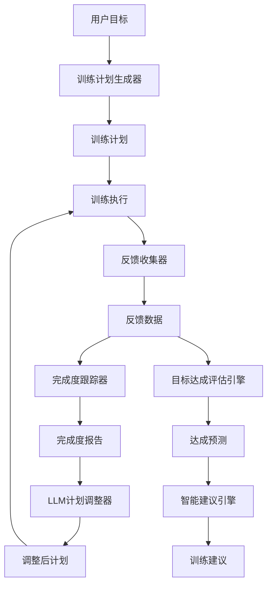

# 架构设计说明书更新分析报告

> **文档版本**: v1.0  
> **创建日期**: 2026-04-22  
> **分析对象**: 架构设计说明书.md (v1.2.0 → v2.0.0)  
> **对齐依据**: 产品规划方案.md (v2.0) + REQ_需求规格说明书.md (v3.0)

---

## 1. 架构设计要点识别

### 1.1 产品规划核心要点

| 维度 | 产品规划要求 | 架构设计影响 |
|------|-------------|-------------|
| **产品定位** | 单用户本地数据管理工具 | 系统架构必须轻量化、本地化 |
| **核心价值** | 隐私优先、专业分析、AI赋能、高性能 | 架构需支持本地存储、AI集成、高性能计算 |
| **明确边界** | ❌多租户、❌Web UI、❌云端存储、❌实时流处理 | 架构设计必须严格遵循边界约束 |
| **技术基线** | Python 3.11+、Polars、Parquet、nanobot-ai | 技术栈选型必须完全一致 |
| **质量门禁** | 测试覆盖率≥80%、mypy零错误、ruff零警告 | 架构需支持测试、类型检查、代码规范 |

### 1.2 需求规格核心要点

| 维度 | 需求规格要求 | 架构设计影响 |
|------|-------------|-------------|
| **功能模块** | 10个核心功能模块（数据导入、存储、分析、Agent等） | 模块划分必须覆盖所有功能 |
| **非功能需求** | 性能、可靠性、安全性、可维护性 | 架构需满足非功能需求指标 |
| **技术约束** | Python 3.11+、本地部署、Polars 0.20+、nanobot-ai | 技术选型必须符合约束 |
| **业务约束** | 单用户、本地存储、FIT格式、无实时流处理 | 架构设计必须遵循约束 |
| **接口规范** | CLI、Agent、飞书通知、LLM Provider | 接口设计必须完整覆盖 |

### 1.3 版本规划要点

| 版本 | 产品规划状态 | 需求规格状态 | 架构设计影响 |
|------|-------------|-------------|-------------|
| v0.5 MVP | ✅ 已完成 | ✅ 已完成 | 已实现架构 |
| v0.8 核心功能 | ✅ 已完成 | ✅ 已完成 | 已实现架构 |
| v0.9.0 架构重构 | ✅ 已完成 | ✅ 已完成 | 已实现架构 |
| v0.9.4 配置管理 | ✅ 已完成 | ✅ 已完成 | 已实现架构 |
| v0.9.5 架构解耦 | ✅ 已完成 | ✅ 已完成 | 已实现架构 |
| v0.10.0-v0.12.0 智能跑步计划 | ✅ 已完成 | ✅ 已完成 | 已实现架构 |
| v1.0 稳定版 | 📋 计划中 | 📋 计划中 | 需规划架构 |
| v1.1 数据可视化增强 | 📋 规划中 | 📋 规划中 | 需规划架构 |
| v1.2 分析能力扩展 | 📋 规划中 | 📋 规划中 | 需规划架构 |
| v1.3 体验优化 | 📋 规划中 | 📋 规划中 | 需规划架构 |

---

## 2. 现有架构设计偏差分析

### 2.1 版本规划偏差

| 偏差项 | 现有架构设计 | 产品规划要求 | 偏差程度 | 处理方式 |
|--------|-------------|-------------|---------|---------|
| v0.9.5状态 | 未明确标注 | ✅ 已完成 | 中 | 更新状态标记 |
| v0.10.0-v0.12.0 | 未包含 | ✅ 已完成 | 高 | 新增架构设计 |
| v1.0规划 | 未详细设计 | 📋 计划中 | 高 | 新增架构设计 |
| v1.1-v1.3规划 | 未包含 | 📋 规划中 | 高 | 新增架构规划 |

### 2.2 功能模块偏差

| 偏差项 | 现有架构设计 | 需求规格要求 | 偏差程度 | 处理方式 |
|--------|-------------|-------------|---------|---------|
| 智能跑步计划 | 未详细设计 | ✅ 已完成 | 高 | 新增架构设计 |
| 数据可视化 | 未详细设计 | 📋 规划中 | 中 | 新增架构规划 |
| 分析能力扩展 | 未详细设计 | 📋 规划中 | 中 | 新增架构规划 |

### 2.3 技术栈偏差

| 技术组件 | 现有架构设计 | 产品规划要求 | 偏差程度 | 处理方式 |
|---------|-------------|-------------|---------|---------|
| nanobot-ai | 未明确版本 | Latest | 低 | 明确版本管理策略 |
| Polars | 0.20+ | 0.20+ | 无 | 保持一致 |
| Python | 3.11+ | 3.11+ | 无 | 保持一致 |

### 2.4 系统边界偏差

| 边界项 | 现有架构设计 | 产品规划边界 | 偏差程度 | 处理方式 |
|--------|-------------|-------------|---------|---------|
| 单用户场景 | ✅ 符合 | ✅ 单用户本地场景 | 无 | 保持一致 |
| 本地存储 | ✅ 符合 | ✅ 本地存储 | 无 | 保持一致 |
| CLI交互 | ✅ 符合 | ✅ CLI交互 | 无 | 保持一致 |
| Agent交互 | ✅ 符合 | ✅ Agent交互 | 无 | 保持一致 |

---

## 3. 架构设计更新清单

### 3.1 必须更新的内容

| 序号 | 更新类型 | 更新内容 | 更新依据 | 优先级 |
|------|---------|---------|---------|--------|
| 1 | 版本状态更新 | v0.9.5标记为"已完成" | 产品规划2.2 | P0 |
| 2 | 新增架构设计 | v0.10.0-v0.12.0智能跑步计划架构 | 产品规划3.1 | P0 |
| 3 | 新增架构规划 | v1.0稳定版架构设计 | 产品规划3.2 | P0 |
| 4 | 新增架构规划 | v1.1-v1.3版本架构规划 | 产品规划3.2 | P1 |
| 5 | 技术栈补充 | nanobot-ai版本管理策略 | 产品规划4.1 | P1 |
| 6 | 模块补充 | 智能跑步计划模块架构 | 需求规格2.4.3 | P0 |

### 3.2 建议优化的内容

| 序号 | 优化类型 | 优化内容 | 优化依据 | 优先级 |
|------|---------|---------|---------|--------|
| 1 | 架构图优化 | 补充智能跑步计划模块架构图 | 需求规格2.4.3 | P1 |
| 2 | 接口补充 | 补充智能跑步计划相关接口 | 需求规格2.4.3 | P1 |
| 3 | 数据流补充 | 补充训练计划数据流设计 | 需求规格2.4.3 | P1 |
| 4 | 性能指标补充 | 补充智能跑步计划性能指标 | 需求规格3.1 | P1 |

### 3.3 保持不变的内容

| 序号 | 内容类型 | 内容描述 | 保持原因 |
|------|---------|---------|---------|
| 1 | 核心架构 | 整体架构分层设计 | 与产品规划完全一致 |
| 2 | 技术栈选型 | Python、Polars、Parquet、nanobot-ai | 与产品规划完全一致 |
| 3 | 系统边界 | 单用户、本地存储、CLI交互 | 与产品规划完全一致 |
| 4 | 质量门禁 | 测试覆盖率、类型检查、代码规范 | 与产品规划完全一致 |
| 5 | 依赖注入架构 | AppContext、模块化设计 | 与产品规划完全一致 |

---

## 4. 架构设计更新策略

### 4.1 更新原则

| 原则 | 说明 | 实施策略 |
|------|------|---------|
| **完全对齐** | 架构设计必须与产品规划、需求规格完全一致 | 逐项验证，偏差率0% |
| **版本驱动** | 架构设计按版本规划演进 | 每个版本独立设计，明确依赖关系 |
| **增量更新** | 保持现有架构稳定，增量补充新内容 | 不破坏现有架构，向后兼容 |
| **可追溯性** | 所有变更可追溯到需求来源 | 明确标注变更依据 |

### 4.2 更新优先级

| 优先级 | 更新内容 | 预计工作量 | 完成时间 |
|--------|---------|-----------|---------|
| P0 | v0.10.0-v0.12.0智能跑步计划架构 | 高 | 优先完成 |
| P0 | v1.0稳定版架构设计 | 中 | 优先完成 |
| P1 | v1.1-v1.3版本架构规划 | 中 | 次优先 |
| P1 | 技术栈补充和优化 | 低 | 最后完成 |

### 4.3 验证标准

| 验证维度 | 验证标准 | 验证方法 |
|---------|---------|---------|
| 完整性 | 覆盖所有产品规划版本 | 逐版本检查 |
| 一致性 | 与产品规划、需求规格完全一致 | 逐项对比验证 |
| 可实施性 | 架构设计可落地实施 | 技术可行性评估 |
| 可维护性 | 架构清晰、易于理解 | 架构评审 |

---

## 5. 智能跑步计划架构设计要点

### 5.1 核心模块识别

| 模块名称 | 职责 | 核心类 | 版本 |
|---------|------|--------|------|
| **训练计划生成器** | 生成个性化训练计划 | `TrainingPlanGenerator` | v0.10.0 |
| **训练执行反馈收集器** | 收集训练执行反馈 | `TrainingFeedbackCollector` | v0.10.0 |
| **计划完成度跟踪器** | 跟踪计划完成度 | `PlanCompletionTracker` | v0.10.0 |
| **LLM驱动计划调整器** | 基于LLM调整计划 | `LLMPlanAdjuster` | v0.11.0 |
| **目标达成评估引擎** | 评估目标达成情况 | `GoalPredictionEngine` | v0.12.0 |
| **长期周期规划器** | 生成长期周期规划 | `LongTermPlanGenerator` | v0.12.0 |
| **智能训练建议引擎** | 生成智能训练建议 | `SmartAdviceEngine` | v0.12.0 |

### 5.2 核心接口设计

| 接口名称 | 输入 | 输出 | 职责 |
|---------|------|------|------|
| `generate_plan()` | 用户目标、当前能力 | 训练计划 | 生成训练计划 |
| `collect_feedback()` | 训练执行记录 | 反馈数据 | 收集训练反馈 |
| `track_completion()` | 训练计划、执行记录 | 完成度报告 | 跟踪完成度 |
| `adjust_plan()` | 当前计划、反馈数据 | 调整后计划 | 调整训练计划 |
| `predict_goal()` | 训练数据、目标 | 达成预测 | 预测目标达成 |
| `generate_long_term_plan()` | 长期目标 | 长期规划 | 生成长期规划 |
| `generate_advice()` | 训练数据、上下文 | 训练建议 | 生成智能建议 |

### 5.3 数据流设计

### 5.4 性能指标

| 指标 | 要求 | 版本 |
|------|------|------|
| 训练计划生成时间 | < 5秒 | v0.10.0 |
| 反馈收集响应时间 | < 1秒 | v0.10.0 |
| 完成度计算时间 | < 500ms | v0.10.0 |
| LLM计划调整时间 | < 10秒 | v0.11.0 |
| 目标达成预测时间 | < 3秒 | v0.12.0 |
| 智能建议生成时间 | < 5秒 | v0.12.0 |

---

## 6. v1.0稳定版架构设计要点

### 6.1 核心目标

| 目标 | 说明 | 架构影响 |
|------|------|---------|
| API稳定化 | CLI命令参数稳定，向后兼容 | 接口版本管理 |
| 文档完善 | 用户指南、API文档、示例补充 | 文档架构设计 |
| Bug修复 | 解决v0.12.0遗留问题 | 架构优化 |
| 性能基准 | 建立性能测试基准 | 性能测试架构 |

### 6.2 架构优化点

| 优化项 | 说明 | 实施策略 |
|--------|------|---------|
| 接口版本管理 | CLI命令参数版本化 | 引入版本号机制 |
| 文档架构 | 文档分类、索引、搜索 | 文档目录结构设计 |
| 性能测试 | 性能基准测试框架 | 测试架构设计 |
| 错误处理 | 统一错误处理机制 | 异常处理架构 |

---

## 7. 更新实施计划

### 7.1 实施步骤

| 步骤 | 内容 | 预计时间 | 负责人 |
|------|------|---------|--------|
| 1 | 更新版本状态标记 | 0.5小时 | 架构师 |
| 2 | 新增v0.10.0-v0.12.0架构设计 | 2小时 | 架构师 |
| 3 | 新增v1.0架构设计 | 1.5小时 | 架构师 |
| 4 | 新增v1.1-v1.3架构规划 | 1小时 | 架构师 |
| 5 | 技术栈补充和优化 | 0.5小时 | 架构师 |
| 6 | 架构图优化和补充 | 1小时 | 架构师 |
| 7 | 一致性验证 | 0.5小时 | 架构师 |

### 7.2 验证计划

| 验证项 | 验证方法 | 验证标准 | 验证时间 |
|--------|---------|---------|---------|
| 完整性验证 | 逐版本检查 | 覆盖所有版本 | 更新完成后 |
| 一致性验证 | 逐项对比 | 偏差率0% | 更新完成后 |
| 可实施性验证 | 技术评审 | 可落地实施 | 更新完成后 |
| 可维护性验证 | 架构评审 | 清晰易懂 | 更新完成后 |

---

## 8. 风险评估

### 8.1 技术风险

| 风险 | 概率 | 影响 | 应对策略 |
|------|------|------|---------|
| 架构设计不完整 | 低 | 高 | 严格按产品规划逐项设计 |
| 架构设计不一致 | 低 | 高 | 逐项验证，偏差率0% |
| 架构设计不可实施 | 中 | 高 | 技术可行性评估 |

### 8.2 进度风险

| 风险 | 概率 | 影响 | 应对策略 |
|------|------|------|---------|
| 更新时间超预期 | 中 | 中 | 合理规划时间，预留缓冲 |
| 验证时间不足 | 低 | 中 | 预留充足验证时间 |

---

## 9. 附录

### 9.1 参考文档

- 产品规划方案.md (v2.0)
- REQ_需求规格说明书.md (v3.0)
- 架构设计说明书.md (v1.2.0)
- AGENTS.md (开发指南)
- project-rules.md (项目基线)

### 9.2 变更记录

| 版本 | 日期 | 变更内容 | 作者 |
|------|------|----------|------|
| v1.0 | 2026-04-22 | 初始版本，建立架构设计更新分析 | 架构师 |

---

*本报告遵循架构设计规范，确保架构设计与产品规划、需求规格完全一致*
