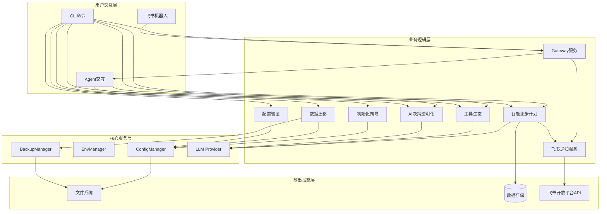
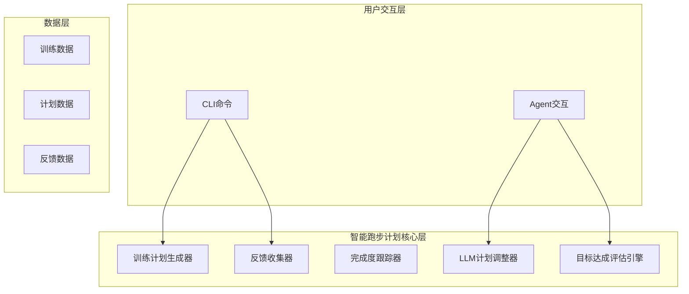
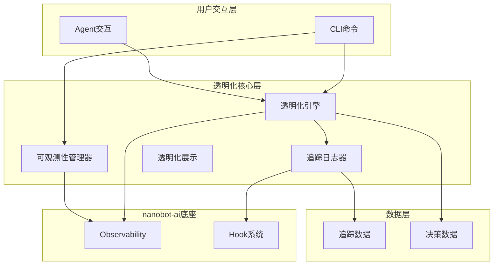
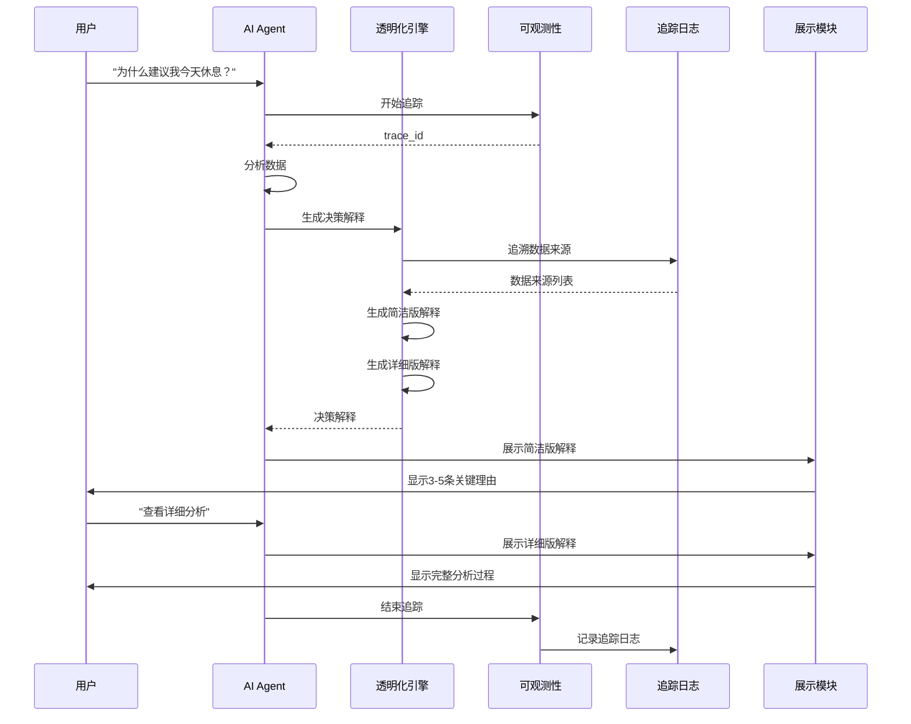
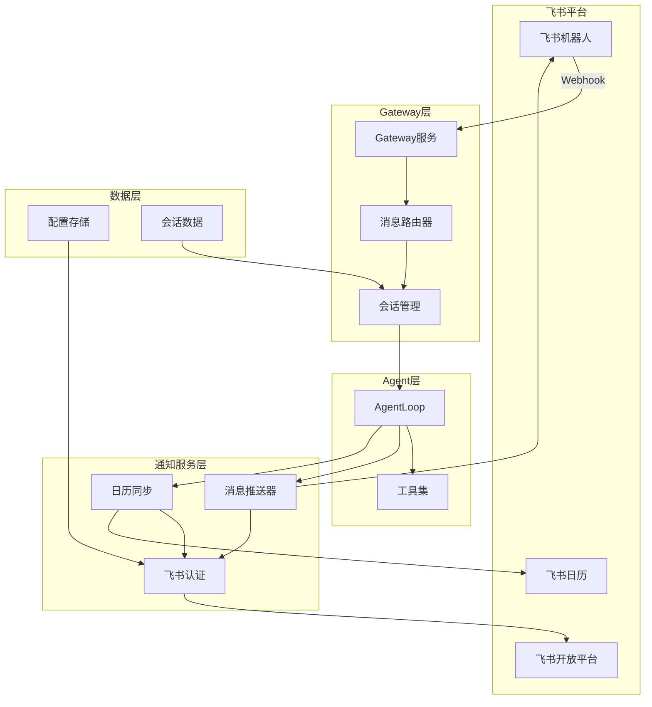
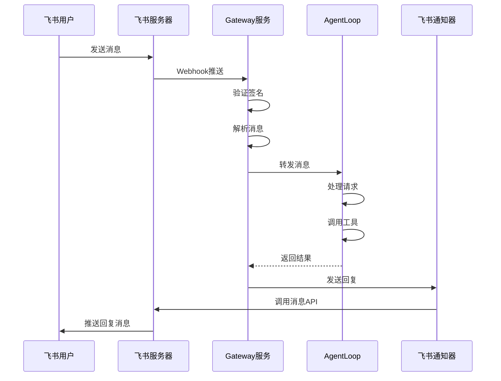
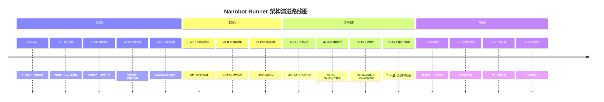

# 架构设计说明书

> **文档版本**: v4.1.0  
> **设计日期**: 2026-04-17  
> **更新日期**: 2026-04-29  
> **版本目标**: v0.16.0 Core模块化重构版  
> **需求来源**: REQ_需求规格说明书.md (v4.0)  
> **对齐依据**: 探索版本产品规划_v0.13-0.15.md (v3.0)

> **项目性质说明**: 本项目为**个人使用且个人开发的项目**，所有设计和需求均围绕单人开发和使用场景展开。

---

## 1. 执行摘要

### 1.1 架构设计目标

本文档描述Nanobot Runner的整体架构设计，覆盖从v0.5 MVP到v1.3体验优化的完整架构演进路径。

**核心架构目标**:
- **v0.5-v0.9.5（已完成）**: 构建稳定的技术底座，实现核心功能模块化
- **v0.10.0-v0.12.0（已完成）**: 构建数据驱动的自适应智能跑步计划系统
- **v0.13.0-v0.15.0（已完成）**: 探索版本 - 工具生态接入、AI个性化学习、AI决策透明化
- **v0.16.0（已完成）**: Core层模块化重构，按功能域拆分为六大子模块
- **v1.0（计划中）**: API稳定化、文档完善、性能基准建立
- **v1.1-v1.3（规划中）**: 数据可视化增强、分析能力扩展、体验优化

**v4.1.0版本更新重点**:
1. 新增v0.16.0 Core模块化重构架构设计
2. 更新模块架构图，反映base/calculators/config/storage/report/models六大子模块
3. 精简文档结构，删除实现代码细节和历史记录
4. 修复章节编号重复问题

### 1.2 核心设计原则

| 设计原则 | 说明 | 实施策略 |
|---------|------|---------|
| **模块化设计** | 高内聚、低耦合 | 按功能域划分模块,模块间通过接口通信 |
| **依赖注入** | 避免硬编码依赖 | 通过AppContext统一管理核心组件实例 |
| **配置驱动** | 行为可配置化 | 使用Pydantic-Settings管理配置,支持环境变量覆盖 |
| **类型安全** | 编译期类型检查 | 使用Python类型注解,MyPy静态检查 |
| **渐进式迁移** | 降低迁移风险 | 分阶段迁移,支持回滚机制 |
| **用户友好** | 降低使用门槛 | 交互式向导、实时验证、详细错误提示 |

### 1.3 关键技术决策

| 决策项 | 选择方案 | 理由 |
|--------|---------|------|
| **配置格式** | JSON + Markdown | JSON用于结构化配置,Markdown用于Agent配置,符合nanobot-ai规范 |
| **配置管理** | Pydantic-Settings | 类型安全、环境变量覆盖、Schema验证 |
| **CLI框架** | Typer + Rich | 类型安全、自动补全、美观输出 |
| **交互式向导** | Questionary | 支持多选、验证、默认值,用户体验好 |
| **进度显示** | Rich Progress | 实时进度条、多任务并行、美观输出 |
| **数据迁移** | shutil + pathlib | 跨平台、高性能、支持大文件 |

---

## 2. 技术栈选型

### 2.1 核心技术栈

| 技术类别 | 技术选型 | 版本要求 | 选型理由 |
|---------|---------|---------|---------|
| **开发语言** | Python | 3.11+ | 项目现有技术栈,生态成熟 |
| **核心底座** | nanobot-ai | Latest | AI Agent框架,提供基础能力 |
| **CLI框架** | Typer + Rich | Latest | 类型安全CLI,美观输出 |
| **配置管理** | Pydantic-Settings | Latest | 类型安全配置,环境变量支持 |
| **交互式向导** | Questionary | Latest | 用户友好的交互式CLI |
| **数据存储** | Apache Parquet | via pyarrow | 列式存储,高性能查询 |
| **计算引擎** | Polars | 0.20+ | LazyFrame优化,高性能 |
| **数据解析** | fitparse | Latest | FIT文件解析 |
| **包管理** | uv | Latest | 快速依赖管理 |

### 2.2 技术栈适配性分析

#### 2.2.1 与nanobot-ai框架的适配

**适配点**:
- ✅ 配置格式遵循nanobot-ai规范(JSON + Markdown)
- ✅ 环境变量命名遵循`NANOBOT_`前缀规范
- ✅ Workspace目录结构符合nanobot-ai标准
- ✅ 配置加载优先级: 环境变量 > 配置文件 > 默认值

**兼容性保障**:
- 使用Pydantic-Settings进行配置管理,与nanobot-ai配置机制一致
- 敏感信息通过环境变量管理,符合nanobot-ai安全规范
- 配置文件路径支持环境变量覆盖,便于多环境部署

#### 2.2.2 与现有架构的适配

**适配点**:
- ✅ 遵循v0.9.0架构重构的依赖注入机制
- ✅ CLI命令按领域分组,符合现有CLI架构
- ✅ 核心模块遵循单一职责原则
- ✅ 配置管理模块与现有ConfigManager兼容

---

## 3. 系统架构设计

### 3.1 整体架构图



### 3.2 架构分层说明

#### 3.2.1 用户层

**职责**: 识别用户类型,提供差异化的入口体验

| 用户类型 | 主要场景 | 入口命令 |
|---------|---------|---------|
| 新用户 | 首次安装配置 | `nanobotrun system init` |
| 升级用户 | 版本升级迁移 | `nanobotrun system migrate` |

#### 3.2.2 CLI入口层

**职责**: 提供统一的CLI命令入口,参数解析和路由分发

| 命令 | 功能 | 归属领域 |
|------|------|---------|
| `nanobotrun system init` | 初始化向导 | system |
| `nanobotrun system migrate` | 数据迁移 | system |
| `nanobotrun system validate` | 配置验证 | system |
| `nanobotrun plan generate` | 生成训练计划 | plan |
| `nanobotrun plan feedback` | 记录训练反馈 | plan |
| `nanobotrun transparency trace` | 查看决策追踪 | transparency |
| `nanobotrun transparency status` | AI状态仪表盘 | transparency |
| `nanobotrun gateway start` | 启动Gateway服务 | gateway |

#### 3.2.3 业务逻辑层

**核心模块**:

| 模块名称 | 职责 | 核心类 |
|---------|------|--------|
| **初始化向导模块** | 引导用户完成首次配置 | `InitWizard`, `ConfigGenerator` |
| **数据迁移模块** | 迁移旧版本配置和数据 | `MigrationEngine` |
| **配置验证模块** | 验证配置完整性和正确性 | `ConfigValidator` |
| **智能跑步计划模块** | 生成和调整训练计划 | `TrainingPlanGenerator`, `LLMPlanAdjuster` |
| **工具生态模块** | 管理外部工具接入 | `ToolManager`, `MCPConfigHelper` |
| **AI决策透明化模块** | 决策过程追踪和展示 | `TransparencyEngine`, `ObservabilityManager` |
| **Gateway服务模块** | 接收飞书消息并路由到Agent | `GatewayServer`, `MessageRouter` |
| **飞书通知服务模块** | 飞书消息推送和日历同步 | `FeishuNotifier`, `FeishuCalendar` |

#### 3.2.4 核心服务层

| 服务名称 | 职责 |
|---------|------|
| **ConfigManager** | 配置文件管理 |
| **EnvManager** | 环境变量管理 |
| **BackupManager** | 备份和恢复管理 |
| **LLM Provider** | AI模型服务 |

---

## 4. 核心模块架构

### 4.1 配置管理基础设施（v0.9.4）

**核心组件**:
- `InitWizard`: 初始化向导，引导用户完成首次配置
- `MigrationEngine`: 迁移引擎，支持版本升级数据迁移
- `ConfigValidator`: 配置验证器，验证配置完整性和有效性
- `WorkspaceManager`: Workspace位置管理器

**关键设计**:
- 支持"无配置模式"启动，ConfigManager使用默认配置
- 配置加载优先级: 环境变量 > 配置文件 > 默认值
- 跨平台路径支持（Windows/macOS/Linux）

### 4.2 智能跑步计划（v0.10.0-v0.12.0）

**系统架构图**:



**核心模块**:

| 模块 | 职责 | 关键接口 |
|------|------|---------|
| `TrainingPlanGenerator` | 生成个性化训练计划 | `generate_plan(goal, duration_weeks)` |
| `TrainingFeedbackCollector` | 收集训练执行反馈 | `collect_feedback(plan_id, workout_date)` |
| `PlanCompletionTracker` | 跟踪计划完成度 | `track_completion(plan_id)` |
| `LLMPlanAdjuster` | 智能调整训练计划 | `adjust_plan(plan, feedback_records)` |
| `GoalPredictionEngine` | 预测目标达成 | `predict_goal_achievement(goal, training_data)` |

**性能指标**:

| 指标 | 要求 | 版本 |
|------|------|------|
| 训练计划生成时间 | < 5秒 | v0.10.0 |
| LLM计划调整时间 | < 10秒 | v0.11.0 |
| 目标达成预测时间 | < 3秒 | v0.12.0 |

### 4.3 工具生态接入（v0.13.0）

**架构设计原则**:

| 原则 | 说明 | 实施策略 |
|------|------|---------|
| **本地工具优先** | 优先接入本地部署的工具 | 工具推荐算法优先本地工具 |
| **云端工具可控** | 云端工具需用户明确授权 | 授权机制、数据传输最小化 |
| **用户自主选择** | 用户可自主启用/禁用工具 | 工具管理界面、配置持久化 |
| **隐私保护优先** | 仅传输必要数据 | 数据脱敏、地理位置模糊化 |

**MCP系统集成**:

```python
# MCP配置示例
{
  "tools": {
    "mcp_servers": {
      "runflow-tools": {
        "type": "stdio",
        "command": "python",
        "args": ["/path/to/runflow_mcp_server.py"],
        "tool_timeout": 30
      }
    }
  }
}
```

**核心模块**:

| 模块 | 职责 |
|------|------|
| `MCPConfigHelper` | MCP服务器配置管理和验证 |
| `ToolManager` | 工具配置管理和状态监控 |
| `WeatherService` | 天气服务接入 |
| `MapService` | 地图服务接入 |
| `HealthDataSync` | 健康数据同步 |

**成功指标**:

| 指标 | 目标值 |
|------|--------|
| 外部工具接入数量 | ≥ 3个 |
| 工具调用成功率 | > 90% |
| 功能满意度评分 | > 4.2/5 |

### 4.4 AI决策透明化（v0.15.0）⭐ 新增

**版本目标**: 让用户能够清晰了解AI助手的决策过程，建立对AI建议的信任

**架构设计原则**:

| 原则 | 说明 | 实施策略 |
|------|------|---------|
| **用户友好** | 用通俗易懂的语言解释 | 避免技术术语堆砌 |
| **分层展示** | 普通用户简洁版，进阶用户详细版 | 展示模式切换 |
| **可控透明** | 用户可选择是否展示 | 透明度开关 |
| **数据溯源** | 展示数据来源和计算过程 | 数据溯源卡片 |

**系统架构图**:



**核心模块设计**:

#### 4.4.1 透明化引擎（TransparencyEngine）

**职责**: 透明化AI决策过程，展示思考逻辑

**核心接口**:

| 方法 | 参数 | 返回值 | 说明 |
|------|------|--------|------|
| `generate_explanation(decision, detail_level)` | decision: AIDecision, detail_level: DetailLevel | DecisionExplanation | 生成决策解释 |
| `trace_data_sources(decision_id)` | decision_id: str | list[DataSource] | 追溯数据来源 |
| `visualize_decision_path(decision)` | decision: AIDecision | DecisionPath | 可视化决策路径 |

**数据结构**:

```python
@dataclass
class DecisionExplanation:
    decision_id: str
    brief_reasons: list[str]      # 简洁版：3-5条关键理由
    detailed_analysis: str         # 详细版：完整分析过程
    data_sources: list[DataSource]
    confidence_score: float

@dataclass
class DataSource:
    type: str                      # "training_data" | "user_profile" | "external_tool"
    name: str
    timestamp: datetime
    quality_score: float
```

#### 4.4.2 可观测性管理器（ObservabilityManager）

**职责**: 全链路可观测性，监控AI决策过程

**核心接口**:

| 方法 | 参数 | 返回值 | 说明 |
|------|------|--------|------|
| `start_trace(operation_name, tags)` | operation_name: str, tags: dict | str | 开始追踪，返回trace_id |
| `record_event(trace_id, event_name, data)` | trace_id: str, event_name: str, data: dict | None | 记录事件 |
| `end_trace(trace_id, status)` | trace_id: str, status: str | TraceReport | 结束追踪 |
| `get_metrics()` | 无 | ObservabilityMetrics | 获取可观测性指标 |

**数据结构**:

```python
@dataclass
class TraceReport:
    trace_id: str
    operation_name: str
    duration_ms: int
    status: str
    events: list[TraceEvent]

@dataclass
class ObservabilityMetrics:
    total_traces: int
    successful_traces: int
    failed_traces: int
    avg_duration_ms: float
    error_rate: float
```

#### 4.4.3 追踪日志器（TraceLogger）

**职责**: 记录AI决策日志，支持回溯分析

**核心接口**:

| 方法 | 参数 | 返回值 | 说明 |
|------|------|--------|------|
| `log_decision(decision, explanation)` | decision: AIDecision, explanation: DecisionExplanation | None | 记录决策日志 |
| `log_tool_invocation(tool_id, params, result)` | tool_id: str, params: dict, result: ToolResult | None | 记录工具调用日志 |
| `query_logs(filters)` | filters: LogFilters | list[LogEntry] | 查询日志 |

#### 4.4.4 透明化展示（TransparencyDisplay）

**职责**: 用户友好的透明化展示界面

**核心接口**:

| 方法 | 参数 | 返回值 | 说明 |
|------|------|--------|------|
| `display_brief_explanation(explanation)` | explanation: DecisionExplanation | Panel | 展示简洁版解释（Rich Panel） |
| `display_detailed_explanation(explanation)` | explanation: DecisionExplanation | Panel | 展示详细版解释 |
| `display_data_sources(sources)` | sources: list[DataSource] | Table | 展示数据来源（Rich Table） |
| `display_decision_path(path)` | path: DecisionPath | str | 展示决策路径（Mermaid流程图） |

#### 4.4.5 CLI命令

| 命令 | 功能 | 参数 |
|------|------|------|
| `nanobotrun transparency trace` | 查看决策追踪日志 | `--limit`, `--output` |
| `nanobotrun transparency status` | 查看AI状态仪表盘 | `--verbose` |
| `nanobotrun transparency insight` | 生成训练洞察报告 | `--days`, `--output` |

#### 4.4.6 数据流设计



#### 4.4.7 成功指标

| 指标 | 目标值 | 测量方式 |
|------|--------|---------|
| 用户对AI决策理解度 | > 4.0/5 | 用户调研 |
| 用户对AI信任度 | > 4.2/5 | 用户调研 |
| 透明化功能使用率 | > 50% | 行为分析 |
| 功能满意度 | > 4.3/5 | 问卷调研 |

### 4.5 飞书通知通道（v0.9.0+）

**版本目标**: 实现飞书机器人为入口的AI助手交互，支持消息推送和日历同步

**架构设计原则**:

| 原则 | 说明 | 实施策略 |
|------|------|---------|
| **异步非阻塞** | 飞书API调用不阻塞主流程 | 异步HTTP客户端、消息队列 |
| **安全可靠** | Token自动刷新、失败重试 | 缓存机制、指数退避重试 |
| **可扩展** | 支持多种消息类型 | 策略模式、模板化消息 |
| **本地优先** | 敏感配置本地存储 | 配置文件权限控制 |

**系统架构图**:



**核心模块设计**:

#### 4.5.1 Gateway服务（GatewayServer）

**职责**: 接收飞书Webhook消息，路由到Agent处理

**核心接口**:

| 方法 | 参数 | 返回值 | 说明 |
|------|------|--------|------|
| `start(host, port)` | host: str, port: int | None | 启动Gateway服务 |
| `handle_message(message)` | message: FeishuMessage | Response | 处理飞书消息 |
| `route_to_agent(session_id, text)` | session_id: str, text: str | AgentResponse | 路由到Agent |

**数据流**:



#### 4.5.2 飞书认证（FeishuAuth）

**职责**: 管理飞书应用认证，自动刷新Token

**核心接口**:

| 方法 | 参数 | 返回值 | 说明 |
|------|------|--------|------|
| `get_access_token()` | 无 | str | 获取访问令牌（带缓存） |
| `refresh_token()` | 无 | bool | 强制刷新令牌 |

**配置要求**:

```json
{
  "feishu_app_id": "cli_xxxxxxxxxx",
  "feishu_app_secret": "xxxxxxxxxx"
}
```

#### 4.5.3 消息推送器（FeishuNotifier）

**职责**: 向飞书发送各类通知消息

**支持消息类型**:

| 消息类型 | 用途 | 示例 |
|---------|------|------|
| **文本消息** | 简单通知 | 训练提醒、完成确认 |
| **富文本消息** | 格式化报告 | 周报/月报推送 |
| **交互卡片** | 可交互消息 | 训练反馈收集 |
| **日历事件** | 日程同步 | 训练计划同步到日历 |

**核心接口**:

| 方法 | 参数 | 返回值 | 说明 |
|------|------|--------|------|
| `send_text(user_id, content)` | user_id: str, content: str | Result | 发送文本消息 |
| `send_rich_text(user_id, title, content)` | user_id: str, title: str, content: str | Result | 发送富文本消息 |
| `send_card(user_id, card_data)` | user_id: str, card_data: dict | Result | 发送交互卡片 |

#### 4.5.4 日历同步（FeishuCalendar）

**职责**: 将训练计划同步到飞书日历

**核心接口**:

| 方法 | 参数 | 返回值 | 说明 |
|------|------|--------|------|
| `sync_workout(workout)` | workout: Workout | Result | 同步单次训练 |
| `sync_plan(plan)` | plan: TrainingPlan | Result | 同步整个计划 |
| `delete_event(event_id)` | event_id: str | Result | 删除日历事件 |

#### 4.5.5 CLI命令

| 命令 | 功能 | 参数 |
|------|------|------|
| `nanobotrun gateway start` | 启动Gateway服务 | `--host`, `--port` |
| `nanobotrun gateway status` | 查看Gateway状态 | 无 |
| `nanobotrun gateway stop` | 停止Gateway服务 | 无 |

#### 4.5.6 成功指标

| 指标 | 目标值 | 测量方式 |
|------|--------|---------|
| 消息推送成功率 | > 95% | 日志统计 |
| 消息响应时间 | < 3秒 | 性能监控 |
| 日历同步成功率 | > 98% | 日志统计 |
| Token刷新成功率 | > 99% | 日志统计 |

---

## 5. 支撑设计

### 5.1 数据流设计

**初始化流程**:
```
用户 → CLI → InitWizard → ConfigManager → 文件系统
                ↓
           验证配置 → 保存配置 → 完成
```

**迁移流程**:
```
用户 → CLI → MigrationEngine → BackupManager → 文件系统
                ↓
           执行迁移 → VerifyManager验证 → 完成
```

### 5.2 部署架构

**目录结构**:
```
<project_root>/
├── .env.local              # 本地环境变量(不纳入Git)
├── nanobot-runner/         # Workspace目录
│   ├── config.json         # 业务配置
│   ├── AGENTS.md           # Agent配置
│   ├── data/               # 数据目录
│   ├── memory/             # 记忆系统
│   └── sessions/           # 会话历史
├── src/                    # 源代码
│   ├── core/               # 核心模块
│   └── cli/                # CLI模块
└── tests/                  # 测试代码
```

### 5.3 性能优化

| 优化项 | 策略 |
|--------|------|
| 配置加载 | 使用缓存机制(TTL=300s)，延迟加载环境变量 |
| 迁移性能 | 并行迁移独立文件，增量迁移 |
| 验证性能 | 并行执行独立验证项，异步API测试 |

### 5.4 安全性设计

| 措施 | 说明 |
|------|------|
| 敏感信息保护 | API Key存储在.env.local，文件权限600 |
| 配置验证安全 | 验证路径防止遍历攻击，验证配置值格式 |
| 备份安全 | 可选加密存储，文件权限600 |

### 5.5 测试策略

| 测试类型 | 覆盖率要求 |
|---------|-----------|
| 单元测试 | 核心模块 ≥ 80%，整体 ≥ 70% |
| 集成测试 | 完整流程测试 |
| 端到端测试 | 用户体验测试 |

### 5.6 监控与日志

**日志级别**: DEBUG > INFO > WARNING > ERROR

**监控指标**:
- 初始化/迁移/验证完成时间
- API连通性测试时间
- AI决策追踪覆盖率

---

## 6. 版本规划与演进

### 6.1 架构演进路线图



### 6.2 版本规划

| 版本 | 目标日期 | 核心特性 |
|------|---------|---------|
| v1.0 | 2026-05-30 | API稳定化、文档完善、性能基准 |
| v1.1 | 2026-07-15 | CLI图表优化、数据导出增强 |
| v1.2 | 2026-09-30 | 跑步经济性分析、疲劳度评估 |
| v1.3 | 2026-12-31 | 性能优化、错误处理完善 |

### 6.3 探索版本技术栈总结

| 版本 | 核心技术 | nanobot-ai能力 | 新增依赖 |
|------|---------|---------------|---------|
| v0.13.0 | MCP协议、工具管理 | MCP系统 | mcp-sdk |
| v0.14.0 | 规则引擎、偏好学习 | MyTool、Memory | 无 |
| v0.15.0 | 可观测性、日志追踪 | Observability、Hook | 无 |
| v0.16.0 | 模块化重构、代码重组 | 无 | 无 |

---

## 7. 风险与缓解措施

| 风险 | 等级 | 缓解措施 |
|------|------|---------|
| 工具API稳定性风险 | 高 | 多工具备选方案、本地工具优先 |
| 个性化效果不达预期 | 高 | 规则引擎快速验证、用户可控学习 |
| 用户隐私泄露风险 | 高 | 本地工具优先、数据脱敏、授权机制 |
| 用户学习成本 | 中 | 用户友好展示、分层展示、可控透明 |
| 性能瓶颈 | 中 | 懒加载、缓存机制、异步处理 |

---

## 8. 总结

Nanobot Runner架构设计遵循**模块化、依赖注入、配置驱动、类型安全**的核心原则，构建了一套完整的AI跑步助手系统。

**核心亮点**:
- ✅ 模块化设计，高内聚低耦合
- ✅ 依赖注入机制，避免硬编码依赖
- ✅ 配置驱动，行为可配置化
- ✅ 类型安全，编译期类型检查
- ✅ **v0.15.0新增**: AI决策透明化，建立用户信任
- ✅ **v0.16.0新增**: Core层六大子模块，代码可维护性提升

**技术栈适配**:
- ✅ 完全兼容nanobot-ai框架规范
- ✅ 充分利用nanobot-ai底座能力（MCP、Memory、Observability、Hook）
- ✅ 符合Python最佳实践

---

*本文档遵循架构设计规范，确保架构设计与产品规划、需求规格完全一致*
