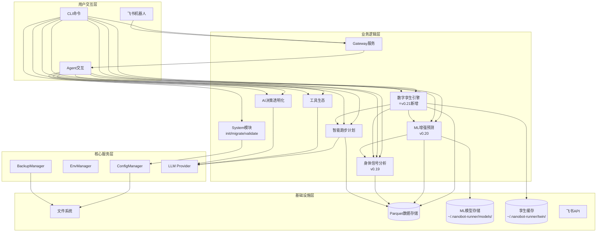
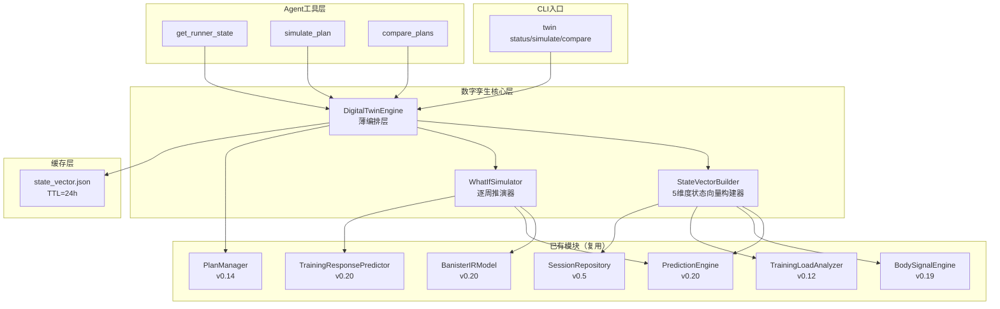
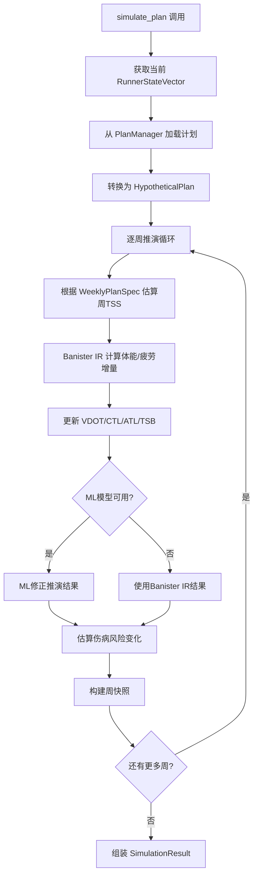
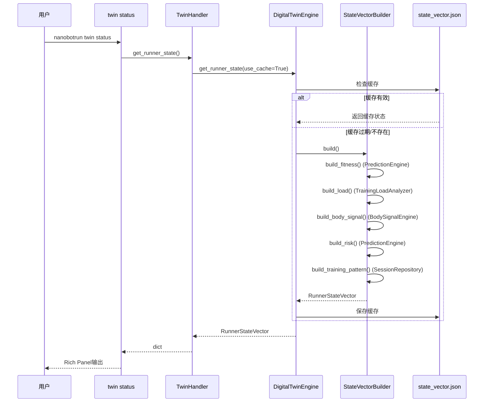
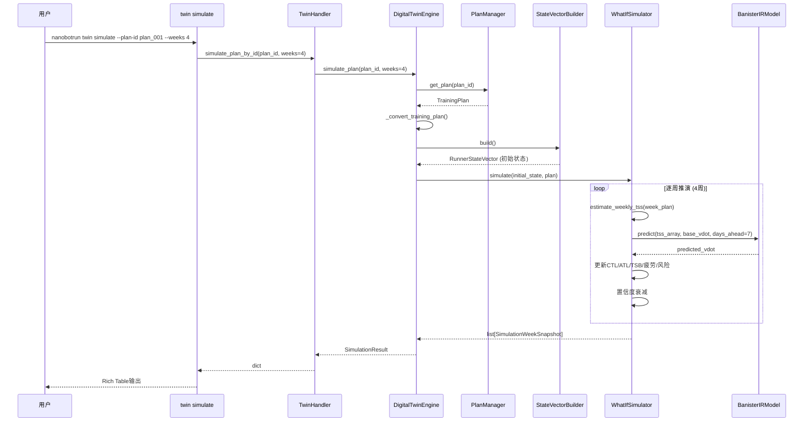

# 架构设计说明书

> **文档版本**: v8.0.0
> **设计日期**: 2026-04-17\
> **更新日期**: 2026-05-11\
> **当前基线**: v0.20.1\
> **版本目标**: v0.21.0 数字孪生引擎（跑者状态向量/What-If推演/计划对比） 🔧 设计中\
> **需求来源**: REQ\_需求规格说明书.md (v8.4) + REQ\_产品演进需求规格说明书.md (v1.0)\
> **对齐依据**: 产品规划方案.md (v9.1)\
> **外部参考**: 产品演进设计.md (v1.0) + multiagents.md (多智能体架构分析) + v0.21数字孪生引擎设计规格.md (v1.1)\
> **评审依据**: 架构评审报告\_v0.19.0.md + 三文档综合评审报告\_v0.20.0.md

> **项目性质说明**: 本项目为**个人使用且个人开发的项目**，所有设计和需求均围绕单人开发和使用场景展开。

***

## 1. 执行摘要

### 1.1 架构演进路线

| 阶段    | 版本          | 核心目标                                  | 状态     |
| ----- | ----------- | ------------------------------------- | ------ |
| 技术底座  | v0.5-v0.9.5 | 数据导入/存储/分析/CLI/依赖注入/SDK化              | ✅ 完成   |
| 智能计划  | v0.10-v0.12 | 自适应训练计划、LLM调整、目标预测                    | ✅ 完成   |
| 工具与智能 | v0.13-v0.15 | MCP协议、AI自我诊断、决策透明化                    | ✅ 完成   |
| 模块化重构 | v0.16-v0.17 | Core子模块拆分、Hook组合、Subagent、Cron提醒      | ✅ 完成   |
| 可视化导出 | v0.18       | 终端图表(plotext)、多格式导出(CSV/JSON/Parquet) | ✅ 完成   |
| 身体信号  | v0.19       | HRV分析、疲劳度评估、身体信号解读                    | ✅ 完成   |
| 预测未来  | v0.20       | ML增强预测（VDOT趋势/比赛成绩/伤病风险）              | ✅ 完成   |
| 数字孪生  | v0.21       | 跑者状态向量、What-If推演、计划对比                 | 🔧 设计中 |
| 多视角验证 | v0.22       | 条件性Coach/Doctor双视角审查                  | 📋 条件性 |
| 决策追踪  | v0.23       | 决策日志、结果回填、预测校准                        | 📋 规划中 |
| 个性化学习 | v0.24       | 训练响应性分析、个人化模型进化                       | 📋 规划中 |
| 自适应进化 | v0.25       | 提示策略优化、自动进化触发                         | 📋 规划中 |
| 稳定版   | v1.0        | API冻结、性能优化、完整文档                       | 📋 计划中 |

### 1.2 v8.0.0 更新重点（v0.21.0 数字孪生引擎）

1. 新增`twin`核心子模块（跑者状态向量/What-If推演/计划对比）
2. 新增`twin` CLI命令组（status/simulate/compare）
3. 新增3个Agent工具（get_runner_state/simulate_plan/compare_plans）
4. 采纳薄编排层架构方案，DigitalTwinEngine聚合StateVectorBuilder和WhatIfSimulator
5. 5维度跑者状态向量设计（体能/负荷/身体信号/风险/训练模式），对齐产品规划决策
6. What-If推演三层降级策略（ML增强/参数化Banister/基础线性外推）
7. 状态向量缓存机制（TTL=24h，存储到 `~/.nanobot-runner/twin/state_vector.json`）
8. 计划对比综合评分算法（VDOT提升40% + 风险控制30% + 恢复余量20% + 恢复状态10%）
9. v0.21仅支持系统计划引用（plan_id），手动计划构建延后到v0.22+评估
10. AppContext扩展属性`twin_engine`

### 1.3 v7.0.0 更新重点（对齐产品规划v9.0 + 产品演进设计v1.0）

1. 引入Banister IR参数化基线模型作为冷启动策略，填补基础预测与ML增强预测之间的空白
2. 统一prediction\_type为三段式：`ml_enhanced` / `parametric` / `basic`
3. 采纳分位数回归（p10/p50/p90）进行不确定性量化，替代简单置信区间
4. 采纳分层伤病风险模型架构：规则基线 → 逻辑回归 → GBDT集成
5. 新增2个Agent工具：`report_injury`（伤病报告）+ `predict_training_response`（训练响应预测）
6. 新增伤病标签体系：confirmed / suspected / unconfirmed
7. 补充v0.21-v0.25模块骨架设计（数字孪生/多视角验证/决策追踪/个性化学习/自适应进化）
8. 明确多智能体架构约束：nanobot仅支持主-从后台任务模式，v0.22以单Agent角色切换为基准方案
9. 对齐产品规划方案v9.0和产品演进需求规格说明书v1.0，确保三文档一致性
10. 模型文件格式统一为.joblib（与sklearn官方推荐一致）

### 1.3 v6.0.0 更新重点（v0.20.0 ML增强预测）

1. 新增`prediction`核心子模块（ML-VDOT趋势预测/个人化比赛预测/ML伤病风险预测/模型管理/数据充足度评估）
2. 新增`predict` CLI命令组（status/vdot/race/injury-risk/model）
3. 新增5个Agent工具（predict\_vdot\_trend/predict\_race\_result/predict\_injury\_risk/check\_prediction\_status/manage\_prediction\_model）
4. 新增ML技术栈选型（scikit-learn/scipy/shap）
5. 新增模型存储架构设计（\~/.nanobot-runner/models/）
6. 新增数据充足度评估与自动降级策略
7. 新增特征工程模块设计（时序特征/负荷特征/身体信号特征）
8. 新增AppContext扩展属性`prediction_engine`

### 1.4 v5.1.0 更新重点

1. 新增数据缺失降级策略（DataQuality枚举、empty\_state返回值）— 对应评审Q1
2. 新增边界条件处理规范（单点数据、权重校验、TSB截断）— 对应评审Q2
3. 新增BodySignalConfig配置Schema定义 — 对应评审Q3
4. 新增RPE数据输入路径定义 — 对应评审Q4
5. 新增body\_signal模块测试策略 — 对应评审Q5
6. 明确status与analysis命令组职责边界 — 对应评审Q6
7. 整合建议改进项：data\_source字段、缓存机制、周对比、RecoveryStatus提升

### 1.5 v5.0.0 更新重点

1. 新增v0.19.0身体信号分析模块架构设计
2. 新增`body_signal`核心子模块（HRV分析/疲劳度评估/恢复监控/身体信号引擎）
3. 新增`status` CLI命令组、扩展`analysis`命令组
4. 新增6个Agent工具
5. 精简已完成版本文档，聚焦当前版本架构

### 1.6 核心设计原则

| 原则              | 策略                                    |
| --------------- | ------------------------------------- |
| **模块化**         | 按功能域划分子模块，接口通信                        |
| **依赖注入**        | AppContext统一管理核心组件                    |
| **配置驱动**        | Pydantic-Settings + 环境变量覆盖            |
| **类型安全**        | frozen dataclass + 类型注解 + mypy        |
| **LazyFrame优先** | Polars查询仅在最终输出时collect()              |
| **防御性设计**       | 数据缺失降级策略 + 边界条件处理 + DataQuality标识     |
| **ML渐进增强**      | 参数化基线→ML增强，数据不足自动降级，绝不阻塞用户            |
| **可解释ML**       | SHAP特征归因 + prediction\_type标注 + 置信度量化 |

***

## 2. 技术栈选型

| 类别        | 选型                | 版本              | 理由                              |
| --------- | ----------------- | --------------- | ------------------------------- |
| 语言        | Python            | **≥**3.11,<3.13 | 现有技术栈，生态成熟                      |
| Agent底座   | nanobot-ai        | Latest          | AI Agent框架，提供基础能力               |
| CLI       | Typer + Rich      | Latest          | 类型安全 + 美观输出                     |
| 配置        | Pydantic-Settings | Latest          | 类型安全 + 环境变量                     |
| 存储        | Apache Parquet    | via pyarrow     | 列式存储，高性能查询                      |
| 计算        | Polars            | 0.20+           | LazyFrame优化，高性能                 |
| 解析        | fitparse          | Latest          | FIT文件解析                         |
| 可视化       | plotext           | Latest          | 终端内图表渲染                         |
| 包管理       | uv                | Latest          | 快速依赖管理                          |
| **ML核心**  | **scikit-learn**  | **≥1.3.0**      | **轻量ML库，回归/分类/特征工程，适配本地单人场景**   |
| **科学计算**  | **scipy**         | **≥1.10.0**     | **Riegel曲线拟合(curve\_fit)、统计检验** |
| **特征解释**  | **shap**          | **≥0.48.0**     | **SHAP值特征重要性分析，可解释ML**          |
| **模型持久化** | **joblib**        | **≥1.3.0**      | **sklearn模型序列化，随sklearn安装**     |

**nanobot-ai适配**: 配置格式(JSON+Markdown)、环境变量`NANOBOT_`前缀、Workspace标准目录、加载优先级(环境变量>配置文件>默认值)

***

## 3. 系统架构设计

### 3.1 整体架构图（v0.21.0）



### 3.2 CLI命令体系（v0.21.0）

| 命令组          | 命令                                                 | 功能         | 版本        |
| ------------ | -------------------------------------------------- | ---------- | --------- |
| system       | `init / migrate / validate / config / backup`      | 系统管理       | v0.9+     |
| data         | `import / stats`                                   | 数据导入与统计    | v0.5+     |
| analysis     | `vdot / load / hr-drift`                           | 数据分析       | v0.8+     |
| analysis     | `hrv / hr-recovery / fatigue / recovery / compare` | 身体信号分析     | v0.19     |
| plan         | `create / status / feedback`                       | 训练计划       | v0.10+    |
| report       | `weekly / monthly`                                 | 训练报告       | v0.9+     |
| viz          | `vdot / load / hr-zones`                           | 数据可视化      | v0.18+    |
| export       | `sessions`                                         | 数据导出       | v0.18+    |
| transparency | `trace / status / insight`                         | AI透明化      | v0.15+    |
| status       | `today / weekly`                                   | 身体状态速览     | v0.19     |
| predict      | `status / vdot / race / injury-risk / model`       | ML增强预测     | v0.20     |
| **twin**     | **`status / simulate / compare`**                  | **数字孪生** | **v0.21** |
| gateway      | `start`                                            | 飞书Gateway  | v0.9+     |

***

## 4. 已完成模块摘要

> 以下模块已完成开发，仅保留架构要点。详细设计见Git历史版本。

| 模块                      | 核心组件                                                                                | 关键设计                       |
| ----------------------- | ----------------------------------------------------------------------------------- | -------------------------- |
| **配置管理** (v0.9.4)       | InitWizard, MigrationEngine, ConfigValidator, WorkspaceManager                      | 无配置模式启动、优先级: 环境变量>配置文件>默认值 |
| **智能跑步计划** (v0.10-0.12) | TrainingPlanGenerator, LLMPlanAdjuster, GoalPredictionEngine, PlanCompletionTracker | LLM驱动计划调整、目标达成预测<3s        |
| **工具生态** (v0.13)        | MCPConfigHelper, ToolManager, WeatherService, MapService                            | MCP协议集成、本地工具优先、隐私保护        |
| **AI决策透明化** (v0.15)     | TransparencyEngine, ObservabilityManager, TraceLogger, TransparencyDisplay          | 分层展示(简洁/详细)、数据溯源、全链路追踪     |
| **Core模块化** (v0.16)     | diagnosis/memory/personality/skills/validate/tools六大子模块                             | 按功能域拆分、接口隔离                |
| **AI底座激活** (v0.17)      | Hook组合系统、Subagent架构、异步用户确认、Cron训练提醒                                                 | 流式输出、LLM超时控制               |
| **可视化与导出** (v0.18)      | PlotextRenderer, CSV/JSON/ParquetExporter                                           | 终端图表渲染、多格式导出引擎             |
| **飞书通知** (v0.9+)        | GatewayServer, FeishuAuth, FeishuNotifier, FeishuCalendar                           | 异步非阻塞、Token自动刷新、指数退避重试     |

***

## 5. 身体信号分析模块（v0.19.0）⭐


> **状态**: 已完成开发。详细设计见Git历史版本。

**核心架构**: HRVAnalyzer(心率变异) + FatigueAssessor(疲劳度评估) + RecoveryMonitor(恢复监控) + BodySignalEngine(编排层)。复用TrainingLoadAnalyzer/HeartRateAnalyzer计算结果，新增DataQuality三级降级策略(SUFFICIENT/INSUFFICIENT/EMPTY)。

**关键设计**: 同日缓存机制(BodySignalEngine)、RPE三级输入路径(FIT字段->CLI参数->自动降级)、TSB截断至[-50,50]、静息心率突增>10%预警。

**新增CLI**: status today/weekly, analysis hrv/hr-recovery/fatigue/recovery/compare

**新增Agent工具**: get_hrv_analysis, get_hr_recovery, get_fatigue_score, get_recovery_status, get_body_signal_summary, compare_training_periods

## 6. ML增强预测模块（v0.20.0）⭐

> **状态**: 已完成开发。详细设计见Git历史版本。

**核心架构**: PredictionEngine(统一入口) + VDOTPredictor/RacePredictor/InjuryPredictor(三大预测器) + FeatureEngine(特征工程) + DataAssessor(数据充足度评估) + ModelManager(模型生命周期)。

**关键设计**:
- **三层降级策略**: ML增强(GradientBoosting+SHAP) -> 参数化基线(Banister IR/逻辑回归) -> 基础预测(线性回归/规则阈值)
- **不确定性量化**: 分位数回归(p10/p50/p90)输出置信区间
- **伤病风险分层**: 规则基线->逻辑回归(CalibratedClassifierCV)->GBDT集成(4:6加权)
- **冷启动**: Banister IR参数化模型填补200-400条数据空白
- **缓存机制**: PredictionEngine同日缓存 + FeatureEngine特征矩阵缓存

**新增CLI**: predict status/vdot/race/injury-risk/model

**新增Agent工具**: predict_vdot_trend, predict_race_result, predict_injury_risk, check_prediction_status, manage_prediction_model, report_injury, predict_training_response

**模型存储**: ~/.nanobot-runner/models/ (joblib格式)

## 7. 数字孪生引擎模块（v0.21.0）⭐

### 7.1 版本目标

**主题**: 数字孪生引擎 —— 构建可推演的跑者生理模型
**核心目标**: 实现 What-If 推演能力，让用户"在训练前看到训练后的自己"
**目标用户**: 有明确训练目标的高级用户（计划参加比赛的跑者）
**对齐文档**: [产品规划方案 v9.1](../product/产品规划方案.md)、[v0.21数字孪生引擎设计规格 v1.1](../superpowers/specs/2026-05-10-v0.21-digital-twin-design.md)

**用户核心痛点**:

> "我有两个训练计划可选，但不知道哪个更适合我现在的状态。如果我按计划A练4周，VDOT能到多少？伤病风险有多大？"

**需求澄清决策**（基于用户澄清，对齐设计规格 v1.1）:

| # | 问题 | 决策 |
|---|------|------|
| 1 | RunnerStateVector维度 | 产品规划5维度（体能/负荷/身体信号/风险/训练模式） |
| 2 | What-If范围 | 精简：`simulate_plan()` + `compare_plans()`，`find_optimal_plan()` 延后 |
| 3 | 时间粒度 | 周粒度 |
| 4 | 推演模型 | ML优先+Banister降级 |
| 5 | 计划输入 | **仅系统计划（plan_id引用）**，手动构建延后评估 |
| 6 | 交互界面 | CLI和Agent完全对等 |
| 7 | 数据门槛 | 状态向量无门槛+推演分层降级 |
| 8 | 成功标准 | 量化指标（VDOT误差<8%，对比一致率>70%，响应<10秒） |
| 9 | 状态向量缓存 | **计算后缓存，TTL=24h**，存储到 `~/.nanobot-runner/twin/state_vector.json` |

**技术可行性评估**:

| 需求域 | 现有代码基础 | 增量开发量 | 可行性 |
|--------|-------------|-----------|--------|
| 跑者状态向量 | PredictionEngine(VDOT预测)、BodySignalEngine(疲劳/恢复)、TrainingLoadAnalyzer(CTL/ATL/TSB) | 中(聚合编排+5维度构建) | ✅ 高 |
| What-If推演 | BanisterIRModel(体能/疲劳推演)、TrainingResponsePredictor(TSS估算) | 中(逐周推演+降级策略) | ✅ 高 |
| 计划对比 | PlanManager(计划加载) | 低(评分算法+对比输出) | ✅ 高 |
| 状态向量缓存 | BodySignalEngine(同日缓存模式) | 低(JSON序列化+TTL) | ✅ 高 |

### 7.2 架构方案决策（ADR）

#### ADR-002：数字孪生引擎架构方案

**背景**: 需要设计数字孪生引擎的架构方案，实现跑者状态向量构建和What-If推演能力。

**考虑方案**:

| 方案 | 描述 | 优点 | 缺点 |
|------|------|------|------|
| **A 薄编排层** | DigitalTwinEngine聚合现有模块输出，不引入新状态转移引擎 | 复用v0.20已验证模块，风险最小，YAGNI | 推演精度受限于Banister IR线性假设 |
| B 状态转移引擎 | 新建RunnerStateTransitionEngine，实现完整的状态转移矩阵 | 推演精度更高，可模拟复杂交互 | 开发量大，v0.21 MVP不需要 |
| C 规则引擎 | 基于专家规则的推演，无ML依赖 | 简单可控 | 灵活性差，与v0.20 ML路线冲突 |

**决定**: 方案A — 薄编排层

**理由**:
1. YAGNI原则：v0.21 是数字孪生首个版本，核心价值是"让用户看到推演结果"
2. 风险最小：完全复用 v0.20 已验证模块，不引入新状态转移模型
3. 为迭代留空间：薄编排层接口可无缝过渡到方案B/C

**影响**:
- What-If推演通过组合调用 `PredictionEngine` + `TrainingResponsePredictor` + `BanisterIRModel` 实现
- 推演精度受限于Banister IR模型假设，v0.22+可引入更精细的状态转移模型
- StateVectorBuilder 作为独立构建器，便于测试和复用

### 7.3 模块架构图



### 7.4 代码库结构

```
src/core/twin/
├── __init__.py                 # 模块导出
├── models.py                   # 数据模型定义（frozen dataclass）
├── twin_engine.py              # DigitalTwinEngine 薄编排层
├── state_vector_builder.py     # RunnerStateVector 5维度构建器
└── whatif_simulator.py         # What-If 逐周推演器

src/cli/
├── commands/twin.py            # twin 命令组（status/simulate/compare）
├── handlers/twin_handler.py    # CLI业务逻辑调用层

src/agents/tools.py             # 新增3个Agent工具

tests/unit/core/twin/
├── __init__.py
├── test_models.py
├── test_state_vector_builder.py
├── test_whatif_simulator.py
└── test_twin_engine.py
```

### 7.5 子模块设计

#### 7.5.1 数据模型（models.py）

**设计原则**: 所有数据模型使用 `frozen=True` dataclass，每个类提供 `to_dict()` 方法。

**DataQuality 枚举**（复用 `src.core.body_signal.models.DataQuality`）:

| 值 | 含义 |
|---|------|
| SUFFICIENT | 数据充足，所有维度正常填充 |
| INSUFFICIENT | 数据不足，部分维度使用默认值 |
| EMPTY | 无数据，所有维度为零值 |

**5维度状态向量**:

```python
@dataclass(frozen=True)
class FitnessDimension:
    """体能维度"""
    vdot: float
    vdot_trend: float
    vo2max_estimate: float | None

@dataclass(frozen=True)
class LoadDimension:
    """负荷维度"""
    ctl: float
    atl: float
    tsb: float
    acwr: float

@dataclass(frozen=True)
class BodySignalDimension:
    """身体信号维度"""
    fatigue_score: float
    recovery_status: str
    resting_hr: float | None
    hrv_rmssd: float | None

@dataclass(frozen=True)
class RiskDimension:
    """风险维度"""
    injury_risk_7d: float
    injury_risk_28d: float
    overtraining_risk: str

@dataclass(frozen=True)
class TrainingPatternDimension:
    """训练模式维度"""
    weekly_volume_km: float
    intensity_distribution: IntensityDistribution
    long_run_frequency: int

@dataclass(frozen=True)
class RunnerStateVector:
    """跑者状态向量 - 5维度综合状态"""
    fitness: FitnessDimension
    load: LoadDimension
    body_signal: BodySignalDimension
    risk: RiskDimension
    training_pattern: TrainingPatternDimension
    snapshot_date: str
    data_quality: DataQuality
```

**假设计划与推演结果**:

```python
@dataclass(frozen=True)
class WeeklyPlanSpec:
    """周训练规格"""
    weekly_volume_km: float
    easy_ratio: float
    tempo_ratio: float
    interval_ratio: float
    long_run_km: float
    intensity_multiplier: float = 1.0

@dataclass(frozen=True)
class HypotheticalPlan:
    """假设计划（v0.21仅支持系统计划引用）"""
    name: str
    weeks: list[WeeklyPlanSpec]
    source: str = "plan_id"
    plan_id: str

@dataclass(frozen=True)
class SimulationWeekSnapshot:
    """推演周快照"""
    week_number: int
    state: RunnerStateVector
    weekly_plan: WeeklyPlanSpec
    confidence: float

@dataclass(frozen=True)
class SimulationResult:
    """推演结果"""
    plan_name: str
    initial_state: RunnerStateVector
    final_state: RunnerStateVector
    snapshots: list[SimulationWeekSnapshot]
    total_weeks: int
    prediction_type: str
    vdot_delta: float
    peak_injury_risk: float
    avg_tsb: float

@dataclass(frozen=True)
class PlanComparisonMetrics:
    """单个计划的对比指标"""
    plan_name: str
    vdot_delta: float
    peak_injury_risk: float
    avg_tsb: float
    min_recovery_status: str
    recommendation_score: float

@dataclass(frozen=True)
class PlanComparison:
    """计划对比结果"""
    plans: list[PlanComparisonMetrics]
    best_plan: PlanComparisonMetrics
    comparison_dimensions: list[str]
    recommendation: str
```

**状态向量缓存模型**:

```python
@dataclass(frozen=True)
class StateVectorCache:
    """状态向量缓存"""
    state: RunnerStateVector
    created_at: str
    ttl_hours: int = 24

    def is_expired(self) -> bool:
        from datetime import datetime, timedelta
        created = datetime.fromisoformat(self.created_at)
        return datetime.now() - created > timedelta(hours=self.ttl_hours)
```

**自定义异常**:

```python
class TwinEngineError(NanobotRunnerError):
    """数字孪生引擎异常基类"""
    pass
```

> `TwinEngineError` 继承自项目统一异常基类 `NanobotRunnerError`（`src/core/exceptions.py`），用于计划不存在、推演参数无效、数据不足等场景。

#### 7.5.2 状态向量构建器（state_vector_builder.py）

**职责**: 聚合多模块数据构建5维度状态向量

**核心接口**:

| 方法 | 参数 | 返回值 | 说明 |
|------|------|--------|------|
| `build()` | 无 | RunnerStateVector | 构建5维度综合状态向量 |
| `build_fitness()` | 无 | FitnessDimension | 构建体能维度 |
| `build_load()` | 无 | LoadDimension | 构建负荷维度 |
| `build_body_signal()` | 无 | BodySignalDimension | 构建身体信号维度 |
| `build_risk()` | 无 | RiskDimension | 构建风险维度 |
| `build_training_pattern()` | 无 | TrainingPatternDimension | 构建训练模式维度 |

**依赖注入**:

```python
class StateVectorBuilder:
    def __init__(
        self,
        prediction_engine: PredictionEngine,
        body_signal_engine: BodySignalEngine,
        training_load_analyzer: TrainingLoadAnalyzer,
        session_repo: SessionRepository,
    ) -> None: ...
```

**数据来源映射**:

| 维度 | 数据来源 | 降级策略 |
|------|----------|----------|
| 体能 | PredictionEngine.predict_vdot_trend() | vdot=0.0, vdot_trend=0.0, vo2max_estimate=None |
| 负荷 | TrainingLoadAnalyzer | ctl=0.0, atl=0.0, tsb=0.0, acwr=0.0 |
| 身体信号 | BodySignalEngine.get_daily_summary() | fatigue_score=0.0, recovery_status="unknown" |
| 风险 | PredictionEngine.predict_injury_risk() | injury_risk_7d=0.0, injury_risk_28d=0.0, overtraining_risk="unknown" |
| 训练模式 | SessionRepository查询最近4周 | weekly_volume_km=0.0, intensity_distribution={}, long_run_frequency=0.0 |

**防御性设计**: 每个维度构建方法用 try/except 包裹，失败时返回零值默认维度，data_quality 标注为 INSUFFICIENT。

#### 7.5.3 What-If 推演器（whatif_simulator.py）

**职责**: 逐周推演训练计划效果，ML/Banister/基础三层降级

**核心接口**:

| 方法 | 参数 | 返回值 | 说明 |
|------|------|--------|------|
| `simulate_week()` | current_state, week_plan | RunnerStateVector | 推演一周后的状态 |
| `simulate()` | initial_state, plan | list[SimulationWeekSnapshot] | 逐周推演完整计划 |
| `estimate_weekly_tss()` | week_plan | float | 估算周TSS（静态方法） |

**依赖注入**:

```python
class WhatIfSimulator:
    def __init__(
        self,
        banister_model: BanisterIRModel,
        prediction_engine: PredictionEngine | None = None,
    ) -> None: ...
```

**周TSS估算**（复用 TrainingResponsePredictor 的 SESSION_TYPE_TSS_PER_MIN 常量）:

```python
AVG_PACE_MIN_PER_KM = 6.0

def estimate_weekly_tss(week_plan: WeeklyPlanSpec) -> float:
    total_minutes = week_plan.weekly_volume_km / AVG_PACE_MIN_PER_KM * week_plan.intensity_multiplier
    easy_tss = total_minutes * week_plan.easy_ratio * 0.5
    tempo_tss = total_minutes * week_plan.tempo_ratio * 0.8
    interval_tss = total_minutes * week_plan.interval_ratio * 1.1
    long_tss = week_plan.long_run_km / AVG_PACE_MIN_PER_KM * 0.65
    return easy_tss + tempo_tss + interval_tss + long_tss
```

**逐周推演核心逻辑**:



#### 7.5.4 数字孪生引擎（twin_engine.py）

**职责**: 薄编排层，调用子组件组装结果

**核心接口**:

| 方法 | 参数 | 返回值 | 说明 |
|------|------|--------|------|
| `get_current_snapshot()` | — | RunnerStateVector | 获取当前跑者状态向量（含TTL=24h缓存） |
| `simulate()` | plan: HypotheticalPlan, prediction_type: str="parametric" | SimulationResult | What-If推演训练计划效果 |
| `compare_plans()` | plans: list[HypotheticalPlan], prediction_type: str="parametric" | PlanComparison | 多计划对比（内部方法） |
| `compare_plans_by_ids()` | plan_ids: list[str]（2-5个）, prediction_type: str="parametric" | PlanComparison | 通过系统计划ID对比，plan_ids数量不在2-5范围时抛出TwinEngineError |
| `load_plan()` | plan_id: str | HypotheticalPlan | 从PlanManager加载系统训练计划 |

**依赖注入**（遵循构造函数注入原则，便于测试时Mock StateVectorBuilder）:

```python
class DigitalTwinEngine:
    def __init__(
        self,
        state_vector_builder: StateVectorBuilder,
        plan_manager: PlanManager | None = None,
        banister_model: BanisterIRModel | None = None,
        prediction_engine: PredictionEngine | None = None,
        cache_dir: Path | None = None,
    ) -> None:
        self._builder = state_vector_builder
        self._plan_manager = plan_manager
        self._simulator = WhatIfSimulator(
            banister_model=banister_model,
            prediction_engine=prediction_engine,
        )
        self._cache_dir = cache_dir
        self._cache: StateVectorCache | None = None
```

**计划加载与转换**（v0.21支持系统计划引用 + 手动构建双路径）:

```python
def _load_plan(self, plan_id: str) -> HypotheticalPlan:
    """从 PlanManager 加载系统计划并转换为 HypotheticalPlan"""
    if not self._plan_manager:
        raise TwinEngineError("PlanManager 未初始化，无法加载计划")
    training_plan = self._plan_manager.get_plan(plan_id)
    if training_plan is None:
        raise TwinEngineError(f"计划不存在: {plan_id}")
    return self._convert_training_plan(training_plan)

def _convert_training_plan(self, tp: TrainingPlan) -> HypotheticalPlan:
    """将 TrainingPlan.weeks（含 daily_plans）聚合为 WeeklyPlanSpec
    
    基于训练量（距离）而非天数计算强度分布ratio，
    更准确反映实际训练负荷结构。
    """
    weeks = []
    for week in tp.weeks:
        total_km = week.weekly_distance_km
        easy_km = sum(dp.distance_km for dp in week.daily_plans if dp.workout_type.value in ("easy", "recovery"))
        tempo_km = sum(dp.distance_km for dp in week.daily_plans if dp.workout_type.value in ("tempo", "threshold"))
        interval_km = sum(dp.distance_km for dp in week.daily_plans if dp.workout_type.value == "interval")
        long_runs = [dp.distance_km for dp in week.daily_plans if dp.workout_type.value == "long"]
        active_km = max(0.1, easy_km + tempo_km + interval_km + sum(long_runs))
        weeks.append(WeeklyPlanSpec(
            weekly_volume_km=total_km,
            easy_ratio=easy_km / active_km,
            tempo_ratio=tempo_km / active_km,
            interval_ratio=interval_km / active_km,
            long_run_km=max(long_runs, default=0.0),
        ))
    return HypotheticalPlan(name=tp.plan_id, weeks=weeks, source="plan_id", plan_id=tp.plan_id)
```

### 7.6 推演降级策略

**三层降级策略**:

| 层级 | 条件 | 推演模型 | prediction_type | 置信度衰减 |
|------|------|----------|-----------------|-----------|
| L1 ML增强 | ML模型已训练且可用 | Banister IR + ML修正 | `ml_enhanced` | 每周衰减5% |
| L2 参数化 | ML不可用，Banister IR已拟合 | Banister IR（拟合参数） | `parametric` | 每周衰减8% |
| L3 基础 | Banister IR未拟合 | Banister IR（默认参数）+ 线性外推 | `basic` | 每周衰减12% |

**置信度衰减机制**:

- 初始置信度 = 预测模型的置信度（来自 v0.20 PredictionEngine）
- 每周衰减：`confidence *= (1 - decay_rate)`
- 推演4周后：L1 约 0.81，L2 约 0.72，L3 约 0.60
- **所有推演输出均标注"模拟结果，非确定性预测"**（对齐 NFR-09b）
- 置信度 < 0.5 时额外标注"推演结果仅供参考"

### 7.7 计划对比评分算法

```python
def calculate_recommendation_score(metrics: PlanComparisonMetrics) -> float:
    vdot_score = min(100, max(0, metrics.vdot_delta * 20))
    risk_score = max(0, 100 - metrics.peak_injury_risk)
    recovery_score = min(100, max(0, (metrics.avg_tsb + 30) * 2)) * 0.5 + {"green": 50, "yellow": 25, "red": 0}.get(metrics.min_recovery_status, 25) * 0.5
    return vdot_score * 0.4 + risk_score * 0.35 + recovery_score * 0.25
```

**评分权重设计理由**（对齐需求规格 REQ-0.21-02 AC-04）:
- VDOT提升(40%)：用户核心诉求是提升表现
- 伤病风险(35%)：伤病是最大负面事件，权重高于恢复
- 恢复余量(25%)：综合TSB数值和恢复状态，持续训练的基础

### 7.8 状态向量缓存策略

**缓存位置**: `~/.nanobot-runner/twin/state_vector.json`

**缓存逻辑**:

```python
def get_runner_state(self, use_cache: bool = True) -> RunnerStateVector:
    cache_path = self._get_cache_path()
    if use_cache and cache_path.exists():
        cache = self._load_cache(cache_path)
        if not cache.is_expired():
            return cache.state
    state = self._state_vector_builder.build()
    self._save_cache(cache_path, StateVectorCache(
        state=state, created_at=datetime.now().isoformat()
    ))
    return state
```

**缓存刷新触发条件**:

| 触发条件 | 行为 |
|---------|------|
| TTL过期（24h） | 下次调用时自动重建 |
| `use_cache=False` | 强制重建并更新缓存 |
| 新数据导入 | 建议调用方传入 `use_cache=False` |

### 7.9 AppContext扩展

在 `src/core/base/context.py` 新增 `twin_engine` 属性：

```python
@property
def twin_engine(self) -> Any:
    """获取数字孪生引擎（v0.21.0新增）"""
    from src.core.twin.twin_engine import DigitalTwinEngine

    engine = self.get_extension("twin_engine")
    if engine is None:
        engine = DigitalTwinEngine(
            prediction_engine=self.prediction_engine,
            body_signal_engine=self.body_signal_engine,
            training_load_analyzer=self.training_load_analyzer,
            session_repo=self.session_repo,
            plan_manager=self.plan_manager,
        )
        self.set_extension("twin_engine", engine)
    return engine
```

**注意**: 不传 banister_model，让 DigitalTwinEngine 内部自动创建默认实例，与 PredictionEngine 的 BanisterIRModel 独立。

### 7.10 CLI命令设计

| 命令 | 参数 | 功能 | 输出 |
|------|------|------|------|
| `twin snapshot` | `[--json]` | 查看当前跑者状态向量 | 5维度Rich Panel |
| `twin simulate` | `--plan-id <id> 或 --name <name> --weeks <json> [--type <type>]` | 模拟训练计划效果 | 推演结果Rich Table |
| `twin compare` | `--plan-ids <id1,id2,id3> 或 --plans <json> [--type <type>]` | 对比多个训练计划 | 对比表格+推荐 |

**CLI --help 输出预期**:

**`twin snapshot --help`**:

```
Usage: nanobotrun twin snapshot [OPTIONS]

  获取当前跑者5维度状态快照（体能/负荷/身体信号/风险/训练模式）。

  数据不足时自动降级，缺失维度用默认值填充。

Examples:
  $ nanobotrun twin snapshot
```

**`twin simulate --help`**:

```
Usage: nanobotrun twin simulate [OPTIONS]

  基于当前状态推演训练计划执行后的变化。
  支持两种输入方式：--plan-id 引用系统计划，或 --name + --weeks 手动构建。

Arguments:
  --plan-id TEXT       系统训练计划ID
  --name TEXT          计划名称(手动模式) [default: 自定义计划]
  --weeks TEXT         周计划JSON数组(手动模式)
  --type TEXT          预测模式(basic/parametric/ml_enhanced) [default: parametric]

Examples:
  $ nanobotrun twin simulate --plan-id plan_001
  $ nanobotrun twin simulate --name "破4计划" --weeks '[{"weekly_volume_km":50,"easy_ratio":0.7,"tempo_ratio":0.15,"interval_ratio":0.15,"long_run_km":25}]'
```

**`twin compare --help`**:

```
Usage: nanobotrun twin compare [OPTIONS]

  对比多个训练计划的推演效果，推荐最优计划。
  支持两种输入方式：--plan-ids 引用系统计划，或 --plans 手动构建。

Arguments:
  --plan-ids TEXT      系统训练计划ID列表，逗号分隔(2-5个)
  --plans TEXT         计划列表JSON
  --type TEXT          预测模式(basic/parametric/ml_enhanced) [default: parametric]

Examples:
  $ nanobotrun twin compare --plan-ids plan_001,plan_002,plan_003
  $ nanobotrun twin compare --plans '[{"name":"保守","weeks":[...]},{"name":"激进","weeks":[...]}]'
```

### 7.11 Agent工具设计

| 工具名 | 功能 | 输入 | 输出 |
|--------|------|------|------|
| `get_twin_snapshot` | 获取当前跑者状态向量 | — | RunnerStateVector |
| `simulate_twin` | 模拟训练计划效果 | plan_name: str, weeks: list[dict], prediction_type: str="parametric" | SimulationResult |
| `compare_twin_plans` | 对比多个训练计划 | plans: list[dict], prediction_type: str="parametric" | PlanComparison |

### 7.12 核心数据流

**数据流1: twin status 全链路**:



**数据流2: twin simulate 全链路**:



### 7.13 风险与缓解

| 风险 | 等级 | 缓解措施 |
|------|------|----------|
| Banister IR线性假设限制推演精度 | 中 | v0.22+可引入非线性状态转移模型；当前通过置信度衰减提示用户 |
| PlanManager.get_plan()返回None | 低 | 抛出TwinEngineError，CLI层友好提示 |
| 状态向量构建部分维度失败 | 低 | 每个维度独立try/except，失败返回零值默认，data_quality标注INSUFFICIENT |
| 缓存文件损坏 | 低 | JSON解析失败时自动重建缓存 |
| 推演周数过多导致精度过低 | 低 | 限制最大12周，所有推演标注"模拟结果，非确定性预测"，置信度<0.5额外标注"仅供参考" |
| PlanManager数据结构变更 | 中 | _convert_training_plan()依赖TrainingPlan.weeks结构，需与PlanManager同步维护；变更时需更新转换逻辑和测试 |
| 推演结果与实际偏差无追踪 | 中 | v0.21不追踪推演准确性，所有输出标注"模拟结果，非确定性预测"；v0.23+可增加推演历史对比功能 |

### 7.14 测试策略

**单元测试**:

| 测试文件 | 覆盖模块 | 关键测试场景 |
|----------|----------|-------------|
| `test_models.py` | 数据模型 | 序列化/反序列化、frozen不可变性、默认值、边界值 |
| `test_state_vector_builder.py` | StateVectorBuilder | 5维度构建、数据缺失降级、异常场景零值填充 |
| `test_whatif_simulator.py` | WhatIfSimulator | 逐周推演、置信度衰减、TSS估算、ML/Banister降级 |
| `test_twin_engine.py` | DigitalTwinEngine | 编排逻辑、计划加载、compare_plans评分、缓存一致性 |

**关键测试场景**:

**场景1: StateVectorBuilder 数据缺失降级**
- 输入: 用户只有2周数据，无HRV数据
- 预期: fitness用基础线性外推，body_signal的hrv_rmssd=None，risk用规则基线，整体data_quality=INSUFFICIENT

**场景2: WhatIfSimulator 逐周推演**
- 输入: 模拟4周计划，初始VDOT=42.0
- 预期: 每周VDOT递增，置信度逐周衰减（L1: 0.95→0.81），第4周快照包含完整状态向量

**场景3: 推演降级策略**
- 场景A: ML模型可用 → prediction_type="ml_enhanced"
- 场景B: ML不可用，Banister已拟合 → prediction_type="parametric"
- 场景C: 均不可用 → prediction_type="basic"

**场景4: compare_plans 评分**
- 输入: 3个计划（A: VDOT+1.0/风险12%, B: VDOT+0.5/风险5%, C: VDOT+1.5/风险25%）
- 预期: 计划B综合评分最高（低风险+高恢复）

**Mock策略**:
- **必须 Mock**: PredictionEngine（ML推理耗时）、BodySignalEngine（数据查询）、SessionRepository（数据库）
- **禁止 Mock**: BanisterIRModel（纯计算）、数据模型（纯数据结构）、WhatIfSimulator（核心逻辑）

**集成测试**:

| 场景 | 覆盖链路 |
|------|----------|
| twin status 全链路 | AppContext → TwinEngine → StateVectorBuilder → PredictionEngine/BodySignalEngine |
| twin simulate 全链路 | AppContext → TwinEngine → WhatIfSimulator → BanisterIRModel/PredictionEngine |
| twin compare 全链路 | AppContext → TwinEngine → 多次simulate → 评分对比 |

### 7.15 版本成功标准

| 维度 | 标准 | 测量方式 |
|------|------|----------|
| 功能完成 | P0功能100%实现 | 功能清单核对 |
| 推演准确度 | 推演VDOT误差<8%（4周推演） | 回测历史数据 |
| 计划对比 | 对比结果与人工判断一致率>70% | 专家评审 |
| 性能 | 推演响应<10秒（4周计划） | 性能测试 |
| 降级可用 | 数据不足时降级路径全部可用 | 边界测试 |
| 测试覆盖 | 核心模块单元测试覆盖率≥80% | pytest-cov |

### 7.16 明确排除的范围

| 功能 | 原因 | 建议版本 |
|------|------|----------|
| `find_optimal_plan()` | 约束优化复杂度高 | v0.22+ |
| 技术/心理维度 | 缺乏数据源 | v0.22+ |
| 手动计划构建 | 用户澄清决策，避免过度设计 | v0.22+评估 |
| 推演结果与实际对比校准 | 需要v0.23决策追踪 | v0.23 |
| 多Agent并行推演 | nanobot框架限制 | 待评估 |

***

## 8. v0.22-v0.25 模块骨架设计

> 以下为产品演进路线图（v0.22-v0.25）的架构骨架，详细设计将在对应版本开发时展开。

### 8.1 v0.22 多视角验证（Multi-Perspective Review）

**核心概念**: 条件性触发Coach/Doctor双视角审查，增强预测可信度

**多智能体架构约束**（基于multiagents.md分析）:

- nanobot框架仅支持主-从后台任务模式，不支持并行多Agent交互
- **基准方案**: 单Agent角色切换（Coach/Doctor角色prompt注入）
- **升级方案**: 若nanobot支持多Agent交互，可启用并行双视角审查

**触发条件**（条件性，非默认启用）:

- 伤病风险预测为"high"时 → 自动触发Doctor视角审查
- VDOT预测趋势异常（突然下降>1.0）→ 自动触发Coach视角审查
- 用户主动请求 → 触发双视角审查

**模块结构**:

```
src/core/review/
├── __init__.py
├── models.py                    # ReviewResult, PerspectiveReview
├── review_engine.py             # ReviewEngine
├── coach_reviewer.py            # Coach视角审查
└── doctor_reviewer.py           # Doctor视角审查
```

### 8.2 v0.23 决策追踪（Decision Tracking）

**核心概念**: 记录AI决策过程，支持结果回填和预测校准

**核心能力**:

- 决策日志: 记录每次预测/建议的输入、模型、输出、置信度
- 结果回填: 实际结果发生后回填，计算预测偏差
- 预测校准: 基于历史偏差校准模型输出
- 校准报告: 定期输出预测准确性报告

**模块结构**:

```
src/core/tracking/
├── __init__.py
├── models.py                    # DecisionLog, CalibrationResult
├── decision_logger.py           # DecisionLogger
├── result_backfill.py           # ResultBackfiller
└── calibration.py               # ModelCalibrator
```

### 8.3 v0.24 个性化学习（Personalized Learning）

**核心概念**: 分析个人训练响应性，实现模型个人化进化

**核心能力**:

- 训练响应性分析: 量化个体对训练刺激的响应差异
- 个人修正系数: 基于历史数据修正通用模型参数
- 模型微调: 在通用模型基础上进行个人化微调
- 进化报告: 输出个人化模型进化历程

**模块结构**:

```
src/core/personalization/
├── __init__.py
├── models.py                    # PersonalizationProfile, ResponsivenessResult
├── responsiveness_analyzer.py   # 训练响应性分析
├── personal_model.py            # 个人化模型管理
└── evolution_report.py          # 进化报告
```

### 8.4 v0.25 自适应进化（Adaptive Evolution）

**核心概念**: 优化提示策略，实现自动进化触发

**核心能力**:

- 提示策略优化: 基于用户反馈优化AI提示策略
- 自动进化触发: 检测到模型性能退化时自动触发重训
- 进化守护: 监控模型性能指标，确保进化方向正确
- 回滚机制: 进化失败时回滚到上一版本

**模块结构**:

```
src/core/evolution/
├── __init__.py
├── models.py                    # EvolutionEvent, EvolutionGuard
├── evolution_engine.py          # EvolutionEngine
├── prompt_optimizer.py          # 提示策略优化
├── auto_trigger.py              # 自动进化触发
└── evolution_guard.py           # 进化守护
```

***

## 9. 数据目录总览

> 统一展示 `~/.nanobot-runner/` 完整目录结构，标注各子目录的引入版本和用途。

```
~/.nanobot-runner/
├── config.json                    # 全局配置文件 (v0.9+)
├── data/                          # Parquet训练数据存储 (v0.5+)
│   └── YYYY/
│       └── sessions_YYYY.parquet
├── models/                        # ML模型存储 (v0.20新增)
│   ├── vdot_predictor/
│   ├── vdot_predictor_banister/
│   ├── race_predictor/
│   ├── injury_predictor/
│   └── prediction_history/
│       └── predictions.parquet
├── predictions/                   # 预测记录 (v0.20新增)
│   └── {date}_prediction.json
├── injury_labels/                 # 伤病标签 (v0.20新增)
│   ├── confirmed/
│   ├── suspected/
│   └── unconfirmed/
├── cache/                         # 特征缓存和预测缓存 (v0.20新增)
├── twin/                          # 数字孪生缓存 (v0.21新增)
│   └── state_vector.json         # 状态向量缓存 (TTL=24h)
├── decisions/                     # 决策日志 (v0.23预留)
│   └── YYYY-MM/
│       └── decisions_YYYY-MM.parquet
├── outcomes/                      # 结果记录 (v0.23预留)
│   └── YYYY-MM/
│       └── outcomes_YYYY-MM.parquet
└── backup/                        # 手动备份目录 (v0.9+)
```

| 子目录              | 引入版本  | 用途              | 估算大小      |
| ---------------- | ----- | --------------- | --------- |
| `data/`          | v0.5  | Parquet按年分片训练数据 | ~50MB/年  |
| `models/`        | v0.20 | ML模型文件和元数据      | 5-50MB/模型 |
| `predictions/`   | v0.20 | 预测历史记录          | ~1MB/年   |
| `injury_labels/` | v0.20 | 伤病标签分类存储        | ~1MB/年   |
| `cache/`         | v0.20 | 特征矩阵缓存和预测同日缓存   | ~10MB    |
| `twin/`          | v0.21 | 状态向量缓存          | ~10KB    |
| `decisions/`     | v0.23 | 决策日志Parquet按月分片 | ~5MB/年   |
| `outcomes/`      | v0.23 | 结果记录Parquet按月分片 | ~2MB/年   |
| `backup/`        | v0.9  | 手动备份压缩包         | 按需        |

***

## 10. 部署架构

**环境隔离**: 开发/生产共用本地环境，通过配置文件区分\
**部署方式**: `uv run nanobotrun` 本地运行\
**数据目录**: `~/.nanobot-runner/` (可配置)\
**备份策略**: `nanobotrun system backup` 手动触发

***

## 11. 变更记录

| 版本     | 日期         | 变更内容                                                                                                                                                                                                                                                                                                                                                                        |
| ------ | ---------- | --------------------------------------------------------------------------------------------------------------------------------------------------------------------------------------------------------------------------------------------------------------------------------------------------------------------------------------------------------------------------- |
| v8.0.0 | 2026-05-11 | **v0.21.0数字孪生引擎架构设计**：新增Section 7完整设计（版本目标/ADR-002薄编排层/模块架构图/代码库结构/子模块设计/推演降级策略/计划对比评分/缓存策略/AppContext扩展/CLI命令/Agent工具/数据流/风险缓解/测试策略/成功标准/排除范围）；更新整体架构图(v0.21.0)新增TWIN模块和TWIN_CACHE；更新CLI命令体系新增twin命令组；更新数据目录新增twin/缓存目录；v0.22-v0.25骨架设计移至Section 8；章节重新编号 |
| v7.1.0 | 2026-05-08 | **评审整改**：修正v0.19功能状态标注为v0.20（CLI命令层和Agent工具层）；补充数据充足标准"理想数据量"列(HIGH-4)；新增跨模块集成测试4个场景(HIGH-6)；PredictionEngine流程图补充异常处理分支(MEDIUM-2)；新增"数据目录总览"章节(MEDIUM-3)；ADR-004补充默认参数/校准策略/对比评估(MEDIUM-5)；v0.21-v0.25骨架设计增加声明(HIGH-5)；RacePredictionEngine添加无状态注释(HIGH-3)；对齐需求规格v8.1                                                                                                      |
| v7.0.0 | 2026-05-08 | 对齐产品规划v9.0+产品演进设计v1.0：引入Banister IR参数化基线(ADR-004)、统一prediction\_type三段式(ml\_enhanced/parametric/basic)、采纳分位数回归(ADR-005)、采纳分层伤病风险模型(ADR-006)、新增2个Agent工具(report\_injury/predict\_training\_response)、新增伤病标签体系(confirmed/suspected/unconfirmed)、补充v0.21-v0.25模块骨架设计、明确多智能体架构约束、模型文件格式统一为.joblib、新增TrainingResponse/InjuryReportResult/InjuryLabel数据模型、PredictionConfig新增6个配置项 |
| v6.1.0 | 2026-05-07 | 基于架构评审报告v0.20.0整改：修复AppContext依赖注入违规(CRITICAL-2)、新增PredictionConfig配置Schema(HIGH-1)、新增预测模块测试策略(HIGH-2)、新增缓存机制(HIGH-3)、修正模型存储路径为\~/.nanobot-runner/models/(HIGH-4)、新增冷启动策略(HIGH-5)、补充predictions.parquet Schema(MEDIUM-1)、补充模型评估指标(MEDIUM-2)、补充SHAP降级策略(MEDIUM-3)、补充CLI Help文案与输出示例(MEDIUM-4)                                                                                |
| v5.1.0 | 2026-05-05 | 基于架构评审报告v0.19.0更新：新增数据缺失降级策略(Q1)、边界条件处理规范(Q2)、BodySignalConfig配置Schema(Q3)、RPE数据输入路径(Q4)、测试策略(Q5)、CLI命令组职责边界(Q6)；整合建议改进项：data\_source字段(S1)、缓存机制(S2)、周对比增强(S3)、RecoveryStatus共用模块(S4)                                                                                                                                                                                       |
| v5.0.0 | 2026-05-05 | 新增v0.19.0身体信号分析模块架构；精简已完成版本文档；更新整体架构图                                                                                                                                                                                                                                                                                                                                       |
| v4.2.0 | 2026-05-03 | 新增v0.17.0 AI底座能力全面激活架构设计                                                                                                                                                                                                                                                                                                                                                    |
| v4.0.0 | 2026-04-17 | 新增v0.13-v0.16架构设计                                                                                                                                                                                                                                                                                                                                                           |

