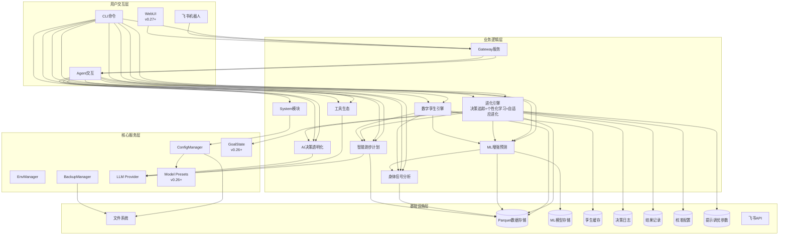

# 架构设计说明书

> **文档版本**: v20.0.0
> **设计日期**: 2026-04-17
> **更新日期**: 2026-06-06
> **当前基线**: v0.28.0
> **版本目标**: v0.29.0 WebUI管理控制台 🏗️ 设计中
> **需求来源**: REQ_需求规格说明书.md (v15.0)
> **对齐依据**: 产品规划方案.md (v14.0)
> **评审依据**: 架构评审报告-v0.28.0.md (v1.0)

> **项目性质说明**: 本项目为**个人使用且个人开发的项目**，所有设计和需求均围绕单人开发和使用场景展开。

***

## 1. 执行摘要

### 1.1 架构演进路线

| 阶段 | 版本 | 核心目标 | 状态 |
|------|------|----------|------|
| 记录跑步 | v0.5-v0.19 | 数据导入/存储/分析/CLI/依赖注入/SDK化/可视化/身体信号 | ✅ 完成 |
| 预测跑步 | v0.20-v0.22 | ML增强预测/数字孪生/质量收口 | ✅ 完成 |
| 进化跑步 | v0.23-v0.25 | 决策追踪/个性化学习/自适应进化 | ✅ 完成 |
| 交互升级 | v0.26-v0.29 | 底座升级+新特性(WebUI基础/数据可视化已完成，管理控制台规划中) | 🏗️ 进行中 |
| 稳定版 | v1.0 | API冻结、性能优化、完整文档 | 📋 远期规划 |

### 1.2 核心设计原则

| 原则 | 策略 |
|------|------|
| **模块化** | 按功能域划分子模块，接口通信 |
| **依赖注入** | AppContext统一管理核心组件 |
| **配置驱动** | Pydantic-Settings + 环境变量覆盖 |
| **类型安全** | frozen dataclass + 类型注解 + mypy |
| **LazyFrame优先** | Polars查询仅在最终输出时collect() |
| **防御性设计** | 数据缺失降级策略 + 边界条件处理 + DataQuality标识 |
| **ML渐进增强** | 参数化基线→ML增强，数据不足自动降级，绝不阻塞用户 |
| **可解释ML** | SHAP特征归因 + prediction_type标注 + 置信度量化 |

### 1.3 设计决策索引

| ADR | 决策 | 版本 |
|-----|------|------|
| ADR-007 | DecisionLogHook直接继承AgentHook，独立注册消除状态竞争 | v0.23 |
| ADR-008 | 校准引擎采用线性修正(corrected=raw×scale)+EMA(α=0.7)更新，幅度上限±10% | v0.24 |
| ADR-009 | 进化触发器采用规则引擎+异步执行(threading.Thread daemon=True) | v0.25 |
| ADR-010 | 提示调优采用4维连续参数空间(语气/信息密度/推荐激进/数据驱动) | v0.25 |
| ADR-015 | WebSocket通道配置采用config.json配置节+RunnerProviderAdapter翻译 | v0.27 |
| ADR-016 | WebUI启用采用CLI --webui标志+config.json双重控制 | v0.27 |
| ADR-017 | WebSocket安全认证默认启用token+token_issue_path短期令牌 | v0.27 |
| ADR-011 | 底座升级采用保守兼容策略：先升级依赖→全量测试→逐个修复→确认零回归后再适配新特性 | v0.26 |
| ADR-012 | GoalState通过SOUL.md注入使用指导+DecisionLogHook读取metadata实现，不新增独立模块 | v0.26 |
| ADR-013 | 推理可见化通过DecisionLogHook重写emit_reasoning()实现，推理片段追加到内部缓冲区并在finalize_content()写入DecisionLog | v0.26 |
| ADR-014 | Model Presets通过config.json配置预设，CLI仅提供查看命令，切换使用nanobot-ai内置/model命令 | v0.26 |
| ADR-018 | 独立Web服务架构：FastAPI端口8766+独立React SPA，与nanobot-ai WebUI(8765)解耦 | v0.28 |
| ADR-019 | 数据一致性策略：WebUI API与CLI命令调用相同核心模块接口，同一数据源、同一计算逻辑 | v0.28 |
| ADR-020 | 前端技术栈：React+TypeScript+Vite+Recharts+TailwindCSS+React Router | v0.28 |
| ADR-021 | 并发安全：同步核心方法通过run_in_threadpool包装，避免阻塞事件循环 | v0.28 |
| ADR-022 | 前端构建与部署：Vite proxy开发模式+FastAPI StaticFiles生产模式，wheel包含webui/dist | v0.28 |

***

## 2. 技术栈选型

| 类别 | 选型 | 版本 | 理由 |
|------|------|------|------|
| 语言 | Python | ≥3.11,<3.13 | 现有技术栈，生态成熟 |
| Agent底座 | nanobot-ai | ≥0.2.0 | AI Agent框架，提供AgentHook/GoalState/WebUI/Model Presets等能力 |
| CLI | Typer + Rich | Latest | 类型安全 + 美观输出 |
| 配置 | Pydantic-Settings | Latest | 类型安全 + 环境变量 |
| 存储 | Apache Parquet | via pyarrow | 列式存储，高性能查询 |
| 计算 | Polars | 0.20+ | LazyFrame优化，高性能 |
| 解析 | fitparse | Latest | FIT文件解析 |
| 可视化 | plotext | Latest | 终端内图表渲染 |
| 包管理 | uv | Latest | 快速依赖管理 |
| ML核心 | scikit-learn | ≥1.5.0 | 轻量ML库，适配本地单人场景 |
| 科学计算 | scipy | ≥1.10.0 | Riegel曲线拟合、统计检验 |
| 特征解释 | shap | ≥0.48.0 | SHAP值特征重要性分析 |
| 模型持久化 | joblib | ≥1.3.0 | sklearn模型序列化 |
| WebUI后端 | FastAPI + uvicorn | ≥0.115 / ≥0.30 | 异步Web框架，独立数据可视化服务 |
| WebUI前端 | React + TypeScript | 18+ | 组件化UI框架 |
| WebUI构建 | Vite | 5+ | 快速构建工具 |
| WebUI图表 | Recharts | 2+ | React生态图表库 |
| WebUI样式 | TailwindCSS | 3+ | 原子化CSS框架 |
| WebUI路由 | React Router | 6+ | 客户端路由 |

***

## 3. 系统架构设计

### 3.1 整体架构图

### 3.2 CLI命令体系

| 命令组 | 命令 | 功能 | 版本 |
|--------|------|------|------|
| system | `init / migrate / validate / config / backup` | 系统管理 | v0.9+ |
| data | `import / stats` | 数据导入与统计 | v0.5+ |
| analysis | `vdot / load / hr-drift / hrv / hr-recovery / fatigue / recovery / compare` | 数据分析+身体信号 | v0.8+ |
| plan | `create / status / feedback` | 训练计划 | v0.10+ |
| report | `weekly / monthly` | 训练报告 | v0.9+ |
| viz | `vdot / load / hr-zones` | 数据可视化 | v0.18+ |
| export | `sessions` | 数据导出 | v0.18+ |
| transparency | `trace / status / insight` | AI透明化 | v0.15+ |
| status | `today / weekly` | 身体状态速览 | v0.19 |
| predict | `status / vdot / race / injury-risk / model` | ML增强预测 | v0.20 |
| twin | `status / simulate / compare` | 数字孪生 | v0.21 |
| evolution | `history / feedback / accuracy / fidelity / status / calibration / response / triggers / report / tune` | 进化引擎 | v0.23-v0.25 |
| model | `list` | Model Presets 查看 | v0.26 |
| gateway | `start` | 飞书/WebUI Gateway | v0.9+ |

***

## 4. 已完成模块摘要

> 以下模块已完成开发并随版本发布，仅保留架构要点。详细设计见Git历史版本与对应版本实施计划。

| 模块 | 核心组件 | 关键设计 |
|------|----------|----------|
| **配置管理** (v0.9.4) | InitWizard, MigrationEngine, ConfigValidator, WorkspaceManager | 无配置模式启动、优先级: 环境变量>配置文件>默认值 |
| **智能跑步计划** (v0.10-0.12) | TrainingPlanGenerator, LLMPlanAdjuster, GoalPredictionEngine | LLM驱动计划调整、目标达成预测<3s |
| **工具生态** (v0.13) | MCPConfigHelper, ToolManager, WeatherService, MapService | MCP协议集成、本地工具优先 |
| **AI决策透明化** (v0.15) | TransparencyEngine, ObservabilityManager, TraceLogger | 分层展示、数据溯源、全链路追踪 |
| **Core模块化** (v0.16) | diagnosis/memory/personality/skills/validate/tools六大子模块 | 按功能域拆分、接口隔离 |
| **AI底座激活** (v0.17) | Hook组合系统、Subagent架构、异步用户确认、Cron训练提醒 | 流式输出、LLM超时控制 |
| **可视化与导出** (v0.18) | PlotextRenderer, CSV/JSON/ParquetExporter | 终端图表渲染、多格式导出 |
| **飞书通知** (v0.9+) | GatewayServer, FeishuAuth, FeishuNotifier, FeishuCalendar | 异步非阻塞、Token自动刷新 |
| **身体信号分析** (v0.19) | HRVAnalyzer + FatigueAssessor + RecoveryMonitor + BodySignalEngine | 三级RPE输入、TSB截断、静息心率突增>10%预警、DataQuality三级降级 |
| **ML增强预测** (v0.20) | PredictionEngine + VDOT/Race/Injury Predictor + FeatureEngine + ModelManager | 三层降级(ML→参数化→基础)、分位数回归p10/p50/p90、伤病GBDT集成(4:6加权) |
| **数字孪生引擎** (v0.21) | DigitalTwinEngine + StateVectorBuilder(5维度) + WhatIfSimulator | 状态向量TTL=24h、三层推演降级(5%/8%/12%周衰减)、对比评分(VDOT 40%+伤病35%+恢复25%) |
| **进化引擎** (v0.23-0.25) | EvolutionEngine + DecisionLogHook + ResponseAnalyzer + CalibrationEngine + ModelEvolver + EvolutionController + PromptTuner + EvolutionReporter | 决策→校准→优化闭环、ADR-007(独立Hook) / ADR-008(线性修正+EMA) / ADR-009(规则引擎+异步) / ADR-010(4维调优+地板保护) |
| **底座升级+新特性** (v0.26) | DecisionLogHook扩展(推理缓冲区+GoalState读取) + ModelHandler + `model list` 命令 | ADR-011(保守升级) / ADR-012(SOUL.md+metadata) / ADR-013(emit_reasoning缓冲区) / ADR-014(config.json+CLI查看) |
| **WebUI基础** (v0.27) | RunnerProviderAdapter扩展(WebSocket配置+webui_enabled) + ConfigManager.get_websocket_config() + Gateway `--webui` 标志 | ADR-015(config节+ProviderAdapter翻译) / ADR-016(CLI+config双重控制) / ADR-017(默认token+token_issue_path短期令牌) |
| **WebUI数据可视化** (v0.28) | FastAPI服务(端口8766)+React SPA+10个API端点+Token认证；6大页面(仪表盘/VDOT/负荷/活动/详情/身体信号) | ADR-018(独立Web服务) / ADR-019(数据一致性) / ADR-020(前端技术栈) / ADR-021(并发安全) / ADR-022(构建部署) |

***

## 5. 身体信号分析模块（v0.19.0）✅ 已完成

核心架构: HRVAnalyzer + FatigueAssessor + RecoveryMonitor + BodySignalEngine，复用 TrainingLoadAnalyzer/HeartRateAnalyzer。关键设计: 同日缓存、RPE三级输入路径、TSB截断[-50,50]、静息心率突增>10%预警、DataQuality三级降级。详细设计见Git历史版本。

***

## 6. ML增强预测模块（v0.20.0）✅ 已完成

核心架构: PredictionEngine(统一入口) + VDOT/Race/Injury三个Predictor + FeatureEngine + ModelManager。关键设计: 三层降级策略(ML增强→参数化基线→基础预测)、不确定性量化(分位数回归p10/p50/p90)、伤病风险GBDT集成(4:6加权)、特征矩阵缓存、PredictionEngine同日缓存。详细设计见Git历史版本。

***

## 7. 数字孪生引擎模块（v0.21.0）✅ 已完成

核心架构: DigitalTwinEngine(薄编排层) + StateVectorBuilder(5维度: 体能/负荷/身体信号/风险/训练模式) + WhatIfSimulator(逐周推演)，复用 PredictionEngine/BodySignalEngine。关键设计: 状态向量TTL=24h、三层推演降级(ML增强5%/参数化8%/基础12%每周衰减)、计划对比评分(VDOT提升40%+伤病风险35%+恢复余量25%)。详细设计见Git历史版本。

***

## 8. 进化引擎模块（v0.23-v0.25）✅ 已完成

进化引擎由三个版本递增式构建，形成决策→校准→优化闭环。关键架构决策: ADR-007(DecisionLogHook独立继承AgentHook)、ADR-008(线性修正corrected=raw×scale+EMA α=0.7)、ADR-009(规则引擎4触发+异步执行)、ADR-010(4维提示调优参数空间)。代码库结构: `src/core/evolution/{models,config,store,logger,collector,engine,hook,analyzer,calibrator,evolver,controller,tuner,reporter}.py` + `src/agents/tools_evolution.py` + `src/cli/commands/evolution.py` + `src/cli/handlers/evolution_handler.py`。数据目录: `~/.nanobot-runner/{decisions,outcomes,calibrations,tuning}/`，其中 `decisions`/`outcomes` 按月Parquet分片，`calibrations`/`tuning` 为JSON。详细设计见Git历史版本。

***

## 9. 底座升级与新特性适配（v0.26.0）✅ 已完成

核心架构: 不新增独立子模块，通过扩展现有模块适配 nanobot-ai 0.2.0 三项新特性。关键设计: ADR-011(保守升级策略: 先升级依赖→全量测试→逐个修复→确认零回归)、ADR-012(GoalState通过SOUL.md注入使用指导+DecisionLogHook的after_iteration()读取metadata实现)、ADR-013(推理可见化通过DecisionLogHook重写emit_reasoning()/emit_reasoning_end()，推理片段追加到_reasoning_buffer缓冲区，finalize_content()写入DecisionLog)、ADR-014(Model Presets通过config.json配置预设+CLI提供model list查看命令+nanobot-ai内置/model命令切换)。核心变更: DecisionLogHook新增_reasoning_buffer推理缓冲区+goal_state_raw()读取目标状态+_current_goal_state追踪、DecisionLog数据模型新增goal_state可选字段、CLI新增model list命令、pyproject.toml升级nanobot-ai>=0.2.0。详细设计见Git历史版本。

***

## 10. v0.27.0 WebUI基础 ✅ 已完成

v0.27.0 核心目标是**配置驱动启用 nanobot-ai 内置 WebUI**，不新增独立子模块，通过扩展现有模块（RunnerProviderAdapter + Gateway CLI + ConfigManager）实现 WebUI 基础能力。

**设计原则**：最小变更原则 — 仅修改配置构建层和 CLI 入口层，不修改 Agent 工具逻辑、不修改 nanobot-ai 前端代码。

### 10.1 需求映射

| 需求编号 | 需求 | 架构实现方式 |
|----------|------|-------------|
| REQ-D-11 | WebUI 启动 | RunnerProviderAdapter 构建 WebSocket 通道配置 → ChannelManager 自动发现并启用 |
| REQ-D-12 | 工具调用 | 复用现有 Agent 工具注册机制，WebSocket 通道共享同一 AgentLoop |
| REQ-D-13 | 流式输出 | 复用 StreamingHook + WebSocket 通道原生 streaming 支持 |
| REQ-D-14 | 多会话管理 | nanobot-ai WebUI 原生支持，无需额外开发 |
| REQ-D-15 | 基础设置 | nanobot-ai WebUI 设置面板原生支持，需确保 Model Presets 配置正确 |
| REQ-D-16 | 品牌自定义 | AgentsConfig.defaults 写入 bot_name="Nanobot-Runner" / bot_icon="🏃‍♂️" |
| REQ-D-17 | WebSocket 通道配置 | config.json 新增 `websocket` 配置节 + RunnerProviderAdapter 翻译 |
| REQ-D-18 | 安全认证 | 默认 127.0.0.1 + token 认证 + token_issue_path 短期令牌 |
| REQ-D-19 | Gateway 命令增强 | `gateway start --webui` 标志，启用时自动注入 WebSocket 配置 |
| REQ-D-20 | 统一会话模式 | config.json 可选 `unified_session` 字段，默认关闭 |

### 10.2 配置 Schema 摘要

`config.json` 新增 `websocket` 配置节（enabled/host/port/path/token/token_issue_path/token_issue_secret/token_ttl_s/websocket_requires_token/streaming/allow_from/max_message_bytes/ping_interval_s/ping_timeout_s），默认值 127.0.0.1:8765、`websocket_requires_token=true`、`enabled=false`。环境变量 `NANOBOT_WS_*` 可覆盖 `enabled/host/port/token/token_issue_secret`。

### 10.3 模块变更摘要

| 变更文件 | 变更类型 | 关键变更 |
|----------|---------|---------|
| `src/core/provider_adapter.py` | 修改 | `__init__` 新增 `webui_enabled` 参数 + `_build_nanobot_config_from_runner()` 新增 WebSocket 配置构建 + `AgentsConfig.defaults` 新增 `bot_name`/`bot_icon`/`unified_session` 字段 |
| `src/cli/commands/gateway.py` | 修改 | `start()` 命令新增 `--webui` 标志 + 启动后显示 WebUI 访问地址 + token 获取方式 |
| `src/core/config/manager.py` | 修改 | 新增 `get_websocket_config() -> dict[str, Any]` 方法（含环境变量覆盖） |
| `config.example.json` | 修改 | 新增 `websocket` 配置节示例 |

### 10.4 不做的事

- 不修改 nanobot-ai 源码（WebSocket Channel / WebUI SPA）
- 不新增后端 HTTP API 端点
- 不修改现有 Agent 工具逻辑
- 不开发自定义 WebUI 组件
- 不引入新的第三方依赖

### 10.5 ADR 决策记录

> ADR 是项目知识资产，永久保留作为设计依据。

#### ADR-015：WebSocket 通道配置方式

**背景**：需要为 nanobot-ai 内置 WebSocket 通道提供配置，使其能启用 WebUI。

**决策**：在项目 config.json 新增 `websocket` 配置节，由 RunnerProviderAdapter 翻译为 nanobot WebSocketConfig。

**影响**：
- ✅ 与飞书通道配置模式一致，配置驱动
- ✅ 用户无需直接操作 nanobot 配置文件
- ✅ 支持环境变量覆盖
- ❌ 需要修改 ConfigManager 和 RunnerProviderAdapter

**替代方案**：
- 直接修改 `~/.nanobot/config.json`：破坏项目配置封装，不采用
- 仅通过 CLI 标志配置：无法持久化配置，不采用
- 仅通过环境变量配置：配置项过多，不采用

#### ADR-016：WebUI 启用方式

**背景**：用户需要一种便捷方式启用 WebUI，同时不影响现有飞书通道行为。

**决策**：采用 `gateway start --webui` CLI 标志 + config.json `websocket.enabled` 双重控制。CLI 标志优先级高于配置文件。

**影响**：
- ✅ 显式启用，不影响现有行为（默认不启用）
- ✅ 配置文件可持久化启用状态
- ✅ CLI 标志适合临时启用场景
- ❌ 两个启用入口可能造成混淆（文档需明确优先级）

**替代方案**：
- 仅 config.json 控制：需要用户手动编辑配置文件，不够便捷
- 仅 CLI 标志控制：无法持久化，每次启动需手动指定
- 新增独立 `webui` 命令：与 gateway 职责重叠，不采用

#### ADR-017：安全认证策略

**背景**：WebSocket 通道需要认证机制防止未授权访问。

**决策**：默认启用 token 认证（`websocket_requires_token=True`），采用 token_issue_path 短期令牌签发机制。本地访问（127.0.0.1）时 token_issue_secret 可选。

**影响**：
- ✅ 安全默认，防止未授权访问
- ✅ 短期令牌机制比静态令牌更安全
- ✅ 本地访问零配置即可使用
- ❌ 非本地访问需额外配置 token_issue_secret

**替代方案**：
- 无认证：安全风险高，不采用
- 仅静态 token：不够灵活，不采用
- OAuth2：过度设计，个人项目不需要

***

## 11. v0.28.0 WebUI数据可视化 ✅ 已完成

核心架构: FastAPI服务(端口8766) + 独立React SPA + Token认证中间件 + 10个API端点。关键设计: 双Web服务架构(8765=Agent对话, 8766=数据可视化)、ADR-018(独立Web服务) / ADR-019(数据一致性) / ADR-020(前端技术栈) / ADR-021(并发安全) / ADR-022(构建部署)、6大页面(仪表盘/VDOT/负荷/活动/详情/身体信号)、服务层薄封装核心模块、run_in_threadpool异步包装、Vite proxy开发模式+FastAPI StaticFiles生产模式。详细设计见Git历史版本与架构评审报告-v0.28.0.md。

***

## 12. v0.29.0 WebUI管理控制台 🏗️ 设计中

***

| 版本 | 日期 | 变更内容 |
|------|------|----------|
| v19.0.0 | 2026-06-04 | **架构评审整改（v0.28.0）**：①C-01：Gateway启动流程补充`uvicorn.Server.serve()`约束和代码示例；②C-02：前端SPA强制部署在8766同源访问；③I-01：FastAPI应用工厂增加SPA catch-all路由回退index.html；④I-02：API端点明确`{id}`为SHA256哈希值；⑤技术债务：服务层模式增加`run_in_threadpool()`异步封装；⑥M-01：新增§11.4.5开发与生产双模式（Vite proxy+FastAPI StaticFiles）；⑦M-03：新增`/api/webui/health`健康检查端点；⑧T-04：新增§11.4.6构建与部署流程（含CI/CD步骤）；⑨新增ADR-021并发安全策略 + ADR-022前端构建与部署；⑩评审依据对齐架构评审报告v1.0 |
| v18.0.0 | 2026-06-04 | **v0.28.0 WebUI数据可视化架构设计**：①新增§11 v0.28.0完整架构设计；②ADR-018独立Web服务架构（FastAPI端口8766+独立React SPA）；③ADR-019数据一致性策略（共享核心模块+API层薄封装）；④ADR-020前端技术栈（React+TypeScript+Vite+Recharts+TailwindCSS）；⑤双Web服务架构图（8765=Agent对话，8766=数据可视化）；⑥后端模块结构（src/webui/：app/config/auth/routes/schemas/services）；⑦前端项目结构（webui/：pages/components/charts/cards/api/hooks）；⑧10个API端点设计+Pydantic响应Schema；⑨配置Schema（webui配置节）；⑨20项需求映射表；⑩7项非功能需求架构保障；⑪对齐REQ v14.0 + 产品规划v13.0 |
| v17.0.0 | 2026-06-02 | **v0.27.0 发布修订 + 第三次精简**：①基线更新为 v0.27.0，版本目标更新为 v0.28.0；②§1.1 架构演进路线压缩（4阶段合并替代15个细粒度版本）；③§4 已完成模块摘要扩充身体信号/ML预测/孪生/进化引擎/WebUI基础行（5行新增强）；④§5-§9 已完成模块大幅压缩（删除冗余详细描述，统一为"详细设计见Git历史版本"）；⑤§10 v0.27.0 详细设计大幅精简（删除3个Mermaid图、3个详细变更文件伪代码、变更影响矩阵表格，保留需求映射+配置Schema摘要+模块变更摘要+ADR决策记录）；⑥演进路线状态更新（v0.27 标记完成，v0.28 改为设计中） |
| v16.0.0 | 2026-05-26 | **v0.27.0 架构设计**：①§10 v0.27.0 从规划中升级为详细设计；②新增10.2需求映射表；③新增10.3系统架构图（Mermaid）；④新增10.4数据流设计（启动流程+消息流时序图）；⑤新增10.5配置Schema设计（config.json+环境变量）；⑥新增10.6模块变更设计（4个变更文件详细说明）；⑦新增ADR-015/016/017三个架构决策记录；⑧新增10.8变更影响矩阵；⑨需求来源更新为v12.1 |
| v15.0.0 | 2026-05-24 | **v0.26.0发布修订**：①v0.26标记为已完成，当前基线更新为v0.26.0；②精简§9 v0.26.0详细设计为紧凑摘要；③已完成模块摘要新增v0.26.0行；④新增§10 v0.27.0 WebUI基础规划中架构设计；⑤演进路线图目标版本更新为v0.27.0 |
| v14.0.0 | 2026-05-24 | **Phase D 架构设计**：①新增 §9 v0.26.0 底座升级与新特性适配架构设计；②新增 ADR-011~ADR-014 四项架构决策；③架构演进路线新增 v0.26-v0.29；④系统架构图新增 WebUI/GoalState/Model Presets；⑤技术栈 nanobot-ai 版本更新为 ≥0.2.0；⑥CLI 命令体系新增 model list；⑦API 兼容性分析表 |
| v13.1.0 | 2026-05-23 | **第二次精简**：①Section 5-8已完成模块大幅压缩为单句摘要；②进化引擎8.1-8.3合并为三个紧凑段落；③删除所有已完成模块的CLI/Agent工具明细列表 |
| v13.0.0 | 2026-05-23 | **v0.25.0发布修订**：①v0.24/v0.25标记为已完成；②当前基线更新为v0.25.0；③精简已完成模块详细设计为架构要点；④删除详细代码示例和方法签名；⑤保留ADR决策索引；⑥统一进化引擎为单节(v0.23-v0.25) |
| v12.0.2 | 2026-05-22 | 基于架构评审报告v0.25.0整改（C-01/C-02/M-03） |
| v12.0.0 | 2026-05-22 | v0.25.0自适应进化引擎架构设计 |
