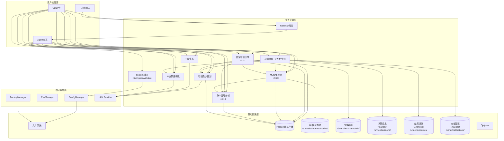
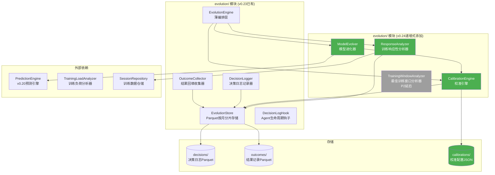
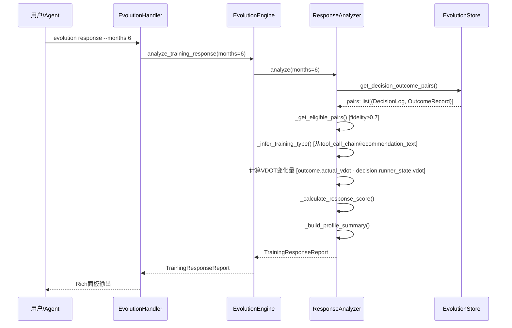
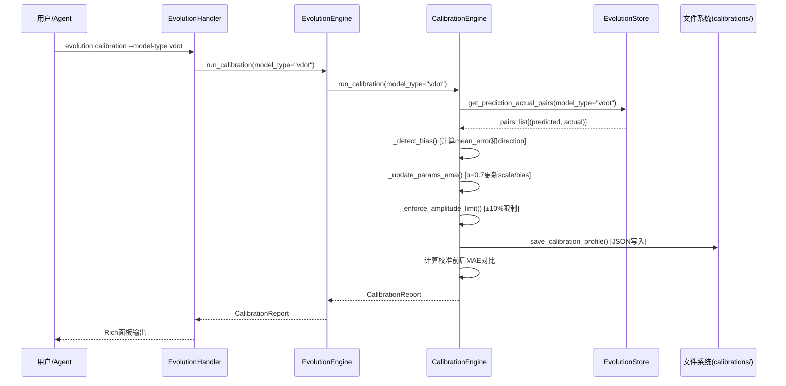
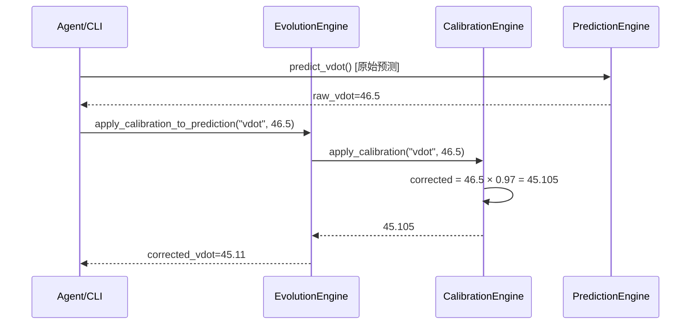

# 架构设计说明书

> **文档版本**: v11.1.0
> **设计日期**: 2026-04-17
> **更新日期**: 2026-05-20
> **当前基线**: v0.23.0
> **版本目标**: v0.24.0 个性化学习（Personalized Learning） 📋 当前规划
> **需求来源**: REQ_需求规格说明书.md (v10.0) + REQ_产品演进需求规格说明书.md (v1.0)
> **对齐依据**: 产品规划方案.md (v10.0)
> **外部参考**: 产品演进设计.md (v1.0) + multiagents.md (多智能体架构分析)
> **评审依据**: 架构评审报告_v0.23.0.md

> **项目性质说明**: 本项目为**个人使用且个人开发的项目**，所有设计和需求均围绕单人开发和使用场景展开。

***

## 1. 执行摘要

### 1.1 架构演进路线

| 阶段    | 版本          | 核心目标                                  | 状态     |
| ----- | ----------- | ------------------------------------- | ------ |
| 技术底座  | v0.5-v0.9.5 | 数据导入/存储/分析/CLI/依赖注入/SDK化              | ✅ 完成   |
| 智能计划  | v0.10-v0.12 | 自适应训练计划、LLM调整、目标预测                    | ✅ 完成   |
| 工具与智能 | v0.13-v0.15 | MCP协议、AI自我诊断、决策透明化                    | ✅ 完成   |
| 模块化重构 | v0.16-v0.17 | Core子模块拆分、Hook组合、Subagent、Cron提醒      | ✅ 完成   |
| 可视化导出 | v0.18       | 终端图表(plotext)、多格式导出(CSV/JSON/Parquet) | ✅ 完成   |
| 身体信号  | v0.19       | HRV分析、疲劳度评估、身体信号解读                    | ✅ 完成   |
| 预测未来  | v0.20       | ML增强预测（VDOT趋势/比赛成绩/伤病风险）              | ✅ 完成   |
| 数字孪生  | v0.21       | 跑者状态向量、What-If推演、计划对比                 | ✅ 完成   |
| 质量收口 | v0.22       | UAT验证、缺陷收敛、质量兜底、需求洞察       | ✅ 完成   |
| 决策追踪  | v0.23       | 决策日志、结果回填、预测校准                        | ✅ 已完成 |
| 个性化学习 | v0.24       | 训练响应性分析、个人化模型进化                       | 📋 当前规划 |
| 自适应进化 | v0.25       | 提示策略优化、自动进化触发                         | 📋 规划中 |
| 稳定版   | v1.0        | API冻结、性能优化、完整文档                       | 📋 计划中 |

### 1.2 v11.0.0 更新重点（v0.24.0 个性化学习架构设计）

1. **REQ-0.24-01 (P0)**: 新增训练响应性分析器(ResponseAnalyzer)，分析不同训练类型对VDOT的提升效果，输出个人训练响应画像
2. **REQ-0.24-02 (P1)**: 新增校准引擎(CalibrationEngine)，采用bias+scale线性修正(corrected = raw × scale + bias)，EMA(α=0.7)更新，幅度上限±10%
3. **REQ-0.24-03 (P1)**: 新增模型进化器(ModelEvolver)，基于校准结果调整Banister IR参数(τ_fitness/τ_fatigue)和风险阈值
4. **P-09遗留**: fidelity公式升级为三维度(体积0.40+强度0.30+时间0.30)，PlanExecutionData新增强度因子字段
5. **ADR-008**: 校准引擎采用线性修正+EMA更新策略，JSON存储校准配置于calibrations/目录
6. 新增2个CLI命令: `evolution calibration [--model-type]` / `evolution response [--months]`
7. 新增2个Agent工具: `analyze_training_response` / `get_calibration_status`
8. AppContext扩展: 新增response_analyzer/calibration_engine属性，EvolutionEngine构造函数扩展注入v0.24子组件
9. 模块归属修正: 骨架设计中`personalization/`路径纠正为`evolution/`（递增式添加）
10. 校准存储: 新增`~/.nanobot-runner/calibrations/`目录，JSON格式存储CalibrationProfile
11. 无侵入原则: 校准修正通过EvolutionEngine.apply_calibration_to_prediction()外层包装提供，PredictionEngine代码零修改

### 1.3 v10.1.0 更新重点（基于架构评审报告v0.23.0整改）✅ 已全部整改完成

1. **P-01 CRITICAL**: DecisionLogHook改为直接继承AgentHook（非ObservabilityHook），作为独立Hook注册，消除finalize_content状态竞争
2. **P-02 CRITICAL**: 明确runner_state摘要5字段（vdot/ctl/atl/tsb/fatigue_score）；新增PlanExecutionDataAdapter协议类封装PlanManager批量执行数据
3. **P-03 HIGH**: execution_status统一为5种状态（pending/executed/skipped/modified/failed）
4. **P-04 HIGH**: EvolutionStore写入策略改为默认同步写入，异步需配套错误恢复（队列+重试+降级+WAL）
5. **P-05 HIGH**: OutcomeRecord新增prediction_direction字段；check_prediction_accuracy()新增MAE统计输出
6. **P-06 HIGH**: create_composite_hook()增加可选参数decision_logger避免强制依赖和循环依赖
7. **P-08 MEDIUM**: 定义决策类型推断优先级规则
8. **P-09 MEDIUM**: 简化fidelity公式为体积偏差+时间偏差，强度偏差延后至v0.24
9. **P-10 MEDIUM**: EvolutionStore共享实例修正，AppContext中创建单一实例
10. **P-11 MEDIUM**: 明确DecisionLogHook状态管理策略（每次对话一条DecisionLog，异常不产生不完整记录）
11. **S-01 HIGH**: 新增EvolutionConfig配置Schema
12. **S-04 MEDIUM**: EvolutionStore新增get_decision_outcome_pairs()方法

### 1.3 v10.0.0 更新重点（v0.23.0 决策追踪）✅ 开发完成

1. 新增v0.23.0决策追踪模块完整架构设计（Section 8.2替换为详细设计）
2. 模块命名从骨架设计的`tracking/`更新为`evolution/`，体现决策进化闭环
3. DecisionLogHook继承ObservabilityHook，无侵入接入Agent迭代生命周期
4. DecisionLog + OutcomeRecord 分离数据模型，Parquet按月分片存储
5. 结果回填机制：check_plan_execution() + check_prediction_accuracy() 异步执行
6. 反馈收集复用AskUserConfirmManager，扩展ConfirmScenario.DECISION_FEEDBACK
7. 复用transparency模块DecisionType枚举，不新建枚举
8. 新增4个Agent工具：record_feedback / check_plan_execution / check_prediction_accuracy / get_decision_history
9. 新增evolution CLI命令组：history / feedback / accuracy / fidelity / status
10. 更新整体架构图新增EVOLUTION模块，更新CLI命令体系和数据目录总览

### 1.3 v9.2.0 更新重点（v0.22.0 质量收口）

1. v0.20 ML增强预测模块已完成（三层降级策略/分位数回归/SHAP可解释性）
2. v0.21 数字孪生引擎已完成（薄编排层/5维度状态向量/What-If推演/计划对比）
3. v0.22 质量收口已完成（UAT验证/缺陷收敛）
4. 更新文档版本至v9.2.0，对齐产品规划方案v9.2和需求规格说明书v8.6
5. 精简v0.20-v0.22已实现模块的详细设计，保留核心架构摘要
6. 将v0.23决策追踪标记为当前规划版本

### 1.3 v7.0.0 更新重点（对齐产品规划v9.0 + 产品演进设计v1.0）

1. 引入Banister IR参数化基线模型作为冷启动策略，填补基础预测与ML增强预测之间的空白
2. 统一prediction\_type为三段式：`ml_enhanced` / `parametric` / `basic`
3. 采纳分位数回归（p10/p50/p90）进行不确定性量化，替代简单置信区间
4. 采纳分层伤病风险模型架构：规则基线 → 逻辑回归 → GBDT集成
5. 新增2个Agent工具：`report_injury`（伤病报告）+ `predict_training_response`（训练响应预测）
6. 新增伤病标签体系：confirmed / suspected / unconfirmed
7. 补充v0.21-v0.25模块骨架设计（数字孪生/决策追踪/个性化学习/自适应进化）
8. 明确多智能体架构约束：nanobot仅支持主-从后台任务模式
9. 对齐产品规划方案v9.0和产品演进需求规格说明书v1.0，确保三文档一致性
10. 模型文件格式统一为.joblib（与sklearn官方推荐一致）

### 1.3 v6.0.0 更新重点（v0.20.0 ML增强预测）

1. 新增`prediction`核心子模块（ML-VDOT趋势预测/个人化比赛预测/ML伤病风险预测/模型管理/数据充足度评估）
2. 新增`predict` CLI命令组（status/vdot/race/injury-risk/model）
3. 新增5个Agent工具（predict\_vdot\_trend/predict\_race\_result/predict\_injury\_risk/check\_prediction\_status/manage\_prediction\_model）
4. 新增ML技术栈选型（scikit-learn/scipy/shap）
5. 新增模型存储架构设计（\~/.nanobot-runner/models/）
6. 新增数据充足度评估与自动降级策略
7. 新增特征工程模块设计（时序特征/负荷特征/身体信号特征）
8. 新增AppContext扩展属性`prediction_engine`

### 1.4 v5.1.0 更新重点

1. 新增数据缺失降级策略（DataQuality枚举、empty\_state返回值）— 对应评审Q1
2. 新增边界条件处理规范（单点数据、权重校验、TSB截断）— 对应评审Q2
3. 新增BodySignalConfig配置Schema定义 — 对应评审Q3
4. 新增RPE数据输入路径定义 — 对应评审Q4
5. 新增body\_signal模块测试策略 — 对应评审Q5
6. 明确status与analysis命令组职责边界 — 对应评审Q6
7. 整合建议改进项：data\_source字段、缓存机制、周对比、RecoveryStatus提升

### 1.5 v5.0.0 更新重点

1. 新增v0.19.0身体信号分析模块架构设计
2. 新增`body_signal`核心子模块（HRV分析/疲劳度评估/恢复监控/身体信号引擎）
3. 新增`status` CLI命令组、扩展`analysis`命令组
4. 新增6个Agent工具
5. 精简已完成版本文档，聚焦当前版本架构

### 1.6 核心设计原则

| 原则              | 策略                                    |
| --------------- | ------------------------------------- |
| **模块化**         | 按功能域划分子模块，接口通信                        |
| **依赖注入**        | AppContext统一管理核心组件                    |
| **配置驱动**        | Pydantic-Settings + 环境变量覆盖            |
| **类型安全**        | frozen dataclass + 类型注解 + mypy        |
| **LazyFrame优先** | Polars查询仅在最终输出时collect()              |
| **防御性设计**       | 数据缺失降级策略 + 边界条件处理 + DataQuality标识     |
| **ML渐进增强**      | 参数化基线→ML增强，数据不足自动降级，绝不阻塞用户            |
| **可解释ML**       | SHAP特征归因 + prediction\_type标注 + 置信度量化 |

***

## 2. 技术栈选型

| 类别        | 选型                | 版本              | 理由                              |
| --------- | ----------------- | --------------- | ------------------------------- |
| 语言        | Python            | **≥**3.11,<3.13 | 现有技术栈，生态成熟                      |
| Agent底座   | nanobot-ai        | Latest          | AI Agent框架，提供基础能力               |
| CLI       | Typer + Rich      | Latest          | 类型安全 + 美观输出                     |
| 配置        | Pydantic-Settings | Latest          | 类型安全 + 环境变量                     |
| 存储        | Apache Parquet    | via pyarrow     | 列式存储，高性能查询                      |
| 计算        | Polars            | 0.20+           | LazyFrame优化，高性能                 |
| 解析        | fitparse          | Latest          | FIT文件解析                         |
| 可视化       | plotext           | Latest          | 终端内图表渲染                         |
| 包管理       | uv                | Latest          | 快速依赖管理                          |
| **ML核心**  | **scikit-learn**  | **≥1.3.0**      | **轻量ML库，回归/分类/特征工程，适配本地单人场景**   |
| **科学计算**  | **scipy**         | **≥1.10.0**     | **Riegel曲线拟合(curve\_fit)、统计检验** |
| **特征解释**  | **shap**          | **≥0.48.0**     | **SHAP值特征重要性分析，可解释ML**          |
| **模型持久化** | **joblib**        | **≥1.3.0**      | **sklearn模型序列化，随sklearn安装**     |

**nanobot-ai适配**: 配置格式(JSON+Markdown)、环境变量`NANOBOT_`前缀、Workspace标准目录、加载优先级(环境变量>配置文件>默认值)

***

## 3. 系统架构设计

### 3.1 整体架构图



### 3.2 CLI命令体系

| 命令组          | 命令                                                 | 功能         | 版本        |
| ------------ | -------------------------------------------------- | ---------- | --------- |
| system       | `init / migrate / validate / config / backup`      | 系统管理       | v0.9+     |
| data         | `import / stats`                                   | 数据导入与统计    | v0.5+     |
| analysis     | `vdot / load / hr-drift`                           | 数据分析       | v0.8+     |
| analysis     | `hrv / hr-recovery / fatigue / recovery / compare` | 身体信号分析     | v0.19     |
| plan         | `create / status / feedback`                       | 训练计划       | v0.10+    |
| report       | `weekly / monthly`                                 | 训练报告       | v0.9+     |
| viz          | `vdot / load / hr-zones`                           | 数据可视化      | v0.18+    |
| export       | `sessions`                                         | 数据导出       | v0.18+    |
| transparency | `trace / status / insight`                         | AI透明化      | v0.15+    |
| status       | `today / weekly`                                   | 身体状态速览     | v0.19     |
| predict      | `status / vdot / race / injury-risk / model`       | ML增强预测     | v0.20     |
| twin         | `status / simulate / compare`                      | 数字孪生       | v0.21     |
| **evolution**| **`history / feedback / accuracy / fidelity / status / calibration / response`** | **决策追踪+个性化学习** | **v0.23+v0.24** |
| gateway      | `start`                                            | 飞书Gateway  | v0.9+     |

***

## 4. 已完成模块摘要

> 以下模块已完成开发，仅保留架构要点。详细设计见Git历史版本。

| 模块                      | 核心组件                                                                                | 关键设计                       |
| ----------------------- | ----------------------------------------------------------------------------------- | -------------------------- |
| **配置管理** (v0.9.4)       | InitWizard, MigrationEngine, ConfigValidator, WorkspaceManager                      | 无配置模式启动、优先级: 环境变量>配置文件>默认值 |
| **智能跑步计划** (v0.10-0.12) | TrainingPlanGenerator, LLMPlanAdjuster, GoalPredictionEngine, PlanCompletionTracker | LLM驱动计划调整、目标达成预测<3s        |
| **工具生态** (v0.13)        | MCPConfigHelper, ToolManager, WeatherService, MapService                            | MCP协议集成、本地工具优先、隐私保护        |
| **AI决策透明化** (v0.15)     | TransparencyEngine, ObservabilityManager, TraceLogger, TransparencyDisplay          | 分层展示(简洁/详细)、数据溯源、全链路追踪     |
| **Core模块化** (v0.16)     | diagnosis/memory/personality/skills/validate/tools六大子模块                             | 按功能域拆分、接口隔离                |
| **AI底座激活** (v0.17)      | Hook组合系统、Subagent架构、异步用户确认、Cron训练提醒                                                 | 流式输出、LLM超时控制               |
| **可视化与导出** (v0.18)      | PlotextRenderer, CSV/JSON/ParquetExporter                                           | 终端图表渲染、多格式导出引擎             |
| **飞书通知** (v0.9+)        | GatewayServer, FeishuAuth, FeishuNotifier, FeishuCalendar                           | 异步非阻塞、Token自动刷新、指数退避重试     |

***

## 5. 身体信号分析模块（v0.19.0）⭐


> **状态**: 已完成开发。详细设计见Git历史版本。

**核心架构**: HRVAnalyzer(心率变异) + FatigueAssessor(疲劳度评估) + RecoveryMonitor(恢复监控) + BodySignalEngine(编排层)。复用TrainingLoadAnalyzer/HeartRateAnalyzer计算结果，新增DataQuality三级降级策略(SUFFICIENT/INSUFFICIENT/EMPTY)。

**关键设计**: 同日缓存机制(BodySignalEngine)、RPE三级输入路径(FIT字段->CLI参数->自动降级)、TSB截断至[-50,50]、静息心率突增>10%预警。

**新增CLI**: status today/weekly, analysis hrv/hr-recovery/fatigue/recovery/compare

**新增Agent工具**: get_hrv_analysis, get_hr_recovery, get_fatigue_score, get_recovery_status, get_body_signal_summary, compare_training_periods

## 6. ML增强预测模块（v0.20.0）✅ 已完成

> **状态**: 已完成开发。详细设计见Git历史版本。

**核心架构**: PredictionEngine(统一入口) + VDOTPredictor/RacePredictor/InjuryPredictor(三大预测器) + FeatureEngine(特征工程) + DataAssessor(数据充足度评估) + ModelManager(模型生命周期)。

**关键设计**:
- **三层降级策略**: ML增强(GradientBoosting+SHAP) -> 参数化基线(Banister IR/逻辑回归) -> 基础预测(线性回归/规则阈值)
- **不确定性量化**: 分位数回归(p10/p50/p90)输出置信区间
- **伤病风险分层**: 规则基线->逻辑回归(CalibratedClassifierCV)->GBDT集成(4:6加权)
- **冷启动**: Banister IR参数化模型填补200-400条数据空白
- **缓存机制**: PredictionEngine同日缓存 + FeatureEngine特征矩阵缓存

**新增CLI**: predict status/vdot/race/injury-risk/model

**新增Agent工具**: predict_vdot_trend, predict_race_result, predict_injury_risk, check_prediction_status, manage_prediction_model, report_injury, predict_training_response

**模型存储**: ~/.nanobot-runner/models/ (joblib格式)

## 7. 数字孪生引擎模块（v0.21.0）✅ 已完成

> **状态**: 已完成开发。详细设计见Git历史版本。

**核心架构**: DigitalTwinEngine(薄编排层) + StateVectorBuilder(5维度状态向量构建器) + WhatIfSimulator(逐周推演器)。复用v0.20 PredictionEngine/v0.19 BodySignalEngine/v0.12 TrainingLoadAnalyzer。

**关键设计**:
- **薄编排层架构**: DigitalTwinEngine聚合现有模块输出，不引入新状态转移引擎，YAGNI原则
- **5维度状态向量**: 体能(VDOT/趋势/VO2max) / 负荷(CTL/ATL/TSB/ACWR) / 身体信号(疲劳/恢复/静息心率/HRV) / 风险(7d/28d伤病风险/过度训练) / 训练模式(周跑量/强度分布/长距离频率)
- **状态向量缓存**: TTL=24h，存储于 `~/.nanobot-runner/twin/state_vector.json`
- **三层推演降级**: ML增强(每周衰减5%) -> 参数化(每周衰减8%) -> 基础(每周衰减12%)
- **计划对比评分**: VDOT提升(40%) + 伤病风险(35%) + 恢复余量(25%)

**新增CLI**: twin status/simulate/compare

**新增Agent工具**: get_runner_state, simulate_plan, compare_plans

**代码库结构**:
```
src/core/twin/
├── __init__.py, models.py, twin_engine.py, state_vector_builder.py, whatif_simulator.py
src/cli/commands/twin.py, src/cli/handlers/twin_handler.py
tests/unit/core/twin/
```

**成功标准**: 4周VDOT推演误差<8%、单计划推演<10秒、推荐一致率>70%、核心模块测试覆盖率≥80%

***

## 8. v0.22-v0.25 模块骨架设计

### 8.1 v0.22 质量收口（Quality Stabilization）✅ 已完成

> **状态**: 已完成。详细记录见Git历史版本。

**核心交付**: UAT验证 + 缺陷收敛 + 质量兜底 + 需求洞察
**关键产出**: 数字孪生/ML预测/身体信号/数据管理/系统性能五大模块UAT验证、修复10+高优先级缺陷（修复率100%）、文档同步与版本归档
**质量目标**: 核心模块测试覆盖率≥80%、性能基准达标、文档与代码版本一致

### 8.2 v0.23 决策追踪（Decision Tracking）✅ 已完成

> **状态**: 已完成开发。详细设计见Git历史版本。

**核心架构**: EvolutionEngine(薄编排层) + DecisionLogger(决策日志记录器) + OutcomeCollector(结果收集器) + EvolutionStore(Parquet按月分片存储) + DecisionLogHook(Agent生命周期钩子)。复用transparency模块DecisionType枚举，独立继承AgentHook避免状态竞争。

**关键设计**:
- ADR-007: DecisionLogHook直接继承AgentHook（非ObservabilityHook），独立Hook注册消除状态竞争
- 每次Agent对话产生一条DecisionLog，异常不产生不完整记录
- Parquet按月分片存储（decisions/ + outcomes/），默认同步写入+异步错误恢复（队列+重试+降级+WAL）
- execution_status五态统一: pending/executed/skipped/modified/failed
- fidelity简化公式: 1 - (0.55×体积偏差 + 0.45×时间偏差)，强度偏差延后v0.24
- AppContext共享单一EvolutionStore实例，create_composite_hook()可选注册DecisionLogHook避免循环依赖

**新增CLI**: evolution history/feedback/accuracy/fidelity/status

**新增Agent工具**: record_feedback, check_plan_execution, check_prediction_accuracy, get_decision_history

**代码库结构**:
```
src/core/evolution/
├── __init__.py, models.py, config.py
├── decision_logger.py, outcome_collector.py
├── evolution_store.py, evolution_engine.py
└── decision_log_hook.py
src/agents/tools_evolution.py
src/cli/commands/evolution.py
src/cli/handlers/evolution_handler.py
tests/unit/core/evolution/
```

**成功标准**: 单条决策日志写入<50ms、决策查询<500ms、回填率>80%、Agent工具覆盖率≥80%、核心模块覆盖率≥85%

### 8.3 v0.24 个性化学习（Personalized Learning）📋 当前规划

> **状态**: 架构设计完成，待开发
> **版本主题**: 个性化学习 —— 让系统理解"这个跑者对什么训练响应最好"，并校准预测偏差
> **核心目标**: 基于决策日志和结果记录，实现训练响应性分析、预测校准和模型个体化进化
> **前置依赖**: v0.23决策追踪系统（DecisionLog + OutcomeRecord + EvolutionStore + EvolutionEngine）
> **模块归属**: `src/core/evolution/`（v0.24递增式添加校准引擎+响应分析器+模型进化器）
> **ADR-008**: 校准引擎采用bias+scale线性修正+EMA(α=0.7)更新策略，幅度上限±10%

#### 8.3.1 版本目标与核心概念

**核心概念**:

| 概念 | 定义 | 数据来源 |
|------|------|----------|
| 训练响应性 | 个体对不同训练刺激的VDOT提升效果差异 | DecisionLog + OutcomeRecord (fidelity≥0.7) |
| 预测校准 | 在预测输出上加 bias + scale 线性修正 | prediction-actual配对数据 (≥10条) |
| 模型进化 | 基于校准结果调整模型参数 | CalibrationProfile + PredictionEngine |
| 最佳训练窗口 | CTL-VDOT关联分析预测突破时机 | 历史CTL-VDOT数据 (≥6个月) |

**版本交付矩阵**:

| 需求ID | 需求描述 | 优先级 | 核心组件 |
|--------|---------|--------|----------|
| REQ-0.24-01 | 训练响应性分析 | P0 | ResponseAnalyzer |
| REQ-0.24-02 | 预测校准层 | P1 | CalibrationEngine |
| REQ-0.24-03 | 个人化模型进化 | P1 | ModelEvolver |
| REQ-0.24-04 | 最佳训练窗口 | P2 | TrainingWindowAnalyzer |

**P-09遗留**: v0.23评审中fidelity公式简化为体积0.55+时间0.45，强度偏差延后至v0.24。v0.24将fidelity公式升级为三维度: 体积0.40+强度0.30+时间0.30。

#### 8.3.2 模块架构图



#### 8.3.3 代码库结构（递增式添加）

```
src/core/evolution/
├── __init__.py                  # 已有 (v0.23)
├── models.py                    # 扩展: 新增v0.24数据模型
├── config.py                    # 扩展: 新增校准配置项
├── decision_logger.py           # 已有 (v0.23)
├── outcome_collector.py         # 扩展: fidelity公式升级为三维度
├── evolution_store.py           # 扩展: 新增校准配置读写方法
├── evolution_engine.py          # 扩展: 新增v0.24编排方法
├── decision_log_hook.py         # 已有 (v0.23，不修改)
├── response_analyzer.py         # 新增: 训练响应性分析器 (v0.24)
├── calibration_engine.py        # 新增: 校准引擎 (v0.24)
└── model_evolver.py             # 新增: 模型进化器 (v0.24)

src/agents/
├── tools.py                     # 已有
└── tools_evolution.py           # 扩展: 新增2个v0.24 Agent工具

src/cli/
├── commands/evolution.py        # 扩展: 新增2个v0.24 CLI命令
└── handlers/evolution_handler.py # 扩展: 新增2个v0.24 handler方法

tests/unit/core/evolution/
├── test_response_analyzer.py    # 新增
├── test_calibration_engine.py   # 新增
└── test_model_evolver.py        # 新增
```

#### 8.3.4 数据模型

**v0.24新增数据模型** (追加至 `models.py`):

```python
# === 训练响应性分析 ===

@dataclass(frozen=True)
class TrainingTypeResponse:
    """单训练类型响应数据（不可变数据类）

    记录某一训练类型的响应性分析结果。

    Attributes:
        training_type: 训练类型 (interval/threshold/long/recovery/easy)
        sample_count: 样本数
        avg_vdot_delta: 平均VDOT变化量
        avg_fidelity: 平均执行忠实度
        response_score: 响应性评分 (0-1, 越高响应越强)
    """
    training_type: str
    sample_count: int
    avg_vdot_delta: float
    avg_fidelity: float
    response_score: float

    def to_dict(self) -> dict[str, Any]: ...


@dataclass(frozen=True)
class TrainingResponseReport:
    """训练响应性分析报告（不可变数据类）

    汇总所有训练类型的响应性分析结果，输出个人训练响应画像。

    Attributes:
        report_id: 报告唯一标识
        timestamp: 分析时间
        analysis_months: 分析覆盖月数
        total_pairs: 决策-结果配对总数
        eligible_pairs: 符合条件的配对数 (fidelity≥0.7)
        training_responses: 各训练类型响应数据列表
        best_type: 最有效训练类型 (响应性最高)
        worst_type: 最不有效训练类型 (响应性最低)
        profile_summary: 画像摘要 (如"间歇训练响应性强")
        data_sufficient: 数据是否充足 (每组≥5条)
    """
    report_id: str
    timestamp: datetime
    analysis_months: int
    total_pairs: int
    eligible_pairs: int
    training_responses: list[TrainingTypeResponse]
    best_type: str | None
    worst_type: str | None
    profile_summary: str
    data_sufficient: bool

    def to_dict(self) -> dict[str, Any]: ...


# === 预测校准 ===

@dataclass(frozen=True)
class CalibrationProfile:
    """校准配置（不可变数据类）

    存储某一预测模型的校准参数，用于修正预测偏差。
    校准公式: corrected = raw × scale

    Attributes:
        model_type: 模型类型 (vdot/injury/training_response)
        scale: 乘法修正系数 (默认1.0)
        last_updated: 最后更新时间
        sample_count: 累计校准样本数
        mae_before: 校准前MAE (可选)
        mae_after: 校准后MAE (可选)
    """
    model_type: str
    scale: float
    last_updated: datetime
    sample_count: int
    mae_before: float | None
    mae_after: float | None

    def to_dict(self) -> dict[str, Any]: ...

    @classmethod
    def from_dict(cls, data: dict[str, Any]) -> CalibrationProfile: ...

    @classmethod
    def default(cls, model_type: str) -> CalibrationProfile:
        """创建默认校准配置 (scale=1.0)"""
        return cls(
            model_type=model_type,
            scale=1.0,
            last_updated=datetime.now(),
            sample_count=0,
            mae_before=None,
            mae_after=None,
        )


@dataclass(frozen=True)
class CalibrationReport:
    """校准报告（不可变数据类）

    记录一次校准操作的详细结果，含修正前后对比。

    Attributes:
        model_type: 模型类型
        timestamp: 校准时间
        direction: 偏差方向 (overestimate/underestimate/none)
        magnitude: 偏差幅度
        scale_before: 修正前scale
        scale_after: 修正后scale
        mae_before: 校准前MAE
        mae_after: 校准后MAE
        improvement_pct: MAE改善百分比
        sample_count: 参与校准的样本数
    """
    model_type: str
    timestamp: datetime
    direction: str
    magnitude: float
    scale_before: float
    scale_after: float
    mae_before: float
    mae_after: float
    improvement_pct: float
    sample_count: int

    def to_dict(self) -> dict[str, Any]: ...


# === 模型进化 ===

@dataclass(frozen=True)
class ParameterChange:
    """参数变化记录（不可变数据类）

    Attributes:
        name: 参数名
        old_value: 旧值
        new_value: 新值
        change_pct: 变化百分比
    """
    name: str
    old_value: float
    new_value: float
    change_pct: float

    def to_dict(self) -> dict[str, Any]: ...


@dataclass(frozen=True)
class ModelEvolutionResult:
    """模型进化结果（不可变数据类）

    记录一次模型进化的完整结果。

    Attributes:
        model_type: 模型类型
        timestamp: 进化时间
        parameter_changes: 参数变化列表
        mae_before: 进化前MAE
        mae_after: 进化后MAE
        improvement_pct: MAE改善百分比
        calibration_report: 关联的校准报告 (可选)
    """
    model_type: str
    timestamp: datetime
    parameter_changes: list[ParameterChange]
    mae_before: float
    mae_after: float
    improvement_pct: float
    calibration_report: CalibrationReport | None

    def to_dict(self) -> dict[str, Any]: ...
```

**v0.24扩展EvolutionConfig** (追加至 `config.py`):

```python
# 新增校准配置项 (追加至EvolutionConfig)
calibration_alpha: float = 0.7              # EMA更新系数
calibration_max_amplitude: float = 0.10     # 校准幅度上限 (±10%)
calibration_min_samples: int = 10           # 校准触发最低样本数
response_min_fidelity: float = 0.7          # 响应分析最低fidelity门槛
response_min_samples_per_type: int = 5      # 每训练类型最低样本数
window_min_months: int = 6                  # 训练窗口分析最低月数
```

#### 8.3.5 子模块详细设计

##### 8.3.5.1 训练响应性分析器 (ResponseAnalyzer)

**职责**: 分析用户对不同训练刺激的反应，识别最有效的训练类型，输出个人训练响应画像。

**核心方法**:

| 方法 | 输入 | 输出 | 说明 |
|------|------|------|------|
| `analyze()` | months(默认6) | TrainingResponseReport | 执行完整响应性分析 |
| `_get_eligible_pairs()` | months | list[tuple[DecisionLog, OutcomeRecord]] | 获取fidelity≥0.7的配对 |
| `_infer_training_type()` | DecisionLog | str | 从推荐文本/工具链推断训练类型 |
| `_calculate_response_score()` | avg_vdot_delta, avg_fidelity | float | 计算响应性评分(0-1) |
| `_build_profile_summary()` | responses | str | 生成画像摘要文本 |

**训练类型推断规则** (三级优先级: 结构化数据 > 关键词匹配 > 兜底):

**优先级1: 从tool_call_chain提取结构化数据**

| 工具名 | 参数 | 映射规则 |
|--------|------|----------|
| predict_training_response | session_type | interval/threshold/long/recovery/easy 直接映射 |
| simulate_plan | plan内容 | 从计划训练类型字段推断 |

**优先级2: 从recommendation_text关键词匹配**

| 训练类型 | 关键词 | TSS/min参考 |
|----------|--------|-------------|
| interval | 间歇/间歇跑/速度间歇/亚索800 | 1.1 |
| threshold | 阈值/节奏/节奏跑/乳酸阈值 | 0.9 |
| long | 长距离/LSD/长跑 | 0.65 |
| recovery | 恢复/恢复跑/排酸跑 | 0.4-0.5 |
| easy | 轻松跑/慢跑 | 0.5 |

**关键词冲突解决规则** (按优先级从高到低):
1. recovery与easy冲突时(如"轻松跑"同时匹配): 若上下文含"恢复/休息/排酸"关键词 → recovery；否则 → easy
2. 多类型同时匹配: 按interval > threshold > long > recovery > easy 优先级取最高
3. 无匹配: 返回"unknown"，不参与排名

**优先级3: 兜底返回"unknown"**

**响应性评分公式**:

```
response_score = normalize(avg_vdot_delta) × 0.6 + normalize(avg_fidelity) × 0.4
```

其中 `normalize` 将值映射到 [0, 1] 区间。VDOT变化量归一化基准: 最大0.5/周为1.0，最小0为0.0。忠实度直接使用fidelity值(已在[0,1])。

**VDOT变化量计算** (基于DecisionLog/OutcomeRecord已有数据，无需SessionRepository):

```
vdot_delta = outcome.actual_vdot - decision.runner_state.get("vdot", 0)
```

- "训练前VDOT": 从DecisionLog.runner_state["vdot"]获取(DecisionLogHook已从DigitalTwinEngine自动采集)
- "训练后VDOT": 从OutcomeRecord.actual_vdot获取(check_prediction_accuracy已填充)
- 若actual_vdot为None(未执行精度检查)，该配对不参与VDOT变化量计算，仅参与忠实度统计

**数据不足处理**: 当某训练类型样本数 < `response_min_samples_per_type`(5) 时，该类型标记为"data_insufficient"不参与排名，`data_sufficient`字段返回False。

**依赖注入**:

```python
class ResponseAnalyzer:
    def __init__(
        self,
        store: EvolutionStore,
        config: EvolutionConfig | None = None,
    ) -> None: ...
```

> **评审整改HIGH-1**: 移除session_repo依赖。原设计数据流`RA->>SR:get_vdot_at()`不可实现(SessionRepository无此方法且不计算VDOT)。改用DecisionLog.runner_state.vdot + OutcomeRecord.actual_vdot，数据已在v0.23自动采集。

##### 8.3.5.2 校准引擎 (CalibrationEngine)

**职责**: 检测预测系统性偏差，通过bias+scale线性修正校准预测输出，EMA更新保证稳定性。

**ADR-008: 校准引擎设计决策**

| 决策项 | 选择 | 理由 |
|--------|------|------|
| 修正模型 | 线性修正 (corrected = raw × scale) | 仅用scale修正比例偏差；VDOT值范围40-60，比例修正已足够，bias+scale双重修正易过度修正 |
| 更新策略 | EMA(α=0.7) | α=0.7赋予新数据较高权重，同时保留历史趋势，防止剧烈波动 |
| 幅度限制 | ±10% | 防止过度修正导致预测反而变差 |
| 触发门槛 | ≥10条配对 | 样本过少时校准不可靠 |
| 存储格式 | JSON文件 | 校准配置极小(~1KB)，无需Parquet |

**核心方法**:

| 方法 | 输入 | 输出 | 说明 |
|------|------|------|------|
| `run_calibration()` | model_type | CalibrationReport | 执行校准并返回报告 |
| `apply_calibration()` | model_type, raw_value | float | 对原始预测值应用校准修正 |
| `get_profile()` | model_type | CalibrationProfile | 获取校准配置 |
| `reset_calibration()` | model_type | CalibrationProfile | 重置为默认值(scale=1.0, bias=0.0) |
| `_detect_bias()` | pairs | tuple[str, float] | 检测偏差方向和幅度 |
| `_update_params_ema()` | current, new_observation | tuple[float, float] | EMA更新scale和bias |
| `_enforce_amplitude_limit()` | scale, bias | tuple[float, float] | 强制±10%幅度限制 |

**校准流程**:

```
1. 从EvolutionStore获取prediction-actual配对数据
2. 检查样本数 ≥ calibration_min_samples (10)
3. 计算系统性偏差:
   - mean_error = mean(predicted - actual) / mean(actual)
   - mean_error = clamp(mean_error, -0.5, 0.5)  # 防止极端值导致scale异常
   - direction = "overestimate" if mean_error > 0.05
                 "underestimate" if mean_error < -0.05
                 "none" otherwise
4. 计算新scale:
   - new_scale = mean(actual) / mean(predicted)  # 直接比例修正，更稳健
5. EMA更新:
   - scale = α × new_scale + (1-α) × current_scale
6. 幅度限制:
   - scale = clamp(scale, 0.9, 1.1)  # ±10%
7. 保存CalibrationProfile到calibrations/目录
8. 计算校准前后MAE对比
9. 返回CalibrationReport
```

> **评审整改MEDIUM-1/MEDIUM-4**: 简化校准公式为仅scale修正(corrected = raw × scale)，移除bias项避免双重修正过度；改用`new_scale = mean(actual) / mean(predicted)`替代`1/(1+mean_error)`，更稳健且无负值风险；增加mean_error范围检查clamp(-0.5, 0.5)。

**校准配置存储** (`~/.nanobot-runner/calibrations/{model_type}_calibration.json`):

```json
{
  "model_type": "vdot",
  "scale": 0.97,
  "last_updated": "2026-05-20T10:30:00",
  "sample_count": 25,
  "mae_before": 3.2,
  "mae_after": 2.5
}
```

**依赖注入**:

```python
class CalibrationEngine:
    def __init__(
        self,
        store: EvolutionStore,
        config: EvolutionConfig | None = None,
    ) -> None: ...
```

##### 8.3.5.3 模型进化器 (ModelEvolver)

**职责**: 基于校准结果调整预测模型参数，实现模型个体化进化。

**核心方法**:

| 方法 | 输入 | 输出 | 说明 |
|------|------|------|------|
| `evolve_vdot_model()` | 无 | ModelEvolutionResult | VDOT预测模型进化 |
| `evolve_injury_model()` | 无 | ModelEvolutionResult | 伤病风险模型进化 |
| `evolve_training_response_model()` | 无 | ModelEvolutionResult | 训练响应模型进化 (Banister IR参数) |
| `_adjust_banister_params()` | CalibrationProfile | list[ParameterChange] | 调整Banister IR参数 |

**模型进化策略**:

| 模型类型 | 进化策略 | 参数调整 |
|----------|----------|----------|
| VDOT预测 | 基于预测误差调整模型偏差 | PredictionConfig.banister_k1/k2微调 |
| 伤病风险 | 基于实际伤病事件调整风险阈值 | PredictionConfig.risk_warning_threshold |
| 训练响应 | 基于实际训练效果调整Banister IR参数 | PredictionConfig.banister_tau_fitness/tau_fatigue |

**Banister IR参数调整规则**:

```
若持续高估VDOT (direction=overestimate):
  tau_fitness += 2.0  (体能积累更慢)
  k1 *= 0.95          (体能增益系数降低)

若持续低估VDOT (direction=underestimate):
  tau_fitness -= 2.0  (体能积累更快)
  k1 *= 1.05          (体能增益系数提高)

调整幅度限制: 单次调整不超过参数值的5%
```

**依赖注入**:

```python
class ModelEvolver:
    def __init__(
        self,
        calibration_engine: CalibrationEngine,
        store: EvolutionStore,                            # v0.24新增: 参数持久化
        prediction_config: PredictionConfig | None = None,
        config: EvolutionConfig | None = None,
    ) -> None: ...
```

**参数持久化机制**:

ModelEvolver调整的参数必须持久化，否则应用重启后进化结果丢失。持久化策略:

1. **即时生效**: 进化后直接修改BanisterIRModel实例属性(tau_fitness/tau_fatigue/k1/k2)
2. **持久化存储**: 将修改后的参数值保存到`{data_dir}/calibrations/{model_type}_params.json`
3. **启动加载**: AppContext构建PredictionEngine时，先从EvolutionStore加载已保存的参数覆盖默认值

**参数持久化流程**:

```
1. ModelEvolver.evolve_*_model() 计算参数变化
2. 应用参数到BanisterIRModel实例 (即时生效)
3. 保存参数覆盖值到EvolutionStore.save_model_params() (持久化)
4. 返回ModelEvolutionResult
```

**AppContext启动加载**:

```python
# AppContext构建PredictionEngine时
config = PredictionConfig()
saved_params = store.load_model_params("vdot")
if saved_params:
    config = replace(config, **saved_params)
# 使用覆盖后的config构建BanisterIRModel
banister_model = BanisterIRModel(
    tau_fitness=config.banister_tau_fitness,
    tau_fatigue=config.banister_tau_fatigue,
    k1=config.banister_k1,
    k2=config.banister_k2,
)
```

**参数存储格式** (`~/.nanobot-runner/calibrations/vdot_params.json`):

```json
{
  "model_type": "vdot",
  "banister_tau_fitness": 44.0,
  "banister_tau_fatigue": 10.5,
  "banister_k1": 0.0036,
  "banister_k2": 0.043,
  "risk_warning_threshold": 0.7,
  "last_updated": "2026-05-20T10:30:00"
}
```

> **评审整改HIGH-3**: 新增EvolutionStore依赖和参数持久化机制。原设计调整PredictionConfig参数但无法持久化(PredictionConfig是frozen dataclass，AppContext每次重建使用默认值)，导致进化结果重启后丢失。整改方案: 通过EvolutionStore.save_model_params()/load_model_params()持久化参数覆盖值，AppContext启动时加载覆盖默认值。

##### 8.3.5.4 EvolutionEngine扩展

**新增方法** (追加至EvolutionEngine):

| 方法 | 输入 | 输出 | 说明 |
|------|------|------|------|
| `analyze_training_response()` | months(默认6) | TrainingResponseReport | 训练响应性分析 |
| `run_calibration()` | model_type | CalibrationReport | 执行校准 |
| `get_calibration_status()` | model_type(可选) | CalibrationProfile或dict | 查看校准配置与效果 |
| `evolve_model()` | model_type | ModelEvolutionResult | 执行模型进化 |
| `apply_calibration_to_prediction()` | model_type, raw_value | float | 对预测值应用校准修正 |

**扩展构造函数**:

```python
class EvolutionEngine:
    def __init__(
        self,
        decision_logger: DecisionLogger,
        outcome_collector: OutcomeCollector,
        response_analyzer: ResponseAnalyzer | None = None,      # v0.24新增
        calibration_engine: CalibrationEngine | None = None,     # v0.24新增
        model_evolver: ModelEvolver | None = None,               # v0.24新增
    ) -> None: ...
```

v0.24新增子组件为可选注入，保持向后兼容。未注入时对应方法抛出`RuntimeError`提示"请先初始化v0.24组件"。

##### 8.3.5.5 EvolutionStore扩展

**新增方法** (追加至EvolutionStore):

| 方法 | 输入 | 输出 | 说明 |
|------|------|------|------|
| `save_calibration_profile()` | CalibrationProfile | None | 保存校准配置到JSON |
| `load_calibration_profile()` | model_type | CalibrationProfile或None | 加载校准配置 |
| `get_prediction_actual_pairs()` | model_type, min_count | list[tuple[float, float]] | 获取预测-实际配对数据 |
| `save_model_params()` | model_type, params(dict) | None | 保存模型进化参数覆盖值 |
| `load_model_params()` | model_type | dict或None | 加载模型进化参数覆盖值 |

**校准配置存储路径**: `data_dir/calibrations/{model_type}_calibration.json`

**模型参数存储路径**: `data_dir/calibrations/{model_type}_params.json`

**calibrations/目录创建**: 由EvolutionStore在首次写入时自动创建(`mkdir(parents=True, exist_ok=True)`)。

**get_prediction_actual_pairs()实现逻辑**:

```python
def get_prediction_actual_pairs(
    self, model_type: str, min_count: int = 10
) -> list[tuple[float, float]]:
    """获取预测-实际配对数据

    从DecisionLog.prediction_snapshot提取predicted值，
    从OutcomeRecord提取actual值，仅返回两者均非None的配对。

    prediction_snapshot标准Schema:
    - VDOT预测: {"predicted_vdot": float, "model_type": "vdot", ...}
    - 伤病预测: {"injury_risk_probability": float, "model_type": "injury", ...}
    - 训练响应: {"predicted_vdot_impact": float, "model_type": "training_response", ...}

    提取规则:
    - model_type="vdot": predicted=prediction_snapshot["predicted_vdot"],
                         actual=outcome.actual_vdot
    - model_type="injury": predicted=prediction_snapshot["injury_risk_probability"],
                           actual=float(outcome.actual_injury)
    - model_type="training_response": predicted=prediction_snapshot["predicted_vdot_impact"],
                                      actual=从runner_state计算VDOT变化

    过滤条件:
    - prediction_snapshot非None且包含对应model_type的predicted字段
    - actual值非None
    - 配对数 >= min_count才返回(否则返回空列表)
    """
```

> **评审整改HIGH-2**: 补充prediction_snapshot标准Schema定义和get_prediction_actual_pairs()实现逻辑。原设计未定义如何从DecisionLog/OutcomeRecord提取predicted和actual值，导致CalibrationEngine无法可靠获取配对数据。

##### 8.3.5.6 Fidelity公式升级 (P-09遗留)

v0.23的fidelity公式为: `1 - (0.55×体积偏差 + 0.45×时间偏差)`

v0.24升级为三维度: `1 - (0.40×体积偏差 + 0.30×强度偏差 + 0.30×时间偏差)`

**强度偏差计算**:

```python
# PlanExecutionData新增字段
planned_intensity_factor: float  # 计划强度因子 (TSS/min)
actual_intensity_factor: float   # 实际强度因子 (TSS/min)

# 强度偏差公式
intensity_deviation = abs(actual_intensity_factor - planned_intensity_factor) / planned_intensity_factor
```

**强度因子来源**: 从训练session的TSS/duration计算，或从session_type查表获取参考值。

**强度因子查表规则** (planned_intensity_factor参考值):

| session_type | planned_intensity_factor (TSS/min) | 依据 |
|-------------|-----------------------------------|------|
| interval | 1.1 | 高强度间歇，TSS/min最高 |
| threshold | 0.9 | 节奏跑强度，TSS/min较高 |
| long | 0.65 | 长距离慢跑，TSS/min中等偏低 |
| recovery | 0.45 | 恢复跑，TSS/min最低 |
| easy | 0.50 | 轻松跑，TSS/min低 |

**actual_intensity_factor计算路径**:
1. 优先: 从关联session的TSS和duration计算: `actual_intensity_factor = TSS / duration_min`
2. 次选: 从session_type查表获取参考值
3. 兜底: 若无法获取，planned_intensity_factor设为0，回退到v0.23双维度公式

**PlanExecutionDataAdapter扩展**: 增加TrainingLoadAnalyzer依赖，用于计算session的TSS值，从而得到actual_intensity_factor。

**向后兼容**: 若`planned_intensity_factor`为0（旧数据无强度信息），回退到v0.23双维度公式。

#### 8.3.6 Parquet存储设计

**校准配置存储** (JSON格式，非Parquet):

```
~/.nanobot-runner/calibrations/
├── vdot_calibration.json           # VDOT预测校准配置
├── injury_calibration.json         # 伤病风险校准配置
└── training_response_calibration.json  # 训练响应校准配置
```

| 文件 | 格式 | 大小估算 | 更新频率 |
|------|------|----------|----------|
| vdot_calibration.json | JSON | ~200B | 每次校准触发 |
| injury_calibration.json | JSON | ~200B | 每次校准触发 |
| training_response_calibration.json | JSON | ~200B | 每次校准触发 |

**决策日志/结果记录**: 沿用v0.23 Parquet按月分片存储，无新增分片。

#### 8.3.7 AppContext扩展设计

**新增扩展属性** (追加至AppContext):

```python
@property
def response_analyzer(self) -> ResponseAnalyzer:
    """获取训练响应性分析器（v0.24.0新增）

    依赖注入模式：复用evolution_engine的EvolutionStore实例，
    注入SessionRepository，构建ResponseAnalyzer。
    """
    ...

@property
def calibration_engine(self) -> CalibrationEngine:
    """获取校准引擎（v0.24.0新增）

    依赖注入模式：复用evolution_engine的EvolutionStore实例，
    构建CalibrationEngine。校准配置存储于calibrations/目录。
    """
    ...
```

**EvolutionEngine构建更新** (AppContext.evolution_engine属性):

```python
# v0.24: 在构建EvolutionEngine时注入v0.24子组件
response_analyzer = ResponseAnalyzer(store=store, config=config)
calibration_engine = CalibrationEngine(store=store, config=config)
model_evolver = ModelEvolver(
    calibration_engine=calibration_engine,
    store=store,                                  # 参数持久化
    config=config,
)

engine = EvolutionEngine(
    decision_logger=decision_logger,
    outcome_collector=outcome_collector,
    response_analyzer=response_analyzer,       # v0.24新增
    calibration_engine=calibration_engine,      # v0.24新增
    model_evolver=model_evolver,                # v0.24新增
)
```

**PredictionEngine构建更新** (AppContext.prediction_engine属性，加载进化参数):

```python
# v0.24: 构建PredictionEngine时加载已保存的模型进化参数
config = PredictionConfig()
saved_params = store.load_model_params("vdot")
if saved_params:
    from dataclasses import replace
    config = replace(config, **saved_params)
banister_model = BanisterIRModel(
    tau_fitness=config.banister_tau_fitness,
    tau_fatigue=config.banister_tau_fatigue,
    k1=config.banister_k1,
    k2=config.banister_k2,
)
```

**无侵入原则**: 通过AppContext扩展属性接入，不修改现有核心逻辑(PredictionEngine/SessionRepository等)。校准修正通过EvolutionEngine.apply_calibration_to_prediction()方法提供，由上层(CLI/Agent)按需调用。

#### 8.3.8 CLI命令设计

**新增命令** (追加至evolution命令组):

| 命令 | 参数 | 功能 | 版本 |
|------|------|------|------|
| `evolution calibration` | `--model-type TYPE` | 执行预测校准并输出报告 | v0.24 |
| `evolution response` | `--months 6` | 分析训练响应性 | v0.24 |

**命令详细设计**:

```bash
# 执行预测校准
uv run nanobotrun evolution calibration [--model-type vdot|injury|training_response]

# --model-type: 指定校准模型类型，不指定则校准全部类型
# 输出: 校准报告面板（偏差方向/幅度/修正前后对比/MAE改善）

# 分析训练响应性
uv run nanobotrun evolution response [--months 6]

# --months: 分析覆盖月数，默认6
# 输出: 训练响应报告面板（各类型效果排名/画像摘要/数据充足性）
```

**CLI输出示例**:

```
╭─────────────── Evolution 校准报告 ───────────────╮
│ 模型类型: VDOT预测                                │
│ 偏差方向: 高估 (overestimate)                     │
│ 偏差幅度: 3.2%                                    │
│                                                   │
│ 修正前: scale=1.000                               │
│ 修正后: scale=0.970                               │
│                                                   │
│ 校准前MAE: 3.20%                                  │
│ 校准后MAE: 2.50%                                  │
│ MAE改善: 21.9%                                    │
│ 样本数: 25                                        │
╰───────────────────────────────────────────────────╯
```

#### 8.3.9 Agent工具设计

**新增工具** (追加至tools_evolution.py):

| 工具名 | 功能 | 输入 | 输出 |
|--------|------|------|------|
| analyze_training_response | 分析训练响应性 | months?(默认6) | TrainingResponseReport (JSON) |
| get_calibration_status | 查看校准配置与效果 | model_type? | CalibrationProfile (JSON) |

**工具详细设计**:

```python
class AnalyzeTrainingResponseTool(BaseTool):
    """训练响应性分析工具 - v0.24.0新增"""

    @property
    def name(self) -> str:
        return "analyze_training_response"

    @property
    def description(self) -> str:
        return (
            "分析用户对不同训练类型的响应性，识别最有效的训练类型。"
            "当用户询问'哪种训练对我最有效'或需要个性化训练建议时使用此工具。"
            "返回JSON格式：{success: true, data: {...}}"
        )

    @property
    def parameters(self) -> dict[str, Any]:
        return {
            "type": "object",
            "properties": {
                "months": {
                    "type": "integer",
                    "description": "分析覆盖月数（默认6，最少3）",
                    "default": 6,
                    "minimum": 3,
                },
            },
        }


class GetCalibrationStatusTool(BaseTool):
    """校准状态查询工具 - v0.24.0新增"""

    @property
    def name(self) -> str:
        return "get_calibration_status"

    @property
    def description(self) -> str:
        return (
            "查看预测模型的校准配置和效果。"
            "当需要了解AI预测是否经过个性化校准时使用此工具。"
            "返回JSON格式：{success: true, data: {...}}"
        )

    @property
    def parameters(self) -> dict[str, Any]:
        return {
            "type": "object",
            "properties": {
                "model_type": {
                    "type": "string",
                    "description": "模型类型（vdot/injury/training_response），不指定则返回全部",
                },
            },
        }
```

#### 8.3.10 核心数据流

**数据流1: 训练响应性分析**



**数据流2: 预测校准**



**数据流3: 校准修正应用**



#### 8.3.11 风险缓解

| 风险 | 等级 | 影响 | 缓解措施 |
|------|------|------|----------|
| 校准偏差方向错误 | 中 | 校准后预测反而变差 | 最少10条样本才触发；EMA(α=0.7)保证稳定；幅度上限±10%；reset_calibration()回退 |
| 训练响应性样本不足 | 低 | 分析结果不可靠 | 最低样本数门槛(每组≥5)；不足时返回"数据不足"；data_sufficient字段标识 |
| 强度偏差计算不准 | 中 | fidelity三维度公式不如预期 | 向后兼容：旧数据回退双维度公式；强度因子优先从session数据计算，次选查表 |
| 校准与PredictionEngine耦合 | 低 | 违反无侵入原则 | 校准修正通过EvolutionEngine.apply_calibration_to_prediction()提供，PredictionEngine不感知校准 |
| Banister IR参数调整过度 | 中 | 模型进化后预测偏差更大 | 单次调整不超过参数值5%；调整后验证MAE；可回退 |
| 用户反馈稀疏 | 高 | 校准和进化数据不足 | 复用v0.23 AskUserConfirmManager轻量反馈；隐式反馈自动记录(fidelity/accuracy) |

#### 8.3.12 测试策略

| 测试类型 | 覆盖范围 | Mock策略 | 关键测试用例 |
|----------|----------|----------|-------------|
| 单元测试 | ResponseAnalyzer | Mock EvolutionStore/SessionRepository | 训练类型推断、响应评分计算、数据不足处理、画像摘要生成 |
| 单元测试 | CalibrationEngine | Mock EvolutionStore | EMA更新、幅度限制、偏差检测、JSON读写、reset |
| 单元测试 | ModelEvolver | Mock CalibrationEngine | Banister参数调整、进化结果输出 |
| 单元测试 | Fidelity公式 | Mock PlanExecutionData | 三维度计算、强度为0回退、边界值 |
| 集成测试 | EvolutionEngine v0.24 | 真实EvolutionStore+临时目录 | 端到端响应分析、端到端校准流程 |
| 集成测试 | AppContext扩展 | 真实AppContext | response_analyzer/calibration_engine属性注入 |

**覆盖率目标**: 核心模块(ResponseAnalyzer/CalibrationEngine/ModelEvolver) ≥ 85%

#### 8.3.13 成功标准

| 维度 | 标准 | 验证方法 |
|------|------|----------|
| 响应性分析 | 训练类型效果排名与用户主观感受一致率>70% | 用户调研/对比验证 |
| 模型进化 | 校准后VDOT预测MAE降低≥15% | 自动统计: 校准前后MAE对比 |
| 预测校准 | 校准后预测误差降低≥10% | 自动统计: 校准前后误差对比 |
| 伤病校准 | 校准后伤病风险AUC提升≥0.05 | 自动统计: AUC对比 |
| 性能 | 响应性分析<3秒，校准计算<1秒 | 性能基准测试 |
| 无侵入 | PredictionEngine代码零修改 | 代码审查 |

#### 8.3.14 排除范围

| 排除项 | 理由 | 计划版本 |
|--------|------|----------|
| 最佳训练窗口预测 (REQ-0.24-04) | P2优先级，CTL-VDOT关联分析需≥6个月数据，MVP阶段用户数据不足 | v0.25+ |
| 自动校准触发 | 校准需用户手动触发，不自动执行 | v0.25 (进化触发器) |
| 非线性校准模型 | 数据量不足以支撑非线性修正，线性修正已足够 | 不计划 |
| 多模型联合校准 | VDOT/伤病/训练响应独立校准，不做联合优化 | 不计划 |
| PredictionEngine内部修改 | 遵循无侵入原则，校准通过外层包装实现 | 不计划 |

### 8.4 v0.25 自适应进化（Adaptive Evolution）

**核心概念**: 优化提示策略，实现自动进化触发

**核心能力**:

- 提示策略优化: 基于用户反馈优化AI提示策略
- 自动进化触发: 检测到模型性能退化时自动触发重训
- 进化守护: 监控模型性能指标，确保进化方向正确
- 回滚机制: 进化失败时回滚到上一版本

**模块结构**:

```
src/core/evolution/               # v0.25递增式添加（沿用evolution/模块）
├── prompt_optimizer.py          # 提示策略优化
├── auto_trigger.py              # 自动进化触发
└── evolution_guard.py           # 进化守护
```

***

## 9. 数据目录总览

> 统一展示 `~/.nanobot-runner/` 完整目录结构，标注各子目录的引入版本和用途。

```
~/.nanobot-runner/
├── config.json                    # 全局配置文件 (v0.9+)
├── data/                          # Parquet训练数据存储 (v0.5+)
│   └── YYYY/
│       └── sessions_YYYY.parquet
├── models/                        # ML模型存储 (v0.20新增)
│   ├── vdot_predictor/
│   ├── vdot_predictor_banister/
│   ├── race_predictor/
│   ├── injury_predictor/
│   └── prediction_history/
│       └── predictions.parquet
├── predictions/                   # 预测记录 (v0.20新增)
│   └── {date}_prediction.json
├── injury_labels/                 # 伤病标签 (v0.20新增)
│   ├── confirmed/
│   ├── suspected/
│   └── unconfirmed/
├── cache/                         # 特征缓存和预测缓存 (v0.20新增)
├── twin/                          # 数字孪生缓存 (v0.21新增)
│   └── state_vector.json         # 状态向量缓存 (TTL=24h)
├── decisions/                     # 决策日志 (v0.23新增)
│   └── YYYY-MM/
│       └── decisions_YYYY-MM.parquet
├── outcomes/                      # 结果记录 (v0.23新增)
│   └── YYYY-MM/
│       └── outcomes_YYYY-MM.parquet
├── calibrations/                  # 校准配置 (v0.24新增)
│   ├── vdot_calibration.json
│   ├── injury_calibration.json
│   └── training_response_calibration.json
└── backup/                        # 手动备份目录 (v0.9+)
```

| 子目录              | 引入版本  | 用途              | 估算大小      |
| ---------------- | ----- | --------------- | --------- |
| `data/`          | v0.5  | Parquet按年分片训练数据 | ~50MB/年  |
| `models/`        | v0.20 | ML模型文件和元数据      | 5-50MB/模型 |
| `predictions/`   | v0.20 | 预测历史记录          | ~1MB/年   |
| `injury_labels/` | v0.20 | 伤病标签分类存储        | ~1MB/年   |
| `cache/`         | v0.20 | 特征矩阵缓存和预测同日缓存   | ~10MB    |
| `twin/`          | v0.21 | 状态向量缓存          | ~10KB    |
| `decisions/`     | v0.23 | 决策日志Parquet按月分片 | ~5MB/年   |
| `outcomes/`      | v0.23 | 结果记录Parquet按月分片 | ~2MB/年   |
| `calibrations/` | v0.24 | 校准配置JSON存储       | ~1KB/模型  |
| `backup/`        | v0.9  | 手动备份压缩包         | 按需        |

***

## 10. 部署架构

**环境隔离**: 开发/生产共用本地环境，通过配置文件区分\
**部署方式**: `uv run nanobotrun` 本地运行\
**数据目录**: `~/.nanobot-runner/` (可配置)\
**备份策略**: `nanobotrun system backup` 手动触发

***

## 11. 变更记录

| 版本     | 日期         | 变更内容                                                                                                                                                                                                                                                                                                                                                                        |
| ------ | ---------- | --------------------------------------------------------------------------------------------------------------------------------------------------------------------------------------------------------------------------------------------------------------------------------------------------------------------------------------------------------------------------- |
| v11.1.0 | 2026-05-20 | **基于架构评审报告v0.24.0整改**：HIGH-1 ResponseAnalyzer移除session_repo依赖，改用DecisionLog.runner_state.vdot+OutcomeRecord.actual_vdot计算VDOT变化量；HIGH-2 补充prediction_snapshot标准Schema定义(VDOT/伤病/训练响应三种)和get_prediction_actual_pairs()实现逻辑；HIGH-3 ModelEvolver新增EvolutionStore依赖和参数持久化机制(save_model_params/load_model_params+AppContext启动加载)；HIGH-4 训练类型推断改为三级优先级(结构化数据>关键词匹配>兜底)+关键词冲突解决规则；MEDIUM-1 校准公式简化为仅scale修正(corrected=raw×scale)，移除bias项避免过度修正；MEDIUM-2 补充强度因子查表规则(5种session_type参考值)+actual_intensity_factor计算路径；MEDIUM-3 明确calibrations/目录创建责任+新增model_params存储路径；MEDIUM-4 校准流程改用new_scale=mean(actual)/mean(predicted)+mean_error范围检查clamp(-0.5,0.5)；CalibrationProfile移除bias字段；CalibrationReport移除bias_before/bias_after字段；更新数据流1(移除SR依赖)、数据流3(移除bias计算)、AppContext扩展(新增PredictionEngine构建更新)、CLI输出示例(移除bias行) |
| v10.1.0 | 2026-05-20 | **基于架构评审报告v0.23.0整改**：P-01 DecisionLogHook改为继承AgentHook(非ObservabilityHook)，独立Hook注册(ADR-007)；P-02 明确runner_state摘要5字段(vdot/ctl/atl/tsb/fatigue_score)+新增PlanExecutionDataAdapter协议类；P-03 execution_status统一为5种状态(pending/executed/skipped/modified/failed)；P-04 EvolutionStore写入策略改为默认同步+异步错误恢复机制(队列+重试+降级+WAL)；P-05 OutcomeRecord新增prediction_direction字段+check_prediction_accuracy新增MAE统计；P-06 create_composite_hook()增加可选参数decision_logger避免循环依赖；P-08 定义决策类型推断优先级规则(PLAN_ADJUSTMENT>RECOVERY_SUGGESTION>TRAINING_ADVICE>WEATHER_ADVICE>DATA_QUERY>GENERAL)；P-09 简化fidelity公式为体积0.55+时间0.45，强度偏差延后v0.24；P-10 EvolutionStore共享实例修正；P-11 明确DecisionLogHook状态管理策略(每次对话一条/异常不产生不完整记录)；S-01 新增EvolutionConfig配置Schema；S-04 EvolutionStore新增get_decision_outcome_pairs()方法；更新数据流图/风险缓解/测试策略/成功标准/排除范围 |
| v10.0.0 | 2026-05-20 | **v0.23.0决策追踪模块架构设计**：Section 8.2替换为完整详细设计（版本目标/模块架构图/代码库结构/数据模型DecisionLog+OutcomeRecord/子模块详细设计5个子模块/Parquet按月分片存储/Hook接入设计DecisionLogHook继承ObservabilityHook/AppContext扩展evolution_engine/CLI命令evolution命令组5个命令/Agent工具4个/核心数据流3个时序图/AskUserConfirmManager扩展/风险缓解7项/测试策略/Mock策略/成功标准5项/排除范围5项）；更新文档版本至v10.0.0；更新整体架构图新增EVOLUTION模块和DECISIONS/OUTCOMES存储；更新CLI命令体系新增evolution命令组；更新数据目录decisions/和outcomes/从预留改为正式 |
| v8.0.0 | 2026-05-11 | **v0.21.0数字孪生引擎架构设计**：新增Section 7完整设计（版本目标/ADR-002薄编排层/模块架构图/代码库结构/子模块设计/推演降级策略/计划对比评分/缓存策略/AppContext扩展/CLI命令/Agent工具/数据流/风险缓解/测试策略/成功标准/排除范围）；更新整体架构图(v0.21.0)新增TWIN模块和TWIN_CACHE；更新CLI命令体系新增twin命令组；更新数据目录新增twin/缓存目录；v0.22-v0.25骨架设计移至Section 8；章节重新编号 |
| v7.1.0 | 2026-05-08 | **评审整改**：修正v0.19功能状态标注为v0.20（CLI命令层和Agent工具层）；补充数据充足标准"理想数据量"列(HIGH-4)；新增跨模块集成测试4个场景(HIGH-6)；PredictionEngine流程图补充异常处理分支(MEDIUM-2)；新增"数据目录总览"章节(MEDIUM-3)；ADR-004补充默认参数/校准策略/对比评估(MEDIUM-5)；v0.21-v0.25骨架设计增加声明(HIGH-5)；RacePredictionEngine添加无状态注释(HIGH-3)；对齐需求规格v8.1                                                                                                      |
| v7.0.0 | 2026-05-08 | 对齐产品规划v9.0+产品演进设计v1.0：引入Banister IR参数化基线(ADR-004)、统一prediction\_type三段式(ml\_enhanced/parametric/basic)、采纳分位数回归(ADR-005)、采纳分层伤病风险模型(ADR-006)、新增2个Agent工具(report\_injury/predict\_training\_response)、新增伤病标签体系(confirmed/suspected/unconfirmed)、补充v0.21-v0.25模块骨架设计、明确多智能体架构约束、模型文件格式统一为.joblib、新增TrainingResponse/InjuryReportResult/InjuryLabel数据模型、PredictionConfig新增6个配置项 |
| v6.1.0 | 2026-05-07 | 基于架构评审报告v0.20.0整改：修复AppContext依赖注入违规(CRITICAL-2)、新增PredictionConfig配置Schema(HIGH-1)、新增预测模块测试策略(HIGH-2)、新增缓存机制(HIGH-3)、修正模型存储路径为\~/.nanobot-runner/models/(HIGH-4)、新增冷启动策略(HIGH-5)、补充predictions.parquet Schema(MEDIUM-1)、补充模型评估指标(MEDIUM-2)、补充SHAP降级策略(MEDIUM-3)、补充CLI Help文案与输出示例(MEDIUM-4)                                                                                |
| v5.1.0 | 2026-05-05 | 基于架构评审报告v0.19.0更新：新增数据缺失降级策略(Q1)、边界条件处理规范(Q2)、BodySignalConfig配置Schema(Q3)、RPE数据输入路径(Q4)、测试策略(Q5)、CLI命令组职责边界(Q6)；整合建议改进项：data\_source字段(S1)、缓存机制(S2)、周对比增强(S3)、RecoveryStatus共用模块(S4)                                                                                                                                                                                       |
| v5.0.0 | 2026-05-05 | 新增v0.19.0身体信号分析模块架构；精简已完成版本文档；更新整体架构图                                                                                                                                                                                                                                                                                                                                       |
| v4.2.0 | 2026-05-03 | 新增v0.17.0 AI底座能力全面激活架构设计                                                                                                                                                                                                                                                                                                                                                    |
| v4.0.0 | 2026-04-17 | 新增v0.13-v0.16架构设计                                                                                                                                                                                                                                                                                                                                                           |
