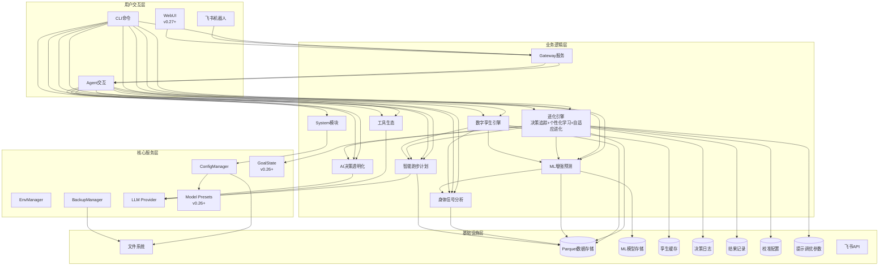
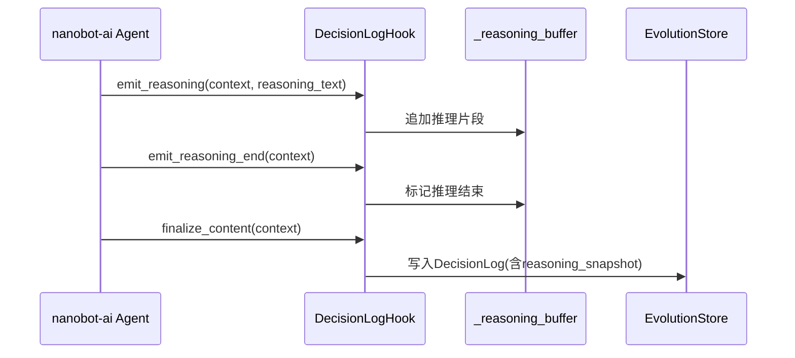
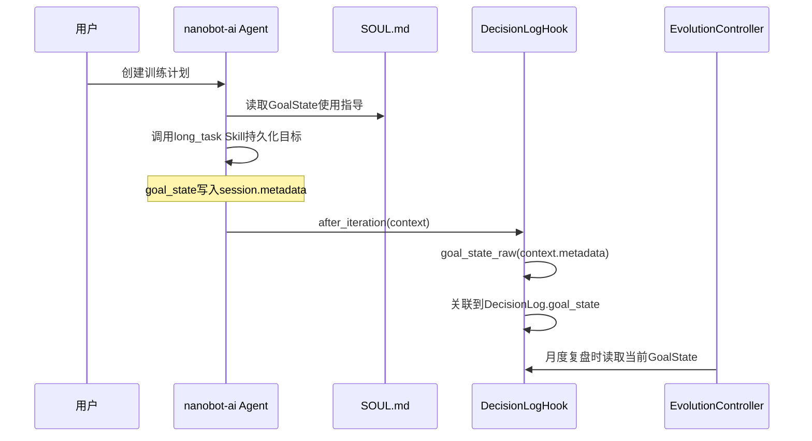

# 架构设计说明书

> **文档版本**: v14.0.0
> **设计日期**: 2026-04-17
> **更新日期**: 2026-05-24
> **当前基线**: v0.25.0
> **版本目标**: v0.26.0 底座升级+新特性适配 📋 规划中
> **需求来源**: REQ_需求规格说明书.md (v12.0)
> **对齐依据**: 产品规划方案.md (v11.0)

> **项目性质说明**: 本项目为**个人使用且个人开发的项目**，所有设计和需求均围绕单人开发和使用场景展开。

***

## 1. 执行摘要

### 1.1 架构演进路线

| 阶段 | 版本 | 核心目标 | 状态 |
|------|------|----------|------|
| 技术底座 | v0.5-v0.9.5 | 数据导入/存储/分析/CLI/依赖注入/SDK化 | ✅ 完成 |
| 智能计划 | v0.10-v0.12 | 自适应训练计划、LLM调整、目标预测 | ✅ 完成 |
| 工具与智能 | v0.13-v0.15 | MCP协议、AI自我诊断、决策透明化 | ✅ 完成 |
| 模块化重构 | v0.16-v0.17 | Core子模块拆分、Hook组合、Subagent、Cron提醒 | ✅ 完成 |
| 可视化导出 | v0.18 | 终端图表(plotext)、多格式导出 | ✅ 完成 |
| 身体信号 | v0.19 | HRV分析、疲劳度评估、身体信号解读 | ✅ 完成 |
| 预测未来 | v0.20 | ML增强预测（VDOT趋势/比赛成绩/伤病风险） | ✅ 完成 |
| 数字孪生 | v0.21 | 跑者状态向量、What-If推演、计划对比 | ✅ 完成 |
| 质量收口 | v0.22 | UAT验证、缺陷收敛、质量兜底 | ✅ 完成 |
| 决策追踪 | v0.23 | 决策日志、结果回填、预测校准 | ✅ 完成 |
| 个性化学习 | v0.24 | 训练响应性分析、个人化模型进化 | ✅ 完成 |
| 自适应进化 | v0.25 | 提示策略优化、自动进化触发 | ✅ 完成 |
| 底座升级+新特性 | v0.26 | nanobot-ai 0.2.0升级、GoalState、推理可见化、Model Presets | 📋 规划中 |
| WebUI基础 | v0.27 | AI对话交互、基础设置 | 📋 规划中 |
| WebUI数据可视化 | v0.28 | 跑步数据图表 | 📋 规划中 |
| WebUI管理控制台 | v0.29 | 训练计划管理、进化引擎控制台 | 📋 规划中 |
| 稳定版 | v1.0 | API冻结、性能优化、完整文档 | 📋 远期规划 |

### 1.2 核心设计原则

| 原则 | 策略 |
|------|------|
| **模块化** | 按功能域划分子模块，接口通信 |
| **依赖注入** | AppContext统一管理核心组件 |
| **配置驱动** | Pydantic-Settings + 环境变量覆盖 |
| **类型安全** | frozen dataclass + 类型注解 + mypy |
| **LazyFrame优先** | Polars查询仅在最终输出时collect() |
| **防御性设计** | 数据缺失降级策略 + 边界条件处理 + DataQuality标识 |
| **ML渐进增强** | 参数化基线→ML增强，数据不足自动降级，绝不阻塞用户 |
| **可解释ML** | SHAP特征归因 + prediction_type标注 + 置信度量化 |

### 1.3 设计决策索引

| ADR | 决策 | 版本 |
|-----|------|------|
| ADR-007 | DecisionLogHook直接继承AgentHook，独立注册消除状态竞争 | v0.23 |
| ADR-008 | 校准引擎采用线性修正(corrected=raw×scale)+EMA(α=0.7)更新，幅度上限±10% | v0.24 |
| ADR-009 | 进化触发器采用规则引擎+异步执行(threading.Thread daemon=True) | v0.25 |
| ADR-010 | 提示调优采用4维连续参数空间(语气/信息密度/推荐激进/数据驱动) | v0.25 |
| ADR-011 | 底座升级采用保守兼容策略：先升级依赖→全量测试→逐个修复→确认零回归后再适配新特性 | v0.26 |
| ADR-012 | GoalState通过SOUL.md注入使用指导+DecisionLogHook读取metadata实现，不新增独立模块 | v0.26 |
| ADR-013 | 推理可见化通过DecisionLogHook重写emit_reasoning()实现，推理片段追加到内部缓冲区并在finalize_content()写入DecisionLog | v0.26 |
| ADR-014 | Model Presets通过config.json配置预设，CLI仅提供查看命令，切换使用nanobot-ai内置/model命令 | v0.26 |

***

## 2. 技术栈选型

| 类别 | 选型 | 版本 | 理由 |
|------|------|------|------|
| 语言 | Python | ≥3.11,<3.13 | 现有技术栈，生态成熟 |
| Agent底座 | nanobot-ai | ≥0.2.0 | AI Agent框架，提供AgentHook/GoalState/WebUI/Model Presets等能力 |
| CLI | Typer + Rich | Latest | 类型安全 + 美观输出 |
| 配置 | Pydantic-Settings | Latest | 类型安全 + 环境变量 |
| 存储 | Apache Parquet | via pyarrow | 列式存储，高性能查询 |
| 计算 | Polars | 0.20+ | LazyFrame优化，高性能 |
| 解析 | fitparse | Latest | FIT文件解析 |
| 可视化 | plotext | Latest | 终端内图表渲染 |
| 包管理 | uv | Latest | 快速依赖管理 |
| ML核心 | scikit-learn | ≥1.5.0 | 轻量ML库，适配本地单人场景 |
| 科学计算 | scipy | ≥1.10.0 | Riegel曲线拟合、统计检验 |
| 特征解释 | shap | ≥0.48.0 | SHAP值特征重要性分析 |
| 模型持久化 | joblib | ≥1.3.0 | sklearn模型序列化 |

***

## 3. 系统架构设计

### 3.1 整体架构图



### 3.2 CLI命令体系

| 命令组 | 命令 | 功能 | 版本 |
|--------|------|------|------|
| system | `init / migrate / validate / config / backup` | 系统管理 | v0.9+ |
| data | `import / stats` | 数据导入与统计 | v0.5+ |
| analysis | `vdot / load / hr-drift / hrv / hr-recovery / fatigue / recovery / compare` | 数据分析+身体信号 | v0.8+ |
| plan | `create / status / feedback` | 训练计划 | v0.10+ |
| report | `weekly / monthly` | 训练报告 | v0.9+ |
| viz | `vdot / load / hr-zones` | 数据可视化 | v0.18+ |
| export | `sessions` | 数据导出 | v0.18+ |
| transparency | `trace / status / insight` | AI透明化 | v0.15+ |
| status | `today / weekly` | 身体状态速览 | v0.19 |
| predict | `status / vdot / race / injury-risk / model` | ML增强预测 | v0.20 |
| twin | `status / simulate / compare` | 数字孪生 | v0.21 |
| evolution | `history / feedback / accuracy / fidelity / status / calibration / response / triggers / report / tune` | 进化引擎 | v0.23-v0.25 |
| model | `list` | Model Presets 查看 | v0.26 |
| gateway | `start` | 飞书/WebUI Gateway | v0.9+ |

***

## 4. 已完成模块摘要

> 以下模块已完成开发，仅保留架构要点。详细设计见Git历史版本。

| 模块 | 核心组件 | 关键设计 |
|------|----------|----------|
| **配置管理** (v0.9.4) | InitWizard, MigrationEngine, ConfigValidator, WorkspaceManager | 无配置模式启动、优先级: 环境变量>配置文件>默认值 |
| **智能跑步计划** (v0.10-0.12) | TrainingPlanGenerator, LLMPlanAdjuster, GoalPredictionEngine | LLM驱动计划调整、目标达成预测<3s |
| **工具生态** (v0.13) | MCPConfigHelper, ToolManager, WeatherService, MapService | MCP协议集成、本地工具优先 |
| **AI决策透明化** (v0.15) | TransparencyEngine, ObservabilityManager, TraceLogger | 分层展示、数据溯源、全链路追踪 |
| **Core模块化** (v0.16) | diagnosis/memory/personality/skills/validate/tools六大子模块 | 按功能域拆分、接口隔离 |
| **AI底座激活** (v0.17) | Hook组合系统、Subagent架构、异步用户确认、Cron训练提醒 | 流式输出、LLM超时控制 |
| **可视化与导出** (v0.18) | PlotextRenderer, CSV/JSON/ParquetExporter | 终端图表渲染、多格式导出 |
| **飞书通知** (v0.9+) | GatewayServer, FeishuAuth, FeishuNotifier, FeishuCalendar | 异步非阻塞、Token自动刷新 |

***

## 5. 身体信号分析模块（v0.19.0）✅ 已完成

核心架构: HRVAnalyzer + FatigueAssessor + RecoveryMonitor + BodySignalEngine，复用TrainingLoadAnalyzer/HeartRateAnalyzer。关键设计: 同日缓存、RPE三级输入路径、TSB截断[-50,50]、静息心率突增>10%预警、DataQuality三级降级。

***

## 6. ML增强预测模块（v0.20.0）✅ 已完成

核心架构: PredictionEngine(统一入口) + VDOT/Race/Injury三个Predictor + FeatureEngine + ModelManager。关键设计: 三层降级策略(ML增强→参数化基线→基础预测)、不确定性量化(分位数回归p10/p50/p90)、伤病风险GBDT集成(4:6加权)、特征矩阵缓存、PredictionEngine同日缓存。

***

## 7. 数字孪生引擎模块（v0.21.0）✅ 已完成

核心架构: DigitalTwinEngine(薄编排层) + StateVectorBuilder(5维度: 体能/负荷/身体信号/风险/训练模式) + WhatIfSimulator(逐周推演)，复用PredictionEngine/BodySignalEngine。关键设计: 状态向量TTL=24h、三层推演降级(ML增强5%/参数化8%/基础12%每周衰减)、计划对比评分(VDOT提升40%+伤病风险35%+恢复余量25%)。

***

## 8. 进化引擎模块（v0.23-v0.25）✅ 已完成

进化引擎由三个版本递增式构建，形成决策→校准→优化闭环。关键架构决策: ADR-007(DecisionLogHook独立继承AgentHook)、ADR-008(线性修正corrected=raw×scale+EMA α=0.7)、ADR-009(规则引擎4触发+异步执行)、ADR-010(4维提示调优参数空间)。

**v0.23 决策追踪**: EvolutionEngine + DecisionLogger + OutcomeCollector + EvolutionStore(Parquet按月分片) + DecisionLogHook。DecisionLog+OutcomeRecord分离模型，execution_status五态，fidelity公式。

**v0.24 个性化学习**: ResponseAnalyzer + CalibrationEngine(偏差修正，幅度上限±10%) + ModelEvolver。Fidelity升级为三维度(体积0.40+强度0.30+时间0.30)，无侵入原则(PredictionEngine零修改)。

**v0.25 自适应进化**: EvolutionController(VDOT误差/连续拒绝/新数据积累/月度复盘4触发规则，check_triggers<50ms) + PromptTuner(4维: 语气/信息密度/推荐激进/数据驱动，地板保护aggressive≥0.1) + EvolutionReporter。

### 8.1 代码库结构

```
src/core/evolution/
├── __init__.py
├── models.py                 # DecisionLog, OutcomeRecord, EvolutionAction, PromptTuningParams等
├── config.py                 # EvolutionConfig (Pydantic-Settings)
├── evolution_store.py        # Parquet+JSON统一存储编排
├── decision_logger.py        # 决策日志记录器 (v0.23)
├── outcome_collector.py      # 结果收集器 (v0.23)
├── evolution_engine.py       # 进化引擎编排层 (v0.23-v0.25递增扩展)
├── decision_log_hook.py      # Agent生命周期钩子 (v0.23)
├── response_analyzer.py      # 训练响应性分析器 (v0.24)
├── calibration_engine.py     # 校准引擎 (v0.24)
├── model_evolver.py          # 模型进化器 (v0.24)
├── evolution_controller.py   # 进化触发控制器 (v0.25)
├── prompt_tuner.py           # 提示参数调优器 (v0.25)
└── evolution_reporter.py     # 进化报告生成器 (v0.25)
src/agents/tools_evolution.py
src/cli/commands/evolution.py
src/cli/handlers/evolution_handler.py
tests/unit/core/evolution/
```

### 8.2 数据目录

```
~/.nanobot-runner/
├── data/                     # 运动数据(Parquet按年分片)
├── models/                   # ML模型存储(joblib)
├── twin/                     # 孪生缓存(state_vector.json)
├── decisions/                # 决策日志(Parquet按月分片)
├── outcomes/                 # 结果记录(Parquet按月分片)
├── calibrations/             # 校准配置(JSON)
└── tuning/                   # 提示调优参数(JSON)
    ├── prompt_params.json
    └── trigger_state.json
```

***

## 9. v0.26.0 底座升级与新特性适配

### 9.1 模块概述

v0.26.0 不新增独立子模块，而是通过**扩展现有模块**适配 nanobot-ai 0.2.0 三项新特性。核心变更集中在 DecisionLogHook 和配置层。

### 9.2 DecisionLogHook 扩展设计

DecisionLogHook 是 v0.26.0 的核心变更点，需扩展两个能力：

**9.2.1 推理可见化（ADR-013）**



关键设计：
- 新增 `_reasoning_buffer: list[str]` 实例属性，在 `emit_reasoning()` 中追加推理片段
- `emit_reasoning_end()` 标记推理结束，可选地合并缓冲区
- `finalize_content()` 将推理缓冲区内容写入 DecisionLog 的上下文快照（`context_snapshot.reasoning` 字段）
- 飞书/WebSocket 渠道的推理流式展示由 nanobot-ai 原生 Channel 层自动处理，RunFlowAgent 仅需确保 `show_reasoning: true`

**9.2.2 GoalState 集成（ADR-012）**



关键设计：
- SOUL.md 新增 GoalState 使用指导段落，引导 LLM 在长时间任务时使用 `long_task` Skill 持久化目标
- DecisionLogHook 的 `after_iteration()` 中通过 `goal_state_raw(context.metadata)` 读取当前活跃目标，关联到 DecisionLog
- DecisionLog 数据模型新增 `goal_state: str | None` 可选字段
- EvolutionController 在月度复盘触发时，检查当前 GoalState 是否活跃并纳入进化上下文

### 9.3 Model Presets 配置设计（ADR-014）

```mermaid
graph LR
    subgraph "config.json"
        PRESETS[model_presets]
    end

    subgraph "CLI"
        LIST[nanobotrun model list]
    end

    subgraph "nanobot-ai 内置"
        SWITCH[/model preset_name]
    end

    PRESETS --> LIST
    PRESETS --> SWITCH
```

关键设计：
- config.json 新增 `model_presets` 配置段，定义命名预设（名称+Provider+参数组合）
- CLI 新增 `nanobotrun model list` 命令，查看当前预设列表
- 飞书/WebUI 中通过 `/model <preset>` 切换预设（nanobot-ai 内置 chat command，RunFlowAgent 仅提供预设配置）

**config.json 配置示例**：

```json
{
  "model_presets": {
    "fast": {
      "provider": "openai",
      "model": "gpt-4o-mini",
      "temperature": 0.3
    },
    "quality": {
      "provider": "anthropic",
      "model": "claude-sonnet-4-20250514",
      "temperature": 0.7
    }
  }
}
```

### 9.4 代码库变更范围

```
src/core/evolution/
├── models.py                 # DecisionLog 新增 goal_state 字段
├── decision_log_hook.py      # 新增 emit_reasoning()/emit_reasoning_end() 重写
                                 # after_iteration() 新增 goal_state_raw() 读取
└── evolution_controller.py   # 月度复盘新增 GoalState 检查

src/cli/commands/
└── model.py                  # 新增 model list 命令 (v0.26)

src/cli/handlers/
└── model_handler.py          # 新增 model handler (v0.26)

SOUL.md                       # 新增 GoalState 使用指导段落

config.json                   # 新增 model_presets 配置段

pyproject.toml                # nanobot-ai>=0.1.5.post2 → nanobot-ai>=0.2.0
```

### 9.5 API 兼容性分析

基于对 nanobot-ai 0.2.0 源码的审查，核心 API 兼容性评估：

| API | 0.1.5.post2 | 0.2.0 | Breaking? | RunFlowAgent 影响 |
|-----|-----------|-------|-----------|-------------------|
| `AgentHook.wants_streaming()` | 有 | 有 | 无 | 无影响 |
| `AgentHook.before_iteration()` | 有 | 有 | 无 | 无影响 |
| `AgentHook.on_stream()` | 有 | 有 | 无 | 无影响 |
| `AgentHook.on_stream_end()` | 有 | 有 | 无 | 无影响 |
| `AgentHook.before_execute_tools()` | 有 | 有 | 无 | 无影响 |
| `AgentHook.after_iteration()` | 有 | 有 | 无 | 无影响 |
| `AgentHook.finalize_content()` | 有 | 有 | 无 | 无影响 |
| `AgentHook.emit_reasoning()` | **无** | **有** | **无（新增）** | 自动继承，需重写 |
| `AgentHook.emit_reasoning_end()` | **无** | **有** | **无（新增）** | 自动继承，需重写 |
| `ToolCallRequest` 数据结构 | 有 | 有 | 无 | DecisionLogHook 兼容 |
| `LLMResponse` 数据结构 | 有 | 有 | 无 | 核心接口不变 |

**结论**：nanobot-ai 0.2.0 对 AgentHook 接口**纯增量扩展，无破坏性变更**。

***

## 10. 变更记录

| 版本 | 日期 | 变更内容 |
|------|------|----------|
| v14.0.0 | 2026-05-24 | **Phase D 架构设计**：①新增 §9 v0.26.0 底座升级与新特性适配架构设计；②新增 ADR-011~ADR-014 四项架构决策；③架构演进路线新增 v0.26-v0.29；④系统架构图新增 WebUI/GoalState/Model Presets；⑤技术栈 nanobot-ai 版本更新为 ≥0.2.0；⑥CLI 命令体系新增 model list；⑦API 兼容性分析表 |
| v13.1.0 | 2026-05-23 | **第二次精简**：①Section 5-8已完成模块大幅压缩为单句摘要；②进化引擎8.1-8.3合并为三个紧凑段落；③删除所有已完成模块的CLI/Agent工具明细列表 |
| v13.0.0 | 2026-05-23 | **v0.25.0发布修订**：①v0.24/v0.25标记为已完成；②当前基线更新为v0.25.0；③精简已完成模块详细设计为架构要点；④删除详细代码示例和方法签名；⑤保留ADR决策索引；⑥统一进化引擎为单节(v0.23-v0.25) |
| v12.0.2 | 2026-05-22 | 基于架构评审报告v0.25.0整改（C-01/C-02/M-03） |
| v12.0.0 | 2026-05-22 | v0.25.0自适应进化引擎架构设计 |
