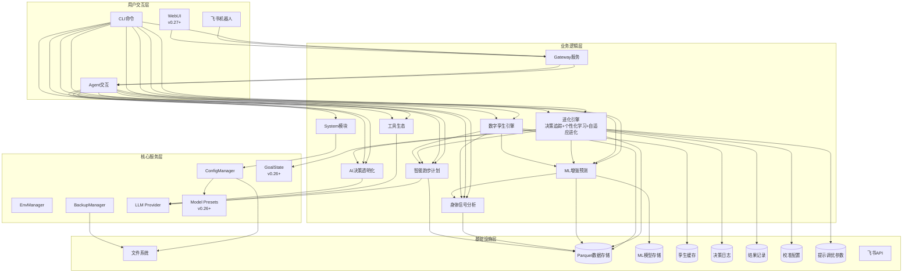

# 架构设计说明书

> **文档版本**: v19.0.0
> **设计日期**: 2026-04-17
> **更新日期**: 2026-06-04
> **当前基线**: v0.27.0
> **版本目标**: v0.28.0 WebUI数据可视化 🏗️ 设计中
> **需求来源**: REQ_需求规格说明书.md (v14.0)
> **对齐依据**: 产品规划方案.md (v13.0)
> **评审依据**: 架构评审报告-v0.28.0.md (v1.0)

> **项目性质说明**: 本项目为**个人使用且个人开发的项目**，所有设计和需求均围绕单人开发和使用场景展开。

***

## 1. 执行摘要

### 1.1 架构演进路线

| 阶段 | 版本 | 核心目标 | 状态 |
|------|------|----------|------|
| 记录跑步 | v0.5-v0.19 | 数据导入/存储/分析/CLI/依赖注入/SDK化/可视化/身体信号 | ✅ 完成 |
| 预测跑步 | v0.20-v0.22 | ML增强预测/数字孪生/质量收口 | ✅ 完成 |
| 进化跑步 | v0.23-v0.25 | 决策追踪/个性化学习/自适应进化 | ✅ 完成 |
| 交互升级 | v0.26-v0.29 | 底座升级+新特性(WebUI基础已完成，数据可视化管理控制台规划中) | 🏗️ 进行中 |
| 稳定版 | v1.0 | API冻结、性能优化、完整文档 | 📋 远期规划 |

### 1.2 核心设计原则

| 原则 | 策略 |
|------|------|
| **模块化** | 按功能域划分子模块，接口通信 |
| **依赖注入** | AppContext统一管理核心组件 |
| **配置驱动** | Pydantic-Settings + 环境变量覆盖 |
| **类型安全** | frozen dataclass + 类型注解 + mypy |
| **LazyFrame优先** | Polars查询仅在最终输出时collect() |
| **防御性设计** | 数据缺失降级策略 + 边界条件处理 + DataQuality标识 |
| **ML渐进增强** | 参数化基线→ML增强，数据不足自动降级，绝不阻塞用户 |
| **可解释ML** | SHAP特征归因 + prediction_type标注 + 置信度量化 |

### 1.3 设计决策索引

| ADR | 决策 | 版本 |
|-----|------|------|
| ADR-007 | DecisionLogHook直接继承AgentHook，独立注册消除状态竞争 | v0.23 |
| ADR-008 | 校准引擎采用线性修正(corrected=raw×scale)+EMA(α=0.7)更新，幅度上限±10% | v0.24 |
| ADR-009 | 进化触发器采用规则引擎+异步执行(threading.Thread daemon=True) | v0.25 |
| ADR-010 | 提示调优采用4维连续参数空间(语气/信息密度/推荐激进/数据驱动) | v0.25 |
| ADR-015 | WebSocket通道配置采用config.json配置节+RunnerProviderAdapter翻译 | v0.27 |
| ADR-016 | WebUI启用采用CLI --webui标志+config.json双重控制 | v0.27 |
| ADR-017 | WebSocket安全认证默认启用token+token_issue_path短期令牌 | v0.27 |
| ADR-011 | 底座升级采用保守兼容策略：先升级依赖→全量测试→逐个修复→确认零回归后再适配新特性 | v0.26 |
| ADR-012 | GoalState通过SOUL.md注入使用指导+DecisionLogHook读取metadata实现，不新增独立模块 | v0.26 |
| ADR-013 | 推理可见化通过DecisionLogHook重写emit_reasoning()实现，推理片段追加到内部缓冲区并在finalize_content()写入DecisionLog | v0.26 |
| ADR-014 | Model Presets通过config.json配置预设，CLI仅提供查看命令，切换使用nanobot-ai内置/model命令 | v0.26 |

***

## 2. 技术栈选型

| 类别 | 选型 | 版本 | 理由 |
|------|------|------|------|
| 语言 | Python | ≥3.11,<3.13 | 现有技术栈，生态成熟 |
| Agent底座 | nanobot-ai | ≥0.2.0 | AI Agent框架，提供AgentHook/GoalState/WebUI/Model Presets等能力 |
| CLI | Typer + Rich | Latest | 类型安全 + 美观输出 |
| 配置 | Pydantic-Settings | Latest | 类型安全 + 环境变量 |
| 存储 | Apache Parquet | via pyarrow | 列式存储，高性能查询 |
| 计算 | Polars | 0.20+ | LazyFrame优化，高性能 |
| 解析 | fitparse | Latest | FIT文件解析 |
| 可视化 | plotext | Latest | 终端内图表渲染 |
| 包管理 | uv | Latest | 快速依赖管理 |
| ML核心 | scikit-learn | ≥1.5.0 | 轻量ML库，适配本地单人场景 |
| 科学计算 | scipy | ≥1.10.0 | Riegel曲线拟合、统计检验 |
| 特征解释 | shap | ≥0.48.0 | SHAP值特征重要性分析 |
| 模型持久化 | joblib | ≥1.3.0 | sklearn模型序列化 |

***

## 3. 系统架构设计

### 3.1 整体架构图



### 3.2 CLI命令体系

| 命令组 | 命令 | 功能 | 版本 |
|--------|------|------|------|
| system | `init / migrate / validate / config / backup` | 系统管理 | v0.9+ |
| data | `import / stats` | 数据导入与统计 | v0.5+ |
| analysis | `vdot / load / hr-drift / hrv / hr-recovery / fatigue / recovery / compare` | 数据分析+身体信号 | v0.8+ |
| plan | `create / status / feedback` | 训练计划 | v0.10+ |
| report | `weekly / monthly` | 训练报告 | v0.9+ |
| viz | `vdot / load / hr-zones` | 数据可视化 | v0.18+ |
| export | `sessions` | 数据导出 | v0.18+ |
| transparency | `trace / status / insight` | AI透明化 | v0.15+ |
| status | `today / weekly` | 身体状态速览 | v0.19 |
| predict | `status / vdot / race / injury-risk / model` | ML增强预测 | v0.20 |
| twin | `status / simulate / compare` | 数字孪生 | v0.21 |
| evolution | `history / feedback / accuracy / fidelity / status / calibration / response / triggers / report / tune` | 进化引擎 | v0.23-v0.25 |
| model | `list` | Model Presets 查看 | v0.26 |
| gateway | `start` | 飞书/WebUI Gateway | v0.9+ |

***

## 4. 已完成模块摘要

> 以下模块已完成开发并随版本发布，仅保留架构要点。详细设计见Git历史版本与对应版本实施计划。

| 模块 | 核心组件 | 关键设计 |
|------|----------|----------|
| **配置管理** (v0.9.4) | InitWizard, MigrationEngine, ConfigValidator, WorkspaceManager | 无配置模式启动、优先级: 环境变量>配置文件>默认值 |
| **智能跑步计划** (v0.10-0.12) | TrainingPlanGenerator, LLMPlanAdjuster, GoalPredictionEngine | LLM驱动计划调整、目标达成预测<3s |
| **工具生态** (v0.13) | MCPConfigHelper, ToolManager, WeatherService, MapService | MCP协议集成、本地工具优先 |
| **AI决策透明化** (v0.15) | TransparencyEngine, ObservabilityManager, TraceLogger | 分层展示、数据溯源、全链路追踪 |
| **Core模块化** (v0.16) | diagnosis/memory/personality/skills/validate/tools六大子模块 | 按功能域拆分、接口隔离 |
| **AI底座激活** (v0.17) | Hook组合系统、Subagent架构、异步用户确认、Cron训练提醒 | 流式输出、LLM超时控制 |
| **可视化与导出** (v0.18) | PlotextRenderer, CSV/JSON/ParquetExporter | 终端图表渲染、多格式导出 |
| **飞书通知** (v0.9+) | GatewayServer, FeishuAuth, FeishuNotifier, FeishuCalendar | 异步非阻塞、Token自动刷新 |
| **身体信号分析** (v0.19) | HRVAnalyzer + FatigueAssessor + RecoveryMonitor + BodySignalEngine | 三级RPE输入、TSB截断、静息心率突增>10%预警、DataQuality三级降级 |
| **ML增强预测** (v0.20) | PredictionEngine + VDOT/Race/Injury Predictor + FeatureEngine + ModelManager | 三层降级(ML→参数化→基础)、分位数回归p10/p50/p90、伤病GBDT集成(4:6加权) |
| **数字孪生引擎** (v0.21) | DigitalTwinEngine + StateVectorBuilder(5维度) + WhatIfSimulator | 状态向量TTL=24h、三层推演降级(5%/8%/12%周衰减)、对比评分(VDOT 40%+伤病35%+恢复25%) |
| **进化引擎** (v0.23-0.25) | EvolutionEngine + DecisionLogHook + ResponseAnalyzer + CalibrationEngine + ModelEvolver + EvolutionController + PromptTuner + EvolutionReporter | 决策→校准→优化闭环、ADR-007(独立Hook) / ADR-008(线性修正+EMA) / ADR-009(规则引擎+异步) / ADR-010(4维调优+地板保护) |
| **底座升级+新特性** (v0.26) | DecisionLogHook扩展(推理缓冲区+GoalState读取) + ModelHandler + `model list` 命令 | ADR-011(保守升级) / ADR-012(SOUL.md+metadata) / ADR-013(emit_reasoning缓冲区) / ADR-014(config.json+CLI查看) |
| **WebUI基础** (v0.27) | RunnerProviderAdapter扩展(WebSocket配置+webui_enabled) + ConfigManager.get_websocket_config() + Gateway `--webui` 标志 | ADR-015(config节+ProviderAdapter翻译) / ADR-016(CLI+config双重控制) / ADR-017(默认token+token_issue_path短期令牌) |

***

## 5. 身体信号分析模块（v0.19.0）✅ 已完成

核心架构: HRVAnalyzer + FatigueAssessor + RecoveryMonitor + BodySignalEngine，复用 TrainingLoadAnalyzer/HeartRateAnalyzer。关键设计: 同日缓存、RPE三级输入路径、TSB截断[-50,50]、静息心率突增>10%预警、DataQuality三级降级。详细设计见Git历史版本。

***

## 6. ML增强预测模块（v0.20.0）✅ 已完成

核心架构: PredictionEngine(统一入口) + VDOT/Race/Injury三个Predictor + FeatureEngine + ModelManager。关键设计: 三层降级策略(ML增强→参数化基线→基础预测)、不确定性量化(分位数回归p10/p50/p90)、伤病风险GBDT集成(4:6加权)、特征矩阵缓存、PredictionEngine同日缓存。详细设计见Git历史版本。

***

## 7. 数字孪生引擎模块（v0.21.0）✅ 已完成

核心架构: DigitalTwinEngine(薄编排层) + StateVectorBuilder(5维度: 体能/负荷/身体信号/风险/训练模式) + WhatIfSimulator(逐周推演)，复用 PredictionEngine/BodySignalEngine。关键设计: 状态向量TTL=24h、三层推演降级(ML增强5%/参数化8%/基础12%每周衰减)、计划对比评分(VDOT提升40%+伤病风险35%+恢复余量25%)。详细设计见Git历史版本。

***

## 8. 进化引擎模块（v0.23-v0.25）✅ 已完成

进化引擎由三个版本递增式构建，形成决策→校准→优化闭环。关键架构决策: ADR-007(DecisionLogHook独立继承AgentHook)、ADR-008(线性修正corrected=raw×scale+EMA α=0.7)、ADR-009(规则引擎4触发+异步执行)、ADR-010(4维提示调优参数空间)。代码库结构: `src/core/evolution/{models,config,store,logger,collector,engine,hook,analyzer,calibrator,evolver,controller,tuner,reporter}.py` + `src/agents/tools_evolution.py` + `src/cli/commands/evolution.py` + `src/cli/handlers/evolution_handler.py`。数据目录: `~/.nanobot-runner/{decisions,outcomes,calibrations,tuning}/`，其中 `decisions`/`outcomes` 按月Parquet分片，`calibrations`/`tuning` 为JSON。详细设计见Git历史版本。

***

## 9. 底座升级与新特性适配（v0.26.0）✅ 已完成

核心架构: 不新增独立子模块，通过扩展现有模块适配 nanobot-ai 0.2.0 三项新特性。关键设计: ADR-011(保守升级策略: 先升级依赖→全量测试→逐个修复→确认零回归)、ADR-012(GoalState通过SOUL.md注入使用指导+DecisionLogHook的after_iteration()读取metadata实现)、ADR-013(推理可见化通过DecisionLogHook重写emit_reasoning()/emit_reasoning_end()，推理片段追加到_reasoning_buffer缓冲区，finalize_content()写入DecisionLog)、ADR-014(Model Presets通过config.json配置预设+CLI提供model list查看命令+nanobot-ai内置/model命令切换)。核心变更: DecisionLogHook新增_reasoning_buffer推理缓冲区+goal_state_raw()读取目标状态+_current_goal_state追踪、DecisionLog数据模型新增goal_state可选字段、CLI新增model list命令、pyproject.toml升级nanobot-ai>=0.2.0。详细设计见Git历史版本。

***

## 10. v0.27.0 WebUI基础 ✅ 已完成

v0.27.0 核心目标是**配置驱动启用 nanobot-ai 内置 WebUI**，不新增独立子模块，通过扩展现有模块（RunnerProviderAdapter + Gateway CLI + ConfigManager）实现 WebUI 基础能力。

**设计原则**：最小变更原则 — 仅修改配置构建层和 CLI 入口层，不修改 Agent 工具逻辑、不修改 nanobot-ai 前端代码。

### 10.1 需求映射

| 需求编号 | 需求 | 架构实现方式 |
|----------|------|-------------|
| REQ-D-11 | WebUI 启动 | RunnerProviderAdapter 构建 WebSocket 通道配置 → ChannelManager 自动发现并启用 |
| REQ-D-12 | 工具调用 | 复用现有 Agent 工具注册机制，WebSocket 通道共享同一 AgentLoop |
| REQ-D-13 | 流式输出 | 复用 StreamingHook + WebSocket 通道原生 streaming 支持 |
| REQ-D-14 | 多会话管理 | nanobot-ai WebUI 原生支持，无需额外开发 |
| REQ-D-15 | 基础设置 | nanobot-ai WebUI 设置面板原生支持，需确保 Model Presets 配置正确 |
| REQ-D-16 | 品牌自定义 | AgentsConfig.defaults 写入 bot_name="Nanobot-Runner" / bot_icon="🏃‍♂️" |
| REQ-D-17 | WebSocket 通道配置 | config.json 新增 `websocket` 配置节 + RunnerProviderAdapter 翻译 |
| REQ-D-18 | 安全认证 | 默认 127.0.0.1 + token 认证 + token_issue_path 短期令牌 |
| REQ-D-19 | Gateway 命令增强 | `gateway start --webui` 标志，启用时自动注入 WebSocket 配置 |
| REQ-D-20 | 统一会话模式 | config.json 可选 `unified_session` 字段，默认关闭 |

### 10.2 配置 Schema 摘要

`config.json` 新增 `websocket` 配置节（enabled/host/port/path/token/token_issue_path/token_issue_secret/token_ttl_s/websocket_requires_token/streaming/allow_from/max_message_bytes/ping_interval_s/ping_timeout_s），默认值 127.0.0.1:8765、`websocket_requires_token=true`、`enabled=false`。环境变量 `NANOBOT_WS_*` 可覆盖 `enabled/host/port/token/token_issue_secret`。

### 10.3 模块变更摘要

| 变更文件 | 变更类型 | 关键变更 |
|----------|---------|---------|
| `src/core/provider_adapter.py` | 修改 | `__init__` 新增 `webui_enabled` 参数 + `_build_nanobot_config_from_runner()` 新增 WebSocket 配置构建 + `AgentsConfig.defaults` 新增 `bot_name`/`bot_icon`/`unified_session` 字段 |
| `src/cli/commands/gateway.py` | 修改 | `start()` 命令新增 `--webui` 标志 + 启动后显示 WebUI 访问地址 + token 获取方式 |
| `src/core/config/manager.py` | 修改 | 新增 `get_websocket_config() -> dict[str, Any]` 方法（含环境变量覆盖） |
| `config.example.json` | 修改 | 新增 `websocket` 配置节示例 |

### 10.4 不做的事

- 不修改 nanobot-ai 源码（WebSocket Channel / WebUI SPA）
- 不新增后端 HTTP API 端点
- 不修改现有 Agent 工具逻辑
- 不开发自定义 WebUI 组件
- 不引入新的第三方依赖

### 10.5 ADR 决策记录

> ADR 是项目知识资产，永久保留作为设计依据。

#### ADR-015：WebSocket 通道配置方式

**背景**：需要为 nanobot-ai 内置 WebSocket 通道提供配置，使其能启用 WebUI。

**决策**：在项目 config.json 新增 `websocket` 配置节，由 RunnerProviderAdapter 翻译为 nanobot WebSocketConfig。

**影响**：
- ✅ 与飞书通道配置模式一致，配置驱动
- ✅ 用户无需直接操作 nanobot 配置文件
- ✅ 支持环境变量覆盖
- ❌ 需要修改 ConfigManager 和 RunnerProviderAdapter

**替代方案**：
- 直接修改 `~/.nanobot/config.json`：破坏项目配置封装，不采用
- 仅通过 CLI 标志配置：无法持久化配置，不采用
- 仅通过环境变量配置：配置项过多，不采用

#### ADR-016：WebUI 启用方式

**背景**：用户需要一种便捷方式启用 WebUI，同时不影响现有飞书通道行为。

**决策**：采用 `gateway start --webui` CLI 标志 + config.json `websocket.enabled` 双重控制。CLI 标志优先级高于配置文件。

**影响**：
- ✅ 显式启用，不影响现有行为（默认不启用）
- ✅ 配置文件可持久化启用状态
- ✅ CLI 标志适合临时启用场景
- ❌ 两个启用入口可能造成混淆（文档需明确优先级）

**替代方案**：
- 仅 config.json 控制：需要用户手动编辑配置文件，不够便捷
- 仅 CLI 标志控制：无法持久化，每次启动需手动指定
- 新增独立 `webui` 命令：与 gateway 职责重叠，不采用

#### ADR-017：安全认证策略

**背景**：WebSocket 通道需要认证机制防止未授权访问。

**决策**：默认启用 token 认证（`websocket_requires_token=True`），采用 token_issue_path 短期令牌签发机制。本地访问（127.0.0.1）时 token_issue_secret 可选。

**影响**：
- ✅ 安全默认，防止未授权访问
- ✅ 短期令牌机制比静态令牌更安全
- ✅ 本地访问零配置即可使用
- ❌ 非本地访问需额外配置 token_issue_secret

**替代方案**：
- 无认证：安全风险高，不采用
- 仅静态 token：不够灵活，不采用
- OAuth2：过度设计，个人项目不需要

***

## 11. v0.28.0 WebUI数据可视化 🏗️ 设计中

v0.28.0 核心目标是**建设独立Web数据可视化服务**，提供跑步数据图表、活动浏览、身体信号展示等能力。与v0.27.0的nanobot-ai WebUI（仅用于Agent对话交互）形成双Web服务架构。

**设计原则**：独立服务原则 — 数据可视化使用独立FastAPI服务+独立React SPA，与nanobot-ai WebUI解耦，共享核心数据层和认证机制。

### 11.1 架构决策

#### ADR-018：独立Web服务架构

**背景**：nanobot-ai WebUI仅支持Agent对话交互，不支持自定义页面/路由注入。v0.28.0需要提供跑步数据可视化、活动浏览、身体信号展示等功能，需要独立的Web服务架构。

**决策**：采用独立FastAPI服务（端口8766）+ 独立React SPA架构。nanobot-ai WebUI（端口8765）仅用于Agent对话，数据可视化/设置等使用独立Web服务。

**影响**：
- ✅ 与nanobot-ai WebUI完全解耦，不依赖monkey-patch
- ✅ 标准FastAPI开发体验，RESTful API设计
- ✅ 独立React SPA，自由选择技术栈（Recharts/React Router等）
- ✅ 两个服务可独立演进、独立部署
- ❌ 需要额外端口（8766）
- ❌ 需独立处理认证（共享token机制）
- ❌ 用户需在两个页面间切换

**替代方案**：
- monkey-patch `_dispatch_http` 扩展路由：依赖内部API，上游变更风险高
- Agent工具机制返回数据：延迟高（经LLM），数据格式不可控
- 统一SPA（fork前端）：维护成本高，上游更新需手动合并

#### ADR-019：数据一致性策略

**背景**：WebUI图表数据必须与CLI命令输出数值一致（误差<0.1%），需要确保数据源和计算逻辑完全相同。

**决策**：FastAPI服务通过`get_context()`获取同一AppContext实例，调用与CLI命令相同的核心模块方法（AnalyticsEngine/SessionRepository/StorageManager/BodySignalEngine等）。API层仅做数据格式转换（dataclass → JSON），不包含任何计算逻辑。

**影响**：
- ✅ 数据一致性由架构保证，无需额外同步逻辑
- ✅ API层薄封装，维护成本低
- ✅ 复用现有核心模块，零重复代码
- ❌ API层与核心模块耦合（通过接口解耦）

#### ADR-020：前端技术栈

**背景**：需要选择与数据可视化需求匹配的前端技术栈。

**决策**：React + TypeScript + Vite + Recharts + React Router + TailwindCSS。

**影响**：
- ✅ React生态成熟，Recharts轻量且声明式API
- ✅ TypeScript类型安全，与后端Pydantic schema对齐
- ✅ Vite构建速度快，HMR开发体验好
- ✅ TailwindCSS快速样式开发
- ❌ 新增前端项目，需独立构建流程

#### ADR-021：并发安全策略

**背景**：核心模块方法均为同步方法（Polars LazyFrame → collect()），在FastAPI异步路由中直接调用会阻塞事件循环。数据可视化API全部为只读操作，但需要确保并发调用安全。

**决策**：
1. FastAPI路由中使用 `starlette.concurrency.run_in_threadpool()` 包装所有同步核心模块调用
2. 数据可视化API不涉及写操作，线程安全无风险
3. 后续如需写操作API（如修改配置），需添加 `threading.Lock` 保护

**影响**：
- ✅ 异步路由不阻塞事件循环
- ✅ 利用线程池并行处理多个图表请求
- ✅ 单用户本地场景，性能完全足够
- ❌ 每次调用有线程切换开销（可忽略）
- ❌ 核心模块ConfigManager缓存需注意线程安全（当前只读，不受影响）

#### ADR-022：前端构建与部署

**背景**：前端为独立React SPA项目，需要构建为静态文件后部署。

**决策**：
1. **开发环境**：Vite dev server (端口5173) + proxy转发 `/api` 到FastAPI(8766)
2. **生产环境**：`npm run build` → `webui/dist/` → FastAPI StaticFiles服务
3. **打包方式**：`webui/dist/` 随Python wheel分发（`pyproject.toml` wheel targets配置）
4. **前端部署位置**：**强制在FastAPI(8766)端口**，与API同源，避免CORS（C-02）
5. **CI/CD**：release workflow新增 `setup-node + npm ci + npm run build` 步骤

**影响**：
- ✅ 开发体验好（HMR + proxy）
- ✅ 生产环境同源部署，无CORS问题
- ✅ 前端构建产物随Python包分发，部署简单
- ❌ CI/CD需新增Node.js环境
- ❌ wheel体积增大（前端构建产物通常200-500KB）

### 11.2 系统架构

#### 11.2.1 双Web服务架构

```
用户浏览器
    │
    ├── http://127.0.0.1:8765  → nanobot-ai WebUI (Agent对话)
    │                            ├── WebSocket实时通信
    │                            └── Agent工具调用
    │
    └── http://127.0.0.1:8766  → 数据可视化WebUI (独立服务)
                                 ├── React SPA (Vite构建)
                                 ├── Recharts图表渲染
                                 └── FastAPI REST API
                                      ├── /api/webui/dashboard
                                      ├── /api/webui/vdot/trend
                                      ├── /api/webui/training-load
                                      ├── /api/webui/activities
                                      ├── /api/webui/body-signals
                                      └── 认证中间件 (共享token)
                                           │
                                           ↓
                                    AppContext (get_context())
                                      ├── AnalyticsEngine
                                      ├── SessionRepository
                                      ├── StorageManager
                                      ├── BodySignalEngine
                                      └── ... (核心模块)
```

#### 11.2.2 Gateway启动流程

```
gateway start --webui
    ↓
创建 AppContext (get_context())
    ↓
启动 nanobot-ai 服务 (端口8765)
    ├── AgentLoop + ChannelManager
    └── WebSocket通道 + WebUI SPA
    ↓
启动 FastAPI 数据服务 (端口8766)    ← v0.28.0新增
    ├── 认证中间件 (共享token)
    ├── /api/webui/* 路由
    └── React SPA 静态文件服务
    ↓
asyncio.gather(agent.run(), channels.start_all(), fastapi_server.serve())
```

**关键实现约束（C-01）**：FastAPI必须使用 `uvicorn.Server(config).serve()` 启动，**禁止使用 `uvicorn.run()`**。`uvicorn.run()` 内部调用 `asyncio.run()` 会创建新的事件循环，与Gateway现有的 `asyncio.run(run())` 冲突。

```python
# gateway.py run() 协程中的FastAPI启动方式
import uvicorn
from src.webui.app import create_webui_app

async def run():
    # ... 现有启动逻辑 ...
    webui_app = create_webui_app()
    fastapi_config = uvicorn.Config(
        webui_app,
        host="127.0.0.1",
        port=8766,
        log_level="info"
    )
    fastapi_server = uvicorn.Server(fastapi_config)
    await asyncio.gather(
        agent.run(),
        channels.start_all(),
        fastapi_server.serve(),  # 协程方法，共享同一事件循环
    )
```

### 11.3 后端架构

#### 11.3.1 模块结构

```
src/
├── webui/                          # v0.28.0 新增模块
│   ├── __init__.py
│   ├── app.py                      # FastAPI应用工厂
│   ├── config.py                   # WebUI服务配置Schema
│   ├── auth.py                     # 认证中间件（共享token验证）
│   ├── routes/                     # API路由
│   │   ├── __init__.py
│   │   ├── dashboard.py            # 仪表盘API
│   │   ├── vdot.py                 # VDOT趋势API
│   │   ├── training_load.py        # 训练负荷API
│   │   ├── activities.py           # 活动列表/详情API
│   │   └── body_signals.py         # 身体信号API
│   ├── schemas/                    # Pydantic响应Schema
│   │   ├── __init__.py
│   │   ├── dashboard.py
│   │   ├── vdot.py
│   │   ├── training_load.py
│   │   ├── activities.py
│   │   └── body_signals.py
│   └── services/                   # 服务层（薄封装核心模块）
│       ├── __init__.py
│       ├── dashboard_service.py
│       ├── vdot_service.py
│       ├── training_load_service.py
│       ├── activities_service.py
│       └── body_signals_service.py
├── cli/commands/gateway.py         # 修改：启动FastAPI服务
└── core/config/manager.py          # 修改：新增WebUI服务配置
```

#### 11.3.2 FastAPI应用工厂

**核心约束**：路由注册顺序至关重要 — API路由必须先于SPA catch-all路由注册，否则API请求会被SPA回退拦截。

```python
# src/webui/app.py
from pathlib import Path
from fastapi import FastAPI
from fastapi.staticfiles import StaticFiles
from fastapi.responses import FileResponse
from src.webui.auth import TokenAuthMiddleware
from src.webui.routes import dashboard, vdot, training_load, activities, body_signals

def create_webui_app() -> FastAPI:
    app = FastAPI(title="Nanobot Runner WebUI", version="0.28.0")

    # 1. 认证中间件
    app.add_middleware(TokenAuthMiddleware)

    # 2. API路由（必须在SPA路由之前注册）    ← 顺序关键
    app.include_router(dashboard.router, prefix="/api/webui")
    app.include_router(vdot.router, prefix="/api/webui")
    app.include_router(training_load.router, prefix="/api/webui")
    app.include_router(activities.router, prefix="/api/webui")
    app.include_router(body_signals.router, prefix="/api/webui")

    # 3. 健康检查端点（M-03）
    @app.get("/api/webui/health")
    async def health_check():
        return {"status": "ok", "version": "0.28.0"}

    # 4. SPA catch-all路由（I-01）：React Router使用HTML5 History API，
    #    浏览器直接访问 /vdot 等路由时需回退到 index.html
    @app.get("/{full_path:path}")
    async def serve_spa(full_path: str):
        static_dir = Path("webui/dist")
        file_path = static_dir / full_path
        if file_path.is_file():
            return FileResponse(file_path)
        return FileResponse(static_dir / "index.html")

    # 5. 静态资源挂载（可选的显式挂载，catch-all已覆盖）
    # app.mount("/", StaticFiles(directory="webui/dist", html=True), name="spa")
    return app
```

#### 11.3.3 认证中间件

```python
# src/webui/auth.py
# 共享nanobot-ai WebSocket服务的token验证机制
# 验证请求Header中的Authorization: Bearer <token>
# token来源：nanobot-ai token_issue_path签发的短期令牌
```

#### 11.3.4 API端点设计

| 端点 | 方法 | 查询参数 | 数据源 | 响应Schema |
|------|------|----------|--------|-----------|
| `/api/webui/health` | GET | - | - | `HealthResponse` |
| `/api/webui/dashboard` | GET | `days` (默认7) | `AnalyticsEngine` + `SessionRepository` | `DashboardResponse` |
| `/api/webui/vdot/trend` | GET | `days` (默认90) | `AnalyticsEngine.get_vdot_trend()` | `VdotTrendResponse` |
| `/api/webui/training-load` | GET | `days` (默认42) | `AnalyticsEngine.get_training_load()` | `TrainingLoadResponse` |
| `/api/webui/training-load/trend` | GET | `days` (默认42) | `AnalyticsEngine.get_training_load_trend()` | `TrainingLoadTrendResponse` |
| `/api/webui/activities` | GET | `page`, `size`(默认20), `start_date`, `end_date`, `min_distance` | `SessionRepository` | `ActivitiesResponse` |
| `/api/webui/activities/{id}` | GET | `id`=SHA256哈希（StorageManager索引键） | `SessionRepository` + `AnalyticsEngine` | `ActivityDetailResponse` |
| `/api/webui/body-signals` | GET | `days` (默认7) | `BodySignalEngine` | `BodySignalsResponse` |
| `/api/webui/body-signals/hrv` | GET | `days` (默认30) | `HRVAnalyzer` | `HrvResponse` |
| `/api/webui/body-signals/fatigue` | GET | - | `FatigueAssessor` | `FatigueResponse` |
| `/api/webui/body-signals/recovery` | GET | - | `RecoveryMonitor` | `RecoveryResponse` |

> **I-02 说明**：`/api/webui/activities/{id}` 中的 `id` 为 FIT文件内容的SHA256哈希值（64位十六进制字符串），与 `StorageManager` 的索引去重键一致，由 `IndexManager` 管理。

#### 11.3.5 服务层模式

服务层是核心模块的薄封装，职责：
1. 通过`get_context()`获取AppContext
2. 调用核心模块方法获取数据
3. 将dataclass转换为Pydantic Schema

**并发安全约束**：核心模块方法均为同步方法（Polars LazyFrame → collect()），在FastAPI异步路由中直接调用会阻塞事件循环。**必须使用 `run_in_threadpool()` 包装同步调用**，将阻塞操作转移到线程池执行。数据可视化API全部只读操作，无线程安全问题。

```python
# src/webui/services/vdot_service.py 示例
from starlette.concurrency import run_in_threadpool
from src.core.base.context import get_context
from src.webui.schemas.vdot import VdotTrendResponse, VdotTrendItem

async def get_vdot_trend(days: int = 90) -> VdotTrendResponse:
    context = get_context()
    # 必须：通过 run_in_threadpool 包装同步核心方法调用
    trend_items = await run_in_threadpool(context.analytics.get_vdot_trend, days)
    return VdotTrendResponse(
        items=[VdotTrendItem(**item.to_dict()) for item in trend_items],
        days=days
    )
```

### 11.4 前端架构

#### 11.4.1 项目结构

```
webui/                              # 独立React SPA项目
├── package.json
├── vite.config.ts
├── tsconfig.json
├── tailwind.config.js
├── index.html
├── public/
│   └── favicon.ico
└── src/
    ├── main.tsx                    # 入口
    ├── App.tsx                     # 根组件（路由配置）
    ├── api/                        # API客户端
    │   ├── client.ts              # axios实例（baseURL+认证）
    │   ├── dashboard.ts
    │   ├── vdot.ts
    │   ├── training-load.ts
    │   ├── activities.ts
    │   └── body-signals.ts
    ├── components/                 # 共享组件
    │   ├── layout/
    │   │   ├── AppLayout.tsx       # 左侧导航+右侧内容区
    │   │   ├── Sidebar.tsx         # 侧边导航栏
    │   │   └── Header.tsx          # 顶部栏
    │   ├── charts/                 # Recharts图表组件
    │   │   ├── VdotTrendChart.tsx  # VDOT趋势折线图
    │   │   ├── TrainingLoadChart.tsx # ATL/CTL/TSB堆叠面积图
    │   │   ├── PaceChart.tsx       # 配速曲线
    │   │   └── HeartRateChart.tsx  # 心率曲线
    │   ├── cards/                  # 数据卡片组件
    │   │   ├── StatCard.tsx        # 统计卡片（距离/时长/配速/心率）
    │   │   ├── StatusCard.tsx      # 状态卡片（疲劳/恢复）
    │   │   └── AlertCard.tsx       # 预警卡片
    │   └── common/                 # 通用组件
    │       ├── TimeRangeSelector.tsx # 时间范围筛选控件
    │       ├── Pagination.tsx      # 分页组件
    │       └── LoadingSpinner.tsx  # 加载状态
    ├── pages/                      # 页面组件
    │   ├── DashboardPage.tsx       # 首页仪表盘
    │   ├── VdotPage.tsx            # VDOT趋势页
    │   ├── TrainingLoadPage.tsx    # 训练负荷页
    │   ├── ActivitiesPage.tsx      # 活动列表页
    │   ├── ActivityDetailPage.tsx  # 活动详情页
    │   └── BodySignalsPage.tsx     # 身体信号页
    ├── hooks/                      # 自定义Hooks
    │   ├── useTimeRange.ts         # 时间范围状态管理
    │   └── useApi.ts               # API请求封装
    ├── types/                      # TypeScript类型定义
    │   └── api.ts                  # 与后端Schema对齐
    └── utils/                      # 工具函数
        ├── format.ts               # 格式化（配速M'SS"/km、时长HH:MM:SS）
        └── constants.ts            # 常量定义
```

#### 11.4.2 页面路由

```typescript
// App.tsx 路由配置
<BrowserRouter>
  <AppLayout>
    <Routes>
      <Route path="/" element={<DashboardPage />} />
      <Route path="/vdot" element={<VdotPage />} />
      <Route path="/training-load" element={<TrainingLoadPage />} />
      <Route path="/activities" element={<ActivitiesPage />} />
      <Route path="/activities/:id" element={<ActivityDetailPage />} />
      <Route path="/body-signals" element={<BodySignalsPage />} />
    </Routes>
  </AppLayout>
</BrowserRouter>
```

#### 11.4.3 布局设计（参考COROS Dashboard）

```
┌──────────────────────────────────────────────────┐
│ Header: Nanobot Runner  [Agent对话→] [设置]      │
├──────────┬───────────────────────────────────────┤
│ Sidebar  │  Content Area                         │
│          │                                       │
│ 📊 仪表盘│  ┌─────┐ ┌─────┐ ┌─────┐ ┌─────┐   │
│ 📈 VDOT  │  │距离  │ │时长  │ │配速  │ │心率  │   │
│ 💪 负荷  │  └─────┘ └─────┘ └─────┘ └─────┘   │
│ 🏃 活动  │                                       │
│ ❤️ 身体  │  ┌───────────────────────────────┐   │
│          │  │     VDOT趋势图 (Recharts)      │   │
│          │  │                               │   │
│          │  └───────────────────────────────┘   │
│          │                                       │
│          │  [7天] [30天] [90天] [365天]          │
└──────────┴───────────────────────────────────────┘
```

#### 11.4.4 共享状态

- **时间范围**：`useTimeRange` Hook管理全局时间范围状态，所有图表共用
- **API客户端**：统一axios实例，自动附加Authorization Header
- **认证状态**：token存储在localStorage，API客户端自动读取

#### 11.4.5 开发与生产双模式

**C-02 强制要求**：前端SPA必须部署在FastAPI(8766)端口，与API同源访问，避免CORS复杂性。

| 环境 | 前端 | API | 说明 |
|------|------|-----|------|
| **开发** | `vite dev` (端口5173) | FastAPI (端口8766) | Vite proxy 转发 `/api` 到 8766，HMR热更新 |
| **生产** | FastAPI StaticFiles (端口8766) | FastAPI (端口8766) | 同源部署，无需CORS；Gateway启动时并行运行 |

**Vite开发代理配置（M-01）**（`webui/vite.config.ts`）：

```typescript
import { defineConfig } from 'vite';
import react from '@vitejs/plugin-react';

export default defineConfig({
  plugins: [react()],
  server: {
    port: 5173,
    proxy: {
      '/api': {
        target: 'http://127.0.0.1:8766',
        changeOrigin: true,
      },
    },
  },
  build: {
    outDir: 'dist',
    assetsDir: 'assets',
  },
});
```

**开发工作流**：
1. 终端1：`gateway start --webui` → 启动FastAPI(8766)+nanobot-ai(8765)
2. 终端2：`cd webui && npm run dev` → 启动Vite(5173)，proxy转发API请求
3. 浏览器访问 `http://127.0.0.1:5173` 进行开发

#### 11.4.6 构建与部署流程

**T-04 缓解**：前端构建产物必须包含在release包中，确保生产环境SPA可用。

```
开发阶段                            CI/Release阶段
─────────                          ──────────────
cd webui                            .github/workflows/release.yml
npm run dev ──→ 开发验证             │
    │                               ├── setup-node@v4 (Node.js 20)
    │                               ├── cd webui && npm ci
    │                               ├── cd webui && npm run build
    │                               │   └── 输出 → webui/dist/
    │                               ├── 验证 webui/dist/index.html 存在
    │                               ├── uv run ruff check src/ tests/
    │                               ├── uv run mypy src/
    │                               ├── uv run pytest tests/
    │                               └── uv build (wheel包含webui/dist/)
    │
cd webui
npm run build ──→ webui/dist/
    │
uv build ──→ wheel (包含webui/dist/目录)
    │
部署: gateway start --webui
    └── FastAPI StaticFiles → webui/dist/ (生产)
```

**打包方式**：修改 `pyproject.toml`，将 `webui/dist/` 目录纳入wheel的`[tool.hatch.build.targets.wheel]` 配置，使前端构建产物随Python包一起分发。

### 11.5 需求映射

| 需求编号 | 需求 | 架构实现方式 |
|----------|------|-------------|
| REQ-D-17 | 今日概览卡片 | `DashboardPage` → `/api/webui/dashboard` → `AnalyticsEngine` + `SessionRepository` |
| REQ-D-18 | 本周统计卡片 | `DashboardPage` → `/api/webui/dashboard?days=7` → `AnalyticsEngine.get_running_summary()` |
| REQ-D-19 | 快捷入口 | `DashboardPage` 静态链接组件 |
| REQ-D-20 | VDOT历史趋势图 | `VdotPage` + `VdotTrendChart` → `/api/webui/vdot/trend` → `AnalyticsEngine.get_vdot_trend()` |
| REQ-D-21 | 预测区间 | `VdotTrendChart` 增加预测区间渲染 |
| REQ-D-22 | 关键节点标注 | `VdotTrendChart` 增加ReferenceDot标注 |
| REQ-D-23 | ATL/CTL/TSB趋势图 | `TrainingLoadPage` + `TrainingLoadChart` → `/api/webui/training-load/trend` |
| REQ-D-24 | 疲劳状态指示 | `TrainingLoadPage` + `StatusCard` → `/api/webui/training-load` → TSB值判断 |
| REQ-D-25 | 趋势预警 | `TrainingLoadPage` + `AlertCard` → TSB<-30时显示预警 |
| REQ-D-26 | 跑步记录列表 | `ActivitiesPage` → `/api/webui/activities` → `SessionRepository` |
| REQ-D-27 | 筛选器 | `ActivitiesPage` 筛选组件 → 查询参数传递 |
| REQ-D-28 | 分页加载 | `ActivitiesPage` + `Pagination` → `page`/`size`参数 |
| REQ-D-29 | 单次跑步详细数据 | `ActivityDetailPage` → `/api/webui/activities/{id}` |
| REQ-D-30 | 配速/心率曲线 | `ActivityDetailPage` + `PaceChart`/`HeartRateChart` |
| REQ-D-31 | 数据标签 | `ActivityDetailPage` 标签组件 |
| REQ-D-32 | HRV状态卡片 | `BodySignalsPage` + `StatusCard` → `/api/webui/body-signals/hrv` |
| REQ-D-33 | 疲劳度卡片 | `BodySignalsPage` + `StatusCard` → `/api/webui/body-signals/fatigue` |
| REQ-D-34 | 恢复状态卡片 | `BodySignalsPage` + `StatusCard` → `/api/webui/body-signals/recovery` |
| REQ-D-35 | 时间范围筛选控件 | `TimeRangeSelector` 共享组件 + `useTimeRange` Hook |
| REQ-D-36 | 图表数据一致性 | ADR-019：共享核心模块 + API层薄封装 |

### 11.6 配置Schema

`config.json` 新增 `webui` 配置节：

```json
{
  "webui": {
    "enabled": false,
    "host": "127.0.0.1",
    "port": 8766,
    "cors_origins": ["http://127.0.0.1:8765"],
    "token_secret": "",
    "token_ttl_s": 3600
  }
}
```

环境变量覆盖：`NANOBOT_WEBUI_*`（enabled/host/port/token_secret）。

### 11.7 模块变更

| 变更文件/目录 | 变更类型 | 关键变更 |
|-------------|---------|---------|
| `src/webui/` | 新增 | FastAPI应用工厂+路由+Schema+服务层（完整WebUI API模块） |
| `webui/` | 新增 | 独立React SPA项目（Vite+Recharts+React Router+TailwindCSS） |
| `src/cli/commands/gateway.py` | 修改 | `start()`命令新增FastAPI服务启动逻辑 |
| `src/core/config/manager.py` | 修改 | 新增`get_webui_config()`方法 |
| `config.example.json` | 修改 | 新增`webui`配置节示例 |
| `pyproject.toml` | 修改 | 新增fastapi/uvicorn依赖 |

### 11.8 不做的事

| 不做项 | 理由 |
|--------|------|
| 修改nanobot-ai前端源码 | 独立SPA，不修改上游 |
| 修改nanobot-ai WebSocket服务 | 独立FastAPI服务，不monkey-patch |
| 实时数据推送（WebSocket图表更新） | 单用户本地场景，手动刷新即可 |
| SSR/SSG | SPA足够，不需要服务端渲染 |
| 国际化 | 当前仅中文 |
| 自定义WebUI主题/皮肤 | 保持简洁，TailwindCSS默认样式 |

### 11.9 非功能需求映射

| 编号 | 需求 | 架构保障 |
|------|------|----------|
| NFR-D-17 | 仪表盘首屏<2s | FastAPI异步响应 + React懒加载 + Vite代码分割 |
| NFR-D-18 | 图表渲染<1s | Recharts轻量渲染 + API数据预聚合 |
| NFR-D-19 | 活动列表分页<500ms | 后端分页（page/size参数）+ LazyFrame延迟求值 |
| NFR-D-20 | API响应<500ms(P95) | FastAPI异步 + 核心模块缓存（BodySignalEngine已有缓存） |
| NFR-D-21 | 数据一致性误差<0.1% | ADR-019：共享核心模块，同一计算逻辑 |
| NFR-D-22 | 向后兼容 | 独立服务，不影响CLI/飞书/nanobot-ai WebUI |
| NFR-D-23 | API需认证 | TokenAuthMiddleware共享token验证 |

***

| 版本 | 日期 | 变更内容 |
|------|------|----------|
| v19.0.0 | 2026-06-04 | **架构评审整改（v0.28.0）**：①C-01：Gateway启动流程补充`uvicorn.Server.serve()`约束和代码示例；②C-02：前端SPA强制部署在8766同源访问；③I-01：FastAPI应用工厂增加SPA catch-all路由回退index.html；④I-02：API端点明确`{id}`为SHA256哈希值；⑤技术债务：服务层模式增加`run_in_threadpool()`异步封装；⑥M-01：新增§11.4.5开发与生产双模式（Vite proxy+FastAPI StaticFiles）；⑦M-03：新增`/api/webui/health`健康检查端点；⑧T-04：新增§11.4.6构建与部署流程（含CI/CD步骤）；⑨新增ADR-021并发安全策略 + ADR-022前端构建与部署；⑩评审依据对齐架构评审报告v1.0 |
| v18.0.0 | 2026-06-04 | **v0.28.0 WebUI数据可视化架构设计**：①新增§11 v0.28.0完整架构设计；②ADR-018独立Web服务架构（FastAPI端口8766+独立React SPA）；③ADR-019数据一致性策略（共享核心模块+API层薄封装）；④ADR-020前端技术栈（React+TypeScript+Vite+Recharts+TailwindCSS）；⑤双Web服务架构图（8765=Agent对话，8766=数据可视化）；⑥后端模块结构（src/webui/：app/config/auth/routes/schemas/services）；⑦前端项目结构（webui/：pages/components/charts/cards/api/hooks）；⑧10个API端点设计+Pydantic响应Schema；⑨配置Schema（webui配置节）；⑨20项需求映射表；⑩7项非功能需求架构保障；⑪对齐REQ v14.0 + 产品规划v13.0 |
| v17.0.0 | 2026-06-02 | **v0.27.0 发布修订 + 第三次精简**：①基线更新为 v0.27.0，版本目标更新为 v0.28.0；②§1.1 架构演进路线压缩（4阶段合并替代15个细粒度版本）；③§4 已完成模块摘要扩充身体信号/ML预测/孪生/进化引擎/WebUI基础行（5行新增强）；④§5-§9 已完成模块大幅压缩（删除冗余详细描述，统一为"详细设计见Git历史版本"）；⑤§10 v0.27.0 详细设计大幅精简（删除3个Mermaid图、3个详细变更文件伪代码、变更影响矩阵表格，保留需求映射+配置Schema摘要+模块变更摘要+ADR决策记录）；⑥演进路线状态更新（v0.27 标记完成，v0.28 改为设计中） |
| v16.0.0 | 2026-05-26 | **v0.27.0 架构设计**：①§10 v0.27.0 从规划中升级为详细设计；②新增10.2需求映射表；③新增10.3系统架构图（Mermaid）；④新增10.4数据流设计（启动流程+消息流时序图）；⑤新增10.5配置Schema设计（config.json+环境变量）；⑥新增10.6模块变更设计（4个变更文件详细说明）；⑦新增ADR-015/016/017三个架构决策记录；⑧新增10.8变更影响矩阵；⑨需求来源更新为v12.1 |
| v15.0.0 | 2026-05-24 | **v0.26.0发布修订**：①v0.26标记为已完成，当前基线更新为v0.26.0；②精简§9 v0.26.0详细设计为紧凑摘要；③已完成模块摘要新增v0.26.0行；④新增§10 v0.27.0 WebUI基础规划中架构设计；⑤演进路线图目标版本更新为v0.27.0 |
| v14.0.0 | 2026-05-24 | **Phase D 架构设计**：①新增 §9 v0.26.0 底座升级与新特性适配架构设计；②新增 ADR-011~ADR-014 四项架构决策；③架构演进路线新增 v0.26-v0.29；④系统架构图新增 WebUI/GoalState/Model Presets；⑤技术栈 nanobot-ai 版本更新为 ≥0.2.0；⑥CLI 命令体系新增 model list；⑦API 兼容性分析表 |
| v13.1.0 | 2026-05-23 | **第二次精简**：①Section 5-8已完成模块大幅压缩为单句摘要；②进化引擎8.1-8.3合并为三个紧凑段落；③删除所有已完成模块的CLI/Agent工具明细列表 |
| v13.0.0 | 2026-05-23 | **v0.25.0发布修订**：①v0.24/v0.25标记为已完成；②当前基线更新为v0.25.0；③精简已完成模块详细设计为架构要点；④删除详细代码示例和方法签名；⑤保留ADR决策索引；⑥统一进化引擎为单节(v0.23-v0.25) |
| v12.0.2 | 2026-05-22 | 基于架构评审报告v0.25.0整改（C-01/C-02/M-03） |
| v12.0.0 | 2026-05-22 | v0.25.0自适应进化引擎架构设计 |
