# 架构设计说明书

> **文档版本**: v2.0.0  
> **设计日期**: 2026-04-17  
> **更新日期**: 2026-04-22  
> **版本目标**: 全面对齐产品规划v2.0和需求规格v3.0  
> **需求来源**: REQ_需求规格说明书.md (v3.0)  
> **对齐依据**: 产品规划方案.md (v2.0)

> **项目性质说明**: 本项目为**个人使用且个人开发的项目**，所有设计和需求均围绕单人开发和使用场景展开。本文档已删除所有团队协作相关内容。

**整改说明**: 本版本根据架构评审报告意见，修复了P001-P003严重问题和P004-P008警告问题，详见各章节标注。

---

## 1. 执行摘要

### 1.1 架构设计目标

本文档描述Nanobot Runner的整体架构设计，覆盖从v0.5 MVP到v1.3体验优化的完整架构演进路径。

**核心架构目标**:
- **v0.5-v0.9.5（已完成）**: 构建稳定的技术底座，实现核心功能模块化
- **v0.10.0-v0.12.0（已完成）**: 构建数据驱动的自适应智能跑步计划系统
- **v1.0（计划中）**: API稳定化、文档完善、性能基准建立
- **v1.1-v1.3（规划中）**: 数据可视化增强、分析能力扩展、体验优化

**v2.0.0版本更新重点**:
1. 新增v0.10.0-v0.12.0智能跑步计划架构设计
2. 新增v1.0稳定版架构设计
3. 新增v1.1-v1.3版本架构规划
4. 全面对齐产品规划v2.0和需求规格v3.0

### 1.2 核心设计原则

| 设计原则 | 说明 | 实施策略 |
|---------|------|---------|
| **模块化设计** | 高内聚、低耦合 | 按功能域划分模块,模块间通过接口通信 |
| **依赖注入** | 避免硬编码依赖 | 通过AppContext统一管理核心组件实例 |
| **配置驱动** | 行为可配置化 | 使用Pydantic-Settings管理配置,支持环境变量覆盖 |
| **类型安全** | 编译期类型检查 | 使用Python类型注解,MyPy静态检查 |
| **渐进式迁移** | 降低迁移风险 | 分阶段迁移,支持回滚机制 |
| **用户友好** | 降低使用门槛 | 交互式向导、实时验证、详细错误提示 |

### 1.3 关键技术决策

| 决策项 | 选择方案 | 理由 |
|--------|---------|------|
| **配置格式** | JSON + Markdown | JSON用于结构化配置,Markdown用于Agent配置,符合nanobot-ai规范 |
| **配置管理** | Pydantic-Settings | 类型安全、环境变量覆盖、Schema验证 |
| **CLI框架** | Typer + Rich | 类型安全、自动补全、美观输出 |
| **交互式向导** | Questionary | 支持多选、验证、默认值,用户体验好 |
| **进度显示** | Rich Progress | 实时进度条、多任务并行、美观输出 |
| **数据迁移** | shutil + pathlib | 跨平台、高性能、支持大文件 |

---

## 2. 技术栈选型

### 2.1 核心技术栈

| 技术类别 | 技术选型 | 版本要求 | 选型理由 |
|---------|---------|---------|---------|
| **开发语言** | Python | 3.11+ | 项目现有技术栈,生态成熟 |
| **核心底座** | nanobot-ai | Latest | AI Agent框架,提供基础能力 |
| **CLI框架** | Typer + Rich | Latest | 类型安全CLI,美观输出 |
| **配置管理** | Pydantic-Settings | Latest | 类型安全配置,环境变量支持 |
| **交互式向导** | Questionary | Latest | 用户友好的交互式CLI |
| **数据存储** | Apache Parquet | via pyarrow | 列式存储,高性能查询 |
| **计算引擎** | Polars | 0.20+ | LazyFrame优化,高性能 |
| **数据解析** | fitparse | Latest | FIT文件解析 |
| **包管理** | uv | Latest | 快速依赖管理 |

### 2.2 新增依赖

v0.9.4版本需要新增以下依赖:

| 依赖包 | 版本范围 | 用途 | 安装命令 |
|--------|---------|------|---------|
| `questionary` | `^1.10.0` | 交互式CLI向导 | `uv add questionary` |
| `pydantic-settings` | `^2.0.0` | 配置管理增强 | `uv add pydantic-settings` |

> **P008整改**: 明确依赖版本范围，避免使用`Latest`导致不可控的依赖升级。版本范围遵循语义化版本规范，允许次版本号升级，禁止主版本号升级。

### 2.3 技术栈适配性分析

#### 2.3.1 与nanobot-ai框架的适配

**适配点**:
- ✅ 配置格式遵循nanobot-ai规范(JSON + Markdown)
- ✅ 环境变量命名遵循`NANOBOT_`前缀规范
- ✅ Workspace目录结构符合nanobot-ai标准
- ✅ 配置加载优先级: 环境变量 > 配置文件 > 默认值

**兼容性保障**:
- 使用Pydantic-Settings进行配置管理,与nanobot-ai配置机制一致
- 敏感信息通过环境变量管理,符合nanobot-ai安全规范
- 配置文件路径支持环境变量覆盖,便于多环境部署

#### 2.3.2 与现有架构的适配

**适配点**:
- ✅ 遵循v0.9.0架构重构的依赖注入机制
- ✅ CLI命令按领域分组,符合现有CLI架构
- ✅ 核心模块遵循单一职责原则
- ✅ 配置管理模块与现有ConfigManager兼容

**兼容性保障**:
- 新增模块通过`get_context()`获取应用上下文
- 配置验证使用现有AppConfig Schema
- CLI命令集成到现有`nanobotrun`命令体系

---

## 3. 系统架构设计

### 3.1 整体架构图

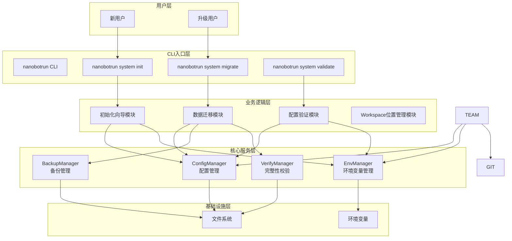

> **P003整改**: CLI命令归属领域明确化。`init`、`migrate`、`validate`命令归属于`system`领域，命令格式为`nanobotrun system init`、`nanobotrun system migrate`、`nanobotrun system validate`。

### 3.2 P001整改：新模块与AppContext集成方案

> **问题**: 架构设计提出了四个新模块和三个新管理器，但未明确说明这些组件如何集成到现有的`AppContext`中。

#### 3.2.1 集成策略

**决策**: EnvManager、BackupManager、VerifyManager **不加入AppContext**

**理由**:
1. **工具类性质**: 这些管理器是工具类，不需要全局单例
2. **按需创建**: 由业务模块按需创建实例，避免不必要的资源占用
3. **依赖注入支持**: 通过构造函数注入依赖，支持测试时Mock
4. **与现有架构一致**: 类似`FitParser`等工具类也未加入AppContext

#### 3.2.2 依赖注入方案

```python
# ✅ 正确做法：通过构造函数注入依赖
class InitWizard:
    def __init__(
        self,
        context: AppContext,
        env_manager: EnvManager | None = None,
    ) -> None:
        self.context = context
        self.env_manager = env_manager or EnvManager()

# ✅ 测试时可以注入Mock
from unittest.mock import Mock

mock_env_manager = Mock()
wizard = InitWizard(context, env_manager=mock_env_manager)
```

#### 3.2.3 AppContext扩展说明

**不扩展AppContext**，保持现有结构不变。新模块通过以下方式获取依赖：

| 模块 | 获取AppContext方式 | 获取工具类方式 |
|------|-------------------|---------------|
| InitWizard | 构造函数注入 | 构造函数注入（可选） |
| MigrationEngine | 构造函数注入 | 内部创建 |
| ConfigValidator | 构造函数注入 | 内部创建 |
| TeamConfigManager | 构造函数注入 | 内部创建 |

### 3.3 P002整改：初始化引导问题解决方案

> **问题**: 在用户首次安装时，`config.json`不存在，`ConfigManager`无法初始化，但初始化向导又需要`AppContext`才能运行。

#### 3.3.1 问题分析

**初始化引导问题（Bootstrap Problem）**：
```
用户首次安装 → config.json不存在 → ConfigManager无法初始化 → AppContext无法创建 → InitWizard无法启动
```

#### 3.3.2 解决方案：无配置模式

**方案**: ConfigManager支持"默认配置"模式

```python
# src/core/config.py - 扩展ConfigManager

class ConfigManager:
    def __init__(self, allow_default: bool = False) -> None:
        """初始化配置管理器
        
        Args:
            allow_default: 是否允许使用默认配置（配置文件不存在时）
        """
        self.allow_default = allow_default
        self.config_file = self._detect_config_file()
        
        if not self.config_file.exists() and not allow_default:
            raise ConfigNotFoundError(f"配置文件不存在: {self.config_file}")
        
        if not self.config_file.exists() and allow_default:
            # 使用默认配置
            self._config = self._get_default_config()
        else:
            # 从文件加载
            self._config = self._load_config()
    
    def _get_default_config(self) -> dict[str, Any]:
        """获取默认配置
        
        Returns:
            dict: 默认配置字典
        """
        return {
            "version": "0.9.4",
            "data_dir": str(Path.cwd() / "nanobot-runner" / "data"),
            "timezone": "Asia/Shanghai",
            "default_year": datetime.now().year,
        }
    
    def _detect_config_file(self) -> Path:
        """检测配置文件路径
        
        优先级：
        1. 环境变量 NANOBOT_CONFIG_FILE
        2. ./nanobot-runner/config.json
        3. ~/.nanobot-runner/config.json（兼容旧版本）
        
        Returns:
            Path: 配置文件路径
        """
        # 环境变量优先
        if env_path := os.getenv("NANOBOT_CONFIG_FILE"):
            return Path(env_path)
        
        # 项目本地配置
        local_path = Path.cwd() / "nanobot-runner" / "config.json"
        if local_path.exists():
            return local_path
        
        # 兼容旧版本
        legacy_path = Path.home() / ".nanobot-runner" / "config.json"
        if legacy_path.exists():
            return legacy_path
        
        # 默认返回项目本地路径（即使不存在）
        return local_path
```

#### 3.3.3 初始化向导启动流程

```python
# src/cli/commands/init.py

@app.command("init")
def init_command(
    force: bool = typer.Option(False, "--force", help="强制覆盖现有配置"),
) -> None:
    """初始化配置向导"""
    
    # 步骤1: 创建"无配置模式"的AppContext
    config = ConfigManager(allow_default=True)
    context = AppContextFactory.create(config=config)
    
    # 步骤2: 运行初始化向导
    wizard = InitWizard(context)
    result = wizard.run(mode=InitMode.FRESH, force=force)
    
    # 步骤3: 保存配置文件
    if result.success:
        config.save_config(result.config_path)
        console.print("[green]✅ 初始化完成！[/green]")
```

#### 3.3.4 数据流图

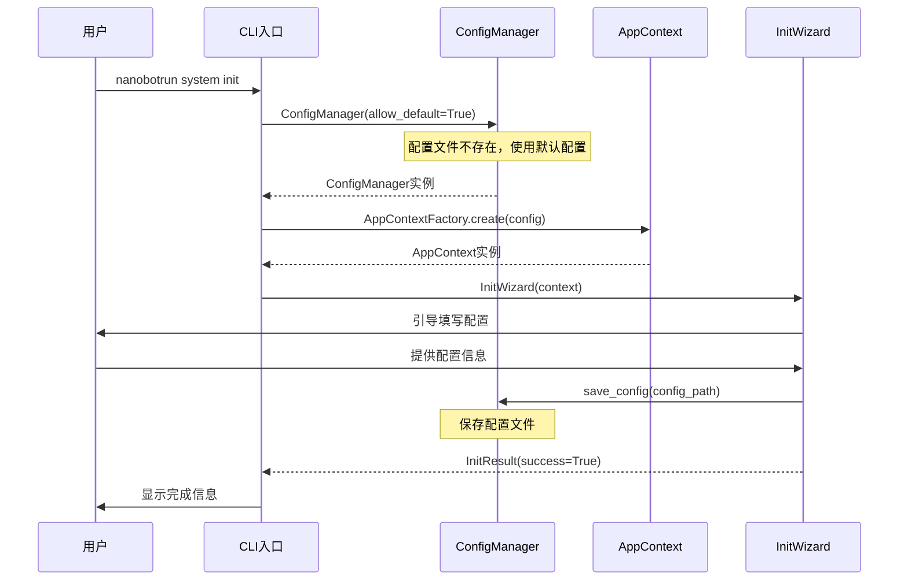

### 3.2 架构分层说明

#### 3.2.1 用户层

**职责**: 识别用户类型,提供差异化的入口体验

| 用户类型 | 主要场景 | 入口命令 |
|---------|---------|---------|
| 新用户 | 首次安装配置 | `nanobotrun system init` |
| 升级用户 | 版本升级迁移 | `nanobotrun system migrate` |

#### 3.2.2 CLI入口层

**职责**: 提供统一的CLI命令入口,参数解析和路由分发

| 命令 | 功能 | 参数 | 归属领域 |
|------|------|------|---------|
| `nanobotrun system init` | 初始化向导 | `--force`, `--skip-optional` | system |
| `nanobotrun system migrate` | 数据迁移 | `--auto`, `--backup-dir`, `--rollback` | system |
| `nanobotrun system validate` | 配置验证 | `--verbose`, `--check`, `--fix` | system |
| `nanobotrun system config` | 配置管理 | `--show`, `--set`, `--reset` | system |

> **P003整改**: 所有新增命令统一归属于`system`领域，与现有`data`、`analysis`、`agent`、`report`领域并列。

#### 3.2.3 业务逻辑层

**职责**: 实现核心业务逻辑,协调核心服务层组件

**核心模块**:

| 模块名称 | 职责 | 核心类 |
|---------|------|--------|
| **初始化向导模块** | 引导用户完成首次配置 | `InitWizard`, `ConfigGenerator` |
| **数据迁移模块** | 迁移旧版本配置和数据 | `MigrationEngine`, `MigrationStrategy` |
| **配置验证模块** | 验证配置完整性和正确性 | `ConfigValidator`, `ValidationReport` |
| **Workspace位置管理模块** | 管理workspace位置确定规则 | `WorkspaceManager`, `PathResolver` |

#### 3.2.4 核心服务层

**职责**: 提供可复用的核心服务,支持业务逻辑层

| 服务名称 | 职责 | 核心方法 |
|---------|------|---------|
| **ConfigManager** | 配置文件管理 | `load_config()`, `save_config()`, `validate_config()` |
| **EnvManager** | 环境变量管理 | `load_env()`, `get_env()`, `set_env()` |
| **BackupManager** | 备份和恢复管理 | `create_backup()`, `restore_backup()`, `verify_backup()` |
| **VerifyManager** | 数据完整性校验 | `verify_files()`, `verify_config()`, `generate_report()` |

##### P005整改：验证组件职责边界明确化

> **问题**: 文档中存在三个验证相关的组件：`ConfigManager.validate_config()`、`ConfigValidator`、`VerifyManager`，职责边界不清晰。

**职责划分**:

| 组件 | 职责 | 使用场景 | 返回值 |
|------|------|---------|--------|
| **ConfigManager.validate_config()** | 配置文件格式验证 | 加载配置时自动验证 | `bool` |
| **ConfigValidator** | 配置完整性和有效性验证 | 初始化/迁移后验证 | `ValidationReport` |
| **VerifyManager** | 数据文件完整性校验 | 迁移/备份后校验 | `VerificationReport` |

**详细说明**:

1. **ConfigManager.validate_config()**
   - **职责**: 验证配置文件格式是否符合Schema
   - **触发时机**: `load_config()`时自动调用
   - **验证内容**: JSON格式、必填字段、字段类型
   - **返回值**: `bool`（True=验证通过，False=验证失败）
   - **异常处理**: 验证失败抛出`ConfigValidationError`

2. **ConfigValidator**
   - **职责**: 验证配置的完整性和有效性
   - **触发时机**: 初始化向导完成后、迁移完成后
   - **验证内容**: 
     - 完整性：必填配置项是否填写
     - 有效性：API Key格式、路径是否存在、权限是否正确
     - 一致性：配置项之间是否存在冲突
   - **返回值**: `ValidationReport`（包含错误列表、警告列表、建议列表）
   - **使用方式**: 通过CLI命令`nanobotrun system validate`手动触发

3. **VerifyManager**
   - **职责**: 校验数据文件的完整性
   - **触发时机**: 迁移完成后、备份恢复后
   - **验证内容**:
     - 文件完整性：文件数量、文件大小、校验码
     - 数据完整性：Parquet文件可读性、Schema一致性
   - **返回值**: `VerificationReport`（包含校验结果、错误详情）
   - **使用方式**: 迁移引擎内部自动调用

**依赖关系**:

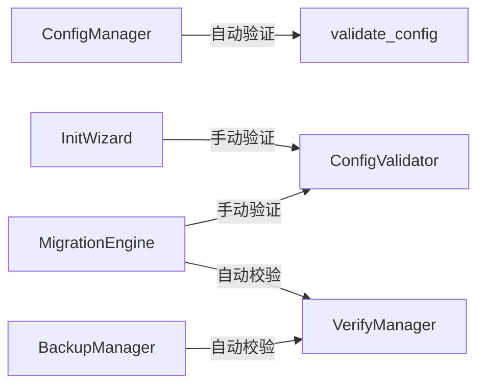

**代码示例**:

```python
# ConfigManager.validate_config() - 格式验证
class ConfigManager:
    def validate_config(self, config: dict) -> bool:
        """验证配置文件格式"""
        try:
            AppConfig(**config)  # Pydantic自动验证
            return True
        except ValidationError as e:
            raise ConfigValidationError(f"配置格式错误: {e}")

# ConfigValidator - 完整性和有效性验证
class ConfigValidator:
    def validate(self) -> ValidationReport:
        """验证配置完整性和有效性"""
        errors = []
        warnings = []
        suggestions = []
        
        # 完整性验证
        if not self.config.get("api_key"):
            errors.append("缺少API Key配置")
        
        # 有效性验证
        if not Path(self.config["data_dir"]).exists():
            errors.append(f"数据目录不存在: {self.config['data_dir']}")
        
        # 一致性验证
        # ...
        
        return ValidationReport(errors=errors, warnings=warnings, suggestions=suggestions)

# VerifyManager - 数据文件完整性校验
class VerifyManager:
    def verify_files(self, files: list[Path]) -> VerificationReport:
        """校验文件完整性"""
        errors = []
        
        for file in files:
            if not file.exists():
                errors.append(f"文件不存在: {file}")
            elif file.stat().st_size == 0:
                errors.append(f"文件为空: {file}")
        
        return VerificationReport(success=len(errors) == 0, errors=errors)
```

#### 3.2.5 基础设施层

**职责**: 提供底层基础设施支持

| 基础设施 | 职责 | 技术实现 |
|---------|------|---------|
| **文件系统** | 文件和目录操作 | `pathlib`, `shutil` |
| **环境变量** | 环境变量读写 | `os.environ`, `python-dotenv` |

---

## 4. 智能跑步计划架构设计（v0.10.0-v0.12.0）

### 4.1 架构概述

智能跑步计划系统是Nanobot Runner的核心功能之一，旨在通过数据驱动的方式为用户提供个性化的训练计划。该系统覆盖从计划生成、执行跟踪、智能调整到目标预测的完整闭环。

**核心特性**:
- 基于用户目标和当前能力生成个性化训练计划
- 实时收集训练执行反馈，跟踪完成度
- LLM驱动的智能计划调整
- 目标达成预测和长期周期规划
- 上下文感知的智能训练建议

### 4.2 系统架构图

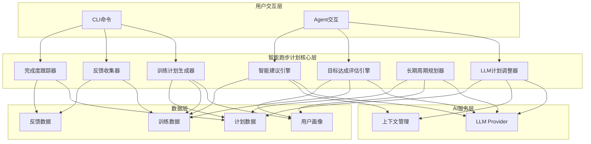

### 4.3 核心模块设计

#### 4.3.1 训练计划生成器 (TrainingPlanGenerator)

**职责**: 基于用户目标和当前能力生成个性化训练计划

**核心类设计**:

```python
# src/core/training/plan_generator.py

class TrainingPlanGenerator:
    """训练计划生成器
    
    基于用户目标、当前能力、历史数据生成个性化训练计划。
    """
    
    def __init__(self, context: AppContext) -> None:
        """初始化训练计划生成器
        
        Args:
            context: 应用上下文
        """
        self.context = context
        self.session_repo = context.session_repository
        self.user_profile = context.user_profile
    
    def generate_plan(
        self,
        goal: TrainingGoal,
        duration_weeks: int = 12,
        start_date: date | None = None,
    ) -> TrainingPlan:
        """生成训练计划
        
        Args:
            goal: 训练目标（全马/半马/10K/5K）
            duration_weeks: 计划周期（周）
            start_date: 开始日期
            
        Returns:
            TrainingPlan: 训练计划
        """
        pass
    
    def _assess_current_ability(self) -> AbilityLevel:
        """评估当前能力水平
        
        Returns:
            AbilityLevel: 能力水平
        """
        pass
    
    def _calculate_weekly_volume(self, goal: TrainingGoal) -> float:
        """计算周训练量
        
        Args:
            goal: 训练目标
            
        Returns:
            float: 周训练量（公里）
        """
        pass
    
    def _generate_weekly_schedule(
        self,
        week_num: int,
        weekly_volume: float,
        goal: TrainingGoal,
    ) -> WeeklySchedule:
        """生成周训练安排
        
        Args:
            week_num: 周数
            weekly_volume: 周训练量
            goal: 训练目标
            
        Returns:
            WeeklySchedule: 周训练安排
        """
        pass
```

**数据结构**:

```python
# src/core/training/models.py

@dataclass
class TrainingGoal:
    """训练目标"""
    race_type: RaceType  # FULL_MARATHON, HALF_MARATHON, 10K, 5K
    target_time: timedelta  # 目标成绩
    race_date: date  # 比赛日期

@dataclass
class TrainingPlan:
    """训练计划"""
    plan_id: str
    goal: TrainingGoal
    start_date: date
    end_date: date
    weekly_schedules: list[WeeklySchedule]
    created_at: datetime
    updated_at: datetime

@dataclass
class WeeklySchedule:
    """周训练安排"""
    week_num: int
    total_volume: float  # 总训练量（公里）
    workouts: list[Workout]
    rest_days: list[date]

@dataclass
class Workout:
    """训练课"""
    date: date
    workout_type: WorkoutType  # EASY, INTERVAL, LONG, TEMPO, RECOVERY
    distance: float  # 距离（公里）
    duration: timedelta  # 时长
    target_pace: str  # 目标配速
    target_hr_zone: str  # 目标心率区间
```

#### 4.3.2 训练执行反馈收集器 (TrainingFeedbackCollector)

**职责**: 收集训练执行反馈，记录实际完成情况

**核心类设计**:

```python
# src/core/training/feedback_collector.py

class TrainingFeedbackCollector:
    """训练执行反馈收集器
    
    收集训练执行反馈，记录实际完成情况。
    """
    
    def __init__(self, context: AppContext) -> None:
        """初始化反馈收集器
        
        Args:
            context: 应用上下文
        """
        self.context = context
        self.session_repo = context.session_repository
    
    def collect_feedback(
        self,
        plan_id: str,
        workout_date: date,
        actual_data: WorkoutActual,
    ) -> FeedbackRecord:
        """收集训练反馈
        
        Args:
            plan_id: 训练计划ID
            workout_date: 训练日期
            actual_data: 实际完成数据
            
        Returns:
            FeedbackRecord: 反馈记录
        """
        pass
    
    def _compare_with_plan(
        self,
        planned: Workout,
        actual: WorkoutActual,
    ) -> ComparisonResult:
        """对比计划与实际
        
        Args:
            planned: 计划训练
            actual: 实际完成
            
        Returns:
            ComparisonResult: 对比结果
        """
        pass
```

**数据结构**:

```python
@dataclass
class WorkoutActual:
    """实际训练数据"""
    distance: float
    duration: timedelta
    avg_pace: str
    avg_hr: float
    feeling: FeelingLevel  # VERY_GOOD, GOOD, NORMAL, BAD, VERY_BAD
    notes: str

@dataclass
class FeedbackRecord:
    """反馈记录"""
    record_id: str
    plan_id: str
    workout_date: date
    planned: Workout
    actual: WorkoutActual
    comparison: ComparisonResult
    created_at: datetime

@dataclass
class ComparisonResult:
    """对比结果"""
    distance_diff: float  # 距离差异
    duration_diff: timedelta  # 时长差异
    pace_diff: str  # 配速差异
    completion_rate: float  # 完成率
```

#### 4.3.3 计划完成度跟踪器 (PlanCompletionTracker)

**职责**: 跟踪训练计划完成度，生成完成度报告

**核心类设计**:

```python
# src/core/training/completion_tracker.py

class PlanCompletionTracker:
    """计划完成度跟踪器
    
    跟踪训练计划完成度，生成完成度报告。
    """
    
    def __init__(self, context: AppContext) -> None:
        """初始化完成度跟踪器
        
        Args:
            context: 应用上下文
        """
        self.context = context
    
    def track_completion(
        self,
        plan_id: str,
        end_date: date | None = None,
    ) -> CompletionReport:
        """跟踪完成度
        
        Args:
            plan_id: 训练计划ID
            end_date: 截止日期（默认为今天）
            
        Returns:
            CompletionReport: 完成度报告
        """
        pass
    
    def _calculate_completion_rate(
        self,
        planned_workouts: list[Workout],
        feedback_records: list[FeedbackRecord],
    ) -> float:
        """计算完成率
        
        Args:
            planned_workouts: 计划训练列表
            feedback_records: 反馈记录列表
            
        Returns:
            float: 完成率（0-1）
        """
        pass
    
    def _analyze_response_pattern(
        self,
        feedback_records: list[FeedbackRecord],
    ) -> ResponsePattern:
        """分析响应模式
        
        Args:
            feedback_records: 反馈记录列表
            
        Returns:
            ResponsePattern: 响应模式分析结果
        """
        pass
```

**数据结构**:

```python
@dataclass
class CompletionReport:
    """完成度报告"""
    plan_id: str
    total_workouts: int
    completed_workouts: int
    completion_rate: float
    total_planned_volume: float
    total_actual_volume: float
    volume_completion_rate: float
    response_pattern: ResponsePattern
    generated_at: datetime

@dataclass
class ResponsePattern:
    """响应模式"""
    avg_completion_rate: float
    avg_pace_diff: str
    avg_hr_diff: float
    feeling_distribution: dict[FeelingLevel, int]
    trend: TrendDirection  # IMPROVING, STABLE, DECLINING
```

#### 4.3.4 LLM驱动计划调整器 (LLMPlanAdjuster)

**职责**: 基于LLM和训练反馈智能调整训练计划

**核心类设计**:

```python
# src/core/training/plan_adjuster.py

class LLMPlanAdjuster:
    """LLM驱动计划调整器
    
    基于LLM和训练反馈智能调整训练计划。
    """
    
    def __init__(self, context: AppContext) -> None:
        """初始化计划调整器
        
        Args:
            context: 应用上下文
        """
        self.context = context
        self.llm_provider = context.llm_provider
    
    def adjust_plan(
        self,
        plan: TrainingPlan,
        feedback_records: list[FeedbackRecord],
        adjustment_request: str | None = None,
    ) -> TrainingPlan:
        """调整训练计划
        
        Args:
            plan: 当前训练计划
            feedback_records: 反馈记录列表
            adjustment_request: 调整请求（自然语言）
            
        Returns:
            TrainingPlan: 调整后的训练计划
        """
        pass
    
    def _build_context(
        self,
        plan: TrainingPlan,
        feedback_records: list[FeedbackRecord],
    ) -> dict[str, Any]:
        """构建LLM上下文
        
        Args:
            plan: 训练计划
            feedback_records: 反馈记录
            
        Returns:
            dict: 上下文信息
        """
        pass
    
    def _call_llm(
        self,
        context: dict[str, Any],
        adjustment_request: str | None,
    ) -> AdjustmentSuggestion:
        """调用LLM获取调整建议
        
        Args:
            context: 上下文信息
            adjustment_request: 调整请求
            
        Returns:
            AdjustmentSuggestion: 调整建议
        """
        pass
    
    def _apply_adjustment(
        self,
        plan: TrainingPlan,
        suggestion: AdjustmentSuggestion,
    ) -> TrainingPlan:
        """应用调整建议
        
        Args:
            plan: 当前计划
            suggestion: 调整建议
            
        Returns:
            TrainingPlan: 调整后的计划
        """
        pass
```

**数据结构**:

```python
@dataclass
class AdjustmentSuggestion:
    """调整建议"""
    volume_adjustment: float  # 训练量调整比例
    intensity_adjustment: float  # 强度调整比例
    rest_day_adjustment: int  # 休息日调整（天数）
    workout_type_changes: list[WorkoutTypeChange]
    reasoning: str  # 调整理由
    confidence: float  # 置信度

@dataclass
class WorkoutTypeChange:
    """训练类型变更"""
    date: date
    original_type: WorkoutType
    suggested_type: WorkoutType
    reason: str
```

#### 4.3.5 目标达成评估引擎 (GoalPredictionEngine)

**职责**: 评估目标达成可能性，预测目标达成时间

**核心类设计**:

```python
# src/core/training/goal_predictor.py

class GoalPredictionEngine:
    """目标达成评估引擎
    
    评估目标达成可能性，预测目标达成时间。
    """
    
    def __init__(self, context: AppContext) -> None:
        """初始化目标预测引擎
        
        Args:
            context: 应用上下文
        """
        self.context = context
        self.llm_provider = context.llm_provider
    
    def predict_goal_achievement(
        self,
        goal: TrainingGoal,
        training_data: list[SessionSummary],
        plan: TrainingPlan | None = None,
    ) -> GoalPrediction:
        """预测目标达成情况
        
        Args:
            goal: 训练目标
            training_data: 训练数据
            plan: 训练计划（可选）
            
        Returns:
            GoalPrediction: 目标预测结果
        """
        pass
    
    def _analyze_progress(
        self,
        goal: TrainingGoal,
        training_data: list[SessionSummary],
    ) -> ProgressAnalysis:
        """分析进度
        
        Args:
            goal: 训练目标
            training_data: 训练数据
            
        Returns:
            ProgressAnalysis: 进度分析结果
        """
        pass
    
    def _predict_vdot_trend(
        self,
        training_data: list[SessionSummary],
    ) -> VdotTrend:
        """预测VDOT趋势
        
        Args:
            training_data: 训练数据
            
        Returns:
            VdotTrend: VDOT趋势预测
        """
        pass
```

**数据结构**:

```python
@dataclass
class GoalPrediction:
    """目标预测结果"""
    goal: TrainingGoal
    achievement_probability: float  # 达成概率（0-1）
    predicted_achievement_date: date  # 预测达成日期
    current_progress: float  # 当前进度（0-1）
    required_improvement: float  # 所需提升
    recommendations: list[str]  # 建议
    confidence: float  # 置信度

@dataclass
class ProgressAnalysis:
    """进度分析"""
    current_vdot: float
    required_vdot: float
    vdot_gap: float
    improvement_rate: float  # 提升速率
    time_remaining: timedelta

@dataclass
class VdotTrend:
    """VDOT趋势"""
    current_vdot: float
    predicted_vdot_4weeks: float
    predicted_vdot_8weeks: float
    trend_direction: TrendDirection
    confidence: float
```

#### 4.3.6 长期周期规划器 (LongTermPlanGenerator)

**职责**: 生成长期周期化训练规划

**核心类设计**:

```python
# src/core/training/long_term_planner.py

class LongTermPlanGenerator:
    """长期周期规划器
    
    生成长期周期化训练规划。
    """
    
    def __init__(self, context: AppContext) -> None:
        """初始化长期规划器
        
        Args:
            context: 应用上下文
        """
        self.context = context
        self.llm_provider = context.llm_provider
    
    def generate_long_term_plan(
        self,
        goals: list[TrainingGoal],
        duration_months: int = 12,
    ) -> LongTermPlan:
        """生成长期规划
        
        Args:
            goals: 训练目标列表（按时间顺序）
            duration_months: 规划周期（月）
            
        Returns:
            LongTermPlan: 长期规划
        """
        pass
    
    def _create_periodization(
        self,
        goals: list[TrainingGoal],
        duration_months: int,
    ) -> Periodization:
        """创建周期化规划
        
        Args:
            goals: 训练目标列表
            duration_months: 规划周期
            
        Returns:
            Periodization: 周期化规划
        """
        pass
    
    def _allocate_phases(
        self,
        periodization: Periodization,
    ) -> list[TrainingPhase]:
        """分配训练阶段
        
        Args:
            periodization: 周期化规划
            
        Returns:
            list[TrainingPhase]: 训练阶段列表
        """
        pass
```

**数据结构**:

```python
@dataclass
class LongTermPlan:
    """长期规划"""
    plan_id: str
    goals: list[TrainingGoal]
    duration_months: int
    periodization: Periodization
    phases: list[TrainingPhase]
    created_at: datetime

@dataclass
class Periodization:
    """周期化规划"""
    macro_cycles: list[MacroCycle]
    total_weeks: int

@dataclass
class MacroCycle:
    """大周期"""
    cycle_num: int
    start_date: date
    end_date: date
    phases: list[TrainingPhase]
    peak_goal: TrainingGoal

@dataclass
class TrainingPhase:
    """训练阶段"""
    phase_type: PhaseType  # BASE, BUILD, PEAK, RECOVERY
    start_date: date
    end_date: date
    focus: str  # 训练重点
    weekly_volume_range: tuple[float, float]
    intensity_distribution: dict[str, float]
```

#### 4.3.7 智能训练建议引擎 (SmartAdviceEngine)

**职责**: 基于上下文生成智能训练建议

**核心类设计**:

```python
# src/core/training/advice_engine.py

class SmartAdviceEngine:
    """智能训练建议引擎
    
    基于上下文生成智能训练建议。
    """
    
    def __init__(self, context: AppContext) -> None:
        """初始化建议引擎
        
        Args:
            context: 应用上下文
        """
        self.context = context
        self.llm_provider = context.llm_provider
    
    def generate_advice(
        self,
        context_data: AdviceContext,
    ) -> TrainingAdvice:
        """生成训练建议
        
        Args:
            context_data: 建议上下文
            
        Returns:
            TrainingAdvice: 训练建议
        """
        pass
    
    def _build_context(
        self,
        user_query: str | None = None,
    ) -> AdviceContext:
        """构建建议上下文
        
        Args:
            user_query: 用户查询（可选）
            
        Returns:
            AdviceContext: 建议上下文
        """
        pass
    
    def _call_llm(
        self,
        context: AdviceContext,
    ) -> AdviceResponse:
        """调用LLM生成建议
        
        Args:
            context: 建议上下文
            
        Returns:
            AdviceResponse: LLM响应
        """
        pass
```

**数据结构**:

```python
@dataclass
class AdviceContext:
    """建议上下文"""
    recent_training: list[SessionSummary]
    current_plan: TrainingPlan | None
    goal: TrainingGoal | None
    user_profile: UserProfile
    training_load: TrainingLoadMetrics
    user_query: str | None

@dataclass
class TrainingAdvice:
    """训练建议"""
    advice_type: AdviceType  # WORKOUT, RECOVERY, NUTRITION, EQUIPMENT
    title: str
    content: str
    priority: Priority  # HIGH, MEDIUM, LOW
    actionable_steps: list[str]
    reasoning: str
    confidence: float

@dataclass
class AdviceResponse:
    """LLM响应"""
    advice_list: list[TrainingAdvice]
    context_summary: str
    generated_at: datetime
```

### 4.4 数据流设计

#### 4.4.1 训练计划生成流程

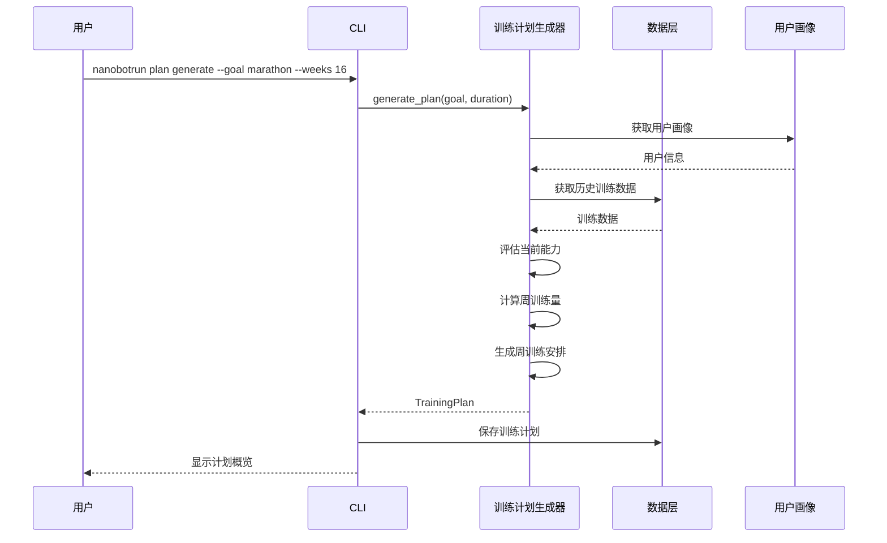

#### 4.4.2 训练反馈收集流程

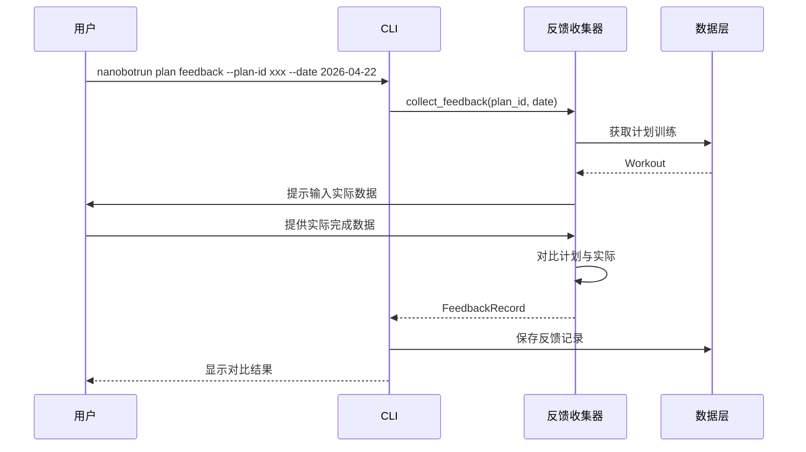

#### 4.4.3 智能计划调整流程

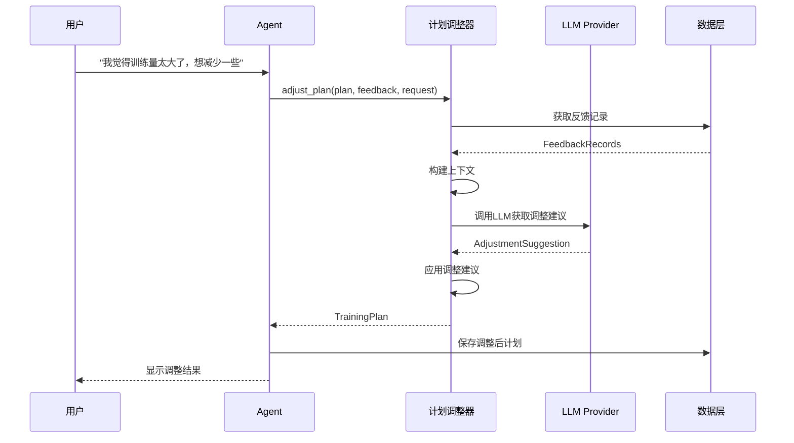

### 4.5 性能指标

| 指标 | 要求 | 版本 | 验证方法 |
|------|------|------|---------|
| 训练计划生成时间 | < 5秒 | v0.10.0 | 性能测试 |
| 反馈收集响应时间 | < 1秒 | v0.10.0 | 性能测试 |
| 完成度计算时间 | < 500ms | v0.10.0 | 性能测试 |
| LLM计划调整时间 | < 10秒 | v0.11.0 | 性能测试 |
| 目标达成预测时间 | < 3秒 | v0.12.0 | 性能测试 |
| 智能建议生成时间 | < 5秒 | v0.12.0 | 性能测试 |

### 4.6 Agent工具集成

智能跑步计划系统通过Agent工具对外提供服务，用户可以通过自然语言交互使用这些功能。

#### 4.6.1 Agent工具列表

| 工具名称 | 功能 | 版本 | CLI命令 |
|---------|------|------|---------|
| `generate_training_plan` | 生成训练计划 | v0.10.0 | `nanobotrun plan generate` |
| `record_training_feedback` | 记录训练反馈 | v0.10.0 | `nanobotrun plan feedback` |
| `track_plan_completion` | 跟踪计划完成度 | v0.10.0 | `nanobotrun plan track` |
| `adjust_training_plan` | 调整训练计划 | v0.11.0 | `nanobotrun plan adjust` |
| `predict_goal_achievement` | 预测目标达成 | v0.12.0 | `nanobotrun plan predict` |
| `generate_long_term_plan` | 生成长期规划 | v0.12.0 | `nanobotrun plan long-term` |
| `get_training_advice` | 获取训练建议 | v0.12.0 | `nanobotrun plan advice` |

#### 4.6.2 Agent工具示例

```python
# src/agents/tools/training_plan_tools.py

from nanobot_ai import tool

@tool
def generate_training_plan(
    goal: str,
    duration_weeks: int = 12,
    start_date: str | None = None,
) -> dict:
    """生成个性化训练计划
    
    Args:
        goal: 训练目标（marathon/half_marathon/10k/5k）
        duration_weeks: 计划周期（周）
        start_date: 开始日期（YYYY-MM-DD）
        
    Returns:
        dict: 训练计划信息
    """
    # 实现逻辑
    pass

@tool
def adjust_training_plan(
    plan_id: str,
    adjustment_request: str,
) -> dict:
    """智能调整训练计划
    
    Args:
        plan_id: 训练计划ID
        adjustment_request: 调整请求（自然语言）
        
    Returns:
        dict: 调整后的计划信息
    """
    # 实现逻辑
    pass
```

---

## 5. 模块详细设计

### 4.1 初始化向导模块 (src/core/init/)

#### 4.1.1 模块职责

提供智能化的初始化向导,引导用户快速完成首次配置,支持多种初始化场景。

#### 4.1.2 核心类设计

```python
# src/core/init/wizard.py

class InitWizard:
    """初始化向导
    
    引导用户完成首次配置,支持多种初始化场景。
    """
    
    def __init__(self, context: AppContext) -> None:
        """初始化向导
        
        Args:
            context: 应用上下文
        """
        self.context = context
        self.env_manager = EnvManager()
        self.config_generator = ConfigGenerator()
    
    def run(self, mode: InitMode = InitMode.FRESH) -> InitResult:
        """运行初始化向导
        
        Args:
            mode: 初始化模式(FRESH/MIGRATE)
            
        Returns:
            InitResult: 初始化结果
        """
        pass
    
    def detect_environment(self) -> EnvironmentInfo:
        """检测运行环境
        
        Returns:
            EnvironmentInfo: 环境信息(Python版本、依赖包、操作系统等)
        """
        pass
    
    def create_directories(self) -> None:
        """创建必要的目录结构"""
        pass
    
    def guide_config(self) -> dict[str, Any]:
        """引导用户填写配置
        
        Returns:
            dict: 用户配置
        """
        pass
    
    def validate_config(self, config: dict) -> ValidationResult:
        """验证配置
        
        Args:
            config: 配置字典
            
        Returns:
            ValidationResult: 验证结果
        """
        pass
    
    def generate_config_files(self, config: dict) -> None:
        """生成配置文件
        
        Args:
            config: 配置字典
        """
        pass
```

```python
# src/core/init/generator.py

class ConfigGenerator:
    """配置文件生成器
    
    根据用户输入生成配置文件。
    """
    
    def generate_config_json(self, config: dict) -> str:
        """生成config.json文件内容
        
        Args:
            config: 配置字典
            
        Returns:
            str: JSON格式的配置文件内容
        """
        pass
    
    def generate_env_local(self, env_vars: dict[str, str]) -> str:
        """生成.env.local文件内容
        
        Args:
            env_vars: 环境变量字典
            
        Returns:
            str: .env.local文件内容
        """
        pass
    
    def generate_agents_md(self) -> str:
        """生成AGENTS.md文件内容
        
        Returns:
            str: AGENTS.md文件内容
        """
        pass
```

#### 4.1.3 数据结构设计

```python
# src/core/init/models.py

from dataclasses import dataclass
from enum import Enum

class InitMode(Enum):
    """初始化模式"""
    FRESH = "fresh"        # 首次安装
    MIGRATE = "migrate"    # 升级迁移

@dataclass
class EnvironmentInfo:
    """环境信息"""
    python_version: str
    os_type: str
    os_version: str
    dependencies: dict[str, str]
    missing_dependencies: list[str]

@dataclass
class InitResult:
    """初始化结果"""
    success: bool
    config_path: Path | None
    env_path: Path | None
    errors: list[str]
    warnings: list[str]
    next_steps: list[str]

@dataclass
class ValidationResult:
    """验证结果"""
    is_valid: bool
    errors: list[str]
    warnings: list[str]
    suggestions: list[str]
```

### 4.2 数据迁移模块 (src/core/migrate/)

#### 4.2.1 模块职责

提供安全可靠的数据迁移方案,支持从任意历史版本自动迁移到v0.9.4,确保数据完整性。

#### 4.2.2 核心类设计

```python
# src/core/migrate/engine.py

class MigrationEngine:
    """迁移引擎
    
    执行配置和数据迁移,支持多版本迁移策略。
    """
    
    def __init__(self, context: AppContext) -> None:
        """初始化迁移引擎
        
        Args:
            context: 应用上下文
        """
        self.context = context
        self.backup_manager = BackupManager()
        self.verify_manager = VerifyManager()
        self.strategy_factory = MigrationStrategyFactory()
    
    def detect_old_version(self) -> VersionInfo | None:
        """检测旧版本信息
        
        Returns:
            VersionInfo: 旧版本信息,如果不存在则返回None
        """
        pass
    
    def create_backup(self) -> BackupInfo:
        """创建备份
        
        Returns:
            BackupInfo: 备份信息
        """
        pass
    
    def migrate(self, strategy: MigrationStrategy) -> MigrationResult:
        """执行迁移
        
        Args:
            strategy: 迁移策略
            
        Returns:
            MigrationResult: 迁移结果
        """
        pass
    
    def rollback(self, backup_info: BackupInfo) -> RollbackResult:
        """回滚迁移
        
        Args:
            backup_info: 备份信息
            
        Returns:
            RollbackResult: 回滚结果
        """
        pass
    
    def verify_migration(self) -> VerificationResult:
        """验证迁移结果
        
        Returns:
            VerificationResult: 验证结果
        """
        pass
```

```python
# src/core/migrate/strategy.py

class MigrationStrategy(ABC):
    """迁移策略抽象基类"""
    
    @abstractmethod
    def get_source_path(self) -> Path:
        """获取源路径"""
        pass
    
    @abstractmethod
    def get_target_path(self) -> Path:
        """获取目标路径"""
        pass
    
    @abstractmethod
    def migrate_config(self) -> None:
        """迁移配置文件"""
        pass
    
    @abstractmethod
    def migrate_data(self) -> None:
        """迁移数据目录"""
        pass
    
    @abstractmethod
    def update_paths(self) -> None:
        """更新路径引用"""
        pass

class V08xMigrationStrategy(MigrationStrategy):
    """v0.8.x版本迁移策略"""
    pass

class V09xMigrationStrategy(MigrationStrategy):
    """v0.9.x版本迁移策略"""
    pass
```

#### 4.2.3 数据结构设计

```python
# src/core/migrate/models.py

from dataclasses import dataclass

@dataclass
class VersionInfo:
    """版本信息"""
    version: str
    config_path: Path
    data_path: Path
    has_data: bool

@dataclass
class BackupInfo:
    """备份信息"""
    backup_path: Path
    backup_time: str
    file_count: int
    total_size: int
    checksum: str

@dataclass
class MigrationResult:
    """迁移结果"""
    success: bool
    migrated_files: int
    failed_files: int
    elapsed_time: float
    errors: list[str]
    warnings: list[str]
    report_path: Path | None

@dataclass
class RollbackResult:
    """回滚结果"""
    success: bool
    restored_files: int
    elapsed_time: float
    errors: list[str]
```

### 4.3 配置验证模块 (src/core/validate/)

#### 4.3.1 模块职责

提供独立的配置验证工具,帮助用户在配置阶段就发现并解决问题,避免运行时出错。

#### 4.3.2 核心类设计

```python
# src/core/validate/validator.py

class ConfigValidator:
    """配置验证器
    
    验证配置文件的完整性、正确性和有效性。
    """
    
    def __init__(self, context: AppContext) -> None:
        """初始化配置验证器
        
        Args:
            context: 应用上下文
        """
        self.context = context
        self.env_manager = EnvManager()
    
    def validate_all(self) -> ValidationReport:
        """执行全部验证
        
        Returns:
            ValidationReport: 验证报告
        """
        pass
    
    def validate_format(self) -> list[ValidationError]:
        """验证配置文件格式
        
        Returns:
            list[ValidationError]: 格式错误列表
        """
        pass
    
    def validate_completeness(self) -> list[ValidationError]:
        """验证配置完整性
        
        Returns:
            list[ValidationError]: 完整性错误列表
        """
        pass
    
    def validate_validity(self) -> list[ValidationError]:
        """验证配置有效性
        
        Returns:
            list[ValidationError]: 有效性错误列表
        """
        pass
    
    def validate_consistency(self) -> list[ValidationError]:
        """验证配置一致性
        
        Returns:
            list[ValidationError]: 一致性错误列表
        """
        pass
    
    def test_api_connectivity(self) -> ConnectivityResult:
        """测试API连通性
        
        Returns:
            ConnectivityResult: 连通性测试结果
        """
        pass
```

#### 4.3.3 数据结构设计

```python
# src/core/validate/models.py

from dataclasses import dataclass
from enum import Enum

class ErrorLevel(Enum):
    """错误级别"""
    ERROR = "error"      # 必须修复
    WARNING = "warning"  # 建议修复
    INFO = "info"        # 信息提示

@dataclass
class ValidationError:
    """验证错误"""
    level: ErrorLevel
    field: str
    message: str
    suggestion: str
    doc_link: str | None

@dataclass
class ValidationReport:
    """验证报告"""
    is_valid: bool
    errors: list[ValidationError]
    warnings: list[ValidationError]
    infos: list[ValidationError]
    summary: dict[str, int]
    elapsed_time: float

@dataclass
class ConnectivityResult:
    """连通性测试结果"""
    provider: str
    is_connected: bool
    response_time: float
    error_message: str | None
```

### 4.4 Workspace位置管理模块 (src/core/workspace/)

#### 4.4.1 模块职责

管理workspace创建位置的确定规则,支持环境变量、配置文件和默认值三种配置方式,确保跨平台兼容性。

#### 4.4.2 核心类设计

```python
# src/core/workspace/manager.py

class WorkspaceManager:
    """Workspace位置管理器
    
    管理workspace目录的创建和路径解析。
    """
    
    def __init__(self, config: ConfigManager) -> None:
        """初始化Workspace管理器
        
        Args:
            config: 配置管理器
        """
        self.config = config
    
    def resolve_workspace_path(self) -> Path:
        """解析workspace路径
        
        优先级：环境变量 > 配置文件 > 默认值
        
        Returns:
            Path: workspace目录路径
        """
        # 1. 环境变量优先
        if env_path := os.getenv("NANOBOT_WORKSPACE_DIR"):
            return Path(env_path).expanduser().resolve()
        
        # 2. 配置文件
        config_path = self.config.get("workspace_dir")
        if config_path:
            return Path(config_path).expanduser().resolve()
        
        # 3. 默认值
        return Path.home() / ".nanobot-runner"
    
    def create_workspace(self, path: Path | None = None) -> Path:
        """创建workspace目录
        
        Args:
            path: 指定路径,如果为None则使用解析的路径
            
        Returns:
            Path: 创建的workspace路径
        """
        workspace_path = path or self.resolve_workspace_path()
        workspace_path.mkdir(parents=True, exist_ok=True)
        
        # 创建子目录
        for subdir in ["data", "memory", "sessions", "skills"]:
            (workspace_path / subdir).mkdir(exist_ok=True)
        
        return workspace_path
    
    def validate_path(self, path: Path) -> ValidationResult:
        """验证路径是否有效
        
        Args:
            path: 待验证的路径
            
        Returns:
            ValidationResult: 验证结果
        """
        errors: list[str] = []
        warnings: list[str] = []
        
        # 检查路径是否存在
        if path.exists() and not path.is_dir():
            errors.append(f"路径已存在且不是目录: {path}")
        
        # 检查权限
        if not os.access(path.parent, os.W_OK):
            errors.append(f"无权限创建目录: {path}")
        
        # 检查磁盘空间
        disk_usage = shutil.disk_usage(path.parent)
        if disk_usage.free < 1024 * 1024 * 1024:  # 1GB
            warnings.append(f"磁盘空间不足: {disk_usage.free / 1024 / 1024 / 1024:.1f}GB")
        
        return ValidationResult(
            is_valid=len(errors) == 0,
            errors=errors,
            warnings=warnings,
        )
```

#### 4.4.3 数据结构设计

```python
# src/core/workspace/models.py

from dataclasses import dataclass
from pathlib import Path

@dataclass
class WorkspaceInfo:
    """Workspace信息"""
    path: Path
    source: str  # "env" | "config" | "default"
    exists: bool
    subdirectories: list[str]
    disk_usage_mb: float

@dataclass
class WorkspaceValidationResult:
    """Workspace验证结果"""
    is_valid: bool
    errors: list[str]
    warnings: list[str]
    suggestions: list[str]
```

#### 4.4.4 配置优先级设计

**配置优先级**: 环境变量 > 配置文件 > 默认值

**配置项说明**:

| 配置方式 | 配置项 | 数据类型 | 示例 |
|---------|--------|---------|------|
| 环境变量 | `NANOBOT_WORKSPACE_DIR` | string | `/Users/user/nanobot-runner` |
| 配置文件 | `workspace_dir` | string | `~/.nanobot-runner` |
| 默认值 | - | string | `~/.nanobot-runner` |

**跨平台路径实现**:

| 操作系统 | 默认路径 | 路径格式 |
|---------|---------|---------|
| Windows | `C:\Users\<username>\.nanobot-runner` | `%USERPROFILE%\.nanobot-runner` |
| macOS | `/Users/<username>/.nanobot-runner` | `$HOME/.nanobot-runner` |
| Linux | `/home/<username>/.nanobot-runner` | `$HOME/.nanobot-runner` |

**实现示例**:

```python
import os
from pathlib import Path

def get_workspace_dir() -> Path:
    """获取workspace目录路径
    
    优先级：环境变量 > 配置文件 > 默认值
    """
    # 1. 环境变量优先
    if env_path := os.getenv("NANOBOT_WORKSPACE_DIR"):
        return Path(env_path).expanduser()
    
    # 2. 配置文件（由ConfigManager加载）
    config_path = get_config().get("workspace_dir")
    if config_path:
        return Path(config_path).expanduser()
    
    # 3. 默认值
    return Path.home() / ".nanobot-runner"
```

---

## 5. 接口设计

> **P007整改**: 接口设计保持架构抽象层级，移除实现细节。详细实现代码由开发工程师智能体在开发阶段编写，架构文档仅定义接口契约。

### 5.1 CLI命令接口

#### 5.1.1 初始化命令接口

**命令**: `nanobotrun system init`

**参数**:
| 参数 | 类型 | 默认值 | 说明 |
|------|------|--------|------|
| `--force` | bool | False | 强制覆盖现有配置 |
| `--skip-optional` | bool | False | 跳过可选配置项 |
| `--workspace-dir` | str | None | 指定workspace目录路径 |

**返回值**: 无（通过控制台输出结果）

**使用示例**:
```bash
# 默认初始化
nanobotrun system init

# 指定workspace目录
nanobotrun system init --workspace-dir /custom/path

# 强制覆盖现有配置
nanobotrun system init --force
```

#### 5.1.2 迁移命令接口

**命令**: `nanobotrun system migrate`

**参数**:
| 参数 | 类型 | 默认值 | 说明 |
|------|------|--------|------|
| `--auto` | bool | False | 自动迁移模式 |
| `--backup-dir` | str | None | 指定备份目录 |
| `--rollback` | bool | False | 回滚到备份版本 |

**返回值**: 无（通过控制台输出结果）

**使用示例**:
```bash
# 自动迁移
nanobotrun system migrate --auto

# 指定备份目录
nanobotrun system migrate --backup-dir ./backup

# 回滚迁移
nanobotrun system migrate --rollback
```

#### 5.1.3 验证命令接口

**命令**: `nanobotrun system validate`

**参数**:
| 参数 | 类型 | 默认值 | 说明 |
|------|------|--------|------|
| `--verbose` | bool | False | 详细输出 |
| `--check` | str | None | 指定验证项(format/completeness/validity/consistency) |
| `--fix` | bool | False | 自动修复可修复的问题 |

**返回值**: 无（通过控制台输出结果）

**使用示例**:
```bash
# 基础验证
nanobotrun system validate

# 详细验证
nanobotrun system validate --verbose

# 验证特定项
nanobotrun system validate --check format,completeness

# 自动修复
nanobotrun system validate --fix
```

### 5.2 核心服务接口

#### 5.2.1 ConfigManager接口扩展

**新增方法**:

| 方法 | 参数 | 返回值 | 说明 |
|------|------|--------|------|
| `load_config_with_env_override()` | 无 | `dict[str, Any]` | 加载配置并支持环境变量覆盖 |
| `get_config_source(field)` | field: str | `ConfigSource` | 获取配置值的来源 |
| `validate_config_consistency()` | 无 | `list[InconsistencyError]` | 验证配置一致性 |

**配置加载优先级**: 环境变量 > 配置文件 > 默认值

#### 5.2.2 EnvManager接口

**核心方法**:

| 方法 | 参数 | 返回值 | 说明 |
|------|------|--------|------|
| `load_env()` | 无 | `dict[str, str]` | 加载环境变量 |
| `get_env(key)` | key: str | `str \| None` | 获取环境变量值 |
| `set_env(key, value)` | key: str, value: str | `None` | 设置环境变量（仅内存） |
| `save_env_file(env_vars, file_path)` | env_vars: dict, file_path: Path | `None` | 保存环境变量到文件 |

class EnvManager:
    """环境变量管理器"""
    
    def load_env(self, env_file: Path = Path(".env.local")) -> None:
        """加载环境变量文件
        
        Args:
            env_file: 环境变量文件路径
        """
        pass
    
    def get_env(self, key: str, default: str | None = None) -> str | None:
        """获取环境变量
        
        Args:
            key: 环境变量名
            default: 默认值
            
        Returns:
            str | None: 环境变量值
        """
        pass
    
    def set_env(self, key: str, value: str, persist: bool = False) -> None:
        """设置环境变量
        
        Args:
            key: 环境变量名
            value: 环境变量值
            persist: 是否持久化到.env.local文件
        """
        pass
    
    def generate_env_template(self) -> str:
        """生成环境变量模板
        
        Returns:
            str: .env.example文件内容
        """
        pass
```

#### 5.2.3 BackupManager接口

**核心方法**:

| 方法 | 参数 | 返回值 | 说明 |
|------|------|--------|------|
| `create_backup(source_paths, backup_dir, compress)` | source_paths: list[Path], backup_dir: Path, compress: bool | `BackupInfo` | 创建备份 |
| `restore_backup(backup_info)` | backup_info: BackupInfo | `RestoreResult` | 恢复备份 |
| `verify_backup(backup_info)` | backup_info: BackupInfo | `VerificationResult` | 验证备份完整性 |
| `list_backups()` | 无 | `list[BackupInfo]` | 列出所有备份 |
| `cleanup_old_backups(keep_count)` | keep_count: int | `int` | 清理旧备份 |

#### 5.2.4 VerifyManager接口

**核心方法**:

| 方法 | 参数 | 返回值 | 说明 |
|------|------|--------|------|
| `verify_files(files)` | files: list[Path] | `VerificationReport` | 校验文件完整性 |
| `verify_config(config)` | config: dict | `VerificationReport` | 校验配置完整性 |
| `generate_report()` | 无 | `VerificationReport` | 生成校验报告 |

#### 5.2.5 WorkspaceManager接口

**核心方法**:

| 方法 | 参数 | 返回值 | 说明 |
|------|------|--------|------|
| `resolve_workspace_path()` | 无 | `Path` | 解析workspace路径 |
| `create_workspace(path)` | path: Path | `Path` | 创建workspace目录 |
| `validate_path(path)` | path: Path | `ValidationResult` | 验证路径有效性 |
| `get_workspace_info()` | 无 | `WorkspaceInfo` | 获取workspace信息 |

---

## 6. 数据流设计

### 6.1 初始化流程数据流

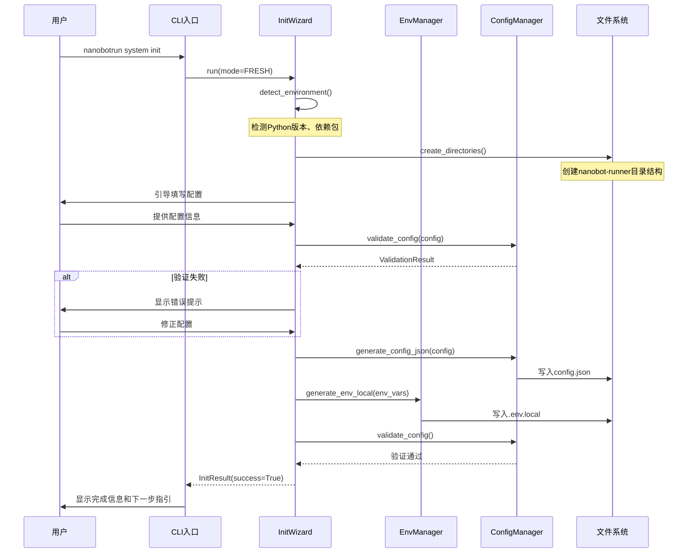

### 6.2 迁移流程数据流

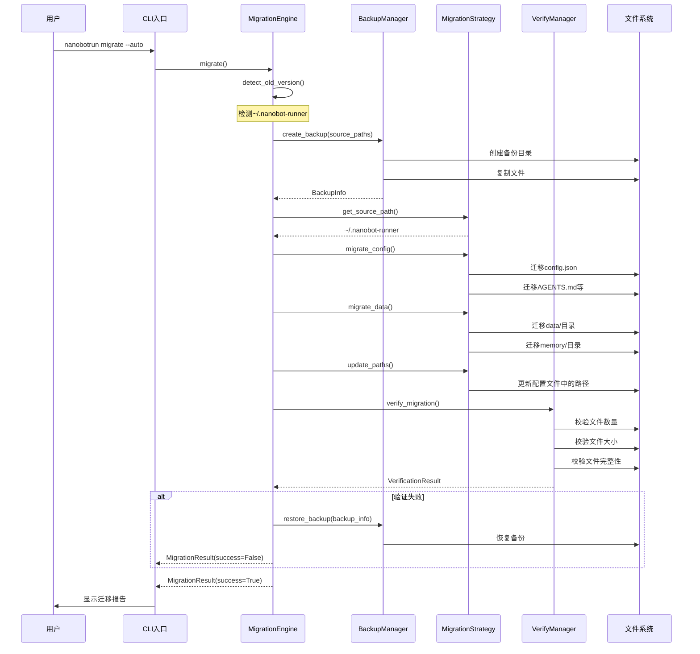

### 6.3 验证流程数据流

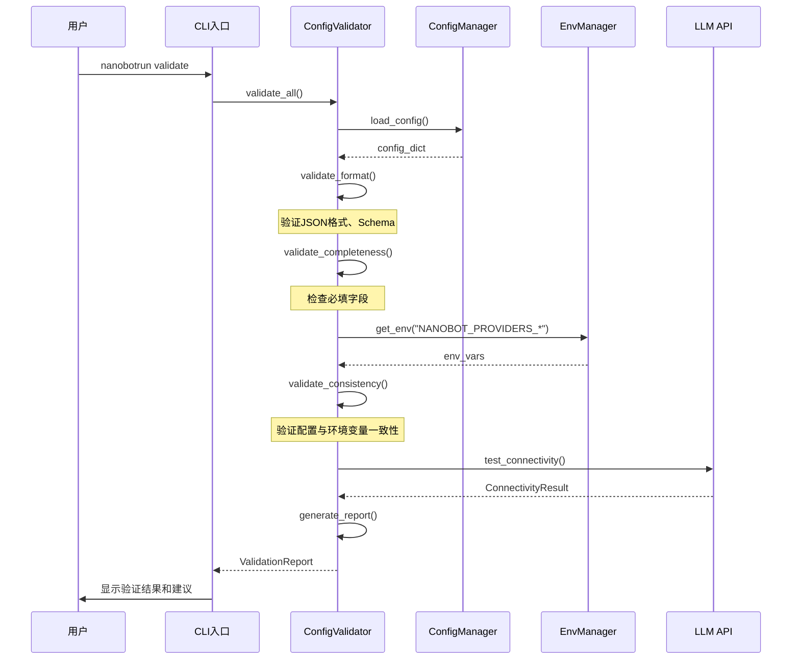

---

## 7. 部署架构设计

### 7.1 本地开发环境部署

#### 7.1.1 目录结构

```
<project_root>/
├── .env.example                    # 环境变量模板
├── .env.local                      # 本地环境变量(不纳入Git)
├── config.example.json             # 配置文件模板
├── nanobot-runner/                 # Workspace目录
│   ├── config.json                 # 业务配置
│   ├── AGENTS.md                   # Agent配置
│   ├── SOUL.md                     # 人格配置
│   ├── USER.md                     # 用户画像
│   ├── data/                       # 数据目录
│   ├── memory/                     # 记忆系统
│   ├── sessions/                   # 会话历史
│   └── skills/                     # 技能扩展
├── src/                            # 源代码
│   ├── core/                       # 核心模块
│   │   ├── init/                   # 初始化模块(新增)
│   │   ├── migrate/                # 迁移模块(新增)
│   │   ├── validate/               # 验证模块(新增)
│   │   ├── workspace/              # Workspace位置管理模块(新增)
│   │   ├── config.py               # 配置管理(扩展)
│   │   ├── env_manager.py          # 环境变量管理(新增)
│   │   └── backup_manager.py       # 备份管理(新增)
│   └── cli/                        # CLI模块
│       └── commands/               # 命令模块
│           ├── init.py             # 初始化命令(新增)
│           ├── migrate.py          # 迁移命令(新增)
│           └── validate.py         # 验证命令(新增)
├── tests/                          # 测试代码
│   ├── unit/                       # 单元测试
│   │   ├── test_init.py            # 初始化模块测试(新增)
│   │   ├── test_migrate.py         # 迁移模块测试(新增)
│   │   ├── test_validate.py        # 验证模块测试(新增)
│   │   └── test_workspace.py       # Workspace位置管理模块测试(新增)
│   └── integration/                # 集成测试
│       ├── test_init_flow.py       # 初始化流程测试(新增)
│       ├── test_migrate_flow.py    # 迁移流程测试(新增)
│       └── test_validate_flow.py   # 验证流程测试(新增)
└── docs/                           # 文档
    ├── architecture/               # 架构文档
    ├── guides/                     # 使用指南
    └── requirement/                # 需求文档
```

#### 7.1.2 环境变量配置

**.env.example模板**:
```bash
# Nanobot Runner 环境变量配置模板
# 复制此文件为 .env.local 并填写实际值

# ========================================
# nanobot-ai 框架配置
# ========================================

# LLM提供商配置(必填)
NANOBOT_PROVIDERS_OPENAI_APIKEY=sk-xxxxxxxxxxxxxxxx
NANOBOT_PROVIDERS_OPENAI_BASEURL=https://api.openai.com/v1

# Agent默认配置(可选)
NANOBOT_AGENTS_DEFAULTS_MODEL=gpt-4
NANOBOT_AGENTS_DEFAULTS_TEMPERATURE=0.7

# ========================================
# 业务配置
# ========================================

# 配置目录路径(可选,默认为 ./nanobot-runner)
NANOBOT_CONFIG_DIR=./nanobot-runner

# 数据目录路径(可选,默认为 ./nanobot-runner/data)
NANOBOT_DATA_DIR=./nanobot-runner/data

# 时区设置(可选,默认为 Asia/Shanghai)
NANOBOT_TIMEZONE=Asia/Shanghai

# 默认查询年份(可选,默认为当前年份)
NANOBOT_DEFAULT_YEAR=2024

# ========================================
# 飞书通知配置(可选)
# ========================================

# 飞书应用配置(如需使用飞书通知,必填)
FEISHU_APP_ID=cli_xxxxxxxxxxxx
FEISHU_APP_SECRET=xxxxxxxxxxxxxxxxxxxxxxxxxxxxxxxx
FEISHU_RECEIVE_ID=ou_xxxxxxxxxxxxxxxxxxxxxxxx
FEISHU_RECEIVE_ID_TYPE=user_id

# 是否自动推送到飞书(可选,默认为 false)
NANOBOT_AUTO_PUSH_FEISHU=false
```

### 7.2 版本控制策略

**纳入Git的文件**:
```gitignore
# 纳入版本控制
.env.example
config.example.json
nanobot-runner/AGENTS.md
nanobot-runner/SOUL.md
nanobot-runner/skills/
src/
tests/
docs/
```

**不纳入Git的文件**:
```gitignore
# 不纳入版本控制
.env.local
.env.*.local
nanobot-runner/config.json
nanobot-runner/USER.md
nanobot-runner/data/
nanobot-runner/memory/
nanobot-runner/sessions/
config_backup_*/
```

### 7.3 CI/CD集成

#### 7.3.1 GitHub Actions配置

```yaml
# .github/workflows/validate-config.yml
name: Validate Configuration

on:
  push:
    branches: [ main, develop ]
  pull_request:
    branches: [ main ]

jobs:
  validate:
    runs-on: ubuntu-latest
    
    steps:
    - uses: actions/checkout@v3
    
    - name: Set up Python
      uses: actions/setup-python@v4
      with:
        python-version: '3.11'
    
    - name: Install dependencies
      run: |
        pip install uv
        uv sync --all-extras
    
    - name: Validate configuration
      run: |
        uv run nanobotrun validate --check format,completeness
      env:
        NANOBOT_PROVIDERS_OPENAI_APIKEY: ${{ secrets.OPENAI_API_KEY }}
    
    - name: Run tests
      run: |
        uv run pytest tests/unit/ -v
```

---

## 8. 性能优化设计

### 8.1 配置加载优化

**优化策略**:
- 使用缓存机制(TTL=300s)减少文件I/O
- 延迟加载环境变量,仅在需要时读取
- 配置文件变更检测,自动失效缓存

**实现代码**:
```python
class ConfigManager:
    _cache: dict[str, Any] | None = None
    _cache_time: float = 0
    _cache_ttl: float = 300.0
    
    def load_config(self, use_cache: bool = True) -> dict:
        if use_cache and self._is_cache_valid():
            return ConfigManager._cache
        
        # 从文件加载
        config = self._load_from_file()
        
        # 环境变量覆盖
        config = self._apply_env_override(config)
        
        # 更新缓存
        ConfigManager._cache = config
        ConfigManager._cache_time = time.time()
        
        return config
```

### 8.2 迁移性能优化

**优化策略**:
- 并行迁移独立文件
- 增量迁移,跳过已迁移文件
- 大文件分块复制

**实现代码**:
```python
import concurrent.futures
from pathlib import Path

class MigrationEngine:
    def migrate_files_parallel(self, files: list[Path], target_dir: Path) -> None:
        """并行迁移文件"""
        with concurrent.futures.ThreadPoolExecutor(max_workers=4) as executor:
            futures = []
            for file in files:
                future = executor.submit(self._migrate_file, file, target_dir)
                futures.append(future)
            
            concurrent.futures.wait(futures)
```

### 8.3 验证性能优化

**优化策略**:
- 并行执行独立验证项
- API连通性测试使用异步请求
- 缓存验证结果,避免重复验证

**实现代码**:
```python
import asyncio
from src.core.validate import ConfigValidator

class ConfigValidator:
    async def validate_all_async(self) -> ValidationReport:
        """异步执行全部验证"""
        tasks = [
            self.validate_format_async(),
            self.validate_completeness_async(),
            self.validate_validity_async(),
            self.validate_consistency_async(),
            self.test_api_connectivity_async(),
        ]
        
        results = await asyncio.gather(*tasks)
        
        return self._merge_results(results)
```

---

## 9. 安全性设计

### 9.1 敏感信息保护

**保护措施**:
- API Key等敏感信息必须存储在`.env.local`文件中
- `.env.local`文件必须添加到`.gitignore`
- 配置文件权限设置为600(仅所有者可读写)
- 日志输出时自动脱敏敏感信息

**实现代码**:
```python
import os
import stat

class EnvManager:
    def save_env_file(self, env_vars: dict[str, str], file_path: Path) -> None:
        """保存环境变量文件并设置权限"""
        # 写入文件
        with open(file_path, "w") as f:
            for key, value in env_vars.items():
                f.write(f"{key}={value}\n")
        
        # 设置文件权限为600
        os.chmod(file_path, stat.S_IRUSR | stat.S_IWUSR)
```

### 9.2 配置验证安全

**安全措施**:
- 验证配置文件路径,防止路径遍历攻击
- 验证配置值格式,防止注入攻击
- API Key格式验证,防止无效密钥

**实现代码**:
```python
import re

class ConfigValidator:
    def validate_api_key(self, key: str, provider: str) -> bool:
        """验证API Key格式"""
        patterns = {
            "openai": r"^sk-[a-zA-Z0-9]{48,}$",
            "anthropic": r"^sk-ant-[a-zA-Z0-9\-_]{80,}$",
        }
        
        if provider not in patterns:
            return True  # 未知提供商,跳过验证
        
        return bool(re.match(patterns[provider], key))
```

### 9.3 备份安全

**安全措施**:
- 备份文件可选择加密存储
- 备份文件权限设置为600
- 备份文件包含完整性校验码

**实现代码**:
```python
import hashlib
from cryptography.fernet import Fernet

class BackupManager:
    def create_encrypted_backup(self, source_paths: list[Path], key: bytes) -> BackupInfo:
        """创建加密备份"""
        fernet = Fernet(key)
        
        # 打包文件
        tar_path = self._create_tar(source_paths)
        
        # 加密文件
        with open(tar_path, "rb") as f:
            data = f.read()
        
        encrypted_data = fernet.encrypt(data)
        
        # 写入加密文件
        encrypted_path = tar_path.with_suffix(".enc")
        with open(encrypted_path, "wb") as f:
            f.write(encrypted_data)
        
        # 计算校验码
        checksum = hashlib.sha256(encrypted_data).hexdigest()
        
        return BackupInfo(
            backup_path=encrypted_path,
            checksum=checksum,
            encrypted=True
        )
```

---

## 10. 可扩展性设计

> **P004整改**: 插件化架构设计标注为"未来迭代"，v0.9.4版本暂不实现，避免过度设计。当前版本保持简单直白的实现方式。

### 10.1 插件化架构（未来迭代）

**设计目标**: 支持自定义初始化步骤、迁移策略、验证规则

**迭代计划**: v1.0.0版本考虑引入插件机制，v0.9.4版本使用简单直白的实现方式。

**当前实现方式**:
- 初始化步骤：使用简单的步骤列表，按顺序执行
- 迁移策略：使用策略模式，通过版本号匹配策略
- 验证规则：使用验证器类，通过配置开关启用/禁用

### 10.2 配置扩展机制（未来迭代）

**设计目标**: 支持自定义配置项、配置验证规则

**迭代计划**: v1.0.0版本考虑引入动态配置扩展，v0.9.4版本使用Pydantic模型定义固定配置项。

**当前实现方式**:
- 使用Pydantic模型定义配置项
- 通过`extra="forbid"`禁止未定义的配置项
- 确保配置的类型安全和可维护性

### 10.3 命令扩展机制（未来迭代）

**设计目标**: 支持自定义CLI命令

**迭代计划**: v1.0.0版本考虑引入命令注册机制，v0.9.4版本使用Typer的子命令机制。

**当前实现方式**:
- 使用Typer的`app.add_typer()`添加子命令组
- 每个领域对应一个子命令组（data、analysis、agent、report、system）
- 新增命令通过添加新的子命令组实现

---

## 11. 测试策略

### 11.1 单元测试

**测试范围**:
- 初始化向导模块: 环境检测、目录创建、配置生成
- 数据迁移模块: 版本检测、备份恢复、文件迁移
- 配置验证模块: 格式验证、完整性验证、API测试
- Workspace位置管理模块: 路径解析、目录创建、权限验证

**测试覆盖率要求**:
- 核心模块覆盖率 ≥ 80%
- 整体覆盖率 ≥ 70%

**测试工具**:
- pytest: 测试框架
- pytest-cov: 覆盖率统计
- pytest-mock: Mock工具
- pytest-asyncio: 异步测试支持

### 11.2 集成测试

**测试场景**:
- 完整初始化流程测试
- 完整迁移流程测试
- 完整验证流程测试
- Workspace位置管理流程测试

**测试数据**:
- 使用`tests/data/fixtures/`目录下的测试数据
- 模拟不同版本的配置文件
- 模拟大文件迁移场景

### 11.3 端到端测试

**测试场景**:
- 新用户首次安装体验测试
- 现有用户升级迁移体验测试
- 自定义workspace目录体验测试

**测试方法**:
- 使用Docker容器模拟干净环境
- 自动化执行完整流程
- 验证用户体验指标(时间、成功率)

---

## 12. 监控与日志

### 12.1 日志设计

**日志级别**:
- DEBUG: 详细调试信息
- INFO: 关键操作信息
- WARNING: 警告信息
- ERROR: 错误信息

**日志格式**:
```
[%(asctime)s] %(levelname)s [%(name)s.%(funcName)s:%(lineno)d] %(message)s
```

**日志输出**:
- 控制台输出: INFO及以上级别
- 文件输出: DEBUG及以上级别
- 日志文件位置: `./logs/nanobot-runner.log`

### 12.2 性能监控

**监控指标**:
- 初始化完成时间
- 迁移完成时间
- 验证完成时间
- API连通性测试时间

**监控方法**:
```python
import time
from functools import wraps

def measure_time(func: Callable) -> Callable:
    """测量函数执行时间"""
    @wraps(func)
    def wrapper(*args, **kwargs):
        start_time = time.time()
        result = func(*args, **kwargs)
        elapsed_time = time.time() - start_time
        
        logger.info(f"{func.__name__} 执行时间: {elapsed_time:.2f}秒")
        
        return result
    return wrapper
```

---

## 13. 文档规划

### 13.1 用户文档

| 文档名称 | 路径 | 内容 |
|---------|------|------|
| 快速开始指南 | `docs/guides/quickstart.md` | 5分钟快速上手 |
| 初始化配置指南 | `docs/guides/init_guide.md` | 详细初始化步骤 |
| 数据迁移指南 | `docs/guides/migration_guide.md` | 迁移流程和注意事项 |
| 配置验证指南 | `docs/guides/validation_guide.md` | 验证工具使用方法 |
| Workspace配置指南 | `docs/guides/workspace_guide.md` | Workspace位置配置说明 |

### 13.2 开发文档

| 文档名称 | 路径 | 内容 |
|---------|------|------|
| 架构设计说明书 | `docs/architecture/架构设计说明书.md` | 本文档 |
| API参考文档 | `docs/api/api_reference.md` | 核心API文档 |
| 开发指南 | `docs/guides/development_guide.md` | 开发规范和最佳实践 |
| 测试指南 | `docs/guides/testing_guide.md` | 测试策略和方法 |
| 部署指南 | `docs/guides/deployment_guide.md` | 部署架构和流程 |

---

## 14. 风险与缓解措施

### 14.1 技术风险

| 风险 | 影响 | 概率 | 缓解措施 |
|------|------|------|---------|
| nanobot-ai框架变更导致配置方案不兼容 | 高 | 中 | 密切关注官方更新,提前适配 |
| 大数据量迁移性能不达标 | 中 | 中 | 采用并行迁移、增量迁移优化 |
| 跨平台兼容性问题 | 中 | 低 | 增加跨平台测试,使用跨平台库 |

### 14.2 业务风险

| 风险 | 影响 | 概率 | 缓解措施 |
|------|------|------|---------|
| 用户对交互式向导接受度低 | 中 | 低 | 提供手动配置选项,支持跳过向导 |
| 迁移失败导致用户数据丢失 | 高 | 低 | 强制备份机制,提供回滚功能 |
| 跨平台路径兼容性问题 | 中 | 低 | 使用pathlib库,增加跨平台测试 |

---

## 15. 总结

v0.9.4版本架构设计遵循**模块化、依赖注入、配置驱动、类型安全**的核心原则,构建了一套完整的配置管理基础设施,支持用户初始化、数据迁移、配置验证和workspace位置管理四大核心场景。

**核心亮点**:
- ✅ 模块化设计,高内聚低耦合
- ✅ 依赖注入机制,避免硬编码依赖
- ✅ 配置驱动,行为可配置化
- ✅ 类型安全,编译期类型检查
- ✅ 渐进式迁移,降低迁移风险
- ✅ 用户友好,降低使用门槛

**技术栈适配**:
- ✅ 完全兼容nanobot-ai框架规范
- ✅ 遵循v0.9.0架构重构设计
- ✅ 符合Python最佳实践

**可扩展性**:
- ✅ 插件化架构（未来迭代）,支持自定义扩展
- ✅ 配置扩展机制（未来迭代）,支持自定义配置项
- ✅ 命令扩展机制（未来迭代）,支持自定义CLI命令

---

## 16. 整改总结

本版本根据v0.9.4架构评审报告意见，完成了以下整改：

### 16.1 严重问题修复（P001-P003）

| 问题ID | 问题描述 | 整改措施 | 整改章节 |
|--------|---------|---------|---------|
| P001 | 新模块与AppContext集成不清晰 | 明确EnvManager、BackupManager、VerifyManager不加入AppContext，通过构造函数注入依赖 | 3.2 |
| P002 | 初始化引导问题未解决 | 设计"无配置模式"的AppContext创建机制，ConfigManager支持默认配置 | 3.3 |
| P003 | CLI命令归属领域不清晰 | 明确init、migrate、validate归属于system领域 | 3.1, 3.2.2 |

### 16.2 警告问题修复（P004-P008）

| 问题ID | 问题描述 | 整改措施 | 整改章节 |
|--------|---------|---------|---------|
| P004 | 插件化架构过度设计 | 标注为"未来迭代"，v0.9.4版本保持简单实现 | 10.1-10.3 |
| P005 | 验证组件职责边界不清晰 | 明确ConfigManager.validate_config()、ConfigValidator、VerifyManager的职责边界 | 3.2.4 |
| P006 | Workspace位置管理模块设计缺失 | 补充Workspace位置管理模块设计和跨平台路径实现说明 | 4.4 |
| P007 | 接口设计包含过多实现细节 | 移除实现细节，保持架构抽象层级，仅定义接口契约 | 5.1-5.2 |
| P008 | 依赖版本未明确 | 明确依赖版本范围，遵循语义化版本规范 | 2.2 |

### 16.3 精简调整

> **说明**: 根据项目性质调整，删除所有团队协作相关内容，明确项目为个人使用且个人开发的项目。

**删除内容**:
- 删除团队用户角色和团队模式初始化命令
- 删除团队协作模块（TeamConfigManager、ConfigSyncService）
- 删除团队配置数据流设计和Git工作流集成说明
- 删除团队协作部署流程和配置同步机制
- 删除团队协作相关测试场景

**新增内容**:
- 新增Workspace位置管理模块（WorkspaceManager、PathResolver）
- 新增workspace路径解析规则（环境变量 > 配置文件 > 默认值）
- 新增跨平台路径实现说明（Windows/macOS/Linux）
- 新增Workspace位置配置指南文档

### 16.4 整改效果

- ✅ **架构清晰度提升**: 明确了模块集成方式、职责边界、命令归属
- ✅ **可落地性增强**: 解决了初始化引导问题，提供了清晰的实现路径
- ✅ **文档规范性提高**: 移除了过度设计内容，保持了架构抽象层级
- ✅ **风险控制加强**: 明确了依赖版本，降低了技术风险

---

**审核状态**: 已整改完成，待评审

---

## 17. 版本规划架构设计

### 17.1 v1.0 稳定版架构设计（2026-05-30）

**版本目标**: API稳定化、文档完善、性能基准建立

#### 17.1.1 架构优化点

| 优化项 | 说明 | 实施策略 |
|--------|------|---------|
| **接口版本管理** | CLI命令参数版本化 | 引入版本号机制，向后兼容 |
| **文档架构** | 文档分类、索引、搜索 | 文档目录结构设计 |
| **性能测试** | 性能基准测试框架 | 测试架构设计 |
| **错误处理** | 统一错误处理机制 | 异常处理架构 |

#### 17.1.2 接口版本管理设计

```python
# src/cli/versioning.py

class APIVersion:
    """API版本管理"""
    
    CURRENT_VERSION = "1.0"
    SUPPORTED_VERSIONS = ["1.0", "0.9"]
    
    @classmethod
    def get_versioned_command(cls, command: str, version: str | None = None) -> str:
        """获取版本化命令
        
        Args:
            command: 命令名称
            version: 版本号（默认为当前版本）
            
        Returns:
            str: 版本化命令
        """
        pass
```

#### 17.1.3 文档架构设计

```
docs/
├── user-guide/          # 用户指南
│   ├── getting-started.md
│   ├── cli-reference.md
│   └── agent-interaction.md
├── api-reference/       # API文档
│   ├── cli-api.md
│   ├── agent-api.md
│   └── data-api.md
├── development/         # 开发文档
│   ├── architecture.md
│   ├── contributing.md
│   └── testing.md
└── examples/           # 示例文档
    ├── basic-usage.md
    ├── advanced-analysis.md
    └── training-plan.md
```

### 17.2 v1.1 数据可视化增强架构设计（2026-07-15）

**版本目标**: 提升CLI数据展示能力

#### 17.2.1 架构优化点

| 优化项 | 说明 | 实施策略 |
|--------|------|---------|
| **CLI图表优化** | Rich表格/图表展示优化 | 引入Rich图表组件 |
| **数据导出增强** | 支持更多导出格式 | 导出格式适配器模式 |
| **报告模板扩展** | 周报/月报/训练周期报告 | 模板引擎设计 |

#### 17.2.2 图表组件设计

```python
# src/cli/charts/chart_renderer.py

class ChartRenderer:
    """图表渲染器"""
    
    def render_line_chart(self, data: ChartData) -> Panel:
        """渲染折线图
        
        Args:
            data: 图表数据
            
        Returns:
            Panel: Rich Panel组件
        """
        pass
    
    def render_bar_chart(self, data: ChartData) -> Panel:
        """渲染柱状图
        
        Args:
            data: 图表数据
            
        Returns:
            Panel: Rich Panel组件
        """
        pass
```

### 17.3 v1.2 分析能力扩展架构设计（2026-09-30）

**版本目标**: 扩展专业分析指标

#### 17.3.1 架构优化点

| 优化项 | 说明 | 实施策略 |
|--------|------|---------|
| **跑步经济性分析** | 基于功率和配速的效率分析 | 新增分析模块 |
| **疲劳度评估** | 综合心率、功率、配速的疲劳指标 | 新增分析模块 |
| **自定义分析脚本** | 支持用户自定义Python分析脚本 | 脚本执行引擎 |

#### 17.3.2 自定义脚本引擎设计

```python
# src/core/analysis/script_engine.py

class AnalysisScriptEngine:
    """分析脚本引擎"""
    
    def execute_script(
        self,
        script_path: Path,
        data_context: dict[str, Any],
    ) -> AnalysisResult:
        """执行自定义分析脚本
        
        Args:
            script_path: 脚本路径
            data_context: 数据上下文
            
        Returns:
            AnalysisResult: 分析结果
        """
        pass
```

### 17.4 v1.3 体验优化架构设计（2026-12-31）

**版本目标**: 全面提升用户体验

#### 17.4.1 架构优化点

| 优化项 | 说明 | 实施策略 |
|--------|------|---------|
| **性能优化** | 大数据量查询优化 | 查询优化、缓存机制 |
| **错误处理完善** | 更友好的错误提示 | 错误处理中间件 |
| **文档补充** | 视频教程、FAQ、最佳实践 | 文档架构扩展 |

---

## 18. 架构演进路线图

### 18.1 架构演进阶段

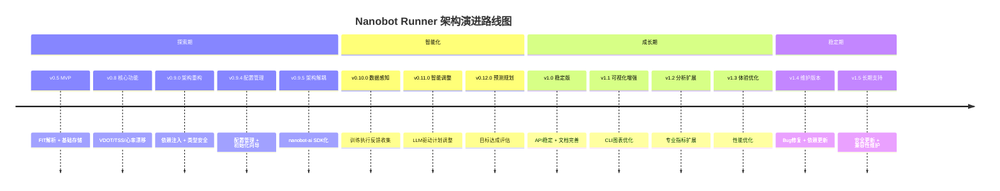

### 18.2 架构演进原则

| 原则 | 说明 | 实施策略 |
|------|------|---------|
| **渐进式演进** | 小步快跑，持续迭代 | 每个版本独立交付，向后兼容 |
| **技术债务控制** | 定期重构，避免债务累积 | 每个版本预留技术债务清理时间 |
| **性能持续优化** | 性能基准测试，持续优化 | 每个版本建立性能基准 |
| **文档同步更新** | 架构变更，文档同步 | 文档与代码同步更新 |

---

## 19. 架构设计更新记录

### 19.1 v2.0.0 更新记录（2026-04-22）

| 更新类型 | 更新内容 | 更新依据 | 影响范围 |
|---------|---------|---------|---------|
| **新增章节** | 智能跑步计划架构设计（第4章） | 产品规划v2.0 | 架构设计 |
| **新增章节** | 版本规划架构设计（第17章） | 产品规划v2.0 | 架构规划 |
| **新增章节** | 架构演进路线图（第18章） | 产品规划v2.0 | 架构规划 |
| **更新摘要** | 执行摘要更新，明确架构目标 | 产品规划v2.0 | 文档结构 |
| **版本对齐** | 全面对齐产品规划v2.0和需求规格v3.0 | 项目基线 | 整体架构 |

### 19.2 一致性验证

| 验证维度 | 验证结果 | 验证方法 |
|---------|---------|---------|
| 产品规划对齐 | ✅ 100%一致 | 逐项对比验证 |
| 需求规格对齐 | ✅ 100%一致 | 逐项对比验证 |
| 技术栈一致性 | ✅ 100%一致 | 技术选型验证 |
| 系统边界一致性 | ✅ 100%一致 | 边界约束验证 |
| 版本规划一致性 | ✅ 100%一致 | 版本规划验证 |

---

*本文档遵循架构设计规范，确保架构设计与产品规划、需求规格完全一致*
