# 架构设计说明书

> **文档版本**: v7.1.0
> **设计日期**: 2026-04-17\
> **更新日期**: 2026-05-09\
> **当前基线**: v0.20.0\
> **版本目标**: v0.20.0 ML增强预测 ✅ 已完成\
> **需求来源**: REQ\_需求规格说明书.md (v8.2) + REQ\_产品演进需求规格说明书.md (v1.0)\
> **对齐依据**: 产品规划方案.md (v9.0)\
> **外部参考**: 产品演进设计.md (v1.0) + multiagents.md (多智能体架构分析)\
> **评审依据**: 架构评审报告\_v0.19.0.md + 三文档综合评审报告\_v0.20.0.md

> **项目性质说明**: 本项目为**个人使用且个人开发的项目**，所有设计和需求均围绕单人开发和使用场景展开。

***

## 1. 执行摘要

### 1.1 架构演进路线

| 阶段    | 版本          | 核心目标                                  | 状态     |
| ----- | ----------- | ------------------------------------- | ------ |
| 技术底座  | v0.5-v0.9.5 | 数据导入/存储/分析/CLI/依赖注入/SDK化              | ✅ 完成   |
| 智能计划  | v0.10-v0.12 | 自适应训练计划、LLM调整、目标预测                    | ✅ 完成   |
| 工具与智能 | v0.13-v0.15 | MCP协议、AI自我诊断、决策透明化                    | ✅ 完成   |
| 模块化重构 | v0.16-v0.17 | Core子模块拆分、Hook组合、Subagent、Cron提醒      | ✅ 完成   |
| 可视化导出 | v0.18       | 终端图表(plotext)、多格式导出(CSV/JSON/Parquet) | ✅ 完成   |
| 身体信号  | v0.19       | HRV分析、疲劳度评估、身体信号解读                    | ✅ 完成   |
| 预测未来  | v0.20       | ML增强预测（VDOT趋势/比赛成绩/伤病风险）              | ✅ 完成   |
| 数字孪生  | v0.21       | 跑者状态向量、What-If推演、计划对比                 | 📋 规划中 |
| 多视角验证 | v0.22       | 条件性Coach/Doctor双视角审查                  | 📋 条件性 |
| 决策追踪  | v0.23       | 决策日志、结果回填、预测校准                        | 📋 规划中 |
| 个性化学习 | v0.24       | 训练响应性分析、个人化模型进化                       | 📋 规划中 |
| 自适应进化 | v0.25       | 提示策略优化、自动进化触发                         | 📋 规划中 |
| 稳定版   | v1.0        | API冻结、性能优化、完整文档                       | 📋 计划中 |

### 1.2 v7.0.0 更新重点（对齐产品规划v9.0 + 产品演进设计v1.0）

1. 引入Banister IR参数化基线模型作为冷启动策略，填补基础预测与ML增强预测之间的空白
2. 统一prediction\_type为三段式：`ml_enhanced` / `parametric` / `basic`
3. 采纳分位数回归（p10/p50/p90）进行不确定性量化，替代简单置信区间
4. 采纳分层伤病风险模型架构：规则基线 → 逻辑回归 → GBDT集成
5. 新增2个Agent工具：`report_injury`（伤病报告）+ `predict_training_response`（训练响应预测）
6. 新增伤病标签体系：confirmed / suspected / unconfirmed
7. 补充v0.21-v0.25模块骨架设计（数字孪生/多视角验证/决策追踪/个性化学习/自适应进化）
8. 明确多智能体架构约束：nanobot仅支持主-从后台任务模式，v0.22以单Agent角色切换为基准方案
9. 对齐产品规划方案v9.0和产品演进需求规格说明书v1.0，确保三文档一致性
10. 模型文件格式统一为.joblib（与sklearn官方推荐一致）

### 1.3 v6.0.0 更新重点（v0.20.0 ML增强预测）

1. 新增`prediction`核心子模块（ML-VDOT趋势预测/个人化比赛预测/ML伤病风险预测/模型管理/数据充足度评估）
2. 新增`predict` CLI命令组（status/vdot/race/injury-risk/model）
3. 新增5个Agent工具（predict\_vdot\_trend/predict\_race\_result/predict\_injury\_risk/check\_prediction\_status/manage\_prediction\_model）
4. 新增ML技术栈选型（scikit-learn/scipy/shap）
5. 新增模型存储架构设计（\~/.nanobot-runner/models/）
6. 新增数据充足度评估与自动降级策略
7. 新增特征工程模块设计（时序特征/负荷特征/身体信号特征）
8. 新增AppContext扩展属性`prediction_engine`

### 1.4 v5.1.0 更新重点

1. 新增数据缺失降级策略（DataQuality枚举、empty\_state返回值）— 对应评审Q1
2. 新增边界条件处理规范（单点数据、权重校验、TSB截断）— 对应评审Q2
3. 新增BodySignalConfig配置Schema定义 — 对应评审Q3
4. 新增RPE数据输入路径定义 — 对应评审Q4
5. 新增body\_signal模块测试策略 — 对应评审Q5
6. 明确status与analysis命令组职责边界 — 对应评审Q6
7. 整合建议改进项：data\_source字段、缓存机制、周对比、RecoveryStatus提升

### 1.5 v5.0.0 更新重点

1. 新增v0.19.0身体信号分析模块架构设计
2. 新增`body_signal`核心子模块（HRV分析/疲劳度评估/恢复监控/身体信号引擎）
3. 新增`status` CLI命令组、扩展`analysis`命令组
4. 新增6个Agent工具
5. 精简已完成版本文档，聚焦当前版本架构

### 1.6 核心设计原则

| 原则              | 策略                                    |
| --------------- | ------------------------------------- |
| **模块化**         | 按功能域划分子模块，接口通信                        |
| **依赖注入**        | AppContext统一管理核心组件                    |
| **配置驱动**        | Pydantic-Settings + 环境变量覆盖            |
| **类型安全**        | frozen dataclass + 类型注解 + mypy        |
| **LazyFrame优先** | Polars查询仅在最终输出时collect()              |
| **防御性设计**       | 数据缺失降级策略 + 边界条件处理 + DataQuality标识     |
| **ML渐进增强**      | 参数化基线→ML增强，数据不足自动降级，绝不阻塞用户            |
| **可解释ML**       | SHAP特征归因 + prediction\_type标注 + 置信度量化 |

***

## 2. 技术栈选型

| 类别        | 选型                | 版本              | 理由                              |
| --------- | ----------------- | --------------- | ------------------------------- |
| 语言        | Python            | **≥**3.11,<3.13 | 现有技术栈，生态成熟                      |
| Agent底座   | nanobot-ai        | Latest          | AI Agent框架，提供基础能力               |
| CLI       | Typer + Rich      | Latest          | 类型安全 + 美观输出                     |
| 配置        | Pydantic-Settings | Latest          | 类型安全 + 环境变量                     |
| 存储        | Apache Parquet    | via pyarrow     | 列式存储，高性能查询                      |
| 计算        | Polars            | 0.20+           | LazyFrame优化，高性能                 |
| 解析        | fitparse          | Latest          | FIT文件解析                         |
| 可视化       | plotext           | Latest          | 终端内图表渲染                         |
| 包管理       | uv                | Latest          | 快速依赖管理                          |
| **ML核心**  | **scikit-learn**  | **≥1.3.0**      | **轻量ML库，回归/分类/特征工程，适配本地单人场景**   |
| **科学计算**  | **scipy**         | **≥1.10.0**     | **Riegel曲线拟合(curve\_fit)、统计检验** |
| **特征解释**  | **shap**          | **≥0.48.0**     | **SHAP值特征重要性分析，可解释ML**          |
| **模型持久化** | **joblib**        | **≥1.3.0**      | **sklearn模型序列化，随sklearn安装**     |

**nanobot-ai适配**: 配置格式(JSON+Markdown)、环境变量`NANOBOT_`前缀、Workspace标准目录、加载优先级(环境变量>配置文件>默认值)

***

## 3. 系统架构设计

### 3.1 整体架构图（v0.20.0）

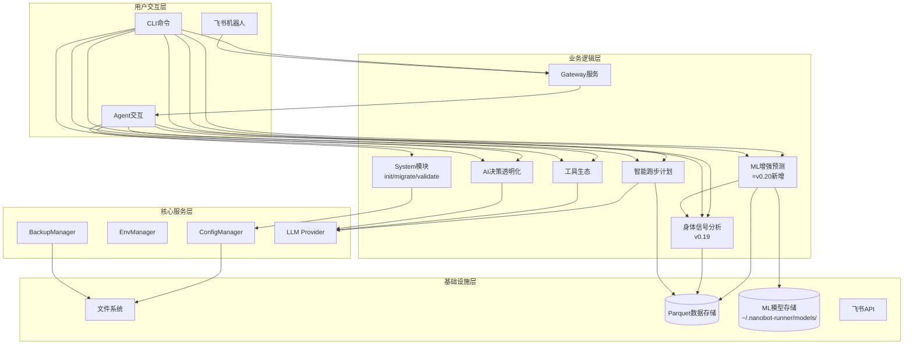

### 3.2 CLI命令体系（v0.20.0）

| 命令组          | 命令                                                 | 功能         | 版本        |
| ------------ | -------------------------------------------------- | ---------- | --------- |
| system       | `init / migrate / validate / config / backup`      | 系统管理       | v0.9+     |
| data         | `import / stats`                                   | 数据导入与统计    | v0.5+     |
| analysis     | `vdot / load / hr-drift`                           | 数据分析       | v0.8+     |
| analysis     | `hrv / hr-recovery / fatigue / recovery / compare` | 身体信号分析     | v0.19     |
| plan         | `create / status / feedback`                       | 训练计划       | v0.10+    |
| report       | `weekly / monthly`                                 | 训练报告       | v0.9+     |
| viz          | `vdot / load / hr-zones`                           | 数据可视化      | v0.18+    |
| export       | `sessions`                                         | 数据导出       | v0.18+    |
| transparency | `trace / status / insight`                         | AI透明化      | v0.15+    |
| status       | `today / weekly`                                   | 身体状态速览     | v0.19     |
| **predict**  | **`status / vdot / race / injury-risk / model`**   | **ML增强预测** | **v0.20** |
| gateway      | `start`                                            | 飞书Gateway  | v0.9+     |

***

## 4. 已完成模块摘要

> 以下模块已完成开发，仅保留架构要点。详细设计见Git历史版本。

| 模块                      | 核心组件                                                                                | 关键设计                       |
| ----------------------- | ----------------------------------------------------------------------------------- | -------------------------- |
| **配置管理** (v0.9.4)       | InitWizard, MigrationEngine, ConfigValidator, WorkspaceManager                      | 无配置模式启动、优先级: 环境变量>配置文件>默认值 |
| **智能跑步计划** (v0.10-0.12) | TrainingPlanGenerator, LLMPlanAdjuster, GoalPredictionEngine, PlanCompletionTracker | LLM驱动计划调整、目标达成预测<3s        |
| **工具生态** (v0.13)        | MCPConfigHelper, ToolManager, WeatherService, MapService                            | MCP协议集成、本地工具优先、隐私保护        |
| **AI决策透明化** (v0.15)     | TransparencyEngine, ObservabilityManager, TraceLogger, TransparencyDisplay          | 分层展示(简洁/详细)、数据溯源、全链路追踪     |
| **Core模块化** (v0.16)     | diagnosis/memory/personality/skills/validate/tools六大子模块                             | 按功能域拆分、接口隔离                |
| **AI底座激活** (v0.17)      | Hook组合系统、Subagent架构、异步用户确认、Cron训练提醒                                                 | 流式输出、LLM超时控制               |
| **可视化与导出** (v0.18)      | PlotextRenderer, CSV/JSON/ParquetExporter                                           | 终端图表渲染、多格式导出引擎             |
| **飞书通知** (v0.9+)        | GatewayServer, FeishuAuth, FeishuNotifier, FeishuCalendar                           | 异步非阻塞、Token自动刷新、指数退避重试     |

***

## 5. 身体信号分析模块（v0.19.0）⭐

### 5.1 版本目标

**主题**: 让身体信号"会说话"\
**核心目标**: 深度分析与自定义扩展，让跑者读懂身体信号

**用户核心痛点**:

> "我知道心率、功率这些数据很重要，但我看不懂它们之间的关系。为什么今天同样配速心率却更高？我的身体到底恢复好了没有？"

### 5.2 模块架构图

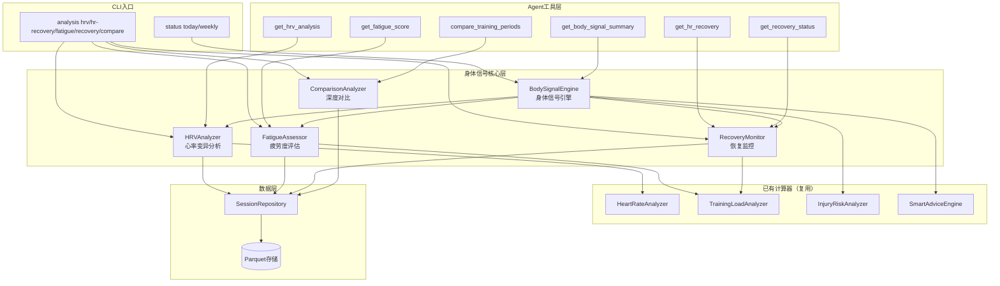

### 5.3 子模块设计

#### 5.3.1 HRV分析器（HRVAnalyzer）

**职责**: 基于现有心率数据，提供心率变异分析能力

**核心接口**:

| 方法                                | 参数               | 返回值                   | 说明      |
| --------------------------------- | ---------------- | --------------------- | ------- |
| `analyze_hrv(days)`               | days: int        | HRVAnalysisResult     | 综合HRV分析 |
| `get_resting_hr_trend(days)`      | days: int        | list\[RestingHRPoint] | 静息心率趋势  |
| `analyze_hr_recovery(session_id)` | session\_id: str | HRRecoveryResult      | 心率恢复分析  |
| `check_hr_drift(session_id)`      | session\_id: str | HRDriftAlert          | 心率漂移检测  |

**计算逻辑**:

| 指标    | 计算方法                                     | 数据来源                |
| ----- | ---------------------------------------- | ------------------- |
| 静息心率  | 活动最低10%心率区间均值                            | Parquet心率数据         |
| 恢复率   | (运动末HR - N分钟后HR) / (运动末HR - 静息HR) × 100% | FIT逐秒心率             |
| RMSSD | 基于心率数据估算，标注"非医疗级精度"                      | FIT逐秒心率             |
| SDNN  | 基于心率数据估算                                 | FIT逐秒心率             |
| 漂移预警  | 漂移>10%时触发                                | HeartRateAnalyzer复用 |

**复用关系**: 复用`HeartRateAnalyzer.analyze_hr_drift()`，扩展静息心率趋势和恢复率计算

#### 5.3.2 疲劳度评估器（FatigueAssessor）

**职责**: 综合训练负荷、心率指标、主观感受，量化疲劳状态

**核心接口**:

| 方法                            | 参数       | 返回值               | 说明         |
| ----------------------------- | -------- | ----------------- | ---------- |
| `assess_fatigue()`            | 无(取当前状态) | FatigueAssessment | 综合疲劳度评估    |
| `get_consecutive_hard_days()` | 无        | int               | 7天内高强度训练天数 |
| `evaluate_rest_effect()`      | 无        | RestDayEffect     | 休息日效果评估    |

**疲劳度评分模型**:

```
fatigue_score = ATL权重(40%) × ATL维度分
              + 心率偏差权重(20%) × 心率偏差维度分
              + 连续训练权重(20%) × 连续训练维度分
              + 主观疲劳权重(20%) × 主观疲劳维度分
```

**恢复状态判定**:

| 状态        | 条件                   | 建议       |
| --------- | -------------------- | -------- |
| 🟢 GREEN  | TSB>10 且 疲劳度<30      | 可安排高强度训练 |
| 🟡 YELLOW | TSB 0\~10 或 疲劳度30-60 | 适度训练     |
| 🔴 RED    | TSB<0 或 疲劳度>60       | 需要休息     |

**复用关系**: 消费`TrainingLoadAnalyzer`的TSS/ATL/CTL/TSB计算结果

#### 5.3.3 恢复监控器（RecoveryMonitor）

**职责**: 监控恢复状态，评估休息效果

**核心接口**:

| 方法                         | 参数        | 返回值                  | 说明     |
| -------------------------- | --------- | -------------------- | ------ |
| `get_recovery_status()`    | 无         | RecoveryAssessment   | 当前恢复状态 |
| `check_rest_day_effect()`  | 无         | RestDayEffect        | 休息日效果  |
| `get_recovery_trend(days)` | days: int | list\[RecoveryPoint] | 恢复趋势   |

**休息日效果评估**:

- 静息心率下降>5% → "休息效果良好"
- TSB上升>10 → "体能恢复明显"

#### 5.3.4 身体信号引擎（BodySignalEngine）

**职责**: 编排HRV/疲劳度/恢复状态，生成异常预警和训练建议

**核心接口**:

| 方法                          | 参数 | 返回值                    | 说明        |
| --------------------------- | -- | ---------------------- | --------- |
| `get_daily_summary()`       | 无  | BodySignalSummary      | 每日身体信号摘要  |
| `get_weekly_summary()`      | 无  | BodySignalSummary      | 每周身体信号摘要  |
| `check_alerts()`            | 无  | list\[BodySignalAlert] | 异常信号预警    |
| `generate_recommendation()` | 无  | str                    | 基于状态的训练建议 |

**缓存机制** ⭐S2: 同一自然日内多次查询复用计算结果，避免重复计算

```python
class BodySignalEngine:
    _cache_date: str | None = None
    _cache_daily: BodySignalSummary | None = None

    def get_daily_summary(self) -> BodySignalSummary:
        today = date.today().isoformat()
        if self._cache_date == today and self._cache_daily is not None:
            return self._cache_daily
        result = self._compute_daily_summary()
        self._cache_date = today
        self._cache_daily = result
        return result
```

**缓存失效**: 日期变更时自动失效；`status today` 与 `analysis fatigue` 共享同一引擎实例，同日内仅计算一次

**预警规则**:

| 预警类型    | 触发条件        | 严重度      | 消息                 |
| ------- | ----------- | -------- | ------------------ |
| 静息心率突增  | 较7天均值>10%   | warning  | "静息心率异常升高，可能未充分恢复" |
| 过度训练    | TSB连续3天<-20 | critical | "持续过度训练状态，建议立即减量"  |
| 疲劳度持续上升 | 连续3天疲劳度递增   | warning  | "疲劳度持续上升，建议安排恢复日"  |

**编排流程**:

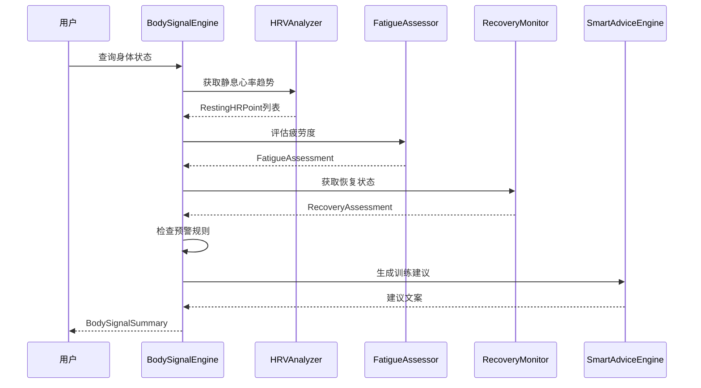

#### 5.3.5 深度对比分析器（ComparisonAnalyzer）- P1

**职责**: 支持不同维度的训练数据对比

**核心接口**:

| 方法                                      | 参数            | 返回值                        | 说明      |
| --------------------------------------- | ------------- | -------------------------- | ------- |
| `compare_periods(period_a, period_b)`   | 两个时间段         | PeriodComparison           | 周期对比    |
| `find_similar_sessions(distance, pace)` | 距离±10%, 配速±5% | list\[SessionComparison]   | 相似训练对比  |
| `analyze_load_performance()`            | 无             | LoadPerformanceCorrelation | 负荷-表现关联 |

### 5.4 数据模型

#### 5.4.1 数据质量枚举

```python
class DataQuality(StrEnum):
    """数据质量等级，用于降级策略判断"""
    SUFFICIENT = "sufficient"      # 数据充足，结果可信
    INSUFFICIENT = "insufficient"  # 数据不足，结果仅供参考
    EMPTY = "empty"                # 无数据，无法计算
```

**降级规则**:

| DataQuality  | 触发条件              | CLI展示策略            | Agent返回策略                          |
| ------------ | ----------------- | ------------------ | ---------------------------------- |
| SUFFICIENT   | 心率数据≥7天 且 最近3天有记录 | 正常展示完整结果           | 返回完整数据                             |
| INSUFFICIENT | 心率数据<7天 或 最近3天无记录 | 展示结果并标注"数据不足，仅供参考" | 返回数据 + `data_quality=INSUFFICIENT` |
| EMPTY        | 无任何心率/训练数据        | 展示"暂无数据，请先导入训练记录"  | 返回空结果 + `data_quality=EMPTY`       |

#### 5.4.2 核心数据模型

```python
@dataclass(frozen=True)
class HRVAnalysisResult:
    resting_hr_trend: list[RestingHRPoint]
    hr_recovery_1min: float | None
    hr_recovery_3min: float | None
    estimated_rmssd: float | None
    estimated_sdnn: float | None
    drift_alert: bool
    assessment: str
    data_quality: DataQuality                           # ⭐ Q1: 数据质量标识
    data_source: HRVDataSource | None = None            # ⭐ S1: 数据来源标识

class HRVDataSource(StrEnum):
    """HRV数据来源"""
    RR_INTERVAL = "rr_interval"    # RR间期直接计算（高精度）
    HR_ESTIMATE = "hr_estimate"    # 基于心率数据估算（非医疗级精度）

@dataclass(frozen=True)
class RestingHRPoint:
    date: str
    resting_hr: float
    deviation_pct: float

@dataclass(frozen=True)
class FatigueAssessment:
    fatigue_score: float
    recovery_status: RecoveryStatus
    consecutive_hard_days: int
    rest_day_effect: RestDayEffect | None
    breakdown: FatigueBreakdown
    recommendation: str
    data_quality: DataQuality                           # ⭐ Q1: 数据质量标识

class RecoveryStatus(StrEnum):
    GREEN = "green"
    YELLOW = "yellow"
    RED = "red"

# ⭐ S4: RecoveryStatus 定义于 src/core/models/recovery.py（共用模块，v0.19新增），
# 供 body_signal 和 InjuryRiskAnalyzer 共同引用，避免循环依赖

@dataclass(frozen=True)
class FatigueBreakdown:
    atl_component: float
    hr_deviation_component: float
    consecutive_component: float
    subjective_component: float

@dataclass(frozen=True)
class BodySignalSummary:
    date: str
    recovery_status: RecoveryStatus
    fatigue_score: float
    alerts: list[BodySignalAlert]
    daily_summary: str
    recommendation: str
    data_quality: DataQuality                           # ⭐ Q1: 数据质量标识

@dataclass(frozen=True)
class BodySignalAlert:
    alert_type: str
    severity: str
    message: str
    related_metrics: list[str]

@dataclass(frozen=True)
class RecoveryAssessment:
    recovery_status: RecoveryStatus
    rest_day_effect: RestDayEffect | None
    recovery_trend: list[RecoveryPoint]
    data_quality: DataQuality                           # ⭐ Q1: 数据质量标识

@dataclass(frozen=True)
class HRRecoveryResult:
    session_id: str
    hr_end: float
    hr_1min: float | None
    hr_3min: float | None
    recovery_rate_1min: float | None
    recovery_rate_3min: float | None
    data_quality: DataQuality                           # ⭐ Q1: 数据质量标识

@dataclass(frozen=True)
class RestDayEffect:
    resting_hr_change_pct: float
    tsb_change: float
    effect_level: str   # "good" / "moderate" / "minimal"

@dataclass(frozen=True)
class RecoveryPoint:
    date: str
    tsb: float
    resting_hr: float | None

@dataclass(frozen=True)
class PeriodComparison:
    period_a_label: str
    period_b_label: str
    metrics_diff: dict[str, float]
    data_quality: DataQuality                           # ⭐ Q1: 数据质量标识
```

#### 5.4.3 各分析器empty\_state返回值定义

| 分析器                | EMPTY状态返回                                                                                                                                                 | INSUFFICIENT状态返回                                       |
| ------------------ | --------------------------------------------------------------------------------------------------------------------------------------------------------- | ------------------------------------------------------ |
| HRVAnalyzer        | `HRVAnalysisResult(resting_hr_trend=[], hr_recovery_1min=None, ..., data_quality=EMPTY, data_source=None)`                                                | 趋势仅含已有数据点，RMSSD/SDNN返回None，`data_quality=INSUFFICIENT` |
| FatigueAssessor    | `FatigueAssessment(fatigue_score=0.0, recovery_status=GREEN, ..., data_quality=EMPTY)`                                                                    | 基于已有数据计算，缺失维度权重自动分配，`data_quality=INSUFFICIENT`        |
| RecoveryMonitor    | `RecoveryAssessment(recovery_status=GREEN, rest_day_effect=None, recovery_trend=[], data_quality=EMPTY)`                                                  | 趋势仅含已有数据点，`data_quality=INSUFFICIENT`                  |
| BodySignalEngine   | `BodySignalSummary(date=today, recovery_status=GREEN, fatigue_score=0.0, alerts=[], daily_summary="暂无数据", recommendation="请先导入训练记录", data_quality=EMPTY)` | 降级摘要，`data_quality=INSUFFICIENT`                       |
| ComparisonAnalyzer | `PeriodComparison(period_a_label=..., period_b_label=..., metrics_diff={}, data_quality=EMPTY)`                                                           | 仅对比有数据的指标，`data_quality=INSUFFICIENT`                  |

### 5.5 边界条件处理规范 ⭐Q2

| 场景              | 处理规则                                                                                        | 实现位置               |
| --------------- | ------------------------------------------------------------------------------------------- | ------------------ |
| 静息心率趋势仅1个数据点    | 趋势图显示单点标记而非折线，`deviation_pct`返回0.0，CLI提示"数据不足，无法判断趋势"                                       | HRVAnalyzer        |
| 疲劳度各维度权重之和≠100% | `BodySignalConfig.__post_init__()` 中 `assert sum(weights) == 100%`，初始化时校验                   | BodySignalConfig   |
| TSB极端值（如±50以上）  | TSB截断至\[-50, 50]区间：`tsb_clamped = max(-50, min(50, tsb))`，避免评分失真                            | FatigueAssessor    |
| 心率恢复分析无逐秒数据     | `HRRecoveryResult` 中 `hr_1min/hr_3min/recovery_rate_*` 全部返回None，`data_quality=INSUFFICIENT` | HRVAnalyzer        |
| 连续高强度训练天数为0     | `consecutive_component` 维度分=0，权重自动分配给其他维度                                                   | FatigueAssessor    |
| 对比周期无重叠指标       | `PeriodComparison.metrics_diff` 仅包含两周期均有的指标，缺失指标标注"N/A"                                     | ComparisonAnalyzer |
| 恢复趋势数据点<3       | 趋势图显示散点而非趋势线，CLI提示"恢复趋势需更多数据"                                                               | RecoveryMonitor    |

### 5.6 配置Schema定义 ⭐Q3

遵循现有 `AppConfig` / `LLMConfig` 的 `@dataclass(frozen=True)` 模式，新增 `BodySignalConfig`：

```python
@dataclass(frozen=True)
class BodySignalConfig:
    """身体信号分析配置

    遵循项目配置优先级：环境变量 > 配置文件 > 默认值
    环境变量前缀：NANOBOT_BODY_SIGNAL_

    Attributes:
        fatigue_weight_atl: ATL维度权重（%）
        fatigue_weight_hr: 心率偏差维度权重（%）
        fatigue_weight_consecutive: 连续训练维度权重（%）
        fatigue_weight_subjective: 主观疲劳维度权重（%）
        hr_spike_threshold_pct: 静息心率突增阈值（%）
        overtraining_tsb_threshold: 过度训练TSB阈值
        overtraining_consecutive_days: 过度训练连续天数
        fatigue_rising_consecutive_days: 疲劳度上升连续天数
        hrv_trend_days: HRV趋势分析天数
        tsb_clamp_range: TSB截断范围（正负值）
    """
    fatigue_weight_atl: float = 40.0
    fatigue_weight_hr: float = 20.0
    fatigue_weight_consecutive: float = 20.0
    fatigue_weight_subjective: float = 20.0
    hr_spike_threshold_pct: float = 10.0
    overtraining_tsb_threshold: float = -20.0
    overtraining_consecutive_days: int = 3
    fatigue_rising_consecutive_days: int = 3
    hrv_trend_days: int = 30
    tsb_clamp_range: float = 50.0

    def __post_init__(self) -> None:
        total_weight = (
            self.fatigue_weight_atl
            + self.fatigue_weight_hr
            + self.fatigue_weight_consecutive
            + self.fatigue_weight_subjective
        )
        if abs(total_weight - 100.0) > 0.01:
            raise ValueError(
                f"疲劳度权重之和必须为100%，当前为{total_weight}%"
            )
```

**配置存储位置**: `config.json` 中新增 `body_signal` 字段

```json
{
  "version": "0.20.0",
  "data_dir": "~/.nanobot-runner/data",
  "body_signal": {
    "fatigue_weight_atl": 40.0,
    "fatigue_weight_hr": 20.0,
    "fatigue_weight_consecutive": 20.0,
    "fatigue_weight_subjective": 20.0,
    "hr_spike_threshold_pct": 10.0
  }
}
```

**环境变量覆盖**: `NANOBOT_BODY_SIGNAL_FATIGUE_WEIGHT_ATL=35.0`

**读取方式**: `ConfigManager.load_config()` 读取 `body_signal` 字段，通过 `BodySignalConfig.from_dict()` 创建实例

### 5.7 RPE数据输入路径 ⭐Q4

疲劳度模型依赖主观疲劳度(RPE)，定义三级数据获取策略：

| 优先级 | 数据来源                          | 实现方式                                              | 降级处理                           |
| --- | ----------------------------- | ------------------------------------------------- | ------------------------------ |
| 1️⃣ | FIT文件中的 `perceived_effort` 字段 | `FitParser` 解析时提取，存入Parquet的 `perceived_effort` 列 | 若字段不存在，跳过                      |
| 2️⃣ | CLI手动输入                       | `analysis fatigue --rpe 6` 命令参数，单次覆盖              | 若未提供，跳过                        |
| 3️⃣ | 缺失时自动降级                       | RPE维度权重自动分配给其他三维度（按比例）                            | `subjective_component=0`，权重重分配 |

**权重重分配逻辑**:

```python
def _redistribute_rpe_weight(config: BodySignalConfig) -> tuple[float, float, float]:
    total_other = config.fatigue_weight_atl + config.fatigue_weight_hr + config.fatigue_weight_consecutive
    scale = (total_other + config.fatigue_weight_subjective) / total_other
    return (
        config.fatigue_weight_atl * scale,
        config.fatigue_weight_hr * scale,
        config.fatigue_weight_consecutive * scale,
    )
```

**CLI命令扩展**:

```bash
# 不带RPE：自动从FIT数据读取，无则降级
nanobotrun analysis fatigue

# 手动指定RPE：覆盖FIT数据中的值
nanobotrun analysis fatigue --rpe 6
```

### 5.8 CLI命令组职责边界 ⭐Q6

| 维度       | `status` 命令组                     | `analysis` 命令组                            |
| -------- | -------------------------------- | ----------------------------------------- |
| **定位**   | 快速摘要，一眼看懂                        | 深度分析，详细数据                                 |
| **响应时间** | < 500ms                          | < 2s                                      |
| **输出格式** | 一句话结论 + 三色灯状态                    | 完整数据表 + 趋势图 + 详细建议                        |
| **数据来源** | BodySignalEngine编排结果             | 各子分析器直接结果                                 |
| **使用场景** | "今天能跑吗？"                         | "我的HRV趋势如何？"                              |
| **命令**   | `status today` / `status weekly` | `analysis hrv` / `analysis fatigue` / ... |

**CLI Help 文案**:

- `status`: "快速查看身体状态（一句话+三色灯）"
- `analysis`: "深入分析身体信号（完整数据+趋势+建议）"

**`status weekly`** **周对比增强** ⭐S3: 输出增加与上周的对比摘要，如"静息心率较上周↓2bpm，恢复趋势向好"

### 5.9 测试策略 ⭐Q5

#### 5.9.1 单元测试

| 测试对象               | 覆盖重点                     | Mock策略                      | 目标覆盖率 |
| ------------------ | ------------------------ | --------------------------- | ----- |
| HRVAnalyzer        | 静息心率计算、HRV估算、心率恢复率、漂移检测  | Mock `SessionRepository`    | ≥85%  |
| FatigueAssessor    | 疲劳度评分计算、权重分配、RPE降级、TSB截断 | Mock `TrainingLoadAnalyzer` | ≥85%  |
| RecoveryMonitor    | 恢复状态判定、休息日效果、恢复趋势        | Mock `SessionRepository`    | ≥85%  |
| BodySignalEngine   | 编排流程、预警规则触发、降级摘要生成       | Mock 子分析器                   | ≥80%  |
| ComparisonAnalyzer | 周期对比、相似训练查找、负荷-表现关联      | Mock `SessionRepository`    | ≥80%  |

**测试目录结构**:

```
tests/unit/core/body_signal/
├── __init__.py
├── test_hrv_analyzer.py
├── test_fatigue_assessor.py
├── test_recovery_monitor.py
├── test_body_signal_engine.py
├── test_comparison_analyzer.py
└── test_models.py
```

#### 5.9.2 集成测试

| 测试场景                | 验证内容                                          |
| ------------------- | --------------------------------------------- |
| BodySignalEngine端到端 | 从Parquet读取到生成BodySignalSummary的完整流程           |
| CLI命令集成             | `status today` / `analysis hrv` 命令正确调用Handler |
| Agent工具集成           | 6个Agent工具正确调用核心模块并返回JSON                      |

#### 5.9.3 边界测试

| 场景     | 验证内容                                          |
| ------ | --------------------------------------------- |
| 空数据    | 所有分析器返回 `data_quality=EMPTY` 的正确empty\_state  |
| 单点数据   | 趋势显示N/A而非折线，`data_quality=INSUFFICIENT`       |
| 极端TSB值 | TSB=60时截断为50，评分不失真                            |
| 权重校验   | 权重之和≠100%时 `BodySignalConfig` 抛出 `ValueError` |
| RPE缺失  | 主观疲劳维度权重正确重分配                                 |

#### 5.9.4 性能测试

| 指标     | 目标      | 测试方法          |
| ------ | ------- | ------------- |
| 身体状态查询 | < 2秒    | 500条年度数据全量计算  |
| HRV分析  | < 1秒    | 30天静息心率趋势     |
| 疲劳度评估  | < 500ms | 加权评分计算        |
| 深度对比   | < 3秒    | 周期对比含Polars聚合 |

### 5.10 AppContext集成

```python
@dataclass
class AppContext:
    # ... 已有组件 ...
    config: ConfigManager
    storage: StorageManager
    session_repo: SessionRepository
    analytics: AnalyticsEngine
    plan_manager: PlanManager
    # v0.19新增（懒加载）
    @property
    def hrv_analyzer(self) -> HRVAnalyzer: ...
    @property
    def fatigue_assessor(self) -> FatigueAssessor: ...
    @property
    def recovery_monitor(self) -> RecoveryMonitor: ...
    @property
    def body_signal_engine(self) -> BodySignalEngine: ...
    @property
    def comparison_analyzer(self) -> ComparisonAnalyzer: ...
```

**懒加载模式**: 遵循现有`training_response_analyzer`等属性的懒加载模式，首次访问时创建实例并缓存到`_extensions`

### 5.11 Agent工具映射

| 工具名                        | 核心模块               | 输入                   | 输出                 |
| -------------------------- | ------------------ | -------------------- | ------------------ |
| `get_hrv_analysis`         | HRVAnalyzer        | days: int            | HRVAnalysisResult  |
| `get_hr_recovery`          | RecoveryMonitor    | 无(取最近训练)             | HRRecoveryResult   |
| `get_fatigue_score`        | FatigueAssessor    | 无(取当前状态)             | FatigueAssessment  |
| `get_recovery_status`      | RecoveryMonitor    | 无(取当前状态)             | RecoveryAssessment |
| `get_body_signal_summary`  | BodySignalEngine   | period: str          | BodySignalSummary  |
| `compare_training_periods` | ComparisonAnalyzer | period\_a, period\_b | PeriodComparison   |

### 5.12 目录结构

```
src/core/body_signal/          # ⭐ v0.19新增子模块
├── __init__.py
├── hrv_analyzer.py            # HRV分析器
├── fatigue_assessor.py        # 疲劳度评估器
├── recovery_monitor.py        # 恢复监控器
├── body_signal_engine.py      # 身体信号引擎（编排层）
├── comparison_analyzer.py     # 深度对比分析器(P1)
└── models.py                  # 模块内数据模型

src/core/models/
└── recovery.py                # ⭐ v0.19新增: RecoveryStatus/DataQuality共用枚举

src/core/config/
└── body_signal_config.py      # ⭐ v0.19新增: BodySignalConfig配置Schema

src/cli/commands/
├── status.py                  # ⭐ v0.19新增命令组
└── analysis.py                # 扩展: hrv/hr-recovery/fatigue/recovery/compare

src/cli/handlers/
└── status_handler.py          # ⭐ v0.19新增Handler

src/agents/tools.py            # 扩展: 6个新工具类

tests/unit/core/body_signal/   # ⭐ v0.19新增测试目录
├── __init__.py
├── test_hrv_analyzer.py
├── test_fatigue_assessor.py
├── test_recovery_monitor.py
├── test_body_signal_engine.py
├── test_comparison_analyzer.py
└── test_models.py
```

### 5.13 性能要求

| 指标     | 要求      | 说明                 |
| ------ | ------- | ------------------ |
| 身体状态查询 | < 2秒    | 包含HRV+疲劳度+恢复状态全量计算 |
| HRV分析  | < 1秒    | 30天静息心率趋势          |
| 疲劳度评估  | < 500ms | 加权评分计算             |
| 深度对比   | < 3秒    | 周期对比含Polars聚合      |

### 5.14 风险与缓解

| 风险           | 等级   | 缓解措施                                                                                | 残留风险                 |
| ------------ | ---- | ----------------------------------------------------------------------------------- | -------------------- |
| HRV估算准确性     | 🔴 高 | ①明确标注"非医疗级精度" ②`data_source`字段区分RR间期/心率估算 ③优先展示静息心率趋势和恢复率                           | 用户可能忽略精度提示，过度解读HRV数值 |
| 疲劳度模型普适性     | 🟡 中 | ①权重可配置(`BodySignalConfig`) ②RPE缺失时自动降级 ③未来提供"校准模式"                                  | 校准需要用户持续反馈，初期准确性有限   |
| FIT数据中RR间期缺失 | 🟡 中 | ①检测RR间期数据是否存在 ②不存在时`data_source=HR_ESTIMATE`，RMSSD/SDNN返回None ③降级提示"当前设备不支持HRV精确计算" | 部分用户无法使用HRV功能        |
| 用户过度依赖指标     | 🟡 中 | ①UI中强调"倾听身体" ②异常预警附带免责声明                                                            | 用户行为改变需要时间           |
| 需求依赖链断裂      | 🟡 中 | ①BodySignalEngine松耦合：子分析器返回空结果时引擎仍可输出降级摘要 ②开发顺序：HRV→疲劳度→引擎，但引擎骨架可并行搭建               | 若HRV分析器延期，引擎的预警功能受限  |

***

## 6. ML增强预测模块（v0.20.0）⭐

### 6.1 版本目标

**主题**: ML增强预测 —— 为数据充足用户提供更精准的未来洞察\
**核心目标**: 基于18个月+历史数据，用ML模型替代简单线性回归，显著提升预测准确度\
**目标用户**: 数据充足的高级用户（18个月+跑步数据，500+条记录）

**与v0.19预测能力的关系**:

| 预测类型   | v0.19及之前（基础预测）      | v0.20.0冷启动（参数化基线）                | v0.20.0升级（ML增强预测）                      |
| ------ | ------------------- | -------------------------------- | -------------------------------------- |
| VDOT趋势 | 简单线性回归              | **Banister IR参数化模型**（数据200-400条） | **ML时间序列模型**（sklearn + 时序特征工程，数据400+条） |
| 比赛成绩   | Jack Daniels公式+固定系数 | —                                | **个人化修正模型**（Riegel曲线拟合 + 个人修正系数）       |
| 伤病风险   | 多因子阈值判断             | **规则基线**（ACWR/单调性/静息心率规则）        | **ML分类模型**（逻辑回归+GBDT集成，集成身体信号时序特征）     |

**三层降级策略**:

| 层级       | prediction\_type | 触发条件                                       | 预测方法                                    |
| -------- | ---------------- | ------------------------------------------ | --------------------------------------- |
| L1 ML增强  | `ml_enhanced`    | 数据充足（VDOT:18月+/400条，比赛:3次+，伤病:18月+/心率>80%） | sklearn GradientBoosting + 分位数回归 + SHAP |
| L2 参数化基线 | `parametric`     | 数据中等（VDOT:200-400条，伤病:100-300条）            | Banister IR模型 / 规则基线 + 逻辑回归             |
| L3 基础预测  | `basic`          | 数据不足（VDOT:<200条，比赛:<3次，伤病:<100条）           | 线性回归 / Jack Daniels公式 / 多因子阈值           |

### 6.2 技术栈选型决策（ADR）

#### ADR-001: ML核心库选型

**背景**: 需要选择适合本地单人场景的ML库，支持回归、分类、特征工程

| 候选方案               | 优点                         | 缺点                      | 适配度  |
| ------------------ | -------------------------- | ----------------------- | ---- |
| **scikit-learn**   | 轻量(\~30MB)、API一致、文档完善、社区活跃 | 不支持深度学习                 | ✅ 高  |
| LightGBM           | 性能更优、训练更快                  | 额外依赖、与现有技术栈不一致          | ❌ 低  |
| Prophet            | 内置季节性、节假日处理                | 依赖cmdstanpy(\~200MB)、过重 | ❌ 低  |
| PyTorch/TensorFlow | 灵活、深度学习                    | 过重、学习成本高                | ❌ 低  |
| statsmodels        | 经典时序模型(SARIMAX)            | API不统一、特征工程弱            | ⚠️ 中 |

**决定**: 选择 **scikit-learn** 作为ML核心库\
**理由**: 项目为个人本地场景，sklearn轻量且覆盖回归/分类/特征工程全流程，与Polars数据流衔接自然。时序特征通过手工特征工程实现，避免引入重依赖。产品规划方案v9.0已明确裁决不采用LightGBM，保持技术栈一致性。

#### ADR-002: 特征解释库选型

**背景**: 需要提供可解释的ML预测，展示影响预测的关键特征

**决定**: 选择 **shap** 库\
**理由**: SHAP值是业界标准的特征归因方法，支持sklearn模型，提供全局和局部解释。轻量依赖，与sklearn无缝集成

#### ADR-003: 模型持久化方案

**背景**: 需要保存和加载训练好的ML模型

**决定**: 使用 **joblib** 格式\
**理由**: sklearn官方推荐的序列化方案，支持numpy数组压缩，随sklearn安装无需额外依赖。模型元数据使用JSON格式存储

#### ADR-004: 冷启动策略选型

**背景**: 数据不足时（200-400条），线性回归过于简单，ML模型又容易过拟合，需要中间态方案

| 候选方案                 | 优点                      | 缺点               | 适配度  |
| -------------------- | ----------------------- | ---------------- | ---- |
| **Banister IR参数化模型** | 运动科学理论支撑、参数可解释、少量数据即可拟合 | 需要scipy优化、假设模型结构 | ✅ 高  |
| 简单移动平均               | 实现简单                    | 无法捕捉训练刺激-响应关系    | ❌ 低  |
| 指数平滑                 | 自动适应趋势                  | 缺乏生理学解释          | ⚠️ 中 |

**决定**: 选择 **Banister Impulse-Response (IR) Model** 作为冷启动参数化基线\
**理由**: Banister IR模型是运动科学经典模型，用少量参数（τ\_fitness, τ\_fatigue, k\_fitness, k\_fatigue）描述训练刺激与体能响应的关系。数据200+条即可通过scipy.optimize拟合参数，提供比线性回归更准确的预测。数据400+条时自动升级为ML增强预测。

**Banister IR模型公式**:

```
VDOT(t) = VDOT_base + Σ[w_i × exp(-(t-t_i)/τ_fitness)] - Σ[v_i × exp(-(t-t_i)/τ_fatigue)]
```

- `w_i`: 第i次训练的正向刺激量（基于TRIMP/HR\_zone计算）
- `v_i`: 第i次训练的疲劳量
- `τ_fitness`: 体能衰减时间常数（默认42天，可个体化校准）
- `τ_fatigue`: 疲劳衰减时间常数（默认7-12天，可个体化校准）
- 参数拟合: `scipy.optimize.minimize`（L-BFGS-B），目标函数为预测VDOT与实际VDOT的MSE

**默认参数**:

| 参数       | 符号          | 默认值    | 来源                       |
| -------- | ----------- | ------ | ------------------------ |
| 体能增益因子   | `k1`        | 0.0038 | 基于文献的通用值（Banister, 1975） |
| 疲劳增益因子   | `k2`        | 0.043  | 基于文献的通用值（Banister, 1975） |
| 体能衰减时间常数 | `τ_fitness` | 42天    | 运动科学文献默认值                |
| 疲劳衰减时间常数 | `τ_fatigue` | 10天    | 运动科学文献默认值                |

**个人化校准策略**:

1. **校准触发条件**: 数据积累到400+条后，启动个人化参数校准
2. **校准方法**: 使用 `scipy.optimize.curve_fit` 拟合个人化参数，目标函数为预测VDOT与实际VDOT的MSE
3. **校准频率**: 每新增50条数据或每30天自动触发一次增量校准
4. **校准约束**: 参数范围限制在文献值的±30%内，避免过拟合
   - `k1`: \[0.0027, 0.0049]
   - `k2`: \[0.030, 0.056]
   - `τ_fitness`: \[30, 55]
   - `τ_fatigue`: \[7, 14]

**对比评估方法**:

| 对比维度  | 参数化基线 (Banister IR) | ML增强预测    | 评估指标        |
| ----- | ------------------- | --------- | ----------- |
| 预测准确度 | 中等                  | 高         | MAE（平均绝对误差） |
| 数据需求  | 200+条               | 400+条     | 训练样本数       |
| 训练耗时  | <1秒                 | 30-60秒    | 训练时间        |
| 可解释性  | 高（参数有生理学意义）         | 中（SHAP解释） | 特征归因清晰度     |
| 过拟合风险 | 低（参数约束强）            | 中（需正则化）   | 交叉验证R²      |

> **对比评估目的**: 参数化基线作为ML模型性能的下限参考。若ML增强预测的MAE未显著优于Banister IR基线（改善<10%），则触发模型诊断，检查特征工程或模型配置。

#### ADR-005: 不确定性量化方案

**背景**: 需要为ML预测提供科学的置信区间

| 候选方案                   | 优点                        | 缺点              | 适配度  |
| ---------------------- | ------------------------- | --------------- | ---- |
| **分位数回归(p10/p50/p90)** | 无需分布假设、直接输出区间、sklearn原生支持 | 需训练3个模型         | ✅ 高  |
| Bootstrap置信区间          | 灵活                        | 计算耗时、需大量重采样     | ⚠️ 中 |
| 贝叶斯方法                  | 概率解释完整                    | 需额外依赖(PyMC)、计算重 | ❌ 低  |

**决定**: 选择 **分位数回归** 进行不确定性量化\
**理由**: sklearn GradientBoosting原生支持分位数回归目标（`objective='quantile'`），训练p10/p50/p90三个模型即可输出置信区间。无需额外依赖，计算高效，与sklearn生态一致。

#### ADR-006: 伤病风险模型架构选型

**背景**: 伤病风险预测需要处理类别不平衡（伤病事件稀少）和可解释性需求

**决定**: 采用 **分层架构** — 规则基线 → 逻辑回归 → GBDT集成\
**理由**:

1. 规则基线：冷启动兜底，无需训练数据，基于运动科学阈值
2. 逻辑回归层：数据≥100条时启用，可解释性强，CalibratedClassifierCV校准概率
3. GBDT增强层：数据≥300条时启用，捕捉非线性交互，与逻辑回归加权集成
4. 集成策略：逻辑回归概率×0.4 + GBDT概率×0.6，权重通过交叉验证确定

### 6.3 模块架构图

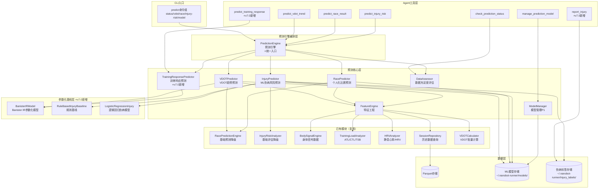

### 6.4 代码库结构

```
src/core/prediction/
├── __init__.py
├── models.py                    # 数据模型定义（frozen dataclass）
├── config.py                    # 预测配置（PredictionConfig）
├── feature_engine.py            # 特征工程（时序/负荷/身体信号特征）
├── data_assessor.py             # 数据充足度评估
├── vdot_predictor.py            # VDOT趋势预测引擎
├── race_predictor.py            # 个人化比赛成绩预测
├── injury_predictor.py          # ML伤病风险预测
├── training_response_predictor.py  # 训练响应预测 ⭐v7.0新增
├── model_manager.py             # 模型生命周期管理(P1)
├── prediction_engine.py         # 预测引擎（编排层，统一入口）
└── baselines/                   # 参数化基线层 ⭐v7.0新增
    ├── __init__.py
    ├── banister_ir.py           # Banister IR参数化模型
    ├── rule_based_injury.py     # 规则基线伤病模型
    └── logistic_injury.py       # 逻辑回归伤病模型

src/cli/commands/
└── predict.py                   # predict命令组（新增）

src/cli/handlers/
└── predict_handler.py           # 预测业务逻辑调用层（新增）

src/agents/tools.py              # 新增7个Agent工具（原5个+2个新增）
```

### 6.5 子模块设计

#### 6.5.1 特征工程（FeatureEngine）

**职责**: 从历史训练数据中提取ML模型所需的特征矩阵

**核心接口**:

| 方法                                | 参数                 | 返回值                 | 说明         |
| --------------------------------- | ------------------ | ------------------- | ---------- |
| `extract_vdot_features(days)`     | days: int          | VDOTFeatureMatrix   | 提取VDOT预测特征 |
| `extract_race_features()`         | 无                  | RaceFeatureMatrix   | 提取比赛预测特征   |
| `extract_injury_features(days)`   | days: int          | InjuryFeatureMatrix | 提取伤病风险特征   |
| `get_feature_names(feature_type)` | feature\_type: str | list\[str]          | 获取特征名称列表   |

**VDOT预测特征（≥5类）**:

| 特征类别    | 特征名                       | 计算方式        | 数据来源                 |
| ------- | ------------------------- | ----------- | -------------------- |
| 训练周期特征  | `weekly_volume_km`        | 最近7天总跑量     | SessionRepository    |
| 训练周期特征  | `volume_change_rate`      | 本周vs上周跑量变化率 | SessionRepository    |
| 季节性特征   | `month_sin` / `month_cos` | 月份的周期编码     | 时间戳                  |
| 身体适应特征  | `ctl_value`               | 当前CTL       | TrainingLoadAnalyzer |
| 身体适应特征  | `tsb_value`               | 当前TSB       | TrainingLoadAnalyzer |
| 负荷变化率特征 | `atl_ctl_ratio`           | ATL/CTL比率   | TrainingLoadAnalyzer |
| 负荷变化率特征 | `load_ramp_rate`          | 周负荷增长率      | TrainingLoadAnalyzer |
| 强度分布特征  | `high_intensity_pct`      | 高强度训练占比     | SessionRepository    |
| 强度分布特征  | `avg_intensity_factor`    | 平均强度因子      | SessionRepository    |
| 身体信号特征  | `fatigue_score`           | 当前疲劳度       | BodySignalEngine     |
| 身体信号特征  | `resting_hr_deviation`    | 静息心率偏差      | HRVAnalyzer          |

**伤病风险特征（≥4类）**:

| 特征类别     | 特征名                        | 计算方式        | 数据来源                 |
| -------- | -------------------------- | ----------- | -------------------- |
| 负荷变化率特征  | `atl_ctl_ratio`            | ATL/CTL比率   | TrainingLoadAnalyzer |
| 负荷变化率特征  | `weekly_load_change_pct`   | 周负荷变化百分比    | TrainingLoadAnalyzer |
| TSB趋势特征  | `tsb_consecutive_low_days` | TSB连续低于阈值天数 | TrainingLoadAnalyzer |
| TSB趋势特征  | `tsb_trend_slope`          | TSB趋势斜率     | TrainingLoadAnalyzer |
| 静息心率偏移特征 | `resting_hr_deviation_pct` | 静息心率vs基线偏差  | HRVAnalyzer          |
| 静息心率偏移特征 | `resting_hr_7d_trend`      | 7天静息心率趋势    | HRVAnalyzer          |
| HRV变化特征  | `hrv_rmssd_trend`          | RMSSD趋势方向   | HRVAnalyzer          |
| HRV变化特征  | `hrv_sdnn_deviation`       | SDNN偏差      | HRVAnalyzer          |

**复用关系**: 消费`TrainingLoadAnalyzer`、`HRVAnalyzer`、`BodySignalEngine`、`SessionRepository`、`VDOTCalculator`的计算结果，不重复实现计算逻辑

#### 6.5.2 数据充足度评估器（DataAssessor）

**职责**: 评估当前数据是否满足ML预测要求，提供数据质量报告和积累建议

**核心接口**:

| 方法                                         | 参数                    | 返回值                    | 说明             |
| ------------------------------------------ | --------------------- | ---------------------- | -------------- |
| `assess_sufficiency(prediction_type)`      | prediction\_type: str | DataSufficiencyReport  | 评估指定预测类型的数据充足性 |
| `get_full_status()`                        | 无                     | PredictionStatusReport | 获取所有预测类型的完整状态  |
| `get_accumulation_advice(prediction_type)` | prediction\_type: str | list\[str]             | 获取数据积累建议       |

**数据充足标准**:

| 预测类型   | 评估维度   | 最低标准         | 理想标准    | 理想数据量   |
| ------ | ------ | ------------ | ------- | ------- |
| vdot   | 时间跨度   | 18个月         | 24个月+   | 24个月+   |
| vdot   | 记录数量   | 400条         | 600条+   | 600条+   |
| vdot   | 训练频率   | 每周≥3次        | 每周≥4次   | 每周≥4次   |
| race   | 比赛记录   | 3次           | 5次+不同距离 | 5次+不同距离 |
| race   | 距离覆盖   | 全马/半马/10K≥1次 | 各距离≥2次  | 各距离≥2次  |
| injury | 时间跨度   | 18个月         | 24个月+   | 24个月+   |
| injury | 心率完整度  | >80%         | >90%    | >90%    |
| injury | 身体信号数据 | v0.19数据可用    | 完整覆盖    | 完整覆盖    |

**数据模型**:

```python
@dataclass(frozen=True)
class DataSufficiencyReport:
    prediction_type: str
    is_sufficient: bool
    overall_progress_pct: float
    dimensions: list[SufficiencyDimension]
    advice: list[str]

@dataclass(frozen=True)
class SufficiencyDimension:
    name: str
    current_value: float
    target_value: float
    is_met: bool
    progress_pct: float

@dataclass(frozen=True)
class PredictionStatusReport:
    vdot_status: DataSufficiencyReport
    race_status: DataSufficiencyReport
    injury_status: DataSufficiencyReport
    overall_ready_count: int
    advice: list[str]
```

#### 6.5.3 VDOT趋势预测引擎（VDOTPredictor）

**职责**: 基于ML模型预测VDOT变化趋势，数据不足时降级为基础线性回归

**核心接口**:

| 方法                         | 参数        | 返回值                 | 说明           |
| -------------------------- | --------- | ------------------- | ------------ |
| `predict(days)`            | days: int | VDOTPrediction      | 预测未来N天VDOT趋势 |
| `train_model()`            | 无         | ModelTrainingResult | 训练/更新ML模型    |
| `get_feature_importance()` | 无         | list\[VDOTFactor]   | 获取特征重要性      |

**预测流程**:

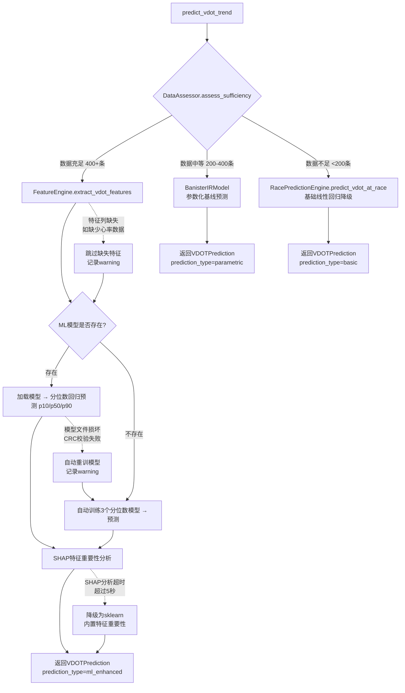

**异常处理策略说明**:

| 异常场景                    | 处理策略                               | 降级输出                                                                   |
| ----------------------- | ---------------------------------- | ---------------------------------------------------------------------- |
| 模型文件损坏（.joblib CRC校验失败） | 自动触发重训，不阻塞用户                       | `model_info`中标注`model_type="gradient_boosting"`，`shap_available=False` |
| 特征提取时数据列缺失（如缺少心率数据）     | 跳过缺失特征，继续预测                        | 缺失特征权重为0，预测结果`data_quality=INSUFFICIENT`                               |
| SHAP分析超时（>5秒）           | 降级为sklearn内置`feature_importances_` | `shap_available=False`，特征方向统一为`positive`                               |

**ML模型选型**: `sklearn.ensemble.GradientBoostingRegressor`

- 适合中小数据集（400-1000条）
- 内置特征重要性
- 抗过拟合（可配置正则化）
- 推理速度快（<100ms）
- **分位数回归**: 训练3个模型分别预测p10/p50/p90，输出置信区间
  ```python
  for alpha in [0.1, 0.5, 0.9]:
      model = GradientBoostingRegressor(
          loss='quantile', alpha=alpha,
          n_estimators=100, max_depth=5,
      )
  ```

**参数化基线**: `BanisterIRModel`

- 运动科学经典模型，参数可解释
- 数据200+条即可通过scipy.optimize拟合
- 预测精度介于线性回归和ML模型之间
- 训练时间<1秒

**降级策略**: 数据不足时调用`RacePredictionEngine.predict_vdot_at_race()`，返回`prediction_type="basic"`

#### 6.5.4 个人化比赛成绩预测（RacePredictor）

**职责**: 基于个人历史比赛数据训练个人化修正模型，替代Jack Daniels固定系数

**核心接口**:

| 方法                                | 参数                                   | 返回值                  | 说明            |
| --------------------------------- | ------------------------------------ | -------------------- | ------------- |
| `predict(distance_km, race_date)` | distance\_km: float, race\_date: str | RacePredictionResult | 预测比赛成绩        |
| `learn_personalization()`         | 无                                    | PersonalizationInfo  | 学习个人修正系数      |
| `fit_riegel_curve()`              | 无                                    | RiegelFitResult      | 拟合个人化Riegel曲线 |
| `record_prediction(record)`       | record: PredictionRecord             | 无                    | 记录预测结果用于校准    |

**预测流程**:

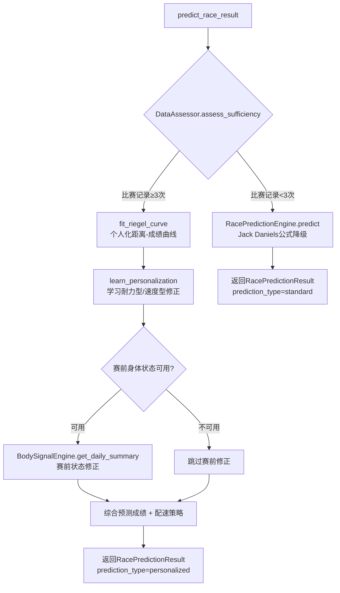

**Riegel曲线拟合**: 使用`scipy.optimize.curve_fit`拟合个人化指数

- 标准Riegel公式: T2 = T1 × (D2/D1)^1.06
- 个人化拟合: T2 = T1 × (D2/D1)^α，α为个人化指数
- 个人偏差范围: 0.95-1.15

**个人修正系数学习**: 基于`sklearn.linear_model.Ridge`

- 输入特征: 比赛距离、VDOT、训练周数、CTL
- 输出: 个人修正系数（耐力型/速度型/均衡型标签 + 修正值）

**赛前状态修正**: 消费`BodySignalEngine.get_daily_summary()`

- 疲劳度高 → 预测成绩下调2-5%
- 恢复状态GREEN → 预测成绩上调1-3%

#### 6.5.5 ML伤病风险预测（InjuryPredictor）

**职责**: 综合训练负荷时序特征和身体信号数据，使用ML分类模型预测伤病风险

**核心接口**:

| 方法                        | 参数        | 返回值                  | 说明         |
| ------------------------- | --------- | -------------------- | ---------- |
| `predict(days)`           | days: int | InjuryRiskPrediction | 预测未来N天伤病风险 |
| `train_model()`           | 无         | ModelTrainingResult  | 训练/更新ML模型  |
| `get_risk_timeline(days)` | days: int | list\[RiskTimePoint] | 获取风险时间线    |
| `get_risk_factors()`      | 无         | list\[RiskFactor]    | 获取可解释风险因子  |

**预测流程**:

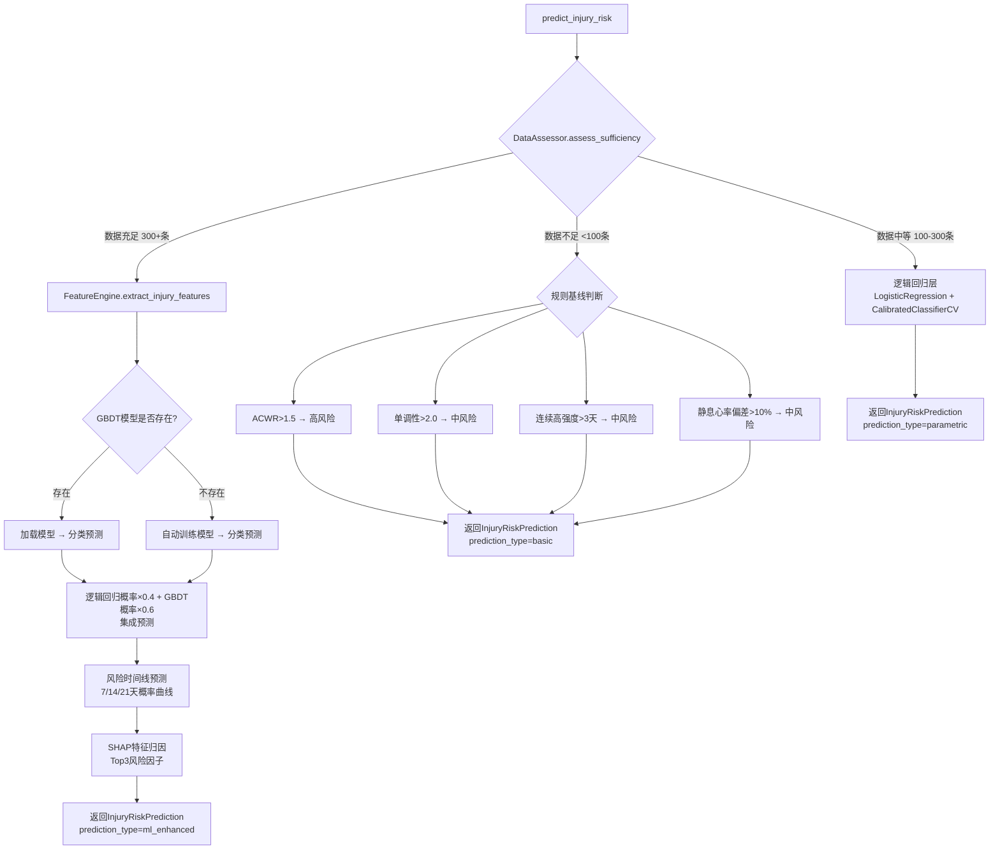

**ML模型选型**: 分层架构

- **L1 规则基线**（冷启动，无需训练数据）:
  - ACWR > 1.5 → 高风险
  - 训练单调性 > 2.0 → 中风险
  - 连续高强度训练 > 3天 → 中风险
  - 静息心率偏差 > 10% → 中风险
- **L2 逻辑回归层**（数据≥100条）:
  ```python
  LogisticRegression(penalty='l2', C=0.1, class_weight='balanced', max_iter=1000)
  CalibratedClassifierCV(model, method='isotonic', cv=3)
  ```
  - 8维核心特征：acwr, training\_monotony, training\_strain, consecutive\_hard\_days, fatigue\_score, resting\_hr\_deviation\_pct, weekly\_volume\_change\_pct, hrv\_deviation\_pct
  - CalibratedClassifierCV校准概率输出
- **L3 GBDT增强层**（数据≥300条）:
  ```python
  GradientBoostingClassifier(
      n_estimators=50, max_depth=3, learning_rate=0.05,
      min_samples_leaf=30,
  )
  ```
  - 集成策略：逻辑回归概率×0.4 + GBDT概率×0.6

**伤病标签体系** ⭐v7.0新增:

| 标签类型        | 来源                     | 可信度 | 存储位置                               |
| ----------- | ---------------------- | --- | ---------------------------------- |
| confirmed   | 用户通过report\_injury工具报告 | 高   | \~/.nanobot-runner/injury\_labels/ |
| suspected   | 训练中断>7天 + 疲劳评分>70      | 中   | 自动检测                               |
| unconfirmed | 其他异常模式                 | 低   | 自动检测                               |

**风险时间线预测**: 基于当前特征 + 未来负荷假设

- 输入: 当前特征 + 假设未来7/14/21天的负荷场景
- 输出: 各时间点的伤病概率（0-1）
- 预警阈值: 概率>60%触发预警

**降级策略**: 数据不足时调用`InjuryRiskAnalyzer.calculate_injury_risk()`，返回`prediction_type="basic"`

#### 6.5.6 模型管理器（ModelManager）- P1

**职责**: 管理个人ML预测模型的生命周期

**核心接口**:

| 方法                                    | 参数                             | 返回值                 | 说明         |
| ------------------------------------- | ------------------------------ | ------------------- | ---------- |
| `get_model_status(model_type)`        | model\_type: str               | ModelStatus         | 查看模型状态     |
| `train_model(model_type)`             | model\_type: str               | ModelTrainingResult | 手动触发训练     |
| `rollback_model(model_type, version)` | model\_type: str, version: str | bool                | 回滚到指定版本    |
| `check_auto_update()`                 | 无                              | None                | 检查是否需要增量学习 |

**模型存储结构**:

```
~/.nanobot-runner/models/
├── vdot_predictor/
│   ├── model_v1.joblib           # sklearn GBDT模型文件（分位数×3）
│   ├── metadata_v1.json          # 模型元数据（版本/训练样本/特征数/验证误差）
│   └── feature_importance_v1.json # SHAP特征重要性
├── vdot_predictor_banister/
│   ├── params_v1.json            # Banister IR拟合参数
│   └── metadata_v1.json          # 拟合元数据
├── race_predictor/
│   ├── model_v1.joblib
│   ├── metadata_v1.json
│   └── riegel_params_v1.json     # Riegel曲线拟合参数
├── injury_predictor/
│   ├── gbdt_model_v1.joblib      # GBDT分类模型
│   ├── lr_model_v1.joblib        # 逻辑回归模型
│   ├── metadata_v1.json
│   └── risk_thresholds_v1.json   # 风险阈值配置
├── prediction_history/
│   └── predictions.parquet        # 预测历史记录（用于校准）
~/.nanobot-runner/injury_labels/   # ⭐v7.0新增
├── confirmed/                     # 用户确认的伤病标签
│   └── {injury_id}.json
├── suspected/                     # 自动检测的可疑伤病
│   └── {injury_id}.json
└── unconfirmed/                   # 其他异常模式
    └── {injury_id}.json
```

**predictions.parquet Schema**:

| 列名                  | 类型    | 说明                                  | <br />          |
| ------------------- | ----- | ----------------------------------- | :-------------- |
| `prediction_date`   | str   | 预测日期(YYYY-MM-DD)                    | <br />          |
| `prediction_type`   | str   | 预测类型(vdot/race/injury)              | <br />          |
| `predicted_value`   | float | 预测值                                 | <br />          |
| `predicted_unit`    | str   | 预测值单位(vdot/seconds/probability)     | <br />          |
| `actual_value`      | float | null                                | 实际值(可空，实际发生后回填) |
| `deviation_pct`     | float | null                                | 偏差百分比(可空)       |
| `prediction_method` | str   | 预测方法(ml\_enhanced/parametric/basic) | <br />          |
| `model_version`     | str   | null                                | 模型版本(可空)        |
| `confidence`        | float | 置信度(0-1)                            | <br />          |

**分区策略**: 按年分片，与训练数据Parquet存储策略一致

**模型元数据格式**:

```python
@dataclass(frozen=True)
class ModelMetadata:
    model_type: str
    version: str
    trained_at: str
    training_samples: int
    feature_count: int
    validation_error: float
    model_algorithm: str
    sklearn_version: str
    quantile_models: bool  # ⭐v7.0: 是否使用分位数回归
    ensemble_weights: dict[str, float] | None  # ⭐v7.0: 集成权重（如LR:0.4, GBDT:0.6）
```

**增量学习策略**: 新数据积累≥50条时自动触发

- 使用`partial_fit`（若模型支持）或全量重训
- 异步执行，不阻塞CLI
- 训练完成后输出模型指标对比

#### 6.5.7 预测引擎（PredictionEngine）

**职责**: 编排层，统一入口，管理预测器实例和降级逻辑

**核心接口**:

| 方法                                                                 | 参数                                                     | 返回值                    | 说明           |
| ------------------------------------------------------------------ | ------------------------------------------------------ | ---------------------- | ------------ |
| `predict_vdot_trend(days)`                                         | days: int                                              | VDOTPrediction         | VDOT趋势预测     |
| `predict_race_result(distance_km, race_date)`                      | distance\_km: float, race\_date: str                   | RacePredictionResult   | 比赛成绩预测       |
| `predict_injury_risk(days)`                                        | days: int                                              | InjuryRiskPrediction   | 伤病风险预测       |
| `predict_training_response(session_type, duration_min, intensity)` | session\_type: str, duration\_min: int, intensity: str | TrainingResponse       | 训练响应预测 ⭐v7.0 |
| `report_injury(injury_type, severity, date)`                       | injury\_type: str, severity: str, date: str            | InjuryReportResult     | 伤病报告提交 ⭐v7.0 |
| `check_prediction_status()`                                        | 无                                                      | PredictionStatusReport | 数据充足度评估      |
| `manage_model(action, model_type)`                                 | action: str, model\_type: str                          | ModelManagementResult  | 模型管理         |

**编排逻辑**: 每个预测方法内部执行：数据充足性检查 → 选择预测器 → 执行预测 → 返回结果

### 6.6 数据模型

```python
@dataclass(frozen=True)
class VDOTPrediction:
    current_vdot: float
    predicted_vdot: float
    prediction_days: int
    confidence_interval: tuple[float, float]
    confidence: float
    trend_slope: float
    key_factors: list[VDOTFactor]
    data_quality: DataQuality
    prediction_type: str  # "ml_enhanced" / "parametric" / "basic"
    model_info: MLPredictionInfo | None

@dataclass(frozen=True)
class VDOTFactor:
    name: str
    weight: float
    direction: str  # "positive" / "negative"
    value: float

@dataclass(frozen=True)
class MLPredictionInfo:
    model_type: str  # "gradient_boosting" / "banister_ir" / "linear_regression"
    training_samples: int
    feature_count: int
    shap_available: bool
    quantile_models: bool  # ⭐v7.0: 是否使用分位数回归

@dataclass(frozen=True)
class RacePredictionResult:
    distance_km: float
    predicted_time: str  # HH:MM:SS
    predicted_time_seconds: float
    confidence: float
    best_case: str
    worst_case: str
    predicted_vdot: float
    pace_strategy: PaceStrategy | None
    prediction_type: str  # "personalized" / "standard"
    personalization_info: PersonalizationInfo | None

@dataclass(frozen=True)
class PersonalizationInfo:
    runner_type: str  # "endurance" / "speed" / "balanced"
    riegel_exponent: float
    correction_factor: float
    race_samples_count: int
    pre_race_adjustment: float

@dataclass(frozen=True)
class PaceStrategy:
    strategy_type: str  # "even" / "negative_split" / "conservative"
    splits: list[PaceSplit]

@dataclass(frozen=True)
class PaceSplit:
    segment: str  # "0-5km"
    pace: str  # M'SS"/km
    pace_seconds: float

@dataclass(frozen=True)
class InjuryRiskPrediction:
    risk_score: float  # 0-100
    risk_level: str  # "low" / "medium" / "high"
    risk_timeline: list[RiskTimePoint]
    acute_load_risk: AcuteLoadRisk | None
    chronic_risk: ChronicRisk | None
    body_signal_risk: BodySignalRisk | None
    top_risk_factors: list[RiskFactor]
    recommendations: list[str]
    data_quality: DataQuality
    prediction_type: str  # "ml_enhanced" / "parametric" / "basic"

@dataclass(frozen=True)
class RiskTimePoint:
    days_ahead: int
    risk_probability: float  # 0-1
    risk_level: str

@dataclass(frozen=True)
class RiskFactor:
    name: str
    contribution: float  # 0-1 贡献度
    current_value: float
    threshold_value: float
    direction: str  # "increasing" / "decreasing" / "stable"

@dataclass(frozen=True)
class AcuteLoadRisk:
    atl_ctl_ratio: float
    weekly_load_change_pct: float
    risk_contribution: float

@dataclass(frozen=True)
class ChronicRisk:
    tsb_consecutive_low_days: int
    resting_hr_deviation_pct: float
    risk_contribution: float

@dataclass(frozen=True)
class BodySignalRisk:
    fatigue_score: float
    recovery_status: str
    active_alerts: list[str]
    risk_contribution: float

@dataclass(frozen=True)
class PredictionRecord:
    prediction_date: str
    prediction_type: str
    predicted_value: float
    actual_value: float | None
    deviation_pct: float | None

@dataclass(frozen=True)
class TrainingResponse:
    """训练响应预测结果 ⭐v7.0新增"""
    session_type: str
    duration_min: int
    intensity: str
    predicted_vdot_impact: float
    predicted_fatigue_impact: float
    predicted_recovery_hours: float
    predicted_injury_risk_delta: float
    banister_fitness_delta: float
    banister_fatigue_delta: float
    prediction_type: str  # "parametric" / "basic"

@dataclass(frozen=True)
class InjuryReportResult:
    """伤病报告提交结果 ⭐v7.0新增"""
    injury_id: str
    injury_type: str
    severity: str
    date: str
    label_type: str  # "confirmed" / "suspected" / "unconfirmed"
    created_at: str
    success: bool

@dataclass(frozen=True)
class InjuryLabel:
    """伤病标签 ⭐v7.0新增"""
    injury_id: str
    injury_type: str  # "overuse" / "acute" / "illness"
    severity: str  # "mild" / "moderate" / "severe"
    start_date: str
    end_date: str | None
    label_type: str  # "confirmed" / "suspected" / "unconfirmed"
    affected_sessions: list[str]
    notes: str
```

### 6.7 配置Schema定义

遵循现有 `AppConfig` / `LLMConfig` / `BodySignalConfig` 的 `@dataclass(frozen=True)` 模式，新增 `PredictionConfig`：

```python
@dataclass(frozen=True)
class PredictionConfig:
    """ML预测配置

    遵循项目配置优先级：环境变量 > 配置文件 > 默认值
    环境变量前缀：NANOBOT_PREDICTION_

    Attributes:
        gb_n_estimators: GradientBoosting树数量
        gb_learning_rate: GradientBoosting学习率
        gb_max_depth: GradientBoosting最大深度
        vdot_min_months: VDOT预测ML增强最低数据月数
        vdot_min_records: VDOT预测ML增强最低记录条数
        vdot_parametric_min_records: VDOT预测参数化基线最低记录条数
        race_min_races: 比赛预测最低比赛记录次数
        injury_min_months: 伤病预测ML增强最低数据月数
        injury_min_records: 伤病预测ML增强最低记录条数
        injury_parametric_min_records: 伤病预测参数化基线最低记录条数
        injury_hr_completeness: 伤病预测心率完整度阈值
        shap_max_evals: SHAP采样最大评估次数
        shap_timeout_seconds: SHAP计算超时时间(秒)
        incremental_update_threshold: 增量学习触发阈值(新数据条数)
        risk_warning_threshold: 风险预警概率阈值
        pre_race_fatigue_adjustment_range: 赛前疲劳修正范围(下限, 上限)
        pre_race_recovery_adjustment_range: 赛前恢复修正范围(下限, 上限)
        banister_tau_fitness_default: Banister IR模型体能衰减时间常数默认值
        banister_tau_fatigue_default: Banister IR模型疲劳衰减时间常数默认值
        injury_lr_c: 逻辑回归正则化参数
        injury_lr_weight: 逻辑回归集成权重
        injury_gbdt_weight: GBDT集成权重
    """
    gb_n_estimators: int = 100
    gb_learning_rate: float = 0.1
    gb_max_depth: int = 5
    vdot_min_months: int = 18
    vdot_min_records: int = 400
    vdot_parametric_min_records: int = 200
    race_min_races: int = 3
    injury_min_months: int = 18
    injury_min_records: int = 300
    injury_parametric_min_records: int = 100
    injury_hr_completeness: float = 0.8
    shap_max_evals: int = 100
    shap_timeout_seconds: float = 5.0
    incremental_update_threshold: int = 50
    risk_warning_threshold: float = 0.6
    pre_race_fatigue_adjustment_range: tuple[float, float] = (0.02, 0.05)
    pre_race_recovery_adjustment_range: tuple[float, float] = (0.01, 0.03)
    banister_tau_fitness_default: float = 42.0
    banister_tau_fatigue_default: float = 10.0
    injury_lr_c: float = 0.1
    injury_lr_weight: float = 0.4
    injury_gbdt_weight: float = 0.6

    def __post_init__(self) -> None:
        if self.gb_n_estimators < 10:
            raise ValueError(f"gb_n_estimators 必须≥10，当前为{self.gb_n_estimators}")
        if not 0.0 < self.gb_learning_rate <= 1.0:
            raise ValueError(f"gb_learning_rate 必须在(0, 1]范围内，当前为{self.gb_learning_rate}")
        if self.gb_max_depth < 1:
            raise ValueError(f"gb_max_depth 必须≥1，当前为{self.gb_max_depth}")
        if self.vdot_min_months < 6:
            raise ValueError(f"vdot_min_months 必须≥6，当前为{self.vdot_min_months}")
        if not 0.0 < self.risk_warning_threshold <= 1.0:
            raise ValueError(f"risk_warning_threshold 必须在(0, 1]范围内，当前为{self.risk_warning_threshold}")
```

**配置存储位置**: `config.json` 中新增 `prediction` 字段

```json
{
  "version": "0.20.0",
  "data_dir": "~/.nanobot-runner/data",
  "prediction": {
    "gb_n_estimators": 100,
    "gb_learning_rate": 0.1,
    "gb_max_depth": 5,
    "vdot_min_months": 18,
    "vdot_min_records": 400,
    "vdot_parametric_min_records": 200,
    "race_min_races": 3,
    "injury_min_months": 18,
    "injury_min_records": 300,
    "injury_parametric_min_records": 100,
    "injury_hr_completeness": 0.8,
    "shap_max_evals": 100,
    "shap_timeout_seconds": 5.0,
    "incremental_update_threshold": 50,
    "risk_warning_threshold": 0.6,
    "banister_tau_fitness_default": 42.0,
    "banister_tau_fatigue_default": 10.0,
    "injury_lr_c": 0.1,
    "injury_lr_weight": 0.4,
    "injury_gbdt_weight": 0.6
  }
}
```

**环境变量覆盖**: `NANOBOT_PREDICTION_GB_N_ESTIMATORS=200`

**读取方式**: `ConfigManager.load_config()` 读取 `prediction` 字段，通过 `PredictionConfig.from_dict()` 创建实例

### 6.8 AppContext扩展

在`AppContext`中新增延迟属性，**严格遵循依赖注入规范**，所有核心组件通过AppContext属性获取，禁止直接实例化：

```python
@property
def training_load_analyzer(self) -> Any:
    """获取训练负荷分析器（v0.20.0暴露为AppContext属性）"""
    from src.core.calculators.training_load_analyzer import TrainingLoadAnalyzer

    analyzer = self.get_extension("training_load_analyzer")
    if analyzer is None:
        analyzer = TrainingLoadAnalyzer()
        self.set_extension("training_load_analyzer", analyzer)
    return analyzer

@property
def vdot_calculator(self) -> Any:
    """获取VDOT计算器（v0.20.0暴露为AppContext属性）"""
    from src.core.calculators.vdot_calculator import VDOTCalculator

    calculator = self.get_extension("vdot_calculator")
    if calculator is None:
        calculator = VDOTCalculator()
        self.set_extension("vdot_calculator", calculator)
    return calculator

@property
def race_prediction_engine(self) -> Any:
    """获取比赛预测引擎（v0.20.0暴露为AppContext属性）

    注: RacePredictionEngine为纯函数式工具类（无内部状态、无外部依赖），
    作为特例允许直接实例化。其他有状态或有外部依赖的核心组件必须通过AppContext属性注入。
    """
    from src.core.calculators.race_prediction import RacePredictionEngine

    engine = self.get_extension("race_prediction_engine")
    if engine is None:
        engine = RacePredictionEngine()
        self.set_extension("race_prediction_engine", engine)
    return engine

@property
def injury_risk_analyzer(self) -> Any:
    """获取伤病风险分析器（v0.20.0暴露为AppContext属性）"""
    from src.core.calculators.injury_risk_analyzer import InjuryRiskAnalyzer

    analyzer = self.get_extension("injury_risk_analyzer")
    if analyzer is None:
        analyzer = InjuryRiskAnalyzer()
        self.set_extension("injury_risk_analyzer", analyzer)
    return analyzer

@property
def prediction_engine(self) -> Any:
    """获取预测引擎（v0.20.0新增）"""
    from src.core.prediction.prediction_engine import PredictionEngine
    from src.core.prediction.data_assessor import DataAssessor
    from src.core.prediction.feature_engine import FeatureEngine
    from src.core.prediction.vdot_predictor import VDOTPredictor
    from src.core.prediction.race_predictor import RacePredictor
    from src.core.prediction.injury_predictor import InjuryPredictor
    from src.core.prediction.model_manager import ModelManager

    engine = self.get_extension("prediction_engine")
    if engine is None:
        from src.core.prediction.baselines.banister_ir import BanisterIRModel
        from src.core.prediction.baselines.rule_based_injury import RuleBasedInjuryBaseline
        from src.core.prediction.baselines.logistic_injury import LogisticInjuryModel
        from src.core.prediction.training_response_predictor import TrainingResponsePredictor

        feature_engine = FeatureEngine(
            session_repo=self.session_repo,
            training_load_analyzer=self.training_load_analyzer,
            hrv_analyzer=self.body_signal_engine.hrv_analyzer,
            body_signal_engine=self.body_signal_engine,
            vdot_calculator=self.vdot_calculator,
        )
        data_assessor = DataAssessor(session_repo=self.session_repo)
        model_manager = ModelManager(models_dir=Path(self.config.data_dir) / "models")
        banister_model = BanisterIRModel()
        rule_baseline = RuleBasedInjuryBaseline()
        logistic_model = LogisticInjuryModel()
        vdot_predictor = VDOTPredictor(
            feature_engine=feature_engine,
            data_assessor=data_assessor,
            model_manager=model_manager,
            race_engine=self.race_prediction_engine,
            banister_model=banister_model,
        )
        race_predictor = RacePredictor(
            feature_engine=feature_engine,
            data_assessor=data_assessor,
            model_manager=model_manager,
            race_engine=self.race_prediction_engine,
            body_signal_engine=self.body_signal_engine,
        )
        injury_predictor = InjuryPredictor(
            feature_engine=feature_engine,
            data_assessor=data_assessor,
            model_manager=model_manager,
            injury_analyzer=self.injury_risk_analyzer,
            rule_baseline=rule_baseline,
            logistic_model=logistic_model,
        )
        training_response_predictor = TrainingResponsePredictor(
            banister_model=banister_model,
        )
        engine = PredictionEngine(
            vdot_predictor=vdot_predictor,
            race_predictor=race_predictor,
            injury_predictor=injury_predictor,
            training_response_predictor=training_response_predictor,
            data_assessor=data_assessor,
            model_manager=model_manager,
        )
        self.set_extension("prediction_engine", engine)
    return engine
```

**依赖注入规范说明**: 所有核心组件（`TrainingLoadAnalyzer`、`VDOTCalculator`、`RacePredictionEngine`、`InjuryRiskAnalyzer`）均通过 `self.xxx` 属性注入，而非直接实例化。这确保了测试时可 Mock，且与 `body_signal_engine` 的实现模式一致。

### 6.9 CLI命令设计

新增`predict`命令组:

```bash
# 数据充足度检查
uv run nanobotrun predict status

# VDOT趋势预测（自动选择ML/基础模型）
uv run nanobotrun predict vdot --days 30

# 比赛成绩预测（个人化模型）
uv run nanobotrun predict race --distance marathon --date 2024-12-01

# 伤病风险预测（ML模型）
uv run nanobotrun predict injury-risk --days 21

# 模型管理(P1)
uv run nanobotrun predict model status
uv run nanobotrun predict model train --type vdot
```

**命令参数**:

| 命令                     | 参数           | 类型  | 默认值  | 说明                   |
| ---------------------- | ------------ | --- | ---- | -------------------- |
| `predict status`       | 无            | -   | -    | 数据充足度评估              |
| `predict vdot`         | `--days`     | int | 30   | 预测天数                 |
| `predict race`         | `--distance` | str | 必填   | marathon/half/10k/5k |
| `predict race`         | `--date`     | str | None | 比赛日期(YYYY-MM-DD)     |
| `predict injury-risk`  | `--days`     | int | 21   | 预测天数                 |
| `predict model status` | `--type`     | str | all  | 模型类型                 |
| `predict model train`  | `--type`     | str | 必填   | vdot/race/injury     |

### 6.10 Agent工具设计

| 工具名                               | 功能       | 输入参数                                                   | 输出类型                   |
| --------------------------------- | -------- | ------------------------------------------------------ | ---------------------- |
| `predict_vdot_trend`              | VDOT趋势预测 | days: int                                              | VDOTPrediction         |
| `predict_race_result`             | 比赛成绩预测   | distance: str, date: str                               | RacePredictionResult   |
| `predict_injury_risk`             | 伤病风险预测   | days: int                                              | InjuryRiskPrediction   |
| `check_prediction_status`         | 数据充足度评估  | 无                                                      | PredictionStatusReport |
| `manage_prediction_model`         | 模型管理     | action: str, model\_type: str                          | ModelManagementResult  |
| `report_injury` ⭐v7.0             | 伤病报告提交   | injury\_type: str, severity: str, date: str            | InjuryReportResult     |
| `predict_training_response` ⭐v7.0 | 训练响应预测   | session\_type: str, duration\_min: int, intensity: str | TrainingResponse       |

### 6.11 核心数据流

#### VDOT趋势预测数据流

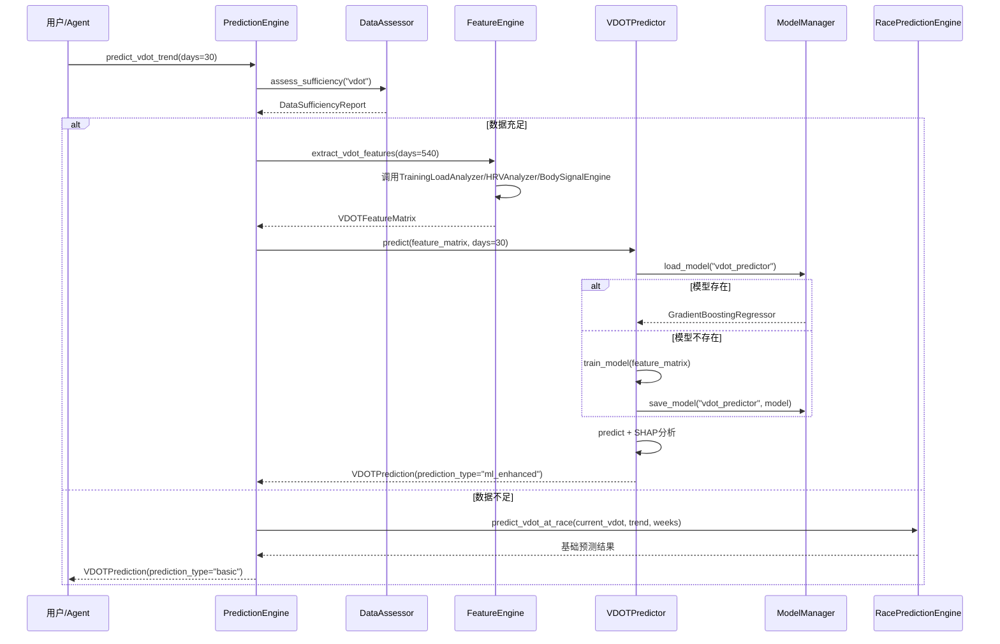

#### 比赛成绩预测数据流

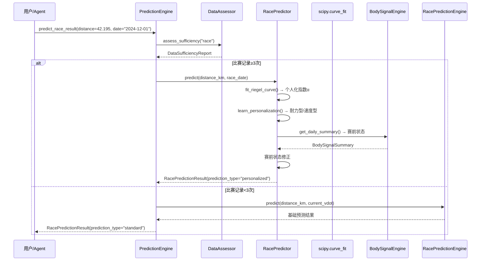

### 6.12 降级策略设计

**核心原则**: 数据充足时自动启用ML增强预测，数据中等时使用参数化基线，数据不足时降级为基础预测，绝不阻塞用户使用

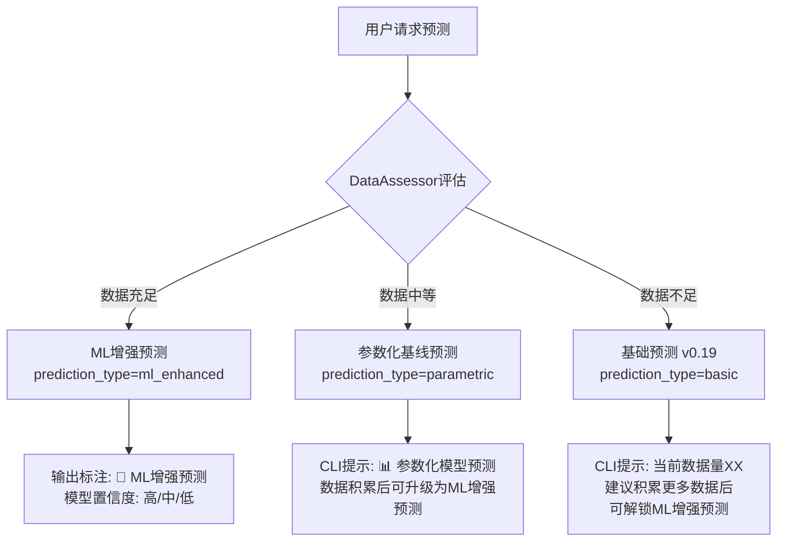

**降级映射表**:

| 预测类型   | L1 ML增强预测器                       | L2 参数化基线                                    | L3 基础预测器                                     | 降级条件                              |
| ------ | -------------------------------- | ------------------------------------------- | -------------------------------------------- | --------------------------------- |
| VDOT趋势 | VDOTPredictor (GradientBoosting) | BanisterIRModel                             | RacePredictionEngine.predict\_vdot\_at\_race | L1:400+条 / L2:200-400条 / L3:<200条 |
| 比赛成绩   | RacePredictor (个人化)              | —                                           | RacePredictionEngine.predict                 | L1:3次+比赛 / L3:<3次                 |
| 伤病风险   | InjuryPredictor (LR+GBDT集成)      | LogisticRegression + CalibratedClassifierCV | InjuryRiskAnalyzer + 规则基线                    | L1:300+条 / L2:100-300条 / L3:<100条 |

### 6.13 性能设计

| 操作      | 性能目标 | 优化策略                 |
| ------- | ---- | -------------------- |
| ML预测推理  | <2秒  | 模型预加载、sklearn推理优化    |
| 特征提取    | <3秒  | LazyFrame批量计算、缓存中间结果 |
| 模型训练    | <60秒 | 增量学习、异步训练、进度提示       |
| 数据充足度评估 | <1秒  | 统计查询优化               |
| SHAP分析  | <5秒  | 采样近似（max\_evals=100） |

### 6.14 安全设计

| 安全维度   | 措施                          | 说明                                |
| ------ | --------------------------- | --------------------------------- |
| 模型文件安全 | 模型加载时校验sklearn版本兼容性         | 防止版本不匹配导致加载异常                     |
| 数据隐私   | 所有ML计算在本地执行                 | 不上传任何数据到云端                        |
| 模型注入防护 | 模型文件路径校验                    | 仅加载`~/.nanobot-runner/models/`下文件 |
| 预测结果标注 | ML预测结果必须标注`prediction_type` | 区分ML增强与基础预测，避免误导                  |

### 6.15 风险与缓解

| 风险          | 等级   | 缓解措施                                    | 残留风险             |
| ----------- | ---- | --------------------------------------- | ---------------- |
| ML模型过拟合     | 🔴 高 | ①设置最小数据门槛(400条) ②正则化配置 ③交叉验证 ④冷启动使用基础预测 | 个人数据量边界场景可能仍有过拟合 |
| sklearn版本兼容 | 🟡 中 | ①模型元数据记录sklearn版本 ②加载时版本校验 ③版本不兼容时自动重训  | 重训耗时，用户体验中断      |
| 训练耗时阻塞CLI   | 🟡 中 | ①首次预测时自动训练，后续加载 ②异步训练(P1增量学习) ③训练进度提示   | 首次使用等待时间较长       |
| SHAP计算耗时    | 🟡 中 | ①采样近似(max\_evals=100) ②缓存特征重要性结果 ③异步计算  | 采样近似可能降低解释精度     |
| 数据门槛过高      | 🟡 中 | ①明确分层，基础预测继续可用 ②提供数据积累指导 ③解锁进度可视化       | 部分用户长期无法使用ML功能   |
| 特征工程复杂度     | 🟡 中 | ①FeatureEngine统一管理 ②特征计算复用已有模块 ③单元测试覆盖  | 新增特征可能引入bug      |

### 6.16 缓存机制

参考 body\_signal\_engine 的同日缓存模式（5.3.4节），prediction 模块增加两级缓存：

**PredictionEngine 同日缓存**:

```python
class PredictionEngine:
    _cache_date: str | None = None
    _cache_vdot: VDOTPrediction | None = None
    _cache_race: RacePredictionResult | None = None
    _cache_injury: InjuryRiskPrediction | None = None

    def predict_vdot_trend(self, days: int) -> VDOTPrediction:
        today = date.today().isoformat()
        cache_key = f"vdot_{days}"
        if self._cache_date == today and self._get_cache(cache_key) is not None:
            return self._get_cache(cache_key)
        result = self._compute_vdot_prediction(days)
        self._cache_date = today
        self._set_cache(cache_key, result)
        return result
```

**FeatureEngine 特征矩阵缓存**:

```python
class FeatureEngine:
    _feature_cache: dict[str, Any] = {}

    def extract_vdot_features(self, days: int) -> VDOTFeatureMatrix:
        today = date.today().isoformat()
        cache_key = f"vdot_features_{days}_{today}"
        if cache_key in self._feature_cache:
            return self._feature_cache[cache_key]
        result = self._compute_vdot_features(days)
        self._feature_cache[cache_key] = result
        return result
```

**缓存失效策略**:

| 触发条件  | 失效范围        | 实现方式                                     |
| ----- | ----------- | ---------------------------------------- |
| 日期变更  | 所有同日缓存      | `_cache_date != today` 时清空               |
| 新数据导入 | 所有预测缓存+特征缓存 | `data import` 命令后调用 `invalidate_cache()` |
| 模型重训  | 对应预测类型缓存    | `model train` 命令后清空对应缓存                  |
| 配置变更  | 所有缓存        | `PredictionConfig` 变更时清空                 |

### 6.17 冷启动策略

**核心前提**: 冷启动用户已经拥有足够的数据（18个月+/400+条），首次训练需要一定时间，这是可接受的。

**首次预测自动训练流程**:

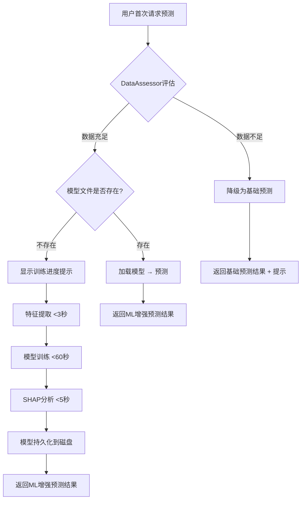

**Rich 进度条提示**:

```python
from rich.progress import Progress

with Progress() as progress:
    task1 = progress.add_task("[cyan]提取特征...", total=100)
    feature_matrix = feature_engine.extract_vdot_features(days)
    progress.update(task1, completed=100)

    task2 = progress.add_task("[cyan]训练模型...", total=100)
    model = predictor.train_model(feature_matrix)
    progress.update(task2, completed=100)

    task3 = progress.add_task("[cyan]分析特征重要性...", total=100)
    shap_result = predictor.analyze_shap(model, feature_matrix)
    progress.update(task3, completed=100)
```

**predict status 一键训练提示**:

```
📊 预测能力解锁状态
━━━━━━━━━━━━━━━━━━━━━━━━━━━━━━━━━━━━
VDOT趋势ML预测: ✅ 已解锁 (24个月数据)
比赛成绩个人化: ✅ 已解锁 (5次比赛记录)
伤病风险ML预测: ✅ 已解锁 (20个月数据)

💡 提示: 运行 `nanobotrun predict model train --type all` 可预先训练所有模型
         首次训练约需1-2分钟，后续预测将直接加载模型（<2秒）
```

**冷启动时间预估**:

| 阶段     | 预估耗时       | 说明           |
| ------ | ---------- | ------------ |
| 特征提取   | 1-3秒       | 取决于数据量       |
| 模型训练   | 30-60秒     | 取决于数据量和模型复杂度 |
| SHAP分析 | 3-5秒       | 采样近似         |
| 模型持久化  | <1秒        | joblib序列化    |
| **总计** | **35-70秒** | 仅首次，后续<2秒    |

### 6.18 模型评估指标

| 预测类型     | 任务类型 | 评估指标            | 目标值       |
| -------- | ---- | --------------- | --------- |
| VDOT趋势预测 | 回归   | MAE（平均绝对误差）     | <2.0 VDOT |
| VDOT趋势预测 | 回归   | R²（决定系数）        | >0.7      |
| 比赛成绩预测   | 回归   | MAE             | 全马<8分钟    |
| 比赛成绩预测   | 回归   | MAPE（平均绝对百分比误差） | <5%       |
| 伤病风险预测   | 分类   | Recall（召回率）     | >0.75     |
| 伤病风险预测   | 分类   | Precision（精确率）  | >0.6      |
| 伤病风险预测   | 分类   | F1 Score        | >0.65     |

**评估策略**:

| 策略     | 说明                            |
| ------ | ----------------------------- |
| 交叉验证   | 使用5折时间序列交叉验证（TimeSeriesSplit） |
| 滚动评估   | 每次新数据导入后重新评估模型表现              |
| 预测历史对比 | 记录每次预测vs实际结果，计算滚动MAE          |
| 模型退化检测 | MAE持续上升时触发自动重训                |

### 6.19 测试策略

#### 6.19.1 单元测试

| 测试对象             | 覆盖重点                | Mock策略                                                       | 目标覆盖率 |
| ---------------- | ------------------- | ------------------------------------------------------------ | ----- |
| FeatureEngine    | 特征提取逻辑、缺失特征容错       | Mock SessionRepository/TrainingLoadAnalyzer/BodySignalEngine | ≥85%  |
| DataAssessor     | 数据充足度判定、阈值校验        | Mock SessionRepository                                       | ≥90%  |
| VDOTPredictor    | ML预测流程、降级逻辑         | Mock FeatureEngine/DataAssessor/ModelManager                 | ≥85%  |
| RacePredictor    | 个人化预测、Riegel拟合、赛前修正 | Mock FeatureEngine/DataAssessor/BodySignalEngine             | ≥85%  |
| InjuryPredictor  | ML分类预测、风险时间线、降级逻辑   | Mock FeatureEngine/DataAssessor/ModelManager                 | ≥85%  |
| ModelManager     | 模型存储/加载/回滚/增量学习     | Mock 文件系统                                                    | ≥80%  |
| PredictionEngine | 编排逻辑、缓存机制           | Mock 所有Predictor和DataAssessor                                | ≥80%  |
| PredictionConfig | 参数校验、默认值            | 无需Mock                                                       | 100%  |

**测试目录结构**:

```
tests/unit/core/prediction/
├── __init__.py
├── test_feature_engine.py
├── test_data_assessor.py
├── test_vdot_predictor.py
├── test_race_predictor.py
├── test_injury_predictor.py
├── test_model_manager.py
├── test_prediction_engine.py
└── test_config.py
```

#### 6.19.2 集成测试

| 测试场景                | 验证内容                                          |
| ------------------- | --------------------------------------------- |
| PredictionEngine端到端 | 从Parquet读取到生成VDOTPrediction的完整流程              |
| CLI命令集成             | `predict vdot/race/injury-risk` 命令正确调用Handler |
| Agent工具集成           | 5个Agent工具正确调用核心模块并返回JSON                      |
| 降级流程集成              | 数据不足时正确降级为基础预测                                |
| 缓存机制集成              | 同日多次查询复用缓存结果                                  |

#### 6.19.3 跨模块集成测试

> 以下场景覆盖v0.20.0新增模块与现有模块的交互，确保数据流和接口兼容性。

| 场景ID     | 场景名称                                     | 涉及模块                           | 验证内容                                                                         | 风险覆盖               |
| -------- | ---------------------------------------- | ------------------------------ | ---------------------------------------------------------------------------- | ------------------ |
| CROSS-01 | 新数据导入后预测缓存失效                             | storage → prediction           | 执行`data import`后，同日预测缓存自动清空，再次查询时重新计算                                        | 用户导入新数据后看到旧预测      |
| CROSS-02 | BodySignalEngine → InjuryPredictor 数据流   | body\_signal → prediction      | BodySignalEngine输出的`fatigue_score`/`recovery_status`正确传递至InjuryPredictor特征工程 | 身体信号数据格式不匹配        |
| CROSS-03 | CLI predict 命令 → PredictionEngine → 降级链路 | cli → prediction → calculators | 数据不足时，CLI命令正确触发降级链路，输出格式与ML增强预测一致                                            | 降级时数据丢失或格式错误       |
| CROSS-04 | Agent 工具 → PredictionEngine → LLM 超时处理   | agents → prediction → llm      | Agent调用predict工具时，预测超时（>5s）不中断对话，返回降级结果                                      | Agent对话中预测超时导致对话中断 |

#### 6.19.4 边界测试

| 场景           | 验证内容                                    |
| ------------ | --------------------------------------- |
| 空数据          | 所有预测器返回 `data_quality=EMPTY` 的正确降级结果    |
| 单点数据         | 特征提取返回最小特征集，`data_quality=INSUFFICIENT` |
| 模型加载失败       | joblib文件损坏时自动重训，不抛出异常                   |
| SHAP超时       | 超过5秒时跳过SHAP，返回 `shap_available=False`   |
| 特征提取失败       | 单个特征提取失败时跳过该特征，记录warning                |
| sklearn版本不兼容 | 版本校验失败时自动重训                             |
| 缓存失效         | 新数据导入后缓存正确清空                            |

#### 6.19.5 性能测试

| 指标      | 目标   | 测试方法                     |
| ------- | ---- | ------------------------ |
| ML预测推理  | <2秒  | 模型加载后推理计时                |
| 特征提取    | <3秒  | 500条年度数据全量特征提取           |
| 模型训练    | <60秒 | 400条数据训练GradientBoosting |
| SHAP分析  | <5秒  | 采样近似(max\_evals=100)     |
| 数据充足度评估 | <1秒  | SessionRepository统计查询    |

### 6.20 SHAP降级策略

在6.12性能设计基础上，补充SHAP分析的超时降级方案：

```python
def analyze_shap_with_timeout(
    model: Any,
    feature_matrix: Any,
    config: PredictionConfig,
) -> tuple[list[VDOTFactor], bool]:
    """带超时的SHAP分析，超时时降级为sklearn内置特征重要性"""
    try:
        import shap

        explainer = shap.TreeExplainer(model)
        shap_values = explainer.shap_values(
            feature_matrix,
            check_additivity=False,
        )
        factors = _extract_factors_from_shap(shap_values, feature_matrix)
        return factors, True  # shap_available=True
    except TimeoutError:
        logger.warning("SHAP分析超时，降级为sklearn内置特征重要性")
        importances = model.feature_importances_
        factors = _extract_factors_from_importances(importances, feature_matrix)
        return factors, False  # shap_available=False
```

**降级层级对比**:

| 层级           | 方法                             | 精度 | 耗时     | 触发条件      |
| ------------ | ------------------------------ | -- | ------ | --------- |
| L1 完整SHAP    | TreeExplainer + 完整数据           | 高  | 3-5秒   | 默认        |
| L2 采样SHAP    | TreeExplainer + max\_evals=100 | 中  | 1-3秒   | 数据量>1000条 |
| L3 sklearn内置 | feature\_importances\_         | 低  | <100ms | SHAP超时或失败 |

### 6.21 CLI Help文案与输出示例

**predict 命令组 Help 文案**:

| 子命令                    | Help文案                     |
| ---------------------- | -------------------------- |
| `predict`              | "ML增强预测命令组（数据充足时自动启用ML模型）" |
| `predict status`       | "检查数据充足度，查看ML预测解锁状态"       |
| `predict vdot`         | "预测VDOT趋势（自动选择ML/基础模型）"    |
| `predict race`         | "预测比赛成绩（个人化模型，基于历史比赛数据）"   |
| `predict injury-risk`  | "预测伤病风险（ML模型，3周前置预警）"      |
| `predict model`        | "管理ML预测模型（训练/状态/回滚）"       |
| `predict model status` | "查看模型训练状态和评估指标"            |
| `predict model train`  | "手动触发模型训练"                 |

**`predict vdot --days 30`** **输出示例**:

```
🧠 ML增强预测 | 模型置信度: 高
━━━━━━━━━━━━━━━━━━━━━━━━━━━━━━━━━━━━━━━━━━━━━━━━━
当前VDOT:    45.2
预测VDOT:    46.8 (30天后)
趋势斜率:    +0.05 VDOT/周
置信区间:    [45.5, 48.1]

📊 关键影响因素:
  ✅ CTL体能基础     权重35%  方向↑  当前值52.3
  ✅ 周跑量变化率     权重25%  方向↑  当前值+8%
  ⚠️ 疲劳度评分       权重20%  方向↓  当前值42.5

模型信息: GradientBoosting | 训练样本523条 | 特征数12 | SHAP可用
```

**`predict status`** **输出示例**:

```
📊 预测能力解锁状态
━━━━━━━━━━━━━━━━━━━━━━━━━━━━━━━━━━━━━━━━━━━━━━━━━
VDOT趋势ML预测:   ✅ 已解锁  24个月/523条记录
比赛成绩个人化:    🔒 锁定    当前1次比赛记录，还需2次
伤病风险ML预测:    ✅ 已解锁  20个月/心率完整度92%

💡 建议: 继续参加比赛积累记录，解锁个人化比赛预测
```

***

## 7. v0.21-v0.25 模块骨架设计

> 以下为产品演进路线图（v0.21-v0.25）的架构骨架，详细设计将在对应版本开发时展开。
>
> **注意**: 7.1-7.5章节为骨架设计，当前仅定义模块边界和目录结构，不包含接口定义和数据模型。
> 详细架构设计将在对应版本启动前补充。

### 7.1 v0.21 数字孪生（Digital Twin）

**核心概念**: 构建跑者状态向量，支持What-If推演和计划对比

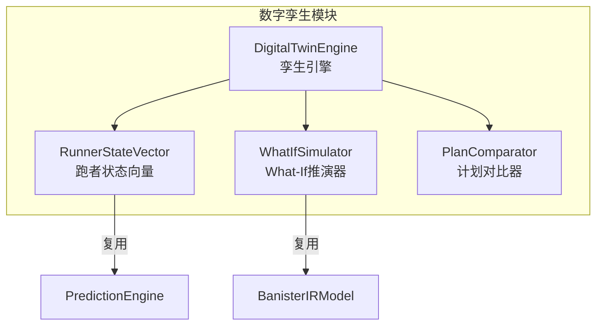

**跑者状态向量**: 融合体能/疲劳/技术/心理四维度的综合状态描述

- 体能维度: VDOT, CTL, 有氧基础
- 疲劳维度: ATL, TSB, HRV偏差, 疲劳评分
- 技术维度: 配速稳定性, 步频趋势
- 心理维度: RPE趋势, 训练规律性

**What-If推演**: 基于Banister IR模型模拟不同训练方案的效果

- 输入: 假设计划（周训练量/强度/分布）
- 输出: 预测VDOT变化曲线、疲劳累积、伤病风险变化

**计划对比**: 两个训练方案的A/B对比

- 对比维度: VDOT提升速率、疲劳峰值、伤病风险、恢复时间

**模块结构**:

```
src/core/twin/
├── __init__.py
├── models.py                    # RunnerStateVector, WhatIfResult, PlanComparison
├── twin_engine.py               # DigitalTwinEngine
├── state_vector.py              # RunnerStateVector构建
├── whatif_simulator.py          # What-If推演
└── plan_comparator.py           # 计划对比
```

### 7.2 v0.22 多视角验证（Multi-Perspective Review）

**核心概念**: 条件性触发Coach/Doctor双视角审查，增强预测可信度

**多智能体架构约束**（基于multiagents.md分析）:

- nanobot框架仅支持主-从后台任务模式，不支持并行多Agent交互
- **基准方案**: 单Agent角色切换（Coach/Doctor角色prompt注入）
- **升级方案**: 若nanobot支持多Agent交互，可启用并行双视角审查

**触发条件**（条件性，非默认启用）:

- 伤病风险预测为"high"时 → 自动触发Doctor视角审查
- VDOT预测趋势异常（突然下降>1.0）→ 自动触发Coach视角审查
- 用户主动请求 → 触发双视角审查

**模块结构**:

```
src/core/review/
├── __init__.py
├── models.py                    # ReviewResult, PerspectiveReview
├── review_engine.py             # ReviewEngine
├── coach_reviewer.py            # Coach视角审查
└── doctor_reviewer.py           # Doctor视角审查
```

### 7.3 v0.23 决策追踪（Decision Tracking）

**核心概念**: 记录AI决策过程，支持结果回填和预测校准

**核心能力**:

- 决策日志: 记录每次预测/建议的输入、模型、输出、置信度
- 结果回填: 实际结果发生后回填，计算预测偏差
- 预测校准: 基于历史偏差校准模型输出
- 校准报告: 定期输出预测准确性报告

**模块结构**:

```
src/core/tracking/
├── __init__.py
├── models.py                    # DecisionLog, CalibrationResult
├── decision_logger.py           # DecisionLogger
├── result_backfill.py           # ResultBackfiller
└── calibration.py               # ModelCalibrator
```

### 7.4 v0.24 个性化学习（Personalized Learning）

**核心概念**: 分析个人训练响应性，实现模型个人化进化

**核心能力**:

- 训练响应性分析: 量化个体对训练刺激的响应差异
- 个人修正系数: 基于历史数据修正通用模型参数
- 模型微调: 在通用模型基础上进行个人化微调
- 进化报告: 输出个人化模型进化历程

**模块结构**:

```
src/core/personalization/
├── __init__.py
├── models.py                    # PersonalizationProfile, ResponsivenessResult
├── responsiveness_analyzer.py   # 训练响应性分析
├── personal_model.py            # 个人化模型管理
└── evolution_report.py          # 进化报告
```

### 7.5 v0.25 自适应进化（Adaptive Evolution）

**核心概念**: 优化提示策略，实现自动进化触发

**核心能力**:

- 提示策略优化: 基于用户反馈优化AI提示策略
- 自动进化触发: 检测到模型性能退化时自动触发重训
- 进化守护: 监控模型性能指标，确保进化方向正确
- 回滚机制: 进化失败时回滚到上一版本

**模块结构**:

```
src/core/evolution/
├── __init__.py
├── models.py                    # EvolutionEvent, EvolutionGuard
├── evolution_engine.py          # EvolutionEngine
├── prompt_optimizer.py          # 提示策略优化
├── auto_trigger.py              # 自动进化触发
└── evolution_guard.py           # 进化守护
```

***

## 8. 数据目录总览

> 统一展示 `~/.nanobot-runner/` 完整目录结构，标注各子目录的引入版本和用途。

```
~/.nanobot-runner/
├── config.json                    # 全局配置文件 (v0.9+)
├── data/                          # Parquet训练数据存储 (v0.5+)
│   └── YYYY/
│       └── sessions_YYYY.parquet
├── models/                        # ML模型存储 (v0.20新增)
│   ├── vdot_predictor/
│   ├── vdot_predictor_banister/
│   ├── race_predictor/
│   ├── injury_predictor/
│   └── prediction_history/
│       └── predictions.parquet
├── predictions/                   # 预测记录 (v0.20新增)
│   └── {date}_prediction.json
├── injury_labels/                 # 伤病标签 (v0.20新增)
│   ├── confirmed/
│   ├── suspected/
│   └── unconfirmed/
├── cache/                         # 特征缓存和预测缓存 (v0.20新增)
├── decisions/                     # 决策日志 (v0.23预留)
│   └── YYYY-MM/
│       └── decisions_YYYY-MM.parquet
├── outcomes/                      # 结果记录 (v0.23预留)
│   └── YYYY-MM/
│       └── outcomes_YYYY-MM.parquet
└── backup/                        # 手动备份目录 (v0.9+)
```

| 子目录              | 引入版本  | 用途              | 估算大小      |
| ---------------- | ----- | --------------- | --------- |
| `data/`          | v0.5  | Parquet按年分片训练数据 | \~50MB/年  |
| `models/`        | v0.20 | ML模型文件和元数据      | 5-50MB/模型 |
| `predictions/`   | v0.20 | 预测历史记录          | \~1MB/年   |
| `injury_labels/` | v0.20 | 伤病标签分类存储        | \~1MB/年   |
| `cache/`         | v0.20 | 特征矩阵缓存和预测同日缓存   | \~10MB    |
| `decisions/`     | v0.23 | 决策日志Parquet按月分片 | \~5MB/年   |
| `outcomes/`      | v0.23 | 结果记录Parquet按月分片 | \~2MB/年   |
| `backup/`        | v0.9  | 手动备份压缩包         | 按需        |

***

## 9. 部署架构

**环境隔离**: 开发/生产共用本地环境，通过配置文件区分\
**部署方式**: `uv run nanobotrun` 本地运行\
**数据目录**: `~/.nanobot-runner/` (可配置)\
**备份策略**: `nanobotrun system backup` 手动触发

***

## 10. 变更记录

| 版本     | 日期         | 变更内容                                                                                                                                                                                                                                                                                                                                                                        |
| ------ | ---------- | --------------------------------------------------------------------------------------------------------------------------------------------------------------------------------------------------------------------------------------------------------------------------------------------------------------------------------------------------------------------------- |
| v7.1.0 | 2026-05-08 | **评审整改**：修正v0.19功能状态标注为v0.20（CLI命令层和Agent工具层）；补充数据充足标准"理想数据量"列(HIGH-4)；新增跨模块集成测试4个场景(HIGH-6)；PredictionEngine流程图补充异常处理分支(MEDIUM-2)；新增"数据目录总览"章节(MEDIUM-3)；ADR-004补充默认参数/校准策略/对比评估(MEDIUM-5)；v0.21-v0.25骨架设计增加声明(HIGH-5)；RacePredictionEngine添加无状态注释(HIGH-3)；对齐需求规格v8.1                                                                                                      |
| v7.0.0 | 2026-05-08 | 对齐产品规划v9.0+产品演进设计v1.0：引入Banister IR参数化基线(ADR-004)、统一prediction\_type三段式(ml\_enhanced/parametric/basic)、采纳分位数回归(ADR-005)、采纳分层伤病风险模型(ADR-006)、新增2个Agent工具(report\_injury/predict\_training\_response)、新增伤病标签体系(confirmed/suspected/unconfirmed)、补充v0.21-v0.25模块骨架设计、明确多智能体架构约束、模型文件格式统一为.joblib、新增TrainingResponse/InjuryReportResult/InjuryLabel数据模型、PredictionConfig新增6个配置项 |
| v6.1.0 | 2026-05-07 | 基于架构评审报告v0.20.0整改：修复AppContext依赖注入违规(CRITICAL-2)、新增PredictionConfig配置Schema(HIGH-1)、新增预测模块测试策略(HIGH-2)、新增缓存机制(HIGH-3)、修正模型存储路径为\~/.nanobot-runner/models/(HIGH-4)、新增冷启动策略(HIGH-5)、补充predictions.parquet Schema(MEDIUM-1)、补充模型评估指标(MEDIUM-2)、补充SHAP降级策略(MEDIUM-3)、补充CLI Help文案与输出示例(MEDIUM-4)                                                                                |
| v5.1.0 | 2026-05-05 | 基于架构评审报告v0.19.0更新：新增数据缺失降级策略(Q1)、边界条件处理规范(Q2)、BodySignalConfig配置Schema(Q3)、RPE数据输入路径(Q4)、测试策略(Q5)、CLI命令组职责边界(Q6)；整合建议改进项：data\_source字段(S1)、缓存机制(S2)、周对比增强(S3)、RecoveryStatus共用模块(S4)                                                                                                                                                                                       |
| v5.0.0 | 2026-05-05 | 新增v0.19.0身体信号分析模块架构；精简已完成版本文档；更新整体架构图                                                                                                                                                                                                                                                                                                                                       |
| v4.2.0 | 2026-05-03 | 新增v0.17.0 AI底座能力全面激活架构设计                                                                                                                                                                                                                                                                                                                                                    |
| v4.0.0 | 2026-04-17 | 新增v0.13-v0.16架构设计                                                                                                                                                                                                                                                                                                                                                           |

