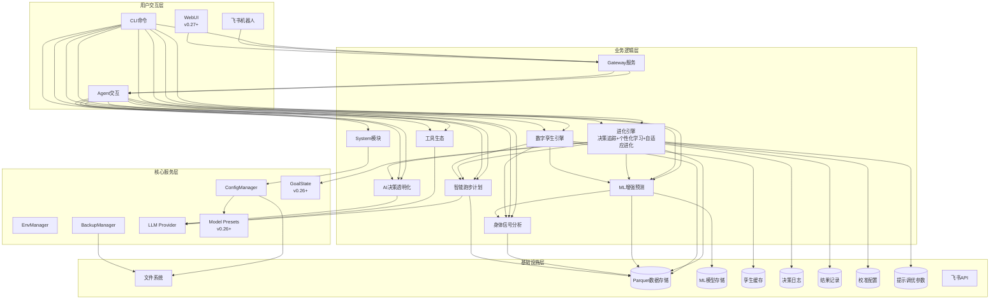
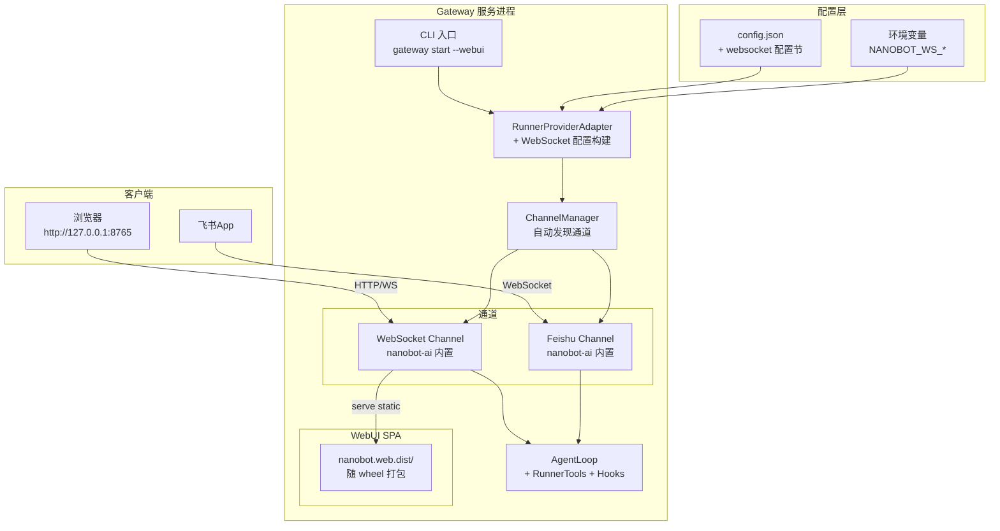
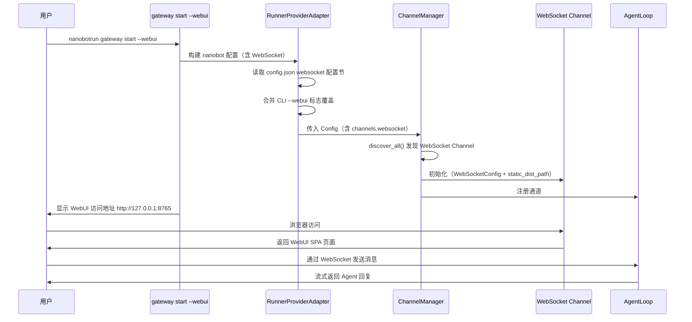
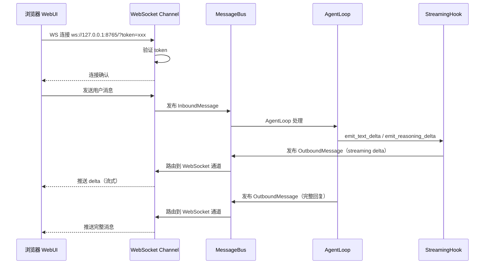

# 架构设计说明书

> **文档版本**: v16.0.0
> **设计日期**: 2026-04-17
> **更新日期**: 2026-05-26
> **当前基线**: v0.26.0
> **版本目标**: v0.27.0 WebUI基础 🏗️ 设计中
> **需求来源**: REQ_需求规格说明书.md (v12.1)
> **对齐依据**: 产品规划方案.md (v11.0)

> **项目性质说明**: 本项目为**个人使用且个人开发的项目**，所有设计和需求均围绕单人开发和使用场景展开。

***

## 1. 执行摘要

### 1.1 架构演进路线

| 阶段 | 版本 | 核心目标 | 状态 |
|------|------|----------|------|
| 技术底座 | v0.5-v0.9.5 | 数据导入/存储/分析/CLI/依赖注入/SDK化 | ✅ 完成 |
| 智能计划 | v0.10-v0.12 | 自适应训练计划、LLM调整、目标预测 | ✅ 完成 |
| 工具与智能 | v0.13-v0.15 | MCP协议、AI自我诊断、决策透明化 | ✅ 完成 |
| 模块化重构 | v0.16-v0.17 | Core子模块拆分、Hook组合、Subagent、Cron提醒 | ✅ 完成 |
| 可视化导出 | v0.18 | 终端图表(plotext)、多格式导出 | ✅ 完成 |
| 身体信号 | v0.19 | HRV分析、疲劳度评估、身体信号解读 | ✅ 完成 |
| 预测未来 | v0.20 | ML增强预测（VDOT趋势/比赛成绩/伤病风险） | ✅ 完成 |
| 数字孪生 | v0.21 | 跑者状态向量、What-If推演、计划对比 | ✅ 完成 |
| 质量收口 | v0.22 | UAT验证、缺陷收敛、质量兜底 | ✅ 完成 |
| 决策追踪 | v0.23 | 决策日志、结果回填、预测校准 | ✅ 完成 |
| 个性化学习 | v0.24 | 训练响应性分析、个人化模型进化 | ✅ 完成 |
| 自适应进化 | v0.25 | 提示策略优化、自动进化触发 | ✅ 完成 |
| 底座升级+新特性 | v0.26 | nanobot-ai 0.2.0升级、GoalState、推理可见化、Model Presets | ✅ 完成 |
| WebUI基础 | v0.27 | AI对话交互、基础设置 | 📋 规划中 |
| WebUI数据可视化 | v0.28 | 跑步数据图表 | 📋 规划中 |
| WebUI管理控制台 | v0.29 | 训练计划管理、进化引擎控制台 | 📋 规划中 |
| 稳定版 | v1.0 | API冻结、性能优化、完整文档 | 📋 远期规划 |

### 1.2 核心设计原则

| 原则 | 策略 |
|------|------|
| **模块化** | 按功能域划分子模块，接口通信 |
| **依赖注入** | AppContext统一管理核心组件 |
| **配置驱动** | Pydantic-Settings + 环境变量覆盖 |
| **类型安全** | frozen dataclass + 类型注解 + mypy |
| **LazyFrame优先** | Polars查询仅在最终输出时collect() |
| **防御性设计** | 数据缺失降级策略 + 边界条件处理 + DataQuality标识 |
| **ML渐进增强** | 参数化基线→ML增强，数据不足自动降级，绝不阻塞用户 |
| **可解释ML** | SHAP特征归因 + prediction_type标注 + 置信度量化 |

### 1.3 设计决策索引

| ADR | 决策 | 版本 |
|-----|------|------|
| ADR-007 | DecisionLogHook直接继承AgentHook，独立注册消除状态竞争 | v0.23 |
| ADR-008 | 校准引擎采用线性修正(corrected=raw×scale)+EMA(α=0.7)更新，幅度上限±10% | v0.24 |
| ADR-009 | 进化触发器采用规则引擎+异步执行(threading.Thread daemon=True) | v0.25 |
| ADR-010 | 提示调优采用4维连续参数空间(语气/信息密度/推荐激进/数据驱动) | v0.25 |
| ADR-015 | WebSocket通道配置采用config.json配置节+RunnerProviderAdapter翻译 | v0.27 |
| ADR-016 | WebUI启用采用CLI --webui标志+config.json双重控制 | v0.27 |
| ADR-017 | WebSocket安全认证默认启用token+token_issue_path短期令牌 | v0.27 |
| ADR-011 | 底座升级采用保守兼容策略：先升级依赖→全量测试→逐个修复→确认零回归后再适配新特性 | v0.26 |
| ADR-012 | GoalState通过SOUL.md注入使用指导+DecisionLogHook读取metadata实现，不新增独立模块 | v0.26 |
| ADR-013 | 推理可见化通过DecisionLogHook重写emit_reasoning()实现，推理片段追加到内部缓冲区并在finalize_content()写入DecisionLog | v0.26 |
| ADR-014 | Model Presets通过config.json配置预设，CLI仅提供查看命令，切换使用nanobot-ai内置/model命令 | v0.26 |

***

## 2. 技术栈选型

| 类别 | 选型 | 版本 | 理由 |
|------|------|------|------|
| 语言 | Python | ≥3.11,<3.13 | 现有技术栈，生态成熟 |
| Agent底座 | nanobot-ai | ≥0.2.0 | AI Agent框架，提供AgentHook/GoalState/WebUI/Model Presets等能力 |
| CLI | Typer + Rich | Latest | 类型安全 + 美观输出 |
| 配置 | Pydantic-Settings | Latest | 类型安全 + 环境变量 |
| 存储 | Apache Parquet | via pyarrow | 列式存储，高性能查询 |
| 计算 | Polars | 0.20+ | LazyFrame优化，高性能 |
| 解析 | fitparse | Latest | FIT文件解析 |
| 可视化 | plotext | Latest | 终端内图表渲染 |
| 包管理 | uv | Latest | 快速依赖管理 |
| ML核心 | scikit-learn | ≥1.5.0 | 轻量ML库，适配本地单人场景 |
| 科学计算 | scipy | ≥1.10.0 | Riegel曲线拟合、统计检验 |
| 特征解释 | shap | ≥0.48.0 | SHAP值特征重要性分析 |
| 模型持久化 | joblib | ≥1.3.0 | sklearn模型序列化 |

***

## 3. 系统架构设计

### 3.1 整体架构图



### 3.2 CLI命令体系

| 命令组 | 命令 | 功能 | 版本 |
|--------|------|------|------|
| system | `init / migrate / validate / config / backup` | 系统管理 | v0.9+ |
| data | `import / stats` | 数据导入与统计 | v0.5+ |
| analysis | `vdot / load / hr-drift / hrv / hr-recovery / fatigue / recovery / compare` | 数据分析+身体信号 | v0.8+ |
| plan | `create / status / feedback` | 训练计划 | v0.10+ |
| report | `weekly / monthly` | 训练报告 | v0.9+ |
| viz | `vdot / load / hr-zones` | 数据可视化 | v0.18+ |
| export | `sessions` | 数据导出 | v0.18+ |
| transparency | `trace / status / insight` | AI透明化 | v0.15+ |
| status | `today / weekly` | 身体状态速览 | v0.19 |
| predict | `status / vdot / race / injury-risk / model` | ML增强预测 | v0.20 |
| twin | `status / simulate / compare` | 数字孪生 | v0.21 |
| evolution | `history / feedback / accuracy / fidelity / status / calibration / response / triggers / report / tune` | 进化引擎 | v0.23-v0.25 |
| model | `list` | Model Presets 查看 | v0.26 |
| gateway | `start` | 飞书/WebUI Gateway | v0.9+ |

***

## 4. 已完成模块摘要

> 以下模块已完成开发，仅保留架构要点。详细设计见Git历史版本。

| 模块 | 核心组件 | 关键设计 |
|------|----------|----------|
| **配置管理** (v0.9.4) | InitWizard, MigrationEngine, ConfigValidator, WorkspaceManager | 无配置模式启动、优先级: 环境变量>配置文件>默认值 |
| **智能跑步计划** (v0.10-0.12) | TrainingPlanGenerator, LLMPlanAdjuster, GoalPredictionEngine | LLM驱动计划调整、目标达成预测<3s |
| **工具生态** (v0.13) | MCPConfigHelper, ToolManager, WeatherService, MapService | MCP协议集成、本地工具优先 |
| **AI决策透明化** (v0.15) | TransparencyEngine, ObservabilityManager, TraceLogger | 分层展示、数据溯源、全链路追踪 |
| **Core模块化** (v0.16) | diagnosis/memory/personality/skills/validate/tools六大子模块 | 按功能域拆分、接口隔离 |
| **AI底座激活** (v0.17) | Hook组合系统、Subagent架构、异步用户确认、Cron训练提醒 | 流式输出、LLM超时控制 |
| **可视化与导出** (v0.18) | PlotextRenderer, CSV/JSON/ParquetExporter | 终端图表渲染、多格式导出 |
| **飞书通知** (v0.9+) | GatewayServer, FeishuAuth, FeishuNotifier, FeishuCalendar | 异步非阻塞、Token自动刷新 |
| **底座升级+新特性** (v0.26) | DecisionLogHook扩展(推理缓冲区+GoalState读取), ModelHandler, model list命令 | 推理可见化(emit_reasoning缓冲区写入DecisionLog)、GoalState集成(SOUL.md指导+metadata读取)、Model Presets(config.json预设+CLI查看)、nanobot-ai≥0.2.0 |

***

## 5. 身体信号分析模块（v0.19.0）✅ 已完成

核心架构: HRVAnalyzer + FatigueAssessor + RecoveryMonitor + BodySignalEngine，复用TrainingLoadAnalyzer/HeartRateAnalyzer。关键设计: 同日缓存、RPE三级输入路径、TSB截断[-50,50]、静息心率突增>10%预警、DataQuality三级降级。

***

## 6. ML增强预测模块（v0.20.0）✅ 已完成

核心架构: PredictionEngine(统一入口) + VDOT/Race/Injury三个Predictor + FeatureEngine + ModelManager。关键设计: 三层降级策略(ML增强→参数化基线→基础预测)、不确定性量化(分位数回归p10/p50/p90)、伤病风险GBDT集成(4:6加权)、特征矩阵缓存、PredictionEngine同日缓存。

***

## 7. 数字孪生引擎模块（v0.21.0）✅ 已完成

核心架构: DigitalTwinEngine(薄编排层) + StateVectorBuilder(5维度: 体能/负荷/身体信号/风险/训练模式) + WhatIfSimulator(逐周推演)，复用PredictionEngine/BodySignalEngine。关键设计: 状态向量TTL=24h、三层推演降级(ML增强5%/参数化8%/基础12%每周衰减)、计划对比评分(VDOT提升40%+伤病风险35%+恢复余量25%)。

***

## 8. 进化引擎模块（v0.23-v0.25）✅ 已完成

进化引擎由三个版本递增式构建，形成决策→校准→优化闭环。关键架构决策: ADR-007(DecisionLogHook独立继承AgentHook)、ADR-008(线性修正corrected=raw×scale+EMA α=0.7)、ADR-009(规则引擎4触发+异步执行)、ADR-010(4维提示调优参数空间)。

**v0.23 决策追踪**: EvolutionEngine + DecisionLogger + OutcomeCollector + EvolutionStore(Parquet按月分片) + DecisionLogHook。DecisionLog+OutcomeRecord分离模型，execution_status五态，fidelity公式。

**v0.24 个性化学习**: ResponseAnalyzer + CalibrationEngine(偏差修正，幅度上限±10%) + ModelEvolver。Fidelity升级为三维度(体积0.40+强度0.30+时间0.30)，无侵入原则(PredictionEngine零修改)。

**v0.25 自适应进化**: EvolutionController(VDOT误差/连续拒绝/新数据积累/月度复盘4触发规则，check_triggers<50ms) + PromptTuner(4维: 语气/信息密度/推荐激进/数据驱动，地板保护aggressive≥0.1) + EvolutionReporter。

### 8.1 代码库结构

```
src/core/evolution/
├── __init__.py
├── models.py                 # DecisionLog, OutcomeRecord, EvolutionAction, PromptTuningParams等
├── config.py                 # EvolutionConfig (Pydantic-Settings)
├── evolution_store.py        # Parquet+JSON统一存储编排
├── decision_logger.py        # 决策日志记录器 (v0.23)
├── outcome_collector.py      # 结果收集器 (v0.23)
├── evolution_engine.py       # 进化引擎编排层 (v0.23-v0.25递增扩展)
├── decision_log_hook.py      # Agent生命周期钩子 (v0.23)
├── response_analyzer.py      # 训练响应性分析器 (v0.24)
├── calibration_engine.py     # 校准引擎 (v0.24)
├── model_evolver.py          # 模型进化器 (v0.24)
├── evolution_controller.py   # 进化触发控制器 (v0.25)
├── prompt_tuner.py           # 提示参数调优器 (v0.25)
└── evolution_reporter.py     # 进化报告生成器 (v0.25)
src/agents/tools_evolution.py
src/cli/commands/evolution.py
src/cli/handlers/evolution_handler.py
tests/unit/core/evolution/
```

### 8.2 数据目录

```
~/.nanobot-runner/
├── data/                     # 运动数据(Parquet按年分片)
├── models/                   # ML模型存储(joblib)
├── twin/                     # 孪生缓存(state_vector.json)
├── decisions/                # 决策日志(Parquet按月分片)
├── outcomes/                 # 结果记录(Parquet按月分片)
├── calibrations/             # 校准配置(JSON)
└── tuning/                   # 提示调优参数(JSON)
    ├── prompt_params.json
    └── trigger_state.json
```

***

## 9. 底座升级与新特性适配（v0.26.0）✅ 已完成

核心架构: 不新增独立子模块，通过扩展现有模块适配 nanobot-ai 0.2.0 三项新特性。关键设计: ADR-011(保守升级策略: 先升级依赖→全量测试→逐个修复→确认零回归)、ADR-012(GoalState通过SOUL.md注入使用指导+DecisionLogHook的after_iteration()读取metadata实现)、ADR-013(推理可见化通过DecisionLogHook重写emit_reasoning()/emit_reasoning_end()，推理片段追加到_reasoning_buffer缓冲区，finalize_content()写入DecisionLog)、ADR-014(Model Presets通过config.json配置预设+CLI提供model list查看命令+nanobot-ai内置/model命令切换)。核心变更: DecisionLogHook新增_reasoning_buffer推理缓冲区+goal_state_raw()读取目标状态+_current_goal_state追踪、DecisionLog数据模型新增goal_state可选字段、CLI新增model list命令、pyproject.toml升级nanobot-ai>=0.2.0。

***

## 10. v0.27.0 WebUI基础

### 10.1 模块概述

v0.27.0 核心目标是**配置驱动启用 nanobot-ai 内置 WebUI**，不新增独立子模块，通过扩展现有模块（ProviderAdapter + Gateway CLI + ConfigManager）实现 WebUI 基础能力。

**设计原则**：最小变更原则 — 仅修改配置构建层和 CLI 入口层，不修改 Agent 工具逻辑、不修改 nanobot-ai 前端代码。

### 10.2 需求映射

| 需求编号 | 需求 | 架构实现方式 |
|----------|------|-------------|
| REQ-D-11 | WebUI 启动 | RunnerProviderAdapter 构建 WebSocket 通道配置 → ChannelManager 自动发现并启用 |
| REQ-D-12 | 工具调用 | 复用现有 Agent 工具注册机制，WebSocket 通道共享同一 AgentLoop |
| REQ-D-13 | 流式输出 | 复用 StreamingHook + WebSocket 通道原生 streaming 支持 |
| REQ-D-14 | 多会话管理 | nanobot-ai WebUI 原生支持，无需额外开发 |
| REQ-D-15 | 基础设置 | nanobot-ai WebUI 设置面板原生支持，需确保 Model Presets 配置正确 |
| REQ-D-16 | 品牌自定义 | AgentDefaults 设置 bot_name="Nanobot-Runner" / bot_icon="🏃‍♂️" |
| REQ-D-17 | WebSocket 通道配置 | config.json 新增 `websocket` 配置节 + RunnerProviderAdapter 翻译 |
| REQ-D-18 | 安全认证 | 默认 127.0.0.1 + token 认证 + token_issue_path 短期令牌 |
| REQ-D-19 | Gateway 命令增强 | `gateway start --webui` 标志，启用时自动注入 WebSocket 配置 |
| REQ-D-20 | 统一会话模式 | config.json 可选 `unified_session` 字段，默认关闭 |

### 10.3 系统架构图



### 10.4 数据流设计

#### 10.4.1 WebUI 启动流程



#### 10.4.2 WebSocket 消息流



### 10.5 配置 Schema 设计

#### 10.5.1 config.json 新增 `websocket` 配置节

```json
{
  "websocket": {
    "enabled": false,
    "host": "127.0.0.1",
    "port": 8765,
    "path": "/",
    "token": "",
    "token_issue_path": "/token",
    "token_issue_secret": "",
    "token_ttl_s": 300,
    "websocket_requires_token": true,
    "streaming": true,
    "allow_from": ["*"],
    "max_message_bytes": 37748736,
    "ping_interval_s": 20.0,
    "ping_timeout_s": 20.0
  }
}
```

**配置项说明**：

| 字段 | 类型 | 默认值 | 说明 |
|------|------|--------|------|
| `enabled` | bool | false | 是否启用 WebSocket 通道（`--webui` 标志可覆盖为 true） |
| `host` | str | "127.0.0.1" | 监听地址，默认仅本地访问 |
| `port` | int | 8765 | 监听端口 |
| `path` | str | "/" | WebSocket 升级路径 |
| `token` | str | "" | 静态认证令牌，为空时由 token_issue_path 动态签发 |
| `token_issue_path` | str | "/token" | 短期令牌签发 HTTP 端点路径 |
| `token_issue_secret` | str | "" | 令牌签发密钥，本地访问可留空 |
| `token_ttl_s` | int | 300 | 短期令牌有效期（秒） |
| `websocket_requires_token` | bool | true | 是否强制要求 token 认证 |
| `streaming` | bool | true | 是否启用流式输出 |
| `allow_from` | list[str] | ["*"] | 允许连接的 client_id 列表 |
| `max_message_bytes` | int | 37748736 | 最大消息字节数（~36MB） |
| `ping_interval_s` | float | 20.0 | 心跳间隔（秒） |
| `ping_timeout_s` | float | 20.0 | 心跳超时（秒） |

#### 10.5.2 环境变量覆盖

| 环境变量 | 对应配置 | 说明 |
|----------|---------|------|
| `NANOBOT_WS_ENABLED` | websocket.enabled | 覆盖 WebSocket 启用状态 |
| `NANOBOT_WS_HOST` | websocket.host | 覆盖监听地址 |
| `NANOBOT_WS_PORT` | websocket.port | 覆盖监听端口 |
| `NANOBOT_WS_TOKEN` | websocket.token | 覆盖静态令牌 |
| `NANOBOT_WS_TOKEN_SECRET` | websocket.token_issue_secret | 覆盖令牌签发密钥 |

### 10.6 模块变更设计

#### 10.6.1 RunnerProviderAdapter 变更

**变更文件**：`src/core/provider_adapter.py`

**变更内容**：

1. `__init__` 新增 `webui_enabled: bool = False` 参数，接收 CLI `--webui` 标志
2. `_build_nanobot_config_from_runner()` 方法新增 WebSocket 通道配置构建逻辑
3. `AgentsConfig(defaults={...})` 中新增 `bot_name`/`bot_icon`/`unified_session` 字段

```python
# 伪代码 - __init__ 新增参数
def __init__(self, runner_config: ConfigManager, webui_enabled: bool = False) -> None:
    self._runner_config = runner_config
    self._webui_enabled = webui_enabled
    self._nanobot_config: Any | None = None
    self._provider_instance: Any | None = None

# 伪代码 - agents defaults 新增品牌字段
agents = AgentsConfig(
    defaults={
        "model": llm_dict.get("model", "gpt-4o-mini"),
        "bot_name": "Nanobot-Runner",
        "bot_icon": "🏃‍♂️",
        "unified_session": ws_config.get("unified_session", False),
    },
)

# 伪代码 - 在 channels dict 构建中新增 websocket 配置
if self._webui_enabled or ws_config.get("enabled", False):
    channels["websocket"] = {
        "enabled": True,
        "host": ws_config.get("host", "127.0.0.1"),
        "port": ws_config.get("port", 8765),
        "path": ws_config.get("path", "/"),
        "token": ws_config.get("token", ""),
        "token_issue_path": ws_config.get("token_issue_path", "/token"),
        "token_issue_secret": ws_config.get("token_issue_secret", ""),
        "token_ttl_s": ws_config.get("token_ttl_s", 300),
        "websocket_requires_token": ws_config.get("websocket_requires_token", True),
        "streaming": ws_config.get("streaming", True),
        "allow_from": ws_config.get("allow_from", ["*"]),
    }
```

**设计决策**：
- 品牌字段（bot_name/bot_icon）写入 nanobot 配置的 `agents.defaults` dict，不修改项目 `AgentDefaults` dataclass
- `--webui` 标志通过构造参数传递，避免环境变量或全局状态的隐式依赖
- WebSocket 配置从 config.json 的 `websocket` 节读取，与飞书通道配置模式一致

#### 10.6.2 Gateway CLI 变更

**变更文件**：`src/cli/commands/gateway.py`

**变更内容**：
1. `start()` 命令新增 `--webui` 标志
2. 创建 `RunnerProviderAdapter` 时传入 `webui_enabled` 参数
3. 启动时显示 WebUI 访问地址和 token 获取方式
4. WebSocket 通道启用时，显示 WebUI 专属交互提示

```python
@app.command()
def start(
    port: int = typer.Option(18790, "--port", "-p", help="Gateway端口"),
    webui: bool = typer.Option(False, "--webui", help="启用WebUI（WebSocket通道）"),
    verbose: bool = typer.Option(False, "--verbose", "-v", help="详细输出"),
    logs: bool = typer.Option(False, "--logs", "-l", help="启用日志输出"),
) -> None:
    # ...
    adapter = RunnerProviderAdapter(context.config, webui_enabled=webui)
    # ...
    # 启动后显示 WebUI 访问信息
    if webui:
        ws_host = ws_config.get("host", "127.0.0.1")
        ws_port = ws_config.get("port", 8765)
        console.print(f"[green]✓[/green] WebUI: http://{ws_host}:{ws_port}")
```

#### 10.6.3 ConfigManager 变更

**变更文件**：`src/core/config/manager.py`

**变更内容**：新增 `get_websocket_config() -> dict[str, Any]` 方法

```python
# 伪代码 - 新增方法
def get_websocket_config(self) -> dict[str, Any]:
    """读取 WebSocket 通道配置
    
    从 config.json 的 websocket 配置节读取，
    支持环境变量覆盖（NANOBOT_WS_*）。
    
    Returns:
        dict[str, Any]: WebSocket 配置字典，配置节不存在时返回空 dict
    """
    ws_config = self._config.get("websocket", {})
    # 环境变量覆盖
    if env_enabled := os.getenv("NANOBOT_WS_ENABLED"):
        ws_config["enabled"] = env_enabled.lower() in ("true", "1", "yes")
    if env_host := os.getenv("NANOBOT_WS_HOST"):
        ws_config["host"] = env_host
    if env_port := os.getenv("NANOBOT_WS_PORT"):
        ws_config["port"] = int(env_port)
    if env_token := os.getenv("NANOBOT_WS_TOKEN"):
        ws_config["token"] = env_token
    if env_secret := os.getenv("NANOBOT_WS_TOKEN_SECRET"):
        ws_config["token_issue_secret"] = env_secret
    return ws_config
```

#### 10.6.4 品牌与会话配置

**变更文件**：`src/core/provider_adapter.py`

**变更内容**：品牌字段（bot_name/bot_icon）和统一会话模式（unified_session）通过 nanobot 配置的 `agents.defaults` dict 传递，**不修改**项目 `AgentDefaults` dataclass。

**理由**：`bot_name`/`bot_icon`/`unified_session` 是 nanobot-ai `AgentsConfig.defaults` 的原生字段，直接写入 nanobot 配置即可生效，无需在项目侧 dataclass 中冗余定义。

### 10.7 ADR 决策记录

#### ADR-015：WebSocket 通道配置方式

**背景**：需要为 nanobot-ai 内置 WebSocket 通道提供配置，使其能启用 WebUI。

**决策**：在项目 config.json 新增 `websocket` 配置节，由 RunnerProviderAdapter 翻译为 nanobot WebSocketConfig。

**影响**：
- ✅ 与飞书通道配置模式一致，配置驱动
- ✅ 用户无需直接操作 nanobot 配置文件
- ✅ 支持环境变量覆盖
- ❌ 需要修改 ConfigManager 和 RunnerProviderAdapter

**替代方案**：
- 直接修改 `~/.nanobot/config.json`：破坏项目配置封装，不采用
- 仅通过 CLI 标志配置：无法持久化配置，不采用
- 仅通过环境变量配置：配置项过多，不采用

#### ADR-016：WebUI 启用方式

**背景**：用户需要一种便捷方式启用 WebUI，同时不影响现有飞书通道行为。

**决策**：采用 `gateway start --webui` CLI 标志 + config.json `websocket.enabled` 双重控制。CLI 标志优先级高于配置文件。

**影响**：
- ✅ 显式启用，不影响现有行为（默认不启用）
- ✅ 配置文件可持久化启用状态
- ✅ CLI 标志适合临时启用场景
- ❌ 两个启用入口可能造成混淆（文档需明确优先级）

**替代方案**：
- 仅 config.json 控制：需要用户手动编辑配置文件，不够便捷
- 仅 CLI 标志控制：无法持久化，每次启动需手动指定
- 新增独立 `webui` 命令：与 gateway 职责重叠，不采用

#### ADR-017：安全认证策略

**背景**：WebSocket 通道需要认证机制防止未授权访问。

**决策**：默认启用 token 认证（`websocket_requires_token=True`），采用 token_issue_path 短期令牌签发机制。本地访问（127.0.0.1）时 token_issue_secret 可选。

**影响**：
- ✅ 安全默认，防止未授权访问
- ✅ 短期令牌机制比静态令牌更安全
- ✅ 本地访问零配置即可使用
- ❌ 非本地访问需额外配置 token_issue_secret

**替代方案**：
- 无认证：安全风险高，不采用
- 仅静态 token：不够灵活，不采用
- OAuth2：过度设计，个人项目不需要

### 10.8 变更影响矩阵

| 变更文件 | 变更类型 | 影响范围 | 风险 |
|----------|---------|---------|------|
| `src/core/provider_adapter.py` | 修改 | WebSocket 配置构建 + 品牌字段 + webui_enabled 参数 | 低 — 纯增量，不影响现有飞书配置 |
| `src/cli/commands/gateway.py` | 修改 | 新增 --webui 标志 + WebUI 启动信息显示 | 低 — 新增参数，不影响现有命令 |
| `src/core/config/manager.py` | 修改 | 新增 get_websocket_config() 方法 | 低 — 纯增量方法 |
| `config.example.json` | 修改 | 新增 websocket 配置节示例 | 无 — 仅示例文件 |

### 10.9 不做的事

- 不修改 nanobot-ai 源码（WebSocket Channel / WebUI SPA）
- 不新增后端 HTTP API 端点
- 不修改现有 Agent 工具逻辑
- 不开发自定义 WebUI 组件
- 不引入新的第三方依赖

***

## 11. 变更记录

| 版本 | 日期 | 变更内容 |
|------|------|----------|
| v16.0.0 | 2026-05-26 | **v0.27.0 架构设计**：①§10 v0.27.0 从规划中升级为详细设计；②新增10.2需求映射表；③新增10.3系统架构图（Mermaid）；④新增10.4数据流设计（启动流程+消息流时序图）；⑤新增10.5配置Schema设计（config.json+环境变量）；⑥新增10.6模块变更设计（4个变更文件详细说明）；⑦新增ADR-015/016/017三个架构决策记录；⑧新增10.8变更影响矩阵；⑨需求来源更新为v12.1 |
| v15.0.0 | 2026-05-24 | **v0.26.0发布修订**：①v0.26标记为已完成，当前基线更新为v0.26.0；②精简§9 v0.26.0详细设计为紧凑摘要；③已完成模块摘要新增v0.26.0行；④新增§10 v0.27.0 WebUI基础规划中架构设计；⑤演进路线图目标版本更新为v0.27.0 |
| v14.0.0 | 2026-05-24 | **Phase D 架构设计**：①新增 §9 v0.26.0 底座升级与新特性适配架构设计；②新增 ADR-011~ADR-014 四项架构决策；③架构演进路线新增 v0.26-v0.29；④系统架构图新增 WebUI/GoalState/Model Presets；⑤技术栈 nanobot-ai 版本更新为 ≥0.2.0；⑥CLI 命令体系新增 model list；⑦API 兼容性分析表 |
| v13.1.0 | 2026-05-23 | **第二次精简**：①Section 5-8已完成模块大幅压缩为单句摘要；②进化引擎8.1-8.3合并为三个紧凑段落；③删除所有已完成模块的CLI/Agent工具明细列表 |
| v13.0.0 | 2026-05-23 | **v0.25.0发布修订**：①v0.24/v0.25标记为已完成；②当前基线更新为v0.25.0；③精简已完成模块详细设计为架构要点；④删除详细代码示例和方法签名；⑤保留ADR决策索引；⑥统一进化引擎为单节(v0.23-v0.25) |
| v12.0.2 | 2026-05-22 | 基于架构评审报告v0.25.0整改（C-01/C-02/M-03） |
| v12.0.0 | 2026-05-22 | v0.25.0自适应进化引擎架构设计 |
