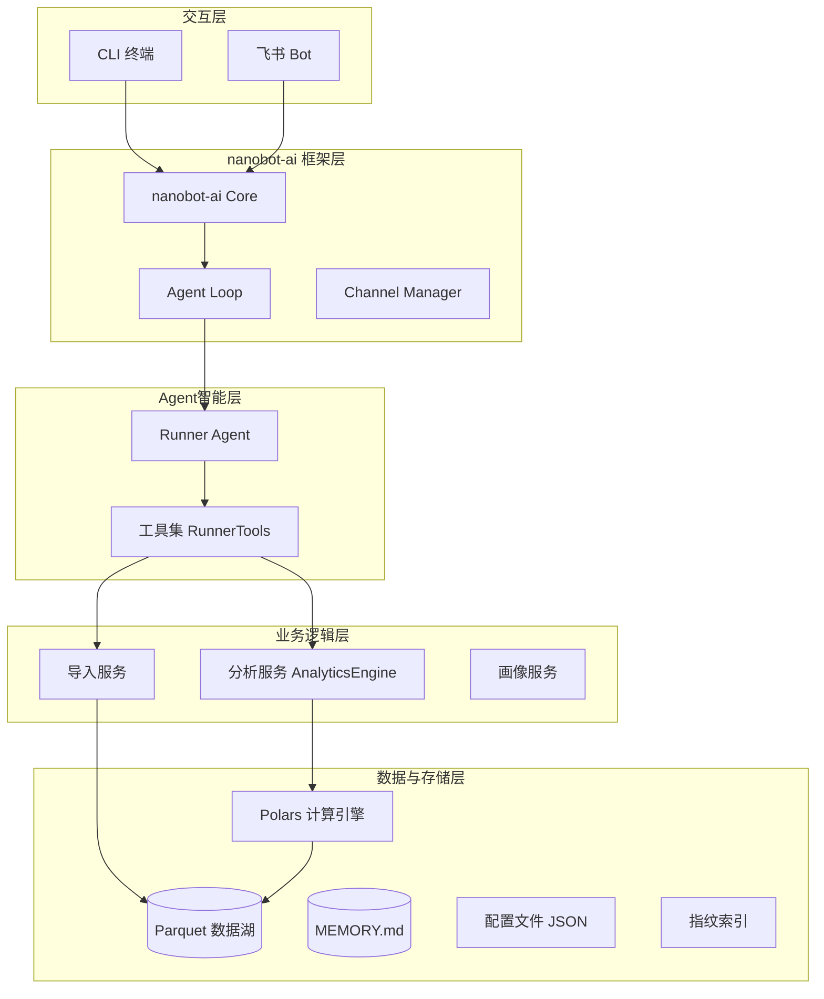
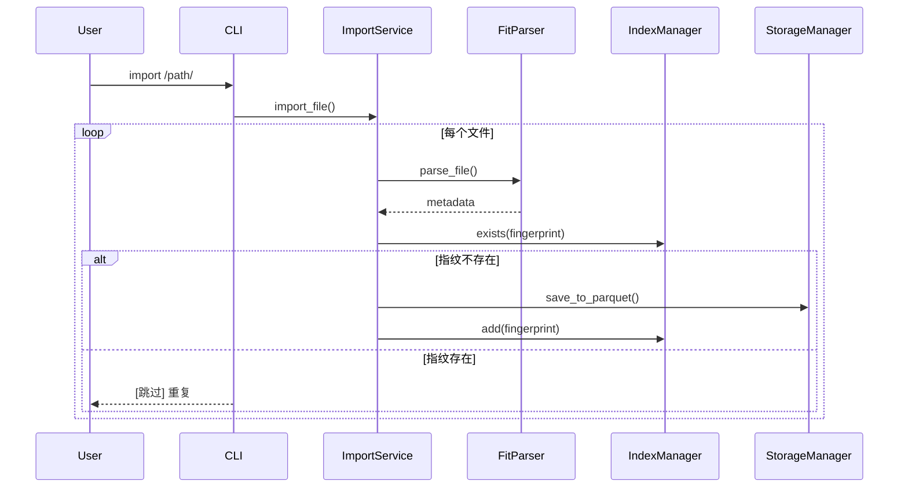
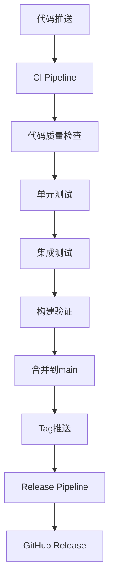

# 系统架构设计说明书

## 1. 架构概述

本项目基于 **nanobot-ai** 底座构建，采用 **分层插件化架构**。系统设计遵循"本地优先、隐私至上、高性能计算"原则。核心亮点在于引入 **Parquet+Polars** 构建高性能数据分析子系统集成。

## 2. 技术栈选型

| 层级 | 技术组件 | 选型依据 | 版本要求 |
|:---|:---|:---|:---|
| **核心底座** | **nanobot-ai** | 提供Agent运行时、基础工具链、配置管理规范 | Latest |
| **开发语言** | Python | 生态丰富，AI领域标准语言 | 3.11+ |
| **CLI框架** | Typer + Rich | 构建现代化、带富文本提示的命令行工具 | Latest |
| **数据存储** | **Apache Parquet** | 列式存储，极高压缩比，适配OLAP分析场景 | via `pyarrow` |
| **计算引擎** | **Polars** | Rust实现的多线程DataFrame库，性能远超Pandas | 0.20+ |
| **数据解析** | fitparse | 专门解析 .fit 文件的成熟库 | Latest |

## 3. 系统整体架构图



## 4. 核心模块详细设计

### 4.1 数据存储架构设计

#### 4.1.1 历史跑步数据

*   **存储格式**：`.parquet`
*   **目录结构**：按年份分区
    ```text
    ~/.nanobot-runner/data/
    ├── activities_2023.parquet
    ├── activities_2024.parquet
    └── index.json  # 去重索引
    ```
*   **Schema必填字段**: `activity_id`, `timestamp`, `source_file`, `filename`, `total_distance`, `total_timer_time`

#### 4.1.2 nanobot Workspace 目录结构

```
~/.nanobot-runner/
├── data/                    # 业务数据存储
│   ├── activities_*.parquet # 运动数据（按年分片）
│   ├── profile.json         # 结构化画像数据
│   └── index.json           # 去重索引
├── memory/                  # 记忆系统
│   ├── MEMORY.md            # 长期记忆/用户画像
│   └── HISTORY.md           # 事件日志
├── sessions/                # 会话历史
├── skills/                  # 技能扩展
├── AGENTS.md                # Agent行为准则
├── SOUL.md                  # 人格设定
├── USER.md                  # 用户画像
└── config.json              # 应用配置
```

> ⚠️ **重要**：workspace 目录结构由 nanobot-ai 框架自动初始化，无需自定义实现。

#### 4.1.3 配置分离原则

| 类型 | 位置 | 说明 |
|------|------|------|
| LLM Provider | `~/.nanobot/config.json` | 框架级配置 |
| 飞书通道 | `~/.nanobot/config.json` | 框架级配置 |
| 跑步数据 | `~/.nanobot-runner/data/` | 业务数据 |
| Agent记忆 | `~/.nanobot-runner/memory/` | 业务数据 |

### 4.2 数据导入流程设计



### 4.3 数据分析引擎设计

核心利用 **Polars Lazy API**，实现高性能查询。

*   **查询优化机制**：谓词下推、列剪枝、分区裁剪
*   **核心分析功能**：
    *   **VDOT计算**: 基于Powers公式（距离>=1500m）
    *   **TSS计算**: 训练压力分数
    *   **ATL/CTL计算**: 急性/慢性训练负荷（7天/42天EWMA）
    *   **心率漂移分析**: 相关性<-0.7判定为漂移

### 4.4 Agent 与 CLI 交互设计

*   **CLI 入口**：`cli.py` 作为统一入口，基于Typer框架
*   **可用命令**：
    *   `nanobotrun import-data <path> [--force]`：导入FIT文件/目录
    *   `nanobotrun stats [--year YYYY]`：查看统计信息
    *   `nanobotrun chat`：启动交互式Agent对话模式
    *   `nanobotrun version`：显示版本信息

### 4.5 核心类调用关系

| 入口操作 | 调用链 |
|---------|--------|
| 导入FIT | `cli.py` → `FitParser` → `IndexManager` → `StorageManager` |
| 统计查询 | `cli.py` → `StorageManager` → `AnalyticsEngine` → `cli_formatter` |
| Agent交互 | `cli.py` → `RunnerTools` → `StorageManager`/`AnalyticsEngine` |

### 4.6 Agent工具集设计

`RunnerTools` 类封装所有业务逻辑：

| 工具名称 | 说明 |
|---------|------|
| `get_running_stats` | 获取跑步统计数据 |
| `get_recent_runs` | 获取最近跑步记录 |
| `calculate_vdot_for_run` | 计算单次跑步VDOT值 |
| `get_vdot_trend` | 获取VDOT趋势 |
| `get_hr_drift_analysis` | 分析心率漂移 |
| `get_training_load` | 获取训练负荷（ATL/CTL/TSB） |
| `query_by_date_range` | 按日期范围查询 |
| `query_by_distance` | 按距离范围查询 |
| `update_memory` | 更新Agent记忆 |

## 5. 接口规范设计

### 5.1 CLI 指令规范

| 命令 | 参数 | 说明 |
|------|------|------|
| `import-data` | `<path>` `[--force]` | 导入FIT文件或目录 |
| `stats` | `[--year]` `[--start]` `[--end]` | 查看跑步统计 |
| `chat` | - | 启动Agent对话模式 |
| `version` | - | 显示版本 |

### 5.2 内部数据接口

系统内部模块间通过 Polars DataFrame/LazyFrame 传递数据：
*   `StorageManager.read_parquet(years)` -> `pl.LazyFrame`
*   `AnalyticsEngine.get_running_summary()` -> `pl.DataFrame`

### 5.3 工具接口规范

Agent工具遵循OpenAI Function Calling规范，返回JSON格式字符串。

## 6. 部署架构

适配 Trae IDE 与个人开发者场景，采用 **本地单机部署**。

**项目目录结构**：

```text
nanobot-runner/
├── src/
│   ├── core/              # 核心业务逻辑
│   ├── agents/            # Agent 定义
│   ├── notify/            # 通知模块
│   ├── cli.py             # CLI 入口
│   └── cli_formatter.py   # CLI格式化输出
├── tests/                 # 测试目录
├── docs/                  # 项目文档
└── pyproject.toml         # 项目依赖
```

## 7. CI/CD架构设计

### 7.1 工作流架构



### 7.2 质量门禁

| 检查项 | 工具 | 门禁要求 |
|--------|------|----------|
| 代码格式化 | black | 零警告 |
| 导入排序 | isort | 零警告 |
| 类型检查 | mypy | 警告可接受 |
| 安全扫描 | bandit | 高危漏洞=0 |
| 单元测试 | pytest | 通过率100% |
| 代码覆盖率 | pytest-cov | core≥80%, agents≥70%, cli≥60% |

---

*文档版本: v0.5.0*
*更新时间: 2026-04-01*
