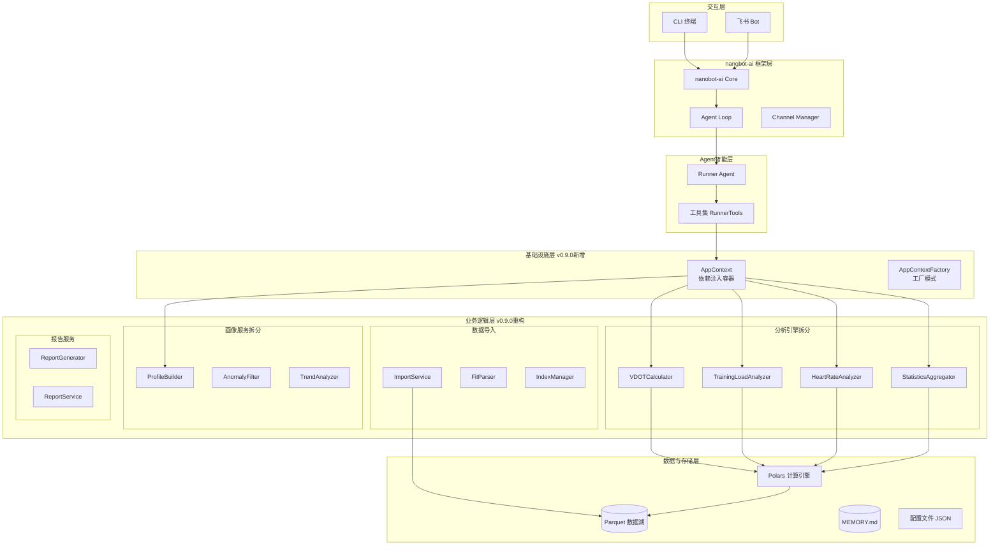
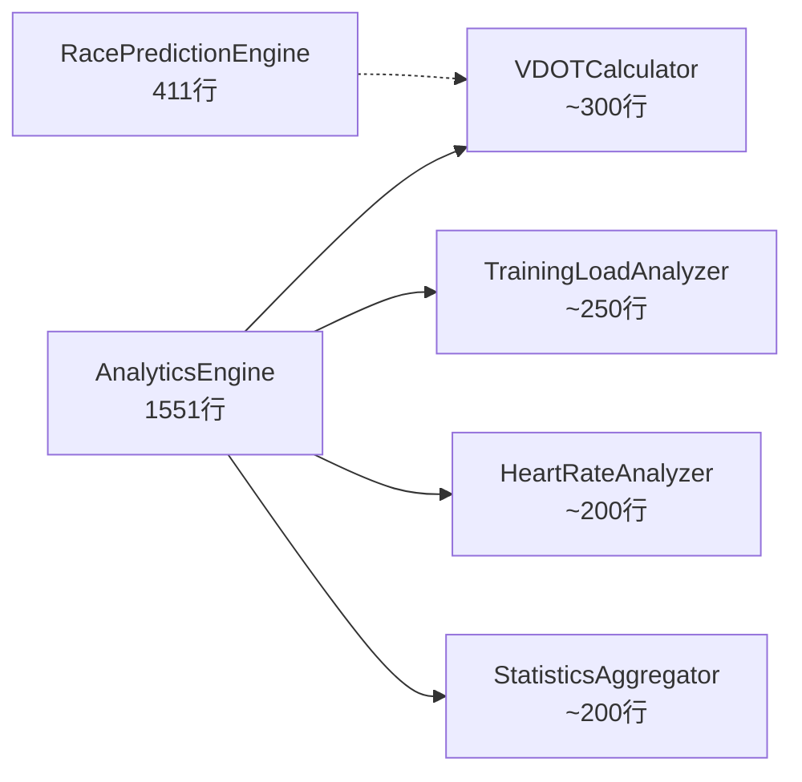
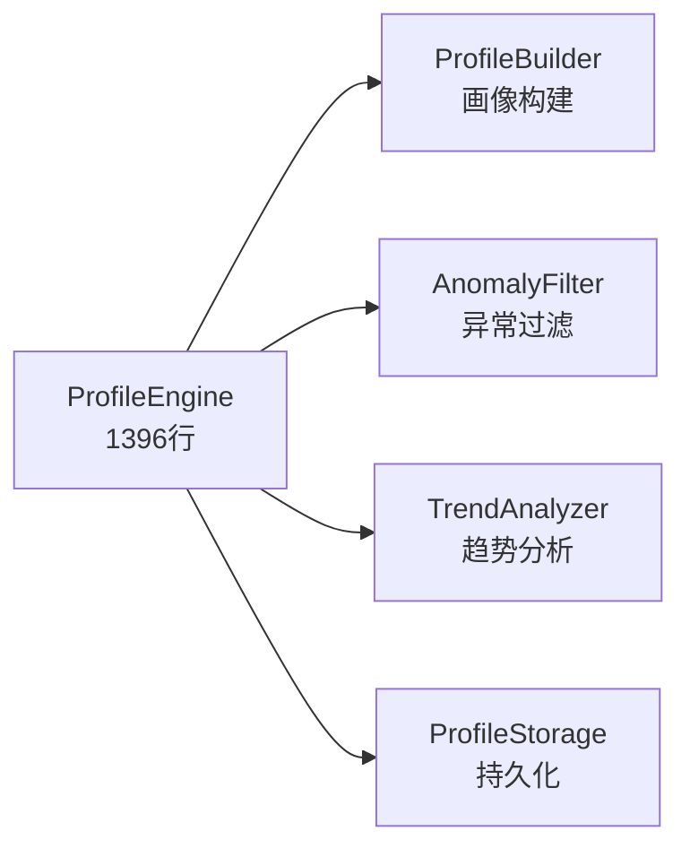
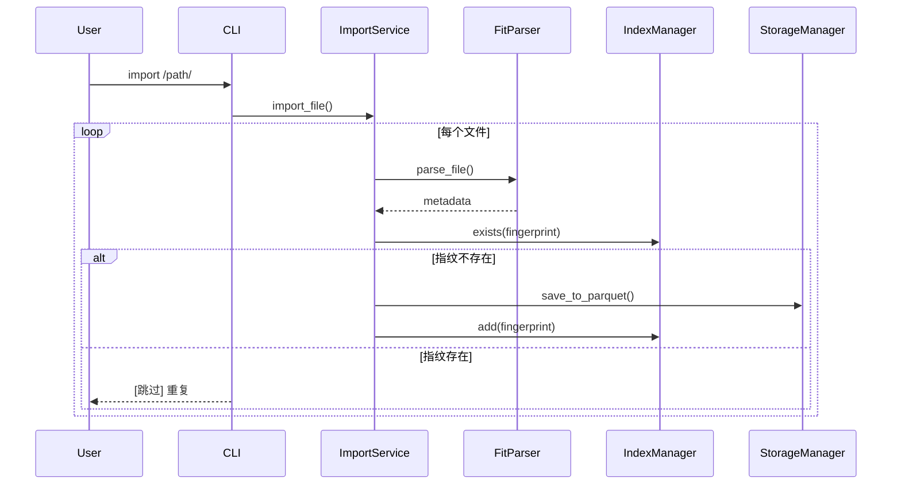
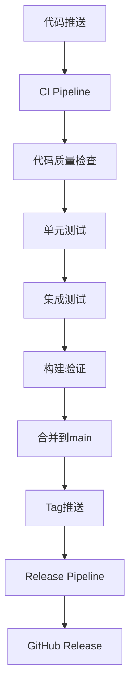

# 系统架构设计说明书

## 1. 架构概述

本项目基于 **nanobot-ai** 底座构建，采用 **分层插件化架构**。系统设计遵循"本地优先、隐私至上、高性能计算"原则。核心亮点在于引入 **Parquet+Polars** 构建高性能数据分析子系统集成。

**v0.9.0架构重构重点**：
- **上帝类拆分**：将AnalyticsEngine（1551行）、ProfileEngine（1396行）、cli.py（1131行）拆分为单一职责模块
- **依赖注入引入**：通过AppContext/Factory实现解耦，消除6处独立实例化
- **性能优化**：Polars向量化改造、Parquet增量写入、配置缓存
- **质量提升**：收紧mypy配置、Schema强制校验、消除重复代码

## 2. 技术栈选型

| 层级 | 技术组件 | 选型依据 | 版本要求 |
|:---|:---|:---|:---|
| **核心底座** | **nanobot-ai** | 提供Agent运行时、基础工具链、配置管理规范 | Latest |
| **开发语言** | Python | 生态丰富，AI领域标准语言 | 3.11+ |
| **CLI框架** | Typer + Rich | 构建现代化、带富文本提示的命令行工具 | Latest |
| **数据存储** | **Apache Parquet** | 列式存储，极高压缩比，适配OLAP分析场景 | via `pyarrow` |
| **计算引擎** | **Polars** | Rust实现的多线程DataFrame库，性能远超Pandas | 0.20+ |
| **数据解析** | fitparse | 专门解析 .fit 文件的成熟库 | Latest |

## 3. 系统整体架构图

### 3.1 v0.9.0架构全景图



### 3.2 架构分层职责

| 层级 | 职责 | 关键组件 |
|------|------|---------|
| **交互层** | 用户交互入口 | CLI、飞书Bot |
| **框架层** | Agent运行时、通道管理 | nanobot-ai Core、AgentLoop |
| **智能层** | 自然语言理解、工具调用 | Runner Agent、RunnerTools |
| **业务层** | 核心业务逻辑 | 分析引擎、画像服务、报告服务 |
| **基础设施层** | 依赖注入、配置管理 | AppContext、AppContextFactory |
| **数据层** | 数据存储与计算 | Parquet、Polars、配置文件 |

## 4. 核心模块详细设计

### 4.0 功能架构索引

本项目包含以下核心功能模块，详细架构设计见对应文档：

| 功能模块 | 架构文档 | 说明 |
|---------|---------|------|
| 数据导入与分析 | 本文档 | FIT文件导入、数据分析、用户画像 |
| **训练计划制定与飞书日历同步** | [训练计划功能架构设计.md](./训练计划功能架构设计.md) | 训练计划生成、硬性规则校验、日历同步、训练提醒 |

### 4.1 v0.9.0架构重构变更

#### 4.1.1 AnalyticsEngine拆分

**原问题**：AnalyticsEngine（1551行）承担VDOT、TSS、心率漂移、训练负荷、报告生成等10+职责。

**拆分方案**：



| 新模块 | 职责 | 核心方法 |
|--------|------|---------|
| `VDOTCalculator` | VDOT计算、趋势分析、比赛预测（整合RacePredictionEngine） | `calculate_vdot()`, `get_vdot_trend()`, `predict_race_time()` |
| `TrainingLoadAnalyzer` | TSS计算、ATL/CTL/TSB、训练负荷趋势 | `calculate_tss()`, `calculate_atl()`, `calculate_ctl()`, `get_training_load_trend()` |
| `HeartRateAnalyzer` | 心率漂移检测、心率区间分析、最大心率估算 | `analyze_hr_drift()`, `get_hr_zones()`, `estimate_max_hr()` |
| `StatisticsAggregator` | 数据聚合、统计摘要、会话聚合 | `aggregate_sessions()`, `get_summary_stats()`, `get_session_count()` |

#### 4.1.2 ProfileEngine拆分

**原问题**：ProfileEngine（1396行）承担画像构建、异常过滤、趋势分析等多职责，且存在循环依赖。

**拆分方案**：



| 新模块 | 职责 | 核心方法 |
|--------|------|---------|
| `ProfileBuilder` | 用户画像构建与更新 | `build_profile()`, `update_profile()` |
| `AnomalyFilter` | 异常数据过滤 | `filter_anomaly()` |
| `TrendAnalyzer` | 趋势分析 | `analyze_trend()` |
| `ProfileStorage` | 画像持久化（已存在） | `save()`, `load()` |

#### 4.1.3 CLI拆分

**原问题**：cli.py（1131行）混合路由定义、业务调用、Rich UI渲染。

**拆分方案**：

```
src/
├── cli/
│   ├── __init__.py
│   ├── app.py              # Typer app入口
│   ├── commands/           # 命令路由定义
│   │   ├── __init__.py
│   │   ├── data.py         # import-data, stats
│   │   ├── analysis.py     # vdot, load, hr-drift
│   │   ├── agent.py        # chat, memory
│   │   ├── report.py       # report, profile
│   │   └── gateway.py      # gateway命令
│   └── handlers/           # 业务逻辑调用
│       ├── __init__.py
│       ├── data_handler.py
│       └── analysis_handler.py
├── cli/
│   └── formatter.py          # Rich UI渲染（v0.9.0迁移）
└── gateway_service.py        # 网关服务（独立）
```

#### 4.1.4 依赖注入机制

**原问题**：AnalyticsEngine在6处被独立实例化，模块间隐式紧耦合。

**解决方案**：工厂模式 + 上下文管理

```python
from dataclasses import dataclass
from typing import Optional

@dataclass
class AppContext:
    storage: StorageManager
    config: ConfigManager
    vdot_calculator: VDOTCalculator
    training_load_analyzer: TrainingLoadAnalyzer
    heart_rate_analyzer: HeartRateAnalyzer
    statistics_aggregator: StatisticsAggregator

class AppContextFactory:
    @staticmethod
    def create(config_path: Optional[str] = None) -> AppContext:
        config = ConfigManager(config_path)
        storage = StorageManager(config.data_dir)
        
        return AppContext(
            storage=storage,
            config=config,
            vdot_calculator=VDOTCalculator(storage),
            training_load_analyzer=TrainingLoadAnalyzer(storage),
            heart_rate_analyzer=HeartRateAnalyzer(storage),
            statistics_aggregator=StatisticsAggregator(storage),
        )
```

**迁移路径**：

| 阶段 | 改造范围 | 改造内容 |
|------|---------|---------|
| 阶段1 | CLI层 | 使用AppContextFactory创建上下文，通过Typer Context传递 |
| 阶段2 | RunnerTools | 接收AppContext，不再独立创建AnalyticsEngine |
| 阶段3 | ReportGenerator/ReportService | 通过AppContext获取依赖 |
| 阶段4 | ProfileEngine | 解决循环依赖，通过AppContext获取分析器 |

### 4.2 数据存储架构设计

#### 4.2.1 历史跑步数据

*   **存储格式**：`.parquet`
*   **目录结构**：按年份分区
    ```text
    ~/.nanobot-runner/data/
    ├── activities_2023.parquet
    ├── activities_2024.parquet
    └── index.json  # 去重索引
    ```
*   **Schema必填字段**: `activity_id`, `timestamp`, `source_file`, `filename`, `total_distance`, `total_timer_time`

#### 4.2.2 nanobot Workspace 目录结构

```
~/.nanobot-runner/
├── data/                    # 业务数据存储
│   ├── activities_*.parquet # 运动数据（按年分片）
│   ├── profile.json         # 结构化画像数据
│   └── index.json           # 去重索引
├── memory/                  # 记忆系统
│   ├── MEMORY.md            # 长期记忆/用户画像
│   └── HISTORY.md           # 事件日志
├── sessions/                # 会话历史
├── skills/                  # 技能扩展
├── AGENTS.md                # Agent行为准则
├── SOUL.md                  # 人格设定
├── USER.md                  # 用户画像
└── config.json              # 应用配置
```

> ⚠️ **重要**：workspace 目录结构由 nanobot-ai 框架自动初始化，无需自定义实现。

#### 4.2.3 配置分离原则

| 类型 | 位置 | 说明 |
|------|------|------|
| LLM Provider | `~/.nanobot/config.json` | 框架级配置 |
| 飞书通道 | `~/.nanobot/config.json` | 框架级配置 |
| 跑步数据 | `~/.nanobot-runner/data/` | 业务数据 |
| Agent记忆 | `~/.nanobot-runner/memory/` | 业务数据 |

### 4.3 数据导入流程设计



### 4.4 数据分析引擎设计

核心利用 **Polars Lazy API**，实现高性能查询。

*   **查询优化机制**：谓词下推、列剪枝、分区裁剪
*   **核心分析功能**：
    *   **VDOT计算**: 基于Powers公式（距离>=1500m）
    *   **TSS计算**: 训练压力分数
    *   **ATL/CTL计算**: 急性/慢性训练负荷（7天/42天EWMA）
    *   **心率漂移分析**: 相关性<-0.7判定为漂移

#### 4.4.1 v0.9.0性能优化

| 优化项 | 原实现 | 优化后 | 性能提升 |
|--------|--------|--------|---------|
| TSS计算 | collect后Python循环 | Polars向量化 | ≥30% |
| VDOT趋势 | collect后Python循环 | Polars向量化 | ≥30% |
| EWMA计算 | O(n²)每天从头计算 | 增量计算 | ≥50% |
| 心率漂移 | 全量加载内存 | 向量化计算 | ≥30% |
| 数据导入 | 全量读-合并-写 | 增量写入 | ≥50% |
| 配置读取 | 每次读盘 | 内存缓存 | ≥80% |

### 4.5 Agent 与 CLI 交互设计

*   **CLI 入口**：`cli/app.py` 作为统一入口，基于Typer框架
*   **可用命令**：
    *   `nanobotrun import-data <path> [--force]`：导入FIT文件/目录
    *   `nanobotrun stats [--year YYYY]`：查看统计信息
    *   `nanobotrun chat`：启动交互式Agent对话模式
    *   `nanobotrun version`：显示版本信息
    *   `nanobotrun vdot [--limit N]`：查看VDOT趋势
    *   `nanobotrun load`：查看训练负荷（ATL/CTL/TSB）
    *   `nanobotrun recent [--limit N]`：查看最近训练记录
    *   `nanobotrun hr-drift`：查看心率漂移分析
    *   `nanobotrun memory <action>`：管理Agent记忆
    *   `nanobotrun init`：初始化工作区
    *   `nanobotrun gateway`：启动飞书机器人Gateway服务
    *   `nanobotrun report`：生成并推送每日晨报
    *   `nanobotrun profile <command>`：用户画像管理

### 4.6 核心类调用关系

#### 4.6.1 v0.9.0调用链（依赖注入后）

| 入口操作 | 调用链 |
|---------|--------|
| 导入FIT | `cli/commands/data.py` → `ImportService` → `FitParser` → `IndexManager` → `StorageManager` |
| 统计查询 | `cli/commands/data.py` → `AppContext.statistics_aggregator` → `cli_formatter` |
| VDOT查询 | `cli/commands/analysis.py` → `AppContext.vdot_calculator` → `cli_formatter` |
| 训练负荷 | `cli/commands/analysis.py` → `AppContext.training_load_analyzer` → `cli_formatter` |
| 心率分析 | `cli/commands/analysis.py` → `AppContext.heart_rate_analyzer` → `cli_formatter` |
| Agent交互 | `cli/commands/agent.py` → `RunnerTools(AppContext)` → 各分析器 |

### 4.7 Agent工具集设计

`RunnerTools` 类封装所有业务逻辑：

| 工具名称 | 说明 | v0.9.0调用变更 |
|---------|------|---------------|
| `get_running_stats` | 获取跑步统计数据 | → `statistics_aggregator.get_summary_stats()` |
| `get_recent_runs` | 获取最近跑步记录 | → `statistics_aggregator.get_recent_runs()` |
| `calculate_vdot_for_run` | 计算单次跑步VDOT值 | → `vdot_calculator.calculate_vdot()` |
| `get_vdot_trend` | 获取VDOT趋势 | → `vdot_calculator.get_vdot_trend()` |
| `get_hr_drift_analysis` | 分析心率漂移 | → `heart_rate_analyzer.analyze_hr_drift()` |
| `get_training_load` | 获取训练负荷（ATL/CTL/TSB） | → `training_load_analyzer.get_training_load()` |
| `query_by_date_range` | 按日期范围查询 | → `statistics_aggregator.query()` |
| `query_by_distance` | 按距离范围查询 | → `statistics_aggregator.query()` |
| `update_memory` | 更新Agent记忆 | 保持不变 |
| `generate_training_plan` | 生成训练计划 | → `TrainingPlanEngine` |

## 5. 接口规范设计

### 5.1 CLI 指令规范

| 命令 | 参数 | 说明 |
|------|------|------|
| `import-data` | `<path>` `[--force]` | 导入FIT文件或目录 |
| `stats` | `[--year]` `[--start]` `[--end]` | 查看跑步统计 |
| `chat` | - | 启动Agent对话模式 |
| `version` | - | 显示版本 |
| `vdot` | `[--limit]` `[--output]` | 查看VDOT趋势 |
| `load` | - | 查看训练负荷（ATL/CTL/TSB） |
| `recent` | `[--limit]` | 查看最近训练记录 |
| `hr-drift` | - | 查看心率漂移分析 |
| `memory` | `<action>` | 管理Agent记忆（show/edit/clear） |
| `init` | - | 初始化工作区 |
| `gateway` | `[--port]` `[--verbose]` | 启动飞书机器人Gateway服务 |
| `report` | `[--push]` `[--schedule]` | 生成并推送每日晨报 |
| `profile` | `<command>` | 用户画像管理（show/update） |

### 5.2 内部数据接口

系统内部模块间通过 Polars DataFrame/LazyFrame 传递数据：
*   `StorageManager.read_parquet(years)` -> `pl.LazyFrame`
*   `StatisticsAggregator.get_running_summary()` -> `pl.DataFrame`
*   `VDOTCalculator.get_vdot_trend()` -> `pl.DataFrame`

### 5.3 工具接口规范

Agent工具遵循OpenAI Function Calling规范，返回JSON格式字符串。

### 5.4 v0.9.0统一错误契约

**原问题**：错误处理不一致（字典/异常/友好消息三种契约）。

**解决方案**：统一错误处理契约

```python
from dataclasses import dataclass
from typing import Any, Optional

@dataclass
class ToolResult:
    success: bool
    data: Optional[Any] = None
    message: Optional[str] = None
    error: Optional[str] = None

def tool_wrapper(func):
    @wraps(func)
    def wrapper(*args, **kwargs):
        try:
            result = func(*args, **kwargs)
            return ToolResult(success=True, data=result).model_dump_json()
        except ValidationError as e:
            return ToolResult(success=False, error=f"输入验证失败: {e}").model_dump_json()
        except FileNotFoundError as e:
            return ToolResult(success=False, error=f"文件不存在: {e}").model_dump_json()
        except Exception as e:
            return ToolResult(success=False, error=f"内部错误: {e}").model_dump_json()
    return wrapper
```

## 6. 部署架构

适配 Trae IDE 与个人开发者场景，采用 **本地单机部署**。

**项目目录结构（v0.9.0）**：

```text
nanobot-runner/
├── src/
│   ├── core/              # 核心业务逻辑
│   │   ├── analytics/     # v0.9.0: 分析引擎拆分
│   │   │   ├── vdot_calculator.py
│   │   │   ├── training_load_analyzer.py
│   │   │   ├── heart_rate_analyzer.py
│   │   │   └── statistics_aggregator.py
│   │   ├── profile/       # v0.9.0: 画像服务拆分
│   │   │   ├── profile_builder.py
│   │   │   ├── anomaly_filter.py
│   │   │   └── trend_analyzer.py
│   │   ├── context.py     # v0.9.0: 依赖注入
│   │   ├── parser.py
│   │   ├── storage.py
│   │   ├── indexer.py
│   │   ├── config.py
│   │   └── exceptions.py
│   ├── agents/            # Agent 定义
│   │   └── tools.py
│   ├── notify/            # 通知模块
│   ├── cli/               # v0.9.0: CLI拆分
│   │   ├── app.py
│   │   ├── commands/
│   │   └── handlers/
│   ├── cli/
│   │   └── formatter.py     # Rich UI渲染（v0.9.0迁移）
│   └── gateway_service.py   # v0.9.0: 网关服务独立
├── tests/                   # 测试目录
├── docs/                  # 项目文档
└── pyproject.toml         # 项目依赖
```

## 7. CI/CD架构设计

### 7.1 工作流架构



### 7.2 质量门禁

| 检查项 | 工具 | 门禁要求 | v0.9.2变更 |
|--------|------|----------|-----------|
| 代码格式化 | ruff format | 零警告 | **工具迁移** |
| 代码质量 | ruff check | 零警告 | **新增** |
| 类型检查 | mypy | 核心模块零错误 | 无变更 |
| 安全扫描 | bandit | 高危漏洞=0 | 无变更 |
| 单元测试 | pytest | 通过率100% | 无变更 |
| 代码覆盖率 | pytest-cov | core≥80%, agents≥70%, cli≥60% | 无变更 |

### 7.3 v0.9.0 CI/CD增强

**新增检查脚本**：

| 脚本 | 检查内容 | 触发条件 |
|------|---------|---------|
| `scripts/check_dead_code.py` | 死代码检测 | 每次提交 |
| `scripts/check_schema_alignment.py` | Schema对齐检查 | 每次提交 |
| `scripts/check_circular_deps.py` | 循环依赖检测 | 每次提交 |

## 8. v0.9.0重构实施计划

### 8.1 实施阶段

| 阶段 | 周期 | 主要任务 | 验收标准 |
|------|------|---------|---------|
| Phase 1: 基础修复 | 第1-2周 | 死代码清理、Bug修复、错误契约统一 | CI通过，测试通过 |
| Phase 2: 架构重构 | 第3-6周 | 上帝类拆分、CLI拆分、依赖注入引入 | 功能不变，测试通过 |
| Phase 3: 性能优化 | 第7-8周 | Polars向量化、增量写入、配置缓存 | 性能指标达标 |
| Phase 4: 质量提升 | 第9周 | 收紧mypy、Schema校验、提取重复逻辑 | 质量门禁通过 |

### 8.2 风险与应对

| 风险 | 影响 | 应对策略 |
|------|------|---------|
| 拆分后接口变更导致调用方大量修改 | 高 | 使用适配器模式保留原接口 |
| 重构过程中引入新Bug | 高 | 测试先行，小步提交 |
| 测试覆盖不足，功能回归 | 高 | 基准测试，集成测试 |
| 时间估算偏差 | 中 | 预留20%缓冲时间 |

### 8.3 回滚策略

| 触发条件 | 回滚操作 |
|---------|---------|
| 单元测试通过率<95% | 回滚至上一版本，修复后重新合并 |
| 集成测试发现P0 Bug | 回滚至上一版本，修复后重新合并 |
| 性能下降>20% | 回滚性能优化代码，重新评估方案 |

---

*文档版本: v0.9.0*  
*更新时间: 2026-04-08*  
*更新说明: 基于v0.9.0重构规划方案全面更新，反映架构拆分、依赖注入、性能优化等变更*
