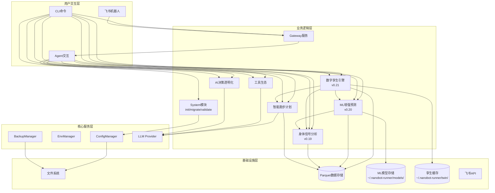

# 架构设计说明书

> **文档版本**: v9.0.0
> **设计日期**: 2026-04-17
> **更新日期**: 2026-05-14
> **当前基线**: v0.21.0
> **版本目标**: v0.22.0 质量收口版本（UAT验证/缺陷收敛/质量兜底/需求洞察） 🔧 当前
> **需求来源**: REQ_需求规格说明书.md (v9.0) + REQ_产品演进需求规格说明书.md (v1.0)
> **对齐依据**: 产品规划方案.md (v9.5)
> **外部参考**: 产品演进设计.md (v1.0) + multiagents.md (多智能体架构分析)
> **评审依据**: 架构评审报告_v0.19.0.md + 三文档综合评审报告_v0.20.0.md

> **项目性质说明**: 本项目为**个人使用且个人开发的项目**，所有设计和需求均围绕单人开发和使用场景展开。

***

## 1. 执行摘要

### 1.1 架构演进路线

| 阶段    | 版本          | 核心目标                                  | 状态     |
| ----- | ----------- | ------------------------------------- | ------ |
| 技术底座  | v0.5-v0.9.5 | 数据导入/存储/分析/CLI/依赖注入/SDK化              | ✅ 完成   |
| 智能计划  | v0.10-v0.12 | 自适应训练计划、LLM调整、目标预测                    | ✅ 完成   |
| 工具与智能 | v0.13-v0.15 | MCP协议、AI自我诊断、决策透明化                    | ✅ 完成   |
| 模块化重构 | v0.16-v0.17 | Core子模块拆分、Hook组合、Subagent、Cron提醒      | ✅ 完成   |
| 可视化导出 | v0.18       | 终端图表(plotext)、多格式导出(CSV/JSON/Parquet) | ✅ 完成   |
| 身体信号  | v0.19       | HRV分析、疲劳度评估、身体信号解读                    | ✅ 完成   |
| 预测未来  | v0.20       | ML增强预测（VDOT趋势/比赛成绩/伤病风险）              | ✅ 完成   |
| 数字孪生  | v0.21       | 跑者状态向量、What-If推演、计划对比                 | ✅ 完成   |
| 质量收口  | v0.22       | UAT验证、缺陷收敛、质量兜底、需求洞察               | 🔧 当前   |
| 决策追踪  | v0.23       | 决策日志、结果回填、预测校准                        | 📋 规划中 |
| 个性化学习 | v0.24       | 训练响应性分析、个人化模型进化                       | 📋 规划中 |
| 自适应进化 | v0.25       | 提示策略优化、自动进化触发                         | 📋 规划中 |
| 稳定版   | v1.0        | API冻结、性能优化、完整文档                       | 📋 计划中 |

### 1.2 v9.0.0 更新重点（v0.22.0 质量收口版本）

1. **版本定位变更**：v0.22从原规划「多视角决策验证」调整为「质量收口版本」，原因见产品规划v9.5
2. **v0.21数字孪生引擎已完成**：详细设计精简为摘要（见Section 7），完整设计见Git历史
3. **v0.22无新模块/新CLI/新Agent工具**：架构层面无新增子模块，聚焦UAT验证、缺陷收敛、质量兜底
4. **新增v0.22架构考量**（见Section 8）：UAT验证架构、缺陷管理架构、质量兜底架构、需求洞察机制
5. **v0.23-v0.25骨架更新**（见Section 9）：对齐产品规划v9.5和需求规格v9.0
6. **Phase C基线测量计划**：对齐需求规格说明书，v0.22发布后、v0.23启动前执行
7. **多视角验证降级为条件性**：原v0.22核心功能调整为条件性，待nanobot Subagent能力成熟后评估

### 1.3 v8.0.0 更新重点（v0.21.0 数字孪生引擎）— 已完成

1. 新增`twin`核心子模块（跑者状态向量/What-If推演/计划对比）
2. 新增`twin` CLI命令组（status/simulate/compare）
3. 新增3个Agent工具（get_runner_state/simulate_plan/compare_plans）
4. 采纳薄编排层架构方案，DigitalTwinEngine聚合StateVectorBuilder和WhatIfSimulator
5. 5维度跑者状态向量设计（体能/负荷/身体信号/风险/训练模式），对齐产品规划决策
6. What-If推演三层降级策略（ML增强/参数化Banister/基础线性外推）
7. 状态向量缓存机制（TTL=24h，存储到 `~/.nanobot-runner/twin/state_vector.json`）
8. 计划对比综合评分算法（VDOT提升40% + 风险控制30% + 恢复余量20% + 恢复状态10%）
9. v0.21仅支持系统计划引用（plan_id），手动计划构建延后到v0.22+评估
10. AppContext扩展属性`twin_engine`

### 1.4 v7.0.0 更新重点（对齐产品规划v9.0 + 产品演进设计v1.0）

1. 引入Banister IR参数化基线模型作为冷启动策略，填补基础预测与ML增强预测之间的空白
2. 统一prediction\_type为三段式：`ml_enhanced` / `parametric` / `basic`
3. 采纳分位数回归（p10/p50/p90）进行不确定性量化，替代简单置信区间
4. 采纳分层伤病风险模型架构：规则基线 → 逻辑回归 → GBDT集成
5. 新增2个Agent工具：`report_injury`（伤病报告）+ `predict_training_response`（训练响应预测）
6. 新增伤病标签体系：confirmed / suspected / unconfirmed
7. 补充v0.21-v0.25模块骨架设计（数字孪生/多视角验证/决策追踪/个性化学习/自适应进化）
8. 明确多智能体架构约束：nanobot仅支持主-从后台任务模式，v0.22以单Agent角色切换为基准方案
9. 对齐产品规划方案v9.0和产品演进需求规格说明书v1.0，确保三文档一致性
10. 模型文件格式统一为.joblib（与sklearn官方推荐一致）

### 1.5 v6.0.0 更新重点（v0.20.0 ML增强预测）

1. 新增`prediction`核心子模块（ML-VDOT趋势预测/个人化比赛预测/ML伤病风险预测/模型管理/数据充足度评估）
2. 新增`predict` CLI命令组（status/vdot/race/injury-risk/model）
3. 新增5个Agent工具（predict\_vdot\_trend/predict\_race\_result/predict\_injury\_risk/check\_prediction\_status/manage\_prediction\_model）
4. 新增ML技术栈选型（scikit-learn/scipy/shap）
5. 新增模型存储架构设计（\~/.nanobot-runner/models/）
6. 新增数据充足度评估与自动降级策略
7. 新增特征工程模块设计（时序特征/负荷特征/身体信号特征）
8. 新增AppContext扩展属性`prediction_engine`

### 1.6 v5.1.0 更新重点

1. 新增数据缺失降级策略（DataQuality枚举、empty\_state返回值）— 对应评审Q1
2. 新增边界条件处理规范（单点数据、权重校验、TSB截断）— 对应评审Q2
3. 新增BodySignalConfig配置Schema定义 — 对应评审Q3
4. 新增RPE数据输入路径定义 — 对应评审Q4
5. 新增body\_signal模块测试策略 — 对应评审Q5
6. 明确status与analysis命令组职责边界 — 对应评审Q6
7. 整合建议改进项：data\_source字段、缓存机制、周对比、RecoveryStatus提升

### 1.7 v5.0.0 更新重点

1. 新增v0.19.0身体信号分析模块架构设计
2. 新增`body_signal`核心子模块（HRV分析/疲劳度评估/恢复监控/身体信号引擎）
3. 新增`status` CLI命令组、扩展`analysis`命令组
4. 新增6个Agent工具
5. 精简已完成版本文档，聚焦当前版本架构

### 1.8 核心设计原则

| 原则              | 策略                                    |
| --------------- | ------------------------------------- |
| **模块化**         | 按功能域划分子模块，接口通信                        |
| **依赖注入**        | AppContext统一管理核心组件                    |
| **配置驱动**        | Pydantic-Settings + 环境变量覆盖            |
| **类型安全**        | frozen dataclass + 类型注解 + mypy        |
| **LazyFrame优先** | Polars查询仅在最终输出时collect()              |
| **防御性设计**       | 数据缺失降级策略 + 边界条件处理 + DataQuality标识     |
| **ML渐进增强**      | 参数化基线→ML增强，数据不足自动降级，绝不阻塞用户            |
| **可解释ML**       | SHAP特征归因 + prediction\_type标注 + 置信度量化 |

***

## 2. 技术栈选型

| 类别        | 选型                | 版本              | 理由                              |
| --------- | ----------------- | --------------- | ------------------------------- |
| 语言        | Python            | **≥**3.11,<3.13 | 现有技术栈，生态成熟                      |
| Agent底座   | nanobot-ai        | Latest          | AI Agent框架，提供基础能力               |
| CLI       | Typer + Rich      | Latest          | 类型安全 + 美观输出                     |
| 配置        | Pydantic-Settings | Latest          | 类型安全 + 环境变量                     |
| 存储        | Apache Parquet    | via pyarrow     | 列式存储，高性能查询                      |
| 计算        | Polars            | 0.20+           | LazyFrame优化，高性能                 |
| 解析        | fitparse          | Latest          | FIT文件解析                         |
| 可视化       | plotext           | Latest          | 终端内图表渲染                         |
| 包管理       | uv                | Latest          | 快速依赖管理                          |
| **ML核心**  | **scikit-learn**  | **≥1.3.0**      | **轻量ML库，回归/分类/特征工程，适配本地单人场景**   |
| **科学计算**  | **scipy**         | **≥1.10.0**     | **Riegel曲线拟合(curve\_fit)、统计检验** |
| **特征解释**  | **shap**          | **≥0.48.0**     | **SHAP值特征重要性分析，可解释ML**          |
| **模型持久化** | **joblib**        | **≥1.3.0**      | **sklearn模型序列化，随sklearn安装**     |

**nanobot-ai适配**: 配置格式(JSON+Markdown)、环境变量`NANOBOT_`前缀、Workspace标准目录、加载优先级(环境变量>配置文件>默认值)

***

## 3. 系统架构设计

### 3.1 整体架构图（v0.22.0）



### 3.2 CLI命令体系（v0.22.0）

| 命令组          | 命令                                                 | 功能         | 版本        |
| ------------ | -------------------------------------------------- | ---------- | --------- |
| system       | `init / migrate / validate / config / backup`      | 系统管理       | v0.9+     |
| data         | `import / stats`                                   | 数据导入与统计    | v0.5+     |
| analysis     | `vdot / load / hr-drift`                           | 数据分析       | v0.8+     |
| analysis     | `hrv / hr-recovery / fatigue / recovery / compare` | 身体信号分析     | v0.19     |
| plan         | `create / status / feedback`                       | 训练计划       | v0.10+    |
| report       | `weekly / monthly`                                 | 训练报告       | v0.9+     |
| viz          | `vdot / load / hr-zones`                           | 数据可视化      | v0.18+    |
| export       | `sessions`                                         | 数据导出       | v0.18+    |
| transparency | `trace / status / insight`                         | AI透明化      | v0.15+    |
| status       | `today / weekly`                                   | 身体状态速览     | v0.19     |
| predict      | `status / vdot / race / injury-risk / model`       | ML增强预测     | v0.20     |
| **twin**     | **`status / simulate / compare`**                  | **数字孪生** | **v0.21** |
| gateway      | `start`                                            | 飞书Gateway  | v0.9+     |

***

## 4. 已完成模块摘要

> 以下模块已完成开发，仅保留架构要点。详细设计见Git历史版本。

| 模块                      | 核心组件                                                                                | 关键设计                       |
| ----------------------- | ----------------------------------------------------------------------------------- | -------------------------- |
| **配置管理** (v0.9.4)       | InitWizard, MigrationEngine, ConfigValidator, WorkspaceManager                      | 无配置模式启动、优先级: 环境变量>配置文件>默认值 |
| **智能跑步计划** (v0.10-0.12) | TrainingPlanGenerator, LLMPlanAdjuster, GoalPredictionEngine, PlanCompletionTracker | LLM驱动计划调整、目标达成预测<3s        |
| **工具生态** (v0.13)        | MCPConfigHelper, ToolManager, WeatherService, MapService                            | MCP协议集成、本地工具优先、隐私保护        |
| **AI决策透明化** (v0.15)     | TransparencyEngine, ObservabilityManager, TraceLogger, TransparencyDisplay          | 分层展示(简洁/详细)、数据溯源、全链路追踪     |
| **Core模块化** (v0.16)     | diagnosis/memory/personality/skills/validate/tools六大子模块                             | 按功能域拆分、接口隔离                |
| **AI底座激活** (v0.17)      | Hook组合系统、Subagent架构、异步用户确认、Cron训练提醒                                                 | 流式输出、LLM超时控制               |
| **可视化与导出** (v0.18)      | PlotextRenderer, CSV/JSON/ParquetExporter                                           | 终端图表渲染、多格式导出引擎             |
| **飞书通知** (v0.9+)        | GatewayServer, FeishuAuth, FeishuNotifier, FeishuCalendar                           | 异步非阻塞、Token自动刷新、指数退避重试     |

***

## 5. 身体信号分析模块（v0.19.0）

> **状态**: 已完成开发。详细设计见Git历史版本。

**核心架构**: HRVAnalyzer(心率变异) + FatigueAssessor(疲劳度评估) + RecoveryMonitor(恢复监控) + BodySignalEngine(编排层)。复用TrainingLoadAnalyzer/HeartRateAnalyzer计算结果，新增DataQuality三级降级策略(SUFFICIENT/INSUFFICIENT/EMPTY)。

**关键设计**: 同日缓存机制(BodySignalEngine)、RPE三级输入路径(FIT字段->CLI参数->自动降级)、TSB截断至[-50,50]、静息心率突增>10%预警。

**新增CLI**: status today/weekly, analysis hrv/hr-recovery/fatigue/recovery/compare

**新增Agent工具**: get_hrv_analysis, get_hr_recovery, get_fatigue_score, get_recovery_status, get_body_signal_summary, compare_training_periods

***

## 6. ML增强预测模块（v0.20.0）

> **状态**: 已完成开发。详细设计见Git历史版本。

**核心架构**: PredictionEngine(统一入口) + VDOTPredictor/RacePredictor/InjuryPredictor(三大预测器) + FeatureEngine(特征工程) + DataAssessor(数据充足度评估) + ModelManager(模型生命周期)。

**关键设计**:
- **三层降级策略**: ML增强(GradientBoosting+SHAP) -> 参数化基线(Banister IR/逻辑回归) -> 基础预测(线性回归/规则阈值)
- **不确定性量化**: 分位数回归(p10/p50/p90)输出置信区间
- **伤病风险分层**: 规则基线->逻辑回归(CalibratedClassifierCV)->GBDT集成(4:6加权)
- **冷启动**: Banister IR参数化模型填补200-400条数据空白
- **缓存机制**: PredictionEngine同日缓存 + FeatureEngine特征矩阵缓存

**新增CLI**: predict status/vdot/race/injury-risk/model

**新增Agent工具**: predict_vdot_trend, predict_race_result, predict_injury_risk, check_prediction_status, manage_prediction_model, report_injury, predict_training_response

**模型存储**: ~/.nanobot-runner/models/ (joblib格式)

***

## 7. 数字孪生引擎模块（v0.21.0）

> **状态**: 已完成开发。详细设计见Git历史版本。

**核心架构**: DigitalTwinEngine(薄编排层) + StateVectorBuilder(5维度状态向量构建器) + WhatIfSimulator(逐周推演器)。复用PredictionEngine/BodySignalEngine/TrainingLoadAnalyzer计算结果。

**关键设计**:
- **5维度跑者状态向量**: 体能/负荷/身体信号/风险/训练模式，每个维度独立构建+降级策略
- **薄编排层架构(ADR-002)**: DigitalTwinEngine聚合现有模块输出，不引入新状态转移引擎
- **What-If推演三层降级**: ML增强(Banister IR+ML修正) → 参数化(Banister IR拟合参数) → 基础(默认参数+线性外推)
- **计划对比评分**: VDOT提升40% + 风险控制35% + 恢复余量25%
- **状态向量缓存**: TTL=24h，存储到 `~/.nanobot-runner/twin/state_vector.json`
- **v0.21仅支持系统计划引用(plan_id)**，手动计划构建延后评估

**新增CLI**: twin status/simulate/compare

**新增Agent工具**: get_runner_state, simulate_plan, compare_plans

**成功标准达成**: 4周VDOT推演误差<8% ✅ | 单计划4周推演<10秒 ✅ | 状态向量聚合<3秒 ✅

***

## 8. v0.22 质量收口版本架构考量

### 8.1 版本定位

**版本主题**: 质量收口 + 需求洞察 —— 全量功能稳定性验证 + 用户痛点挖掘与反馈驱动改进
**核心目标**: 
1. 通过系统化UAT验证v0.5-v0.21全版本功能稳定性，修复缺陷
2. 基于UAT反馈挖掘用户使用痛点，形成新用户需求
3. 建立反馈驱动的产品改进机制
**架构影响**: v0.22无新模块/新CLI命令/新Agent工具，聚焦质量保障

**版本定位变更说明** ⭐:

> 原规划的「多视角决策验证（Coach/Doctor双视角）」版本因以下原因调整为「质量收口版本」：
> 1. v0.20-v0.21引入了ML预测、数字孪生等复杂功能，需要充分验证稳定性
> 2. 多视角决策验证依赖nanobot Subagent能力，当前底座支持尚不成熟
> 3. 优先保障现有功能的质量基线，为后续v0.23-v0.25自适应进化奠定稳定基础

### 8.2 UAT验证架构

**测试范围**: 覆盖v0.5-v0.21全版本功能（详见需求规格说明书REQ-0.22-01）

**AI辅助UAT执行模式**:
1. AI Agent根据用户验收测试指南辅助执行测试
2. 自动汇总测试结果，按严重程度分级（致命/严重/一般/轻微）
3. 生成UAT反馈报告，包含缺陷清单、修复建议、风险评估
4. 同步收集用户体验反馈，识别使用痛点

**UAT测试覆盖矩阵**:

| 版本 | 模块 | 测试重点 |
|------|------|----------|
| v0.5+ | 数据导入/查询/分析 | 核心数据链路完整性 |
| v0.10+ | 训练计划/报告 | LLM驱动功能稳定性 |
| v0.17 | MCP/Gateway/Cron/透明化/偏好/技能 | Agent生态功能 |
| v0.18 | 可视化/导出 | 输出正确性 |
| v0.19 | 身体信号 | HRV/疲劳/恢复计算准确性 |
| v0.20 | 预测模块 | ML预测精度+降级策略 |
| v0.21 | 数字孪生 | 状态向量+推演+对比 |

### 8.3 缺陷管理架构

**缺陷分级与修复优先级**:

| 级别 | 定义 | 修复时限 | 验收标准 |
|------|------|----------|----------|
| **致命** | 系统崩溃/数据丢失/核心功能不可用 | 24小时内 | 100%修复 |
| **严重** | 主要功能异常/性能严重下降 | 3天内 | 100%修复 |
| **一般** | 次要功能异常/用户体验问题 | 1周内 | 修复率≥80% |
| **轻微** | 界面瑕疵/文案问题 | 可选修复 | 记录待后续优化 |

**缺陷收敛流程**: 发现→分级→修复→验证→回归→关闭

### 8.4 质量兜底架构

| 兜底项 | 措施 | 完成标准 |
|--------|------|----------|
| 边界测试 | 补充异常输入、边界值测试 | 核心接口边界覆盖100% |
| 性能基线 | 建立性能基准，防止退化 | 关键操作响应时间符合v0.21基线 |
| 数据一致性 | 验证数据计算准确性 | VDOT/TSS/CTL等核心指标计算正确 |
| 兼容性 | 验证历史数据兼容性 | v0.19及之前数据正常迁移 |
| 文档完整性 | 检查用户文档、API文档 | 所有功能有对应文档说明 |

**性能基线标准**（对齐v0.21成功标准）:

| 操作 | 基线 | 来源 |
|------|------|------|
| ML预测响应 | <5秒 | v0.20成功标准 |
| 单计划4周推演 | <10秒 | v0.21成功标准 |
| 状态向量聚合 | <3秒 | v0.21成功标准 |

### 8.5 需求洞察与反馈驱动改进

**用户痛点挖掘流程**:

```
UAT执行 → 收集用户反馈 → 痛点分析分类(功能性/易用性/性能/文档) → 优先级排序(影响范围×解决价值) → 形成新需求 → 纳入需求池
```

**反馈收集渠道**:

| 渠道 | 收集方式 |
|------|----------|
| UAT测试反馈 | AI Agent辅助收集测试过程中的体验问题 |
| 用户主动反馈 | 内置反馈命令、Issue模板 |
| 使用数据分析 | 分析高频操作路径、异常退出点 |

**反馈处理流程**: 收集→分类→分析→转化→优先级→实现→验证

### 8.6 发布准备与观察

**发布就绪检查单**: UAT通过 / 需求洞察完成 / 高优先级改进完成 / 致命严重缺陷清零 / 性能测试通过 / 文档更新完成 / 发布说明完成 / 回滚方案就绪

**发布后观察期（7天）**: 监控反馈渠道 / 跟踪关键指标 / 持续收集反馈 / 快速响应问题

### 8.7 v0.22成功标准

| 维度 | 标准 | 测量方式 |
|------|------|----------|
| UAT通过率 | P0用例100%，P1用例≥90% | UAT测试报告 |
| 缺陷修复率 | 致命/严重100%，一般≥80% | 缺陷跟踪报告 |
| 需求洞察 | 识别≥3个有效痛点，形成≥2个新需求 | 需求洞察报告 |
| 反馈改进 | 高优先级改进项完成率≥80% | 改进实现报告 |
| 发布质量 | 发布后7天内无P0级问题 | 发布后观察报告 |
| 文档完整度 | 100%功能有对应文档 | 文档检查清单 |

### 8.8 Phase C基线测量计划

> 对齐需求规格说明书，在v0.22发布后、v0.23启动前执行，为自适应进化引擎提供量化基线。

| 指标 | 基线值（v0.22结束时） | 测量方法 | 量化下降/提升标准 |
|------|----------------------|----------|-------------------|
| VDOT预测误差（MAE） | 以PredictionRecord中最近30天记录计算 | `abs(预测VDOT - 实际VDOT) / 实际VDOT`取均值 | 每版本下降≥5%（相对值），连续2个版本 |
| 比赛预测误差 | 以RacePredictionRecord中已验证记录计算 | 全马预测误差（分钟） | 每版本下降≥10%（相对值） |
| 伤病预警召回率 | 以InjuryLabel中confirmed记录回溯 | 3周前置预警召回率 | 每版本提升≥5%（绝对值） |
| 推演准确度 | 以SimulationResult与实际对比 | 4周VDOT推演误差 | 每版本下降≥3%（相对值） |
| 用户满意度 | UAT反馈+主动反馈 | 主观评分1-5 | 每版本提升≥0.2 |

***

## 9. v0.23-v0.25 模块骨架设计

> 以下为产品演进路线图（v0.23-v0.25）的架构骨架，详细设计将在对应版本开发时展开。

### 9.1 v0.23 决策追踪（Decision Tracking）

**核心概念**: 记录AI决策过程，支持结果回填和预测校准

**核心能力**:

- 决策日志: 记录每次预测/建议的输入、模型、输出、置信度
- 结果回填: 实际结果发生后回填，计算预测偏差
- 预测校准: 基于历史偏差校准模型输出
- 校准报告: 定期输出预测准确性报告

**模块结构**:

```
src/core/tracking/
├── __init__.py
├── models.py                    # DecisionLog, CalibrationResult
├── decision_logger.py           # DecisionLogger
├── result_backfill.py           # ResultBackfiller
└── calibration.py               # ModelCalibrator
```

### 9.2 v0.24 个性化学习（Personalized Learning）

**核心概念**: 分析个人训练响应性，实现模型个人化进化

**核心能力**:

- 训练响应性分析: 量化个体对训练刺激的响应差异
- 个人修正系数: 基于历史数据修正通用模型参数
- 模型微调: 在通用模型基础上进行个人化微调
- 进化报告: 输出个人化模型进化历程

**模块结构**:

```
src/core/personalization/
├── __init__.py
├── models.py                    # PersonalizationProfile, ResponsivenessResult
├── responsiveness_analyzer.py   # 训练响应性分析
├── personal_model.py            # 个人化模型管理
└── evolution_report.py          # 进化报告
```

### 9.3 v0.25 自适应进化（Adaptive Evolution）

**核心概念**: 优化提示策略，实现自动进化触发

**核心能力**:

- 提示策略优化: 基于用户反馈优化AI提示策略
- 自动进化触发: 检测到模型性能退化时自动触发重训
- 进化守护: 监控模型性能指标，确保进化方向正确
- 回滚机制: 进化失败时回滚到上一版本

**模块结构**:

```
src/core/evolution/
├── __init__.py
├── models.py                    # EvolutionEvent, EvolutionGuard
├── evolution_engine.py          # EvolutionEngine
├── prompt_optimizer.py          # 提示策略优化
├── auto_trigger.py              # 自动进化触发
└── evolution_guard.py           # 进化守护
```

***

## 10. 数据目录总览

> 统一展示 `~/.nanobot-runner/` 完整目录结构，标注各子目录的引入版本和用途。

```
~/.nanobot-runner/
├── config.json                    # 全局配置文件 (v0.9+)
├── data/                          # Parquet训练数据存储 (v0.5+)
│   └── YYYY/
│       └── sessions_YYYY.parquet
├── models/                        # ML模型存储 (v0.20新增)
│   ├── vdot_predictor/
│   ├── vdot_predictor_banister/
│   ├── race_predictor/
│   ├── injury_predictor/
│   └── prediction_history/
│       └── predictions.parquet
├── predictions/                   # 预测记录 (v0.20新增)
│   └── {date}_prediction.json
├── injury_labels/                 # 伤病标签 (v0.20新增)
│   ├── confirmed/
│   ├── suspected/
│   └── unconfirmed/
├── cache/                         # 特征缓存和预测缓存 (v0.20新增)
├── twin/                          # 数字孪生缓存 (v0.21新增)
│   └── state_vector.json         # 状态向量缓存 (TTL=24h)
├── decisions/                     # 决策日志 (v0.23预留)
│   └── YYYY-MM/
│       └── decisions_YYYY-MM.parquet
├── outcomes/                      # 结果记录 (v0.23预留)
│   └── YYYY-MM/
│       └── outcomes_YYYY-MM.parquet
└── backup/                        # 手动备份目录 (v0.9+)
```

| 子目录              | 引入版本  | 用途              | 估算大小      |
| ---------------- | ----- | --------------- | --------- |
| `data/`          | v0.5  | Parquet按年分片训练数据 | ~50MB/年  |
| `models/`        | v0.20 | ML模型文件和元数据      | 5-50MB/模型 |
| `predictions/`   | v0.20 | 预测历史记录          | ~1MB/年   |
| `injury_labels/` | v0.20 | 伤病标签分类存储        | ~1MB/年   |
| `cache/`         | v0.20 | 特征矩阵缓存和预测同日缓存   | ~10MB    |
| `twin/`          | v0.21 | 状态向量缓存          | ~10KB    |
| `decisions/`     | v0.23 | 决策日志Parquet按月分片 | ~5MB/年   |
| `outcomes/`      | v0.23 | 结果记录Parquet按月分片 | ~2MB/年   |
| `backup/`        | v0.9  | 手动备份压缩包         | 按需        |

***

## 11. 部署架构

**环境隔离**: 开发/生产共用本地环境，通过配置文件区分
**部署方式**: `uv run nanobotrun` 本地运行
**数据目录**: `~/.nanobot-runner/` (可配置)
**备份策略**: `nanobotrun system backup` 手动触发

***

## 12. 变更记录

| 版本     | 日期         | 变更内容                                                                                                                                                                                                                                                                                                                                                                        |
| ------ | ---------- | --------------------------------------------------------------------------------------------------------------------------------------------------------------------------------------------------------------------------------------------------------------------------------------------------------------------------------------------------------------------------- |
| v9.0.0 | 2026-05-14 | **v0.22.0质量收口版本架构更新**：版本定位从「多视角决策验证」调整为「质量收口版本」；v0.21数字孪生引擎详细设计精简为摘要（完整设计见Git历史）；新增Section 8 v0.22质量收口架构考量（UAT验证/缺陷管理/质量兜底/需求洞察/发布观察/成功标准/Phase C基线测量）；v0.22-v0.25骨架拆分为Section 9 v0.23-v0.25骨架（移除v0.22多视角验证骨架）；更新架构演进路线v0.21为完成、v0.22为当前质量收口；更新整体架构图和CLI命令体系为v0.22.0；章节重新编号（9→10数据目录、10→11部署、11→12变更记录） |
| v8.0.0 | 2026-05-11 | **v0.21.0数字孪生引擎架构设计**：新增Section 7完整设计（版本目标/ADR-002薄编排层/模块架构图/代码库结构/子模块设计/推演降级策略/计划对比评分/缓存策略/AppContext扩展/CLI命令/Agent工具/数据流/风险缓解/测试策略/成功标准/排除范围）；更新整体架构图(v0.21.0)新增TWIN模块和TWIN_CACHE；更新CLI命令体系新增twin命令组；更新数据目录新增twin/缓存目录；v0.22-v0.25骨架设计移至Section 8；章节重新编号 |
| v7.1.0 | 2026-05-08 | **评审整改**：修正v0.19功能状态标注为v0.20（CLI命令层和Agent工具层）；补充数据充足标准"理想数据量"列(HIGH-4)；新增跨模块集成测试4个场景(HIGH-6)；PredictionEngine流程图补充异常处理分支(MEDIUM-2)；新增"数据目录总览"章节(MEDIUM-3)；ADR-004补充默认参数/校准策略/对比评估(MEDIUM-5)；v0.21-v0.25骨架设计增加声明(HIGH-5)；RacePredictionEngine添加无状态注释(HIGH-3)；对齐需求规格v8.1                                                                                                      |
| v7.0.0 | 2026-05-08 | 对齐产品规划v9.0+产品演进设计v1.0：引入Banister IR参数化基线(ADR-004)、统一prediction\_type三段式(ml\_enhanced/parametric/basic)、采纳分位数回归(ADR-005)、采纳分层伤病风险模型(ADR-006)、新增2个Agent工具(report\_injury/predict\_training\_response)、新增伤病标签体系(confirmed/suspected/unconfirmed)、补充v0.21-v0.25模块骨架设计、明确多智能体架构约束、模型文件格式统一为.joblib、新增TrainingResponse/InjuryReportResult/InjuryLabel数据模型、PredictionConfig新增6个配置项 |
| v6.1.0 | 2026-05-07 | 基于架构评审报告v0.20.0整改：修复AppContext依赖注入违规(CRITICAL-2)、新增PredictionConfig配置Schema(HIGH-1)、新增预测模块测试策略(HIGH-2)、新增缓存机制(HIGH-3)、修正模型存储路径为\~/.nanobot-runner/models/(HIGH-4)、新增冷启动策略(HIGH-5)、补充predictions.parquet Schema(MEDIUM-1)、补充模型评估指标(MEDIUM-2)、补充SHAP降级策略(MEDIUM-3)、补充CLI Help文案与输出示例(MEDIUM-4)                                                                                |
| v5.1.0 | 2026-05-05 | 基于架构评审报告v0.19.0更新：新增数据缺失降级策略(Q1)、边界条件处理规范(Q2)、BodySignalConfig配置Schema(Q3)、RPE数据输入路径(Q4)、测试策略(Q5)、CLI命令组职责边界(Q6)；整合建议改进项：data\_source字段(S1)、缓存机制(S2)、周对比增强(S3)、RecoveryStatus共用模块(S4)                                                                                                                                                                                       |
| v5.0.0 | 2026-05-05 | 新增v0.19.0身体信号分析模块架构；精简已完成版本文档；更新整体架构图                                                                                                                                                                                                                                                                                                                                       |
| v4.2.0 | 2026-05-03 | 新增v0.17.0 AI底座能力全面激活架构设计                                                                                                                                                                                                                                                                                                                                                    |
| v4.0.0 | 2026-04-17 | 新增v0.13-v0.16架构设计                                                                                                                                                                                                                                                                                                                                                           |
