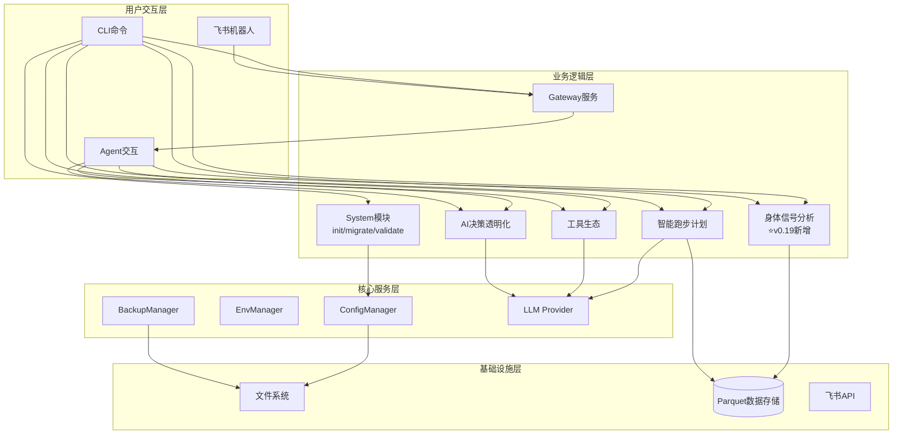
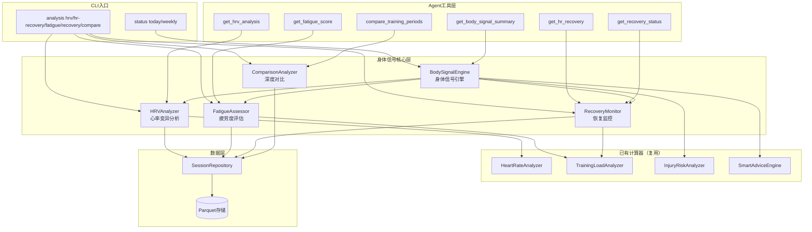
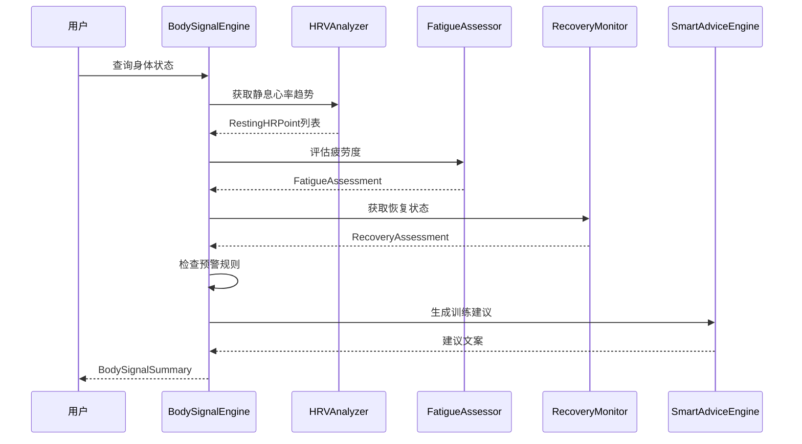

# 架构设计说明书

> **文档版本**: v5.3.0  
> **设计日期**: 2026-04-17  
> **更新日期**: 2026-05-06  
> **当前基线**: v0.19.0  
> **版本目标**: v0.20.0 让数据"预测未来"  
> **需求来源**: REQ_需求规格说明书.md (v5.1)  
> **对齐依据**: 产品规划方案.md (v6.0)  
> **评审依据**: 架构评审报告_v0.19.0.md

> **项目性质说明**: 本项目为**个人使用且个人开发的项目**，所有设计和需求均围绕单人开发和使用场景展开。

---

## 1. 执行摘要

### 1.1 架构演进路线

| 阶段 | 版本 | 核心目标 | 状态 |
|------|------|----------|------|
| 技术底座 | v0.5-v0.9.5 | 数据导入/存储/分析/CLI/依赖注入/SDK化 | ✅ 完成 |
| 智能计划 | v0.10-v0.12 | 自适应训练计划、LLM调整、目标预测 | ✅ 完成 |
| 工具与智能 | v0.13-v0.15 | MCP协议、AI自我诊断、决策透明化 | ✅ 完成 |
| 模块化重构 | v0.16-v0.17 | Core子模块拆分、Hook组合、Subagent、Cron提醒 | ✅ 完成 |
| 可视化导出 | v0.18 | 终端图表(plotext)、多格式导出(CSV/JSON/Parquet) | ✅ 完成 |
| 身体信号 | v0.19 | HRV分析、疲劳度评估、身体信号解读 | ✅ 完成 |
| 预测未来 | v0.20 | 伤病风险预测、VDOT趋势预测、比赛成绩预测 | 📋 计划中 |
| 稳定版 | v1.0 | API冻结、性能优化、完整文档 | 📋 计划中 |

### 1.2 v5.1.0 更新重点

1. 新增数据缺失降级策略（DataQuality枚举、empty_state返回值）— 对应评审Q1
2. 新增边界条件处理规范（单点数据、权重校验、TSB截断）— 对应评审Q2
3. 新增BodySignalConfig配置Schema定义 — 对应评审Q3
4. 新增RPE数据输入路径定义 — 对应评审Q4
5. 新增body_signal模块测试策略 — 对应评审Q5
6. 明确status与analysis命令组职责边界 — 对应评审Q6
7. 整合建议改进项：data_source字段、缓存机制、周对比、RecoveryStatus提升

### 1.3 v5.0.0 更新重点

1. 新增v0.19.0身体信号分析模块架构设计
2. 新增`body_signal`核心子模块（HRV分析/疲劳度评估/恢复监控/身体信号引擎）
3. 新增`status` CLI命令组、扩展`analysis`命令组
4. 新增6个Agent工具
5. 精简已完成版本文档，聚焦当前版本架构

### 1.4 核心设计原则

| 原则 | 策略 |
|------|------|
| **模块化** | 按功能域划分子模块，接口通信 |
| **依赖注入** | AppContext统一管理核心组件 |
| **配置驱动** | Pydantic-Settings + 环境变量覆盖 |
| **类型安全** | frozen dataclass + 类型注解 + mypy |
| **LazyFrame优先** | Polars查询仅在最终输出时collect() |
| **防御性设计** | 数据缺失降级策略 + 边界条件处理 + DataQuality标识 |

---

## 2. 技术栈选型

| 类别 | 选型 | 版本 | 理由 |
|------|------|------|------|
| 语言 | Python | 3.11+ | 现有技术栈，生态成熟 |
| Agent底座 | nanobot-ai | Latest | AI Agent框架，提供基础能力 |
| CLI | Typer + Rich | Latest | 类型安全 + 美观输出 |
| 配置 | Pydantic-Settings | Latest | 类型安全 + 环境变量 |
| 存储 | Apache Parquet | via pyarrow | 列式存储，高性能查询 |
| 计算 | Polars | 0.20+ | LazyFrame优化，高性能 |
| 解析 | fitparse | Latest | FIT文件解析 |
| 可视化 | plotext | Latest | 终端内图表渲染 |
| 包管理 | uv | Latest | 快速依赖管理 |

**nanobot-ai适配**: 配置格式(JSON+Markdown)、环境变量`NANOBOT_`前缀、Workspace标准目录、加载优先级(环境变量>配置文件>默认值)

---

## 3. 系统架构设计

### 3.1 整体架构图（v0.19.0）



### 3.2 CLI命令体系（v0.19.0）

| 命令组 | 命令 | 功能 | 版本 |
|--------|------|------|------|
| system | `init / migrate / validate / config / backup` | 系统管理 | v0.9+ |
| data | `import / stats` | 数据导入与统计 | v0.5+ |
| analysis | `vdot / load / hr-drift` | 数据分析 | v0.8+ |
| analysis | **`hrv / hr-recovery / fatigue / recovery / compare`** | **身体信号分析** | **v0.19** |
| plan | `create / status / feedback` | 训练计划 | v0.10+ |
| report | `weekly / monthly` | 训练报告 | v0.9+ |
| viz | `vdot / load / hr-zones` | 数据可视化 | v0.18+ |
| export | `sessions` | 数据导出 | v0.18+ |
| transparency | `trace / status / insight` | AI透明化 | v0.15+ |
| **status** | **`today / weekly`** | **身体状态速览** | **v0.19** |
| gateway | `start` | 飞书Gateway | v0.9+ |

---

## 4. 已完成模块摘要

> 以下模块已完成开发，仅保留架构要点。详细设计见Git历史版本。

| 模块 | 核心组件 | 关键设计 |
|------|----------|----------|
| **配置管理** (v0.9.4) | InitWizard, MigrationEngine, ConfigValidator, WorkspaceManager | 无配置模式启动、优先级: 环境变量>配置文件>默认值 |
| **智能跑步计划** (v0.10-0.12) | TrainingPlanGenerator, LLMPlanAdjuster, GoalPredictionEngine, PlanCompletionTracker | LLM驱动计划调整、目标达成预测<3s |
| **工具生态** (v0.13) | MCPConfigHelper, ToolManager, WeatherService, MapService | MCP协议集成、本地工具优先、隐私保护 |
| **AI决策透明化** (v0.15) | TransparencyEngine, ObservabilityManager, TraceLogger, TransparencyDisplay | 分层展示(简洁/详细)、数据溯源、全链路追踪 |
| **Core模块化** (v0.16) | diagnosis/memory/personality/skills/validate/tools六大子模块 | 按功能域拆分、接口隔离 |
| **AI底座激活** (v0.17) | Hook组合系统、Subagent架构、异步用户确认、Cron训练提醒 | 流式输出、LLM超时控制 |
| **可视化与导出** (v0.18) | PlotextRenderer, CSV/JSON/ParquetExporter | 终端图表渲染、多格式导出引擎 |
| **飞书通知** (v0.9+) | GatewayServer, FeishuAuth, FeishuNotifier, FeishuCalendar | 异步非阻塞、Token自动刷新、指数退避重试 |

---

## 5. 身体信号分析模块（v0.19.0）⭐

### 5.1 版本目标

**主题**: 让身体信号"会说话"  
**核心目标**: 深度分析与自定义扩展，让跑者读懂身体信号

**用户核心痛点**:
> "我知道心率、功率这些数据很重要，但我看不懂它们之间的关系。为什么今天同样配速心率却更高？我的身体到底恢复好了没有？"

### 5.2 模块架构图



### 5.3 子模块设计

#### 5.3.1 HRV分析器（HRVAnalyzer）

**职责**: 基于现有心率数据，提供心率变异分析能力

**核心接口**:

| 方法 | 参数 | 返回值 | 说明 |
|------|------|--------|------|
| `analyze_hrv(days)` | days: int | HRVAnalysisResult | 综合HRV分析 |
| `get_resting_hr_trend(days)` | days: int | list[RestingHRPoint] | 静息心率趋势 |
| `analyze_hr_recovery(session_id)` | session_id: str | HRRecoveryResult | 心率恢复分析 |
| `check_hr_drift(session_id)` | session_id: str | HRDriftAlert | 心率漂移检测 |

**计算逻辑**:

| 指标 | 计算方法 | 数据来源 |
|------|----------|----------|
| 静息心率 | 活动最低10%心率区间均值 | Parquet心率数据 |
| 恢复率 | (运动末HR - N分钟后HR) / (运动末HR - 静息HR) × 100% | FIT逐秒心率 |
| RMSSD | 基于心率数据估算，标注"非医疗级精度" | FIT逐秒心率 |
| SDNN | 基于心率数据估算 | FIT逐秒心率 |
| 漂移预警 | 漂移>10%时触发 | HeartRateAnalyzer复用 |

**复用关系**: 复用`HeartRateAnalyzer.analyze_hr_drift()`，扩展静息心率趋势和恢复率计算

#### 5.3.2 疲劳度评估器（FatigueAssessor）

**职责**: 综合训练负荷、心率指标、主观感受，量化疲劳状态

**核心接口**:

| 方法 | 参数 | 返回值 | 说明 |
|------|------|--------|------|
| `assess_fatigue()` | 无(取当前状态) | FatigueAssessment | 综合疲劳度评估 |
| `get_consecutive_hard_days()` | 无 | int | 7天内高强度训练天数 |
| `evaluate_rest_effect()` | 无 | RestDayEffect | 休息日效果评估 |

**疲劳度评分模型**:

```
fatigue_score = ATL权重(40%) × ATL维度分
              + 心率偏差权重(20%) × 心率偏差维度分
              + 连续训练权重(20%) × 连续训练维度分
              + 主观疲劳权重(20%) × 主观疲劳维度分
```

**恢复状态判定**:

| 状态 | 条件 | 建议 |
|------|------|------|
| 🟢 GREEN | TSB>10 且 疲劳度<30 | 可安排高强度训练 |
| 🟡 YELLOW | TSB 0~10 或 疲劳度30-60 | 适度训练 |
| 🔴 RED | TSB<0 或 疲劳度>60 | 需要休息 |

**复用关系**: 消费`TrainingLoadAnalyzer`的TSS/ATL/CTL/TSB计算结果

#### 5.3.3 恢复监控器（RecoveryMonitor）

**职责**: 监控恢复状态，评估休息效果

**核心接口**:

| 方法 | 参数 | 返回值 | 说明 |
|------|------|--------|------|
| `get_recovery_status()` | 无 | RecoveryAssessment | 当前恢复状态 |
| `check_rest_day_effect()` | 无 | RestDayEffect | 休息日效果 |
| `get_recovery_trend(days)` | days: int | list[RecoveryPoint] | 恢复趋势 |

**休息日效果评估**:
- 静息心率下降>5% → "休息效果良好"
- TSB上升>10 → "体能恢复明显"

#### 5.3.4 身体信号引擎（BodySignalEngine）

**职责**: 编排HRV/疲劳度/恢复状态，生成异常预警和训练建议

**核心接口**:

| 方法 | 参数 | 返回值 | 说明 |
|------|------|--------|------|
| `get_daily_summary()` | 无 | BodySignalSummary | 每日身体信号摘要 |
| `get_weekly_summary()` | 无 | BodySignalSummary | 每周身体信号摘要 |
| `check_alerts()` | 无 | list[BodySignalAlert] | 异常信号预警 |
| `generate_recommendation()` | 无 | str | 基于状态的训练建议 |

**缓存机制** ⭐S2: 同一自然日内多次查询复用计算结果，避免重复计算

```python
class BodySignalEngine:
    _cache_date: str | None = None
    _cache_daily: BodySignalSummary | None = None

    def get_daily_summary(self) -> BodySignalSummary:
        today = date.today().isoformat()
        if self._cache_date == today and self._cache_daily is not None:
            return self._cache_daily
        result = self._compute_daily_summary()
        self._cache_date = today
        self._cache_daily = result
        return result
```

**缓存失效**: 日期变更时自动失效；`status today` 与 `analysis fatigue` 共享同一引擎实例，同日内仅计算一次

**预警规则**:

| 预警类型 | 触发条件 | 严重度 | 消息 |
|----------|----------|--------|------|
| 静息心率突增 | 较7天均值>10% | warning | "静息心率异常升高，可能未充分恢复" |
| 过度训练 | TSB连续3天<-20 | critical | "持续过度训练状态，建议立即减量" |
| 疲劳度持续上升 | 连续3天疲劳度递增 | warning | "疲劳度持续上升，建议安排恢复日" |

**编排流程**:



#### 5.3.5 深度对比分析器（ComparisonAnalyzer）- P1

**职责**: 支持不同维度的训练数据对比

**核心接口**:

| 方法 | 参数 | 返回值 | 说明 |
|------|------|--------|------|
| `compare_periods(period_a, period_b)` | 两个时间段 | PeriodComparison | 周期对比 |
| `find_similar_sessions(distance, pace)` | 距离±10%, 配速±5% | list[SessionComparison] | 相似训练对比 |
| `analyze_load_performance()` | 无 | LoadPerformanceCorrelation | 负荷-表现关联 |

### 5.4 数据模型

#### 5.4.1 数据质量枚举

```python
class DataQuality(StrEnum):
    """数据质量等级，用于降级策略判断"""
    SUFFICIENT = "sufficient"      # 数据充足，结果可信
    INSUFFICIENT = "insufficient"  # 数据不足，结果仅供参考
    EMPTY = "empty"                # 无数据，无法计算
```

**降级规则**:

| DataQuality | 触发条件 | CLI展示策略 | Agent返回策略 |
|-------------|----------|-------------|---------------|
| SUFFICIENT | 心率数据≥7天 且 最近3天有记录 | 正常展示完整结果 | 返回完整数据 |
| INSUFFICIENT | 心率数据<7天 或 最近3天无记录 | 展示结果并标注"数据不足，仅供参考" | 返回数据 + `data_quality=INSUFFICIENT` |
| EMPTY | 无任何心率/训练数据 | 展示"暂无数据，请先导入训练记录" | 返回空结果 + `data_quality=EMPTY` |

#### 5.4.2 核心数据模型

```python
@dataclass(frozen=True)
class HRVAnalysisResult:
    resting_hr_trend: list[RestingHRPoint]
    hr_recovery_1min: float | None
    hr_recovery_3min: float | None
    estimated_rmssd: float | None
    estimated_sdnn: float | None
    drift_alert: bool
    assessment: str
    data_quality: DataQuality                           # ⭐ Q1: 数据质量标识
    data_source: HRVDataSource | None = None            # ⭐ S1: 数据来源标识

class HRVDataSource(StrEnum):
    """HRV数据来源"""
    RR_INTERVAL = "rr_interval"    # RR间期直接计算（高精度）
    HR_ESTIMATE = "hr_estimate"    # 基于心率数据估算（非医疗级精度）

@dataclass(frozen=True)
class RestingHRPoint:
    date: str
    resting_hr: float
    deviation_pct: float

@dataclass(frozen=True)
class FatigueAssessment:
    fatigue_score: float
    recovery_status: RecoveryStatus
    consecutive_hard_days: int
    rest_day_effect: RestDayEffect | None
    breakdown: FatigueBreakdown
    recommendation: str
    data_quality: DataQuality                           # ⭐ Q1: 数据质量标识

class RecoveryStatus(StrEnum):
    GREEN = "green"
    YELLOW = "yellow"
    RED = "red"

# ⭐ S4: RecoveryStatus 定义于 src/core/models/recovery.py（共用模块），
# 供 body_signal 和 InjuryRiskAnalyzer 共同引用，避免循环依赖

@dataclass(frozen=True)
class FatigueBreakdown:
    atl_component: float
    hr_deviation_component: float
    consecutive_component: float
    subjective_component: float

@dataclass(frozen=True)
class BodySignalSummary:
    date: str
    recovery_status: RecoveryStatus
    fatigue_score: float
    alerts: list[BodySignalAlert]
    daily_summary: str
    recommendation: str
    data_quality: DataQuality                           # ⭐ Q1: 数据质量标识

@dataclass(frozen=True)
class BodySignalAlert:
    alert_type: str
    severity: str
    message: str
    related_metrics: list[str]

@dataclass(frozen=True)
class RecoveryAssessment:
    recovery_status: RecoveryStatus
    rest_day_effect: RestDayEffect | None
    recovery_trend: list[RecoveryPoint]
    data_quality: DataQuality                           # ⭐ Q1: 数据质量标识

@dataclass(frozen=True)
class HRRecoveryResult:
    session_id: str
    hr_end: float
    hr_1min: float | None
    hr_3min: float | None
    recovery_rate_1min: float | None
    recovery_rate_3min: float | None
    data_quality: DataQuality                           # ⭐ Q1: 数据质量标识

@dataclass(frozen=True)
class RestDayEffect:
    resting_hr_change_pct: float
    tsb_change: float
    effect_level: str   # "good" / "moderate" / "minimal"

@dataclass(frozen=True)
class RecoveryPoint:
    date: str
    tsb: float
    resting_hr: float | None

@dataclass(frozen=True)
class PeriodComparison:
    period_a_label: str
    period_b_label: str
    metrics_diff: dict[str, float]
    data_quality: DataQuality                           # ⭐ Q1: 数据质量标识
```

#### 5.4.3 各分析器empty_state返回值定义

| 分析器 | EMPTY状态返回 | INSUFFICIENT状态返回 |
|--------|---------------|---------------------|
| HRVAnalyzer | `HRVAnalysisResult(resting_hr_trend=[], hr_recovery_1min=None, ..., data_quality=EMPTY, data_source=None)` | 趋势仅含已有数据点，RMSSD/SDNN返回None，`data_quality=INSUFFICIENT` |
| FatigueAssessor | `FatigueAssessment(fatigue_score=0.0, recovery_status=GREEN, ..., data_quality=EMPTY)` | 基于已有数据计算，缺失维度权重自动分配，`data_quality=INSUFFICIENT` |
| RecoveryMonitor | `RecoveryAssessment(recovery_status=GREEN, rest_day_effect=None, recovery_trend=[], data_quality=EMPTY)` | 趋势仅含已有数据点，`data_quality=INSUFFICIENT` |
| BodySignalEngine | `BodySignalSummary(date=today, recovery_status=GREEN, fatigue_score=0.0, alerts=[], daily_summary="暂无数据", recommendation="请先导入训练记录", data_quality=EMPTY)` | 降级摘要，`data_quality=INSUFFICIENT` |
| ComparisonAnalyzer | `PeriodComparison(period_a_label=..., period_b_label=..., metrics_diff={}, data_quality=EMPTY)` | 仅对比有数据的指标，`data_quality=INSUFFICIENT` |

### 5.5 边界条件处理规范 ⭐Q2

| 场景 | 处理规则 | 实现位置 |
|------|----------|----------|
| 静息心率趋势仅1个数据点 | 趋势图显示单点标记而非折线，`deviation_pct`返回0.0，CLI提示"数据不足，无法判断趋势" | HRVAnalyzer |
| 疲劳度各维度权重之和≠100% | `BodySignalConfig.__post_init__()` 中 `assert sum(weights) == 100%`，初始化时校验 | BodySignalConfig |
| TSB极端值（如±50以上） | TSB截断至[-50, 50]区间：`tsb_clamped = max(-50, min(50, tsb))`，避免评分失真 | FatigueAssessor |
| 心率恢复分析无逐秒数据 | `HRRecoveryResult` 中 `hr_1min/hr_3min/recovery_rate_*` 全部返回None，`data_quality=INSUFFICIENT` | HRVAnalyzer |
| 连续高强度训练天数为0 | `consecutive_component` 维度分=0，权重自动分配给其他维度 | FatigueAssessor |
| 对比周期无重叠指标 | `PeriodComparison.metrics_diff` 仅包含两周期均有的指标，缺失指标标注"N/A" | ComparisonAnalyzer |
| 恢复趋势数据点<3 | 趋势图显示散点而非趋势线，CLI提示"恢复趋势需更多数据" | RecoveryMonitor |

### 5.6 配置Schema定义 ⭐Q3

遵循现有 `AppConfig` / `LLMConfig` 的 `@dataclass(frozen=True)` 模式，新增 `BodySignalConfig`：

```python
@dataclass(frozen=True)
class BodySignalConfig:
    """身体信号分析配置

    遵循项目配置优先级：环境变量 > 配置文件 > 默认值
    环境变量前缀：NANOBOT_BODY_SIGNAL_

    Attributes:
        fatigue_weight_atl: ATL维度权重（%）
        fatigue_weight_hr: 心率偏差维度权重（%）
        fatigue_weight_consecutive: 连续训练维度权重（%）
        fatigue_weight_subjective: 主观疲劳维度权重（%）
        hr_spike_threshold_pct: 静息心率突增阈值（%）
        overtraining_tsb_threshold: 过度训练TSB阈值
        overtraining_consecutive_days: 过度训练连续天数
        fatigue_rising_consecutive_days: 疲劳度上升连续天数
        hrv_trend_days: HRV趋势分析天数
        tsb_clamp_range: TSB截断范围（正负值）
    """
    fatigue_weight_atl: float = 40.0
    fatigue_weight_hr: float = 20.0
    fatigue_weight_consecutive: float = 20.0
    fatigue_weight_subjective: float = 20.0
    hr_spike_threshold_pct: float = 10.0
    overtraining_tsb_threshold: float = -20.0
    overtraining_consecutive_days: int = 3
    fatigue_rising_consecutive_days: int = 3
    hrv_trend_days: int = 30
    tsb_clamp_range: float = 50.0

    def __post_init__(self) -> None:
        total_weight = (
            self.fatigue_weight_atl
            + self.fatigue_weight_hr
            + self.fatigue_weight_consecutive
            + self.fatigue_weight_subjective
        )
        if abs(total_weight - 100.0) > 0.01:
            raise ValueError(
                f"疲劳度权重之和必须为100%，当前为{total_weight}%"
            )
```

**配置存储位置**: `config.json` 中新增 `body_signal` 字段

```json
{
  "version": "0.19.0",
  "data_dir": "~/.nanobot-runner/data",
  "body_signal": {
    "fatigue_weight_atl": 40.0,
    "fatigue_weight_hr": 20.0,
    "fatigue_weight_consecutive": 20.0,
    "fatigue_weight_subjective": 20.0,
    "hr_spike_threshold_pct": 10.0
  }
}
```

**环境变量覆盖**: `NANOBOT_BODY_SIGNAL_FATIGUE_WEIGHT_ATL=35.0`

**读取方式**: `ConfigManager.load_config()` 读取 `body_signal` 字段，通过 `BodySignalConfig.from_dict()` 创建实例

### 5.7 RPE数据输入路径 ⭐Q4

疲劳度模型依赖主观疲劳度(RPE)，定义三级数据获取策略：

| 优先级 | 数据来源 | 实现方式 | 降级处理 |
|--------|----------|----------|----------|
| 1️⃣ | FIT文件中的 `perceived_effort` 字段 | `FitParser` 解析时提取，存入Parquet的 `perceived_effort` 列 | 若字段不存在，跳过 |
| 2️⃣ | CLI手动输入 | `analysis fatigue --rpe 6` 命令参数，单次覆盖 | 若未提供，跳过 |
| 3️⃣ | 缺失时自动降级 | RPE维度权重自动分配给其他三维度（按比例） | `subjective_component=0`，权重重分配 |

**权重重分配逻辑**:

```python
def _redistribute_rpe_weight(config: BodySignalConfig) -> tuple[float, float, float]:
    total_other = config.fatigue_weight_atl + config.fatigue_weight_hr + config.fatigue_weight_consecutive
    scale = (total_other + config.fatigue_weight_subjective) / total_other
    return (
        config.fatigue_weight_atl * scale,
        config.fatigue_weight_hr * scale,
        config.fatigue_weight_consecutive * scale,
    )
```

**CLI命令扩展**:

```bash
# 不带RPE：自动从FIT数据读取，无则降级
nanobotrun analysis fatigue

# 手动指定RPE：覆盖FIT数据中的值
nanobotrun analysis fatigue --rpe 6
```

### 5.8 CLI命令组职责边界 ⭐Q6

| 维度 | `status` 命令组 | `analysis` 命令组 |
|------|-----------------|-------------------|
| **定位** | 快速摘要，一眼看懂 | 深度分析，详细数据 |
| **响应时间** | < 500ms | < 2s |
| **输出格式** | 一句话结论 + 三色灯状态 | 完整数据表 + 趋势图 + 详细建议 |
| **数据来源** | BodySignalEngine编排结果 | 各子分析器直接结果 |
| **使用场景** | "今天能跑吗？" | "我的HRV趋势如何？" |
| **命令** | `status today` / `status weekly` | `analysis hrv` / `analysis fatigue` / ... |

**CLI Help 文案**:
- `status`: "快速查看身体状态（一句话+三色灯）"
- `analysis`: "深入分析身体信号（完整数据+趋势+建议）"

**`status weekly` 周对比增强** ⭐S3: 输出增加与上周的对比摘要，如"静息心率较上周↓2bpm，恢复趋势向好"

### 5.9 测试策略 ⭐Q5

#### 5.9.1 单元测试

| 测试对象 | 覆盖重点 | Mock策略 | 目标覆盖率 |
|----------|----------|----------|-----------|
| HRVAnalyzer | 静息心率计算、HRV估算、心率恢复率、漂移检测 | Mock `SessionRepository` | ≥85% |
| FatigueAssessor | 疲劳度评分计算、权重分配、RPE降级、TSB截断 | Mock `TrainingLoadAnalyzer` | ≥85% |
| RecoveryMonitor | 恢复状态判定、休息日效果、恢复趋势 | Mock `SessionRepository` | ≥85% |
| BodySignalEngine | 编排流程、预警规则触发、降级摘要生成 | Mock 子分析器 | ≥80% |
| ComparisonAnalyzer | 周期对比、相似训练查找、负荷-表现关联 | Mock `SessionRepository` | ≥80% |

**测试目录结构**:

```
tests/unit/core/body_signal/
├── __init__.py
├── test_hrv_analyzer.py
├── test_fatigue_assessor.py
├── test_recovery_monitor.py
├── test_body_signal_engine.py
├── test_comparison_analyzer.py
└── test_models.py
```

#### 5.9.2 集成测试

| 测试场景 | 验证内容 |
|----------|----------|
| BodySignalEngine端到端 | 从Parquet读取到生成BodySignalSummary的完整流程 |
| CLI命令集成 | `status today` / `analysis hrv` 命令正确调用Handler |
| Agent工具集成 | 6个Agent工具正确调用核心模块并返回JSON |

#### 5.9.3 边界测试

| 场景 | 验证内容 |
|------|----------|
| 空数据 | 所有分析器返回 `data_quality=EMPTY` 的正确empty_state |
| 单点数据 | 趋势显示N/A而非折线，`data_quality=INSUFFICIENT` |
| 极端TSB值 | TSB=60时截断为50，评分不失真 |
| 权重校验 | 权重之和≠100%时 `BodySignalConfig` 抛出 `ValueError` |
| RPE缺失 | 主观疲劳维度权重正确重分配 |

#### 5.9.4 性能测试

| 指标 | 目标 | 测试方法 |
|------|------|----------|
| 身体状态查询 | < 2秒 | 500条年度数据全量计算 |
| HRV分析 | < 1秒 | 30天静息心率趋势 |
| 疲劳度评估 | < 500ms | 加权评分计算 |
| 深度对比 | < 3秒 | 周期对比含Polars聚合 |

### 5.10 AppContext集成

```python
@dataclass
class AppContext:
    # ... 已有组件 ...
    config: ConfigManager
    storage: StorageManager
    session_repo: SessionRepository
    analytics: AnalyticsEngine
    plan_manager: PlanManager
    # v0.19新增（懒加载）
    @property
    def hrv_analyzer(self) -> HRVAnalyzer: ...
    @property
    def fatigue_assessor(self) -> FatigueAssessor: ...
    @property
    def recovery_monitor(self) -> RecoveryMonitor: ...
    @property
    def body_signal_engine(self) -> BodySignalEngine: ...
    @property
    def comparison_analyzer(self) -> ComparisonAnalyzer: ...
```

**懒加载模式**: 遵循现有`training_response_analyzer`等属性的懒加载模式，首次访问时创建实例并缓存到`_extensions`

### 5.11 Agent工具映射

| 工具名 | 核心模块 | 输入 | 输出 |
|--------|----------|------|------|
| `get_hrv_analysis` | HRVAnalyzer | days: int | HRVAnalysisResult |
| `get_hr_recovery` | RecoveryMonitor | 无(取最近训练) | HRRecoveryResult |
| `get_fatigue_score` | FatigueAssessor | 无(取当前状态) | FatigueAssessment |
| `get_recovery_status` | RecoveryMonitor | 无(取当前状态) | RecoveryAssessment |
| `get_body_signal_summary` | BodySignalEngine | period: str | BodySignalSummary |
| `compare_training_periods` | ComparisonAnalyzer | period_a, period_b | PeriodComparison |

### 5.12 目录结构

```
src/core/body_signal/          # ⭐ v0.19新增子模块
├── __init__.py
├── hrv_analyzer.py            # HRV分析器
├── fatigue_assessor.py        # 疲劳度评估器
├── recovery_monitor.py        # 恢复监控器
├── body_signal_engine.py      # 身体信号引擎（编排层）
├── comparison_analyzer.py     # 深度对比分析器(P1)
└── models.py                  # 模块内数据模型

src/core/models/
└── recovery.py                # ⭐ v0.19新增: RecoveryStatus/DataQuality共用枚举

src/core/config/
└── body_signal_config.py      # ⭐ v0.19新增: BodySignalConfig配置Schema

src/cli/commands/
├── status.py                  # ⭐ v0.19新增命令组
└── analysis.py                # 扩展: hrv/hr-recovery/fatigue/recovery/compare

src/cli/handlers/
└── status_handler.py          # ⭐ v0.19新增Handler

src/agents/tools.py            # 扩展: 6个新工具类

tests/unit/core/body_signal/   # ⭐ v0.19新增测试目录
├── __init__.py
├── test_hrv_analyzer.py
├── test_fatigue_assessor.py
├── test_recovery_monitor.py
├── test_body_signal_engine.py
├── test_comparison_analyzer.py
└── test_models.py
```

### 5.13 性能要求

| 指标 | 要求 | 说明 |
|------|------|------|
| 身体状态查询 | < 2秒 | 包含HRV+疲劳度+恢复状态全量计算 |
| HRV分析 | < 1秒 | 30天静息心率趋势 |
| 疲劳度评估 | < 500ms | 加权评分计算 |
| 深度对比 | < 3秒 | 周期对比含Polars聚合 |

### 5.14 风险与缓解

| 风险 | 等级 | 缓解措施 | 残留风险 |
|------|------|----------|----------|
| HRV估算准确性 | 🔴 高 | ①明确标注"非医疗级精度" ②`data_source`字段区分RR间期/心率估算 ③优先展示静息心率趋势和恢复率 | 用户可能忽略精度提示，过度解读HRV数值 |
| 疲劳度模型普适性 | 🟡 中 | ①权重可配置(`BodySignalConfig`) ②RPE缺失时自动降级 ③未来提供"校准模式" | 校准需要用户持续反馈，初期准确性有限 |
| FIT数据中RR间期缺失 | 🟡 中 | ①检测RR间期数据是否存在 ②不存在时`data_source=HR_ESTIMATE`，RMSSD/SDNN返回None ③降级提示"当前设备不支持HRV精确计算" | 部分用户无法使用HRV功能 |
| 用户过度依赖指标 | 🟡 中 | ①UI中强调"倾听身体" ②异常预警附带免责声明 | 用户行为改变需要时间 |
| 需求依赖链断裂 | 🟡 中 | ①BodySignalEngine松耦合：子分析器返回空结果时引擎仍可输出降级摘要 ②开发顺序：HRV→疲劳度→引擎，但引擎骨架可并行搭建 | 若HRV分析器延期，引擎的预警功能受限 |

---

## 6. 部署架构

**环境隔离**: 开发/生产共用本地环境，通过配置文件区分  
**部署方式**: `uv run nanobotrun` 本地运行  
**数据目录**: `~/.nanobotrun/` (可配置)  
**备份策略**: `nanobotrun system backup` 手动触发

---

## 7. 变更记录

| 版本 | 日期 | 变更内容 |
|------|------|----------|
| v5.1.0 | 2026-05-05 | 基于架构评审报告v0.19.0更新：新增数据缺失降级策略(Q1)、边界条件处理规范(Q2)、BodySignalConfig配置Schema(Q3)、RPE数据输入路径(Q4)、测试策略(Q5)、CLI命令组职责边界(Q6)；整合建议改进项：data_source字段(S1)、缓存机制(S2)、周对比增强(S3)、RecoveryStatus共用模块(S4) |
| v5.0.0 | 2026-05-05 | 新增v0.19.0身体信号分析模块架构；精简已完成版本文档；更新整体架构图 |
| v4.2.0 | 2026-05-03 | 新增v0.17.0 AI底座能力全面激活架构设计 |
| v4.0.0 | 2026-04-17 | 新增v0.13-v0.16架构设计 |
