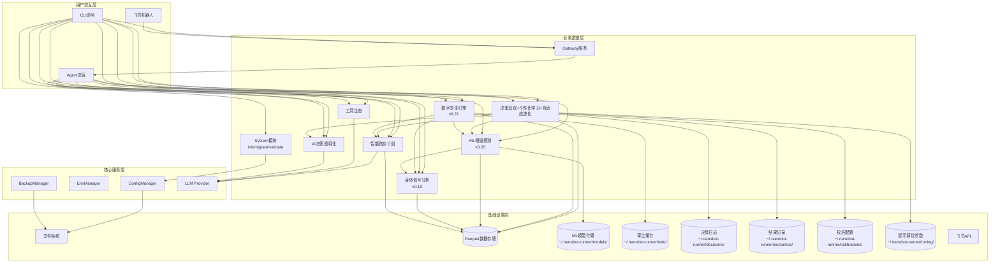
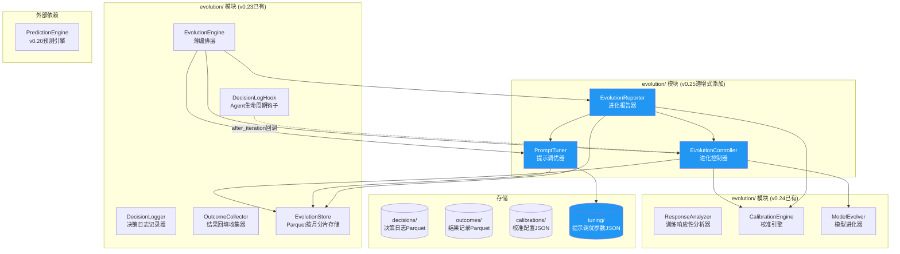
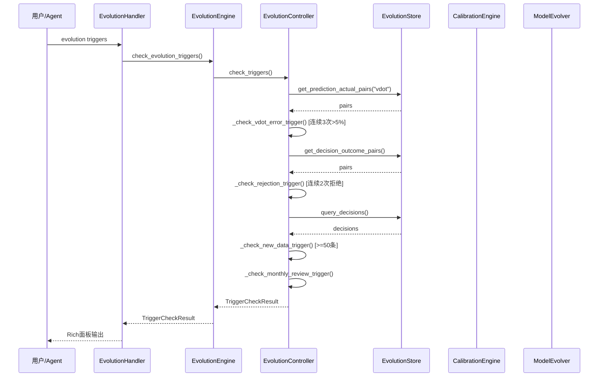
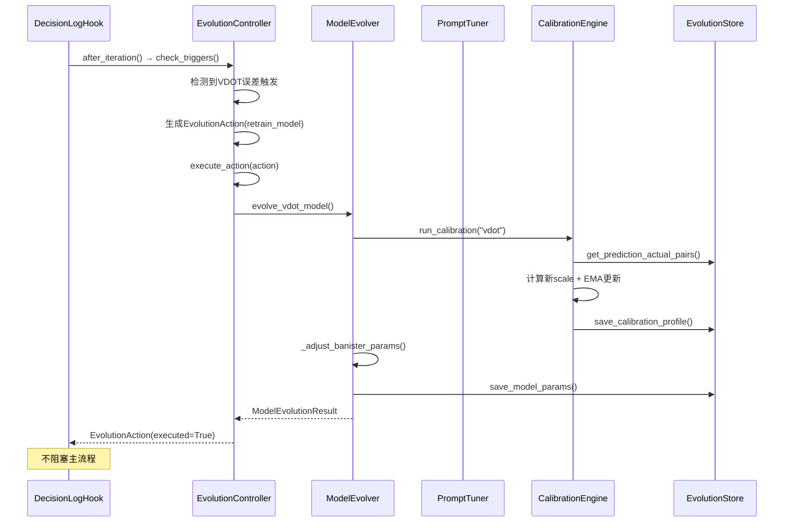
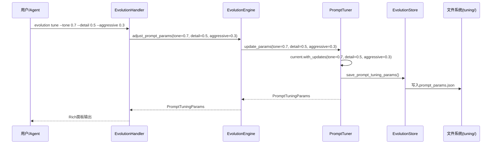
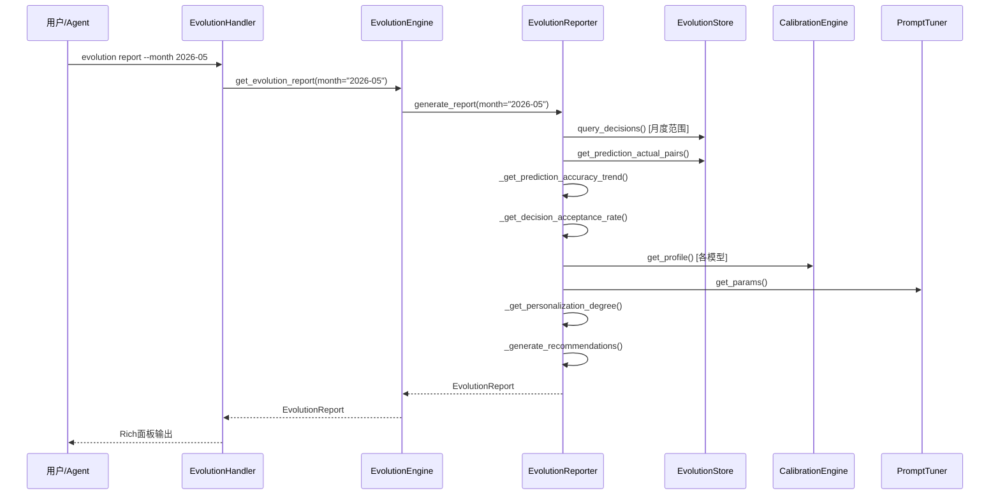

# 架构设计说明书

> **文档版本**: v12.0.2
> **设计日期**: 2026-04-17
> **更新日期**: 2026-05-22
> **当前基线**: v0.23.0
> **版本目标**: v0.25.0 自适应进化引擎（Adaptive Evolution） 📋 当前规划
> **需求来源**: REQ_需求规格说明书.md (v10.0) + REQ_产品演进需求规格说明书.md (v1.0)
> **对齐依据**: 产品规划方案.md (v10.0)
> **外部参考**: 产品演进设计.md (v1.0) + multiagents.md (多智能体架构分析)
> **评审依据**: 架构评审报告_v0.24.0.md

> **项目性质说明**: 本项目为**个人使用且个人开发的项目**，所有设计和需求均围绕单人开发和使用场景展开。

***

## 1. 执行摘要

### 1.1 架构演进路线

| 阶段    | 版本          | 核心目标                                  | 状态     |
| ----- | ----------- | ------------------------------------- | ------ |
| 技术底座  | v0.5-v0.9.5 | 数据导入/存储/分析/CLI/依赖注入/SDK化              | ✅ 完成   |
| 智能计划  | v0.10-v0.12 | 自适应训练计划、LLM调整、目标预测                    | ✅ 完成   |
| 工具与智能 | v0.13-v0.15 | MCP协议、AI自我诊断、决策透明化                    | ✅ 完成   |
| 模块化重构 | v0.16-v0.17 | Core子模块拆分、Hook组合、Subagent、Cron提醒      | ✅ 完成   |
| 可视化导出 | v0.18       | 终端图表(plotext)、多格式导出(CSV/JSON/Parquet) | ✅ 完成   |
| 身体信号  | v0.19       | HRV分析、疲劳度评估、身体信号解读                    | ✅ 完成   |
| 预测未来  | v0.20       | ML增强预测（VDOT趋势/比赛成绩/伤病风险）              | ✅ 完成   |
| 数字孪生  | v0.21       | 跑者状态向量、What-If推演、计划对比                 | ✅ 完成   |
| 质量收口 | v0.22       | UAT验证、缺陷收敛、质量兜底、需求洞察       | ✅ 完成   |
| 决策追踪  | v0.23       | 决策日志、结果回填、预测校准                        | ✅ 已完成 |
| 个性化学习 | v0.24       | 训练响应性分析、个人化模型进化                       | 📋 当前规划 |
| 自适应进化 | v0.25       | 提示策略优化、自动进化触发                         | 📋 规划中 |
| 稳定版   | v1.0        | API冻结、性能优化、完整文档                       | 📋 计划中 |

### 1.2 当前版本重点

**v12.0.x (v0.25 自适应进化引擎架构设计)**:
- C-01: execute_action()调整为「先持久化，后生效」执行策略，持久化失败不修改实例属性
- C-02: check_triggers()性能优化——性能预算<50ms、查询范围限制days=90、trigger_state缓存、超50ms输出warning
- M-03: 补充_load_last_incremental_count()完整实现逻辑，明确trigger_state.json Schema
- 新增EvolutionController(进化控制器)、PromptTuner(提示调优器)、EvolutionReporter(进化报告器)
- ADR-009: 进化触发器采用规则引擎+异步执行(threading.Thread daemon=True)
- ADR-010: 提示调优采用4维连续参数空间(语气/信息密度/推荐激进/数据驱动)
- 新增CLI命令: `evolution triggers/report/tune`; 新增3个Agent工具
- v0.23+v0.24+v0.25三层架构构成完整进化闭环：决策→校准→优化→更好决策

**v11.x (v0.24 个性化学习架构设计)**:
- 新增ResponseAnalyzer(训练响应性分析器)、CalibrationEngine(校准引擎)、ModelEvolver(模型进化器)
- ADR-008: 校准引擎采用线性修正(corrected=raw×scale)+EMA(α=0.7)更新，幅度上限±10%
- Fidelity公式升级为三维度(体积0.40+强度0.30+时间0.30)
- 新增CLI命令: `evolution calibration/response`; 新增2个Agent工具
- 校准配置JSON存储于calibrations/目录，无侵入原则PredictionEngine零修改

**v10.x (v0.23 决策追踪架构设计)**:
- ADR-007: DecisionLogHook直接继承AgentHook，独立注册消除状态竞争
- DecisionLog+OutcomeRecord分离数据模型，Parquet按月分片存储
- Execution_status五态统一: pending/executed/skipped/modified/failed
- 新增evolution CLI命令组(history/feedback/accuracy/fidelity/status)及4个Agent工具

**设计决策索引**: ADR-007~ADR-010详见各版本子章节

### 1.3 核心设计原则

| 原则              | 策略                                    |
| --------------- | ------------------------------------- |
| **模块化**         | 按功能域划分子模块，接口通信                        |
| **依赖注入**        | AppContext统一管理核心组件                    |
| **配置驱动**        | Pydantic-Settings + 环境变量覆盖            |
| **类型安全**        | frozen dataclass + 类型注解 + mypy        |
| **LazyFrame优先** | Polars查询仅在最终输出时collect()              |
| **防御性设计**       | 数据缺失降级策略 + 边界条件处理 + DataQuality标识     |
| **ML渐进增强**      | 参数化基线→ML增强，数据不足自动降级，绝不阻塞用户            |
| **可解释ML**       | SHAP特征归因 + prediction\_type标注 + 置信度量化 |

***

## 2. 技术栈选型

| 类别        | 选型                | 版本              | 理由                              |
| --------- | ----------------- | --------------- | ------------------------------- |
| 语言        | Python            | **≥**3.11,<3.13 | 现有技术栈，生态成熟                      |
| Agent底座   | nanobot-ai        | Latest          | AI Agent框架，提供基础能力               |
| CLI       | Typer + Rich      | Latest          | 类型安全 + 美观输出                     |
| 配置        | Pydantic-Settings | Latest          | 类型安全 + 环境变量                     |
| 存储        | Apache Parquet    | via pyarrow     | 列式存储，高性能查询                      |
| 计算        | Polars            | 0.20+           | LazyFrame优化，高性能                 |
| 解析        | fitparse          | Latest          | FIT文件解析                         |
| 可视化       | plotext           | Latest          | 终端内图表渲染                         |
| 包管理       | uv                | Latest          | 快速依赖管理                          |
| **ML核心**  | **scikit-learn**  | **≥1.3.0**      | **轻量ML库，回归/分类/特征工程，适配本地单人场景**   |
| **科学计算**  | **scipy**         | **≥1.10.0**     | **Riegel曲线拟合(curve\_fit)、统计检验** |
| **特征解释**  | **shap**          | **≥0.48.0**     | **SHAP值特征重要性分析，可解释ML**          |
| **模型持久化** | **joblib**        | **≥1.3.0**      | **sklearn模型序列化，随sklearn安装**     |

**nanobot-ai适配**: 配置格式(JSON+Markdown)、环境变量`NANOBOT_`前缀、Workspace标准目录、加载优先级(环境变量>配置文件>默认值)

***

## 3. 系统架构设计

### 3.1 整体架构图



### 3.2 CLI命令体系

| 命令组          | 命令                                                 | 功能         | 版本        |
| ------------ | -------------------------------------------------- | ---------- | --------- |
| system       | `init / migrate / validate / config / backup`      | 系统管理       | v0.9+     |
| data         | `import / stats`                                   | 数据导入与统计    | v0.5+     |
| analysis     | `vdot / load / hr-drift`                           | 数据分析       | v0.8+     |
| analysis     | `hrv / hr-recovery / fatigue / recovery / compare` | 身体信号分析     | v0.19     |
| plan         | `create / status / feedback`                       | 训练计划       | v0.10+    |
| report       | `weekly / monthly`                                 | 训练报告       | v0.9+     |
| viz          | `vdot / load / hr-zones`                           | 数据可视化      | v0.18+    |
| export       | `sessions`                                         | 数据导出       | v0.18+    |
| transparency | `trace / status / insight`                         | AI透明化      | v0.15+    |
| status       | `today / weekly`                                   | 身体状态速览     | v0.19     |
| predict      | `status / vdot / race / injury-risk / model`       | ML增强预测     | v0.20     |
| twin         | `status / simulate / compare`                      | 数字孪生       | v0.21     |
| **evolution**| **`history / feedback / accuracy / fidelity / status / calibration / response / triggers / report / tune`** | **决策追踪+个性化学习+自适应进化** | **v0.23+v0.24+v0.25** |
| gateway      | `start`                                            | 飞书Gateway  | v0.9+     |

***

## 4. 已完成模块摘要

> 以下模块已完成开发，仅保留架构要点。详细设计见Git历史版本。

| 模块                      | 核心组件                                                                                | 关键设计                       |
| ----------------------- | ----------------------------------------------------------------------------------- | -------------------------- |
| **配置管理** (v0.9.4)       | InitWizard, MigrationEngine, ConfigValidator, WorkspaceManager                      | 无配置模式启动、优先级: 环境变量>配置文件>默认值 |
| **智能跑步计划** (v0.10-0.12) | TrainingPlanGenerator, LLMPlanAdjuster, GoalPredictionEngine, PlanCompletionTracker | LLM驱动计划调整、目标达成预测<3s        |
| **工具生态** (v0.13)        | MCPConfigHelper, ToolManager, WeatherService, MapService                            | MCP协议集成、本地工具优先、隐私保护        |
| **AI决策透明化** (v0.15)     | TransparencyEngine, ObservabilityManager, TraceLogger, TransparencyDisplay          | 分层展示(简洁/详细)、数据溯源、全链路追踪     |
| **Core模块化** (v0.16)     | diagnosis/memory/personality/skills/validate/tools六大子模块                             | 按功能域拆分、接口隔离                |
| **AI底座激活** (v0.17)      | Hook组合系统、Subagent架构、异步用户确认、Cron训练提醒                                                 | 流式输出、LLM超时控制               |
| **可视化与导出** (v0.18)      | PlotextRenderer, CSV/JSON/ParquetExporter                                           | 终端图表渲染、多格式导出引擎             |
| **飞书通知** (v0.9+)        | GatewayServer, FeishuAuth, FeishuNotifier, FeishuCalendar                           | 异步非阻塞、Token自动刷新、指数退避重试     |

***

## 5. 身体信号分析模块（v0.19.0）⭐


> **状态**: 已完成开发。详细设计见Git历史版本。

**核心架构**: HRVAnalyzer(心率变异) + FatigueAssessor(疲劳度评估) + RecoveryMonitor(恢复监控) + BodySignalEngine(编排层)。复用TrainingLoadAnalyzer/HeartRateAnalyzer计算结果，新增DataQuality三级降级策略(SUFFICIENT/INSUFFICIENT/EMPTY)。

**关键设计**: 同日缓存机制(BodySignalEngine)、RPE三级输入路径(FIT字段->CLI参数->自动降级)、TSB截断至[-50,50]、静息心率突增>10%预警。

**新增CLI**: status today/weekly, analysis hrv/hr-recovery/fatigue/recovery/compare

**新增Agent工具**: get_hrv_analysis, get_hr_recovery, get_fatigue_score, get_recovery_status, get_body_signal_summary, compare_training_periods

## 6. ML增强预测模块（v0.20.0）✅ 已完成

> **状态**: 已完成开发。详细设计见Git历史版本。

**核心架构**: PredictionEngine(统一入口) + VDOTPredictor/RacePredictor/InjuryPredictor(三大预测器) + FeatureEngine(特征工程) + DataAssessor(数据充足度评估) + ModelManager(模型生命周期)。

**关键设计**:
- **三层降级策略**: ML增强(GradientBoosting+SHAP) -> 参数化基线(Banister IR/逻辑回归) -> 基础预测(线性回归/规则阈值)
- **不确定性量化**: 分位数回归(p10/p50/p90)输出置信区间
- **伤病风险分层**: 规则基线->逻辑回归(CalibratedClassifierCV)->GBDT集成(4:6加权)
- **冷启动**: Banister IR参数化模型填补200-400条数据空白
- **缓存机制**: PredictionEngine同日缓存 + FeatureEngine特征矩阵缓存

**新增CLI**: predict status/vdot/race/injury-risk/model

**新增Agent工具**: predict_vdot_trend, predict_race_result, predict_injury_risk, check_prediction_status, manage_prediction_model, report_injury, predict_training_response

**模型存储**: ~/.nanobot-runner/models/ (joblib格式)

## 7. 数字孪生引擎模块（v0.21.0）✅ 已完成

> **状态**: 已完成开发。详细设计见Git历史版本。

**核心架构**: DigitalTwinEngine(薄编排层) + StateVectorBuilder(5维度状态向量构建器) + WhatIfSimulator(逐周推演器)。复用v0.20 PredictionEngine/v0.19 BodySignalEngine/v0.12 TrainingLoadAnalyzer。

**关键设计**:
- **薄编排层架构**: DigitalTwinEngine聚合现有模块输出，不引入新状态转移引擎，YAGNI原则
- **5维度状态向量**: 体能(VDOT/趋势/VO2max) / 负荷(CTL/ATL/TSB/ACWR) / 身体信号(疲劳/恢复/静息心率/HRV) / 风险(7d/28d伤病风险/过度训练) / 训练模式(周跑量/强度分布/长距离频率)
- **状态向量缓存**: TTL=24h，存储于 `~/.nanobot-runner/twin/state_vector.json`
- **三层推演降级**: ML增强(每周衰减5%) -> 参数化(每周衰减8%) -> 基础(每周衰减12%)
- **计划对比评分**: VDOT提升(40%) + 伤病风险(35%) + 恢复余量(25%)

**新增CLI**: twin status/simulate/compare

**新增Agent工具**: get_runner_state, simulate_plan, compare_plans

**代码库结构**:
```
src/core/twin/
├── __init__.py, models.py, twin_engine.py, state_vector_builder.py, whatif_simulator.py
src/cli/commands/twin.py, src/cli/handlers/twin_handler.py
tests/unit/core/twin/
```

**成功标准**: 4周VDOT推演误差<8%、单计划推演<10秒、推荐一致率>70%、核心模块测试覆盖率≥80%

***

## 8. v0.22-v0.25 模块骨架设计

### 8.1 v0.22 质量收口（Quality Stabilization）✅ 已完成

> **状态**: 已完成。详细记录见Git历史版本。

**核心交付**: UAT验证 + 缺陷收敛 + 质量兜底 + 需求洞察
**关键产出**: 数字孪生/ML预测/身体信号/数据管理/系统性能五大模块UAT验证、修复10+高优先级缺陷（修复率100%）、文档同步与版本归档
**质量目标**: 核心模块测试覆盖率≥80%、性能基准达标、文档与代码版本一致

### 8.2 v0.23 决策追踪（Decision Tracking）✅ 已完成

> **状态**: 已完成开发。详细设计见Git历史版本。

**核心架构**: EvolutionEngine(薄编排层) + DecisionLogger(决策日志记录器) + OutcomeCollector(结果收集器) + EvolutionStore(Parquet按月分片存储) + DecisionLogHook(Agent生命周期钩子)。复用transparency模块DecisionType枚举，独立继承AgentHook避免状态竞争。

**关键设计**:
- ADR-007: DecisionLogHook直接继承AgentHook（非ObservabilityHook），独立Hook注册消除状态竞争
- 每次Agent对话产生一条DecisionLog，异常不产生不完整记录
- Parquet按月分片存储（decisions/ + outcomes/），默认同步写入+异步错误恢复（队列+重试+降级+WAL）
- execution_status五态统一: pending/executed/skipped/modified/failed
- fidelity简化公式: 1 - (0.55×体积偏差 + 0.45×时间偏差)，强度偏差延后v0.24
- AppContext共享单一EvolutionStore实例，create_composite_hook()可选注册DecisionLogHook避免循环依赖

**新增CLI**: evolution history/feedback/accuracy/fidelity/status

**新增Agent工具**: record_feedback, check_plan_execution, check_prediction_accuracy, get_decision_history

**代码库结构**:
```
src/core/evolution/
├── __init__.py, models.py, config.py
├── decision_logger.py, outcome_collector.py
├── evolution_store.py, evolution_engine.py
└── decision_log_hook.py
src/agents/tools_evolution.py
src/cli/commands/evolution.py
src/cli/handlers/evolution_handler.py
tests/unit/core/evolution/
```

**成功标准**: 单条决策日志写入<50ms、决策查询<500ms、回填率>80%、Agent工具覆盖率≥80%、核心模块覆盖率≥85%

### 8.3 v0.24 个性化学习（Personalized Learning）✅ 已完成

> **状态**: 已完成开发。详细设计见Git历史版本。

**核心架构**: ResponseAnalyzer(训练响应性分析器) + CalibrationEngine(校准引擎) + ModelEvolver(模型进化器)，递增式添加到evolution/模块。复用EvolutionStore/EvolutionEngine基础设施。

**关键设计**:
- ADR-008: 校准引擎采用线性修正(corrected=raw×scale)+EMA(α=0.7)更新，幅度上限±10%
- Fidelity公式升级为三维度(体积0.40+强度0.30+时间0.30)，旧数据自动回退双维度
- 训练类型推断三级优先级: 结构化数据 > 关键词匹配 > 兜底
- 无侵入原则: Calibration通过EvolutionEngine.apply_calibration_to_prediction()包装，PredictionEngine零修改
- 参数持久化: 「先持久化后生效」通过EvolutionStore.save_model_params()/load_model_params()实现
- 响应性评分: response_score = normalize(avg_vdot_delta)×0.6 + avg_fidelity×0.4

**新增CLI**: evolution calibration [--model-type], evolution response [--months]

**新增Agent工具**: analyze_training_response, get_calibration_status

**代码库结构**:
```
src/core/evolution/
├── response_analyzer.py      # 新增
├── calibration_engine.py     # 新增
└── model_evolver.py          # 新增
(models.py/config.py/evolution_engine.py/evolution_store.py 递增式扩展)
```

**成功标准**: 训练类型排名与用户感受一致率>70%、校准后VDOT预测MAE降低≥15%、PredictionEngine零修改

### 8.4 v0.25 自适应进化（Adaptive Evolution）📋 当前规划

> **状态**: 架构设计完成，待开发
> **版本主题**: 自适应进化引擎 —— 实现"决策→执行→追踪→校准→优化→更好决策"自进化闭环
> **核心目标**: 让系统从用户反馈和训练结果中自动学习优化，实现进化闭环自动运行率>90%
> **前置依赖**: v0.23决策追踪系统 + v0.24个性化学习系统
> **模块归属**: `src/core/evolution/`（v0.25递增式添加进化控制器+提示调优器+进化报告器）
> **ADR-009**: 进化触发器采用规则引擎+异步执行策略
> **ADR-010**: 提示调优采用4维连续参数空间(0.0-1.0)

#### 8.4.1 版本目标与核心概念

**核心概念**:

| 概念 | 定义 | 数据来源 |
|------|------|----------|
| 进化触发 | 自动检测进化条件并触发模型重训练/策略优化 | DecisionLog + OutcomeRecord + EvolutionStore |
| 提示调优 | 基于用户反馈和决策效果，自动优化LLM输出风格 | OutcomeRecord + PromptTuningParams |
| 进化报告 | 月度复盘时生成个性化进化报告 | EvolutionController + PromptTuner + CalibrationEngine |
| 进化闭环 | 决策→校准→优化→更好决策的自动循环 | 全链路数据 |

**版本交付矩阵**:

| 需求ID | 需求描述 | 优先级 | 核心组件 |
|--------|---------|--------|----------|
| REQ-0.25-01 | 自动化进化触发器 | P0 | EvolutionController |
| REQ-0.25-02 | LLM提示策略优化 | P1 | PromptTuner |
| REQ-0.25-03 | 进化仪表盘 | P2 | EvolutionReporter + CLI增强 |

#### 8.4.2 模块架构图



#### 8.4.3 代码库结构（递增式添加）

```
src/core/evolution/
├── __init__.py                  # 已有 (v0.23)
├── models.py                    # 扩展: 新增v0.25数据模型
├── config.py                    # 扩展: 新增进化触发/提示调优配置项
├── decision_logger.py           # 已有 (v0.23)
├── outcome_collector.py         # 已有 (v0.23)
├── evolution_store.py           # 扩展: 新增提示调优参数读写方法
├── evolution_engine.py          # 扩展: 新增v0.25编排方法
├── decision_log_hook.py         # 扩展: 新增after_iteration回调触发进化检查
├── response_analyzer.py         # 已有 (v0.24)
├── calibration_engine.py        # 已有 (v0.24)
├── model_evolver.py             # 已有 (v0.24)
├── evolution_controller.py      # 新增: 进化控制器 (v0.25)
├── prompt_tuner.py              # 新增: 提示调优器 (v0.25)
└── evolution_reporter.py        # 新增: 进化报告器 (v0.25)

src/agents/
├── tools.py                     # 已有
└── tools_evolution.py           # 扩展: 新增3个v0.25 Agent工具

src/cli/
├── commands/evolution.py        # 扩展: 新增3个v0.25 CLI命令
└── handlers/evolution_handler.py # 扩展: 新增3个v0.25 handler方法

tests/unit/core/evolution/
├── test_evolution_controller.py # 新增
├── test_prompt_tuner.py         # 新增
└── test_evolution_reporter.py   # 新增
```

#### 8.4.4 数据模型

**v0.25新增数据模型** (追加至 `models.py`):

```python
# === 进化触发器 ===

@dataclass(frozen=True)
class EvolutionAction:
    """进化动作（不可变数据类）

    表示一个待执行的进化动作，由EvolutionController检测触发条件后生成。

    Attributes:
        action_id: 动作唯一标识
        action_type: 动作类型 (retrain_model/adjust_strategy/incremental_learn/generate_report)
        trigger_reason: 触发原因描述
        trigger_condition: 触发条件详情 (如 {"consecutive_errors": 3, "threshold": 0.05})
        target_model_type: 目标模型类型 (vdot/injury/training_response/prompt/none)
        priority: 优先级 (high/medium/low)
        created_at: 创建时间
        executed: 是否已执行
        executed_at: 执行时间 (可选)
        execution_result: 执行结果摘要 (可选)
    """
    action_id: str
    action_type: str
    trigger_reason: str
    trigger_condition: dict[str, Any]
    target_model_type: str
    priority: str
    created_at: datetime
    executed: bool = False
    executed_at: datetime | None = None
    execution_result: str | None = None

    def to_dict(self) -> dict[str, Any]: ...


@dataclass(frozen=True)
class TriggerCheckResult:
    """触发条件检查结果（不可变数据类）

    Attributes:
        checked_at: 检查时间
        triggered_actions: 触发的进化动作列表
        skipped_conditions: 跳过的条件及原因
    """
    checked_at: datetime
    triggered_actions: list[EvolutionAction]
    skipped_conditions: list[dict[str, Any]]

    def to_dict(self) -> dict[str, Any]: ...


# === 提示调优 ===

@dataclass(frozen=True)
class PromptTuningParams:
    """提示调优参数（不可变数据类）

    4维连续参数空间，控制LLM输出风格。
    每个参数范围0.0-1.0，默认0.5（中性）。

    Attributes:
        tone_intensity: 语气强度 (0.0=温和/1.0=严厉)
        detail_level_score: 信息密度 (0.0=简洁/1.0=详细)
        recommendation_aggressiveness: 推荐激进程度 (0.0=保守/1.0=激进)
        data_driven_weight: 数据驱动权重 (0.0=纯经验驱动/1.0=纯数据驱动)
        last_updated: 最后更新时间
        update_count: 累计更新次数
    """
    tone_intensity: float = 0.5
    detail_level_score: float = 0.5
    recommendation_aggressiveness: float = 0.5
    data_driven_weight: float = 0.5
    last_updated: datetime = field(default_factory=datetime.now)
    update_count: int = 0

    def to_dict(self) -> dict[str, Any]:
        return {
            "tone_intensity": self.tone_intensity,
            "detail_level_score": self.detail_level_score,
            "recommendation_aggressiveness": self.recommendation_aggressiveness,
            "data_driven_weight": self.data_driven_weight,
            "last_updated": self.last_updated.isoformat(),
            "update_count": self.update_count,
        }

    @classmethod
    def from_dict(cls, data: dict[str, Any]) -> PromptTuningParams:
        last_updated = data.get("last_updated", datetime.now().isoformat())
        if isinstance(last_updated, str):
            last_updated = datetime.fromisoformat(last_updated)
        return cls(
            tone_intensity=data.get("tone_intensity", 0.5),
            detail_level_score=data.get("detail_level_score", 0.5),
            recommendation_aggressiveness=data.get("recommendation_aggressiveness", 0.5),
            data_driven_weight=data.get("data_driven_weight", 0.5),
            last_updated=last_updated,
            update_count=data.get("update_count", 0),
        )

    @classmethod
    def default(cls) -> PromptTuningParams:
        """创建默认提示调优参数（全部0.5，中性）"""
        return cls(
            tone_intensity=0.5,
            detail_level_score=0.5,
            recommendation_aggressiveness=0.5,
            data_driven_weight=0.5,
            last_updated=datetime.now(),
            update_count=0,
        )

    def with_updates(
        self,
        tone: float | None = None,
        detail: float | None = None,
        aggressive: float | None = None,
        data_driven: float | None = None,
    ) -> PromptTuningParams:
        """创建更新后的参数副本（保持不可变性）

        每个参数被clamp到[0.0, 1.0]范围。

        Args:
            tone: 新的语气强度（None保持不变）
            detail: 新的信息密度（None保持不变）
            aggressive: 新的推荐激进程度（None保持不变）
            data_driven: 新的数据驱动权重（None保持不变）

        Returns:
            PromptTuningParams: 更新后的参数副本
        """
        return PromptTuningParams(
            tone_intensity=max(0.0, min(1.0, tone if tone is not None else self.tone_intensity)),
            detail_level_score=max(0.0, min(1.0, detail if detail is not None else self.detail_level_score)),
            recommendation_aggressiveness=max(0.0, min(1.0, aggressive if aggressive is not None else self.recommendation_aggressiveness)),
            data_driven_weight=max(0.0, min(1.0, data_driven if data_driven is not None else self.data_driven_weight)),
            last_updated=datetime.now(),
            update_count=self.update_count + 1,
        )


# === 进化报告 ===

@dataclass(frozen=True)
class EvolutionReport:
    """月度进化报告（不可变数据类）

    汇总指定月份的进化引擎运行状态和效果。

    Attributes:
        report_id: 报告唯一标识
        month: 报告月份 (YYYY-MM格式)
        generated_at: 报告生成时间
        total_decisions: 决策记录总数
        prediction_accuracy_trend: 预测准确率趋势 (月初→月末)
        decision_acceptance_rate: 决策接受率
        model_versions: 各模型版本信息
        personalization_degree: 个性化程度 (0.0-1.0)
        evolution_actions_count: 进化动作执行数
        last_evolution_time: 上次进化时间
        calibration_summary: 校准摘要
        prompt_tuning_summary: 提示调优摘要
        recommendations: 进化建议列表
    """
    report_id: str
    month: str
    generated_at: datetime
    total_decisions: int
    prediction_accuracy_trend: list[dict[str, Any]]
    decision_acceptance_rate: float
    model_versions: dict[str, str]
    personalization_degree: float
    evolution_actions_count: int
    last_evolution_time: datetime | None
    calibration_summary: dict[str, Any]
    prompt_tuning_summary: dict[str, Any]
    recommendations: list[str]

    def to_dict(self) -> dict[str, Any]: ...
```

**v0.25扩展EvolutionConfig** (追加至 `config.py`):

```python
# 新增进化触发配置项 (追加至EvolutionConfig)
trigger_vdot_error_threshold: float = 0.05      # VDOT预测误差阈值(5%)
trigger_vdot_consecutive_errors: int = 3        # 连续误差次数阈值
trigger_rejection_consecutive: int = 2          # 连续拒绝推荐次数阈值
trigger_new_data_threshold: int = 50            # 新数据积累阈值
trigger_check_on_decision: bool = True          # 每次决策后是否检查触发条件

# 新增提示调优配置项 (追加至EvolutionConfig)
tuning_adjustment_step: float = 0.05            # 单次自动调整步长
tuning_max_adjustment: float = 0.1              # 单次最大调整幅度
tuning_min_decisions_for_adjust: int = 10       # 触发自动调整的最低决策数
```

#### 8.4.5 子模块详细设计

##### 8.4.5.1 进化控制器 (EvolutionController)

**职责**: 编排进化触发逻辑，检测触发条件，异步执行进化动作，实现"决策→校准→优化"自进化闭环。

**ADR-009: 进化触发器设计决策**

| 决策项 | 选择 | 理由 |
|--------|------|------|
| 触发机制 | 规则引擎（条件检测+动作映射） | 条件明确、可配置、可测试，无需ML |
| 执行策略 | 异步执行（threading.Thread(daemon=True)） | NFR-05要求Hook接入延迟<100ms，daemon线程随主进程退出，无需手动管理生命周期 |
| 触发时机 | DecisionLogHook.after_iteration()回调 + CLI手动触发 | 自动+手动双通道，灵活可控 |
| 动作类型 | retrain_model/adjust_strategy/incremental_learn/generate_report | 覆盖4种需求场景 |
| 优先级 | high/medium/low | 模型重训练优先级最高，策略调整次之 |
| **性能预算** | **check_triggers()总延迟<50ms** | **C-02整改: 留50ms余量给其他Hook逻辑，确保NFR-05 Hook接入<100ms** |
| **查询范围限制** | **get_decision_outcome_pairs(days=90)** | **C-02整改: 仅扫描最近90天数据，避免全量Parquet扫描** |
| **触发状态缓存** | **trigger_state.json缓存上次检查状态** | **C-02整改: _check_new_data_trigger()使用缓存避免每次全量计数** |
| **性能监控** | **超50ms输出warning日志** | **C-02整改: 运行时性能可观测，便于定位退化** |

**核心方法**:

| 方法 | 输入 | 输出 | 说明 |
|------|------|------|------|
| `check_triggers()` | 无 | TriggerCheckResult | 检查所有触发条件（性能预算<50ms） |
| `execute_action()` | EvolutionAction | EvolutionAction | 执行单个进化动作（先持久化后生效） |
| `execute_pending_actions()` | 无 | list[EvolutionAction] | 执行所有待执行动作 |
| `_check_vdot_error_trigger()` | 无 | EvolutionAction或None | 检查VDOT预测误差触发 |
| `_check_rejection_trigger()` | 无 | EvolutionAction或None | 检查连续拒绝推荐触发 |
| `_check_new_data_trigger()` | 无 | EvolutionAction或None | 检查新数据积累触发（使用trigger_state缓存） |
| `_check_monthly_review_trigger()` | 无 | EvolutionAction或None | 检查月度复盘触发 |
| `_load_last_incremental_count()` | 无 | int | 从trigger_state.json加载上次增量学习记录数 |

**触发条件规则**:

| 规则ID | 触发条件 | 动作类型 | 优先级 | 目标模型 |
|--------|---------|----------|--------|----------|
| TR-01 | VDOT预测误差连续3次>5% | retrain_model | high | vdot |
| TR-02 | 用户连续2次拒绝推荐 | adjust_strategy | medium | prompt |
| TR-03 | 新数据积累>=50条 | incremental_learn | medium | all |
| TR-04 | 月度复盘（当月未生成报告） | generate_report | low | none |

**VDOT预测误差检测逻辑**:

```python
def _check_vdot_error_trigger(self) -> EvolutionAction | None:
    """检查VDOT预测误差连续3次>5%

    性能优化: 仅查询最近90天的配对数据，避免全量Parquet扫描。
    """
    # 1. 从EvolutionStore获取最近的prediction-actual配对（限制90天）
    pairs = self._store.get_prediction_actual_pairs("vdot", min_count=3, days=90)
    if len(pairs) < 3:
        return None

    # 2. 取最近3次配对，检查误差
    recent_pairs = pairs[-3:]
    consecutive_over_threshold = all(
        abs(predicted - actual) / actual > self._config.trigger_vdot_error_threshold
        for predicted, actual in recent_pairs
        if actual > 0
    )

    if not consecutive_over_threshold:
        return None

    # 3. 生成进化动作
    return EvolutionAction(
        action_id=uuid4().hex[:12],
        action_type="retrain_model",
        trigger_reason="VDOT预测误差连续3次>5%",
        trigger_condition={
            "consecutive_errors": 3,
            "threshold": self._config.trigger_vdot_error_threshold,
            "recent_errors": [abs(p - a) / a for p, a in recent_pairs if a > 0],
        },
        target_model_type="vdot",
        priority="high",
        created_at=datetime.now(),
    )
```

**连续拒绝检测逻辑**:

```python
def _check_rejection_trigger(self) -> EvolutionAction | None:
    """检查用户连续2次拒绝推荐

    性能优化: 仅查询最近90天的配对数据，避免全量Parquet扫描。
    """
    # 1. 从EvolutionStore获取最近的决策-结果配对（限制90天）
    pairs = self._store.get_decision_outcome_pairs(days=90)
    if len(pairs) < 2:
        return None

    # 2. 取最近2条，检查recommendation_accepted
    recent_pairs = pairs[:2]
    consecutive_rejected = all(
        outcome.recommendation_accepted is False
        for _, outcome in recent_pairs
    )

    if not consecutive_rejected:
        return None

    # 3. 生成进化动作
    return EvolutionAction(
        action_id=uuid4().hex[:12],
        action_type="adjust_strategy",
        trigger_reason="用户连续2次拒绝推荐",
        trigger_condition={"consecutive_rejections": 2},
        target_model_type="prompt",
        priority="medium",
        created_at=datetime.now(),
    )
```

**新数据积累检测逻辑（使用trigger_state缓存）**:

> **C-02/M-03整改**: _check_new_data_trigger() 使用 trigger_state.json 缓存上次增量学习时的记录数，避免每次全量扫描 Parquet 文件计数。增量学习执行成功后更新缓存。

```python
def _check_new_data_trigger(self) -> EvolutionAction | None:
    """检查新数据积累>=50条

    性能优化: 使用trigger_state.json缓存上次增量学习时的记录数，
    仅查询当前总记录数（轻量count操作），避免全量扫描Parquet文件。
    """
    # 1. 从EvolutionStore获取决策记录总数（轻量count，不加载全量数据）
    total_count = self._store.count_decisions()

    # 2. 从trigger_state.json加载上次增量学习时的记录数
    last_count = self._load_last_incremental_count()

    # 3. 计算新增记录数
    new_count = total_count - last_count

    if new_count < self._config.trigger_new_data_threshold:
        return None

    # 4. 生成进化动作
    return EvolutionAction(
        action_id=uuid4().hex[:12],
        action_type="incremental_learn",
        trigger_reason=f"新数据积累{new_count}条>={self._config.trigger_new_data_threshold}",
        trigger_condition={
            "new_count": new_count,
            "threshold": self._config.trigger_new_data_threshold,
            "total_count": total_count,
        },
        target_model_type="all",
        priority="medium",
        created_at=datetime.now(),
    )


def _load_last_incremental_count(self) -> int:
    """从trigger_state.json加载上次增量学习时的决策记录数

    实现逻辑:
    1. 调用self._store.load_trigger_state("last_incremental_count")
    2. 若返回值非None且为int类型，返回该值
    3. 若返回None（首次调用或文件不存在），返回0

    trigger_state.json Schema:
    {
        "last_incremental_count": int,     // 上次增量学习时的决策记录总数
        "last_monthly_report": str         // 上次月度报告月份 (YYYY-MM格式)
    }
    """
    value = self._store.load_trigger_state("last_incremental_count")
    if value is not None and isinstance(value, int):
        return value
    return 0
```

**增量学习成功后更新trigger_state**（在execute_action()的incremental_learn分支中）:

```python
# incremental_learn动作执行成功后，更新trigger_state
self._store.save_trigger_state("last_incremental_count", total_count)
```

**进化动作执行策略（先持久化，后生效）**:

> **C-01整改**: daemon线程中若先修改内存再持久化，线程被强制终止时内存与持久化状态不一致。整改方案：调整执行顺序为「先持久化，后生效」—— 先将参数变更持久化到JSON文件，持久化成功后再修改内存中的模型实例属性；若持久化失败，不修改实例属性，进化动作标记为failed。

```python
def execute_action(self, action: EvolutionAction) -> EvolutionAction:
    """执行进化动作（在daemon线程中异步执行，不阻塞主流程）

    执行策略：先持久化，后生效。
    - 涉及模型参数变更的动作(retrain_model/incremental_learn)，
      先调用EvolutionStore.save_model_params()持久化参数，
      持久化成功后再修改BanisterIRModel实例属性。
    - 若持久化失败，不修改实例属性，进化动作标记为failed。
    """
    try:
        if action.action_type == "retrain_model":
            # 1. 先执行校准+计算参数变化（不修改实例属性）
            result = self._model_evolver.evolve_model(action.target_model_type)

            # 2. 先持久化参数变更到JSON文件
            try:
                self._store.save_model_params(
                    action.target_model_type, result._raw_param_changes
                )
            except Exception as persist_err:
                # 持久化失败 → 不修改实例属性，动作标记为failed
                logger.error("模型参数持久化失败，放弃内存修改: %s", persist_err)
                return EvolutionAction(
                    action_id=action.action_id,
                    action_type=action.action_type,
                    trigger_reason=action.trigger_reason,
                    trigger_condition=action.trigger_condition,
                    target_model_type=action.target_model_type,
                    priority=action.priority,
                    created_at=action.created_at,
                    executed=True,
                    executed_at=datetime.now(),
                    execution_result=f"执行失败: 参数持久化异常 - {persist_err}",
                )

            # 3. 持久化成功 → 修改BanisterIRModel实例属性（生效）
            self._model_evolver.apply_params_to_instance(action.target_model_type)

            execution_result = f"模型进化完成: MAE {result.mae_before:.4f}→{result.mae_after:.4f}"

        elif action.action_type == "adjust_strategy":
            # 降低推荐激进程度（PromptTuner内部已实现先持久化后生效）
            self._prompt_tuner.auto_adjust_on_rejection()
            execution_result = "推荐策略已调整: 降低激进程度"

        elif action.action_type == "incremental_learn":
            # 对所有模型执行校准+进化（逐模型先持久化后生效）
            results = []
            for model_type in ["vdot", "injury", "training_response"]:
                try:
                    r = self._model_evolver.evolve_model(model_type)

                    # 先持久化
                    try:
                        self._store.save_model_params(model_type, r._raw_param_changes)
                    except Exception as persist_err:
                        results.append(f"{model_type}: 持久化失败，放弃修改 - {persist_err}")
                        continue

                    # 持久化成功 → 修改实例属性
                    self._model_evolver.apply_params_to_instance(model_type)
                    results.append(f"{model_type}: MAE {r.mae_before:.4f}→{r.mae_after:.4f}")
                except ValueError:
                    results.append(f"{model_type}: 数据不足跳过")
            execution_result = "; ".join(results)

            # 增量学习完成后更新trigger_state（记录当前决策总数）
            total_count = self._store.count_decisions()
            self._store.save_trigger_state("last_incremental_count", total_count)

        elif action.action_type == "generate_report":
            report = self._evolution_reporter.generate_report()
            execution_result = f"进化报告已生成: {report.month}"

        else:
            execution_result = f"未知动作类型: {action.action_type}"

        # 返回已执行的action副本
        return EvolutionAction(
            action_id=action.action_id,
            action_type=action.action_type,
            trigger_reason=action.trigger_reason,
            trigger_condition=action.trigger_condition,
            target_model_type=action.target_model_type,
            priority=action.priority,
            created_at=action.created_at,
            executed=True,
            executed_at=datetime.now(),
            execution_result=execution_result,
        )

    except Exception as e:
        logger.error("进化动作执行失败: action_type=%s, error=%s", action.action_type, e)
        return EvolutionAction(
            action_id=action.action_id,
            action_type=action.action_type,
            trigger_reason=action.trigger_reason,
            trigger_condition=action.trigger_condition,
            target_model_type=action.target_model_type,
            priority=action.priority,
            created_at=action.created_at,
            executed=True,
            executed_at=datetime.now(),
            execution_result=f"执行失败: {e}",
        )
```

**依赖注入**:

```python
class EvolutionController:
    def __init__(
        self,
        store: EvolutionStore,
        calibration_engine: CalibrationEngine,
        model_evolver: ModelEvolver,
        prompt_tuner: PromptTuner,
        evolution_reporter: EvolutionReporter,
        config: EvolutionConfig | None = None,
    ) -> None: ...
```

**DecisionLogHook集成**:

进化触发检查通过DecisionLogHook的after_iteration()回调接入（不新增Hook，复用现有Hook扩展点）:

```python
# decision_log_hook.py 扩展
import threading
import time

def after_iteration(self, ...):
    """Agent迭代完成后回调（v0.25扩展：触发进化检查）"""
    if self._evolution_controller is not None and self._config.trigger_check_on_decision:
        # 同步检查触发条件（性能预算<50ms）
        start_ms = time.monotonic()
        result = self._evolution_controller.check_triggers()
        elapsed_ms = (time.monotonic() - start_ms) * 1000

        # 性能监控：超过50ms输出warning
        if elapsed_ms > 50:
            logger.warning(
                "check_triggers()性能超预算: %.1fms > 50ms, "
                "triggered=%d, skipped=%d",
                elapsed_ms,
                len(result.triggered_actions),
                len(result.skipped_conditions),
            )

        if result.triggered_actions:
            # 异步执行进化动作（提交到daemon线程，不阻塞Agent主流程）
            thread = threading.Thread(
                target=self._evolution_controller.execute_pending_actions,
                daemon=True,
                name="evolution-action-executor",
            )
            thread.start()
```

> **无侵入保证**: DecisionLogHook通过可选注入evolution_controller接入，未注入时行为不变。check_triggers()同步执行（性能预算<50ms，使用days=90限制查询范围+trigger_state缓存避免全量扫描），execute_pending_actions()通过`threading.Thread(daemon=True)`异步执行，不阻塞Agent主流程，满足NFR-05 Hook接入延迟<100ms要求。超50ms时输出warning日志，便于运行时性能监控。

##### 8.4.5.2 提示调优器 (PromptTuner)

**职责**: 管理4维连续参数空间(语气/信息密度/推荐激进程度/数据驱动权重)，基于用户反馈自动微调，配置持久化，支持回滚。

**ADR-010: 提示调优设计决策**

| 决策项 | 选择 | 理由 |
|--------|------|------|
| 参数空间 | 4维连续(0.0-1.0) | 需求明确4个维度(语气/信息密度/推荐激进程度/数据驱动权重)，连续空间比离散更精细 |
| 调整策略 | 基于反馈评分+接受率的渐进微调 | 数据量不足以支撑ML优化，规则微调足够 |
| 调整步长 | 0.05(自动)/0.1(最大) | 小步长防止剧烈变化，用户可感知调整 |
| 存储格式 | JSON文件 | 参数极小(~1KB)，无需Parquet |
| 回滚机制 | reset_to_default() | 一键恢复默认参数，简单可靠 |

**核心方法**:

| 方法 | 输入 | 输出 | 说明 |
|------|------|------|------|
| `get_params()` | 无 | PromptTuningParams | 获取当前调优参数 |
| `update_params()` | tone?, detail?, aggressive?, data_driven? | PromptTuningParams | 手动更新参数 |
| `auto_adjust_on_feedback()` | avg_score, acceptance_rate | PromptTuningParams | 基于反馈自动微调 |
| `auto_adjust_on_rejection()` | 无 | PromptTuningParams | 连续拒绝时降低激进程度 |
| `reset_to_default()` | 无 | PromptTuningParams | 重置为默认参数 |
| `_save_params()` | PromptTuningParams | None | 持久化参数到JSON |
| `_load_params()` | 无 | PromptTuningParams | 从JSON加载参数 |

**自动微调策略**:

```python
def auto_adjust_on_feedback(
    self, avg_score: float, acceptance_rate: float
) -> PromptTuningParams:
    """基于反馈评分和接受率自动微调

    调整规则:
    - avg_score < 2.5: 语气偏严厉 → 降低tone_intensity
    - avg_score > 4.0: 语气偏温和 → 可适当提高tone_intensity
    - acceptance_rate < 0.3: 推荐太激进 → 降低recommendation_aggressiveness
    - acceptance_rate > 0.7: 推荐太保守 → 可适当提高recommendation_aggressiveness
    - 根据反馈文本长度推断信息密度偏好
    - 数据充足时提高data_driven_weight，数据不足时降低

    单次调整步长: tuning_adjustment_step (默认0.05)
    单次最大调整: tuning_max_adjustment (默认0.1)
    """
    current = self.get_params()
    step = self._config.tuning_adjustment_step

    tone_delta = 0.0
    aggressive_delta = 0.0
    detail_delta = 0.0
    data_driven_delta = 0.0

    # 语气调整
    if avg_score < 2.5:
        tone_delta = -step  # 降低严厉程度
    elif avg_score > 4.0:
        tone_delta = step * 0.5  # 微幅提高

    # 推荐激进程度调整
    if acceptance_rate < 0.3:
        aggressive_delta = -step  # 降低激进程度
    elif acceptance_rate > 0.7:
        aggressive_delta = step * 0.5  # 微幅提高

    # 数据驱动权重调整：根据近期决策数据量动态调整
    recent_pairs = self._store.get_decision_outcome_pairs(days=30)
    if len(recent_pairs) >= 20:
        data_driven_delta = step * 0.5  # 数据充足，提高数据驱动权重
    elif len(recent_pairs) < 5:
        data_driven_delta = -step * 0.5  # 数据不足，降低数据驱动权重

    # 限制单次最大调整幅度
    tone_delta = max(-self._config.tuning_max_adjustment,
                     min(self._config.tuning_max_adjustment, tone_delta))
    aggressive_delta = max(-self._config.tuning_max_adjustment,
                          min(self._config.tuning_max_adjustment, aggressive_delta))
    data_driven_delta = max(-self._config.tuning_max_adjustment,
                            min(self._config.tuning_max_adjustment, data_driven_delta))

    updated = current.with_updates(
        tone=current.tone_intensity + tone_delta,
        aggressive=current.recommendation_aggressiveness + aggressive_delta,
        data_driven=current.data_driven_weight + data_driven_delta,
    )
    self._save_params(updated)
    return updated


def auto_adjust_on_rejection(self) -> PromptTuningParams:
    """连续拒绝推荐时降低激进程度，同时降低数据驱动权重"""
    current = self.get_params()
    updated = current.with_updates(
        aggressive=current.recommendation_aggressiveness - self._config.tuning_adjustment_step,
        data_driven=current.data_driven_weight - self._config.tuning_adjustment_step * 0.5,
    )
    self._save_params(updated)
    return updated
```

**提示调优参数存储** (`~/.nanobot-runner/tuning/prompt_params.json`):

```json
{
  "tone_intensity": 0.45,
  "detail_level_score": 0.5,
  "recommendation_aggressiveness": 0.35,
  "data_driven_weight": 0.6,
  "last_updated": "2026-05-22T10:30:00",
  "update_count": 8
}
```

**依赖注入**:

```python
class PromptTuner:
    def __init__(
        self,
        store: EvolutionStore,
        config: EvolutionConfig | None = None,
    ) -> None: ...
```

**Agent集成方式**:

提示调优参数通过AppContext属性暴露，Agent在生成推荐时读取参数调整输出风格:

```python
# Agent工具或系统提示中读取调优参数
context = get_context()
tuner = context.prompt_tuner
params = tuner.get_params()

# 根据参数调整输出风格
# tone_intensity < 0.3: 温和语气 ("建议您可以考虑...")
# tone_intensity > 0.7: 严厉语气 ("必须执行...")
# detail_level_score < 0.3: 简洁输出 (仅结论)
# detail_level_score > 0.7: 详细输出 (数据+分析+建议)
# recommendation_aggressiveness < 0.3: 保守推荐 ("如果感觉良好可以尝试...")
# recommendation_aggressiveness > 0.7: 激进推荐 ("建议突破配速...")
# data_driven_weight < 0.3: 经验驱动为主 ("根据一般训练原则...")
# data_driven_weight > 0.7: 数据驱动为主 ("根据您近30天数据...")
```

##### 8.4.5.3 进化报告器 (EvolutionReporter)

**职责**: 生成月度进化报告，汇总进化引擎运行状态和效果。

**核心方法**:

| 方法 | 输入 | 输出 | 说明 |
|------|------|------|------|
| `generate_report()` | month?(YYYY-MM) | EvolutionReport | 生成月度进化报告 |
| `_get_prediction_accuracy_trend()` | month | list[dict] | 获取预测准确率趋势 |
| `_get_decision_acceptance_rate()` | month | float | 获取决策接受率 |
| `_get_personalization_degree()` | 无 | float | 计算个性化程度 |
| `_generate_recommendations()` | report_data | list[str] | 生成进化建议 |

**个性化程度计算**:

```python
def _get_personalization_degree(self) -> float:
    """计算个性化程度 (0.0-1.0)

    基于以下维度加权:
    - 校准偏离程度 (0.4): scale偏离1.0的程度 → |1.0 - avg_scale|
    - 提示调优偏离程度 (0.3): 参数偏离0.5的程度 → avg(|param - 0.5|)
    - 模型参数进化次数 (0.3): 有多少模型参数被调整过
    """
    # 校准偏离
    scales = []
    for mt in ["vdot", "injury", "training_response"]:
        profile = self._store.load_calibration_profile(mt)
        if profile is not None:
            scales.append(abs(1.0 - profile.scale))
    calibration_degree = sum(scales) / len(scales) if scales else 0.0

    # 提示调优偏离
    params = self._prompt_tuner.get_params()
    tuning_degree = (
        abs(params.tone_intensity - 0.5)
        + abs(params.detail_level_score - 0.5)
        + abs(params.recommendation_aggressiveness - 0.5)
    ) / 3.0

    # 模型参数进化次数
    evolved_count = sum(
        1 for mt in ["vdot", "injury", "training_response"]
        if self._store.load_model_params(mt) is not None
    )
    evolution_degree = evolved_count / 3.0

    return min(1.0, calibration_degree * 0.4 + tuning_degree * 0.3 + evolution_degree * 0.3)
```

**依赖注入**:

```python
class EvolutionReporter:
    def __init__(
        self,
        store: EvolutionStore,
        calibration_engine: CalibrationEngine,
        prompt_tuner: PromptTuner,
        config: EvolutionConfig | None = None,
    ) -> None: ...
```

##### 8.4.5.4 EvolutionEngine扩展

**新增方法** (追加至EvolutionEngine):

| 方法 | 输入 | 输出 | 说明 |
|------|------|------|------|
| `check_evolution_triggers()` | 无 | TriggerCheckResult | 检查进化触发条件 |
| `execute_evolution_action()` | EvolutionAction | EvolutionAction | 执行进化动作 |
| `get_evolution_report()` | month? | EvolutionReport | 获取月度进化报告 |
| `adjust_prompt_params()` | tone?, detail?, aggressive?, data_driven? | PromptTuningParams | 手动调整提示参数 |
| `get_prompt_tuning_params()` | 无 | PromptTuningParams | 获取当前提示调优参数 |
| `reset_prompt_tuning()` | 无 | PromptTuningParams | 重置提示调优参数为默认值 |

**扩展构造函数**:

```python
class EvolutionEngine:
    def __init__(
        self,
        decision_logger: DecisionLogger,
        outcome_collector: OutcomeCollector,
        response_analyzer: ResponseAnalyzer | None = None,      # v0.24新增
        calibration_engine: CalibrationEngine | None = None,     # v0.24新增
        model_evolver: ModelEvolver | None = None,               # v0.24新增
        evolution_controller: EvolutionController | None = None,  # v0.25新增
        prompt_tuner: PromptTuner | None = None,                 # v0.25新增
        evolution_reporter: EvolutionReporter | None = None,      # v0.25新增
    ) -> None: ...
```

v0.25新增子组件为可选注入，保持向后兼容。未注入时对应方法抛出`RuntimeError`提示"请先初始化v0.25组件"。

**get_evolution_status()扩展** (v0.25增强):

```python
def get_evolution_status(self) -> dict[str, Any]:
    """获取进化引擎整体状态（v0.25增强）"""
    # ... 保留v0.23/v0.24已有字段 ...

    # v0.25新增字段
    evolution_status: dict[str, Any] = {}
    if self._evolution_controller is not None:
        # 上次进化时间
        evolution_status["last_evolution_time"] = ...
        # 进化动作执行数
        evolution_status["evolution_actions_count"] = ...

    if self._prompt_tuner is not None:
        params = self._prompt_tuner.get_params()
        evolution_status["prompt_tuning"] = params.to_dict()
        evolution_status["personalization_degree"] = ...

    return {
        # v0.23字段
        "total_decisions": total_decisions,
        "status_distribution": status_dist,
        "type_distribution": type_dist,
        "outcome_fill_rate": round(outcome_fill_rate, 4),
        "avg_fidelity": round(avg_fidelity, 4),
        "avg_prediction_error": round(avg_prediction_error, 4),
        "feedback_collection_rate": round(feedback_collection_rate, 4),
        # v0.24字段
        "calibration_status": calibration_status,
        # v0.25字段
        "evolution_status": evolution_status,
    }
```

##### 8.4.5.5 EvolutionStore扩展

**新增方法** (追加至EvolutionStore):

| 方法 | 输入 | 输出 | 说明 |
|------|------|------|------|
| `save_prompt_tuning_params()` | PromptTuningParams | None | 保存提示调优参数到JSON |
| `load_prompt_tuning_params()` | 无 | PromptTuningParams或None | 加载提示调优参数 |
| `save_trigger_state()` | key, value | None | 保存触发器状态（如上次增量学习记录数） |
| `load_trigger_state()` | key | Any或None | 加载触发器状态 |
| `count_decisions()` | 无 | int | 轻量计数决策记录总数（C-02性能优化，避免全量加载） |

**已有方法参数扩展** (C-02性能优化):

| 方法 | 新增参数 | 默认值 | 说明 |
|------|---------|--------|------|
| `get_decision_outcome_pairs()` | `days: int` | `90` | 限制查询范围为最近N天，避免全量Parquet扫描 |
| `get_prediction_actual_pairs()` | `days: int` | `90` | 限制查询范围为最近N天，避免全量Parquet扫描 |

**trigger_state.json Schema**:

```json
{
    "last_incremental_count": 156,
    "last_monthly_report": "2026-05"
}
```

| 字段 | 类型 | 说明 |
|------|------|------|
| `last_incremental_count` | int | 上次增量学习时的决策记录总数，初始为0 |
| `last_monthly_report` | str | 上次月度报告月份(YYYY-MM格式)，用于月度复盘触发判断 |

**提示调优参数存储路径**: `data_dir/tuning/prompt_params.json`

**触发器状态存储路径**: `data_dir/tuning/trigger_state.json`

**tuning/目录创建**: 由EvolutionStore在首次写入时自动创建(`mkdir(parents=True, exist_ok=True)`)。

#### 8.4.6 Parquet/JSON存储设计

**提示调优参数存储** (JSON格式):

```
~/.nanobot-runner/tuning/
├── prompt_params.json              # 提示调优4维参数
└── trigger_state.json              # 触发器状态（上次增量学习记录数等）
```

| 文件 | 格式 | 大小估算 | 更新频率 |
|------|------|----------|----------|
| prompt_params.json | JSON | ~200B | 每次参数调整 |
| trigger_state.json | JSON | ~100B | 每次触发检查 |

**决策日志/结果记录/校准配置**: 沿用v0.23/v0.24存储，无新增分片。

#### 8.4.7 AppContext扩展设计

**新增扩展属性** (追加至AppContext):

```python
@property
def evolution_controller(self) -> EvolutionController:
    """获取进化控制器（v0.25.0新增）

    依赖注入模式：复用evolution_engine的子组件实例，
    构建EvolutionController。
    """
    ...

@property
def prompt_tuner(self) -> PromptTuner:
    """获取提示调优器（v0.25.0新增）

    依赖注入模式：复用evolution_engine的EvolutionStore实例，
    构建PromptTuner。调优参数存储于tuning/目录。
    """
    ...

@property
def prompt_tuner_params(self) -> PromptTuningParams:
    """获取当前提示调优参数（v0.25.0新增）

    便捷属性，供Agent工具直接读取调优参数。
    """
    return self.prompt_tuner.get_params()
```

**EvolutionEngine构建更新** (AppContext.evolution_engine属性):

```python
# v0.25: 在构建EvolutionEngine时注入v0.25子组件
# 注意：创建顺序为 prompt_tuner -> evolution_reporter -> evolution_controller
# 因为evolution_controller依赖prompt_tuner和evolution_reporter
prompt_tuner = PromptTuner(store=store, config=config)
evolution_reporter = EvolutionReporter(
    store=store,
    calibration_engine=calibration_engine,
    prompt_tuner=prompt_tuner,
    config=config,
)
evolution_controller = EvolutionController(
    store=store,
    calibration_engine=calibration_engine,
    model_evolver=model_evolver,
    prompt_tuner=prompt_tuner,
    evolution_reporter=evolution_reporter,
    config=config,
)

engine = EvolutionEngine(
    decision_logger=decision_logger,
    outcome_collector=outcome_collector,
    response_analyzer=response_analyzer,
    calibration_engine=calibration_engine,
    model_evolver=model_evolver,
    evolution_controller=evolution_controller,   # v0.25新增
    prompt_tuner=prompt_tuner,                   # v0.25新增
    evolution_reporter=evolution_reporter,        # v0.25新增
)
```

**DecisionLogHook更新** (可选注入evolution_controller):

```python
# DecisionLogHook构造函数扩展
class DecisionLogHook(AgentHook):
    def __init__(
        self,
        decision_logger: DecisionLogger,
        evolution_controller: EvolutionController | None = None,  # v0.25新增
        config: EvolutionConfig | None = None,
    ) -> None: ...
```

**无侵入原则**: 进化触发通过DecisionLogHook可选注入evolution_controller实现，提示调优参数通过AppContext属性暴露，不修改现有核心逻辑(PredictionEngine/Agent核心等)。

#### 8.4.8 CLI命令设计

**新增命令** (追加至evolution命令组):

| 命令 | 参数 | 功能 | 版本 |
|------|------|------|------|
| `evolution triggers` | 无 | 检查进化触发条件并展示 | v0.25 |
| `evolution report` | `--month YYYY-MM` | 生成月度进化报告 | v0.25 |
| `evolution tune` | `--tone`, `--detail`, `--aggressive`, `--data-driven` | 手动调整提示参数 | v0.25 |

**命令详细设计**:

```bash
# 检查进化触发条件
uv run nanobotrun evolution triggers

# 输出: 触发条件检查结果面板
# - 已触发的进化动作列表（动作类型/触发原因/优先级）
# - 跳过的条件及原因
# - 可手动执行待执行动作

# 生成月度进化报告
uv run nanobotrun evolution report [--month 2026-05]

# --month: 报告月份（YYYY-MM格式），不指定则为当月
# 输出: 月度进化报告面板（决策数/准确率趋势/接受率/模型版本/个性化程度/进化建议）

# 手动调整提示参数
uv run nanobotrun evolution tune --tone 0.7 --detail 0.5 --aggressive 0.3

# --tone: 语气强度 (0.0-1.0)
# --detail: 信息密度 (0.0-1.0)
# --aggressive: 推荐激进程度 (0.0-1.0)
# 输出: 调整后的参数面板
```

**CLI输出示例**:

```
╭─────────────── Evolution 进化触发检查 ───────────────╮
│                                                       │
│ [!] 已触发 2 个进化动作:                               │
│                                                       │
│ 1. [HIGH] VDOT模型重训练                              │
│    原因: VDOT预测误差连续3次>5%                        │
│    最近误差: [6.2%, 7.1%, 5.8%]                       │
│                                                       │
│ 2. [MEDIUM] 推荐策略调整                               │
│    原因: 用户连续2次拒绝推荐                            │
│                                                       │
│ [ ] 跳过的条件:                                       │
│   - 新数据积累: 32条 < 50条阈值                        │
│   - 月度复盘: 当月已生成报告                           │
╰───────────────────────────────────────────────────────╯
```

```
╭─────────────── Evolution 月度进化报告 ───────────────╮
│ 报告月份: 2026-05                                     │
│                                                       │
│ 决策记录数: 47                                        │
│ 预测准确率趋势: 72% → 81% ↑                          │
│ 决策接受率: 68%                                       │
│                                                       │
│ 模型版本:                                             │
│   VDOT: v2.1 (校准后)                                 │
│   伤病: v1.3 (校准后)                                 │
│                                                       │
│ 个性化程度: ████████░░ 0.72                           │
│ 上次进化: 2026-05-18 14:30                            │
│ 进化动作执行数: 3                                     │
│                                                       │
│ 校准摘要:                                             │
│   VDOT scale: 0.97 (高估修正)                         │
│   伤病 scale: 1.02 (低估修正)                         │
│                                                       │
│ 提示调优:                                             │
│   语气: 0.45 (偏温和)                                 │
│   信息密度: 0.50 (中性)                               │
│   推荐激进: 0.35 (偏保守)                             │
│                                                       │
│ 进化建议:                                             │
│   1. VDOT预测准确率持续提升，当前校准策略有效          │
│   2. 推荐接受率偏低，建议继续降低推荐激进程度          │
╰───────────────────────────────────────────────────────╯
```

**evolution status命令增强** (v0.25扩展输出):

```
╭─────────────── Evolution 决策追踪状态 ──────────────╮
│ 总决策数: 156                                        │
│                                                       │
│ 执行状态分布:                                         │
│   已执行: 98                                          │
│   待执行: 23                                          │
│   已跳过: 18                                          │
│   已修改: 12                                          │
│   执行失败: 5                                         │
│                                                       │
│ 决策类型分布:                                         │
│   训练建议: 67                                        │
│   计划调整: 43                                        │
│   恢复建议: 28                                        │
│   数据查询: 12                                        │
│   通用: 6                                             │
│                                                       │
│ ─── v0.24 校准状态 ───                                │
│ VDOT scale: 0.97 | 伤病 scale: 1.02                  │
│                                                       │
│ ─── v0.25 进化状态 ───                                │
│ 个性化程度: ████████░░ 0.72                           │
│ 上次进化: 2026-05-18 14:30                            │
│ 进化动作执行数: 3                                     │
│ 提示调优: 语气0.45 密度0.50 激进0.35 数据驱动0.60          │
╰───────────────────────────────────────────────────────╯
```

#### 8.4.9 Agent工具设计

**新增工具** (追加至tools_evolution.py):

| 工具名 | 功能 | 输入 | 输出 |
|--------|------|------|------|
| check_evolution_triggers | 检查进化触发条件 | 无 | list[EvolutionAction] (JSON) |
| get_evolution_report | 获取月度进化报告 | month? | EvolutionReport (JSON) |
| adjust_prompt_params | 手动调整提示参数 | tone?, detail?, aggressive?, data_driven? | PromptTuningParams (JSON) |

**工具详细设计**:

```python
class CheckEvolutionTriggersTool(BaseTool):
    """进化触发检查工具 - v0.25.0新增"""

    @property
    def name(self) -> str:
        return "check_evolution_triggers"

    @property
    def description(self) -> str:
        return (
            "检查进化触发条件，查看是否有需要执行的进化动作（如模型重训练、策略调整等）。"
            "当用户询问'系统是否需要进化'、'模型是否需要更新'时使用此工具。"
            "返回JSON格式：{success: true, data: {...}}"
        )

    @property
    def parameters(self) -> dict[str, Any]:
        return {
            "type": "object",
            "properties": {},
        }


class GetEvolutionReportTool(BaseTool):
    """进化报告获取工具 - v0.25.0新增"""

    @property
    def name(self) -> str:
        return "get_evolution_report"

    @property
    def description(self) -> str:
        return (
            "获取月度进化报告，展示系统进化状态和效果。"
            "当用户询问'进化效果如何'、'系统进化报告'时使用此工具。"
            "返回JSON格式：{success: true, data: {...}}"
        )

    @property
    def parameters(self) -> dict[str, Any]:
        return {
            "type": "object",
            "properties": {
                "month": {
                    "type": "string",
                    "description": "报告月份（YYYY-MM格式，不指定则为当月）",
                },
            },
        }


class AdjustPromptParamsTool(BaseTool):
    """提示参数调整工具 - v0.25.0新增"""

    @property
    def name(self) -> str:
        return "adjust_prompt_params"

    @property
    def description(self) -> str:
        return (
            "手动调整AI输出的提示参数，包括语气强度、信息密度、推荐激进程度、数据驱动权重。"
            "当用户反馈'建议太严厉/太温和'、'输出太详细/太简洁'、'推荐太激进/太保守'、"
            "'建议应更多基于数据/经验'时使用此工具。"
            "返回JSON格式：{success: true, data: {...}}"
        )

    @property
    def parameters(self) -> dict[str, Any]:
        return {
            "type": "object",
            "properties": {
                "tone": {
                    "type": "number",
                    "description": "语气强度（0.0=温和, 1.0=严厉）",
                    "minimum": 0.0,
                    "maximum": 1.0,
                },
                "detail": {
                    "type": "number",
                    "description": "信息密度（0.0=简洁, 1.0=详细）",
                    "minimum": 0.0,
                    "maximum": 1.0,
                },
                "aggressive": {
                    "type": "number",
                    "description": "推荐激进程度（0.0=保守, 1.0=激进）",
                    "minimum": 0.0,
                    "maximum": 1.0,
                },
                "data_driven": {
                    "type": "number",
                    "description": "数据驱动权重（0.0=纯经验驱动, 1.0=纯数据驱动）",
                    "minimum": 0.0,
                    "maximum": 1.0,
                },
            },
        }
```

#### 8.4.10 核心数据流

**数据流1: 进化触发检查**



**数据流2: 进化动作执行（异步）**



**数据流3: 提示调优**



**数据流4: 月度进化报告**



#### 8.4.11 风险缓解

| 风险 | 等级 | 影响 | 缓解措施 |
|------|------|------|----------|
| 进化方向偏差 | 中 | 系统学习到的偏好与真实目标偏离 | 保留人工覆盖机制(reset_to_default)；月度进化报告供review；调整幅度小(0.05-0.1)；进化动作执行结果可追溯 |
| 进化触发误判 | 中 | 不必要的模型重训练或策略调整 | 触发条件有最低样本门槛；连续3次误差才触发重训练；月度报告可review触发历史 |
| 用户反馈稀疏 | 高 | 缺乏足够反馈驱动进化 | 复用v0.23 AskUserConfirmManager轻量反馈；隐式反馈自动记录(拒绝/接受)；进化触发不完全依赖显式反馈 |
| 提示调优参数极端化 | 低 | 参数被调整到极端值导致输出异常 | 参数范围clamp到[0.0, 1.0]；单次调整步长0.05；reset_to_default()一键回滚 |
| Hook回调影响性能 | 中 | after_iteration回调增加延迟 | check_triggers()仅做条件判断(轻量)；execute_pending_actions()异步执行；可配置关闭自动触发 |
| 进化动作执行失败 | 低 | 模型重训练失败导致进化中断 | execute_action()捕获异常记录失败原因；不影响主流程；下次触发可重试 |

#### 8.4.12 测试策略

| 测试类型 | 覆盖范围 | Mock策略 | 关键测试用例 |
|----------|----------|----------|-------------|
| 单元测试 | EvolutionController | Mock EvolutionStore/CalibrationEngine/ModelEvolver/PromptTuner | 4种触发条件检测、动作执行、异步不阻塞、触发条件不满足 |
| 单元测试 | PromptTuner | Mock EvolutionStore | 4维参数更新、自动微调(反馈/拒绝)、reset_to_default、参数clamp、JSON读写 |
| 单元测试 | EvolutionReporter | Mock EvolutionStore/CalibrationEngine/PromptTuner | 报告生成、个性化程度计算、准确率趋势、建议生成 |
| 单元测试 | EvolutionEngine v0.25 | Mock子组件 | 新增方法委托、v025组件未注入时RuntimeError |
| 集成测试 | DecisionLogHook+EvolutionController | 真实EvolutionStore+临时目录 | after_iteration回调触发进化检查 |
| 集成测试 | AppContext扩展 | 真实AppContext | evolution_controller/prompt_tuner属性注入 |

**覆盖率目标**: 核心模块(EvolutionController/PromptTuner/EvolutionReporter) >= 85%

#### 8.4.13 成功标准

| 维度 | 标准 | 验证方法 |
|------|------|----------|
| 自进化闭环 | 决策→校准→优化闭环自动运行率>90% | 自动统计: 触发条件命中率/动作执行成功率 |
| 预测进化 | VDOT预测MAE<0.5（个体化校准后） | 自动统计: 校准后MAE |
| 伤病进化 | 伤病风险AUC>0.80 | 自动统计: AUC |
| 决策进化 | 训练计划接受率较v0.20提升>=20% | 对比统计: v0.20基线 vs v0.25 |
| 预测校准 | 校准误差<5% | 自动统计: 校准前后误差对比 |
| 性能 | 触发检查<500ms，报告生成<3秒 | 性能基准测试 |
| 无侵入 | PredictionEngine/Agent核心代码零修改 | 代码审查 |

#### 8.4.14 排除范围

| 排除项 | 理由 | 计划版本 |
|--------|------|----------|
| ML驱动的提示优化 | 数据量不足以训练提示优化模型，规则微调已足够 | 不计划 |
| 多目标联合优化 | VDOT/伤病/提示独立优化，不做联合优化 | 不计划 |
| A/B测试框架 | 个人开发者场景无需A/B测试 | 不计划 |
| 实时进化监控面板 | CLI场景无需实时推送，月度报告足够 | 不计划 |
| 进化动作持久化存储 | 进化动作是瞬时执行的，无需持久化（触发状态除外） | 不计划 |

***

## 9. 数据目录总览

> 统一展示 `~/.nanobot-runner/` 完整目录结构，标注各子目录的引入版本和用途。

```
~/.nanobot-runner/
├── config.json                    # 全局配置文件 (v0.9+)
├── data/                          # Parquet训练数据存储 (v0.5+)
│   └── YYYY/
│       └── sessions_YYYY.parquet
├── models/                        # ML模型存储 (v0.20新增)
│   ├── vdot_predictor/
│   ├── vdot_predictor_banister/
│   ├── race_predictor/
│   ├── injury_predictor/
│   └── prediction_history/
│       └── predictions.parquet
├── predictions/                   # 预测记录 (v0.20新增)
│   └── {date}_prediction.json
├── injury_labels/                 # 伤病标签 (v0.20新增)
│   ├── confirmed/
│   ├── suspected/
│   └── unconfirmed/
├── cache/                         # 特征缓存和预测缓存 (v0.20新增)
├── twin/                          # 数字孪生缓存 (v0.21新增)
│   └── state_vector.json         # 状态向量缓存 (TTL=24h)
├── decisions/                     # 决策日志 (v0.23新增)
│   └── YYYY-MM/
│       └── decisions_YYYY-MM.parquet
├── outcomes/                      # 结果记录 (v0.23新增)
│   └── YYYY-MM/
│       └── outcomes_YYYY-MM.parquet
├── calibrations/                  # 校准配置 (v0.24新增)
│   ├── vdot_calibration.json
│   ├── injury_calibration.json
│   └── training_response_calibration.json
├── tuning/                        # 提示调优参数 (v0.25新增)
│   ├── prompt_params.json         # 4维提示调优参数
│   └── trigger_state.json         # 触发器状态
└── backup/                        # 手动备份目录 (v0.9+)
```

| 子目录              | 引入版本  | 用途              | 估算大小      |
| ---------------- | ----- | --------------- | --------- |
| `data/`          | v0.5  | Parquet按年分片训练数据 | ~50MB/年  |
| `models/`        | v0.20 | ML模型文件和元数据      | 5-50MB/模型 |
| `predictions/`   | v0.20 | 预测历史记录          | ~1MB/年   |
| `injury_labels/` | v0.20 | 伤病标签分类存储        | ~1MB/年   |
| `cache/`         | v0.20 | 特征矩阵缓存和预测同日缓存   | ~10MB    |
| `twin/`          | v0.21 | 状态向量缓存          | ~10KB    |
| `decisions/`     | v0.23 | 决策日志Parquet按月分片 | ~5MB/年   |
| `outcomes/`      | v0.23 | 结果记录Parquet按月分片 | ~2MB/年   |
| `calibrations/` | v0.24 | 校准配置JSON存储       | ~1KB/模型  |
| `tuning/`       | v0.25 | 提示调优参数JSON存储     | ~1KB      |
| `backup/`        | v0.9  | 手动备份压缩包         | 按需        |

***

## 10. 部署架构

**环境隔离**: 开发/生产共用本地环境，通过配置文件区分\
**部署方式**: `uv run nanobotrun` 本地运行\
**数据目录**: `~/.nanobot-runner/` (可配置)\
**备份策略**: `nanobotrun system backup` 手动触发

***

## 11. 变更记录

> **负责人**: 个人项目，所有版本由项目维护。

| 版本     | 日期         | 变更内容                                                                                                                                                                                                                                                                                                                                                                        |
| ------ | ---------- | --------------------------------------------------------------------------------------------------------------------------------------------------------------------------------------------------------------------------------------------------------------------------------------------------------------------------------------------------------------------------- |
| v12.0.2 | 2026-05-22 | **基于架构评审报告v0.25.0整改（3项开发前必须完成）**：C-01(CRITICAL) execute_action()调整为「先持久化，后生效」执行策略——先调用EvolutionStore.save_model_params()持久化参数，持久化成功后再调用ModelEvolver.apply_params_to_instance()修改BanisterIRModel实例属性，持久化失败则不修改实例属性且动作标记为failed；ModelEvolutionResult新增_raw_param_changes字段(dict[str,float])暂存参数变更；ModelEvolver参数持久化流程同步更新为「先持久化后生效」5步流程；ModelEvolver核心方法表新增apply_params_to_instance()方法；C-02(CRITICAL) check_triggers()性能优化——ADR-009新增4项性能决策(性能预算<50ms/查询范围限制days=90/触发状态缓存/性能监控日志)；check_triggers()核心方法表添加性能预算说明；_check_vdot_error_trigger()和_check_rejection_trigger()添加days=90参数限制查询范围；_check_new_data_trigger()改用trigger_state.json缓存+count_decisions()轻量计数替代全量Parquet扫描；DecisionLogHook.after_iteration()添加性能监控(超50ms输出warning)；EvolutionStore新增count_decisions()方法，get_decision_outcome_pairs()/get_prediction_actual_pairs()新增days参数(默认90)；M-03(MEDIUM) 补充_load_last_incremental_count()完整实现逻辑(从trigger_state.json加载/首次返回0)；明确trigger_state.json Schema(2字段: last_incremental_count:int + last_monthly_report:str)；incremental_learn分支添加save_trigger_state更新 |
| v12.0.1 | 2026-05-22 | **守门验证修复（6项）**：V-01 PromptTuningParams新增data_driven_weight字段(0.0-1.0)，ADR-010从3维更新为4维参数空间(语气/信息密度/推荐激进程度/数据驱动权重)，CLI `evolution tune` 新增`--data-driven`参数，Agent工具`adjust_prompt_params`新增`data_driven?`参数，自动微调策略/存储示例/CLI输出示例同步更新；V-02 AppContext构建代码变量顺序修正(prompt_tuner->evolution_reporter->evolution_controller)；V-03 Section 3.1整体架构图EVOLUTION描述改为"决策追踪+个性化学习+自适应进化"，基础设施层新增TUNING节点，新增EVOLUTION-->TUNING连接线；V-04 Section 9数据目录总览新增tuning/目录(目录树+表格)；V-05 ADR-009执行策略明确为threading.Thread(daemon=True)，DecisionLogHook代码示例体现异步调用，无侵入保证说明更新；V-06 Section 8.4.2模块架构图移除EC-->RA连线(4个触发条件均不直接依赖ResponseAnalyzer) |
| v12.0.0 | 2026-05-22 | **v0.25.0自适应进化引擎架构设计**：Section 8.4替换为完整详细设计（版本目标/核心概念4项/版本交付矩阵3项/模块架构图/代码库结构/数据模型EvolutionAction+TriggerCheckResult+PromptTuningParams+EvolutionReport/子模块详细设计3个子模块EvolutionController+PromptTuner+EvolutionReporter/EvolutionEngine扩展6个方法/EvolutionStore扩展4个方法/Parquet+JSON存储设计/AppContext扩展3个属性/CLI命令3个/Agent工具3个/核心数据流4个时序图/ADR-009进化触发器规则引擎+异步执行/ADR-010提示调优4维连续参数空间/风险缓解6项/测试策略6项/成功标准7项/排除范围5项）；更新整体架构图EVOLUTION模块描述新增自适应进化、基础设施层新增TUNING存储；更新CLI命令体系新增triggers/report/tune命令；更新数据目录新增tuning/目录；EvolutionConfig新增8个配置项(触发5+调优3)；DecisionLogHook扩展after_iteration回调接入EvolutionController；v0.24标记为已完成 |
