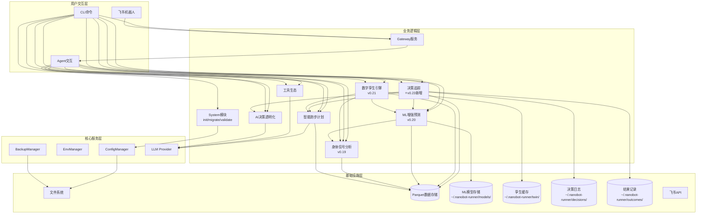
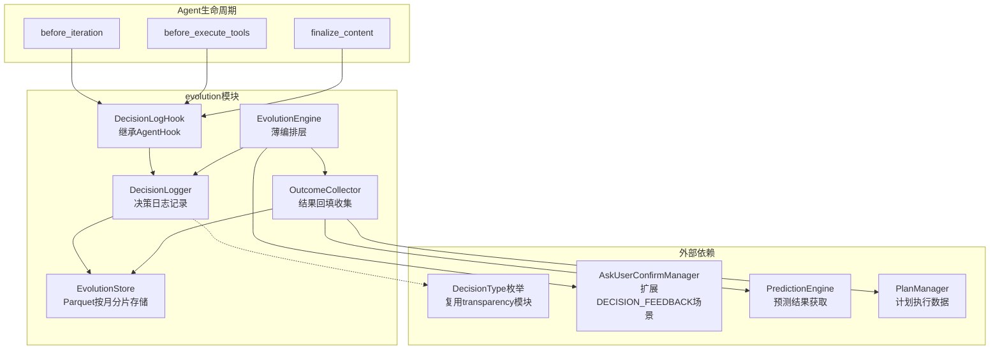
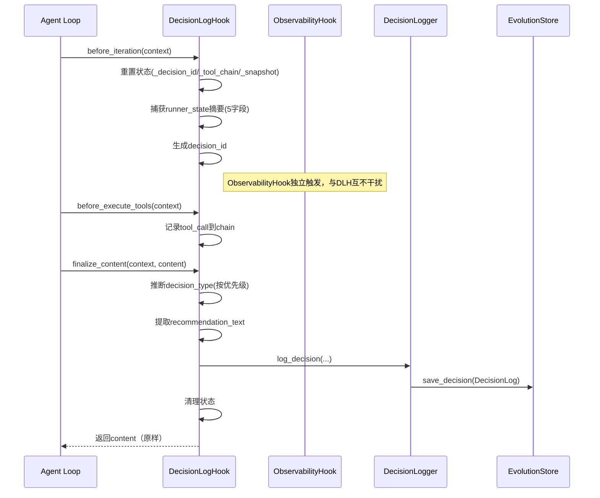
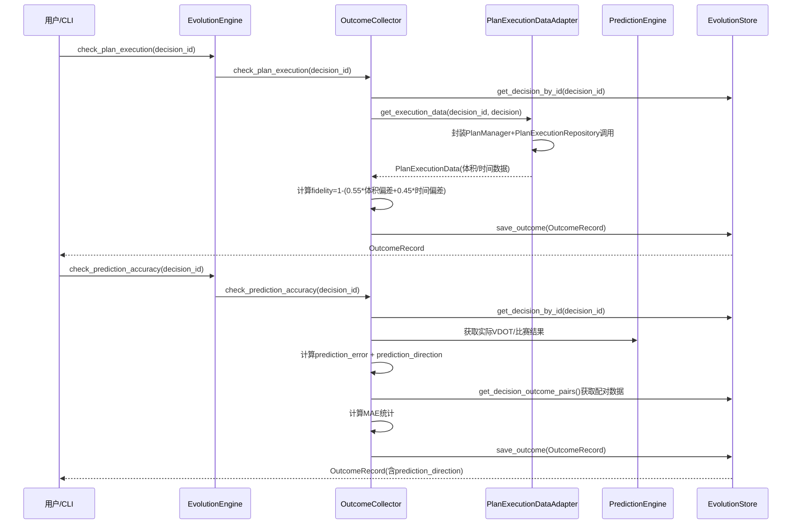
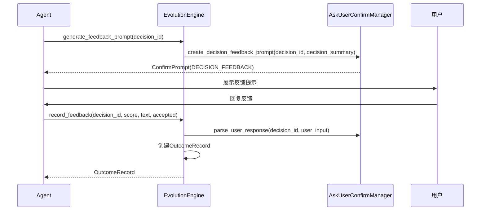

# 架构设计说明书

> **文档版本**: v10.2.0
> **设计日期**: 2026-04-17
> **更新日期**: 2026-05-20
> **当前基线**: v0.23.0
> **版本目标**: v0.23.0 决策追踪（Decision Tracking） ✅ 已完成
> **需求来源**: REQ_需求规格说明书.md (v10.0) + REQ_产品演进需求规格说明书.md (v1.0)
> **对齐依据**: 产品规划方案.md (v10.0)
> **外部参考**: 产品演进设计.md (v1.0) + multiagents.md (多智能体架构分析)
> **评审依据**: 架构评审报告_v0.23.0.md

> **项目性质说明**: 本项目为**个人使用且个人开发的项目**，所有设计和需求均围绕单人开发和使用场景展开。

***

## 1. 执行摘要

### 1.1 架构演进路线

| 阶段    | 版本          | 核心目标                                  | 状态     |
| ----- | ----------- | ------------------------------------- | ------ |
| 技术底座  | v0.5-v0.9.5 | 数据导入/存储/分析/CLI/依赖注入/SDK化              | ✅ 完成   |
| 智能计划  | v0.10-v0.12 | 自适应训练计划、LLM调整、目标预测                    | ✅ 完成   |
| 工具与智能 | v0.13-v0.15 | MCP协议、AI自我诊断、决策透明化                    | ✅ 完成   |
| 模块化重构 | v0.16-v0.17 | Core子模块拆分、Hook组合、Subagent、Cron提醒      | ✅ 完成   |
| 可视化导出 | v0.18       | 终端图表(plotext)、多格式导出(CSV/JSON/Parquet) | ✅ 完成   |
| 身体信号  | v0.19       | HRV分析、疲劳度评估、身体信号解读                    | ✅ 完成   |
| 预测未来  | v0.20       | ML增强预测（VDOT趋势/比赛成绩/伤病风险）              | ✅ 完成   |
| 数字孪生  | v0.21       | 跑者状态向量、What-If推演、计划对比                 | ✅ 完成   |
| 质量收口 | v0.22       | UAT验证、缺陷收敛、质量兜底、需求洞察       | ✅ 完成   |
| 决策追踪  | v0.23       | 决策日志、结果回填、预测校准                        | 📋 当前规划 |
| 个性化学习 | v0.24       | 训练响应性分析、个人化模型进化                       | 📋 规划中 |
| 自适应进化 | v0.25       | 提示策略优化、自动进化触发                         | 📋 规划中 |
| 稳定版   | v1.0        | API冻结、性能优化、完整文档                       | 📋 计划中 |

### 1.2 v10.1.0 更新重点（基于架构评审报告v0.23.0整改）

1. **P-01 CRITICAL**: DecisionLogHook改为直接继承AgentHook（非ObservabilityHook），作为独立Hook注册，消除finalize_content状态竞争
2. **P-02 CRITICAL**: 明确runner_state摘要5字段（vdot/ctl/atl/tsb/fatigue_score）；新增PlanExecutionDataAdapter协议类封装PlanManager批量执行数据
3. **P-03 HIGH**: execution_status统一为5种状态（pending/executed/skipped/modified/failed）
4. **P-04 HIGH**: EvolutionStore写入策略改为默认同步写入，异步需配套错误恢复（队列+重试+降级+WAL）
5. **P-05 HIGH**: OutcomeRecord新增prediction_direction字段；check_prediction_accuracy()新增MAE统计输出
6. **P-06 HIGH**: create_composite_hook()增加可选参数decision_logger避免强制依赖和循环依赖
7. **P-08 MEDIUM**: 定义决策类型推断优先级规则
8. **P-09 MEDIUM**: 简化fidelity公式为体积偏差+时间偏差，强度偏差延后至v0.24
9. **P-10 MEDIUM**: EvolutionStore共享实例修正，AppContext中创建单一实例
10. **P-11 MEDIUM**: 明确DecisionLogHook状态管理策略（每次对话一条DecisionLog，异常不产生不完整记录）
11. **S-01 HIGH**: 新增EvolutionConfig配置Schema
12. **S-04 MEDIUM**: EvolutionStore新增get_decision_outcome_pairs()方法

### 1.3 v10.0.0 更新重点（v0.23.0 决策追踪）

1. 新增v0.23.0决策追踪模块完整架构设计（Section 8.2替换为详细设计）
2. 模块命名从骨架设计的`tracking/`更新为`evolution/`，体现决策进化闭环
3. DecisionLogHook继承ObservabilityHook，无侵入接入Agent迭代生命周期
4. DecisionLog + OutcomeRecord 分离数据模型，Parquet按月分片存储
5. 结果回填机制：check_plan_execution() + check_prediction_accuracy() 异步执行
6. 反馈收集复用AskUserConfirmManager，扩展ConfirmScenario.DECISION_FEEDBACK
7. 复用transparency模块DecisionType枚举，不新建枚举
8. 新增4个Agent工具：record_feedback / check_plan_execution / check_prediction_accuracy / get_decision_history
9. 新增evolution CLI命令组：history / feedback / accuracy / fidelity / status
10. 更新整体架构图新增EVOLUTION模块，更新CLI命令体系和数据目录总览

### 1.3 v9.2.0 更新重点（v0.22.0 质量收口）

1. v0.20 ML增强预测模块已完成（三层降级策略/分位数回归/SHAP可解释性）
2. v0.21 数字孪生引擎已完成（薄编排层/5维度状态向量/What-If推演/计划对比）
3. v0.22 质量收口已完成（UAT验证/缺陷收敛）
4. 更新文档版本至v9.2.0，对齐产品规划方案v9.2和需求规格说明书v8.6
5. 精简v0.20-v0.22已实现模块的详细设计，保留核心架构摘要
6. 将v0.23决策追踪标记为当前规划版本

### 1.3 v7.0.0 更新重点（对齐产品规划v9.0 + 产品演进设计v1.0）

1. 引入Banister IR参数化基线模型作为冷启动策略，填补基础预测与ML增强预测之间的空白
2. 统一prediction\_type为三段式：`ml_enhanced` / `parametric` / `basic`
3. 采纳分位数回归（p10/p50/p90）进行不确定性量化，替代简单置信区间
4. 采纳分层伤病风险模型架构：规则基线 → 逻辑回归 → GBDT集成
5. 新增2个Agent工具：`report_injury`（伤病报告）+ `predict_training_response`（训练响应预测）
6. 新增伤病标签体系：confirmed / suspected / unconfirmed
7. 补充v0.21-v0.25模块骨架设计（数字孪生/决策追踪/个性化学习/自适应进化）
8. 明确多智能体架构约束：nanobot仅支持主-从后台任务模式
9. 对齐产品规划方案v9.0和产品演进需求规格说明书v1.0，确保三文档一致性
10. 模型文件格式统一为.joblib（与sklearn官方推荐一致）

### 1.3 v6.0.0 更新重点（v0.20.0 ML增强预测）

1. 新增`prediction`核心子模块（ML-VDOT趋势预测/个人化比赛预测/ML伤病风险预测/模型管理/数据充足度评估）
2. 新增`predict` CLI命令组（status/vdot/race/injury-risk/model）
3. 新增5个Agent工具（predict\_vdot\_trend/predict\_race\_result/predict\_injury\_risk/check\_prediction\_status/manage\_prediction\_model）
4. 新增ML技术栈选型（scikit-learn/scipy/shap）
5. 新增模型存储架构设计（\~/.nanobot-runner/models/）
6. 新增数据充足度评估与自动降级策略
7. 新增特征工程模块设计（时序特征/负荷特征/身体信号特征）
8. 新增AppContext扩展属性`prediction_engine`

### 1.4 v5.1.0 更新重点

1. 新增数据缺失降级策略（DataQuality枚举、empty\_state返回值）— 对应评审Q1
2. 新增边界条件处理规范（单点数据、权重校验、TSB截断）— 对应评审Q2
3. 新增BodySignalConfig配置Schema定义 — 对应评审Q3
4. 新增RPE数据输入路径定义 — 对应评审Q4
5. 新增body\_signal模块测试策略 — 对应评审Q5
6. 明确status与analysis命令组职责边界 — 对应评审Q6
7. 整合建议改进项：data\_source字段、缓存机制、周对比、RecoveryStatus提升

### 1.5 v5.0.0 更新重点

1. 新增v0.19.0身体信号分析模块架构设计
2. 新增`body_signal`核心子模块（HRV分析/疲劳度评估/恢复监控/身体信号引擎）
3. 新增`status` CLI命令组、扩展`analysis`命令组
4. 新增6个Agent工具
5. 精简已完成版本文档，聚焦当前版本架构

### 1.6 核心设计原则

| 原则              | 策略                                    |
| --------------- | ------------------------------------- |
| **模块化**         | 按功能域划分子模块，接口通信                        |
| **依赖注入**        | AppContext统一管理核心组件                    |
| **配置驱动**        | Pydantic-Settings + 环境变量覆盖            |
| **类型安全**        | frozen dataclass + 类型注解 + mypy        |
| **LazyFrame优先** | Polars查询仅在最终输出时collect()              |
| **防御性设计**       | 数据缺失降级策略 + 边界条件处理 + DataQuality标识     |
| **ML渐进增强**      | 参数化基线→ML增强，数据不足自动降级，绝不阻塞用户            |
| **可解释ML**       | SHAP特征归因 + prediction\_type标注 + 置信度量化 |

***

## 2. 技术栈选型

| 类别        | 选型                | 版本              | 理由                              |
| --------- | ----------------- | --------------- | ------------------------------- |
| 语言        | Python            | **≥**3.11,<3.13 | 现有技术栈，生态成熟                      |
| Agent底座   | nanobot-ai        | Latest          | AI Agent框架，提供基础能力               |
| CLI       | Typer + Rich      | Latest          | 类型安全 + 美观输出                     |
| 配置        | Pydantic-Settings | Latest          | 类型安全 + 环境变量                     |
| 存储        | Apache Parquet    | via pyarrow     | 列式存储，高性能查询                      |
| 计算        | Polars            | 0.20+           | LazyFrame优化，高性能                 |
| 解析        | fitparse          | Latest          | FIT文件解析                         |
| 可视化       | plotext           | Latest          | 终端内图表渲染                         |
| 包管理       | uv                | Latest          | 快速依赖管理                          |
| **ML核心**  | **scikit-learn**  | **≥1.3.0**      | **轻量ML库，回归/分类/特征工程，适配本地单人场景**   |
| **科学计算**  | **scipy**         | **≥1.10.0**     | **Riegel曲线拟合(curve\_fit)、统计检验** |
| **特征解释**  | **shap**          | **≥0.48.0**     | **SHAP值特征重要性分析，可解释ML**          |
| **模型持久化** | **joblib**        | **≥1.3.0**      | **sklearn模型序列化，随sklearn安装**     |

**nanobot-ai适配**: 配置格式(JSON+Markdown)、环境变量`NANOBOT_`前缀、Workspace标准目录、加载优先级(环境变量>配置文件>默认值)

***

## 3. 系统架构设计

### 3.1 整体架构图（v0.23.0）



### 3.2 CLI命令体系（v0.23.0）

| 命令组          | 命令                                                 | 功能         | 版本        |
| ------------ | -------------------------------------------------- | ---------- | --------- |
| system       | `init / migrate / validate / config / backup`      | 系统管理       | v0.9+     |
| data         | `import / stats`                                   | 数据导入与统计    | v0.5+     |
| analysis     | `vdot / load / hr-drift`                           | 数据分析       | v0.8+     |
| analysis     | `hrv / hr-recovery / fatigue / recovery / compare` | 身体信号分析     | v0.19     |
| plan         | `create / status / feedback`                       | 训练计划       | v0.10+    |
| report       | `weekly / monthly`                                 | 训练报告       | v0.9+     |
| viz          | `vdot / load / hr-zones`                           | 数据可视化      | v0.18+    |
| export       | `sessions`                                         | 数据导出       | v0.18+    |
| transparency | `trace / status / insight`                         | AI透明化      | v0.15+    |
| status       | `today / weekly`                                   | 身体状态速览     | v0.19     |
| predict      | `status / vdot / race / injury-risk / model`       | ML增强预测     | v0.20     |
| twin         | `status / simulate / compare`                      | 数字孪生       | v0.21     |
| **evolution**| **`history / feedback / accuracy / fidelity / status`** | **决策追踪** | **v0.23** |
| gateway      | `start`                                            | 飞书Gateway  | v0.9+     |

***

## 4. 已完成模块摘要

> 以下模块已完成开发，仅保留架构要点。详细设计见Git历史版本。

| 模块                      | 核心组件                                                                                | 关键设计                       |
| ----------------------- | ----------------------------------------------------------------------------------- | -------------------------- |
| **配置管理** (v0.9.4)       | InitWizard, MigrationEngine, ConfigValidator, WorkspaceManager                      | 无配置模式启动、优先级: 环境变量>配置文件>默认值 |
| **智能跑步计划** (v0.10-0.12) | TrainingPlanGenerator, LLMPlanAdjuster, GoalPredictionEngine, PlanCompletionTracker | LLM驱动计划调整、目标达成预测<3s        |
| **工具生态** (v0.13)        | MCPConfigHelper, ToolManager, WeatherService, MapService                            | MCP协议集成、本地工具优先、隐私保护        |
| **AI决策透明化** (v0.15)     | TransparencyEngine, ObservabilityManager, TraceLogger, TransparencyDisplay          | 分层展示(简洁/详细)、数据溯源、全链路追踪     |
| **Core模块化** (v0.16)     | diagnosis/memory/personality/skills/validate/tools六大子模块                             | 按功能域拆分、接口隔离                |
| **AI底座激活** (v0.17)      | Hook组合系统、Subagent架构、异步用户确认、Cron训练提醒                                                 | 流式输出、LLM超时控制               |
| **可视化与导出** (v0.18)      | PlotextRenderer, CSV/JSON/ParquetExporter                                           | 终端图表渲染、多格式导出引擎             |
| **飞书通知** (v0.9+)        | GatewayServer, FeishuAuth, FeishuNotifier, FeishuCalendar                           | 异步非阻塞、Token自动刷新、指数退避重试     |

***

## 5. 身体信号分析模块（v0.19.0）⭐


> **状态**: 已完成开发。详细设计见Git历史版本。

**核心架构**: HRVAnalyzer(心率变异) + FatigueAssessor(疲劳度评估) + RecoveryMonitor(恢复监控) + BodySignalEngine(编排层)。复用TrainingLoadAnalyzer/HeartRateAnalyzer计算结果，新增DataQuality三级降级策略(SUFFICIENT/INSUFFICIENT/EMPTY)。

**关键设计**: 同日缓存机制(BodySignalEngine)、RPE三级输入路径(FIT字段->CLI参数->自动降级)、TSB截断至[-50,50]、静息心率突增>10%预警。

**新增CLI**: status today/weekly, analysis hrv/hr-recovery/fatigue/recovery/compare

**新增Agent工具**: get_hrv_analysis, get_hr_recovery, get_fatigue_score, get_recovery_status, get_body_signal_summary, compare_training_periods

## 6. ML增强预测模块（v0.20.0）✅ 已完成

> **状态**: 已完成开发。详细设计见Git历史版本。

**核心架构**: PredictionEngine(统一入口) + VDOTPredictor/RacePredictor/InjuryPredictor(三大预测器) + FeatureEngine(特征工程) + DataAssessor(数据充足度评估) + ModelManager(模型生命周期)。

**关键设计**:
- **三层降级策略**: ML增强(GradientBoosting+SHAP) -> 参数化基线(Banister IR/逻辑回归) -> 基础预测(线性回归/规则阈值)
- **不确定性量化**: 分位数回归(p10/p50/p90)输出置信区间
- **伤病风险分层**: 规则基线->逻辑回归(CalibratedClassifierCV)->GBDT集成(4:6加权)
- **冷启动**: Banister IR参数化模型填补200-400条数据空白
- **缓存机制**: PredictionEngine同日缓存 + FeatureEngine特征矩阵缓存

**新增CLI**: predict status/vdot/race/injury-risk/model

**新增Agent工具**: predict_vdot_trend, predict_race_result, predict_injury_risk, check_prediction_status, manage_prediction_model, report_injury, predict_training_response

**模型存储**: ~/.nanobot-runner/models/ (joblib格式)

## 7. 数字孪生引擎模块（v0.21.0）✅ 已完成

> **状态**: 已完成开发。详细设计见Git历史版本。

**核心架构**: DigitalTwinEngine(薄编排层) + StateVectorBuilder(5维度状态向量构建器) + WhatIfSimulator(逐周推演器)。复用v0.20 PredictionEngine/v0.19 BodySignalEngine/v0.12 TrainingLoadAnalyzer。

**关键设计**:
- **薄编排层架构**: DigitalTwinEngine聚合现有模块输出，不引入新状态转移引擎，YAGNI原则
- **5维度状态向量**: 体能(VDOT/趋势/VO2max) / 负荷(CTL/ATL/TSB/ACWR) / 身体信号(疲劳/恢复/静息心率/HRV) / 风险(7d/28d伤病风险/过度训练) / 训练模式(周跑量/强度分布/长距离频率)
- **状态向量缓存**: TTL=24h，存储于 `~/.nanobot-runner/twin/state_vector.json`
- **三层推演降级**: ML增强(每周衰减5%) -> 参数化(每周衰减8%) -> 基础(每周衰减12%)
- **计划对比评分**: VDOT提升(40%) + 伤病风险(35%) + 恢复余量(25%)

**新增CLI**: twin status/simulate/compare

**新增Agent工具**: get_runner_state, simulate_plan, compare_plans

**代码库结构**:
```
src/core/twin/
├── __init__.py, models.py, twin_engine.py, state_vector_builder.py, whatif_simulator.py
src/cli/commands/twin.py, src/cli/handlers/twin_handler.py
tests/unit/core/twin/
```

**成功标准**: 4周VDOT推演误差<8%、单计划推演<10秒、推荐一致率>70%、核心模块测试覆盖率≥80%

***

## 8. v0.22-v0.25 模块骨架设计

### 8.1 v0.22 质量收口（Quality Stabilization）✅ 已完成

> **状态**: 已完成。详细记录见Git历史版本。

**核心交付**: UAT验证 + 缺陷收敛 + 质量兜底 + 需求洞察
**关键产出**: 数字孪生/ML预测/身体信号/数据管理/系统性能五大模块UAT验证、修复10+高优先级缺陷（修复率100%）、文档同步与版本归档
**质量目标**: 核心模块测试覆盖率≥80%、性能基准达标、文档与代码版本一致

### 8.2 v0.23 决策追踪（Decision Tracking）📋 当前规划

> **状态**: 架构设计完成，待开发

#### 8.2.1 版本目标

记录AI决策过程，支持结果回填和预测校准，建立"决策-执行-反馈"闭环，为v0.24个性化学习提供数据基础。

**核心价值**: 让AI"记住"自己的决策，通过结果回填验证决策质量，形成自我进化闭环。

#### 8.2.2 模块架构图



#### 8.2.3 代码库结构

```
src/core/evolution/
├── __init__.py                  # 模块导出
├── models.py                    # DecisionLog, OutcomeRecord 数据模型
├── config.py                    # EvolutionConfig 配置Schema (v0.23新增)
├── decision_logger.py           # DecisionLogger 决策日志记录器
├── outcome_collector.py         # OutcomeCollector 结果回填收集器
├── evolution_store.py           # EvolutionStore Parquet按月分片存储
├── evolution_engine.py          # EvolutionEngine 薄编排层
└── decision_log_hook.py         # DecisionLogHook 继承AgentHook（独立Hook）

src/core/transparency/
├── hook_integration.py          # 修改: create_composite_hook() 可选注册DecisionLogHook

src/core/plan/
├── ask_user_confirm.py          # 修改: ConfirmScenario新增DECISION_FEEDBACK

src/core/base/
├── context.py                   # 修改: AppContext新增evolution_engine属性

src/cli/commands/
├── evolution.py                 # 新增: evolution CLI命令组

src/cli/handlers/
├── evolution_handler.py         # 新增: evolution业务逻辑调用层

src/agents/
├── tools_evolution.py           # 新增: 决策追踪Agent工具类

tests/unit/core/evolution/
├── test_models.py
├── test_config.py
├── test_decision_logger.py
├── test_outcome_collector.py
├── test_evolution_store.py
├── test_evolution_engine.py
└── test_decision_log_hook.py
```

#### 8.2.4 数据模型

**DecisionLog** - 决策日志（frozen dataclass）

```python
@dataclass(frozen=True)
class DecisionLog:
    """决策日志记录

    记录每次AI决策的完整上下文，包括输入状态、决策类型、
    工具调用链、预测快照、推荐内容和执行状态。

    Attributes:
        decision_id: 决策唯一标识（UUID4）
        timestamp: 决策时间戳
        runner_state: RunnerStateVector摘要（dict，仅含5个关键字段）
            字段定义: {vdot: float, ctl: float, atl: float, tsb: float, fatigue_score: float}
            与v0.24训练响应性分析所需字段对齐
        decision_type: 决策类型（复用transparency.DecisionType枚举）
        tool_call_chain: 工具调用链（list[dict]，每项含name/arguments/result_summary）
        prediction_snapshot: 预测快照（dict|None，含predicted_vdot/predicted_risk等）
        recommendation_text: 推荐文本（str|None）
        execution_status: 执行状态（pending/executed/skipped/modified/failed）
            pending: 待执行; executed: 已执行; skipped: 已跳过;
            modified: 用户调整后执行; failed: 执行失败
        recommendation_accepted: 用户是否采纳（bool|None，未确认时为None）
        session_key: 会话标识
    """
    decision_id: str
    timestamp: datetime
    runner_state: dict[str, Any]
    decision_type: DecisionType
    tool_call_chain: list[dict[str, Any]]
    prediction_snapshot: dict[str, Any] | None
    recommendation_text: str | None
    execution_status: str
    recommendation_accepted: bool | None
    session_key: str

    def to_dict(self) -> dict[str, Any]:
        """转换为字典格式（用于Parquet存储）"""
        return {
            "decision_id": self.decision_id,
            "timestamp": self.timestamp.isoformat(),
            "runner_state": json.dumps(self.runner_state, ensure_ascii=False, default=str),
            "decision_type": self.decision_type.value,
            "tool_call_chain": json.dumps(self.tool_call_chain, ensure_ascii=False, default=str),
            "prediction_snapshot": json.dumps(self.prediction_snapshot, ensure_ascii=False, default=str) if self.prediction_snapshot else None,
            "recommendation_text": self.recommendation_text,
            "execution_status": self.execution_status,
            "recommendation_accepted": self.recommendation_accepted,
            "session_key": self.session_key,
        }
```

**OutcomeRecord** - 结果记录（frozen dataclass）

```python
@dataclass(frozen=True)
class OutcomeRecord:
    """结果记录

    通过decision_id关联DecisionLog，记录决策执行后的实际结果，
    包括实际VDOT、伤病状态、执行忠实度、用户反馈、预测误差和偏差方向。

    Attributes:
        outcome_id: 结果唯一标识（UUID4）
        decision_id: 关联的决策ID
        outcome_timestamp: 结果记录时间戳
        actual_vdot: 实际VDOT值（float|None，仅训练建议类决策有值）
        actual_injury: 是否发生伤病（bool）
        execution_fidelity: 执行忠实度（float|None，0.0-1.0）
        user_feedback_score: 用户反馈评分（int|None，1-5）
        user_feedback_text: 用户反馈文本（str|None）
        prediction_error: 预测误差百分比（float|None，=|predicted-actual|/actual*100）
        prediction_direction: 预测偏差方向（str|None，overestimate/underestimate/accurate）
            overestimate: 预测值高于实际值; underestimate: 预测值低于实际值;
            accurate: 误差<5%视为准确; None: 无预测数据
        session_id: 关联训练会话ID（str|None）
    """
    outcome_id: str
    decision_id: str
    outcome_timestamp: datetime
    actual_vdot: float | None
    actual_injury: bool
    execution_fidelity: float | None
    user_feedback_score: int | None
    user_feedback_text: str | None
    prediction_error: float | None
    prediction_direction: str | None
    session_id: str | None

    def to_dict(self) -> dict[str, Any]:
        """转换为字典格式（用于Parquet存储）"""
        return {
            "outcome_id": self.outcome_id,
            "decision_id": self.decision_id,
            "outcome_timestamp": self.outcome_timestamp.isoformat(),
            "actual_vdot": self.actual_vdot,
            "actual_injury": self.actual_injury,
            "execution_fidelity": self.execution_fidelity,
            "user_feedback_score": self.user_feedback_score,
            "user_feedback_text": self.user_feedback_text,
            "prediction_error": self.prediction_error,
            "prediction_direction": self.prediction_direction,
            "session_id": self.session_id,
        }
```

#### 8.2.5 子模块详细设计

##### EvolutionConfig（配置Schema）

**职责**: 定义决策追踪模块的可配置参数，遵循项目Pydantic-Settings配置驱动原则

```python
class EvolutionConfig(BaseModel):
    """决策追踪模块配置

    与v0.20 PredictionConfig模式一致，所有参数均可通过
    环境变量覆盖（NANOBOT_EVOLUTION_前缀）。

    Attributes:
        data_dir: 数据存储根目录
        async_write_enabled: 是否启用异步写入（默认False，保证可靠性）
        async_write_queue_size: 异步写入队列容量上限
        async_write_max_retries: 异步写入最大重试次数
        async_write_retry_backoff: 重试退避基数（秒）
        feedback_prompt_frequency: 反馈提示频率（每N条决策提示一次）
        runner_state_fields: runner_state摘要字段列表
    """
    data_dir: str = "~/.nanobot-runner"
    async_write_enabled: bool = False
    async_write_queue_size: int = 100
    async_write_max_retries: int = 3
    async_write_retry_backoff: float = 1.0
    feedback_prompt_frequency: int = 3
    runner_state_fields: list[str] = ["vdot", "ctl", "atl", "tsb", "fatigue_score"]
```

##### DecisionLogger（决策日志记录器）

**职责**: 在Agent迭代生命周期中自动记录决策日志

**关键方法**:
- `log_decision(decision_type, runner_state, tool_call_chain, prediction_snapshot, recommendation_text, session_key) -> DecisionLog`: 创建并持久化决策日志
- `update_execution_status(decision_id, status, accepted) -> None`: 更新决策执行状态
- `get_decision_history(start_date, end_date, decision_type, limit) -> list[DecisionLog]`: 查询决策历史
- `get_decision_by_id(decision_id) -> DecisionLog | None`: 按ID查询单条决策

**runner_state摘要字段定义**:

| 字段 | 类型 | 来源 | 说明 |
|------|------|------|------|
| vdot | float | RunnerStateVector.体能维度 | 当前VDOT跑力值 |
| ctl | float | RunnerStateVector.负荷维度 | 慢性训练负荷(42天EWMA) |
| atl | float | RunnerStateVector.负荷维度 | 急性训练负荷(7天EWMA) |
| tsb | float | RunnerStateVector.负荷维度 | 训练压力平衡(CTL-ATL) |
| fatigue_score | float | RunnerStateVector.身体信号维度 | 疲劳度评分(0-100) |

> 字段选择依据: 与v0.24训练响应性分析所需字段对齐，5个字段覆盖体能/负荷/身体信号三个核心维度，体积控制在<1KB/条。

**设计约束**:
- runner_state仅存储上述5个字段的摘要dict，不存储完整状态向量对象，控制单条记录<10KB
- tool_call_chain每项仅保留name/arguments摘要/result_summary，不存储完整工具返回
- 所有方法通过EvolutionStore持久化，不持有内存缓存

##### OutcomeCollector（结果回填收集器）

**职责**: 在实际结果发生后回填OutcomeRecord，计算执行忠实度和预测误差

**关键方法**:
- `check_plan_execution(decision_id) -> OutcomeRecord`: 检查计划执行忠实度
  - 通过PlanExecutionDataAdapter获取计划执行数据，对比推荐与实际执行
  - 执行忠实度公式（v0.23简化版）: `fidelity = 1 - (0.55 * 体积偏差 + 0.45 * 时间偏差)`
  - 体积偏差 = |实际跑量-推荐跑量| / 推荐跑量
  - 时间偏差 = |实际训练时长-推荐时长| / 推荐时长
  - > 强度偏差延后至v0.24实现（需PlanManager提供强度分布结构化数据），v0.23权重调整为体积0.55/时间0.45
- `check_prediction_accuracy(decision_id) -> OutcomeRecord`: 检查预测准确度
  - 从PredictionEngine获取历史预测，与实际结果对比
  - 预测误差公式: `prediction_error = abs(predicted - actual) / actual * 100`
  - 偏差方向判定: `prediction_direction = "overestimate" if predicted > actual * 1.05 else "underestimate" if predicted < actual * 0.95 else "accurate"`
  - MAE统计: 对多条预测-实际配对计算 `mae = mean(|predicted - actual| / actual * 100)`，通过EvolutionStore.get_decision_outcome_pairs()获取配对数据
  - 返回OutcomeRecord含prediction_error、prediction_direction字段
- `record_feedback(decision_id, score, text, accepted) -> OutcomeRecord`: 记录用户反馈
  - 复用AskUserConfirmManager的DECISION_FEEDBACK场景
  - 评分范围1-5，文本反馈可选，是否采纳可选
- `get_outcome_by_decision_id(decision_id) -> OutcomeRecord | None`: 按决策ID查询结果

**PlanExecutionDataAdapter协议类**:

```python
class PlanExecutionDataAdapter:
    """计划执行数据适配器

    封装PlanManager + PlanExecutionRepository的调用，
    将DailyPlan的actual_distance_km/actual_duration_min/completion_rate
    映射为忠实度计算所需的体积/时间数据。

    解决PlanManager.record_execution()仅支持按日期单条记录、
    缺少批量获取计划执行数据接口的问题。
    """

    def __init__(self, plan_manager: PlanManager, plan_execution_repo: PlanExecutionRepository) -> None:
        self._plan_manager = plan_manager
        self._plan_execution_repo = plan_execution_repo

    def get_execution_data(self, decision_id: str, decision: DecisionLog) -> PlanExecutionData | None:
        """获取决策关联的计划执行数据

        Args:
            decision_id: 决策ID
            decision: 关联的决策日志

        Returns:
            PlanExecutionData | None: 执行数据，无关联计划时返回None
        """
        # 1. 从decision.prediction_snapshot或recommendation_text提取关联计划ID
        # 2. 调用plan_manager.get_plan(plan_id)获取计划详情
        # 3. 调用plan_execution_repo.get_plan_execution_stats(plan_id)获取执行统计
        # 4. 映射为PlanExecutionData(recommended_volume, actual_volume, recommended_duration, actual_duration)
```

**设计约束**:
- 结果回填不阻塞主流程，异步执行（asyncio.create_task）
- 执行忠实度可计算条件: 决策关联训练计划且有执行记录
- 预测误差可计算条件: 决策含prediction_snapshot且实际结果已产生

##### EvolutionStore（Parquet按月分片存储）

**职责**: 统一管理决策日志和结果记录的Parquet读写

**关键方法**:
- `save_decision(log: DecisionLog) -> None`: 保存决策日志到 `~/.nanobot-runner/decisions/YYYY-MM/decisions_YYYY-MM.parquet`
- `save_outcome(record: OutcomeRecord) -> None`: 保存结果记录到 `~/.nanobot-runner/outcomes/YYYY-MM/outcomes_YYYY-MM.parquet`
- `query_decisions(start_date, end_date, decision_type, limit) -> list[DecisionLog]`: 按条件查询决策日志
- `query_outcomes(decision_ids) -> list[OutcomeRecord]`: 按决策ID列表查询结果记录
- `get_decision_by_id(decision_id) -> DecisionLog | None`: 按ID精确查询
- `get_decision_outcome_pairs(start_date, end_date, decision_type) -> list[tuple[DecisionLog, OutcomeRecord | None]]`: 返回DecisionLog+OutcomeRecord配对数据（v0.24训练响应性分析便捷查询接口）

**写入策略**（默认同步，保证可靠性）:

| 模式 | 触发条件 | 行为 |
|------|---------|------|
| 同步写入（默认） | `EvolutionConfig.async_write_enabled=False` | 直接写入Parquet，保证每次决策100%落盘 |
| 异步写入 | 性能测试确认同步延迟>50ms时启用 | 写入队列(asyncio.Queue, maxsize=100) + 重试机制(3次, 指数退避) + 降级策略(3次重试失败后同步写入) + WAL日志(进程崩溃后恢复) |

> 写入策略决策依据: 决策日志写入频率低（每次Agent对话1条），同步写入延迟预期<50ms。仅在性能测试确认延迟超标时切换异步，避免引入不必要的复杂性。

**分片策略**:
- 决策日志: 按月分片，路径 `~/.nanobot-runner/decisions/2026-05/decisions_2026-05.parquet`
- 结果记录: 按月分片，路径 `~/.nanobot-runner/outcomes/2026-05/outcomes_2026-05.parquet`
- 写入模式: 追加写入（如文件不存在则创建，存在则追加）
- 查询模式: LazyFrame按日期范围过滤，最终collect()

**Parquet Schema**:

| 字段 | 类型 | 说明 |
|------|------|------|
| decision_id | string | UUID4主键 |
| timestamp | string(ISO8601) | 决策时间 |
| runner_state | string(JSON) | 状态向量摘要（5字段: vdot/ctl/atl/tsb/fatigue_score） |
| decision_type | string(enum) | 决策类型 |
| tool_call_chain | string(JSON) | 工具调用链 |
| prediction_snapshot | string(JSON)|null | 预测快照 |
| recommendation_text | string|null | 推荐文本 |
| execution_status | string(enum) | 执行状态（pending/executed/skipped/modified/failed） |
| recommendation_accepted | bool|null | 是否采纳 |
| session_key | string | 会话标识 |

| 字段 | 类型 | 说明 |
|------|------|------|
| outcome_id | string | UUID4主键 |
| decision_id | string | 关联决策ID |
| outcome_timestamp | string(ISO8601) | 结果时间 |
| actual_vdot | float|null | 实际VDOT |
| actual_injury | bool | 是否伤病 |
| execution_fidelity | float|null | 执行忠实度 |
| user_feedback_score | int|null | 反馈评分(1-5) |
| user_feedback_text | string|null | 反馈文本 |
| prediction_error | float|null | 预测误差% |
| prediction_direction | string|null | 偏差方向(overestimate/underestimate/accurate) |
| session_id | string|null | 关联会话ID |

##### EvolutionEngine（薄编排层）

**职责**: 统一入口，委托DecisionLogger和OutcomeCollector执行具体逻辑

**关键方法**:
- `log_decision(...) -> DecisionLog`: 委托DecisionLogger
- `check_plan_execution(decision_id) -> OutcomeRecord`: 委托OutcomeCollector
- `check_prediction_accuracy(decision_id) -> OutcomeRecord`: 委托OutcomeCollector
- `record_feedback(decision_id, score, text, accepted) -> OutcomeRecord`: 委托OutcomeCollector
- `get_decision_history(...) -> list[DecisionLog]`: 委托DecisionLogger
- `get_evolution_status() -> dict`: 返回决策追踪整体状态（总决策数/回填率/平均忠实度/平均预测误差/反馈收集率/数据质量指标）
- `generate_feedback_prompt(decision_id) -> ConfirmPrompt`: 复用AskUserConfirmManager生成反馈收集提示

**依赖注入**（共享EvolutionStore实例）:
```python
# EvolutionStore创建单一实例，DecisionLogger和OutcomeCollector共享
store = EvolutionStore(data_dir=config.data_dir, config=evolution_config)

EvolutionEngine(
    decision_logger=DecisionLogger(store=store),
    outcome_collector=OutcomeCollector(
        store=store,  # 共享同一EvolutionStore实例
        prediction_engine=prediction_engine,
        plan_execution_adapter=PlanExecutionDataAdapter(
            plan_manager=plan_manager,
            plan_execution_repo=plan_execution_repo,
        ),
    ),
    ask_user_confirm_manager=ask_user_confirm_manager,
)
```

#### 8.2.6 Hook接入设计

**DecisionLogHook** 直接继承 `AgentHook`（nanobot-ai基类），作为独立Hook注册，与ObservabilityHook互不干扰。

> **设计决策（ADR-007）**: DecisionLogHook不继承ObservabilityHook，原因：ObservabilityHook的finalize_content会将_current_trace_id置为None并调用engine.generate_explanation()，两者语义冲突。独立继承AgentHook可避免状态竞争，同时通过构造函数注入DecisionLogger实现解耦。

**继承关系**:
```python
class DecisionLogHook(AgentHook):
    """决策日志Hook

    直接继承AgentHook（非ObservabilityHook），作为独立Hook注册。
    与ObservabilityHook在Agent迭代生命周期中并行触发，互不干扰。
    通过构造函数注入DecisionLogger实现解耦。
    """

    def __init__(
        self,
        decision_logger: DecisionLogger,
    ) -> None:
        self.decision_logger = decision_logger
        self._current_decision_id: str | None = None
        self._tool_call_chain: list[dict[str, Any]] = []
        self._runner_state_snapshot: dict[str, Any] = {}
```

**钩子方法实现**:

| 钩子方法 | 触发时机 | 扩展逻辑 |
|---------|---------|---------|
| `before_iteration` | Agent迭代前 | 重置状态（_current_decision_id/_tool_call_chain/_runner_state_snapshot） -> 捕获runner_state摘要（5字段） -> 生成decision_id |
| `before_execute_tools` | 工具执行前 | 记录工具调用到tool_call_chain |
| `finalize_content` | 最终输出后 | 推断decision_type -> 提取recommendation_text -> 调用DecisionLogger.log_decision() -> 清理状态 |

**状态管理策略**:

| 策略 | 说明 |
|------|------|
| 每次对话一条DecisionLog | 从before_iteration到finalize_content的完整Agent对话产生一条DecisionLog |
| before_iteration重置状态 | 每次迭代开始时重置_current_decision_id、_tool_call_chain、_runner_state_snapshot |
| finalize_content完成后清理 | DecisionLog写入后重置状态，避免状态残留 |
| 异常场景不产生不完整记录 | 若finalize_content未被调用（Agent异常退出），已记录的tool_call_chain丢弃，不产生不完整的DecisionLog |

**决策类型推断规则**（在finalize_content中根据tool_call_chain推断）:

当tool_call_chain中包含多种类型工具时，按优先级取最高类型：

| 优先级 | DecisionType | 工具调用特征 |
|--------|-------------|------------|
| 1（最高） | PLAN_ADJUSTMENT | 含adjust_plan/generate_training_plan |
| 2 | RECOVERY_SUGGESTION | 含predict_injury_risk/report_injury |
| 3 | TRAINING_ADVICE | 含predict_vdot_trend/predict_race_result |
| 4 | WEATHER_ADVICE | 含get_weather_training_advice |
| 5 | DATA_QUERY | 含get_running_stats/query_by_date_range |
| 6（最低） | GENERAL | 默认（无匹配工具时） |

**注册方式**: 在 `create_composite_hook()` 工厂函数中，通过可选参数`decision_logger`注册DecisionLogHook，避免强制依赖和循环依赖：

```python
# 5. DecisionLogHook - 决策日志（v0.23新增，可选注册）
# 仅在decision_logger非None时注册，避免transparency模块强制依赖evolution模块
if decision_logger is not None:
    from src.core.evolution.decision_log_hook import DecisionLogHook

    hooks.append(
        DecisionLogHook(
            decision_logger=decision_logger,
        )
    )
```

**create_composite_hook()签名变更**:

```python
def create_composite_hook(
    observability_manager: ObservabilityManager | None = None,
    engine: TransparencyEngine | None = None,
    decision_logger: DecisionLogger | None = None,  # v0.23新增，可选参数
) -> CompositeHook:
```

> 循环依赖规避: evolution模块单向依赖transparency.DecisionType枚举（evolution->transparency），transparency模块不反向import evolution模块。create_composite_hook()仅在decision_logger非None时延迟import DecisionLogHook，避免强制依赖。

**性能约束**: Hook接入对主流程延迟增加<100ms，通过以下措施保证:
- runner_state摘要提取为O(1)操作（仅取5个关键指标）
- DecisionLogger.log_decision()默认同步写入（延迟<50ms），不阻塞finalize_content返回
- tool_call_chain记录为内存追加操作，O(1)

#### 8.2.7 AppContext扩展

```python
@property
def evolution_engine(self) -> EvolutionEngine:
    """获取决策追踪引擎（v0.23.0新增）"""
    from src.core.evolution.config import EvolutionConfig
    from src.core.evolution.decision_logger import DecisionLogger
    from src.core.evolution.evolution_engine import EvolutionEngine
    from src.core.evolution.evolution_store import EvolutionStore
    from src.core.evolution.outcome_collector import OutcomeCollector, PlanExecutionDataAdapter

    engine = self.get_extension("evolution_engine")
    if engine is None:
        # 创建EvolutionConfig（从全局配置派生）
        evolution_config = EvolutionConfig(data_dir=self.config.data_dir)

        # 创建单一EvolutionStore实例，DecisionLogger和OutcomeCollector共享
        store = EvolutionStore(data_dir=evolution_config.data_dir, config=evolution_config)

        decision_logger = DecisionLogger(store=store)
        outcome_collector = OutcomeCollector(
            store=store,  # 共享同一EvolutionStore实例
            prediction_engine=self.prediction_engine,
            plan_execution_adapter=PlanExecutionDataAdapter(
                plan_manager=self.plan_manager,
                plan_execution_repo=self.plan_execution_repo,
            ),
        )
        engine = EvolutionEngine(
            decision_logger=decision_logger,
            outcome_collector=outcome_collector,
            ask_user_confirm_manager=self.ask_user_confirm_manager,
        )
        self.set_extension("evolution_engine", engine)
    return engine
```

#### 8.2.8 CLI命令

```bash
# 查询决策历史
uv run nanobotrun evolution history [--start YYYY-MM-DD] [--end YYYY-MM-DD] [--type TYPE]

# 记录用户反馈
uv run nanobotrun evolution feedback <decision_id> --score 4 [--text "很好"] [--accepted]

# 查看预测准确度统计
uv run nanobotrun evolution accuracy [--days 30]

# 查看执行忠实度统计
uv run nanobotrun evolution fidelity [--days 30]

# 查看决策追踪整体状态
uv run nanobotrun evolution status
```

**CLI命令注册模式**:
1. 创建 `src/cli/commands/evolution.py` 定义evolution_app
2. 在 `src/cli/commands/__init__.py` 导入evolution_app
3. 在 `src/cli/app.py` 注册 `app.add_typer(evolution_app, name="evolution")`
4. 创建 `src/cli/handlers/evolution_handler.py` 封装业务逻辑调用

#### 8.2.9 Agent工具

| 工具名 | 功能 | 输入 | 输出 |
|--------|------|------|------|
| record_feedback | 记录用户反馈 | decision_id, score(1-5), text?, accepted? | OutcomeRecord |
| check_plan_execution | 检查计划执行忠实度 | decision_id | OutcomeRecord |
| check_prediction_accuracy | 检查预测准确度 | decision_id | OutcomeRecord |
| get_decision_history | 查询决策历史 | start_date?, end_date?, type?, limit? | list[DecisionLog] |

**Agent工具注册模式**:
1. 在RunnerTools中添加4个业务方法
2. 创建 `src/agents/tools_evolution.py` 定义4个工具类
3. 在 `create_tools()` 工厂函数中注册
4. 在 `TOOL_DESCRIPTIONS` 中添加描述

**TOOL_DESCRIPTIONS新增**:

```python
"record_feedback": {
    "description": "记录用户对AI决策的反馈评分。当用户对AI建议表达满意、不满或修正意见时使用此工具。返回JSON格式：{success: true, data: {outcome_id, decision_id, user_feedback_score, user_feedback_text, prediction_error}} 或 {success: false, error: 错误信息}",
    "parameters": {
        "decision_id": "决策ID（必填）",
        "score": "反馈评分1-5分（必填，1=很差 3=一般 5=很好）",
        "text": "反馈文本（可选）",
        "accepted": "是否采纳建议（可选，true/false）",
    },
},
"check_plan_execution": {
    "description": "检查训练计划的执行忠实度，对比AI推荐与实际执行的偏差。返回JSON格式：{success: true, data: {outcome_id, decision_id, execution_fidelity, volume_deviation, intensity_deviation, time_deviation}} 或 {success: false, error: 错误信息}",
    "parameters": {"decision_id": "决策ID（必填）"},
},
"check_prediction_accuracy": {
    "description": "检查AI预测的准确度，对比预测值与实际值的偏差。返回JSON格式：{success: true, data: {outcome_id, decision_id, prediction_error, predicted_value, actual_value, error_direction}} 或 {success: false, error: 错误信息}",
    "parameters": {"decision_id": "决策ID（必填）"},
},
"get_decision_history": {
    "description": "查询AI决策历史记录，支持按日期范围和决策类型过滤。返回JSON格式：{success: true, data: [{decision_id, timestamp, decision_type, execution_status, recommendation_accepted}, ...]} 或 {success: false, error: 错误信息}",
    "parameters": {
        "start_date": "开始日期（可选，格式YYYY-MM-DD）",
        "end_date": "结束日期（可选，格式YYYY-MM-DD）",
        "type": "决策类型（可选：training_advice/plan_adjustment/recovery_suggestion/weather_advice/data_query/general）",
        "limit": "返回数量限制（默认20）",
    },
},
```

#### 8.2.10 核心数据流

**决策日志自动记录流程**:



**结果回填流程**:



**反馈收集流程**:



#### 8.2.11 AskUserConfirmManager扩展

在 `ConfirmScenario` 枚举中新增 `DECISION_FEEDBACK`:

```python
class ConfirmScenario(Enum):
    """确认场景类型"""
    TRAINING_PLAN = "training_plan"
    RPE_FEEDBACK = "rpe_feedback"
    INJURY_RISK_ADJUSTMENT = "injury_risk_adjustment"
    DECISION_FEEDBACK = "decision_feedback"  # v0.23新增
    GENERIC = "generic"
```

在 `AskUserConfirmManager` 中新增 `create_decision_feedback_prompt` 方法:

```python
def create_decision_feedback_prompt(
    self,
    decision_id: str,
    decision_summary: dict[str, Any],
) -> ConfirmPrompt:
    """创建决策反馈提示（v0.23.0新增）

    Args:
        decision_id: 决策ID
        decision_summary: 决策摘要（含decision_type/recommendation_preview）

    Returns:
        ConfirmPrompt: 反馈收集提示
    """
```

#### 8.2.12 风险缓解

| 风险 | 等级 | 缓解措施 |
|------|------|---------|
| Hook增加主流程延迟 | HIGH | runner_state摘要O(1)提取（5字段）；log_decision默认同步写入（<50ms）；延迟<100ms |
| runner_state存储膨胀 | MEDIUM | 仅存摘要dict（5个关键字段: vdot/ctl/atl/tsb/fatigue_score），不存完整状态向量；单条<10KB |
| 结果回填阻塞主流程 | MEDIUM | check_plan_execution/check_prediction_accuracy异步执行 |
| 反馈收集率低(<30%) | MEDIUM | 复用AskUserConfirmManager已有交互模式；Agent主动触发反馈提示 |
| 异步写入失败导致决策日志丢失 | MEDIUM | 默认同步写入保证可靠性；异步需配套队列+重试+降级+WAL（P-04） |
| PlanManager缺少批量执行数据接口 | MEDIUM | PlanExecutionDataAdapter封装PlanManager+PlanExecutionRepository调用（P-02） |
| 循环依赖(transparency<->evolution) | MEDIUM | create_composite_hook()可选参数注入，transparency不反向import evolution（P-06） |
| Parquet按月分片查询跨月 | LOW | EvolutionStore自动扫描多个月份文件，LazyFrame合并过滤 |
| DecisionType枚举不匹配 | LOW | 复用transparency模块现有6种枚举，通过tool_call_chain推断映射（含优先级规则） |
| 存储路径不存在 | LOW | EvolutionStore自动创建目录（mkdir -p） |
| 强度分布数据缺失导致忠实度不完整 | LOW | v0.23简化fidelity公式为体积+时间偏差，强度偏差延后v0.24（P-09） |

#### 8.2.13 测试策略

| 测试类型 | 覆盖范围 | 关键测试点 |
|---------|---------|-----------|
| 单元测试 | models.py | DecisionLog/OutcomeRecord的frozen约束、to_dict序列化、字段校验（含prediction_direction） |
| 单元测试 | config.py | EvolutionConfig默认值、环境变量覆盖、字段校验 |
| 单元测试 | decision_logger.py | log_decision创建、execution_status更新（含5种状态）、history查询过滤 |
| 单元测试 | outcome_collector.py | fidelity简化公式计算、prediction_error+prediction_direction计算、MAE统计、feedback记录 |
| 单元测试 | evolution_store.py | Parquet按月分片写入/读取、跨月查询、空文件处理、同步/异步写入策略、get_decision_outcome_pairs |
| 单元测试 | evolution_engine.py | 委托调用正确性、generate_feedback_prompt生成、get_evolution_status数据质量指标 |
| 单元测试 | decision_log_hook.py | Hook独立继承AgentHook、状态管理策略（重置/清理/异常丢弃）、decision_type推断优先级、可选注册 |
| 单元测试 | plan_execution_adapter.py | PlanExecutionData映射、PlanManager+PlanExecutionRepository封装调用 |
| 集成测试 | Hook+Store | Hook触发到Parquet落盘的端到端流程，验证DecisionLogHook与ObservabilityHook独立触发无冲突 |
| 集成测试 | Engine+OutcomeCollector | check_plan_execution从PlanExecutionDataAdapter获取数据到OutcomeRecord落盘 |
| 性能测试 | Hook延迟 | before_iteration/before_execute_tools/finalize_content延迟<100ms；同步写入延迟<50ms |

**Mock策略**:
- Mock PlanManager（返回固定计划执行数据）
- Mock PlanExecutionRepository（返回固定执行统计）
- Mock PredictionEngine（返回固定预测结果）
- 禁止Mock EvolutionStore（保持Parquet读写真实性，使用临时目录）
- 禁止Mock DecisionLogHook与ObservabilityHook的交互（集成测试验证独立性）

#### 8.2.14 成功标准

| 维度 | 标准 | 验证方式 |
|------|------|---------|
| 决策记录 | 每次AI决策100%自动记录 | 集成测试：Agent完整对话后检查Parquet文件 |
| 结果回填 | 计划执行忠实度可计算率>80% | 单元测试：构造有执行记录的决策，验证fidelity非None |
| 预测校验 | check_prediction_accuracy()输出含MAE和偏差方向 | 单元测试：验证OutcomeRecord含prediction_direction，MAE统计正确 |
| 性能 | Hook接入对主流程延迟增加<100ms；同步写入延迟<50ms | 性能测试：对比有/无DecisionLogHook的finalize_content耗时 |
| 反馈收集 | 复用AskUserConfirmManager，反馈收集率>30% | 集成测试：Agent对话后触发feedback_prompt，验证OutcomeRecord |
| 数据完整性 | DecisionLog与OutcomeRecord通过decision_id正确关联 | 单元测试：创建决策后回填结果，验证关联正确 |
| Hook独立性 | DecisionLogHook与ObservabilityHook无状态竞争 | 集成测试：双Hook并行触发，验证各自输出独立完整 |

#### 8.2.15 排除范围

以下功能不在v0.23.0范围内，延后至后续版本:

| 排除项 | 延后版本 | 理由 |
|--------|---------|------|
| 预测校准模型（基于历史偏差自动修正预测输出） | v0.24 | 需要足够的决策-结果配对数据，v0.23先积累数据 |
| 训练响应性分析（量化个体对训练刺激的响应差异） | v0.24 | 依赖决策追踪数据，v0.23先建立闭环 |
| 执行忠实度强度偏差计算（需PlanManager提供强度分布结构化数据） | v0.24 | PlanManager的DailyPlan仅有workout_type字符串，无强度分布结构化数据，v0.23简化为体积+时间偏差 |
| 提示策略优化（基于反馈优化AI提示策略） | v0.25 | 依赖v0.24的个性化模型 |
| 自动进化触发（检测性能退化自动触发重训） | v0.25 | 依赖v0.24的校准模型 |
| 实时决策监控仪表盘 | v1.0 | 非核心需求，优先保证数据积累 |

### 8.3 v0.24 个性化学习（Personalized Learning）

**核心概念**: 分析个人训练响应性，实现模型个人化进化

**核心能力**:

- 训练响应性分析: 量化个体对训练刺激的响应差异
- 个人修正系数: 基于历史数据修正通用模型参数
- 模型微调: 在通用模型基础上进行个人化微调
- 进化报告: 输出个人化模型进化历程

**模块结构**:

```
src/core/personalization/
├── __init__.py
├── models.py                    # PersonalizationProfile, ResponsivenessResult
├── responsiveness_analyzer.py   # 训练响应性分析
├── personal_model.py            # 个人化模型管理
└── evolution_report.py          # 进化报告
```

### 8.4 v0.25 自适应进化（Adaptive Evolution）

**核心概念**: 优化提示策略，实现自动进化触发

**核心能力**:

- 提示策略优化: 基于用户反馈优化AI提示策略
- 自动进化触发: 检测到模型性能退化时自动触发重训
- 进化守护: 监控模型性能指标，确保进化方向正确
- 回滚机制: 进化失败时回滚到上一版本

**模块结构**:

```
src/core/adaptive/
├── __init__.py
├── models.py                    # EvolutionEvent, EvolutionGuard
├── evolution_engine.py          # AdaptiveEvolutionEngine（扩展v0.23 EvolutionEngine）
├── prompt_optimizer.py          # 提示策略优化
├── auto_trigger.py              # 自动进化触发
└── evolution_guard.py           # 进化守护
```

***

## 9. 数据目录总览

> 统一展示 `~/.nanobot-runner/` 完整目录结构，标注各子目录的引入版本和用途。

```
~/.nanobot-runner/
├── config.json                    # 全局配置文件 (v0.9+)
├── data/                          # Parquet训练数据存储 (v0.5+)
│   └── YYYY/
│       └── sessions_YYYY.parquet
├── models/                        # ML模型存储 (v0.20新增)
│   ├── vdot_predictor/
│   ├── vdot_predictor_banister/
│   ├── race_predictor/
│   ├── injury_predictor/
│   └── prediction_history/
│       └── predictions.parquet
├── predictions/                   # 预测记录 (v0.20新增)
│   └── {date}_prediction.json
├── injury_labels/                 # 伤病标签 (v0.20新增)
│   ├── confirmed/
│   ├── suspected/
│   └── unconfirmed/
├── cache/                         # 特征缓存和预测缓存 (v0.20新增)
├── twin/                          # 数字孪生缓存 (v0.21新增)
│   └── state_vector.json         # 状态向量缓存 (TTL=24h)
├── decisions/                     # 决策日志 (v0.23新增)
│   └── YYYY-MM/
│       └── decisions_YYYY-MM.parquet
├── outcomes/                      # 结果记录 (v0.23新增)
│   └── YYYY-MM/
│       └── outcomes_YYYY-MM.parquet
└── backup/                        # 手动备份目录 (v0.9+)
```

| 子目录              | 引入版本  | 用途              | 估算大小      |
| ---------------- | ----- | --------------- | --------- |
| `data/`          | v0.5  | Parquet按年分片训练数据 | ~50MB/年  |
| `models/`        | v0.20 | ML模型文件和元数据      | 5-50MB/模型 |
| `predictions/`   | v0.20 | 预测历史记录          | ~1MB/年   |
| `injury_labels/` | v0.20 | 伤病标签分类存储        | ~1MB/年   |
| `cache/`         | v0.20 | 特征矩阵缓存和预测同日缓存   | ~10MB    |
| `twin/`          | v0.21 | 状态向量缓存          | ~10KB    |
| `decisions/`     | v0.23 | 决策日志Parquet按月分片 | ~5MB/年   |
| `outcomes/`      | v0.23 | 结果记录Parquet按月分片 | ~2MB/年   |
| `backup/`        | v0.9  | 手动备份压缩包         | 按需        |

***

## 10. 部署架构

**环境隔离**: 开发/生产共用本地环境，通过配置文件区分\
**部署方式**: `uv run nanobotrun` 本地运行\
**数据目录**: `~/.nanobot-runner/` (可配置)\
**备份策略**: `nanobotrun system backup` 手动触发

***

## 11. 变更记录

| 版本     | 日期         | 变更内容                                                                                                                                                                                                                                                                                                                                                                        |
| ------ | ---------- | --------------------------------------------------------------------------------------------------------------------------------------------------------------------------------------------------------------------------------------------------------------------------------------------------------------------------------------------------------------------------- |
| v10.1.0 | 2026-05-20 | **基于架构评审报告v0.23.0整改**：P-01 DecisionLogHook改为继承AgentHook(非ObservabilityHook)，独立Hook注册(ADR-007)；P-02 明确runner_state摘要5字段(vdot/ctl/atl/tsb/fatigue_score)+新增PlanExecutionDataAdapter协议类；P-03 execution_status统一为5种状态(pending/executed/skipped/modified/failed)；P-04 EvolutionStore写入策略改为默认同步+异步错误恢复机制(队列+重试+降级+WAL)；P-05 OutcomeRecord新增prediction_direction字段+check_prediction_accuracy新增MAE统计；P-06 create_composite_hook()增加可选参数decision_logger避免循环依赖；P-08 定义决策类型推断优先级规则(PLAN_ADJUSTMENT>RECOVERY_SUGGESTION>TRAINING_ADVICE>WEATHER_ADVICE>DATA_QUERY>GENERAL)；P-09 简化fidelity公式为体积0.55+时间0.45，强度偏差延后v0.24；P-10 EvolutionStore共享实例修正；P-11 明确DecisionLogHook状态管理策略(每次对话一条/异常不产生不完整记录)；S-01 新增EvolutionConfig配置Schema；S-04 EvolutionStore新增get_decision_outcome_pairs()方法；更新数据流图/风险缓解/测试策略/成功标准/排除范围 |
| v10.0.0 | 2026-05-20 | **v0.23.0决策追踪模块架构设计**：Section 8.2替换为完整详细设计（版本目标/模块架构图/代码库结构/数据模型DecisionLog+OutcomeRecord/子模块详细设计5个子模块/Parquet按月分片存储/Hook接入设计DecisionLogHook继承ObservabilityHook/AppContext扩展evolution_engine/CLI命令evolution命令组5个命令/Agent工具4个/核心数据流3个时序图/AskUserConfirmManager扩展/风险缓解7项/测试策略/Mock策略/成功标准5项/排除范围5项）；更新文档版本至v10.0.0；更新整体架构图新增EVOLUTION模块和DECISIONS/OUTCOMES存储；更新CLI命令体系新增evolution命令组；更新数据目录decisions/和outcomes/从预留改为正式 |
| v8.0.0 | 2026-05-11 | **v0.21.0数字孪生引擎架构设计**：新增Section 7完整设计（版本目标/ADR-002薄编排层/模块架构图/代码库结构/子模块设计/推演降级策略/计划对比评分/缓存策略/AppContext扩展/CLI命令/Agent工具/数据流/风险缓解/测试策略/成功标准/排除范围）；更新整体架构图(v0.21.0)新增TWIN模块和TWIN_CACHE；更新CLI命令体系新增twin命令组；更新数据目录新增twin/缓存目录；v0.22-v0.25骨架设计移至Section 8；章节重新编号 |
| v7.1.0 | 2026-05-08 | **评审整改**：修正v0.19功能状态标注为v0.20（CLI命令层和Agent工具层）；补充数据充足标准"理想数据量"列(HIGH-4)；新增跨模块集成测试4个场景(HIGH-6)；PredictionEngine流程图补充异常处理分支(MEDIUM-2)；新增"数据目录总览"章节(MEDIUM-3)；ADR-004补充默认参数/校准策略/对比评估(MEDIUM-5)；v0.21-v0.25骨架设计增加声明(HIGH-5)；RacePredictionEngine添加无状态注释(HIGH-3)；对齐需求规格v8.1                                                                                                      |
| v7.0.0 | 2026-05-08 | 对齐产品规划v9.0+产品演进设计v1.0：引入Banister IR参数化基线(ADR-004)、统一prediction\_type三段式(ml\_enhanced/parametric/basic)、采纳分位数回归(ADR-005)、采纳分层伤病风险模型(ADR-006)、新增2个Agent工具(report\_injury/predict\_training\_response)、新增伤病标签体系(confirmed/suspected/unconfirmed)、补充v0.21-v0.25模块骨架设计、明确多智能体架构约束、模型文件格式统一为.joblib、新增TrainingResponse/InjuryReportResult/InjuryLabel数据模型、PredictionConfig新增6个配置项 |
| v6.1.0 | 2026-05-07 | 基于架构评审报告v0.20.0整改：修复AppContext依赖注入违规(CRITICAL-2)、新增PredictionConfig配置Schema(HIGH-1)、新增预测模块测试策略(HIGH-2)、新增缓存机制(HIGH-3)、修正模型存储路径为\~/.nanobot-runner/models/(HIGH-4)、新增冷启动策略(HIGH-5)、补充predictions.parquet Schema(MEDIUM-1)、补充模型评估指标(MEDIUM-2)、补充SHAP降级策略(MEDIUM-3)、补充CLI Help文案与输出示例(MEDIUM-4)                                                                                |
| v5.1.0 | 2026-05-05 | 基于架构评审报告v0.19.0更新：新增数据缺失降级策略(Q1)、边界条件处理规范(Q2)、BodySignalConfig配置Schema(Q3)、RPE数据输入路径(Q4)、测试策略(Q5)、CLI命令组职责边界(Q6)；整合建议改进项：data\_source字段(S1)、缓存机制(S2)、周对比增强(S3)、RecoveryStatus共用模块(S4)                                                                                                                                                                                       |
| v5.0.0 | 2026-05-05 | 新增v0.19.0身体信号分析模块架构；精简已完成版本文档；更新整体架构图                                                                                                                                                                                                                                                                                                                                       |
| v4.2.0 | 2026-05-03 | 新增v0.17.0 AI底座能力全面激活架构设计                                                                                                                                                                                                                                                                                                                                                    |
| v4.0.0 | 2026-04-17 | 新增v0.13-v0.16架构设计                                                                                                                                                                                                                                                                                                                                                           |

