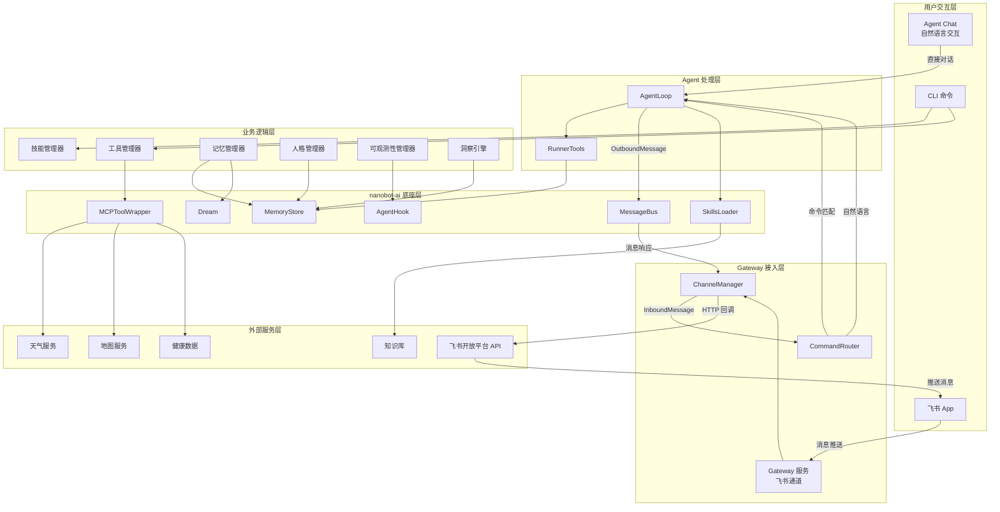
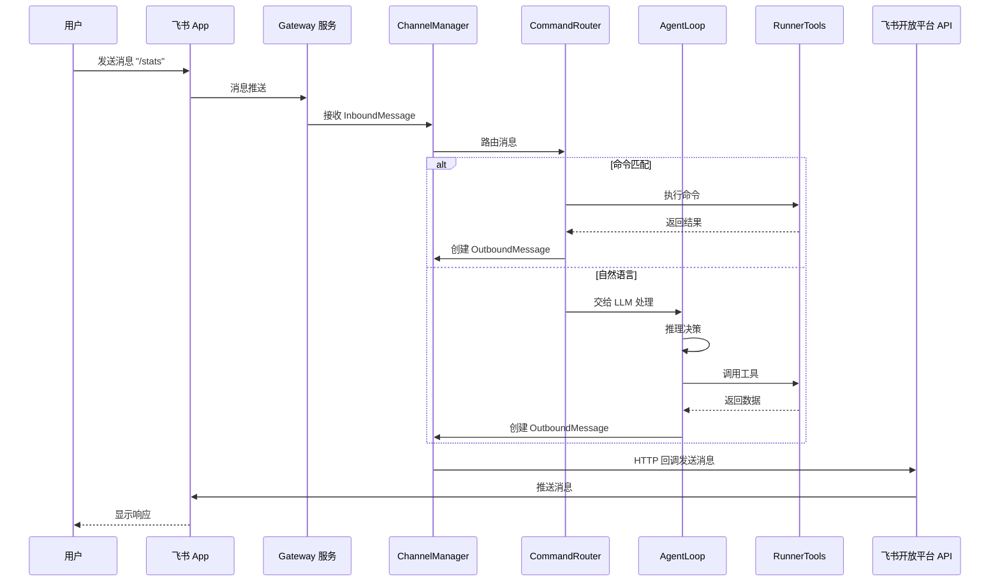
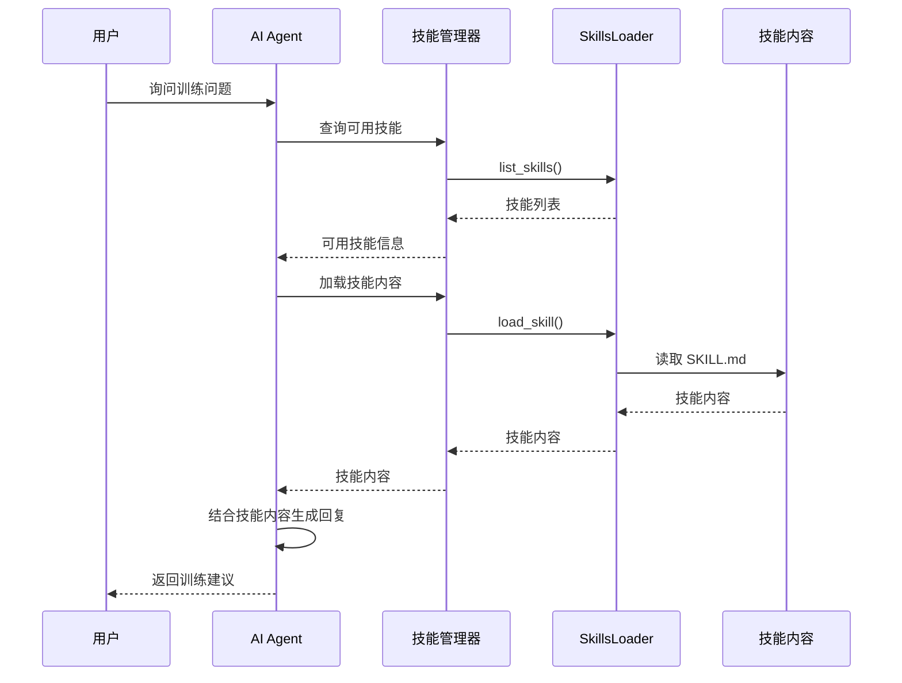
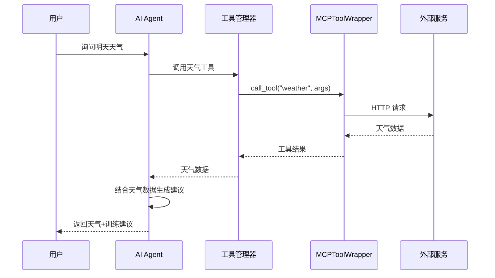
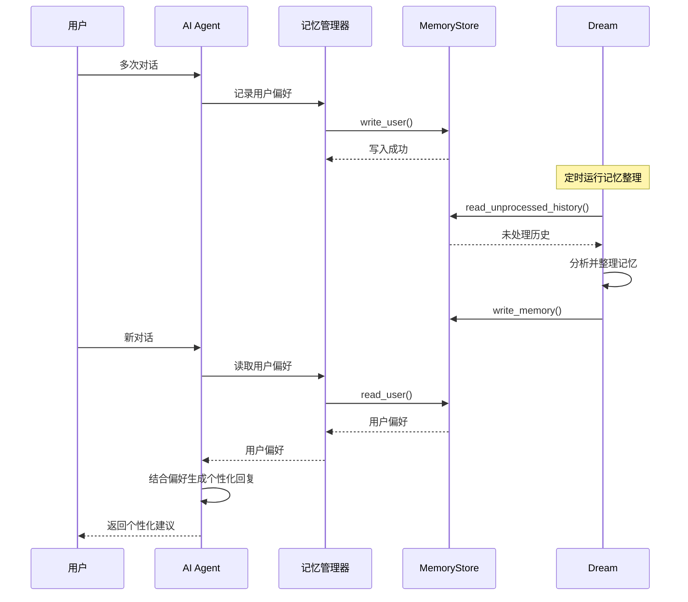
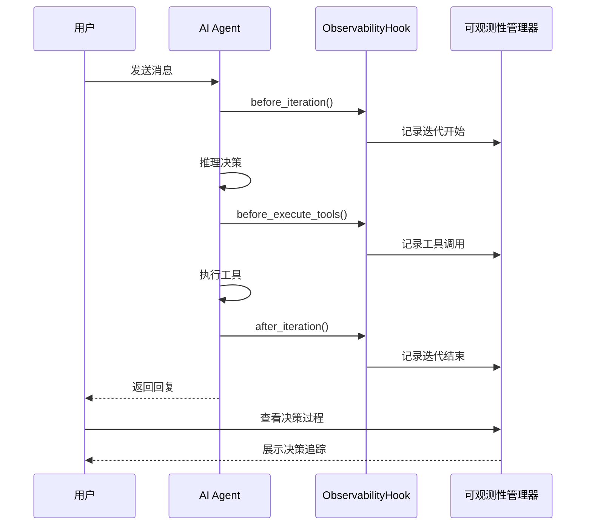
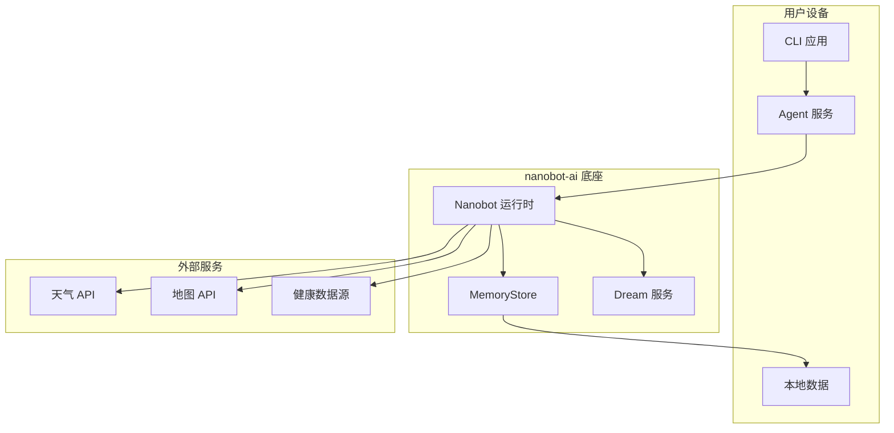

# Nanobot Runner 架构设计说明书

> **文档版本**: v6.1  
> **设计日期**: 2026-04-26  
> **更新日期**: 2026-04-26  
> **版本目标**: 基于 nanobot-ai 0.1.5.post2 底座能力，设计 v0.13.0-v0.15.0 探索版本架构  
> **需求来源**: PRD_NanobotRunner_v0.13-0.15.md (v2.0)  
> **底座能力**: nanobot-ai 0.1.5.post2

---

## 1. 执行摘要

### 1.1 架构设计目标

本文档描述 Nanobot Runner v0.13.0-v0.15.0 探索版本的架构设计，基于 nanobot-ai 0.1.5.post2 底座能力，实现智能技能生态、AI 教练进化、透明洞察三大核心能力。

**核心架构目标**:
- **v0.13.0**: 智能技能库 + 外部工具接入
- **v0.14.0**: AI 教练长期记忆 + 人格进化
- **v0.15.0**: 全链路可观测性 + 智能洞察

### 1.2 核心设计原则

| 设计原则 | 说明 | 实施策略 |
|---------|------|---------|
| **底座优先** | 优先使用 nanobot-ai 底座能力 | MCP、Memory、Dream、SKILL、Hook 等原生集成 |
| **模块化设计** | 高内聚、低耦合 | 按功能域划分模块，模块间通过接口通信 |
| **隐私保护** | 数据本地优先 | 敏感数据不上传云端，用户完全掌控 |
| **可扩展性** | 支持用户自定义扩展 | 技能、工具、配置均可扩展 |
| **可观测性** | 全链路透明化 | 通过 AgentHook 实现决策过程可视化 |

### 1.3 关键技术决策

| 决策项 | 选择方案 | 理由 |
|--------|---------|------|
| **底座框架** | nanobot-ai 0.1.5.post2 | 提供 MCP、Memory、Dream、SKILL、Hook 等完整能力 |
| **技能扩展** | SkillsLoader | nanobot-ai 原生技能加载机制 |
| **工具接入** | MCPToolWrapper | nanobot-ai 原生 MCP 工具接入机制 |
| **记忆管理** | MemoryStore + Dream | nanobot-ai 原生记忆和梦境机制 |
| **可观测性** | AgentHook | nanobot-ai 原生钩子机制 |
| **配置管理** | Pydantic-Settings | 类型安全、环境变量覆盖、Schema 验证 |

---

## 2. 技术栈选型

### 2.1 核心技术栈

| 技术类别 | 技术选型 | 版本要求 | 选型理由 |
|---------|---------|---------|---------|
| **开发语言** | Python | 3.11+ | 项目现有技术栈，生态成熟 |
| **核心底座** | nanobot-ai | 0.1.5.post2 | AI Agent 框架，提供完整能力 |
| **CLI 框架** | Typer + Rich | Latest | 类型安全 CLI，美观输出 |
| **配置管理** | Pydantic-Settings | Latest | 类型安全配置，环境变量支持 |
| **数据存储** | Apache Parquet | via pyarrow | 列式存储，高性能查询 |
| **计算引擎** | Polars | 0.20+ | LazyFrame 优化，高性能 |
| **数据解析** | fitparse | Latest | FIT 文件解析 |
| **包管理** | uv | Latest | 快速依赖管理 |

### 2.2 nanobot-ai 底座能力

| 能力模块 | 模块路径 | 核心API | 使用场景 |
|---------|---------|---------|---------|
| **MCP 系统** | nanobot.agent.tools.mcp | MCPToolWrapper, connect_mcp_servers | 外部工具接入 |
| **Memory 系统** | nanobot.agent.memory | MemoryStore | 长期记忆管理 |
| **Dream 系统** | nanobot.agent.dream | Dream | 记忆自动整理 |
| **SKILL 扩展** | nanobot.agent.skills | SkillsLoader | 技能加载管理 |
| **Hook 系统** | nanobot.agent.hook | AgentHook, AgentHookContext | 可观测性、扩展点 |
| **MyTool 系统** | nanobot.config.schema | MyToolConfig | 自反思、参数调优 |
| **Tool 基类** | nanobot.agent.tools.base | Tool | 工具开发基类 |
| **Nanobot 主类** | nanobot | Nanobot, RunResult | Agent 运行入口 |

### 2.3 Nanobot SDK 使用指南

#### 2.3.1 核心使用模式

```python
from nanobot import Nanobot

# 创建Agent实例
bot = Nanobot.from_config(
    config_path="~/.nanobot/config.json",
    workspace="/my/project",
)

# 运行Agent
result = await bot.run("查询北京天气")
print(result.content)
```

**关键点**:
- `Nanobot.from_config()` 自动加载config.json中的所有配置
- MCP工具、技能、记忆等在创建实例时自动加载
- `bot.run()` 执行Agent推理，自动调用工具和技能

#### 2.3.2 会话隔离

```python
# 不同session_key保持独立的对话历史
result1 = await bot.run("分析训练数据", session_key="user-alice")
result2 = await bot.run("分析训练数据", session_key="user-bob")
```

#### 2.3.3 Hooks可观测性

```python
from nanobot.agent import AgentHook, AgentHookContext

class AuditHook(AgentHook):
    """审计钩子 - 观察工具调用"""
    
    def __init__(self) -> None:
        super().__init__()
        self.calls: list[str] = []
    
    async def before_execute_tools(self, context: AgentHookContext) -> None:
        for tc in context.tool_calls:
            self.calls.append(tc.name)
            print(f"[tool] {tc.name}({tc.arguments})")

# 使用Hooks
result = await bot.run("查询天气", hooks=[AuditHook()])
```

**Hook生命周期**:

| 方法 | 触发时机 |
|------|---------|
| `before_iteration(context)` | 每次LLM调用前 |
| `on_stream(context, delta)` | 流式输出时 |
| `before_execute_tools(context)` | 工具执行前 |
| `after_iteration(context)` | 每次迭代后 |
| `finalize_content(context, content)` | 最终输出处理 |

#### 2.3.4 RunResult结构

```python
@dataclass
class RunResult:
    content: str              # Agent的最终文本响应
    tools_used: list[str]     # 使用的工具列表
    messages: list[dict]      # 完整消息历史
```

---

## 3. 系统架构设计

### 3.1 整体架构图



**架构图说明**：

| 组件 | 职责 | 技术实现 |
|------|------|---------|
| **CLI 命令** | 命令行交互入口，技能管理、工具配置 | `nanobotrun skill`、`nanobotrun tool` |
| **Agent Chat** | 自然语言交互模式，AI 教练对话 | `nanobotrun agent chat` |
| **Gateway 服务** | 飞书通道入口，接收用户消息，返回 AI 响应 | `nanobotrun gateway start` |
| **ChannelManager** | 多通道管理，支持飞书、钉钉等 | `nanobot.channels.manager` |
| **CommandRouter** | 命令路由，区分命令和自然语言 | `nanobot.command.router` |
| **AgentLoop** | AI Agent 主循环，处理消息和工具调用 | `nanobot.agent.AgentLoop` |
| **RunnerTools** | 跑步业务工具集，提供训练数据查询 | `src.agents.tools` |
| **MessageBus** | 消息总线，管理消息流转 | `nanobot.bus.MessageBus` |

### 3.2 架构分层说明

#### 3.2.1 用户交互层

**职责**: 提供用户交互入口

系统提供三种用户交互方式：

| 交互方式 | 功能 | 入口命令 | 特点 |
|---------|------|---------|------|
| **CLI 命令** | 技能管理、工具配置、数据导入 | `nanobotrun skill`、`nanobotrun tool`、`nanobotrun import` | 命令行操作，适合管理任务 |
| **Agent Chat** | 自然语言交互，AI 教练对话 | `nanobotrun agent chat` | 本地终端对话，直接交互 |
| **飞书 App** | AI 教练对话、训练建议 | 通过飞书机器人交互 | 移动端便捷，支持推送 |

**三种交互方式对比**：

| 对比维度 | CLI 命令 | Agent Chat | 飞书 App |
|---------|---------|-----------|---------|
| **交互方式** | 命令行参数 | 自然语言对话 | 自然语言对话 |
| **使用场景** | 配置管理、数据操作 | 本地开发调试 | 移动办公、日常使用 |
| **响应速度** | 快（直接执行） | 中（LLM 处理） | 中（网络 + LLM） |
| **功能范围** | 全部管理功能 | AI 对话功能 | AI 对话 + 推送通知 |
| **依赖条件** | 本地安装 | 本地安装 + LLM 配置 | Gateway 服务 + 飞书配置 |

**Agent Chat 模式**：

启动命令：
```bash
nanobotrun agent chat
```

功能特点：
- 自然语言交互，无需记忆命令
- 直接调用 AgentLoop 处理
- 支持训练数据查询、VDOT 分析、心率分析等
- 适合本地开发和调试场景

#### 3.2.2 Gateway 接入层

**职责**: 提供多通道消息接入和路由

| 组件名称 | 职责 | 核心类 |
|---------|------|--------|
| **Gateway 服务** | 飞书通道入口，消息收发 | `GatewayService` |
| **ChannelManager** | 多通道管理，支持飞书、钉钉等 | `ChannelManager` |
| **CommandRouter** | 命令路由，区分命令和自然语言 | `CommandRouter` |

**Gateway 服务启动命令**:

```bash
nanobotrun gateway start --port 18790
```

**支持的飞书命令**:

| 命令 | 功能 | 响应类型 |
|------|------|---------|
| `/stats` | 查看训练统计 | 文本消息 |
| `/recent [数量]` | 查看最近训练 | 文本消息 |
| `/vd` | 查看 VDOT 趋势 | 文本消息 |
| `/hr_drift` | 查看心率漂移分析 | 文本消息 |
| `/load` | 查看训练负荷 | 文本消息 |
| `/help` | 显示帮助 | 文本消息 |
| 自然语言 | AI 教练对话 | LLM 响应 |

#### 3.2.3 Agent 处理层

**职责**: AI Agent 核心处理逻辑

| 组件名称 | 职责 | 核心类 |
|---------|------|--------|
| **AgentLoop** | AI Agent 主循环，处理消息和工具调用 | `AgentLoop` |
| **RunnerTools** | 跑步业务工具集，提供训练数据查询 | `RunnerTools` |

#### 3.2.4 业务逻辑层

**职责**: 实现核心业务逻辑

| 模块名称 | 职责 | 核心类 |
|---------|------|--------|
| **技能管理器** | 技能发现、启用、管理 | `SkillManager` |
| **工具管理器** | 工具配置、调用、监控 | `ToolManager` |
| **记忆管理器** | 记忆读写、版本管理 | `MemoryManager` |
| **人格管理器** | 人格进化、偏好管理 | `PersonalityManager` |
| **可观测性管理器** | 决策追踪、工具监控 | `ObservabilityManager` |
| **洞察引擎** | 数据分析、智能建议 | `InsightEngine` |

#### 3.2.5 nanobot-ai 底座层

**职责**: 提供核心 AI 能力

| 底座能力 | 职责 | 核心方法 |
|---------|------|---------|
| **SkillsLoader** | 技能加载 | `list_skills()`, `load_skill()`, `build_skills_summary()` |
| **MCPToolWrapper** | 工具接入 | `connect()`, `call_tool()` |
| **MemoryStore** | 记忆存储 | `read_memory()`, `write_memory()`, `read_user()`, `write_user()` |
| **Dream** | 记忆整理 | `run()` |
| **AgentHook** | 钩子扩展 | `before_iteration()`, `after_iteration()`, `on_stream()` |
| **MessageBus** | 消息总线 | `publish_inbound()`, `publish_outbound()` |

#### 3.2.6 外部服务层

**职责**: 提供外部数据和工具

| 服务类型 | 功能 | 隐私策略 |
|---------|------|---------|
| 天气服务 | 实时天气、未来预报 | 仅传输城市级别位置 |
| 地图服务 | 路线规划、坡度分析 | 路线数据本地存储 |
| 健康数据 | 睡眠、HRV 数据整合 | 优先本地文件导入 |
| 知识库 | 训练理论、术语解释 | 仅查询公开知识库 |
| 飞书开放平台 | 消息推送、机器人交互 | 仅传输必要消息内容 |

---

## 4. 模块详细设计

### 4.0 Gateway 飞书通道模块

**模块路径**: `src/cli/commands/gateway.py`

**模块职责**:
- 飞书机器人 Gateway 服务启动
- 多通道消息接入和路由
- 命令处理和自然语言分发
- 消息响应和推送

**核心类设计**:

```python
class GatewayService:
    """Gateway 服务管理器"""
    
    def __init__(self, port: int = 18790) -> None:
        self.port = port
        self.bus = MessageBus()
        self.agent = None
        self.channels = None
    
    async def start(self) -> None:
        """启动 Gateway 服务"""
        pass
    
    async def stop(self) -> None:
        """停止 Gateway 服务"""
        pass
    
    def register_commands(self, agent: AgentLoop, tools: RunnerTools) -> None:
        """注册业务命令"""
        pass
```

**数据结构**:

```python
@dataclass
class InboundMessage:
    """入站消息"""
    channel: str
    chat_id: str
    content: str
    sender: str | None
    metadata: dict[str, Any] | None

@dataclass
class OutboundMessage:
    """出站消息"""
    channel: str
    chat_id: str
    content: str
    metadata: dict[str, Any] | None
```

**接口规范**:

| 接口名称 | 输入 | 输出 | 说明 |
|---------|------|------|------|
| `start()` | 无 | `None` | 启动服务 |
| `stop()` | 无 | `None` | 停止服务 |
| `register_commands()` | `agent, tools` | `None` | 注册命令 |

**飞书消息推送模块**:

**模块路径**: `src/notify/feishu.py`

**核心类设计**:

```python
class FeishuBot:
    """飞书应用机器人"""
    
    def __init__(self, config: ConfigManager) -> None:
        self.auth = FeishuAuth(config)
        self.message_api = FeishuMessageAPI(auth=self.auth)
    
    def send_text(self, text: str) -> OperationResult:
        """发送文本消息"""
        pass
    
    def send_card(self, title: str, content: str) -> OperationResult:
        """发送卡片消息"""
        pass
    
    def send_daily_report(self, report_data: dict) -> OperationResult:
        """发送每日晨报"""
        pass
```

**配置要求**:

```json
{
  "feishu_app_id": "cli_xxx",
  "feishu_app_secret": "xxx",
  "feishu_receive_id": "ou_xxx",
  "feishu_receive_id_type": "user_id"
}
```

---

### 4.1 v0.13.0 智能技能生态版

#### 4.1.1 智能技能库模块

**模块路径**: `src/core/skills/`

**模块职责**:
- 技能发现与展示
- 技能启用/禁用管理
- 自定义技能导入
- 技能冲突处理

**nanobot SDK技能机制**:

```python
# ✅ 正确：技能通过skills/目录自动发现
# 技能目录结构：
# ~/.nanobot/skills/
# ├── running-basics/
# │   └── SKILL.md
# └── training-plan/
#     └── SKILL.md

# 在config.json中配置启用/禁用
{
  "skills": {
    "disabled": ["deprecated-skill"]
  }
}

# Agent运行时自动加载技能到上下文
bot = Nanobot.from_config()
result = await bot.run("分析我的训练数据")  # 技能自动生效
```

**关键点**:
- 技能通过 `~/.nanobot/skills/` 目录自动发现
- 在 `config.json` 中通过 `skills.disabled` 配置禁用列表
- Agent运行时自动加载技能到上下文，**无需手动初始化SkillsLoader**

**核心类设计**:

```python
class SkillManager:
    """技能管理器
    
    负责技能发现、启用/禁用管理。
    注意：技能加载由nanobot SDK自动处理。
    """
    
    def __init__(self, workspace: Path) -> None:
        self.workspace = workspace
        self.skills_dir = workspace / "skills"
    
    def list_skills(self) -> list[SkillInfo]:
        """列出所有可用技能
        
        扫描skills目录，解析SKILL.md文件
        """
        pass
    
    def enable_skill(self, skill_name: str) -> bool:
        """启用技能 - 更新config.json
        
        从skills.disabled列表中移除
        """
        pass
    
    def disable_skill(self, skill_name: str) -> bool:
        """禁用技能 - 更新config.json
        
        添加到skills.disabled列表
        """
        pass
    
    def import_skill(self, skill_path: Path) -> bool:
        """导入自定义技能
        
        复制到skills目录
        """
        pass
    
    def get_skill_content(self, skill_name: str) -> str:
        """获取技能内容
        
        读取SKILL.md文件
        """
        pass
```

**数据结构**:

```python
@dataclass
class SkillInfo:
    """技能信息"""
    name: str
    description: str
    enabled: bool
    always: bool
    emoji: str | None
    requires: SkillRequires | None

@dataclass
class SkillRequires:
    """技能依赖"""
    bins: list[str]
    env: list[str]
```

**接口规范**:

| 接口名称 | 输入 | 输出 | 说明 |
|---------|------|------|------|
| `list_skills()` | 无 | `list[SkillInfo]` | 列出所有技能 |
| `enable_skill()` | `skill_name: str` | `bool` | 启用技能 |
| `disable_skill()` | `skill_name: str` | `bool` | 禁用技能 |
| `import_skill()` | `skill_path: Path` | `bool` | 导入技能 |
| `get_skill_content()` | `skill_name: str` | `str` | 获取技能内容 |

---

#### 4.1.2 外部工具接入模块

**模块路径**: `src/core/tools/`

**模块职责**:
- 工具配置管理
- 工具状态监控
- 配置验证

**nanobot SDK使用方式**:

```python
# ✅ 正确：基于nanobot SDK的工具使用
from nanobot import Nanobot

# MCP服务器自动加载为工具
bot = Nanobot.from_config(
    config_path="~/.nanobot/config.json",
    workspace="/my/project",
)

# Agent自动调用MCP工具
result = await bot.run("查询北京天气")
print(result.content)
```

**关键点**:
- `Nanobot.from_config()` 自动加载config.json中的mcp_servers配置
- MCP工具自动注册到ToolRegistry，命名格式为 `mcp_{server_name}_{tool_name}`
- Agent在推理时自动发现和调用工具，**无需手动管理连接和调用**

**核心类设计**:

```python
class ToolManager:
    """工具管理器
    
    负责工具配置管理和状态监控。
    注意：工具调用由nanobot SDK的Nanobot.from_config()和bot.run()自动处理。
    """
    
    def __init__(self, config_path: Path) -> None:
        self.config_path = config_path
    
    def list_tools(self) -> list[ToolInfo]:
        """列出所有可用工具"""
        pass
    
    def get_tool_status(self, tool_name: str) -> ToolStatus:
        """获取工具状态"""
        pass
    
    def enable_tool(self, tool_name: str) -> bool:
        """启用工具 - 更新config.json"""
        pass
    
    def disable_tool(self, tool_name: str) -> bool:
        """禁用工具 - 更新config.json"""
        pass
```

**数据结构**:

```python
@dataclass
class ToolInfo:
    """工具信息"""
    name: str
    server: str
    description: str
    parameters: dict[str, Any]
    enabled: bool

@dataclass
class ToolStatus:
    """工具状态"""
    name: str
    connected: bool
    last_call: datetime | None
    call_count: int
    error_count: int
```

**接口规范**:

| 接口名称 | 输入 | 输出 | 说明 |
|---------|------|------|------|
| `connect_tools()` | 无 | `dict[str, bool]` | 连接所有工具 |
| `call_tool()` | `tool_name: str, arguments: dict` | `Any` | 调用工具 |
| `list_tools()` | 无 | `list[ToolInfo]` | 列出所有工具 |
| `get_tool_status()` | `tool_name: str` | `ToolStatus` | 获取工具状态 |

---

### 4.2 v0.14.0 AI 教练进化版

#### 4.2.1 AI 教练长期记忆模块

**模块路径**: `src/core/memory/`

**模块职责**:
- 记忆文件管理（读取/写入/备份）
- 记忆版本管理
- 记忆自动整理触发
- 跨会话记忆连贯

**nanobot SDK记忆机制**:

```python
# ✅ 正确：记忆由nanobot SDK自动管理
from nanobot import Nanobot
from nanobot.agent import AgentHook, AgentHookContext

# 记忆文件位置：
# ~/.nanobot/memory.md  - 项目记忆
# ~/.nanobot/user.md    - 用户画像

# Agent运行时自动读写记忆
bot = Nanobot.from_config()
result = await bot.run("记住我的训练偏好")  # 自动写入记忆

# 通过Hooks观察记忆操作
class MemoryObserver(AgentHook):
    """记忆观察器 - 通过Hooks实现"""
    
    def __init__(self) -> None:
        super().__init__()
        self.memory_operations: list[dict] = []
    
    async def after_iteration(self, context: AgentHookContext) -> None:
        """观察每次迭代后的记忆操作"""
        # 通过context.messages分析记忆读写
        pass

# 使用Hooks
result = await bot.run("分析训练数据", hooks=[MemoryObserver()])
```

**关键点**:
- 记忆文件位于 `~/.nanobot/memory.md` 和 `~/.nanobot/user.md`
- Agent运行时自动读写记忆，**无需手动调用MemoryStore**
- 如需观察记忆操作，应通过**AgentHook**实现
- Dream系统自动整理记忆，通过配置触发

**核心类设计**:

```python
class MemoryManager:
    """记忆管理器
    
    负责记忆文件的读取、写入、备份管理。
    注意：Agent运行时的记忆读写由nanobot SDK自动处理。
    """
    
    def __init__(self, workspace: Path) -> None:
        self.workspace = workspace
        self.memory_file = workspace / "memory.md"
        self.user_file = workspace / "user.md"
    
    def read_memory(self) -> str:
        """读取项目记忆文件
        
        Returns:
            str: memory.md文件内容
        """
        pass
    
    def write_memory(self, content: str) -> None:
        """写入项目记忆文件
        
        Args:
            content: 记忆内容
        """
        pass
    
    def read_user_profile(self) -> str:
        """读取用户画像文件
        
        Returns:
            str: user.md文件内容
        """
        pass
    
    def write_user_profile(self, content: str) -> None:
        """写入用户画像文件
        
        Args:
            content: 用户画像内容
        """
        pass
    
    def create_backup(self) -> str:
        """创建记忆备份
        
        Returns:
            str: 备份文件路径
        """
        pass
    
    def restore_backup(self, backup_path: Path) -> bool:
        """恢复记忆备份
        
        Args:
            backup_path: 备份文件路径
            
        Returns:
            bool: 是否恢复成功
        """
        pass
```

**数据结构**:

```python
@dataclass
class MemoryVersion:
    """记忆版本"""
    version: str
    timestamp: datetime
    memory_hash: str
    user_hash: str
    personality_hash: str
```

**接口规范**:

| 接口名称 | 输入 | 输出 | 说明 |
|---------|------|------|------|
| `read_memory()` | 无 | `str` | 读取项目记忆 |
| `write_memory()` | `content: str` | 无 | 写入项目记忆 |
| `read_user_profile()` | 无 | `str` | 读取用户画像 |
| `write_user_profile()` | `content: str` | 无 | 写入用户画像 |
| `read_personality()` | 无 | `str` | 读取 AI 人格 |
| `write_personality()` | `content: str` | 无 | 写入 AI 人格 |
| `get_memory_version()` | 无 | `str` | 获取记忆版本 |
| `restore_memory_version()` | `version: str` | `bool` | 恢复记忆版本 |

---

#### 4.2.2 AI 人格进化模块

**模块路径**: `src/core/personality/`

**模块职责**:
- 人格自动进化
- 用户偏好管理
- 人格版本管理
- 人格效果评估

**核心类设计**:

```python
class PersonalityManager:
    """人格管理器"""
    
    def __init__(self, memory_manager: MemoryManager) -> None:
        self.memory_manager = memory_manager
    
    def get_personality(self) -> Personality:
        """获取当前人格"""
        pass
    
    def update_personality(self, feedback: UserFeedback) -> bool:
        """根据用户反馈更新人格"""
        pass
    
    def get_preferences(self) -> UserPreferences:
        """获取用户偏好"""
        pass
    
    def update_preferences(self, preferences: UserPreferences) -> bool:
        """更新用户偏好"""
        pass
    
    def reset_personality(self) -> bool:
        """重置人格到默认状态"""
        pass
    
    def get_personality_history(self) -> list[PersonalityVersion]:
        """获取人格进化历史"""
        pass
```

**数据结构**:

```python
@dataclass
class Personality:
    """AI 人格"""
    communication_style: str
    suggestion_approach: str
    expression_habits: str
    empathy_level: float
    detail_level: str

@dataclass
class UserPreferences:
    """用户偏好"""
    training_time: str
    training_intensity: str
    communication_style: str
    suggestion_frequency: str
    detail_preference: str

@dataclass
class UserFeedback:
    """用户反馈"""
    feedback_type: str
    feedback_content: str
    timestamp: datetime

@dataclass
class PersonalityVersion:
    """人格版本"""
    version: str
    timestamp: datetime
    personality: Personality
    changes: list[str]
```

**接口规范**:

| 接口名称 | 输入 | 输出 | 说明 |
|---------|------|------|------|
| `get_personality()` | 无 | `Personality` | 获取当前人格 |
| `update_personality()` | `feedback: UserFeedback` | `bool` | 更新人格 |
| `get_preferences()` | 无 | `UserPreferences` | 获取用户偏好 |
| `update_preferences()` | `preferences: UserPreferences` | `bool` | 更新用户偏好 |
| `reset_personality()` | 无 | `bool` | 重置人格 |
| `get_personality_history()` | 无 | `list[PersonalityVersion]` | 获取人格历史 |

---

### 4.3 v0.15.0 透明洞察版

#### 4.3.1 全链路可观测性模块

**模块路径**: `src/core/observability/`

**模块职责**:
- AI 决策过程追踪
- 工具调用监控
- 记忆使用追踪
- 可视化展示

**核心类设计**:

```python
class ObservabilityManager:
    """可观测性管理器"""
    
    def __init__(self) -> None:
        self.hooks: list[ObservabilityHook] = []
    
    def create_hook(self) -> ObservabilityHook:
        """创建可观测性钩子"""
        pass
    
    def get_decision_trace(self, session_key: str) -> DecisionTrace:
        """获取决策追踪"""
        pass
    
    def get_tool_call_trace(self, session_key: str) -> list[ToolCallTrace]:
        """获取工具调用追踪"""
        pass
    
    def get_memory_usage_trace(self, session_key: str) -> list[MemoryUsageTrace]:
        """获取记忆使用追踪"""
        pass
```

**核心钩子设计**:

```python
class ObservabilityHook(AgentHook):
    """可观测性钩子"""
    
    def __init__(self, manager: ObservabilityManager) -> None:
        self.manager = manager
        self.traces: list[TraceRecord] = []
    
    async def before_iteration(self, context: AgentHookContext) -> None:
        """迭代前记录"""
        pass
    
    async def after_iteration(self, context: AgentHookContext) -> None:
        """迭代后记录"""
        pass
    
    async def before_execute_tools(self, context: AgentHookContext) -> None:
        """工具执行前记录"""
        pass
```

**数据结构**:

```python
@dataclass
class DecisionTrace:
    """决策追踪"""
    session_key: str
    iteration: int
    reasoning: str
    tool_calls: list[str]
    memory_used: list[str]
    timestamp: datetime

@dataclass
class ToolCallTrace:
    """工具调用追踪"""
    tool_name: str
    arguments: dict[str, Any]
    result: Any
    duration_ms: int
    success: bool
    error: str | None

@dataclass
class MemoryUsageTrace:
    """记忆使用追踪"""
    memory_type: str
    content_hash: str
    usage_context: str
    timestamp: datetime
```

**接口规范**:

| 接口名称 | 输入 | 输出 | 说明 |
|---------|------|------|------|
| `create_hook()` | 无 | `ObservabilityHook` | 创建钩子 |
| `get_decision_trace()` | `session_key: str` | `DecisionTrace` | 获取决策追踪 |
| `get_tool_call_trace()` | `session_key: str` | `list[ToolCallTrace]` | 获取工具调用追踪 |
| `get_memory_usage_trace()` | `session_key: str` | `list[MemoryUsageTrace]` | 获取记忆使用追踪 |

---

#### 4.3.2 智能洞察引擎模块

**模块路径**: `src/core/insight/`

**模块职责**:
- 训练数据分析
- 个性化建议生成
- 训练效果预测
- 洞察可视化

**核心类设计**:

```python
class InsightEngine:
    """洞察引擎"""
    
    def __init__(self, memory_manager: MemoryManager, data_manager: DataManager) -> None:
        self.memory_manager = memory_manager
        self.data_manager = data_manager
    
    def analyze_training_data(self, period: str) -> TrainingInsight:
        """分析训练数据"""
        pass
    
    def generate_personalized_advice(self, user_preferences: UserPreferences) -> list[Advice]:
        """生成个性化建议"""
        pass
    
    def predict_training_effect(self, plan: TrainingPlan) -> TrainingPrediction:
        """预测训练效果"""
        pass
    
    def get_insight_summary(self) -> InsightSummary:
        """获取洞察摘要"""
        pass
```

**数据结构**:

```python
@dataclass
class TrainingInsight:
    """训练洞察"""
    period: str
    total_distance: float
    total_time: int
    average_pace: float
    training_load: float
    recovery_status: str
    improvement_areas: list[str]

@dataclass
class Advice:
    """建议"""
    advice_type: str
    content: str
    priority: str
    reason: str

@dataclass
class TrainingPrediction:
    """训练预测"""
    target_race: str
    predicted_time: str
    confidence: float
    key_factors: list[str]

@dataclass
class InsightSummary:
    """洞察摘要"""
    total_insights: int
    key_findings: list[str]
    recommendations: list[str]
```

**接口规范**:

| 接口名称 | 输入 | 输出 | 说明 |
|---------|------|------|------|
| `analyze_training_data()` | `period: str` | `TrainingInsight` | 分析训练数据 |
| `generate_personalized_advice()` | `user_preferences: UserPreferences` | `list[Advice]` | 生成个性化建议 |
| `predict_training_effect()` | `plan: TrainingPlan` | `TrainingPrediction` | 预测训练效果 |
| `get_insight_summary()` | 无 | `InsightSummary` | 获取洞察摘要 |

---

## 5. 数据流设计

### 5.1 Gateway 消息流数据流



**消息流说明**：

| 步骤 | 说明 | 数据类型 |
|------|------|---------|
| 1 | 用户通过飞书 App 发送消息 | 文本消息 |
| 2 | Gateway 服务接收消息推送 | HTTP POST |
| 3 | ChannelManager 解析为 InboundMessage | `InboundMessage` |
| 4 | CommandRouter 路由消息 | 命令匹配或自然语言 |
| 5 | 执行命令或 LLM 处理 | 业务逻辑 |
| 6 | 创建 OutboundMessage | `OutboundMessage` |
| 7 | 通过飞书 API 发送响应 | HTTP POST |
| 8 | 飞书 App 显示响应 | 文本消息 |

### 5.2 技能调用数据流



### 5.3 工具调用数据流



### 5.4 记忆管理数据流



### 5.5 可观测性数据流



---

## 6. 接口规范

### 6.1 技能管理接口

| 接口名称 | HTTP 方法 | 路径 | 说明 |
|---------|----------|------|------|
| 列出技能 | GET | `/api/skills` | 获取所有可用技能 |
| 启用技能 | POST | `/api/skills/{name}/enable` | 启用指定技能 |
| 禁用技能 | POST | `/api/skills/{name}/disable` | 禁用指定技能 |
| 导入技能 | POST | `/api/skills/import` | 导入自定义技能 |

### 6.2 工具管理接口

| 接口名称 | HTTP 方法 | 路径 | 说明 |
|---------|----------|------|------|
| 列出工具 | GET | `/api/tools` | 获取所有可用工具 |
| 调用工具 | POST | `/api/tools/{name}/call` | 调用指定工具 |
| 工具状态 | GET | `/api/tools/{name}/status` | 获取工具状态 |

### 6.3 记忆管理接口

| 接口名称 | HTTP 方法 | 路径 | 说明 |
|---------|----------|------|------|
| 读取记忆 | GET | `/api/memory` | 读取项目记忆 |
| 写入记忆 | PUT | `/api/memory` | 写入项目记忆 |
| 读取用户画像 | GET | `/api/memory/user` | 读取用户画像 |
| 写入用户画像 | PUT | `/api/memory/user` | 写入用户画像 |
| 记忆版本 | GET | `/api/memory/versions` | 获取记忆版本列表 |
| 恢复版本 | POST | `/api/memory/versions/{version}/restore` | 恢复指定版本 |

### 6.4 可观测性接口

| 接口名称 | HTTP 方法 | 路径 | 说明 |
|---------|----------|------|------|
| 决策追踪 | GET | `/api/observability/decisions/{session}` | 获取决策追踪 |
| 工具调用追踪 | GET | `/api/observability/tools/{session}` | 获取工具调用追踪 |
| 记忆使用追踪 | GET | `/api/observability/memory/{session}` | 获取记忆使用追踪 |

---

## 7. 配置规范

### 7.1 技能配置

**文件路径**: `workspace/skills/{skill_name}/SKILL.md`

**配置格式**:

```markdown
---
name: weather-assistant
description: 天气助手技能，查询实时天气和未来预报
always: false
metadata:
  nanobot:
    emoji: 🌤️
    requires:
      bins: []
      env: ["WEATHER_API_KEY"]
---

# 天气助手

## 功能说明
查询实时天气和未来预报，结合训练建议。

## 使用示例
- "明天适合跑步吗？"
- "这周末天气怎么样？"

## 注意事项
- 仅支持中国大陆城市
- 需要配置天气 API Key
```

### 7.2 工具配置

**文件路径**: `config.json`

**配置格式**:

```json
{
  "tools": {
    "mcp_servers": {
      "weather": {
        "type": "streamableHttp",
        "url": "https://api.weather.com/mcp",
        "headers": {
          "Authorization": "Bearer ${WEATHER_API_KEY}"
        },
        "tool_timeout": 30,
        "enabled_tools": ["get_weather", "get_forecast"]
      },
      "map": {
        "type": "streamableHttp",
        "url": "https://api.map.com/mcp",
        "headers": {
          "Authorization": "Bearer ${MAP_API_KEY}"
        },
        "tool_timeout": 30,
        "enabled_tools": ["plan_route", "analyze_elevation"]
      }
    },
    "my": {
      "enable": true,
      "allow_set": true
    }
  }
}
```

### 7.3 记忆配置

**文件路径**: `config.json`

**配置格式**:

```json
{
  "agents": {
    "defaults": {
      "dream": {
        "interval_h": 2,
        "max_batch_size": 20,
        "max_iterations": 15
      }
    }
  }
}
```

### 7.4 可观测性配置

**文件路径**: `config.json`

**配置格式**:

```json
{
  "observability": {
    "enabled": true,
    "trace_level": "detailed",
    "retention_days": 30
  }
}
```

---

## 8. 部署架构

### 8.1 本地部署架构



### 8.2 数据存储结构

```
workspace/
├── config.json              # 配置文件
├── SOUL.md                  # AI 人格（Dream 管理）
├── USER.md                  # 用户画像（Dream 管理）
├── memory/
│   ├── MEMORY.md            # 项目记忆（Dream 管理）
│   ├── history.jsonl        # 对话历史（Consolidator 写入）
│   ├── .cursor              # Consolidator 游标
│   └── .dream_cursor        # Dream 游标
├── skills/
│   ├── weather-assistant/
│   │   └── SKILL.md
│   ├── training-knowledge/
│   │   └── SKILL.md
│   └── custom-skill/
│       └── SKILL.md
└── data/
    ├── activities/          # 训练数据
    ├── plans/               # 训练计划
    └── insights/            # 洞察结果
```

---

## 9. 风险评估

### 9.1 技术风险

| 风险ID | 风险描述 | 概率 | 影响 | 缓解措施 |
|--------|---------|------|------|---------|
| R001 | nanobot-ai API 变更 | 低 | 中 | 关注 nanobot-ai 版本更新，设计适配层 |
| R002 | 外部工具 API 变更 | 中 | 中 | 设计适配层，支持多数据源切换 |
| R003 | 性能不达标 | 中 | 高 | 优化算法，增加缓存机制 |
| R004 | 记忆数据丢失 | 低 | 高 | 定期备份，版本管理 |

### 9.2 业务风险

| 风险ID | 风险描述 | 概率 | 影响 | 缓解措施 |
|--------|---------|------|------|---------|
| R005 | 用户对技能生态接受度低 | 中 | 中 | 用户调研，快速迭代 |
| R006 | AI 人格进化效果不明显 | 中 | 高 | 持续优化，用户反馈驱动 |
| R007 | 可观测性增加系统复杂度 | 中 | 低 | 简化展示，按需开启 |

---

## 10. 验收标准

### 10.1 v0.13.0 验收标准

| 验收项 | 验收标准 | 验证方法 |
|--------|---------|---------|
| 内置技能数量 | ≥ 4 个 | 功能统计 |
| 用户技能启用率 | > 50% | 行为分析 |
| 技能调用成功率 | > 95% | 日志分析 |
| 外部工具接入数量 | ≥ 3 个 | 功能统计 |
| 工具调用成功率 | > 90% | 日志分析 |
| 工具响应时间 | < 3 秒 | 性能测试 |

### 10.2 v0.14.0 验收标准

| 验收项 | 验收标准 | 验证方法 |
|--------|---------|---------|
| 记忆加载时间 | < 100ms | 性能测试 |
| 跨会话记忆连贯 | 100% | 功能测试 |
| 用户偏好提取准确率 | > 85% | 功能测试 |
| 人格进化效果 | 用户满意度 > 4.3/5 | 问卷调研 |
| 建议接受率 | > 70% | 行为分析 |

### 10.3 v0.15.0 验收标准

| 验收项 | 验收标准 | 验证方法 |
|--------|---------|---------|
| 决策过程可视化 | 100% | 功能测试 |
| 工具调用追踪 | 100% | 功能测试 |
| 用户信任度评分 | > 4.0/5 | 问卷调研 |
| 训练洞察准确性 | > 80% | 功能测试 |
| 建议接受率 | > 70% | 行为分析 |

---

## 11. 附录

### 11.1 术语表

| 术语 | 定义 |
|------|------|
| MCP | Model Context Protocol，模型上下文协议，用于外部工具接入 |
| SKILL | 技能，AI 的可扩展能力模块 |
| Memory | 记忆，AI 的长期记忆系统 |
| Dream | 梦境，AI 的记忆自动整理系统 |
| AgentHook | 钩子，AI 的生命周期扩展点 |
| MyTool | 自反思工具，AI 的自我优化能力 |

### 11.2 参考文档

- [需求规格说明书](../requirements/PRD_NanobotRunner_v0.13-0.15.md)
- [nanobot-ai 底座能力验证报告](./nanobot-ai底座能力验证报告.md)
- [探索版本产品规划](../product/探索版本产品规划_v0.13-0.15.md)

---

## 12. 架构统计

| 统计项 | 数量 |
|--------|------|
| **用户交互方式** | 3 种（CLI、Agent Chat、飞书 App） |
| **模块数** | 7 个（含 Gateway 模块） |
| **接口数** | 27 个 |
| **技术栈组件数** | 8 个 |
| **数据结构数** | 20 个 |
| **核心类数** | 8 个 |
| **数据流图** | 5 个 |

---

*本架构设计说明书由架构师基于需求规格说明书和 nanobot-ai 底座能力编写，旨在为开发团队提供明确的实施依据*

**版本历史**：
- v1.0 (2026-04-17): 初始版本
- v2.0 (2026-04-22): 新增智能跑步计划架构
- v3.0 (2026-04-26): 全面对齐产品规划 v3.0
- v4.0 (2026-04-26): 基于 nanobot-ai 0.1.5.post2 底座能力全面修订版
- v5.0 (2026-04-26): 新增 Gateway（飞书通道）模块架构设计
- v6.0 (2026-04-26): 完整体现三种用户交互方式（CLI、Agent Chat、飞书 App）
- v6.1 (2026-04-26): 对齐Python SDK文档，修正ToolManager/SkillManager/MemoryManager设计，新增Nanobot SDK使用指南
