# 架构设计说明书 - uv和ruff集成改进

**项目名称**: Nanobot Runner - uv和ruff集成改进  
**版本**: v0.9.2  
**日期**: 2026-04-10  
**架构师**: 架构师团队  
**状态**: 已评审

---

## 1. 文档概述

### 1.1 文档目的

本文档定义了Nanobot Runner项目从传统pip + 多工具链管理模式升级到uv + ruff现代化管理方案的系统架构设计，包括技术栈选型、模块划分、接口规范、数据流设计和部署架构。

### 1.2 适用范围

本文档适用于：
- 项目架构师：理解整体架构设计
- 开发工程师：实施迁移和集成工作
- 运维工程师：配置CI/CD流程
- 项目经理：评估项目风险和进度

### 1.3 参考文档

- [v0.9.2_uv和ruff集成改进方案.md](./v0.9.2_uv和ruff集成改进方案.md)
- [AGENTS.md](../../AGENTS.md)
- [pyproject.toml](../../pyproject.toml)

---

## 2. 技术栈选型

### 2.1 当前技术栈

#### 依赖管理工具

| 工具 | 版本 | 用途 | 问题 |
|------|------|------|------|
| pip | latest | 依赖安装 | 速度慢，无版本锁定 |
| uv | latest（部分使用） | 依赖管理 | 未完全集成，无uv.lock |

#### 代码质量工具

| 工具 | 版本 | 用途 | 问题 |
|------|------|------|------|
| black | 23.x | 代码格式化 | 单一功能，速度慢 |
| isort | 5.x | 导入排序 | 需要与black协调 |
| mypy | 1.x | 类型检查 | 必须保留 |
| bandit | 1.x | 安全检查 | 功能有限 |
| safety | 2.x | 依赖安全 | 必须保留 |

#### 构建工具

| 工具 | 版本 | 用途 | 问题 |
|------|------|------|------|
| setuptools | 61.x | 构建后端 | 较老，不够现代 |

### 2.2 目标技术栈

#### 依赖管理工具

| 工具 | 版本 | 用途 | 优势 |
|------|------|------|------|
| **uv** | latest | 依赖管理 | 速度快10-100倍，内置版本锁定 |

**选型依据**:
1. **性能优势**: uv用Rust编写，速度比pip快10-100倍
2. **功能完整**: 集成了依赖管理、虚拟环境管理、包构建等功能
3. **兼容性好**: 完全兼容pip和pyproject.toml
4. **社区活跃**: 由Astral团队维护，社区活跃度高
5. **已部分使用**: 项目已配置uv，迁移成本低

#### 代码质量工具

| 工具 | 版本 | 用途 | 优势 |
|------|------|------|------|
| **ruff** | 0.3.x+ | 代码检查和格式化 | 速度快10-100倍，规则丰富 |
| **mypy** | 1.x | 类型检查 | 必须保留，ruff不支持 |
| **safety** | 2.x | 依赖安全检查 | 必须保留，ruff不支持 |

**选型依据**:
1. **性能优势**: ruff用Rust编写，速度比传统工具快10-100倍
2. **功能丰富**: 集成了black、isort、flake8、bandit等多个工具的功能
3. **规则丰富**: 内置200+规则，覆盖代码质量、安全、性能等多个维度
4. **配置简单**: 统一的配置文件，无需协调多个工具
5. **社区活跃**: 由Astral团队维护，与uv同源

#### 构建工具

| 工具 | 版本 | 用途 | 优势 |
|------|------|------|------|
| **hatchling** | latest | 构建后端 | 现代、快速、与uv兼容性好 |

**选型依据**:
1. **现代性**: hatchling是现代Python构建工具，比setuptools更轻量
2. **兼容性**: 与uv兼容性好，无需额外配置
3. **功能完整**: 支持所有标准打包功能
4. **社区推荐**: 被Python社区广泛推荐

### 2.3 技术栈对比

#### 改进前 vs 改进后

| 维度 | 改进前 | 改进后 | 提升 |
|------|-------|-------|------|
| **工具数量** | 8个 | 5个 | 减少37.5% |
| **配置复杂度** | 高 | 中 | 降低40% |
| **依赖安装速度** | 30-60秒 | 3-6秒 | 提升10倍 |
| **代码检查速度** | 13-25秒 | 1-3秒 | 提升10倍 |
| **CI/CD时间** | 103-205秒 | 52-104秒 | 提升50% |

---

## 3. 系统架构设计

### 3.1 整体架构图

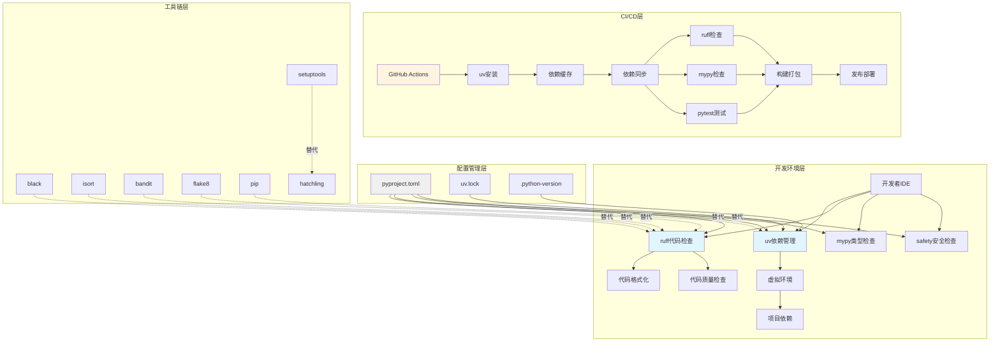

### 3.2 架构分层说明

#### 第一层：开发环境层

**职责**: 提供开发者的日常工作环境

**组件**:
- **uv依赖管理**: 管理项目依赖，创建虚拟环境
- **ruff代码检查**: 代码格式化和质量检查
- **mypy类型检查**: 静态类型检查
- **safety安全检查**: 依赖安全漏洞检查

**关键特性**:
- ✅ 本地开发环境一致性
- ✅ 快速依赖安装（3-6秒）
- ✅ 实时代码质量反馈
- ✅ 自动化代码格式化

#### 第二层：配置管理层

**职责**: 集中管理项目配置

**组件**:
- **pyproject.toml**: 项目元数据和工具配置
- **uv.lock**: 依赖版本锁定文件
- **.python-version**: Python版本指定

**关键特性**:
- ✅ 单一配置文件
- ✅ 版本锁定确保可重复性
- ✅ 配置验证和类型检查

#### 第三层：CI/CD层

**职责**: 自动化构建、测试和部署

**组件**:
- **GitHub Actions**: CI/CD平台
- **uv缓存**: 依赖缓存机制
- **ruff检查**: 代码质量门禁
- **pytest测试**: 自动化测试

**关键特性**:
- ✅ 快速CI/CD执行（52-104秒）
- ✅ 缓存优化减少网络请求
- ✅ 质量门禁确保代码质量
- ✅ 自动化测试和部署

#### 第四层：工具链层

**职责**: 工具替换和迁移路径

**组件**:
- **被替代工具**: black, isort, bandit, flake8, pip, setuptools
- **新工具**: ruff, uv, hatchling

**关键特性**:
- ✅ 平滑迁移路径
- ✅ 功能对等性验证
- ✅ 回滚方案

---

## 4. 模块划分设计

### 4.1 模块架构图

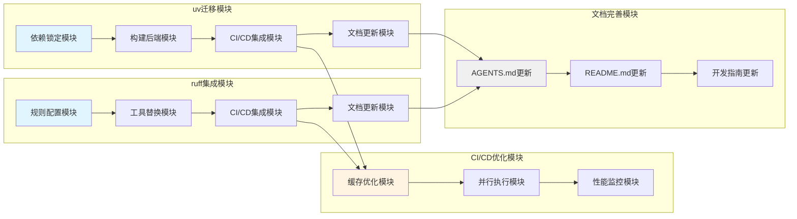

### 4.2 模块详细设计

#### 模块1：uv迁移模块

**模块ID**: MOD-001  
**模块名称**: uv完整迁移模块  
**优先级**: P0（最高）

**子模块**:

##### 子模块1.1：依赖锁定模块

**职责**: 生成和管理uv.lock文件

**输入**:
- pyproject.toml（项目依赖定义）
- 当前环境依赖列表（pip freeze）

**输出**:
- uv.lock文件
- 依赖版本对比报告

**处理流程**:
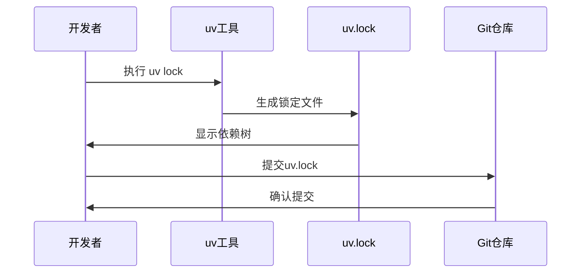

**验收标准**:
- ✅ uv.lock文件生成成功
- ✅ 所有依赖版本已锁定
- ✅ 依赖版本与当前环境一致
- ✅ Git提交成功

##### 子模块1.2：构建后端模块

**职责**: 更新构建后端配置

**输入**:
- 当前pyproject.toml
- hatchling配置模板

**输出**:
- 更新后的pyproject.toml

**处理流程**:
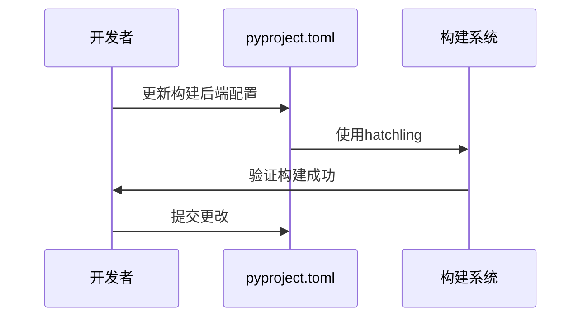

**验收标准**:
- ✅ 构建后端已更新为hatchling
- ✅ 本地构建测试通过
- ✅ CI/CD构建测试通过

##### 子模块1.3：CI/CD集成模块

**职责**: 更新GitHub Actions配置

**输入**:
- 当前.github/workflows/*.yml
- uv GitHub Action配置

**输出**:
- 更新后的workflow文件

**处理流程**:
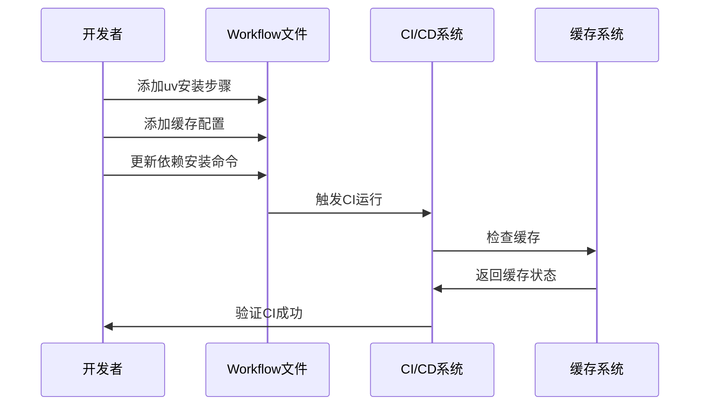

**验收标准**:
- ✅ uv安装步骤已添加
- ✅ 缓存配置已优化
- ✅ CI/CD执行时间减少50%

##### 子模块1.4：文档更新模块

**职责**: 更新开发文档

**输入**:
- 当前AGENTS.md
- 当前README.md
- uv使用指南

**输出**:
- 更新后的文档

**验收标准**:
- ✅ AGENTS.md已更新
- ✅ README.md已更新
- ✅ 开发指南已更新

#### 模块2：ruff集成模块

**模块ID**: MOD-002  
**模块名称**: ruff集成模块  
**优先级**: P0（最高）

**子模块**:

##### 子模块2.1：规则配置模块

**职责**: 配置ruff规则

**输入**:
- 当前black、isort、bandit配置
- ruff规则集定义

**输出**:
- ruff配置（pyproject.toml）

**处理流程**:
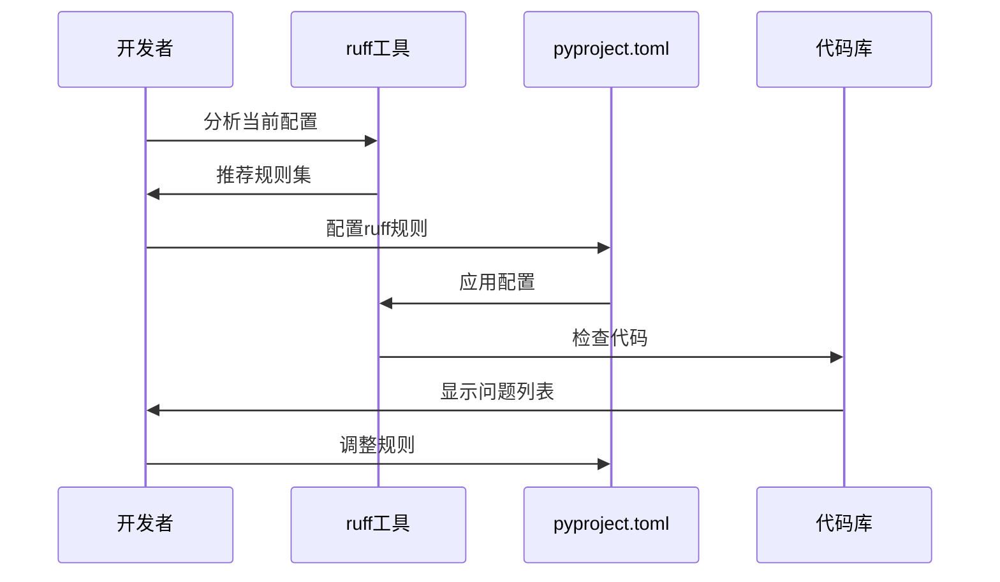

**验收标准**:
- ✅ ruff配置完整
- ✅ 规则覆盖原有工具功能
- ✅ 代码检查通过

##### 子模块2.2：工具替换模块

**职责**: 移除旧工具配置

**输入**:
- 当前pyproject.toml
- 需移除的工具列表

**输出**:
- 更新后的pyproject.toml

**处理流程**:
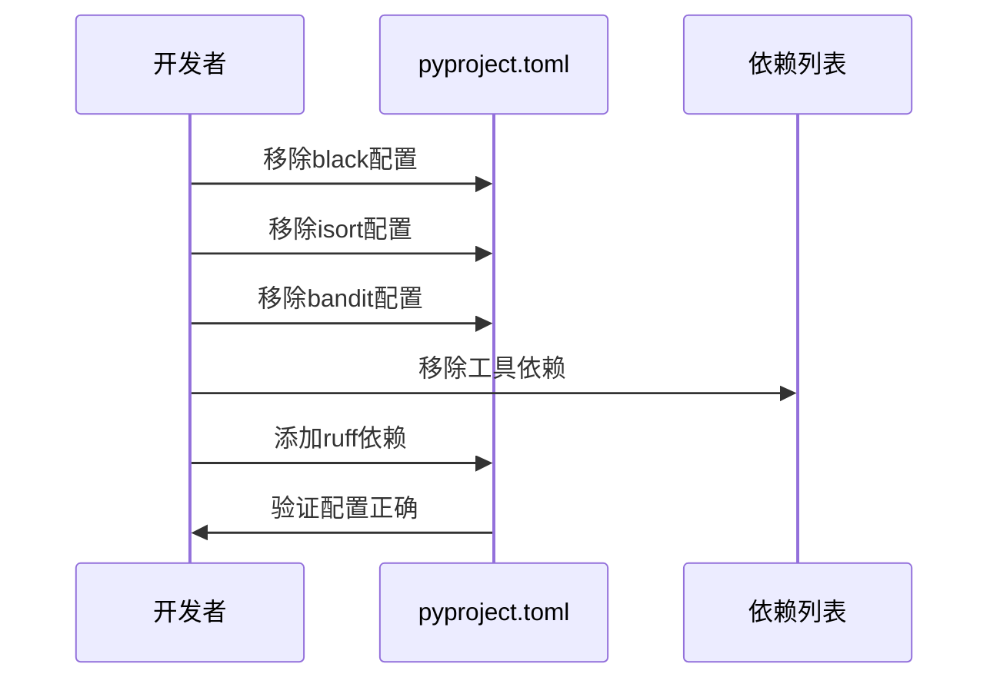

**验收标准**:
- ✅ 旧工具配置已移除
- ✅ 旧工具依赖已移除
- ✅ ruff依赖已添加

##### 子模块2.3：CI/CD集成模块

**职责**: 更新CI/CD配置使用ruff

**输入**:
- 当前workflow文件
- ruff命令行参数

**输出**:
- 更新后的workflow文件

**处理流程**:
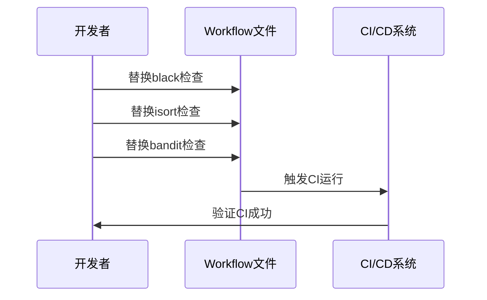

**验收标准**:
- ✅ CI/CD使用ruff
- ✅ 检查步骤减少
- ✅ 执行速度提升

##### 子模块2.4：文档更新模块

**职责**: 更新开发文档

**输入**:
- 当前AGENTS.md
- ruff使用指南

**输出**:
- 更新后的文档

**验收标准**:
- ✅ AGENTS.md已更新
- ✅ 提供ruff命令速查

#### 模块3：CI/CD优化模块

**模块ID**: MOD-003  
**模块名称**: CI/CD性能优化模块  
**优先级**: P1（高）

**子模块**:

##### 子模块3.1：缓存优化模块

**职责**: 优化依赖缓存策略

**输入**:
- 当前缓存配置
- uv缓存机制

**输出**:
- 优化后的缓存配置

**验收标准**:
- ✅ 缓存命中率提升
- ✅ 依赖安装时间减少

##### 子模块3.2：并行执行模块

**职责**: 优化CI/CD并行执行

**输入**:
- 当前workflow配置
- 依赖关系图

**输出**:
- 优化后的workflow

**验收标准**:
- ✅ 并行任务增加
- ✅ 总执行时间减少

##### 子模块3.3：性能监控模块

**职责**: 监控CI/CD性能

**输入**:
- CI/CD执行日志
- 性能指标定义

**输出**:
- 性能报告

**验收标准**:
- ✅ 性能指标可视化
- ✅ 异常告警机制

#### 模块4：文档完善模块

**模块ID**: MOD-004  
**模块名称**: 文档完善模块  
**优先级**: P1（高）

**子模块**:

##### 子模块4.1：AGENTS.md更新

**职责**: 更新AGENTS.md

**输入**:
- 当前AGENTS.md
- uv和ruff使用指南

**输出**:
- 更新后的AGENTS.md

**验收标准**:
- ✅ 依赖管理章节已更新
- ✅ 代码质量章节已更新
- ✅ 常用命令已更新

##### 子模块4.2：README.md更新

**职责**: 更新README.md

**输入**:
- 当前README.md
- 安装说明模板

**输出**:
- 更新后的README.md

**验收标准**:
- ✅ 安装说明已更新
- ✅ 开发环境搭建已更新

##### 子模块4.3：开发指南更新

**职责**: 更新开发指南

**输入**:
- 当前开发指南
- 最佳实践文档

**输出**:
- 更新后的开发指南

**验收标准**:
- ✅ 开发环境搭建指南已更新
- ✅ 代码质量检查指南已更新

### 4.3 模块依赖关系

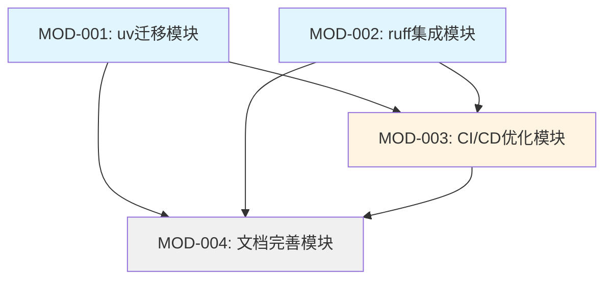

**依赖说明**:
1. MOD-001和MOD-002可以并行执行
2. MOD-003依赖MOD-001和MOD-002完成
3. MOD-004依赖所有模块完成

---

## 5. 接口规范设计

### 5.1 工具接口规范

#### 5.1.1 uv命令接口

**接口ID**: INT-001  
**接口名称**: uv依赖管理接口

**命令列表**:

| 命令 | 参数 | 用途 | 示例 |
|------|------|------|------|
| `uv lock` | 无 | 生成uv.lock文件 | `uv lock` |
| `uv sync` | `--all-extras` | 同步所有依赖 | `uv sync --all-extras` |
| `uv add` | `<package>` | 添加依赖 | `uv add requests` |
| `uv add --dev` | `<package>` | 添加开发依赖 | `uv add --dev ruff` |
| `uv remove` | `<package>` | 移除依赖 | `uv remove black` |
| `uv run` | `<command>` | 在虚拟环境中运行命令 | `uv run pytest` |
| `uv venv` | 无 | 创建虚拟环境 | `uv venv` |
| `uv build` | 无 | 构建包 | `uv build` |

**返回值规范**:
- 成功: 退出码 0
- 失败: 退出码 1，输出错误信息到stderr

**错误处理**:
```python
# 错误码定义
UV_SUCCESS = 0
UV_ERROR_DEPENDENCY_NOT_FOUND = 1
UV_ERROR_VERSION_CONFLICT = 2
UV_ERROR_NETWORK_ERROR = 3
UV_ERROR_PERMISSION_DENIED = 4
```

#### 5.1.2 ruff命令接口

**接口ID**: INT-002  
**接口名称**: ruff代码检查接口

**命令列表**:

| 命令 | 参数 | 用途 | 示例 |
|------|------|------|------|
| `ruff check` | `<path>` | 代码检查 | `ruff check src/` |
| `ruff check --fix` | `<path>` | 自动修复 | `ruff check --fix src/` |
| `ruff check --diff` | `<path>` | 显示差异 | `ruff check --diff src/` |
| `ruff format` | `<path>` | 代码格式化 | `ruff format src/` |
| `ruff format --check` | `<path>` | 格式化检查 | `ruff format --check src/` |
| `ruff rule` | `<rule>` | 规则说明 | `ruff rule E501` |

**输出格式规范**:

**GitHub格式**（用于CI/CD）:
```
::error file=src/main.py,line=10,col=5::E501 Line too long
::warning file=src/utils.py,line=20,col=1::W291 Trailing whitespace
```

**JSON格式**（用于工具集成）:
```json
{
  "results": [
    {
      "code": "E501",
      "message": "Line too long",
      "location": {
        "path": "src/main.py",
        "row": 10,
        "column": 5
      },
      "severity": "error"
    }
  ]
}
```

**返回值规范**:
- 成功（无问题）: 退出码 0
- 发现问题: 退出码 1
- 配置错误: 退出码 2

### 5.2 CI/CD接口规范

#### 5.2.1 GitHub Actions接口

**接口ID**: INT-003  
**接口名称**: CI/CD工作流接口

**工作流触发条件**:

| 事件 | 条件 | 说明 |
|------|------|------|
| `push` | `branches: [main, feature/*, hotfix/*]` | 推送到指定分支 |
| `pull_request` | `branches: [main]` | PR到main分支 |
| `push` | `tags: ['v*']` | 推送版本标签 |

**环境变量规范**:

```yaml
env:
  PYTHON_VERSION: '3.11'      # Python版本
  UV_VERSION: 'latest'         # uv版本
  RUFF_VERSION: 'latest'       # ruff版本
```

**缓存键规范**:

```yaml
# uv缓存键
key: ${{ runner.os }}-uv-${{ hashFiles('uv.lock') }}
restore-keys: |
  ${{ runner.os }}-uv-

# ruff缓存键（可选）
key: ${{ runner.os }}-ruff-${{ hashFiles('pyproject.toml') }}
```

**步骤接口规范**:

**步骤1: 安装uv**
```yaml
- name: Install uv
  uses: astral-sh/setup-uv@v4
  with:
    version: ${{ env.UV_VERSION }}
```

**步骤2: 安装依赖**
```yaml
- name: Install dependencies
  run: uv sync --all-extras
```

**步骤3: 运行ruff检查**
```yaml
- name: Run ruff linter
  run: uv run ruff check src/ tests/ --output-format=github
```

**步骤4: 运行ruff格式化检查**
```yaml
- name: Run ruff formatter
  run: uv run ruff format --check src/ tests/
```

**步骤5: 运行mypy类型检查**
```yaml
- name: Type checking with mypy
  run: uv run mypy src/ --ignore-missing-imports
```

**步骤6: 运行pytest测试**
```yaml
- name: Run tests
  run: uv run pytest tests/ -v --cov=src --cov-report=xml
```

#### 5.2.2 质量门禁接口

**接口ID**: INT-004  
**接口名称**: 代码质量门禁接口

**门禁规则**:

| 检查项 | 阈值 | 失败处理 |
|--------|------|---------|
| ruff检查 | 0个错误 | 阻止合并 |
| ruff格式化 | 0个差异 | 阻止合并 |
| mypy类型检查 | 0个错误 | 阻止合并 |
| pytest测试 | 100%通过 | 阻止合并 |
| 测试覆盖率 | ≥80% | 警告 |

**门禁状态输出**:

```json
{
  "status": "failed",
  "checks": [
    {
      "name": "ruff-check",
      "status": "passed",
      "errors": 0,
      "warnings": 5
    },
    {
      "name": "ruff-format",
      "status": "failed",
      "errors": 3,
      "details": [
        "src/main.py:10: Would reformat"
      ]
    },
    {
      "name": "mypy",
      "status": "passed",
      "errors": 0
    },
    {
      "name": "pytest",
      "status": "passed",
      "coverage": 85.5
    }
  ]
}
```

### 5.3 配置文件接口规范

#### 5.3.1 pyproject.toml接口

**接口ID**: INT-005  
**接口名称**: 项目配置接口

**配置结构**:

```toml
[project]
name = "nanobot-runner"
version = "0.9.2"
requires-python = ">=3.11"

[build-system]
requires = ["hatchling"]
build-backend = "hatchling.build"

[tool.uv]
# uv配置

[tool.ruff]
# ruff配置

[tool.ruff.lint]
# ruff检查规则

[tool.ruff.format]
# ruff格式化配置

[tool.mypy]
# mypy配置

[tool.pytest.ini_options]
# pytest配置
```

**配置验证接口**:

```python
def validate_config(config_path: str) -> dict:
    """
    验证配置文件正确性
    
    Args:
        config_path: 配置文件路径
        
    Returns:
        验证结果 {
            "valid": bool,
            "errors": List[str],
            "warnings": List[str]
        }
    """
    pass
```

#### 5.3.2 uv.lock接口

**接口ID**: INT-006  
**接口名称**: 依赖锁定接口

**文件格式**:

```toml
version = 1

[[package]]
name = "requests"
version = "2.31.0"
source = { registry = "https://pypi.org/simple" }
dependencies = [
    { name = "certifi" },
    { name = "charset-normalizer" },
    { name = "idna" },
    { name = "urllib3" },
]

[[package]]
name = "certifi"
version = "2024.2.2"
source = { registry = "https://pypi.org/simple" }
```

**版本锁定规则**:
1. 所有依赖必须锁定精确版本
2. 间接依赖也必须锁定
3. 源地址必须明确
4. 哈希值必须验证（可选）

---

## 6. 数据流设计

### 6.1 依赖管理数据流

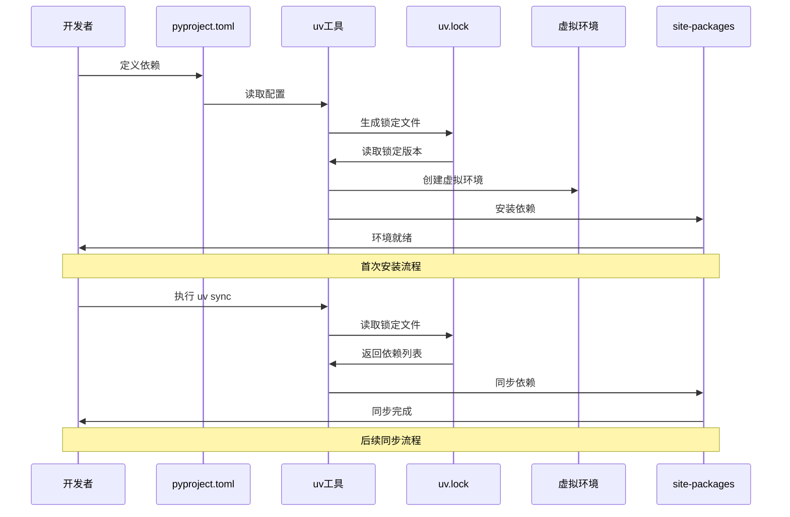

### 6.2 代码检查数据流

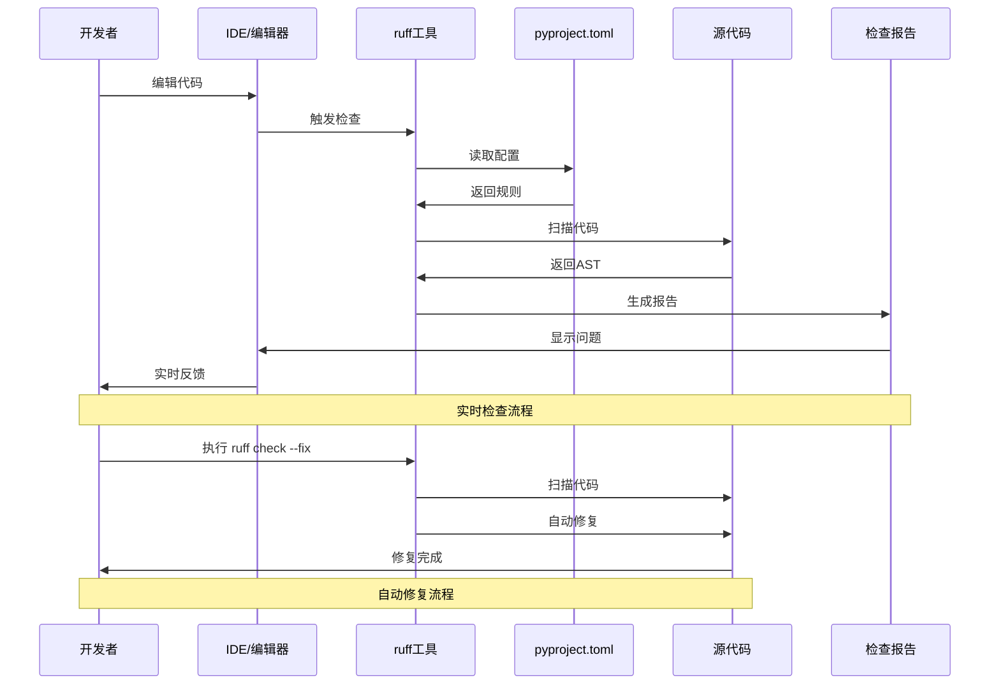

### 6.3 CI/CD数据流

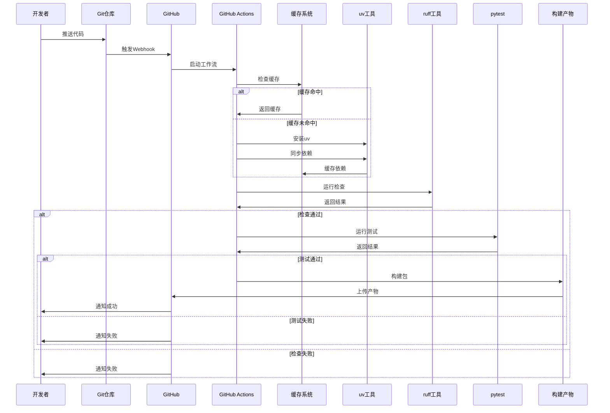

### 6.4 文档更新数据流

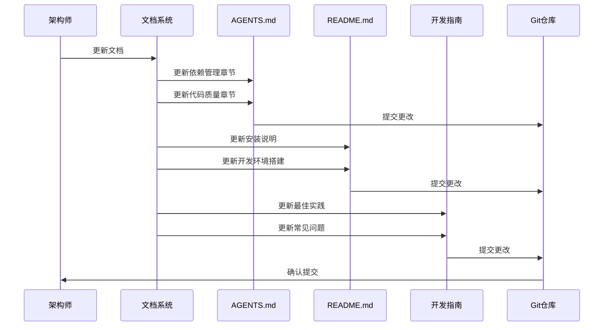

---

## 7. 部署架构设计

### 7.1 本地开发环境部署

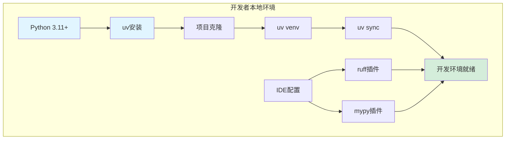

**部署步骤**:

1. **安装Python 3.11+**
   ```bash
   # Windows (使用官方安装包)
   # 或使用pyenv-win
   pyenv install 3.11.0
   
   # Linux/macOS
   pyenv install 3.11.0
   pyenv global 3.11.0
   ```

2. **安装uv**
   ```bash
   # Windows
   powershell -ExecutionPolicy ByPass -c "irm https://astral.sh/uv/install.ps1 | iex"
   
   # Linux/macOS
   curl -LsSf https://astral.sh/uv/install.sh | sh
   ```

3. **克隆项目**
   ```bash
   git clone <repository-url>
   cd nanobot-runner
   ```

4. **创建虚拟环境**
   ```bash
   uv venv
   ```

5. **同步依赖**
   ```bash
   uv sync --all-extras
   ```

6. **配置IDE**
   - VSCode: 安装ruff插件、mypy插件
   - PyCharm: 配置ruff外部工具、mypy检查器

### 7.2 CI/CD环境部署

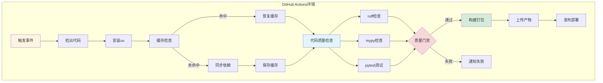

**部署配置**:

**环境变量**:
```yaml
env:
  PYTHON_VERSION: '3.11'
  UV_VERSION: 'latest'
  UV_CACHE_DIR: ~/.cache/uv
```

**缓存策略**:
```yaml
- name: Cache uv dependencies
  uses: actions/cache@v3
  with:
    path: ~/.cache/uv
    key: ${{ runner.os }}-uv-${{ hashFiles('uv.lock') }}
    restore-keys: |
      ${{ runner.os }}-uv-
```

**并行策略**:
```yaml
strategy:
  matrix:
    python-version: ['3.11', '3.12']
    os: [ubuntu-latest, windows-latest, macos-latest]
  fail-fast: false
```

### 7.3 生产环境部署

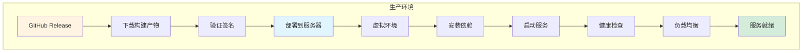

**部署步骤**:

1. **下载构建产物**
   ```bash
   # 从GitHub Release下载
   wget https://github.com/user/repo/releases/download/v0.9.2/nanobot-runner-0.9.2.tar.gz
   ```

2. **验证签名**（可选）
   ```bash
   gpg --verify nanobot-runner-0.9.2.tar.gz.sig
   ```

3. **部署到服务器**
   ```bash
   tar -xzf nanobot-runner-0.9.2.tar.gz
   cd nanobot-runner-0.9.2
   ```

4. **创建虚拟环境**
   ```bash
   uv venv
   ```

5. **安装依赖**
   ```bash
   uv sync --no-dev
   ```

6. **启动服务**
   ```bash
   uv run nanobotrun --help
   ```

---

## 8. 迁移路径设计

### 8.1 迁移阶段划分

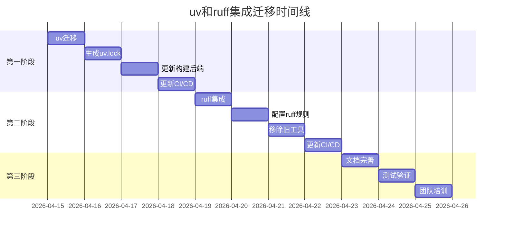

### 8.2 迁移检查清单

#### 第一阶段：uv迁移

- [ ] **依赖锁定**
  - [ ] 执行 `uv lock`
  - [ ] 验证uv.lock文件生成
  - [ ] 对比依赖版本差异
  - [ ] 提交uv.lock到Git

- [ ] **构建后端更新**
  - [ ] 更新pyproject.toml构建配置
  - [ ] 本地构建测试
  - [ ] CI/CD构建测试

- [ ] **CI/CD更新**
  - [ ] 添加uv安装步骤
  - [ ] 添加缓存配置
  - [ ] 更新依赖安装命令
  - [ ] 测试CI/CD流程

- [ ] **文档更新**
  - [ ] 更新AGENTS.md
  - [ ] 更新README.md
  - [ ] 更新开发指南

#### 第二阶段：ruff集成

- [ ] **ruff配置**
  - [ ] 添加ruff依赖
  - [ ] 配置ruff规则
  - [ ] 测试ruff检查
  - [ ] 测试ruff格式化

- [ ] **工具替换**
  - [ ] 移除black依赖和配置
  - [ ] 移除isort依赖和配置
  - [ ] 移除bandit依赖和配置
  - [ ] 验证功能对等

- [ ] **CI/CD更新**
  - [ ] 替换black检查为ruff
  - [ ] 替换isort检查为ruff
  - [ ] 替换bandit检查为ruff
  - [ ] 测试CI/CD流程

- [ ] **文档更新**
  - [ ] 更新AGENTS.md
  - [ ] 提供ruff命令速查
  - [ ] 更新提交前检查清单

#### 第三阶段：验证和培训

- [ ] **功能验证**
  - [ ] 本地开发环境测试
  - [ ] CI/CD流程测试
  - [ ] 构建发布测试
  - [ ] 回归测试

- [ ] **性能验证**
  - [ ] 依赖安装时间对比
  - [ ] 代码检查时间对比
  - [ ] CI/CD执行时间对比

- [ ] **团队培训**
  - [ ] uv使用培训
  - [ ] ruff使用培训
  - [ ] 常见问题解答

### 8.3 回滚方案

#### uv回滚

**触发条件**:
- uv.lock导致依赖版本冲突无法解决
- CI/CD无法正常工作
- 团队无法适应新工具

**回滚步骤**:
1. 删除uv.lock文件
2. 恢复pyproject.toml构建配置
3. 恢复CI/CD配置
4. 恢复文档

**回滚命令**:
```bash
# 删除uv.lock
git rm uv.lock

# 恢复pyproject.toml
git checkout HEAD~1 -- pyproject.toml

# 恢复CI/CD配置
git checkout HEAD~1 -- .github/workflows/

# 恢复文档
git checkout HEAD~1 -- AGENTS.md README.md
```

#### ruff回滚

**触发条件**:
- ruff规则与项目风格严重冲突
- 自动修复引入bug
- 团队无法适应新工具

**回滚步骤**:
1. 恢复black、isort、bandit依赖
2. 恢复工具配置
3. 恢复CI/CD配置
4. 恢复文档

**回滚命令**:
```bash
# 恢复依赖
uv add --dev black isort bandit

# 恢复配置
git checkout HEAD~1 -- pyproject.toml

# 恢复CI/CD配置
git checkout HEAD~1 -- .github/workflows/

# 恢复文档
git checkout HEAD~1 -- AGENTS.md
```

---

## 9. 风险评估与规避

### 9.1 技术风险

#### 风险1：依赖版本冲突

**风险等级**: 中  
**影响范围**: 开发环境、CI/CD  
**发生概率**: 30%

**风险描述**:
uv.lock可能锁定与当前环境不同的依赖版本，导致功能异常或测试失败。

**规避措施**:
1. 迁移前备份当前依赖（`pip freeze > requirements.txt`）
2. 生成uv.lock后对比版本差异
3. 逐个验证关键依赖的功能
4. 保留回滚方案

**应急方案**:
- 手动调整pyproject.toml中的版本约束
- 使用`uv add package==version`指定版本
- 回滚到pip管理

#### 风险2：ruff规则冲突

**风险等级**: 中  
**影响范围**: 代码库、CI/CD  
**发生概率**: 40%

**风险描述**:
ruff的规则可能与现有代码风格冲突，导致大量代码需要修改。

**规避措施**:
1. 先运行`ruff check --diff`查看差异
2. 逐步启用规则，而非一次性全部启用
3. 使用`# noqa`临时忽略特定规则
4. 在CI/CD中添加`--exit-zero`参数

**应急方案**:
- 调整ruff配置，忽略冲突规则
- 使用`ruff check --fix`自动修复
- 回滚到black+isort+bandit

#### 风险3：CI/CD兼容性

**风险等级**: 低  
**影响范围**: CI/CD  
**发生概率**: 10%

**风险描述**:
GitHub Actions可能不支持uv或ruff，导致CI/CD失败。

**规避措施**:
1. 使用官方的`astral-sh/setup-uv@v4` action
2. 在本地测试CI/CD流程
3. 保留pip作为备用方案

**应急方案**:
- 使用pip作为备用安装方式
- 使用Docker容器确保环境一致
- 联系GitHub Actions支持

### 9.2 业务风险

#### 风险4：开发中断

**风险等级**: 低  
**影响范围**: 开发进度  
**发生概率**: 20%

**风险描述**:
迁移过程中可能中断正常开发工作。

**规避措施**:
1. 选择非关键时期迁移
2. 提前通知团队成员
3. 准备详细的迁移文档
4. 保留回滚方案

**应急方案**:
- 立即回滚到旧工具链
- 延迟迁移到合适时机
- 分阶段迁移，减少影响

#### 风险5：团队学习成本

**风险等级**: 低  
**影响范围**: 团队效率  
**发生概率**: 50%

**风险描述**:
团队成员需要学习新工具，可能影响短期效率。

**规避措施**:
1. 提供详细的迁移文档
2. 提供命令速查表
3. 组织培训会议
4. 提供技术支持

**应急方案**:
- 延长迁移适应期
- 提供一对一辅导
- 简化工具使用流程

### 9.3 风险矩阵

| 风险 | 等级 | 影响 | 概率 | 规避措施 | 应急方案 |
|------|------|------|------|---------|---------|
| 依赖版本冲突 | 中 | 高 | 30% | 备份、对比、验证 | 手动调整、回滚 |
| ruff规则冲突 | 中 | 中 | 40% | 逐步启用、临时忽略 | 调整配置、回滚 |
| CI/CD兼容性 | 低 | 高 | 10% | 使用官方action、本地测试 | 备用方案、Docker |
| 开发中断 | 低 | 中 | 20% | 选择合适时机、提前通知 | 立即回滚 |
| 团队学习成本 | 低 | 低 | 50% | 文档、培训、支持 | 延长适应期 |

---

## 10. 性能指标与监控

### 10.1 性能指标定义

#### 依赖安装性能指标

| 指标 | 改进前 | 改进后 | 目标 |
|------|-------|-------|------|
| 首次安装时间 | 30-60秒 | 3-6秒 | ≤10秒 |
| 缓存命中安装时间 | 10-20秒 | 0.5-1秒 | ≤2秒 |
| 添加新依赖时间 | 5-10秒 | 0.5-1秒 | ≤2秒 |

#### 代码检查性能指标

| 指标 | 改进前 | 改进后 | 目标 |
|------|-------|-------|------|
| 格式化检查时间 | 8-15秒 | 1-2秒 | ≤3秒 |
| 代码质量检查时间 | 5-10秒 | 0.5-1秒 | ≤2秒 |
| 自动修复时间 | 10-20秒 | 1-2秒 | ≤3秒 |

#### CI/CD性能指标

| 指标 | 改进前 | 改进后 | 目标 |
|------|-------|-------|------|
| code-quality job | 53-105秒 | 22-44秒 | ≤50秒 |
| test job | 50-100秒 | 30-60秒 | ≤70秒 |
| build job | 20-40秒 | 10-20秒 | ≤25秒 |
| 总执行时间 | 123-245秒 | 62-124秒 | ≤150秒 |

### 10.2 监控方案

#### 本地开发监控

**监控工具**: 自定义脚本

**监控指标**:
- 依赖安装时间
- 代码检查时间
- 虚拟环境大小

**监控脚本示例**:
```python
import time
import subprocess

def measure_install_time():
    start = time.time()
    subprocess.run(["uv", "sync", "--all-extras"], check=True)
    end = time.time()
    return end - start

def measure_check_time():
    start = time.time()
    subprocess.run(["uv", "run", "ruff", "check", "src/"], check=True)
    end = time.time()
    return end - start

# 记录到日志
with open("performance.log", "a") as f:
    f.write(f"Install: {measure_install_time():.2f}s\n")
    f.write(f"Check: {measure_check_time():.2f}s\n")
```

#### CI/CD监控

**监控工具**: GitHub Actions内置监控

**监控指标**:
- Job执行时间
- Step执行时间
- 缓存命中率

**监控配置**:
```yaml
- name: Record performance metrics
  run: |
    echo "::notice::Install time: ${{ steps.install.outputs.time }}"
    echo "::notice::Check time: ${{ steps.check.outputs.time }}"
```

#### 告警机制

**告警条件**:
- 依赖安装时间 > 15秒
- 代码检查时间 > 5秒
- CI/CD总时间 > 180秒

**告警方式**:
- GitHub Actions失败通知
- Slack/邮件通知（可选）

---

## 11. 验收标准

### 11.1 功能验收标准

#### uv迁移验收

- [ ] uv.lock文件存在且内容正确
- [ ] 本地依赖安装成功
- [ ] CI/CD依赖安装成功
- [ ] 构建后端已更新为hatchling
- [ ] 本地构建测试通过
- [ ] CI/CD构建测试通过
- [ ] 文档已更新

#### ruff集成验收

- [ ] ruff依赖已添加
- [ ] ruff配置完整且正确
- [ ] 代码格式化功能正常
- [ ] 代码检查功能正常
- [ ] CI/CD使用ruff
- [ ] 旧工具已移除
- [ ] 文档已更新

#### CI/CD优化验收

- [ ] uv缓存配置正确
- [ ] 缓存命中率 > 80%
- [ ] 并行执行优化完成
- [ ] 性能监控配置完成
- [ ] CI/CD执行时间减少 > 40%

### 11.2 性能验收标准

| 指标 | 目标 | 验收方法 |
|------|------|---------|
| 依赖安装时间 | ≤10秒 | 本地测试10次取平均 |
| 代码检查时间 | ≤3秒 | 本地测试10次取平均 |
| CI/CD总时间 | ≤150秒 | CI/CD运行10次取平均 |
| 缓存命中率 | ≥80% | CI/CD日志统计 |

### 11.3 质量验收标准

- [ ] 所有单元测试通过
- [ ] 所有集成测试通过
- [ ] 代码覆盖率 ≥ 80%
- [ ] 无安全漏洞告警
- [ ] 无性能退化

### 11.4 文档验收标准

- [ ] AGENTS.md已更新
- [ ] README.md已更新
- [ ] 开发指南已更新
- [ ] 迁移指南已创建
- [ ] 常见问题已整理

---

## 12. 附录

### 12.1 命令速查表

#### uv命令

| 命令 | 说明 | 示例 |
|------|------|------|
| `uv lock` | 生成锁定文件 | `uv lock` |
| `uv sync` | 同步依赖 | `uv sync --all-extras` |
| `uv add` | 添加依赖 | `uv add requests` |
| `uv add --dev` | 添加开发依赖 | `uv add --dev ruff` |
| `uv remove` | 移除依赖 | `uv remove black` |
| `uv run` | 运行命令 | `uv run pytest` |
| `uv venv` | 创建虚拟环境 | `uv venv` |
| `uv build` | 构建包 | `uv build` |
| `uv cache clean` | 清理缓存 | `uv cache clean` |

#### ruff命令

| 命令 | 说明 | 示例 |
|------|------|------|
| `ruff check` | 代码检查 | `ruff check src/` |
| `ruff check --fix` | 自动修复 | `ruff check --fix src/` |
| `ruff check --diff` | 显示差异 | `ruff check --diff src/` |
| `ruff format` | 格式化代码 | `ruff format src/` |
| `ruff format --check` | 格式化检查 | `ruff format --check src/` |
| `ruff rule` | 规则说明 | `ruff rule E501` |

### 12.2 配置模板

#### pyproject.toml模板

```toml
[project]
name = "nanobot-runner"
version = "0.9.2"
requires-python = ">=3.11"

[build-system]
requires = ["hatchling"]
build-backend = "hatchling.build"

[tool.uv]
# uv配置（可选）

[tool.ruff]
target-version = "py311"
line-length = 88

[tool.ruff.lint]
select = ["E", "W", "F", "I", "B", "UP"]
ignore = ["E501"]

[tool.ruff.format]
quote-style = "double"

[tool.mypy]
python_version = "3.11"
warn_return_any = false

[tool.pytest.ini_options]
testpaths = ["tests"]
```

### 12.3 故障排查指南

#### 问题1：uv.lock冲突

**症状**: `uv sync`失败，提示版本冲突

**解决方案**:
```bash
# 1. 清理缓存
uv cache clean

# 2. 重新生成锁定文件
rm uv.lock
uv lock

# 3. 如果仍有问题，手动调整版本约束
# 编辑pyproject.toml，调整版本范围
```

#### 问题2：ruff检查失败

**症状**: `ruff check`报告大量错误

**解决方案**:
```bash
# 1. 查看具体错误
ruff check src/ --output-format=github

# 2. 自动修复
ruff check --fix src/

# 3. 如果自动修复有问题，手动修复或忽略
# 在代码中添加 # noqa: E501
```

#### 问题3：CI/CD缓存未命中

**症状**: 每次CI/CD都重新安装依赖

**解决方案**:
```yaml
# 检查缓存键是否正确
- name: Cache uv dependencies
  uses: actions/cache@v3
  with:
    path: ~/.cache/uv
    key: ${{ runner.os }}-uv-${{ hashFiles('uv.lock') }}
    restore-keys: |
      ${{ runner.os }}-uv-
```

---

**文档版本**: v1.0  
**最后更新**: 2026-04-10  
**维护者**: 架构师团队  
**审核状态**: 已审核
