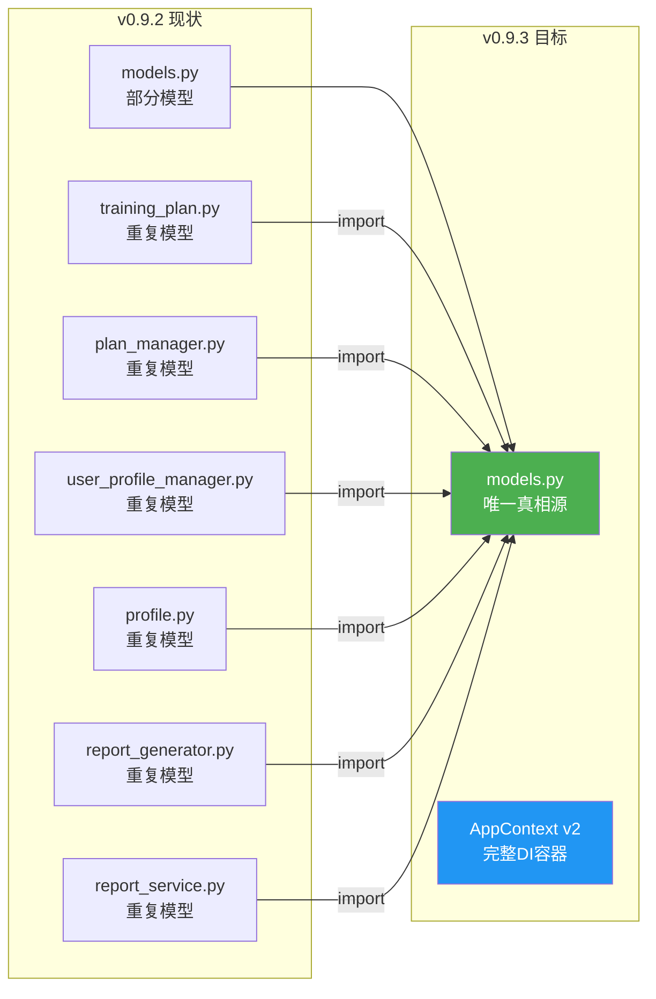
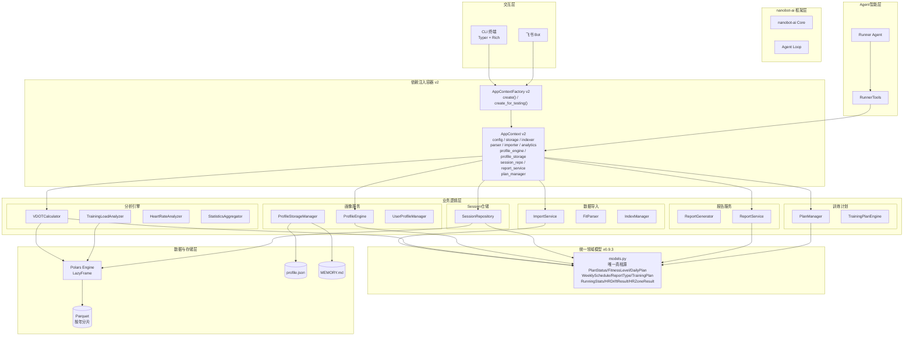
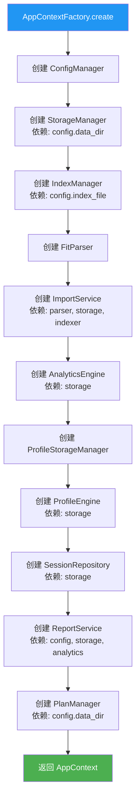
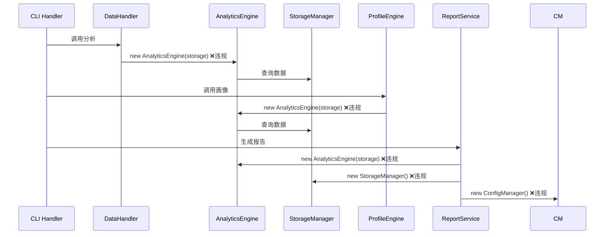
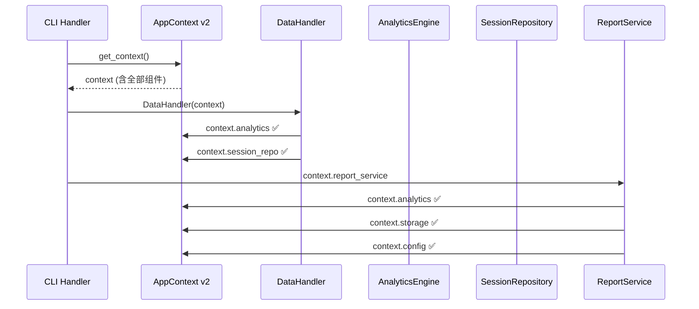
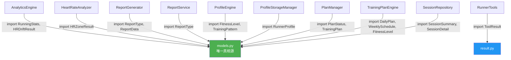
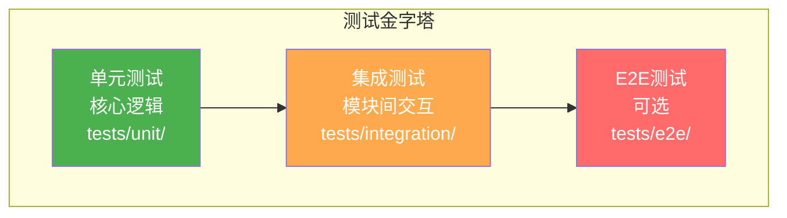
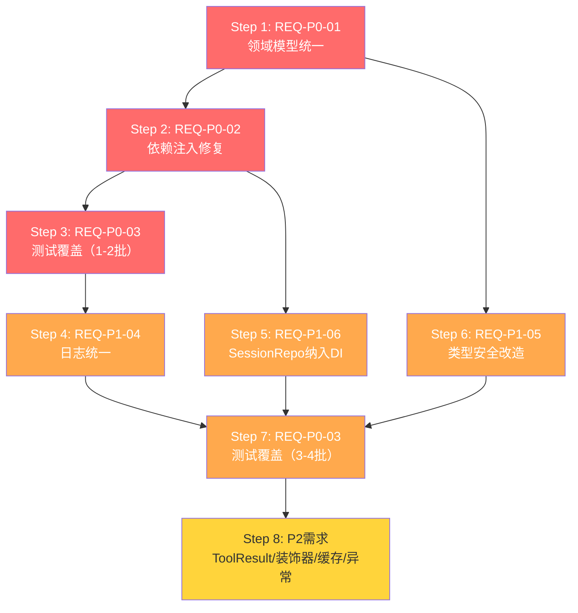

# 架构设计说明书 — v0.9.3 架构改进

> **文档版本**: v1.0
> **创建日期**: 2026-04-14
> **来源需求**: `docs/requirements/PRD_架构改进_v0.9.3.md`
> **基于版本**: v0.9.2 → v0.9.3
> **设计状态**: 待评审

---

## 1. 架构概述

### 1.1 改造目标

v0.9.0 的架构重构方向正确（上帝类拆分、依赖注入引入、Polars向量化），但**落地不彻底**。本次 v0.9.3 架构改进聚焦三大核心问题：

1. **领域模型碎片化** → 统一到 `models.py` 唯一真相源
2. **依赖注入半成品** → AppContext v2 全面接管组件生命周期
3. **测试覆盖不足** → 分层渐进式补充至门禁标准

### 1.2 设计原则

| 原则 | 说明 |
|------|------|
| 唯一真相源 | 每个领域概念仅在一处定义，其他位置通过 import 引用 |
| 构造函数注入 | 所有业务组件通过 AppContext 获取依赖，禁止自行实例化 |
| 渐进式改造 | P0 → P1 → P2 分批推进，每批完成后全量测试验证 |
| 类型安全 | 消除 `Dict[str, Any]`，使用 `frozen dataclass` 替代 |
| 向后兼容 | 新增 dataclass 提供 `to_dict()` 方法，Agent Tools 输出格式不变 |

### 1.3 架构变更范围



---

## 2. 技术栈选型

### 2.1 现有技术栈（无变更）

本次架构改进**不引入新技术栈**，仅对现有组件的使用方式进行规范化。

| 层级 | 技术 | 版本 | 变更 |
|------|------|------|------|
| 核心底座 | nanobot-ai | Latest | 无变更 |
| 开发语言 | Python | 3.11+ | 无变更 |
| CLI框架 | Typer + Rich | Latest | 无变更 |
| 数据存储 | Apache Parquet | via pyarrow | 无变更 |
| 计算引擎 | Polars | 0.20+ | 无变更 |
| 数据解析 | fitparse | Latest | 无变更 |

### 2.2 移除项

| 技术 | 移除原因 | 影响范围 |
|------|---------|---------|
| loguru | 不在 pyproject.toml 依赖中，与项目 `get_logger` 规范冲突 | `src/core/config.py` |

### 2.3 新增模式（非新依赖）

| 模式 | 说明 | 适用需求 |
|------|------|---------|
| `StrEnum` | Python 3.11+ 内置，替代 `Enum` 用于字符串枚举 | REQ-P0-01 |
| `frozen dataclass` | 不可变数据类，替代 `Dict[str, Any]` | REQ-P1-05 |
| `src/core/result.py` | 新文件，存放 `ToolResult` | REQ-P2-07 |

---

## 3. 系统整体架构图

### 3.1 v0.9.3 架构全景图



---

## 4. 模块详细设计

### 4.1 领域模型统一 — `src/core/models.py`

#### 4.1.1 设计决策

**决策**：以 `models.py` 为唯一真相源，合并所有重复定义。

**选型依据**：
- `models.py` 已包含 `PlanStatus`、`DailyPlan`、`WeeklySchedule`、`TrainingPlan` 等核心模型
- 其他文件中的重复定义是 v0.9.0 拆分时的遗留问题
- 统一到 `models.py` 符合 AGENTS.md 规范和 DRY 原则

**枚举类型统一策略**：

| 枚举 | 当前多版本 | 统一版本 | 选型依据 |
|------|-----------|---------|---------|
| `PlanStatus` | `models.py`(Enum) + `plan_manager.py`(StrEnum) | `StrEnum` | StrEnum 支持 `str` 比较，更现代 |
| `FitnessLevel` | 3处定义，值不同 | 合并为完整集合 | 见下方合并方案 |
| `ReportType` | `report_generator.py`(Enum) + `report_service.py`(StrEnum) | `StrEnum` | 同 PlanStatus |
| `TrainingType` | `models.py`(Enum) + `training_plan.py`(WorkoutType) | `StrEnum` | 统一命名为 TrainingType |

**FitnessLevel 合并方案**（RSK-01 高风险项）：

当前三处定义对比：

| 来源 | 枚举值 | 业务语义 |
|------|--------|---------|
| `user_profile_manager.py` | BEGINNER/INTERMEDIATE/ADVANCED/ELITE | 英文值，用于画像计算 |
| `training_plan.py` | BEGINNER/INTERMEDIATE/ADVANCED/ELITE | 中文label，用于训练计划生成 |
| `profile.py` | 无独立定义，引用 user_profile_manager | — |

**合并决策**：采用 `user_profile_manager.py` 的英文值作为枚举值，中文作为 `label` 属性：

```python
class FitnessLevel(StrEnum):
    BEGINNER = "beginner"
    INTERMEDIATE = "intermediate"
    ADVANCED = "advanced"
    ELITE = "elite"

    @property
    def label(self) -> str:
        labels = {
            "beginner": "初学者",
            "intermediate": "中级",
            "advanced": "进阶",
            "elite": "精英",
        }
        return labels[self.value]
```

**DailyPlan/WeeklySchedule 合并方案**：

取字段并集，`training_plan.py` 版本多出 `actual_*`、`rpe`、`hr_drift` 等训练反馈字段：

```python
@dataclass
class DailyPlan:
    date: str
    workout_type: str
    distance_km: float
    duration_min: int
    target_pace_min_per_km: float | None = None
    target_hr_zone: int | None = None
    notes: str | None = None
    completed: bool = False
    actual_distance_km: float | None = None
    actual_duration_min: int | None = None
    actual_avg_hr: int | None = None
    rpe: int | None = None
    hr_drift: float | None = None
    calendar_event_id: str | None = None
```

#### 4.1.2 迁移影响矩阵

| 原定义位置 | 删除的类 | 改为 import | 影响范围 |
|-----------|---------|------------|---------|
| `training_plan.py` | `PlanType`, `WorkoutType`, `FitnessLevel`, `DailyPlan`, `WeeklySchedule` | `from src.core.models import ...` | `plan_manager.py`, `hard_validator.py` |
| `plan_manager.py` | `PlanStatus` | `from src.core.models import PlanStatus` | `plan_manager.py` 内部逻辑 |
| `user_profile_manager.py` | `FitnessLevel`, `TrainingPattern`, `InjuryRiskLevel` | `from src.core.models import ...` | `profile.py`, `profile_engine` |
| `profile.py` | `ProfileStorageManager` | 保留 `user_profile_manager.py` 版本，`profile.py` 删除重复 | `context.py` import 路径 |
| `report_generator.py` | `ReportType` | `from src.core.models import ReportType` | `report_generator.py` 内部 |
| `report_service.py` | `ReportType` | `from src.core.models import ReportType` | `report_service.py` 内部 |

---

### 4.2 依赖注入容器 v2 — `src/core/context.py`

#### 4.2.1 AppContext v2 数据结构

```python
@dataclass
class AppContext:
    config: ConfigManager
    storage: StorageManager
    indexer: IndexManager
    parser: FitParser
    importer: ImportService
    analytics: AnalyticsEngine
    profile_engine: ProfileEngine
    profile_storage: ProfileStorageManager
    session_repo: SessionRepository
    report_service: ReportService
    plan_manager: PlanManager

    _extensions: dict = field(default_factory=dict)
```

#### 4.2.2 AppContextFactory v2 创建流程



**依赖链验证（无循环依赖）**：

```
ConfigManager → 无依赖
StorageManager → ConfigManager
IndexManager → ConfigManager
FitParser → 无依赖
ImportService → FitParser, StorageManager, IndexManager
AnalyticsEngine → StorageManager
ProfileStorageManager → 无依赖
ProfileEngine → StorageManager
SessionRepository → StorageManager
ReportService → ConfigManager, StorageManager, AnalyticsEngine
PlanManager → ConfigManager
```

所有依赖均为单向，无循环。

#### 4.2.3 DI 违规修复方案

| 编号 | 违规位置 | 修复方案 |
|------|---------|---------|
| DI-01 | `data_handler.py:175` | DataHandler 已持有 `context`，改为 `self.context.analytics` |
| DI-02/03 | `profile.py:1100,1216` | ProfileEngine 改为接收 `AppContext`，使用 `context.analytics` |
| DI-04 | `report_generator.py:268` | ReportGenerator 改为接收 `AppContext`，使用 `context.analytics` |
| DI-05 | `report_service.py:44` | ReportService 改为接收 `AppContext`，使用 `context.analytics` |
| DI-06 | `importer.py:36` | ImportService 改为接收 `AppContext`，使用 `context.storage` |
| DI-07 | `feishu.py:41` | FeishuBot 改为接收 `ConfigManager` 参数（通过构造函数注入） |
| DI-08 | `feishu_calendar.py:307` | FeishuCalendar 改为接收 `ConfigManager` 参数 |
| DI-09 | `plan_manager.py:76` | PlanManager 改为接收 `AppContext`，使用 `context.config` |

#### 4.2.4 构造函数签名变更规范

**统一模式**：所有业务组件通过构造函数接收 `AppContext` 或其子集。

```python
class ReportService:
    def __init__(self, context: AppContext) -> None:
        self._config = context.config
        self._storage = context.storage
        self._analytics = context.analytics
```

**例外处理**：
- `FeishuBot` / `FeishuCalendar`：仅需 `ConfigManager`，无需完整 `AppContext`
- `SessionRepository`：仅需 `StorageManager`，保持现有签名

---

### 4.3 类型安全改造 — 新增 dataclass

#### 4.3.1 新增返回类型定义

所有新增 dataclass 定义在 `src/core/models.py`，使用 `frozen=True`：

```python
@dataclass(frozen=True)
class RunningStats:
    total_runs: int
    total_distance_km: float
    total_duration_hours: float
    avg_pace_sec_km: float | None
    avg_heart_rate: float | None
    max_heart_rate: float | None

    def to_dict(self) -> dict[str, Any]:
        return {
            "total_runs": self.total_runs,
            "total_distance_km": round(self.total_distance_km, 2),
            "total_duration_hours": round(self.total_duration_hours, 2),
            "avg_pace_sec_km": self.avg_pace_sec_km,
            "avg_heart_rate": self.avg_heart_rate,
            "max_heart_rate": self.max_heart_rate,
        }

@dataclass(frozen=True)
class HRDriftResult:
    has_drift: bool
    correlation: float
    drift_percentage: float
    avg_heart_rate: float | None

    def to_dict(self) -> dict[str, Any]:
        return {
            "has_drift": self.has_drift,
            "correlation": round(self.correlation, 4),
            "drift_percentage": round(self.drift_percentage, 2),
            "avg_heart_rate": self.avg_heart_rate,
        }

@dataclass(frozen=True)
class HRZoneResult:
    zones: dict[int, float]
    avg_heart_rate: float | None
    max_heart_rate: float | None

    def to_dict(self) -> dict[str, Any]:
        return {
            "zones": self.zones,
            "avg_heart_rate": self.avg_heart_rate,
            "max_heart_rate": self.max_heart_rate,
        }

@dataclass(frozen=True)
class ReportData:
    report_type: str
    start_date: str
    end_date: str
    generated_at: str
    content: str
    summary: dict[str, Any]

    def to_dict(self) -> dict[str, Any]:
        return {
            "report_type": self.report_type,
            "start_date": self.start_date,
            "end_date": self.end_date,
            "generated_at": self.generated_at,
            "content": self.content,
            "summary": self.summary,
        }

@dataclass(frozen=True)
class CalendarEventResult:
    event_id: str | None
    success: bool
    message: str

    def to_dict(self) -> dict[str, Any]:
        return {
            "event_id": self.event_id,
            "success": self.success,
            "message": self.message,
        }
```

#### 4.3.2 方法签名迁移映射

| 模块 | 方法 | 当前签名 | 目标签名 |
|------|------|---------|---------|
| `analytics.py` | `get_running_stats()` | `-> Dict[str, Any]` | `-> RunningStats` |
| `analytics.py` | `analyze_hr_drift()` | `-> Dict[str, Any]` | `-> HRDriftResult` |
| `heart_rate_analyzer.py` | `get_hr_zones()` | `-> Dict[str, Any]` | `-> HRZoneResult` |
| `report_generator.py` | `generate_report()` | `-> Dict[str, Any]` | `-> ReportData` |
| `feishu_calendar.py` | `create_event()` | `-> Dict[str, Any]` | `-> CalendarEventResult` |

---

### 4.4 ToolResult 位置调整

#### 4.4.1 新文件 `src/core/result.py`

```python
from dataclasses import dataclass
from typing import Any

@dataclass
class ToolResult:
    success: bool
    data: Any | None = None
    message: str | None = None
    error: str | None = None

    def to_dict(self) -> dict[str, Any]:
        result: dict[str, Any] = {"success": self.success}
        if self.data is not None:
            result["data"] = self.data
        if self.message is not None:
            result["message"] = self.message
        if self.error is not None:
            result["error"] = self.error
        return result

    def to_json(self) -> str:
        import json
        return json.dumps(self.to_dict(), ensure_ascii=False)
```

#### 4.4.2 迁移影响

| 原import路径 | 新import路径 | 影响文件 |
|-------------|-------------|---------|
| `from src.core.exceptions import ToolResult` | `from src.core.result import ToolResult` | `decorators.py`, `agents/tools.py` |

---

### 4.5 装饰器合并设计

#### 4.5.1 统一装饰器

合并 `tool_wrapper` 和 `handle_tool_errors` 为 `tool_handler`：

```python
def tool_handler(
    return_format: str = "json",
    default_response: Any = None,
    error_message: str = "操作失败",
) -> Callable:
    """
    统一工具异常处理装饰器

    Args:
        return_format: 返回格式 "json"(ToolResult JSON) 或 "dict"(dict)
        default_response: dict 格式下的默认返回值
        error_message: dict 格式下的错误提示
    """
```

**行为矩阵**：

| return_format | 成功时 | 异常时 |
|--------------|--------|--------|
| `"json"` | `ToolResult(success=True, data=result).to_json()` | `ToolResult(success=False, error=msg).to_json()` |
| `"dict"` | 直接返回结果 | `default_response or {"error": error_message}` |

#### 4.5.2 迁移映射

| 原装饰器 | 新装饰器 | 影响文件 |
|---------|---------|---------|
| `@tool_wrapper` | `@tool_handler(return_format="json")` | `agents/tools.py` |
| `@handle_tool_errors()` | `@tool_handler(return_format="dict")` | `agents/tools.py` |

---

### 4.6 PlanManagerError 继承修复

```python
@dataclass
class PlanManagerError(NanobotRunnerError):
    error_code: str = "PLAN_ERROR"
    recovery_suggestion: str | None = "请检查训练计划配置或重新创建计划"
```

---

### 4.7 ConfigManager 缓存改进

```python
class ConfigManager:
    def __init__(self, ...) -> None:
        self._cache: dict[str, Any] = {}
        self._cache_time: float = 0.0

    @classmethod
    def reset_cache(cls) -> None:
        pass
```

**测试隔离方案**：

```python
@pytest.fixture(autouse=True)
def reset_config_cache():
    yield
    ConfigManager.reset_cache()
```

---

## 5. 数据流设计

### 5.1 改造前：DI 违规数据流



### 5.2 改造后：统一DI数据流



### 5.3 领域模型引用流（改造后）



---

## 6. 接口规范

### 6.1 AppContext v2 接口

```python
@dataclass
class AppContext:
    config: ConfigManager
    storage: StorageManager
    indexer: IndexManager
    parser: FitParser
    importer: ImportService
    analytics: AnalyticsEngine
    profile_engine: ProfileEngine
    profile_storage: ProfileStorageManager
    session_repo: SessionRepository
    report_service: ReportService
    plan_manager: PlanManager

    _extensions: dict = field(default_factory=dict)

    def get_extension(self, name: str) -> Any | None: ...
    def set_extension(self, name: str, instance: Any) -> None: ...
```

### 6.2 AppContextFactory v2 接口

```python
class AppContextFactory:
    @staticmethod
    def create(
        config: ConfigManager | None = None,
        storage: StorageManager | None = None,
        indexer: IndexManager | None = None,
        parser: FitParser | None = None,
        importer: ImportService | None = None,
        analytics: AnalyticsEngine | None = None,
        profile_engine: ProfileEngine | None = None,
        profile_storage: ProfileStorageManager | None = None,
        session_repo: SessionRepository | None = None,
        report_service: ReportService | None = None,
        plan_manager: PlanManager | None = None,
    ) -> AppContext: ...

    @staticmethod
    def create_for_testing(
        config: ConfigManager | None = None,
        storage: StorageManager | None = None,
        indexer: IndexManager | None = None,
        parser: FitParser | None = None,
        importer: ImportService | None = None,
        analytics: AnalyticsEngine | None = None,
        profile_engine: ProfileEngine | None = None,
        profile_storage: ProfileStorageManager | None = None,
        session_repo: SessionRepository | None = None,
        report_service: ReportService | None = None,
        plan_manager: PlanManager | None = None,
    ) -> AppContext: ...
```

### 6.3 业务组件构造函数规范

| 组件 | 构造函数签名 | 依赖来源 |
|------|------------|---------|
| `AnalyticsEngine` | `__init__(self, storage: StorageManager)` | 不变 |
| `ProfileEngine` | `__init__(self, context: AppContext)` | 改造：从 `storage` → `context` |
| `ReportGenerator` | `__init__(self, context: AppContext)` | 改造：新增 |
| `ReportService` | `__init__(self, context: AppContext)` | 改造：从多参数 → `context` |
| `PlanManager` | `__init__(self, context: AppContext)` | 改造：从 `data_dir` → `context` |
| `ImportService` | `__init__(self, parser, storage, indexer)` | 不变 |
| `SessionRepository` | `__init__(self, storage: StorageManager)` | 不变 |
| `FeishuBot` | `__init__(self, config: ConfigManager)` | 改造：从 `app_id, app_secret...` → `config` |
| `FeishuCalendar` | `__init__(self, config: ConfigManager)` | 改造：从无参 → `config` |

### 6.4 领域模型统一 import 规范

```python
from src.core.models import (
    PlanStatus,
    FitnessLevel,
    TrainingType,
    ReportType,
    DailyPlan,
    WeeklySchedule,
    TrainingPlan,
    RunningStats,
    HRDriftResult,
    HRZoneResult,
    ReportData,
    CalendarEventResult,
    InjuryRiskLevel,
    TrainingPattern,
)

from src.core.result import ToolResult
```

---

## 7. 测试架构设计

### 7.1 测试分层策略



### 7.2 Mock 策略

| 层级 | Mock 对象 | Mock 方式 |
|------|----------|----------|
| 核心计算 | 无需 Mock | 纯函数，直接测试 |
| 数据流 | `StorageManager` | `AppContextFactory.create_for_testing(storage=Mock())` |
| 集成链路 | `AppContext` 多组件 | `AppContextFactory.create_for_testing()` 注入 Mock |
| 外部交互 | HTTP 请求 | `unittest.mock.patch("requests.post")` |

### 7.3 测试隔离规范

```python
import pytest
from unittest.mock import Mock

@pytest.fixture
def mock_storage() -> Mock:
    storage = Mock(spec=StorageManager)
    storage.read_parquet.return_value = pl.LazyFrame(...)
    return storage

@pytest.fixture
def test_context(mock_storage: Mock) -> AppContext:
    return AppContextFactory.create_for_testing(storage=mock_storage)

@pytest.fixture(autouse=True)
def reset_caches():
    yield
    ConfigManager.reset_cache()
```

### 7.4 覆盖率渐进式提升

| 阶段 | 目标模块 | 覆盖率阈值 |
|------|---------|-----------|
| alpha | `vdot_calculator`, `training_load_analyzer`, `heart_rate_analyzer` | ≥80% |
| alpha | `session_repository`, `statistics_aggregator`, `storage` | ≥80% |
| beta | `profile`, `report_generator`, `importer` | ≥80% |
| beta | `feishu`, `feishu_calendar` | ≥70% |

---

## 8. 非功能设计

### 8.1 性能保障

| 指标 | 当前基线 | 目标 | 验证方式 |
|------|---------|------|---------|
| CLI 启动时间 | ~1.5s | ≤2s | `uv run nanobotrun system version` |
| AppContext 初始化 | ~200ms | ≤500ms | 计时日志 |
| 测试套件执行 | ~30s | ≤120s | `pytest --durations=0` |
| Parquet 查询 | ~50ms | ≤100ms | benchmark 测试 |

### 8.2 安全保障

| 措施 | 说明 |
|------|------|
| 无硬编码密钥 | 所有敏感配置通过 `ConfigManager` 读取 |
| 统一异常体系 | 所有对外异常继承 `NanobotRunnerError`，不泄露内部实现 |
| 测试数据脱敏 | 测试 fixture 使用合成数据，禁止真实用户数据 |

### 8.3 可维护性保障

| 措施 | 工具 | 频率 |
|------|------|------|
| 代码格式化 | `ruff format` | 每次提交 |
| 代码质量 | `ruff check` | 每次提交 |
| 类型检查 | `mypy` | 每次提交 |
| 测试覆盖 | `pytest --cov` | 每次提交 |
| 重复定义检测 | `grep "class XXX" src/` | CI 流水线 |

---

## 9. 架构决策记录 (ADR)

### ADR-001：枚举类型统一使用 StrEnum

**背景**：`PlanStatus` 和 `ReportType` 在不同文件中分别使用 `Enum` 和 `StrEnum`，导致比较行为不一致。

**决定**：统一使用 `StrEnum`（Python 3.11+ 内置）。

**影响**：
- ✅ 支持 `str` 直接比较，如 `status == "active"`
- ✅ JSON 序列化时自动输出字符串值
- ⚠️ 需验证所有使用 `Enum.value` 的代码是否兼容

**替代方案**：
- 保持 `Enum`：需要显式 `.value` 访问，代码冗余
- 自定义 `StrEnum`：Python 3.11 前的做法，现已不必要

---

### ADR-002：业务组件通过 AppContext 注入而非独立参数

**背景**：`ReportService.__init__` 接收 4 个独立参数（config, storage, analytics, feishu），`PlanManager.__init__` 仅接收 `data_dir`。

**决定**：统一改为接收 `AppContext`，通过 `context.xxx` 获取依赖。

**影响**：
- ✅ 构造函数签名统一，降低认知负担
- ✅ 新增依赖时无需修改构造函数签名
- ⚠️ 组件获取了超出需要的依赖（违反接口隔离原则）
- ⚠️ 需确保 `AppContext` 不成为"上帝对象"

**替代方案**：
- 按需注入（仅注入所需依赖）：更符合 ISP，但签名不统一
- Protocol 注入：更灵活，但引入复杂度

**决策理由**：项目规模小（个人开发者），统一性优先于接口隔离。

---

### ADR-003：ToolResult 从 exceptions.py 移至 result.py

**背景**：`ToolResult` 是工具返回格式，不是异常，放在 `exceptions.py` 违反 SRP。

**决定**：新建 `src/core/result.py`，将 `ToolResult` 移入。

**影响**：
- ✅ 职责清晰：异常归异常，返回格式归返回格式
- ⚠️ 需更新所有 import 路径

---

### ADR-004：DataHandler 去重委托 SessionRepository

**背景**：`DataHandler.get_recent_runs()` 自行实现 session 聚合逻辑，与 `SessionRepository` 功能重复。

**决定**：`DataHandler` 通过 `context.session_repo` 委托给 `SessionRepository`。

**影响**：
- ✅ 消除重复代码
- ✅ Session 聚合逻辑统一维护
- ⚠️ `DataHandler` 需新增 `session_repo` 属性

---

## 10. 改造后的目标目录结构

```
src/
├── core/
│   ├── context.py              # AppContext v2 + AppContextFactory v2
│   ├── models.py               # 唯一真相源（合并后）
│   ├── result.py               # ToolResult（新增，从exceptions.py迁出）
│   ├── session_repository.py   # Session仓储层
│   ├── parser.py               # FIT文件解析
│   ├── storage.py              # Parquet存储管理
│   ├── indexer.py              # SHA256去重索引
│   ├── analytics.py            # 数据分析引擎（类型安全改造）
│   ├── profile.py              # 用户画像引擎（DI改造）
│   ├── user_profile_manager.py # 用户画像管理器（模型import改造）
│   ├── training_plan.py        # 训练计划引擎（模型import改造）
│   ├── config.py               # 配置管理（loguru清除+缓存改进）
│   ├── exceptions.py           # 自定义异常（ToolResult已迁出）
│   ├── decorators.py           # 统一装饰器（合并后）
│   ├── logger.py               # 统一日志
│   └── plan/
│       └── plan_manager.py     # 训练计划管理器（DI改造+异常继承修复）
├── agents/
│   └── tools.py                # Agent工具集（import路径更新）
├── notify/
│   ├── feishu.py               # 飞书通知（DI改造）
│   └── feishu_calendar.py      # 飞书日历（DI改造+类型安全）
├── cli/
│   ├── commands/               # CLI命令（无变更）
│   ├── handlers/
│   │   ├── data_handler.py     # 数据Handler（DI改造+SessionRepo去重）
│   │   └── analysis_handler.py # 分析Handler
│   └── app.py                  # CLI入口
```

---

## 11. 实施约束与风险管控

### 11.1 实施顺序约束



### 11.2 每步完成后的验证检查

| 检查项 | 命令 | 期望结果 |
|--------|------|---------|
| 代码格式 | `uv run ruff format --check src/` | 零警告 |
| 代码质量 | `uv run ruff check src/` | 零警告 |
| 类型检查 | `uv run mypy src/` | 零错误 |
| 单元测试 | `uv run pytest tests/unit/` | 100% 通过 |
| 重复定义 | `grep -r "class XXX" src/` | 仅 models.py |

### 11.3 回滚方案

每个 Step 完成后创建 Git commit，若后续 Step 出现不可逆问题，可回滚到上一个稳定 commit。

---

**文档编写**: 架构师智能体
**编写日期**: 2026-04-14
