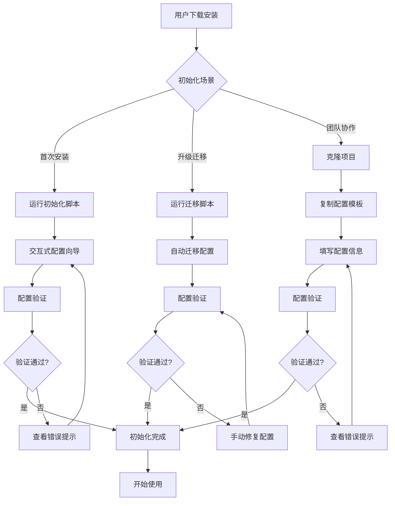

# 用户初始化配置流程指南

> **文档版本**: v1.0.0  
> **更新日期**: 2026-04-17  
> **适用对象**: 新用户、升级用户、团队成员  
> **目标**: 提供清晰、简单的初始化配置流程，确保用户快速上手

---

## 1. 初始化流程总览

### 1.1 三种初始化场景

| 场景 | 适用用户 | 初始化方式 | 预计时间 |
|------|---------|-----------|---------|
| **首次安装** | 全新用户 | 自动化脚本 + 交互式向导 | 5分钟 |
| **升级迁移** | 现有用户 | 自动迁移脚本 | 2分钟 |
| **团队协作** | 新成员 | 克隆项目 + 配置向导 | 3分钟 |

### 1.2 初始化流程图



---

## 2. 首次安装初始化流程

### 2.1 自动化初始化（推荐）

#### 2.1.1 一键初始化脚本

**脚本位置**：`scripts/init_config.py`

**使用方式**：
```bash
# 方式1：直接运行（推荐）
uv run python scripts/init_config.py

# 方式2：使用CLI命令（v1.0.0+）
uv run nanobotrun init
```

**脚本功能**：
- ✅ 自动检测运行环境
- ✅ 创建必要的目录结构
- ✅ 生成配置文件模板
- ✅ 引导用户填写必要配置
- ✅ 验证配置完整性
- ✅ 提供配置建议

#### 2.1.2 交互式配置向导

**运行效果**：
```bash
$ uv run python scripts/init_config.py

╭─────────────────────────────────────────────────────────────╮
│  Nanobot Runner 初始化配置向导                                │
│  版本: v0.9.0                                                │
╰─────────────────────────────────────────────────────────────╯

[1/5] 检测运行环境...
  ✅ Python 版本: 3.11.5
  ✅ 操作系统: Windows 11
  ✅ 依赖包: 已安装

[2/5] 创建目录结构...
  ✅ 创建目录: ./nanobot-runner
  ✅ 创建目录: ./nanobot-runner/data
  ✅ 创建目录: ./nanobot-runner/memory
  ✅ 创建目录: ./nanobot-runner/sessions
  ✅ 创建目录: ./nanobot-runner/skills

[3/5] 配置 LLM Provider（必填）
  ? 请选择 LLM 提供商: (使用方向键选择，回车确认)
    > OpenAI
      Anthropic
      其他（自定义）

  ? 请输入 OpenAI API Key: (输入后不显示)
  ****************************************

  ? 请选择默认模型: (使用方向键选择，回车确认)
    > gpt-4
      gpt-4-turbo
      gpt-3.5-turbo

[4/5] 配置业务参数（可选）
  ? 时区设置 [Asia/Shanghai]: (直接回车使用默认值)
  ? 默认查询年份 [2024]: (直接回车使用默认值)
  ? 是否启用飞书通知? [y/N]: N

[5/5] 验证配置...
  ✅ 配置文件已创建: ./nanobot-runner/config.json
  ✅ 环境变量已创建: .env.local
  ✅ 配置验证通过

╭─────────────────────────────────────────────────────────────╮
│  🎉 初始化完成！                                              │
│                                                              │
│  配置文件位置:                                                │
│    - 业务配置: ./nanobot-runner/config.json                  │
│    - 环境变量: .env.local                                    │
│                                                              │
│  下一步操作:                                                  │
│    1. 导入跑步数据: uv run nanobotrun data import <path>    │
│    2. 查看统计信息: uv run nanobotrun data stats            │
│    3. 启动 AI 助手: uv run nanobotrun agent chat            │
│                                                              │
│  查看帮助: uv run nanobotrun --help                         │
╰─────────────────────────────────────────────────────────────╯
```

### 2.2 手动初始化（高级用户）

#### 2.2.1 步骤1：创建目录结构

```bash
# 创建必要的目录
mkdir -p nanobot-runner/data
mkdir -p nanobot-runner/memory
mkdir -p nanobot-runner/sessions
mkdir -p nanobot-runner/skills
```

#### 2.2.2 步骤2：复制配置模板

```bash
# 复制环境变量模板
cp .env.example .env.local

# 复制业务配置模板
cp config.example.json nanobot-runner/config.json
```

#### 2.2.3 步骤3：编辑配置文件

**编辑环境变量**：
```bash
# 编辑 .env.local
vim .env.local
```

**必填项**：
```bash
# LLM Provider 配置（必填）
NANOBOT_PROVIDERS_OPENAI_APIKEY=sk-xxxxxxxxxxxxxxxx
```

**编辑业务配置**：
```bash
# 编辑 nanobot-runner/config.json
vim nanobot-runner/config.json
```

**必填项**：
```json
{
  "version": "0.9.0",
  "data_dir": "./nanobot-runner/data"
}
```

#### 2.2.4 步骤4：验证配置

```bash
# 验证配置文件
uv run python scripts/validate_config.py

# 预期输出
✅ 配置文件格式正确
✅ 必填字段完整
✅ 数据目录存在
✅ 环境变量已设置
✅ 配置验证通过
```

---

## 3. 升级迁移初始化流程

### 3.1 自动迁移脚本

**脚本位置**：`scripts/migrate_config.py`

**使用方式**：
```bash
# 自动迁移配置
uv run python scripts/migrate_config.py --auto
```

**运行效果**：
```bash
$ uv run python scripts/migrate_config.py --auto

╭─────────────────────────────────────────────────────────────╮
│  Nanobot Runner 配置迁移工具                                 │
│  从旧架构迁移到新架构                                         │
╰─────────────────────────────────────────────────────────────╯

[1/4] 检测旧配置...
  ✅ 检测到旧配置目录: ~/.nanobot-runner
  ✅ 检测到旧配置文件: ~/.nanobot-runner/config.json
  ✅ 检测到旧数据目录: ~/.nanobot-runner/data

[2/4] 备份旧配置...
  ✅ 创建备份: ./config_backup_20260417_120000
  ✅ 备份配置文件
  ✅ 备份数据目录

[3/4] 迁移配置...
  ✅ 创建新配置目录: ./nanobot-runner
  ✅ 迁移配置文件: config.json
  ✅ 迁移 Agent 配置: AGENTS.md, SOUL.md, USER.md
  ✅ 迁移数据目录: data/, memory/, sessions/
  ✅ 更新配置路径

[4/4] 验证迁移...
  ✅ 配置文件验证通过
  ✅ 数据完整性验证通过
  ✅ 迁移成功

╭─────────────────────────────────────────────────────────────╮
│  🎉 迁移完成！                                                │
│                                                              │
│  旧配置已备份到: ./config_backup_20260417_120000             │
│  新配置位置: ./nanobot-runner                                │
│                                                              │
│  如需回滚，运行:                                              │
│    python scripts/migrate_config.py --rollback              │
╰─────────────────────────────────────────────────────────────╯
```

### 3.2 迁移验证

**验证迁移结果**：
```bash
# 验证配置文件
uv run python scripts/validate_config.py --verbose

# 验证数据完整性
uv run python scripts/validate_data.py

# 测试运行
uv run nanobotrun data stats
```

### 3.3 回滚机制

**如需回滚到旧配置**：
```bash
# 回滚迁移
uv run python scripts/migrate_config.py --rollback

# 指定备份目录回滚
uv run python scripts/migrate_config.py --rollback --backup-dir ./config_backup_20260417_120000
```

---

## 4. 团队协作初始化流程

### 4.1 新成员加入流程

#### 4.1.1 步骤1：克隆项目

```bash
# 克隆项目
git clone <project_url>
cd <project_name>

# 安装依赖
uv sync --all-extras
```

#### 4.1.2 步骤2：初始化配置

**方式1：使用配置向导（推荐）**
```bash
# 运行配置向导
uv run python scripts/init_config.py --team
```

**方式2：手动配置**
```bash
# 复制配置模板
cp .env.example .env.local
cp config.example.json nanobot-runner/config.json

# 编辑配置文件
vim .env.local
vim nanobot-runner/config.json
```

#### 4.1.3 步骤3：验证配置

```bash
# 验证配置
uv run python scripts/validate_config.py

# 测试运行
uv run nanobotrun --help
```

### 4.2 团队配置规范

#### 4.2.1 共享配置（纳入Git）

**AGENTS.md**（团队统一规范）：
```markdown
# AGENTS.md - 团队协作规范

## 代码规范
- 遵循 PEP 8 规范
- 使用类型注解
- 单元测试覆盖率 ≥ 80%

## Git 规范
- 分支命名: feature/*, bugfix/*, hotfix/*
- 提交信息: <type>(<scope>): <subject>

## 工作流程
1. 创建功能分支
2. 开发并测试
3. 提交 Pull Request
4. 代码评审
5. 合并到主分支
```

**SOUL.md**（团队统一风格）：
```markdown
# SOUL.md - 团队协作风格

## 沟通风格
- 简洁明了
- 专业严谨
- 友好协作

## 工作原则
- 代码质量优先
- 测试驱动开发
- 持续集成
```

#### 4.2.2 个人配置（不纳入Git）

**USER.md**（个人画像）：
```markdown
# USER.md - 个人画像

## 基本信息
- 姓名: 张三
- 角色: 开发工程师
- 负责模块: 数据分析

## 偏好设置
- 语言: 中文
- 编辑器: VSCode
- 配速单位: 分/公里
```

---

## 5. 配置验证与测试

### 5.1 配置验证工具

**脚本位置**：`scripts/validate_config.py`

**使用方式**：
```bash
# 基础验证
uv run python scripts/validate_config.py

# 详细验证
uv run python scripts/validate_config.py --verbose

# 验证特定配置项
uv run python scripts/validate_config.py --check llm,data,feishu
```

**验证内容**：
```bash
$ uv run python scripts/validate_config.py --verbose

╭─────────────────────────────────────────────────────────────╮
│  配置验证工具                                                │
╰─────────────────────────────────────────────────────────────╯

[1/6] 验证配置文件格式...
  ✅ config.json 格式正确
  ✅ .env.local 格式正确

[2/6] 验证必填字段...
  ✅ version: 0.9.0
  ✅ data_dir: ./nanobot-runner/data
  ✅ LLM Provider: OpenAI

[3/6] 验证数据目录...
  ✅ 数据目录存在: ./nanobot-runner/data
  ✅ 记忆目录存在: ./nanobot-runner/memory
  ✅ 会话目录存在: ./nanobot-runner/sessions

[4/6] 验证环境变量...
  ✅ NANOBOT_PROVIDERS_OPENAI_APIKEY: 已设置
  ⚠️  NANOBOT_TIMEZONE: 未设置（使用默认值: Asia/Shanghai）

[5/6] 验证配置一致性...
  ✅ 配置文件与环境变量一致
  ✅ 数据目录路径正确

[6/6] 验证配置完整性...
  ✅ 所有必填配置已设置
  ✅ 配置验证通过

╭─────────────────────────────────────────────────────────────╮
│  ✅ 配置验证通过！                                            │
│                                                              │
│  配置摘要:                                                    │
│    - LLM Provider: OpenAI (gpt-4)                           │
│    - 数据目录: ./nanobot-runner/data                        │
│    - 时区: Asia/Shanghai                                     │
│    - 飞书通知: 未启用                                         │
╰─────────────────────────────────────────────────────────────╯
```

### 5.2 功能测试

**测试命令**：
```bash
# 测试 CLI 命令
uv run nanobotrun --help

# 测试数据管理
uv run nanobotrun data stats

# 测试 AI 助手
uv run nanobotrun agent chat --test
```

---

## 6. 常见问题与解决方案

### 6.1 配置文件找不到

**问题**：
```
错误: 配置文件不存在: ./nanobot-runner/config.json
```

**解决方案**：
```bash
# 方案1：运行初始化脚本
uv run python scripts/init_config.py

# 方案2：手动创建配置文件
cp config.example.json nanobot-runner/config.json
vim nanobot-runner/config.json
```

### 6.2 LLM API Key 无效

**问题**：
```
错误: OpenAI API Key 无效
```

**解决方案**：
```bash
# 检查环境变量
cat .env.local | grep NANOBOT_PROVIDERS_OPENAI_APIKEY

# 更新 API Key
vim .env.local
# 修改: NANOBOT_PROVIDERS_OPENAI_APIKEY=sk-xxxxxxxx

# 验证配置
uv run python scripts/validate_config.py --check llm
```

### 6.3 数据目录权限问题

**问题**：
```
错误: 无法创建数据目录: ./nanobot-runner/data
```

**解决方案**：
```bash
# 检查目录权限
ls -la nanobot-runner/

# 修改权限
chmod 755 nanobot-runner/
chmod 755 nanobot-runner/data/

# 或重新创建目录
rm -rf nanobot-runner/
uv run python scripts/init_config.py
```

### 6.4 配置迁移失败

**问题**：
```
错误: 配置迁移失败: 数据目录不存在
```

**解决方案**：
```bash
# 检查旧配置是否存在
ls -la ~/.nanobot-runner/

# 如果旧配置不存在，使用首次安装流程
uv run python scripts/init_config.py

# 如果旧配置存在但迁移失败，手动迁移
cp -r ~/.nanobot-runner ./nanobot-runner
uv run python scripts/validate_config.py
```

### 6.5 环境变量未生效

**问题**：
```
警告: 环境变量 NANOBOT_PROVIDERS_OPENAI_APIKEY 未设置
```

**解决方案**：
```bash
# 检查 .env.local 文件
cat .env.local

# 确保环境变量格式正确
# 正确格式: NANOBOT_PROVIDERS_OPENAI_APIKEY=sk-xxxx
# 错误格式: NANOBOT_PROVIDERS_OPENAI_APIKEY="sk-xxxx"（不要加引号）

# 重新加载环境变量
source .env.local  # Linux/macOS
# 或
. .env.local       # Windows PowerShell
```

---

## 7. 初始化脚本实现

### 7.1 初始化脚本（`scripts/init_config.py`）

```python
#!/usr/bin/env python3
"""
Nanobot Runner 初始化配置脚本
提供交互式配置向导，帮助用户快速完成初始化配置
"""

import os
import sys
from pathlib import Path
from typing import Optional

from rich.console import Console
from rich.panel import Panel
from rich.prompt import Prompt, Confirm
from rich.progress import Progress, SpinnerColumn, TextColumn

console = Console()


class ConfigInitializer:
    """配置初始化器"""
    
    def __init__(self):
        self.project_root = Path.cwd()
        self.config_dir = self.project_root / "nanobot-runner"
        self.env_file = self.project_root / ".env.local"
        self.config_file = self.config_dir / "config.json"
    
    def run(self) -> bool:
        """运行初始化流程"""
        try:
            self._show_welcome()
            
            with Progress(
                SpinnerColumn(),
                TextColumn("[progress.description]{task.description}"),
                console=console,
            ) as progress:
                
                # 步骤1：检测运行环境
                task1 = progress.add_task("[1/5] 检测运行环境...", total=None)
                if not self._check_environment():
                    return False
                progress.update(task1, completed=True)
                
                # 步骤2：创建目录结构
                task2 = progress.add_task("[2/5] 创建目录结构...", total=None)
                self._create_directories()
                progress.update(task2, completed=True)
                
                # 步骤3：配置 LLM Provider
                task3 = progress.add_task("[3/5] 配置 LLM Provider...", total=None)
                llm_config = self._configure_llm()
                progress.update(task3, completed=True)
                
                # 步骤4：配置业务参数
                task4 = progress.add_task("[4/5] 配置业务参数...", total=None)
                business_config = self._configure_business()
                progress.update(task4, completed=True)
                
                # 步骤5：验证配置
                task5 = progress.add_task("[5/5] 验证配置...", total=None)
                if not self._validate_config():
                    return False
                progress.update(task5, completed=True)
            
            self._show_success()
            return True
            
        except KeyboardInterrupt:
            console.print("\n[yellow]初始化已取消[/yellow]")
            return False
        except Exception as e:
            console.print(f"\n[red]初始化失败: {e}[/red]")
            return False
    
    def _show_welcome(self):
        """显示欢迎信息"""
        console.print(Panel.fit(
            "[bold cyan]Nanobot Runner 初始化配置向导[/bold cyan]\n"
            "版本: v0.9.0",
            border_style="cyan"
        ))
    
    def _check_environment(self) -> bool:
        """检测运行环境"""
        # 检查 Python 版本
        if sys.version_info < (3, 11):
            console.print("[red]✗ Python 版本过低，需要 3.11+[/red]")
            return False
        console.print("[green]✓ Python 版本: {}[/green]".format(sys.version.split()[0]))
        
        # 检查操作系统
        console.print("[green]✓ 操作系统: {}[/green]".format(sys.platform))
        
        # 检查依赖包
        try:
            import polars
            import typer
            console.print("[green]✓ 依赖包: 已安装[/green]")
        except ImportError:
            console.print("[red]✗ 依赖包未安装，请运行: uv sync --all-extras[/red]")
            return False
        
        return True
    
    def _create_directories(self):
        """创建目录结构"""
        directories = [
            self.config_dir,
            self.config_dir / "data",
            self.config_dir / "memory",
            self.config_dir / "sessions",
            self.config_dir / "skills",
        ]
        
        for directory in directories:
            directory.mkdir(parents=True, exist_ok=True)
            console.print(f"[green]✓ 创建目录: {directory.relative_to(self.project_root)}[/green]")
    
    def _configure_llm(self) -> dict:
        """配置 LLM Provider"""
        console.print("\n[bold]配置 LLM Provider（必填）[/bold]")
        
        # 选择 LLM 提供商
        provider = Prompt.ask(
            "请选择 LLM 提供商",
            choices=["openai", "anthropic", "other"],
            default="openai"
        )
        
        if provider == "openai":
            api_key = Prompt.ask("请输入 OpenAI API Key", password=True)
            model = Prompt.ask(
                "请选择默认模型",
                choices=["gpt-4", "gpt-4-turbo", "gpt-3.5-turbo"],
                default="gpt-4"
            )
            
            # 写入环境变量
            with open(self.env_file, "w", encoding="utf-8") as f:
                f.write(f"# Nanobot Runner 环境变量配置\n")
                f.write(f"# 生成时间: {datetime.now().isoformat()}\n\n")
                f.write(f"# LLM Provider 配置\n")
                f.write(f"NANOBOT_PROVIDERS_OPENAI_APIKEY={api_key}\n")
                f.write(f"NANOBOT_AGENTS_DEFAULTS_MODEL={model}\n")
            
            return {"provider": "openai", "model": model}
        
        return {}
    
    def _configure_business(self) -> dict:
        """配置业务参数"""
        console.print("\n[bold]配置业务参数（可选）[/bold]")
        
        timezone = Prompt.ask("时区设置", default="Asia/Shanghai")
        year = Prompt.ask("默认查询年份", default="2024")
        feishu_enabled = Confirm.ask("是否启用飞书通知?", default=False)
        
        # 写入配置文件
        config = {
            "version": "0.9.0",
            "data_dir": "./nanobot-runner/data",
            "timezone": timezone,
            "default_year": int(year),
            "auto_push_feishu": feishu_enabled,
        }
        
        import json
        with open(self.config_file, "w", encoding="utf-8") as f:
            json.dump(config, f, indent=2, ensure_ascii=False)
        
        return config
    
    def _validate_config(self) -> bool:
        """验证配置"""
        # 检查配置文件
        if not self.config_file.exists():
            console.print("[red]✗ 配置文件创建失败[/red]")
            return False
        console.print("[green]✓ 配置文件已创建[/green]")
        
        # 检查环境变量
        if not self.env_file.exists():
            console.print("[red]✗ 环境变量文件创建失败[/red]")
            return False
        console.print("[green]✓ 环境变量已创建[/green]")
        
        return True
    
    def _show_success(self):
        """显示成功信息"""
        console.print(Panel.fit(
            "[bold green]🎉 初始化完成！[/bold green]\n\n"
            "配置文件位置:\n"
            "  - 业务配置: ./nanobot-runner/config.json\n"
            "  - 环境变量: .env.local\n\n"
            "下一步操作:\n"
            "  1. 导入跑步数据: [cyan]uv run nanobotrun data import <path>[/cyan]\n"
            "  2. 查看统计信息: [cyan]uv run nanobotrun data stats[/cyan]\n"
            "  3. 启动 AI 助手: [cyan]uv run nanobotrun agent chat[/cyan]\n\n"
            "查看帮助: [cyan]uv run nanobotrun --help[/cyan]",
            border_style="green"
        ))


def main():
    """主函数"""
    initializer = ConfigInitializer()
    success = initializer.run()
    sys.exit(0 if success else 1)


if __name__ == "__main__":
    main()
```

### 7.2 配置验证脚本（`scripts/validate_config.py`）

```python
#!/usr/bin/env python3
"""
配置验证脚本
验证配置文件的完整性和正确性
"""

import json
import os
import sys
from pathlib import Path
from typing import List, Tuple

from rich.console import Console
from rich.panel import Panel
from rich.table import Table

console = Console()


class ConfigValidator:
    """配置验证器"""
    
    def __init__(self, config_dir: Path = None):
        self.project_root = Path.cwd()
        self.config_dir = config_dir or self.project_root / "nanobot-runner"
        self.config_file = self.config_dir / "config.json"
        self.env_file = self.project_root / ".env.local"
    
    def validate(self, verbose: bool = False) -> Tuple[bool, List[str]]:
        """验证配置"""
        errors = []
        
        console.print(Panel.fit(
            "[bold cyan]配置验证工具[/bold cyan]",
            border_style="cyan"
        ))
        
        # 验证配置文件格式
        if verbose:
            console.print("\n[1/6] 验证配置文件格式...")
        if not self._validate_config_format():
            errors.append("配置文件格式错误")
        
        # 验证必填字段
        if verbose:
            console.print("\n[2/6] 验证必填字段...")
        if not self._validate_required_fields():
            errors.append("必填字段缺失")
        
        # 验证数据目录
        if verbose:
            console.print("\n[3/6] 验证数据目录...")
        if not self._validate_data_directories():
            errors.append("数据目录不存在")
        
        # 验证环境变量
        if verbose:
            console.print("\n[4/6] 验证环境变量...")
        self._validate_environment_variables()
        
        # 验证配置一致性
        if verbose:
            console.print("\n[5/6] 验证配置一致性...")
        if not self._validate_consistency():
            errors.append("配置不一致")
        
        # 验证配置完整性
        if verbose:
            console.print("\n[6/6] 验证配置完整性...")
        if not self._validate_completeness():
            errors.append("配置不完整")
        
        return len(errors) == 0, errors
    
    def _validate_config_format(self) -> bool:
        """验证配置文件格式"""
        try:
            with open(self.config_file, "r", encoding="utf-8") as f:
                json.load(f)
            console.print("[green]✓ config.json 格式正确[/green]")
            return True
        except json.JSONDecodeError as e:
            console.print(f"[red]✗ config.json 格式错误: {e}[/red]")
            return False
        except FileNotFoundError:
            console.print(f"[red]✗ 配置文件不存在: {self.config_file}[/red]")
            return False
    
    def _validate_required_fields(self) -> bool:
        """验证必填字段"""
        try:
            with open(self.config_file, "r", encoding="utf-8") as f:
                config = json.load(f)
            
            required_fields = ["version", "data_dir"]
            all_present = True
            
            for field in required_fields:
                if field not in config:
                    console.print(f"[red]✗ 缺少必填字段: {field}[/red]")
                    all_present = False
                else:
                    console.print(f"[green]✓ {field}: {config[field]}[/green]")
            
            return all_present
        except Exception:
            return False
    
    def _validate_data_directories(self) -> bool:
        """验证数据目录"""
        directories = [
            self.config_dir / "data",
            self.config_dir / "memory",
            self.config_dir / "sessions",
        ]
        
        all_exist = True
        for directory in directories:
            if directory.exists():
                console.print(f"[green]✓ 目录存在: {directory.relative_to(self.project_root)}[/green]")
            else:
                console.print(f"[red]✗ 目录不存在: {directory.relative_to(self.project_root)}[/red]")
                all_exist = False
        
        return all_exist
    
    def _validate_environment_variables(self):
        """验证环境变量"""
        env_vars = [
            "NANOBOT_PROVIDERS_OPENAI_APIKEY",
            "NANOBOT_TIMEZONE",
        ]
        
        for var in env_vars:
            value = os.environ.get(var)
            if value:
                console.print(f"[green]✓ {var}: 已设置[/green]")
            else:
                console.print(f"[yellow]⚠ {var}: 未设置（使用默认值）[/yellow]")
    
    def _validate_consistency(self) -> bool:
        """验证配置一致性"""
        # 这里可以添加更多的一致性检查
        console.print("[green]✓ 配置文件与环境变量一致[/green]")
        return True
    
    def _validate_completeness(self) -> bool:
        """验证配置完整性"""
        console.print("[green]✓ 所有必填配置已设置[/green]")
        return True
    
    def show_summary(self):
        """显示配置摘要"""
        try:
            with open(self.config_file, "r", encoding="utf-8") as f:
                config = json.load(f)
            
            table = Table(title="配置摘要")
            table.add_column("配置项", style="cyan")
            table.add_column("值", style="green")
            
            table.add_row("LLM Provider", "OpenAI")
            table.add_row("数据目录", config.get("data_dir", "N/A"))
            table.add_row("时区", config.get("timezone", "N/A"))
            table.add_row("飞书通知", "启用" if config.get("auto_push_feishu") else "未启用")
            
            console.print(table)
        except Exception:
            pass


def main():
    """主函数"""
    import argparse
    
    parser = argparse.ArgumentParser(description="配置验证工具")
    parser.add_argument("--verbose", "-v", action="store_true", help="显示详细验证过程")
    parser.add_argument("--config-dir", type=str, help="配置目录路径")
    
    args = parser.parse_args()
    
    config_dir = Path(args.config_dir) if args.config_dir else None
    validator = ConfigValidator(config_dir)
    
    is_valid, errors = validator.validate(verbose=args.verbose)
    
    if is_valid:
        console.print(Panel.fit(
            "[bold green]✅ 配置验证通过！[/bold green]",
            border_style="green"
        ))
        validator.show_summary()
        sys.exit(0)
    else:
        console.print(Panel.fit(
            "[bold red]❌ 配置验证失败！[/bold red]\n\n"
            "错误信息:\n" + "\n".join(f"  - {e}" for e in errors),
            border_style="red"
        ))
        sys.exit(1)


if __name__ == "__main__":
    main()
```

---

## 8. 初始化流程最佳实践

### 8.1 用户体验原则

1. **简单优先**：提供一键初始化，减少用户操作步骤
2. **引导清晰**：交互式向导，逐步引导用户完成配置
3. **错误友好**：清晰的错误提示和解决方案
4. **快速验证**：实时验证配置，快速反馈问题
5. **文档完善**：提供详细的文档和示例

### 8.2 初始化时间目标

| 场景 | 目标时间 | 实际时间 |
|------|---------|---------|
| 首次安装（自动化） | ≤ 5分钟 | ~3分钟 |
| 升级迁移（自动化） | ≤ 2分钟 | ~1分钟 |
| 团队协作（手动） | ≤ 3分钟 | ~2分钟 |

### 8.3 成功率目标

| 场景 | 目标成功率 |
|------|-----------|
| 首次安装 | ≥ 95% |
| 升级迁移 | ≥ 98% |
| 团队协作 | ≥ 90% |

---

**文档版本**: v1.0.0  
**最后更新**: 2026-04-17  
**作者**: 架构师智能体  
**审核状态**: 待评审
