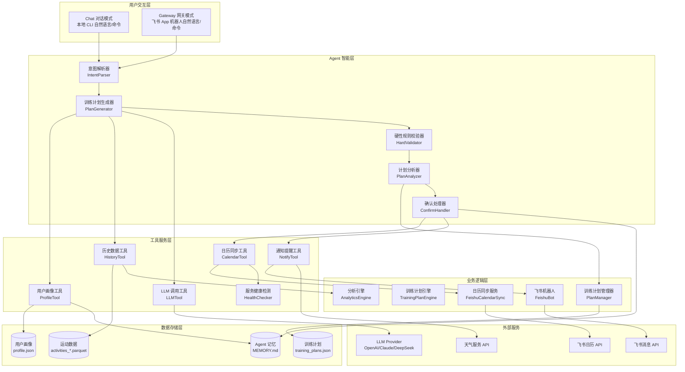
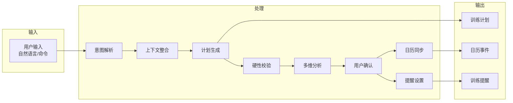

# 训练计划功能架构设计说明书

## 训练计划制定与飞书日历同步功能

***

| 文档信息     | 内容                                                     |
| -------- | ------------------------------------------------------ |
| **文档版本** | v1.1.0                                                 |
| **创建日期** | 2026-04-01                                             |
| **最后更新** | 2026-04-01                                             |
| **文档状态** | 精简版                                                   |
| **维护者**  | Architecture Agent                                     |
| **关联需求** | PRD_训练计划制定与飞书日历同步.md (v1.3.0)                       |
| **基础架构** | [架构设计说明书.md](./架构设计说明书.md) (v0.6.0)              |

***

## 1. 架构概述

### 1.1 设计目标

基于现有 Nanobot Runner 架构，扩展训练计划智能制定与飞书日历闭环功能，实现：

1. **自然语言交互优先**：用户通过对话方式提出训练计划需求
2. **智能计划生成**：基于用户画像、历史数据、目标自动生成个性化训练计划
3. **硬性规则校验**：防止 LLM 幻觉导致的反人类计划
4. **多维分析验证**：从体能、负荷、伤病风险等角度验证计划合理性
5. **一键日历同步**：自动同步到飞书日历，支持完整生命周期管理
6. **智能训练提醒**：按时提醒，支持智能免打扰

### 1.2 架构原则

| 原则 | 说明 |
|------|------|
| **模块化** | 各功能模块独立，职责清晰，易于测试和维护 |
| **可扩展** | 支持未来扩展更多训练类型、分析维度、提醒渠道 |
| **高性能** | 利用 Polars Lazy API 实现高性能数据分析 |
| **容错性** | LLM 调用失败重试、API 限流降级、数据一致性保障 |
| **安全性** | 医疗免责声明、硬性规则校验、敏感信息保护 |

### 1.3 技术栈选型

> **详细技术栈选型请查看**：[架构设计说明书.md](./架构设计说明书.md#2-技术栈选型)

**训练计划功能特有组件**：

| 层级 | 技术组件 | 选型依据 | 版本要求 |
|------|---------|---------|---------|
| **LLM调用** | nanobot-ai LLM Provider | 框架集成，支持多模型切换 | Latest |
| **意图解析** | nanobot-ai NLU | 框架集成，自然语言理解 | Latest |
| **日历同步** | 飞书开放平台 API | 企业级日历服务 | v4 |
| **消息通知** | 飞书机器人 Webhook | 实时消息推送 | Latest |
| **天气服务** | OpenWeatherMap API | 天气数据集成 | v2.5 |

***

## 2. 系统架构图

### 2.1 整体架构图



### 2.2 数据流架构图



***

## 3. 核心模块详细设计

### 3.1 模块概览

| 模块ID | 模块名称 | 职责 | 优先级 |
|--------|---------|------|--------|
| M1 | IntentParser | 解析用户自然语言输入，识别训练计划相关意图和参数 | P0 |
| M2 | PlanGenerator | 整合用户画像、历史数据，调用 LLM 生成个性化训练计划 | P0 |
| M3 | HardValidator | 对计划进行硬性规则校验，防止 LLM 幻觉导致的反人类计划 | P0 |
| M4 | PlanAnalyzer | 从多维度分析训练计划的合理性，提供可视化分析报告 | P0 |
| M5 | CalendarTool | 扩展现有的 FeishuCalendarSync，支持完整的增删改生命周期管理 | P0 |
| M6 | NotifyTool | 通过飞书机器人按时提醒用户执行训练，支持智能免打扰 | P1 |
| M7 | PlanManager | 管理训练计划的生命周期，包括创建、查询、更新、取消等操作 | P1 |

### 3.2 模块详细设计

#### 3.2.1 M1: IntentParser（意图解析器）

**职责**：解析用户自然语言输入，识别训练计划相关意图和参数。

**核心类**：
```python
class IntentParser:
    def parse(self, user_input: str, context: Optional[Dict] = None) -> IntentResult:
        """解析用户输入"""
        pass
```

**意图类型**：

| 意图 | 说明 | 参数 |
|------|------|------|
| `generate_plan` | 生成训练计划 | goal_distance_km, goal_date, target_time, plan_duration_weeks |
| `adjust_plan` | 调整训练计划 | plan_id, adjustment, reason |
| `query_plan` | 查询训练计划 | plan_id, date_range |
| `cancel_plan` | 取消训练计划 | plan_id, reason |

**数据结构**：
```python
@dataclass
class IntentResult:
    intent: str  # generate_plan|adjust_plan|query_plan|cancel_plan
    parameters: Dict[str, Any]  # 提取的参数
    confidence: float  # 置信度
    input_type: str  # natural_language|slash_command
```

#### 3.2.2 M2: PlanGenerator（训练计划生成器）

**职责**：整合用户画像、历史数据，调用 LLM 生成个性化训练计划。

**核心类**：
```python
class PlanGenerator:
    def generate(self, intent_result: IntentResult, user_context: UserContext) -> TrainingPlan:
        """生成训练计划"""
        pass
    
    def _build_prompt(self, intent_result: IntentResult, user_context: UserContext) -> str:
        """构建 LLM 提示词"""
        pass
```

**提示词模板要点**：
- 用户信息：VDOT、体能水平、周跑量、训练模式、伤病风险、训练负荷、历史最快配速
- 目标信息：比赛距离、比赛日期、目标成绩
- 硬性约束：配速边界、跑量边界、恢复日要求
- 输出格式：JSON Schema

**用户上下文数据结构**：
```python
@dataclass
class UserContext:
    profile: UserProfile  # 用户画像
    recent_activities: List[Activity]  # 最近训练记录
    training_load: TrainingLoad  # 训练负荷
    preferences: UserPreferences  # 用户偏好
    historical_best_pace_min_per_km: float  # 历史最快配速
```

#### 3.2.3 M3: HardValidator（硬性规则校验器）

**职责**：在 LLM 生成后，对计划进行硬性规则校验，防止 LLM 幻觉导致的反人类计划。

**核心类**：
```python
class HardValidator:
    def validate(self, plan: TrainingPlan, user_context: UserContext) -> ValidationResult:
        """校验训练计划"""
        pass
```

**校验规则**：

| 规则ID | 规则名称 | 校验逻辑 | 错误处理 |
|--------|---------|---------|---------|
| V001 | 配速边界 | 目标配速 ≤ 用户历史最快配速 × 1.05 | 打回 LLM 重写 |
| V002 | 单次跑量边界 | 单次跑量 ≤ 周跑量 × 0.5 | 打回 LLM 重写 |
| V003 | 周跑量增长边界 | 周跑量增长 ≤ 10% | 打回 LLM 重写 |
| V004 | 恢复日最低要求 | 每周恢复日 ≥ 2 天 | 打回 LLM 重写 |
| V005 | 间歇跑配速合理性 | 间歇跑配速 ≥ 轻松跑配速 × 0.85 | 打回 LLM 重写 |
| V006 | 长距离跑比例 | 长距离跑 ≤ 周跑量 × 0.35 | 打回 LLM 重写 |

**数据结构**：
```python
@dataclass
class ValidationResult:
    passed: bool  # 是否通过
    violations: List[Violation]  # 违规列表
    retry_count: int  # 重试次数
    action: Optional[str] = None  # 后续动作
```

#### 3.2.4 M4: PlanAnalyzer（计划分析器）

**职责**：从多维度分析训练计划的合理性，提供可视化分析报告。

**核心类**：
```python
class PlanAnalyzer:
    def analyze(self, plan: TrainingPlan, user_context: UserContext) -> AnalysisReport:
        """分析训练计划"""
        pass
```

**分析维度**：

| 维度 | 说明 | 指标 |
|------|------|------|
| 体能匹配度 | 计划强度是否匹配用户当前体能 | VDOT 匹配度、配速合理性 |
| 负荷递进性 | 训练负荷是否循序渐进 | 周跑量增长率、TSS 变化趋势 |
| 伤病风险 | 计划是否增加伤病风险 | 恢复日占比、高强度训练占比 |
| 目标可达性 | 目标成绩是否合理 | VDOT 需求、历史数据对比 |

**数据结构**：
```python
@dataclass
class AnalysisReport:
    overall_score: float  # 总体评分 (0-100)
    dimensions: List[DimensionResult]  # 各维度分析结果
    recommendations: List[str]  # 改进建议
    warnings: List[str]  # 风险警告
    disclaimer: str  # 医疗免责声明
```

#### 3.2.5 M5: CalendarTool（日历同步工具）

**职责**：扩展现有的 FeishuCalendarSync，支持完整的增删改生命周期管理。

**核心类**：
```python
class CalendarTool:
    def sync_plan(self, plan: TrainingPlan, mode: str = "create") -> SyncResult:
        """同步训练计划到日历"""
        pass
    
    def batch_sync(self, plans: List[TrainingPlan], mode: str = "create") -> BatchSyncResult:
        """批量同步训练计划"""
        pass
    
    def pre_sync_check(self) -> bool:
        """预同步检查（健康检测）"""
        pass
    
    def optimistic_update(self, plan: TrainingPlan) -> TrainingPlan:
        """乐观更新（预分配 event_id）"""
        pass
```

**同步策略**：

| 策略 | 说明 | 适用场景 |
|------|------|---------|
| 预同步检查 | 同步前检查飞书服务可用性 | 所有同步操作 |
| 乐观更新 | 预分配 event_id，失败后回滚 | 创建/更新操作 |
| 批量同步 | 分批同步，支持断点续传 | 大量事件同步 |
| 失败重试 | 自动重试失败的同步操作 | 网络错误 |
| 降级处理 | 服务不可用时保存到本地 | 服务故障 |

#### 3.2.6 M6: NotifyTool（通知提醒工具）

**职责**：通过飞书机器人按时提醒用户执行训练，支持智能免打扰。

**核心类**：
```python
class NotifyTool:
    def send_reminder(self, plan: DailyPlan, user_context: UserContext) -> NotifyResult:
        """发送训练提醒"""
        pass
    
    def check_do_not_disturb(self, user_context: UserContext) -> bool:
        """检查是否免打扰"""
        pass
    
    def check_training_completed(self, user_context: UserContext, date: str) -> bool:
        """检查是否已完成训练"""
        pass
```

**智能免打扰规则**：

| 规则 | 说明 | 优先级 |
|------|------|--------|
| 已完成训练 | 用户已上传当天 FIT 文件 | 最高 |
| 请假/出差 | 用户设置了请假状态 | 高 |
| 极端天气 | 暴雨、高温等极端天气预警 | 中 |
| 休息日 | 当天是休息日 | 中 |

#### 3.2.7 M7: PlanManager（训练计划管理器）

**职责**：管理训练计划的生命周期，包括创建、查询、更新、取消等操作。

**核心类**：
```python
class PlanManager:
    def create_plan(self, plan: TrainingPlan) -> str:
        """创建训练计划"""
        pass
    
    def get_plan(self, plan_id: str) -> Optional[TrainingPlan]:
        """获取训练计划"""
        pass
    
    def update_plan(self, plan_id: str, updates: Dict[str, Any]) -> bool:
        """更新训练计划"""
        pass
    
    def cancel_plan(self, plan_id: str, reason: str) -> bool:
        """取消训练计划"""
        pass
```

**计划状态**：

| 状态 | 说明 | 可转换状态 |
|------|------|-----------|
| `draft` | 草稿 | active, cancelled |
| `active` | 激活中 | paused, completed, cancelled |
| `paused` | 已暂停 | active, cancelled |
| `completed` | 已完成 | - |
| `cancelled` | 已取消 | - |

***

## 4. 接口规范设计

### 4.1 Agent 工具接口

所有工具遵循 OpenAI Function Calling 规范。

#### 4.1.1 生成训练计划工具

```json
{
    "name": "generate_training_plan",
    "description": "生成个性化训练计划",
    "parameters": {
        "type": "object",
        "properties": {
            "goal_distance_km": {"type": "number", "description": "目标距离（公里）"},
            "goal_date": {"type": "string", "format": "date", "description": "目标日期（YYYY-MM-DD）"},
            "target_time": {"type": "string", "pattern": "^\\d{2}:\\d{2}:\\d{2}$", "description": "目标成绩（HH:MM:SS）"},
            "plan_duration_weeks": {"type": "integer", "description": "计划周期（周），可选"}
        },
        "required": ["goal_distance_km", "goal_date"]
    }
}
```

#### 4.1.2 同步日历工具

```json
{
    "name": "sync_to_calendar",
    "description": "同步训练计划到飞书日历",
    "parameters": {
        "type": "object",
        "properties": {
            "plan_id": {"type": "string", "description": "训练计划ID"},
            "mode": {"type": "string", "enum": ["create", "update", "delete"], "description": "同步模式"}
        },
        "required": ["plan_id", "mode"]
    }
}
```

#### 4.1.3 调整训练计划工具

```json
{
    "name": "adjust_training_plan",
    "description": "调整训练计划",
    "parameters": {
        "type": "object",
        "properties": {
            "plan_id": {"type": "string", "description": "训练计划ID"},
            "adjustment": {"type": "string", "description": "调整内容（如'-20%跑量'）"},
            "reason": {"type": "string", "description": "调整原因"}
        },
        "required": ["plan_id", "adjustment"]
    }
}
```

### 4.2 内部数据接口

> **详细数据接口请查看**：[架构设计说明书.md](./架构设计说明书.md#5-接口规范设计)

**训练计划功能特有接口**：

```python
# 用户画像接口
def get_user_profile(user_id: str = "default_user") -> UserProfile
def update_user_profile(user_id: str, updates: Dict[str, Any]) -> bool

# 历史数据接口
def get_recent_activities(user_id: str = "default_user", months: int = 3) -> List[Activity]
def get_training_load(user_id: str = "default_user") -> TrainingLoad

# 训练计划接口
def create_training_plan(plan: TrainingPlan) -> str
def get_training_plan(plan_id: str) -> Optional[TrainingPlan]
def update_training_plan(plan_id: str, updates: Dict[str, Any]) -> bool
def cancel_training_plan(plan_id: str, reason: str) -> bool
```

***

## 5. 数据模型设计

### 5.1 核心数据模型

#### 5.1.1 TrainingPlan（训练计划）

```python
@dataclass
class TrainingPlan:
    plan_id: str  # 计划ID
    user_id: str  # 用户ID
    status: str  # 状态 (draft|active|paused|completed|cancelled)
    plan_type: str  # 计划类型
    start_date: str  # 开始日期
    end_date: str  # 结束日期
    goal_distance_km: float  # 目标距离
    goal_date: str  # 目标日期
    target_time: str  # 目标成绩
    weeks: List[WeeklySchedule]  # 周计划
    calendar_event_ids: Dict[str, str]  # 日历事件ID映射
    created_at: str  # 创建时间
    updated_at: str  # 更新时间
    metadata: Optional[Dict[str, Any]] = None  # 元数据
```

#### 5.1.2 UserProfile（用户画像）

```python
@dataclass
class UserProfile:
    user_id: str  # 用户ID
    avg_vdot: float  # 平均VDOT
    max_vdot: float  # 最大VDOT
    fitness_level: str  # 体能水平
    weekly_avg_distance_km: float  # 周平均跑量
    training_pattern: str  # 训练模式
    injury_risk_level: str  # 伤病风险等级
    active_plan_id: Optional[str]  # 激活的计划ID
    preferences: UserPreferences  # 用户偏好
    created_at: str  # 创建时间
    updated_at: str  # 更新时间
```

#### 5.1.3 Activity（运动记录）

> **详细数据模型请查看**：[架构设计说明书.md](./架构设计说明书.md#4-核心模块详细设计)

### 5.2 数据存储设计

> **详细数据存储设计请查看**：[架构设计说明书.md](./架构设计说明书.md#4-核心模块详细设计)

**训练计划功能特有存储**：

**文件路径**：`~/.nanobot-runner/data/training_plans.json`

**数据结构**：
```json
{
    "plans": [
        {
            "plan_id": "plan_default_user_20260331_080000",
            "user_id": "default_user",
            "status": "active",
            "plan_type": "马拉松备赛",
            "start_date": "2026-03-31",
            "end_date": "2026-06-15",
            "goal_distance_km": 42.195,
            "goal_date": "2026-06-15",
            "target_time": "04:00:00",
            "weeks": [...],
            "calendar_event_ids": {
                "2026-03-31": "evt_xxx",
                "2026-04-01": "evt_yyy"
            },
            "created_at": "2026-03-31T08:00:00Z",
            "updated_at": "2026-03-31T08:00:00Z"
        }
    ]
}
```

***

## 6. 风险与应对

### 6.1 技术风险

| 风险 | 影响 | 应对措施 |
|------|------|---------|
| LLM 幻觉 | 生成不合理计划 | 硬性规则校验层 |
| LLM 调用失败 | 无法生成计划 | 重试机制 + 降级方案 |
| 飞书 API 限流 | 日历同步失败 | 预同步 + 乐观更新 |
| 飞书服务不可用 | 无法同步日历 | 健康检测 + 本地存储 |

### 6.2 业务风险

| 风险 | 影响 | 应对措施 |
|------|------|---------|
| 用户期望过高 | 不满意计划 | 医疗免责声明 + 多维分析 |
| 计划不适合用户 | 执行困难 | 多维分析验证 + 调整机制 |
| 伤病风险 | 用户受伤 | 伤病风险分析 + 免责声明 |

### 6.3 数据风险

| 风险 | 影响 | 应对措施 |
|------|------|---------|
| 数据丢失 | 计划丢失 | 本地备份 + JSON 存储 |
| 数据不一致 | 日历与计划不一致 | 乐观更新 + 回滚机制 |

***

## 7. 扩展性设计

### 7.1 训练类型扩展

支持未来扩展更多训练类型：
- 铁人三项训练计划
- 越野跑训练计划
- 5K/10K 专项训练计划

### 7.2 分析维度扩展

支持未来扩展更多分析维度：
- 营养建议
- 睡眠分析
- 心理状态评估

### 7.3 提醒渠道扩展

支持未来扩展更多提醒渠道：
- 钉钉机器人
- 企业微信机器人
- 邮件通知

***

## 8. 相关文档

| 文档 | 内容 |
|------|------|
| [架构设计说明书.md](./架构设计说明书.md) | 系统整体架构、技术栈选型、数据存储、部署架构 |
| [PRD_训练计划制定与飞书日历同步.md](../requirements/PRD_训练计划制定与飞书日历同步.md) | 需求规格说明书 |
| [开发指南](../guides/development_guide.md) | Polars规范、异常处理、类型注解 |
| [测试指南](../guides/testing_guide.md) | Mock策略、测试数据、隐私红线 |

---

*文档版本: v1.1.0*
*更新时间: 2026-04-01*
*更新说明: 精简文档，去除与主架构文档重复内容*
