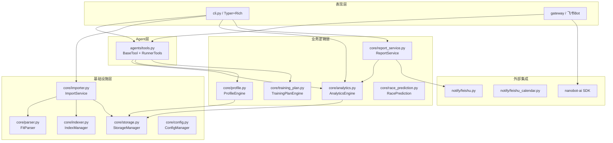
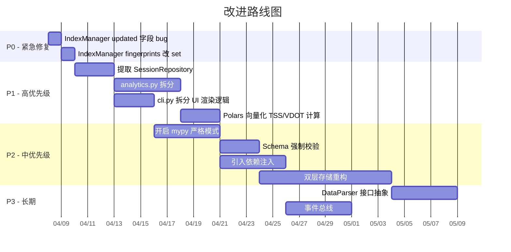

# Nanobot Runner 项目深度设计分析报告

## 一、系统架构评估

### 1.1 架构总览

项目采用**分层架构 + 领域驱动**的混合模式，整体结构清晰：



**优点**：
- 层次分明，职责分离清晰，基础设施层与业务逻辑解耦良好
- `ImportService` 作为编排层，正确地将 `FitParser`、`IndexManager`、`StorageManager` 组合起来，符合**服务编排模式**
- Agent 工具层通过 `BaseTool` 抽象，适配 nanobot-ai 框架的 `ToolRegistry`，实现了良好的**适配器模式**

**问题与风险**：

1. **`cli.py` 文件过大（1375行），承担了过多职责**。它不仅是 CLI 入口，还包含大量数据展示逻辑（`_display_report`、表格构建、颜色映射等），违反了**单一职责原则**。`_display_report` 函数从 1100 行到 1188 行完全是 UI 渲染逻辑，与 CLI 路由无关。

2. **缺少统一的依赖注入机制**。几乎每个模块都在 `__init__` 中手动创建依赖（如 `StorageManager()`、`ConfigManager()`），形成了隐式的**紧耦合**。例如 `RunnerTools.__init__` 同时创建 `AnalyticsEngine` 和 `ProfileStorageManager`：

   ```startLine:437:440:d:\yecll\Documents\LocalCode\RunFlowAgent\src\agents\tools.py
       def __init__(self, storage: Optional[StorageManager] = None):
           self.storage = storage or StorageManager()
           self.analytics = AnalyticsEngine(self.storage)
           self.profile_storage = ProfileStorageManager()
   ```

3. **`ConfigManager` 模块级别的单例**（第 166 行 `config = ConfigManager()`），在模块导入时即执行，可能导致不可预期的副作用和测试困难。

---

## 二、数据流与数据模型分析

### 2.1 核心数据流

```
FIT文件 → FitParser → DataFrame → IndexManager(SHA256去重) → StorageManager → Parquet(按年分片)
                                                              ↓
用户查询 ← RunnerTools ← AnalyticsEngine ← LazyFrame ← scan_parquet
```

**数据模型设计存在根本性问题**：**原始采样数据与会话数据混合存储在同一张表**。

在 `FitParser.parse_file` 中（第 133-134 行）：

```startLine:133:139:d:\yecll\Documents\LocalCode\RunFlowAgent\src\core\parser.py
       if session_data:
           df = self._add_session_metadata(df, session_data)
       # session_data 的每个字段被广播到每一行 record 上
```

`_add_session_metadata` 将 session 级别的元数据（`session_total_distance`、`session_total_timer_time` 等）添加到每一行 record 上：

```startLine:156:158:d:\yecll\Documents\LocalCode\RunFlowAgent\src\core\parser.py
       for key, value in session_data.items():
           if value is not None:
               df = df.with_columns(pl.lit(value).alias(f"session_{key}"))
```

**后果**：
- 存在巨大的**数据冗余**：一次 1 小时的跑步（3600 条 record），`session_total_distance` 被重复存储 3600 次
- 代码中到处都需要 `group_by("session_start_time")` 来去重，例如在 `analytics.py`、`tools.py`、`cli.py` 中重复出现同样的聚合模式
- 新开发者容易犯直接统计行数的错误（项目文档 AGENTS.md 第 218 行专门提醒了这一点）

**建议**：采用**双层存储**：`activities.parquet`（会话级，每次跑步一行）和 `records.parquet`（采样级，每秒一行），通过 `activity_id` 外键关联。`ParquetSchema` 已经定义了两套字段（`ACTIVITY_METADATA` 和 `RECORD_FIELDS`），但实际没有被强制执行。

### 2.2 Schema 治理

`schema.py` 定义了 `ParquetSchema`，包含字段类型、必填字段、默认值：

```startLine:15:32:d:\yecll\Documents\LocalCode\RunFlowAgent\src\core\schema.py
   class ParquetSchema:
       ACTIVITY_METADATA = {
           "activity_id": pl.String,
           "timestamp": pl.Datetime,
           ...
       }
       REQUIRED_FIELDS = {
           "activity_id", "timestamp", "source_file", ...
       }
```

**问题**：`ParquetSchema` 是一个「定义了但没有强制执行」的 Schema。`FitParser.parse_file` 和 `StorageManager.save_to_parquet` 都**没有调用** `ParquetSchema.validate_dataframe()` 或 `normalize_dataframe()`。这意味着：

- FIT 文件解析后的 DataFrame 可能缺少 `activity_id` 字段（`FitParser` 从未生成它）
- 字段类型不一致的情况完全依赖 `StorageManager._align_dataframes` 做运行时修正
- 新的数据源（如 GPX、TCX）接入时，缺乏有效的数据质量保障

### 2.3 去重机制

`IndexManager` 基于 SHA256 指纹（`total_distance + total_timer_time + time_created`）实现文件级去重：

```startLine:42:58:d:\yecll\Documents\LocalCode\RunFlowAgent\src\core\indexer.py
   def generate_fingerprint(self, metadata: Dict[str, Any]) -> str:
       key_fields = [
           metadata.get("total_distance", 0),
           metadata.get("total_timer_time", 0),
           metadata.get("time_created", metadata.get("start_time", "")),
       ]
       fingerprint_str = "|".join(str(field) for field in key_fields)
       return hashlib.sha256(fingerprint_str.encode()).hexdigest()
```

**问题**：
1. 指纹用 **list 存储**（`self.index["fingerprints"]`），查找是 O(n) 的线性扫描。当数据量大时（如导入上千个文件），性能会下降。应改为 `set`。
2. `_save_index` 中有一个 bug（第 38 行）：
   ```startLine:38:d:\yecll\Documents\LocalCode\RunFlowAgent\src\core\indexer.py
       self.index["metadata"]["updated"] = str(Path.home())
   ```
   将 `updated` 字段设置为用户主目录路径，明显是错误的，应该是当前时间戳。

---

## 三、设计模式分析

### 3.1 使用良好的模式

| 模式 | 应用位置 | 评价 |
|------|---------|------|
| **适配器模式** | `BaseTool` → `ToolRegistry`（nanobot-ai） | 优秀，抽象层次清晰，`to_schema()` 方法提供 OpenAI function calling 兼容格式 |
| **服务编排** | `ImportService` 组合 Parser + Indexer + Storage | 正确地避免了 CLI 层直接操作基础设施 |
| **模板方法** | `BaseTool.execute()` + `_run_sync()` | 子类只需实现业务逻辑，错误处理和序列化由基类统一管理 |
| **数据类值对象** | `RunnerProfile`、`TrainingPlan`、`RacePrediction` 等 | 使用 `@dataclass` + `to_dict()`，序列化一致性好 |
| **装饰器** | `@handle_tool_errors`、`@handle_errors`、`@require_storage` | 统一了横切关注点，减少重复的 try/except 样板代码 |

### 3.2 缺失或误用的模式

1. **缺少 Repository 模式**：`StorageManager` 既负责存储又负责查询，包含 `save_to_parquet`、`read_parquet`、`query_activities`、`query_by_date_range`、`get_stats` 等多种职责。建议拆分为 `ParquetRepository`（纯数据读写）和 `ActivityQueryService`（查询逻辑）。

2. **缺少 Strategy 模式处理多数据源**：当前只支持 FIT 格式。如果未来要支持 GPX、TCX，需要修改 `FitParser`。应该抽象为 `DataParser` 接口 + `FitParser`/`GpxParser` 等实现。

3. **缺少 Observer/Event 模式**：数据导入后没有事件通知机制。如果导入了新数据，用户画像、训练计划等不会自动更新，需要手动 `--rebuild`。

4. **Gateway 模块中的过度内联**：`gateway` 命令（第 773-976 行）是一个 200 行的巨型函数，包含了 Agent 初始化、心跳检测、Cron 调度、Channel 管理等所有逻辑，应拆分为独立的 `GatewayService` 类。

---

## 四、技术选型评估

### 4.1 Polars（数据引擎）— 评价：优秀

选择 Polars 作为数据处理引擎是本项目最出色的技术决策之一：

- **LazyFrame 惰性求值**：项目规范要求保持 LazyFrame 直到最终输出时才 `.collect()`，有效避免了中间结果的内存分配
- **按年分片存储**：`activities_YYYY.parquet` 的设计使得数据增长可控，查询时按需加载
- **查询谓词下推**：`scan_parquet` + `filter` 可以利用 Parquet 的列式存储特性做谓词下推

**但存在问题**：

在 `analytics.py` 的 `get_training_load` 方法中（第 583-587 行），`collect()` 之后又对每一行做 Python 级别的循环：

```startLine:601:608:d:\yecll\Documents\LocalCode\RunFlowAgent\src\core\analytics.py
   tss_values = []
   for row in df.iter_rows(named=True):
       tss = self.calculate_tss_for_run(
           distance_m=row.get("session_total_distance", 0),
           duration_s=row.get("session_total_timer_time", 0),
           avg_heart_rate=row.get("session_avg_heart_rate"),
       )
       tss_values.append(tss)
```

这完全可以用 Polars 的向量化表达式替代，大幅提升性能。

### 4.2 nanobot-ai（Agent 框架）— 评价：合理但存在耦合风险

作为 Agent 基础框架，nanobot-ai 提供了 `AgentLoop`、`ToolRegistry`、`MessageBus` 等核心能力。项目通过 `BaseTool` 适配层解耦得不错。

**风险**：
- `nanobot-ai>=0.1.4` 是一个快速迭代的内部依赖，API 可能频繁变更
- `gateway` 命令中直接使用了大量 nanobot-ai 的内部模块（`MessageBus`、`SessionManager`、`ChannelManager`、`HeartbeatService`），一旦上游 API 变更，影响面很大

### 4.3 其他技术选型

| 技术 | 评价 |
|------|------|
| **Typer + Rich** | CLI 体验优秀，但 Rich 组件的使用分散在 `cli.py` 和 `cli_formatter.py` 之间，部分重复 |
| **fitparse** | 唯一可用的 Python FIT 解析库，但需要 monkey-patch（第 16-86 行），维护风险高 |
| **JSON 配置** | 对于当前规模合理，但随着配置项增长，建议迁移到 YAML 或 TOML |
| **Parquet** | 优秀的列式存储选择，配合 Polars 性能出色 |

---

## 五、性能瓶颈分析

### 5.1 关键瓶颈

| 瓶颈 | 位置 | 严重程度 | 说明 |
|------|------|---------|------|
| **全量数据加载后 Python 循环** | `analytics.py` 多处 `iter_rows` | 高 | TSS 计算、心率漂移分析、VDOT 趋势等都在 `.collect()` 后用 Python 循环处理 |
| **`save_to_parquet` 的全量读-合并-写** | `storage.py` 第 285-294 行 | 中 | 每次导入都要读取整个年度文件 → 合并 → 去重 → 全量覆写 |
| **`_align_dataframes` 的列级遍历** | `storage.py` 第 62-101 行 | 中 | 对每一列逐一检查和转换类型，schema 复杂时效率低 |
| **`IndexManager.exists()` 线性扫描** | `indexer.py` 第 60-70 行 | 低-中 | 指纹列表用 list 存储，O(n) 查找 |
| **`gateway` 中 Agent 初始化无连接池** | `cli.py` 第 834-866 行 | 中 | 每次 gateway 启动都创建新的 provider 和 session manager |

### 5.2 具体性能问题示例

**问题 1**：`get_hr_drift_analysis`（`tools.py` 第 543-563 行）将全部数据加载到内存后遍历：

```startLine:543:563:d:\yecll\Documents\LocalCode\RunFlowAgent\src\agents\tools.py
   def get_hr_drift_analysis(self, run_id: Optional[str] = None) -> Dict[str, Any]:
       lf = self.storage.read_parquet()
       df = lf.collect()  # ← 全量加载所有年份的所有数据
       heart_rate = df.select(pl.col("heart_rate")).to_series().to_list()  # ← 转为 Python list
       # ... 后续分析完全在 Python 层面
```

对于一个积累了多年数据的用户，这可能加载数十万甚至百万行数据到内存。

**问题 2**：`get_training_load_trend` 中对每个日期都重新计算 EWMA：

```startLine:1669:1696:d:\yecll\Documents\LocalCode\RunFlowAgent\src\core\analytics.py
   for row in complete_daily.iter_rows(named=True):
       cumulative_tss.append(daily_tss_value)
       atl = self.calculate_atl(cumulative_tss)   # ← 每天都从头计算 EWMA
       ctl = self.calculate_ctl(cumulative_tss)    # ← O(n²) 复杂度
```

90 天的趋势 = 每天 O(n) 的 EWMA = 总体 O(n²)。应使用增量式 EWMA 计算。

---

## 六、安全风险评估

### 6.1 高风险项

| 风险 | 位置 | 说明 |
|------|------|------|
| **Monkey-patching 第三方库** | `parser.py` 第 16-86 行 | 直接替换 `fitparse.base.FitFile._parse_definition_message`，一旦 fitparse 更新内部实现，可能导致数据损坏或崩溃 |
| **敏感信息存储** | `config.py` 第 79 行 | `feishu_app_secret` 存储在明文 JSON 中，应使用系统密钥链或加密存储 |
| **CLI 中的 `Exception` 裸捕获** | `cli.py` 第 196 行 | `except Exception as e` 可能掩盖严重错误 |

### 6.2 中风险项

| 风险 | 位置 | 说明 |
|------|------|------|
| **无输入消毒** | `update_memory` 工具 | 用户笔记直接写入 `MEMORY.md` 文件，理论上可注入 Markdown 内容（风险较低，因为是本地工具） |
| **无文件路径校验** | `import_data` 命令 | 虽然检查了 `.fit` 后缀，但没有验证文件内容的真实性 |
| **`IndexManager._save_index` 无原子写入** | `indexer.py` 第 36-40 行 | 写入中断可能导致索引文件损坏 |

### 6.3 建议改进

1. 对 `fitparse` 的 monkey-patch 应改为 **继承+重写** 或者 **fork 维护一个补丁版本**
2. 敏感配置使用 `keyring` 库或操作系统密钥链
3. 文件写入使用 **write-to-temp + rename** 模式确保原子性

---

## 七、代码质量与维护成本

### 7.1 量化指标

| 指标 | 现状 | 评价 |
|------|------|------|
| **类型注解覆盖** | ~60%（mypy 配置几乎全部关闭） | 不佳。`pyproject.toml` 第 95-104 行关闭了所有严格检查 |
| **异常处理规范性** | ~70% 使用自定义异常 | 良好，但 CLI 层仍有裸 `Exception` |
| **测试覆盖** | 有完整的分层测试（unit/integration/e2e/performance） | 优秀，测试结构设计合理 |
| **文档完整性** | AGENTS.md + 8 份详细文档 | 优秀 |
| **代码重复** | `group_by("session_start_time")` 聚合模式重复 10+ 次 | 不佳 |

### 7.2 维护成本热点

1. **`cli.py` 是最大的维护负担**：1375 行，混合了路由定义、业务逻辑调用、Rich UI 渲染、错误处理。任何 UI 变更都可能影响业务逻辑。

2. **`analytics.py` 过于庞大（1863 行）**：包含 VDOT 计算、TSS 计算、心率漂移分析、训练负荷、晨报生成、周计划生成、配速分布等完全不同的功能领域。应拆分为：
   - `vdot.py` — VDOT 计算与趋势
   - `training_load.py` — ATL/CTL/TSB
   - `heart_rate.py` — 心率漂移与区间分析
   - `report_generator.py` — 已存在，但 `analytics.py` 中仍有大量报告逻辑

3. **聚合逻辑重复**：以下模式在 `analytics.py`、`tools.py`、`cli.py` 中至少出现 10 次：
   ```python
   session_df = lf.group_by("session_start_time").agg([
       pl.col("session_total_distance").first().alias("distance"),
       pl.col("session_total_timer_time").first().alias("duration"),
       pl.col("session_avg_heart_rate").first().alias("avg_hr"),
   ])
   ```
   应提取为 `StorageManager.get_session_summary()` 方法。

### 7.3 mypy 配置问题

`pyproject.toml` 中的 mypy 配置几乎关闭了所有有用检查：

```startLine:95:104:d:\yecll\Documents\LocalCode\RunFlowAgent\pyproject.toml
   warn_return_any = false
   disallow_untyped_defs = false
   check_untyped_defs = false
   disallow_incomplete_defs = false
   disallow_untyped_decorators = false
   no_implicit_optional = false
   warn_redundant_casts = false
   warn_unused_ignores = false
   warn_no_return = false
```

这使得 mypy 形同虚设，无法提供类型安全保障。

---

## 八、扩展性分析

### 8.1 扩展场景评估

| 扩展场景 | 难度 | 阻碍因素 |
|---------|------|---------|
| 支持 GPX/TCX 格式 | 中 | `FitParser` 与 `ImportService` 紧耦合，缺少 `DataParser` 接口抽象 |
| 多用户支持 | 高 | 硬编码 `"default_user"`，`ConfigManager` 使用全局单例，数据目录结构无用户隔离 |
| Web UI | 高 | 所有输出绑定 Rich Console，缺少数据 API 层 |
| 插件化训练算法 | 中 | TSS/VDOT 公式硬编码在 `AnalyticsEngine` 中，缺少策略模式 |
| 数据导出（CSV/JSON） | 低 | `StorageManager` 已有 `read_parquet`，只需增加格式转换 |
| 跑步路线可视化 | 低 | `position_lat`/`position_long` 已存储，只需接入地图库 |

### 8.2 架构扩展建议

**短期**（低风险高收益）：
1. 提取 `SessionRepository`，封装 `group_by("session_start_time")` 聚合逻辑
2. 拆分 `cli.py` 的 UI 渲染逻辑到 `cli_formatter.py`
3. 修复 `IndexManager` 的 `updated` 字段 bug，将 fingerprints 改为 `set`
4. 开启 mypy 严格模式（渐进式）

**中期**（需要重构）：
1. 引入 `DataParser` 接口，支持多数据源
2. 将 `AnalyticsEngine` 拆分为独立的领域服务
3. 引入依赖注入容器（如 `python-inject` 或简单的工厂模式）
4. TSS/VDOT 计算改为 Polars 向量化表达式

**长期**（架构演进）：
1. 分离会话数据和采样数据的双层存储
2. 引入事件总线（数据导入 → 画像更新 → 计划调整）
3. 抽象输出层（Console / Web / API 共用数据层）

---

## 九、关键设计决策影响总结

| 决策 | 正面影响 | 负面影响/风险 |
|------|---------|-------------|
| **采样+会话数据混合存储** | 实现简单 | 数据冗余、查询需反复聚合、新开发者易犯错 |
| **按年分片 Parquet** | 查询性能好、增量管理方便 | 跨年查询需多文件合并、schema 一致性维护成本高 |
| **nanobot-ai 作为 Agent 框架** | 快速获得 LLM 对话能力 | 上游 API 不稳定、深度耦合 nanobot 内部模块 |
| **fitparse monkey-patch** | 解决了非标准字段解析 | 升级风险、代码可读性差 |
| **Rich 绑定 CLI 输出** | 用户体验好 | 难以复用为其他输出渠道 |
| **全局 ConfigManager 单例** | 简化访问 | 测试困难、隐式依赖、启动时副作用 |

---

## 十、优先级改进路线图



---

**总结**：Nanobot Runner 是一个设计思路清晰、业务领域建模扎实的个人工具项目。核心数据流（FIT → Parquet → Analytics → Agent）设计合理，Polars + Parquet 的技术选型出色。主要改进方向集中在 **数据模型的分层存储**、**大模块的职责拆分**、**聚合逻辑的复用抽象** 以及 **性能关键路径的向量化计算**。这些问题在当前单用户场景下影响有限，但如果用户数据量增长或功能继续扩展，尽早治理可以避免技术债务的指数级积累。