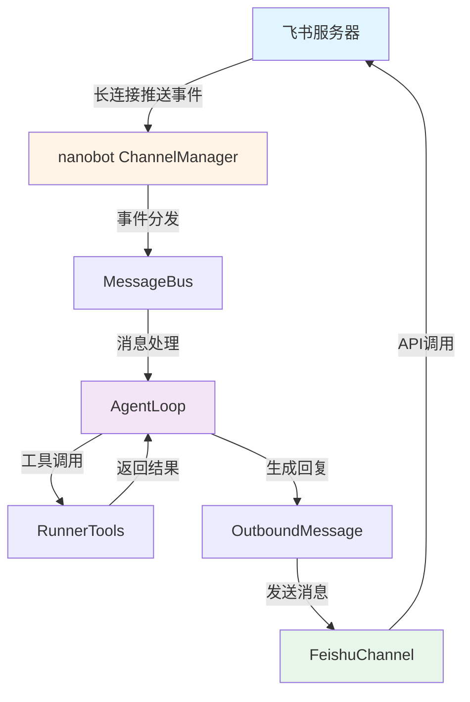
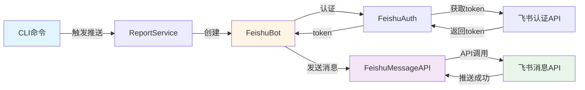

# 飞书交互方式分析报告

## 📋 分析目标

分析项目中两种与飞书交互的方式：
1. `nanobotrun gateway` - 通过 nanobot 框架与飞书机器人交互
2. `nanobotrun report --push` - CLI 消息推送实现方式

## 🔍 分析结论

### 1. Gateway 方式（双向交互）

#### 架构设计



#### 关键实现

**配置位置**: `~/.nanobot/config.json` (框架级配置)

```json
{
  "channels": {
    "feishu": {
      "enabled": true,
      "app_id": "cli_xxx",
      "app_secret": "xxx",
      "verification_token": "xxx"
    }
  }
}
```

**核心组件**:

1. **ChannelManager** (来自 nanobot 框架)
   - 管理所有通道（包括飞书）
   - 启动长连接监听飞书事件
   - 事件验证（使用 verification_token）

2. **MessageBus** (来自 nanobot 框架)
   - 消息总线，负责事件分发
   - 接收来自飞书的事件
   - 发布出站消息到飞书

3. **AgentLoop** (来自 nanobot 框架)
   - Agent 核心循环
   - 处理用户消息
   - 调用工具（RunnerTools）
   - 生成回复

**交互流程**:

```python
# cli.py: gateway 命令实现
def gateway():
    # 1. 加载配置
    config = load_config()
    bus = MessageBus()

    # 2. 创建 Agent
    agent = AgentLoop(
        bus=bus,
        provider=provider,
        workspace=workspace,
        ...
    )

    # 3. 注册工具
    registry = ToolRegistry()
    for tool in create_tools(runner_tools):
        registry.register(tool)
    agent.tools = registry

    # 4. 启动通道管理器
    channels = ChannelManager(config, bus)

    # 5. 启动服务
    await asyncio.gather(
        agent.run(),          # Agent 循环
        channels.start_all(), # 启动所有通道（包括飞书长连接）
    )
```

**事件订阅方式**: 长连接
- nanobot 框架通过飞书开放平台的长连接机制接收事件
- 无需配置 Webhook URL
- 使用 verification_token 验证事件合法性

**支持的功能**:
- ✅ 接收用户消息（私聊/群聊）
- ✅ 自然语言交互
- ✅ 命令处理（/stats, /recent, /vd 等）
- ✅ 发送回复消息
- ✅ 发送卡片消息

---

### 2. CLI 推送方式（单向推送）

#### 架构设计



#### 关键实现

**配置位置**: `~/.nanobot-runner/config.json` (业务级配置)

```json
{
  "feishu_app_id": "cli_xxx",
  "feishu_app_secret": "xxx",
  "feishu_receive_id": "ou_xxx",
  "feishu_receive_id_type": "user_id"
}
```

**核心组件**:

1. **FeishuAuth** (src/notify/feishu.py)
   - 管理 app_id 和 app_secret
   - 获取 tenant_access_token
   - Token 缓存和自动刷新

2. **FeishuMessageAPI** (src/notify/feishu.py)
   - 封装飞书消息 API
   - 发送文本消息
   - 发送卡片消息
   - 发送富文本消息

3. **FeishuBot** (src/notify/feishu.py)
   - 业务层封装
   - 统一的消息发送接口
   - 重试机制

**交互流程**:

```python
# cli.py: report --push 命令实现
def report(push: bool):
    service = ReportService()

    # 生成报告
    result = service.run_report_now(push=push)

    if push:
        # 推送到飞书
        feishu = FeishuBot(
            app_id=config.get("feishu_app_id"),
            app_secret=config.get("feishu_app_secret"),
            receive_id=config.get("feishu_receive_id"),
        )

        # 发送卡片消息
        result = feishu.send_card(title, content)
```

**API 调用方式**: REST API
- 使用飞书开放平台 API
- 通过 tenant_access_token 认证
- 主动推送消息到指定用户/群

**支持的功能**:
- ✅ 发送文本消息
- ✅ 发送卡片消息
- ✅ 发送富文本消息
- ✅ 指定接收者（用户/群）
- ❌ 不接收用户消息
- ❌ 不处理用户交互

---

## 📊 两种方式对比

| 对比维度 | Gateway 方式 | CLI 推送方式 |
|---------|-------------|-------------|
| **交互方向** | 双向（接收+发送） | 单向（仅发送） |
| **配置位置** | `~/.nanobot/config.json` | `~/.nanobot-runner/config.json` |
| **配置级别** | 框架级 | 业务级 |
| **事件接收** | 长连接 | 无 |
| **消息发送** | 通过 ChannelManager | 直接调用 API |
| **认证方式** | app_id + app_secret + verification_token | app_id + app_secret |
| **使用场景** | 实时交互、命令处理 | 定时推送、报告通知 |
| **依赖框架** | nanobot 框架 | 独立实现 |
| **启动方式** | `nanobotrun gateway` | `nanobotrun report --push` |

---

## 🎯 关键差异分析

### 1. 配置分离原则

**Gateway 配置** (框架级):
```json
// ~/.nanobot/config.json
{
  "channels": {
    "feishu": {
      "enabled": true,
      "app_id": "cli_xxx",
      "app_secret": "xxx",
      "verification_token": "xxx"
    }
  }
}
```

**CLI 推送配置** (业务级):
```json
// ~/.nanobot-runner/config.json
{
  "feishu_app_id": "cli_xxx",
  "feishu_app_secret": "xxx",
  "feishu_receive_id": "ou_xxx",
  "feishu_receive_id_type": "user_id"
}
```

**设计原因**:
- Gateway 是 nanobot 框架的功能，配置必须在框架级
- CLI 推送是业务功能，配置在业务级
- 两者可以独立配置，互不干扰

### 2. 事件订阅机制

**Gateway 使用长连接**:
- nanobot 框架内置长连接支持
- 无需配置 Webhook URL
- 自动处理事件验证
- 实时接收用户消息

**CLI 推送不接收事件**:
- 纯单向推送
- 不需要事件订阅
- 不需要 verification_token

### 3. 消息发送方式

**Gateway**:
```python
# 通过 MessageBus 发布消息
await bus.publish_outbound(
    OutboundMessage(
        channel="feishu",
        chat_id="ou_xxx",
        content="消息内容",
    )
)
```

**CLI 推送**:
```python
# 直接调用 API
feishu = FeishuBot(...)
result = feishu.send_card(title, content)
```

---

## 🔧 架构优化建议

### 当前架构的优点

1. ✅ **职责清晰**: Gateway 负责交互，CLI 推送负责通知
2. ✅ **配置分离**: 框架配置和业务配置独立
3. ✅ **框架集成**: Gateway 充分利用 nanobot 框架能力
4. ✅ **独立推送**: CLI 推送不依赖 Gateway 运行

### 潜在改进点

#### 1. 配置统一管理

**当前问题**: 两套配置，可能不一致

**改进建议**:
```json
// ~/.nanobot-runner/config.json (统一业务配置)
{
  "feishu": {
    "app_id": "cli_xxx",
    "app_secret": "xxx",
    "receive_id": "ou_xxx",
    "receive_id_type": "user_id"
  }
}

// ~/.nanobot/config.json (框架配置引用业务配置)
{
  "channels": {
    "feishu": {
      "enabled": true,
      "app_id": "${NANOBOT_RUNNER_FEISHU_APP_ID}",
      "app_secret": "${NANOBOT_RUNNER_FEISHU_APP_SECRET}",
      "verification_token": "xxx"
    }
  }
}
```

#### 2. 复用认证机制

**当前问题**: FeishuAuth 和 nanobot 的认证是独立的

**改进建议**:
- CLI 推送可以复用 nanobot 的认证机制
- 或者 nanobot 复用 FeishuAuth 的实现
- 统一 token 管理和缓存

#### 3. 统一消息格式

**当前问题**: 两种方式的消息格式可能不一致

**改进建议**:
- 定义统一的消息格式规范
- 共享卡片消息模板
- 统一错误处理

---

## 📝 总结

### Gateway 方式

- **核心**: 利用 nanobot 框架的 ChannelManager 和 MessageBus
- **特点**: 双向交互，长连接接收事件
- **场景**: 实时对话、命令处理、自然语言交互
- **配置**: 框架级配置，需要 verification_token

### CLI 推送方式

- **核心**: 自定义 FeishuBot + FeishuMessageAPI
- **特点**: 单向推送，直接调用 API
- **场景**: 定时报告、通知推送
- **配置**: 业务级配置，指定接收者

### 两种方式的关系

- **互补关系**: Gateway 负责交互，CLI 推送负责通知
- **独立运行**: 可以单独使用任一方式
- **配置分离**: 框架配置和业务配置独立管理
- **认证独立**: 各自管理 access_token

### 推荐使用场景

| 场景 | 推荐方式 | 原因 |
|------|---------|------|
| 用户主动查询 | Gateway | 需要实时交互 |
| 自然语言对话 | Gateway | 需要 Agent 处理 |
| 定时推送报告 | CLI 推送 | 无需交互，单向通知 |
| 命令行触发推送 | CLI 推送 | 简单直接 |
| 飞书群聊机器人 | Gateway | 需要接收群消息 |
| 个人助手通知 | CLI 推送 | 推送到指定用户 |

---

## 🎓 技术要点

### 1. 长连接 vs Webhook

**长连接** (Gateway 使用):
- 优点: 无需公网 IP，配置简单
- 缺点: 需要保持连接，资源占用
- 适用: 开发环境、内网环境

**Webhook** (未使用):
- 优点: 按需处理，资源占用低
- 缺点: 需要公网 IP 和 HTTPS
- 适用: 生产环境、公网服务

### 2. verification_token 的作用

- 验证事件来源合法性
- 防止恶意请求
- 飞书开放平台配置时生成
- Gateway 必须配置，CLI 推送不需要

### 3. tenant_access_token vs user_access_token

**tenant_access_token** (当前使用):
- 应用维度授权
- 可发送消息给任意用户
- 适用于机器人推送

**user_access_token** (未使用):
- 用户维度授权
- 需要用户授权
- 适用于用户身份操作

---

## 📚 参考资料

- [飞书开放平台 - 事件订阅](https://open.feishu.cn/document/ukTMukTMukTM/uUTNz4SN1MjL1UzM)
- [飞书开放平台 - 长连接](https://open.feishu.cn/document/ukTMukTMukTM/uEjNz4SMxMjLxAjM)
- [nanobot-ai 框架文档](https://github.com/nanobot-ai/nanobot)
- [项目配置指南](docs/configuration/agent_config_guide.md)
