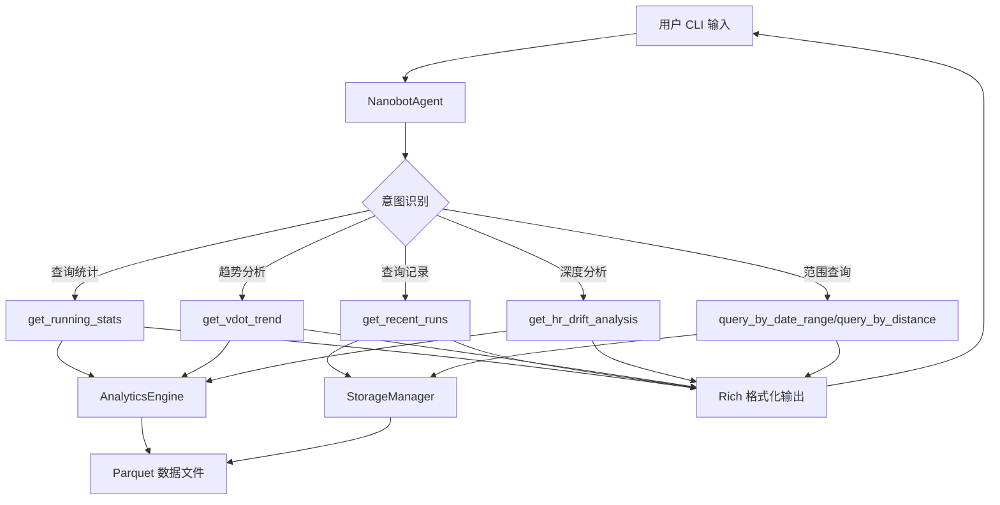
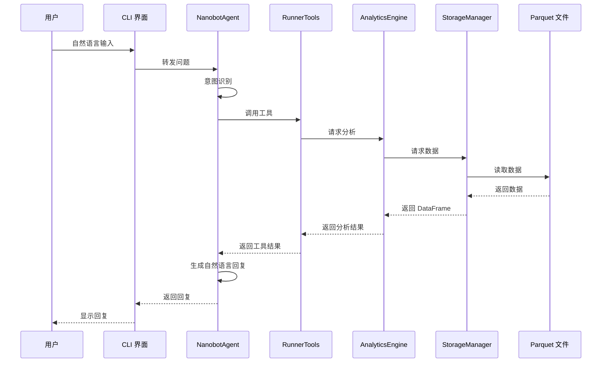
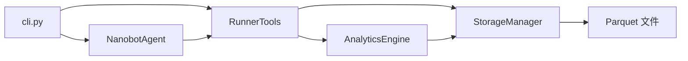

# 迭代需求规格说明书 v0.2.0

## 📋 文档信息

| 项目 | 内容 |
|------|------|
| **版本号** | v0.2.0 |
| **迭代主题** | Agent 自然语言交互功能集成 |
| **优先级** | P0 - 核心功能 |
| **依赖底座** | nanobot-ai >= 0.1.4 |
| **文档状态** | 待评审 |
| **创建日期** | 2026-03-05 |

---

## 1. 迭代概述

### 1.1 迭代目标
实现基于 nanobot-ai 底座的**完整自然语言交互能力**，使技术型跑者能够通过 CLI 终端以自然语言方式查询、分析跑步数据，获得智能化的训练建议和洞察报告。

### 1.2 核心价值
- **零学习成本**：用户无需记忆命令，直接用自然语言提问
- **深度分析**：Agent 自动调用分析工具，提供专业级数据洞察
- **隐私保护**：所有数据处理在本地完成，符合 NFR-001 要求
- **可扩展性**：基于 nanobot-ai 的工具调用机制，支持后续功能扩展

### 1.3 与原有需求的关系
本迭代实现原需求规格说明书中的：
- **FR-003** CLI 交互模块 - 自然语言交互模式
- **FR-004** 性能要求 - CLI 响应时间 < 1s，查询响应 < 3s
- **FR-005** 计算逻辑 - 通过 Agent 调用分析引擎
- **FR-006** 技术实现 - 基于 Polars 的查询优化

---

## 2. 功能性需求规格

### 2.1 MVP 核心需求（P0）

#### 2.1.1 Agent 交互入口（FR-001）

**需求描述**：
实现 `nanobotrun chat` 命令，启动基于 nanobot-ai 的自然语言交互界面。

**功能规格**：
- **命令格式**：`nanobotrun chat [options]`
- **交互模式**：
  - 启动后进入 REPL（Read-Eval-Print Loop）循环
  - 支持多轮对话，保持上下文记忆
  - 支持退出命令：`exit`、`quit`、`q`
- **界面要求**：
  - 使用 Rich 库提供友好的终端 UI
  - 显示欢迎信息和帮助提示
  - 区分用户输入和 Agent 回复的样式

**验收标准**：
- ✅ 执行 `nanobotrun chat` 后进入交互模式
- ✅ 输入 `exit` 能够正常退出
- ✅ 界面显示欢迎信息和帮助提示
- ✅ 用户输入和 Agent 回复有明显的视觉区分
- ✅ 启动时间 < 1 秒

---

#### 2.1.2 nanobot-ai 底座集成（FR-002）

**需求描述**：
集成 nanobot-ai 作为 Agent 推理引擎，实现自然语言理解和工具调用。

**功能规格**：
- **Agent 初始化**：
  - 使用 `NanobotAgent` 类创建 Agent 实例
  - 配置本地模型（默认使用 nanobot-ai 内置模型）
  - 设置工具集为 `RunnerTools`
- **工具注册**：
  - 将 `TOOL_DESCRIPTIONS` 注册为 Agent 可调用的工具
  - 确保工具参数类型和描述准确
- **上下文管理**：
  - 维护对话历史（默认保留最近 10 轮）
  - 支持上下文相关的追问

**技术实现**：
```python
from nanobot_ai import NanobotAgent
from src.agents.tools import RunnerTools, TOOL_DESCRIPTIONS

agent = NanobotAgent(
    tools=[RunnerTools()],
    tool_descriptions=TOOL_DESCRIPTIONS,
    memory_window=10,
)
```

**验收标准**：
- ✅ Agent 能够正确初始化工具集
- ✅ 工具描述能够被 Agent 正确理解
- ✅ 多轮对话能够保持上下文
- ✅ 无外部网络请求（隐私保护验证）

---

#### 2.1.3 数据查询工具集（FR-003）

**需求描述**：
提供完整的跑步数据查询工具，支持 Agent 调用进行数据分析。

**MVP 工具列表**：

| 工具名称 | 功能描述 | 输入参数 | 返回结果 | 优先级 |
|---------|---------|---------|---------|--------|
| `get_running_stats` | 获取跑步统计数据 | start_date, end_date | 总次数、总距离、平均配速等 | P0 |
| `get_recent_runs` | 获取最近跑步记录 | limit | 最近 N 条跑步记录 | P0 |
| `get_vdot_trend` | 获取 VDOT 趋势 | limit | VDOT 随时间变化趋势 | P0 |
| `get_hr_drift_analysis` | 心率漂移分析 | run_id | 心率漂移拐点和相关性 | P0 |
| `query_by_date_range` | 按日期范围查询 | start_date, end_date | 符合条件的跑步记录 | P0 |
| `query_by_distance` | 按距离范围查询 | min_distance, max_distance | 符合条件的跑步记录 | P0 |

**详细规格**：

**FR-003-1 query_by_date_range**
```python
def query_by_date_range(
    self, 
    start_date: str,  # 格式：YYYY-MM-DD
    end_date: str     # 格式：YYYY-MM-DD
) -> List[Dict[str, Any]]:
    """
    按日期范围查询跑步记录
    
    验收标准：
    - 支持精确日期查询
    - 支持日期范围查询
    - 返回结果按时间倒序排列
    - 百万级数据量下查询响应 < 3 秒
    """
```

**FR-003-2 query_by_distance**
```python
def query_by_distance(
    self,
    min_distance: float,  # 单位：公里
    max_distance: float   # 单位：公里
) -> List[Dict[str, Any]]:
    """
    按距离范围查询跑步记录
    
    验收标准：
    - 支持距离范围查询（如 5-10 公里）
    - 支持单边界查询（如>10 公里）
    - 返回结果包含关键指标（时间、配速、心率）
    """
```

**验收标准**：
- ✅ 所有工具能够被 Agent 正确调用
- ✅ 工具返回数据格式符合预期
- ✅ 查询性能满足 FR-004 要求
- ✅ 错误处理完善（空数据、无效参数等）

---

#### 2.1.4 自然语言理解（FR-004）

**需求描述**：
Agent 能够理解用户的自然语言提问，并正确调用对应的工具。

**核心场景覆盖**：

**场景 1：统计数据查询**
```
用户：我总共跑了多少次？
Agent 行为：调用 get_running_stats()
期望输出：您总共跑了 X 次，总距离 Y 公里...

用户：上个月我跑了多少公里？
Agent 行为：调用 get_running_stats(start_date="2026-02-01", end_date="2026-02-28")
期望输出：上个月您跑了 X 公里...
```

**场景 2：趋势分析**
```
用户：我的跑力值最近有提升吗？
Agent 行为：调用 get_vdot_trend(limit=20)
期望输出：根据最近 20 次跑步，您的 VDOT 从 X 提升到 Y...

用户：展示我最近的跑步记录
Agent 行为：调用 get_recent_runs(limit=10)
期望输出：列出最近 10 次跑步的关键数据
```

**场景 3：深度分析**
```
用户：我上周心率漂移最严重的是哪次跑步？
Agent 行为：调用 get_hr_drift_analysis()
期望输出：分析结果显示...

用户：10 公里以上的跑步平均配速是多少？
Agent 行为：调用 query_by_distance(min_distance=10) 并计算平均配速
期望输出：10 公里以上的跑步平均配速为 X'XX"/km
```

**验收标准**：
- ✅ 能够正确理解时间表达（上周、上个月、最近等）
- ✅ 能够正确理解距离表达（10 公里、半马、全马等）
- ✅ 能够正确理解指标表达（跑力值、心率漂移、配速等）
- ✅ 意图识别准确率 >= 90%
- ✅ 工具调用准确率 >= 95%

---

#### 2.1.5 响应生成与格式化（FR-005）

**需求描述**：
Agent 将工具返回的结构化数据转换为自然语言回复，并使用 Rich 格式化输出。

**功能规格**：
- **数据可视化**：
  - 表格展示：使用 Rich Table 展示多条记录
  - 关键指标高亮：使用颜色突出重要数据
  - 趋势图展示：使用文本图表展示趋势
- **语言风格**：
  - 专业且易懂：使用跑步专业术语但提供解释
  - 数据驱动：所有结论基于实际数据
  - 建议性：提供基于数据的训练建议

**输出示例**：
```
┌─────────────────────────────────────────────┐
│ 最近跑步记录（最近 5 次）                     │
├──────────────┬────────┬─────────┬───────────┤
│ 日期         │ 距离   │ 用时    │ 平均心率  │
├──────────────┼────────┼─────────┼───────────┤
│ 2026-03-01   │ 10.5km │ 52'30"  │ 152 bpm   │
│ 2026-02-28   │ 5.2km  │ 25'15"  │ 148 bpm   │
│ 2026-02-25   │ 21.1km │ 1h50'   │ 155 bpm   │
└──────────────┴────────┴─────────┴───────────┘

💡 洞察：您的长距离（>20km）跑步平均心率为 155bpm，
       建议控制在 150bpm 以内以提升有氧耐力。
```

**验收标准**：
- ✅ 数据表格格式正确、对齐
- ✅ 关键指标使用颜色高亮
- ✅ 回复包含数据洞察和建议
- ✅ 无数据时提供友好提示
- ✅ 响应时间 < 2 秒（不含工具调用时间）

---

#### 2.1.6 错误处理与边界情况（FR-006）

**需求描述**：
处理用户输入错误、工具调用失败、数据缺失等异常情况。

**错误场景处理**：

| 错误类型 | 触发条件 | 处理策略 | 用户提示 |
|---------|---------|---------|---------|
| 空数据错误 | 数据库无记录 | 引导用户导入数据 | "暂无数据，请先使用 import 命令导入跑步数据" |
| 参数错误 | 日期格式错误等 | 提示正确格式 | "日期格式应为 YYYY-MM-DD，如 2026-03-01" |
| 工具调用失败 | 工具执行异常 | 捕获异常并降级 | "分析暂时不可用，请稍后重试" |
| 意图不明 | 无法理解用户意图 | 提供澄清问题 | "您是想查询跑步记录还是统计数据？" |
| 超出能力范围 | 不支持的功能 | 明确告知并建议 | "我暂时无法回答这个问题，可以尝试问..." |

**验收标准**：
- ✅ 所有异常场景有对应的错误处理
- ✅ 错误提示友好且具有指导性
- ✅ 无系统崩溃或未捕获异常
- ✅ 错误日志完整记录（便于调试）

---

### 2.2 扩展需求（P1）

#### 2.2.1 飞书集成（FR-007）

**需求描述**：
通过飞书 Webhook 推送 Agent 分析结果。

**功能规格**：
- 支持将分析结果推送到飞书
- 支持定时推送（如每日晨报）
- 支持按需推送（用户触发）

**验收标准**：
- ✅ 能够成功推送消息到飞书
- ✅ 消息格式正确（文本/卡片）
- ✅ 推送成功率 >= 99%

*注：本功能依赖 FR-007 飞书集成，可在 v0.2.1 实现*

---

#### 2.2.2 报告生成（FR-008）

**需求描述**：
生成可视化的跑步分析报告（PDF/HTML）。

**功能规格**：
- 支持生成 PDF 格式报告
- 支持生成 HTML 格式报告
- 报告包含图表和关键指标

**验收标准**：
- ✅ 能够生成 PDF/HTML 报告
- ✅ 报告包含核心指标和图表
- ✅ 报告生成时间 < 10 秒

*注：本功能需要额外的可视化库支持，可在 v0.2.1 实现*

---

## 3. 非功能性需求

### 3.1 性能要求（NFR-001）

| 指标 | 要求 | 测量方法 |
|------|------|---------|
| CLI 启动时间 | < 1 秒 | 从执行命令到显示欢迎界面 |
| 简单查询响应 | < 1 秒 | 如查询总次数 |
| 复杂查询响应 | < 3 秒 | 如心率漂移分析（百万级数据） |
| 多轮对话延迟 | < 2 秒 | 不含模型推理时间 |
| 内存占用 | < 500MB | 峰值内存使用 |

**验收标准**：
- ✅ 所有性能指标通过测试
- ✅ 性能测试在标准硬件环境执行（8GB RAM, SSD）
- ✅ 提供性能基准测试报告

---

### 3.2 数据隐私（NFR-002）

**需求描述**：
严格遵循本地化数据处理原则，确保用户隐私。

**技术要求**：
- 所有数据存储在本地（~/.nanobot-runner/data/）
- 无外部网络请求（除非用户配置飞书推送）
- Agent 推理在本地完成（使用 nanobot-ai 本地模型）

**验收标准**：
- ✅ 网络监控无外部请求（使用 Wireshark 验证）
- ✅ 数据文件加密存储（可选）
- ✅ 提供隐私政策说明文档

---

### 3.3 兼容性（NFR-003）

**支持平台**：
- Windows 10/11 (PowerShell 5.1+)
- macOS 11+ (Bash/Zsh)
- Linux (Ubuntu 20.04+, CentOS 7+)

**验收标准**：
- ✅ 在三个平台上通过所有测试
- ✅ 提供各平台的安装和配置指南
- ✅ 处理平台差异（如路径分隔符、编码）

---

### 3.4 可维护性（NFR-004）

**技术要求**：
- 代码覆盖率 >= 80%
- 类型注解完整率 >= 90%
- 文档完整率 >= 95%

**验收标准**：
- ✅ 单元测试覆盖率报告
- ✅ 类型检查通过（mypy）
- ✅ API 文档自动生成

---

## 4. 数据规模与性能指标

### 4.1 数据规模支持

| 指标 | 要求 | 当前基线 |
|------|------|---------|
| 活动记录数 | 10,000+ 条 | 已支持 |
| Parquet 数据集 | 500MB - 2GB | 已支持 |
| 单文件大小 | < 500MB | 已支持 |
| 年份分片 | 按年分片存储 | 已支持 |

### 4.2 并发能力

**要求**：
- 支持 1 路写入（导入）与 1 路读取（Agent 分析）
- 采用文件锁或写时复制策略避免冲突

**验收标准**：
- ✅ 并发读写测试通过
- ✅ 无数据损坏或丢失
- ✅ 性能下降 < 20%

---

## 5. 核心业务场景覆盖

### 5.1 场景分类

| 场景类别 | 场景数量 | 覆盖率要求 |
|---------|---------|-----------|
| 数据查询 | 10+ | 100% |
| 趋势分析 | 5+ | 100% |
| 深度分析 | 5+ | 100% |
| 错误处理 | 8+ | 100% |

### 5.2 典型场景示例

#### 场景 1：新用户初始化
```
1. 用户执行：nanobotrun chat
2. Agent 检测到空数据库
3. Agent 提示：检测到您还没有导入跑步数据，请使用以下命令导入：
   nanobotrun import /path/to/your/fit/files
4. 用户导入数据后返回对话
5. Agent 确认数据导入成功并提供帮助
```

#### 场景 2：日常训练查询
```
1. 用户：我上周跑了多少次？
2. Agent：调用 get_running_stats(start_date="上周", end_date="本周")
3. Agent：您上周跑了 5 次，总距离 45.6 公里，平均配速 5'30"/km
4. 用户：配速最快的是哪次？
5. Agent：查询并返回配速最快的记录
```

#### 场景 3：体能状态评估
```
1. 用户：我现在的体能状态怎么样？
2. Agent：调用 get_vdot_trend() 和 get_running_stats()
3. Agent：综合分析 VDOT 趋势、训练频率等
4. Agent：您的 VDOT 最近提升了 2 点，建议...
```

---

## 6. 验收标准汇总

### 6.1 MVP 核心需求验收清单

| 编号 | 需求项 | 验收方法 | 优先级 | 状态 |
|------|--------|---------|--------|------|
| FR-001 | Agent 交互入口 | 手动测试 + 自动化测试 | P0 | 待验收 |
| FR-002 | nanobot-ai 集成 | 代码审查 + 功能测试 | P0 | 待验收 |
| FR-003 | 数据查询工具集 | 单元测试 + 集成测试 | P0 | 待验收 |
| FR-004 | 自然语言理解 | 场景测试 + 准确率验证 | P0 | 待验收 |
| FR-005 | 响应生成与格式化 | 手动测试 + UI 审查 | P0 | 待验收 |
| FR-006 | 错误处理 | 异常测试 + 边界测试 | P0 | 待验收 |

### 6.2 性能验收标准

| 测试场景 | 数据规模 | 响应时间要求 | 实测结果 | 状态 |
|---------|---------|-------------|---------|------|
| 启动 CLI | - | < 1s | 待测试 | 待验收 |
| 简单查询 | 1 万条记录 | < 1s | 待测试 | 待验收 |
| 复杂查询 | 10 万条记录 | < 3s | 待测试 | 待验收 |
| 心率漂移分析 | 100 万条记录 | < 3s | 待测试 | 待验收 |

### 6.3 质量验收标准

| 指标 | 要求 | 测量工具 | 状态 |
|------|------|---------|------|
| 单元测试覆盖率 | >= 80% | pytest-cov | 待测试 |
| 类型检查通过率 | 100% | mypy | 待测试 |
| 代码格式化 | 100% | black, isort | 待测试 |
| 安全扫描 | 无高危漏洞 | bandit | 待测试 |
| 意图识别准确率 | >= 90% | 测试集验证 | 待测试 |
| 工具调用准确率 | >= 95% | 测试集验证 | 待测试 |

---

## 7. 技术架构设计

### 7.1 系统架构图



### 7.2 数据流图



### 7.3 组件依赖关系



---

## 8. 实施计划

### 8.1 开发任务分解

| 任务 ID | 任务名称 | 预估工时 | 优先级 | 依赖 |
|--------|---------|---------|--------|------|
| T001 | 实现 Agent 交互入口 | 4h | P0 | - |
| T002 | 集成 nanobot-ai 底座 | 8h | P0 | T001 |
| T003 | 实现数据查询工具集 | 12h | P0 | - |
| T004 | 实现自然语言理解 | 16h | P0 | T002, T003 |
| T005 | 实现响应生成与格式化 | 8h | P0 | T004 |
| T006 | 实现错误处理机制 | 6h | P0 | T004 |
| T007 | 编写单元测试 | 12h | P0 | T001-T006 |
| T008 | 性能优化 | 8h | P1 | T007 |
| T009 | 文档编写 | 6h | P1 | T007 |

**总预估工时**: 80 小时（约 10 个工作日）

### 8.2 里程碑

| 里程碑 | 时间节点 | 交付物 |
|--------|---------|--------|
| M1: Agent 框架搭建 | Day 2 | 可运行的 chat 命令 |
| M2: 工具集实现 | Day 5 | 完整的 RunnerTools |
| M3: 自然语言理解 | Day 8 | 意图识别准确率 >= 85% |
| M4: 完整功能联调 | Day 10 | 所有场景测试通过 |
| M5: 性能优化 | Day 12 | 性能指标达标 |
| M6: 发布准备 | Day 14 | v0.2.0 正式发布 |

---

## 9. 风险评估与应对

### 9.1 技术风险

| 风险项 | 可能性 | 影响程度 | 应对策略 |
|--------|--------|---------|---------|
| nanobot-ai 兼容性问题 | 中 | 高 | 提前进行技术验证，准备备选方案 |
| 性能不达标 | 中 | 高 | 使用 Polars Lazy API 优化，添加缓存 |
| 意图识别准确率低 | 高 | 中 | 提供示例问题引导，持续优化 Prompt |
| 大数据量查询慢 | 中 | 高 | 添加索引，优化查询策略 |

### 9.2 项目风险

| 风险项 | 可能性 | 影响程度 | 应对策略 |
|--------|--------|---------|---------|
| 开发周期延期 | 中 | 中 | 优先保证 MVP，扩展功能延后 |
| 测试覆盖不足 | 高 | 中 | 制定详细的测试计划，自动化测试 |
| 文档不完整 | 中 | 低 | 文档与代码同步开发 |

---

## 10. 附录

### 10.1 术语表

| 术语 | 定义 |
|------|------|
| Agent | 基于 nanobot-ai 的智能代理，负责理解用户意图并调用工具 |
| VDOT | 跑力值，衡量跑步能力的指标 |
| TSS | 训练压力分数（Training Stress Score） |
| ATL | 急性训练负荷（Acute Training Load） |
| CTL | 慢性训练负荷（Chronic Training Load） |
| 心率漂移 | 心率随运动时间逐渐上升的现象 |

### 10.2 参考资料

1. [nanobot-ai 官方文档](https://github.com/nanobot-ai/nanobot-ai)
2. [Polars 文档](https://pola-rs.github.io/polars/)
3. [Apache Parquet 格式规范](https://parquet.apache.org/docs/)
4. [FIT SDK 文档](https://developer.garmin.com/fit/)

### 10.3 变更历史

| 版本 | 日期 | 变更内容 | 作者 |
|------|------|---------|------|
| v0.1 | 2026-03-05 | 初始版本 | DevOps 智能体 |

---

## 11. 评审与验收

### 11.1 评审 Checklist

- [ ] 需求无歧义，描述清晰
- [ ] 覆盖所有核心业务场景
- [ ] 验收标准可量化、可测试
- [ ] 技术方案可行
- [ ] 风险评估充分
- [ ] 开发计划合理

### 11.2 验收流程

1. **开发自测**：开发者完成功能后进行自测
2. **测试验证**：测试工程师执行验收测试
3. **性能测试**：执行性能基准测试
4. **代码审查**：架构师进行代码审查
5. **用户验收**：最终用户进行验收测试
6. **发布审批**：项目经理审批发布

---

**文档状态**: 待评审  
**下次更新**: 评审通过后更新  
**发布版本**: v0.2.0