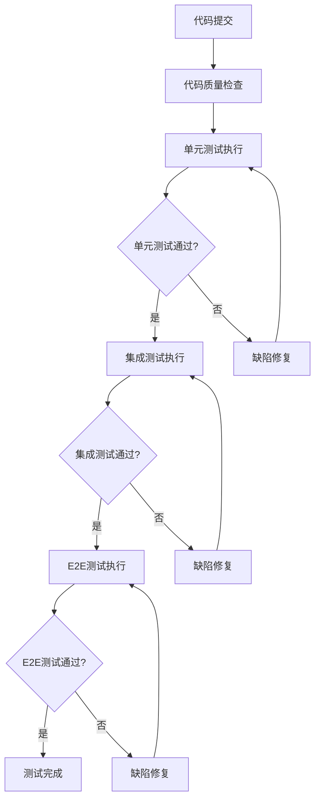

# 测试策略 v0.6.0

## 训练计划制定与飞书日历同步功能

***

| 文档信息     | 内容                                                     |
| -------- | ------------------------------------------------------ |
| **文档版本** | v0.6.0                                                 |
| **创建日期** | 2026-04-02                                             |
| **最后更新** | 2026-04-02                                             |
| **文档状态** | 评审版                                                  |
| **维护者**  | 测试工程师智能体                                     |
| **关联需求** | PRD_训练计划制定与飞书日历同步.md (v1.3.0)                       |
| **关联架构** | 训练计划功能架构设计.md (v1.1.0)                             |
| **关联开发** | 交付报告_v0.6.0.md                                     |

***

## 1. 测试概述

### 1.1 测试目标

基于训练计划功能 v0.6.0 版本（MVP核心功能），确保：

1. **功能正确性**：训练计划生成、校验、分析功能符合需求规格
2. **数据一致性**：数据模型、API接口、存储格式保持一致
3. **性能要求**：核心功能响应时间符合预期
4. **安全合规**：硬性规则校验有效，医疗免责声明完整
5. **用户体验**：自然语言交互、错误提示、重试机制可用

### 1.2 测试范围

**本次测试范围**（v0.6.0）：
- ✅ IntentParser（意图解析器）
- ✅ PlanGenerator（训练计划生成器）
- ✅ HardValidator（硬性规则校验器）
- ✅ PlanAnalyzer（计划分析器）

**排除范围**（v0.7.0）：
- ❌ CalendarTool（日历同步工具）
- ❌ PlanManager（计划管理器）
- ❌ NotifyService（通知服务）
- ❌ 飞书API集成

### 1.3 测试类型

| 测试类型 | 测试重点 | 覆盖率要求 | 执行方式 |
|---------|---------|-----------|---------|
| **单元测试** | 核心算法、数据模型、异常处理 | ≥80% | 自动化 |
| **集成测试** | 模块间接口、数据流 | ≥70% | 自动化 |
| **E2E测试** | 完整业务流程 | ≥60% | 自动化 |

***

## 2. 门禁规则

### 2.1 准入规则（测试准入条件）

**代码质量门禁**：
- ✅ 代码格式检查通过（black/isort）
- ✅ 类型检查通过（mypy）
- ✅ 安全扫描通过（bandit）
- ✅ 无已知编译错误

**文档完整性**：
- ✅ 需求规格文档存在且版本匹配
- ✅ 架构设计文档存在且版本匹配
- ✅ API接口文档完整
- ✅ 数据模型定义完整

### 2.2 准出规则（测试通过标准）

**单元测试**：
- ✅ 测试用例通过率 ≥95%
- ✅ 核心模块覆盖率 ≥80%
- ✅ 异常场景覆盖完整
- ✅ Mock使用合理

**集成测试**：
- ✅ 模块间接口测试通过率 100%
- ✅ 数据流验证完整
- ✅ 错误处理机制有效

**E2E测试**：
- ✅ 核心业务流程测试通过率 ≥90%
- ✅ 用户交互场景覆盖完整
- ✅ 性能指标符合要求

**缺陷管理**：
- ✅ 致命/严重缺陷修复率 100%
- ✅ 一般缺陷修复率 ≥90%
- ✅ 缺陷回归测试通过

***

## 3. 测试策略

### 3.1 单元测试策略

#### 3.1.1 IntentParser 单元测试

**测试重点**：
- 自然语言解析准确性
- 斜杠命令解析准确性
- 参数提取完整性
- 异常输入处理

**测试用例设计**：
```python
# 自然语言测试用例
test_parse_natural_language_create_plan()
test_parse_natural_language_query_plan()
test_parse_natural_language_unknown_intent()

# 斜杠命令测试用例
test_parse_slash_command_create_plan()
test_parse_slash_command_sync_calendar()
test_parse_slash_command_invalid_format()

# 参数提取测试用例
test_extract_distance_parameter()
test_extract_date_parameter()
test_extract_time_parameter()

# 异常处理测试用例
test_parse_empty_input()
test_parse_invalid_json()
test_parse_llm_error()
```

**覆盖率目标**：≥85%

#### 3.1.2 PlanGenerator 单元测试

**测试重点**：
- 训练计划生成逻辑
- LLM提示词构建
- 响应解析准确性
- 重试机制有效性

**测试用例设计**：
```python
# 计划生成测试用例
test_generate_plan_success()
test_generate_plan_with_target_time()
test_generate_plan_with_different_types()

# 参数验证测试用例
test_validate_parameters_success()
test_validate_parameters_invalid_distance()
test_validate_parameters_invalid_date()

# LLM调用测试用例
test_call_llm_success()
test_call_llm_timeout()
test_call_llm_retry_success()

# 响应解析测试用例
test_parse_llm_response_success()
test_parse_llm_response_missing_fields()
test_parse_llm_response_invalid_format()
```

**覆盖率目标**：≥80%

#### 3.1.3 HardValidator 单元测试

**测试重点**：
- 6条硬性规则校验准确性
- 违规检测灵敏度
- 建议生成合理性
- 边界条件处理

**测试用例设计**：
```python
# 规则校验测试用例
test_validate_valid_plan()
test_validate_weekly_increase_limit_violation()
test_validate_rest_day_required_violation()
test_validate_long_run_ratio_limit_violation()
test_validate_high_intensity_ratio_limit_violation()
test_validate_single_run_distance_limit_violation()
test_validate_taper_week_reduction_violation()

# 边界条件测试用例
test_validate_boundary_conditions()
test_validate_edge_cases()

# 多规则违规测试用例
test_validate_multiple_violations()
test_validate_no_violations()
```

**覆盖率目标**：≥90%

#### 3.1.4 PlanAnalyzer 单元测试

**测试重点**：
- 4维度分析准确性
- 评分算法合理性
- 建议生成有效性
- 风险警告完整性

**测试用例设计**：
```python
# 维度分析测试用例
test_analyze_valid_plan()
test_analyze_fitness_match()
test_analyze_load_progression()
test_analyze_injury_risk()
test_analyze_goal_achievability()

# 评分算法测试用例
test_calculate_overall_score()
test_generate_recommendations()
test_generate_warnings()

# 异常处理测试用例
test_analyze_empty_plan()
test_analyze_invalid_plan()
```

**覆盖率目标**：≥85%

### 3.2 集成测试策略

#### 3.2.1 模块间集成测试

**测试重点**：
- IntentParser → PlanGenerator 数据流
- PlanGenerator → HardValidator 数据流
- HardValidator → PlanAnalyzer 数据流
- 异常处理链完整性

**测试场景**：
```python
# 完整流程测试
test_complete_workflow_success()
test_complete_workflow_with_validation_failure()
test_complete_workflow_with_analysis_warnings()

# 数据一致性测试
test_data_model_consistency()
test_api_interface_consistency()

# 错误传播测试
test_error_propagation_intent_parser()
test_error_propagation_plan_generator()
test_error_propagation_hard_validator()
```

**覆盖率目标**：≥70%

### 3.3 E2E测试策略

#### 3.3.1 核心业务流程测试

**测试重点**：
- 用户意图识别到计划生成完整流程
- 计划校验和分析结果展示
- 错误处理和用户提示

**测试场景**：
```python
# 正常流程测试
test_e2e_create_training_plan_success()
test_e2e_create_training_plan_with_analysis()

# 异常流程测试
test_e2e_create_invalid_plan_rejected()
test_e2e_llm_failure_recovery()

# 性能测试
test_e2e_response_time_acceptable()
test_e2e_concurrent_requests()
```

**覆盖率目标**：≥60%

***

## 4. 测试环境

### 4.1 测试环境配置

| 环境类型 | 配置要求 | 数据准备 | 测试工具 |
|---------|---------|---------|---------|
| **单元测试** | 本地开发环境 | Mock数据 | pytest, coverage |
| **集成测试** | 测试服务器 | 测试数据集 | pytest, requests |
| **E2E测试** | 预发布环境 | 生产级数据 | Playwright, Selenium |

### 4.2 测试数据管理

**测试数据分类**：
- **Mock数据**：单元测试使用，模拟外部依赖
- **测试数据集**：集成测试使用，覆盖各种场景
- **生产数据**：E2E测试使用，真实用户数据（脱敏）

**数据准备策略**：
- 使用 `test_utils.py` 创建测试数据
- 确保数据模型一致性
- 支持数据重置和清理

***

## 5. 测试执行计划

### 5.1 测试阶段划分

| 阶段 | 时间安排 | 测试类型 | 负责人 | 验收标准 |
|------|---------|---------|--------|---------|
| **单元测试** | Day 1-2 | 自动化 | 开发工程师 | 覆盖率≥80% |
| **集成测试** | Day 3 | 自动化 | 测试工程师 | 接口通过率100% |
| **E2E测试** | Day 4 | 自动化 | 测试工程师 | 业务流程通过率≥90% |
| **回归测试** | Day 5 | 自动化 | 测试工程师 | 缺陷修复验证 |

### 5.2 测试执行流程



***

## 6. 缺陷管理

### 6.1 缺陷分类标准

| 严重等级 | 定义 | 修复优先级 | 验收标准 |
|---------|------|-----------|---------|
| **致命** | 系统崩溃、数据丢失、核心功能不可用 | P0 | 立即修复 |
| **严重** | 核心功能异常、影响主流程使用 | P1 | 24小时内修复 |
| **一般** | 非核心功能异常、不影响主流程 | P2 | 48小时内修复 |
| **优化** | 体验问题、规范问题、不影响功能 | P3 | 下一迭代修复 |

### 6.2 缺陷跟踪流程

1. **缺陷发现**：测试执行中发现缺陷
2. **缺陷记录**：记录到缺陷管理系统
3. **缺陷分配**：分配给对应开发工程师
4. **缺陷修复**：开发工程师修复缺陷
5. **缺陷验证**：测试工程师验证修复
6. **缺陷关闭**：缺陷修复验证通过后关闭

***

## 7. 测试报告

### 7.1 测试报告内容

**测试执行报告**：
- 测试用例执行情况
- 缺陷统计和分析
- 测试覆盖率报告
- 性能测试结果

**质量评估报告**：
- 功能质量评估
- 代码质量评估
- 用户体验评估
- 上线风险评估

### 7.2 报告输出格式

| 报告类型 | 输出格式 | 存储位置 | 更新频率 |
|---------|---------|---------|---------|
| **测试执行报告** | Markdown | `/docs/test/reports/` | 每次测试执行后 |
| **质量评估报告** | Markdown | `/docs/test/reports/` | 版本发布前 |
| **缺陷统计报告** | Markdown | `/docs/test/reports/` | 每周 |

***

## 8. 风险控制

### 8.1 测试风险识别

| 风险类型 | 风险描述 | 影响程度 | 应对措施 |
|---------|---------|---------|---------|
| **测试环境风险** | 测试环境不稳定 | 高 | 环境监控、备份恢复 |
| **测试数据风险** | 测试数据不完整 | 中 | 数据验证、数据生成工具 |
| **测试工具风险** | 测试工具故障 | 中 | 工具备份、手动测试 |
| **人员风险** | 测试人员不足 | 低 | 知识共享、文档完善 |

### 8.2 风险应对策略

1. **预防措施**：定期环境检查、数据备份、工具维护
2. **监控措施**：实时监控测试执行状态
3. **应急措施**：备用测试方案、手动测试流程
4. **改进措施**：测试流程优化、工具升级

***

## 9. 验收标准

### 9.1 功能验收标准

- ✅ 训练计划生成功能符合需求规格
- ✅ 硬性规则校验功能有效
- ✅ 计划分析功能准确
- ✅ 错误处理机制完善
- ✅ 性能指标符合要求

### 9.2 质量验收标准

- ✅ 代码覆盖率符合门禁要求
- ✅ 缺陷修复率符合要求
- ✅ 测试用例通过率符合要求
- ✅ 文档完整性符合要求

### 9.3 上线验收标准

- ✅ 所有致命/严重缺陷已修复
- ✅ 测试报告评审通过
- ✅ 质量评估报告评审通过
- ✅ 上线风险评估可接受

***

## 10. 附录

### 10.1 测试工具配置

**pytest配置** (`pytest.ini`):
```ini
[tool:pytest]
testpaths = tests
python_files = test_*.py
python_classes = Test*
python_functions = test_*
addopts = -v --strict-markers --strict-config
markers =
    unit: 单元测试
    integration: 集成测试
    e2e: 端到端测试
    slow: 慢速测试
```

**覆盖率配置** (`.coveragerc`):
```ini
[run]
source = src
omit = 
    */tests/*
    */__pycache__/*
    */venv/*

[report]
exclude_lines =
    pragma: no cover
    def __repr__
    if self.debug
    if settings.DEBUG
    raise AssertionError
    raise NotImplementedError
    if 0:
    if __name__ == .__main__.:
```

### 10.2 测试数据模板

**用户上下文测试数据**：
```python
from tests.unit.core.plan.test_utils import create_test_user_context

user_context = create_test_user_context()
```

**训练计划测试数据**：
```python
from tests.unit.core.plan.test_utils import create_test_training_plan

plan = create_test_training_plan(
    plan_id="test_plan",
    goal_distance_km=21.0975,
    goal_date="2026-05-01",
)
```

---

**文档维护者**: 测试工程师智能体  
**创建时间**: 2026-04-02  
**审核状态**: 待审核  
**下一步**: 执行测试执行