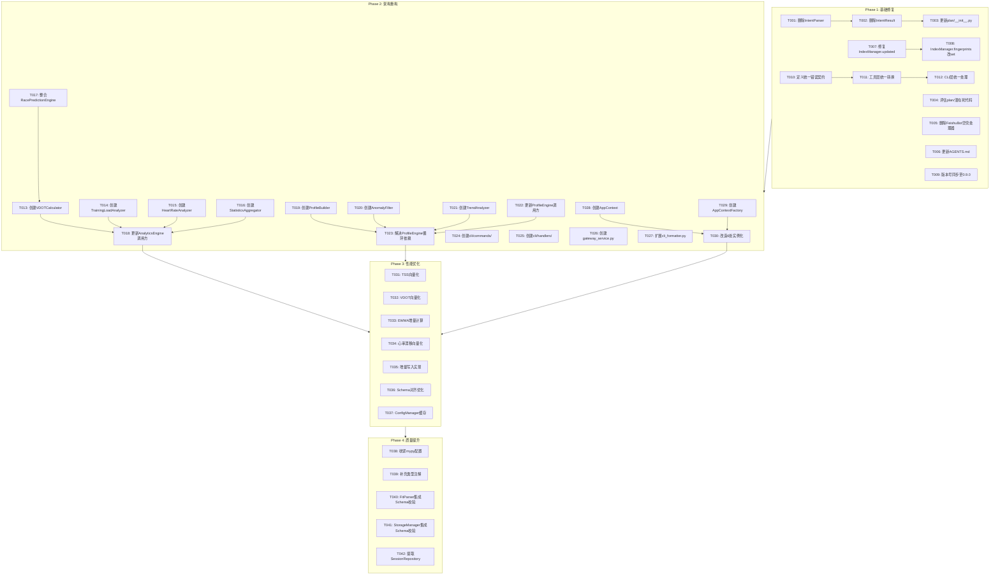

# Nanobot Runner v0.9.0 开发任务清单

> **文档版本**: v1.0.0  
> **制定日期**: 2026-04-08  
> **制定角色**: 架构师智能体  
> **参考文档**: v0.9.0重构规划方案.md

---

## 一、任务概览

| 统计项 | 数量 |
|--------|------|
| 任务总数 | 42 |
| P0 任务 | 15 |
| P1 任务 | 20 |
| P2 任务 | 7 |
| 总工作量 | 186 小时 |
| 预计周期 | 9 周 |

---

## 二、任务依赖关系图

---

## 三、任务详细清单

### Phase 1: 基础修复（第1-2周）

#### Sprint 1.1: 死代码清理

| 任务ID | 任务名称 | 优先级 | 依赖 | 工作量 | 验收标准 | 交付物 |
|--------|---------|--------|------|--------|---------|--------|
| T001 | 删除IntentParser | P0 | 无 | 2h | 无引用报错，CI通过 | 删除文件列表 |
| T002 | 删除IntentResult | P0 | T001 | 1h | 无引用报错，CI通过 | 修改后的models.py |
| T003 | 更新plan/__init__.py | P0 | T002 | 0.5h | 导入检查通过 | 修改后的__init__.py |
| T004 | 评估plan/潜在死代码 | P1 | T003 | 4h | 明确处置方案 | 评估报告 |
| T005 | 删除FeishuBot空壳处理器 | P0 | 无 | 2h | 飞书命令走AgentLoop | 修改后的feishu.py |
| T006 | 更新AGENTS.md | P1 | T001,T005 | 1h | 文档一致性检查 | 更新后的AGENTS.md |

#### Sprint 1.2: Bug修复

| 任务ID | 任务名称 | 优先级 | 依赖 | 工作量 | 验收标准 | 交付物 |
|--------|---------|--------|------|--------|---------|--------|
| T007 | 修复IndexManager.updated | P0 | 无 | 1h | 单元测试通过，时间戳正确 | 修复代码 |
| T008 | IndexManager.fingerprints改set | P1 | T007 | 2h | 性能测试通过，O(1)查找 | 修改代码 |
| T009 | 版本号同步至0.9.0 | P0 | 无 | 0.5h | CI检查通过 | 同步代码 |

#### Sprint 1.3: 错误契约统一

| 任务ID | 任务名称 | 优先级 | 依赖 | 工作量 | 验收标准 | 交付物 |
|--------|---------|--------|------|--------|---------|--------|
| T010 | 定义统一错误契约 | P0 | 无 | 4h | 异常继承体系完整 | exceptions.py扩展 |
| T011 | 工具层统一转换 | P0 | T010 | 4h | 所有工具返回一致格式 | decorators.py更新 |
| T012 | CLI层统一处理 | P1 | T011 | 3h | 用户友好错误提示 | cli.py修改 |

---

### Phase 2: 架构重构（第3-6周）

#### Sprint 2.1: AnalyticsEngine拆分

| 任务ID | 任务名称 | 优先级 | 依赖 | 工作量 | 验收标准 | 交付物 |
|--------|---------|--------|------|--------|---------|--------|
| T013 | 创建VDOTCalculator | P0 | 无 | 8h | 单元测试覆盖率≥85% | vdot_calculator.py |
| T014 | 创建TrainingLoadAnalyzer | P0 | 无 | 8h | 单元测试覆盖率≥85% | training_load_analyzer.py |
| T015 | 创建HeartRateAnalyzer | P0 | 无 | 6h | 单元测试覆盖率≥80% | heart_rate_analyzer.py |
| T016 | 创建StatisticsAggregator | P0 | 无 | 6h | 单元测试覆盖率≥80% | statistics_aggregator.py |
| T017 | 整合RacePredictionEngine | P1 | T013 | 4h | 功能不变，测试通过 | 合并后的vdot_calculator.py |
| T018 | 更新AnalyticsEngine调用方 | P0 | T013,T014,T015,T016 | 6h | 集成测试通过 | 修改后的调用代码 |

#### Sprint 2.2: ProfileEngine拆分

| 任务ID | 任务名称 | 优先级 | 依赖 | 工作量 | 验收标准 | 交付物 |
|--------|---------|--------|------|--------|---------|--------|
| T019 | 创建ProfileBuilder | P0 | 无 | 6h | 单元测试覆盖率≥80% | profile_builder.py |
| T020 | 创建AnomalyFilter | P0 | 无 | 4h | 单元测试覆盖率≥80% | anomaly_filter.py |
| T021 | 创建TrendAnalyzer | P1 | 无 | 4h | 单元测试覆盖率≥80% | trend_analyzer.py |
| T022 | 更新ProfileEngine调用方 | P0 | T019,T020,T021 | 4h | 集成测试通过 | 修改后的调用代码 |
| T023 | 解决ProfileEngine循环依赖 | P0 | T022 | 3h | 无循环导入警告 | 修改后的profile.py |

#### Sprint 2.3: CLI拆分

| 任务ID | 任务名称 | 优先级 | 依赖 | 工作量 | 验收标准 | 交付物 |
|--------|---------|--------|------|--------|---------|--------|
| T024 | 创建cli/commands/ | P1 | 无 | 8h | 命令功能不变 | commands/*.py |
| T025 | 创建cli/handlers/ | P1 | T024 | 4h | 业务逻辑不变 | handlers/*.py |
| T026 | 创建gateway_service.py | P1 | 无 | 6h | 网关功能不变 | gateway_service.py |
| T027 | 扩展cli_formatter.py | P2 | T024 | 3h | UI效果不变 | cli_formatter.py |

#### Sprint 2.4: 依赖注入引入

| 任务ID | 任务名称 | 优先级 | 依赖 | 工作量 | 验收标准 | 交付物 |
|--------|---------|--------|------|--------|---------|--------|
| T028 | 创建AppContext | P0 | T018,T023 | 2h | 类型完整 | context.py |
| T029 | 创建AppContextFactory | P0 | T028 | 2h | 可测试 | context.py |
| T030 | 改造6处实例化 | P0 | T029 | 8h | 集成测试通过 | 全局修改 |

---

### Phase 3: 性能优化（第7-8周）

#### Sprint 3.1: Polars向量化

| 任务ID | 任务名称 | 优先级 | 依赖 | 工作量 | 验收标准 | 交付物 |
|--------|---------|--------|------|--------|---------|--------|
| T031 | TSS向量化 | P0 | T014 | 6h | 性能提升≥30% | training_load_analyzer.py |
| T032 | VDOT向量化 | P0 | T013 | 4h | 性能提升≥30% | vdot_calculator.py |
| T033 | EWMA增量计算 | P1 | T031 | 6h | 性能提升≥50% | training_load_analyzer.py |
| T034 | 心率漂移向量化 | P1 | T015 | 4h | 性能提升≥30% | heart_rate_analyzer.py |

#### Sprint 3.2: 存储优化

| 任务ID | 任务名称 | 优先级 | 依赖 | 工作量 | 验收标准 | 交付物 |
|--------|---------|--------|------|--------|---------|--------|
| T035 | 增量写入实现 | P0 | 无 | 6h | 导入性能提升≥50% | storage.py修改 |
| T036 | Schema对齐优化 | P1 | T035 | 4h | 对齐性能提升≥30% | storage.py修改 |

#### Sprint 3.3: 配置缓存

| 任务ID | 任务名称 | 优先级 | 依赖 | 工作量 | 验收标准 | 交付物 |
|--------|---------|--------|------|--------|---------|--------|
| T037 | ConfigManager缓存 | P1 | 无 | 4h | 配置读取性能提升≥80% | config.py修改 |

---

### Phase 4: 质量提升（第9周）

#### Sprint 4.1: 类型安全

| 任务ID | 任务名称 | 优先级 | 依赖 | 工作量 | 验收标准 | 交付物 |
|--------|---------|--------|------|--------|---------|--------|
| T038 | 收紧mypy配置 | P1 | T030 | 4h | 核心模块零警告 | pyproject.toml |
| T039 | 补充类型注解 | P1 | T038 | 8h | 核心模块覆盖率≥80% | 全局修改 |

#### Sprint 4.2: Schema强制校验

| 任务ID | 任务名称 | 优先级 | 依赖 | 工作量 | 验收标准 | 交付物 |
|--------|---------|--------|------|--------|---------|--------|
| T040 | FitParser集成Schema校验 | P1 | 无 | 3h | 无效数据拒绝 | parser.py修改 |
| T041 | StorageManager集成Schema校验 | P1 | T040 | 3h | Schema一致性 | storage.py修改 |

#### Sprint 4.3: 重复逻辑提取

| 任务ID | 任务名称 | 优先级 | 依赖 | 工作量 | 验收标准 | 交付物 |
|--------|---------|--------|------|--------|---------|--------|
| T042 | 提取SessionRepository | P2 | T016 | 4h | 重复代码消除 | session_repository.py |

---

## 四、迭代计划

### 迭代周期定义

| 迭代 | 周期 | 任务范围 | 工作量 |
|------|------|---------|--------|
| Sprint 1.1 | 第1周前2天 | T001-T006 | 10.5h |
| Sprint 1.2 | 第1周后3天 | T007-T009 | 3.5h |
| Sprint 1.3 | 第2周 | T010-T012 | 11h |
| Sprint 2.1 | 第3-4周 | T013-T018 | 38h |
| Sprint 2.2 | 第5周前3天 | T019-T023 | 21h |
| Sprint 2.3 | 第5周后2天+第6周前2天 | T024-T027 | 21h |
| Sprint 2.4 | 第6周后3天 | T028-T030 | 12h |
| Sprint 3.1 | 第7周 | T031-T034 | 20h |
| Sprint 3.2 | 第8周前3天 | T035-T036 | 10h |
| Sprint 3.3 | 第8周后2天 | T037 | 4h |
| Sprint 4.1 | 第9周前3天 | T038-T039 | 12h |
| Sprint 4.2 | 第9周第4天 | T040-T041 | 6h |
| Sprint 4.3 | 第9周第5天 | T042 | 4h |

### 里程碑

| 里程碑 | 时间节点 | 验收标准 |
|--------|---------|---------|
| M1: 基础修复完成 | 第2周末 | 死代码清理完成，Bug修复完成，错误契约统一 |
| M2: 架构重构完成 | 第6周末 | 上帝类拆分完成，依赖注入引入完成 |
| M3: 性能优化完成 | 第8周末 | 性能指标达标 |
| M4: v0.9.0发布 | 第9周末 | 所有验收标准通过 |

---

## 五、风险与应对

| 风险 | 影响 | 应对策略 |
|------|------|---------|
| 拆分后接口变更导致调用方大量修改 | 高 | 使用适配器模式保留原接口 |
| 重构过程中引入新Bug | 高 | 测试先行，小步提交 |
| 测试覆盖不足，功能回归 | 高 | 基准测试，集成测试 |
| 时间估算偏差 | 中 | 预留20%缓冲时间 |

---

## 六、验收标准

### 功能验收

- [ ] FIT文件导入功能正常，去重机制有效
- [ ] VDOT、TSS、心率漂移等计算结果正确
- [ ] 所有Agent工具功能正常，返回格式一致
- [ ] 所有CLI命令功能正常，输出格式正确
- [ ] Gateway服务正常，消息收发正常

### 质量验收

- [ ] black、isort检查零警告
- [ ] mypy核心模块零错误
- [ ] 核心模块测试覆盖率≥80%
- [ ] bandit高危漏洞=0
- [ ] 架构文档、API文档同步更新

### 性能验收

- [ ] TSS计算（100次跑步）≤350ms
- [ ] VDOT趋势查询（30天）≤140ms
- [ ] 数据导入（100个文件）≤5s
- [ ] 会话聚合（1000次跑步）≤200ms
- [ ] 配置读取（1000次）≤200ms

---

*文档版本: v1.0.0*  
*制定日期: 2026-04-08*  
*架构师: Kimi-K2.5*
