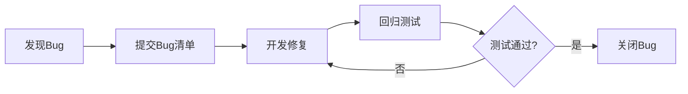

# 测试策略 v0.9.0

## 架构重构与质量提升版本

***

| 文档信息     | 内容                                                     |
| -------- | ------------------------------------------------------ |
| **文档版本** | v0.9.0                                                 |
| **创建日期** | 2026-04-09                                             |
| **最后更新** | 2026-04-09                                             |
| **文档状态** | 评审版                                                  |
| **维护者**  | 测试工程师智能体                                     |
| **关联需求** | PRD_训练计划制定与飞书日历同步.md (v1.3.0)                       |
| **关联架构** | 架构设计说明书.md (v0.9.0)                             |
| **关联优化** | 代码优化报告_v0.9.0.md                                     |

***

## 1. 测试概述

### 1.1 测试目标

基于 v0.9.0 版本（架构重构与质量提升），确保：

1. **架构重构正确性**：上帝类拆分后功能完整、接口兼容
2. **依赖注入有效性**：AppContext/Factory机制正常工作
3. **性能优化达标**：Polars向量化改造、Parquet增量写入性能提升≥15%
4. **质量门禁执行**：mypy配置收紧、Schema强制校验无遗漏
5. **回归测试通过**：核心功能无破坏性变更

### 1.2 测试范围

**本次测试范围**（v0.9.0）：

| 模块 | 测试重点 | 优先级 |
|------|---------|--------|
| **VDOTCalculator** | VDOT计算、趋势分析、比赛预测 | P0 |
| **TrainingLoadAnalyzer** | TSS计算、ATL/CTL/TSB、训练负荷趋势 | P0 |
| **HeartRateAnalyzer** | 心率漂移检测、心率区间分析 | P0 |
| **StatisticsAggregator** | 数据聚合、统计摘要、会话聚合 | P0 |
| **SessionRepository** | Session聚合查询、LazyFrame链式构建 | P0 |
| **AppContext/Factory** | 依赖注入容器、工厂模式 | P0 |
| **ProfileBuilder** | 用户画像构建与更新 | P1 |
| **AnomalyFilter** | 异常数据过滤 | P1 |
| **TrendAnalyzer** | 趋势分析 | P1 |
| **CLI拆分模块** | 命令路由、业务调用、UI渲染 | P1 |

**排除范围**（后续版本）：
- ❌ CalendarTool（日历同步工具）— 已在v0.6.0测试
- ❌ PlanManager（计划管理器）— 已在v0.6.0测试
- ❌ NotifyService（通知服务）— 已在v0.6.0测试

### 1.3 测试类型

| 测试类型 | 测试重点 | 覆盖率要求 | 执行方式 |
|---------|---------|-----------|---------|
| **单元测试** | 核心算法、数据模型、异常处理、依赖注入 | core≥80%, agents≥70%, cli≥60% | 自动化 |
| **集成测试** | 模块间接口、数据流、AppContext集成 | ≥70% | 自动化 |
| **性能测试** | Polars向量化、Parquet增量写入、查询性能 | 性能提升≥15% | 自动化 |
| **回归测试** | 核心功能无破坏性变更 | 100%核心用例通过 | 自动化 |

***

## 2. 门禁规则

### 2.1 准入规则（测试准入条件）

**代码质量门禁**：
- ✅ 代码格式检查通过（black/isort）
- ✅ 类型检查通过（mypy --ignore-missing-imports）
- ✅ 安全扫描通过（bandit）
- ✅ 无已知编译错误
- ✅ 代码评审报告已输出

**文档完整性**：
- ✅ 需求规格文档存在且版本匹配
- ✅ 架构设计文档存在且版本匹配
- ✅ API接口文档完整
- ✅ 数据模型定义完整
- ✅ 代码优化报告已输出

**开发交付物**：
- ✅ 单元测试已编写（开发工程师职责）
- ✅ 本地测试通过（开发工程师职责）
- ✅ 代码已提交并通过CI检查

### 2.2 准出规则（测试通过标准）

**单元测试**：
- ✅ 测试用例通过率 100%
- ✅ 核心模块覆盖率达标：
  - `src/core/` 覆盖率 ≥80%
  - `src/agents/` 覆盖率 ≥70%
  - `src/cli/` 覆盖率 ≥60%
- ✅ 异常场景覆盖完整
- ✅ Mock使用合理
- ✅ 无跳过的测试用例（除非明确标注原因）

**集成测试**：
- ✅ 模块间接口测试通过率 100%
- ✅ AppContext依赖注入测试通过
- ✅ 数据流测试通过
- ✅ 无数据不一致问题

**性能测试**：
- ✅ Polars向量化性能提升 ≥15%
- ✅ Parquet增量写入性能提升 ≥15%
- ✅ 查询响应时间符合预期
- ✅ 无性能退化

**回归测试**：
- ✅ P0级核心用例 100%通过
- ✅ P1级重要用例 ≥95%通过
- ✅ 无致命/严重级Bug
- ✅ 一般级Bug修复率 ≥90%

**质量门禁**：
- ✅ mypy类型检查无新增错误
- ✅ Schema强制校验通过
- ✅ 无硬编码敏感信息
- ✅ 无重复代码（DRY原则）

***

## 3. 覆盖率要求

### 3.1 模块级覆盖率要求

| 模块路径 | 覆盖率要求 | 当前覆盖率 | 状态 |
|---------|-----------|-----------|------|
| `src/core/vdot_calculator.py` | ≥80% | 32% | ⚠️ 待提升 |
| `src/core/training_load_analyzer.py` | ≥80% | 22% | ⚠️ 待提升 |
| `src/core/heart_rate_analyzer.py` | ≥80% | 0% | ⚠️ 待补充 |
| `src/core/statistics_aggregator.py` | ≥80% | 12% | ⚠️ 待提升 |
| `src/core/session_repository.py` | ≥80% | 100% | ✅ 达标 |
| `src/core/analytics.py` | ≥80% | 78% | ⚠️ 待提升 |
| `src/core/storage.py` | ≥80% | 7% | ⚠️ 待提升 |
| `src/core/profile.py` | ≥80% | 17% | ⚠️ 待提升 |
| `src/agents/tools.py` | ≥70% | - | ⚠️ 待统计 |
| `src/cli/` | ≥60% | - | ⚠️ 待统计 |

### 3.2 覆盖率提升策略

**优先级P0模块**（本次必须达标）：
1. `session_repository.py` — 已达标（100%）
2. `analytics.py` — 需提升至80%（当前78%）
3. `vdot_calculator.py` — 需补充测试用例
4. `training_load_analyzer.py` — 需补充测试用例
5. `heart_rate_analyzer.py` — 需补充测试用例

**优先级P1模块**（后续迭代）：
1. `statistics_aggregator.py`
2. `storage.py`
3. `profile.py`

***

## 4. 测试用例清单

### 4.1 单元测试用例

#### 4.1.1 VDOTCalculator 单元测试

| 用例ID | 用例名称 | 测试重点 | 优先级 |
|--------|---------|---------|--------|
| UT-VDOT-001 | calculate_vdot 正常计算 | VDOT计算公式正确性 | P0 |
| UT-VDOT-002 | calculate_vdot 边界值 | 距离=0、时长=0、负值处理 | P0 |
| UT-VDOT-003 | calculate_vdot_batch 向量化 | 批量计算性能 | P0 |
| UT-VDOT-004 | get_vdot_trend 趋势分析 | 趋势数据正确性 | P0 |
| UT-VDOT-005 | vdot_to_time 比赛预测 | 预测时间准确性 | P1 |
| UT-VDOT-006 | 列名自适应 | 不同列名兼容性 | P1 |

#### 4.1.2 TrainingLoadAnalyzer 单元测试

| 用例ID | 用例名称 | 测试重点 | 优先级 |
|--------|---------|---------|--------|
| UT-TL-001 | calculate_tss 正常计算 | TSS计算公式正确性 | P0 |
| UT-TL-002 | calculate_atl ATL计算 | 急性训练负荷计算 | P0 |
| UT-TL-003 | calculate_ctl CTL计算 | 慢性训练负荷计算 | P0 |
| UT-TL-004 | calculate_tsb TSB计算 | 训练压力平衡计算 | P0 |
| UT-TL-005 | get_training_load_trend 趋势分析 | 趋势数据正确性 | P1 |

#### 4.1.3 HeartRateAnalyzer 单元测试

| 用例ID | 用例名称 | 测试重点 | 优先级 |
|--------|---------|---------|--------|
| UT-HR-001 | analyze_hr_drift 心率漂移检测 | 漂移检测算法正确性 | P0 |
| UT-HR-002 | get_hr_zones 心率区间分析 | 区间划分正确性 | P0 |
| UT-HR-003 | estimate_max_hr 最大心率估算 | 估算公式正确性 | P1 |
| UT-HR-004 | 空数据处理 | 空DataFrame处理 | P0 |

#### 4.1.4 SessionRepository 单元测试

| 用例ID | 用例名称 | 测试重点 | 优先级 |
|--------|---------|---------|--------|
| UT-SR-001 | _build_session_lazy LazyFrame链 | 延迟求值正确性 | P0 |
| UT-SR-002 | _add_computed_columns 计算列 | Polars表达式正确性 | P0 |
| UT-SR-003 | get_recent_sessions 查询 | 最近Session查询 | P0 |
| UT-SR-004 | get_sessions_by_date_range 日期过滤 | 日期范围过滤 | P0 |
| UT-SR-005 | get_sessions_by_distance 距离过滤 | 距离范围过滤 | P0 |
| UT-SR-006 | get_session_count 计数 | Session计数 | P1 |
| UT-SR-007 | get_total_distance 总距离 | 总距离计算 | P1 |
| UT-SR-008 | get_total_duration 总时长 | 总时长计算 | P1 |
| UT-SR-009 | 空数据处理 | 空LazyFrame处理 | P0 |

#### 4.1.5 AppContext/Factory 单元测试

| 用例ID | 用例名称 | 测试重点 | 优先级 |
|--------|---------|---------|--------|
| UT-AC-001 | AppContext 创建 | 依赖注入容器创建 | P0 |
| UT-AC-002 | AppContextFactory.create 工厂模式 | 工厂方法正确性 | P0 |
| UT-AC-003 | 依赖注入正确性 | 各模块依赖正确注入 | P0 |
| UT-AC-004 | 配置路径传递 | 配置路径正确传递 | P1 |

### 4.2 集成测试用例

#### 4.2.1 模块间接口测试

| 用例ID | 用例名称 | 测试重点 | 优先级 |
|--------|---------|---------|--------|
| IT-INT-001 | AnalyticsEngine拆分后接口兼容 | 拆分后功能完整 | P0 |
| IT-INT-002 | ProfileEngine拆分后接口兼容 | 拆分后功能完整 | P0 |
| IT-INT-003 | CLI拆分后命令路由 | 命令正确路由 | P0 |
| IT-INT-004 | AppContext集成 | 依赖注入集成正确 | P0 |

#### 4.2.2 数据流测试

| 用例ID | 用例名称 | 测试重点 | 优先级 |
|--------|---------|---------|--------|
| IT-DF-001 | FIT文件导入→分析→存储 | 完整数据流 | P0 |
| IT-DF-002 | 用户画像构建→更新→持久化 | 画像数据流 | P0 |
| IT-DF-003 | 训练计划生成→校验→分析 | 计划数据流 | P0 |

### 4.3 性能测试用例

| 用例ID | 用例名称 | 测试重点 | 优先级 |
|--------|---------|---------|--------|
| PT-001 | Polars向量化性能 | 性能提升≥15% | P0 |
| PT-002 | Parquet增量写入性能 | 性能提升≥15% | P0 |
| PT-003 | LazyFrame查询性能 | 查询响应时间 | P0 |
| PT-004 | Session聚合查询性能 | 聚合查询性能 | P1 |

### 4.4 回归测试用例

| 用例ID | 用例名称 | 测试重点 | 优先级 |
|--------|---------|---------|--------|
| RT-001 | VDOT计算功能回归 | 核心功能无破坏 | P0 |
| RT-002 | TSS计算功能回归 | 核心功能无破坏 | P0 |
| RT-003 | 心率漂移检测回归 | 核心功能无破坏 | P0 |
| RT-004 | 用户画像构建回归 | 核心功能无破坏 | P0 |
| RT-005 | 训练计划生成回归 | 核心功能无破坏 | P0 |
| RT-006 | CLI命令功能回归 | 核心功能无破坏 | P0 |

***

## 5. 测试环境

### 5.1 测试环境配置

| 环境项 | 配置要求 |
|--------|---------|
| **操作系统** | Windows 10/11, macOS 12+ |
| **Python版本** | 3.11+ |
| **依赖管理** | uv |
| **测试框架** | pytest |
| **覆盖率工具** | pytest-cov |
| **Mock工具** | unittest.mock |

### 5.2 测试数据

| 数据类型 | 数据来源 | 数据量 |
|---------|---------|--------|
| **FIT文件** | tests/data/fixtures/ | 10+ 文件 |
| **Parquet数据** | 测试生成 | 1000+ 记录 |
| **配置文件** | tests/data/fixtures/ | 标准配置 |
| **Mock数据** | 动态生成 | 按需生成 |

***

## 6. 测试执行计划

### 6.1 测试阶段

| 阶段 | 测试类型 | 执行时间 | 负责人 |
|------|---------|---------|--------|
| **阶段1** | 单元测试 | 开发完成后 | 开发工程师 |
| **阶段2** | 集成测试 | 单元测试通过后 | 测试工程师 |
| **阶段3** | 性能测试 | 集成测试通过后 | 测试工程师 |
| **阶段4** | 回归测试 | 性能测试通过后 | 测试工程师 |

### 6.2 测试执行命令

```bash
# 单元测试
uv run pytest tests/unit/ -v --cov=src --cov-report=html --cov-report=term

# 集成测试
uv run pytest tests/integration/ -v

# 性能测试
uv run pytest tests/performance/ -v

# 全量测试
uv run pytest tests/ -v --cov=src --cov-report=html

# 静态分析
uv run black --check src/ tests/
uv run isort --check-only src/ tests/
uv run mypy src/ --ignore-missing-imports
```

***

## 7. Bug管理

### 7.1 Bug严重等级

| 等级 | 定义 | 处理时限 |
|------|------|---------|
| **致命** | 阻断核心业务流程，无法继续测试 | 立即修复 |
| **严重** | 核心功能异常，影响主流程使用 | 24小时内修复 |
| **一般** | 非核心功能异常，不影响主流程 | 3天内修复 |
| **优化** | 体验/规范类问题，不影响功能使用 | 下个版本修复 |

### 7.2 Bug跟踪流程



***

## 8. 测试交付物

### 8.1 测试文档

| 文档名称 | 路径 | 状态 |
|---------|------|------|
| 测试策略文档 | `/docs/test/strategy_v0.9.0.md` | ✅ 已输出 |
| 测试用例清单 | `/tests/cases/全量测试用例清单.md` | ⚠️ 待更新 |
| 测试报告 | `/docs/test/reports/测试报告_v0.9.0.md` | ⚠️ 待输出 |
| Bug清单 | `/docs/test/reports/Bug清单_v0.9.0.md` | ⚠️ 待输出 |

### 8.2 测试数据

| 数据名称 | 路径 | 状态 |
|---------|------|------|
| 测试FIT文件 | `/tests/data/fixtures/` | ✅ 已存在 |
| 测试配置文件 | `/tests/data/fixtures/` | ✅ 已存在 |
| 性能基准数据 | `/tests/data/validation/` | ✅ 已存在 |

***

## 9. 风险评估

### 9.1 测试风险

| 风险项 | 风险等级 | 影响 | 规避方案 |
|--------|---------|------|---------|
| 覆盖率不达标 | 中 | 质量门禁不通过 | 优先补充P0模块测试 |
| 性能退化 | 中 | 用户体验下降 | 性能基准测试 |
| 回归测试失败 | 高 | 发布延期 | 充分回归测试 |
| 测试数据不足 | 低 | 测试覆盖不全 | 动态生成测试数据 |

### 9.2 质量风险

| 风险项 | 风险等级 | 影响 | 规避方案 |
|--------|---------|------|---------|
| 架构重构引入Bug | 高 | 功能异常 | 充分单元测试+集成测试 |
| 依赖注入失效 | 中 | 模块无法初始化 | AppContext单元测试 |
| 性能优化不达标 | 中 | 性能退化 | 性能基准测试 |

***

## 10. 附录

### 10.1 测试用例统计

| 测试类型 | 用例数量 | P0用例 | P1用例 |
|---------|---------|--------|--------|
| 单元测试 | 40+ | 25+ | 15+ |
| 集成测试 | 10+ | 6+ | 4+ |
| 性能测试 | 4 | 3 | 1 |
| 回归测试 | 6 | 6 | 0 |
| **合计** | **60+** | **40+** | **20+** |

### 10.2 覆盖率目标

| 模块 | 当前覆盖率 | 目标覆盖率 | 差距 |
|------|-----------|-----------|------|
| `session_repository.py` | 100% | 80% | ✅ 达标 |
| `analytics.py` | 78% | 80% | -2% |
| `vdot_calculator.py` | 32% | 80% | -48% |
| `training_load_analyzer.py` | 22% | 80% | -58% |
| `heart_rate_analyzer.py` | 0% | 80% | -80% |
| `statistics_aggregator.py` | 12% | 80% | -68% |

---

**文档版本**: v0.9.0 | **更新日期**: 2026-04-09
